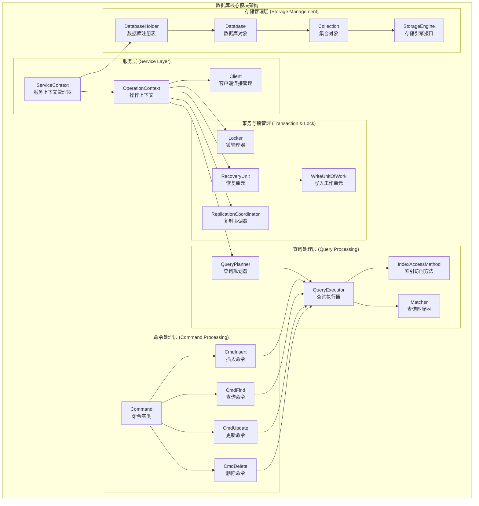
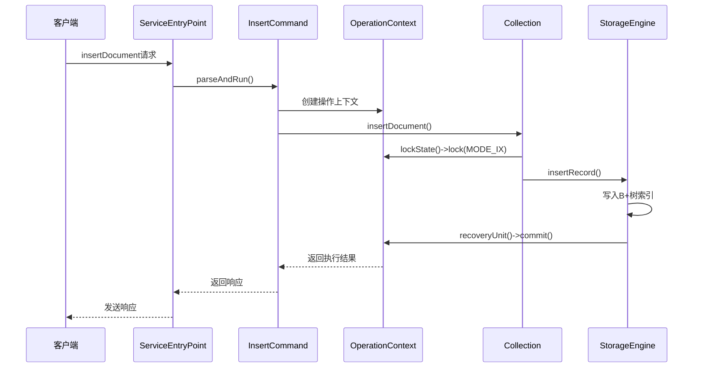
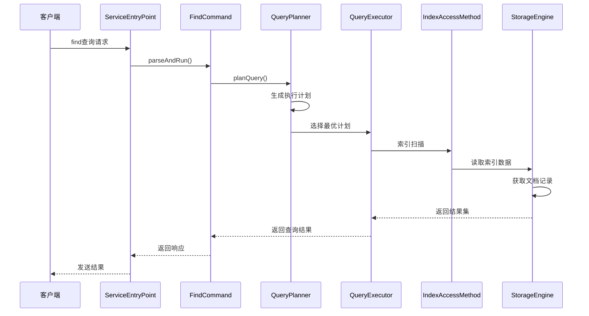
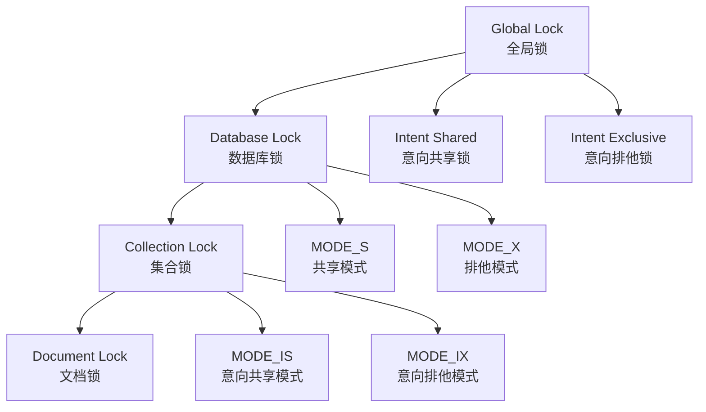

# MongoDB 源码深度剖析 - 数据库核心模块详解

## 模块概述

MongoDB数据库核心模块（`src/mongo/db/`）是整个系统最重要的组成部分，负责数据存储、查询处理、索引管理、事务控制等核心功能。该模块包含超过6800个源文件，是MongoDB功能实现的核心所在。

## 核心架构图



## 核心数据结构深度分析

### 1. ServiceContext - 服务上下文管理器

ServiceContext是MongoDB服务的全局状态管理器，负责管理整个mongod或mongos进程的生命周期。

```cpp
/**
 * ServiceContext - MongoDB服务的全局上下文管理器
 * 
 * 功能特点:
 * - 单例模式，全局唯一
 * - 管理所有服务相关的全局资源
 * - 提供服务注册和查找机制
 * - 支持装饰器模式扩展
 */
class ServiceContext final : public Decorable<ServiceContext> {
private:
    // 存储引擎工厂
    std::unique_ptr<StorageEngineMock> _storageEngineFactory;
    
    // 时钟源管理
    std::unique_ptr<ClockSource> _fastClockSource;
    std::unique_ptr<ClockSource> _preciseClockSource;
    
    // 客户端连接管理
    stdx::unordered_map<Client*, std::unique_ptr<Client>> _clients;
    mutable stdx::mutex _clientsMutex;
    
    // 服务入口点
    std::unique_ptr<ServiceEntryPoint> _serviceEntryPoint;
    
    // 传输层管理器
    std::unique_ptr<transport::TransportLayerManager> _transportLayerManager;
    
    // 周期性任务运行器
    std::unique_ptr<PeriodicRunner> _runner;
    
public:
    /**
     * 获取全局ServiceContext实例
     * @return 当前进程的ServiceContext指针
     */
    static ServiceContext* getCurrent();
    
    /**
     * 设置全局ServiceContext实例
     * @param serviceContext 要设置的ServiceContext实例
     */
    static void setCurrent(ServiceContext* serviceContext);
    
    /**
     * 创建新的客户端连接
     * @param desc 客户端描述信息
     * @param session 传输会话
     * @return 新创建的Client指针
     */
    Client* makeClient(std::string desc, transport::SessionHandle session = nullptr);
    
    /**
     * 获取存储引擎
     * @return 存储引擎指针
     */
    StorageEngine* getStorageEngine() const;
    
    /**
     * 设置存储引擎
     * @param engine 存储引擎实例
     */
    void setStorageEngine(std::unique_ptr<StorageEngine> engine);
    
    /**
     * 获取时钟源
     * @return 快速时钟源指针
     */
    ClockSource* getFastClockSource() const;
    
    /**
     * 注册周期性任务
     * @param job 要执行的周期性任务
     */
    void schedulePeriodicJob(PeriodicRunner::PeriodicJob job);
};
```

### 2. OperationContext - 操作上下文

OperationContext是每个数据库操作的执行上下文，包含执行操作所需的所有状态信息。

```cpp
/**
 * OperationContext - 数据库操作执行上下文
 * 
 * 功能特点:
 * - 每个数据库操作都有独立的上下文
 * - 管理锁状态、事务状态、超时设置
 * - 支持操作中断和取消
 * - 提供恢复单元管理
 */
class OperationContext : public Decorable<OperationContext>,
                        public LockerStorageInterface {
private:
    ServiceContext* _service;          // 服务上下文引用
    Client* _client;                   // 关联的客户端
    LogicalSessionId _lsid;           // 逻辑会话ID
    TxnNumber _txnNumber;             // 事务编号
    std::unique_ptr<Locker> _locker;  // 锁管理器
    std::unique_ptr<RecoveryUnit> _recoveryUnit; // 恢复单元
    
    // 操作超时管理
    Date_t _deadline = Date_t::max();
    AtomicWord<bool> _ignoreInterrupts{false};
    
    // 写关注选项
    WriteConcernOptions _writeConcern;
    
public:
    /**
     * 构造函数
     * @param client 关联的客户端
     * @param opId 操作ID
     * @param lsid 逻辑会话ID
     */
    OperationContext(Client* client, 
                    unsigned int opId,
                    boost::optional<LogicalSessionId> lsid);
    
    /**
     * 获取锁状态管理器
     * @return Locker指针，用于管理锁的获取和释放
     */
    Locker* lockState() const {
        return _locker.get();
    }
    
    /**
     * 获取恢复单元
     * @return RecoveryUnit指针，用于事务和恢复管理
     */
    RecoveryUnit* recoveryUnit() const {
        return _recoveryUnit.get();
    }
    
    /**
     * 获取服务上下文
     * @return ServiceContext指针
     */
    ServiceContext* getServiceContext() const {
        return _service;
    }
    
    /**
     * 获取客户端
     * @return Client指针
     */
    Client* getClient() const {
        return _client;
    }
    
    /**
     * 设置操作截止时间
     * @param when 截止时间点
     * @param timeoutError 超时错误码
     */
    void setDeadlineByDate(Date_t when, ErrorCodes::Error timeoutError);
    
    /**
     * 检查操作是否被中断
     * @param interruptCode 中断错误码
     */
    void checkForInterrupt(ErrorCodes::Error interruptCode = ErrorCodes::Interrupted);
    
    /**
     * 检查是否超时
     * @return 如果超时返回超时状态
     */
    Status checkForInterruptNoAssert() noexcept;
    
    /**
     * 获取逻辑会话ID
     * @return 逻辑会话ID的可选值
     */
    const boost::optional<LogicalSessionId>& getLogicalSessionId() const;
    
    /**
     * 设置事务编号
     * @param txnNumber 事务编号
     */
    void setTxnNumber(TxnNumber txnNumber);
    
    /**
     * 获取写关注选项
     * @return 写关注配置
     */
    const WriteConcernOptions& getWriteConcern() const;
};
```

### 3. DatabaseHolder - 数据库注册表

DatabaseHolder管理系统中所有打开的数据库实例，提供数据库的创建、打开、关闭等功能。

```cpp
/**
 * DatabaseHolder - 数据库注册表和管理器
 * 
 * 功能特点:
 * - 管理所有打开的数据库实例
 * - 提供数据库生命周期管理
 * - 支持数据库级别的锁控制
 * - 线程安全的数据库访问
 */
class DatabaseHolder {
public:
    /**
     * 获取DatabaseHolder实例
     * @param opCtx 操作上下文
     * @return DatabaseHolder指针
     */
    static DatabaseHolder* get(OperationContext* opCtx);
    
    /**
     * 获取已打开的数据库实例
     * @param opCtx 操作上下文
     * @param dbName 数据库名称
     * @return 数据库指针，如果不存在返回nullptr
     * 
     * 注意：调用者必须持有数据库级MODE_IS锁
     */
    virtual Database* getDb(OperationContext* opCtx, 
                           const DatabaseName& dbName) const = 0;
    
    /**
     * 检查数据库是否存在
     * @param opCtx 操作上下文
     * @param dbName 数据库名称
     * @return 如果存在返回true
     * 
     * 注意：此方法无需持有数据库锁
     */
    virtual bool dbExists(OperationContext* opCtx, 
                         const DatabaseName& dbName) const = 0;
    
    /**
     * 打开或创建数据库
     * @param opCtx 操作上下文
     * @param dbName 数据库名称
     * @param justCreated 输出参数，指示是否为新创建
     * @return 数据库指针
     * 
     * 注意：调用者必须持有数据库级MODE_IX锁
     */
    virtual Database* openDb(OperationContext* opCtx,
                           const DatabaseName& dbName,
                           bool* justCreated = nullptr) = 0;
    
    /**
     * 物理删除数据库
     * @param opCtx 操作上下文
     * @param db 要删除的数据库
     * 
     * 注意：调用者必须持有数据库级MODE_X锁
     */
    virtual void dropDb(OperationContext* opCtx, Database* db) = 0;
    
    /**
     * 关闭数据库
     * @param opCtx 操作上下文
     * @param db 要关闭的数据库
     * 
     * 注意：调用者必须持有数据库级MODE_X锁
     */
    virtual void close(OperationContext* opCtx, Database* db) = 0;
    
    /**
     * 获取所有数据库名称
     * @return 数据库名称列表
     */
    virtual std::vector<DatabaseName> getNames() = 0;
};
```

## 主要API调用链路分析

### 1. 文档插入操作链路



**插入操作关键函数源码分析:**

```cpp
/**
 * Collection::insertDocument - 文档插入核心实现
 * 
 * @param opCtx 操作上下文
 * @param doc 要插入的BSON文档
 * @param checkRecordId 是否检查记录ID
 * @return 插入操作状态
 */
Status Collection::insertDocument(OperationContext* opCtx,
                                const BSONObj& doc,
                                bool checkRecordId) {
    // 1. 验证文档格式和大小
    if (doc.objsize() > BSONObjMaxUserSize) {
        return Status(ErrorCodes::BadValue, "文档过大");
    }
    
    // 2. 获取写入锁
    AutoGetCollection coll(opCtx, _ns, MODE_IX);
    if (!coll) {
        return Status(ErrorCodes::NamespaceNotFound, "集合不存在");
    }
    
    // 3. 创建写入工作单元
    WriteUnitOfWork wuow(opCtx);
    
    try {
        // 4. 生成记录ID
        RecordId recordId;
        if (checkRecordId && !doc["_id"].eoo()) {
            // 使用文档中的_id字段
            recordId = RecordId(doc["_id"].wrap());
        } else {
            // 自动生成ObjectId
            recordId = RecordId(OID::gen());
        }
        
        // 5. 插入到存储引擎
        StatusWith<RecordId> result = _recordStore->insertRecord(
            opCtx, recordId.getData(), recordId.size(), Timestamp());
        
        if (!result.isOK()) {
            return result.getStatus();
        }
        
        // 6. 更新所有索引
        for (auto&& indexAccessMethod : _indexCatalog->getAllEntries()) {
            Status indexInsertStatus = indexAccessMethod->insert(
                opCtx, doc, result.getValue());
            if (!indexInsertStatus.isOK()) {
                return indexInsertStatus;
            }
        }
        
        // 7. 提交事务
        wuow.commit();
        
        // 8. 触发操作观察者
        _opObserver->onInsert(opCtx, _ns, doc, result.getValue());
        
        return Status::OK();
        
    } catch (const WriteConflictException&) {
        // 写冲突，需要重试
        throw;
    } catch (const DBException& ex) {
        return ex.toStatus();
    }
}
```

### 2. 文档查询操作链路



**查询操作关键函数源码分析:**

```cpp
/**
 * QueryPlanner::plan - 查询规划核心实现
 * 
 * @param query 查询条件
 * @param collectionPtr 集合指针
 * @param indexCatalog 索引目录
 * @return 查询执行计划列表
 */
StatusWith<std::vector<std::unique_ptr<QueryPlan>>> 
QueryPlanner::plan(const CanonicalQuery& query,
                  const Collection* collectionPtr,
                  const IndexCatalog* indexCatalog) {
    
    std::vector<std::unique_ptr<QueryPlan>> plans;
    
    // 1. 分析查询条件
    MatchExpression* root = query.root();
    
    // 2. 枚举可用索引
    std::vector<IndexEntry> indices;
    indexCatalog->getAllEntries(&indices);
    
    // 3. 为每个可用索引生成访问计划
    for (const auto& index : indices) {
        // 检查索引是否适用于查询
        if (indexCompatibleWithQuery(query, index)) {
            auto plan = std::make_unique<QueryPlan>();
            
            // 创建索引扫描节点
            auto ixscan = std::make_unique<IndexScanNode>();
            ixscan->setIndexEntry(index);
            ixscan->bounds = generateIndexBounds(query, index);
            
            plan->root = std::move(ixscan);
            plan->indexFilterApplied = false;
            
            plans.push_back(std::move(plan));
        }
    }
    
    // 4. 如果没有合适的索引，生成集合扫描计划
    if (plans.empty() || alwaysIncludeCollscan()) {
        auto plan = std::make_unique<QueryPlan>();
        auto collScan = std::make_unique<CollectionScanNode>();
        collScan->direction = 1; // 正向扫描
        plan->root = std::move(collScan);
        plans.push_back(std::move(plan));
    }
    
    // 5. 计算每个计划的成本并排序
    for (auto& plan : plans) {
        plan->estimatedCost = estimatePlanCost(*plan, collectionPtr);
    }
    
    std::sort(plans.begin(), plans.end(), 
              [](const auto& a, const auto& b) {
                  return a->estimatedCost < b->estimatedCost;
              });
    
    return std::move(plans);
}

/**
 * QueryExecutor::execute - 查询执行核心实现
 * 
 * @param opCtx 操作上下文
 * @param plan 查询计划
 * @return 查询结果状态
 */
StatusWith<std::unique_ptr<PlanExecutor>> 
QueryExecutor::execute(OperationContext* opCtx,
                      std::unique_ptr<QueryPlan> plan) {
    
    // 1. 创建执行树
    auto execTree = buildExecutionTree(opCtx, std::move(plan));
    if (!execTree.isOK()) {
        return execTree.getStatus();
    }
    
    // 2. 创建计划执行器
    auto executor = std::make_unique<PlanExecutor>(
        opCtx, std::move(execTree.getValue()));
    
    // 3. 设置执行参数
    executor->setYieldPolicy(PlanExecutor::YIELD_AUTO);
    executor->setSaveRecoverStorage(true);
    
    return std::move(executor);
}
```

## 锁管理机制

MongoDB采用多粒度锁系统，支持从全局到文档级别的锁控制：



**锁管理器核心实现:**

```cpp
/**
 * Locker - 锁管理器接口实现
 * 
 * 功能特点:
 * - 支持多粒度锁控制
 * - 实现死锁检测和避免
 * - 提供锁升级和降级
 * - 支持锁超时机制
 */
class LockerImpl : public Locker {
private:
    // 锁资源映射表
    stdx::unordered_map<ResourceId, LockRequest> _requests;
    
    // 锁等待队列
    std::queue<LockRequest> _waitQueue;
    
    // 死锁检测
    DeadlockDetector _deadlockDetector;
    
public:
    /**
     * 获取锁
     * @param opCtx 操作上下文
     * @param resourceId 资源ID
     * @param mode 锁模式
     * @param deadline 超时时间
     * @return 锁结果状态
     */
    LockResult lock(OperationContext* opCtx,
                   ResourceId resourceId,
                   LockMode mode,
                   Date_t deadline = Date_t::max()) override {
        
        // 1. 检查是否已经持有兼容的锁
        auto it = _requests.find(resourceId);
        if (it != _requests.end()) {
            if (isLockModeCompatible(it->second.mode, mode)) {
                // 锁兼容，直接返回
                return LOCK_OK;
            } else if (canLockUpgrade(it->second.mode, mode)) {
                // 可以升级锁
                return upgradeLock(resourceId, mode);
            }
        }
        
        // 2. 尝试立即获取锁
        if (tryLockImmediate(resourceId, mode)) {
            recordLockAcquisition(resourceId, mode);
            return LOCK_OK;
        }
        
        // 3. 需要等待，检查死锁
        if (_deadlockDetector.wouldCauseDeadlock(resourceId, mode)) {
            return LOCK_DEADLOCK;
        }
        
        // 4. 加入等待队列
        LockRequest request;
        request.resourceId = resourceId;
        request.mode = mode;
        request.opCtx = opCtx;
        
        auto waitResult = waitForLock(request, deadline);
        
        if (waitResult == LOCK_OK) {
            recordLockAcquisition(resourceId, mode);
        }
        
        return waitResult;
    }
    
    /**
     * 释放锁
     * @param resourceId 资源ID
     * @return 是否成功释放
     */
    bool unlock(ResourceId resourceId) override {
        auto it = _requests.find(resourceId);
        if (it == _requests.end()) {
            return false; // 未持有该锁
        }
        
        // 1. 从持有列表中移除
        _requests.erase(it);
        
        // 2. 唤醒等待该资源的其他请求
        notifyWaiters(resourceId);
        
        return true;
    }
    
    /**
     * 检查锁兼容性
     * @param held 已持有的锁模式
     * @param requested 请求的锁模式
     * @return 是否兼容
     */
    bool isLockModeCompatible(LockMode held, LockMode requested) const {
        // 锁兼容性矩阵
        static const bool compatibilityMatrix[6][6] = {
            // IS  IX  S   X   SIX
            {true,  true,  true,  false, false}, // IS
            {true,  true,  false, false, false}, // IX  
            {true,  false, true,  false, false}, // S
            {false, false, false, false, false}, // X
            {false, false, false, false, false}  // SIX
        };
        
        return compatibilityMatrix[held][requested];
    }
};
```

## 存储引擎接口

MongoDB支持可插拔的存储引擎架构，默认使用WiredTiger：

```cpp
/**
 * StorageEngine - 存储引擎抽象接口
 * 
 * 定义了所有存储引擎必须实现的核心接口
 * 支持多种存储后端（WiredTiger、InMemory等）
 */
class StorageEngine {
public:
    /**
     * 创建记录存储
     * @param opCtx 操作上下文
     * @param ns 命名空间
     * @param options 存储选项
     * @return 记录存储指针
     */
    virtual std::unique_ptr<RecordStore> 
    getRecordStore(OperationContext* opCtx,
                  const NamespaceString& ns,
                  const CollectionOptions& options) = 0;
    
    /**
     * 创建排序数据接口
     * @param opCtx 操作上下文
     * @param ns 命名空间
     * @param spec 索引规格
     * @return 排序数据接口指针
     */
    virtual std::unique_ptr<SortedDataInterface>
    getSortedDataInterface(OperationContext* opCtx,
                          const NamespaceString& ns,
                          const BSONObj& spec) = 0;
    
    /**
     * 开启检查点
     * 将内存中的数据持久化到磁盘
     */
    virtual void checkpoint() = 0;
    
    /**
     * 获取存储统计信息
     * @return 存储使用统计
     */
    virtual BSONObj getStorageStats() const = 0;
    
    /**
     * 支持的功能检查
     * @return 功能支持位掩码
     */
    virtual int64_t getIdentSize(OperationContext* opCtx, 
                                StringData ident) = 0;
};
```

## 性能优化策略

### 1. 缓存机制
- **计划缓存**: 缓存查询执行计划避免重复规划
- **索引缓存**: 缓存索引B+树节点提升访问性能  
- **文档缓存**: 缓存热点文档减少磁盘IO

### 2. 批量操作优化
- **批量插入**: 减少锁获取开销和事务提交次数
- **批量更新**: 利用索引批量定位和修改文档
- **管道优化**: 聚合管道多阶段并行执行

### 3. 内存管理
- **对象池**: 复用BSON对象和执行计划对象
- **内存映射**: 利用操作系统页缓存机制
- **压缩存储**: 减少内存占用和网络传输

## 实战案例

### 案例1: 高并发写入优化

```javascript
// 问题：单条插入性能差
db.orders.insertOne({
    userId: 12345,
    items: [...],
    total: 299.99,
    createdAt: new Date()
});

// 优化：批量插入
db.orders.insertMany([
    {userId: 12345, items: [...], total: 299.99},
    {userId: 12346, items: [...], total: 399.99},
    // ... 更多文档
], {ordered: false}); // 无序插入提升并发性
```

### 案例2: 复杂查询优化

```javascript
// 问题：全表扫描查询慢
db.products.find({
    category: "electronics",
    price: {$gte: 100, $lte: 500},
    inStock: true
}).sort({rating: -1});

// 优化：创建复合索引
db.products.createIndex({
    category: 1,
    inStock: 1, 
    price: 1,
    rating: -1
});

// 查询自动使用索引，性能显著提升
```

## 监控和调试工具

### 1. 性能分析
```javascript
// 查询执行计划分析
db.collection.find(query).explain("executionStats");

// 当前操作监控
db.currentOp();

// 慢查询日志
db.setProfilingLevel(2, {slowms: 100});
```

### 2. 锁状态监控
```javascript
// 查看当前锁状态
db.runCommand({lockInfo: 1});

// 服务器状态统计
db.runCommand({serverStatus: 1});
```

## 最佳实践总结

1. **索引设计**: 根据查询模式设计复合索引，避免过多单字段索引
2. **文档结构**: 合理设计文档结构，避免嵌套层级过深
3. **批量操作**: 优先使用批量操作减少网络开销和锁竞争
4. **读写分离**: 利用副本集实现读写负载分离
5. **分片策略**: 根据数据访问模式选择合适的分片键
6. **监控告警**: 建立完善的性能监控和告警机制

数据库核心模块是MongoDB系统的基石，理解其内部机制对于系统调优和故障排查至关重要。下一章节我们将深入分析分片系统的实现原理。
