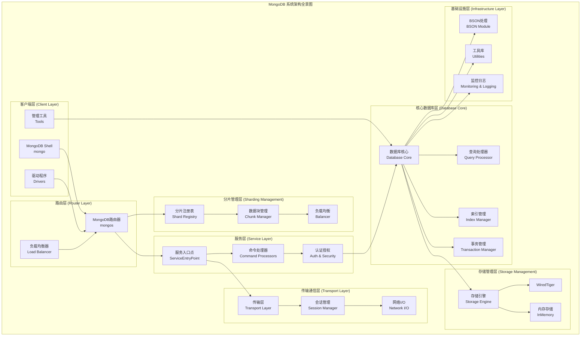
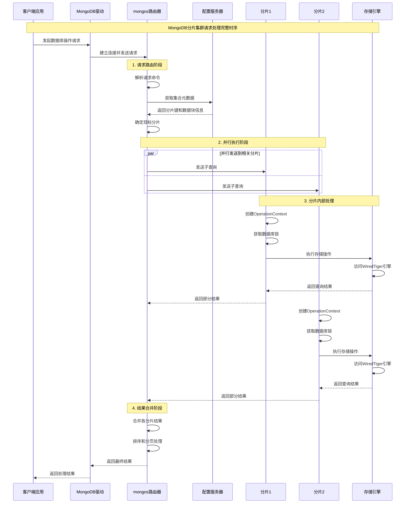
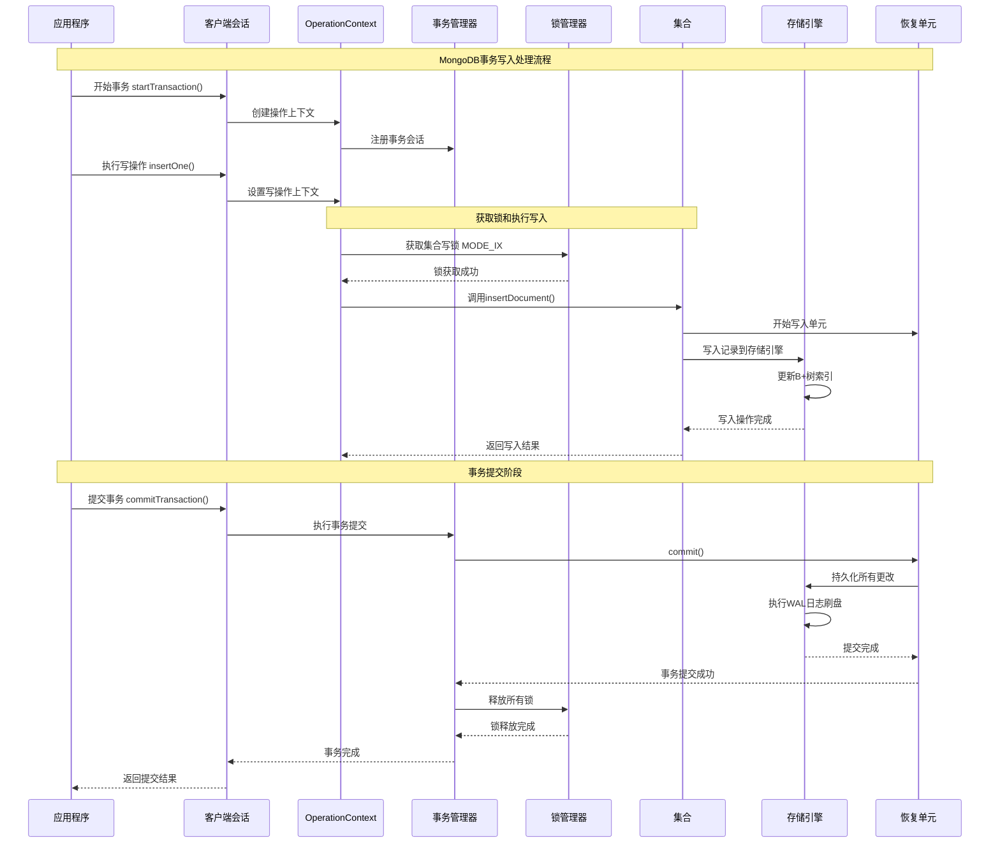
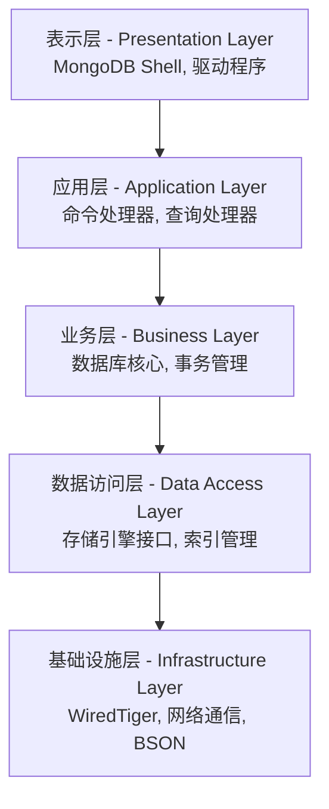
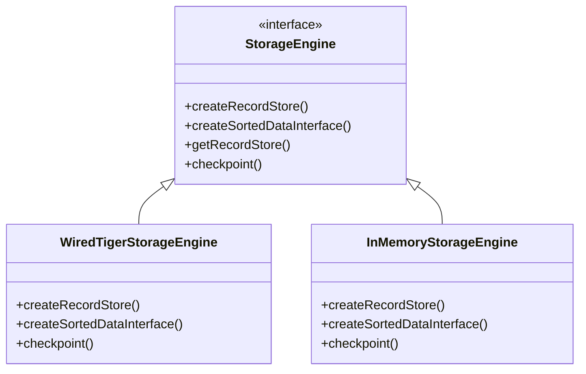
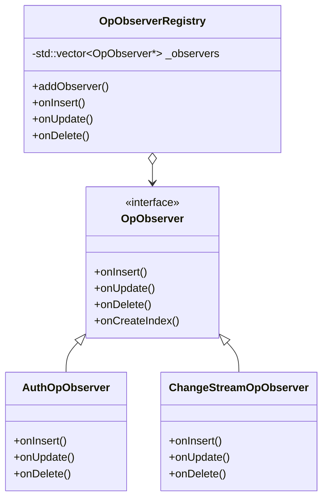
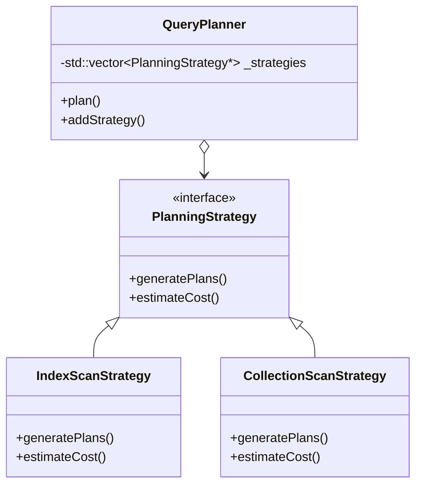

## 系统整体架构总结

通过对MongoDB源码的深入分析，我们可以清晰地看到这是一个精心设计的分布式数据库系统。整个系统采用分层架构，各组件职责明确，接口设计良好，具有很强的扩展性和维护性。

### 核心组件关系概览



## 核心类UML类图

### 1. 数据库核心模块类图

```mermaid
classDiagram
    class ServiceContext {
        -std::unique_ptr~StorageEngine~ _storageEngine
        -std::unique_ptr~TransportLayerManager~ _transportLayer
        -stdx::unordered_map~Client*,std::unique_ptr~Client~~ _clients
        +static ServiceContext* getCurrent()
        +Client* makeClient(string desc, SessionHandle session)
        +StorageEngine* getStorageEngine()
        +TransportLayerManager* getTransportLayer()
    }
    
    class OperationContext {
        -ServiceContext* _service
        -Client* _client
        -std::unique_ptr~Locker~ _locker
        -std::unique_ptr~RecoveryUnit~ _recoveryUnit
        -LogicalSessionId _lsid
        -TxnNumber _txnNumber
        +Locker* lockState()
        +RecoveryUnit* recoveryUnit()
        +ServiceContext* getServiceContext()
        +void setDeadlineByDate(Date_t when)
        +void checkForInterrupt()
    }
    
    class DatabaseHolder {
        <<abstract>>
        +Database* getDb(OperationContext* opCtx, DatabaseName dbName)
        +bool dbExists(OperationContext* opCtx, DatabaseName dbName)
        +Database* openDb(OperationContext* opCtx, DatabaseName dbName)
        +void dropDb(OperationContext* opCtx, Database* db)
        +void close(OperationContext* opCtx, Database* db)
    }
    
    class Database {
        -DatabaseName _name
        -std::shared_ptr~CollectionCatalog~ _catalog
        +CollectionPtr getCollection(OperationContext* opCtx, NamespaceString ns)
        +Status createCollection(OperationContext* opCtx, NamespaceString ns)
        +Status dropCollection(OperationContext* opCtx, NamespaceString ns)
        +std::vector~NamespaceString~ getAllCollectionNames()
    }
    
    class Collection {
        <<interface>>
        -NamespaceString _ns
        -std::unique_ptr~RecordStore~ _recordStore
        -std::unique_ptr~IndexCatalog~ _indexCatalog
        +Status insertDocument(OperationContext* opCtx, BSONObj doc)
        +StatusWith~BSONObj~ findDocument(OperationContext* opCtx, BSONObj query)
        +Status updateDocument(OperationContext* opCtx, BSONObj query, BSONObj update)
        +Status deleteDocument(OperationContext* opCtx, BSONObj query)
    }
    
    ServiceContext ||--o{ OperationContext : creates
    ServiceContext ||--|| DatabaseHolder : contains
    DatabaseHolder ||--o{ Database : manages
    Database ||--o{ Collection : contains
    OperationContext ..> Database : uses
    OperationContext ..> Collection : operates_on
```

### 2. BSON数据结构类图

```mermaid
classDiagram
    class BSONObj {
        -const char* _objdata
        +BSONObj()
        +BSONObj(const char* objdata)
        +BSONElement getField(StringData name)
        +bool hasField(StringData name)
        +int objsize()
        +bool isEmpty()
        +Status validate()
        +int woCompare(const BSONObj& other)
        +std::string jsonString()
        +BSONObj copy()
        +BSONObjIterator begin()
        +BSONObjIterator end()
    }
    
    class BSONElement {
        -const char* _data
        -int _fieldNameSize
        -int _totalSize
        +BSONElement()
        +BSONElement(const char* data)
        +BSONType type()
        +bool eoo()
        +StringData fieldName()
        +const char* value()
        +double Double()
        +StringData String()
        +BSONObj Obj()
        +bool Bool()
        +int Int()
        +long long Long()
        +Date_t Date()
        +bool isNumber()
        +double numberValue()
    }
    
    class BSONObjBuilder {
        -BufBuilder _b
        -int _offset
        -bool _doneCalled
        +BSONObjBuilder(int initsize = 512)
        +BSONObjBuilder& append(StringData name, double value)
        +BSONObjBuilder& append(StringData name, StringData value)
        +BSONObjBuilder& append(StringData name, const BSONObj& value)
        +BSONObjBuilder& append(StringData name, bool value)
        +BSONObjBuilder& appendNull(StringData name)
        +BSONObj obj()
        +BSONObj done()
        +bool isEmpty()
        +void reset()
    }
    
    class BSONType {
        <<enumeration>>
        minKey = -1
        eoo = 0
        numberDouble = 1
        string = 2
        object = 3
        array = 4
        binData = 5
        undefined = 6
        objectid = 7
        boolean = 8
        date = 9
        null = 10
        regex = 11
        numberInt = 16
        timestamp = 17
        numberLong = 18
        numberDecimal = 19
        maxKey = 127
    }
    
    BSONObj ||--o{ BSONElement : contains
    BSONElement --> BSONType : has
    BSONObjBuilder ..> BSONObj : creates
    BSONElement ..> BSONObj : may_contain
```

### 3. 传输层架构类图

```mermaid
classDiagram
    class TransportLayer {
        <<abstract>>
        +Status start()
        +void shutdown(bool skipGracefulShutdown)
        +int listenerPort()
        +Future~SessionHandle~ connect(HostAndPort remote)
        +Future~SessionHandle~ asyncWait()
        +BSONObj getStats()
    }
    
    class TransportLayerASIO {
        -std::shared_ptr~asio::io_context~ _ioContext
        -std::vector~std::thread~ _workerThreads
        -std::vector~std::unique_ptr~Acceptor~~ _acceptors
        -std::unique_ptr~SessionManager~ _sessionManager
        +Status start()
        +void shutdown(bool skipGracefulShutdown)
        +Future~SessionHandle~ connect(HostAndPort remote)
        +Future~SessionHandle~ asyncWait()
    }
    
    class Session {
        <<abstract>>
        -Id _id
        +Id id()
        +TransportLayer* getTransportLayer()
        +const HostAndPort& remote()
        +const HostAndPort& local()
        +Future~Message~ asyncRecvMessage()
        +Future~void~ asyncSendMessage(Message message)
        +void cancelAsyncOperations()
        +Future~void~ asyncWaitForEnd()
        +void end()
        +bool isConnected()
    }
    
    class ASIOSession {
        -asio::ip::tcp::socket _socket
        -std::unique_ptr~asio::ssl::stream~ _sslStream
        -AtomicWord~State~ _state
        -TransportLayerASIO* _transportLayer
        -HostAndPort _remote
        -HostAndPort _local
        +Future~Message~ asyncRecvMessage()
        +Future~void~ asyncSendMessage(Message message)
        +void end()
        +bool isConnected()
    }
    
    class Message {
        -SharedBuffer _buf
        +Message(SharedBuffer buffer)
        +MsgHeader::ConstView header()
        +int size()
        +OpMsgType opCode()
        +int32_t getId()
        +const char* buf()
        +Message createResponse(const BSONObj& responseData)
        +Status validate()
    }
    
    class ServiceEntryPoint {
        <<abstract>>
        +Future~DbResponse~ handleRequest(OperationContext* opCtx, const Message& request)
    }
    
    TransportLayer <|-- TransportLayerASIO
    Session <|-- ASIOSession
    TransportLayerASIO ||--o{ ASIOSession : manages
    ASIOSession ..> Message : handles
    ServiceEntryPoint ..> Message : processes
    TransportLayer ..> ServiceEntryPoint : delegates_to
```

### 4. 分片系统架构类图

```mermaid
classDiagram
    class Grid {
        -std::unique_ptr~ShardingCatalogClient~ _catalogClient
        -std::unique_ptr~CatalogCache~ _catalogCache
        -std::shared_ptr~ShardRegistry~ _shardRegistry
        -std::unique_ptr~ClusterCursorManager~ _cursorManager
        -AtomicWord~bool~ _shardingInitialized
        +static Grid* get(ServiceContext* serviceContext)
        +void init(...)
        +bool isShardingInitialized()
        +ShardingCatalogClient* catalogClient()
        +ShardRegistry* shardRegistry()
        +CatalogCache* catalogCache()
    }
    
    class ShardRegistry {
        -ReadThroughCache~ShardRegistryData~ _data
        -std::unique_ptr~ShardFactory~ _shardFactory
        -executor::TaskExecutor* _executor
        -std::shared_ptr~Shard~ _configShard
        +std::shared_ptr~Shard~ getShardNoReload(OperationContext* opCtx, ShardId shardId)
        +std::vector~std::shared_ptr~Shard~~ getAllShards(OperationContext* opCtx)
        +Status reload(OperationContext* opCtx)
        +StatusWith~std::string~ addShard(OperationContext* opCtx, ShardType shardType)
        +Status removeShard(OperationContext* opCtx, ShardId shardId)
    }
    
    class ChunkManager {
        -NamespaceString _nss
        -ShardKeyPattern _shardKeyPattern
        -std::unique_ptr~CollatorInterface~ _defaultCollator
        -ChunkMap _chunkMap
        -ShardPlacementVersionMap _shardVersions
        -ChunkVersion _version
        +const Chunk& findIntersectingChunk(const BSONObj& shardKey)
        +std::set~ShardId~ getShardIdsForQuery(const BSONObj& query)
        +ChunkVersion getVersion(const ShardId& shardId)
        +Status splitChunk(OperationContext* opCtx, const Chunk& chunk)
        +Status moveChunk(OperationContext* opCtx, const Chunk& chunk, ShardId toShard)
        +BSONObj getStats()
    }
    
    class Shard {
        <<abstract>>
        -ShardId _id
        -ConnectionString _cs
        +ShardId getId()
        +ConnectionString getConnString()
        +StatusWith~Shard::CommandResponse~ runCommand(OperationContext* opCtx, ReadPreferenceSetting readPref, const std::string& dbName, const BSONObj& cmdObj)
        +StatusWith~Shard::QueryResponse~ runQuery(OperationContext* opCtx, const ReadPreferenceSetting& readPref, const NamespaceString& nss, const BSONObj& query)
    }
    
    class ShardRemote {
        -std::shared_ptr~RemoteCommandTargeter~ _targeter
        +StatusWith~Shard::CommandResponse~ runCommand(...)
        +StatusWith~Shard::QueryResponse~ runQuery(...)
    }
    
    class Balancer {
        -std::unique_ptr~BalancerPolicy~ _policy
        -std::unique_ptr~MigrationManager~ _migrationManager
        -AtomicWord~bool~ _enabled
        -AtomicWord~bool~ _inBalancerRound
        +Status doBalance(OperationContext* opCtx)
        +bool shouldBalance(OperationContext* opCtx, const NamespaceString& nss)
        +void enable()
        +void disable()
    }
    
    Grid ||--|| ShardRegistry : contains
    Grid ||--|| ChunkManager : uses
    ShardRegistry ||--o{ Shard : manages
    Shard <|-- ShardRemote
    Grid ||--|| Balancer : contains
    ChunkManager --> Shard : routes_to
    Balancer ..> ChunkManager : balances
```

## 系统时序图

### 客户端请求处理完整流程



### 数据写入事务处理时序图



## 架构设计模式分析

### 1. 分层架构模式 (Layered Architecture)

MongoDB采用清晰的分层架构，每层都有明确的职责：



**优势分析**：
- **关注点分离**: 每层专注于特定功能领域
- **可维护性**: 层间低耦合，便于独立修改
- **可扩展性**: 可以独立扩展某一层的功能
- **可测试性**: 便于进行分层单元测试

### 2. 插件架构模式 (Plugin Architecture)

MongoDB的存储引擎采用插件模式：



**优势分析**：
- **灵活性**: 可以根据需要选择不同的存储引擎
- **扩展性**: 容易添加新的存储引擎实现
- **隔离性**: 存储引擎的变化不影响上层逻辑

### 3. 观察者模式 (Observer Pattern)

MongoDB使用操作观察者模式来处理数据变更事件：



**优势分析**：
- **解耦**: 数据变更和后续处理逻辑解耦
- **扩展性**: 易于添加新的观察者处理特定事件
- **一致性**: 确保所有观察者都能及时收到通知

### 4. 策略模式 (Strategy Pattern)

查询优化器使用策略模式选择执行计划：



## 性能优化总结

### 1. 内存管理优化

- **对象池技术**: 减少频繁的内存分配和释放
- **写时复制**: BSON对象采用COW机制节省内存
- **内存映射**: 利用操作系统虚拟内存管理
- **缓存分层**: 多级缓存提升数据访问性能

### 2. 并发控制优化

- **多粒度锁**: 从全局锁到文档级锁的层次化锁机制
- **意向锁**: 减少锁冲突，提高并发性能
- **无锁数据结构**: 关键路径使用无锁算法
- **锁释放顺序**: 按层次释放锁避免死锁

### 3. 网络通信优化

- **异步I/O**: 基于事件驱动的高性能网络模型
- **连接池**: 复用连接减少建立开销
- **消息压缩**: 减少网络传输量
- **批量操作**: 合并多个操作减少网络往返

### 4. 存储优化

- **LSM树结构**: WiredTiger使用LSM树优化写性能
- **块压缩**: 数据块级别的压缩存储
- **预写日志**: WAL确保数据持久性和一致性
- **检查点机制**: 定期持久化减少恢复时间

## 最佳实践建议

### 1. 应用设计最佳实践

```javascript
// 1. 合理的文档结构设计
const userSchema = {
    _id: ObjectId,
    username: String,
    profile: {
        email: String,
        avatar: String,
        preferences: {
            theme: String,
            language: String
        }
    },
    posts: [ObjectId],  // 引用而非嵌入大数组
    createdAt: Date,
    updatedAt: Date
};

// 2. 有效的查询模式
// 好的查询：利用复合索引
db.users.find({status: "active", age: {$gte: 18}});

// 避免的查询：不能有效使用索引
db.users.find({$where: "this.age > 18"});

// 3. 批量操作优化
// 好的方式：使用批量操作
db.collection.insertMany([...documents], {ordered: false});

// 避免：循环单个操作
documents.forEach(doc => db.collection.insertOne(doc));
```

### 2. 索引设计最佳实践

```javascript
// 1. 复合索引顺序优化
// ESR规则：Equality -> Sort -> Range
db.orders.createIndex({
    customerId: 1,    // Equality
    createdAt: -1,    // Sort
    amount: 1         // Range
});

// 2. 部分索引减少存储开销
db.orders.createIndex(
    {customerId: 1, status: 1},
    {partialFilterExpression: {status: {$ne: "deleted"}}}
);

// 3. 稀疏索引处理可选字段
db.users.createIndex(
    {phoneNumber: 1},
    {sparse: true}
);
```

### 3. 分片策略最佳实践

```javascript
// 1. 选择好的分片键
// 好的分片键：高基数、低频率、非单调
sh.shardCollection("myapp.orders", {
    customerId: "hashed"  // 哈希分片确保均匀分布
});

// 避免的分片键：单调递增
sh.shardCollection("myapp.orders", {
    createdAt: 1  // 会导致热点写入
});

// 2. 预分片避免初期热点
for (let i = 0; i < 100; i++) {
    sh.splitAt("myapp.orders", {customerId: NumberLong(i * 1000)});
}
```

### 4. 监控和维护最佳实践

```javascript
// 1. 定期监控性能指标
db.runCommand({serverStatus: 1});
db.runCommand({collStats: "myCollection"});
db.currentOp();

// 2. 分析慢查询
db.setProfilingLevel(2, {slowms: 100});
db.system.profile.find().sort({ts: -1}).limit(10);

// 3. 索引使用分析
db.collection.find({...}).explain("executionStats");
```

## 技术演进趋势

### 1. 云原生架构

- **容器化部署**: Docker和Kubernetes支持
- **微服务架构**: 组件模块化和服务化
- **自动扩缩容**: 基于负载的动态扩展
- **多云支持**: 跨云平台的数据一致性

### 2. 智能化运维

- **自动索引建议**: 基于查询模式的智能索引推荐
- **自适应查询优化**: 机器学习驱动的查询计划优化
- **预测性维护**: 基于历史数据的故障预测
- **自动负载均衡**: 智能的数据分布调整

### 3. 新兴技术集成

- **时序数据支持**: 专门的时间序列数据优化
- **图数据处理**: 图查询和分析能力增强
- **流数据处理**: 实时数据流的处理和分析
- **边缘计算**: 边缘节点的数据同步和处理

## 结语

通过对MongoDB源码的深入剖析，我们可以看到这是一个架构优雅、设计精良的分布式数据库系统。它在保持易用性的同时，提供了强大的性能和扩展能力。理解其内部实现原理，不仅有助于更好地使用MongoDB，也为我们设计高性能分布式系统提供了宝贵的参考。

MongoDB的成功在于其：
- **清晰的架构分层**：各组件职责明确，接口设计良好
- **优雅的设计模式**：合理运用各种设计模式解决复杂问题
- **高性能实现**：在内存管理、并发控制、网络通信等方面的精心优化
- **良好的扩展性**：插件化架构支持功能扩展和定制
- **完善的监控体系**：丰富的度量指标和诊断工具

掌握这些核心技术和设计思想，将有助于我们在实际项目中更好地运用MongoDB，并为构建高性能的分布式系统提供重要指导。
