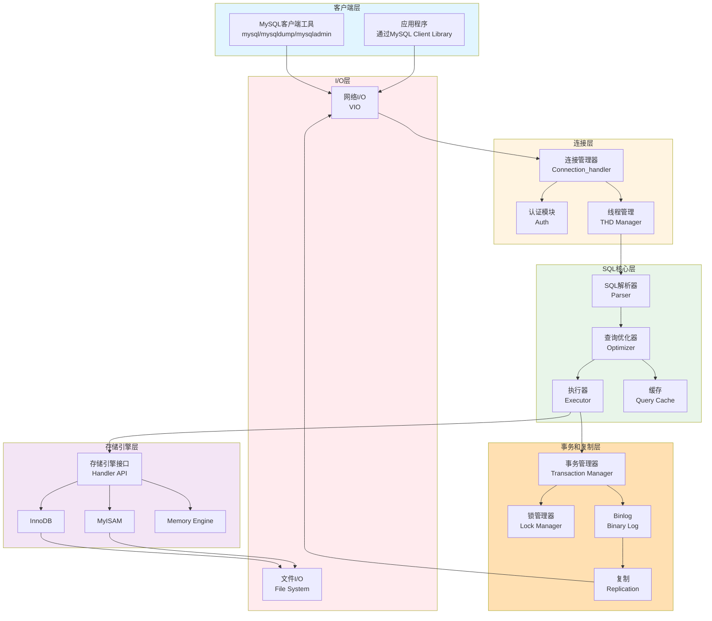
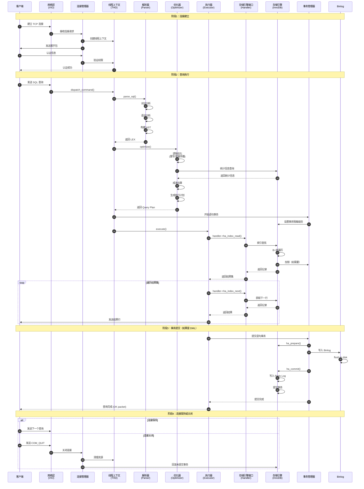
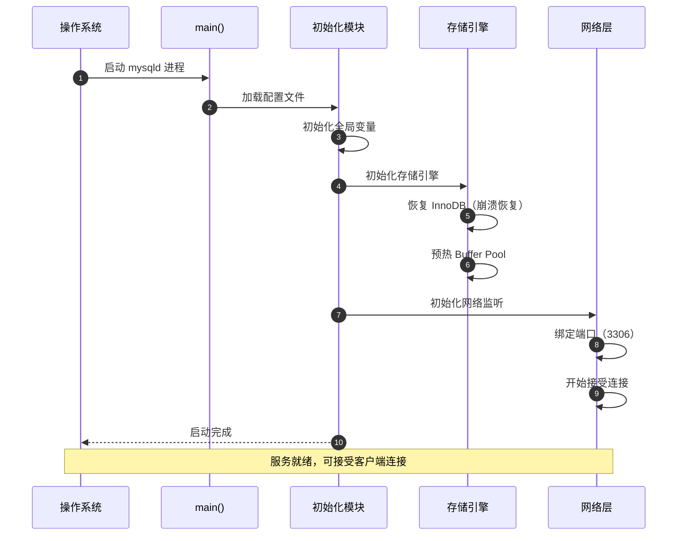
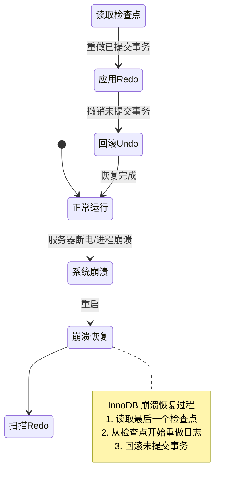

# MySQL Server 源码剖析 - 总览

## 一、项目摘要

### 1.1 项目目标

MySQL Server 是一个开源的关系型数据库管理系统（RDBMS），实现了 SQL 标准，提供高性能、高可靠性的数据存储和查询服务。核心目标包括：

- **数据持久化**：提供 ACID 事务保证的数据存储能力
- **高并发处理**：支持大量并发客户端连接和查询执行
- **可扩展性**：通过插件式存储引擎架构支持不同的存储需求
- **复制能力**：通过 Binlog 和复制机制实现数据同步和高可用

### 1.2 运行环境

- **操作系统**：支持 Linux、Windows、macOS 等主流平台
- **部署形态**：
  - 单机部署：独立服务器模式
  - 主从复制：一主多从架构
  - 组复制：MySQL Group Replication 集群模式
  - 分布式部署：MySQL NDB Cluster

### 1.3 项目边界

**核心功能范围**：
- SQL 解析、优化、执行
- 事务处理和并发控制
- 存储引擎接口和内置存储引擎（InnoDB、MyISAM 等）
- 网络协议和连接管理
- 复制和 Binlog
- 安全认证和权限管理

**非核心功能**：
- MySQL Router（独立路由组件）
- 特定第三方存储引擎
- 外部监控和管理工具

## 二、整体架构

### 2.1 分层架构图



### 2.2 架构说明

#### 2.2.1 图意概述

MySQL Server 采用分层架构设计，从上至下依次为：

1. **客户端层**：包括 MySQL 命令行工具和通过客户端库连接的应用程序
2. **连接层**：处理客户端连接、认证、线程管理
3. **SQL核心层**：负责 SQL 解析、查询优化、执行
4. **存储引擎层**：提供插件式存储引擎接口，支持多种存储引擎
5. **事务和复制层**：管理事务、锁、Binlog 和复制
6. **I/O层**：封装网络 I/O 和文件 I/O 操作

#### 2.2.2 关键接口

**对外接口**：
- **MySQL Protocol**：客户端与服务器通信协议（基于 TCP/IP）
- **C API (libmysqlclient)**：客户端库接口
- **Handler API**：存储引擎接口
- **Plugin API**：插件接口

**内部接口**：
- **Parser → Optimizer**：抽象语法树 (AST) 传递
- **Optimizer → Executor**：查询执行计划 (Query Plan)
- **Executor → Handler**：表记录格式 (TableRecordFormat)
- **Transaction Manager → Storage Engine**：XA 两阶段提交接口

#### 2.2.3 边界条件

**并发限制**：
- 最大连接数：由 `max_connections` 参数控制（默认 151）
- 每个连接占用独立线程（one-thread-per-connection 模式）或线程池
- 表级并发：通过 MDL（Metadata Lock）和表锁控制
- 行级并发：由存储引擎（如 InnoDB）实现

**超时配置**：
- 连接超时：`connect_timeout`（默认 10 秒）
- 等待超时：`wait_timeout`（默认 28800 秒）
- 锁等待超时：`innodb_lock_wait_timeout`（默认 50 秒）

**幂等性**：
- SELECT 操作天然幂等
- INSERT/UPDATE/DELETE 非幂等，需应用层保证
- 复制通过 GTID 实现幂等性

**顺序保证**：
- 单线程 SQL 执行保证顺序性
- Binlog 写入保证顺序性
- 复制可配置并行复制或顺序复制

#### 2.2.4 异常与回退

**连接异常**：
- 连接失败：客户端自动重连或返回错误
- 认证失败：记录日志，拒绝连接
- 连接中断：服务器清理资源，回滚未提交事务

**SQL 执行异常**：
- 语法错误：解析阶段返回错误
- 执行错误：回滚当前语句，保留事务状态
- 超时：根据配置回滚或继续等待

**存储引擎异常**：
- 磁盘满：停止写入，返回错误
- 数据损坏：InnoDB 自动修复或崩溃恢复
- 死锁：自动检测并回滚其中一个事务

**系统崩溃**：
- InnoDB 通过 Redo Log 实现崩溃恢复
- Binlog 可能丢失最后一个事务（除非开启 `sync_binlog=1`）

#### 2.2.5 性能与容量

**性能关键路径**：
- **连接建立**：认证 + 线程创建（约 1-5ms）
- **SQL 解析**：词法分析 + 语法分析（约 0.1-1ms）
- **查询优化**：成本估算 + 计划生成（简单查询约 0.1-1ms，复杂查询可达数秒）
- **执行**：取决于查询类型和数据量
- **存储引擎访问**：B+ 树索引查找（约 0.01-0.1ms/次）

**容量假设**：
- 单表记录数：InnoDB 最大约 64TB（受限于表空间大小）
- 单库表数：理论无限制，实践建议 < 10000
- 单实例数据库数：理论无限制，实践建议 < 100
- QPS：单实例可达 10000-100000+（取决于硬件和查询复杂度）

#### 2.2.6 版本兼容与演进

**主要版本**：
- **MySQL 5.7**：引入 JSON 类型、Generated Column、多源复制
- **MySQL 8.0**：重写优化器、引入 CTE、窗口函数、Data Dictionary 表
- **MySQL 8.4**：持续优化性能，增强 JSON 功能

**兼容性策略**：
- 客户端协议向后兼容
- 存储引擎数据格式需升级工具转换
- SQL 语法大部分向后兼容，新特性通过版本号控制

## 三、全局时序图

### 3.1 完整查询处理流程



### 3.2 时序图说明

#### 3.2.1 图意概述

该时序图展示了一个完整的 SQL 查询从客户端发起到结果返回的全过程，包含连接建立、SQL 解析、查询优化、执行、事务处理四个主要阶段。

#### 3.2.2 关键步骤解释

**连接建立（步骤 1-7）**：
- 客户端通过 TCP 建立网络连接
- 服务器为每个连接分配独立线程（THD）
- 握手认证过程验证用户身份和权限

**SQL 解析（步骤 8-13）**：
- 词法分析将 SQL 字符串转换为 Token 流
- 语法分析根据语法规则构建抽象语法树（AST）
- LEX 结构存储解析结果

**查询优化（步骤 14-19）**：
- 逻辑优化进行等价变换（外连接转内连接、常量传播等）
- 从存储引擎获取统计信息（表行数、索引选择度）
- 基于成本模型选择最优执行计划（索引选择、连接顺序）

**执行与存储引擎交互（步骤 20-30）**：
- 执行器按照执行计划调用 Handler API
- Handler 接口将请求转发给具体存储引擎（如 InnoDB）
- 存储引擎执行实际的数据读取，包括 B+ 树遍历、锁获取
- 结果逐行返回给客户端

**事务提交（步骤 31-38）**：
- 两阶段提交：先 prepare，再写 Binlog，最后 commit
- Binlog 记录变更操作用于复制和恢复
- Redo Log 保证崩溃恢复能力

#### 3.2.3 边界条件

- 连接数达到 `max_connections` 时拒绝新连接
- 查询执行超过 `max_execution_time` 自动终止
- 事务锁等待超过 `innodb_lock_wait_timeout` 返回错误

#### 3.2.4 异常处理

- 解析错误：返回语法错误，不进入优化阶段
- 执行错误：回滚语句事务，保留外层事务
- 死锁：InnoDB 自动检测并回滚代价较小的事务
- 连接断开：自动回滚未提交事务，清理资源

#### 3.2.5 性能要点

- **快速路径优化**：简单查询跳过部分优化阶段
- **预编译语句**：解析和优化结果可复用
- **线程池模式**：避免频繁创建销毁线程
- **组提交**：多个事务批量写入 Binlog 和 Redo Log

#### 3.2.6 可观测性

- Performance Schema：记录各阶段耗时
- Slow Query Log：记录慢查询
- EXPLAIN：展示查询执行计划
- SHOW PROCESSLIST：查看当前执行的查询

## 四、模块交互矩阵

| 调用方 | 被调方 | 交互方式 | 错误语义 | 一致性要求 |
|-------|-------|---------|---------|----------|
| 客户端 | 网络层 (VIO) | 同步 | 连接错误、超时 | 无 |
| 网络层 | 连接管理器 | 同步 | 认证失败、资源不足 | 无 |
| 连接管理器 | SQL核心层 | 同步（单线程） | SQL 错误、执行超时 | 事务一致性 |
| SQL核心层 | 存储引擎 | 同步（Handler API） | 存储引擎错误、死锁 | ACID |
| 执行器 | 事务管理器 | 同步 | 回滚、提交失败 | 两阶段提交 |
| 事务管理器 | Binlog | 同步 | 写入失败 | 顺序性 |
| Binlog | 复制模块 | 异步/半同步 | 网络错误、从库延迟 | 最终一致性 |
| 存储引擎 | 文件 I/O | 同步 | 磁盘满、I/O 错误 | Redo Log 持久化 |
| 复制模块（主） | 复制模块（从） | 异步 | 网络中断、从库故障 | 最终一致性 |

### 4.1 交互说明

**同步交互**：
- 调用方等待被调方返回后继续执行
- 错误直接向上抛出
- 性能受被调方影响

**异步交互**：
- 调用方发送请求后立即返回
- 错误通过回调或轮询机制处理
- 性能解耦，但复杂度增加

**一致性保证**：
- **事务一致性**：通过 ACID 保证单机一致性
- **两阶段提交**：Binlog 和存储引擎之间的一致性
- **最终一致性**：主从复制场景，从库最终同步主库数据

## 五、核心设计与权衡

### 5.1 一致性与性能

#### 5.1.1 两阶段提交 (2PC)

**设计目标**：
- 保证 Binlog 和 InnoDB Redo Log 的一致性
- 确保崩溃恢复后数据不丢失

**实现机制**：
```
1. InnoDB Prepare 阶段：写入 Redo Log，标记为 Prepared
2. 写入 Binlog：记录变更操作
3. InnoDB Commit 阶段：标记 Redo Log 为 Committed
```

**权衡**：
- **一致性收益**：崩溃后可根据 Binlog 和 Redo Log 状态恢复
- **性能代价**：额外的 I/O 操作，延迟约 1-2ms
- **优化方案**：组提交（Group Commit）批量处理多个事务

#### 5.1.2 事务隔离级别

| 隔离级别 | 一致性 | 并发性能 | 适用场景 |
|---------|-------|---------|---------|
| READ UNCOMMITTED | 最弱（脏读） | 最高 | 数据分析（容忍脏读） |
| READ COMMITTED | 中等（不可重复读） | 高 | 高并发 OLTP（Oracle 模式） |
| REPEATABLE READ | 强（InnoDB 默认） | 中等 | 通用 OLTP（MySQL 默认） |
| SERIALIZABLE | 最强 | 最低 | 强一致性需求 |

**权衡考虑**：
- REPEATABLE READ 通过 MVCC 实现高并发，避免大部分锁等待
- 牺牲部分一致性（幻读）换取性能
- InnoDB 通过 Next-Key Lock 解决幻读问题

### 5.2 锁机制

#### 5.2.1 锁类型

**表级锁**：
- **MDL（Metadata Lock）**：保护表结构变更
- **表锁（Table Lock）**：MyISAM 使用，粒度粗

**行级锁（InnoDB）**：
- **Record Lock**：锁定单行记录
- **Gap Lock**：锁定索引区间
- **Next-Key Lock**：Record Lock + Gap Lock

**权衡**：
- 行级锁提高并发，但增加锁管理开销
- Gap Lock 防止幻读，但可能降低插入性能

#### 5.2.2 死锁处理

**检测机制**：
- InnoDB 维护等待图（Wait-for Graph）
- 周期性检测循环依赖

**解决策略**：
- 自动回滚代价较小的事务（影响行数少、持锁时间短）
- 返回错误码 `ER_LOCK_DEADLOCK`，应用层重试

### 5.3 并发控制

#### 5.3.1 MVCC（Multi-Version Concurrency Control）

**实现原理**：
- 每行记录维护多个版本（通过 Undo Log）
- 事务读取符合其可见性规则的版本
- 写操作创建新版本，不阻塞读操作

**优势**：
- 读写不冲突，提高并发性
- 支持一致性非锁定读

**代价**：
- Undo Log 空间开销
- 长事务可能导致大量历史版本积累

#### 5.3.2 自适应哈希索引

**设计目标**：
- 加速热点数据访问
- 自动识别频繁访问的索引页

**实现**：
- InnoDB 监控索引使用情况
- 为热点索引页构建内存哈希索引
- 哈希查找复杂度 O(1)，优于 B+ 树的 O(log N)

**权衡**：
- 内存开销：哈希索引占用额外内存
- 维护代价：数据变更时需更新哈希索引
- 适用场景：读多写少的工作负载

### 5.4 性能关键路径

#### 5.4.1 查询优化

**关键决策点**：
1. **索引选择**：基于统计信息估算扫描成本
2. **连接顺序**：贪心算法或动态规划
3. **访问方式**：全表扫描 vs 索引扫描 vs 索引覆盖

**性能瓶颈**：
- 复杂查询优化耗时可能超过执行时间
- 统计信息过时导致次优计划

**优化策略**：
- 优化器提示（Hint）强制使用特定索引
- 定期更新统计信息 `ANALYZE TABLE`

#### 5.4.2 存储引擎访问

**关键路径**：
```
Executor → Handler API → InnoDB → Buffer Pool → Disk
```

**性能优化**：
- **Buffer Pool**：缓存热点数据页，命中率 > 95%
- **预读（Read-Ahead）**：预测性读取相邻页
- **双写缓冲（Doublewrite Buffer）**：防止部分页写入，代价约 5-10% 性能

#### 5.4.3 I/O 优化

**Redo Log 写入**：
- 组提交：批量刷盘，减少 fsync 次数
- `innodb_flush_log_at_trx_commit=1`：每次提交刷盘（最安全）
- `innodb_flush_log_at_trx_commit=2`：每秒刷盘（性能更优，可能丢失 1 秒数据）

**Binlog 写入**：
- `sync_binlog=1`：每次提交刷盘
- `sync_binlog=N`：每 N 个事务刷盘

**权衡**：
- 安全性 vs 性能：刷盘频率越高越安全，但性能下降
- 生产环境推荐：两个参数均为 1，结合 SSD 缓解性能影响

### 5.5 可观测性

#### 5.5.1 Performance Schema

**功能**：
- 记录各阶段耗时（解析、优化、执行、I/O）
- 统计锁等待、表访问、索引使用
- 低开销（约 5-10% 性能影响）

**关键表**：
- `events_statements_history`：SQL 执行历史
- `table_io_waits_summary_by_table`：表 I/O 统计
- `events_waits_summary_global_by_event_name`：等待事件统计

#### 5.5.2 慢查询日志

**配置**：
- `slow_query_log=1`：开启慢查询日志
- `long_query_time=1`：超过 1 秒记录

**分析工具**：
- `mysqldumpslow`：汇总慢查询
- `pt-query-digest`：详细分析（Percona Toolkit）

### 5.6 关键配置项

| 配置项 | 默认值 | 推荐值 | 说明 |
|-------|-------|-------|------|
| `max_connections` | 151 | 根据负载 | 最大连接数 |
| `innodb_buffer_pool_size` | 128MB | 物理内存的 50-70% | InnoDB 缓冲池大小 |
| `innodb_log_file_size` | 48MB | 512MB-4GB | Redo Log 文件大小 |
| `innodb_flush_log_at_trx_commit` | 1 | 1（生产） | Redo Log 刷盘策略 |
| `sync_binlog` | 1 | 1（生产） | Binlog 刷盘策略 |
| `transaction_isolation` | REPEATABLE-READ | 根据需求 | 事务隔离级别 |
| `max_allowed_packet` | 64MB | 根据需求 | 最大包大小 |
| `query_cache_type` | 0（8.0 已移除） | 0 | 查询缓存（8.0 废弃） |

## 六、模块清单

### 6.1 核心模块

1. **SQL 核心层** (`sql/`)
   - SQL 解析器
   - 查询优化器
   - 执行器

2. **存储引擎层** (`storage/`)
   - 存储引擎接口 (`sql/handler.h`)
   - InnoDB (`storage/innobase/`)
   - MyISAM (`storage/myisam/`)

3. **网络与连接层**
   - VIO 网络抽象 (`vio/`)
   - 连接管理器 (`sql/conn_handler/`)

4. **复制与 Binlog** (`sql/`)
   - Binary Log (`sql/binlog.cc`)
   - 复制主库 (`sql/rpl_source.cc`)
   - 复制从库 (`sql/rpl_replica.cc`)

5. **事务与锁** (`sql/`)
   - 事务管理 (`sql/transaction.cc`)
   - MDL 锁 (`sql/mdl.cc`)
   - InnoDB 行锁 (`storage/innobase/lock/`)

6. **客户端工具** (`client/`)
   - mysql
   - mysqldump
   - mysqladmin

### 6.2 文档结构

根据模块清单，后续文档组织如下：

- **MySQL-01-SQL核心层-概览.md**
- **MySQL-01-SQL核心层-解析器.md**
- **MySQL-01-SQL核心层-优化器.md**
- **MySQL-01-SQL核心层-执行器.md**
- **MySQL-01-SQL核心层-数据结构.md**
- **MySQL-01-SQL核心层-时序图.md**
- **MySQL-02-存储引擎-概览.md**
- **MySQL-02-存储引擎-Handler接口.md**
- **MySQL-02-存储引擎-InnoDB架构.md**
- **MySQL-02-存储引擎-InnoDB事务.md**
- **MySQL-02-存储引擎-InnoDB锁.md**
- **MySQL-02-存储引擎-InnoDB缓冲池.md**
- **MySQL-02-存储引擎-数据结构.md**
- **MySQL-02-存储引擎-时序图.md**
- **MySQL-03-网络连接层-概览.md**
- **MySQL-03-网络连接层-VIO.md**
- **MySQL-03-网络连接层-连接管理.md**
- **MySQL-03-网络连接层-数据结构.md**
- **MySQL-03-网络连接层-时序图.md**
- **MySQL-04-复制与Binlog-概览.md**
- **MySQL-04-复制与Binlog-Binlog写入.md**
- **MySQL-04-复制与Binlog-复制IO线程.md**
- **MySQL-04-复制与Binlog-复制SQL线程.md**
- **MySQL-04-复制与Binlog-数据结构.md**
- **MySQL-04-复制与Binlog-时序图.md**
- **MySQL-05-事务与锁-概览.md**
- **MySQL-05-事务与锁-事务管理.md**
- **MySQL-05-事务与锁-MDL锁.md**
- **MySQL-05-事务与锁-行锁.md**
- **MySQL-05-事务与锁-数据结构.md**
- **MySQL-05-事务与锁-时序图.md**
- **MySQL-06-客户端工具-概览.md**
- **MySQL-06-客户端工具-mysql.md**
- **MySQL-06-客户端工具-mysqldump.md**
- **MySQL-99-最佳实践.md**

## 七、系统级关键场景

### 7.1 冷启动



**冷启动关键步骤**：
1. **配置加载**：读取 my.cnf 配置文件
2. **存储引擎初始化**：InnoDB 执行崩溃恢复，应用 Redo Log
3. **Buffer Pool 预热**：加载热点数据页（可配置 `innodb_buffer_pool_load_at_startup`）
4. **网络监听**：绑定 TCP 端口，准备接受连接

**性能考虑**：
- 崩溃恢复耗时取决于未提交事务量
- Buffer Pool 预热可减少启动后的预热期
- 大实例启动时间约 30 秒 - 5 分钟

### 7.2 峰值负载

**场景**：并发连接数 = 1000，QPS = 50000

**系统行为**：
1. **连接层**：线程池复用线程，避免创建开销
2. **SQL层**：查询队列排队，按优先级调度
3. **存储引擎**：Buffer Pool 命中率下降，I/O 压力增大
4. **锁管理**：行锁争用增加，死锁检测频率提高

**应对策略**：
- **水平扩展**：主从复制，读写分离
- **垂直扩展**：增加 Buffer Pool 大小，使用 SSD
- **限流**：应用层控制并发连接数
- **优化查询**：索引优化，减少锁持有时间

### 7.3 异常恢复



**崩溃恢复流程**：
1. **检查点定位**：读取 Redo Log 中的检查点信息
2. **重做阶段**：应用检查点后的所有 Redo Log 记录
3. **回滚阶段**：扫描 Undo Log，回滚未提交事务
4. **验证阶段**：检查数据一致性

**恢复时间**：
- 取决于上次检查点到崩溃时刻的事务量
- 通常 < 5 分钟
- 可通过减小 `innodb_log_file_size` 加快恢复（但牺牲写性能）

## 八、总结

MySQL Server 是一个高度模块化、分层清晰的关系型数据库系统。其核心优势在于：

1. **插件式存储引擎架构**：支持多种存储引擎，满足不同场景需求
2. **成熟的事务处理**：通过 InnoDB 实现 ACID 和 MVCC
3. **灵活的复制机制**：支持异步/半同步/组复制
4. **活跃的社区**：持续演进和优化

**性能关键点**：
- SQL 优化（索引、执行计划）
- Buffer Pool 配置
- I/O 优化（SSD、刷盘策略）
- 并发控制（锁粒度、隔离级别）

**可靠性保证**：
- 崩溃恢复（Redo Log）
- 两阶段提交（Binlog + Redo Log）
- 复制和备份

后续模块文档将深入剖析各个子系统的实现细节、API 接口、数据结构和典型场景。

