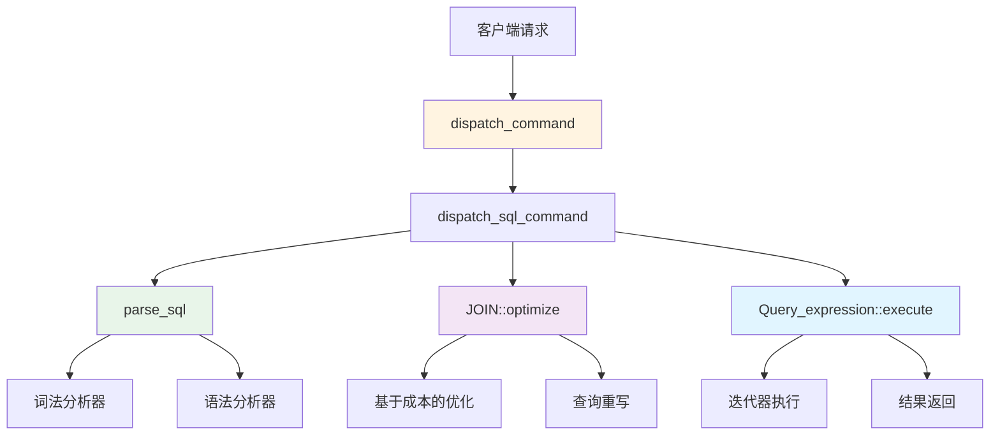
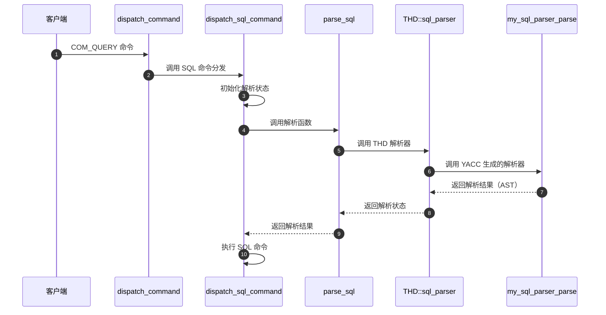
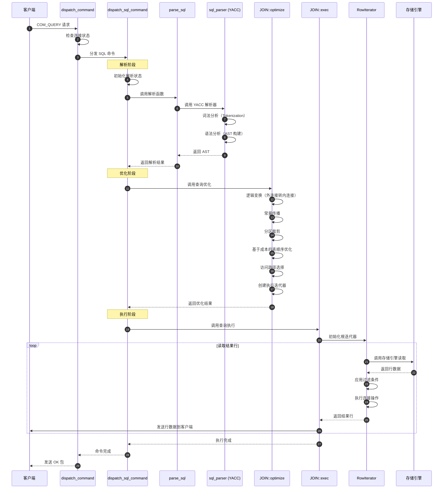
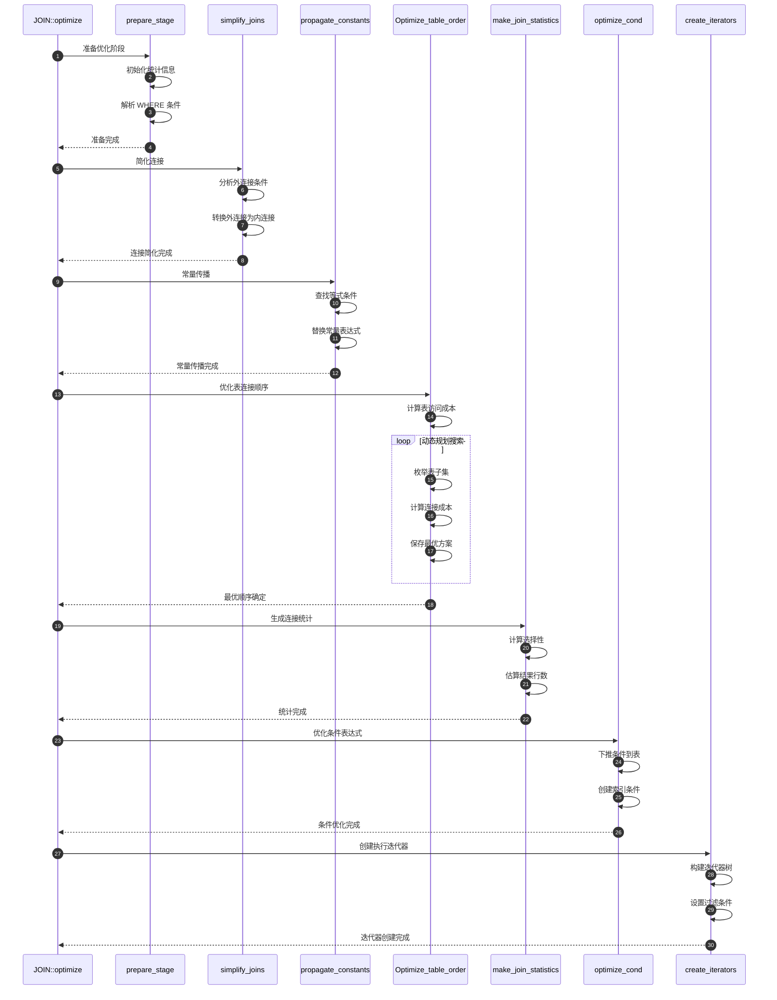

# MySQL Server 源码剖析 - SQL核心层-API详解

## 一、模块概述

SQL 核心层是 MySQL Server 处理 SQL 语句的核心组件，包含解析器（Parser）、优化器（Optimizer）、执行器（Executor）三大子模块。本文档深入分析每个模块的核心 API、数据结构、调用链路和时序图。

## 二、核心 API 入口函数

### 2.1 主要 API 入口点



## 三、解析器模块 API 详解

### 3.1 核心入口函数：`dispatch_sql_command`

**函数签名**：
```cpp
void dispatch_sql_command(THD *thd, Parser_state *parser_state, bool is_retry);
```

**功能说明**：
- 分发 SQL 命令处理的主入口点
- 负责初始化解析状态、调用解析器、处理解析结果
- 支持多语句处理和查询重写

**核心代码**：
```cpp
void dispatch_sql_command(THD *thd, Parser_state *parser_state, bool is_retry) {
  // 1. 重置 THD 状态，准备处理新命令
  mysql_reset_thd_for_next_command(thd);
  thd->reset_rewritten_query();
  lex_start(thd);

  // 2. 设置解析状态和预处理插件
  thd->m_parser_state = parser_state;
  invoke_pre_parse_rewrite_plugins(thd);
  thd->m_parser_state = nullptr;

  // 3. 启用查询摘要计算
  if (get_max_digest_length() != 0)
    parser_state->m_input.m_compute_digest = true;

  LEX *lex = thd->lex;
  const char *found_semicolon = nullptr;
  bool err = thd->get_stmt_da()->is_error();

  // 4. 核心解析过程
  if (!err) {
    err = parse_sql(thd, parser_state, nullptr);
    if (!err) err = invoke_post_parse_rewrite_plugins(thd, false);
    
    found_semicolon = parser_state->m_lip.found_semicolon;
    // （此处省略多语句处理逻辑）
  }

  // 5. 查询重写和日志记录
  // （此处省略查询重写逻辑）

  // 6. 执行具体的 SQL 命令
  if (!err) {
    err = mysql_execute_command(thd, true);
    // （此处省略错误处理和清理逻辑）
  }
}
```

**参数说明**：

| 参数 | 类型 | 说明 |
|------|------|------|
| `thd` | `THD *` | 线程描述符，包含连接状态和会话信息 |
| `parser_state` | `Parser_state *` | 解析器状态，包含 SQL 文本和位置信息 |
| `is_retry` | `bool` | 是否为重试请求（用于错误恢复） |

**返回值**：无（通过 `thd->get_stmt_da()` 返回错误状态）

### 3.2 核心解析函数：`parse_sql`

**函数签名**：
```cpp
bool parse_sql(THD *thd, Parser_state *parser_state, Object_creation_ctx *creation_ctx);
```

**功能说明**：
- SQL 解析的核心函数
- 将 SQL 文本转换为抽象语法树（AST）
- 支持查询摘要生成和错误恢复

**核心代码**：
```cpp
bool parse_sql(THD *thd, Parser_state *parser_state, Object_creation_ctx *creation_ctx) {
  DBUG_TRACE;

  // 1. 保存当前状态
  Object_creation_ctx *backup_ctx = nullptr;
  if (creation_ctx) {
    backup_ctx = thd->restore_object_creation_ctx(creation_ctx);
  }

  // 2. 设置解析器状态
  thd->m_parser_state = parser_state;
  thd->reset_n_backup_open_tables_state(&open_tables_state_backup, 
                                        MYSQL_OPEN_REOPEN_POLICY::CLOSE_SYSTEM_TABLES);

  // 3. 调用 YACC 生成的解析器
  bool ret_value = thd->sql_parser();

  // 4. 恢复状态和错误处理
  if (ret_value && !thd->is_error()) {
    // 解析失败但未设置错误，生成语法错误
    const char *error_msg = parser_state->m_lip.error_msg;
    if (!error_msg) error_msg = ER_DEFAULT(ER_SYNTAX_ERROR);
    my_error(ER_PARSE_ERROR, MYF(0), error_msg, 
              parser_state->m_lip.yytext, 
              parser_state->m_lip.yylineno);
  }

  // 5. 清理和恢复
  thd->end_statement();
  thd->m_parser_state = nullptr;
  thd->restore_backup_open_tables_state(&open_tables_state_backup);
  
  if (creation_ctx) {
    thd->restore_object_creation_ctx(backup_ctx);
  }

  return ret_value;
}
```

**调用链路分析**：



### 3.3 解析器状态结构：`Parser_state`

**数据结构**：
```cpp
struct Parser_state {
  // 输入状态
  struct {
    const char *m_ptr;              // 当前解析位置
    const char *m_end;              // SQL 文本结束位置
    bool m_compute_digest;          // 是否计算查询摘要
    bool m_has_digest;              // 是否已有摘要
  } m_input;
  
  // 词法分析器状态
  Lex_input_stream m_lip;           // 词法分析器
  
  // 解析器状态
  bool init(THD *thd, const char *buff, unsigned int length);
  void reset(const char *found_semicolon, unsigned int length);
};
```

**字段功能说明**：

| 字段 | 类型 | 功能说明 |
|------|------|---------|
| `m_input.m_ptr` | `const char *` | 当前解析位置指针 |
| `m_input.m_end` | `const char *` | SQL 文本结束位置 |
| `m_input.m_compute_digest` | `bool` | 是否计算 SQL 摘要（用于 Performance Schema） |
| `m_lip` | `Lex_input_stream` | 词法分析器，负责词法单元识别 |

### 3.4 词法分析器：`Lex_input_stream`

**核心功能**：
- 将 SQL 文本分解为词法单元（Token）
- 处理注释、字符串字面量、标识符
- 支持多种字符集和大小写敏感性

**关键方法**：
```cpp
class Lex_input_stream {
public:
  // 获取下一个词法单元
  int lex_one_token(union YYSTYPE *yylval, THD *thd);
  
  // 跳过空白字符和注释
  void skip_white();
  
  // 处理字符串字面量
  int scan_string(THD *thd, char quote_char);
  
  // 处理数字字面量
  int scan_number(THD *thd, char first_char);
  
  // 处理标识符
  int scan_identifier(THD *thd);

private:
  const char *m_ptr;                // 当前位置
  const char *m_end_of_query;       // 查询结束位置
  uint yylineno;                    // 当前行号
  const char *yytext;               // 当前词法单元文本
  const char *found_semicolon;      // 找到的分号位置
};
```

## 四、优化器模块 API 详解

### 4.1 核心入口函数：`JOIN::optimize`

**函数签名**：
```cpp
bool JOIN::optimize(bool finalize_access_paths);
```

**功能说明**：
- 查询优化的主入口点
- 执行逻辑变换、基于成本的优化、后连接优化
- 生成最优的查询执行计划

**核心代码**：
```cpp
bool JOIN::optimize(bool finalize_access_paths) {
  DBUG_TRACE;

  // 1. 逻辑变换阶段
  if (prepare_stage()) return true;

  // 外连接到内连接转换
  if (simplify_joins(this, join_list, true, false, &conds, true))
    return true;

  // 常量传播和分区裁剪
  if (propagate_constants()) return true;
  
  // 2. 基于成本的连接优化
  if (Optimize_table_order(thd, this, nullptr).choose_table_order())
    return true;

  // 3. 后连接优化阶段
  if (make_join_statistics(this, tables_list, &conds))
    return true;

  // 创建最优的表条件
  if (optimize_cond(thd, &conds, &cond_equal, join_list, 
                    &select_lex->where_cond()))
    return true;

  // 注入外连接保护条件
  if (build_equal_items(this, conds, nullptr, false, join_list, &cond_equal))
    return true;

  // 4. 代码生成阶段
  if (finalize_access_paths) {
    if (create_iterators()) return true;
  }

  return false;
}
```

**优化阶段详解**：

#### 4.1.1 逻辑变换阶段

**外连接到内连接转换**：
```cpp
bool simplify_joins(JOIN *join, List<Table_ref> *join_list, 
                    bool top, bool in_sj, Item **new_conds, bool is_explain) {
  // 分析 WHERE 条件，识别可以将外连接转换为内连接的情况
  for (Table_ref *table : *join_list) {
    if (table->outer_join) {
      // 检查 WHERE 条件是否引用了外连接的内表
      if (can_convert_outer_to_inner_join(table, *new_conds)) {
        table->outer_join = 0;  // 转换为内连接
        // （此处省略统计信息更新）
      }
    }
  }
  return false;
}
```

**常量传播**：
```cpp
bool JOIN::propagate_constants() {
  // 查找等式条件 (col = const)
  for (Item_equal *item_equal : cond_equal.current_level) {
    if (item_equal->const_item()) {
      Item *constant = item_equal->get_const();
      // 将常量传播到所有相等的列
      for (Item_field *field : item_equal->fields) {
        substitute_for_best_equal_field(field, constant);
      }
    }
  }
  return false;
}
```

#### 4.1.2 基于成本的优化

**表连接顺序优化**：
```cpp
class Optimize_table_order {
public:
  bool choose_table_order() {
    // 1. 初始化成本计算
    if (init_cost_calculation()) return true;
    
    // 2. 搜索最优连接顺序
    if (search_best_join_order()) return true;
    
    // 3. 应用最优顺序
    if (apply_best_join_order()) return true;
    
    return false;
  }

private:
  // 动态规划搜索最优连接顺序
  bool search_best_join_order() {
    // 对于每个表子集，计算最优的连接方案
    for (table_map tables_in_plan = 1; 
         tables_in_plan < (1ULL << table_count); 
         tables_in_plan++) {
      
      Position best_pos;
      double best_cost = DBL_MAX;
      
      // 尝试每个可能的下一个表
      for (uint idx = 0; idx < table_count; idx++) {
        if (!(tables_in_plan & (1ULL << idx))) continue;
        
        Position pos;
        // 计算添加该表的成本
        double cost = calculate_join_cost(tables_in_plan, idx, &pos);
        
        if (cost < best_cost) {
          best_cost = cost;
          best_pos = pos;
        }
      }
      
      // 保存最优方案
      save_best_plan(tables_in_plan, best_pos, best_cost);
    }
    return false;
  }
};
```

### 4.2 新优化器：`FindBestQueryPlan`

**函数签名**：
```cpp
AccessPath *FindBestQueryPlan(THD *thd, Query_block *query_block);
```

**功能说明**：
- MySQL 8.0 引入的超图连接优化器
- 基于超图表示的连接关系
- 支持更复杂的连接模式和更精确的成本计算

**核心代码**：
```cpp
AccessPath *FindBestQueryPlan(THD *thd, Query_block *query_block) {
  bool retry = false;
  int subgraph_pair_limit = 100000;
  
  do {
    AccessPath *path = FindBestQueryPlanInner(thd, query_block, 
                                              &retry, &subgraph_pair_limit);
    if (!retry) return path;
    
    // 如果子图对数量过多，减少限制并重试
    subgraph_pair_limit /= 2;
  } while (retry && subgraph_pair_limit >= 1000);
  
  return nullptr;
}

static AccessPath *FindBestQueryPlanInner(THD *thd, Query_block *query_block,
                                          bool *retry, int *subgraph_pair_limit) {
  JOIN *join = query_block->join;
  
  // 1. 构建连接超图
  JoinHypergraph graph(thd->mem_root);
  if (MakeJoinHypergraph(thd, &graph)) return nullptr;
  
  // 2. 枚举所有合法的子图连接
  Mem_root_array<AccessPath *> access_paths(thd->mem_root);
  if (EnumerateAllConnectedPartitions(graph, &access_paths, 
                                      *subgraph_pair_limit, retry))
    return nullptr;
  
  // 3. 选择成本最低的访问路径
  AccessPath *best_path = nullptr;
  double best_cost = DBL_MAX;
  
  for (AccessPath *path : access_paths) {
    double cost = path->cost;
    if (cost < best_cost) {
      best_cost = cost;
      best_path = path;
    }
  }
  
  // 4. 添加后处理操作（GROUP BY、ORDER BY 等）
  if (best_path) {
    best_path = AddPostProcessingOperations(thd, best_path);
  }
  
  return best_path;
}
```

### 4.3 成本计算模型

**成本结构**：
```cpp
struct Cost_estimate {
  double io_cost;        // I/O 成本
  double cpu_cost;       // CPU 成本
  double mem_cost;       // 内存成本
  double import_cost;    // 导入成本（用于物化）

  // 总成本计算
  double total_cost() const {
    return io_cost + cpu_cost + mem_cost + import_cost;
  }
};
```

**表访问成本计算**：
```cpp
double calculate_table_scan_cost(const Table_ref *table) {
  const TABLE *tab = table->table;
  
  // 全表扫描成本 = 页数 * I/O 成本 + 行数 * CPU 成本
  double io_cost = tab->file->scan_time() * server_cost_constants.io_block_read_cost;
  double cpu_cost = tab->file->records() * server_cost_constants.row_eval_cost;
  
  return io_cost + cpu_cost;
}

double calculate_index_scan_cost(const Table_ref *table, uint key_no, 
                                ha_rows rows_to_read) {
  const TABLE *tab = table->table;
  
  // 索引扫描成本 = 索引页数 * I/O 成本 + 读取行数 * CPU 成本
  double io_cost = tab->file->read_time(key_no, 1, rows_to_read) * 
                   server_cost_constants.io_block_read_cost;
  double cpu_cost = rows_to_read * server_cost_constants.row_eval_cost;
  
  return io_cost + cpu_cost;
}
```

## 五、执行器模块 API 详解

### 5.1 核心入口函数：`Query_expression::execute`

**函数签名**：
```cpp
bool Query_expression::execute(THD *thd);
```

**功能说明**：
- 查询执行的主入口点
- 协调多个查询块的执行（UNION 处理）
- 管理结果集的产生和传输

**核心代码**：
```cpp
bool Query_expression::execute(THD *thd) {
  DBUG_TRACE;
  
  // 1. 检查是否已优化
  assert(is_optimized());
  
  // 2. 执行准备工作
  if (prepare_execution(thd)) return true;
  
  // 3. 分情况执行
  if (is_simple()) {
    // 单一查询块执行
    return first_query_block()->join->exec();
  } else {
    // UNION 查询执行
    return execute_union(thd);
  }
}

bool Query_expression::execute_union(THD *thd) {
  // 1. 创建临时表存储 UNION 结果
  if (create_result_table()) return true;
  
  // 2. 执行每个查询块
  for (Query_block *query_block = first_query_block();
       query_block != nullptr;
       query_block = query_block->next_query_block()) {
    
    if (query_block->join->exec()) return true;
    
    // 3. 将结果写入临时表
    if (write_to_union_table(query_block)) return true;
  }
  
  // 4. 处理 UNION 后的操作（ORDER BY、LIMIT）
  if (process_union_result()) return true;
  
  return false;
}
```

### 5.2 连接执行：`JOIN::exec`

**函数签名**：
```cpp
bool JOIN::exec();
```

**功能说明**：
- 单个查询块的执行入口
- 管理表的扫描和连接操作
- 处理 GROUP BY、ORDER BY、HAVING 等操作

**核心代码**：
```cpp
bool JOIN::exec() {
  DBUG_TRACE;
  
  // 1. 检查优化状态
  assert(optimized);
  
  // 2. 准备执行环境
  if (setup_execution()) return true;
  
  // 3. 创建迭代器执行引擎
  if (create_iterators()) return true;
  
  // 4. 执行查询
  if (m_root_iterator->Init()) return true;
  
  POS_ROW_COUNT row_count = 0;
  
  while (true) {
    int result = m_root_iterator->Read();
    
    if (result == 1) return true;     // 错误
    if (result == -1) break;          // 结束
    
    // 5. 发送结果行到客户端
    if (send_result_row()) return true;
    
    row_count++;
    
    // 6. 检查 LIMIT
    if (unit->offset_limit_cnt && row_count >= unit->offset_limit_cnt)
      break;
  }
  
  return false;
}
```

### 5.3 迭代器执行引擎

MySQL 8.0 引入了基于迭代器的执行引擎，每种操作对应一个迭代器类：

**迭代器基类**：
```cpp
class RowIterator {
public:
  virtual ~RowIterator() = default;
  
  // 初始化迭代器
  virtual bool Init() = 0;
  
  // 读取下一行，返回值：
  // 0: 成功读取到行
  // -1: 无更多行（EOF）
  // 1: 错误
  virtual int Read() = 0;
  
  // 获取当前行数据（存储在 table->record[0] 中）
  virtual void UnlockRow() {}
  
  // 迭代器类型（用于 EXPLAIN）
  virtual IteratorType type() const = 0;
  
  // 成本信息
  virtual double cost() const { return 0.0; }
  virtual ha_rows num_output_rows() const { return 0; }
};
```

**表扫描迭代器**：
```cpp
class TableScanIterator : public RowIterator {
public:
  TableScanIterator(THD *thd, TABLE *table) 
    : m_thd(thd), m_table(table) {}
  
  bool Init() override {
    return m_table->file->ha_rnd_init(true);  // 初始化全表扫描
  }
  
  int Read() override {
    int result = m_table->file->ha_rnd_next(m_table->record[0]);
    
    if (result == 0) {
      // 成功读取行，检查 WHERE 条件
      if (m_condition && !m_condition->val_int()) {
        return Read();  // 递归读取下一行
      }
      return 0;
    } else if (result == HA_ERR_END_OF_FILE) {
      return -1;  // 结束
    } else {
      return 1;   // 错误
    }
  }

private:
  THD *m_thd;
  TABLE *m_table;
  Item *m_condition;  // WHERE 条件
};
```

**嵌套循环连接迭代器**：
```cpp
class NestedLoopJoinIterator : public RowIterator {
public:
  NestedLoopJoinIterator(unique_ptr<RowIterator> outer,
                         unique_ptr<RowIterator> inner,
                         Item *join_condition)
    : m_outer_iterator(move(outer)),
      m_inner_iterator(move(inner)),
      m_join_condition(join_condition) {}
  
  bool Init() override {
    if (m_outer_iterator->Init()) return true;
    
    m_outer_eof = false;
    m_reading_first_inner_row = true;
    
    return false;
  }
  
  int Read() override {
    for (;;) {
      if (m_reading_first_inner_row) {
        // 读取外表的下一行
        int result = m_outer_iterator->Read();
        if (result != 0) return result;
        
        // 初始化内表扫描
        if (m_inner_iterator->Init()) return 1;
        m_reading_first_inner_row = false;
      }
      
      // 读取内表的下一行
      int result = m_inner_iterator->Read();
      
      if (result == 0) {
        // 检查连接条件
        if (m_join_condition == nullptr || m_join_condition->val_int()) {
          return 0;  // 连接成功
        }
        // 连接条件不满足，继续读取内表
        continue;
      } else if (result == -1) {
        // 内表结束，读取外表下一行
        m_reading_first_inner_row = true;
        continue;
      } else {
        return 1;  // 错误
      }
    }
  }

private:
  unique_ptr<RowIterator> m_outer_iterator;
  unique_ptr<RowIterator> m_inner_iterator;
  Item *m_join_condition;
  bool m_outer_eof;
  bool m_reading_first_inner_row;
};
```

## 六、关键数据结构详解

### 6.1 THD（Thread Descriptor）

**结构概述**：
```cpp
class THD : public MDL_context, public Query_arena, public Open_tables_state {
public:
  // 连接信息
  Security_context m_main_security_ctx;  // 安全上下文
  NET net;                               // 网络连接
  String packet;                         // 数据包缓冲区
  
  // SQL 相关
  LEX *lex;                              // 当前 SQL 的词法分析结果
  Query_arena *stmt_arena;               // 内存分配器
  
  // 事务相关
  struct Transaction_state {
    Ha_trx_info *ha_list;                // 存储引擎事务列表
    bool no_2pc;                         // 是否禁用两阶段提交
  } transaction;
  
  // 状态标志
  bool killed;                           // 是否被杀死
  bool is_error() const;                 // 是否有错误
  
  // 查询处理
  bool sql_parser();                     // SQL 解析入口
  void reset_for_next_command();         // 重置状态准备下一个命令
};
```

**关键字段说明**：

| 字段 | 类型 | 功能说明 |
|------|------|---------|
| `lex` | `LEX *` | 词法分析结果，包含解析后的 SQL 结构 |
| `net` | `NET` | 网络连接信息，用于与客户端通信 |
| `transaction` | `Transaction_state` | 事务状态信息 |
| `killed` | `bool` | 线程是否被请求终止 |

### 6.2 LEX（Lexical Analysis）

**结构概述**：
```cpp
struct LEX : public Query_tables_list {
  // SQL 命令类型
  enum_sql_command sql_command;
  
  // 查询结构
  Query_expression *unit;                // 查询表达式（支持 UNION）
  Query_block *query_block;              // 当前查询块
  
  // 解析状态
  sp_head *sphead;                       // 存储过程头
  enum_lex_state context_analysis_only;  // 上下文分析模式
  
  // 表和列信息
  Table_ref *query_tables;               // 查询涉及的表
  List<Item> item_list;                  // SELECT 列表
  Item *where;                           // WHERE 条件
  
  // 其他子句
  SQL_I_List<ORDER> order_list;          // ORDER BY 子句
  Item *having;                          // HAVING 条件
  ha_rows limit_rows_examined;           // LIMIT 行数
  
  // 方法
  bool make_sql_cmd(Parse_tree_root *parse_tree);  // 创建 SQL 命令对象
};
```

### 6.3 JOIN（连接执行计划）

**结构概述**：
```cpp
class JOIN {
public:
  THD *thd;                              // 线程描述符
  Query_block *query_block;              // 所属查询块
  
  // 表信息
  uint table_count;                      // 表数量
  Table_ref **best_ref;                  // 最优表顺序
  JOIN_TAB *join_tab;                    // 连接表数组
  
  // 优化信息
  bool optimized;                        // 是否已优化
  Item *conds;                           // WHERE 条件
  COND_EQUAL cond_equal;                 // 等式条件
  
  // 执行器
  unique_ptr<RowIterator> m_root_iterator;  // 根迭代器
  
  // 方法
  bool optimize(bool finalize_access_paths);  // 优化
  bool exec();                               // 执行
  bool create_iterators();                   // 创建迭代器
};
```

## 七、API 调用链路时序图

### 7.1 完整 SQL 处理时序图



### 7.2 查询优化详细时序图



## 八、性能监控与调试

### 8.1 关键性能指标

```sql
-- 查看 SQL 解析统计
SHOW STATUS LIKE 'Com_select%';
SHOW STATUS LIKE 'Com_insert%';
SHOW STATUS LIKE 'Com_update%';
SHOW STATUS LIKE 'Com_delete%';

-- 查看查询缓存统计（MySQL 5.7 及之前）
SHOW STATUS LIKE 'Qcache%';

-- 查看临时表使用
SHOW STATUS LIKE 'Created_tmp%';

-- 查看排序操作
SHOW STATUS LIKE 'Sort%';
```

### 8.2 优化器跟踪

```sql
-- 启用优化器跟踪
SET optimizer_trace="enabled=on";

-- 执行查询
SELECT * FROM users u JOIN orders o ON u.id = o.user_id WHERE u.status = 'active';

-- 查看优化过程
SELECT TRACE FROM information_schema.OPTIMIZER_TRACE;
```

### 8.3 执行计划分析

```sql
-- 查看执行计划
EXPLAIN FORMAT=TREE 
SELECT * FROM users u JOIN orders o ON u.id = o.user_id WHERE u.status = 'active';

-- 查看详细执行统计
EXPLAIN ANALYZE
SELECT * FROM users u JOIN orders o ON u.id = o.user_id WHERE u.status = 'active';
```

## 九、总结

SQL 核心层的 API 体系包含三个主要模块：

**解析器模块**：
- `dispatch_sql_command`：SQL 命令分发入口
- `parse_sql`：核心解析函数
- `THD::sql_parser`：YACC 解析器调用
- 支持多语句、查询重写、错误恢复

**优化器模块**：
- `JOIN::optimize`：传统优化器（基于动态规划）
- `FindBestQueryPlan`：新优化器（基于超图）
- 包含逻辑变换、成本优化、代码生成三个阶段
- 支持复杂的连接优化和访问路径选择

**执行器模块**：
- `Query_expression::execute`：查询执行入口
- `JOIN::exec`：连接执行
- 基于迭代器的执行引擎（MySQL 8.0+）
- 支持向量化处理和延迟物化

每个模块都有清晰的 API 边界和数据结构，通过统一的调用链路协同工作，为上层提供完整的 SQL 处理能力。
