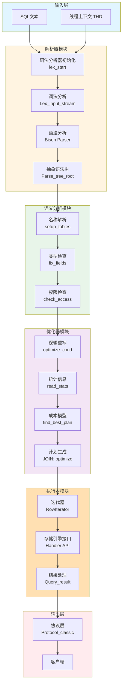
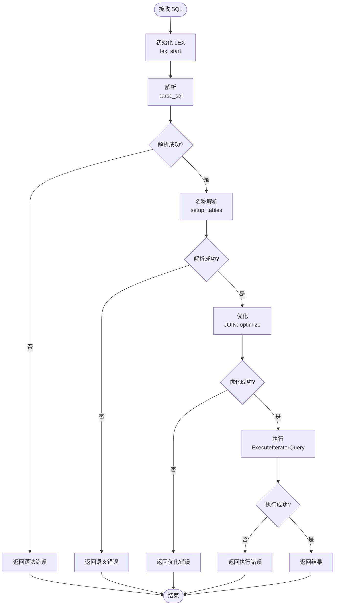

# MySQL Server 源码剖析 - SQL 核心层概览

## 一、模块职责

SQL 核心层是 MySQL Server 的大脑,负责将客户端发送的 SQL 文本转换为可执行的数据库操作。主要职责包括:

1. **SQL 解析**：将 SQL 文本转换为抽象语法树（AST）
2. **语义分析**：验证 SQL 的合法性，解析表、列、函数引用
3. **查询优化**：基于成本模型选择最优执行计划
4. **查询执行**：调用存储引擎接口执行具体操作
5. **结果返回**：将查询结果封装后返回给客户端

### 1.1 输入输出

**输入**：
- SQL 文本字符串（来自客户端网络连接）
- 当前会话上下文（权限、变量、事务状态等）

**输出**：
- SELECT：结果集（行数据 + 元数据）
- INSERT/UPDATE/DELETE：影响行数 + OK/Error 包
- DDL：OK/Error 包 + 元数据变更

### 1.2 上下游依赖

**上游**：
- 网络层（VIO）：接收 SQL 文本
- 连接管理器：提供线程上下文（THD）

**下游**：
- 存储引擎层（Handler API）：执行数据读写
- 事务管理器：控制事务提交/回滚
- Binlog：记录数据变更

### 1.3 生命周期

SQL 核心层的生命周期与 MySQL Server 进程一致：

1. **初始化阶段**：
   - 加载系统表元数据
   - 初始化优化器成本模型
   - 预编译系统语句

2. **运行阶段**：
   - 为每个连接分配线程上下文（THD）
   - 循环处理 SQL 命令（`do_command()`）
   - 每个 SQL 执行独立的解析-优化-执行流程

3. **关闭阶段**：
   - 清理所有活动连接
   - 释放缓存的执行计划
   - 持久化统计信息

## 二、整体架构

### 2.1 架构图



### 2.2 架构说明

#### 2.2.1 图意概述

SQL 核心层采用经典的编译器架构，分为五个主要阶段：解析、语义分析、优化、执行、结果返回。每个阶段职责清晰，通过中间表示（LEX、AST、执行计划）传递信息。

#### 2.2.2 关键组件

**解析器**：
- **词法分析器**（`sql/sql_lex.cc`）：将 SQL 文本转换为 Token 流
- **语法分析器**（`sql/sql_yacc.yy`）：基于 Bison 生成的 LALR(1) 解析器
- **LEX 结构**：存储解析结果（语句类型、表列表、条件等）

**语义分析**：
- **名称解析**：将表名、列名绑定到具体的元数据对象
- **类型检查**：验证表达式类型兼容性
- **权限检查**：验证用户权限

**优化器**：
- **逻辑优化**：等价变换（外连接转内连接、常量传播、谓词下推）
- **物理优化**：访问路径选择（索引 vs 全表扫描）、连接顺序
- **成本模型**：基于统计信息估算各种操作的成本

**执行器**：
- **迭代器模式**：火山模型（Volcano Model），每个操作符实现统一接口
- **Handler API**：与存储引擎交互的标准接口
- **结果处理**：将结果集格式化后发送给客户端

#### 2.2.3 边界条件

**并发控制**：
- 每个连接独立线程，SQL 执行单线程（除并行查询）
- MDL 锁保护元数据并发访问
- 存储引擎行锁控制数据并发

**超时限制**：
- `max_execution_time`：查询执行超时（默认 0 = 无限制）
- `lock_wait_timeout`：MDL 锁等待超时（默认 31536000 秒）

**顺序保证**：
- 单连接内 SQL 执行严格按顺序
- 事务内操作顺序由应用层保证

**幂等性**：
- SELECT 天然幂等
- DML 非幂等（重复执行可能产生不同结果）

#### 2.2.4 异常处理

**解析错误**：
- 语法错误：返回 `ER_PARSE_ERROR`
- 不停止连接，等待下一个命令

**优化错误**：
- 表不存在：`ER_NO_SUCH_TABLE`
- 列不存在：`ER_BAD_FIELD_ERROR`
- 类型不兼容：`ER_WRONG_FIELD_WITH_GROUP`

**执行错误**：
- 违反约束：回滚语句事务
- 死锁：自动选择受害者回滚
- 超时：返回错误，可能回滚

**系统异常**：
- OOM：尽量释放缓存，终止当前查询
- 磁盘满：停止写入操作
- 崩溃：通过 Redo Log 恢复

#### 2.2.5 性能与容量

**性能指标**：
- 简单查询解析：< 0.1ms
- 简单查询优化：< 1ms
- 复杂查询优化：可达数秒（多表连接、复杂子查询）
- 索引点查询执行：< 1ms
- 全表扫描：取决于表大小和 Buffer Pool 命中率

**容量限制**：
- 单 SQL 最大长度：`max_allowed_packet`（默认 64MB）
- 最大表数：无硬性限制，实践建议 < 61（超过需重编译）
- 最大列数：4096
- 最大索引数：64
- 嵌套子查询深度：61 层

**优化建议**：
- 使用预编译语句避免重复解析
- 简化查询减少优化时间
- 合理使用索引提高执行效率

#### 2.2.6 版本演进

**MySQL 5.7**：
- 引入查询重写插件
- JSON 函数支持
- Generated Column（虚拟列）

**MySQL 8.0**：
- 重写查询优化器，引入 Hypergraph Optimizer
- CTE（Common Table Expression）支持
- 窗口函数（Window Function）
- 降序索引
- 不可见索引（Invisible Index）
- 直方图统计信息

**MySQL 8.4**：
- 持续优化 Hypergraph Optimizer 性能
- 增强 JSON 功能
- 改进统计信息收集

## 三、核心算法与流程

### 3.1 SQL 执行总流程



### 3.2 算法说明

#### 3.2.1 解析算法

**目的**：将 SQL 文本转换为抽象语法树（AST）

**输入**：
- SQL 文本字符串
- 当前字符集

**输出**：
- LEX 结构（包含 AST）
- 错误码（如果解析失败）

**复杂度**：
- 时间复杂度：O(n)，n 为 SQL 长度
- 空间复杂度：O(n)，存储 Token 和 AST

**上界**：
- SQL 最大长度：`max_allowed_packet`
- AST 最大深度：61 层（嵌套子查询）

#### 3.2.2 查询优化算法

**目的**：选择成本最低的执行计划

**输入**：
- 解析后的 LEX 结构
- 表统计信息

**输出**：
- 执行计划（访问路径、连接顺序、访问方法）

**复杂度**：
- 简单查询：O(1)（预定义规则）
- 多表连接：O(n!)，n 为表数量（实际使用剪枝优化）

**核心代码**（简化）：
```cpp
bool JOIN::optimize(bool finalize_access_paths) {
  // 1. 逻辑优化
  if (optimize_cond(thd, &where_cond, &cond_equal, 
                    query_block->join_list, &fields_list))
    return true; // 优化失败
    
  // 2. 分区裁剪
  if (prune_table_partitions())
    return true;
    
  // 3. 生成连接计划
  if (make_join_plan())
    return true; // 成本估算和计划生成
    
  // 4. 优化 ORDER BY/GROUP BY
  if (optimize_distinct_group_order())
    return true;
    
  // 5. 生成迭代器树（执行计划）
  if (finalize_access_paths && create_iterators(query_block))
    return true;
    
  return false;
}
```

**逐段解释**：

1. **逻辑优化**（`optimize_cond`）：
   - 常量传播：将常量表达式提前计算
   - 等价谓词推导：从 `a=b AND b=c` 推导出 `a=c`
   - 外连接转内连接：当条件允许时转换为更高效的内连接

2. **分区裁剪**（`prune_table_partitions`）：
   - 根据 WHERE 条件确定只访问哪些分区
   - 减少需要扫描的数据量

3. **生成连接计划**（`make_join_plan`）：
   - 枚举可能的表连接顺序（贪心算法或动态规划）
   - 为每个表选择访问方法（全表扫描 vs 索引扫描）
   - 估算每种方案的成本，选择最优计划

4. **优化聚合和排序**：
   - 尝试使用索引避免显式排序
   - 优化 DISTINCT 和 GROUP BY
   - 松散索引扫描（Loose Index Scan）

5. **生成迭代器树**：
   - 将逻辑执行计划转换为物理执行计划
   - 创建迭代器对象树（火山模型）

#### 3.2.3 执行算法

**目的**：按照执行计划访问数据，生成结果集

**输入**：
- 执行计划（迭代器树）
- 表元数据

**输出**：
- 结果集（行数据）

**复杂度**：
- 取决于访问方法和数据量
- 索引点查询：O(log n)
- 索引范围扫描：O(log n + m)，m 为匹配行数
- 全表扫描：O(n)

**核心代码**（简化）：
```cpp
bool ExecuteIteratorQuery(THD *thd) {
  JOIN *join = thd->lex->unit->first_query_block()->join;
  RowIterator *iterator = join->root_iterator();
  
  // 初始化迭代器
  if (iterator->Init())
    return true; // 初始化失败
    
  // 循环读取每一行
  while (true) {
    int read_error = iterator->Read();
    
    if (read_error > 0) // 读取错误
      return true;
      
    if (read_error < 0) // 到达结尾
      break;
      
    // 处理当前行
    // （此处省略：过滤、投影、聚合等处理）
    
    // 发送结果行到客户端
    if (thd->send_result_row())
      return true; // 发送失败
      
    // 检查是否被 KILL 或超时
    if (thd->killed)
      return true;
  }
  
  return false; // 执行成功
}
```

**逐段解释**：

1. **获取根迭代器**：
   - 执行计划以迭代器树形式存储
   - 根迭代器代表最终输出操作（如 LIMIT、ORDER BY）

2. **初始化**：
   - 打开所有需要的表
   - 初始化临时表（如果有 GROUP BY）
   - 准备排序缓冲区

3. **循环读取**：
   - 调用 `Read()` 获取下一行
   - 返回值：0 = 成功，< 0 = 结束，> 0 = 错误

4. **行处理**：
   - 应用 WHERE 过滤
   - 计算表达式（如 SELECT a+b）
   - 聚合（如 SUM/COUNT）

5. **发送结果**：
   - 格式化为协议包
   - 通过网络发送给客户端

6. **中断检查**：
   - 定期检查连接是否被 KILL
   - 检查是否超时

## 四、关键数据结构

### 4.1 THD（线程上下文）

```cpp
class THD {
  // 连接信息
  NET net;                    // 网络连接
  Protocol *protocol;         // 协议处理器
  Security_context security_ctx; // 权限上下文
  
  // SQL 执行状态
  LEX *lex;                   // 当前 SQL 的 LEX
  Query_arena *query_arena;   // 内存分配器
  LEX_CSTRING query_string;   // SQL 文本
  
  // 事务状态
  Transaction_ctx transaction; // 事务上下文
  MDL_context mdl_context;    // 元数据锁上下文
  
  // 执行控制
  killed_state killed;        // KILL 标志
  THR_LOCK_INFO lock_info;    // 表锁信息
  
  // 错误处理
  Diagnostics_area *da;       // 诊断区域
  
  // 性能统计
  THD_STAGE_INFO stage_progress_psi; // 当前执行阶段
  // （此处省略：系统变量、临时表、预编译语句等成员）
};
```

**字段说明**：
- `net`：网络连接句柄，用于发送接收数据包
- `lex`：当前正在执行的 SQL 的解析结果
- `query_string`：SQL 原始文本
- `transaction`：事务状态（活动事务列表、Savepoint 等）
- `mdl_context`：持有的 MDL 锁列表
- `killed`：是否被 KILL 命令终止
- `da`：错误信息和警告

### 4.2 LEX（SQL 解析结果）

```cpp
struct LEX {
  // 基本信息
  enum_sql_command sql_command; // 命令类型（SELECT/INSERT/UPDATE 等）
  Query_block *query_block;     // 第一个查询块
  Query_expression *unit;       // 最外层查询表达式
  
  // 表和列
  Table_ref *query_tables;      // 所有引用的表
  List<Item> *fields_list;      // SELECT 列表
  Item *where_cond;             // WHERE 条件
  
  // 排序和分组
  SQL_I_List<ORDER> order_list; // ORDER BY 列表
  SQL_I_List<ORDER> group_list; // GROUP BY 列表
  Item *having_cond;            // HAVING 条件
  
  // 子句标志
  bool is_explain;              // 是否 EXPLAIN
  ulonglong select_limit;       // LIMIT 值
  ulonglong offset_limit;       // OFFSET 值
  
  // 执行计划
  Sql_cmd *m_sql_cmd;           // SQL 命令对象
  
  // 其他
  // （此处省略：变量列表、用户列表、插件列表等）
};
```

**字段说明**：
- `sql_command`：SQL 类型枚举值（如 `SQLCOM_SELECT`）
- `query_block`：查询块（对应一个 SELECT）
- `query_tables`：引用的表链表
- `where_cond`：WHERE 条件表达式树
- `m_sql_cmd`：封装具体 SQL 命令的执行逻辑

### 4.3 JOIN（连接执行计划）

```cpp
class JOIN {
  THD *thd;                     // 线程上下文
  Query_block *query_block;     // 查询块
  
  // 表访问计划
  QEP_TAB *qep_tab;             // 表访问顺序和方法
  uint table_count;             // 表数量
  uint primary_tables;          // 主表数量（非子查询）
  
  // 优化结果
  POSITION *best_positions;     // 最优连接顺序
  table_map const_table_map;    // 常量表位图
  
  // 临时表
  TABLE *tmp_table;             // GROUP BY/ORDER BY 临时表
  Temp_table_param *tmp_table_param; // 临时表参数
  
  // 执行状态
  bool optimized;               // 是否已优化
  bool executed;                // 是否已执行
  ha_rows send_records;         // 返回行数
  
  // 迭代器（MySQL 8.0+）
  unique_ptr_destroy_only<RowIterator> root_iterator;
  
  // （此处省略：成本估算、优化提示、子查询等）
};
```

**字段说明**：
- `qep_tab`：每个表的查询执行计划（访问方法、使用的索引）
- `best_positions`：优化器选择的最优表连接顺序
- `const_table_map`：只有一行的表（可优化为常量）
- `root_iterator`：执行计划的根迭代器

### 4.4 Item（表达式）

```cpp
class Item {
public:
  enum Type {
    FIELD_ITEM,       // 列引用（如 t1.a）
    FUNC_ITEM,        // 函数调用（如 UPPER(name)）
    INT_ITEM,         // 整数常量
    STRING_ITEM,      // 字符串常量
    COND_ITEM,        // 条件表达式（AND/OR/NOT）
    // （此处省略：其他类型）
  };
  
  // 类型信息
  virtual Type type() const = 0;
  virtual Field::geometry_type get_geometry_type() const;
  
  // 语义分析
  virtual bool fix_fields(THD *thd, Item **ref);
  
  // 值计算
  virtual double val_real() = 0;
  virtual longlong val_int() = 0;
  virtual String *val_str(String *str) = 0;
  
  // （此处省略：其他虚函数）
};
```

**子类示例**：
- `Item_field`：列引用
- `Item_func_plus`：加法运算
- `Item_cond_and`：AND 逻辑运算
- `Item_int`：整数常量

## 五、典型场景

### 5.1 简单查询（点查询）

```sql
SELECT name, age FROM users WHERE id = 123;
```

**执行流程**：

1. **解析**：识别为 SELECT 语句，提取表名 `users`，列 `name`, `age`，条件 `id=123`
2. **名称解析**：绑定 `users` 到表对象，`id/name/age` 到列对象
3. **优化**：
   - 识别 `id` 有唯一索引（主键）
   - 选择索引点查询访问方法
   - 跳过排序（单行结果）
4. **执行**：
   - 调用 Handler API：`ha_index_read_map()`
   - InnoDB 在主键索引中查找 `id=123`
   - 返回该行数据
5. **返回**：格式化为结果包发送给客户端

**性能特征**：
- 解析：< 0.1ms
- 优化：< 0.1ms
- 执行：< 1ms（假设 Buffer Pool 命中）

### 5.2 复杂查询（多表连接 + 聚合）

```sql
SELECT 
  u.department, 
  COUNT(*) as cnt, 
  AVG(u.salary) as avg_salary
FROM 
  users u
JOIN 
  departments d ON u.dept_id = d.id
WHERE 
  u.status = 'active' AND d.location = 'Beijing'
GROUP BY 
  u.department
HAVING 
  cnt > 10
ORDER BY 
  avg_salary DESC
LIMIT 10;
```

**执行流程**：

1. **解析**：识别 JOIN、GROUP BY、HAVING、ORDER BY、LIMIT
2. **名称解析**：绑定两个表和所有列
3. **优化**：
   - **访问路径选择**：
     - `users` 表：使用 `status` 索引过滤
     - `departments` 表：使用 `id` 主键连接
   - **连接顺序**：
     - 先访问 `departments`（过滤后行数少）
     - 再连接 `users`
   - **聚合优化**：
     - 创建临时表存储 GROUP BY 结果
     - 使用哈希聚合（如果内存足够）
   - **排序优化**：
     - 在临时表上排序（结果集较小）
4. **执行**：
   - 扫描 `departments`，过滤 `location='Beijing'`
   - 对每个匹配的 dept，在 `users` 中查找 `dept_id` 匹配的行
   - 过滤 `status='active'`
   - 聚合到临时表
   - 过滤 HAVING 条件
   - 排序
   - 返回前 10 行
5. **返回**：逐行发送结果

**性能特征**：
- 解析：< 1ms
- 优化：1-10ms（取决于表数量和统计信息）
- 执行：取决于数据量和索引命中率

### 5.3 子查询

```sql
SELECT name FROM users 
WHERE department_id IN (
  SELECT id FROM departments WHERE location = 'Beijing'
);
```

**优化策略**：

**策略 1：子查询物化（Subquery Materialization）**：
- 先执行子查询，结果存入临时表
- 外层查询与临时表 JOIN

**策略 2：半连接（Semi-Join）**：
- 将 IN 子查询转换为 JOIN
- 使用特殊连接算法（如 FirstMatch、LooseScan）

**策略 3：EXISTS 转换**：
- 将 IN 转换为 EXISTS
- 利用短路逻辑提前终止

优化器根据成本估算自动选择最优策略。

## 六、性能要点

### 6.1 解析优化

**问题**：重复解析相同 SQL 浪费 CPU

**解决方案**：
1. **预编译语句**：
   ```sql
   PREPARE stmt FROM 'SELECT * FROM users WHERE id = ?';
   EXECUTE stmt USING @id;
   ```
   - 解析一次，多次执行
   - 减少解析开销

2. **查询缓存**（MySQL 8.0 已移除）：
   - 缓存完整查询结果
   - 表变更时失效（命中率低）

### 6.2 优化器提示

**问题**：优化器选择次优计划

**解决方案**：使用 Optimizer Hint
```sql
SELECT /*+ INDEX(users idx_status) */ * 
FROM users 
WHERE status = 'active';
```

常用 Hint：
- `INDEX`：强制使用指定索引
- `NO_INDEX`：禁止使用指定索引
- `JOIN_ORDER`：指定连接顺序
- `SEMIJOIN/NO_SEMIJOIN`：控制半连接策略

### 6.3 统计信息

**问题**：统计信息过时导致错误成本估算

**解决方案**：
- 定期执行 `ANALYZE TABLE`
- 开启自动统计信息收集（InnoDB 默认开启）
- MySQL 8.0：使用直方图获得更精确的分布信息
  ```sql
  ANALYZE TABLE users UPDATE HISTOGRAM ON age, salary;
  ```

### 6.4 执行优化

**索引优化**：
- 覆盖索引：索引包含所有查询列，避免回表
- 索引下推（Index Condition Pushdown）：在存储引擎层过滤

**并行查询**（MySQL 8.0+）：
- 某些查询可并行执行（如全表扫描 + 聚合）
- 需开启并行查询特性

**批量操作**：
- 使用 `INSERT ... VALUES (...), (...), (...)`
- 减少网络往返和事务开销

## 七、可观测性

### 7.1 EXPLAIN 分析

```sql
EXPLAIN FORMAT=TREE 
SELECT * FROM users WHERE status = 'active' ORDER BY created_at;
```

**输出示例**：
```
-> Sort: users.created_at
    -> Index range scan on users using idx_status
       (cost=120.5 rows=500)
```

**关键信息**：
- 访问方法：Index range scan
- 使用的索引：idx_status
- 成本估算：120.5
- 预计行数：500

### 7.2 慢查询日志

```ini
[mysqld]
slow_query_log = 1
slow_query_log_file = /var/log/mysql/slow.log
long_query_time = 1
log_queries_not_using_indexes = 1
```

**日志内容**：
```
# Time: 2025-01-10T10:15:30.123456Z
# User@Host: app_user[app] @ localhost []
# Query_time: 2.345678  Lock_time: 0.000123  Rows_sent: 100  Rows_examined: 50000
SELECT * FROM users WHERE name LIKE '%张%';
```

### 7.3 Performance Schema

**查询执行统计**：
```sql
SELECT 
  DIGEST_TEXT,
  COUNT_STAR AS exec_count,
  AVG_TIMER_WAIT/1000000000 AS avg_ms
FROM 
  performance_schema.events_statements_summary_by_digest
ORDER BY 
  AVG_TIMER_WAIT DESC
LIMIT 10;
```

**表访问统计**：
```sql
SELECT 
  OBJECT_SCHEMA, OBJECT_NAME,
  COUNT_READ, COUNT_WRITE,
  SUM_TIMER_WAIT/1000000000 AS total_ms
FROM 
  performance_schema.table_io_waits_summary_by_table
WHERE 
  OBJECT_SCHEMA NOT IN ('mysql', 'performance_schema')
ORDER BY 
  SUM_TIMER_WAIT DESC
LIMIT 10;
```

## 八、总结

SQL 核心层是 MySQL Server 的核心，负责将 SQL 文本转换为数据库操作。关键特点：

**优势**：
- 成熟的优化器，支持复杂查询
- 灵活的执行器，支持多种访问方法
- 丰富的可观测性工具

**性能关键**：
- 合理使用索引
- 避免复杂子查询（优先使用 JOIN）
- 使用预编译语句
- 定期更新统计信息

**演进方向**：
- Hypergraph Optimizer：更强大的优化能力
- 并行查询：利用多核 CPU
- 向量化执行：减少虚函数调用开销

后续文档将深入剖析解析器、优化器、执行器的实现细节。

