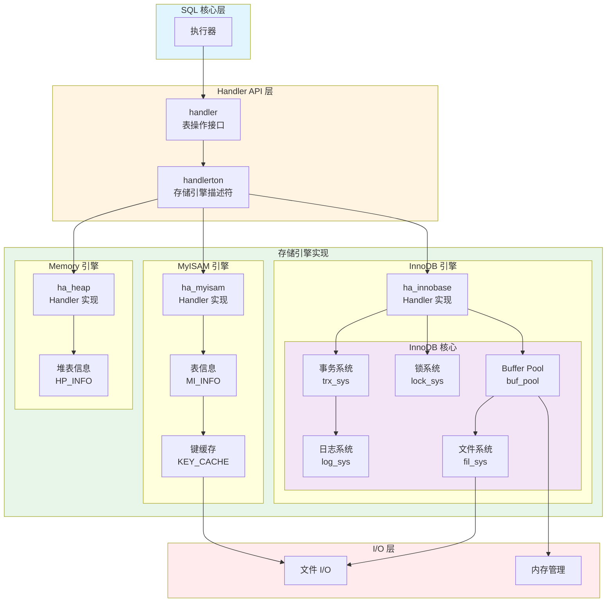
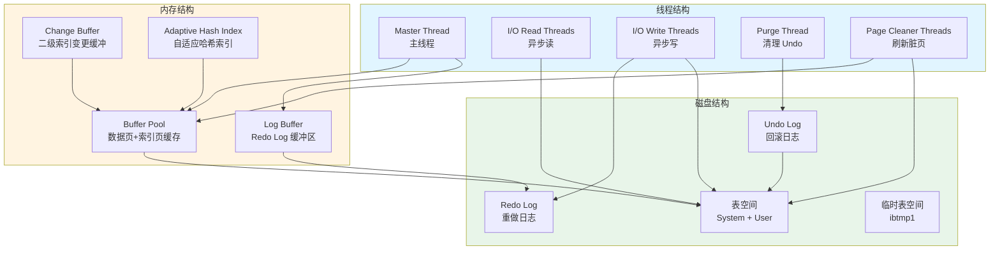
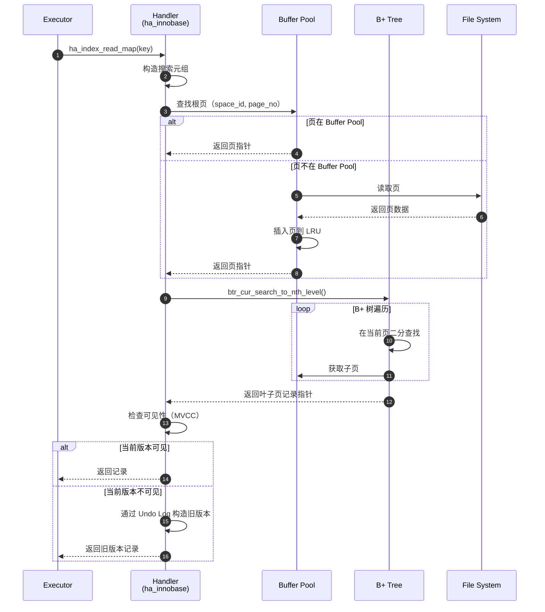
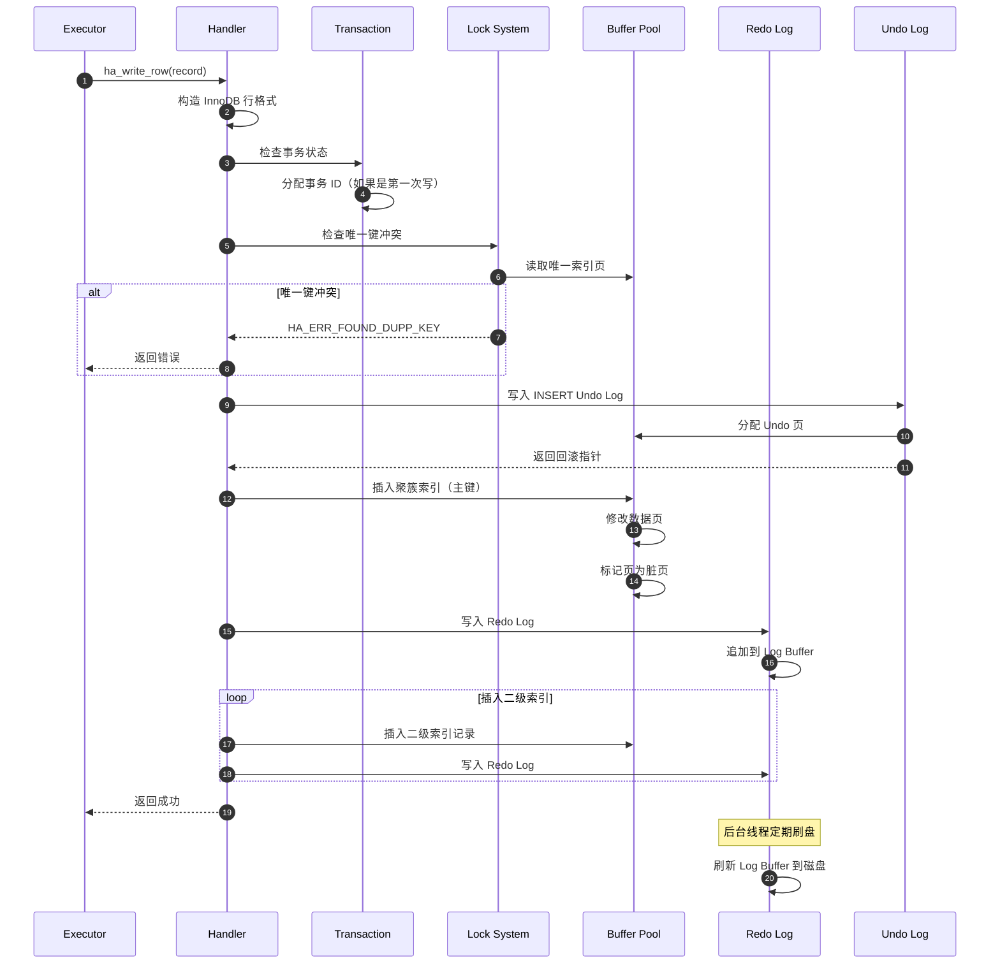
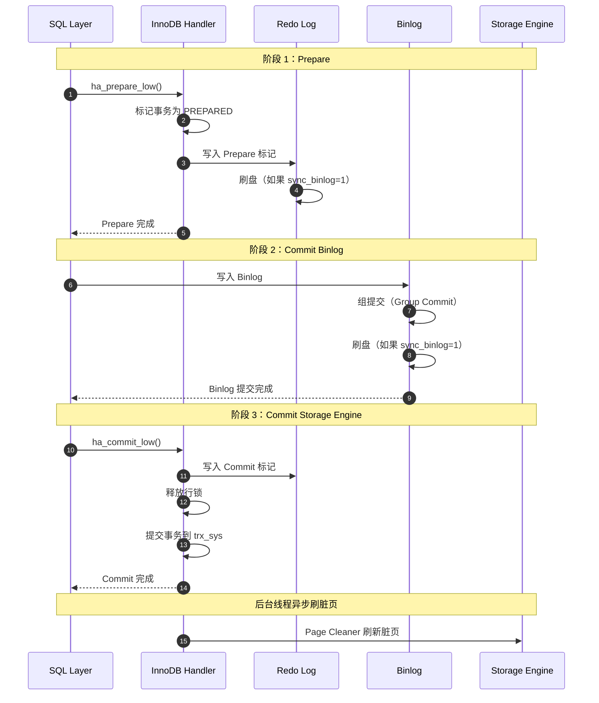

# MySQL Server 源码剖析 - 存储引擎层概览

## 一、模块职责

存储引擎层是 MySQL Server 的数据持久化层，负责数据的存储、检索和管理。它通过插件式架构实现，允许不同的存储引擎满足不同的业务需求。

### 1.1 核心职责

1. **数据存储**：将表数据持久化到磁盘
2. **数据检索**：根据索引或全表扫描方式读取数据
3. **事务管理**：ACID 特性实现（仅事务型存储引擎）
4. **并发控制**：锁机制实现（表锁或行锁）
5. **索引管理**：创建、维护和使用索引
6. **缓存管理**：内存缓冲区管理（如 InnoDB Buffer Pool）

### 1.2 输入输出

**输入**：
- SQL 层的 Handler API 调用（读写请求）
- 表结构定义（CREATE TABLE）
- 事务控制命令（BEGIN、COMMIT、ROLLBACK）

**输出**：
- 记录数据（TableRecordFormat 格式）
- 执行状态（成功、失败、错误码）
- 统计信息（行数、索引选择度等）

### 1.3 上下游依赖

**上游**：
- SQL 核心层（Executor）：通过 Handler API 调用
- 事务管理器：事务提交/回滚协调

**下游**：
- 文件 I/O 层：磁盘数据读写
- 操作系统：文件系统、内存管理

### 1.4 生命周期

**初始化阶段**：
```cpp
// 插件注册（以 InnoDB 为例）
static int innodb_init(void *p) {
  handlerton *innobase_hton = (handlerton *)p;
  
  // 设置存储引擎特性
  innobase_hton->state = SHOW_OPTION_YES;
  innobase_hton->db_type = DB_TYPE_INNODB;
  
  // 注册回调函数
  innobase_hton->create = innobase_create_handler;
  innobase_hton->commit = innobase_commit;
  innobase_hton->rollback = innobase_rollback;
  
  // 初始化 Buffer Pool
  buf_pool_init(srv_buf_pool_size, srv_buf_pool_instances);
  
  // 初始化事务系统
  trx_sys_create();
  
  return 0;
}
```

**运行阶段**：
- 为每个表实例化 handler 对象
- 处理数据读写请求
- 管理事务和锁

**关闭阶段**：
- 刷新所有脏页到磁盘
- 关闭所有打开的表
- 释放缓冲区内存
- 写入检查点

## 二、整体架构

### 2.1 存储引擎架构图



### 2.2 架构说明

#### 2.2.1 图意概述

MySQL 采用插件式存储引擎架构，通过 Handler API 层解耦 SQL 层和存储层。每个存储引擎实现统一的接口，但内部实现各异，满足不同场景需求。

#### 2.2.2 关键组件

**Handler API 层**：
- **handlerton**：存储引擎全局描述符，每个引擎一个实例
  - 存储引擎特性标志
  - 全局操作回调（事务提交/回滚、DDL 操作）
- **handler**：表级操作接口，每个打开的表一个实例
  - 记录读写（`ha_write_row`、`ha_update_row`、`ha_delete_row`）
  - 索引扫描（`ha_index_read`、`ha_index_next`）
  - 全表扫描（`ha_rnd_init`、`ha_rnd_next`）

**InnoDB 引擎**（事务型，默认引擎）：
- **事务系统（trx_sys）**：管理活动事务，分配事务 ID
- **锁系统（lock_sys）**：行锁、表锁、Gap Lock、Next-Key Lock
- **Buffer Pool**：内存缓冲区，缓存数据页和索引页
- **日志系统（log_sys）**：Redo Log（崩溃恢复）、Undo Log（MVCC）
- **文件系统（fil_sys）**：管理表空间文件

**MyISAM 引擎**（非事务型）：
- 表锁并发控制
- 压缩索引
- 全文索引（MySQL 5.6 前）

**Memory 引擎**：
- 全内存存储，服务器重启数据丢失
- 哈希索引
- 适用临时数据

#### 2.2.3 边界条件

**并发限制**：
- InnoDB：行锁，支持高并发读写
- MyISAM：表锁，读并发高，写并发低
- Memory：表锁

**容量限制**：
- InnoDB：单表 64TB（表空间限制）
- MyISAM：单表 256TB（文件系统限制）
- Memory：受限于 `max_heap_table_size`

**隔离级别**（仅 InnoDB）：
- READ UNCOMMITTED
- READ COMMITTED
- REPEATABLE READ（默认）
- SERIALIZABLE

#### 2.2.4 异常处理

**磁盘满**：
- InnoDB：停止写入，返回 `ER_DISK_FULL` 错误
- 自动扩展表空间失败

**数据损坏**：
- InnoDB：通过 Doublewrite Buffer 防止部分写
- 崩溃恢复时应用 Redo Log 修复
- 如果数据页校验和错误，标记为 corrupted

**死锁**（InnoDB）：
- 自动检测死锁（Wait-for Graph）
- 回滚代价较小的事务（修改行数少）
- 返回 `ER_LOCK_DEADLOCK` 错误

**锁等待超时**：
- InnoDB：超过 `innodb_lock_wait_timeout` 返回 `ER_LOCK_WAIT_TIMEOUT`
- MyISAM：超过 `lock_wait_timeout`

#### 2.2.5 性能与容量

**InnoDB 性能特征**：
- Buffer Pool 命中率 > 99%：内存访问，<0.01ms/行
- Buffer Pool 未命中：磁盘 I/O，HDD 约 10ms，SSD 约 0.1ms
- 索引点查询：O(log N)，约 3-4 次 I/O
- 全表扫描：O(N)，受限于磁盘带宽

**容量规划**：
- Buffer Pool 大小：物理内存的 50-75%
- Redo Log 大小：512MB - 8GB（根据写入量）
- 表空间：按需自动扩展或预分配

**性能调优参数**：
```ini
# Buffer Pool
innodb_buffer_pool_size = 8G           # 缓冲池大小
innodb_buffer_pool_instances = 8       # 实例数（多核 CPU）

# I/O
innodb_io_capacity = 2000              # SSD IOPS
innodb_io_capacity_max = 4000          # 突发 IOPS
innodb_flush_method = O_DIRECT         # 绕过 OS 缓存

# 日志
innodb_log_file_size = 2G              # Redo Log 文件大小
innodb_flush_log_at_trx_commit = 1     # 每次提交刷盘（最安全）
```

#### 2.2.6 版本演进

**MySQL 5.5**：
- InnoDB 成为默认存储引擎
- 引入 Change Buffer（优化二级索引写入）

**MySQL 5.6**：
- 全文索引支持
- Online DDL（不锁表的 ALTER TABLE）
- GTID 复制

**MySQL 5.7**：
- 空间索引优化
- InnoDB 临时表优化
- JSON 数据类型（InnoDB 存储）

**MySQL 8.0**：
- 原子 DDL（崩溃安全）
- Instant ADD COLUMN（不重建表）
- 降序索引
- 数据字典表（从文件迁移到 InnoDB 表）

## 三、Handler API 接口规范

### 3.1 handlerton 结构

**定义**：
```cpp
struct handlerton {
  SHOW_COMP_OPTION state;        // 引擎可用性状态
  enum legacy_db_type db_type;   // 引擎类型枚举
  uint slot;                     // THD 中的槽位索引
  uint savepoint_offset;         // Savepoint 数据偏移
  
  // 事务接口
  commit_t commit;               // 提交事务
  rollback_t rollback;           // 回滚事务
  prepare_t prepare;             // 两阶段提交准备
  recover_t recover;             // 崩溃恢复
  
  // DDL 接口
  create_t create;               // 创建 handler 实例
  drop_database_t drop_database; // 删除数据库
  
  // 一致性快照
  start_consistent_snapshot_t start_consistent_snapshot;
  
  // 日志操作
  flush_logs_t flush_logs;       // 刷新日志
  
  // 文件扩展名
  const char **file_extensions;  // 表文件扩展名列表
  
  // 其他回调函数
  // （此处省略：统计信息、加密、克隆等）
  
  void *data;                    // 引擎私有数据
};
```

**关键接口说明**：

**1. `commit` - 提交事务**
```cpp
static int innobase_commit(handlerton *hton, THD *thd, bool commit_trx) {
  trx_t *trx = check_trx_exists(thd);
  
  if (commit_trx) {
    // 提交普通事务
    innobase_commit_low(trx);
  } else {
    // 提交语句事务
    trx_mark_sql_stat_end(trx);
  }
  
  return 0;
}
```

**2. `rollback` - 回滚事务**
```cpp
static int innobase_rollback(handlerton *hton, THD *thd, bool rollback_trx) {
  trx_t *trx = check_trx_exists(thd);
  
  if (rollback_trx) {
    // 回滚普通事务
    trx_rollback_to_savepoint(trx, nullptr);
  } else {
    // 回滚语句事务
    trx_rollback_last_sql_stat_for_mysql(trx);
  }
  
  return 0;
}
```

**3. `create` - 创建 handler 实例**
```cpp
static handler *innobase_create_handler(handlerton *hton,
                                         TABLE_SHARE *table,
                                         bool partitioned,
                                         MEM_ROOT *mem_root) {
  // 在指定内存区域创建 handler 对象
  return new (mem_root) ha_innobase(hton, table);
}
```

### 3.2 handler 类接口

handler 类是存储引擎的表级操作接口，定义了大量虚函数供子类实现。

#### 3.2.1 模块分类

**MODULE 1: 创建/删除 handler 对象**
- 构造函数/析构函数

**MODULE 2: 元数据操作**
```cpp
virtual int create(const char *name, TABLE *form,
                   HA_CREATE_INFO *info) = 0;    // 创建表
virtual int delete_table(const char *name) = 0;  // 删除表
virtual int rename_table(const char *from,
                         const char *to) = 0;     // 重命名表
```

**MODULE 3: 打开/关闭对象**
```cpp
virtual int open(const char *name, int mode,
                 uint test_if_locked) = 0;  // 打开表
virtual int close(void) = 0;              // 关闭表
```

**MODULE 4: 事务边界**
```cpp
virtual int external_lock(THD *thd, int lock_type);  // 表锁
virtual int start_stmt(THD *thd, thr_lock_type lock_type); // 语句开始
```

**MODULE 5: 记录变更**
```cpp
virtual int write_row(uchar *buf);                   // 插入行
virtual int update_row(const uchar *old_data,
                       uchar *new_data);             // 更新行
virtual int delete_row(const uchar *buf);            // 删除行
virtual int delete_all_rows();                       // 删除所有行（TRUNCATE）
```

**MODULE 6: 全表扫描**
```cpp
virtual int rnd_init(bool scan) = 0;     // 初始化扫描
virtual int rnd_next(uchar *buf) = 0;    // 读取下一行
virtual int rnd_pos(uchar *buf, uchar *pos) = 0; // 根据位置读取
virtual void position(const uchar *record) = 0;  // 记录当前位置
virtual int rnd_end();                   // 结束扫描
```

**MODULE 7: 索引扫描**
```cpp
virtual int index_init(uint idx, bool sorted);  // 初始化索引
virtual int index_read_map(uchar *buf, const uchar *key,
                           key_part_map keypart_map,
                           enum ha_rkey_function find_flag); // 索引查找
virtual int index_next(uchar *buf);       // 下一个索引记录
virtual int index_prev(uchar *buf);       // 上一个索引记录
virtual int index_first(uchar *buf);      // 第一个索引记录
virtual int index_last(uchar *buf);       // 最后一个索引记录
virtual int index_end();                  // 结束索引扫描
```

**MODULE 8: 优化器支持**
```cpp
virtual ha_rows records();                        // 表行数
virtual double scan_time();                       // 全表扫描时间
virtual double read_time(uint index, uint ranges,
                         ha_rows rows);           // 索引读时间
virtual ha_rows records_in_range(uint inx,
                                  key_range *min_key,
                                  key_range *max_key); // 范围内行数
```

**MODULE 9: 信息查询**
```cpp
virtual int info(uint flag);                      // 获取表统计信息
```

#### 3.2.2 核心接口示例

**示例 1：索引点查询**
```cpp
int ha_innobase::index_read(uchar *buf, const uchar *key_ptr,
                             uint key_len,
                             enum ha_rkey_function find_flag) {
  // 1. 构造搜索元组
  dtuple_t *search_tuple = row_build_index_entry_from_tuple(
      m_prebuilt->index, key_ptr, key_len);
  
  // 2. 在 B+ 树中查找
  btr_pcur_t *pcur = m_prebuilt->pcur;
  btr_pcur_open_with_no_init(m_prebuilt->index, search_tuple,
                              PAGE_CUR_GE, BTR_SEARCH_LEAF,
                              pcur, 0, mtr);
  
  // 3. 读取记录到缓冲区
  rec_t *rec = btr_pcur_get_rec(pcur);
  if (rec && !rec_get_deleted_flag(rec, dict_table_is_comp(table))) {
    // 4. 转换为 MySQL 记录格式
    row_sel_store_mysql_rec(buf, m_prebuilt, rec, offsets);
    return 0; // 成功
  }
  
  return HA_ERR_KEY_NOT_FOUND; // 未找到
}
```

**示例 2：写入行**
```cpp
int ha_innobase::write_row(uchar *record) {
  // 1. 检查约束
  if (/* 唯一键冲突检查 */) {
    return HA_ERR_FOUND_DUPP_KEY;
  }
  
  // 2. 构造 InnoDB 行格式
  dtuple_t *row = row_build_row_from_mysql_row(
      m_prebuilt->table, m_prebuilt->mysql_template,
      record, m_prebuilt);
  
  // 3. 插入聚簇索引（主键）
  ins_node_t *node = m_prebuilt->ins_node;
  node->row = row;
  trx_t *trx = m_prebuilt->trx;
  que_thr_t *thr = que_fork_start_command(m_prebuilt->ins_graph);
  
  // 4. 执行插入
  dberr_t err = row_ins_step(thr);
  
  if (err == DB_SUCCESS) {
    // 5. 插入二级索引
    // （此处省略：逐个插入二级索引）
    return 0; // 成功
  }
  
  return convert_error_code_to_mysql(err, table);
}
```

## 四、InnoDB 架构深入

### 4.1 InnoDB 整体架构



### 4.2 Buffer Pool 详解

**作用**：缓存热点数据页和索引页，减少磁盘 I/O

**组成**：
```
Buffer Pool = 多个 Instance
Instance = 多个 Chunk
Chunk = 多个 Page（默认 16KB）
```

**数据结构**：
```cpp
struct buf_pool_t {
  // 互斥锁
  BufListMutex LRU_list_mutex;      // LRU 链表锁
  BufListMutex free_list_mutex;     // 空闲链表锁
  BufListMutex flush_state_mutex;   // 刷新状态锁
  
  // 链表
  UT_LIST_BASE_NODE_T(buf_page_t) free;  // 空闲页链表
  UT_LIST_BASE_NODE_T(buf_page_t) LRU;   // LRU 链表
  UT_LIST_BASE_NODE_T(buf_page_t) flush_list; // 脏页链表
  
  // 哈希表
  hash_table_t *page_hash;          // 页哈希表（space_id, page_no → buf_page_t）
  
  // 统计信息
  ulint curr_size;                  // 当前页数
  ulint n_pages_read;               // 读取页数
  ulint n_pages_written;            // 写入页数
  
  // Chunk 数组
  buf_chunk_t *chunks;              // Chunk 指针
  ulint n_chunks;                   // Chunk 数量
};
```

**LRU 算法优化**：
```
Old Sublist (37%) | Young Sublist (63%)
[Tail] ---------> [Midpoint] ---------> [Head]
  ↑                   ↑                     ↑
新读入的页          晋升点                 热点页
```

- **新读入的页**：插入 Old Sublist 头部（Midpoint）
- **访问 Old Sublist 的页**：如果在缓冲池停留时间 > `innodb_old_blocks_time`（默认 1000ms），晋升到 Young Sublist 头部
- **访问 Young Sublist 的页**：移动到 Young Sublist 头部（防止全表扫描污染）

**预读机制**：
```cpp
// 线性预读（Linear Read-Ahead）
if (连续访问 56 个页) {
  预读下一个区（Extent，64 个连续页）;
}

// 随机预读（Random Read-Ahead）
if (某个区中有 13 个页在 Buffer Pool 且被访问) {
  预读整个区;
}
```

### 4.3 MVCC 实现

**Multi-Version Concurrency Control（多版本并发控制）**

**核心思想**：
- 每行记录维护多个版本
- 读操作读取符合可见性的版本（无需加锁）
- 写操作创建新版本（仅写写冲突需要加锁）

**实现机制**：

**1. 隐藏列**
```
每行记录包含 3 个隐藏列：
- DB_TRX_ID（6 bytes）：最后修改该行的事务 ID
- DB_ROLL_PTR（7 bytes）：回滚指针，指向 Undo Log 中的旧版本
- DB_ROW_ID（6 bytes）：行 ID（无主键时使用）
```

**2. Undo Log 版本链**
```
Current Row → Undo Log 1 → Undo Log 2 → ... → NULL
   TRX_ID=100   TRX_ID=90    TRX_ID=80
```

**3. Read View（一致性视图）**
```cpp
class ReadView {
  trx_id_t m_low_limit_id;   // 当前最大事务 ID + 1（未来事务）
  trx_id_t m_up_limit_id;     // 当前最小活动事务 ID
  trx_ids_t m_ids;            // 创建 Read View 时的活动事务 ID 列表
  trx_id_t m_creator_trx_id;  // 创建 Read View 的事务 ID
  
  // 判断记录是否可见
  bool changes_visible(trx_id_t id) const {
    // 1. 自己修改的记录可见
    if (id == m_creator_trx_id)
      return true;
    
    // 2. 事务 ID < m_up_limit_id：已提交，可见
    if (id < m_up_limit_id)
      return true;
    
    // 3. 事务 ID >= m_low_limit_id：未来事务，不可见
    if (id >= m_low_limit_id)
      return false;
    
    // 4. 事务 ID 在活动事务列表中：未提交，不可见
    if (m_ids.contains(id))
      return false;
    
    // 5. 其他情况：已提交，可见
    return true;
  }
};
```

**4. 可见性判断流程**
```cpp
row_vers_build_for_consistent_read() {
  // 1. 获取当前记录的 TRX_ID
  trx_id_t trx_id = row_get_rec_trx_id(rec);
  
  // 2. 检查是否可见
  if (read_view->changes_visible(trx_id)) {
    return rec; // 当前版本可见
  }
  
  // 3. 通过 Undo Log 回滚到可见版本
  rec_t *old_vers = rec;
  do {
    old_vers = trx_undo_prev_version_build(old_vers);
    if (!old_vers)
      return nullptr; // 无可见版本
      
    trx_id = row_get_rec_trx_id(old_vers);
  } while (!read_view->changes_visible(trx_id));
  
  return old_vers; // 返回可见的旧版本
}
```

**隔离级别实现**：

| 隔离级别 | Read View 创建时机 | 特点 |
|---------|-------------------|------|
| READ UNCOMMITTED | 不使用 Read View | 读最新版本（脏读） |
| READ COMMITTED | 每次 SELECT 创建 | 读已提交数据（不可重复读） |
| REPEATABLE READ | 事务开始时创建一次 | 读快照数据（可重复读） |
| SERIALIZABLE | 加锁读 | 读写互斥（无并发问题） |

## 五、关键数据结构

### 5.1 buf_block_t（Buffer Pool 页）

```cpp
struct buf_block_t {
  buf_page_t page;              // 页控制信息
  
  byte *frame;                  // 指向实际数据页（16KB）
  
  BPageLock lock;               // 页读写锁
  
  uint32_t modify_clock;        // 修改计数（用于判断页是否被修改）
  
  hash_node_t hash;             // 哈希链表节点
  
  // 索引相关
  dict_index_t *index;          // 所属索引
  
  // LRU 链表节点
  UT_LIST_NODE_T(buf_page_t) LRU;
  
  // 状态标志
  uint32_t n_pointers;          // 引用计数
};
```

**字段说明**：
- `frame`：指向实际 16KB 数据页内存
- `lock`：读写锁，支持多读单写
- `modify_clock`：每次修改页递增，用于判断页是否在 I/O 期间被修改
- `n_pointers`：引用计数，用于防止页被淘汰

### 5.2 trx_t（事务）

```cpp
struct trx_t {
  // 事务标识
  trx_id_t id;                  // 事务 ID（读写事务才分配）
  trx_id_t no;                  // 事务序列号（提交时分配）
  
  // 事务状态
  trx_state_t state;            // TRX_STATE_ACTIVE/COMMITTED/ABORTED
  
  // 隔离级别
  enum isolation_level_t {
    READ_UNCOMMITTED,
    READ_COMMITTED,
    REPEATABLE_READ,
    SERIALIZABLE
  } isolation_level;
  
  // MVCC
  ReadView *read_view;          // 一致性视图
  
  // 锁
  lock_t *lock_heap;            // 事务持有的锁链表
  
  // Undo Log
  undo_no_t undo_no;            // Undo 记录序号
  trx_undo_t *insert_undo;      // INSERT Undo Log
  trx_undo_t *update_undo;      // UPDATE/DELETE Undo Log
  
  // 事务列表节点
  UT_LIST_NODE_T(trx_t) trx_list;
  
  // 回滚段
  trx_rseg_t *rseg;             // 分配的回滚段
  
  // 互斥锁
  TrxMutex mutex;               // 保护事务状态
  
  // 保存点
  UT_LIST_BASE_NODE_T(trx_named_savept_t) trx_savepoints;
};
```

### 5.3 lock_t（锁）

```cpp
struct lock_t {
  // 事务
  trx_t *trx;                   // 持有锁的事务
  
  // 锁类型
  uint32_t type_mode;           // LOCK_TABLE/LOCK_REC + LOCK_X/LOCK_S/LOCK_IX/LOCK_IS
  
  // 表锁或行锁
  union {
    lock_table_t tab;           // 表锁信息
    lock_rec_t rec;             // 行锁信息
  } un_member;
  
  // 锁队列
  UT_LIST_NODE_T(lock_t) trx_locks;  // 事务的锁链表节点
  
  // 哈希链表（用于快速查找）
  hash_node_t hash;
};
```

**锁类型**：
- **表锁**：`LOCK_IS`（意向共享）、`LOCK_IX`（意向排他）、`LOCK_S`、`LOCK_X`、`LOCK_AUTO_INC`
- **行锁**：`LOCK_S`、`LOCK_X`
- **Gap Lock**：锁定索引记录之间的间隙
- **Next-Key Lock**：Record Lock + Gap Lock（防止幻读）

## 六、典型场景

### 6.1 索引点查询流程



**关键步骤说明**：

1. **构造搜索元组**：将 MySQL 格式的 key 转换为 InnoDB 内部格式
2. **Buffer Pool 查找**：在哈希表中查找 `(space_id, page_no)`
3. **B+ 树遍历**：从根节点逐层向下，每层二分查找
4. **MVCC 可见性检查**：根据 Read View 判断当前版本是否可见
5. **Undo Log 回溯**：如果不可见，通过回滚指针读取旧版本

**性能分析**：
- Buffer Pool 命中：3-4 层 B+ 树遍历，约 0.01ms
- Buffer Pool 未命中：+ 磁盘 I/O，SSD 约 0.1ms，HDD 约 10ms

### 6.2 行插入流程



**关键步骤说明**：

1. **格式转换**：MySQL 记录格式 → InnoDB 行格式（Compact/Dynamic）
2. **事务 ID 分配**：第一次写操作时分配全局唯一事务 ID
3. **唯一键冲突检查**：在唯一索引中查找是否存在相同键值
4. **Undo Log 写入**：记录插入前状态（空），用于回滚
5. **聚簇索引插入**：在主键 B+ 树中插入新行
6. **Redo Log 写入**：记录物理变更，用于崩溃恢复
7. **二级索引插入**：逐个插入二级索引记录

### 6.3 事务提交流程（两阶段提交）



**两阶段提交保证一致性**：

| 崩溃时机 | Redo Log | Binlog | 恢复动作 |
|---------|----------|--------|---------|
| Prepare 前 | 无 | 无 | 回滚事务 |
| Prepare 后, Binlog 前 | Prepare | 无 | 回滚事务 |
| Binlog 后, Commit 前 | Prepare | 有 | 提交事务（通过 Binlog 恢复）|
| Commit 后 | Commit | 有 | 已提交，无需恢复 |

## 七、性能调优

### 7.1 Buffer Pool 调优

```ini
# 大小配置
innodb_buffer_pool_size = 8G              # 物理内存的 50-75%
innodb_buffer_pool_instances = 8          # 多核 CPU 使用多实例
innodb_buffer_pool_chunk_size = 128M      # Chunk 大小

# 预加载
innodb_buffer_pool_dump_at_shutdown = 1   # 关闭时保存 Buffer Pool 状态
innodb_buffer_pool_load_at_startup = 1    # 启动时恢复 Buffer Pool

# LRU 优化
innodb_old_blocks_pct = 37                # Old Sublist 占比
innodb_old_blocks_time = 1000             # 晋升到 Young 的时间阈值（ms）
```

### 7.2 I/O 调优

```ini
# 异步 I/O
innodb_use_native_aio = ON                # 使用操作系统异步 I/O
innodb_read_io_threads = 8                # 读线程数
innodb_write_io_threads = 8               # 写线程数

# I/O 容量
innodb_io_capacity = 2000                 # 正常 IOPS（SSD）
innodb_io_capacity_max = 4000             # 突发 IOPS

# 刷新策略
innodb_flush_method = O_DIRECT            # 绕过 OS 缓存
innodb_flush_neighbors = 0                # SSD 关闭邻接页刷新
```

### 7.3 日志调优

```ini
# Redo Log
innodb_log_file_size = 2G                 # 单个 Redo Log 文件大小
innodb_log_files_in_group = 2             # Redo Log 文件数量
innodb_log_buffer_size = 64M              # Log Buffer 大小
innodb_flush_log_at_trx_commit = 1        # 每次提交刷盘（最安全）

# Undo Log
innodb_max_undo_log_size = 1G             # Undo Tablespace 最大大小
innodb_purge_threads = 4                  # Purge 线程数
```

## 八、监控指标

```sql
-- Buffer Pool 状态
SHOW ENGINE INNODB STATUS\G
-- 关注：Buffer pool hit rate（命中率，目标 > 99%）

-- Buffer Pool 详细信息
SELECT * FROM information_schema.INNODB_BUFFER_POOL_STATS;

-- 活动事务
SELECT * FROM information_schema.INNODB_TRX;

-- 锁等待
SELECT * FROM information_schema.INNODB_LOCK_WAITS;

-- I/O 统计
SELECT * FROM information_schema.INNODB_METRICS
WHERE NAME LIKE 'buffer%' OR NAME LIKE 'os%';

-- 脏页比例
SHOW GLOBAL STATUS LIKE 'Innodb_buffer_pool_pages_dirty';
SHOW GLOBAL STATUS LIKE 'Innodb_buffer_pool_pages_total';
-- 脏页比例 = dirty / total，正常 < 90%
```

## 九、总结

存储引擎层是 MySQL 的数据持久化和并发控制核心。关键要点：

**架构特点**：
- 插件式设计，解耦 SQL 层和存储层
- Handler API 统一接口，支持多种存储引擎
- InnoDB 是默认引擎，提供完整的 ACID 支持

**InnoDB 核心**：
- Buffer Pool：内存缓存，LRU 算法优化
- MVCC：多版本并发控制，读写不阻塞
- Redo Log：崩溃恢复，Write-Ahead Logging
- Undo Log：回滚和 MVCC 支持
- 两阶段提交：Binlog 和 Redo Log 一致性

**性能关键**：
- Buffer Pool 命中率：> 99%
- 合理配置 I/O 参数：根据硬件调整
- 监控锁等待和死锁：及时优化 SQL
- 定期清理 Undo Log：避免表空间膨胀

后续文档将深入剖析 InnoDB 的具体实现细节。

