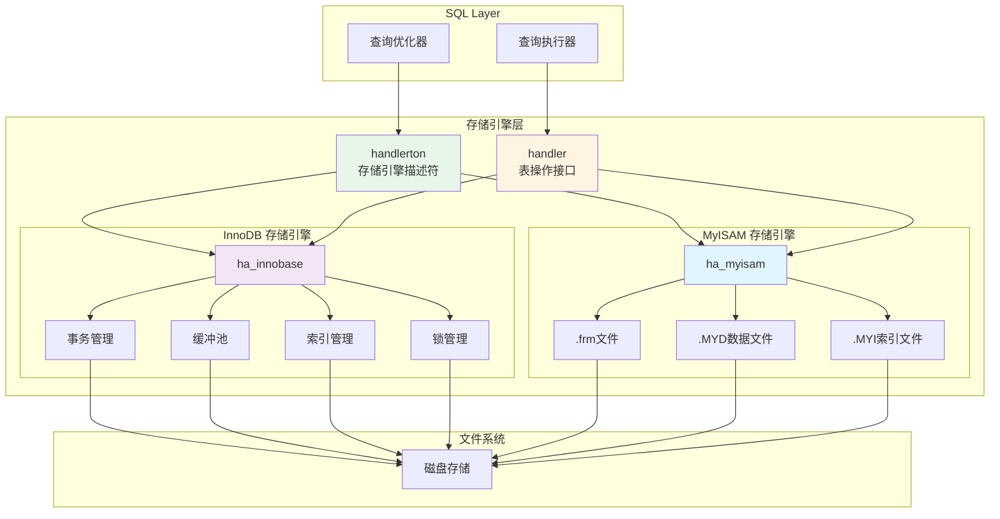
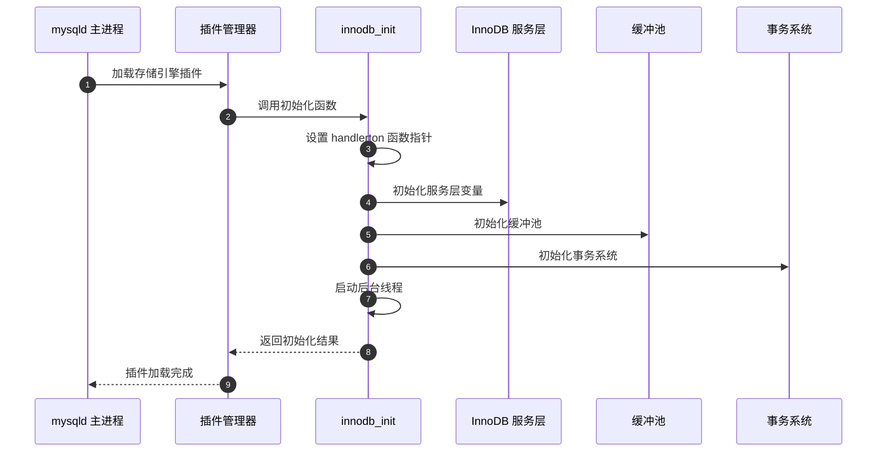
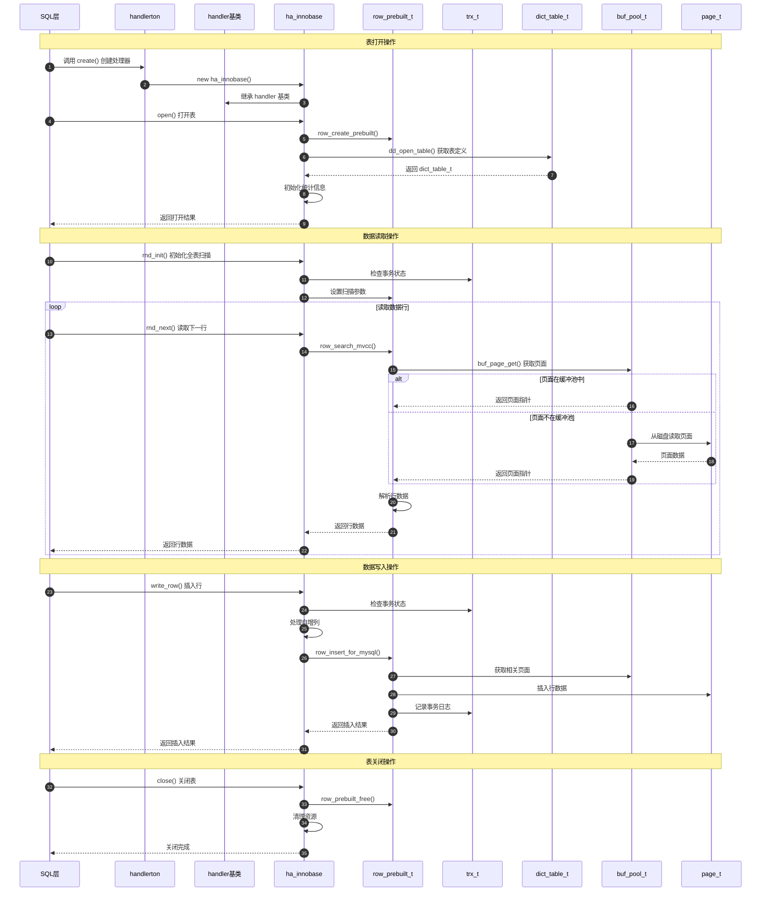
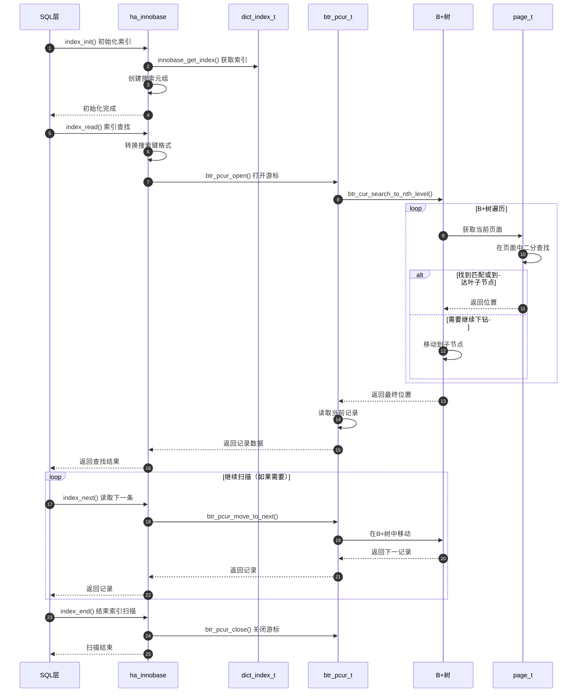

# MySQL Server 源码剖析 - 存储引擎层-API详解

## 一、模块概述

存储引擎层是 MySQL Server 的数据存储和管理核心，通过插件化的架构支持多种存储引擎。该层主要包含 `handlerton` 结构（存储引擎全局接口）、`handler` 类（表级别操作接口）和具体的存储引擎实现（如 InnoDB）。

## 二、核心架构图



## 三、handlerton 接口详解

### 3.1 handlerton 结构体

**数据结构**：
```cpp
struct handlerton {
  // 基本信息
  SHOW_COMP_OPTION state;           // 存储引擎状态
  enum legacy_db_type db_type;      // 存储引擎类型
  uint slot;                        // 插件槽位
  uint savepoint_offset;            // 保存点偏移量
  
  // 事务相关函数指针
  int (*close_connection)(handlerton *hton, THD *thd);
  void (*kill_connection)(handlerton *hton, THD *thd);
  int (*savepoint_set)(handlerton *hton, THD *thd, void *sv);
  int (*savepoint_rollback)(handlerton *hton, THD *thd, void *sv);
  bool (*savepoint_rollback_can_release_mdl)(handlerton *hton, THD *thd);
  int (*savepoint_release)(handlerton *hton, THD *thd, void *sv);
  
  // 两阶段提交
  int (*prepare)(handlerton *hton, THD *thd, bool all);
  int (*commit)(handlerton *hton, THD *thd, bool all);
  int (*rollback)(handlerton *hton, THD *thd, bool all);
  
  // XA 事务支持
  int (*recover)(handlerton *hton, XID *xid_list, uint len);
  int (*commit_by_xid)(handlerton *hton, XID *xid);
  int (*rollback_by_xid)(handlerton *hton, XID *xid);
  
  // 存储引擎实例创建
  handler *(*create)(handlerton *hton, TABLE_SHARE *table, MEM_ROOT *mem_root);
  
  // DDL 操作
  int (*drop_database)(handlerton *hton, char *path);
  int (*panic)(handlerton *hton, enum ha_panic_function flag);
  
  // 表空间管理
  int (*alter_tablespace)(handlerton *hton, THD *thd, st_alter_tablespace *ts_info);
  
  // 插件标志
  uint32 flags;                     // 存储引擎特性标志
};
```

**关键字段说明**：

| 字段 | 类型 | 功能说明 |
|------|------|---------|
| `state` | `SHOW_COMP_OPTION` | 存储引擎状态（YES/NO/DISABLED） |
| `db_type` | `enum legacy_db_type` | 存储引擎类型标识符 |
| `create` | 函数指针 | 创建表处理器实例的工厂函数 |
| `commit/rollback` | 函数指针 | 事务提交和回滚函数 |
| `prepare` | 函数指针 | 两阶段提交的准备阶段 |
| `flags` | `uint32` | 存储引擎特性标志位 |

### 3.2 InnoDB handlerton 初始化

**函数签名**：
```cpp
static int innodb_init(void *p);
```

**功能说明**：
- InnoDB 存储引擎的初始化入口点
- 设置所有 handlerton 函数指针
- 初始化 InnoDB 内部组件

**核心代码**：
```cpp
static int innodb_init(void *p) {
  DBUG_TRACE;
  
  // 获取插件服务
  acquire_plugin_services();
  
  handlerton *innobase_hton = (handlerton *)p;
  innodb_hton_ptr = innobase_hton;
  
  // 设置基本属性
  innobase_hton->state = SHOW_OPTION_YES;
  innobase_hton->db_type = DB_TYPE_INNODB;
  innobase_hton->savepoint_offset = sizeof(trx_named_savept_t);
  
  // 设置 DDL 日志函数
  innobase_hton->log_ddl_drop_schema = innobase_write_ddl_drop_schema;
  innobase_hton->log_ddl_create_schema = innobase_write_ddl_create_schema;
  
  // 设置连接管理函数
  innobase_hton->close_connection = innobase_close_connection;
  innobase_hton->kill_connection = innobase_kill_connection;
  
  // 设置事务函数
  innobase_hton->savepoint_set = innobase_savepoint;
  innobase_hton->savepoint_rollback = innobase_rollback_to_savepoint;
  innobase_hton->savepoint_rollback_can_release_mdl = 
      innobase_rollback_to_savepoint_can_release_mdl;
  innobase_hton->savepoint_release = innobase_release_savepoint;
  innobase_hton->commit = innobase_commit;
  innobase_hton->rollback = innobase_rollback;
  innobase_hton->prepare = innobase_xa_prepare;
  
  // 设置 XA 事务函数
  innobase_hton->recover = innobase_xa_recover;
  innobase_hton->recover_prepared_in_tc = innobase_xa_recover_prepared_in_tc;
  innobase_hton->commit_by_xid = innobase_commit_by_xid;
  innobase_hton->rollback_by_xid = innobase_rollback_by_xid;
  innobase_hton->set_prepared_in_tc = innobase_set_prepared_in_tc;
  innobase_hton->set_prepared_in_tc_by_xid = innobase_set_prepared_in_tc_by_xid;
  
  // 设置表处理器创建函数
  innobase_hton->create = innobase_create_handler;
  
  // 设置表空间管理函数
  innobase_hton->is_valid_tablespace_name = innobase_is_valid_tablespace_name;
  innobase_hton->alter_tablespace = innobase_alter_tablespace;
  innobase_hton->get_tablespace_filename_ext = 
      innobase_get_tablespace_filename_ext;
  
  // 设置升级相关函数
  innobase_hton->upgrade_tablespace = dd_upgrade_tablespace;
  innobase_hton->upgrade_space_version = upgrade_space_version;
  innobase_hton->upgrade_logs = dd_upgrade_logs;
  innobase_hton->finish_upgrade = dd_upgrade_finish;
  innobase_hton->pre_dd_shutdown = innodb_pre_dd_shutdown;
  
  // 初始化 InnoDB 内部组件
  if (innodb_init_srv_vars()) {
    return 1;  // 初始化失败
  }
  
  return 0;  // 初始化成功
}
```

**调用链路**：


### 3.3 存储引擎工厂函数

**函数签名**：
```cpp
static handler *innobase_create_handler(handlerton *hton, TABLE_SHARE *table, MEM_ROOT *mem_root);
```

**功能说明**：
- 为指定表创建 InnoDB 处理器实例
- 每个打开的表都会有一个对应的 handler 实例

**核心代码**：
```cpp
static handler *innobase_create_handler(handlerton *hton, 
                                        TABLE_SHARE *table, 
                                        MEM_ROOT *mem_root) {
  // 在指定内存根上分配 ha_innobase 实例
  return new (mem_root) ha_innobase(hton, table);
}
```

## 四、handler 接口详解

### 4.1 handler 基类

**类结构概述**：
```cpp
class handler {
protected:
  TABLE_SHARE *table_share;          // 表定义（多个实例共享）
  TABLE *table;                      // 当前打开的表实例
  Table_flags cached_table_flags{0}; // 缓存的表标志
  ha_rows estimation_rows_to_insert; // 预估插入行数

public:
  handlerton *ht;                    // 所属存储引擎
  uchar *ref;                        // 当前行位置指针
  uchar *dup_ref;                    // 重复行位置指针
  ha_statistics stats;               // 表统计信息
  
  // 多范围读取相关
  range_seq_t mrr_iter;
  RANGE_SEQ_IF mrr_funcs;
  HANDLER_BUFFER *multi_range_buffer;
  
  // 构造和析构
  handler(handlerton *ht_arg, TABLE_SHARE *share_arg);
  virtual ~handler(void);
  
  // 核心虚函数接口（由具体存储引擎实现）
  virtual int open(const char *name, int mode, uint test_if_locked,
                   const dd::Table *table_def) = 0;
  virtual int close(void) = 0;
  virtual int rnd_init(bool scan) = 0;
  virtual int rnd_next(uchar *buf) = 0;
  virtual int rnd_end() { return 0; }
  virtual int write_row(uchar *buf) = 0;
  virtual int update_row(const uchar *old_data, uchar *new_data) = 0;
  virtual int delete_row(const uchar *buf) = 0;
};
```

### 4.2 表操作 API

#### 4.2.1 表的打开和关闭

**打开表函数**：
```cpp
virtual int open(const char *name, int mode, uint test_if_locked, const dd::Table *table_def) = 0;
```

**参数说明**：

| 参数 | 类型 | 说明 |
|------|------|------|
| `name` | `const char *` | 表名（编码后的文件名格式） |
| `mode` | `int` | 打开模式（读写权限） |
| `test_if_locked` | `uint` | 是否测试锁状态 |
| `table_def` | `const dd::Table *` | 数据字典中的表定义 |

**InnoDB 实现**：
```cpp
int ha_innobase::open(const char *name, int, uint open_flags,
                      const dd::Table *table_def) {
  DBUG_TRACE;
  
  THD *thd = ha_thd();
  char norm_name[FN_REFLEN];
  
  // 1. 规范化表名
  normalize_table_name(norm_name, name);
  
  // 2. 获取用户线程
  m_user_thd = nullptr;
  if (thd != nullptr) {
    m_user_thd = thd;
  }
  
  // 3. 检查表是否为临时表
  bool is_temp_table = table_share->tmp_table != NO_TMP_TABLE;
  
  // 4. 构建预编译结构
  m_prebuilt = row_create_prebuilt(nullptr, table);
  
  // 5. 获取 InnoDB 表对象
  dict_table_t *ib_table = dd_open_table(
      m_prebuilt, norm_name, table_def, thd);
      
  if (ib_table == nullptr) {
    return HA_ERR_NO_SUCH_TABLE;
  }
  
  // 6. 设置表引用
  m_prebuilt->table = ib_table;
  
  // 7. 初始化统计信息
  if (table->s->tmp_table == NO_TMP_TABLE) {
    // 获取表统计信息
    update_table_stats();
  }
  
  // 8. 设置主键信息
  if (ib_table->dict_index_first_eq_primary_key()) {
    table->s->primary_key = 0;
  } else {
    table->s->primary_key = MAX_KEY;
  }
  
  return 0;
}
```

**关闭表函数**：
```cpp
int ha_innobase::close(void) {
  DBUG_TRACE;
  
  // 1. 清理预编译结构
  if (m_prebuilt != nullptr) {
    row_prebuilt_free(m_prebuilt, true);
    m_prebuilt = nullptr;
  }
  
  // 2. 清理分区相关资源
  if (m_upd_buf != nullptr) {
    ut_free(m_upd_buf);
    m_upd_buf = nullptr;
    m_upd_buf_size = 0;
  }
  
  // 3. 重置统计信息
  memset(&stats, 0, sizeof(stats));
  
  return 0;
}
```

#### 4.2.2 数据读取 API

**全表扫描初始化**：
```cpp
int ha_innobase::rnd_init(bool scan) {
  DBUG_TRACE;
  
  // 1. 检查表是否为临时表（内部表）
  if (m_prebuilt->table->is_intrinsic()) {
    return intrinsic_table_rnd_init(scan);
  }
  
  // 2. 开始读取事务（如果需要）
  TrxInInnoDB trx_in_innodb(m_prebuilt->trx);
  
  if (trx_in_innodb.is_aborted()) {
    innobase_rollback(ht, m_user_thd, false);
    return convert_error_code_to_mysql(DB_FORCED_ABORT, 0, m_user_thd);
  }
  
  // 3. 设置扫描方向和读取视图
  if (scan) {
    m_prebuilt->read_just_key = 0;  // 读取完整行
  }
  
  // 4. 初始化游标
  int err = change_active_index(MAX_KEY);
  
  return err;
}
```

**读取下一行**：
```cpp
int ha_innobase::rnd_next(uchar *buf) {
  DBUG_TRACE;
  
  ha_statistic_increment(&System_status_var::ha_read_rnd_next_count);
  
  // 1. 检查内部表
  if (m_prebuilt->table->is_intrinsic()) {
    return intrinsic_table_rnd_next(buf);
  }
  
  // 2. 设置事务上下文
  TrxInInnoDB trx_in_innodb(m_prebuilt->trx);
  
  if (trx_in_innodb.is_aborted()) {
    innobase_rollback(ht, m_user_thd, false);
    return convert_error_code_to_mysql(DB_FORCED_ABORT, 0, m_user_thd);
  }
  
  // 3. 执行行级读取
  int error = general_fetch(buf, ROW_SEL_NEXT, 0);
  
  return error;
}
```

**通用读取函数**：
```cpp
int ha_innobase::general_fetch(uchar *buf, uint direction, uint match_mode) {
  dberr_t ret;
  
  // 1. 准备读取操作
  innobase_srv_conc_enter_innodb(m_prebuilt);
  
  // 2. 根据方向执行读取
  switch (direction) {
    case ROW_SEL_NEXT:
      ret = row_search_mvcc(buf, PAGE_CUR_UNSUPP, m_prebuilt, match_mode, 0);
      break;
    case ROW_SEL_PREV:
      ret = row_search_mvcc(buf, PAGE_CUR_UNSUPP, m_prebuilt, match_mode, 1);
      break;
    default:
      ret = DB_ERROR;
  }
  
  // 3. 离开 InnoDB 并发控制
  innobase_srv_conc_exit_innodb(m_prebuilt);
  
  // 4. 转换错误码
  switch (ret) {
    case DB_SUCCESS:
      return 0;
    case DB_RECORD_NOT_FOUND:
      return HA_ERR_END_OF_FILE;
    case DB_END_OF_INDEX:
      return HA_ERR_END_OF_FILE;
    default:
      return convert_error_code_to_mysql(ret, m_prebuilt->table->flags, 
                                         m_user_thd);
  }
}
```

#### 4.2.3 数据写入 API

**插入行**：
```cpp
int ha_innobase::write_row(uchar *record) {
  DBUG_TRACE;
  
  dberr_t error;
  int error_result = 0;
  bool auto_inc_used = false;
  
  // 1. 统计计数
  ha_statistic_increment(&System_status_var::ha_write_count);
  
  // 2. 检查内部表
  if (m_prebuilt->table->is_intrinsic()) {
    return intrinsic_table_write_row(record);
  }
  
  // 3. 获取事务对象
  trx_t *trx = thd_to_trx(m_user_thd);
  TrxInInnoDB trx_in_innodb(trx);
  
  if (trx_in_innodb.is_aborted()) {
    innobase_rollback(ht, m_user_thd, false);
    return convert_error_code_to_mysql(DB_FORCED_ABORT, 0, m_user_thd);
  }
  
  // 4. 验证检查
  if (high_level_read_only) {
    ib_senderrf(ha_thd(), IB_LOG_LEVEL_WARN, ER_READ_ONLY_MODE);
    return HA_ERR_TABLE_READONLY;
  }
  
  // 5. 处理自增列
  if (table->next_number_field && record == table->record[0]) {
    if ((error_result = update_auto_increment())) {
      // 自增列处理失败
      return error_result;
    }
    auto_inc_used = true;
  }
  
  // 6. 执行插入操作
  error = row_insert_for_mysql((byte *)record, m_prebuilt);
  
  // 7. 处理插入结果
  switch (error) {
    case DB_SUCCESS:
      error_result = 0;
      // 更新统计信息
      if (!m_prebuilt->table->is_intrinsic()) {
        update_rows_inserted();
      }
      break;
      
    case DB_DUPLICATE_KEY:
      error_result = HA_ERR_FOUND_DUPP_KEY;
      break;
      
    case DB_LOCK_WAIT_TIMEOUT:
      error_result = HA_ERR_LOCK_WAIT_TIMEOUT;
      break;
      
    case DB_DEADLOCK:
      error_result = HA_ERR_LOCK_DEADLOCK;
      break;
      
    default:
      error_result = convert_error_code_to_mysql(error, 
                                                 m_prebuilt->table->flags,
                                                 m_user_thd);
  }
  
  // 8. 清理自增锁（如果使用了自增）
  if (auto_inc_used) {
    if (error_result != 0) {
      // 插入失败，回滚自增值
      m_prebuilt->autoinc_last_value = 0;
    }
  }
  
  return error_result;
}
```

**更新行**：
```cpp
int ha_innobase::update_row(const uchar *old_data, uchar *new_data) {
  DBUG_TRACE;
  
  dberr_t error;
  
  // 1. 统计计数
  ha_statistic_increment(&System_status_var::ha_update_count);
  
  // 2. 检查内部表
  if (m_prebuilt->table->is_intrinsic()) {
    return intrinsic_table_update_row(old_data, new_data);
  }
  
  // 3. 事务检查
  trx_t *trx = thd_to_trx(m_user_thd);
  TrxInInnoDB trx_in_innodb(trx);
  
  if (trx_in_innodb.is_aborted()) {
    innobase_rollback(ht, m_user_thd, false);
    return convert_error_code_to_mysql(DB_FORCED_ABORT, 0, m_user_thd);
  }
  
  // 4. 检查只读模式
  if (high_level_read_only) {
    ib_senderrf(ha_thd(), IB_LOG_LEVEL_WARN, ER_READ_ONLY_MODE);
    return HA_ERR_TABLE_READONLY;
  }
  
  // 5. 构建更新向量
  upd_t *uvect = row_get_prebuilt_update_vector(m_prebuilt);
  
  // 6. 比较旧值和新值，构建更新字段列表
  uint n_changed = 0;
  for (uint i = 0; i < table->s->fields; i++) {
    Field *field = table->field[i];
    
    if (field->cmp_binary((old_data + field->offset(table->record[0])),
                          (new_data + field->offset(table->record[0])),
                          field->max_data_length())) {
      // 字段值发生变化
      uvect->fields[n_changed].field_no = field->field_index;
      uvect->fields[n_changed].new_val.data = 
          new_data + field->offset(table->record[0]);
      uvect->fields[n_changed].new_val.len = field->data_length();
      n_changed++;
    }
  }
  
  uvect->n_fields = n_changed;
  
  // 7. 执行更新操作
  error = row_update_for_mysql((byte *)old_data, m_prebuilt);
  
  // 8. 处理更新结果
  switch (error) {
    case DB_SUCCESS:
      return 0;
    case DB_DUPLICATE_KEY:
      return HA_ERR_FOUND_DUPP_KEY;
    case DB_DEADLOCK:
      return HA_ERR_LOCK_DEADLOCK;
    case DB_LOCK_WAIT_TIMEOUT:
      return HA_ERR_LOCK_WAIT_TIMEOUT;
    default:
      return convert_error_code_to_mysql(error, m_prebuilt->table->flags,
                                         m_user_thd);
  }
}
```

### 4.3 索引操作 API

#### 4.3.1 索引扫描

**索引初始化**：
```cpp
int ha_innobase::index_init(uint keynr, bool sorted) {
  DBUG_TRACE;
  
  // 1. 检查内部表
  if (m_prebuilt->table->is_intrinsic()) {
    return intrinsic_table_index_init(keynr, sorted);
  }
  
  // 2. 设置活动索引
  active_index = keynr;
  
  // 3. 初始化索引相关结构
  m_prebuilt->index = innobase_get_index(keynr);
  
  if (m_prebuilt->index == nullptr) {
    sql_print_error("InnoDB: Could not find key number %u", keynr);
    return HA_ERR_CRASHED;
  }
  
  // 4. 设置索引方向和提示
  if (sorted) {
    m_prebuilt->used_in_HANDLER = true;
  }
  
  // 5. 预分配搜索元组空间
  if (m_prebuilt->search_tuple == nullptr) {
    m_prebuilt->search_tuple = dtuple_create(
        m_prebuilt->heap, 
        dict_index_get_n_fields(m_prebuilt->index));
  }
  
  return 0;
}
```

**索引读取**：
```cpp
int ha_innobase::index_read(uchar *buf, const uchar *key, uint key_len,
                            ha_rkey_function find_flag) {
  DBUG_TRACE;
  
  ha_statistic_increment(&System_status_var::ha_read_key_count);
  
  // 1. 检查内部表
  if (m_prebuilt->table->is_intrinsic()) {
    return intrinsic_table_index_read(buf, key, key_len, find_flag);
  }
  
  // 2. 事务检查
  TrxInInnoDB trx_in_innodb(m_prebuilt->trx);
  
  if (trx_in_innodb.is_aborted()) {
    innobase_rollback(ht, m_user_thd, false);
    return convert_error_code_to_mysql(DB_FORCED_ABORT, 0, m_user_thd);
  }
  
  // 3. 构建搜索元组
  dict_index_t *index = m_prebuilt->index;
  dtuple_t *search_tuple = m_prebuilt->search_tuple;
  
  // 将 MySQL 格式的键转换为 InnoDB 格式
  row_sel_convert_mysql_key_to_innobase(
      search_tuple, m_prebuilt->srch_key_val1, 
      m_prebuilt->srch_key_val_len, index, 
      (byte *)key, (ulint)key_len, m_prebuilt->trx);
  
  // 4. 转换查找标志
  page_cur_mode_t search_mode;
  switch (find_flag) {
    case HA_READ_KEY_EXACT:
      search_mode = PAGE_CUR_GE;
      break;
    case HA_READ_KEY_OR_NEXT:
      search_mode = PAGE_CUR_GE;
      break;
    case HA_READ_KEY_OR_PREV:
      search_mode = PAGE_CUR_LE;
      break;
    case HA_READ_BEFORE_KEY:
      search_mode = PAGE_CUR_L;
      break;
    case HA_READ_AFTER_KEY:
      search_mode = PAGE_CUR_G;
      break;
    default:
      search_mode = PAGE_CUR_UNSUPP;
  }
  
  // 5. 执行索引搜索
  dberr_t ret = row_search_mvcc(buf, search_mode, m_prebuilt, 0, 0);
  
  // 6. 处理搜索结果
  switch (ret) {
    case DB_SUCCESS:
      return 0;
    case DB_RECORD_NOT_FOUND:
      return HA_ERR_KEY_NOT_FOUND;
    case DB_END_OF_INDEX:
      return HA_ERR_KEY_NOT_FOUND;
    default:
      return convert_error_code_to_mysql(ret, m_prebuilt->table->flags,
                                         m_user_thd);
  }
}
```

## 五、InnoDB 核心组件 API

### 5.1 事务管理

**事务提交**：
```cpp
static int innobase_commit(handlerton *hton, THD *thd, bool commit_trx) {
  DBUG_TRACE;
  
  trx_t *trx = check_trx_exists(thd);
  
  if (trx == nullptr) {
    return 0;  // 无事务需要提交
  }
  
  TrxInInnoDB trx_in_innodb(trx);
  
  if (commit_trx) {
    // 提交整个事务
    if (trx_is_started(trx)) {
      trx_commit_for_mysql(trx);
    }
    
    // 清理事务对象
    trx_free_for_mysql(trx);
    thd_set_ha_data(thd, hton, nullptr);
  } else {
    // 提交语句级事务
    trx_mark_sql_stat_end(trx);
  }
  
  return 0;
}
```

**事务回滚**：
```cpp
static int innobase_rollback(handlerton *hton, THD *thd, bool rollback_trx) {
  DBUG_TRACE;
  
  trx_t *trx = check_trx_exists(thd);
  
  if (trx == nullptr) {
    return 0;
  }
  
  TrxInInnoDB trx_in_innodb(trx);
  
  if (rollback_trx) {
    // 回滚整个事务
    int error = trx_rollback_for_mysql(trx);
    
    // 清理事务对象
    trx_free_for_mysql(trx);
    thd_set_ha_data(thd, hton, nullptr);
    
    return error;
  } else {
    // 回滚语句级事务
    return trx_rollback_last_sql_stat_for_mysql(trx);
  }
}
```

### 5.2 缓冲池管理

**缓冲池结构**：
```cpp
struct buf_pool_t {
  // 缓冲池状态
  buf_pool_stat_t stat;              // 统计信息
  buf_pool_stat_t old_stat;          // 旧统计信息
  
  // 内存管理
  byte *frame_mem;                   // 页面内存区域
  byte *frame_zero;                  // 对齐后的页面内存起始地址
  
  // 页面管理
  buf_page_t *page_hash;             // 页面哈希表
  hash_table_t *page_hash_table;     // 页面哈希表结构
  
  // 空闲页面管理
  UT_LIST_BASE_NODE_T(buf_page_t) free;  // 空闲页面链表
  UT_LIST_BASE_NODE_T(buf_page_t) flush_list; // 刷新页面链表
  
  // LRU 管理
  UT_LIST_BASE_NODE_T(buf_page_t) LRU;     // LRU 链表
  buf_page_t *LRU_old;                     // LRU 老化点
  ulint LRU_old_len;                       // 老化区域长度
  
  // 并发控制
  BufListMutex LRU_list_mutex;             // LRU 链表互斥锁
  FlushListMutex flush_list_mutex;         // 刷新链表互斥锁
  BufFreeListMutex free_list_mutex;        // 空闲链表互斥锁
  
  // 刷新控制
  os_event_t no_flush[BUF_FLUSH_N_TYPES];  // 刷新完成事件
  ib_rbt_t *flush_rbt;                     // 刷新红黑树
};
```

**页面读取**：
```cpp
buf_page_t *buf_page_get_gen(ulint space_id, ulint page_no, 
                             ulint mode, buf_frame_t **frame) {
  buf_pool_t *buf_pool;
  buf_page_t *bpage;
  
  // 1. 计算页面哈希值
  ulint fold = buf_page_address_fold(space_id, page_no);
  
  // 2. 在缓冲池中查找页面
  buf_pool = buf_pool_from_array(buf_pool_index(space_id, page_no));
  
  buf_pool_mutex_enter(buf_pool);
  
  bpage = buf_page_hash_get_low(buf_pool, space_id, page_no, fold);
  
  if (bpage != nullptr) {
    // 3. 页面在缓冲池中，增加引用计数
    buf_page_fix(bpage);
    
    // 4. 更新 LRU 位置
    buf_page_make_young_if_needed(bpage);
    
    buf_pool_mutex_exit(buf_pool);
    
    *frame = buf_page_get_frame(bpage);
    return bpage;
  }
  
  // 5. 页面不在缓冲池中，需要从磁盘读取
  buf_pool_mutex_exit(buf_pool);
  
  return buf_read_page(space_id, page_no);
}
```

## 六、存储引擎 API 时序图

### 6.1 表操作完整时序图



### 6.2 索引操作时序图



## 七、关键数据结构 UML 图

### 7.1 存储引擎类层次结构

```mermaid
classDiagram
    class handlerton {
        +SHOW_COMP_OPTION state
        +enum legacy_db_type db_type
        +uint slot
        +handler *(*create)(handlerton*, TABLE_SHARE*, MEM_ROOT*)
        +int (*commit)(handlerton*, THD*, bool)
        +int (*rollback)(handlerton*, THD*, bool)
        +int (*prepare)(handlerton*, THD*, bool)
        +int (*recover)(handlerton*, XID*, uint)
        +create_handler()
        +commit_transaction()
        +rollback_transaction()
    }
    
    class handler {
        #TABLE_SHARE *table_share
        #TABLE *table
        #handlerton *ht
        +uchar *ref
        +ha_statistics stats
        +open(name, mode, flags)*
        +close()*
        +rnd_init(scan)*
        +rnd_next(buf)*
        +write_row(buf)*
        +update_row(old, new)*
        +delete_row(buf)*
        +index_init(keynr, sorted)*
        +index_read(buf, key, len, flag)*
    }
    
    class ha_innobase {
        -row_prebuilt_t *m_prebuilt
        -THD *m_user_thd
        -uchar *m_upd_buf
        -ulint m_upd_buf_size
        +open(name, mode, flags, table_def)
        +close()
        +rnd_init(scan)
        +rnd_next(buf)
        +write_row(record)
        +update_row(old_data, new_data)
        +delete_row(buf)
        +index_init(keynr, sorted)
        +index_read(buf, key, len, flag)
        +create(name, form, create_info, table_def)
        +delete_table(name, table_def)
    }
    
    class row_prebuilt_t {
        +dict_table_t *table
        +dict_index_t *index
        +trx_t *trx
        +dtuple_t *search_tuple
        +byte *row_id
        +mem_heap_t *heap
        +ulint select_lock_type
        +bool read_just_key
        +bool used_in_HANDLER
    }
    
    class dict_table_t {
        +char *name
        +ulint id
        +ulint flags
        +ulint flags2
        +dict_index_t *first_index
        +hash_node_t name_hash
        +hash_node_t id_hash
        +UT_LIST_NODE_T(dict_table_t) table_LRU
        +get_first_index()
        +get_next_index(index)
        +get_sys_col(type)
    }
    
    class dict_index_t {
        +char *name
        +ulint id
        +ulint type
        +dict_table_t *table
        +dict_field_t *fields
        +ulint n_fields
        +page_no_t page
        +btr_search_t *search_info
        +get_n_fields()
        +get_nth_field(n)
        +is_clustered()
        +is_unique()
    }
    
    handlerton ||--o{ handler : creates
    handler <|-- ha_innobase : inherits
    ha_innobase ||--|| row_prebuilt_t : contains
    row_prebuilt_t ||--|| dict_table_t : references
    dict_table_t ||--o{ dict_index_t : contains
```

### 7.2 事务和缓冲池结构

```mermaid
classDiagram
    class trx_t {
        +trx_id_t id
        +trx_state_t state
        +enum isolation_level_t isolation_level
        +ReadView *read_view
        +undo_no_t undo_no
        +trx_rseg_t *rsegs
        +lock_t *lock_heap
        +mem_heap_t *lock_heap
        +UT_LIST_NODE_T(trx_t) trx_list
        +start_time
        +commit()
        +rollback()
        +assign_read_view()
    }
    
    class buf_pool_t {
        +ulint curr_pool_size
        +ulint database_pages
        +ulint free_pages
        +ulint n_pend_reads
        +ulint n_pend_unzip
        +buf_page_t *page_hash
        +hash_table_t *page_hash_table
        +UT_LIST_BASE_NODE_T(buf_page_t) free
        +UT_LIST_BASE_NODE_T(buf_page_t) LRU
        +UT_LIST_BASE_NODE_T(buf_page_t) flush_list
        +BufListMutex LRU_list_mutex
        +FlushListMutex flush_list_mutex
        +get_page(space_id, page_no)
        +free_page(bpage)
        +flush_list_add(bpage)
    }
    
    class buf_page_t {
        +ulint space
        +ulint offset
        +buf_io_fix io_fix
        +buf_page_state state
        +lsn_t newest_modification
        +lsn_t oldest_modification
        +UT_LIST_NODE_T(buf_page_t) LRU
        +UT_LIST_NODE_T(buf_page_t) list
        +hash_node_t hash
        +fix()
        +unfix()
        +set_io_fix(io_fix)
    }
    
    class buf_block_t {
        +buf_page_t page
        +byte *frame
        +BPageMutex mutex
        +rw_lock_t lock
        +ulint lock_hash_val
        +bool check_index_page_at_flush
        +buf_buddy_free_t *buddy_free
        +get_frame()
        +get_page_no()
        +get_space_id()
    }
    
    buf_pool_t ||--o{ buf_page_t : manages
    buf_page_t <|-- buf_block_t : specializes
    trx_t ||--o{ buf_page_t : reads_writes
```

## 八、性能优化和最佳实践

### 8.1 缓冲池优化

**配置参数**：
```sql
-- 设置缓冲池大小（建议为物理内存的 70-80%）
SET GLOBAL innodb_buffer_pool_size = 8G;

-- 设置缓冲池实例数（CPU 核心数）
SET GLOBAL innodb_buffer_pool_instances = 8;

-- 缓冲池预热
SET GLOBAL innodb_buffer_pool_dump_at_shutdown = ON;
SET GLOBAL innodb_buffer_pool_load_at_startup = ON;
```

**监控缓冲池状态**：
```sql
-- 查看缓冲池状态
SHOW ENGINE INNODB STATUS\G

-- 查看缓冲池命中率
SELECT 
    (1 - (Innodb_buffer_pool_reads / Innodb_buffer_pool_read_requests)) * 100 
    AS buffer_pool_hit_rate
FROM 
    (SELECT VARIABLE_VALUE AS Innodb_buffer_pool_reads 
     FROM performance_schema.global_status 
     WHERE VARIABLE_NAME = 'Innodb_buffer_pool_reads') AS reads,
    (SELECT VARIABLE_VALUE AS Innodb_buffer_pool_read_requests 
     FROM performance_schema.global_status 
     WHERE VARIABLE_NAME = 'Innodb_buffer_pool_read_requests') AS requests;
```

### 8.2 事务优化

**事务配置**：
```sql
-- 设置事务隔离级别
SET SESSION TRANSACTION ISOLATION LEVEL READ COMMITTED;

-- 关闭自动提交（批量操作时）
SET autocommit = 0;

-- 设置锁等待超时
SET innodb_lock_wait_timeout = 50;
```

**批量操作优化**：
```cpp
// 批量插入优化示例
int ha_innobase::start_bulk_insert(ha_rows rows) {
  DBUG_TRACE;
  
  if (m_prebuilt->table->is_intrinsic()) {
    return 0;
  }
  
  // 1. 估算行数，优化缓冲池使用
  estimation_rows_to_insert = rows;
  
  // 2. 禁用唯一检查（如果安全）
  if (!(table->s->key_info[0].flags & HA_NOSAME)) {
    m_prebuilt->trx->check_unique_secondary = false;
  }
  
  // 3. 禁用外键检查（如果安全）
  m_prebuilt->trx->check_foreigns = false;
  
  return 0;
}

int ha_innobase::end_bulk_insert() {
  DBUG_TRACE;
  
  // 恢复检查设置
  m_prebuilt->trx->check_unique_secondary = true;
  m_prebuilt->trx->check_foreigns = true;
  
  return 0;
}
```

## 九、总结

存储引擎层通过 `handlerton` 和 `handler` 两级接口实现了插件化的存储引擎架构：

**handlerton 层**：
- 提供存储引擎级别的全局操作接口
- 管理事务提交、回滚、XA 恢复等
- 负责存储引擎实例的创建和生命周期管理

**handler 层**：
- 提供表级别的数据操作接口
- 支持全表扫描、索引扫描、数据修改等操作
- 通过虚函数机制实现多态调用

**InnoDB 实现**：
- `ha_innobase` 类实现了完整的 handler 接口
- 通过 `row_prebuilt_t` 结构管理查询执行上下文
- 集成了事务管理、缓冲池、索引管理等核心组件

该架构设计使得 MySQL 能够支持多种存储引擎，每种引擎都可以根据自己的特点实现最优的数据存储和访问策略，为不同的应用场景提供最佳性能。
