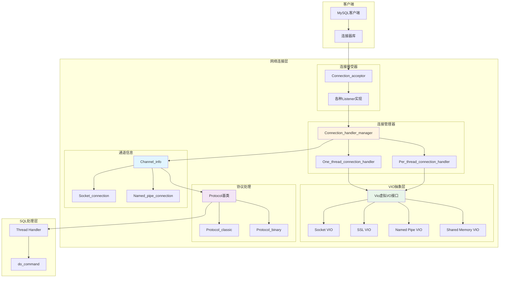
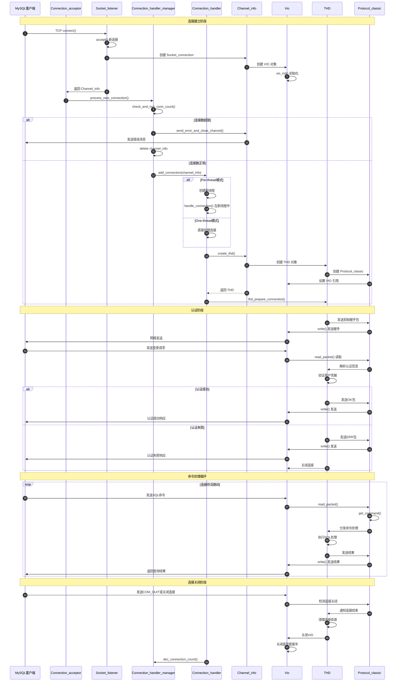
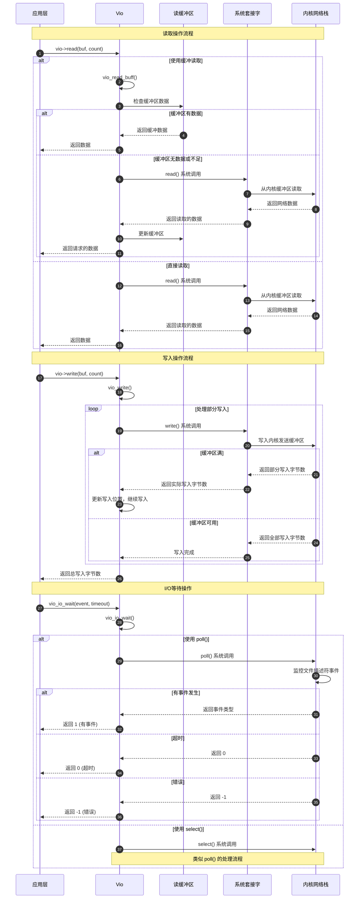

# MySQL Server 源码剖析 - 网络连接层-API详解

## 一、模块概述

网络连接层是 MySQL Server 的网络通信核心，负责处理客户端连接的建立、维护和销毁。该层主要包含 VIO（Virtual I/O）抽象层、连接管理器、协议处理器和各种传输方式的具体实现（TCP/IP、Unix Socket、Named Pipe、SSL 等）。

## 二、核心架构图



## 三、VIO 抽象层 API 详解

### 3.1 Vio 结构体

**数据结构**：
```cpp
struct Vio {
  // 基本属性
  enum enum_vio_type type;          // VIO 类型
  MYSQL_SOCKET mysql_socket;        // MySQL 套接字封装
  bool localhost;                   // 是否为本地连接
  bool inactive;                    // 是否非活动状态
  
  // 网络命名空间支持
#ifdef HAVE_SETNS
  char network_namespace[256];      // 网络命名空间名称
#endif

  // 超时设置
  int read_timeout;                 // 读取超时（毫秒）
  int write_timeout;                // 写入超时（毫秒）
  
  // 重试控制
  uint retry_count;                 // 重试次数
  
  // SSL 相关
  void *ssl_arg;                    // SSL 上下文
  
  // 缓冲区（用于缓冲读取）
  char *read_buffer;                // 读缓冲区
  char *read_pos;                   // 当前读位置
  char *read_end;                   // 读缓冲区结束位置
  
  // 函数指针（虚函数表）
  size_t (*read)(Vio *vio, uchar *buf, size_t count);
  size_t (*write)(Vio *vio, const uchar *buf, size_t count);
  int (*viodelete)(Vio *vio);
  int (*vioerrno)(Vio *vio);
  my_bool (*viokeepalive)(Vio *vio, my_bool onoff);
  int (*fastsend)(Vio *vio);
  my_bool (*peer_addr)(Vio *vio, char *buf, uint16 *port, size_t buflen);
  void (*in_addr)(Vio *vio, struct sockaddr_storage *addr);
  my_bool (*should_retry)(Vio *vio);
  my_bool (*was_timeout)(Vio *vio);
  int (*vioshutdown)(Vio *vio);
  my_bool (*is_connected)(Vio *vio);
  int (*has_data)(Vio *vio);
  int (*io_wait)(Vio *vio, enum enum_vio_io_event event, int timeout);
  my_bool (*is_blocking)(Vio *vio);
  int (*set_blocking)(Vio *vio, my_bool set_blocking);
  void (*set_blocking_flag)(Vio *vio, my_bool set_blocking);
  int (*timeout)(Vio *vio, uint which, uint timeout);

#ifdef HAVE_KQUEUE
  int kq_fd;                        // kqueue 文件描述符
#endif

#ifdef USE_PPOLL_IN_VIO
  sigset_t signal_mask;             // 信号掩码
#endif
};
```

**关键字段说明**：

| 字段 | 类型 | 功能说明 |
|------|------|---------|
| `type` | `enum_vio_type` | VIO 类型（SOCKET/SSL/PIPE/SHM） |
| `mysql_socket` | `MYSQL_SOCKET` | 底层套接字封装 |
| `read/write` | 函数指针 | 读写操作的具体实现 |
| `read_timeout/write_timeout` | `int` | 读写超时时间（毫秒） |
| `ssl_arg` | `void *` | SSL 连接的上下文信息 |
| `read_buffer` | `char *` | 读缓冲区（用于优化小包读取） |

### 3.2 VIO 初始化函数

**函数签名**：
```cpp
static bool vio_init(Vio *vio, enum enum_vio_type type, my_socket sd, uint flags);
```

**功能说明**：
- 初始化 VIO 结构体
- 根据类型设置相应的函数指针
- 支持多种传输方式的统一初始化

**核心代码**：
```cpp
static bool vio_init(Vio *vio, enum enum_vio_type type, my_socket sd, uint flags) {
  DBUG_PRINT("enter vio_init", ("type: %d sd: " MY_SOCKET_FMT " flags: %d", type, sd, flags));
  
  // 1. 设置基本属性
  mysql_socket_setfd(&vio->mysql_socket, sd);
  vio->localhost = flags & VIO_LOCALHOST;
  vio->type = type;
  
#ifdef HAVE_SETNS
  vio->network_namespace[0] = '\0';
#endif
  
  // 2. 根据类型设置函数指针
  switch (type) {
#ifdef _WIN32
    case VIO_TYPE_NAMEDPIPE:
      vio->viodelete = vio_delete;
      vio->vioerrno = vio_errno;
      vio->read = vio_read_pipe;
      vio->write = vio_write_pipe;
      vio->fastsend = vio_fastsend;
      vio->viokeepalive = vio_keepalive;
      vio->should_retry = vio_should_retry;
      vio->was_timeout = vio_was_timeout;
      vio->vioshutdown = vio_shutdown_pipe;
      vio->peer_addr = vio_peer_addr;
      vio->io_wait = no_io_wait;
      vio->is_connected = vio_is_connected_pipe;
      vio->has_data = has_no_data;
      vio->is_blocking = vio_is_blocking;
      vio->set_blocking = vio_set_blocking;
      vio->set_blocking_flag = vio_set_blocking_flag;
      vio->is_blocking_flag = true;
      break;
      
    case VIO_TYPE_SHARED_MEMORY:
      vio->viodelete = vio_delete_shared_memory;
      vio->vioerrno = vio_errno;
      vio->read = vio_read_shared_memory;
      vio->write = vio_write_shared_memory;
      vio->fastsend = vio_fastsend;
      vio->viokeepalive = vio_keepalive;
      vio->should_retry = vio_should_retry;
      vio->was_timeout = vio_was_timeout;
      vio->vioshutdown = vio_shutdown_shared_memory;
      vio->peer_addr = vio_peer_addr;
      vio->io_wait = no_io_wait;
      vio->is_connected = vio_is_connected_shared_memory;
      vio->has_data = has_no_data;
      vio->is_blocking = vio_is_blocking;
      vio->set_blocking = vio_set_blocking;
      vio->set_blocking_flag = vio_set_blocking_flag;
      vio->is_blocking_flag = true;
      break;
#endif /* _WIN32 */
      
    case VIO_TYPE_SSL:
      vio->viodelete = vio_ssl_delete;
      vio->vioerrno = vio_errno;
      vio->read = vio_ssl_read;
      vio->write = vio_ssl_write;
      vio->fastsend = vio_fastsend;
      vio->viokeepalive = vio_keepalive;
      vio->should_retry = vio_should_retry;
      vio->was_timeout = vio_was_timeout;
      vio->vioshutdown = vio_ssl_shutdown;
      vio->peer_addr = vio_peer_addr;
      vio->io_wait = vio_io_wait;
      vio->is_connected = vio_is_connected;
      vio->has_data = vio_ssl_has_data;
      vio->timeout = vio_socket_timeout;
      vio->is_blocking = vio_is_blocking;
      vio->set_blocking = vio_set_blocking;
      vio->set_blocking_flag = vio_set_blocking_flag;
      vio->is_blocking_flag = true;
      break;
      
    default:  // VIO_TYPE_TCPIP, VIO_TYPE_SOCKET
      vio->viodelete = vio_delete;
      vio->vioerrno = vio_errno;
      vio->read = vio->read_buffer ? vio_read_buff : vio_read;
      vio->write = vio_write;
      vio->fastsend = vio_fastsend;
      vio->viokeepalive = vio_keepalive;
      vio->should_retry = vio_should_retry;
      vio->was_timeout = vio_was_timeout;
      vio->vioshutdown = vio_shutdown;
      vio->peer_addr = vio_peer_addr;
      vio->io_wait = vio_io_wait;
      vio->is_connected = vio_is_connected;
      vio->timeout = vio_socket_timeout;
      vio->has_data = vio->read_buffer ? vio_buff_has_data : has_no_data;
      vio->is_blocking = vio_is_blocking;
      vio->set_blocking = vio_set_blocking;
      vio->set_blocking_flag = vio_set_blocking_flag;
      vio->is_blocking_flag = true;
      break;
  }
  
  // 3. 初始化 kqueue（macOS/FreeBSD）
#ifdef HAVE_KQUEUE
  assert(type == VIO_TYPE_TCPIP || type == VIO_TYPE_SOCKET || type == VIO_TYPE_SSL);
  vio->kq_fd = kqueue();
  if (vio->kq_fd == -1) {
    DBUG_PRINT("vio_init", ("kqueue failed with errno: %d", errno));
    return true;
  }
#endif
  
  return false;
}
```

### 3.3 VIO 创建函数

**套接字 VIO 创建**：
```cpp
Vio *mysql_socket_vio_new(MYSQL_SOCKET mysql_socket, enum_vio_type type, uint flags) {
  Vio *vio;
  my_socket const sd = mysql_socket_getfd(mysql_socket);
  DBUG_TRACE;
  DBUG_PRINT("enter", ("sd: " MY_SOCKET_FMT, sd));
  
  // 1. 分配 VIO 结构体内存
  if ((vio = internal_vio_create(flags))) {
    // 2. 初始化 VIO
    if (vio_init(vio, type, sd, flags)) {
      internal_vio_delete(vio);
      return nullptr;
    }
    // 3. 设置 MySQL 套接字
    vio->mysql_socket = mysql_socket;
  }
  return vio;
}
```

**通用 VIO 创建**：
```cpp
Vio *vio_new(my_socket sd, enum enum_vio_type type, uint flags) {
  Vio *vio;
  MYSQL_SOCKET mysql_socket = MYSQL_INVALID_SOCKET;
  DBUG_TRACE;
  DBUG_PRINT("enter", ("sd: " MY_SOCKET_FMT, sd));
  
  mysql_socket_setfd(&mysql_socket, sd);
  vio = mysql_socket_vio_new(mysql_socket, type, flags);
  
  return vio;
}
```

### 3.4 VIO I/O 操作 API

#### 3.4.1 读取操作

**缓冲读取函数**：
```cpp
size_t vio_read_buff(Vio *vio, uchar *buf, size_t count) {
  size_t rc;
  DBUG_TRACE;
  DBUG_PRINT("enter", ("fd: %d buf: %p count: %zu", 
                       mysql_socket_getfd(vio->mysql_socket), buf, count));
  
  // 1. 检查缓冲区是否有数据
  if (vio->read_pos < vio->read_end) {
    // 从缓冲区读取数据
    size_t bytes_from_buffer = min(count, (size_t)(vio->read_end - vio->read_pos));
    memcpy(buf, vio->read_pos, bytes_from_buffer);
    vio->read_pos += bytes_from_buffer;
    
    if (bytes_from_buffer == count) {
      return count;  // 缓冲区数据足够
    }
    
    // 需要读取更多数据
    buf += bytes_from_buffer;
    count -= bytes_from_buffer;
    rc = bytes_from_buffer;
  } else {
    rc = 0;
  }
  
  // 2. 直接从套接字读取
  if (count >= VIO_READ_BUFFER_SIZE) {
    // 大数据块直接读取，不使用缓冲区
    size_t bytes = vio_read(vio, buf, count);
    return rc + bytes;
  } else {
    // 小数据块使用缓冲读取
    size_t bytes = vio_read(vio, (uchar*)vio->read_buffer, VIO_READ_BUFFER_SIZE);
    if (bytes <= 0) {
      return rc > 0 ? rc : bytes;
    }
    
    vio->read_pos = vio->read_buffer;
    vio->read_end = vio->read_buffer + bytes;
    
    // 从新填充的缓冲区读取
    size_t bytes_from_buffer = min(count, bytes);
    memcpy(buf, vio->read_pos, bytes_from_buffer);
    vio->read_pos += bytes_from_buffer;
    
    return rc + bytes_from_buffer;
  }
}
```

**基础读取函数**：
```cpp
size_t vio_read(Vio *vio, uchar *buf, size_t count) {
  size_t readbytes, remainingwbytes;
  uint retry_count = 0;
  DBUG_TRACE;
  
  // 1. 参数检查
  if (count == 0) return 0;
  if (vio->inactive) {
    errno = ECONNRESET;
    return -1;
  }
  
  // 2. 循环读取（处理中断和部分读取）
  for (readbytes = 0; readbytes < count; readbytes += remainingwbytes) {
    errno = 0;
#ifdef _WIN32
    remainingwbytes = recv(mysql_socket_getfd(vio->mysql_socket),
                          (char*)(buf + readbytes),
                          (int)(count - readbytes), 0);
#else
    remainingwbytes = read(mysql_socket_getfd(vio->mysql_socket),
                          buf + readbytes,
                          count - readbytes);
#endif
    
    // 3. 处理读取结果
    if (remainingwbytes <= 0) {
      if (remainingwbytes == 0) {
        return readbytes;  // 连接关闭
      }
      
      // 处理错误和重试
      if (vio_should_retry(vio) && retry_count++ < vio->retry_count) {
        continue;
      }
      
      if (vio_was_timeout(vio)) {
        return -1;  // 超时
      }
      
      return readbytes > 0 ? readbytes : -1;  // 错误
    }
  }
  
  return readbytes;
}
```

#### 3.4.2 写入操作

**基础写入函数**：
```cpp
size_t vio_write(Vio *vio, const uchar *buf, size_t count) {
  size_t writtenbytes, remainingbytes;
  uint retry_count = 0;
  DBUG_TRACE;
  
  // 1. 参数检查
  if (count == 0) return 0;
  if (vio->inactive) {
    errno = ECONNRESET;
    return -1;
  }
  
  // 2. 循环写入（处理中断和部分写入）
  for (writtenbytes = 0; writtenbytes < count; writtenbytes += remainingbytes) {
    errno = 0;
#ifdef _WIN32
    remainingbytes = send(mysql_socket_getfd(vio->mysql_socket),
                         (const char*)(buf + writtenbytes),
                         (int)(count - writtenbytes), 0);
#else
    remainingbytes = write(mysql_socket_getfd(vio->mysql_socket),
                          buf + writtenbytes,
                          count - writtenbytes);
#endif
    
    // 3. 处理写入结果
    if (remainingbytes <= 0) {
      if (remainingbytes == 0) {
        break;  // 连接关闭
      }
      
      // 处理错误和重试
      if (vio_should_retry(vio) && retry_count++ < vio->retry_count) {
        continue;
      }
      
      if (vio_was_timeout(vio)) {
        return -1;  // 超时
      }
      
      return writtenbytes > 0 ? writtenbytes : -1;  // 错误
    }
  }
  
  return writtenbytes;
}
```

### 3.5 VIO I/O 等待

**I/O 事件等待函数**：
```cpp
int vio_io_wait(Vio *vio, enum enum_vio_io_event event, int timeout) {
  int ret;
  DBUG_TRACE;
  DBUG_PRINT("enter", ("fd: %d event: %d timeout: %d", 
                       mysql_socket_getfd(vio->mysql_socket), event, timeout));
  
  // 1. 检查连接状态
  if (vio->inactive) {
    return -1;
  }
  
  // 2. 准备轮询结构
#ifdef HAVE_POLL
  struct pollfd fds;
  fds.fd = mysql_socket_getfd(vio->mysql_socket);
  fds.events = 0;
  fds.revents = 0;
  
  if (event & VIO_IO_EVENT_READ) {
    fds.events |= POLLIN;
  }
  if (event & VIO_IO_EVENT_WRITE) {
    fds.events |= POLLOUT;
  }
  
  // 3. 执行轮询
#ifdef USE_PPOLL_IN_VIO
  struct timespec timeout_ts;
  if (timeout >= 0) {
    timeout_ts.tv_sec = timeout / 1000;
    timeout_ts.tv_nsec = (timeout % 1000) * 1000000;
    ret = ppoll(&fds, 1, &timeout_ts, &vio->signal_mask);
  } else {
    ret = ppoll(&fds, 1, nullptr, &vio->signal_mask);
  }
#else
  ret = poll(&fds, 1, timeout);
#endif /* USE_PPOLL_IN_VIO */
  
  // 4. 处理轮询结果
  if (ret < 0) {
    return -1;  // 错误
  } else if (ret == 0) {
    return 0;   // 超时
  } else {
    // 检查具体事件
    if (fds.revents & (POLLERR | POLLHUP | POLLNVAL)) {
      return -1;  // 连接错误
    }
    return 1;     // 有事件发生
  }
  
#else /* !HAVE_POLL */
  // 使用 select() 作为后备
  fd_set readfds, writefds, exceptfds;
  struct timeval tv;
  my_socket fd = mysql_socket_getfd(vio->mysql_socket);
  
  FD_ZERO(&readfds);
  FD_ZERO(&writefds);
  FD_ZERO(&exceptfds);
  
  if (event & VIO_IO_EVENT_READ) {
    FD_SET(fd, &readfds);
  }
  if (event & VIO_IO_EVENT_WRITE) {
    FD_SET(fd, &writefds);
  }
  FD_SET(fd, &exceptfds);
  
  if (timeout >= 0) {
    tv.tv_sec = timeout / 1000;
    tv.tv_usec = (timeout % 1000) * 1000;
    ret = select((int)(fd + 1), &readfds, &writefds, &exceptfds, &tv);
  } else {
    ret = select((int)(fd + 1), &readfds, &writefds, &exceptfds, nullptr);
  }
  
  if (ret < 0) {
    return -1;
  } else if (ret == 0) {
    return 0;
  } else {
    if (FD_ISSET(fd, &exceptfds)) {
      return -1;
    }
    return 1;
  }
#endif /* HAVE_POLL */
}
```

## 四、连接管理器 API 详解

### 4.1 连接管理器核心结构

**Connection_handler_manager 类**：
```cpp
class Connection_handler_manager {
private:
  static Connection_handler_manager *m_instance;
  Connection_handler *m_connection_handler;
  scheduler_types m_scheduler_type;
  uint m_max_connections;
  ulong m_aborted_connects;
  ulong m_connection_count;
  mysql_mutex_t m_LOCK_connection_count;
  
public:
  enum scheduler_types {
    SCHEDULER_ONE_THREAD_PER_CONNECTION = 0,
    SCHEDULER_NO_THREADS = 1
  };
  
  // 单例模式
  static Connection_handler_manager *get_instance();
  
  // 连接处理
  bool process_new_connection(Channel_info *channel_info);
  
  // 连接计数管理
  static bool check_and_incr_conn_count(bool is_admin_connection, bool no_errors);
  static void dec_connection_count();
  
  // 错误统计
  void inc_aborted_connects() { m_aborted_connects++; }
  ulong get_aborted_connects() const { return m_aborted_connects; }
  
  // 连接处理器管理
  bool load_connection_handler(Connection_handler *connection_handler);
  bool unload_connection_handler();
  
  // 初始化和销毁
  bool init();
  bool destroy();
};
```

### 4.2 连接处理器初始化

**函数签名**：
```cpp
bool Connection_handler_manager::init();
```

**功能说明**：
- 根据配置选择连接处理策略
- 初始化相应的连接处理器
- 设置连接数限制和统计

**核心代码**：
```cpp
bool Connection_handler_manager::init() {
  Connection_handler *connection_handler = nullptr;
  
  // 1. 根据 thread_handling 配置选择处理器
  switch (thread_handling) {
    case SCHEDULER_ONE_THREAD_PER_CONNECTION:
      connection_handler = new (std::nothrow) Per_thread_connection_handler();
      break;
      
    case SCHEDULER_NO_THREADS:
      connection_handler = new (std::nothrow) One_thread_connection_handler();
      break;
      
    default:
      assert(false);  // 不应该到达这里
  }
  
  // 2. 检查分配是否成功
  if (connection_handler == nullptr) {
    sql_print_error("Could not allocate memory for connection handler.");
    return true;
  }
  
  // 3. 设置连接处理器
  m_connection_handler = connection_handler;
  m_scheduler_type = thread_handling;
  
  // 4. 初始化连接计数器
  m_max_connections = max_connections;
  m_connection_count = 0;
  m_aborted_connects = 0;
  
  // 5. 初始化互斥锁
  mysql_mutex_init(key_LOCK_connection_count, &m_LOCK_connection_count, 
                   MY_MUTEX_INIT_FAST);
  
  return false;
}
```

### 4.3 新连接处理

**函数签名**：
```cpp
void Connection_handler_manager::process_new_connection(Channel_info *channel_info);
```

**功能说明**：
- 处理新的客户端连接请求
- 检查连接数限制
- 分发连接到具体的处理器

**核心代码**：
```cpp
void Connection_handler_manager::process_new_connection(Channel_info *channel_info) {
  // 1. 检查是否应该停止接受连接
  if (connection_events_loop_aborted() ||
      !check_and_incr_conn_count(channel_info->is_admin_connection(), false)) {
    // 发送连接数超限错误并关闭连接
    channel_info->send_error_and_close_channel(ER_CON_COUNT_ERROR, 0, true);
    delete channel_info;
    return;
  }
  
  // 2. 将连接交给连接处理器
  if (m_connection_handler->add_connection(channel_info)) {
    // 连接处理失败，增加中止连接计数
    inc_aborted_connects();
    delete channel_info;
  }
}
```

### 4.4 连接数管理

**连接数检查和增加**：
```cpp
bool Connection_handler_manager::check_and_incr_conn_count(bool is_admin_connection, 
                                                          bool no_errors) {
  bool connection_accepted = true;
  mysql_mutex_lock(&m_LOCK_connection_count);
  
  // 1. 检查是否超过最大连接数
  if (!is_admin_connection &&
      m_connection_count >= m_max_connections &&
      m_max_connections > 0) {
    connection_accepted = false;
    
    if (!no_errors) {
      // 记录错误日志
      sql_print_error("Too many connections");
    }
  } else {
    // 2. 增加连接计数
    ++m_connection_count;
    
    // 3. 更新统计信息
    if (m_connection_count > max_used_connections) {
      max_used_connections = m_connection_count;
    }
  }
  
  mysql_mutex_unlock(&m_LOCK_connection_count);
  return connection_accepted;
}
```

**连接数减少**：
```cpp
void Connection_handler_manager::dec_connection_count() {
  mysql_mutex_lock(&m_LOCK_connection_count);
  
  if (m_connection_count > 0) {
    --m_connection_count;
  }
  
  mysql_mutex_unlock(&m_LOCK_connection_count);
  
  // 通知可能等待的监听线程
  mysql_cond_broadcast(&COND_thread_count);
}
```

## 五、连接处理器实现

### 5.1 每连接一线程处理器

**Per_thread_connection_handler 类**：
```cpp
class Per_thread_connection_handler : public Connection_handler {
private:
  pthread_handler_t *pthread_handler;
  
public:
  Per_thread_connection_handler() : pthread_handler(nullptr) {}
  
  virtual bool add_connection(Channel_info *channel_info);
  virtual uint get_max_threads() const;
};
```

**添加连接函数**：
```cpp
bool Per_thread_connection_handler::add_connection(Channel_info *channel_info) {
  // 1. 检查线程数限制
  if (my_atomic_load32(&thread_count) >= max_connections) {
    channel_info->send_error_and_close_channel(ER_CON_COUNT_ERROR, 0, true);
    return true;
  }
  
  // 2. 创建新线程处理连接
  pthread_t thread_id;
  pthread_attr_t attr;
  
  pthread_attr_init(&attr);
  pthread_attr_setdetachstate(&attr, PTHREAD_CREATE_DETACHED);
  
  // 设置线程栈大小
  if (thread_stack) {
    pthread_attr_setstacksize(&attr, thread_stack);
  }
  
  // 3. 启动线程
  int error = mysql_thread_create(key_thread_one_connection, 
                                  &thread_id, &attr,
                                  handle_connection,
                                  (void *)channel_info);
  
  pthread_attr_destroy(&attr);
  
  if (error) {
    // 线程创建失败
    connection_errors_internal++;
    channel_info->send_error_and_close_channel(ER_OUT_OF_RESOURCES, 0, false);
    return true;
  }
  
  // 4. 增加线程计数
  my_atomic_add32(&thread_count, 1);
  my_atomic_add32(&thread_running, 1);
  
  return false;
}
```

**连接处理线程函数**：
```cpp
extern "C" {
static void *handle_connection(void *arg) {
  Global_THD_manager *thd_manager = Global_THD_manager::get_instance();
  Connection_handler_manager *handler_manager = 
      Connection_handler_manager::get_instance();
  Channel_info *channel_info = static_cast<Channel_info *>(arg);
  
  // 1. 初始化线程
  if (my_thread_init()) {
    connection_errors_internal++;
    channel_info->send_error_and_close_channel(ER_OUT_OF_RESOURCES, 0, false);
    handler_manager->inc_aborted_connects();
    Connection_handler_manager::dec_connection_count();
    delete channel_info;
    my_thread_exit(nullptr);
    return nullptr;
  }
  
  // 2. 连接处理循环
  for (;;) {
    // 创建 THD 对象
    THD *thd = init_new_thd(channel_info);
    if (thd == nullptr) {
      connection_errors_internal++;
      handler_manager->inc_aborted_connects();
      Connection_handler_manager::dec_connection_count();
      break;
    }
    
    // 设置性能监控
#ifdef HAVE_PSI_THREAD_INTERFACE
    PSI_thread *psi = PSI_THREAD_CALL(new_thread)(key_thread_one_connection,
                                                  0, thd, thd->thread_id());
    PSI_THREAD_CALL(set_thread_os_id)(psi);
    PSI_THREAD_CALL(set_thread)(psi);
    thd->set_psi(psi);
#endif
    
    mysql_thread_set_psi_id(thd->thread_id());
    mysql_thread_set_psi_THD(thd);
    
    const MYSQL_SOCKET socket = 
        thd->get_protocol_classic()->get_vio()->mysql_socket;
    mysql_socket_set_thread_owner(socket);
    
    // 3. 将 THD 加入全局管理器
    thd_manager->add_thd(thd);
    
    // 4. 连接准备和处理
    if (thd_prepare_connection(thd)) {
      handler_manager->inc_aborted_connects();
    } else {
      // 命令处理循环
      while (thd_connection_alive(thd)) {
        if (do_command(thd)) break;
      }
      end_connection(thd);
    }
    
    // 5. 清理连接
    close_connection(thd, 0, false, false);
    thd->get_stmt_da()->reset_diagnostics_area();
    thd->release_resources();
    
    // 清理 OpenSSL 错误状态
#if OPENSSL_VERSION_NUMBER < 0x10100000L
    ERR_remove_thread_state(nullptr);
#endif
    
    // 6. 从全局管理器移除 THD
    thd_manager->remove_thd(thd);
    Connection_handler_manager::dec_connection_count();
    
    // 清理性能监控
#ifdef HAVE_PSI_THREAD_INTERFACE
    thd->set_psi(nullptr);
    mysql_thread_set_psi_THD(nullptr);
    PSI_THREAD_CALL(delete_current_thread)();
#endif
    
    delete thd;
    
    // 7. 检查是否应该退出
    if (connection_events_loop_aborted()) break;
    
    // 如果有可用的 channel_info，继续处理下一个连接
    channel_info = nullptr;  // 通常这里会从连接池获取新连接
    if (channel_info == nullptr) break;
  }
  
  // 8. 减少线程计数
  my_atomic_add32(&thread_count, -1);
  my_atomic_add32(&thread_running, -1);
  
  my_thread_end();
  return nullptr;
}
}
```

### 5.2 单线程连接处理器

**One_thread_connection_handler 类**：
```cpp
class One_thread_connection_handler : public Connection_handler {
public:
  virtual bool add_connection(Channel_info *channel_info);
  virtual uint get_max_threads() const { return 1; }
};
```

**添加连接函数**：
```cpp
bool One_thread_connection_handler::add_connection(Channel_info *channel_info) {
  // 1. 初始化线程环境（如果需要）
  if (my_thread_init()) {
    connection_errors_internal++;
    channel_info->send_error_and_close_channel(ER_OUT_OF_RESOURCES, 0, false);
    Connection_handler_manager::dec_connection_count();
    return true;
  }
  
  // 2. 创建 THD 对象
  THD *thd = channel_info->create_thd();
  if (thd == nullptr) {
    connection_errors_internal++;
    channel_info->send_error_and_close_channel(ER_OUT_OF_RESOURCES, 0, false);
    Connection_handler_manager::dec_connection_count();
    return true;
  }
  
  // 3. 设置线程 ID 和栈
  thd->set_new_thread_id();
  thd_set_thread_stack(thd, (char *)&thd);
  thd->store_globals();
  
  // 4. 设置性能监控
  mysql_thread_set_psi_id(thd->thread_id());
  mysql_socket_set_thread_owner(
      thd->get_protocol_classic()->get_vio()->mysql_socket);
  
  // 5. 将 THD 加入全局管理器
  Global_THD_manager *thd_manager = Global_THD_manager::get_instance();
  thd_manager->add_thd(thd);
  
  // 6. 处理连接
  bool error = false;
  if (thd_prepare_connection(thd)) {
    error = true;
  } else {
    delete channel_info;  // 不再需要 channel_info
    
    // 命令处理循环
    while (thd_connection_alive(thd)) {
      if (do_command(thd)) break;
    }
    end_connection(thd);
  }
  
  // 7. 清理连接
  close_connection(thd, 0, false, false);
  thd->release_resources();
  thd_manager->remove_thd(thd);
  Connection_handler_manager::dec_connection_count();
  delete thd;
  
  return error;
}
```

## 六、协议处理 API 详解

### 6.1 Protocol 基类

**Protocol 类结构**：
```cpp
class Protocol {
protected:
  THD *m_thd;
  String *packet;
  String *convert;
  uint field_pos;
  bool field_types_set;
  List<Item> *fields;
  
public:
  enum enum_protocol_type {
    PROTOCOL_TEXT = 0,
    PROTOCOL_BINARY = 1,
    PROTOCOL_LOCAL = 2,
    PROTOCOL_ERROR = 3,
    PROTOCOL_PLUGIN = 4
  };
  
  Protocol(THD *thd_arg) : m_thd(thd_arg) {}
  virtual ~Protocol() = default;
  
  // 纯虚函数，由具体协议实现
  virtual bool read_packet() = 0;
  virtual int get_command(enum_server_command *command, 
                         uchar **packet, size_t *packet_length) = 0;
  virtual enum enum_protocol_type type() const = 0;
  
  // 结果集发送
  virtual bool start_result_metadata(uint num_cols, uint flags,
                                    const CHARSET_INFO *resultcs);
  virtual bool send_field_metadata(Send_field *field, 
                                  const CHARSET_INFO *charset);
  virtual bool end_result_metadata();
  virtual bool start_row();
  virtual bool end_row();
  virtual void abort_row() {}
  
  // 数据发送
  virtual bool store_null() = 0;
  virtual bool store_tiny(longlong from, bool is_unsigned) = 0;
  virtual bool store_short(longlong from, bool is_unsigned) = 0;
  virtual bool store_long(longlong from, bool is_unsigned) = 0;
  virtual bool store_longlong(longlong from, bool is_unsigned) = 0;
  virtual bool store_decimal(const my_decimal *d, uint precision, uint scale) = 0;
  virtual bool store_string(const char *from, size_t length, 
                           const CHARSET_INFO *fromcs) = 0;
  virtual bool store_float(float from, uint32 decimals) = 0;
  virtual bool store_double(double from, uint32 decimals) = 0;
  virtual bool store_datetime(const MYSQL_TIME &time, uint precision) = 0;
  virtual bool store_date(const MYSQL_TIME &time) = 0;
  virtual bool store_time(const MYSQL_TIME &time, uint precision) = 0;
  
  // 连接管理
  virtual void end_partial_result_set() {}
  virtual int shutdown(bool server_shutdown = false) { return 0; }
  virtual bool connection_alive() const { return true; }
  
  // 获取 VIO
  virtual class Vio *get_vio() = 0;
  virtual void set_vio(Vio *vio) = 0;
};
```

### 6.2 经典协议实现

**Protocol_classic 类**：
```cpp
class Protocol_classic : public Protocol {
private:
  Vio *vio;
  uint client_capabilities;
  bool has_client_capability;
  ulong max_packet_size;
  
  // 数据包处理
  uchar *packet_ptr;
  uchar *packet_end;
  
  // 压缩支持
  bool compression_enabled;
  ulong compression_threshold;
  
public:
  Protocol_classic(THD *thd_arg) : Protocol(thd_arg) {}
  
  // 实现基类虚函数
  bool read_packet() override;
  int get_command(enum_server_command *command, 
                 uchar **packet, size_t *packet_length) override;
  enum enum_protocol_type type() const override { return PROTOCOL_TEXT; }
  
  // VIO 管理
  class Vio *get_vio() override { return vio; }
  void set_vio(Vio *vio_arg) override { vio = vio_arg; }
  
  // 数据发送实现
  bool store_null() override;
  bool store_tiny(longlong from, bool is_unsigned) override;
  bool store_short(longlong from, bool is_unsigned) override;
  bool store_long(longlong from, bool is_unsigned) override;
  bool store_longlong(longlong from, bool is_unsigned) override;
  bool store_string(const char *from, size_t length, 
                   const CHARSET_INFO *fromcs) override;
  
  // 协议特定功能
  bool authenticate();
  void set_client_capabilities(uint client_capabilities_arg) {
    client_capabilities = client_capabilities_arg;
    has_client_capability = true;
  }
  uint get_client_capabilities() const { return client_capabilities; }
};
```

**数据包读取函数**：
```cpp
bool Protocol_classic::read_packet() {
  ulong packet_length;
  
  // 1. 读取数据包长度（3字节）+ 序列号（1字节）
  uchar header[4];
  if (vio->read(vio, header, 4) < 4) {
    return true;  // 读取失败
  }
  
  // 2. 解析包头
  packet_length = uint3korr(header);
  uchar packet_number = header[3];
  
  // 3. 检查包长度
  if (packet_length > max_packet_size) {
    sql_print_error("Packet too large (%lu > %lu)", packet_length, max_packet_size);
    return true;
  }
  
  // 4. 分配数据包缓冲区
  if (packet->alloc(packet_length + 1)) {
    return true;  // 内存分配失败
  }
  
  // 5. 读取数据包内容
  if (packet_length > 0) {
    if (vio->read(vio, (uchar*)packet->ptr(), packet_length) < packet_length) {
      return true;  // 读取失败
    }
  }
  
  // 6. 设置数据包指针
  packet->length(packet_length);
  packet_ptr = (uchar*)packet->ptr();
  packet_end = packet_ptr + packet_length;
  
  // 7. 处理压缩协议（如果启用）
  if (compression_enabled && packet_length > 0) {
    return decompress_packet();
  }
  
  return false;  // 成功
}
```

**命令获取函数**：
```cpp
int Protocol_classic::get_command(enum_server_command *command, 
                                 uchar **packet, size_t *packet_length) {
  // 1. 读取数据包
  if (read_packet()) {
    return -1;  // 读取失败
  }
  
  // 2. 检查数据包是否为空
  if (packet_ptr >= packet_end) {
    *command = COM_SLEEP;  // 空数据包作为 COM_SLEEP 处理
    *packet = nullptr;
    *packet_length = 0;
    return 0;
  }
  
  // 3. 解析命令
  *command = (enum_server_command)(*packet_ptr);
  ++packet_ptr;
  
  // 4. 设置数据包内容
  *packet = packet_ptr;
  *packet_length = packet_end - packet_ptr;
  
  return 0;  // 成功
}
```

## 七、网络连接完整时序图

### 7.1 连接建立时序图



### 7.2 I/O 操作详细时序图



## 八、Channel_info 和连接类型

### 8.1 Channel_info 基类

**Channel_info 结构**：
```cpp
class Channel_info {
protected:
  Vio *m_vio;
  
public:
  Channel_info() : m_vio(nullptr) {}
  virtual ~Channel_info() { 
    if (m_vio) {
      m_vio->viodelete(m_vio);
    }
  }
  
  // 纯虚函数，由具体连接类型实现
  virtual THD *create_thd() = 0;
  virtual void send_error_and_close_channel(uint errorcode, int error, 
                                           bool senderror) = 0;
  virtual bool is_admin_connection() const { return false; }
  
  // VIO 访问
  Vio *get_vio() const { return m_vio; }
  void set_vio(Vio *vio) { m_vio = vio; }
};
```

### 8.2 Socket 连接实现

**Socket_connection 类**：
```cpp
class Socket_connection : public Channel_info {
private:
  std::string m_host;
  std::string m_auth_host;
  uint16 m_port;
  uint16 m_auth_port;
  
public:
  Socket_connection(Vio *vio_arg) {
    set_vio(vio_arg);
    
    // 获取连接信息
    char host_buf[NI_MAXHOST];
    uint16 port;
    
    if (vio_peer_addr(vio_arg, host_buf, &port, sizeof(host_buf))) {
      m_host = host_buf;
      m_port = port;
    }
  }
  
  THD *create_thd() override {
    THD *thd = new (std::nothrow) THD();
    if (thd == nullptr) {
      return nullptr;
    }
    
    // 设置协议
    Protocol_classic *protocol = new (std::nothrow) Protocol_classic(thd);
    if (protocol == nullptr) {
      delete thd;
      return nullptr;
    }
    
    protocol->set_vio(get_vio());
    thd->set_protocol(protocol);
    
    // 设置连接信息
    thd->set_host(m_host.c_str());
    thd->set_port(m_port);
    
    return thd;
  }
  
  void send_error_and_close_channel(uint errorcode, int error, 
                                   bool senderror) override {
    if (senderror && get_vio()) {
      // 发送错误包
      String error_packet;
      Protocol_classic::build_error_packet(&error_packet, errorcode, error);
      get_vio()->write(get_vio(), 
                      (const uchar*)error_packet.ptr(), 
                      error_packet.length());
    }
    
    // 关闭连接
    if (get_vio()) {
      get_vio()->vioshutdown(get_vio());
    }
  }
};
```

## 九、性能优化和监控

### 9.1 网络性能优化

**VIO 缓冲区优化**：
```cpp
// 启用读缓冲区以减少系统调用次数
Vio *vio_new_with_buffer(my_socket sd, enum enum_vio_type type, uint flags) {
  Vio *vio = vio_new(sd, type, flags);
  if (vio && type != VIO_TYPE_SSL) {  // SSL 有自己的缓冲
    vio->read_buffer = (char*)my_malloc(key_memory_vio_read_buffer, 
                                       VIO_READ_BUFFER_SIZE, MYF(0));
    if (vio->read_buffer) {
      vio->read_pos = vio->read_buffer;
      vio->read_end = vio->read_buffer;
    }
  }
  return vio;
}
```

**套接字选项优化**：
```cpp
int optimize_socket_for_mysql(my_socket sock) {
  int ret = 0;
  
  // 1. 启用 TCP_NODELAY（禁用 Nagle 算法）
  int nodelay = 1;
  ret |= setsockopt(sock, IPPROTO_TCP, TCP_NODELAY, 
                   (char*)&nodelay, sizeof(nodelay));
  
  // 2. 设置发送缓冲区大小
  int sendbuf = 256 * 1024;  // 256KB
  ret |= setsockopt(sock, SOL_SOCKET, SO_SNDBUF, 
                   (char*)&sendbuf, sizeof(sendbuf));
  
  // 3. 设置接收缓冲区大小
  int recvbuf = 256 * 1024;  // 256KB
  ret |= setsockopt(sock, SOL_SOCKET, SO_RCVBUF, 
                   (char*)&recvbuf, sizeof(recvbuf));
  
  // 4. 启用 SO_KEEPALIVE
  int keepalive = 1;
  ret |= setsockopt(sock, SOL_SOCKET, SO_KEEPALIVE, 
                   (char*)&keepalive, sizeof(keepalive));
  
  return ret;
}
```

### 9.2 连接监控

**连接统计信息**：
```sql
-- 查看当前连接数
SHOW STATUS LIKE 'Threads_connected';

-- 查看历史最大连接数
SHOW STATUS LIKE 'Max_used_connections';

-- 查看中止的连接数
SHOW STATUS LIKE 'Aborted_connects';
SHOW STATUS LIKE 'Aborted_clients';

-- 查看连接错误统计
SHOW STATUS LIKE 'Connection_errors%';
```

**网络字节统计**：
```sql
-- 查看网络流量
SHOW STATUS LIKE 'Bytes_sent';
SHOW STATUS LIKE 'Bytes_received';

-- 查看压缩统计
SHOW STATUS LIKE 'Compression';
```

### 9.3 配置优化

**关键参数设置**：
```ini
# 最大连接数
max_connections = 1000

# 连接超时
connect_timeout = 10
interactive_timeout = 28800
wait_timeout = 28800

# 网络缓冲区
max_allowed_packet = 16M
net_buffer_length = 32K
net_read_timeout = 30
net_write_timeout = 60

# SSL 配置
ssl_ca = /path/to/ca.pem
ssl_cert = /path/to/server-cert.pem  
ssl_key = /path/to/server-key.pem

# 压缩
protocol_compression_algorithms = zlib,zstd,lz4
```

## 十、总结

网络连接层通过多层抽象实现了灵活的网络通信架构：

**VIO 抽象层**：
- 提供统一的 I/O 接口，支持多种传输方式
- 通过函数指针实现多态，避免虚函数开销
- 支持缓冲读取、超时控制、I/O 事件等待

**连接管理层**：
- `Connection_handler_manager` 统一管理连接策略
- 支持每连接一线程和单线程两种模式
- 提供连接数限制、统计和错误处理

**协议处理层**：
- `Protocol` 基类定义统一的协议接口
- `Protocol_classic` 实现 MySQL 经典协议
- 支持数据包读写、命令解析、结果集发送

**通道抽象层**：
- `Channel_info` 封装不同类型的连接信息
- 支持 Socket、Named Pipe、Shared Memory 等连接方式
- 提供 THD 创建和错误处理的统一接口

该架构通过分层设计和接口抽象，实现了高性能、高并发的网络连接处理，同时保持了良好的可扩展性和可维护性。
