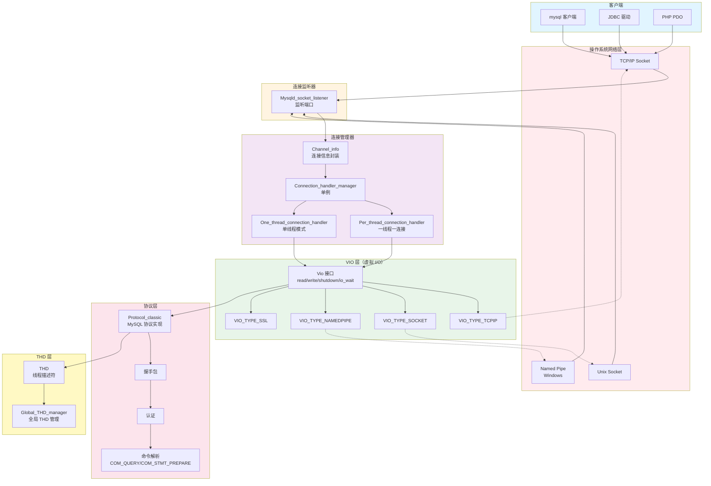
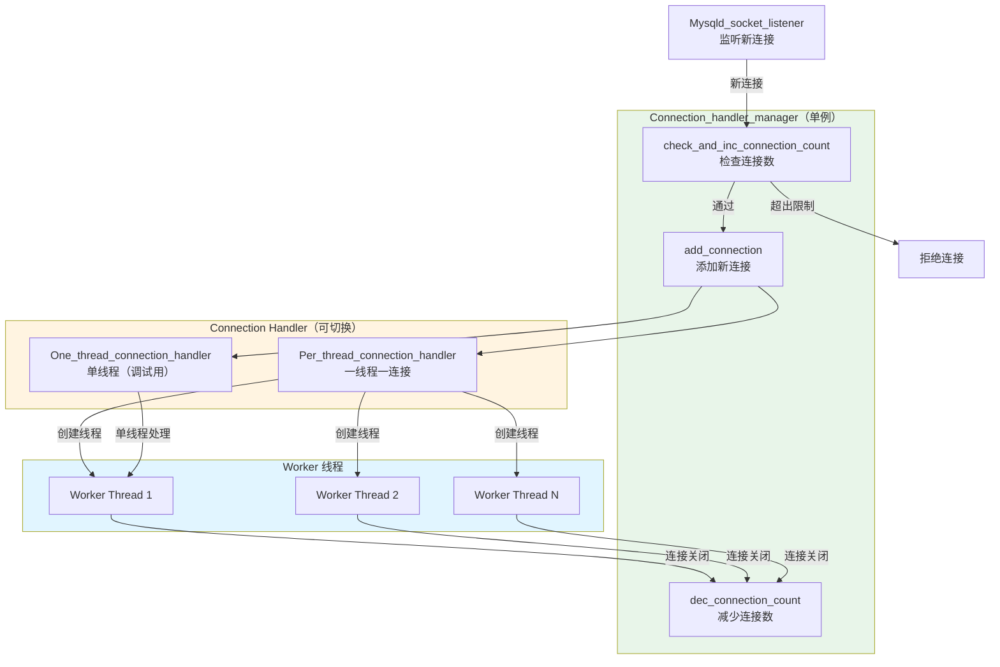
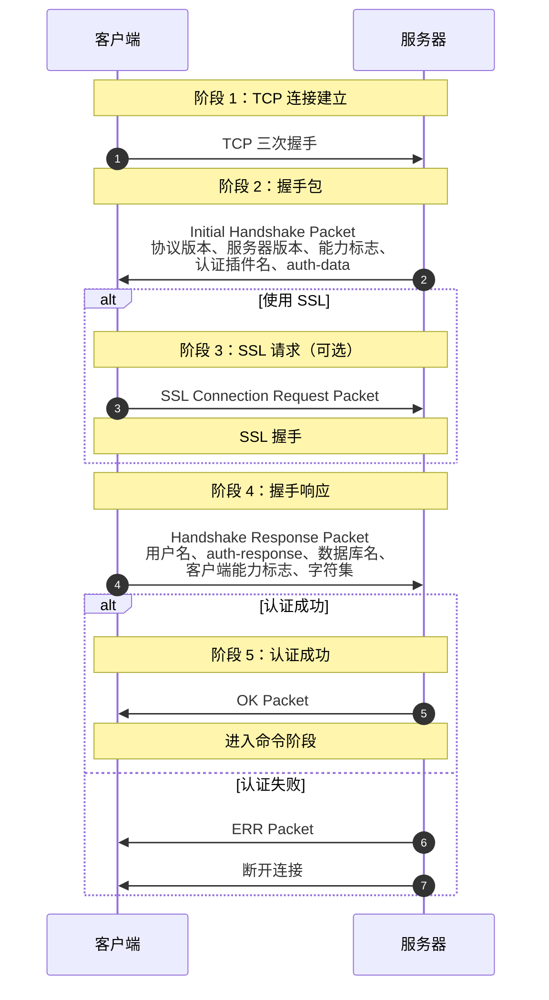
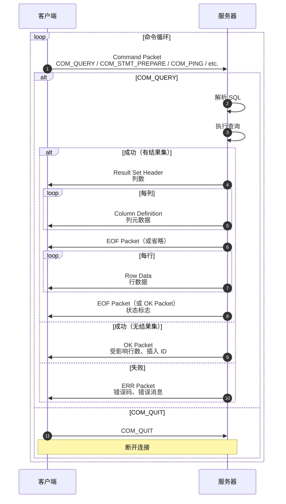
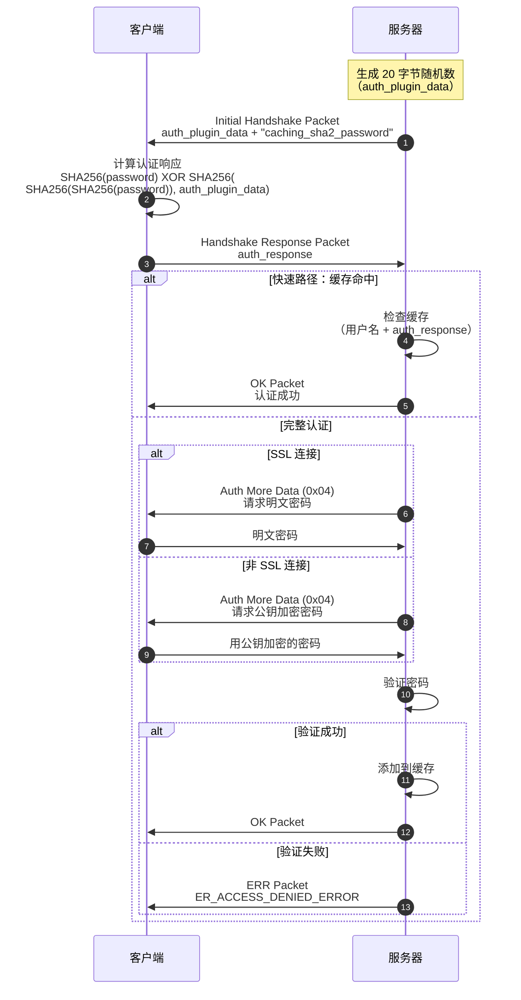

# MySQL Server 源码剖析 - 网络连接层概览

## 一、模块职责

网络连接层是 MySQL Server 与客户端通信的桥梁，负责建立连接、认证、协议解析和数据传输。

### 1.1 核心职责

1. **连接建立**：监听端口，接受客户端连接请求
2. **连接管理**：管理活动连接，控制并发连接数
3. **认证**：验证客户端身份和权限
4. **协议解析**：解析 MySQL 客户端/服务器协议
5. **数据传输**：封装底层 I/O，支持多种传输方式
6. **加密通信**：支持 SSL/TLS 加密连接

### 1.2 输入输出

**输入**：
- 客户端连接请求（TCP/IP、Unix Socket、Named Pipe）
- 客户端命令（COM_QUERY、COM_STMT_PREPARE 等）
- 认证信息（用户名、密码、SSL 证书）

**输出**：
- 连接响应（握手包、OK/ERR 包）
- 结果集（行数据、元数据）
- 错误信息

### 1.3 上下游依赖

**上游**：
- 客户端（mysql、JDBC、PHP PDO 等）
- 网络层（操作系统 socket）

**下游**：
- SQL 核心层（SQL 解析和执行）
- THD（线程描述符）

### 1.4 生命周期

**初始化阶段**：
1. 初始化网络监听器（TCP/IP、Unix Socket）
2. 创建连接管理器（Connection Handler Manager）
3. 初始化线程池（如果使用 Thread Pool 插件）

**运行阶段**：
1. 监听端口，接受新连接
2. 为每个连接创建 THD 对象
3. 执行认证流程
4. 进入命令执行循环

**关闭阶段**：
1. 等待所有连接关闭
2. 释放网络资源
3. 清理连接管理器

## 二、整体架构

### 2.1 网络连接层架构图



### 2.2 架构说明

#### 2.2.1 图意概述

MySQL 网络连接层采用分层架构，从底层网络到应用层协议逐层抽象。VIO 层提供跨平台的虚拟 I/O 接口，连接管理器支持多种线程模型，协议层实现 MySQL 客户端/服务器协议。

#### 2.2.2 关键组件

**VIO 层（Virtual I/O）**：
- **作用**：提供统一的 I/O 接口，屏蔽底层传输差异
- **支持的传输方式**：
  - `VIO_TYPE_TCPIP`：TCP/IP Socket
  - `VIO_TYPE_SOCKET`：Unix Domain Socket
  - `VIO_TYPE_NAMEDPIPE`：Windows Named Pipe
  - `VIO_TYPE_SHARED_MEMORY`：Windows Shared Memory
  - `VIO_TYPE_SSL`：SSL/TLS 加密通信
- **核心函数**：
  ```cpp
  struct Vio {
    int (*read)(Vio *vio, uchar *buf, size_t size);      // 读取数据
    int (*write)(Vio *vio, const uchar *buf, size_t size); // 写入数据
    int (*vioshutdown)(Vio *vio);                         // 关闭连接
    int (*io_wait)(Vio *vio, enum enum_vio_io_event event, int timeout); // 等待 I/O
    bool (*is_connected)(Vio *vio);                       // 检查连接状态
  };
  ```

**连接管理器（Connection Handler Manager）**：
- **单例模式**：全局唯一实例
- **线程模型**：
  - `Per_thread_connection_handler`：一线程一连接（默认）
  - `One_thread_connection_handler`：单线程模式（调试用）
  - Thread Pool 插件：线程池模式（企业版）
- **功能**：
  - 接受新连接
  - 分配 THD 对象
  - 调度工作线程

**协议层（Protocol_classic）**：
- **作用**：实现 MySQL 客户端/服务器协议
- **两个阶段**：
  1. **连接阶段**（Connection Phase）：握手和认证
  2. **命令阶段**（Command Phase）：执行客户端命令
- **协议格式**：
  ```
  [packet_length:3][sequence_id:1][payload:N]
  ```

**THD（Thread Descriptor）**：
- **作用**：线程上下文，存储连接状态、查询信息、事务信息
- **生命周期**：从连接建立到断开

#### 2.2.3 边界条件

**并发限制**：
- 最大连接数：`max_connections`（默认 151）
- 超出限制时返回 "Too many connections" 错误
- 超级用户额外连接：`max_connections + 1`（用于管理）

**超时控制**：
- 连接超时：`connect_timeout`（默认 10 秒）
- 读超时：`net_read_timeout`（默认 30 秒）
- 写超时：`net_write_timeout`（默认 60 秒）
- 交互超时：`interactive_timeout`（默认 28800 秒，8 小时）
- 非交互超时：`wait_timeout`（默认 28800 秒）

**包大小限制**：
- 单个包最大大小：`max_allowed_packet`（默认 64MB）
- 超出限制时返回 "Packet too large" 错误

**认证尝试**：
- 最大错误次数：连续失败后断开连接

#### 2.2.4 异常处理

**网络错误**：
- 连接中断：`ER_NET_PACKET_TOO_LARGE`、`ER_NET_READ_ERROR`、`ER_NET_WRITE_ERROR`
- 超时：`ER_NET_READ_TIMEOUT`、`ER_NET_WRITE_TIMEOUT`
- 自动重连：客户端库负责（服务器不重连）

**认证失败**：
- 用户不存在：`ER_ACCESS_DENIED_ERROR`
- 密码错误：`ER_ACCESS_DENIED_ERROR`
- 主机不允许：`ER_HOST_NOT_PRIVILEGED`
- 达到连接限制：`ER_CON_COUNT_ERROR`

**资源不足**：
- 内存不足：`ER_OUT_OF_RESOURCES`
- 线程创建失败：`ER_CANT_CREATE_THREAD`

#### 2.2.5 性能与容量

**连接建立性能**：
- TCP 三次握手：约 1-10ms（取决于网络延迟）
- 认证：约 1-5ms（取决于认证插件）
- 总连接建立时间：约 2-15ms

**数据传输性能**：
- 小查询（<1KB）：网络延迟主导，约 1-10ms
- 大结果集（>1MB）：带宽主导，约 10-100ms（取决于网络带宽）
- 本地 Unix Socket：比 TCP 快 20-30%

**连接管理开销**：
- 一线程一连接：每个连接约 250KB-500KB 内存（栈 + THD）
- 最大并发连接：受限于 `max_connections` 和系统资源
- 推荐并发连接数：< 1000（一线程一连接模式）

**优化建议**：
- 使用连接池：减少连接建立开销
- 使用持久连接：避免频繁连接/断开
- 使用 Unix Socket：本地连接比 TCP 更快
- 使用 Thread Pool：高并发场景

#### 2.2.6 版本演进

**MySQL 5.5**：
- 改进：半同步复制插件
- 改进：线程池插件（企业版）

**MySQL 5.6**：
- 改进：SSL/TLS 改进
- 改进：客户端插件式认证

**MySQL 5.7**：
- 新增：压缩协议改进
- 新增：Connection Attributes（连接属性）

**MySQL 8.0**：
- 新增：`caching_sha2_password` 认证插件（默认）
- 新增：连接超时改进
- 移除：`mysql_native_password` 作为默认认证方式
- 改进：TLS 1.2 和 TLS 1.3 支持

## 三、VIO 层详解

### 3.1 VIO 结构体

```cpp
struct Vio {
  // 底层 socket
  MYSQL_SOCKET mysql_socket;
  
  // VIO 类型
  enum enum_vio_type type;
  
  // 地址信息
  struct sockaddr_storage local;   // 本地地址
  struct sockaddr_storage remote;  // 远程地址
  
  // 超时控制
  int read_timeout;                // 读超时（毫秒）
  int write_timeout;               // 写超时（毫秒）
  
  // I/O 缓冲区
  char *read_buffer;               // 读缓冲区
  char *read_pos;                  // 当前读位置
  char *read_end;                  // 缓冲区结束位置
  
  // 函数指针（虚函数表）
  int (*read)(Vio *vio, uchar *buf, size_t size);
  int (*write)(Vio *vio, const uchar *buf, size_t size);
  int (*vioshutdown)(Vio *vio);
  int (*viokeepalive)(Vio *vio, bool onoff);
  bool (*is_connected)(Vio *vio);
  int (*io_wait)(Vio *vio, enum enum_vio_io_event event, int timeout);
  
  // SSL 相关（如果使用 SSL）
  void *ssl_arg;                   // SSL 结构体
  
  // 标志位
  bool localhost;                  // 是否本地连接
  bool inactive;                   // 是否已关闭
};
```

### 3.2 VIO 类型

```cpp
enum enum_vio_type {
  VIO_TYPE_TCPIP,           // TCP/IP Socket
  VIO_TYPE_SOCKET,          // Unix Domain Socket
  VIO_TYPE_NAMEDPIPE,       // Windows Named Pipe
  VIO_TYPE_SHARED_MEMORY,   // Windows Shared Memory
  VIO_TYPE_SSL,             // SSL/TLS 加密
  VIO_CLOSED                // 已关闭
};
```

### 3.3 VIO 初始化

```cpp
// 创建 TCP/IP VIO
Vio *vio_new(my_socket sd, enum enum_vio_type type, uint flags) {
  Vio *vio = internal_vio_create(flags);
  
  if (vio) {
    // 初始化 VIO
    vio_init(vio, type, sd, flags);
    
    // 设置函数指针
    switch (type) {
      case VIO_TYPE_TCPIP:
      case VIO_TYPE_SOCKET:
        vio->read = vio_read;
        vio->write = vio_write;
        vio->vioshutdown = vio_shutdown;
        vio->io_wait = vio_io_wait;
        break;
      
      case VIO_TYPE_SSL:
        vio->read = vio_ssl_read;
        vio->write = vio_ssl_write;
        vio->vioshutdown = vio_ssl_shutdown;
        vio->io_wait = vio_ssl_io_wait;
        break;
      
      // 其他类型...
    }
  }
  
  return vio;
}
```

### 3.4 VIO I/O 操作

**读取数据**：
```cpp
size_t vio_read(Vio *vio, uchar *buf, size_t size) {
  size_t ret = 0;
  
  // 1. 从缓冲区读取
  if (vio->read_pos < vio->read_end) {
    size_t available = vio->read_end - vio->read_pos;
    size_t to_copy = std::min(size, available);
    memcpy(buf, vio->read_pos, to_copy);
    vio->read_pos += to_copy;
    return to_copy;
  }
  
  // 2. 直接从 socket 读取
  int retry_count = 0;
  while (ret == 0) {
    // 等待数据可读
    if (vio->io_wait(vio, VIO_IO_EVENT_READ, vio->read_timeout) <= 0) {
      return (size_t)-1; // 超时或错误
    }
    
    // 读取数据
    ret = recv(mysql_socket_getfd(vio->mysql_socket), buf, size, 0);
    
    if (ret == 0) {
      // 连接关闭
      return 0;
    } else if (ret < 0) {
      // 错误处理
      if (vio_should_retry(vio) && retry_count++ < vio->retry_count) {
        continue; // 可重试错误（EINTR）
      }
      return (size_t)-1;
    }
  }
  
  return ret;
}
```

**写入数据**：
```cpp
size_t vio_write(Vio *vio, const uchar *buf, size_t size) {
  size_t total_written = 0;
  
  while (total_written < size) {
    // 等待可写
    if (vio->io_wait(vio, VIO_IO_EVENT_WRITE, vio->write_timeout) <= 0) {
      return (size_t)-1; // 超时或错误
    }
    
    // 写入数据
    int ret = send(mysql_socket_getfd(vio->mysql_socket),
                   buf + total_written,
                   size - total_written,
                   0);
    
    if (ret <= 0) {
      if (vio_should_retry(vio)) {
        continue; // 可重试
      }
      return (size_t)-1;
    }
    
    total_written += ret;
  }
  
  return total_written;
}
```

**I/O 等待**（使用 poll/ppoll）：
```cpp
int vio_io_wait(Vio *vio, enum enum_vio_io_event event, int timeout) {
  struct pollfd pfd;
  pfd.fd = mysql_socket_getfd(vio->mysql_socket);
  
  // 设置事件类型
  switch (event) {
    case VIO_IO_EVENT_READ:
      pfd.events = POLLIN;
      break;
    case VIO_IO_EVENT_WRITE:
      pfd.events = POLLOUT;
      break;
  }
  
  // 等待事件
  int ret;
  int retry_count = 0;
  do {
    ret = poll(&pfd, 1, timeout);
  } while (ret < 0 && vio_should_retry(vio) && retry_count++ < vio->retry_count);
  
  // 检查返回结果
  if (ret > 0) {
    // 检查事件
    if (pfd.revents & (POLLERR | POLLHUP | POLLNVAL)) {
      return -1; // 错误
    }
    return 1; // 事件就绪
  } else if (ret == 0) {
    return 0; // 超时
  } else {
    return -1; // 错误
  }
}
```

## 四、连接管理器

### 4.1 连接管理器架构



### 4.2 连接处理流程

```cpp
// 主监听线程
void mysqld_socket_acceptor(Mysqld_socket_listener *listener) {
  while (!abort_loop) {
    // 1. 接受新连接
    Channel_info *channel_info = listener->listen_for_connection_event();
    
    if (channel_info) {
      // 2. 检查连接数限制
      if (Connection_handler_manager::check_and_inc_connection_count()) {
        // 超出限制
        channel_info->send_error_and_close_channel(ER_CON_COUNT_ERROR, 0, false);
        delete channel_info;
        continue;
      }
      
      // 3. 分发给连接处理器
      if (Connection_handler_manager::get_instance()->add_connection(channel_info)) {
        // 处理失败，减少计数
        Connection_handler_manager::dec_connection_count();
      }
    }
  }
}
```

**Per_thread_connection_handler**（一线程一连接）：
```cpp
bool Per_thread_connection_handler::add_connection(Channel_info *channel_info) {
  // 1. 检查空闲线程缓存
  if (Per_thread_connection_handler::check_idle_thread_and_enqueue_connection(channel_info)) {
    return false; // 空闲线程处理
  }
  
  // 2. 创建新线程
  if (mysql_thread_create(key_thread_one_connection,
                          &handle.thread,
                          &connection_attrib,
                          handle_connection,
                          (void *)channel_info)) {
    // 创建失败
    connection_errors_internal++;
    channel_info->send_error_and_close_channel(ER_CANT_CREATE_THREAD, 0, false);
    return true;
  }
  
  // 3. 增加线程计数
  mysql_mutex_lock(&LOCK_thread_count);
  thread_count++;
  mysql_mutex_unlock(&LOCK_thread_count);
  
  return false;
}
```

**工作线程处理函数**：
```cpp
void *handle_connection(void *arg) {
  Channel_info *channel_info = static_cast<Channel_info *>(arg);
  
  // 1. 初始化线程
  if (my_thread_init()) {
    connection_errors_internal++;
    channel_info->send_error_and_close_channel(ER_OUT_OF_RESOURCES, 0, false);
    return nullptr;
  }
  
  // 2. 创建 THD 对象
  THD *thd = channel_info->create_thd();
  if (!thd) {
    connection_errors_internal++;
    channel_info->send_error_and_close_channel(ER_OUT_OF_RESOURCES, 0, false);
    return nullptr;
  }
  
  // 3. 设置线程栈
  thd_set_thread_stack(thd, (char *)&thd);
  
  // 4. 设置线程 ID
  thd->set_new_thread_id();
  
  // 5. 添加到全局 THD 管理器
  Global_THD_manager *thd_manager = Global_THD_manager::get_instance();
  thd_manager->add_thd(thd);
  
  // 6. 执行连接准备（认证）
  if (thd_prepare_connection(thd)) {
    // 认证失败
    close_connection(thd, ER_ACCESS_DENIED_ERROR);
  } else {
    // 7. 进入命令执行循环
    while (thd_connection_alive(thd)) {
      if (do_command(thd)) {
        break; // 命令执行失败或客户端断开
      }
    }
    
    // 8. 结束连接
    end_connection(thd);
  }
  
  // 9. 清理资源
  close_connection(thd, 0);
  thd->release_resources();
  thd_manager->remove_thd(thd);
  delete thd;
  
  // 10. 减少连接计数
  Connection_handler_manager::dec_connection_count();
  
  return nullptr;
}
```

## 五、MySQL 协议详解

### 5.1 协议格式

**通用包格式**：
```
+------------------------+
| Packet Length    (3)   |  前 3 字节：包长度（不包括这 4 字节头）
| Sequence ID      (1)   |  第 4 字节：序列号
| Payload          (N)   |  实际数据
+------------------------+
```

**示例**（COM_QUERY）：
```
13 00 00 00    # 长度 = 0x000013 = 19 字节
00             # 序列号 = 0
03             # 命令类型 = COM_QUERY
53 45 4C 45 43 54 20 31  # "SELECT 1"
```

### 5.2 连接阶段（Connection Phase）



**Initial Handshake Packet**（服务器 → 客户端）：
```cpp
struct Initial_handshake {
  uint8_t protocol_version;         // 协议版本（当前 10）
  char server_version[...];         // 服务器版本字符串（如 "8.0.30"）
  uint32_t connection_id;           // 连接 ID（线程 ID）
  uint8_t auth_plugin_data[8];      // 认证数据第一部分
  uint8_t filler;                   // 填充 0x00
  uint16_t capability_flags_1;      // 能力标志低 16 位
  uint8_t character_set;            // 字符集
  uint16_t status_flags;            // 状态标志
  uint16_t capability_flags_2;      // 能力标志高 16 位
  uint8_t auth_plugin_data_len;     // 认证数据长度
  uint8_t reserved[10];             // 保留字节
  uint8_t auth_plugin_data_2[...];  // 认证数据第二部分
  char auth_plugin_name[...];       // 认证插件名（如 "mysql_native_password"）
};
```

**Handshake Response Packet**（客户端 → 服务器）：
```cpp
struct Handshake_response {
  uint32_t capability_flags;        // 客户端能力标志
  uint32_t max_packet_size;         // 最大包大小
  uint8_t character_set;            // 字符集
  uint8_t reserved[23];             // 保留字节
  char username[...];               // 用户名（NUL 结尾）
  uint8_t auth_response_len;        // 认证响应长度
  uint8_t auth_response[...];       // 认证响应数据
  char database[...];               // 数据库名（可选，NUL 结尾）
  char auth_plugin_name[...];       // 认证插件名（可选，NUL 结尾）
  // 连接属性（可选）
};
```

**能力标志（Capability Flags）**：
```cpp
#define CLIENT_LONG_PASSWORD      0x00000001  // 使用改进的密码加密
#define CLIENT_FOUND_ROWS         0x00000002  // 返回找到的行而非受影响的行
#define CLIENT_LONG_FLAG          0x00000004  // 更多列标志
#define CLIENT_CONNECT_WITH_DB    0x00000008  // 支持连接时指定数据库
#define CLIENT_NO_SCHEMA          0x00000010  // 不允许 db.table.col 格式
#define CLIENT_COMPRESS           0x00000020  // 支持压缩协议
#define CLIENT_LOCAL_FILES        0x00000080  // 支持 LOAD DATA LOCAL
#define CLIENT_IGNORE_SPACE       0x00000100  // 函数名后允许空格
#define CLIENT_PROTOCOL_41        0x00000200  // 使用 4.1 协议
#define CLIENT_INTERACTIVE        0x00000400  // 交互式客户端
#define CLIENT_SSL                0x00000800  // 支持 SSL
#define CLIENT_TRANSACTIONS       0x00002000  // 支持事务
#define CLIENT_SECURE_CONNECTION  0x00008000  // 支持安全连接
#define CLIENT_MULTI_STATEMENTS   0x00010000  // 支持多语句
#define CLIENT_MULTI_RESULTS      0x00020000  // 支持多结果集
#define CLIENT_PS_MULTI_RESULTS   0x00040000  // 预处理语句支持多结果集
#define CLIENT_PLUGIN_AUTH        0x00080000  // 支持插件式认证
#define CLIENT_CONNECT_ATTRS      0x00100000  // 支持连接属性
#define CLIENT_PLUGIN_AUTH_LENENC_CLIENT_DATA  0x00200000 // 认证数据长度编码
#define CLIENT_DEPRECATE_EOF      0x01000000  // 废弃 EOF 包
#define CLIENT_QUERY_ATTRIBUTES   0x08000000  // 支持查询属性
```

### 5.3 命令阶段（Command Phase）



**命令类型**：
```cpp
enum enum_server_command {
  COM_SLEEP,               // 0x00 (内部使用)
  COM_QUIT,                // 0x01 退出连接
  COM_INIT_DB,             // 0x02 切换数据库
  COM_QUERY,               // 0x03 执行 SQL
  COM_FIELD_LIST,          // 0x04 列出字段（废弃）
  COM_CREATE_DB,           // 0x05 创建数据库（废弃）
  COM_DROP_DB,             // 0x06 删除数据库（废弃）
  COM_REFRESH,             // 0x07 刷新
  COM_SHUTDOWN,            // 0x08 关闭服务器
  COM_STATISTICS,          // 0x09 获取统计信息
  COM_PROCESS_INFO,        // 0x0A 进程列表（废弃）
  COM_CONNECT,             // 0x0B (内部使用)
  COM_PROCESS_KILL,        // 0x0C 杀死进程（废弃）
  COM_DEBUG,               // 0x0D 调试
  COM_PING,                // 0x0E Ping
  COM_TIME,                // 0x0F (内部使用)
  COM_DELAYED_INSERT,      // 0x10 (内部使用)
  COM_CHANGE_USER,         // 0x11 更改用户
  COM_BINLOG_DUMP,         // 0x12 Binlog Dump（复制）
  COM_TABLE_DUMP,          // 0x13 表 Dump（废弃）
  COM_CONNECT_OUT,         // 0x14 (内部使用)
  COM_REGISTER_SLAVE,      // 0x15 注册从库
  COM_STMT_PREPARE,        // 0x16 预处理语句准备
  COM_STMT_EXECUTE,        // 0x17 预处理语句执行
  COM_STMT_SEND_LONG_DATA, // 0x18 发送长数据
  COM_STMT_CLOSE,          // 0x19 关闭预处理语句
  COM_STMT_RESET,          // 0x1A 重置预处理语句
  COM_SET_OPTION,          // 0x1B 设置选项
  COM_STMT_FETCH,          // 0x1C 获取预处理语句结果
  COM_DAEMON,              // 0x1D (内部使用)
  COM_BINLOG_DUMP_GTID,    // 0x1E Binlog Dump（GTID）
  COM_RESET_CONNECTION,    // 0x1F 重置连接
  COM_CLONE,               // 0x20 克隆
  COM_END                  // 0x21 结束标记
};
```

**OK Packet**（成功响应）：
```cpp
struct OK_Packet {
  uint8_t header;                   // 0x00 或 0xFE
  uint64_t affected_rows;           // 受影响行数（变长编码）
  uint64_t last_insert_id;          // 最后插入 ID（变长编码）
  uint16_t status_flags;            // 状态标志
  uint16_t warnings;                // 警告数
  char info[...];                   // 信息消息（可选）
  char session_state_info[...];     // 会话状态信息（可选）
};
```

**ERR Packet**（错误响应）：
```cpp
struct ERR_Packet {
  uint8_t header;                   // 0xFF
  uint16_t error_code;              // 错误码
  char sql_state_marker;            // '#' 字符
  char sql_state[5];                // SQL 状态（5 字节）
  char error_message[...];          // 错误消息
};
```

### 5.4 结果集格式

**Result Set Header**：
```
column_count: 列数（变长编码）
```

**Column Definition**（每列）：
```cpp
struct Column_definition {
  char catalog[...];                // 目录名（通常为 "def"）
  char schema[...];                 // 数据库名
  char table[...];                  // 表名
  char org_table[...];              // 原始表名
  char name[...];                   // 列名
  char org_name[...];               // 原始列名
  uint8_t filler;                   // 0x0C
  uint16_t character_set;           // 字符集
  uint32_t column_length;           // 列长度
  uint8_t column_type;              // 列类型
  uint16_t flags;                   // 列标志
  uint8_t decimals;                 // 小数位数
  uint16_t filler2;                 // 0x0000
};
```

**Row Data**（文本协议）：
```
每列数据为变长字符串（length-encoded string）
NULL 值编码为 0xFB
```

## 六、认证流程

### 6.1 认证插件

MySQL 支持插件式认证，常见认证插件：

| 插件名 | 说明 | 默认 |
|-------|------|------|
| `caching_sha2_password` | SHA-256 密码认证，支持缓存 | MySQL 8.0+ 默认 |
| `mysql_native_password` | MySQL 4.1 原生密码认证 | MySQL 5.7 默认 |
| `sha256_password` | SHA-256 密码认证 | |
| `auth_socket` | Unix Socket 认证（本地） | |
| `authentication_ldap_simple` | LDAP 认证 | |
| `authentication_kerberos` | Kerberos 认证 | |

### 6.2 caching_sha2_password 认证流程



### 6.3 认证代码示例

```cpp
// 执行认证
int acl_authenticate(THD *thd, enum_server_command command) {
  // 1. 读取客户端握手响应包
  if (parse_client_handshake_packet(thd, &mpvio, packet, packet_length)) {
    return 1; // 解析失败
  }
  
  // 2. 查找用户账号
  ACL_USER *acl_user = find_acl_user(
      mpvio.host_or_ip,
      mpvio.auth_info.user_name,
      mpvio.host_or_ip_length == 0);
  
  if (!acl_user) {
    // 用户不存在
    login_failed_error(thd, mpvio.auth_info.user_name, mpvio.host_or_ip);
    return 1;
  }
  
  // 3. 获取认证插件
  plugin_ref plugin = my_plugin_lock_by_name(
      nullptr,
      {acl_user->plugin.str, acl_user->plugin.length},
      MYSQL_AUTHENTICATION_PLUGIN);
  
  if (!plugin) {
    // 插件不存在
    return 1;
  }
  
  // 4. 调用认证插件
  st_mysql_auth *auth = (st_mysql_auth *)plugin_decl(plugin)->info;
  int res = auth->authenticate_user(&mpvio, &mpvio.auth_info);
  
  if (res == CR_OK) {
    // 认证成功
    thd->set_user_connect(acl_user);
    return 0;
  } else {
    // 认证失败
    login_failed_error(thd, mpvio.auth_info.user_name, mpvio.host_or_ip);
    return 1;
  }
}
```

## 七、性能优化

### 7.1 连接池

**客户端连接池**（推荐）：
- HikariCP（Java）
- c3p0（Java）
- mysql.connector.pooling（Python）
- mysqlnd_ms（PHP）

**配置示例**（HikariCP）：
```java
HikariConfig config = new HikariConfig();
config.setJdbcUrl("jdbc:mysql://localhost:3306/mydb");
config.setUsername("user");
config.setPassword("pass");

// 连接池大小
config.setMaximumPoolSize(20);          // 最大连接数
config.setMinimumIdle(5);               // 最小空闲连接数

// 超时配置
config.setConnectionTimeout(30000);     // 获取连接超时（30 秒）
config.setIdleTimeout(600000);          // 空闲连接超时（10 分钟）
config.setMaxLifetime(1800000);         // 连接最大生命周期（30 分钟）

// 连接测试
config.setConnectionTestQuery("SELECT 1");

HikariDataSource ds = new HikariDataSource(config);
```

### 7.2 持久连接

**优势**：
- 避免 TCP 三次握手开销
- 避免认证开销
- 减少连接建立时间

**配置**：
```ini
[mysqld]
# 连接超时（单位：秒）
interactive_timeout = 28800    # 交互式连接（8 小时）
wait_timeout = 28800           # 非交互式连接（8 小时）

# 最大连接数
max_connections = 500          # 根据实际并发调整
```

### 7.3 Unix Socket

**性能提升**：
- 比 TCP/IP 快 20-30%
- 无需网络栈开销
- 适用于本地连接

**配置**：
```ini
[mysqld]
socket = /tmp/mysql.sock

[client]
socket = /tmp/mysql.sock
```

**连接示例**：
```bash
# 使用 Unix Socket 连接
mysql -S /tmp/mysql.sock -u root -p

# 或者不指定主机（自动使用 Unix Socket）
mysql -u root -p
```

### 7.4 压缩协议

**适用场景**：
- 网络带宽受限
- 传输大结果集

**开销**：
- CPU 开销增加（压缩/解压）
- 内存开销增加（缓冲区）

**配置**：
```ini
[client]
compress
```

**性能测试**：
- 小查询（<1KB）：压缩开销 > 网络节省，不推荐
- 大查询（>100KB）：压缩开销 < 网络节省，推荐

### 7.5 SSL/TLS 性能

**开销**：
- 握手开销：约 1-5ms（取决于 CPU）
- 数据传输开销：约 5-10% 性能损失

**优化**：
```ini
[mysqld]
# 使用硬件加速（AES-NI）
ssl_cipher = AES128-GCM-SHA256

# 禁用不安全的加密套件
ssl_cipher = HIGH:!aNULL:!MD5

# Session 复用
```

## 八、监控指标

```sql
-- 连接统计
SHOW STATUS LIKE 'Threads_%';
-- Threads_connected:     当前连接数
-- Threads_running:       当前执行查询的连接数
-- Threads_created:       总创建线程数

-- 连接错误
SHOW STATUS LIKE '%connect%';
-- Aborted_connects:      中止的连接数
-- Connection_errors_max_connections: 超出最大连接数错误

-- 慢连接
SHOW STATUS LIKE 'Slow_launch_threads';
-- 连接建立时间 > thread_stack 的连接数

-- 网络流量
SHOW STATUS LIKE 'Bytes_%';
-- Bytes_received:        接收字节数
-- Bytes_sent:            发送字节数

-- 命令统计
SHOW STATUS LIKE 'Com_%';
-- Com_select:            SELECT 命令数
-- Com_insert:            INSERT 命令数
-- Com_update:            UPDATE 命令数
-- Com_delete:            DELETE 命令数

-- 当前连接列表
SHOW PROCESSLIST;
-- 或更详细的信息
SELECT * FROM information_schema.PROCESSLIST;
```

## 九、故障排查

### 9.1 Too many connections

**现象**：
```
ERROR 1040 (HY000): Too many connections
```

**原因**：
- 连接数超过 `max_connections`
- 连接泄漏（未关闭）
- 连接池配置不当

**排查**：
```sql
-- 查看当前连接数
SHOW STATUS LIKE 'Threads_connected';

-- 查看最大连接数
SHOW VARIABLES LIKE 'max_connections';

-- 查看连接列表
SHOW PROCESSLIST;
```

**解决方案**：
1. 增加 `max_connections`：
   ```ini
   [mysqld]
   max_connections = 500
   ```

2. 杀死空闲连接：
   ```sql
   KILL <thread_id>;
   ```

3. 检查并修复连接泄漏

### 9.2 连接超时

**现象**：
```
ERROR 2013 (HY000): Lost connection to MySQL server during query
```

**原因**：
- 查询执行时间超过超时时间
- 网络不稳定
- 服务器负载过高

**排查**：
```sql
-- 查看超时配置
SHOW VARIABLES LIKE '%timeout%';
-- connect_timeout
-- net_read_timeout
-- net_write_timeout
-- interactive_timeout
-- wait_timeout
```

**解决方案**：
1. 增加超时时间：
   ```ini
   [mysqld]
   net_read_timeout = 300
   net_write_timeout = 300
   ```

2. 优化慢查询

### 9.3 认证失败

**现象**：
```
ERROR 1045 (28000): Access denied for user 'user'@'host' (using password: YES)
```

**排查**：
```sql
-- 检查用户权限
SELECT user, host, authentication_string, plugin 
FROM mysql.user 
WHERE user = 'user';

-- 检查主机名解析
SHOW VARIABLES LIKE 'skip_name_resolve';
```

**解决方案**：
1. 创建用户或修改密码：
   ```sql
   CREATE USER 'user'@'%' IDENTIFIED BY 'password';
   GRANT ALL PRIVILEGES ON *.* TO 'user'@'%';
   FLUSH PRIVILEGES;
   ```

2. 使用 IP 地址而非主机名

## 十、总结

网络连接层是 MySQL 的门户，负责与客户端的所有交互。关键要点：

**VIO 层**：
- 虚拟 I/O 抽象，支持多种传输方式
- 统一的 read/write 接口
- SSL/TLS 加密支持

**连接管理**：
- 一线程一连接模式（默认）
- 连接数限制和超时控制
- THD 对象生命周期管理

**MySQL 协议**：
- 连接阶段：握手和认证
- 命令阶段：执行客户端命令
- 结果集传输：元数据 + 行数据

**性能优化**：
- 使用连接池
- 使用持久连接
- 本地使用 Unix Socket
- 大数据传输使用压缩

**监控与排查**：
- 监控连接数和线程数
- 检查连接错误
- 定位慢连接和超时问题

理解网络连接层的实现，有助于优化应用程序的数据库连接策略，提升系统整体性能。

