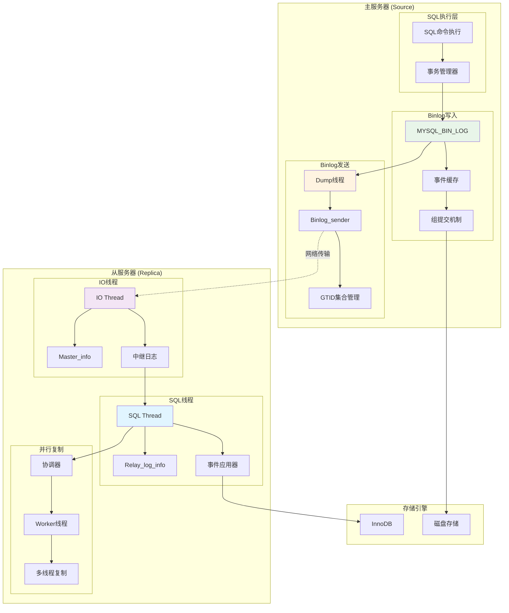
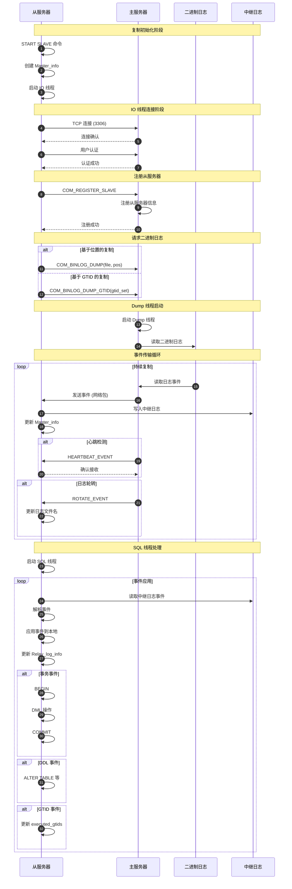
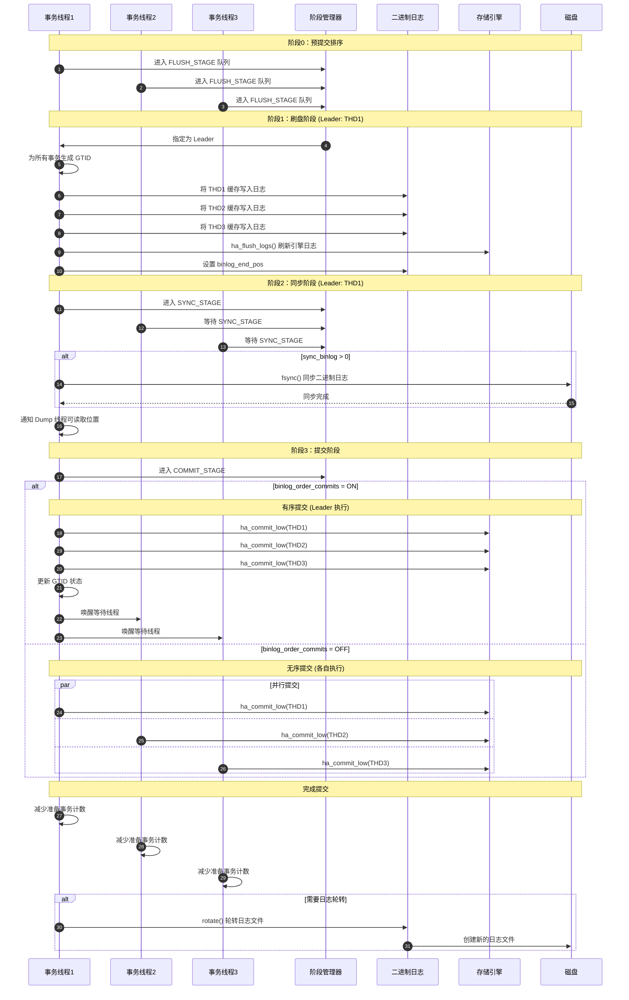

# MySQL Server 源码剖析 - 复制与Binlog-API详解

## 一、模块概述

复制与 Binlog 层是 MySQL Server 的数据一致性和高可用性核心，负责记录数据变更、传输复制数据和维护主从同步。该层主要包含二进制日志（Binary Log）管理、复制协议处理、GTID（Global Transaction Identifier）管理和多种复制模式的实现。

## 二、核心架构图



## 三、二进制日志管理 API 详解

### 3.1 MYSQL_BIN_LOG 类

**类结构概述**：
```cpp
class MYSQL_BIN_LOG : public TC_LOG {
private:
  // 日志文件管理
  IO_CACHE log_file;                    // 当前日志文件缓存
  char *name;                           // 当前日志文件名
  std::atomic<my_off_t> binlog_end_pos; // 二进制日志结束位置
  
  // 索引文件管理
  IO_CACHE index_file;                  // 索引文件缓存
  char *index_file_name;                // 索引文件名
  
  // 并发控制
  mysql_mutex_t LOCK_log;               // 日志写入锁
  mysql_mutex_t LOCK_index;             // 索引文件锁
  mysql_mutex_t LOCK_binlog_end_pos;    // 结束位置保护锁
  mysql_cond_t update_cond;             // 更新条件变量
  
  // 组提交相关
  Stage_manager stage_manager;          // 阶段管理器
  mysql_mutex_t LOCK_commit;            // 提交锁
  mysql_cond_t done_commit;             // 提交完成条件变量
  
  // GTID 相关
  Checkable_rwlock *global_tsid_lock;   // 全局 TSID 读写锁
  Gtid_set *previous_gtids_logged;      // 之前记录的 GTID 集合
  
public:
  // 构造和析构
  MYSQL_BIN_LOG(uint *sync_period);
  ~MYSQL_BIN_LOG();
  
  // 日志管理
  bool open(const char *log_name, const char *new_name,
            ulong max_size, bool null_created_arg,
            bool need_lock_index, bool need_sid_lock,
            Format_description_log_event *extra_description_event);
  bool close(uint flags, bool need_lock_log, bool need_lock_index);
  
  // 事件写入
  bool write_event(Log_event *event_info);
  int write_cache(THD *thd, class binlog_cache_data *cache_data);
  
  // 组提交核心函数
  int ordered_commit(THD *thd, bool all, bool skip_commit = false);
  
  // 日志轮转
  bool rotate(bool force_rotate, bool *check_purge = nullptr);
  bool rotate_and_purge(bool force_rotate);
  
  // 清理和恢复
  int purge_logs(const char *to_log, bool included);
  int purge_logs_before_date(time_t purge_time);
  int recover(Log_info *linfo, const char *last_log_name, IO_CACHE *first_log,
              Format_description_log_event *fdle, bool do_xa_recovery);
  
  // 位置管理
  my_off_t get_binlog_end_pos() const {
    return binlog_end_pos.load(std::memory_order_acquire);
  }
  void set_binlog_end_pos(my_off_t pos) {
    binlog_end_pos.store(pos, std::memory_order_release);
  }
};
```

**关键字段说明**：

| 字段 | 类型 | 功能说明 |
|------|------|---------|
| `log_file` | `IO_CACHE` | 当前活跃的二进制日志文件缓存 |
| `binlog_end_pos` | `std::atomic<my_off_t>` | 二进制日志当前结束位置（原子操作） |
| `stage_manager` | `Stage_manager` | 管理组提交的多个阶段 |
| `global_tsid_lock` | `Checkable_rwlock *` | 保护 GTID 相关数据结构 |
| `LOCK_log` | `mysql_mutex_t` | 保护日志文件写入的互斥锁 |

### 3.2 事件写入核心函数

**函数签名**：
```cpp
bool MYSQL_BIN_LOG::write_event(Log_event *event_info);
```

**功能说明**：
- 将日志事件写入二进制日志
- 处理事务缓存和语句缓存
- 支持行级和语句级复制格式

**核心代码**：
```cpp
bool MYSQL_BIN_LOG::write_event(Log_event *event_info) {
  DBUG_TRACE;
  bool error = true;
  bool should_rotate = false;
  THD *thd = event_info->thd;
  
  // 1. 检查日志是否打开
  if (likely(is_open())) {
    // 检查过滤条件
    const char *local_db = event_info->get_db();
    if (!(thd->variables.option_bits & OPTION_BIN_LOG) ||
        (thd->lex->sql_command != SQLCOM_ROLLBACK_TO_SAVEPOINT &&
         thd->lex->sql_command != SQLCOM_SAVEPOINT &&
         (!event_info->is_no_filter_event() &&
          !binlog_filter->db_ok(local_db))))
      return false;
    
    // 2. 确定使用的缓存类型
    assert(event_info->is_using_trans_cache() ||
           event_info->is_using_stmt_cache());
    
    if (binlog_start_trans_and_stmt(thd, event_info)) return error;
    
    const bool is_trans_cache = event_info->is_using_trans_cache();
    binlog_cache_mngr *const cache_mngr = thd_get_cache_mngr(thd);
    binlog_cache_data *const cache_data =
        cache_mngr->get_binlog_cache_data(is_trans_cache);
    
    DBUG_PRINT("info", ("event type: %d", event_info->get_type_code()));
    
    // 3. 写入运行环境事件（非行格式时）
    if (!thd->is_current_stmt_binlog_format_row()) {
      if (thd->stmt_depends_on_first_successful_insert_id_in_prev_stmt) {
        Intvar_log_event e(thd, INSERT_ID_EVENT,
                          thd->first_successful_insert_id_in_prev_stmt_for_binlog,
                          event_info->get_cache_type(),
                          event_info->get_cache_type());
        if (cache_data->write_event(thd, &e)) return error;
      }
      
      if (thd->auto_inc_intervals_in_cur_stmt_for_binlog.nb_elements() > 0) {
        // 写入自增值事件
        for (auto &interval : thd->auto_inc_intervals_in_cur_stmt_for_binlog) {
          Intvar_log_event e(thd, INSERT_ID_EVENT, interval.minimum(),
                            event_info->get_cache_type(),
                            event_info->get_cache_type());
          if (cache_data->write_event(thd, &e)) return error;
        }
      }
      
      if (thd->rand_used) {
        Rand_log_event e(thd, thd->rand_saved_seed1, thd->rand_saved_seed2,
                        event_info->get_cache_type(),
                        event_info->get_cache_type());
        if (cache_data->write_event(thd, &e)) return error;
      }
      
      if (thd->user_var_events.elements) {
        // 写入用户变量事件
        for (uint i = 0; i < thd->user_var_events.elements; i++) {
          user_var_entry *entry = *dynamic_element(&thd->user_var_events, i,
                                                   user_var_entry**);
          User_var_log_event e(thd, entry->name.str, entry->name.length,
                              entry->value, entry->length, entry->type,
                              entry->collation.collation,
                              event_info->get_cache_type(),
                              event_info->get_cache_type());
          if (cache_data->write_event(thd, &e)) return error;
        }
      }
    }
    
    // 4. 写入主事件
    if (cache_data->write_event(thd, event_info)) return error;
    
    // 5. 检查是否需要轮转日志
    if (cache_data->get_byte_position() > max_binlog_cache_size) {
      my_error(ER_TRANS_CACHE_FULL, MYF(MY_WME));
      return error;
    }
    
    error = false;
  }
  
  return error;
}
```

### 3.3 组提交机制

**函数签名**：
```cpp
int MYSQL_BIN_LOG::ordered_commit(THD *thd, bool all, bool skip_commit);
```

**功能说明**：
- 实现高性能的组提交机制
- 分为四个阶段：预提交、刷盘、同步、提交
- 支持并行提交以提高吞吐量

**核心代码**：
```cpp
int MYSQL_BIN_LOG::ordered_commit(THD *thd, bool all, bool skip_commit) {
  DBUG_TRACE;
  int flush_error = 0, sync_error = 0, commit_error = 0;
  my_off_t total_bytes = 0;
  bool do_rotate = false;
  
  // 阶段 0：从服务器提交顺序控制
  if (Commit_order_manager::wait_for_its_turn(thd, all)) {
    return RESULT_ABORTED;
  }
  
  // 阶段 1：刷盘阶段
  if (change_stage(thd, Stage_manager::FLUSH_STAGE, thd, nullptr, &LOCK_log)) {
    DBUG_PRINT("return", ("Thread killed or stopped"));
    return finish_commit(thd);
  }
  
  THD *wait_queue = nullptr;
  flush_error = process_flush_stage_queue(&total_bytes, &wait_queue);
  
  my_off_t flush_end_pos = 0;
  if (!flush_error) {
    flush_end_pos = my_b_tell(&log_file);
    set_binlog_end_pos(flush_end_pos);
    process_after_flush_stage_queue(total_bytes, flush_end_pos, &wait_queue);
  }
  
  // 阶段 2：同步阶段
  if (change_stage(thd, Stage_manager::SYNC_STAGE, wait_queue, &LOCK_log, 
                   &LOCK_sync)) {
    return finish_commit(thd);
  }
  
  if (!flush_error && !sync_error) {
    sync_error = process_sync_stage_queue(&wait_queue, &do_rotate);
  }
  
  // 阶段 3：提交阶段
  if (change_stage(thd, Stage_manager::COMMIT_STAGE, wait_queue, &LOCK_sync,
                   &LOCK_commit)) {
    return finish_commit(thd);
  }
  
  if (!flush_error && !sync_error && !skip_commit) {
    commit_error = process_commit_stage_queue(thd, wait_queue);
  }
  
  // 完成提交并清理
  leave_mutex_before_commit_stage(&LOCK_commit);
  
  if (do_rotate) {
    // 如果需要轮转日志，在这里执行
    bool check_purge = false;
    rotate(true, &check_purge);
  }
  
  // 通知从服务器提交顺序管理器
  Commit_order_manager::finish_one(thd);
  
  return flush_error || sync_error || commit_error ? RESULT_INCONSISTENT : 0;
}
```

**组提交各阶段详解**：

#### 阶段 1：刷盘阶段 (FLUSH_STAGE)
```cpp
int MYSQL_BIN_LOG::process_flush_stage_queue(my_off_t *total_bytes_var, 
                                             THD **out_queue_var) {
  mysql_mutex_assert_owner(&LOCK_log);
  my_off_t total_bytes = 0;
  int flush_error = 1;
  THD *first_seen = nullptr;
  
  // 1. 生成 GTID
  if (assign_gtids_to_flush_group(first_seen)) {
    return flush_error;
  }
  
  // 2. 将每个线程的缓存写入日志文件
  for (THD *head = first_seen; head; head = head->next_to_commit) {
    if (flush_thread_caches(head)) {
      return flush_error;
    }
    total_bytes += head->get_transaction()->m_pending_row_log_events_size;
  }
  
  // 3. 刷新存储引擎日志
  if (flush_error = ha_flush_logs()) {
    return flush_error;
  }
  
  // 4. 同步二进制日志到磁盘
  if (sync_binlog_file(false)) {
    return flush_error;
  }
  
  *total_bytes_var = total_bytes;
  *out_queue_var = first_seen;
  return 0;
}
```

#### 阶段 2：同步阶段 (SYNC_STAGE)
```cpp
int MYSQL_BIN_LOG::process_sync_stage_queue(THD **out_queue_var, 
                                            bool *do_rotate) {
  mysql_mutex_assert_owner(&LOCK_sync);
  
  if (get_sync_period() && 
      ++sync_counter >= get_sync_period()) {
    sync_counter = 0;
    
    // 同步二进制日志文件
    if (mysql_file_sync(log_file.file, MYF(MY_WME))) {
      return 1;
    }
    
    // 通知 dump 线程可以读取到当前位置
    update_binlog_end_pos();
  }
  
  // 检查是否需要轮转日志
  *do_rotate = (my_b_tell(&log_file) >= (my_off_t)max_size);
  
  return 0;
}
```

#### 阶段 3：提交阶段 (COMMIT_STAGE)
```cpp
int MYSQL_BIN_LOG::process_commit_stage_queue(THD *thd, THD *queue) {
  mysql_mutex_assert_owner(&LOCK_commit);
  
  // 如果配置为无序提交，让每个线程自己提交
  if (!binlog_order_commits) {
    mysql_mutex_unlock(&LOCK_commit);
    
    for (THD *head = queue; head; head = head->next_to_commit) {
      if (head->get_transaction()->m_flags.commit_low) {
        head->get_transaction()->m_flags.commit_low = false;
        ha_commit_low(head, true);
      }
    }
    return 0;
  }
  
  // 有序提交：leader 为所有线程执行提交
  for (THD *head = queue; head; head = head->next_to_commit) {
    DBUG_PRINT("debug", ("Thread ID: %u", head->thread_id()));
    
    // 1. 调用 after_sync 钩子
    RUN_HOOK(transaction, after_sync, (head, all));
    
    // 2. 更新依赖跟踪器
    update_max_committed(head);
    
    // 3. 调用存储引擎提交
    if (head->get_transaction()->m_flags.commit_low) {
      head->get_transaction()->m_flags.commit_low = false;
      if (ha_commit_low(head, true)) {
        return 1;
      }
    }
    
    // 4. 调用 after_commit 钩子
    RUN_HOOK(transaction, after_commit, (head, all));
    
    // 5. 更新 GTID
    gtid_state->update_on_commit(head);
    
    // 6. 减少准备事务计数
    dec_prep_xids(head);
  }
  
  return 0;
}
```

## 四、复制协议 API 详解

### 4.1 主服务器端 API

#### 4.1.1 COM_BINLOG_DUMP 处理

**函数签名**：
```cpp
bool com_binlog_dump(THD *thd, char *packet, size_t packet_length);
```

**功能说明**：
- 处理从服务器的二进制日志请求
- 解析请求参数并启动 dump 线程
- 支持基于位置的复制

**核心代码**：
```cpp
bool com_binlog_dump(THD *thd, char *packet, size_t packet_length) {
  DBUG_TRACE;
  ulong pos;
  ushort flags = 0;
  uint32 slave_server_id;
  
  // 1. 检查权限
  if (check_global_access(thd, REPL_SLAVE_ACL)) {
    return true;
  }
  
  // 2. 解析数据包
  const uchar *packet_position = (const uchar *)packet;
  
  if (packet_length < BINLOG_DUMP_NON_GTID_HEADER_SIZE) {
    my_error(ER_MALFORMED_PACKET, MYF(0));
    return true;
  }
  
  pos = uint4korr(packet_position);
  packet_position += 4;
  
  flags = uint2korr(packet_position);
  packet_position += 2;
  
  slave_server_id = uint4korr(packet_position);
  packet_position += 4;
  
  // 3. 获取日志文件名
  char *log_ident = (char *)packet_position;
  size_t log_ident_len = packet_length - BINLOG_DUMP_NON_GTID_HEADER_SIZE;
  
  // 确保字符串以 null 结尾
  if (log_ident_len == 0 || log_ident[log_ident_len - 1] != 0) {
    my_error(ER_MALFORMED_PACKET, MYF(0));
    return true;
  }
  
  // 4. 设置从服务器 ID
  thd->server_id = slave_server_id;
  
  // 5. 启动二进制日志发送
  kill_zombie_dump_threads(thd);
  
  general_log_print(thd, COM_BINLOG_DUMP, 
                   "Log: '%s' Pos: %lu", log_ident, pos);
  
  mysql_binlog_send(thd, log_ident, (my_off_t)pos, nullptr, flags);
  
  return false;
}
```

#### 4.1.2 COM_BINLOG_DUMP_GTID 处理

**函数签名**：
```cpp
bool com_binlog_dump_gtid(THD *thd, char *packet, size_t packet_length);
```

**功能说明**：
- 处理基于 GTID 的复制请求
- 解析 GTID 集合并确定起始位置
- 支持更高级的复制功能

**核心代码**：
```cpp
bool com_binlog_dump_gtid(THD *thd, char *packet, size_t packet_length) {
  DBUG_TRACE;
  
  // 1. 检查权限
  if (check_global_access(thd, REPL_SLAVE_ACL)) {
    return true;
  }
  
  // 2. 解析数据包头
  const uchar *packet_position = (const uchar *)packet;
  
  if (packet_length < BINLOG_DUMP_GTID_HEADER_SIZE) {
    my_error(ER_MALFORMED_PACKET, MYF(0));
    return true;
  }
  
  ushort flags = uint2korr(packet_position);
  packet_position += 2;
  
  uint32 slave_server_id = uint4korr(packet_position);
  packet_position += 4;
  
  uint32 log_name_info_size = uint4korr(packet_position);
  packet_position += 4;
  
  char *log_file_name = (char *)packet_position;
  packet_position += log_name_info_size;
  
  my_off_t pos = uint8korr(packet_position);
  packet_position += 8;
  
  uint32 data_size = uint4korr(packet_position);
  packet_position += 4;
  
  // 3. 解析 GTID 集合
  if (packet_length < BINLOG_DUMP_GTID_HEADER_SIZE + log_name_info_size + data_size) {
    my_error(ER_MALFORMED_PACKET, MYF(0));
    return true;
  }
  
  Gtid_set *slave_gtid_executed = nullptr;
  
  if (data_size > 0) {
    slave_gtid_executed = new Gtid_set(global_tsid_map);
    
    if (slave_gtid_executed->add_gtid_encoding(packet_position, data_size) != 
        RETURN_STATUS_OK) {
      delete slave_gtid_executed;
      my_error(ER_MALFORMED_GTID_SET_ENCODING, MYF(0));
      return true;
    }
  }
  
  // 4. 设置从服务器信息
  thd->server_id = slave_server_id;
  
  // 5. 启动 GTID 复制
  kill_zombie_dump_threads(thd);
  
  general_log_print(thd, COM_BINLOG_DUMP_GTID,
                   "Log: '%s' Pos: %llu GTID data_size: %u",
                   log_file_name, pos, data_size);
  
  mysql_binlog_send(thd, log_file_name, pos, slave_gtid_executed, flags);
  
  delete slave_gtid_executed;
  return false;
}
```

#### 4.1.3 二进制日志发送核心函数

**函数签名**：
```cpp
void mysql_binlog_send(THD *thd, char *log_ident, my_off_t pos,
                       Gtid_set *gtid_set, uint32 flags);
```

**功能说明**：
- 二进制日志发送的核心实现
- 支持基于位置和基于 GTID 的复制
- 处理日志轮转和错误恢复

**核心代码**：
```cpp
void mysql_binlog_send(THD *thd, char *log_ident, my_off_t pos,
                       Gtid_set *gtid_set, uint32 flags) {
  DBUG_TRACE;
  LOG_INFO linfo;
  char *log_file_name = linfo.log_file_name;
  File file = -1;
  String *packet = &thd->packet;
  int error;
  const char *errmsg = "Unknown error";
  NET *net = &thd->net;
  
  Binlog_sender sender(thd, log_ident, pos, gtid_set, flags);
  
  // 1. 初始化发送器
  if (sender.init()) {
    goto err;
  }
  
  // 2. 检查二进制日志是否存在
  if (mysql_bin_log.is_open()) {
    if (mysql_bin_log.find_log_pos(&linfo, log_ident, 1)) {
      errmsg = "Could not find first log file name in binary log index file";
      goto err;
    }
  } else {
    errmsg = "Binary log is not open";
    goto err;
  }
  
  // 3. 注册从服务器信息
  if (register_slave_on_master(thd)) {
    goto err;
  }
  
  // 4. 开始发送循环
  while (!thd->killed) {
    bool is_active_binlog = false;
    
    // 检查是否为当前活跃的日志文件
    mysql_mutex_lock(mysql_bin_log.get_log_lock());
    is_active_binlog = mysql_bin_log.is_active(log_file_name);
    mysql_mutex_unlock(mysql_bin_log.get_log_lock());
    
    // 5. 打开日志文件
    if ((file = open_binlog_file(&linfo, errmsg)) < 0) {
      goto err;
    }
    
    // 6. 发送事件循环
    while (!thd->killed) {
      Log_event *ev = nullptr;
      
      // 读取事件
      error = Log_event::read_log_event(&log_file, packet, 
                                       sender.get_fdle());
      
      if (error) {
        if (error == LOG_READ_EOF) {
          if (is_active_binlog) {
            // 活跃日志文件，等待新事件
            if (sender.wait_new_events(pos)) {
              break;
            }
            continue;
          } else {
            // 非活跃日志文件，切换到下一个
            break;
          }
        } else {
          errmsg = "Error reading log event";
          goto err;
        }
      }
      
      // 7. 解析事件
      ev = Log_event::read_log_event((const char *)packet->ptr(),
                                    packet->length(),
                                    &errmsg, sender.get_fdle());
      
      if (!ev) {
        goto err;
      }
      
      // 8. 过滤 GTID 事件（如果需要）
      if (gtid_set && sender.skip_event(ev)) {
        delete ev;
        pos = uint8korr(packet->ptr() + EVENT_LEN_OFFSET) + 
              my_b_tell(&log_file);
        continue;
      }
      
      // 9. 发送事件到从服务器
      pos = ev->log_pos;
      
      if (sender.send_event(ev)) {
        delete ev;
        goto err;
      }
      
      delete ev;
      
      // 10. 检查心跳
      if (sender.check_heartbeat()) {
        break;
      }
    }
    
    // 11. 关闭当前文件，尝试下一个
    end_io_cache(&log_file);
    mysql_file_close(file, MYF(MY_WME));
    file = -1;
    
    if (mysql_bin_log.find_next_log(&linfo, 1)) {
      errmsg = "Could not find next log file in binary log index";
      goto err;
    }
    
    pos = BIN_LOG_HEADER_SIZE;  // 跳过新文件的头部
  }
  
err:
  // 清理资源
  if (file >= 0) {
    end_io_cache(&log_file);
    mysql_file_close(file, MYF(MY_WME));
  }
  
  thd_proc_info(thd, "Waiting to finalize termination");
  
  // 发送错误信息给从服务器
  my_message(my_errno(), errmsg, MYF(0));
}
```

### 4.2 从服务器端 API

#### 4.2.1 Master_info 结构

**数据结构**：
```cpp
class Master_info : public Rpl_info {
private:
  // 连接信息
  char host[HOSTNAME_LENGTH + 1];         // 主服务器主机名
  char user[USERNAME_LENGTH + 1];         // 复制用户名
  char password[MAX_PASSWORD_LENGTH + 1]; // 复制密码
  uint port;                              // 主服务器端口
  uint connect_retry;                     // 连接重试间隔
  
  // 复制状态
  char master_log_name[FN_REFLEN];        // 主服务器日志文件名
  my_off_t master_log_pos;                // 主服务器日志位置
  
  // IO 线程管理
  pthread_t io_thread;                    // IO 线程句柄
  mysql_mutex_t run_lock;                 // 运行状态锁
  mysql_cond_t start_cond;                // 启动条件变量
  mysql_cond_t stop_cond;                 // 停止条件变量
  enum enum_thread_state io_thread_state; // IO 线程状态
  
  // 网络连接
  MYSQL *mysql;                           // 到主服务器的连接
  bool is_stopping;                       // 是否正在停止
  
  // GTID 相关
  Gtid_set *gtid_set;                     // 接收到的 GTID 集合
  mysql_mutex_t tsid_lock;                // TSID 保护锁
  
public:
  Master_info(const char *channel);
  ~Master_info();
  
  // 连接管理
  int connect_to_master();
  void disconnect_from_master();
  
  // IO 线程控制
  int start_io_thread();
  int stop_io_thread(long timeout);
  bool is_io_thread_running() const;
  
  // 状态管理
  int flush_info(bool force = false);
  int read_info(Rpl_info_handler *from);
  int write_info(Rpl_info_handler *to);
  
  // 位置管理
  void set_master_log_pos(my_off_t pos) { master_log_pos = pos; }
  my_off_t get_master_log_pos() const { return master_log_pos; }
  void set_master_log_name(const char *name) {
    strmake(master_log_name, name, sizeof(master_log_name) - 1);
  }
  const char *get_master_log_name() const { return master_log_name; }
};
```

#### 4.2.2 IO 线程启动

**函数签名**：
```cpp
int Master_info::start_io_thread();
```

**功能说明**：
- 启动 IO 线程连接主服务器
- 设置复制参数和状态
- 创建线程并初始化连接

**核心代码**：
```cpp
int Master_info::start_io_thread() {
  DBUG_TRACE;
  int error = 0;
  
  mysql_mutex_lock(&run_lock);
  
  // 1. 检查线程是否已经运行
  if (io_thread_state != THREAD_NOT_CREATED) {
    mysql_mutex_unlock(&run_lock);
    return 1;  // 线程已经存在
  }
  
  // 2. 重置错误信息
  clear_error();
  
  // 3. 设置线程状态
  io_thread_state = THREAD_CREATED;
  
  // 4. 创建 IO 线程
  if (mysql_thread_create(key_thread_slave_io, 
                         &io_thread, &connection_attrib,
                         handle_slave_io, (void *)this)) {
    sql_print_error("Can't create slave IO thread");
    io_thread_state = THREAD_NOT_CREATED;
    error = 1;
    goto err;
  }
  
  // 5. 等待线程启动完成
  while (io_thread_state == THREAD_CREATED) {
    mysql_cond_wait(&start_cond, &run_lock);
  }
  
  if (io_thread_state != THREAD_RUNNING) {
    error = 1;
  }
  
err:
  mysql_mutex_unlock(&run_lock);
  return error;
}
```

#### 4.2.3 IO 线程主函数

**函数签名**：
```cpp
extern "C" void *handle_slave_io(void *arg);
```

**功能说明**：
- IO 线程的主要执行函数
- 连接主服务器并接收二进制日志
- 写入中继日志供 SQL 线程读取

**核心代码**：
```cpp
extern "C" void *handle_slave_io(void *arg) {
  THD *thd;  // 线程上下文
  MYSQL *mysql;
  Master_info *mi = (Master_info *)arg;
  Relay_log_info *rli = mi->rli;
  char llbuff[22];
  
  // 1. 初始化线程环境
  my_thread_init();
  DBUG_TRACE;
  
  thd = new THD;
  thd->thread_stack = (char *)&thd;
  mysql_mutex_lock(&mi->run_lock);
  
  // 2. 设置线程状态
  mi->io_thread_state = THREAD_RUNNING;
  mysql_cond_broadcast(&mi->start_cond);
  mysql_mutex_unlock(&mi->run_lock);
  
  // 3. 连接到主服务器
  mysql = mysql_init(nullptr);
  if (!mysql) {
    sql_print_error("Slave I/O thread: error in mysql_init()");
    goto err;
  }
  
  // 设置连接参数
  mysql_options(mysql, MYSQL_OPT_CONNECT_TIMEOUT, 
               (char *)&slave_net_timeout);
  mysql_options(mysql, MYSQL_OPT_READ_TIMEOUT, 
               (char *)&slave_net_timeout);
  
  // 4. 建立连接
  if (!mysql_real_connect(mysql, mi->host, mi->user, mi->password,
                         0, mi->port, 0, 0)) {
    sql_print_error("Slave I/O thread couldn't connect to master '%s@%s:%d': %s",
                   mi->user, mi->host, mi->port, mysql_error(mysql));
    goto err;
  }
  
  // 5. 请求二进制日志
  if (request_dump(thd, mysql, mi)) {
    sql_print_error("Slave I/O thread: failed to request binlog dump");
    goto err;
  }
  
  // 6. 接收和处理事件循环  
  while (!io_slave_killed(thd, mi)) {
    ulong event_len;
    
    // 读取事件长度
    if (read_event_header_and_set_compression(mysql, &event_len)) {
      sql_print_error("Slave I/O thread: error reading event header");
      break;
    }
    
    // 分配事件缓冲区
    if (event_len > current_thd->variables.max_allowed_packet) {
      sql_print_error("Slave I/O thread: event too large (%lu bytes)", 
                     event_len);
      break;
    }
    
    uchar *event_buf = (uchar *)my_malloc(key_memory_binlog_event_buffer,
                                         event_len, MYF(MY_WME));
    if (!event_buf) {
      sql_print_error("Slave I/O thread: out of memory");
      break;
    }
    
    // 读取完整事件
    if (read_event(mysql, event_buf, event_len)) {
      my_free(event_buf);
      sql_print_error("Slave I/O thread: error reading event");
      break;
    }
    
    // 7. 写入中继日志
    if (queue_event(mi, (char *)event_buf, event_len)) {
      my_free(event_buf);
      sql_print_error("Slave I/O thread: error queuing event");
      break;
    }
    
    my_free(event_buf);
    
    // 8. 更新复制位置
    if (flush_master_info(mi, true)) {
      sql_print_error("Slave I/O thread: error flushing master info");
      break;
    }
  }
  
err:
  // 9. 清理和关闭
  if (mysql) {
    mysql_close(mysql);
  }
  
  mysql_mutex_lock(&mi->run_lock);
  mi->io_thread_state = THREAD_NOT_CREATED;
  mysql_cond_broadcast(&mi->stop_cond);
  mysql_mutex_unlock(&mi->run_lock);
  
  delete thd;
  my_thread_end();
  pthread_exit(0);
  return 0;
}
```

#### 4.2.4 事件队列函数

**函数签名**：
```cpp
int queue_event(Master_info *mi, const char *buf, ulong event_len);
```

**功能说明**：
- 将从主服务器接收的事件写入中继日志
- 处理日志轮转和空间管理
- 更新复制位置信息

**核心代码**：
```cpp
int queue_event(Master_info *mi, const char *buf, ulong event_len) {
  int error = 0;
  ulong inc_pos;
  Relay_log_info *rli = mi->rli;
  mysql_mutex_t *log_lock = rli->relay_log.get_log_lock();
  
  // 1. 解析事件头
  uchar *event_buf = (uchar *)buf;
  uint event_type = event_buf[EVENT_TYPE_OFFSET];
  
  if (event_len < LOG_EVENT_MINIMAL_HEADER_LEN) {
    mi->report(ERROR_LEVEL, ER_SLAVE_RELAY_LOG_WRITE_FAILURE,
              "Event too short");
    return 1;
  }
  
  // 2. 获取日志锁
  mysql_mutex_lock(&mi->data_lock);
  mysql_mutex_lock(log_lock);
  
  // 3. 检查中继日志空间
  if (rli->log_space_limit && 
      rli->log_space_total >= rli->log_space_limit) {
    // 空间不足，等待 SQL 线程清理
    mysql_mutex_unlock(log_lock);
    mysql_mutex_unlock(&mi->data_lock);
    
    sql_print_information("Slave I/O thread: relay log space limit exceeded, "
                         "waiting for SQL thread to free space");
    
    // 等待空间释放
    mysql_mutex_lock(&rli->log_space_lock);
    while (rli->log_space_total >= rli->log_space_limit && !mi->abort_slave) {
      mysql_cond_wait(&rli->log_space_cond, &rli->log_space_lock);
    }
    mysql_mutex_unlock(&rli->log_space_lock);
    
    if (mi->abort_slave) {
      return 1;
    }
    
    // 重新获取锁
    mysql_mutex_lock(&mi->data_lock);
    mysql_mutex_lock(log_lock);
  }
  
  // 4. 写入中继日志
  if (rli->relay_log.append_buffer(buf, event_len) != 0) {
    mi->report(ERROR_LEVEL, ER_SLAVE_RELAY_LOG_WRITE_FAILURE,
              "Error writing relay log event");
    error = 1;
    goto err;
  }
  
  // 5. 更新日志空间统计
  rli->log_space_total += event_len;
  
  // 6. 检查是否需要轮转中继日志
  if (rli->relay_log.should_rotate()) {
    if (rli->relay_log.new_file_without_locking()) {
      mi->report(ERROR_LEVEL, ER_SLAVE_RELAY_LOG_WRITE_FAILURE,
                "Error rotating relay log");
      error = 1;
      goto err;
    }
  }
  
  // 7. 更新主服务器位置信息
  if (event_type != mysql::binlog::event::HEARTBEAT_LOG_EVENT) {
    inc_pos = uint4korr(event_buf + LOG_POS_OFFSET);
    if (inc_pos > 0) { 
      mi->set_master_log_pos(inc_pos);
    }
    
    // 如果是 ROTATE 事件，更新日志文件名
    if (event_type == mysql::binlog::event::ROTATE_EVENT) {
      if (process_io_rotate(mi, event_buf)) {
        error = 1;
        goto err;
      }
    }
  }
  
  // 8. 刷新中继日志
  if (rli->relay_log.flush_and_sync()) {
    mi->report(ERROR_LEVEL, ER_SLAVE_RELAY_LOG_WRITE_FAILURE,
              "Error flushing relay log");
    error = 1;
    goto err;
  }
  
err:
  mysql_mutex_unlock(log_lock);
  mysql_mutex_unlock(&mi->data_lock);
  
  return error;
}
```

### 4.3 SQL 线程和事件应用

#### 4.3.1 Relay_log_info 结构

**数据结构**：
```cpp
class Relay_log_info : public Rpl_info {
private:
  // 中继日志信息
  char group_relay_log_name[FN_REFLEN];   // 当前组中继日志名
  my_off_t group_relay_log_pos;           // 当前组中继日志位置
  char event_relay_log_name[FN_REFLEN];   // 当前事件中继日志名  
  my_off_t event_relay_log_pos;           // 当前事件中继日志位置
  
  // 主服务器位置信息
  char group_master_log_name[FN_REFLEN];  // 组开始时的主日志名
  my_off_t group_master_log_pos;          // 组开始时的主日志位置
  
  // SQL 线程管理
  pthread_t sql_thread;                   // SQL 线程句柄
  mysql_mutex_t run_lock;                 // 运行状态锁
  mysql_cond_t start_cond;                // 启动条件变量
  mysql_cond_t stop_cond;                 // 停止条件变量  
  enum enum_thread_state sql_thread_state; // SQL 线程状态
  
  // 事件处理
  Log_event *cur_log_event;               // 当前处理的事件
  bool is_in_group;                       // 是否在事务组中
  
  // 多线程复制 (MTS)
  bool is_parallel_exec() const;          // 是否并行执行
  Slave_worker **workers;                 // Worker 线程数组
  Mts_submode *current_mts_submode;       // 当前 MTS 子模式
  
  // 日志空间管理
  mysql_mutex_t log_space_lock;           // 日志空间锁
  mysql_cond_t log_space_cond;            // 日志空间条件变量
  ulonglong log_space_total;              // 总日志空间
  ulonglong log_space_limit;              // 日志空间限制
  
public:
  Relay_log_info(const char *channel);
  ~Relay_log_info();
  
  // SQL 线程控制
  int start_sql_thread();
  int stop_sql_thread(long timeout);
  bool is_sql_thread_running() const;
  
  // 事件处理
  int exec_relay_log_event(THD *thd, Relay_log_info *rli);
  bool apply_event_and_update_pos(Log_event *ev, THD *thd);
  
  // 位置管理  
  void set_group_relay_log_pos(my_off_t pos) { group_relay_log_pos = pos; }
  my_off_t get_group_relay_log_pos() const { return group_relay_log_pos; }
  void set_group_master_log_pos(my_off_t pos) { group_master_log_pos = pos; }
  my_off_t get_group_master_log_pos() const { return group_master_log_pos; }
  
  // 并行复制
  int start_workers();
  int stop_workers();
  Slave_worker *get_worker(ulong i) const { return workers[i]; }
};
```

#### 4.3.2 事件应用核心函数

**函数签名**：
```cpp
int Log_event::apply_event(Relay_log_info *rli);
```

**功能说明**：
- 日志事件应用的统一入口
- 支持串行和并行执行模式
- 处理事务边界和错误恢复

**核心代码**：
```cpp
int Log_event::apply_event(Relay_log_info *rli) {
  DBUG_TRACE;
  DBUG_PRINT("info", ("event_type=%s", get_type_str()));
  bool parallel = false;
  enum enum_mts_event_exec_mode actual_exec_mode = EVENT_EXEC_PARALLEL;
  THD *rli_thd = rli->info_thd;
  
  worker = rli;
  
  // 1. 检查是否为 MTS 恢复模式
  if (rli->is_mts_recovery()) {
    bool skip = bitmap_is_set(&rli->recovery_groups, rli->mts_recovery_index) &&
                (get_mts_execution_mode(rli->mts_group_status ==
                                       Relay_log_info::MTS_IN_GROUP) ==
                 EVENT_EXEC_PARALLEL);
    if (skip) {
      return 0;
    } else {
      int error = do_apply_event(rli);
      if (rli->is_processing_trx()) {
        // 识别 DDL 事务开始
        if (starts_group() &&
            get_type_code() == mysql::binlog::event::QUERY_EVENT) {
          rli->curr_group_seen_begin = true;
        }
        if (error == 0 &&
            (ends_group() ||
             (get_type_code() == mysql::binlog::event::QUERY_EVENT &&
              !rli->curr_group_seen_begin))) {
          rli->finished_processing();
          rli->curr_group_seen_begin = false;
        }
      }
      return error;
    }
  }
  
  // 2. 确定执行模式（串行或并行）
  if (!(parallel = rli->is_parallel_exec()) ||
      ((actual_exec_mode = get_mts_execution_mode(
            rli->mts_group_status == Relay_log_info::MTS_IN_GROUP)) !=
       EVENT_EXEC_PARALLEL)) {
    if (parallel) {
      // 并行模式下的串行事件
      Slave_worker *worker = rli->current_mts_submode->get_least_occupied_worker(
          rli, rli->workers, this);
      if (worker == nullptr) {
        return ER_MTS_CANT_PARALLEL;
      }
      
      // 将事件分配给 worker
      if (worker->assign_event(this)) {
        return ER_MTS_CANT_PARALLEL;
      }
      
      worker->slave_worker_exec_event(this);
      return 0;
    } else {
      // 3. 串行执行
      return do_apply_event(rli);
    }
  } else {
    // 4. 并行执行
    return slave_worker_exec_event(rli);
  }
}
```

**事件具体应用函数**：
```cpp
int Log_event::do_apply_event(Relay_log_info const *rli) {
  DBUG_TRACE;
  int error = 0;
  THD *thd = rli->info_thd;
  
  // 1. 设置事件上下文
  thd->server_id = server_id;
  thd->unmasked_server_id = common_header->unmasked_server_id;
  thd->set_time();
  thd->lex->set_current_query_block(nullptr);
  
  if (!common_header->when.tv_sec) {
    my_micro_time_to_timeval(my_micro_time(), &common_header->when);
  }
  
  thd->start_time = common_header->when;
  thd->query_start_usec_used = true;
  
  // 2. 根据事件类型执行相应操作
  switch (get_type_code()) {
    case mysql::binlog::event::QUERY_EVENT:
      error = ((Query_log_event *)this)->do_apply_event(rli, query, q_len);
      break;
      
    case mysql::binlog::event::WRITE_ROWS_EVENT:
    case mysql::binlog::event::UPDATE_ROWS_EVENT:
    case mysql::binlog::event::DELETE_ROWS_EVENT:
      error = ((Rows_log_event *)this)->do_apply_event(rli);
      break;
      
    case mysql::binlog::event::TABLE_MAP_EVENT:
      error = ((Table_map_log_event *)this)->do_apply_event(rli);
      break;
      
    case mysql::binlog::event::ROTATE_EVENT:
      error = ((Rotate_log_event *)this)->do_apply_event(rli);
      break;
      
    case mysql::binlog::event::GTID_LOG_EVENT:
      error = ((Gtid_log_event *)this)->do_apply_event(rli);
      break;
      
    default:
      DBUG_PRINT("info", ("default: do nothing for event type %d",
                         get_type_code()));
  }
  
  // 3. 错误处理
  if (error) {
    DBUG_PRINT("info", ("apply_event error = %d", error));
    
    if (thd->is_slave_error || thd->is_fatal_error) {
      /*
        The query was aborted because of slave error or fatal error.
        The error is already reported.
      */
    } else {
      /*
        Other errors, not reported yet, we need to report.
      */
      if (thd->is_error()) {
        char const *const errmsg = thd->get_stmt_da()->message_text();
        
        DBUG_PRINT("info", 
                  ("thd->get_stmt_da()->get_sql_errno()=%d; "
                   "rli->last_error.number=%d", 
                   thd->get_stmt_da()->mysql_errno(),
                   rli->last_error().number));
        
        if (strcmp(errmsg, "")) {
          rli->report(ERROR_LEVEL, thd->get_stmt_da()->mysql_errno(),
                     "Error '%s' on query. Default database: '%s'. "
                     "Query: '%s'",
                     errmsg,
                     thd->db().str ? thd->db().str : "",
                     thd->query().str);
        }
      }
    }
  }
  
  return error;
}
```

## 五、GTID 管理 API 详解

### 5.1 GTID 核心数据结构

**Gtid 结构**：
```cpp
struct Gtid {
  /// Transaction Source Identifier
  rpl_tsid tsid;
  /// Transaction number
  rpl_gno gno;
  
  // 构造函数
  Gtid() : gno(0) {}
  Gtid(const rpl_tsid &_tsid, rpl_gno _gno) : tsid(_tsid), gno(_gno) {}
  
  /// Set both components to 0.
  void clear() {
    tsid.clear();
    gno = 0;
  }
  
  /// Return true if this Gtid is empty (both components are 0).
  bool is_empty() const { return gno == 0 && tsid.is_empty(); }
  
  /// Set the GTID to the given TSID and GNO.
  void set(const rpl_tsid &_tsid, rpl_gno _gno) {
    tsid = _tsid;
    gno = _gno;
  }
  
  /// Compare two GTIDs
  int compare(const Gtid &other) const {
    int ret = tsid.compare(other.tsid);
    if (ret == 0) {
      ret = gno < other.gno ? -1 : gno > other.gno ? 1 : 0;
    }
    return ret;
  }
  
  /// Equality operator
  bool operator==(const Gtid &other) const {
    return tsid == other.tsid && gno == other.gno;
  }
};
```

**Gtid_set 类**：
```cpp
class Gtid_set {
private:
  /// Map from TSID to intervals
  std::map<rpl_tsid, Interval_list> m_intervals;
  
  /// TSID map to use for this Gtid_set
  Tsid_map *tsid_map;
  
  /// Mutex to protect concurrent access
  mutable mysql_mutex_t m_mutex;
  
public:
  Gtid_set(Tsid_map *_tsid_map);
  ~Gtid_set();
  
  /// Add a GTID to this set
  enum_return_status add_gtid(const Gtid &gtid);
  
  /// Remove a GTID from this set  
  enum_return_status remove_gtid(const Gtid &gtid);
  
  /// Check if a GTID is contained in this set
  bool contains_gtid(const Gtid &gtid) const;
  
  /// Add all GTIDs from another set
  enum_return_status add_gtid_set(const Gtid_set *other);
  
  /// Remove all GTIDs that exist in another set
  enum_return_status remove_gtid_set(const Gtid_set *other);
  
  /// Check if this set is a subset of another set
  bool is_subset(const Gtid_set *other) const;
  
  /// Check if this set intersects with another set
  bool is_intersection_nonempty(const Gtid_set *other) const;
  
  /// Get string representation
  int to_string(char **buf, bool need_lock = true) const;
  
  /// Parse string representation
  enum_return_status add_gtid_text(const char *text);
  
  /// Encode to binary format
  int get_encoded_length() const;
  void encode(uchar *buf) const;
  
  /// Decode from binary format
  enum_return_status add_gtid_encoding(const uchar *encoded, size_t length);
  
  /// Clear all GTIDs
  void clear();
  
  /// Check if set is empty
  bool is_empty() const;
  
  /// Get next GTID after the given one
  enum_return_status get_next_gtid(const Gtid &gtid, Gtid &next) const;
};
```

### 5.2 GTID 生成和分配

**函数签名**：
```cpp
enum_return_status Gtid_state::generate_automatic_gtid(THD *thd, 
                                                       rpl_tsid *specified_tsid,
                                                       rpl_gno *specified_gno);
```

**功能说明**：
- 为事务自动生成 GTID
- 处理手动指定和自动分配两种模式  
- 确保 GTID 的全局唯一性

**核心代码**：
```cpp
enum_return_status Gtid_state::generate_automatic_gtid(THD *thd,
                                                       rpl_tsid *specified_tsid,
                                                       rpl_gno *specified_gno) {
  DBUG_TRACE;
  enum_return_status ret = RETURN_STATUS_OK;
  rpl_tsid tsid;
  rpl_gno gno;
  
  global_tsid_lock->assert_some_wrlock();
  
  // 1. 确定 TSID
  if (specified_tsid != nullptr) {
    // 手动指定 TSID
    tsid = *specified_tsid;
  } else {
    // 使用服务器 UUID 作为 TSID
    tsid = server_uuid_tsid;
  }
  
  // 2. 确定 GNO
  if (specified_gno != nullptr) {
    // 手动指定 GNO
    gno = *specified_gno;
    
    // 检查是否已经存在
    if (executed_gtids.contains_gtid(Gtid(tsid, gno))) {
      my_error(ER_GTID_ALREADY_EXECUTED, MYF(0),
               tsid.to_string().c_str(), gno);
      ret = RETURN_STATUS_REPORTED_ERROR;
      goto end;
    }
    
    // 检查是否在 owned_gtids 中
    if (owned_gtids.contains_gtid(Gtid(tsid, gno))) {
      my_error(ER_GTID_OWNED_BY_ANOTHER_CLIENT, MYF(0),
               tsid.to_string().c_str(), gno);
      ret = RETURN_STATUS_REPORTED_ERROR;
      goto end;
    }
  } else {
    // 3. 自动分配 GNO
    rpl_gno next_gno = executed_gtids.get_next_available_gno(tsid);
    if (next_gno == 0) {
      my_error(ER_GNO_EXHAUSTED, MYF(0));
      ret = RETURN_STATUS_REPORTED_ERROR;
      goto end;
    }
    gno = next_gno;
  }
  
  // 4. 将 GTID 添加到 owned_gtids
  Gtid gtid(tsid, gno);
  if (owned_gtids.add_gtid(gtid) != RETURN_STATUS_OK) {
    my_error(ER_OUT_OF_RESOURCES, MYF(0));
    ret = RETURN_STATUS_REPORTED_ERROR;
    goto end;
  }
  
  // 5. 设置线程的 GTID
  thd->owned_gtid = gtid;
  
  DBUG_PRINT("info", ("generated gtid %s:%lld", 
                     tsid.to_string().c_str(), gno));
  
end:
  return ret;
}
```

### 5.3 GTID 事务提交

**函数签名**：
```cpp
void Gtid_state::update_on_commit(THD *thd);
```

**功能说明**：
- 事务提交时更新 GTID 状态
- 将 GTID 从 owned_gtids 移动到 executed_gtids
- 更新 gtid_executed 系统变量

**核心代码**：
```cpp
void Gtid_state::update_on_commit(THD *thd) {
  DBUG_TRACE;
  
  global_tsid_lock->assert_some_wrlock();
  
  // 1. 获取线程拥有的 GTID
  const Gtid &gtid = thd->owned_gtid;
  
  if (gtid.is_empty()) {
    DBUG_PRINT("info", ("thread does not own any gtid"));
    return;
  }
  
  DBUG_PRINT("info", ("updating on commit for gtid %s:%lld",
                     gtid.tsid.to_string().c_str(), gtid.gno));
  
  // 2. 从 owned_gtids 中移除
  if (owned_gtids.remove_gtid(gtid) != RETURN_STATUS_OK) {
    DBUG_ASSERT(0);  // 这不应该发生
  }
  
  // 3. 添加到 executed_gtids
  if (executed_gtids.add_gtid(gtid) != RETURN_STATUS_OK) {
    /*
      This can only happen if we run out of memory, which is not
      expected at this point.
    */
    DBUG_ASSERT(0);
  }
  
  // 4. 更新 gtid_executed 表（如果启用）
  if (opt_bin_log && gtid_table_persistor->save(thd, &gtid)) {
    /*
      If we fail to save the GTID to the table, we should still
      continue, as the GTID is in the binary log.
    */
    sql_print_error("Failed to save GTID %s:%lld to gtid_executed table",
                   gtid.tsid.to_string().c_str(), gtid.gno);
  }
  
  // 5. 清空线程的 owned_gtid
  thd->owned_gtid.clear();
  
  // 6. 更新统计信息
  if (gtid.tsid == server_uuid_tsid) {
    gtid_executed_compression_period_counter++;
    if (gtid_executed_compression_period_counter >= 
        gtid_executed_compression_period) {
      // 触发 GTID 压缩
      compress_gtid_table();
      gtid_executed_compression_period_counter = 0;
    }
  }
}
```

## 六、复制时序图

### 6.1 主从复制建立时序图



### 6.2 组提交详细时序图



## 七、性能优化和监控

### 7.1 复制性能优化

**二进制日志优化**：
```ini
# 组提交优化
binlog_group_commit_sync_delay = 0      # 组提交延迟 (微秒)
binlog_group_commit_sync_no_delay_count = 0  # 无延迟的事务数

# 同步策略
sync_binlog = 1                         # 每次提交同步 (安全)
sync_binlog = 0                         # 依赖操作系统 (性能)

# 缓存大小
binlog_cache_size = 32K                 # 事务缓存大小
binlog_stmt_cache_size = 32K            # 语句缓存大小
max_binlog_cache_size = 2G              # 最大事务缓存
max_binlog_stmt_cache_size = 2G         # 最大语句缓存

# 日志格式
binlog_format = ROW                     # 行格式 (推荐)
binlog_row_image = FULL                 # 完整行图像
```

**复制优化配置**：
```ini
# 并行复制
replica_parallel_type = LOGICAL_CLOCK   # 逻辑时钟并行
replica_parallel_workers = 8            # Worker 线程数
replica_preserve_commit_order = ON      # 保持提交顺序

# 网络优化  
replica_net_timeout = 60                # 网络超时
replica_compressed_protocol = ON        # 启用压缩协议

# 中继日志
max_relay_log_size = 1G                 # 中继日志大小
relay_log_purge = ON                    # 自动清理中继日志
relay_log_space_limit = 10G             # 中继日志空间限制

# GTID 优化
gtid_executed_compression_period = 1000 # GTID 压缩周期
```

### 7.2 复制监控

**复制状态监控**：
```sql
-- 查看主服务器状态
SHOW MASTER STATUS;

-- 查看从服务器状态  
SHOW REPLICA STATUS\G

-- 查看 GTID 执行状态
SELECT @@GLOBAL.gtid_executed;
SELECT @@GLOBAL.gtid_purged;

-- 查看复制延迟
SELECT 
    CHANNEL_NAME,
    SERVICE_STATE,
    LAST_ERROR_MESSAGE,
    LAST_ERROR_TIMESTAMP
FROM performance_schema.replication_connection_status;

SELECT
    CHANNEL_NAME, 
    SERVICE_STATE,
    COUNT_TRANSACTIONS_RETRIES,
    LAST_APPLIED_TRANSACTION,
    APPLYING_TRANSACTION  
FROM performance_schema.replication_applier_status_by_coordinator;
```

**性能监控**：
```sql
-- 二进制日志统计
SHOW STATUS LIKE 'Binlog%';

-- 复制事件统计
SELECT * FROM performance_schema.events_transactions_summary_global_by_event_name 
WHERE EVENT_NAME LIKE '%replica%';

-- GTID 等待统计
SELECT * FROM performance_schema.events_waits_summary_global_by_event_name
WHERE EVENT_NAME LIKE '%gtid%';
```

## 八、总结

复制与 Binlog 层通过精心设计的 API 架构实现了高性能、高可靠的数据复制：

**二进制日志管理**：
- `MYSQL_BIN_LOG` 类提供完整的日志文件管理
- 组提交机制显著提高并发事务的吞吐量
- 支持多种同步策略和缓存优化

**复制协议处理**：
- 支持基于位置和基于 GTID 的两种复制模式
- `mysql_binlog_send` 函数实现高效的事件传输
- 完整的错误处理和故障恢复机制

**GTID 管理系统**：
- 全局唯一的事务标识符确保数据一致性
- 支持自动生成和手动指定两种模式
- 高效的集合操作和持久化存储

**多线程复制**：
- 支持基于库、表、事务的并行应用策略
- `Slave_worker` 机制提高复制性能
- 完善的依赖关系管理和提交顺序控制

该架构通过分层设计和模块化实现，为 MySQL 提供了企业级的数据复制解决方案，支持各种高可用和灾备场景。

