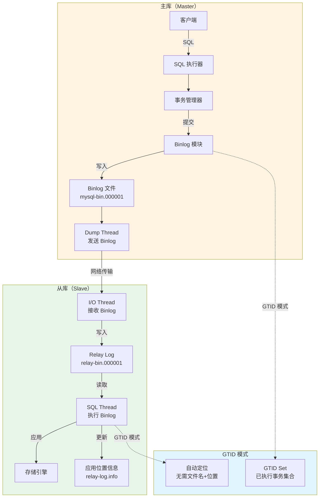
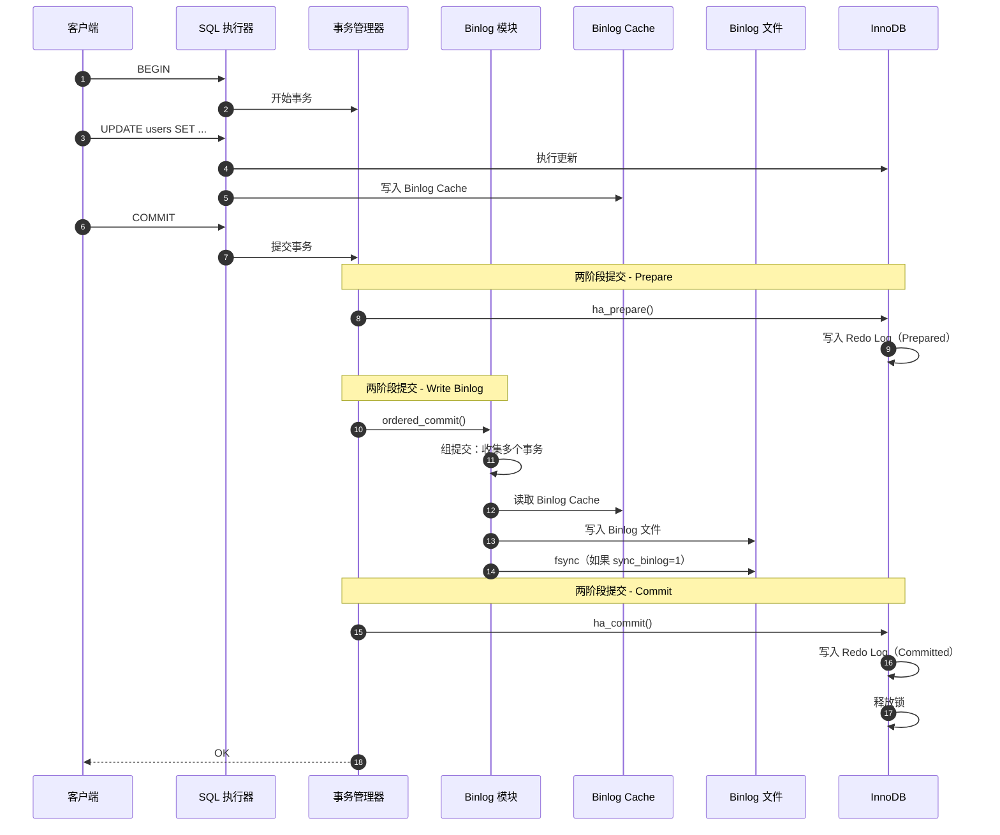
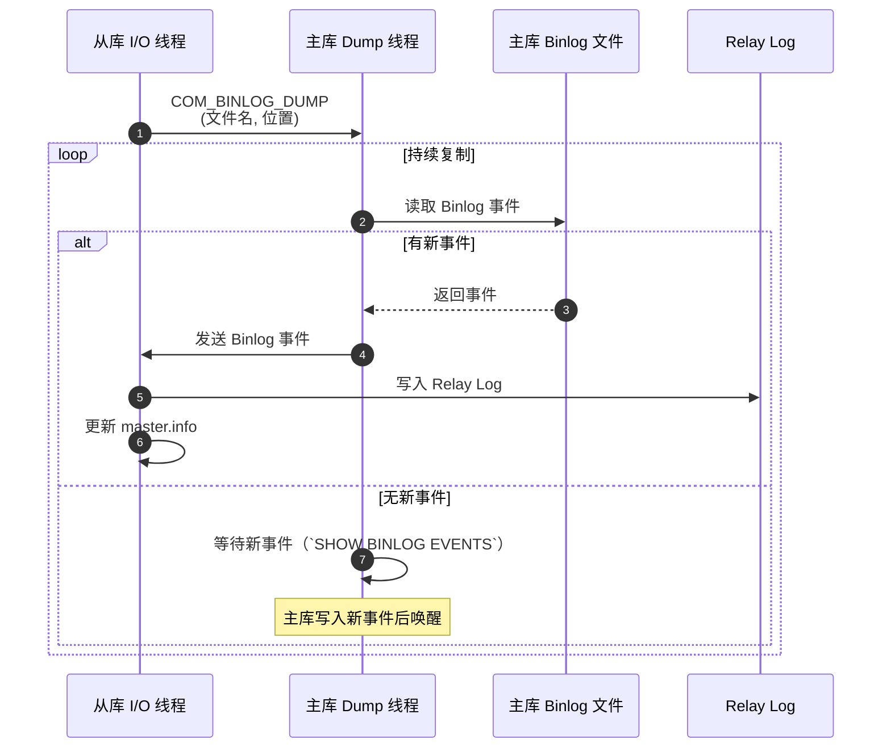
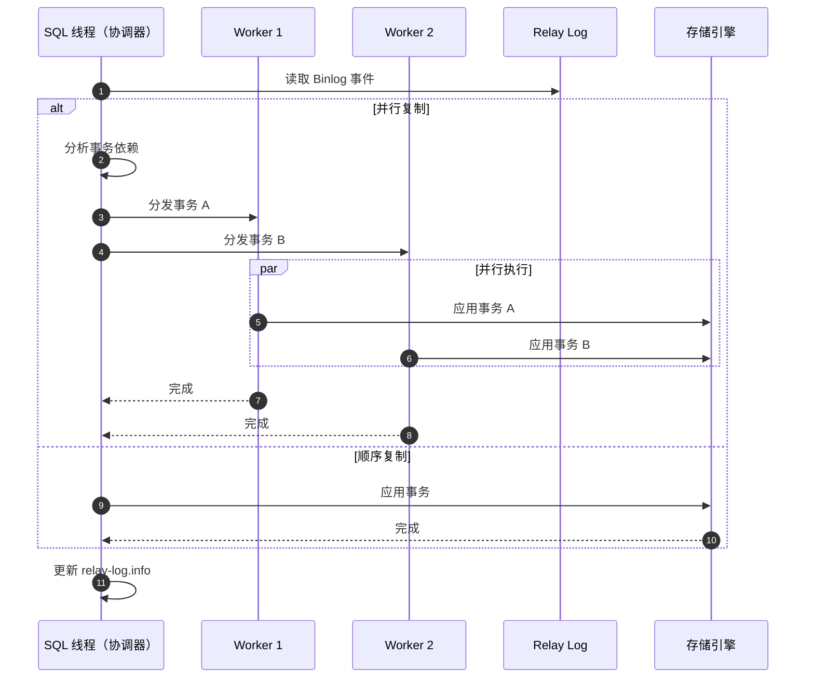

# MySQL Server 源码剖析 - 复制与 Binlog 概览

## 一、模块职责

MySQL 复制（Replication）是 MySQL 高可用和数据分发的核心机制。通过 Binary Log（Binlog）记录数据变更，实现主库到从库的数据同步。

### 1.1 核心职责

1. **Binlog 记录**：记录所有数据变更操作（INSERT/UPDATE/DELETE/DDL）
2. **数据复制**：将主库变更同步到从库
3. **高可用**：主库故障时快速切换到从库
4. **读写分离**：主库写入，从库读取，分散负载
5. **数据备份**：通过 Binlog 实现时间点恢复（Point-in-Time Recovery）

### 1.2 输入输出

**输入**：
- 主库：数据变更操作（来自 SQL 层）
- 从库：主库的 Binlog 事件

**输出**：
- 主库：Binlog 文件（mysql-bin.000001, mysql-bin.000002...）
- 从库：应用 Binlog 后的数据变更

### 1.3 上下游依赖

**上游**：
- SQL 执行器：生成数据变更
- 事务管理器：提交事务时写 Binlog

**下游**：
- 存储引擎：应用 Binlog 中的变更
- 文件系统：Binlog 文件存储

### 1.4 生命周期

**主库 Binlog**：
1. **初始化**：创建 Binlog 文件，写入文件头
2. **运行**：事务提交时追加 Binlog 事件
3. **轮转**：Binlog 文件达到 `max_binlog_size` 或手动 `FLUSH LOGS`
4. **清理**：过期 Binlog 自动删除（`expire_logs_days`）

**复制**：
1. **建立连接**：从库连接主库，发送复制请求
2. **I/O 线程**：从库拉取主库 Binlog，写入 Relay Log
3. **SQL 线程**：从库读取 Relay Log，应用变更
4. **同步**：持续运行，保持主从一致

## 二、整体架构

### 2.1 复制架构图



### 2.2 架构说明

#### 2.2.1 图意概述

MySQL 复制采用主从架构，主库通过 Binlog 记录变更，从库通过 I/O 线程拉取 Binlog 并写入 Relay Log，SQL 线程读取 Relay Log 并应用变更。GTID 模式简化了故障切换和主从同步。

#### 2.2.2 关键组件

**主库组件**：
- **Binlog 模块**（`sql/binlog.cc`）：管理 Binlog 文件，写入事件
- **Dump Thread**（`sql/rpl_source.cc`）：为每个从库创建一个线程，发送 Binlog
- **组提交**（Group Commit）：批量刷新多个事务的 Binlog，提高性能

**从库组件**：
- **I/O Thread**（`sql/rpl_replica.cc`）：连接主库，接收 Binlog，写入 Relay Log
- **SQL Thread**：读取 Relay Log，解析并执行事件
- **并行复制**：多个 Worker 线程并行应用 Binlog（MySQL 5.6+）
- **Relay Log Info**：记录当前应用位置

**GTID 模式**（MySQL 5.6+）：
- **Global Transaction Identifier**：全局事务标识符
- 格式：`source_id:transaction_id`（如 `3E11FA47-71CA-11E1-9E33-C80AA9429562:1-5`）
- 优势：自动定位，无需手动指定 Binlog 文件名和位置

#### 2.2.3 边界条件

**并发**：
- 主库：多个客户端并发写入，Binlog 串行化写入（组提交优化）
- 从库：I/O 线程单线程，SQL 线程可配置并行

**延迟**：
- 网络延迟：主从网络带宽和延迟
- 从库执行延迟：从库性能低于主库导致延迟累积
- 监控：`Seconds_Behind_Master`（从库延迟秒数）

**顺序**：
- Binlog 事件严格按事务提交顺序记录
- 从库默认顺序执行（可配置并行复制）

**幂等性**：
- ROW 格式 Binlog：记录行变更，从库需开启 `slave_exec_mode=IDEMPOTENT` 避免主键冲突

#### 2.2.4 异常处理

**主库 Binlog 写入失败**：
- 磁盘满：事务回滚，返回错误
- Binlog 损坏：停止服务，需修复

**从库 I/O 线程异常**：
- 网络中断：自动重连（`MASTER_CONNECT_RETRY`）
- 主库 Binlog 不存在：停止复制，报错

**从库 SQL 线程异常**：
- 唯一键冲突：停止复制，需手动处理
- 表不存在：停止复制，需手动创建表
- 设置 `slave_skip_errors` 跳过特定错误（不推荐）

**主库切换**：
- 手动：`CHANGE MASTER TO` 指向新主库
- 自动：使用 MHA、Orchestrator 等工具

#### 2.2.5 性能与容量

**Binlog 写入性能**：
- 串行写入：约 1000-10000 TPS（取决于磁盘 IOPS）
- 组提交优化：批量刷新，提升吞吐量

**复制延迟**：
- 网络延迟：通常 < 1ms（同机房）
- 从库应用延迟：取决于从库性能和并行度
- 目标：`Seconds_Behind_Master` < 1 秒

**Binlog 文件大小**：
- 默认：1GB（`max_binlog_size`）
- 过期策略：保留 7 天（`expire_logs_days`）
- 磁盘占用：视写入量而定

#### 2.2.6 版本演进

**MySQL 5.5**：
- 半同步复制（Semi-Sync）：至少一个从库确认

**MySQL 5.6**：
- GTID 复制：简化故障切换
- 并行复制（基于 Schema）：不同库并行

**MySQL 5.7**：
- 并行复制增强（基于 Logical Clock）：同一库内并行
- Multi-Threaded Slave：多 Worker 线程

**MySQL 8.0**：
- 并行复制优化（Writeset）：检测事务冲突，最大化并行
- Binlog 事务压缩
- 副本集（Replica Sets）

## 三、Binlog 格式与事件

### 3.1 Binlog 格式

**Statement-Based Replication (SBR)**：
```sql
-- Binlog 记录 SQL 语句
BEGIN;
UPDATE users SET balance = balance + 100 WHERE id = 1;
COMMIT;
```
- **优点**：Binlog 体积小
- **缺点**：非确定性函数（`NOW()`、`UUID()`）导致主从不一致

**Row-Based Replication (RBR，推荐）**：
```
-- Binlog 记录行变更（二进制格式）
BEGIN;
### UPDATE `test`.`users`
### WHERE
###   @1=1 /* INT */
###   @2=100 /* INT */
### SET
###   @1=1
###   @2=200
COMMIT;
```
- **优点**：完全一致，支持任何 SQL
- **缺点**：Binlog 体积大（大批量更新）

**Mixed Format**：
- 默认 Statement，遇到非确定性函数切换到 Row
- 平衡体积和一致性

**配置**：
```ini
[mysqld]
binlog_format = ROW             # 推荐 ROW 格式
binlog_row_image = MINIMAL      # 只记录变更列（节省空间）
```

### 3.2 Binlog 事件类型

```cpp
enum Log_event_type {
  UNKNOWN_EVENT = 0,
  START_EVENT_V3 = 1,
  QUERY_EVENT = 2,              // DDL 或 Statement 格式的 DML
  STOP_EVENT = 3,
  ROTATE_EVENT = 4,             // Binlog 文件轮转
  INTVAR_EVENT = 5,             // AUTO_INCREMENT 值
  SLAVE_EVENT = 7,
  APPEND_BLOCK_EVENT = 9,       // LOAD DATA
  DELETE_FILE_EVENT = 10,
  NEW_LOAD_EVENT = 12,
  RAND_EVENT = 13,              // RAND() 函数种子
  USER_VAR_EVENT = 14,          // 用户变量
  FORMAT_DESCRIPTION_EVENT = 15, // Binlog 文件头
  XID_EVENT = 16,               // 事务提交（InnoDB）
  BEGIN_LOAD_QUERY_EVENT = 17,
  EXECUTE_LOAD_QUERY_EVENT = 18,
  TABLE_MAP_EVENT = 19,         // 表元数据（ROW 格式）
  WRITE_ROWS_EVENT = 23,        // INSERT（ROW 格式）
  UPDATE_ROWS_EVENT = 24,       // UPDATE（ROW 格式）
  DELETE_ROWS_EVENT = 25,       // DELETE（ROW 格式）
  GTID_LOG_EVENT = 33,          // GTID 事件
  // ... 更多事件类型
};
```

### 3.3 Binlog 事件结构

**通用头部**（19 bytes）：
```cpp
struct Log_event_header {
  uint32_t timestamp;          // 事件时间戳（4 bytes）
  uint8_t type_code;           // 事件类型（1 byte）
  uint32_t server_id;          // 服务器 ID（4 bytes）
  uint32_t data_written;       // 事件总长度（4 bytes）
  uint32_t log_pos;            // 下一个事件的位置（4 bytes）
  uint16_t flags;              // 标志位（2 bytes）
};
```

**Query Event**（Statement 格式 DML 或 DDL）：
```cpp
struct Query_log_event {
  Log_event_header header;
  uint32_t thread_id;          // 线程 ID
  uint32_t exec_time;          // 执行时间（秒）
  uint8_t error_code;          // 错误码
  uint16_t status_vars_len;    // 状态变量长度
  uint8_t db_len;              // 数据库名长度
  // 变长部分
  char status_vars[status_vars_len];  // 状态变量
  char db_name[db_len + 1];           // 数据库名
  char query[...];                    // SQL 语句
};
```

**Table_map Event**（ROW 格式表元数据）：
```cpp
struct Table_map_log_event {
  Log_event_header header;
  uint64_t table_id;           // 表 ID
  uint16_t flags;
  uint8_t db_len;              // 数据库名长度
  char db_name[db_len];        // 数据库名
  uint8_t table_len;           // 表名长度
  char table_name[table_len];  // 表名
  uint32_t column_count;       // 列数
  // 列类型数组
  uint8_t column_types[column_count];
  // 列元数据
  // ...
};
```

**Write_rows Event**（ROW 格式 INSERT）：
```cpp
struct Write_rows_log_event {
  Log_event_header header;
  uint64_t table_id;           // 表 ID（对应 Table_map）
  uint16_t flags;
  uint32_t width;              // 列数
  uint8_t columns_present[(width + 7) / 8];  // 包含列的位图
  // 行数据（变长，根据列类型解析）
  uint8_t rows_data[...];
};
```

## 四、核心流程

### 4.1 Binlog 写入流程



**关键步骤说明**：

1. **事务执行**：每条 DML 语句执行后，将 Binlog 事件写入线程私有的 **Binlog Cache**
2. **Prepare 阶段**：InnoDB 写入 Redo Log，标记为 Prepared 状态
3. **Write Binlog**：
   - 读取 Binlog Cache
   - 写入全局 Binlog 文件
   - 组提交：多个事务一起刷盘
4. **Commit 阶段**：InnoDB 写入 Redo Log Commit 标记，释放锁
5. **两阶段提交保证**：Binlog 和 Redo Log 一致性（崩溃恢复时对齐）

### 4.2 组提交（Group Commit）优化

**目的**：减少 `fsync` 调用次数，提高吞吐量

**三阶段组提交**：

```cpp
// 伪代码
bool MYSQL_BIN_LOG::ordered_commit(THD *thd, bool all, bool skip_commit) {
  // Stage 1: Flush 阶段
  // 多个事务并发进入，第一个成为 Leader，其他成为 Follower
  Stage_manager::StageID stage = FLUSH_STAGE;
  THD *leader = acquire_lock(stage);
  
  if (leader == thd) {
    // Leader 负责刷新所有 Follower 的 Binlog
    for (THD *follower : get_queue()) {
      flush_cache_to_file(follower);
    }
    
    // Stage 2: Sync 阶段
    if (sync_binlog > 0) {
      fsync(binlog_file);  // 刷盘（多个事务一起）
    }
    
    // Stage 3: Commit 阶段
    for (THD *follower : get_queue()) {
      ha_commit_low(follower);  // InnoDB 提交
    }
    
    // 唤醒所有 Follower
    signal_done(get_queue());
  } else {
    // Follower 等待 Leader 完成
    wait_for_signal();
  }
  
  return false;
}
```

**性能提升**：
- 单事务提交：每次 `fsync`，约 1000 TPS
- 组提交：批量 `fsync`，可达 10000+ TPS

### 4.3 复制 I/O 线程流程



**关键数据结构**：

**master.info**（从库记录主库信息）：
```
Number_of_lines: 25
Master_Log_File: mysql-bin.000003
Read_Master_Log_Pos: 1234567
Master_Host: 192.168.1.100
Master_User: repl
Master_Password: (encrypted)
Master_Port: 3306
Connect_Retry: 60
Master_SSL_Allowed: 0
...
```

**relay-log.info**（SQL 线程应用位置）：
```
Number_of_lines: 7
Relay_Log_File: relay-bin.000002
Relay_Log_Pos: 456789
Master_Log_File: mysql-bin.000003
Master_Log_Pos: 1234567
SQL_Delay: 0
Number_of_Workers: 4
...
```

### 4.4 复制 SQL 线程流程



**并行复制策略**（MySQL 5.7+）：

**1. 基于 Logical Clock**：
```cpp
// 主库组提交时分配
事务A: last_committed=10, sequence_number=15
事务B: last_committed=10, sequence_number=16
事务C: last_committed=16, sequence_number=20

// 从库并行规则
if (事务A.last_committed >= 事务B.last_committed &&
    事务A.last_committed < 事务B.sequence_number) {
  // A 和 B 可以并行
  并行执行(A, B);
}
```

**2. 基于 Writeset**（MySQL 8.0+）：
```cpp
// 检测事务冲突
事务A 修改：users.id=1, orders.id=10
事务B 修改：users.id=2, orders.id=11
事务C 修改：users.id=1, orders.id=12

// Writeset 哈希
事务A: {hash(users.1), hash(orders.10)}
事务B: {hash(users.2), hash(orders.11)}
事务C: {hash(users.1), hash(orders.12)}

// A 和 B 无冲突，可并行
// A 和 C 冲突（都修改 users.id=1），不可并行
```

## 五、GTID 复制

### 5.1 GTID 概念

**Global Transaction Identifier（全局事务标识符）**

**格式**：
```
GTID = source_id:transaction_id
```

**示例**：
```
3E11FA47-71CA-11E1-9E33-C80AA9429562:1
3E11FA47-71CA-11E1-9E33-C80AA9429562:2
3E11FA47-71CA-11E1-9E33-C80AA9429562:3
```

**GTID Set**：
```
3E11FA47-71CA-11E1-9E33-C80AA9429562:1-5,
8AC7F0C9-20FA-11E2-8CD5-C80AA9429562:1-3
```
- 表示两个源（主库）的事务集合

### 5.2 GTID 优势

**传统复制**：
```sql
CHANGE MASTER TO
  MASTER_HOST='192.168.1.100',
  MASTER_LOG_FILE='mysql-bin.000005',  -- 需要手动指定文件名
  MASTER_LOG_POS=1234567;              -- 需要手动指定位置
```
- 故障切换时需要找到正确的 Binlog 位置（容易出错）

**GTID 复制**：
```sql
CHANGE MASTER TO
  MASTER_HOST='192.168.1.100',
  MASTER_AUTO_POSITION=1;              -- 自动定位
```
- 自动跳过已执行的事务
- 简化故障切换流程

### 5.3 GTID 实现

**数据结构**：
```cpp
class Gtid {
  rpl_sidno sidno;        // Source ID 编号
  gno_t gno;              // 事务编号（Global Number）
};

class Gtid_set {
  // 每个 Source 的事务区间集合
  std::map<rpl_sidno, Interval_tree> intervals;
  
  // 示例：
  // sidno=1: [1-5, 10-15, 20-25]
  // sidno=2: [1-100]
};
```

**GTID 分配**：
```cpp
// 主库提交事务时
void assign_gtid(THD *thd) {
  Gtid gtid;
  gtid.sidno = server_uuid;
  gtid.gno = gtid_state->get_next_gno();  // 递增分配
  
  thd->owned_gtid = gtid;
  
  // 写入 Binlog
  Gtid_log_event gtid_event(gtid);
  binlog_cache->write(&gtid_event);
}
```

**从库应用 GTID**：
```cpp
// 检查是否已执行
bool is_transaction_skipped(const Gtid &gtid) {
  if (gtid_executed->contains_gtid(gtid)) {
    return true;  // 跳过已执行的事务
  }
  
  // 标记为正在执行
  gtid_owned->add_gtid_owner(gtid, current_thd);
  
  return false;
}

// 提交后更新
void update_gtid_executed(const Gtid &gtid) {
  gtid_executed->add_gtid(gtid);
  
  // 持久化到 mysql.gtid_executed 表
  persist_gtid_to_table(gtid);
}
```

## 六、半同步复制

### 6.1 原理

**异步复制**（默认）：
```
主库 COMMIT → 返回客户端 → 从库接收 Binlog
```
- 主库不等待从库确认
- 风险：主库崩溃后，已提交事务可能未到达从库

**半同步复制**（Semi-Sync）：
```
主库 COMMIT → 等待至少1个从库ACK → 返回客户端
```
- 至少一个从库接收到 Binlog 后，主库才返回
- 提高数据安全性，但增加延迟

### 6.2 配置

**主库**：
```sql
-- 安装插件
INSTALL PLUGIN rpl_semi_sync_source SONAME 'semisync_source.so';

-- 开启半同步
SET GLOBAL rpl_semi_sync_source_enabled = 1;

-- 超时时间（毫秒）
SET GLOBAL rpl_semi_sync_source_timeout = 10000;  -- 10秒

-- 至少等待N个从库
SET GLOBAL rpl_semi_sync_source_wait_for_slave_count = 1;
```

**从库**：
```sql
-- 安装插件
INSTALL PLUGIN rpl_semi_sync_replica SONAME 'semisync_replica.so';

-- 开启半同步
SET GLOBAL rpl_semi_sync_replica_enabled = 1;

-- 重启 I/O 线程使生效
STOP SLAVE IO_THREAD;
START SLAVE IO_THREAD;
```

### 6.3 性能影响

**延迟增加**：
- 同机房：+0.5-2ms
- 跨机房：+10-50ms（取决于网络延迟）

**超时降级**：
- 如果从库超时未响应（>= `rpl_semi_sync_source_timeout`）
- 自动降级为异步复制
- 从库恢复后自动切回半同步

**监控**：
```sql
SHOW STATUS LIKE 'Rpl_semi_sync%';

-- 关键指标
Rpl_semi_sync_source_status: ON         -- 半同步状态
Rpl_semi_sync_source_clients: 2         -- 半同步从库数
Rpl_semi_sync_source_yes_tx: 12345      -- 半同步确认的事务数
Rpl_semi_sync_source_no_tx: 0           -- 超时降级的事务数
Rpl_semi_sync_source_avg_net_wait_time: 1500  -- 平均等待时间（微秒）
```

## 七、故障场景与处理

### 7.1 复制延迟

**原因**：
1. 从库性能低于主库
2. 大事务（大批量 UPDATE/DELETE）
3. 单线程复制，无法利用多核

**解决方案**：
```sql
-- 1. 开启并行复制
SET GLOBAL slave_parallel_type = 'LOGICAL_CLOCK';
SET GLOBAL slave_parallel_workers = 8;  -- 根据 CPU 核心数

-- 2. 升级从库硬件（SSD、更多内存）

-- 3. 避免大事务（分批执行）

-- 4. 监控延迟
SHOW SLAVE STATUS\G
-- Seconds_Behind_Master: 目标 < 1
```

### 7.2 复制中断

**场景 1：唯一键冲突**
```
Last_SQL_Error: Error 'Duplicate entry '123' for key 'PRIMARY'' on query.
```

**处理**：
```sql
-- 方法 1：跳过错误（慎用）
SET GLOBAL sql_slave_skip_counter = 1;
START SLAVE SQL_THREAD;

-- 方法 2：修复数据
-- 在从库删除冲突行
DELETE FROM table WHERE id = 123;
START SLAVE SQL_THREAD;

-- 方法 3：GTID 模式跳过事务
SET GTID_NEXT='3E11FA47-71CA-11E1-9E33-C80AA9429562:10';
BEGIN; COMMIT;  -- 空事务
SET GTID_NEXT='AUTOMATIC';
START SLAVE SQL_THREAD;
```

**场景 2：表不存在**
```
Last_SQL_Error: Error 'Table 'test.new_table' doesn't exist' on query.
```

**处理**：
```sql
-- 在从库创建表
CREATE TABLE test.new_table LIKE master_host.test.new_table;
START SLAVE SQL_THREAD;
```

### 7.3 主从切换

**手动切换**（GTID 模式）：
```sql
-- 1. 在当前主库停止写入
SET GLOBAL read_only = 1;

-- 2. 在从库等待追上
SHOW SLAVE STATUS\G
-- Seconds_Behind_Master: 0
-- Retrieved_Gtid_Set == Executed_Gtid_Set

-- 3. 提升从库为新主库
STOP SLAVE;
RESET SLAVE ALL;
SET GLOBAL read_only = 0;

-- 4. 其他从库指向新主库
CHANGE MASTER TO
  MASTER_HOST='new_master_ip',
  MASTER_AUTO_POSITION=1;
START SLAVE;
```

**自动切换工具**：
- **MHA (Master High Availability)**
- **Orchestrator**
- **MySQL Router + Group Replication**

## 八、最佳实践

### 8.1 Binlog 配置

```ini
[mysqld]
# 开启 Binlog
log_bin = /var/lib/mysql/mysql-bin
server_id = 1                     # 全局唯一

# 格式
binlog_format = ROW               # 推荐 ROW
binlog_row_image = MINIMAL        # 只记录变更列

# 刷盘策略
sync_binlog = 1                   # 每次提交刷盘（最安全）

# 文件大小
max_binlog_size = 1G              # 单文件最大 1GB

# 过期清理
expire_logs_days = 7              # 保留 7 天

# GTID
gtid_mode = ON
enforce_gtid_consistency = ON

# 事务写集
binlog_transaction_dependency_tracking = WRITESET
transaction_write_set_extraction = XXHASH64
```

### 8.2 复制配置

**主库**：
```ini
[mysqld]
log_bin = mysql-bin
binlog_format = ROW
sync_binlog = 1

# 半同步
plugin-load = "rpl_semi_sync_source=semisync_source.so"
rpl_semi_sync_source_enabled = 1
rpl_semi_sync_source_timeout = 10000
```

**从库**：
```ini
[mysqld]
server_id = 2
relay_log = relay-bin
relay_log_recovery = ON           # 崩溃后自动恢复 Relay Log
read_only = ON                    # 只读
super_read_only = ON              # 限制 SUPER 用户写

# 并行复制
slave_parallel_type = LOGICAL_CLOCK
slave_parallel_workers = 8

# 半同步
plugin-load = "rpl_semi_sync_replica=semisync_replica.so"
rpl_semi_sync_replica_enabled = 1
```

### 8.3 监控指标

```sql
-- 主库 Binlog 状态
SHOW BINARY LOGS;
SHOW MASTER STATUS;

-- 从库复制状态
SHOW SLAVE STATUS\G
-- 关键字段：
--   Slave_IO_Running: Yes
--   Slave_SQL_Running: Yes
--   Seconds_Behind_Master: 0
--   Last_IO_Error: 
--   Last_SQL_Error: 

-- GTID 执行状态
SELECT @@GLOBAL.gtid_executed;
SELECT @@GLOBAL.gtid_purged;

-- 复制延迟监控
SHOW VARIABLES LIKE 'slave_parallel_workers';
SHOW STATUS LIKE 'Slave_rows_last_search_algorithm_used';
```

## 九、总结

复制与 Binlog 是 MySQL 高可用的基石。关键要点：

**Binlog 核心**：
- ROW 格式：完全一致，推荐使用
- 组提交：批量刷盘，提升性能
- 两阶段提交：保证 Binlog 和 Redo Log 一致

**复制机制**：
- I/O 线程：拉取 Binlog，写入 Relay Log
- SQL 线程：应用 Relay Log
- 并行复制：基于 Logical Clock 或 Writeset

**GTID**：
- 自动定位，简化故障切换
- 全局唯一事务标识
- 必备特性（MySQL 5.6+）

**高可用**：
- 半同步复制：提高数据安全性
- MHA/Orchestrator：自动故障切换
- 监控复制延迟：目标 < 1 秒

后续文档将深入剖析 Binlog 事件格式和复制内部实现。

