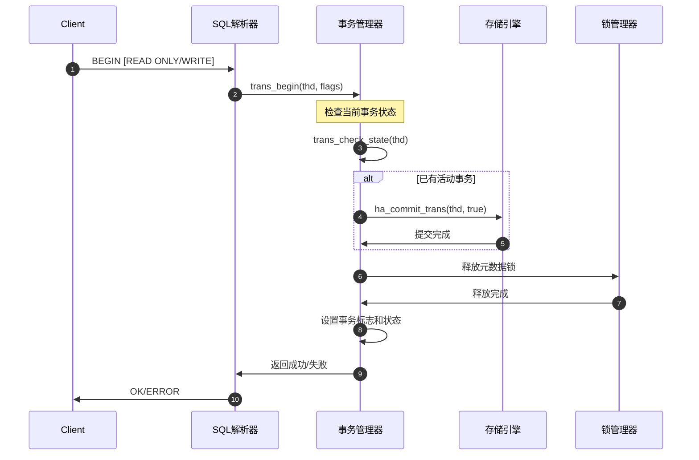
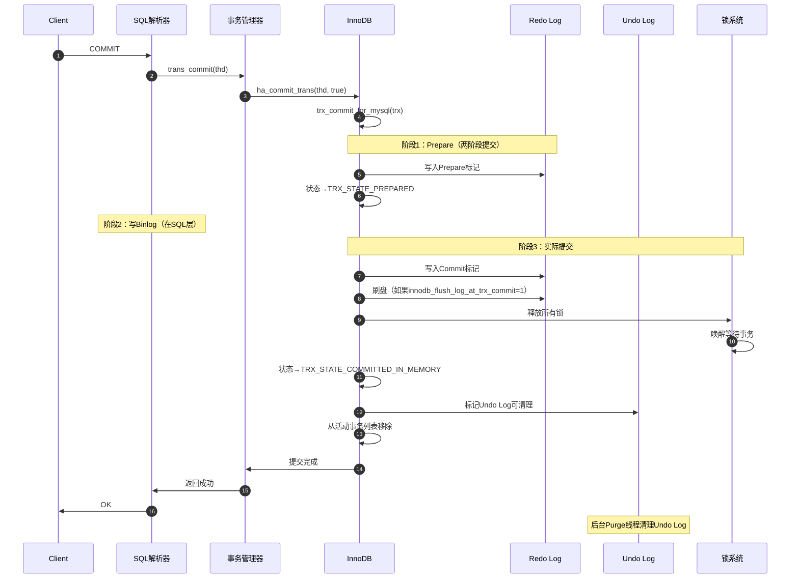
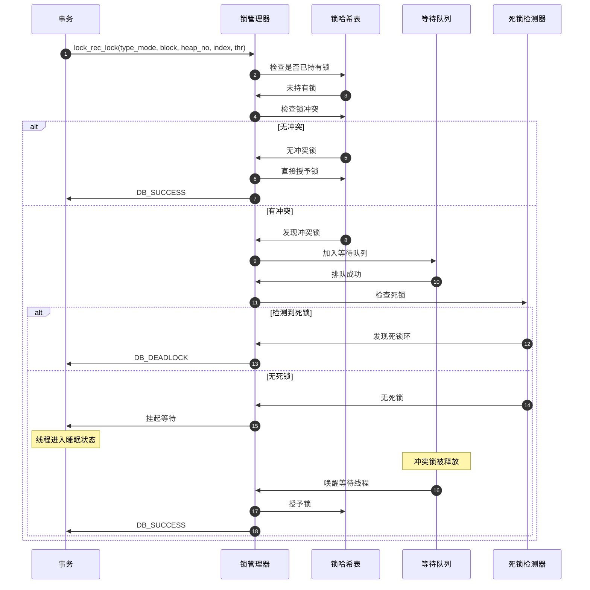
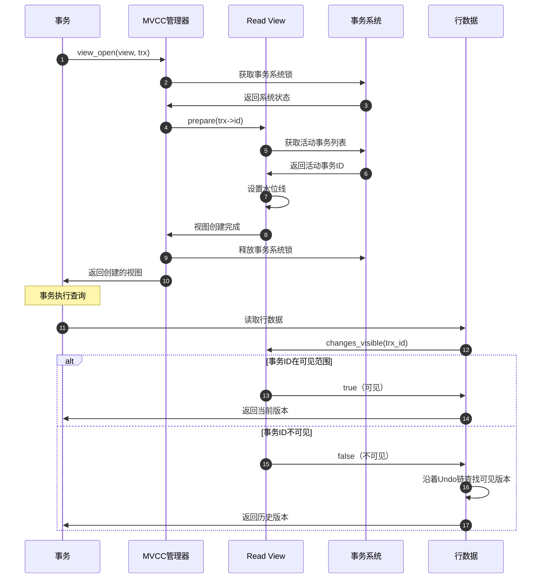
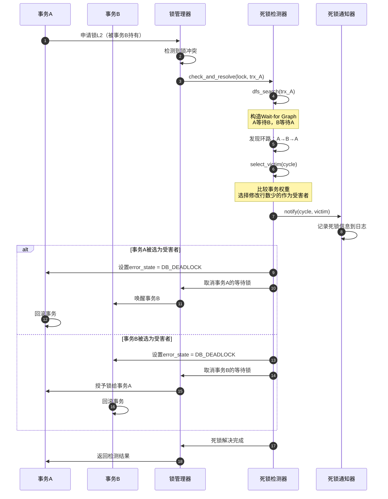

# MySQL Server 源码剖析 - 事务与锁管理API详解

## 一、事务管理API

### 1.1 事务开始 - trans_begin

#### 基本信息
- 名称：`trans_begin`
- 协议/方法：函数调用 `bool trans_begin(THD *thd, uint flags = 0)`
- 幂等性：否（重复调用会提交当前事务并开始新事务）

#### 请求结构体
```cpp
// 事务开始参数
struct TransactionBeginParams {
    THD *thd;                              // MySQL 线程句柄
    uint flags;                            // 事务标志
    // flags 可选值：
    // MYSQL_START_TRANS_OPT_READ_ONLY    - 只读事务
    // MYSQL_START_TRANS_OPT_READ_WRITE   - 读写事务
};
```

| 字段 | 类型 | 必填 | 默认 | 约束 | 说明 |
|------|------|------|------|------|------|
| thd | THD* | 是 | - | 非空 | MySQL 线程句柄，包含会话状态 |
| flags | uint | 否 | 0 | 枚举值 | 事务选项标志，指定读写模式 |

#### 响应结构体
```cpp
// 返回值类型
typedef bool TransactionResult;
// false - 成功
// true  - 失败
```

| 字段 | 类型 | 必填 | 默认 | 约束 | 说明 |
|------|------|------|------|------|------|
| result | bool | 是 | false | 布尔值 | false表示成功，true表示失败 |

#### 入口函数与关键代码
```cpp
bool trans_begin(THD *thd, uint flags) {
  bool res = false;
  
  // 1. 检查事务状态
  if (trans_check_state(thd)) return true;
  
  // 2. 解锁已锁定的表
  thd->locked_tables_list.unlock_locked_tables(thd);
  
  // 3. 如果已经在事务中，先提交当前事务
  if (thd->in_multi_stmt_transaction_mode() ||
      (thd->variables.option_bits & OPTION_TABLE_LOCK)) {
    thd->variables.option_bits &= ~OPTION_TABLE_LOCK;
    thd->server_status &= ~(SERVER_STATUS_IN_TRANS | SERVER_STATUS_IN_TRANS_READONLY);
    res = ha_commit_trans(thd, true); // 提交全局事务
  }
  
  if (res) return true;
  
  // 4. 释放事务相关的元数据锁
  thd->mdl_context.release_transactional_locks();
  
  // 5. 设置事务读写模式
  if (flags & MYSQL_START_TRANS_OPT_READ_ONLY) {
    thd->tx_read_only = true;
  } else if (flags & MYSQL_START_TRANS_OPT_READ_WRITE) {
    if (check_readonly(thd, true)) return true; // 检查只读模式
    thd->tx_read_only = false;
  }
  
  // 6. 设置事务标志
  thd->variables.option_bits |= OPTION_BEGIN;
  thd->server_status |= SERVER_STATUS_IN_TRANS;
  if (thd->tx_read_only) 
    thd->server_status |= SERVER_STATUS_IN_TRANS_READONLY;
  
  return false;
}
```

#### 上层适配/调用链核心代码
```cpp
// SQL层解析BEGIN语句后的调用链
// sql/sql_parse.cc
case SQLCOM_BEGIN: {
  if (trans_begin(thd, lex->start_transaction_opt)) {
    goto error;
  }
  my_ok(thd);
  break;
}

// Handler层事务开始适配
// sql/handler.cc  
int ha_start_transaction(THD *thd, handlerton *hton) {
  trx_t *trx = check_trx_exists(thd);
  
  // 创建InnoDB事务对象
  trx_start_if_not_started_xa(trx, true, UT_LOCATION_HERE);
  
  return 0;
}
```

#### 时序图（请求→响应）


#### 异常/回退与性能要点

**异常处理**：
- **状态检查失败**：返回错误，不开始新事务
- **当前事务提交失败**：返回错误，保持原事务状态
- **只读模式冲突**：在只读模式下无法开始读写事务
- **锁释放失败**：可能导致死锁，需要检查锁状态

**性能要点**：
- 事务开始开销约0.01-0.1ms
- 隐式提交旧事务会增加延迟
- 元数据锁释放是性能关键点
- 避免频繁开始/结束事务

### 1.2 事务提交 - trans_commit

#### 基本信息
- 名称：`trans_commit`
- 协议/方法：函数调用 `bool trans_commit(THD *thd, bool ignore_global_read_lock = false)`
- 幂等性：是（重复提交已提交事务无影响）

#### 请求结构体
```cpp
// 事务提交参数
struct TransactionCommitParams {
    THD *thd;                              // MySQL 线程句柄
    bool ignore_global_read_lock;          // 是否忽略全局读锁
};
```

| 字段 | 类型 | 必填 | 默认 | 约束 | 说明 |
|------|------|------|------|------|------|
| thd | THD* | 是 | - | 非空 | MySQL 线程句柄 |
| ignore_global_read_lock | bool | 否 | false | 布尔值 | 是否忽略全局读锁检查 |

#### 入口函数与关键代码
```cpp
bool trans_commit(THD *thd, bool ignore_global_read_lock) {
  int res = false;
  
  // 1. 检查全局读锁（除非忽略）
  if (!ignore_global_read_lock && 
      check_global_access(thd, GLOBAL_READ_LOCK)) {
    return true;
  }
  
  // 2. 调用存储引擎提交
  res = ha_commit_trans(thd, true); // true表示提交全局事务
  
  // 3. 清理事务状态
  thd->variables.option_bits &= ~OPTION_BEGIN;
  thd->server_status &= ~(SERVER_STATUS_IN_TRANS | SERVER_STATUS_IN_TRANS_READONLY);
  
  // 4. 释放事务相关锁
  thd->mdl_context.release_transactional_locks();
  
  return res;
}

// InnoDB层提交实现
dberr_t trx_commit_for_mysql(trx_t *trx) {
  TrxInInnoDB trx_in_innodb(trx, true);
  
  switch (trx->state.load(std::memory_order_relaxed)) {
    case TRX_STATE_NOT_STARTED:
    case TRX_STATE_FORCED_ROLLBACK:
      trx_start_low(trx, true);
      [[fallthrough]];
    case TRX_STATE_ACTIVE:
    case TRX_STATE_PREPARED:
      trx->op_info = "committing";
      
      // 1. 添加GTID信息到Undo段
      dberr_t db_err = trx_undo_gtid_add_update_undo(trx, false, false);
      if (db_err != DB_SUCCESS) return db_err;
      
      // 2. 更新修改表的时间戳
      if (trx->id != 0) {
        trx_update_mod_tables_timestamp(trx);
      }
      
      // 3. 执行实际提交
      trx_commit(trx);
      
      trx->op_info = "";
      return DB_SUCCESS;
      
    case TRX_STATE_COMMITTED_IN_MEMORY:
      break;
  }
  return DB_SUCCESS;
}
```

#### 时序图（请求→响应）


### 1.3 事务回滚 - trans_rollback

#### 基本信息
- 名称：`trans_rollback`
- 协议/方法：函数调用 `bool trans_rollback(THD *thd)`
- 幂等性：是（重复回滚已回滚事务无影响）

#### 入口函数与关键代码
```cpp
bool trans_rollback(THD *thd) {
  int res = false;
  
  // 1. 调用存储引擎回滚
  res = ha_rollback_trans(thd, true); // true表示回滚全局事务
  
  // 2. 清理事务状态
  thd->variables.option_bits &= ~OPTION_BEGIN;
  thd->server_status &= ~(SERVER_STATUS_IN_TRANS | SERVER_STATUS_IN_TRANS_READONLY);
  
  // 3. 释放事务相关锁
  thd->mdl_context.release_transactional_locks();
  
  return res;
}

// InnoDB层回滚实现
void trx_rollback_to_savepoint(trx_t *trx, trx_named_savept_t *savept) {
  // 1. 确定回滚点
  undo_no_t undo_no = savept ? savept->savept : 0;
  
  for (;;) {
    // 2. 从Undo Log栈顶弹出记录
    trx_undo_rec_t *undo_rec = trx_roll_pop_top_rec_of_trx(trx);
    
    if (!undo_rec || undo_rec->undo_no < undo_no) {
      break; // 回滚完成
    }
    
    // 3. 应用Undo记录（撤销操作）
    dberr_t err = row_undo(undo_rec, trx);
    if (err != DB_SUCCESS) {
      trx->error_state = err;
      return;
    }
  }
  
  // 4. 释放回滚范围内的锁
  lock_trx_release_read_locks(trx, undo_no);
  
  // 5. 如果是完全回滚，更新状态
  if (undo_no == 0) {
    trx->state = TRX_STATE_ABORTED;
    lock_trx_release_locks(trx); // 释放所有锁
  }
}
```

## 二、锁管理API

### 2.1 行锁申请 - lock_rec_lock

#### 基本信息
- 名称：`lock_rec_lock`
- 协议/方法：函数调用 `dberr_t lock_rec_lock(ulint type_mode, const buf_block_t *block, ulint heap_no, dict_index_t *index, que_thr_t *thr)`
- 幂等性：是（重复申请相同锁无副作用）

#### 请求结构体
```cpp
// 行锁申请参数
struct RecordLockRequest {
    ulint type_mode;                       // 锁类型和模式
    const buf_block_t *block;              // 数据页块
    ulint heap_no;                         // 记录堆号
    dict_index_t *index;                   // 索引
    que_thr_t *thr;                        // 查询线程
};

// 锁类型和模式常量
#define LOCK_S          4    // 共享锁
#define LOCK_X          5    // 排他锁
#define LOCK_GAP        512  // Gap锁
#define LOCK_REC_NOT_GAP 1024 // 记录锁（不含Gap）
#define LOCK_ORDINARY   0    // Next-Key锁（Record + Gap）
```

| 字段 | 类型 | 必填 | 默认 | 约束 | 说明 |
|------|------|------|------|------|------|
| type_mode | ulint | 是 | - | 枚举值 | 锁类型（S/X）和锁模式组合 |
| block | buf_block_t* | 是 | - | 非空 | 包含记录的数据页 |
| heap_no | ulint | 是 | - | >0 | 记录在页中的堆号 |
| index | dict_index_t* | 是 | - | 非空 | 记录所在的索引 |
| thr | que_thr_t* | 是 | - | 非空 | 申请锁的查询线程 |

#### 响应结构体
```cpp
// 锁申请结果
typedef enum {
    DB_SUCCESS = 0,           // 成功获得锁
    DB_LOCK_WAIT,            // 需要等待锁
    DB_DEADLOCK,             // 检测到死锁
    DB_LOCK_TABLE_FULL,      // 锁表满
    DB_LOCK_NOWAIT          // NOWAIT模式下无法获得锁
} dberr_t;
```

| 字段 | 类型 | 必填 | 默认 | 约束 | 说明 |
|------|------|------|------|------|------|
| result | dberr_t | 是 | DB_SUCCESS | 枚举值 | 锁申请结果状态码 |

#### 入口函数与关键代码
```cpp
dberr_t lock_rec_lock(
    ulint type_mode,              // 锁类型（LOCK_S / LOCK_X）+ 锁模式
    const buf_block_t *block,     // 数据页
    ulint heap_no,                // 记录堆号
    dict_index_t *index,          // 索引
    que_thr_t *thr)               // 查询线程
{
  trx_t *trx = thr_get_trx(thr);
  
  // 1. 检查是否已持有锁
  lock_t *lock = lock_rec_has_expl(type_mode, block, heap_no, trx);
  if (lock != nullptr) {
    return DB_SUCCESS; // 已持有锁
  }
  
  // 2. 检查锁冲突
  lock_t *conflicting_lock = lock_rec_other_has_conflicting(
      type_mode, block, heap_no, trx);
  
  if (conflicting_lock != nullptr) {
    // 3. 有冲突，进入等待
    RecLock rec_lock(thr, index, block, heap_no, type_mode);
    
    dberr_t err = rec_lock.add_to_waitq(conflicting_lock);
    
    if (err == DB_LOCK_WAIT) {
      // 4. 设置等待状态并挂起线程
      trx->lock.wait_started = std::chrono::system_clock::now();
      trx->lock.que_state = TRX_QUE_LOCK_WAIT;
      
      // 5. 死锁检测
      if (Deadlock_checker::check_and_resolve(rec_lock.lock(), trx)) {
        return DB_DEADLOCK;
      }
      
      // 6. 等待锁被释放
      lock_wait_suspend_thread(thr);
      
      // 7. 被唤醒后检查结果
      if (trx->error_state == DB_DEADLOCK) {
        return DB_DEADLOCK;
      }
    }
    
    return err;
  }
  
  // 8. 无冲突，直接授予锁
  lock_rec_add_to_queue_in_mode(type_mode, block, heap_no, index, trx, 
                                LOCK_MODE_MASK & type_mode);
  
  return DB_SUCCESS;
}
```

#### 时序图（请求→响应）


### 2.2 表锁申请 - lock_table

#### 基本信息
- 名称：`lock_table`
- 协议/方法：函数调用 `dberr_t lock_table(ulint flags, dict_table_t *table, lock_mode mode, que_thr_t *thr)`
- 幂等性：是（重复申请相同表锁无副作用）

#### 请求结构体
```cpp
// 表锁申请参数
struct TableLockRequest {
    ulint flags;                           // 锁标志
    dict_table_t *table;                   // 表对象
    lock_mode mode;                        // 锁模式
    que_thr_t *thr;                        // 查询线程
};

// 表锁模式
typedef enum {
    LOCK_IS = 0,     // 意向共享锁
    LOCK_IX = 1,     // 意向排他锁
    LOCK_S = 2,      // 共享锁
    LOCK_X = 3,      // 排他锁
    LOCK_AUTO_INC = 4 // 自增锁
} lock_mode;
```

#### 入口函数与关键代码
```cpp
dberr_t lock_table(
    ulint flags,                 // 标志（通常为0）
    dict_table_t *table,         // 表对象
    lock_mode mode,              // 锁模式
    que_thr_t *thr)              // 查询线程
{
  trx_t *trx = thr_get_trx(thr);
  
  // 1. 跳过临时表和只读模式
  if ((flags & BTR_NO_LOCKING_FLAG) || srv_read_only_mode ||
      table->is_temporary()) {
    return DB_SUCCESS;
  }
  
  // 2. 检查是否已持有相同或更强的锁
  if (lock_table_has(trx, table, mode)) {
    return DB_SUCCESS;
  }
  
  // 3. 检查锁兼容性
  const lock_t *wait_for = lock_table_other_has_incompatible(
      trx, LOCK_WAIT, table, mode);
  
  if (wait_for != nullptr) {
    // 4. 有冲突，创建等待锁
    return lock_table_enqueue_waiting(mode, table, thr, wait_for);
  }
  
  // 5. 无冲突，直接创建锁
  lock_table_create(table, mode, trx);
  
  ut_ad(lock_table_has(trx, table, mode));
  
  return DB_SUCCESS;
}

// 表锁兼容性检查
static bool lock_mode_compatible(lock_mode mode1, lock_mode mode2) {
  // 兼容矩阵
  static const bool compatibility_matrix[5][5] = {
  //     IS    IX    S     X    AUTO
      {true, true, true, false, true}, // IS
      {true, true, false, false, true}, // IX  
      {true, false, true, false, false}, // S
      {false, false, false, false, false}, // X
      {true, true, false, false, false}  // AUTO_INC
  };
  
  return compatibility_matrix[mode1][mode2];
}
```

## 三、MVCC API

### 3.1 Read View创建 - MVCC::view_open

#### 基本信息
- 名称：`MVCC::view_open`
- 协议/方法：成员函数调用 `void MVCC::view_open(ReadView *&view, trx_t *trx)`
- 幂等性：否（每次调用创建新的一致性视图）

#### 请求结构体
```cpp
// Read View创建参数
struct ReadViewOpenParams {
    ReadView *&view;                       // 输出参数：创建的视图
    trx_t *trx;                           // 创建视图的事务
};
```

#### 响应结构体
```cpp
// Read View结构
class ReadView {
    trx_id_t m_low_limit_id;      // 高水位线：不可见的最小事务ID
    trx_id_t m_up_limit_id;       // 低水位线：可见的最大事务ID  
    trx_id_t m_creator_trx_id;    // 创建者事务ID
    ids_t m_ids;                  // 创建时活动的事务ID列表
    trx_id_t m_low_limit_no;      // Purge相关的序号
    bool m_closed;                // 是否已关闭
};
```

#### 入口函数与关键代码
```cpp
void MVCC::view_open(ReadView *&view, trx_t *trx) {
  ut_ad(!srv_read_only_mode);
  
  // 1. 优化：重用视图（仅限自动提交非锁定事务）
  if (view != nullptr) {
    uintptr_t p = reinterpret_cast<uintptr_t>(view);
    view = reinterpret_cast<ReadView *>(p & ~1);
    
    ut_ad(view->m_closed);
    
    // 如果没有新的RW事务，重用现有视图
    if (trx_is_autocommit_non_locking(trx) && view->empty()) {
      view->m_closed = false;
      
      if (view->m_low_limit_id == trx_sys_get_next_trx_id_or_no()) {
        return; // 重用成功
      } else {
        view->m_closed = true;
      }
    }
  }
  
  // 2. 获取trx_sys互斥锁，创建一致性视图
  trx_sys_mutex_enter();
  
  if (view != nullptr) {
    UT_LIST_REMOVE(m_views, view);
  } else {
    view = get_view(); // 从空闲列表获取或分配新视图
  }
  
  if (view != nullptr) {
    // 3. 准备视图快照
    view->prepare(trx->id);
    
    // 4. 加入活动视图列表
    UT_LIST_ADD_FIRST(m_views, view);
    
    ut_ad(!view->is_closed());
  }
  
  trx_sys_mutex_exit();
}

// Read View准备快照
void ReadView::prepare(trx_id_t id) {
  ut_ad(trx_sys_mutex_own());
  
  m_creator_trx_id = id;
  
  // 设置低水位线（Purge相关）
  m_low_limit_no = trx_get_serialisation_min_trx_no();
  
  // 设置高水位线（下一个将被分配的事务ID）
  m_low_limit_id = trx_sys_get_next_trx_id_or_no();
  
  ut_a(m_low_limit_no <= m_low_limit_id);
  
  // 复制当前活动的读写事务ID列表
  if (!trx_sys->rw_trx_ids.empty()) {
    copy_trx_ids(trx_sys->rw_trx_ids);
  } else {
    m_ids.clear();
  }
  
  // 设置低水位线（最小活动事务ID）
  m_up_limit_id = !m_ids.empty() ? m_ids.front() : m_low_limit_id;
  
  ut_a(m_up_limit_id <= m_low_limit_id);
  
  m_closed = false;
}
```

### 3.2 可见性判断 - ReadView::changes_visible

#### 基本信息
- 名称：`ReadView::changes_visible`
- 协议/方法：成员函数调用 `bool ReadView::changes_visible(trx_id_t id, const table_name_t &name) const`
- 幂等性：是（同样参数总是返回相同结果）

#### 入口函数与关键代码
```cpp
bool ReadView::changes_visible(trx_id_t id, const table_name_t &name) const {
  ut_ad(id > 0);
  
  // 1. 自己的修改总是可见
  if (id == m_creator_trx_id) {
    return true;
  }
  
  // 2. 在低水位线之前的事务（已提交的老事务）可见
  if (id < m_up_limit_id) {
    return true;
  }
  
  // 3. 在高水位线之后的事务（未来事务）不可见
  if (id >= m_low_limit_id) {
    return false;
  }
  
  // 4. 在活动事务列表中的事务不可见
  if (std::binary_search(m_ids.begin(), m_ids.end(), id)) {
    return false;
  }
  
  // 5. 其他情况（已提交的事务）可见
  return true;
}
```

#### 时序图（Read View创建和使用）


## 四、死锁检测API

### 4.1 死锁检测 - Deadlock_checker::check_and_resolve

#### 基本信息
- 名称：`Deadlock_checker::check_and_resolve`
- 协议/方法：静态函数调用 `bool Deadlock_checker::check_and_resolve(const lock_t *lock, trx_t *trx)`
- 幂等性：否（检测过程可能改变事务状态）

#### 入口函数与关键代码
```cpp
bool Deadlock_checker::check_and_resolve(const lock_t *lock, trx_t *trx) {
  ut_ad(locksys::owns_exclusive_global_latch());
  ut_ad(trx->lock.wait_lock == lock);
  
  // 1. 构造Wait-for Graph并进行DFS搜索
  std::vector<const trx_t *> path;
  std::set<const trx_t *> visited;
  
  bool found_cycle = dfs_search(trx, visited, path);
  
  if (found_cycle) {
    // 2. 发现死锁，选择受害者事务
    const trx_t *victim = select_victim(path);
    
    // 3. 通知死锁信息
    Deadlock_notifier::notify(path, victim);
    
    // 4. 回滚受害者事务
    trx_t *victim_trx = const_cast<trx_t *>(victim);
    lock_cancel_waiting_and_release(victim_trx->lock.wait_lock);
    victim_trx->error_state = DB_DEADLOCK;
    victim_trx->lock.was_chosen_as_deadlock_victim = true;
    
    return true; // 发现并解决了死锁
  }
  
  return false; // 未发现死锁
}

// 深度优先搜索检测环
bool Deadlock_checker::dfs_search(
    const trx_t *trx,
    std::set<const trx_t *> &visited,
    std::vector<const trx_t *> &path)
{
  // 检查是否形成环
  auto it = std::find(path.begin(), path.end(), trx);
  if (it != path.end()) {
    // 找到环，截取环路部分
    path.erase(path.begin(), it);
    return true;
  }
  
  // 防止重复访问
  if (visited.find(trx) != visited.end()) {
    return false;
  }
  
  visited.insert(trx);
  path.push_back(trx);
  
  // 获取当前事务等待的锁
  const lock_t *wait_lock = trx->lock.wait_lock;
  if (wait_lock == nullptr) {
    path.pop_back();
    return false;
  }
  
  // 遍历与等待锁冲突的所有锁
  std::vector<const trx_t *> blocking_trxs;
  get_conflicting_transactions(wait_lock, blocking_trxs);
  
  for (const trx_t *blocking_trx : blocking_trxs) {
    if (dfs_search(blocking_trx, visited, path)) {
      return true; // 在递归中找到了环
    }
  }
  
  path.pop_back();
  return false;
}

// 选择死锁受害者（权重最小的事务）
const trx_t *Deadlock_checker::select_victim(
    const std::vector<const trx_t *> &cycle)
{
  const trx_t *victim = nullptr;
  ulint min_weight = ULINT_MAX;
  
  for (const trx_t *trx : cycle) {
    // 计算事务权重（修改行数 + Undo记录数）
    ulint weight = trx->undo_no + trx->undo_no_arr.size();
    
    // 高优先级事务权重设为最大，避免被选为受害者
    if (trx_is_high_priority(trx)) {
      weight = ULINT_MAX;
    }
    
    if (weight < min_weight) {
      min_weight = weight;
      victim = trx;
    }
  }
  
  ut_ad(victim != nullptr);
  return victim;
}
```

#### 时序图（死锁检测和解决）


## 五、异常处理与性能优化

### 5.1 异常处理策略

#### 事务异常
```cpp
// 事务异常恢复
dberr_t trx_recover_for_mysql(trx_t *trx) {
  switch (trx->error_state) {
    case DB_DEADLOCK:
      // 死锁：回滚事务并重试
      trx_rollback_for_mysql(trx);
      return DB_DEADLOCK;
      
    case DB_LOCK_WAIT_TIMEOUT:
      // 锁等待超时：根据配置决定回滚范围
      if (innobase_rollback_on_timeout) {
        trx_rollback_for_mysql(trx); // 回滚整个事务
      } else {
        trx_rollback_last_sql_stat_for_mysql(trx); // 只回滚当前语句
      }
      return DB_LOCK_WAIT_TIMEOUT;
      
    case DB_LOCK_TABLE_FULL:
      // 锁表满：回滚事务，释放锁空间
      trx_rollback_for_mysql(trx);
      return DB_LOCK_TABLE_FULL;
      
    default:
      return DB_SUCCESS;
  }
}
```

#### 锁异常处理
```cpp
// 锁等待超时处理
void lock_wait_timeout_thread(void *arg) {
  while (!srv_shutdown_state.load()) {
    os_event_wait_time(lock_sys->timeout_event, 1000000); // 1秒检查一次
    
    if (srv_shutdown_state.load()) break;
    
    // 检查所有等待锁的事务
    std::vector<trx_t *> timeout_trxs;
    
    lock_sys->rec_hash.for_each([&](lock_t *lock) {
      if (lock->is_waiting()) {
        trx_t *trx = lock->trx;
        auto wait_time = std::chrono::duration_cast<std::chrono::seconds>(
            std::chrono::system_clock::now() - trx->lock.wait_started).count();
            
        if (wait_time >= srv_innodb_lock_wait_timeout) {
          timeout_trxs.push_back(trx);
        }
      }
    });
    
    // 处理超时事务
    for (trx_t *trx : timeout_trxs) {
      trx->error_state = DB_LOCK_WAIT_TIMEOUT;
      lock_cancel_waiting_and_release(trx->lock.wait_lock);
    }
  }
}
```

### 5.2 性能优化要点

#### 事务性能
```cpp
// 事务性能监控
struct TrxPerformanceMetrics {
  ulint active_trx_count;           // 活跃事务数
  ulint ro_trx_count;              // 只读事务数  
  ulint rw_trx_count;              // 读写事务数
  ulint avg_commit_time_ms;        // 平均提交时间
  ulint avg_rollback_time_ms;      // 平均回滚时间
};

// 事务池优化
class TrxPool {
  std::vector<trx_t *> free_trxs;  // 空闲事务对象池
  std::mutex pool_mutex;           // 池互斥锁
  
public:
  trx_t *allocate() {
    std::lock_guard<std::mutex> guard(pool_mutex);
    
    if (!free_trxs.empty()) {
      trx_t *trx = free_trxs.back();
      free_trxs.pop_back();
      trx_reset(trx); // 重置事务状态
      return trx;
    }
    
    return trx_create(); // 创建新事务对象
  }
  
  void deallocate(trx_t *trx) {
    std::lock_guard<std::mutex> guard(pool_mutex);
    
    if (free_trxs.size() < max_pool_size) {
      free_trxs.push_back(trx);
    } else {
      trx_free(trx); // 释放多余对象
    }
  }
};
```

#### 锁性能优化
```cpp
// 锁内存池
class LockPool {
  static constexpr size_t LOCK_POOL_SIZE = 10000;
  
  lock_t lock_pool[LOCK_POOL_SIZE];  // 预分配锁对象池
  std::atomic<size_t> next_free{0};  // 下一个空闲位置
  
public:
  lock_t *allocate() {
    size_t pos = next_free.fetch_add(1) % LOCK_POOL_SIZE;
    return &lock_pool[pos];
  }
};

// CATS算法优化锁调度
void lock_grant_and_move_on_page(const buf_block_t *block) {
  // 1. 收集所有等待锁
  std::vector<lock_t *> waiting_locks;
  
  // 2. 按CATS权重排序
  std::sort(waiting_locks.begin(), waiting_locks.end(),
    [](const lock_t *a, const lock_t *b) {
      ulint weight_a = a->trx->lock.schedule_weight.load();
      ulint weight_b = b->trx->lock.schedule_weight.load();
      
      // 高优先级事务优先
      if (trx_is_high_priority(a->trx) != trx_is_high_priority(b->trx)) {
        return trx_is_high_priority(a->trx);
      }
      
      return weight_a > weight_b; // 权重高的优先
    });
  
  // 3. 按序授予锁
  for (lock_t *lock : waiting_locks) {
    if (!lock_has_to_wait(lock)) {
      lock_grant(lock);
    }
  }
}
```

## 六、最佳实践

### 6.1 事务最佳实践

#### 事务设计原则
```sql
-- ✅ 好：短小事务
BEGIN;
UPDATE account SET balance = balance - 100 WHERE id = 1;
UPDATE account SET balance = balance + 100 WHERE id = 2;
INSERT INTO transfer_log(from_id, to_id, amount) VALUES(1, 2, 100);
COMMIT;

-- ❌ 差：长事务
BEGIN;
SELECT COUNT(*) FROM large_table; -- 耗时查询
-- 用户交互等待...
UPDATE account SET balance = balance - 100 WHERE id = 1;
COMMIT;
```

#### 并发控制
```sql
-- ✅ 好：明确加锁意图
BEGIN;
SELECT balance FROM account WHERE id = 1 FOR UPDATE; -- 显式加锁
UPDATE account SET balance = balance - 100 WHERE id = 1;
COMMIT;

-- ❌ 差：依赖隐式锁
BEGIN;
SELECT balance FROM account WHERE id = 1; -- 可能读到过期数据
UPDATE account SET balance = balance - 100 WHERE id = 1;
COMMIT;
```

### 6.2 锁使用最佳实践

#### 避免死锁
```cpp
// ✅ 好：按固定顺序获取锁
void transfer_money(int from_id, int to_id, int amount) {
  int first_id = std::min(from_id, to_id);
  int second_id = std::max(from_id, to_id);
  
  BEGIN;
  SELECT balance FROM account WHERE id = first_id FOR UPDATE;
  SELECT balance FROM account WHERE id = second_id FOR UPDATE;
  
  UPDATE account SET balance = balance - amount WHERE id = from_id;
  UPDATE account SET balance = balance + amount WHERE id = to_id;
  COMMIT;
}

// ❌ 差：随机顺序获取锁
void transfer_money_bad(int from_id, int to_id, int amount) {
  BEGIN;
  SELECT balance FROM account WHERE id = from_id FOR UPDATE;
  SELECT balance FROM account WHERE id = to_id FOR UPDATE; // 可能死锁
  // ...
  COMMIT;
}
```

#### 锁粒度控制
```sql
-- ✅ 好：使用索引减少锁范围
UPDATE order SET status = 'SHIPPED' 
WHERE order_date = '2024-01-01' AND status = 'PAID';
-- 需要索引：INDEX(order_date, status)

-- ❌ 差：全表扫描，锁定过多行
UPDATE order SET status = 'SHIPPED' 
WHERE YEAR(order_date) = 2024 AND status = 'PAID';
```

### 6.3 性能监控

#### 关键指标监控
```sql
-- 监控事务状态
SELECT 
  trx_id,
  trx_state,
  trx_started,
  TIME_TO_SEC(TIMEDIFF(NOW(), trx_started)) as duration_seconds,
  trx_isolation_level,
  trx_query
FROM information_schema.INNODB_TRX
WHERE TIME_TO_SEC(TIMEDIFF(NOW(), trx_started)) > 10;

-- 监控锁等待
SELECT 
  waiting_trx_id,
  waiting_query,
  blocking_trx_id,
  blocking_query,
  wait_age_secs
FROM (
  SELECT 
    w.requesting_trx_id as waiting_trx_id,
    rt.trx_query as waiting_query,
    w.blocking_trx_id,
    bt.trx_query as blocking_query,
    TIME_TO_SEC(TIMEDIFF(NOW(), rt.trx_started)) as wait_age_secs
  FROM information_schema.INNODB_LOCK_WAITS w
  JOIN information_schema.INNODB_TRX rt ON rt.trx_id = w.requesting_trx_id  
  JOIN information_schema.INNODB_TRX bt ON bt.trx_id = w.blocking_trx_id
) t
WHERE wait_age_secs > 5;

-- 监控死锁频率
SHOW ENGINE INNODB STATUS\G
-- 查看 "LATEST DETECTED DEADLOCK" 部分
```

## 七、总结

MySQL的事务与锁管理API通过分层设计实现了ACID特性：

**事务管理API**：
- `trans_begin/commit/rollback`：SQL层事务控制
- `trx_commit_for_mysql/trx_rollback_for_mysql`：InnoDB层实现
- 支持两阶段提交保证分布式事务一致性

**锁管理API**：
- `lock_rec_lock/lock_table`：行锁和表锁申请
- 多种锁类型：S/X锁、IS/IX锁、Gap锁、Next-Key锁
- CATS算法优化锁调度性能

**MVCC API**：
- `MVCC::view_open`：创建一致性视图
- `ReadView::changes_visible`：版本可见性判断
- 实现无锁读取，提高并发性能

**死锁检测API**：
- `Deadlock_checker::check_and_resolve`：自动死锁检测
- Wait-for Graph + DFS算法
- 智能选择受害者事务

理解这些API的实现原理，有助于设计高性能、低冲突的数据库应用。
