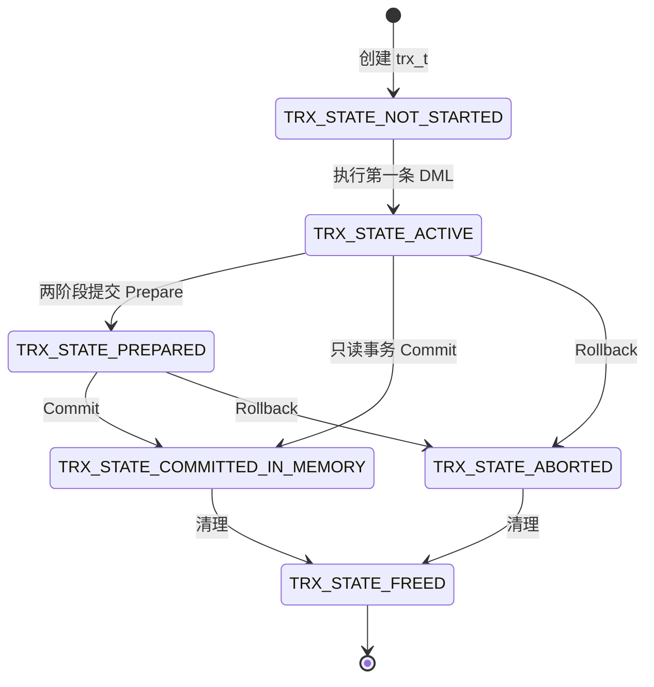
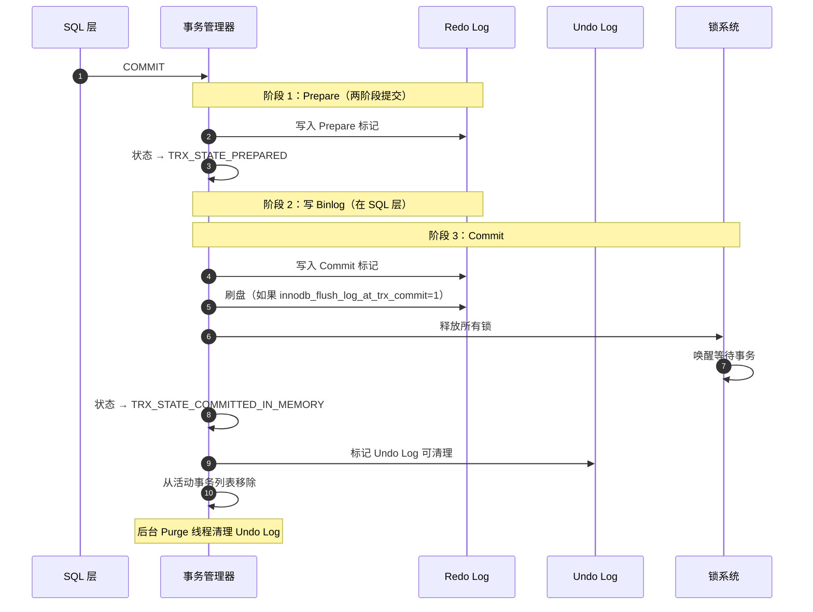
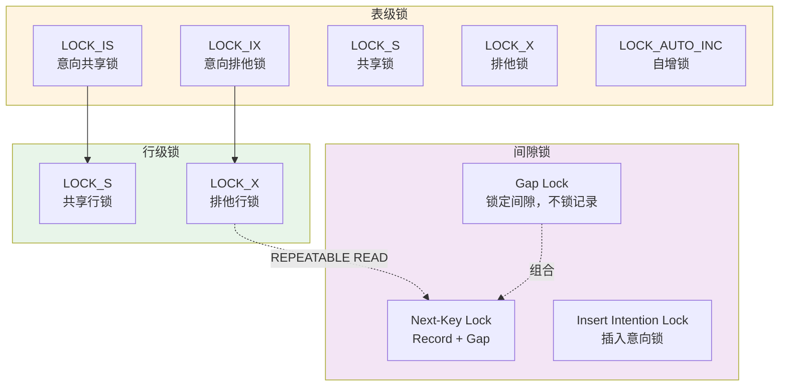
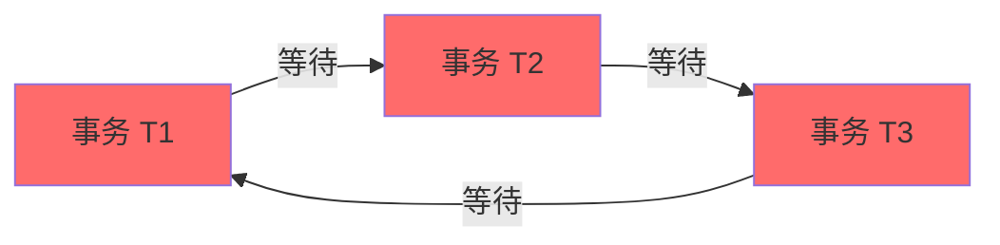

# MySQL Server 源码剖析 - 事务与锁管理概览

## 一、模块职责

事务与锁管理是 InnoDB 存储引擎实现 ACID 特性的核心机制，确保数据的一致性和并发访问的正确性。

### 1.1 核心职责

1. **事务管理**：实现事务的开始、提交、回滚
2. **隔离级别**：实现四种事务隔离级别
3. **MVCC**：多版本并发控制，无锁读取
4. **锁管理**：行锁、表锁、Gap Lock、Next-Key Lock
5. **死锁检测**：自动检测并解决死锁
6. **并发控制**：保证事务的串行化等价性

### 1.2 ACID 特性

| 特性 | 英文 | 实现方式 |
|------|------|---------|
| 原子性 | Atomicity | Undo Log（回滚日志） |
| 一致性 | Consistency | 约束 + 事务机制 |
| 隔离性 | Isolation | MVCC + 锁 |
| 持久性 | Durability | Redo Log（重做日志） + Doublewrite Buffer |

### 1.3 输入输出

**输入**：
- 事务操作（BEGIN、COMMIT、ROLLBACK）
- DML 语句（INSERT、UPDATE、DELETE）
- 锁请求（SELECT ... FOR UPDATE、SELECT ... LOCK IN SHARE MODE）

**输出**：
- 事务状态（ACTIVE、COMMITTED、ABORTED）
- 锁授予或等待
- 死锁检测结果

### 1.4 上下游依赖

**上游**：
- SQL 执行器：发起事务和锁请求
- Handler API：存储引擎接口

**下游**：
- Undo Log：回滚段管理
- Redo Log：重做日志
- Buffer Pool：数据页管理

## 二、整体架构

### 2.1 事务与锁架构图

```mermaid
flowchart TB
    subgraph SQL_Layer["SQL 层"]
        BEGIN[BEGIN]
        COMMIT[COMMIT]
        ROLLBACK[ROLLBACK]
        DML[INSERT/UPDATE/DELETE]
        SELECT_LOCK[SELECT ... FOR UPDATE]
    end
    
    subgraph TRX_System["事务系统（trx_sys）"]
        TRX_LIST[活动事务列表<br/>trx_sys->trx_list]
        TRX_ASSIGN[事务 ID 分配器<br/>max_trx_id]
        RSEG_ARRAY[回滚段数组<br/>rseg_array[128]]
        
        subgraph TRX_Object["事务对象（trx_t）"]
            TRX_ID[事务 ID<br/>trx->id]
            TRX_STATE[事务状态<br/>ACTIVE/COMMITTED]
            TRX_ISOLATION[隔离级别<br/>READ COMMITTED/REPEATABLE READ]
            READ_VIEW[Read View<br/>一致性视图]
            TRX_LOCKS[持有的锁列表<br/>trx->lock_heap]
            UNDO_PTR[Undo Log 指针<br/>insert_undo/update_undo]
        end
    end
    
    subgraph Lock_System["锁系统（lock_sys）"]
        LOCK_HASH[锁哈希表<br/>rec_hash / prdt_hash]
        TABLE_LOCKS[表锁<br/>table_locks]
        
        subgraph Lock_Types["锁类型"]
            LOCK_S[共享锁<br/>LOCK_S]
            LOCK_X[排他锁<br/>LOCK_X]
            LOCK_IS[意向共享锁<br/>LOCK_IS]
            LOCK_IX[意向排他锁<br/>LOCK_IX]
            LOCK_AUTO_INC[AUTO_INCREMENT锁<br/>LOCK_AUTO_INC]
            
            GAP_LOCK[Gap Lock<br/>锁定间隙]
            RECORD_LOCK[Record Lock<br/>锁定记录]
            NEXT_KEY_LOCK[Next-Key Lock<br/>Record + Gap]
        end
        
        DEADLOCK_DETECTOR[死锁检测器<br/>Wait-for Graph]
    end
    
    subgraph MVCC_System["MVCC 系统"]
        GTID_EXECUTED[GTID Executed<br/>已执行事务]
        READ_VIEW_POOL[Read View 池]
        UNDO_LOG[Undo Log<br/>版本链]
    end
    
    subgraph Redo_Undo["日志系统"]
        REDO_LOG[Redo Log<br/>重做日志]
        UNDO_LOG_SEGMENT[Undo Log Segment<br/>回滚段]
    end
    
    BEGIN --> TRX_ASSIGN
    TRX_ASSIGN --> TRX_Object
    TRX_Object --> TRX_LIST
    
    DML --> TRX_Object
    TRX_Object --> UNDO_PTR
    UNDO_PTR --> UNDO_LOG_SEGMENT
    
    SELECT_LOCK --> LOCK_HASH
    DML --> LOCK_HASH
    
    LOCK_HASH --> Lock_Types
    Lock_Types --> DEADLOCK_DETECTOR
    
    TRX_Object --> READ_VIEW
    READ_VIEW --> READ_VIEW_POOL
    READ_VIEW --> UNDO_LOG
    
    COMMIT --> REDO_LOG
    ROLLBACK --> UNDO_LOG_SEGMENT
    
    style SQL_Layer fill:#e1f5ff
    style TRX_System fill:#fff4e1
    style Lock_System fill:#e8f5e9
    style MVCC_System fill:#f3e5f5
    style Redo_Undo fill:#fce4ec
```

### 2.2 架构说明

#### 2.2.1 图意概述

InnoDB 的事务与锁系统采用中心化管理，所有活动事务由 trx_sys 统一管理，锁由 lock_sys 统一调度。MVCC 通过 Read View 和 Undo Log 实现无锁读取，锁系统支持多种粒度和类型的锁。

#### 2.2.2 关键组件

**事务系统（trx_sys）**：
- **活动事务列表**：所有 ACTIVE 状态的事务
- **事务 ID 分配器**：全局递增的事务 ID
- **回滚段数组**：128 个回滚段，用于并发事务

**事务对象（trx_t）**：
```cpp
struct trx_t {
  trx_id_t id;                      // 事务 ID（只读事务无 ID）
  trx_id_t no;                      // 提交序号
  trx_state_t state;                // TRX_STATE_ACTIVE / COMMITTED / ABORTED
  
  enum isolation_level_t {
    READ_UNCOMMITTED,
    READ_COMMITTED,
    REPEATABLE_READ,
    SERIALIZABLE
  } isolation_level;
  
  ReadView *read_view;              // MVCC 一致性视图
  
  lock_t *lock_heap;                // 持有的锁链表
  
  trx_undo_t *insert_undo;          // INSERT Undo Log
  trx_undo_t *update_undo;          // UPDATE/DELETE Undo Log
  
  trx_rseg_t *rseg;                 // 分配的回滚段
  
  bool is_recovered;                // 是否是恢复的事务
  ulint n_ref;                      // 引用计数
};
```

**锁系统（lock_sys）**：
- **rec_hash**：行锁哈希表，按 `(space_id, page_no)` 组织
- **prdt_hash**：空间索引锁哈希表
- **table_locks**：表锁
- **死锁检测器**：基于 Wait-for Graph 检测死锁

**锁类型**：
- **表锁**：`LOCK_IS`、`LOCK_IX`、`LOCK_S`、`LOCK_X`、`LOCK_AUTO_INC`
- **行锁**：`LOCK_S`、`LOCK_X`
- **Gap Lock**：锁定索引记录之间的间隙（防止幻读）
- **Next-Key Lock**：Record Lock + Gap Lock

**MVCC 系统**：
- **Read View**：事务开始时创建的一致性视图
- **Undo Log**：旧版本数据，用于构造历史版本
- **版本链**：通过 `DB_ROLL_PTR` 连接

#### 2.2.3 边界条件

**并发限制**：
- 最大活动事务数：受限于回滚段数量（128）和内存
- 最大锁数量：受限于 `innodb_buffer_pool_size` 和锁内存
- 锁等待超时：`innodb_lock_wait_timeout`（默认 50 秒）

**事务大小限制**：
- 单事务修改行数：无硬限制，但受 Undo Log 空间限制
- Undo Log 最大大小：`innodb_max_undo_log_size`（默认 1GB）
- 推荐：单事务修改行数 < 10 万行

**隔离级别差异**：

| 隔离级别 | 脏读 | 不可重复读 | 幻读 | 实现方式 |
|---------|------|-----------|------|---------|
| READ UNCOMMITTED | ✅ 允许 | ✅ 允许 | ✅ 允许 | 无锁读，读最新版本 |
| READ COMMITTED | ❌ 禁止 | ✅ 允许 | ✅ 允许 | MVCC，每次读创建 Read View |
| REPEATABLE READ | ❌ 禁止 | ❌ 禁止 | ❌ 禁止 | MVCC + Next-Key Lock |
| SERIALIZABLE | ❌ 禁止 | ❌ 禁止 | ❌ 禁止 | 所有读都加锁 |

#### 2.2.4 异常处理

**死锁**：
- 检测：自动检测死锁（Wait-for Graph）
- 解决：回滚代价较小的事务（修改行数少）
- 返回：`ER_LOCK_DEADLOCK` 错误
- 重试：应用需要重试事务

**锁等待超时**：
- 超时时间：`innodb_lock_wait_timeout`（默认 50 秒）
- 返回：`ER_LOCK_WAIT_TIMEOUT` 错误
- 处理：回滚当前语句或整个事务（取决于 `innodb_rollback_on_timeout`）

**回滚段满**：
- 原因：长时间运行的事务占用 Undo Log 空间
- 返回：`ER_LOCK_TABLE_FULL` 或 `ER_TOO_MANY_CONCURRENT_TRXS`
- 解决：提交或回滚旧事务，释放 Undo Log 空间

**唯一键冲突**：
- 检测：插入或更新时检查唯一索引
- 加锁：对冲突行加 `LOCK_S`（共享锁）
- 返回：`ER_DUP_ENTRY`
- 注意：可能导致死锁

#### 2.2.5 性能与容量

**事务开销**：
- 只读事务：几乎无开销（无需分配事务 ID）
- 读写事务：需要分配事务 ID、创建 Undo Log
- 小事务（<10 行）：约 0.1ms 开销
- 大事务（>10 万行）：显著开销，建议拆分

**锁开销**：
- 行锁内存：约 100 字节/锁
- 1 万行锁：约 1MB 内存
- 10 万行锁：约 10MB 内存
- 死锁检测：O(n²) 复杂度（n = 等待锁的事务数）

**MVCC 开销**：
- Read View 创建：约 0.01ms
- Undo Log 回溯：取决于版本链长度
- 短版本链（<10 个版本）：约 0.1ms
- 长版本链（>100 个版本）：>1ms

**优化建议**：
- 保持事务小而快
- 尽早提交或回滚
- 避免长时间运行的事务
- 合理使用索引减少锁范围

#### 2.2.6 版本演进

**MySQL 5.5**：
- InnoDB 成为默认存储引擎
- 改进：在线 DDL 支持

**MySQL 5.6**：
- 新增：全文索引
- 改进：死锁检测优化

**MySQL 5.7**：
- 新增：`innodb_buffer_pool_dump_pct`（Warm-up 优化）
- 改进：Undo Log 截断（自动回收空间）

**MySQL 8.0**：
- 新增：Writeset 并行复制（减少复制延迟）
- 新增：Undo 表空间加密
- 改进：死锁检测算法优化（CATS）

## 三、事务生命周期

### 3.1 事务状态图



### 3.2 事务开始

```cpp
// 显式开始事务
trx_start_if_not_started(trx_t *trx, bool read_write) {
  if (trx->state == TRX_STATE_NOT_STARTED) {
    // 1. 设置事务状态
    trx->state = TRX_STATE_ACTIVE;
    
    // 2. 设置隔离级别
    trx->isolation_level = thd_get_trx_isolation(trx->mysql_thd);
    
    // 3. 如果是读写事务，分配事务 ID
    if (read_write) {
      trx_assign_id_for_rw(trx);
      
      // 4. 分配回滚段
      trx->rseg = trx_assign_rseg_low(srv_undo_logs, srv_undo_tablespaces);
      
      // 5. 添加到活动事务列表
      mutex_enter(&trx_sys->mutex);
      UT_LIST_ADD_FIRST(trx_sys->rw_trx_list, trx);
      mutex_exit(&trx_sys->mutex);
    }
    
    // 6. 创建 Read View（REPEATABLE READ）
    if (trx->isolation_level >= TRX_ISO_REPEATABLE_READ) {
      trx_assign_read_view(trx);
    }
  }
}
```

**事务 ID 分配**：
```cpp
void trx_assign_id_for_rw(trx_t *trx) {
  mutex_enter(&trx_sys->mutex);
  
  // 分配全局递增的事务 ID
  trx->id = trx_sys_get_new_trx_id();
  
  // trx_sys->max_trx_id 是下一个可用的事务 ID
  // 每次分配后递增
  trx_sys->max_trx_id++;
  
  // 标记为读写事务
  trx->read_only = false;
  
  mutex_exit(&trx_sys->mutex);
}
```

### 3.3 事务提交



**核心代码**：
```cpp
void innobase_commit_low(trx_t *trx) {
  // 1. 写入 Redo Log
  trx_commit_in_memory(trx);
  
  // 2. 释放锁
  lock_trx_release_locks(trx);
  
  // 3. 更新事务状态
  trx->state = TRX_STATE_COMMITTED_IN_MEMORY;
  
  // 4. 从活动事务列表移除
  if (trx->read_only) {
    mutex_enter(&trx_sys->mutex);
    UT_LIST_REMOVE(trx_sys->ro_trx_list, trx);
    mutex_exit(&trx_sys->mutex);
  } else {
    mutex_enter(&trx_sys->mutex);
    UT_LIST_REMOVE(trx_sys->rw_trx_list, trx);
    trx_sys->rw_trx_set.erase(TrxTrack(trx->id));
    mutex_exit(&trx_sys->mutex);
  }
  
  // 5. 清理 Read View
  if (trx->read_view != nullptr) {
    trx_sys->mvcc->view_close(trx->read_view, false);
    trx->read_view = nullptr;
  }
}
```

### 3.4 事务回滚

```cpp
void trx_rollback_to_savepoint(trx_t *trx, trx_named_savept_t *savept) {
  // 1. 回滚 Undo Log
  undo_no_t undo_no = savept ? savept->savept : 0;
  
  for (;;) {
    // 遍历 Undo Log，倒序应用
    trx_undo_rec_t *undo_rec = trx_roll_pop_top_rec_of_trx(trx);
    
    if (!undo_rec || undo_rec->undo_no < undo_no) {
      break; // 回滚完成
    }
    
    // 应用 Undo 记录
    row_undo(undo_rec, trx);
  }
  
  // 2. 释放回滚范围内的锁
  lock_trx_release_read_locks(trx, undo_no);
  
  // 3. 如果是完全回滚，更新状态
  if (undo_no == 0) {
    trx->state = TRX_STATE_ABORTED;
    
    // 释放所有锁
    lock_trx_release_locks(trx);
  }
}
```

## 四、锁机制详解

### 4.1 锁粒度



### 4.2 锁兼容矩阵

**表锁兼容性**：

| 请求锁 ↓ \ 持有锁 → | IS | IX | S | X |
|---------------------|----|----|---|---|
| **IS** | ✅ | ✅ | ✅ | ❌ |
| **IX** | ✅ | ✅ | ❌ | ❌ |
| **S**  | ✅ | ❌ | ✅ | ❌ |
| **X**  | ❌ | ❌ | ❌ | ❌ |

**行锁兼容性**：

| 请求锁 ↓ \ 持有锁 → | S | X |
|---------------------|---|---|
| **S**  | ✅ | ❌ |
| **X**  | ❌ | ❌ |

### 4.3 锁的申请

```cpp
// 申请行锁
dberr_t lock_rec_lock(
    ulint type_mode,              // 锁类型（LOCK_S / LOCK_X）
    const buf_block_t *block,     // 数据页
    ulint heap_no,                // 记录堆号
    dict_index_t *index,          // 索引
    que_thr_t *thr)               // 查询线程
{
  trx_t *trx = thr_get_trx(thr);
  
  // 1. 检查是否已持有锁
  lock_t *lock = lock_rec_has_expl(type_mode, block, heap_no, trx);
  
  if (lock != nullptr) {
    return DB_SUCCESS; // 已持有锁
  }
  
  // 2. 检查锁冲突
  lock_t *conflicting_lock = lock_rec_other_has_conflicting(
      type_mode, block, heap_no, trx);
  
  if (conflicting_lock != nullptr) {
    // 3. 有冲突，进入等待
    RecLock rec_lock(thr, index, block, heap_no, type_mode);
    
    dberr_t err = rec_lock.add_to_waitq(conflicting_lock);
    
    if (err == DB_LOCK_WAIT) {
      // 4. 等待锁
      lock_wait_suspend_thread(thr);
      
      // 5. 被唤醒后检查死锁
      if (trx->error_state == DB_DEADLOCK) {
        return DB_DEADLOCK;
      }
    }
    
    return err;
  }
  
  // 6. 无冲突，直接授予锁
  lock_rec_add_to_queue(type_mode, block, heap_no, index, trx);
  
  return DB_SUCCESS;
}
```

### 4.4 锁的释放

```cpp
void lock_trx_release_locks(trx_t *trx) {
  // 1. 释放所有表锁
  lock_table_remove_all_for_trx(trx);
  
  // 2. 释放所有行锁
  lock_rec_dequeue_from_all_pages(trx);
  
  // 3. 检查等待队列，唤醒可以授予锁的事务
  lock_grant_available_locks();
}

// 授予可用锁
void lock_grant_available_locks() {
  // 遍历所有等待中的锁
  for (lock_t *lock : lock_sys->waiting_locks) {
    if (!lock_has_to_wait(lock)) {
      // 无需等待，授予锁
      lock_grant(lock);
      
      // 唤醒等待线程
      trx_t *trx = lock->trx;
      os_event_set(trx->lock_wait_event);
    }
  }
}
```

### 4.5 Gap Lock 和 Next-Key Lock

**作用**：防止幻读（REPEATABLE READ 隔离级别）

**示例**（索引：id 为主键，值为 10, 20, 30）：

```sql
-- 事务 A
BEGIN;
SELECT * FROM t WHERE id > 15 FOR UPDATE;

-- 锁定范围：
-- Gap Lock: (10, 20)
-- Next-Key Lock: (20, 30]
-- Next-Key Lock: (30, +∞)
```

**实现**：
```cpp
void lock_rec_lock_slow(
    const buf_block_t *block,
    ulint heap_no,
    dict_index_t *index,
    que_thr_t *thr)
{
  // 1. 锁定记录本身（Record Lock）
  lock_rec_lock(LOCK_X | LOCK_REC_NOT_GAP, block, heap_no, index, thr);
  
  // 2. 锁定记录前的间隙（Gap Lock）
  if (index->is_clustered() || !dict_index_is_unique(index)) {
    lock_rec_lock(LOCK_X | LOCK_GAP, block, heap_no, index, thr);
  }
  
  // 合起来就是 Next-Key Lock
}
```

**Gap Lock 示意图**：
```
记录：  10      20      30
间隙：    (10,20) (20,30) (30,+∞)

Next-Key Lock (20, 30]：
- Gap Lock (20, 30)
- Record Lock [30]
```

## 五、死锁检测

### 5.1 Wait-for Graph



**检测算法**：深度优先搜索（DFS）

```cpp
bool DeadlockChecker::check_and_resolve(const lock_t *lock, trx_t *trx) {
  // 1. 构造 Wait-for Graph
  std::set<trx_t *> visited;
  std::stack<trx_t *> path;
  
  // 2. 从当前事务开始 DFS
  bool found_cycle = dfs(trx, visited, path);
  
  if (found_cycle) {
    // 3. 找到死锁，选择受害者
    trx_t *victim = select_victim(path);
    
    // 4. 回滚受害者
    lock_cancel_waiting_and_release(victim->lock.wait_lock);
    victim->error_state = DB_DEADLOCK;
    
    return true;
  }
  
  return false;
}

bool DeadlockChecker::dfs(
    trx_t *trx,
    std::set<trx_t *> &visited,
    std::stack<trx_t *> &path)
{
  // 检查是否已在路径中（环检测）
  if (path.find(trx) != path.end()) {
    return true; // 找到环
  }
  
  // 标记已访问
  visited.insert(trx);
  path.push(trx);
  
  // 获取等待的锁
  lock_t *wait_lock = trx->lock.wait_lock;
  
  if (wait_lock) {
    // 获取持有冲突锁的事务
    for (lock_t *lock : get_conflicting_locks(wait_lock)) {
      trx_t *blocking_trx = lock->trx;
      
      if (dfs(blocking_trx, visited, path)) {
        return true; // 找到环
      }
    }
  }
  
  path.pop();
  return false;
}

// 选择受害者（回滚代价最小的事务）
trx_t *DeadlockChecker::select_victim(const std::stack<trx_t *> &cycle) {
  trx_t *victim = nullptr;
  ulint min_weight = ULINT_MAX;
  
  for (trx_t *trx : cycle) {
    // 计算权重（修改的行数 + Undo Log 大小）
    ulint weight = trx->undo_no + trx->undo_no_arr.size();
    
    if (weight < min_weight) {
      min_weight = weight;
      victim = trx;
    }
  }
  
  return victim;
}
```

### 5.2 死锁示例

**场景**：
```sql
-- 表结构
CREATE TABLE t (
  id INT PRIMARY KEY,
  value INT
);
INSERT INTO t VALUES (1, 10), (2, 20);

-- 事务 A
BEGIN;
UPDATE t SET value = 11 WHERE id = 1;  -- 持有 id=1 的 X 锁
-- 等待...
UPDATE t SET value = 22 WHERE id = 2;  -- 等待 id=2 的 X 锁

-- 事务 B
BEGIN;
UPDATE t SET value = 21 WHERE id = 2;  -- 持有 id=2 的 X 锁
-- 等待...
UPDATE t SET value = 12 WHERE id = 1;  -- 等待 id=1 的 X 锁
-- ERROR 1213 (40001): Deadlock found when trying to get lock; try restarting transaction
```

**死锁检测日志**：
```
TRANSACTION 1234, ACTIVE 5 sec starting index read
mysql tables in use 1, locked 1
LOCK WAIT 2 lock struct(s), heap size 1136, 1 row lock(s)
MySQL thread id 10, OS thread handle 123456, query id 100 localhost root updating
UPDATE t SET value = 22 WHERE id = 2
*** (1) WAITING FOR THIS LOCK TO BE GRANTED:
RECORD LOCKS space id 0 page no 3 n bits 72 index PRIMARY of table `test`.`t` trx id 1234 lock_mode X locks rec but not gap waiting

TRANSACTION 1235, ACTIVE 3 sec starting index read
mysql tables in use 1, locked 1
2 lock struct(s), heap size 1136, 1 row lock(s)
MySQL thread id 11, OS thread handle 123457, query id 101 localhost root updating
UPDATE t SET value = 12 WHERE id = 1
*** (2) HOLDS THE LOCK(S):
RECORD LOCKS space id 0 page no 3 n bits 72 index PRIMARY of table `test`.`t` trx id 1235 lock_mode X locks rec but not gap
*** (2) WAITING FOR THIS LOCK TO BE GRANTED:
RECORD LOCKS space id 0 page no 3 n bits 72 index PRIMARY of table `test`.`t` trx id 1235 lock_mode X locks rec but not gap waiting

*** WE ROLL BACK TRANSACTION (1)
```

## 六、MVCC 详解

（此部分在"存储引擎层概览"已详细说明，这里补充关键要点）

### 6.1 Read View 结构

```cpp
class ReadView {
  trx_id_t m_low_limit_id;      // 当前最大事务 ID + 1
  trx_id_t m_up_limit_id;        // 当前最小活动事务 ID
  trx_ids_t m_ids;               // 创建时的活动事务 ID 列表
  trx_id_t m_creator_trx_id;     // 创建者事务 ID
  
  // 判断事务是否可见
  bool changes_visible(trx_id_t id, const table_name_t &name) const {
    // 1. 自己的修改可见
    if (id == m_creator_trx_id) return true;
    
    // 2. 已提交的老事务可见
    if (id < m_up_limit_id) return true;
    
    // 3. 未来事务不可见
    if (id >= m_low_limit_id) return false;
    
    // 4. 活动事务不可见
    if (m_ids.contains(id)) return false;
    
    // 5. 其他情况可见
    return true;
  }
};
```

### 6.2 隔离级别实现

| 隔离级别 | Read View 创建时机 | 锁策略 |
|---------|-------------------|--------|
| READ UNCOMMITTED | 不创建 Read View | 无锁读，读最新版本 |
| READ COMMITTED | 每次 SELECT 创建 | 无锁读 + 行锁写 |
| REPEATABLE READ | 事务开始时创建一次 | 无锁读 + Next-Key Lock 写 |
| SERIALIZABLE | 不使用 MVCC | 所有读加 `LOCK_S` |

## 七、性能优化

### 7.1 减少锁冲突

**1. 使用合适的索引**：
```sql
-- 不好：全表扫描，锁定所有行
UPDATE t SET status = 1 WHERE create_time < '2024-01-01';

-- 好：使用索引，只锁定匹配行
ALTER TABLE t ADD INDEX idx_create_time (create_time);
UPDATE t SET status = 1 WHERE create_time < '2024-01-01';
```

**2. 减小事务粒度**：
```sql
-- 不好：大事务
BEGIN;
UPDATE t SET status = 1 WHERE id BETWEEN 1 AND 100000;
COMMIT;

-- 好：拆分为小事务
FOR i IN 1..100 LOOP
  BEGIN;
  UPDATE t SET status = 1 WHERE id BETWEEN i*1000 AND (i+1)*1000;
  COMMIT;
END LOOP;
```

**3. 按相同顺序访问数据**：
```sql
-- 事务 A 和事务 B 都按 id 升序访问
-- 避免死锁

-- 事务 A
UPDATE t SET value = value + 1 WHERE id IN (1, 2, 3) ORDER BY id;

-- 事务 B
UPDATE t SET value = value + 2 WHERE id IN (1, 2, 3) ORDER BY id;
```

### 7.2 优化锁等待

```ini
[mysqld]
# 锁等待超时（秒）
innodb_lock_wait_timeout = 50

# 锁等待超时是否回滚整个事务（默认只回滚当前语句）
innodb_rollback_on_timeout = OFF

# 死锁检测（默认开启）
innodb_deadlock_detect = ON

# 打印所有死锁信息到错误日志
innodb_print_all_deadlocks = ON
```

### 7.3 监控锁状态

```sql
-- 查看当前锁等待
SELECT * FROM information_schema.INNODB_LOCK_WAITS;

-- 查看当前持有的锁
SELECT * FROM information_schema.INNODB_LOCKS;

-- 查看事务状态
SELECT * FROM information_schema.INNODB_TRX;

-- 查看死锁信息
SHOW ENGINE INNODB STATUS\G
-- 查看 "LATEST DETECTED DEADLOCK" 部分
```

## 八、最佳实践

### 8.1 事务使用

```sql
-- ✅ 好：事务小而快
BEGIN;
UPDATE accounts SET balance = balance - 100 WHERE id = 1;
UPDATE accounts SET balance = balance + 100 WHERE id = 2;
COMMIT;

-- ❌ 不好：事务中包含耗时操作
BEGIN;
SELECT * FROM large_table;  -- 耗时查询
-- 用户思考 10 秒...
UPDATE accounts SET balance = balance - 100 WHERE id = 1;
COMMIT;

-- ✅ 好：将耗时操作移出事务
SELECT * FROM large_table;
-- 用户思考...
BEGIN;
UPDATE accounts SET balance = balance - 100 WHERE id = 1;
COMMIT;
```

### 8.2 锁使用

```sql
-- ✅ 好：使用 SELECT ... FOR UPDATE 明确意图
BEGIN;
SELECT balance FROM accounts WHERE id = 1 FOR UPDATE;  -- 加 X 锁
-- 业务逻辑...
UPDATE accounts SET balance = balance - 100 WHERE id = 1;
COMMIT;

-- ❌ 不好：隐式锁，容易出错
BEGIN;
SELECT balance FROM accounts WHERE id = 1;  -- 无锁
-- 其他事务可能修改...
UPDATE accounts SET balance = balance - 100 WHERE id = 1;  -- 基于旧值
COMMIT;
```

### 8.3 避免死锁

**1. 按固定顺序访问资源**：
```sql
-- 事务 A 和 B 都按 id 升序
BEGIN;
SELECT * FROM t WHERE id IN (1, 5, 10) ORDER BY id FOR UPDATE;
-- ...
COMMIT;
```

**2. 尽早提交**：
```sql
-- 不要在事务中执行非数据库操作
BEGIN;
UPDATE t SET status = 1 WHERE id = 1;
-- ❌ 不要：发送 HTTP 请求、文件 I/O 等
COMMIT;  -- 尽快提交
```

**3. 使用重试机制**：
```python
def execute_with_retry(max_retries=3):
    for i in range(max_retries):
        try:
            conn.begin()
            # 业务逻辑...
            conn.commit()
            return
        except DeadlockError:
            conn.rollback()
            if i == max_retries - 1:
                raise
            time.sleep(random.uniform(0.01, 0.1))  # 随机退避
```

## 九、故障排查

### 9.1 死锁排查

```sql
-- 1. 查看最近的死锁信息
SHOW ENGINE INNODB STATUS\G

-- 2. 启用死锁日志
SET GLOBAL innodb_print_all_deadlocks = ON;
-- 所有死锁写入错误日志

-- 3. 分析死锁日志
-- 关注：
-- - 涉及的事务
-- - 持有的锁
-- - 等待的锁
-- - 回滚的事务
```

### 9.2 锁等待排查

```sql
-- 查看锁等待情况
SELECT
  r.trx_id AS waiting_trx_id,
  r.trx_mysql_thread_id AS waiting_thread,
  r.trx_query AS waiting_query,
  b.trx_id AS blocking_trx_id,
  b.trx_mysql_thread_id AS blocking_thread,
  b.trx_query AS blocking_query
FROM information_schema.INNODB_LOCK_WAITS w
JOIN information_schema.INNODB_TRX r ON r.trx_id = w.requesting_trx_id
JOIN information_schema.INNODB_TRX b ON b.trx_id = w.blocking_trx_id;

-- 杀死阻塞事务
KILL <blocking_thread>;
```

### 9.3 长事务排查

```sql
-- 查找运行时间 > 10 秒的事务
SELECT
  trx_id,
  trx_state,
  trx_started,
  TIMESTAMPDIFF(SECOND, trx_started, NOW()) AS running_seconds,
  trx_query
FROM information_schema.INNODB_TRX
WHERE TIMESTAMPDIFF(SECOND, trx_started, NOW()) > 10
ORDER BY trx_started;
```

## 十、总结

事务与锁管理是 InnoDB 实现 ACID 的核心。关键要点：

**事务管理**：
- 事务 ID 全局递增分配
- 状态机：NOT_STARTED → ACTIVE → PREPARED → COMMITTED
- 回滚通过 Undo Log 实现

**锁机制**：
- 表锁 + 行锁 + Gap Lock + Next-Key Lock
- 锁兼容矩阵决定授予或等待
- 死锁自动检测并回滚代价小的事务

**MVCC**：
- Read View 实现一致性读
- Undo Log 构造历史版本
- 读不阻塞写，写不阻塞读

**性能优化**：
- 保持事务小而快
- 使用合适的索引减少锁范围
- 按固定顺序访问避免死锁
- 监控锁等待和死锁

理解事务与锁的实现原理，有助于编写高并发、无死锁的数据库应用。

