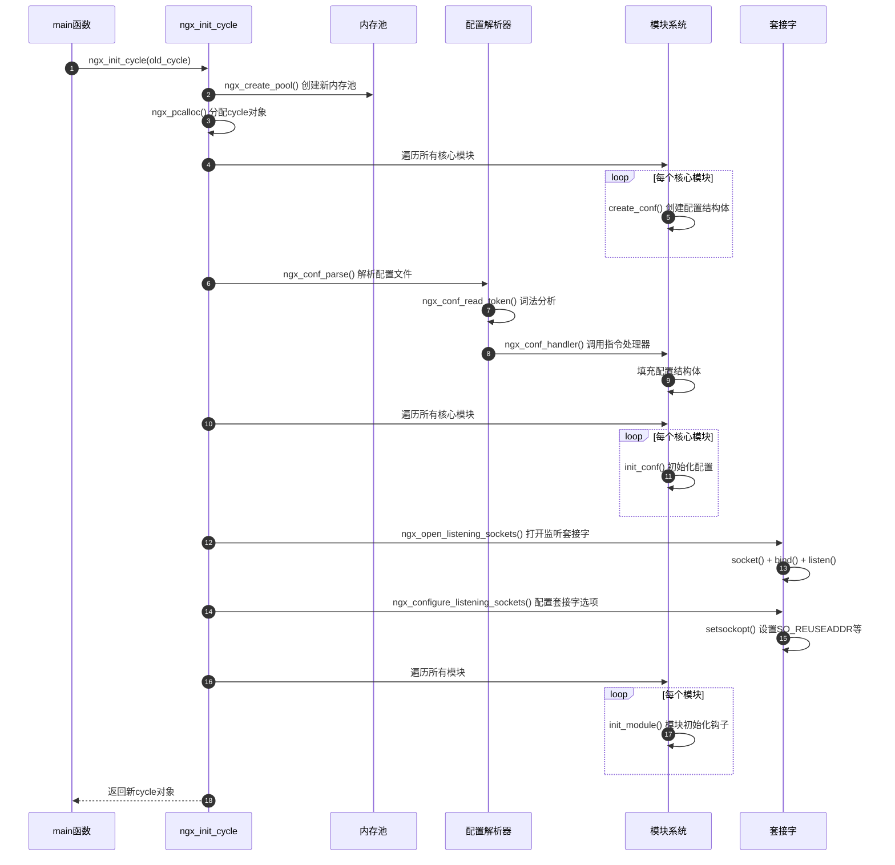
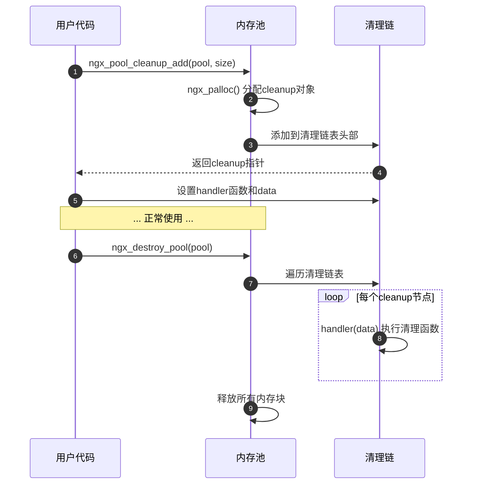

# Nginx-01-Core-API

## API 总览

Core 模块提供的 API 主要分为以下几类：

1. **全局生命周期 API**
2. **内存管理 API**
3. **配置解析 API**
4. **模块系统 API**
5. **连接管理 API**
6. **日志 API**
7. **字符串操作 API**
8. **数据结构操作 API**

## 1. 全局生命周期 API

### 1.1 ngx_init_cycle

**功能说明：** 初始化全局状态对象 ngx_cycle_t，解析配置文件，创建监听套接字，初始化所有模块

**函数签名：**

```c
ngx_cycle_t *ngx_init_cycle(ngx_cycle_t *old_cycle);
```

**参数：**
| 参数 | 类型 | 方向 | 说明 |
|------|------|------|------|
| old_cycle | ngx_cycle_t * | 输入 | 旧的 cycle 对象，首次启动时为初始化的临时 cycle |

**返回值：**
| 类型 | 说明 |
|------|------|
| ngx_cycle_t * | 成功返回新的 cycle 对象，失败返回 NULL |

**核心代码 (src/core/ngx_cycle.c)：**

```c
ngx_cycle_t *
ngx_init_cycle(ngx_cycle_t *old_cycle)
{
    void                *rv;
    char               **senv;
    ngx_uint_t           i, n;
    ngx_log_t           *log;
    ngx_time_t          *tp;
    ngx_conf_t           conf;
    ngx_pool_t          *pool;
    ngx_cycle_t         *cycle, **old;
    ngx_shm_zone_t      *shm_zone, *oshm_zone;
    ngx_list_part_t     *part, *opart;
    ngx_open_file_t     *file;
    ngx_listening_t     *ls, *nls;

    // 更新时区
    ngx_timezone_update();

    // 创建新的内存池
    pool = ngx_create_pool(NGX_CYCLE_POOL_SIZE, log);
    if (pool == NULL) {
        return NULL;
    }
    pool->log = log;

    // 分配cycle对象
    cycle = ngx_pcalloc(pool, sizeof(ngx_cycle_t));
    if (cycle == NULL) {
        ngx_destroy_pool(pool);
        return NULL;
    }

    cycle->pool = pool;
    cycle->log = log;
    cycle->old_cycle = old_cycle;

    // 复制配置路径
    cycle->conf_prefix.len = old_cycle->conf_prefix.len;
    cycle->conf_prefix.data = ngx_pstrdup(pool, &old_cycle->conf_prefix);

    // 初始化数组和列表
    ngx_array_init(&cycle->paths, pool, n, sizeof(ngx_path_t *));
    ngx_list_init(&cycle->open_files, pool, n, sizeof(ngx_open_file_t));
    ngx_list_init(&cycle->shared_memory, pool, n, sizeof(ngx_shm_zone_t));
    ngx_array_init(&cycle->listening, pool, n, sizeof(ngx_listening_t));

    // 分配模块配置上下文数组
    cycle->conf_ctx = ngx_pcalloc(pool, ngx_max_module * sizeof(void *));

    // 调用所有核心模块的create_conf
    for (i = 0; cycle->modules[i]; i++) {
        if (cycle->modules[i]->type != NGX_CORE_MODULE) {
            continue;
        }

        module = cycle->modules[i]->ctx;

        if (module->create_conf) {
            rv = module->create_conf(cycle);
            if (rv == NULL) {
                ngx_destroy_pool(pool);
                return NULL;
            }
            cycle->conf_ctx[cycle->modules[i]->index] = rv;
        }
    }

    // 解析配置文件
    conf.ctx = cycle->conf_ctx;
    conf.cycle = cycle;
    conf.pool = pool;
    conf.log = log;
    conf.module_type = NGX_CORE_MODULE;
    conf.cmd_type = NGX_MAIN_CONF;

    if (ngx_conf_param(&conf) != NGX_CONF_OK) {
        goto failed;
    }

    if (ngx_conf_parse(&conf, &cycle->conf_file) != NGX_CONF_OK) {
        goto failed;
    }

    // 调用所有核心模块的init_conf
    for (i = 0; cycle->modules[i]; i++) {
        if (cycle->modules[i]->type != NGX_CORE_MODULE) {
            continue;
        }

        module = cycle->modules[i]->ctx;

        if (module->init_conf) {
            if (module->init_conf(cycle,
                                  cycle->conf_ctx[cycle->modules[i]->index])
                == NGX_CONF_ERROR)
            {
                goto failed;
            }
        }
    }

    // 创建或打开PID文件、错误日志、共享内存等

    // 打开监听套接字
    if (ngx_open_listening_sockets(cycle) != NGX_OK) {
        goto failed;
    }

    // 配置监听套接字选项
    if (ngx_configure_listening_sockets(cycle) != NGX_OK) {
        goto failed;
    }

    // 调用所有模块的init_module钩子
    for (i = 0; cycle->modules[i]; i++) {
        if (cycle->modules[i]->init_module) {
            if (cycle->modules[i]->init_module(cycle) != NGX_OK) {
                goto failed;
            }
        }
    }

    // 关闭或删除旧cycle中的残留资源
    // ...

    return cycle;

failed:
    ngx_destroy_pool(pool);
    return NULL;
}
```

**调用链：**

1. `main()` (src/core/nginx.c)
2. `ngx_init_cycle()` (src/core/ngx_cycle.c)
3. `ngx_conf_parse()` (src/core/ngx_conf_file.c) - 解析配置
4. `module->create_conf()` - 各模块创建配置结构体
5. `module->init_conf()` - 各模块初始化配置
6. `ngx_open_listening_sockets()` - 打开监听套接字
7. `module->init_module()` - 各模块初始化钩子

**时序图：**



**异常与回退：**

- 配置解析失败：销毁新 pool，返回 NULL，Master 进程退出或保持旧配置
- 套接字绑定失败：常见于端口被占用，进程无法启动
- 模块初始化失败：通常是资源不足或依赖未满足

**性能要点：**

- 配置解析是单线程同步操作，复杂配置会延长启动时间
- 大量监听端口会增加 socket() 系统调用次数
- 共享内存创建（mmap）是相对昂贵的操作

## 2. 内存管理 API

### 2.1 ngx_create_pool

**功能说明：** 创建内存池

**函数签名：**

```c
ngx_pool_t *ngx_create_pool(size_t size, ngx_log_t *log);
```

**参数：**
| 参数 | 类型 | 方向 | 说明 |
|------|------|------|------|
| size | size_t | 输入 | 内存池初始大小，通常为 NGX_DEFAULT_POOL_SIZE (16KB) |
| log | ngx_log_t * | 输入 | 日志对象 |

**返回值：**
| 类型 | 说明 |
|------|------|
| ngx_pool_t * | 成功返回内存池指针，失败返回 NULL |

**核心代码：**

```c
ngx_pool_t *
ngx_create_pool(size_t size, ngx_log_t *log)
{
    ngx_pool_t  *p;

    // 对齐分配内存
    p = ngx_memalign(NGX_POOL_ALIGNMENT, size, log);
    if (p == NULL) {
        return NULL;
    }

    // 初始化pool头部
    p->d.last = (u_char *) p + sizeof(ngx_pool_t);
    p->d.end = (u_char *) p + size;
    p->d.next = NULL;
    p->d.failed = 0;

    // 计算小对象分配上限
    size = size - sizeof(ngx_pool_t);
    p->max = (size < NGX_MAX_ALLOC_FROM_POOL) ? size : NGX_MAX_ALLOC_FROM_POOL;

    p->current = p;
    p->chain = NULL;
    p->large = NULL;
    p->cleanup = NULL;
    p->log = log;

    return p;
}
```

**使用示例：**

```c
// 创建内存池
ngx_pool_t *pool = ngx_create_pool(16384, log);

// 从池中分配内存
void *ptr = ngx_palloc(pool, 128);

// 销毁内存池（批量释放所有分配的内存）
ngx_destroy_pool(pool);
```

### 2.2 ngx_palloc

**功能说明：** 从内存池分配内存（对齐）

**函数签名：**

```c
void *ngx_palloc(ngx_pool_t *pool, size_t size);
```

**参数：**
| 参数 | 类型 | 方向 | 说明 |
|------|------|------|------|
| pool | ngx_pool_t * | 输入 | 内存池指针 |
| size | size_t | 输入 | 请求分配的字节数 |

**返回值：**
| 类型 | 说明 |
|------|------|
| void * | 成功返回内存块指针，失败返回 NULL |

**核心代码：**

```c
void *
ngx_palloc(ngx_pool_t *pool, size_t size)
{
    // 小对象从内存池块分配
    if (size <= pool->max) {
        return ngx_palloc_small(pool, size, 1);
    }

    // 大对象走系统malloc
    return ngx_palloc_large(pool, size);
}
```

**使用场景：**

- 需要对齐的结构体分配
- 频繁的小块内存分配
- 请求级别的内存管理（请求结束批量释放）

### 2.3 ngx_pcalloc

**功能说明：** 从内存池分配内存并清零

**函数签名：**

```c
void *ngx_pcalloc(ngx_pool_t *pool, size_t size);
```

**核心代码：**

```c
void *
ngx_pcalloc(ngx_pool_t *pool, size_t size)
{
    void *p;

    p = ngx_palloc(pool, size);
    if (p) {
        ngx_memzero(p, size);
    }

    return p;
}
```

**使用场景：**

- 分配结构体并初始化为零
- 避免未初始化内存导致的bug

### 2.4 ngx_pool_cleanup_add

**功能说明：** 添加清理回调函数，内存池销毁时自动执行

**函数签名：**

```c
ngx_pool_cleanup_t *ngx_pool_cleanup_add(ngx_pool_t *p, size_t size);
```

**参数：**
| 参数 | 类型 | 方向 | 说明 |
|------|------|------|------|
| p | ngx_pool_t * | 输入 | 内存池指针 |
| size | size_t | 输入 | cleanup 数据大小（额外分配空间） |

**返回值：**
| 类型 | 说明 |
|------|------|
| ngx_pool_cleanup_t * | 成功返回清理对象指针，失败返回 NULL |

**使用示例：**

```c
// 文件清理示例
ngx_pool_cleanup_t *cln;
ngx_pool_cleanup_file_t *clnf;

cln = ngx_pool_cleanup_add(pool, sizeof(ngx_pool_cleanup_file_t));
if (cln == NULL) {
    return NGX_ERROR;
}

cln->handler = ngx_pool_cleanup_file;

clnf = cln->data;
clnf->fd = fd;
clnf->name = filename.data;
clnf->log = log;

// 内存池销毁时自动关闭文件
```

**时序图：**



## 3. 配置解析 API

### 3.1 ngx_conf_parse

**功能说明：** 解析配置文件或配置块

**函数签名：**

```c
char *ngx_conf_parse(ngx_conf_t *cf, ngx_str_t *filename);
```

**参数：**
| 参数 | 类型 | 方向 | 说明 |
|------|------|------|------|
| cf | ngx_conf_t * | 输入/输出 | 配置解析上下文 |
| filename | ngx_str_t * | 输入 | 配置文件路径，NULL 表示解析当前块 |

**返回值：**
| 类型 | 说明 |
|------|------|
| char * | 成功返回 NGX_CONF_OK，失败返回错误信息字符串 |

**调用链：**

1. `ngx_init_cycle()` → `ngx_conf_parse()`
2. `ngx_conf_parse()` → `ngx_conf_read_token()` - 词法分析
3. `ngx_conf_parse()` → `ngx_conf_handler()` - 指令处理
4. `ngx_conf_handler()` → 查找指令处理器函数
5. 指令处理器函数 → 填充配置结构体

### 3.2 ngx_conf_set_* 系列函数

Nginx 提供了一系列配置指令处理辅助函数：

**常用函数：**
| 函数 | 功能 | 使用场景 |
|------|------|----------|
| ngx_conf_set_flag_slot | 解析 on/off | daemon, master_process |
| ngx_conf_set_str_slot | 解析字符串 | pid, lock_file |
| ngx_conf_set_num_slot | 解析整数 | worker_rlimit_nofile |
| ngx_conf_set_size_slot | 解析大小（支持k/m/g） | client_body_buffer_size |
| ngx_conf_set_msec_slot | 解析时间（支持ms/s/m/h/d） | client_body_timeout |
| ngx_conf_set_enum_slot | 解析枚举值 | debug_points |

**使用示例（定义配置指令）：**

```c
static ngx_command_t  ngx_core_commands[] = {

    { ngx_string("daemon"),
      NGX_MAIN_CONF|NGX_DIRECT_CONF|NGX_CONF_FLAG,
      ngx_conf_set_flag_slot,                     // 处理器函数
      0,
      offsetof(ngx_core_conf_t, daemon),          // 字段偏移量
      NULL },

    { ngx_string("worker_processes"),
      NGX_MAIN_CONF|NGX_DIRECT_CONF|NGX_CONF_TAKE1,
      ngx_set_worker_processes,                   // 自定义处理器
      0,
      0,
      NULL },

    ngx_null_command
};
```

## 4. 模块系统 API

### 4.1 ngx_preinit_modules

**功能说明：** 预初始化模块数组，分配索引

**函数签名：**

```c
ngx_int_t ngx_preinit_modules(void);
```

**返回值：**
| 类型 | 说明 |
|------|------|
| ngx_int_t | 成功返回 NGX_OK，失败返回 NGX_ERROR |

**核心代码：**

```c
ngx_int_t
ngx_preinit_modules(void)
{
    ngx_uint_t  i;

    for (i = 0; ngx_modules[i]; i++) {
        ngx_modules[i]->index = i;
        ngx_modules[i]->name = ngx_module_names[i];
    }

    ngx_modules_n = i;
    ngx_max_module = ngx_modules_n + NGX_MAX_DYNAMIC_MODULES;

    return NGX_OK;
}
```

### 4.2 模块注册宏

**NGX_MODULE_V1 宏：**

```c
#define NGX_MODULE_V1          \
    NGX_MODULE_UNSET_INDEX,    \  // index 初始化为未设置
    NGX_MODULE_UNSET_INDEX,    \  // 保留字段
    NULL, 0, 0,                \  // version字段
    NULL,                      \  // signature
    NGX_MODULE_V1_PADDING
```

**使用示例：**

```c
ngx_module_t  ngx_core_module = {
    NGX_MODULE_V1,
    &ngx_core_module_ctx,                  /* module context */
    ngx_core_commands,                     /* module directives */
    NGX_CORE_MODULE,                       /* module type */
    NULL,                                  /* init master */
    NULL,                                  /* init module */
    NULL,                                  /* init process */
    NULL,                                  /* init thread */
    NULL,                                  /* exit thread */
    NULL,                                  /* exit process */
    NULL,                                  /* exit master */
    NGX_MODULE_V1_PADDING
};
```

## 5. 连接管理 API

### 5.1 ngx_get_connection

**功能说明：** 从连接池获取空闲连接对象

**函数签名：**

```c
ngx_connection_t *ngx_get_connection(ngx_socket_t s, ngx_log_t *log);
```

**参数：**
| 参数 | 类型 | 方向 | 说明 |
|------|------|------|------|
| s | ngx_socket_t | 输入 | 套接字文件描述符 |
| log | ngx_log_t * | 输入 | 日志对象 |

**返回值：**
| 类型 | 说明 |
|------|------|
| ngx_connection_t * | 成功返回连接对象，失败返回 NULL |

### 5.2 ngx_free_connection

**功能说明：** 释放连接对象回连接池

**函数签名：**

```c
void ngx_free_connection(ngx_connection_t *c);
```

**参数：**
| 参数 | 类型 | 方向 | 说明 |
|------|------|------|------|
| c | ngx_connection_t * | 输入 | 连接对象指针 |

### 5.3 ngx_close_connection

**功能说明：** 关闭连接并释放资源

**函数签名：**

```c
void ngx_close_connection(ngx_connection_t *c);
```

**核心代码：**

```c
void
ngx_close_connection(ngx_connection_t *c)
{
    ngx_socket_t  fd;

    // 删除事件
    if (c->read->timer_set) {
        ngx_del_timer(c->read);
    }

    if (c->write->timer_set) {
        ngx_del_timer(c->write);
    }

    ngx_del_event(c->read, NGX_READ_EVENT, NGX_CLOSE_EVENT);
    ngx_del_event(c->write, NGX_WRITE_EVENT, NGX_CLOSE_EVENT);

    // 释放SSL资源
    if (c->ssl) {
        ngx_ssl_free_buffer(c);
        ngx_ssl_shutdown(c);
    }

    // 关闭套接字
    fd = c->fd;
    c->fd = (ngx_socket_t) -1;

    if (ngx_close_socket(fd) == -1) {
        // 日志记录
    }

    // 释放连接对象
    c->destroyed = 1;

    ngx_free_connection(c);

    // 销毁连接内存池
    if (c->pool) {
        ngx_destroy_pool(c->pool);
    }
}
```

## 6. 日志 API

### 6.1 ngx_log_error

**功能说明：** 记录错误日志

**函数签名：**

```c
void ngx_log_error(ngx_uint_t level, ngx_log_t *log, ngx_err_t err, const char *fmt, ...);
```

**参数：**
| 参数 | 类型 | 方向 | 说明 |
|------|------|------|------|
| level | ngx_uint_t | 输入 | 日志级别（EMERG/ALERT/CRIT/ERR/WARN/NOTICE/INFO/DEBUG） |
| log | ngx_log_t * | 输入 | 日志对象 |
| err | ngx_err_t | 输入 | 系统错误码（errno），0 表示无错误 |
| fmt | const char * | 输入 | 格式化字符串（类似 printf） |
| ... | - | 输入 | 可变参数 |

**日志级别：**
| 级别 | 数值 | 说明 |
|------|------|------|
| NGX_LOG_EMERG | 0 | 紧急：系统不可用 |
| NGX_LOG_ALERT | 1 | 警报：必须立即处理 |
| NGX_LOG_CRIT | 2 | 严重：严重条件 |
| NGX_LOG_ERR | 3 | 错误：错误条件 |
| NGX_LOG_WARN | 4 | 警告：警告条件 |
| NGX_LOG_NOTICE | 5 | 通知：正常但重要的条件 |
| NGX_LOG_INFO | 6 | 信息：信息性消息 |
| NGX_LOG_DEBUG | 7 | 调试：调试级别消息 |

**使用示例：**

```c
// 记录错误（带errno）
ngx_log_error(NGX_LOG_ERR, log, ngx_errno, "open() \"%s\" failed", filename);

// 记录警告（无errno）
ngx_log_error(NGX_LOG_WARN, log, 0, "worker_processes is set to %d", n);

// 条件日志（仅在日志级别足够时才格式化）
if (log->log_level & NGX_LOG_DEBUG_HTTP) {
    ngx_log_debug2(NGX_LOG_DEBUG_HTTP, log, 0,
                   "http request line: \"%V\" \"%V\"", &r->method_name, &r->uri);
}
```

## 7. 字符串操作 API

### 7.1 ngx_string

**功能说明：** 静态初始化 ngx_str_t

**宏定义：**

```c
#define ngx_string(str)  { sizeof(str) - 1, (u_char *) str }
```

**使用示例：**

```c
ngx_str_t name = ngx_string("nginx");
// 等价于：
// ngx_str_t name = { 5, (u_char *) "nginx" };
```

### 7.2 ngx_str_set

**功能说明：** 动态设置 ngx_str_t

**宏定义：**

```c
#define ngx_str_set(str, text)     \
    (str)->len = sizeof(text) - 1; \
    (str)->data = (u_char *) text
```

### 7.3 ngx_strcmp / ngx_strncmp

**功能说明：** 字符串比较（封装 strcmp / strncmp）

**函数签名：**

```c
#define ngx_strcmp(s1, s2)  strcmp((const char *) s1, (const char *) s2)
#define ngx_strncmp(s1, s2, n)  strncmp((const char *) s1, (const char *) s2, n)
```

### 7.4 ngx_pstrdup

**功能说明：** 从内存池复制字符串

**函数签名：**

```c
u_char *ngx_pstrdup(ngx_pool_t *pool, ngx_str_t *src);
```

**核心代码：**

```c
u_char *
ngx_pstrdup(ngx_pool_t *pool, ngx_str_t *src)
{
    u_char  *dst;

    dst = ngx_pnalloc(pool, src->len);
    if (dst == NULL) {
        return NULL;
    }

    ngx_memcpy(dst, src->data, src->len);

    return dst;
}
```

---

**下一步：** 请参阅：

- [Nginx-01-Core-数据结构](./Nginx-01-Core-数据结构.md)
- [Nginx-01-Core-时序图](./Nginx-01-Core-时序图.md)
