# Nginx-02-Event

## 模块概览

## 模块职责

Event 模块是 Nginx 的事件驱动核心，负责 I/O 多路复用和定时器管理，提供以下核心能力：

1. **I/O 多路复用：** 封装 epoll、kqueue、select、poll 等事件通知机制
2. **定时器管理：** 基于红黑树的高效定时器实现
3. **连接事件管理：** 管理连接的读写事件
4. **Accept 互斥锁：** 避免惊群问题的负载均衡机制
5. **Posted 事件队列：** 延迟事件处理，优化事件处理顺序

## 输入/输出

**输入：**

- 文件描述符（套接字）
- 事件类型（读/写/定时器）
- 超时时间
- 事件回调函数

**输出：**

- 就绪事件通知
- 定时器触发通知
- 事件处理结果

## 上下游依赖

**上游（调用 Event）：**

- Core 模块（主循环）
- HTTP 模块（注册连接事件）
- Stream 模块
- Mail 模块

**下游（Event 调用）：**

- 操作系统（epoll_wait、kevent、select）
- Core 模块（连接管理、定时器红黑树）

## 模块级架构图

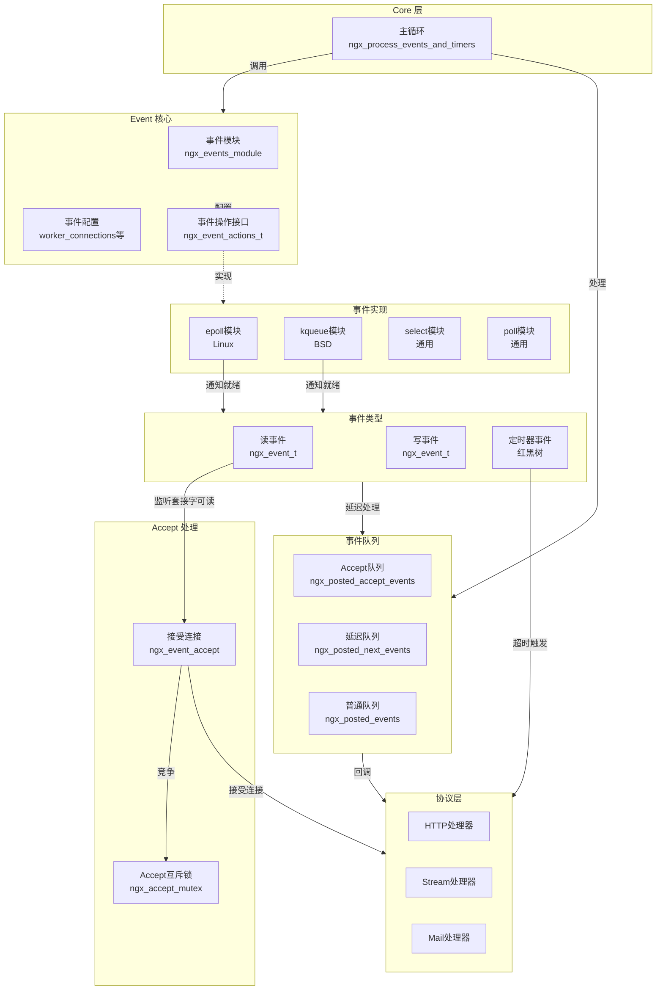

### 图解说明

**1. 事件驱动流程：**

- 主循环调用 `ngx_process_events_and_timers()`
- 根据配置选择事件实现（epoll/kqueue/select）
- 等待 I/O 事件或定时器超时
- 处理就绪事件和过期定时器

**2. 事件模型抽象：**

- `ngx_event_actions_t` 定义统一接口
- 不同平台实现各自的 add/del/process 函数
- 编译时或运行时选择最优实现

**3. 事件处理优化：**

- Accept 事件优先处理（posted_accept_events）
- 延迟事件允许在当前事件循环中多次触发（posted_next_events）
- 普通事件在下一轮循环处理（posted_events）

**4. Accept 负载均衡：**

- `accept_mutex` 互斥锁控制 Worker 竞争
- 只有获得锁的 Worker 才能 accept 新连接
- 避免惊群问题，实现负载均衡

## 核心算法与流程

### 算法 1：事件循环主函数

**目的：** 统一的事件处理循环，支持多种事件模型

**核心代码 (src/event/ngx_event.c)：**

```c
void
ngx_process_events_and_timers(ngx_cycle_t *cycle)
{
    ngx_uint_t  flags;
    ngx_msec_t  timer, delta;

    // 获取最近的定时器超时时间
    timer = ngx_event_find_timer();
    
    // 如果启用了accept_mutex
    if (ngx_use_accept_mutex) {
        // 检查是否需要延迟accept（负载均衡）
        if (ngx_accept_disabled > 0) {
            ngx_accept_disabled--;
        } else {
            // 尝试获取accept互斥锁
            if (ngx_trylock_accept_mutex(cycle) == NGX_ERROR) {
                return;
            }

            if (ngx_accept_mutex_held) {
                flags |= NGX_POST_EVENTS;  // 延迟处理accept事件
            } else {
                // 未获得锁，延长等待时间
                if (timer == NGX_TIMER_INFINITE
                    || timer > ngx_accept_mutex_delay)
                {
                    timer = ngx_accept_mutex_delay;
                }
            }
        }
    }

    // 调用事件模型的process函数（如epoll_wait）
    // 这里会阻塞等待事件或超时
    (void) ngx_process_events(cycle, timer, flags);

    // 处理accept事件队列（优先）
    ngx_event_process_posted(cycle, &ngx_posted_accept_events);

    // 释放accept互斥锁
    if (ngx_accept_mutex_held) {
        ngx_shmtx_unlock(&ngx_accept_mutex);
    }

    // 处理定时器事件
    if (delta) {
        ngx_event_expire_timers();
    }

    // 处理普通posted事件
    ngx_event_process_posted(cycle, &ngx_posted_events);
}
```

**流程说明：**

1. **计算等待超时时间：**
   - 查找最近的定时器超时时间
   - 如果没有定时器，等待时间为无限大
   - Accept mutex 未获得时，限制最大等待时间为 `accept_mutex_delay`（默认 500ms）

2. **Accept 互斥锁处理：**
   - `ngx_accept_disabled` > 0 表示当前 Worker 连接数过多，主动放弃竞争
   - 尝试获取锁，成功则设置 POST_EVENTS 标志，延迟处理 accept 事件
   - 失败则缩短超时时间，下次循环再试

3. **等待事件：**
   - 调用底层事件模型的 `process` 函数（epoll_wait/kevent）
   - 阻塞等待 I/O 事件或超时
   - 返回就绪事件数量

4. **处理事件队列：**
   - 优先处理 accept 事件（建立新连接）
   - 释放 accept 互斥锁
   - 处理过期定时器
   - 处理普通 posted 事件（读写事件）

### 算法 2：定时器管理（红黑树）

**目的：** 高效管理大量定时器，快速查找最近超时

**数据结构：**

```c
typedef struct {
    ngx_rbtree_t       rbtree;      // 红黑树根节点
    ngx_rbtree_node_t  sentinel;    // 哨兵节点
} ngx_event_timer_t;

extern ngx_event_timer_t  ngx_event_timer_rbtree;
```

**核心操作：**

**添加定时器：**

```c
void
ngx_event_add_timer(ngx_event_t *ev, ngx_msec_t timer)
{
    ngx_msec_t      key;
    ngx_msec_int_t  diff;

    // 计算绝对超时时间
    key = ngx_current_msec + timer;

    if (ev->timer_set) {
        // 已经在定时器树中，计算时间差
        diff = (ngx_msec_int_t) (key - ev->timer.key);

        if (diff == 0) {
            return;  // 超时时间未变
        }

        // 先删除旧定时器
        ngx_rbtree_delete(&ngx_event_timer_rbtree, &ev->timer);
        ev->timer_set = 0;
    }

    ev->timer.key = key;

    // 插入红黑树
    ngx_rbtree_insert(&ngx_event_timer_rbtree, &ev->timer);

    ev->timer_set = 1;
}
```

**删除定时器：**

```c
static ngx_inline void
ngx_event_del_timer(ngx_event_t *ev)
{
    if (ev->timer_set) {
        ngx_rbtree_delete(&ngx_event_timer_rbtree, &ev->timer);
        ev->timer_set = 0;
    }
}
```

**查找最近超时时间：**

```c
ngx_msec_t
ngx_event_find_timer(void)
{
    ngx_msec_int_t  timer;
    ngx_rbtree_node_t  *node, *root, *sentinel;

    // 红黑树为空
    if (ngx_event_timer_rbtree.root == &ngx_event_timer_rbtree.sentinel) {
        return NGX_TIMER_INFINITE;
    }

    root = ngx_event_timer_rbtree.root;
    sentinel = ngx_event_timer_rbtree.sentinel;

    // 找到最左节点（最小key）
    node = ngx_rbtree_min(root, sentinel);

    timer = (ngx_msec_int_t) (node->key - ngx_current_msec);

    return (ngx_msec_t) (timer > 0 ? timer : 0);
}
```

**处理过期定时器：**

```c
void
ngx_event_expire_timers(void)
{
    ngx_event_t        *ev;
    ngx_rbtree_node_t  *node, *root, *sentinel;

    sentinel = ngx_event_timer_rbtree.sentinel;

    for ( ;; ) {
        root = ngx_event_timer_rbtree.root;

        if (root == sentinel) {
            return;  // 定时器树为空
        }

        // 获取最小key的节点
        node = ngx_rbtree_min(root, sentinel);

        if ((ngx_msec_int_t) (node->key - ngx_current_msec) > 0) {
            return;  // 最小的定时器都未超时，退出
        }

        // 获取事件对象
        ev = ngx_rbtree_data(node, ngx_event_t, timer);

        // 从树中删除
        ngx_rbtree_delete(&ngx_event_timer_rbtree, &ev->timer);
        ev->timer_set = 0;

        // 标记超时
        ev->timedout = 1;

        // 调用事件处理函数
        ev->handler(ev);
    }
}
```

**时间复杂度：**

- 插入：O(log n)
- 删除：O(log n)
- 查找最近超时：O(1)（红黑树最左节点）
- 处理过期定时器：O(k log n)，k 为过期定时器数量

### 算法 3：Epoll 事件模型实现

**目的：** Linux 平台上的高效事件通知机制

**初始化 (src/event/modules/ngx_epoll_module.c)：**

```c
static ngx_int_t
ngx_epoll_init(ngx_cycle_t *cycle, ngx_msec_t timer)
{
    ngx_event_conf_t  *ecf;

    ecf = ngx_event_get_conf(cycle->conf_ctx, ngx_event_core_module);

    if (ep == -1) {
        // 创建epoll实例
        ep = epoll_create(cycle->connection_n / 2);

        if (ep == -1) {
            return NGX_ERROR;
        }
    }

    // 分配事件列表
    if (nevents < ecf->events) {
        if (event_list) {
            ngx_free(event_list);
        }

        event_list = ngx_alloc(sizeof(struct epoll_event) * ecf->events,
                                cycle->log);
        if (event_list == NULL) {
            return NGX_ERROR;
        }
    }

    nevents = ecf->events;

    // 设置I/O操作函数
    ngx_io = ngx_os_io;

    // 设置事件操作接口
    ngx_event_actions = ngx_epoll_module_ctx.actions;

    ngx_event_flags = NGX_USE_CLEAR_EVENT     // EPOLLET
                     |NGX_USE_GREEDY_EVENT     // 尽可能多地读写
                     |NGX_USE_EPOLL_EVENT;     // epoll特有标志

    return NGX_OK;
}
```

**添加事件：**

```c
static ngx_int_t
ngx_epoll_add_event(ngx_event_t *ev, ngx_int_t event, ngx_uint_t flags)
{
    int                  op;
    uint32_t             events, prev;
    ngx_event_t         *e;
    ngx_connection_t    *c;
    struct epoll_event   ee;

    c = ev->data;

    events = (uint32_t) event;

    if (event == NGX_READ_EVENT) {
        e = c->write;
        prev = EPOLLOUT;
        events = EPOLLIN|EPOLLRDHUP;

    } else {
        e = c->read;
        prev = EPOLLIN|EPOLLRDHUP;
        events = EPOLLOUT;
    }

    // 边缘触发
    if (flags & NGX_USE_CLEAR_EVENT) {
        events |= EPOLLET;
    }

    // 判断是添加还是修改
    if (e->active) {
        op = EPOLL_CTL_MOD;
        events |= prev;

    } else {
        op = EPOLL_CTL_ADD;
    }

    ee.events = events;
    ee.data.ptr = (void *) ((uintptr_t) c | ev->instance);

    if (epoll_ctl(ep, op, c->fd, &ee) == -1) {
        return NGX_ERROR;
    }

    ev->active = 1;

    return NGX_OK;
}
```

**处理事件：**

```c
static ngx_int_t
ngx_epoll_process_events(ngx_cycle_t *cycle, ngx_msec_t timer, ngx_uint_t flags)
{
    int                events;
    uint32_t           revents;
    ngx_int_t          instance, i;
    ngx_uint_t         level;
    ngx_err_t          err;
    ngx_event_t       *rev, *wev;
    ngx_queue_t       *queue;
    ngx_connection_t  *c;

    // 等待事件
    events = epoll_wait(ep, event_list, (int) nevents, timer);

    err = (events == -1) ? ngx_errno : 0;

    // 更新时间缓存
    if (flags & NGX_UPDATE_TIME || ngx_event_timer_alarm) {
        ngx_time_update();
    }

    if (err) {
        if (err == NGX_EINTR) {
            return NGX_OK;  // 被信号中断，正常
        }
        return NGX_ERROR;
    }

    if (events == 0) {
        if (timer != NGX_TIMER_INFINITE) {
            return NGX_OK;  // 超时，正常
        }
        return NGX_ERROR;
    }

    // 处理就绪事件
    for (i = 0; i < events; i++) {
        c = event_list[i].data.ptr;

        instance = (uintptr_t) c & 1;
        c = (ngx_connection_t *) ((uintptr_t) c & (uintptr_t) ~1);

        rev = c->read;

        // 检查instance，防止过期事件
        if (c->fd == -1 || rev->instance != instance) {
            continue;
        }

        revents = event_list[i].events;

        // 读事件就绪
        if ((revents & EPOLLIN) && rev->active) {
            rev->ready = 1;
            rev->available = -1;

            if (flags & NGX_POST_EVENTS) {
                // 延迟处理
                queue = rev->accept ? &ngx_posted_accept_events
                                    : &ngx_posted_events;
                ngx_post_event(rev, queue);

            } else {
                // 立即处理
                rev->handler(rev);
            }
        }

        wev = c->write;

        // 写事件就绪
        if ((revents & EPOLLOUT) && wev->active) {
            wev->ready = 1;

            if (flags & NGX_POST_EVENTS) {
                ngx_post_event(wev, &ngx_posted_events);
            } else {
                wev->handler(wev);
            }
        }
    }

    return NGX_OK;
}
```

## 配置与可观测

### 核心配置项

| 配置项 | 上下文 | 默认值 | 说明 |
|--------|--------|--------|------|
| worker_connections | events | 512 | 每个Worker最大连接数 |
| use | events | 自动 | 事件模型选择（epoll/kqueue/select） |
| multi_accept | events | off | 是否一次accept多个连接 |
| accept_mutex | events | off | 是否启用accept互斥锁 |
| accept_mutex_delay | events | 500ms | 获取锁失败后重试延迟 |

### 性能指标

**事件处理性能：**

- epoll_wait 平均耗时
- 单次循环处理的事件数
- 定时器触发频率

**连接负载：**

- 活跃连接数 / worker_connections
- 空闲连接数
- Accept 队列长度

---

**相关文档：**

- [Nginx-00-总览](./Nginx-00-总览.md)
- [Nginx-02-Event-API](./Nginx-02-Event-API.md)
- [Nginx-02-Event-数据结构](./Nginx-02-Event-数据结构.md)

---

## API接口

## API 总览

Event 模块提供的 API 主要分为以下几类：

1. **事件核心 API** - 事件创建、添加、删除
2. **定时器 API** - 定时器添加、删除、查找
3. **事件循环 API** - 主循环、事件处理
4. **Accept API** - 连接接受处理
5. **事件模型 API** - epoll/kqueue/select 实现接口

## 1. 事件核心 API

### 1.1 ngx_add_event

**功能说明：** 将事件添加到事件模型中（如 epoll）

**函数签名：**

```c
ngx_int_t ngx_add_event(ngx_event_t *ev, ngx_int_t event, ngx_uint_t flags);
```

**参数：**
| 参数 | 类型 | 方向 | 说明 |
|------|------|------|------|
| ev | ngx_event_t * | 输入 | 事件对象指针 |
| event | ngx_int_t | 输入 | 事件类型（NGX_READ_EVENT/NGX_WRITE_EVENT） |
| flags | ngx_uint_t | 输入 | 标志位（NGX_CLEAR_EVENT 表示边缘触发） |

**返回值：**
| 类型 | 说明 |
|------|------|
| ngx_int_t | 成功返回 NGX_OK，失败返回 NGX_ERROR |

**核心代码 (src/event/modules/ngx_epoll_module.c)：**

```c
static ngx_int_t
ngx_epoll_add_event(ngx_event_t *ev, ngx_int_t event, ngx_uint_t flags)
{
    int                  op;
    uint32_t             events, prev;
    ngx_event_t         *e;
    ngx_connection_t    *c;
    struct epoll_event   ee;

    c = ev->data;  // 获取关联的连接对象

    events = (uint32_t) event;

    if (event == NGX_READ_EVENT) {
        e = c->write;
        prev = EPOLLOUT;
        events = EPOLLIN|EPOLLRDHUP;

    } else {
        e = c->read;
        prev = EPOLLIN|EPOLLRDHUP;
        events = EPOLLOUT;
    }

    // 边缘触发模式
    if (flags & NGX_CLEAR_EVENT) {
        events |= EPOLLET;
    }

    // 判断是添加还是修改
    if (e->active) {
        op = EPOLL_CTL_MOD;  // 另一个事件已存在，修改
        events |= prev;

    } else {
        op = EPOLL_CTL_ADD;  // 新添加
    }

    ee.events = events;
    // 保存连接指针和instance标志
    ee.data.ptr = (void *) ((uintptr_t) c | ev->instance);

    if (epoll_ctl(ep, op, c->fd, &ee) == -1) {
        return NGX_ERROR;
    }

    ev->active = 1;

    return NGX_OK;
}
```

**调用链：**

1. 用户代码 → `ngx_add_event()`
2. `ngx_add_event()` → `ngx_event_actions.add()`（函数指针）
3. `ngx_event_actions.add()` → `ngx_epoll_add_event()`（epoll 实现）

**时序图：**

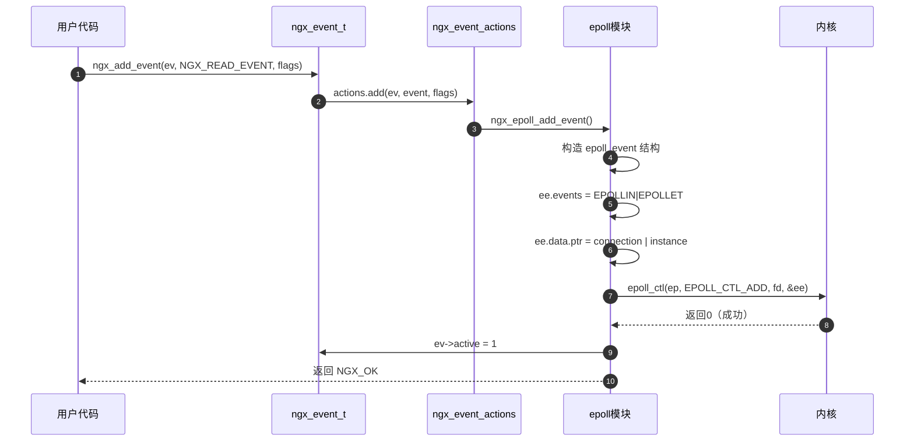

### 1.2 ngx_del_event

**功能说明：** 从事件模型中删除事件

**函数签名：**

```c
ngx_int_t ngx_del_event(ngx_event_t *ev, ngx_int_t event, ngx_uint_t flags);
```

**核心代码：**

```c
static ngx_int_t
ngx_epoll_del_event(ngx_event_t *ev, ngx_int_t event, ngx_uint_t flags)
{
    int                  op;
    uint32_t             prev;
    ngx_event_t         *e;
    ngx_connection_t    *c;
    struct epoll_event   ee;

    if (flags & NGX_CLOSE_EVENT) {
        ev->active = 0;
        return NGX_OK;  // 关闭连接时，fd 会自动从 epoll 移除
    }

    c = ev->data;

    if (event == NGX_READ_EVENT) {
        e = c->write;
        prev = EPOLLOUT;

    } else {
        e = c->read;
        prev = EPOLLIN|EPOLLRDHUP;
    }

    if (e->active) {
        // 另一个事件仍在，修改而非删除
        op = EPOLL_CTL_MOD;
        ee.events = prev;
        ee.data.ptr = (void *) ((uintptr_t) c | ev->instance);

    } else {
        // 删除
        op = EPOLL_CTL_DEL;
        ee.events = 0;
        ee.data.ptr = NULL;
    }

    if (epoll_ctl(ep, op, c->fd, &ee) == -1) {
        return NGX_ERROR;
    }

    ev->active = 0;

    return NGX_OK;
}
```

### 1.3 ngx_process_events

**功能说明：** 处理就绪事件（调用底层事件模型的 wait 函数）

**函数签名：**

```c
ngx_int_t ngx_process_events(ngx_cycle_t *cycle, ngx_msec_t timer, ngx_uint_t flags);
```

**参数：**
| 参数 | 类型 | 方向 | 说明 |
|------|------|------|------|
| cycle | ngx_cycle_t * | 输入 | 全局状态对象 |
| timer | ngx_msec_t | 输入 | 超时时间（毫秒），NGX_TIMER_INFINITE 表示无限等待 |
| flags | ngx_uint_t | 输入 | 标志位（NGX_POST_EVENTS 表示延迟处理事件） |

**核心代码 (src/event/modules/ngx_epoll_module.c)：**

```c
static ngx_int_t
ngx_epoll_process_events(ngx_cycle_t *cycle, ngx_msec_t timer, ngx_uint_t flags)
{
    int                events;
    uint32_t           revents;
    ngx_int_t          instance, i;
    ngx_event_t       *rev, *wev;
    ngx_connection_t  *c;

    // 等待事件（阻塞或超时）
    events = epoll_wait(ep, event_list, (int) nevents, timer);

    err = (events == -1) ? ngx_errno : 0;

    // 更新时间缓存
    if (flags & NGX_UPDATE_TIME || ngx_event_timer_alarm) {
        ngx_time_update();
    }

    if (err) {
        if (err == NGX_EINTR) {
            return NGX_OK;  // 被信号中断
        }
        return NGX_ERROR;
    }

    if (events == 0) {
        return NGX_OK;  // 超时
    }

    // 遍历就绪事件
    for (i = 0; i < events; i++) {
        c = event_list[i].data.ptr;

        instance = (uintptr_t) c & 1;
        c = (ngx_connection_t *) ((uintptr_t) c & (uintptr_t) ~1);

        rev = c->read;

        // 检查 instance，防止过期事件
        if (c->fd == -1 || rev->instance != instance) {
            continue;
        }

        revents = event_list[i].events;

        // 处理读事件
        if ((revents & EPOLLIN) && rev->active) {
            rev->ready = 1;

            if (flags & NGX_POST_EVENTS) {
                // 延迟处理
                queue = rev->accept ? &ngx_posted_accept_events
                                    : &ngx_posted_events;
                ngx_post_event(rev, queue);

            } else {
                // 立即调用处理函数
                rev->handler(rev);
            }
        }

        wev = c->write;

        // 处理写事件
        if ((revents & EPOLLOUT) && wev->active) {
            wev->ready = 1;

            if (flags & NGX_POST_EVENTS) {
                ngx_post_event(wev, &ngx_posted_events);
            } else {
                wev->handler(wev);
            }
        }
    }

    return NGX_OK;
}
```

## 2. 定时器 API

### 2.1 ngx_event_add_timer

**功能说明：** 添加定时器事件到红黑树

**函数签名：**

```c
void ngx_event_add_timer(ngx_event_t *ev, ngx_msec_t timer);
```

**参数：**
| 参数 | 类型 | 方向 | 说明 |
|------|------|------|------|
| ev | ngx_event_t * | 输入 | 事件对象 |
| timer | ngx_msec_t | 输入 | 相对超时时间（毫秒） |

**核心代码 (src/event/ngx_event_timer.c)：**

```c
void
ngx_event_add_timer(ngx_event_t *ev, ngx_msec_t timer)
{
    ngx_msec_t      key;
    ngx_msec_int_t  diff;

    // 计算绝对超时时间
    key = ngx_current_msec + timer;

    if (ev->timer_set) {
        // 已经在定时器树中
        diff = (ngx_msec_int_t) (key - ev->timer.key);

        if (diff == 0) {
            return;  // 超时时间未变
        }

        // 先删除旧定时器
        ngx_rbtree_delete(&ngx_event_timer_rbtree, &ev->timer);
        ev->timer_set = 0;
    }

    ev->timer.key = key;

    // 插入红黑树
    ngx_rbtree_insert(&ngx_event_timer_rbtree, &ev->timer);

    ev->timer_set = 1;
}
```

**使用示例：**

```c
// 设置10秒超时
ngx_event_t *rev = c->read;
ngx_add_timer(rev, 10000);

// 事件处理函数中检查超时
void ngx_http_process_request(ngx_event_t *rev)
{
    ngx_connection_t *c = rev->data;
    ngx_http_request_t *r = c->data;

    if (rev->timedout) {
        // 超时处理
        ngx_http_finalize_request(r, NGX_HTTP_REQUEST_TIME_OUT);
        return;
    }

    // 正常处理
    // ...
}
```

### 2.2 ngx_event_del_timer

**功能说明：** 从红黑树删除定时器

**函数签名：**

```c
static inline void ngx_event_del_timer(ngx_event_t *ev);
```

**核心代码：**

```c
static ngx_inline void
ngx_event_del_timer(ngx_event_t *ev)
{
    if (ev->timer_set) {
        ngx_rbtree_delete(&ngx_event_timer_rbtree, &ev->timer);
        ev->timer_set = 0;
    }
}
```

### 2.3 ngx_event_find_timer

**功能说明：** 查找最近的超时时间

**函数签名：**

```c
ngx_msec_t ngx_event_find_timer(void);
```

**返回值：**
| 类型 | 说明 |
|------|------|
| ngx_msec_t | 最近的超时时间（毫秒），如果没有定时器返回 NGX_TIMER_INFINITE |

**核心代码：**

```c
ngx_msec_t
ngx_event_find_timer(void)
{
    ngx_msec_int_t      timer;
    ngx_rbtree_node_t  *node, *root, *sentinel;

    if (ngx_event_timer_rbtree.root == &ngx_event_timer_rbtree.sentinel) {
        return NGX_TIMER_INFINITE;  // 红黑树为空
    }

    root = ngx_event_timer_rbtree.root;
    sentinel = ngx_event_timer_rbtree.sentinel;

    // 找到最小key（最左节点）
    node = ngx_rbtree_min(root, sentinel);

    timer = (ngx_msec_int_t) (node->key - ngx_current_msec);

    return (ngx_msec_t) (timer > 0 ? timer : 0);
}
```

### 2.4 ngx_event_expire_timers

**功能说明：** 处理所有过期的定时器

**函数签名：**

```c
void ngx_event_expire_timers(void);
```

**核心代码：**

```c
void
ngx_event_expire_timers(void)
{
    ngx_event_t        *ev;
    ngx_rbtree_node_t  *node, *root, *sentinel;

    sentinel = ngx_event_timer_rbtree.sentinel;

    for ( ;; ) {
        root = ngx_event_timer_rbtree.root;

        if (root == sentinel) {
            return;
        }

        node = ngx_rbtree_min(root, sentinel);

        // 检查是否超时
        if ((ngx_msec_int_t) (node->key - ngx_current_msec) > 0) {
            return;  // 最小的都未超时，退出
        }

        ev = ngx_rbtree_data(node, ngx_event_t, timer);

        // 从树中删除
        ngx_rbtree_delete(&ngx_event_timer_rbtree, &ev->timer);
        ev->timer_set = 0;

        // 标记超时
        ev->timedout = 1;

        // 调用事件处理函数
        ev->handler(ev);
    }
}
```

## 3. 事件循环 API

### 3.1 ngx_process_events_and_timers

**功能说明：** 事件循环主函数，处理 I/O 事件和定时器

**函数签名：**

```c
void ngx_process_events_and_timers(ngx_cycle_t *cycle);
```

**核心代码 (src/event/ngx_event.c)：**

```c
void
ngx_process_events_and_timers(ngx_cycle_t *cycle)
{
    ngx_uint_t  flags;
    ngx_msec_t  timer, delta;

    timer = ngx_event_find_timer();

    if (ngx_use_accept_mutex) {
        if (ngx_accept_disabled > 0) {
            ngx_accept_disabled--;

        } else {
            if (ngx_trylock_accept_mutex(cycle) == NGX_ERROR) {
                return;
            }

            if (ngx_accept_mutex_held) {
                flags |= NGX_POST_EVENTS;
            } else {
                if (timer == NGX_TIMER_INFINITE
                    || timer > ngx_accept_mutex_delay)
                {
                    timer = ngx_accept_mutex_delay;
                }
            }
        }
    }

    delta = ngx_current_msec;

    // 调用底层事件模型的 process 函数
    (void) ngx_process_events(cycle, timer, flags);

    delta = ngx_current_msec - delta;

    // 处理 accept 事件队列
    ngx_event_process_posted(cycle, &ngx_posted_accept_events);

    // 释放 accept 互斥锁
    if (ngx_accept_mutex_held) {
        ngx_shmtx_unlock(&ngx_accept_mutex);
    }

    // 处理定时器
    if (delta) {
        ngx_event_expire_timers();
    }

    // 处理普通事件队列
    ngx_event_process_posted(cycle, &ngx_posted_events);
}
```

### 3.2 ngx_event_process_posted

**功能说明：** 处理 posted 事件队列

**函数签名：**

```c
void ngx_event_process_posted(ngx_cycle_t *cycle, ngx_queue_t *posted);
```

**核心代码：**

```c
void
ngx_event_process_posted(ngx_cycle_t *cycle, ngx_queue_t *posted)
{
    ngx_queue_t  *q;
    ngx_event_t  *ev;

    while (!ngx_queue_empty(posted)) {

        q = ngx_queue_head(posted);
        ev = ngx_queue_data(q, ngx_event_t, queue);

        ngx_queue_remove(q);

        ev->posted = 0;

        // 调用事件处理函数
        ev->handler(ev);
    }
}
```

## 4. Accept API

### 4.1 ngx_event_accept

**功能说明：** 接受新连接

**函数签名：**

```c
void ngx_event_accept(ngx_event_t *ev);
```

**核心代码 (src/event/ngx_event_accept.c)：**

```c
void
ngx_event_accept(ngx_event_t *ev)
{
    socklen_t          socklen;
    ngx_err_t          err;
    ngx_log_t         *log;
    ngx_uint_t         level;
    ngx_socket_t       s;
    ngx_event_t       *rev, *wev;
    ngx_listening_t   *ls;
    ngx_connection_t  *c, *lc;
    struct sockaddr   *sa;
    u_char             sa_buf[NGX_SOCKADDRLEN];

    if (ev->timedout) {
        // accept 事件不应该超时
        return;
    }

    lc = ev->data;
    ls = lc->listening;
    ev->ready = 0;

    do {
        socklen = NGX_SOCKADDRLEN;

        // accept 新连接
        s = accept4(lc->fd, (struct sockaddr *) sa_buf, &socklen,
                    SOCK_NONBLOCK);

        if (s == (ngx_socket_t) -1) {
            err = ngx_socket_errno;

            if (err == NGX_EAGAIN) {
                return;  // 没有新连接了
            }

            if (err == NGX_ECONNABORTED) {
                continue;  // 客户端中止，继续 accept
            }

            return;
        }

        // 获取连接对象
        c = ngx_get_connection(s, ev->log);

        if (c == NULL) {
            if (ngx_close_socket(s) == -1) {
                // 日志记录
            }
            return;
        }

        // 创建连接内存池
        c->pool = ngx_create_pool(ls->pool_size, ev->log);
        if (c->pool == NULL) {
            ngx_close_accepted_connection(c);
            return;
        }

        // 保存客户端地址
        c->sockaddr = ngx_palloc(c->pool, socklen);
        if (c->sockaddr == NULL) {
            ngx_close_accepted_connection(c);
            return;
        }

        ngx_memcpy(c->sockaddr, sa_buf, socklen);

        // 设置日志对象
        log = ngx_palloc(c->pool, sizeof(ngx_log_t));
        if (log == NULL) {
            ngx_close_accepted_connection(c);
            return;
        }

        *log = ls->log;
        c->log = log;

        c->recv = ngx_recv;
        c->send = ngx_send;
        c->recv_chain = ngx_recv_chain;
        c->send_chain = ngx_send_chain;

        c->listening = ls;
        c->local_sockaddr = ls->sockaddr;
        c->local_socklen = ls->socklen;

        // 设置套接字选项
        if (ngx_nonblocking(s) == -1) {
            ngx_close_accepted_connection(c);
            return;
        }

        if (ls->tcp_nodelay && ngx_tcp_nodelay(c) != NGX_OK) {
            ngx_close_accepted_connection(c);
            return;
        }

        rev = c->read;
        wev = c->write;

        wev->ready = 1;

        // 调用监听对象的 handler
        ls->handler(c);

    } while (ev->available);  // multi_accept
}
```

## 5. Posted 事件队列 API

### 5.1 ngx_post_event

**功能说明：** 将事件添加到 posted 队列

**函数签名：**

```c
void ngx_post_event(ngx_event_t *ev, ngx_queue_t *queue);
```

**核心代码：**

```c
static ngx_inline void
ngx_post_event(ngx_event_t *ev, ngx_queue_t *queue)
{
    if (!ev->posted) {
        ev->posted = 1;
        ngx_queue_insert_tail(queue, &ev->queue);
    }
}
```

**使用场景：**

```c
// 延迟处理 accept 事件
if (flags & NGX_POST_EVENTS) {
    if (ev->accept) {
        ngx_post_event(ev, &ngx_posted_accept_events);
    } else {
        ngx_post_event(ev, &ngx_posted_events);
    }
}
```

## 6. Accept 互斥锁 API

### 6.1 ngx_trylock_accept_mutex

**功能说明：** 尝试获取 accept 互斥锁

**函数签名：**

```c
ngx_int_t ngx_trylock_accept_mutex(ngx_cycle_t *cycle);
```

**核心代码：**

```c
ngx_int_t
ngx_trylock_accept_mutex(ngx_cycle_t *cycle)
{
    if (ngx_shmtx_trylock(&ngx_accept_mutex)) {

        if (ngx_accept_mutex_held && ngx_accept_events == 0) {
            return NGX_OK;
        }

        // 获得锁后，启用监听套接字的事件
        if (ngx_enable_accept_events(cycle) == NGX_ERROR) {
            ngx_shmtx_unlock(&ngx_accept_mutex);
            return NGX_ERROR;
        }

        ngx_accept_events = 0;
        ngx_accept_mutex_held = 1;

        return NGX_OK;
    }

    // 未获得锁，禁用监听套接字的事件
    if (ngx_accept_mutex_held) {
        if (ngx_disable_accept_events(cycle, 0) == NGX_ERROR) {
            return NGX_ERROR;
        }

        ngx_accept_mutex_held = 0;
    }

    return NGX_OK;
}
```

---

**相关文档：**

- [Nginx-02-Event-概览](./Nginx-02-Event-概览.md)
- [Nginx-02-Event-数据结构](./Nginx-02-Event-数据结构.md)
- [Nginx-02-Event-时序图](./Nginx-02-Event-时序图.md)

---

## 数据结构

## 数据结构总览

Event 模块的核心数据结构包括：

1. **事件对象：** ngx_event_t
2. **事件操作接口：** ngx_event_actions_t
3. **事件配置：** ngx_event_conf_t
4. **定时器树：** ngx_event_timer_rbtree
5. **Posted 事件队列：** ngx_queue_t

## UML 类图

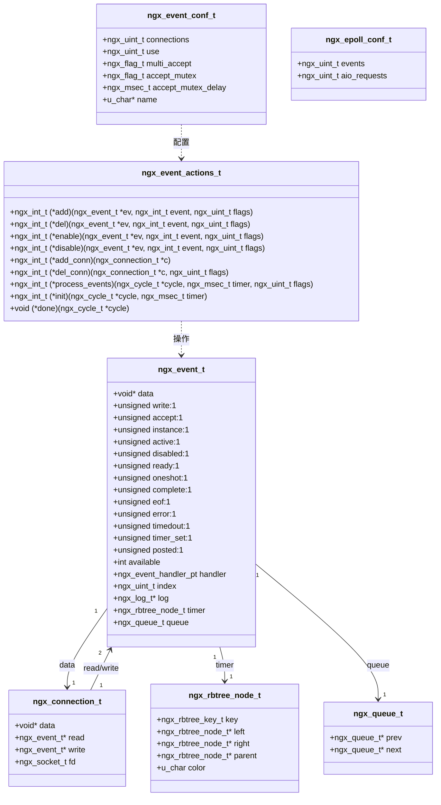

## 1. 事件对象 ngx_event_t

### 1.1 结构体定义

**定义位置：** src/event/ngx_event.h

```c
struct ngx_event_s {
    void            *data;              // 关联的数据指针（通常是 ngx_connection_t）

    unsigned         write:1;           // 写事件标志

    unsigned         accept:1;          // accept 事件标志

    /* 用于检测过期事件（kqueue/epoll 中）*/
    unsigned         instance:1;

    /*

     * 事件已传递或将传递给内核；
     * 在 aio 模式中 - 操作已提交
     */
    unsigned         active:1;

    unsigned         disabled:1;        // 禁用标志

    /* 就绪事件；aio 模式中 0 表示无法提交操作 */
    unsigned         ready:1;

    unsigned         oneshot:1;         // 一次性事件

    /* aio 操作完成 */
    unsigned         complete:1;

    unsigned         eof:1;             // 连接关闭
    unsigned         error:1;           // 错误标志

    unsigned         timedout:1;        // 超时标志
    unsigned         timer_set:1;       // 定时器已设置

    unsigned         delayed:1;         // 延迟处理

    unsigned         deferred_accept:1; // 延迟 accept

    /* kqueue/epoll 中的待处理 eof 或 aio 链操作中 */
    unsigned         pending_eof:1;

    unsigned         posted:1;          // 事件在 posted 队列中

    unsigned         closed:1;          // 已关闭标志

    /* 用于 worker 退出时的测试 */
    unsigned         channel:1;
    unsigned         resolver:1;

    unsigned         cancelable:1;

#if (NGX_HAVE_KQUEUE)
    unsigned         kq_vnode:1;
    int              kq_errno;          // kqueue 报告的待处理 errno
#endif

    /*

     * kqueue only:
     *   accept:     等待接受的套接字数量
     *   read:       当事件就绪时要读取的字节数
     *               或使用 NGX_LOWAT_EVENT 设置时的 lowat
     *   write:      当事件就绪时缓冲区中的可用空间
     *               或使用 NGX_LOWAT_EVENT 设置时的 lowat
     *
     * iocp: TODO
     *
     * otherwise:
     *   accept:     1 如果 accept many，否则 0
     *   read:       当事件就绪时要读取的字节数，-1 如果未知
     */
    int              available;

    ngx_event_handler_pt  handler;      // 事件处理函数指针

#if (NGX_HAVE_IOCP)
    ngx_event_ovlp_t ovlp;
#endif

    ngx_uint_t       index;             // epoll 数组中的索引

    ngx_log_t       *log;               // 日志对象

    ngx_rbtree_node_t   timer;          // 定时器红黑树节点

    /* posted 队列节点 */
    ngx_queue_t      queue;
};
```

### 1.2 字段详解

| 字段 | 类型 | 说明 |
|------|------|------|
| data | void * | 通常指向关联的 `ngx_connection_t` 对象 |
| write | unsigned:1 | 1 表示写事件，0 表示读事件 |
| accept | unsigned:1 | 1 表示这是监听套接字的 accept 事件 |
| instance | unsigned:1 | 用于防止过期事件，每次连接复用时翻转 |
| active | unsigned:1 | 事件是否已添加到事件模型（epoll/kqueue） |
| ready | unsigned:1 | 事件是否就绪（可读/可写） |
| timedout | unsigned:1 | 事件是否超时 |
| timer_set | unsigned:1 | 定时器是否已设置 |
| posted | unsigned:1 | 事件是否在 posted 队列中 |
| handler | ngx_event_handler_pt | 事件处理函数，当事件就绪时调用 |
| timer | ngx_rbtree_node_t | 定时器红黑树节点，key 为绝对超时时间 |
| queue | ngx_queue_t | posted 队列链表节点 |

### 1.3 Instance 机制

**目的：** 防止过期事件误触发

**工作原理：**

```c
// 获取连接时
c = ngx_get_connection(s, log);
rev = c->read;
wev = c->write;

// 翻转 instance
instance = rev->instance;
rev->instance = !instance;
wev->instance = !instance;

// epoll 事件数据中保存 instance
ee.data.ptr = (void *) ((uintptr_t) c | ev->instance);

// 事件触发时检查 instance
c = event_list[i].data.ptr;
instance = (uintptr_t) c & 1;
c = (ngx_connection_t *) ((uintptr_t) c & (uintptr_t) ~1);

rev = c->read;
if (c->fd == -1 || rev->instance != instance) {
    continue;  // 过期事件，忽略
}
```

**防止的场景：**

1. 连接 A 关闭，连接对象归还到空闲链表
2. epoll 中仍有连接 A 的事件（延迟通知）
3. 连接对象被复用为连接 B，instance 翻转
4. 连接 A 的过期事件触发时，instance 不匹配，被忽略

## 2. 事件操作接口 ngx_event_actions_t

### 2.1 结构体定义

**定义位置：** src/event/ngx_event.h

```c
typedef struct {
    ngx_int_t  (*add)(ngx_event_t *ev, ngx_int_t event, ngx_uint_t flags);
    ngx_int_t  (*del)(ngx_event_t *ev, ngx_int_t event, ngx_uint_t flags);

    ngx_int_t  (*enable)(ngx_event_t *ev, ngx_int_t event, ngx_uint_t flags);
    ngx_int_t  (*disable)(ngx_event_t *ev, ngx_int_t event, ngx_uint_t flags);

    ngx_int_t  (*add_conn)(ngx_connection_t *c);
    ngx_int_t  (*del_conn)(ngx_connection_t *c, ngx_uint_t flags);

    ngx_int_t  (*notify)(ngx_event_handler_pt handler);

    ngx_int_t  (*process_events)(ngx_cycle_t *cycle, ngx_msec_t timer,
                                  ngx_uint_t flags);

    ngx_int_t  (*init)(ngx_cycle_t *cycle, ngx_msec_t timer);
    void       (*done)(ngx_cycle_t *cycle);
} ngx_event_actions_t;
```

### 2.2 函数指针说明

| 函数 | 说明 |
|------|------|
| add | 添加事件到事件模型（epoll_ctl ADD/MOD） |
| del | 从事件模型删除事件（epoll_ctl DEL/MOD） |
| enable | 启用事件（有些模型需要） |
| disable | 禁用事件 |
| add_conn | 添加连接（同时添加读写事件） |
| del_conn | 删除连接 |
| notify | 通知事件（线程间通信） |
| process_events | 处理事件（epoll_wait） |
| init | 初始化事件模型 |
| done | 清理事件模型 |

### 2.3 不同事件模型的实现

**Epoll 实现 (Linux)：**

```c
ngx_event_actions_t ngx_epoll_module_ctx_actions = {
    ngx_epoll_add_event,             /* add an event */
    ngx_epoll_del_event,             /* delete an event */
    ngx_epoll_add_event,             /* enable an event */
    ngx_epoll_del_event,             /* disable an event */
    ngx_epoll_add_connection,        /* add an connection */
    ngx_epoll_del_connection,        /* delete an connection */
    NULL,                            /* trigger a notify */
    ngx_epoll_process_events,        /* process the events */
    ngx_epoll_init,                  /* init the events */
    ngx_epoll_done,                  /* done the events */
};
```

**Kqueue 实现 (BSD)：**

```c
ngx_event_actions_t ngx_kqueue_module_ctx_actions = {
    ngx_kqueue_add_event,
    ngx_kqueue_del_event,
    ngx_kqueue_add_event,
    ngx_kqueue_del_event,
    ngx_kqueue_add_connection,
    ngx_kqueue_del_connection,
    NULL,
    ngx_kqueue_process_events,
    ngx_kqueue_init,
    ngx_kqueue_done
};
```

**Select 实现 (通用)：**

```c
ngx_event_actions_t ngx_select_module_ctx_actions = {
    ngx_select_add_event,
    ngx_select_del_event,
    ngx_select_add_event,
    ngx_select_del_event,
    NULL,
    NULL,
    NULL,
    ngx_select_process_events,
    ngx_select_init,
    ngx_select_done
};
```

## 3. 事件配置 ngx_event_conf_t

### 3.1 结构体定义

```c
typedef struct {
    ngx_uint_t    connections;        // worker_connections
    ngx_uint_t    use;                // 事件模型索引

    ngx_flag_t    multi_accept;       // 是否一次 accept 多个连接
    ngx_flag_t    accept_mutex;       // 是否启用 accept 互斥锁

    ngx_msec_t    accept_mutex_delay; // accept 互斥锁延迟（默认 500ms）

    u_char       *name;               // 事件模型名称
} ngx_event_conf_t;
```

### 3.2 Epoll 特定配置

```c
typedef struct {
    ngx_uint_t  events;          // epoll_wait 返回的最大事件数
    ngx_uint_t  aio_requests;    // AIO 请求数（未使用）
} ngx_epoll_conf_t;
```

## 4. 定时器红黑树

### 4.1 数据结构

**红黑树节点：**

```c
typedef struct ngx_rbtree_node_s  ngx_rbtree_node_t;

struct ngx_rbtree_node_s {
    ngx_rbtree_key_t       key;      // 键值（绝对超时时间 ngx_current_msec）
    ngx_rbtree_node_t     *left;     // 左子节点
    ngx_rbtree_node_t     *right;    // 右子节点
    ngx_rbtree_node_t     *parent;   // 父节点
    u_char                 color;    // 红/黑
    u_char                 data;     // 数据（未使用）
};
```

**红黑树：**

```c
typedef struct ngx_rbtree_s  ngx_rbtree_t;

struct ngx_rbtree_s {
    ngx_rbtree_node_t     *root;      // 根节点
    ngx_rbtree_node_t     *sentinel;  // 哨兵节点（叶子节点）
    ngx_rbtree_insert_pt   insert;    // 插入函数
};
```

### 4.2 定时器树全局变量

```c
// 定时器红黑树
ngx_rbtree_t              ngx_event_timer_rbtree;
static ngx_rbtree_node_t  ngx_event_timer_sentinel;
```

### 4.3 内存布局

```
ngx_event_t
├─ timer (ngx_rbtree_node_t)
│  ├─ key = ngx_current_msec + timeout  // 绝对超时时间
│  ├─ left ────→ 左子树
│  ├─ right ───→ 右子树
│  ├─ parent ──→ 父节点
│  └─ color

ngx_event_timer_rbtree (全局)
├─ root ──────→ 根节点
├─ sentinel ──→ 哨兵节点
└─ insert ────→ ngx_rbtree_insert_timer_value

查找最小超时：
    从 root 一直向左走到叶子
    O(log n) 复杂度，但实际上是 O(1)
    因为最小节点地址被缓存
```

## 5. Posted 事件队列

### 5.1 队列节点

```c
typedef struct ngx_queue_s  ngx_queue_t;

struct ngx_queue_s {
    ngx_queue_t  *prev;    // 前一个节点
    ngx_queue_t  *next;    // 后一个节点
};
```

### 5.2 全局队列

```c
// Accept 事件队列（优先处理）
ngx_queue_t  ngx_posted_accept_events;

// 延迟事件队列（允许在当前循环多次触发）
ngx_queue_t  ngx_posted_next_events;

// 普通事件队列（下一轮循环处理）
ngx_queue_t  ngx_posted_events;
```

### 5.3 队列操作

**初始化：**

```c
ngx_queue_init(&ngx_posted_accept_events);
ngx_queue_init(&ngx_posted_events);
```

**插入：**

```c
static ngx_inline void
ngx_post_event(ngx_event_t *ev, ngx_queue_t *queue)
{
    if (!ev->posted) {
        ev->posted = 1;
        ngx_queue_insert_tail(queue, &ev->queue);
    }
}
```

**处理：**

```c
void
ngx_event_process_posted(ngx_cycle_t *cycle, ngx_queue_t *posted)
{
    ngx_queue_t  *q;
    ngx_event_t  *ev;

    while (!ngx_queue_empty(posted)) {
        q = ngx_queue_head(posted);
        ev = ngx_queue_data(q, ngx_event_t, queue);

        ngx_queue_remove(q);
        ev->posted = 0;

        ev->handler(ev);
    }
}
```

## 6. Accept 互斥锁

### 6.1 数据结构

```c
// 共享内存互斥锁
typedef struct {
    ngx_atomic_t  *lock;       // 原子锁变量
    ngx_atomic_t  *wait;       // 等待者计数
    ngx_uint_t     semaphore;  // 是否使用信号量
    ngx_fd_t       fd;         // 信号量文件描述符
    u_char        *name;       // 锁名称
} ngx_shmtx_t;

// 全局互斥锁
ngx_shmtx_t   ngx_accept_mutex;
ngx_atomic_t *ngx_accept_mutex_ptr;  // 指向共享内存中的锁变量
```

### 6.2 锁状态

```c
// 是否持有锁
ngx_uint_t  ngx_accept_mutex_held;

// accept 事件计数
ngx_uint_t  ngx_accept_events;

// 禁用 accept 计数（负载均衡）
ngx_int_t   ngx_accept_disabled;
```

### 6.3 负载均衡算法

```c
// 在 ngx_event_accept 中计算
ngx_accept_disabled = ngx_cycle->connection_n / 8

                      - ngx_cycle->free_connection_n;

// 在主循环中检查
if (ngx_accept_disabled > 0) {
    ngx_accept_disabled--;  // 主动不竞争锁
} else {
    // 竞争 accept 互斥锁
}
```

**说明：**

- 当空闲连接数 < 总连接数的 7/8 时，`ngx_accept_disabled` > 0
- Worker 主动放弃竞争 accept 锁，让其他 Worker 接受新连接
- 实现简单的负载均衡，避免某个 Worker 连接数过多

## 7. 内存布局总结

```
Worker 进程内存布局：

全局变量区：
├─ ngx_event_timer_rbtree        // 定时器红黑树
├─ ngx_posted_accept_events      // Accept 事件队列
├─ ngx_posted_events             // 普通事件队列
├─ ngx_accept_mutex              // Accept 互斥锁
└─ ngx_event_actions             // 事件操作接口

ngx_cycle_t：
├─ connections[worker_connections]    // 连接池数组
├─ read_events[worker_connections]    // 读事件数组
└─ write_events[worker_connections]   // 写事件数组

每个连接：
├─ ngx_connection_t
│  ├─ read ───→ ngx_event_t
│  │            ├─ timer ───→ 红黑树节点
│  │            └─ queue ───→ Posted 队列节点
│  └─ write ──→ ngx_event_t
│               ├─ timer ───→ 红黑树节点
│               └─ queue ───→ Posted 队列节点

事件模型数据（epoll）：
├─ ep (epoll fd)
└─ event_list[nevents]  // epoll_wait 返回的事件数组
```

---

**相关文档：**

- [Nginx-02-Event-概览](./Nginx-02-Event-概览.md)
- [Nginx-02-Event-API](./Nginx-02-Event-API.md)
- [Nginx-02-Event-时序图](./Nginx-02-Event-时序图.md)

---

## 时序图

## 时序图总览

本文档包含 Event 模块的关键时序图：

1. **事件循环主流程**
2. **Epoll 事件处理流程**
3. **定时器添加与触发流程**
4. **Accept 连接处理流程**
5. **Accept 互斥锁竞争流程**
6. **Posted 事件队列处理流程**

## 1. 事件循环主流程

```mermaid
sequenceDiagram
    autonumber
    participant Worker as Worker进程
    participant MainLoop as 主循环
    participant Timer as 定时器管理
    participant Mutex as Accept互斥锁
    participant Epoll as Epoll模块
    participant Posted as Posted队列

    Note over Worker: Worker 启动后进入主循环
    Worker->>MainLoop: ngx_worker_process_cycle()
    
    loop 无限循环
        Note over MainLoop: 开始新一轮事件循环
        MainLoop->>MainLoop: ngx_process_events_and_timers()
        
        Note over Timer: 查找最近的定时器超时时间
        MainLoop->>Timer: ngx_event_find_timer()
        Timer->>Timer: 红黑树查找最小key
        Timer-->>MainLoop: 返回超时时间 timer
        
        Note over Mutex: Accept 互斥锁处理
        alt 启用 accept_mutex
            alt ngx_accept_disabled > 0
                MainLoop->>MainLoop: ngx_accept_disabled--
                MainLoop->>MainLoop: 不竞争锁，负载均衡
            else
                MainLoop->>Mutex: ngx_trylock_accept_mutex()
                
                alt 获得锁
                    Mutex->>Mutex: ngx_accept_mutex_held = 1
                    Mutex->>Mutex: 启用监听套接字事件
                    Mutex-->>MainLoop: 返回成功
                    MainLoop->>MainLoop: flags |= NGX_POST_EVENTS
                else 未获得锁
                    Mutex->>Mutex: 禁用监听套接字事件
                    Mutex-->>MainLoop: 返回失败
                    MainLoop->>MainLoop: timer = min(timer, accept_mutex_delay)
                end
            end
        end
        
        Note over Epoll: 等待 I/O 事件
        MainLoop->>Epoll: ngx_process_events(cycle, timer, flags)
        Epoll->>Epoll: epoll_wait(ep, event_list, nevents, timer)
        
        alt 有事件就绪
            Epoll->>Epoll: 更新时间缓存 ngx_time_update()
            
            loop 遍历就绪事件
                Epoll->>Epoll: 获取连接和事件对象
                Epoll->>Epoll: 检查 instance 防止过期事件
                
                alt 读事件就绪
                    Epoll->>Epoll: rev->ready = 1
                    
                    alt flags & NGX_POST_EVENTS
                        Epoll->>Posted: ngx_post_event(rev, queue)
                    else
                        Epoll->>Epoll: rev->handler(rev)
                    end
                end
                
                alt 写事件就绪
                    Epoll->>Epoll: wev->ready = 1
                    
                    alt flags & NGX_POST_EVENTS
                        Epoll->>Posted: ngx_post_event(wev, queue)
                    else
                        Epoll->>Epoll: wev->handler(wev)
                    end
                end
            end
            
            Epoll-->>MainLoop: 返回处理的事件数
        else 超时或中断
            Epoll-->>MainLoop: 返回 0 或错误
        end
        
        Note over Posted: 处理 Accept 事件队列（优先）
        MainLoop->>Posted: ngx_event_process_posted(&ngx_posted_accept_events)
        
        loop 队列不为空
            Posted->>Posted: 取出队列头节点
            Posted->>Posted: ev->handler(ev) 调用 ngx_event_accept
        end
        
        Note over Mutex: 释放 Accept 互斥锁
        alt ngx_accept_mutex_held
            MainLoop->>Mutex: ngx_shmtx_unlock(&ngx_accept_mutex)
            Mutex->>Mutex: ngx_accept_mutex_held = 0
        end
        
        Note over Timer: 处理过期定时器
        MainLoop->>Timer: ngx_event_expire_timers()
        
        loop 红黑树最小节点超时
            Timer->>Timer: 取出最小节点
            Timer->>Timer: ngx_rbtree_delete() 删除节点
            Timer->>Timer: ev->timedout = 1
            Timer->>Timer: ev->handler(ev) 调用超时处理函数
        end
        
        Note over Posted: 处理普通事件队列
        MainLoop->>Posted: ngx_event_process_posted(&ngx_posted_events)
        
        loop 队列不为空
            Posted->>Posted: 取出队列头节点
            Posted->>Posted: ev->handler(ev) 调用事件处理函数
        end
    end
```

**关键步骤说明：**

1. **定时器查找（步骤 4-6）：**
   - 红黑树最左节点的 key 即为最近超时时间
   - O(1) 复杂度，无需遍历

2. **Accept 互斥锁（步骤 8-20）：**
   - 负载均衡：连接数过多的 Worker 主动放弃竞争
   - 获得锁的 Worker 延迟处理 accept 事件
   - 未获得锁的 Worker 缩短等待时间，下次快速重试

3. **事件延迟处理（步骤 30-35）：**
   - `NGX_POST_EVENTS` 标志表示将事件放入队列
   - Accept 事件放入 `ngx_posted_accept_events`
   - 普通事件放入 `ngx_posted_events`
   - 优点：避免在 epoll_wait 回调中长时间处理，快速返回继续 epoll_wait

4. **处理顺序（步骤 43-62）：**
   - Accept 事件优先处理（建立新连接）
   - 释放 accept 锁
   - 处理定时器
   - 处理普通事件

## 2. Epoll 事件处理详细流程

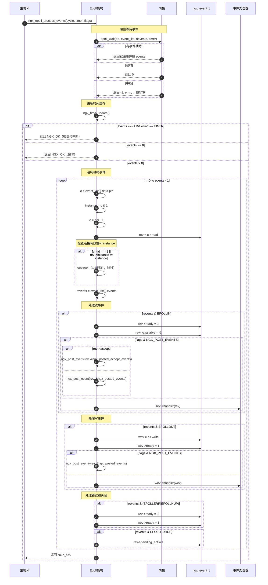

## 3. 定时器添加与触发流程

### 3.1 添加定时器

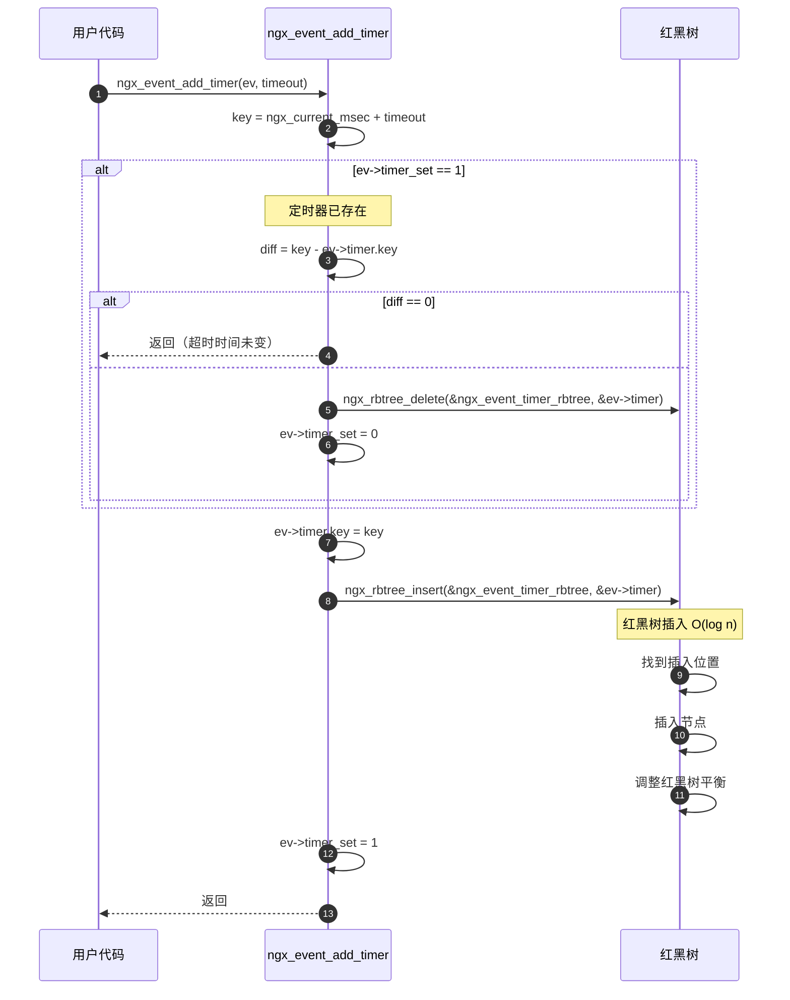

### 3.2 触发定时器

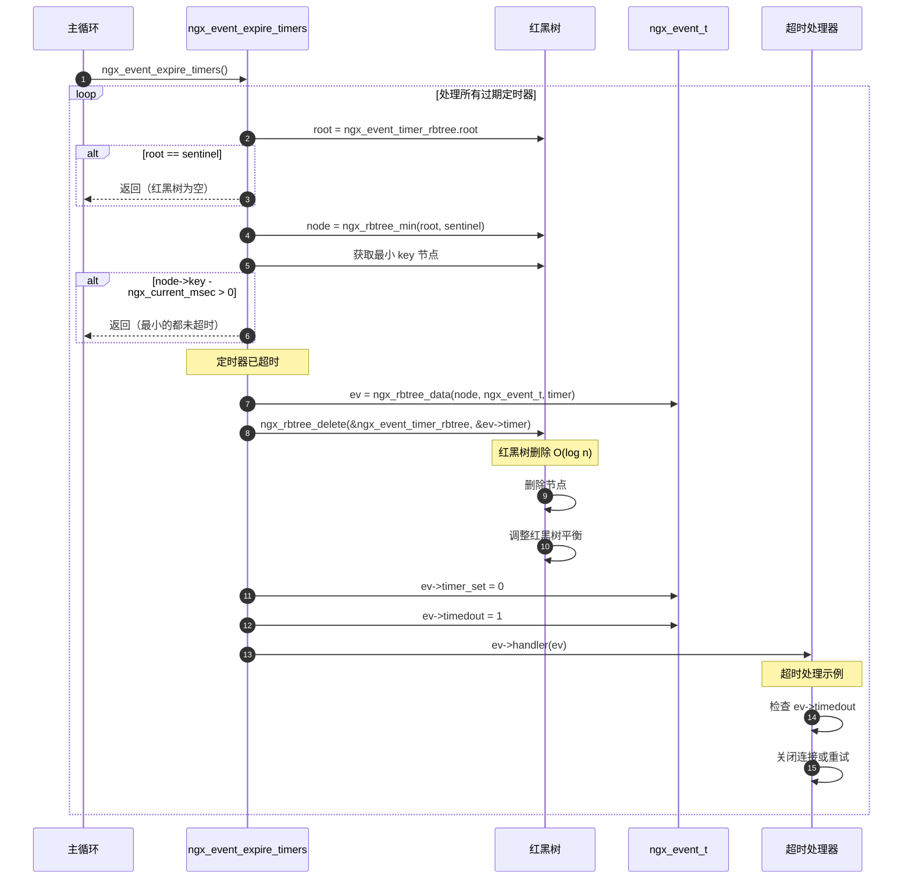

## 4. Accept 连接处理流程

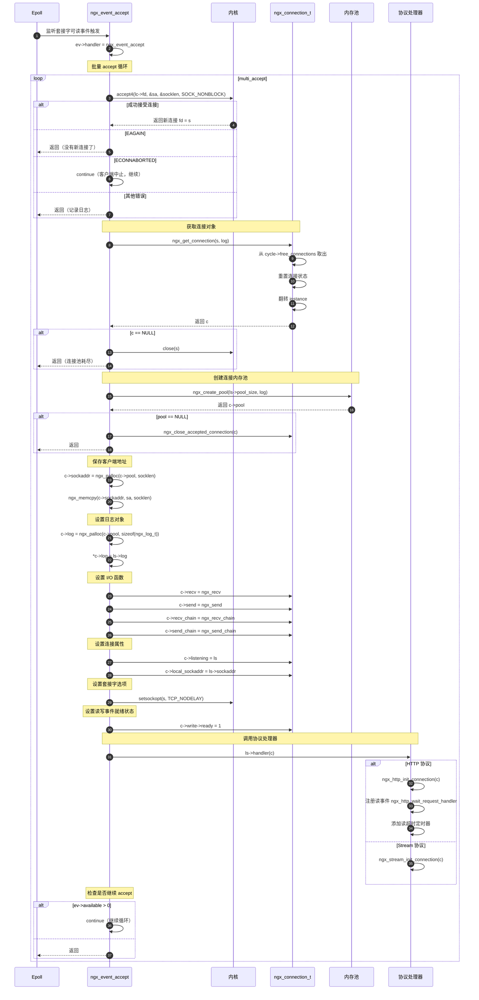

## 5. Accept 互斥锁竞争流程

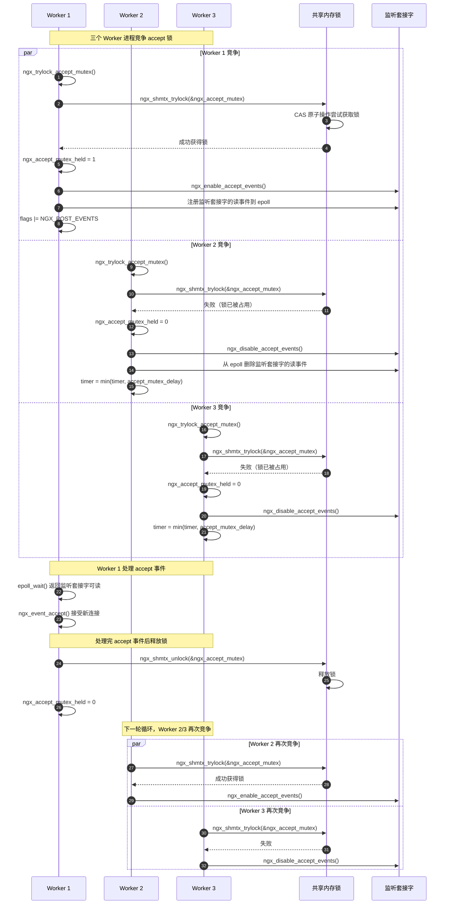

**负载均衡机制：**

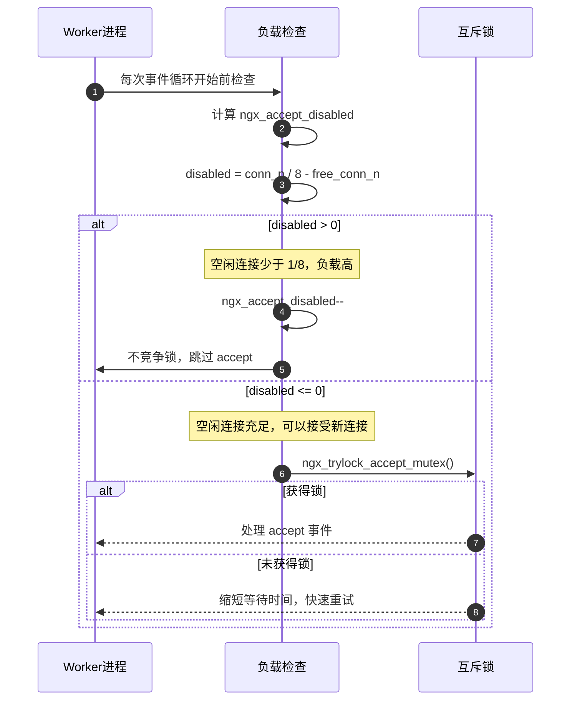

## 6. Posted 事件队列处理流程

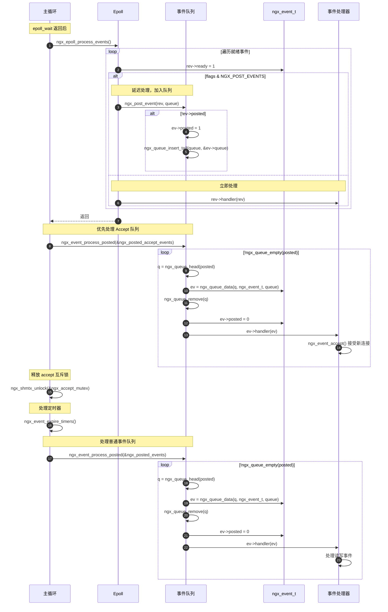

**延迟处理的优点：**

1. **快速返回 epoll_wait：** 不在回调中长时间处理，快速返回继续监听
2. **控制处理顺序：** Accept 事件优先，保证新连接及时建立
3. **避免竞争条件：** Accept 处理完后再释放锁，避免其他 Worker 同时 accept
4. **批量处理：** 多个事件积累后批量处理，提高缓存局部性

---

**相关文档：**

- [Nginx-02-Event-概览](./Nginx-02-Event-概览.md)
- [Nginx-02-Event-API](./Nginx-02-Event-API.md)
- [Nginx-02-Event-数据结构](./Nginx-02-Event-数据结构.md)

---
