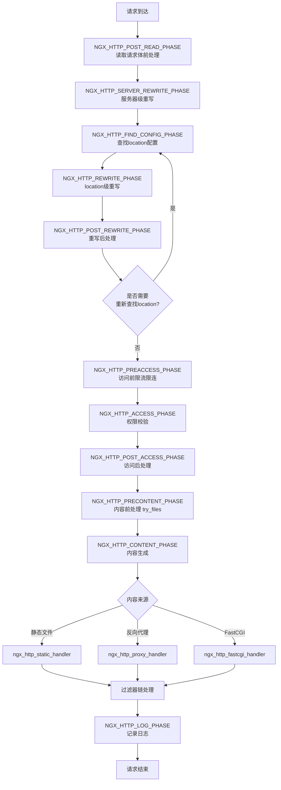
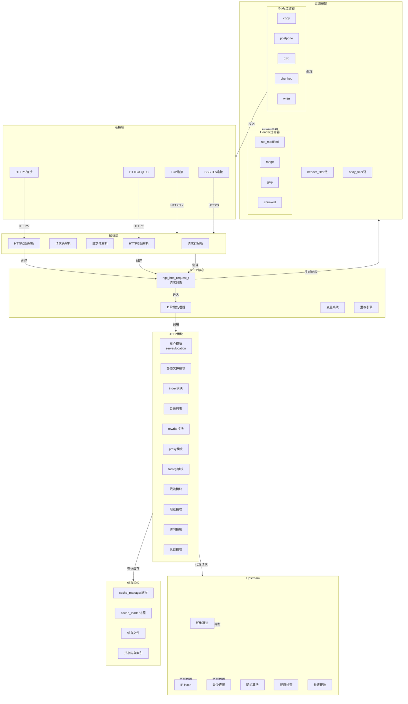
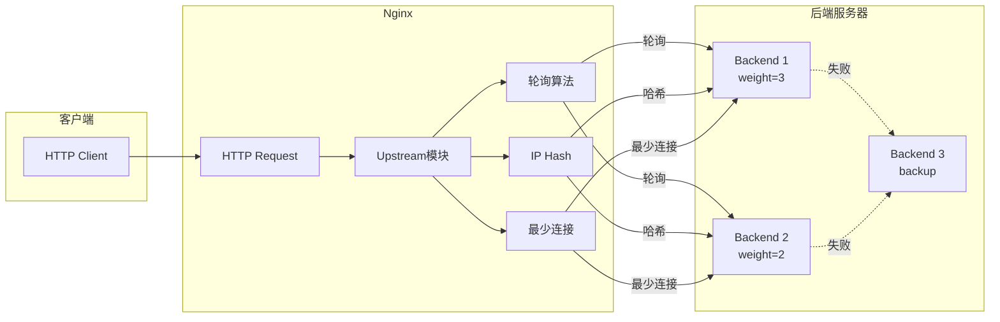
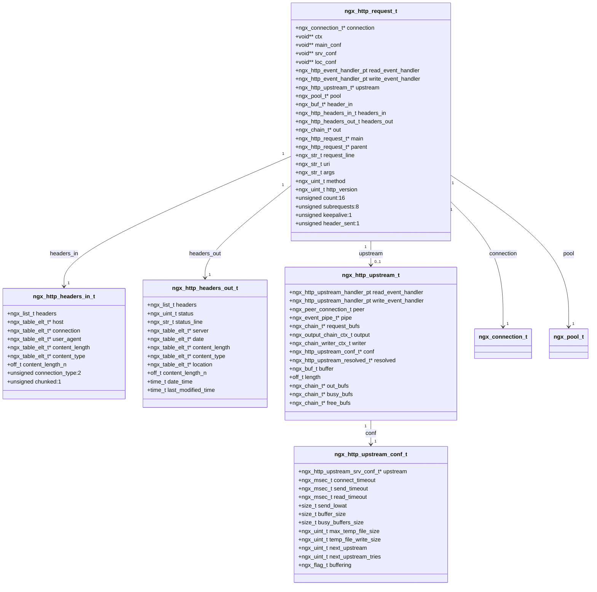
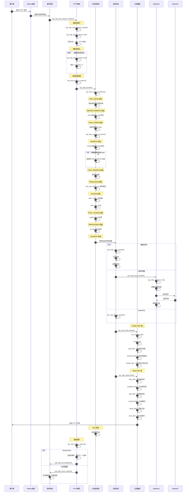
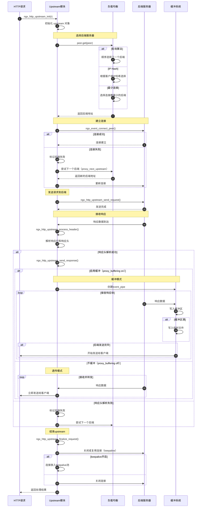
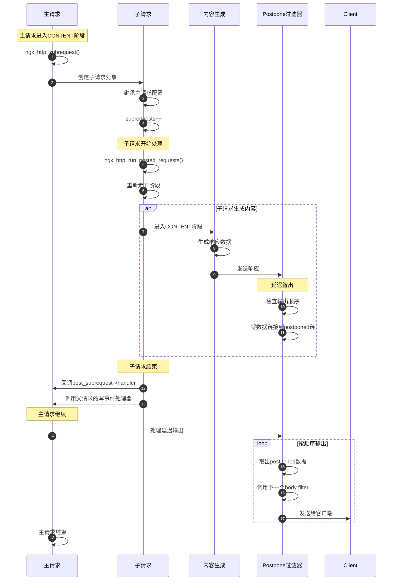

# Nginx-03-HTTP

## 模块概览

## 模块职责

HTTP 模块是 Nginx 的核心功能模块，提供完整的 HTTP/1.x、HTTP/2、HTTP/3 服务器能力，包括：

1. **请求处理：** HTTP 协议解析、请求路由、11 阶段处理流程
2. **反向代理：** Upstream 模块实现负载均衡、健康检查、故障转移
3. **内容服务：** 静态文件服务、FastCGI/uWSGI/SCGI 应用协议支持
4. **过滤器链：** 响应头和响应体的链式处理（gzip、chunked、range 等）
5. **缓存系统：** proxy_cache 缓存后端响应，提升性能
6. **SSL/TLS：** HTTPS 支持，TLS 会话缓存、SNI、ALPN
7. **HTTP/2：** 二进制帧、多路复用、服务器推送
8. **HTTP/3：** 基于 QUIC 的下一代HTTP协议

## 输入/输出

**输入：**

- 客户端 HTTP 请求（请求行、头部、body）
- 配置文件中的 server、location 块
- Upstream 后端服务器响应

**输出：**

- HTTP 响应（状态行、头部、body）
- 访问日志
- 错误日志

## 11 阶段处理流程

Nginx HTTP 请求处理分为 11 个阶段，每个阶段可以注册多个处理器：



## 模块级架构图



## 核心数据结构

### ngx_http_request_t

**定义位置：** src/http/ngx_http_request.h

**关键字段：**

```c
struct ngx_http_request_s {
    ngx_connection_t                 *connection;     // 关联的连接对象
    
    void                            **ctx;            // 模块上下文数组
    void                            **main_conf;      // main级别配置
    void                            **srv_conf;       // server级别配置
    void                            **loc_conf;       // location级别配置
    
    ngx_http_event_handler_pt         read_event_handler;   // 读事件处理函数
    ngx_http_event_handler_pt         write_event_handler;  // 写事件处理函数
    
    ngx_http_upstream_t              *upstream;       // upstream对象
    ngx_pool_t                       *pool;           // 请求内存池
    
    ngx_buf_t                        *header_in;      // 接收缓冲区
    
    ngx_http_headers_in_t             headers_in;     // 请求头
    ngx_http_headers_out_t            headers_out;    // 响应头
    
    ngx_chain_t                      *out;            // 输出缓冲区链
    
    ngx_http_request_t               *main;           // 主请求
    ngx_http_request_t               *parent;         // 父请求
    ngx_http_request_t               *postponed;      // 延迟子请求链
    
    ngx_str_t                         request_line;   // 请求行
    ngx_str_t                         uri;            // URI
    ngx_str_t                         args;           // 查询参数
    ngx_str_t                         exten;          // 文件扩展名
    ngx_str_t                         unparsed_uri;   // 原始URI
    
    ngx_uint_t                        method;         // HTTP方法（GET/POST等）
    ngx_uint_t                        http_version;   // HTTP版本
    
    ngx_uint_t                        http_state;     // 解析状态
    
    unsigned                          count:16;       // 引用计数
    unsigned                          subrequests:8;  // 子请求层数
    unsigned                          blocked:8;      // 阻塞计数
    
    unsigned                          http_protocol:4; // HTTP协议版本
    unsigned                          keepalive:1;     // 是否keep-alive
    unsigned                          header_sent:1;   // 响应头是否已发送
    unsigned                          internal:1;      // 是否内部请求
    unsigned                          error_page:1;    // 是否错误页面
};
```

## 反向代理与负载均衡

### Upstream 模块架构



**负载均衡算法：**

1. **轮询 (Round Robin)：** 默认算法，按顺序分配请求
2. **加权轮询 (Weighted Round Robin)：** 根据 weight 分配请求比例
3. **IP Hash：** 根据客户端 IP 哈希，保证同一客户端请求同一后端
4. **最少连接 (Least Connections)：** 选择当前连接数最少的后端
5. **随机 (Random)：** 随机选择后端，可配合 two 参数选择两个中的最优

**Upstream 配置示例：**

```nginx
upstream backend {
    least_conn;  # 最少连接算法
    
    server 192.168.1.10:8080 weight=5 max_fails=3 fail_timeout=30s;
    server 192.168.1.11:8080 weight=3;
    server 192.168.1.12:8080 backup;  # 备份服务器
    
    keepalive 32;  # 保持32个长连接
}

server {
    location / {
        proxy_pass http://backend;
        proxy_next_upstream error timeout http_500 http_502 http_503;
        proxy_next_upstream_tries 2;
    }
}
```

## 过滤器链机制

Nginx 的响应处理通过过滤器链实现，分为 header_filter 和 body_filter 两条链：

```mermaid
flowchart LR
    subgraph Content["内容生成"]
        Generate[生成响应<br/>static/proxy/fastcgi]
    end
    
    subgraph HeaderChain["Header Filter链"]
        H1[not_modified_filter]
        H2[range_filter]
        H3[gzip_filter]
        H4[chunked_filter]
        H5[header_filter]
    end
    
    subgraph BodyChain["Body Filter链"]
        B1[copy_filter]
        B2[postpone_filter]
        B3[gzip_filter]
        B4[chunked_filter]
        B5[range_filter]
        B6[write_filter]
    end
    
    Generate --> H1
    H1 --> H2
    H2 --> H3
    H3 --> H4
    H4 --> H5
    H5 --> B1
    B1 --> B2
    B2 --> B3
    B3 --> B4
    B4 --> B5
    B5 --> B6
    B6 --> Client[发送给客户端]
```



**过滤器注册：**

```c
// 模块初始化时注册过滤器
static ngx_int_t
ngx_http_gzip_filter_init(ngx_conf_t *cf)
{
    // 保存下一个header过滤器
    ngx_http_next_header_filter = ngx_http_top_header_filter;
    // 将自己插入链表头部
    ngx_http_top_header_filter = ngx_http_gzip_header_filter;

    // 保存下一个body过滤器
    ngx_http_next_body_filter = ngx_http_top_body_filter;
    // 将自己插入链表头部
    ngx_http_top_body_filter = ngx_http_gzip_body_filter;

    return NGX_OK;
}

// header过滤器实现
static ngx_int_t
ngx_http_gzip_header_filter(ngx_http_request_t *r)
{
    // 处理响应头（如添加Content-Encoding: gzip）
    
    // 调用下一个过滤器
    return ngx_http_next_header_filter(r);
}

// body过滤器实现
static ngx_int_t
ngx_http_gzip_body_filter(ngx_http_request_t *r, ngx_chain_t *in)
{
    // 压缩响应体
    
    // 调用下一个过滤器
    return ngx_http_next_body_filter(r, out);
}
```

## 配置与可观测

### 核心配置项

| 配置项 | 上下文 | 默认值 | 说明 |
|--------|--------|--------|------|
| client_header_timeout | http/server | 60s | 读取请求头超时 |
| client_body_timeout | http/server/location | 60s | 读取请求体超时 |
| send_timeout | http/server/location | 60s | 发送响应超时 |
| keepalive_timeout | http/server/location | 75s | 长连接超时 |
| keepalive_requests | http/server/location | 1000 | 长连接最大请求数 |
| client_max_body_size | http/server/location | 1m | 请求体最大大小 |
| large_client_header_buffers | http/server | 4 8k | 大请求头缓冲区 |
| proxy_pass | location | - | 反向代理后端地址 |
| proxy_buffering | http/server/location | on | 是否缓冲后端响应 |
| proxy_buffer_size | http/server/location | 4k/8k | 响应头缓冲区大小 |
| proxy_buffers | http/server/location | 8 4k/8k | 响应体缓冲区 |
| proxy_cache_path | http | - | 缓存路径和参数 |
| gzip | http/server/location | off | 是否启用gzip压缩 |

### 性能指标

**通过 stub_status 模块获取：**

```nginx
location /nginx_status {
    stub_status;
}
```

**输出示例：**

```
Active connections: 291
server accepts handled requests
 16630948 16630948 31070465
Reading: 6 Writing: 179 Waiting: 106
```

**指标说明：**

- `Active connections`: 当前活跃连接数
- `accepts`: 接受的连接总数
- `handled`: 处理的连接总数
- `requests`: 请求总数（一个连接可处理多个请求）
- `Reading`: 正在读取请求头的连接数
- `Writing`: 正在发送响应的连接数
- `Waiting`: 空闲 Keep-Alive 连接数

---

**相关文档：**

- [Nginx-00-总览](./Nginx-00-总览.md)
- [Nginx-03-HTTP-API](./Nginx-03-HTTP-API.md)
- [Nginx-03-HTTP-数据结构](./Nginx-03-HTTP-数据结构.md)

---

## API接口

## API 总览

HTTP 模块提供的 API 主要分为以下几类：

1. **请求处理 API** - 请求创建、处理、结束
2. **请求解析 API** - 协议解析、URI 处理
3. **响应发送 API** - 发送头部、发送数据
4. **过滤器 API** - Header Filter、Body Filter
5. **Upstream API** - 反向代理、负载均衡
6. **变量 API** - 变量获取、设置
7. **子请求 API** - 内部请求、重定向

## 1. 请求处理 API

### 1.1 ngx_http_create_request

**功能说明：** 创建 HTTP 请求对象

**函数签名：**

```c
ngx_http_request_t *ngx_http_create_request(ngx_connection_t *c);
```

**参数：**
| 参数 | 类型 | 方向 | 说明 |
|------|------|------|------|
| c | ngx_connection_t * | 输入 | 连接对象 |

**返回值：**
| 类型 | 说明 |
|------|------|
| ngx_http_request_t * | 成功返回请求对象，失败返回 NULL |

**核心代码 (src/http/ngx_http_request.c)：**

```c
ngx_http_request_t *
ngx_http_create_request(ngx_connection_t *c)
{
    ngx_http_request_t        *r;
    ngx_http_log_ctx_t        *ctx;
    ngx_http_core_loc_conf_t  *clcf;

    // 从连接内存池分配请求对象
    r = ngx_pcalloc(c->pool, sizeof(ngx_http_request_t));
    if (r == NULL) {
        return NULL;
    }

    r->signature = NGX_HTTP_MODULE;

    // 创建请求内存池
    r->pool = ngx_create_pool(clcf->request_pool_size, c->log);
    if (r->pool == NULL) {
        return NULL;
    }

    // 创建 headers_in 的链表
    if (ngx_list_init(&r->headers_in.headers, r->pool, 20,
                      sizeof(ngx_table_elt_t))
        != NGX_OK)
    {
        ngx_destroy_pool(r->pool);
        return NULL;
    }

    // 创建 headers_out 的链表
    if (ngx_list_init(&r->headers_out.headers, r->pool, 20,
                      sizeof(ngx_table_elt_t))
        != NGX_OK)
    {
        ngx_destroy_pool(r->pool);
        return NULL;
    }

    r->ctx = ngx_pcalloc(r->pool, sizeof(void *) * ngx_http_max_module);
    if (r->ctx == NULL) {
        ngx_destroy_pool(r->pool);
        return NULL;
    }

    r->main_conf = cscf->ctx->main_conf;
    r->srv_conf = cscf->ctx->srv_conf;
    r->loc_conf = cscf->ctx->loc_conf;

    r->read_event_handler = ngx_http_block_reading;

    // 关联连接和请求
    c->data = r;
    r->connection = c;

    r->main = r;
    r->count = 1;

    r->http_version = NGX_HTTP_VERSION_10;

    return r;
}
```

### 1.2 ngx_http_process_request

**功能说明：** 开始处理 HTTP 请求（进入 11 阶段处理流程）

**函数签名：**

```c
void ngx_http_process_request(ngx_http_request_t *r);
```

**核心代码：**

```c
void
ngx_http_process_request(ngx_http_request_t *r)
{
    ngx_connection_t  *c;

    c = r->connection;

    // 删除读事件定时器
    if (c->read->timer_set) {
        ngx_del_timer(c->read);
    }

    // 设置读写事件处理函数为阻塞模式
    c->read->handler = ngx_http_request_handler;
    c->write->handler = ngx_http_request_handler;
    r->read_event_handler = ngx_http_block_reading;

    // 开始 11 阶段处理
    ngx_http_handler(r);
}
```

### 1.3 ngx_http_handler

**功能说明：** 执行 HTTP 请求的 11 阶段处理流程

**函数签名：**

```c
void ngx_http_handler(ngx_http_request_t *r);
```

**核心代码：**

```c
void
ngx_http_handler(ngx_http_request_t *r)
{
    ngx_http_core_main_conf_t  *cmcf;

    r->connection->log->action = NULL;

    if (!r->internal) {
        // 查找匹配的 server 和 location
        switch (r->headers_in.connection_type) {
        case 0:
            r->keepalive = (r->http_version > NGX_HTTP_VERSION_10);
            break;

        case NGX_HTTP_CONNECTION_CLOSE:
            r->keepalive = 0;
            break;

        case NGX_HTTP_CONNECTION_KEEP_ALIVE:
            r->keepalive = 1;
            break;
        }

        r->lingering_close = (r->headers_in.content_length_n > 0
                              || r->headers_in.chunked);

        r->phase_handler = 0;

    } else {
        cmcf = ngx_http_get_module_main_conf(r, ngx_http_core_module);
        r->phase_handler = cmcf->phase_engine.server_rewrite_index;
    }

    r->valid_location = 1;
#if (NGX_HTTP_GZIP)
    r->gzip_tested = 0;
    r->gzip_ok = 0;
    r->gzip_vary = 0;
#endif

    r->write_event_handler = ngx_http_core_run_phases;

    // 执行阶段处理器
    ngx_http_core_run_phases(r);
}
```

### 1.4 ngx_http_core_run_phases

**功能说明：** 运行 HTTP 请求处理阶段

**核心代码 (src/http/ngx_http_core_module.c)：**

```c
void
ngx_http_core_run_phases(ngx_http_request_t *r)
{
    ngx_int_t                   rc;
    ngx_http_phase_handler_t   *ph;
    ngx_http_core_main_conf_t  *cmcf;

    cmcf = ngx_http_get_module_main_conf(r, ngx_http_core_module);

    ph = cmcf->phase_engine.handlers;

    while (ph[r->phase_handler].checker) {

        // 调用阶段检查器函数
        rc = ph[r->phase_handler].checker(r, &ph[r->phase_handler]);

        if (rc == NGX_OK) {
            return;  // 当前阶段处理完成，等待事件
        }
    }
}
```

**阶段检查器示例：**

```c
ngx_int_t
ngx_http_core_generic_phase(ngx_http_request_t *r, ngx_http_phase_handler_t *ph)
{
    ngx_int_t  rc;

    // 调用模块的处理器函数
    rc = ph->handler(r);

    if (rc == NGX_OK) {
        r->phase_handler = ph->next;
        return NGX_AGAIN;  // 继续下一个阶段
    }

    if (rc == NGX_DECLINED) {
        r->phase_handler++;
        return NGX_AGAIN;  // 当前阶段的下一个处理器
    }

    if (rc == NGX_AGAIN || rc == NGX_DONE) {
        return NGX_OK;  // 阻塞等待
    }

    // 结束请求
    ngx_http_finalize_request(r, rc);

    return NGX_OK;
}
```

### 1.5 ngx_http_finalize_request

**功能说明：** 结束 HTTP 请求

**函数签名：**

```c
void ngx_http_finalize_request(ngx_http_request_t *r, ngx_int_t rc);
```

**参数：**
| 参数 | 类型 | 方向 | 说明 |
|------|------|------|------|
| r | ngx_http_request_t * | 输入 | 请求对象 |
| rc | ngx_int_t | 输入 | 返回码（HTTP 状态码或特殊值） |

**核心代码：**

```c
void
ngx_http_finalize_request(ngx_http_request_t *r, ngx_int_t rc)
{
    ngx_connection_t          *c;
    ngx_http_request_t        *pr;

    c = r->connection;

    if (rc == NGX_DONE) {
        // 请求已处理完成
        ngx_http_finalize_connection(r);
        return;
    }

    if (rc == NGX_OK && r->filter_finalize) {
        c->error = 1;
    }

    if (rc == NGX_DECLINED) {
        r->content_handler = NULL;
        r->write_event_handler = ngx_http_core_run_phases;
        ngx_http_core_run_phases(r);
        return;
    }

    // 如果是子请求
    if (r != r->main && r->post_subrequest) {
        rc = r->post_subrequest->handler(r, r->post_subrequest->data, rc);
    }

    if (rc == NGX_ERROR
        || rc == NGX_HTTP_REQUEST_TIME_OUT
        || rc == NGX_HTTP_CLIENT_CLOSED_REQUEST
        || c->error)
    {
        // 错误，关闭连接
        if (ngx_http_post_action(r) == NGX_OK) {
            return;
        }

        ngx_http_terminate_request(r, rc);
        return;
    }

    if (rc >= NGX_HTTP_SPECIAL_RESPONSE
        || rc == NGX_HTTP_CREATED
        || rc == NGX_HTTP_NO_CONTENT)
    {
        // 特殊响应或错误页面
        if (rc == NGX_HTTP_CLOSE) {
            ngx_http_terminate_request(r, rc);
            return;
        }

        if (r == r->main) {
            if (c->read->timer_set) {
                ngx_del_timer(c->read);
            }

            if (c->write->timer_set) {
                ngx_del_timer(c->write);
            }
        }

        c->read->handler = ngx_http_request_handler;
        c->write->handler = ngx_http_request_handler;

        ngx_http_special_response_handler(r, rc);
        return;
    }

    // 正常结束，处理子请求或主请求
    if (r != r->main) {
        // 子请求
        if (r->buffered || r->postponed) {
            // 有缓冲数据待发送
            if (ngx_http_set_write_handler(r) != NGX_OK) {
                ngx_http_terminate_request(r, 0);
            }
            return;
        }

        pr = r->parent;

        if (r == c->data) {
            r->main->count--;

            if (!r->logged) {
                r->logged = 1;
                ngx_http_log_request(r);
            }

            if (r->buffered || r->postponed) {
                if (ngx_http_set_write_handler(r) != NGX_OK) {
                    ngx_http_terminate_request(r, 0);
                }
                return;
            }

            ngx_http_finalize_request(r, ngx_http_special_response_handler(r, rc));
            return;
        }
    }

    // 主请求结束
    if (r->buffered || c->buffered || r->postponed) {
        if (ngx_http_set_write_handler(r) != NGX_OK) {
            ngx_http_terminate_request(r, 0);
        }
        return;
    }

    if (r != c->data) {
        ngx_http_finalize_request(r, rc);
        return;
    }

    r->done = 1;

    if (!r->post_action) {
        r->request_complete = 1;
    }

    if (ngx_http_post_action(r) == NGX_OK) {
        return;
    }

    if (c->read->timer_set) {
        ngx_del_timer(c->read);
    }

    if (c->write->timer_set) {
        c->write->delayed = 0;
        ngx_del_timer(c->write);
    }

    ngx_http_finalize_connection(r);
}
```

## 2. 请求解析 API

### 2.1 ngx_http_parse_request_line

**功能说明：** 解析 HTTP 请求行

**函数签名：**

```c
ngx_int_t ngx_http_parse_request_line(ngx_http_request_t *r, ngx_buf_t *b);
```

**返回值：**
| 值 | 说明 |
|------|------|
| NGX_OK | 解析完成 |
| NGX_AGAIN | 需要更多数据 |
| NGX_HTTP_PARSE_INVALID_METHOD | 无效方法 |
| NGX_HTTP_PARSE_INVALID_REQUEST | 无效请求 |

**核心代码 (src/http/ngx_http_parse.c)：**

```c
ngx_int_t
ngx_http_parse_request_line(ngx_http_request_t *r, ngx_buf_t *b)
{
    u_char  c, ch, *p, *m;
    enum {
        sw_start = 0,
        sw_method,
        sw_spaces_before_uri,
        sw_schema,
        sw_schema_slash,
        sw_schema_slash_slash,
        sw_host_start,
        sw_host,
        sw_host_end,
        sw_host_ip_literal,
        sw_port,
        sw_host_http_09,
        sw_after_slash_in_uri,
        sw_check_uri,
        sw_check_uri_http_09,
        sw_uri,
        sw_http_09,
        sw_http_H,
        sw_http_HT,
        sw_http_HTT,
        sw_http_HTTP,
        sw_first_major_digit,
        sw_major_digit,
        sw_first_minor_digit,
        sw_minor_digit,
        sw_spaces_after_digit,
        sw_almost_done
    } state;

    state = r->state;

    for (p = b->pos; p < b->last; p++) {
        ch = *p;

        switch (state) {

        // 开始状态
        case sw_start:
            r->request_start = p;

            if (ch == CR || ch == LF) {
                break;
            }

            if ((ch < 'A' || ch > 'Z') && ch != '_') {
                return NGX_HTTP_PARSE_INVALID_METHOD;
            }

            state = sw_method;
            break;

        // 解析方法（GET/POST等）
        case sw_method:
            if (ch == ' ') {
                r->method_end = p - 1;
                m = r->request_start;

                switch (p - m) {

                case 3:
                    if (ngx_str3_cmp(m, 'G', 'E', 'T', ' ')) {
                        r->method = NGX_HTTP_GET;
                        break;
                    }

                    if (ngx_str3_cmp(m, 'PUT', ' ')) {
                        r->method = NGX_HTTP_PUT;
                        break;
                    }

                    break;

                case 4:
                    if (m[1] == 'O') {
                        if (ngx_str3Ocmp(m, 'P', 'O', 'S', 'T')) {
                            r->method = NGX_HTTP_POST;
                            break;
                        }

                        if (ngx_str3Ocmp(m, 'C', 'O', 'P', 'Y')) {
                            r->method = NGX_HTTP_COPY;
                            break;
                        }
                        // ... 其他方法
                    }
                    break;
                }

                state = sw_spaces_before_uri;
                break;
            }

            if ((ch < 'A' || ch > 'Z') && ch != '_') {
                return NGX_HTTP_PARSE_INVALID_METHOD;
            }

            break;

        // URI 前的空格
        case sw_spaces_before_uri:
            if (ch == '/') {
                r->uri_start = p;
                state = sw_after_slash_in_uri;
                break;
            }

            c = (u_char) (ch | 0x20);
            if (c >= 'a' && c <= 'z') {
                r->schema_start = p;
                state = sw_schema;
                break;
            }

            switch (ch) {
            case ' ':
                break;
            default:
                return NGX_HTTP_PARSE_INVALID_REQUEST;
            }
            break;

        // 解析 URI
        case sw_uri:
            if (usual[ch >> 5] & (1U << (ch & 0x1f))) {
                break;
            }

            switch (ch) {
            case ' ':
                r->uri_end = p;
                state = sw_http_09;
                break;
            case CR:
                r->uri_end = p;
                r->http_minor = 9;
                state = sw_almost_done;
                break;
            // ... 其他字符处理
            }
            break;

        // 解析 HTTP 版本
        case sw_http_H:
            switch (ch) {
            case 'T':
                state = sw_http_HT;
                break;
            default:
                return NGX_HTTP_PARSE_INVALID_REQUEST;
            }
            break;

        // ... 其他状态处理
        }
    }

    b->pos = p;
    r->state = state;

    return NGX_AGAIN;
}
```

### 2.2 ngx_http_parse_header_line

**功能说明：** 解析 HTTP 请求头

**函数签名：**

```c
ngx_int_t ngx_http_parse_header_line(ngx_http_request_t *r, ngx_buf_t *b,
    ngx_uint_t allow_underscores);
```

**返回值：**
| 值 | 说明 |
|------|------|
| NGX_OK | 解析完成一个头部 |
| NGX_HTTP_PARSE_HEADER_DONE | 所有头部解析完成 |
| NGX_AGAIN | 需要更多数据 |
| NGX_HTTP_PARSE_INVALID_HEADER | 无效头部 |

## 3. 响应发送 API

### 3.1 ngx_http_send_header

**功能说明：** 发送 HTTP 响应头

**函数签名：**

```c
ngx_int_t ngx_http_send_header(ngx_http_request_t *r);
```

**核心代码：**

```c
ngx_int_t
ngx_http_send_header(ngx_http_request_t *r)
{
    if (r->post_action) {
        return NGX_OK;
    }

    if (r->header_sent) {
        return NGX_OK;
    }

    r->header_sent = 1;

    if (r != r->main) {
        return NGX_OK;
    }

    if (r->http_version < NGX_HTTP_VERSION_10) {
        return NGX_OK;
    }

    if (r->method == NGX_HTTP_HEAD) {
        r->header_only = 1;
    }

    if (r->headers_out.last_modified_time != -1) {
        if (r->headers_out.status != NGX_HTTP_OK
            && r->headers_out.status != NGX_HTTP_PARTIAL_CONTENT
            && r->headers_out.status != NGX_HTTP_NOT_MODIFIED)
        {
            r->headers_out.last_modified_time = -1;
            r->headers_out.last_modified = NULL;
        }
    }

    // 调用 header filter 链
    return ngx_http_top_header_filter(r);
}
```

### 3.2 ngx_http_output_filter

**功能说明：** 发送响应体数据（通过 body filter 链）

**函数签名：**

```c
ngx_int_t ngx_http_output_filter(ngx_http_request_t *r, ngx_chain_t *in);
```

**核心代码：**

```c
ngx_int_t
ngx_http_output_filter(ngx_http_request_t *r, ngx_chain_t *in)
{
    ngx_int_t          rc;
    ngx_connection_t  *c;

    c = r->connection;

    rc = ngx_http_top_body_filter(r, in);

    if (rc == NGX_ERROR) {
        c->error = 1;
    }

    return rc;
}
```

## 4. 过滤器 API

### 4.1 Header Filter 注册

**功能说明：** 注册 HTTP 响应头过滤器

**代码示例：**

```c
static ngx_http_output_header_filter_pt  ngx_http_next_header_filter;

static ngx_int_t
ngx_http_myfilter_init(ngx_conf_t *cf)
{
    // 保存下一个 header filter
    ngx_http_next_header_filter = ngx_http_top_header_filter;
    // 将自己插入链表头部
    ngx_http_top_header_filter = ngx_http_myfilter_header_filter;

    return NGX_OK;
}

static ngx_int_t
ngx_http_myfilter_header_filter(ngx_http_request_t *r)
{
    // 处理响应头（如添加自定义头部）
    
    // 调用下一个 header filter
    return ngx_http_next_header_filter(r);
}
```

### 4.2 Body Filter 注册

**功能说明：** 注册 HTTP 响应体过滤器

**代码示例：**

```c
static ngx_http_output_body_filter_pt    ngx_http_next_body_filter;

static ngx_int_t
ngx_http_myfilter_init(ngx_conf_t *cf)
{
    // 保存下一个 body filter
    ngx_http_next_body_filter = ngx_http_top_body_filter;
    // 将自己插入链表头部
    ngx_http_top_body_filter = ngx_http_myfilter_body_filter;

    return NGX_OK;
}

static ngx_int_t
ngx_http_myfilter_body_filter(ngx_http_request_t *r, ngx_chain_t *in)
{
    // 处理响应体（如压缩、修改内容）
    
    // 调用下一个 body filter
    return ngx_http_next_body_filter(r, out);
}
```

## 5. Upstream API

### 5.1 ngx_http_upstream_init

**功能说明：** 初始化 Upstream 连接

**函数签名：**

```c
void ngx_http_upstream_init(ngx_http_request_t *r);
```

**核心代码 (src/http/ngx_http_upstream.c)：**

```c
void
ngx_http_upstream_init(ngx_http_request_t *r)
{
    ngx_connection_t     *c;

    c = r->connection;

    c->log->action = "initializing upstream";

    if (r->upstream_states == NULL) {
        r->upstream_states = ngx_array_create(r->pool, 1,
                                               sizeof(ngx_http_upstream_state_t));
        if (r->upstream_states == NULL) {
            ngx_http_finalize_request(r, NGX_HTTP_INTERNAL_SERVER_ERROR);
            return;
        }

    } else {
        if (ngx_array_push(r->upstream_states) == NULL) {
            ngx_http_finalize_request(r, NGX_HTTP_INTERNAL_SERVER_ERROR);
            return;
        }
    }

    ngx_memzero(r->upstream_states->elts
                + (r->upstream_states->nelts - 1) * r->upstream_states->size,
                r->upstream_states->size);

    if (ngx_http_upstream_init_request(r) != NGX_OK) {
        ngx_http_finalize_request(r, NGX_HTTP_INTERNAL_SERVER_ERROR);
        return;
    }
}
```

## 6. 变量 API

### 6.1 ngx_http_get_variable

**功能说明：** 获取变量值

**函数签名：**

```c
ngx_http_variable_value_t *ngx_http_get_variable(ngx_http_request_t *r,
    ngx_str_t *name, ngx_uint_t key);
```

### 6.2 ngx_http_get_indexed_variable

**功能说明：** 通过索引获取变量值（更快）

**函数签名：**

```c
ngx_http_variable_value_t *ngx_http_get_indexed_variable(ngx_http_request_t *r,
    ngx_uint_t index);
```

---

**相关文档：**

- [Nginx-03-HTTP-概览](./Nginx-03-HTTP-概览.md)
- [Nginx-03-HTTP-数据结构](./Nginx-03-HTTP-数据结构.md)
- [Nginx-03-HTTP-时序图](./Nginx-03-HTTP-时序图.md)

---

## 数据结构

## 核心数据结构 UML 类图



## 1. ngx_http_request_t - HTTP 请求对象

**定义位置：** src/http/ngx_http_request.h

**核心字段说明：**

| 字段 | 类型 | 说明 |
|------|------|------|
| connection | ngx_connection_t * | 关联的连接对象 |
| pool | ngx_pool_t * | 请求内存池，请求结束时销毁 |
| headers_in | ngx_http_headers_in_t | 解析后的请求头 |
| headers_out | ngx_http_headers_out_t | 待发送的响应头 |
| ctx | void ** | 模块上下文数组，ctx[module.ctx_index] |
| main_conf / srv_conf / loc_conf | void ** | 配置指针数组 |
| upstream | ngx_http_upstream_t * | 上游代理对象 |
| request_line | ngx_str_t | 完整请求行 |
| uri | ngx_str_t | URI 部分（不含参数） |
| args | ngx_str_t | 查询参数部分 |
| method | ngx_uint_t | HTTP 方法（GET/POST等） |
| http_version | ngx_uint_t | HTTP 版本（10/11/20/30） |
| main | ngx_http_request_t * | 主请求（子请求指向主请求） |
| parent | ngx_http_request_t * | 父请求 |
| count | unsigned:16 | 引用计数 |
| subrequests | unsigned:8 | 子请求深度限制 |
| keepalive | unsigned:1 | 是否保持连接 |
| header_sent | unsigned:1 | 响应头是否已发送 |

**11 阶段处理相关字段：**

- `phase_handler`: 当前阶段处理器索引
- `content_handler`: CONTENT 阶段的处理函数
- `write_event_handler`: 写事件处理函数（通常是 ngx_http_core_run_phases）

## 2. ngx_http_headers_in_t - 请求头

**常用字段：**

| 字段 | 说明 |
|------|------|
| headers | ngx_list_t 所有请求头链表 |
| host | Host 头部 |
| connection | Connection 头部 |
| if_modified_since | If-Modified-Since 头部 |
| if_unmodified_since | If-Unmodified-Since 头部 |
| if_match | If-Match 头部（ETag） |
| if_none_match | If-None-Match 头部 |
| user_agent | User-Agent 头部 |
| referer | Referer 头部 |
| content_length | Content-Length 头部 |
| content_type | Content-Type 头部 |
| range | Range 头部 |
| authorization | Authorization 头部 |
| keep_alive | Keep-Alive 头部 |
| accept_encoding | Accept-Encoding 头部 |
| via | Via 头部（代理链） |
| x_forwarded_for | X-Forwarded-For 头部 |

**解析后的字段：**

- `content_length_n`: off_t，Content-Length 数值
- `connection_type`: unsigned，连接类型（close/keep-alive）
- `chunked`: unsigned，是否分块传输

## 3. ngx_http_headers_out_t - 响应头

**常用字段：**

| 字段 | 说明 |
|------|------|
| headers | ngx_list_t 所有响应头链表 |
| status | ngx_uint_t HTTP 状态码 |
| status_line | ngx_str_t 完整状态行 |
| server | Server 头部 |
| date | Date 头部 |
| content_length | Content-Length 头部 |
| content_encoding | Content-Encoding 头部 |
| location | Location 头部（重定向） |
| refresh | Refresh 头部 |
| last_modified | Last-Modified 头部 |
| etag | ETag 头部 |
| accept_ranges | Accept-Ranges 头部 |
| content_range | Content-Range 头部 |
| content_type | Content-Type 头部 |
| cache_control | Cache-Control 头部 |
| expires | Expires 头部 |

**内部字段：**

- `content_length_n`: off_t，响应体长度
- `date_time`: time_t，Date 头部的时间戳
- `last_modified_time`: time_t，Last-Modified 时间戳

## 4. ngx_http_upstream_t - 上游代理对象

**核心字段：**

| 字段 | 说明 |
|------|------|
| peer | ngx_peer_connection_t 上游连接 |
| conf | ngx_http_upstream_conf_t * 上游配置 |
| resolved | ngx_http_upstream_resolved_t * 解析后的上游地址 |
| buffer | ngx_buf_t 接收缓冲区 |
| request_bufs | ngx_chain_t * 待发送的请求数据 |
| output | ngx_output_chain_ctx_t 输出链上下文 |
| writer | ngx_chain_writer_ctx_t 写入上下文 |
| pipe | ngx_event_pipe_t * 事件管道（缓冲响应） |
| length | off_t 响应体长度 |
| out_bufs / busy_bufs / free_bufs | ngx_chain_t * 输出缓冲区链表 |

**状态相关：**

- `state`: ngx_http_upstream_state_t * 上游状态（重试时有多个）
- `status`: ngx_uint_t 上游响应状态码
- `method`: ngx_str_t HTTP 方法

## 5. 阶段处理器数据结构

```c
typedef struct {
    ngx_http_phase_handler_t  *handlers;  // 阶段处理器数组
    ngx_uint_t                 server_rewrite_index;
    ngx_uint_t                 location_rewrite_index;
} ngx_http_phase_engine_t;

typedef struct {
    ngx_http_phase_handler_pt  checker;   // 阶段检查器函数
    ngx_http_handler_pt        handler;   // 模块处理器函数
    ngx_uint_t                 next;      // 下一个阶段索引
} ngx_http_phase_handler_t;
```

**11 阶段枚举：**

```c
typedef enum {
    NGX_HTTP_POST_READ_PHASE = 0,
    NGX_HTTP_SERVER_REWRITE_PHASE,
    NGX_HTTP_FIND_CONFIG_PHASE,
    NGX_HTTP_REWRITE_PHASE,
    NGX_HTTP_POST_REWRITE_PHASE,
    NGX_HTTP_PREACCESS_PHASE,
    NGX_HTTP_ACCESS_PHASE,
    NGX_HTTP_POST_ACCESS_PHASE,
    NGX_HTTP_PRECONTENT_PHASE,
    NGX_HTTP_CONTENT_PHASE,
    NGX_HTTP_LOG_PHASE
} ngx_http_phases;
```

## 6. 过滤器链

**过滤器函数类型：**

```c
typedef ngx_int_t (*ngx_http_output_header_filter_pt)(ngx_http_request_t *r);
typedef ngx_int_t (*ngx_http_output_body_filter_pt)(ngx_http_request_t *r, ngx_chain_t *chain);
```

**全局过滤器链头：**

```c
extern ngx_http_output_header_filter_pt  ngx_http_top_header_filter;
extern ngx_http_output_body_filter_pt    ngx_http_top_body_filter;
```

## 7. 变量系统

```c
typedef struct {
    ngx_str_t                     name;
    ngx_http_set_variable_pt      set_handler;
    ngx_http_get_variable_pt      get_handler;
    uintptr_t                     data;
    ngx_uint_t                    flags;
    ngx_uint_t                    index;
} ngx_http_variable_t;

typedef struct {
    unsigned    len:28;
    unsigned    valid:1;
    unsigned    no_cacheable:1;
    unsigned    not_found:1;
    unsigned    escape:1;

    u_char     *data;
} ngx_http_variable_value_t;
```

---

**相关文档：**

- [Nginx-03-HTTP-概览](./Nginx-03-HTTP-概览.md)
- [Nginx-03-HTTP-API](./Nginx-03-HTTP-API.md)
- [Nginx-03-HTTP-时序图](./Nginx-03-HTTP-时序图.md)

---

## 时序图

## 1. HTTP 请求完整处理流程



## 2. Upstream 反向代理流程



## 3. 子请求处理流程



---

**相关文档：**

- [Nginx-03-HTTP-概览](./Nginx-03-HTTP-概览.md)
- [Nginx-03-HTTP-API](./Nginx-03-HTTP-API.md)
- [Nginx-03-HTTP-数据结构](./Nginx-03-HTTP-数据结构.md)

---
