# Nginx-05-Stream

## 模块概览

## 模块职责

Stream 模块是 Nginx 的 TCP/UDP 流代理模块,提供第四层（传输层）负载均衡和反向代理功能。与 HTTP 模块不同,Stream 模块工作在更底层,可代理任意 TCP/UDP 协议,而无需理解应用层协议。

### 核心职责

1. **TCP/UDP 代理**
   - TCP 连接代理（如数据库、消息队列、自定义协议）
   - UDP 数据报代理（如 DNS、Syslog、QUIC）
   - 双向数据转发

2. **负载均衡**
   - Round Robin（轮询）
   - Least Connections（最少连接）
   - Hash（一致性哈希）
   - Random（随机）

3. **会话处理**
   - 7 阶段处理流程
   - 变量系统
   - 访问控制
   - 速率限制

4. **SSL/TLS 支持**
   - SSL Termination（SSL 卸载）
   - SSL Preread（根据 SNI 路由）
   - 客户端证书验证

5. **健康检查**
   - 被动健康检查（连接失败检测）
   - 主动健康检查（商业版）

## 输入与输出

### 输入
- **客户端连接**: TCP/UDP 连接（任意端口）
- **数据流**: 字节流（TCP）或数据报（UDP）
- **配置指令**: `stream {}` 块中的配置项

### 输出
- **后端连接**: 到上游服务器的 TCP/UDP 连接
- **转发数据**: 双向数据流转发
- **日志记录**: 访问日志、错误日志
- **状态统计**: 连接数、字节数、会话时长

## 上下游依赖

### 上游模块（依赖）
- **Core 模块**: 内存管理、配置系统、日志
- **Event 模块**: 事件驱动、定时器、连接管理
- **Upstream 模块**: 负载均衡算法、健康检查
- **SSL 模块**: TLS 加密支持

### 下游模块（被依赖）
- **后端服务器**: TCP/UDP 服务（数据库、缓存、消息队列等）

## 生命周期

### 1. 模块初始化

```c
// 在 ngx_stream_block() 中初始化
static char *ngx_stream_block(ngx_conf_t *cf, ngx_command_t *cmd, void *conf) {
    // 1) 创建 Stream 配置上下文
    ctx = ngx_pcalloc(cf->pool, sizeof(ngx_stream_conf_ctx_t));
    
    // 2) 统计 Stream 模块数量
    ngx_stream_max_module = ngx_count_modules(cf->cycle, NGX_STREAM_MODULE);
    
    // 3) 创建 main_conf 和 srv_conf 数组
    ctx->main_conf = ngx_pcalloc(cf->pool, sizeof(void *) * ngx_stream_max_module);
    ctx->srv_conf = ngx_pcalloc(cf->pool, sizeof(void *) * ngx_stream_max_module);
    
    // 4) 调用各模块的 preconfiguration
    // 5) 解析 stream{} 配置块
    // 6) 初始化阶段处理器
    ngx_stream_init_phases(cf, cmcf);
    ngx_stream_init_phase_handlers(cf, cmcf);
    
    // 7) 优化监听端口和服务器配置
    return ngx_stream_optimize_servers(cf, cmcf, cmcf->ports);
}
```

### 2. 连接初始化

```c
void ngx_stream_init_connection(ngx_connection_t *c) {
    // 1) 创建 Stream 会话对象
    s = ngx_pcalloc(c->pool, sizeof(ngx_stream_session_t));
    s->signature = NGX_STREAM_MODULE;  // "STRM"
    s->connection = c;
    s->start_sec = ngx_time();
    s->start_msec = ngx_current_msec;
    
    // 2) 查找服务器配置
    cscf = ngx_stream_get_module_srv_conf(s, ngx_stream_core_module);
    
    // 3) 创建模块上下文数组
    s->ctx = ngx_pcalloc(c->pool, sizeof(void *) * ngx_stream_max_module);
    s->main_conf = addr_conf->ctx->main_conf;
    s->srv_conf = addr_conf->ctx->srv_conf;
    
    // 4) 初始化变量数组
    s->variables = ngx_pcalloc(c->pool, cmcf->variables.nelts

                                * sizeof(ngx_stream_variable_value_t));
    
    // 5) 设置日志处理器
    c->log->handler = s->log_handler;
    
    // 6) 设置读事件处理器，开始阶段处理
    c->read->handler = ngx_stream_session_handler;
    
    // 7) 启动阶段处理流程
    ngx_stream_session_handler(c->read);

}
```

### 3. 阶段处理流程

```c
void ngx_stream_core_run_phases(ngx_stream_session_t *s) {
    // 遍历阶段处理器数组
    ph = cmcf->phase_engine.handlers;
    
    while (ph[s->phase_handler].checker) {
        // 调用阶段检查器
        rc = ph[s->phase_handler].checker(s, &ph[s->phase_handler]);
        
        if (rc == NGX_OK) {
            // 继续下一阶段
            return;
        }
        
        // 错误或完成，结束会话
    }
}

// 7 个阶段
// 1. NGX_STREAM_POST_ACCEPT_PHASE    - 连接接受后处理
// 2. NGX_STREAM_PREACCESS_PHASE      - 预访问控制
// 3. NGX_STREAM_ACCESS_PHASE         - 访问控制
// 4. NGX_STREAM_SSL_PHASE            - SSL 握手
// 5. NGX_STREAM_PREREAD_PHASE        - 预读取（如 SSL Preread）
// 6. NGX_STREAM_CONTENT_PHASE        - 内容处理（代理转发）
// 7. NGX_STREAM_LOG_PHASE            - 日志记录
```

### 4. 内容处理（代理）

```c
// ngx_stream_proxy_module.c
static void ngx_stream_proxy_init_upstream(ngx_stream_session_t *s) {
    // 1) 创建 Upstream 对象
    u = ngx_pcalloc(c->pool, sizeof(ngx_stream_upstream_t));
    s->upstream = u;
    u->peer.log = c->log;
    u->peer.log_error = NGX_ERROR_ERR;
    
    // 2) 初始化 Upstream 配置
    u->proxy_protocol = pscf->proxy_protocol;
    u->start_sec = ngx_time();
    
    // 3) 初始化 Peer 连接（选择后端服务器）
    rc = ngx_stream_upstream_init_round_robin_peer(s, us);
    
    // 4) 连接后端服务器
    ngx_stream_proxy_connect(s);
}

static void ngx_stream_proxy_connect(ngx_stream_session_t *s) {
    // 1) 发起连接
    rc = ngx_event_connect_peer(&u->peer);
    
    if (rc == NGX_ERROR || rc == NGX_BUSY || rc == NGX_DECLINED) {
        // 连接失败，切换到下一个后端
        ngx_stream_proxy_next_upstream(s);
        return;
    }
    
    // 2) 连接成功或进行中
    pc = u->peer.connection;
    pc->data = s;
    pc->read->handler = ngx_stream_proxy_upstream_handler;
    pc->write->handler = ngx_stream_proxy_upstream_handler;
    
    // 3) 客户端读写事件处理器
    c->read->handler = ngx_stream_proxy_downstream_handler;
    c->write->handler = ngx_stream_proxy_downstream_handler;
    
    // 4) 开始数据转发
    ngx_stream_proxy_process(s, 0, 1);
}
```

### 5. 数据转发

```c
static void ngx_stream_proxy_process(ngx_stream_session_t *s,
    ngx_uint_t from_upstream, ngx_uint_t do_write) {
    
    // 双向数据转发
    // from_upstream = 0: 客户端 -> 后端
    // from_upstream = 1: 后端 -> 客户端
    
    if (from_upstream) {
        src = u->peer.connection;
        dst = c;
    } else {
        src = c;
        dst = u->peer.connection;
    }
    
    // 读取数据
    n = src->recv(src, b->last, b->end - b->last);
    
    if (n == NGX_AGAIN) {
        // 等待更多数据
        return;
    }
    
    if (n == NGX_ERROR || n == 0) {
        // 连接关闭或错误
        ngx_stream_finalize_session(s, 0);
        return;
    }
    
    b->last += n;
    
    // 写入数据
    if (do_write) {
        n = dst->send(dst, b->pos, b->last - b->pos);
        b->pos += n;
    }
}
```

### 6. 会话结束

```c
void ngx_stream_finalize_session(ngx_stream_session_t *s, ngx_uint_t rc) {
    // 1) 记录日志
    ngx_log_debug2(NGX_LOG_DEBUG_STREAM, c->log, 0,
                   "finalize stream session: %ui, c:%ui", rc, c->fd);
    
    // 2) 设置状态码
    s->status = rc;
    
    // 3) 执行 LOG 阶段处理器
    s->phase_handler = cmcf->phase_engine.handlers;
    ngx_stream_core_run_phases(s);
    
    // 4) 关闭 Upstream 连接
    if (s->upstream) {
        u = s->upstream;
        if (u->peer.connection) {
            ngx_close_connection(u->peer.connection);
        }
    }
    
    // 5) 关闭客户端连接
    ngx_close_connection(c);
}
```

## 模块架构图

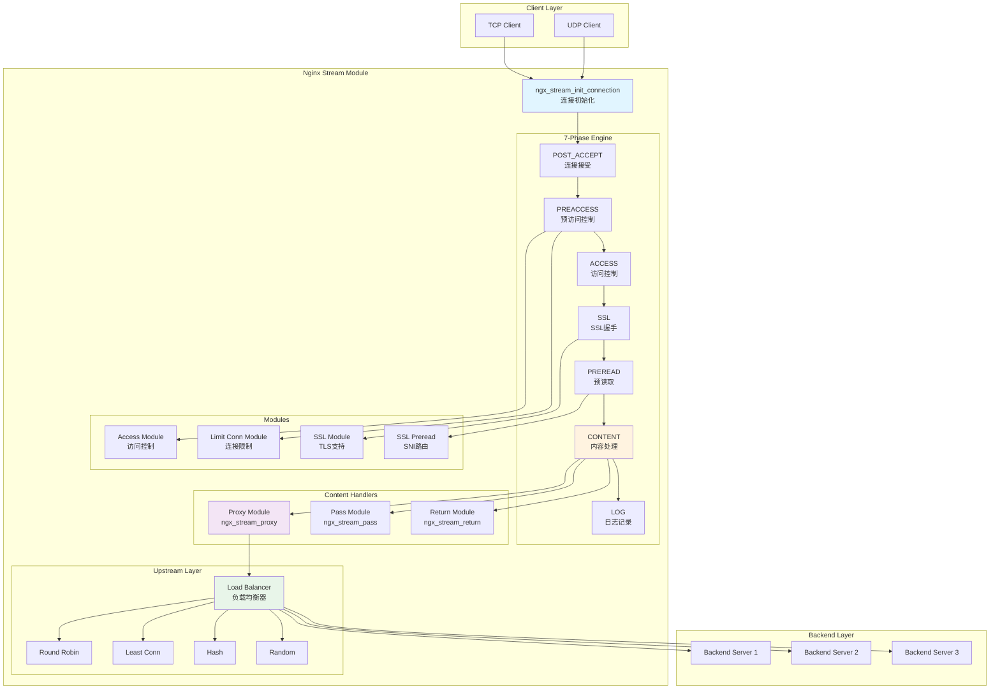
```mermaid
flowchart TB
    subgraph "Client Layer"
        C1[TCP Client]
        C2[UDP Client]
    end
    
    subgraph "Nginx Stream Module"
        direction TB
        IC[ngx_stream_init_connection<br/>连接初始化]
        
        subgraph "7-Phase Engine"
            P1[POST_ACCEPT<br/>连接接受]
            P2[PREACCESS<br/>预访问控制]
            P3[ACCESS<br/>访问控制]
            P4[SSL<br/>SSL握手]
            P5[PREREAD<br/>预读取]
            P6[CONTENT<br/>内容处理]
            P7[LOG<br/>日志记录]
            
            P1 --> P2 --> P3 --> P4 --> P5 --> P6 --> P7
        end
        
        subgraph "Content Handlers"
            PROXY[Proxy Module<br/>ngx_stream_proxy]
            PASS[Pass Module<br/>ngx_stream_pass]
            RETURN[Return Module<br/>ngx_stream_return]
        end
        
        subgraph "Upstream Layer"
            LB[Load Balancer<br/>负载均衡器]
            RR[Round Robin]
            LC[Least Conn]
            HASH[Hash]
            RAND[Random]
            
            LB --> RR & LC & HASH & RAND
        end
        
        subgraph "Modules"
            ACCESS_M[Access Module<br/>访问控制]
            LIMIT_M[Limit Conn Module<br/>连接限制]
            SSL_M[SSL Module<br/>TLS支持]
            PREREAD_M[SSL Preread<br/>SNI路由]
        end
        
        IC --> P1
        P6 --> PROXY & PASS & RETURN
        PROXY --> LB
        
        P2 --> ACCESS_M & LIMIT_M
        P4 --> SSL_M
        P5 --> PREREAD_M
    end
    
    subgraph "Backend Layer"
        direction LR
        B1[Backend Server 1]
        B2[Backend Server 2]
        B3[Backend Server 3]
    end
    
    C1 & C2 --> IC
    LB --> B1 & B2 & B3
    
    style IC fill:#e1f5ff
    style P6 fill:#fff3e0
    style PROXY fill:#f3e5f5
    style LB fill:#e8f5e9
```

### 架构说明

#### 1. 图意概述
该架构图展示了 Nginx Stream 模块的整体结构，包括 7 阶段处理流程、内容处理器、负载均衡器和各个功能模块。Stream 模块采用阶段化处理机制，类似于 HTTP 模块但更简化，专注于第四层代理。

#### 2. 关键组件
- **连接初始化器（IC）**: 接收 TCP/UDP 连接，创建会话对象，启动阶段处理
- **7 阶段引擎**:
  - POST_ACCEPT: 连接接受后的初始化处理
  - PREACCESS: 预访问检查（如 RealIP）
  - ACCESS: 访问控制（IP 白名单/黑名单）
  - SSL: SSL/TLS 握手
  - PREREAD: 预读取数据（SSL Preread、协议检测）
  - CONTENT: 内容处理（代理转发）
  - LOG: 日志记录
- **内容处理器**:
  - Proxy: TCP/UDP 代理（最常用）
  - Pass: 直接传递到指定地址
  - Return: 返回固定内容
- **负载均衡器**: 实现多种负载均衡算法
- **功能模块**: 访问控制、连接限制、SSL、SSL Preread 等

#### 3. 边界与约束
- **并发连接数**: 每个连接需要两个 fd（客户端 + 后端），实际并发 = worker_connections / 2
- **超时控制**:
  - 连接超时（`proxy_connect_timeout`）
  - 读写超时（`proxy_timeout`）
  - 空闲超时（影响长连接）
- **协议限制**:
  - TCP: 支持所有 TCP 协议
  - UDP: 支持无连接的 UDP 协议，每个数据报独立处理
- **缓冲区**:
  - 上下行缓冲区大小（`proxy_buffer_size`）
  - 内存占用 = 连接数 × 缓冲区大小 × 2（双向）

#### 4. 异常与回退
- **后端连接失败**:
  - 尝试下一个后端服务器（`proxy_next_upstream`）
  - 达到重试上限后返回错误
- **后端超时**:
  - 连接超时: 切换到下一个后端
  - 读写超时: 关闭连接，记录日志
- **SSL 错误**:
  - 握手失败: 关闭连接
  - 证书验证失败: 根据配置决定是否继续
- **健康检查**:
  - 被动: 连接/读写失败后标记后端为 down
  - 主动: 定期发送健康检查请求（商业版）
- **资源耗尽**:
  - 连接数达到上限: 拒绝新连接
  - 内存不足: 释放空闲连接

#### 5. 性能要点
- **零拷贝**: 使用 `sendfile`/`splice` 进行数据转发（Linux）
- **异步非阻塞**: 所有 I/O 操作异步处理
- **内存池**: 会话对象使用内存池，减少碎片
- **连接复用**:
  - 客户端: Keep-Alive（TCP）
  - 后端: Upstream Keepalive（需配置）
- **批量读写**: 单次系统调用处理更多数据
- **CPU 亲和性**: Worker 进程绑定 CPU 核心

#### 6. 版本兼容与演进
- **协议支持**:
  - TCP: 完整支持
  - UDP: 1.9.13+ 版本支持
  - PROXY Protocol: 支持 v1 和 v2
- **负载均衡**:
  - 基础算法: Round Robin, Hash
  - 高级算法: Least Conn, Random（1.15.1+）
- **SSL/TLS**:
  - TLS 1.0 ~ TLS 1.3
  - SNI 支持（SSL Preread）
- **配置兼容**:
  - 向后兼容旧版本配置
  - 新增指令不影响已有配置

## 核心数据结构

### ngx_stream_session_t - 会话对象

```c
struct ngx_stream_session_s {
    uint32_t                       signature;         // "STRM" 魔数
    
    ngx_connection_t              *connection;        // 客户端连接
    
    off_t                          received;          // 接收字节数
    time_t                         start_sec;         // 会话开始时间（秒）
    ngx_msec_t                     start_msec;        // 会话开始时间（毫秒）
    
    void                         **ctx;               // 模块上下文数组
    void                         **main_conf;         // main 配置指针
    void                         **srv_conf;          // srv 配置指针
    
    ngx_stream_upstream_t         *upstream;          // Upstream 对象
    ngx_array_t                   *upstream_states;   // Upstream 状态数组
    
    ngx_stream_variable_value_t   *variables;         // 变量数组
    
    ngx_int_t                      phase_handler;     // 当前阶段处理器索引
    ngx_uint_t                     status;            // 会话状态码
    
    unsigned                       ssl:1;             // 是否使用 SSL
    unsigned                       stat_processing:1; // 是否正在处理
    unsigned                       health_check:1;    // 是否健康检查
    unsigned                       limit_conn_status:2; // 连接限制状态
};
```

### ngx_stream_phase_handler_t - 阶段处理器

```c
struct ngx_stream_phase_handler_s {
    ngx_stream_phase_handler_pt    checker;     // 阶段检查器函数
    ngx_stream_handler_pt          handler;     // 具体处理器函数
    ngx_uint_t                     next;        // 下一个阶段索引
};
```

### ngx_stream_upstream_t - Upstream 对象

```c
typedef struct {
    ngx_peer_connection_t          peer;              // Peer 连接
    
    ngx_buf_t                     *downstream_buf;    // 下行缓冲区
    ngx_buf_t                     *upstream_buf;      // 上行缓冲区
    
    off_t                          received;          // 从后端接收字节数
    time_t                         start_sec;         // Upstream 开始时间
    ngx_msec_t                     start_msec;
    
    ngx_uint_t                     responses;         // 响应次数
    ngx_uint_t                     connect_timeout;   // 连接超时
    ngx_uint_t                     timeout;           // 读写超时
    
    ngx_stream_upstream_srv_conf_t  *upstream;       // Upstream 配置
    
    unsigned                       connected:1;       // 是否已连接
    unsigned                       proxy_protocol:1;  // 是否使用 PROXY Protocol
} ngx_stream_upstream_t;
```

## 7 阶段处理流程

### 阶段概览

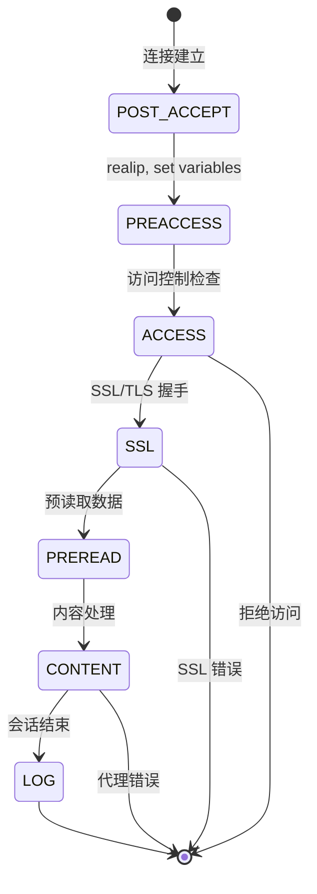
```mermaid
stateDiagram-v2
    [*] --> POST_ACCEPT: 连接建立
    POST_ACCEPT --> PREACCESS: realip, set variables
    PREACCESS --> ACCESS: 访问控制检查
    ACCESS --> SSL: SSL/TLS 握手
    SSL --> PREREAD: 预读取数据
    PREREAD --> CONTENT: 内容处理
    CONTENT --> LOG: 会话结束
    LOG --> [*]
    
    ACCESS --> [*]: 拒绝访问
    SSL --> [*]: SSL 错误
    CONTENT --> [*]: 代理错误
```

### 阶段详细说明

#### 1. POST_ACCEPT Phase
**目的**: 连接接受后的初始化处理

**典型处理器**:

- `ngx_stream_realip_module`: 从 PROXY Protocol 或自定义头提取真实客户端 IP
- `ngx_stream_set_module`: 设置变量

**执行时机**: 连接建立后立即执行

#### 2. PREACCESS Phase
**目的**: 预访问控制，准备访问控制所需的数据

**典型处理器**:

- `ngx_stream_limit_conn_module`: 统计连接数（准备阶段）
- `ngx_stream_geo_module`: 根据 IP 设置变量
- `ngx_stream_geoip_module`: 根据 IP 查询地理位置

**执行时机**: 访问控制之前

#### 3. ACCESS Phase
**目的**: 访问控制，决定是否允许连接

**典型处理器**:

- `ngx_stream_access_module`: IP 白名单/黑名单
- `ngx_stream_limit_conn_module`: 连接数限制

**执行时机**: SSL 握手之前

**结果**: `NGX_OK` 继续, `NGX_DECLINED` 拒绝

#### 4. SSL Phase
**目的**: 执行 SSL/TLS 握手

**典型处理器**:

- `ngx_stream_ssl_module`: SSL 握手、证书验证

**执行时机**: 需要 SSL 时执行

**特点**: 异步处理，握手期间会挂起会话

#### 5. PREREAD Phase
**目的**: 预读取数据，用于协议检测或 SNI 路由

**典型处理器**:

- `ngx_stream_ssl_preread_module`: 读取 ClientHello，提取 SNI
- 自定义协议检测模块

**执行时机**: SSL 握手之后（或不使用 SSL 时）

**特点**: 非阻塞读取，读取的数据会缓存供后续使用

#### 6. CONTENT Phase
**目的**: 内容处理，通常是代理转发

**典型处理器**:

- `ngx_stream_proxy_module`: TCP/UDP 代理
- `ngx_stream_pass_module`: 直接传递
- `ngx_stream_return_module`: 返回固定内容

**执行时机**: 所有前置检查通过后

**特点**:

- 只能有一个 Content Handler
- 负责整个会话的数据转发
- 会话大部分时间在此阶段

#### 7. LOG Phase
**目的**: 记录访问日志

**典型处理器**:

- `ngx_stream_log_module`: 写入访问日志

**执行时机**: 会话结束时

**特点**: 不能拒绝请求，只记录

## 负载均衡算法

### Round Robin（轮询）

```c
// ngx_stream_upstream_round_robin.c
ngx_int_t ngx_stream_upstream_get_round_robin_peer(ngx_peer_connection_t *pc,
    void *data) {
    
    rrp = data;
    peers = rrp->peers;
    
    // 遍历所有后端服务器
    for (i = 0; i < peers->number; i++) {
        peer = &peers->peer[rrp->current];
        
        // 检查服务器是否可用
        if (!peer->down && peer->max_fails == 0
            || peer->fails < peer->max_fails) {
            // 选择此服务器
            pc->sockaddr = peer->sockaddr;
            pc->socklen = peer->socklen;
            pc->name = &peer->name;
            
            rrp->current = (rrp->current + 1) % peers->number;
            return NGX_OK;
        }
        
        rrp->current = (rrp->current + 1) % peers->number;
    }
    
    return NGX_BUSY;  // 所有服务器不可用
}
```

### Least Connections（最少连接）

```c
// ngx_stream_upstream_least_conn_module.c
ngx_int_t ngx_stream_upstream_get_least_conn_peer(ngx_peer_connection_t *pc,
    void *data) {
    
    best = NULL;
    best_conns = 0;
    
    // 找到连接数最少的服务器
    for (i = 0; i < peers->number; i++) {
        peer = &peers->peer[i];
        
        if (peer->down || peer->fails >= peer->max_fails) {
            continue;
        }
        
        // 计算有效连接数（考虑权重）
        conns = peer->conns * peers->total_weight / peer->weight;
        
        if (best == NULL || conns < best_conns) {
            best = peer;
            best_conns = conns;
        }
    }
    
    if (best) {
        pc->sockaddr = best->sockaddr;
        pc->socklen = best->socklen;
        pc->name = &best->name;
        best->conns++;  // 增加连接计数
        return NGX_OK;
    }
    
    return NGX_BUSY;
}
```

### Hash（一致性哈希）

```c
// ngx_stream_upstream_hash_module.c
ngx_int_t ngx_stream_upstream_get_hash_peer(ngx_peer_connection_t *pc,
    void *data) {
    
    // 计算哈希值（基于变量，如 $remote_addr, $server_name）
    hash = ngx_crc32_short(key.data, key.len);
    
    // 一致性哈希环查找
    for (i = 0; i < 20 * peers->number; i++) {
        h = hash + i * 0x9e3779b9;  // Golden ratio
        
        server = h % peers->number;
        peer = &peers->peer[server];
        
        if (!peer->down && peer->fails < peer->max_fails) {
            pc->sockaddr = peer->sockaddr;
            pc->socklen = peer->socklen;
            pc->name = &peer->name;
            return NGX_OK;
        }
    }
    
    return NGX_BUSY;
}
```

## 配置示例

### 基础 TCP 代理

```nginx
stream {
    upstream backend {
        server 192.168.1.10:3306;
        server 192.168.1.11:3306;
        server 192.168.1.12:3306;
    }
    
    server {
        listen 3306;
        proxy_pass backend;
        proxy_connect_timeout 1s;
        proxy_timeout 3s;
    }
}
```

### UDP 代理（DNS）

```nginx
stream {
    upstream dns_servers {
        server 8.8.8.8:53;
        server 8.8.4.4:53;
    }
    
    server {
        listen 53 udp;
        proxy_pass dns_servers;
        proxy_responses 1;  # UDP 响应数量
        proxy_timeout 1s;
    }
}
```

### 负载均衡配置

```nginx
stream {
    upstream backend {
        # 轮询（默认）
        # Round Robin
        
        # 最少连接
        least_conn;
        
        # 哈希（根据客户端 IP）
        # hash $remote_addr consistent;
        
        # 随机
        # random;
        
        server 192.168.1.10:6379 weight=3 max_fails=2 fail_timeout=10s;
        server 192.168.1.11:6379 weight=2;
        server 192.168.1.12:6379 weight=1;
        server 192.168.1.13:6379 backup;  # 备份服务器
    }
    
    server {
        listen 6379;
        proxy_pass backend;
        proxy_next_upstream on;
        proxy_next_upstream_tries 2;
        proxy_next_upstream_timeout 2s;
    }
}
```

### SSL/TLS 配置

```nginx
stream {
    upstream secure_backend {
        server 192.168.1.10:443;
        server 192.168.1.11:443;
    }
    
    server {
        listen 443 ssl;
        
        ssl_certificate      /path/to/cert.pem;
        ssl_certificate_key  /path/to/key.pem;
        ssl_protocols        TLSv1.2 TLSv1.3;
        ssl_ciphers          HIGH:!aNULL:!MD5;
        ssl_session_cache    shared:SSL:10m;
        ssl_session_timeout  10m;
        
        # SSL Preread（根据 SNI 路由）
        ssl_preread on;
        proxy_pass $ssl_preread_server_name;
        
        # 或固定后端
        # proxy_pass secure_backend;
    }
}
```

### SSL Preread + 动态路由

```nginx
stream {
    map $ssl_preread_server_name $backend {
        example.com      backend_example;
        test.com         backend_test;
        default          backend_default;
    }
    
    upstream backend_example {
        server 192.168.1.10:443;
    }
    
    upstream backend_test {
        server 192.168.1.20:443;
    }
    
    upstream backend_default {
        server 192.168.1.30:443;
    }
    
    server {
        listen 443;
        ssl_preread on;
        proxy_pass $backend;
    }
}
```

### 访问控制

```nginx
stream {
    # 定义地理位置变量
    geo $deny {
        default         0;
        192.168.1.0/24  1;
        10.0.0.0/8      1;
    }
    
    upstream backend {
        server 192.168.1.10:8080;
    }
    
    server {
        listen 8080;
        
        # IP 访问控制
        allow 192.168.1.0/24;
        allow 10.0.0.0/8;
        deny  all;
        
        # 连接数限制
        # limit_conn addr 10;
        
        proxy_pass backend;
    }
}
```

### 完整示例（Redis 代理）

```nginx
stream {
    log_format proxy '$remote_addr [$time_local] '
                     '$protocol $status $bytes_sent $bytes_received '
                     '$session_time "$upstream_addr" '
                     '"$upstream_bytes_sent" "$upstream_bytes_received" "$upstream_connect_time"';
    
    access_log /var/log/nginx/stream_access.log proxy;
    error_log /var/log/nginx/stream_error.log info;
    
    upstream redis_cluster {
        hash $remote_addr consistent;
        
        server 192.168.1.10:6379 weight=3 max_fails=2 fail_timeout=30s;
        server 192.168.1.11:6379 weight=2 max_fails=2 fail_timeout=30s;
        server 192.168.1.12:6379 weight=1 max_fails=2 fail_timeout=30s;
        server 192.168.1.13:6379 backup;
    }
    
    server {
        listen 6379;
        proxy_pass redis_cluster;
        
        proxy_connect_timeout 3s;
        proxy_timeout 10s;
        proxy_next_upstream on;
        proxy_next_upstream_tries 3;
        proxy_next_upstream_timeout 10s;
        
        proxy_buffer_size 16k;
        
        # 日志
        access_log /var/log/nginx/redis_access.log proxy;
    }
}
```

## 最佳实践

### 1. 性能优化

```nginx
# 在 main 块配置
worker_processes auto;
worker_cpu_affinity auto;
worker_rlimit_nofile 65535;

events {
    use epoll;
    worker_connections 10240;  # Stream 需要两倍连接（客户端+后端）
    multi_accept on;
}

stream {
    # 缓冲区优化
    proxy_buffer_size 16k;
    
    # 超时优化
    proxy_connect_timeout 3s;
    proxy_timeout 1h;  # 长连接场景
    
    # Upstream 连接复用（商业版）
    # proxy_socket_keepalive on;
}
```

### 2. 监控指标

```nginx
# 启用 stub_status (HTTP 块)
http {
    server {
        listen 8080;
        location /status {
            stub_status;
            allow 127.0.0.1;
            deny all;
        }
    }
}

# 监控指标
# - Active connections: 当前活跃连接数
# - Reading/Writing: 正在读取/写入的连接数
# - Upstream 状态: 后端服务器健康状况
# - 字节数统计: 上下行流量
```

### 3. 故障排查

```bash
# 查看 Stream 连接状态
ss -tnp | grep nginx

# 查看 Upstream 连接
netstat -an | grep ESTABLISHED | grep :6379

# 实时日志
tail -f /var/log/nginx/stream_access.log

# 测试配置
nginx -t

# 重载配置
nginx -s reload
```

### 4. 安全加固

```nginx
stream {
    # 限制连接数
    limit_conn_zone $binary_remote_addr zone=addr:10m;
    
    server {
        listen 3306;
        
        # IP 白名单
        allow 192.168.1.0/24;
        deny  all;
        
        # 连接数限制
        limit_conn addr 10;
        
        # SSL 配置（如需要）
        ssl_protocols TLSv1.2 TLSv1.3;
        ssl_prefer_server_ciphers on;
        
        proxy_pass backend;
    }
}
```

## 总结

Stream 模块为 Nginx 提供了强大的第四层（TCP/UDP）代理能力，配合灵活的负载均衡算法和丰富的功能模块，可以代理几乎任何 TCP/UDP 协议的服务。7 阶段处理流程提供了清晰的扩展点，使得开发自定义模块变得容易。

### 关键特性
- TCP/UDP 协议无关代理
- 多种负载均衡算法
- 7 阶段处理流程
- SSL/TLS 支持（包括 SSL Preread）
- 变量系统
- 访问控制和连接限制
- 高性能、低延迟

### 适用场景
- 数据库负载均衡（MySQL, PostgreSQL, Redis, MongoDB）
- 消息队列代理（Kafka, RabbitMQ）
- 缓存代理（Redis, Memcached）
- 游戏服务器负载均衡
- IoT 设备连接代理
- DNS 负载均衡
- 任意 TCP/UDP 协议代理

---

## API接口

本文档详细说明 Stream 模块的核心 API，包括连接初始化、会话处理、阶段处理和代理转发等关键功能。

---

## 1. 连接初始化 API

### 1.1 ngx_stream_init_connection

**函数签名**

```c
void ngx_stream_init_connection(ngx_connection_t *c);
```

**功能说明**

初始化 Stream 连接，创建会话对象并启动阶段处理流程。该函数在 Event 模块接受连接后被调用，是 Stream 模块处理的入口点。

**参数说明**

| 参数 | 类型 | 说明 |
|------|------|------|
| c | `ngx_connection_t *` | 客户端连接对象 |

**核心代码**

```c
void ngx_stream_init_connection(ngx_connection_t *c) {
    // 1) 查找服务器配置（根据监听地址和端口）
    port = c->listening->servers;
    
    // 多地址情况下需要获取本地地址
    if (port->naddrs > 1) {
        ngx_connection_local_sockaddr(c, NULL, 0);
        // 根据本地地址查找对应配置
        sa = c->local_sockaddr;
        // ... 查找 addr_conf
    } else {
        // 单地址直接使用第一个配置
        addr_conf = &addr[0].conf;
    }
    
    // 2) 创建会话对象
    s = ngx_pcalloc(c->pool, sizeof(ngx_stream_session_t));
    s->signature = NGX_STREAM_MODULE;  // "STRM"
    s->connection = c;
    c->data = s;
    
    // 3) 关联配置上下文
    ctx = addr_conf->default_server->ctx;
    s->main_conf = ctx->main_conf;
    s->srv_conf = ctx->srv_conf;
    
    // 4) 创建模块上下文数组
    s->ctx = ngx_pcalloc(c->pool, sizeof(void *) * ngx_stream_max_module);
    
    // 5) 初始化变量数组
    cmcf = ngx_stream_get_module_main_conf(s, ngx_stream_core_module);
    s->variables = ngx_pcalloc(c->pool, cmcf->variables.nelts

                               * sizeof(ngx_stream_variable_value_t));
    
    // 6) 记录会话开始时间
    tp = ngx_timeofday();
    s->start_sec = tp->sec;
    s->start_msec = tp->msec;
    
    // 7) 设置读事件处理器
    rev = c->read;
    rev->handler = ngx_stream_session_handler;
    
    // 8) 处理 PROXY Protocol（如果启用）
    if (addr_conf->proxy_protocol) {
        rev->handler = ngx_stream_proxy_protocol_handler;
        ngx_add_timer(rev, cscf->proxy_protocol_timeout);
        return;
    }
    
    // 9) 启动阶段处理
    ngx_stream_session_handler(rev);

}
```

**调用链**

```
ngx_event_accept
  └─> ngx_listening_t->handler  // = ngx_stream_init_connection
        └─> ngx_stream_session_handler
              └─> ngx_stream_core_run_phases
```

**时序图**

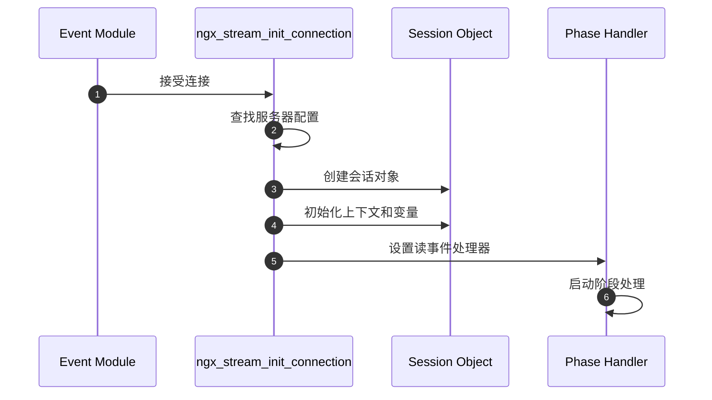
```mermaid
sequenceDiagram
    autonumber
    participant E as Event Module
    participant SI as ngx_stream_init_connection
    participant S as Session Object
    participant PH as Phase Handler
    
    E->>SI: 接受连接
    SI->>SI: 查找服务器配置
    SI->>S: 创建会话对象
    SI->>S: 初始化上下文和变量
    SI->>PH: 设置读事件处理器
    PH->>PH: 启动阶段处理
```

---

## 2. 会话处理 API

### 2.1 ngx_stream_session_handler

**函数签名**

```c
void ngx_stream_session_handler(ngx_event_t *rev);
```

**功能说明**

会话处理器，启动阶段处理流程。该函数设置为读事件的处理器，在连接初始化后首次被调用。

**参数说明**

| 参数 | 类型 | 说明 |
|------|------|------|
| rev | `ngx_event_t *` | 读事件对象 |

**核心代码**

```c
void ngx_stream_session_handler(ngx_event_t *rev) {
    c = rev->data;
    s = c->data;
    
    // 处理超时
    if (rev->timedout) {
        ngx_connection_error(c, NGX_ETIMEDOUT, "client timed out");
        ngx_stream_finalize_session(s, NGX_STREAM_OK);
        return;
    }
    
    // 启动阶段处理流程
    ngx_stream_core_run_phases(s);
}
```

### 2.2 ngx_stream_finalize_session

**函数签名**

```c
void ngx_stream_finalize_session(ngx_stream_session_t *s, ngx_uint_t rc);
```

**功能说明**

结束会话，执行 LOG 阶段，关闭连接，释放资源。

**参数说明**

| 参数 | 类型 | 说明 |
|------|------|------|
| s | `ngx_stream_session_t *` | 会话对象 |
| rc | `ngx_uint_t` | 状态码（NGX_STREAM_OK 等） |

**核心代码**

```c
void ngx_stream_finalize_session(ngx_stream_session_t *s, ngx_uint_t rc) {
    c = s->connection;
    
    ngx_log_debug2(NGX_LOG_DEBUG_STREAM, c->log, 0,
                   "finalize stream session: %ui, c:%ui", rc, c->fd);
    
    // 设置状态码
    s->status = rc;
    
    // 已经在 LOG 阶段，直接关闭
    if (s->stat_processing || c->destroyed) {
        ngx_stream_close_connection(c);
        return;
    }
    
    // 执行 LOG 阶段
    s->stat_processing = 1;
    
    cmcf = ngx_stream_get_module_main_conf(s, ngx_stream_core_module);
    s->phase_handler = cmcf->phase_engine.log_phase_handler;
    
    ngx_stream_core_run_phases(s);
    
    // 关闭连接
    ngx_stream_close_connection(c);
}
```

---

## 3. 阶段处理 API

### 3.1 ngx_stream_core_run_phases

**函数签名**

```c
void ngx_stream_core_run_phases(ngx_stream_session_t *s);
```

**功能说明**

执行阶段处理流程，遍历阶段处理器数组，依次调用各阶段的检查器和处理器。

**核心代码**

```c
void ngx_stream_core_run_phases(ngx_stream_session_t *s) {
    cmcf = ngx_stream_get_module_main_conf(s, ngx_stream_core_module);
    ph = cmcf->phase_engine.handlers;
    
    // 遍历阶段处理器
    while (ph[s->phase_handler].checker) {
        
        // 调用阶段检查器
        rc = ph[s->phase_handler].checker(s, &ph[s->phase_handler]);
        
        if (rc == NGX_OK) {
            // 阶段处理完成，返回等待事件
            return;
        }
        
        // rc == NGX_DECLINED: 继续下一阶段
        // rc == NGX_AGAIN: 当前阶段需要更多数据
        // rc == NGX_ERROR/其他: 错误，结束会话
    }
}
```

### 3.2 ngx_stream_core_generic_phase

**函数签名**

```c
ngx_int_t ngx_stream_core_generic_phase(ngx_stream_session_t *s,
    ngx_stream_phase_handler_t *ph);
```

**功能说明**

通用阶段检查器，用于 POST_ACCEPT, PREACCESS, ACCESS 阶段。

**核心代码**

```c
ngx_int_t ngx_stream_core_generic_phase(ngx_stream_session_t *s,
    ngx_stream_phase_handler_t *ph) {
    
    // 调用具体的阶段处理器
    rc = ph->handler(s);
    
    if (rc == NGX_OK) {
        // 处理成功，进入下一阶段
        s->phase_handler = ph->next;
        return NGX_AGAIN;
    }
    
    if (rc == NGX_DECLINED) {
        // 跳过当前处理器，尝试下一个
        s->phase_handler++;
        return NGX_AGAIN;
    }
    
    if (rc == NGX_AGAIN || rc == NGX_DONE) {
        // 需要等待（如异步操作）
        return NGX_OK;
    }
    
    // 错误，结束会话
    ngx_stream_finalize_session(s, NGX_STREAM_INTERNAL_SERVER_ERROR);
    return NGX_OK;
}
```

### 3.3 ngx_stream_core_preread_phase

**函数签名**

```c
ngx_int_t ngx_stream_core_preread_phase(ngx_stream_session_t *s,
    ngx_stream_phase_handler_t *ph);
```

**功能说明**

PREREAD 阶段检查器，处理预读取逻辑（如 SSL Preread）。

**核心代码**

```c
ngx_int_t ngx_stream_core_preread_phase(ngx_stream_session_t *s,
    ngx_stream_phase_handler_t *ph) {
    
    c = s->connection;
    c->log->action = "prereading client data";
    
    // 调用 PREREAD 处理器
    rc = ph->handler(s);
    
    if (rc == NGX_AGAIN) {
        // 需要等待更多数据
        if (ngx_handle_read_event(c->read, 0) != NGX_OK) {
            ngx_stream_finalize_session(s, NGX_STREAM_INTERNAL_SERVER_ERROR);
            return NGX_OK;
        }
        
        return NGX_OK;  // 暂停阶段处理
    }
    
    if (rc == NGX_OK) {
        // 预读取成功，继续下一阶段
        s->phase_handler = ph->next;
        return NGX_AGAIN;
    }
    
    // 错误处理
    ngx_stream_finalize_session(s, NGX_STREAM_INTERNAL_SERVER_ERROR);
    return NGX_OK;
}
```

### 3.4 ngx_stream_core_content_phase

**函数签名**

```c
ngx_int_t ngx_stream_core_content_phase(ngx_stream_session_t *s,
    ngx_stream_phase_handler_t *ph);
```

**功能说明**

CONTENT 阶段检查器，执行内容处理（通常是代理转发）。

**核心代码**

```c
ngx_int_t ngx_stream_core_content_phase(ngx_stream_session_t *s,
    ngx_stream_phase_handler_t *ph) {
    
    c = s->connection;
    c->log->action = NULL;
    
    cscf = ngx_stream_get_module_srv_conf(s, ngx_stream_core_module);
    
    if (cscf->handler) {
        // 调用内容处理器（如 proxy_pass）
        cscf->handler(s);
        return NGX_OK;
    }
    
    // 没有配置内容处理器
    ngx_log_error(NGX_LOG_ERR, c->log, 0,
                  "no \"proxy_pass\" is defined for the server in %s:%ui",
                  cscf->file_name, cscf->line);
    
    ngx_stream_finalize_session(s, NGX_STREAM_INTERNAL_SERVER_ERROR);
    return NGX_OK;
}
```

---

## 4. 代理模块 API

### 4.1 ngx_stream_proxy_handler

**函数签名**

```c
static void ngx_stream_proxy_handler(ngx_stream_session_t *s);
```

**功能说明**

代理模块的入口函数，作为 CONTENT 阶段的处理器，初始化代理连接。

**核心代码**

```c
static void ngx_stream_proxy_handler(ngx_stream_session_t *s) {
    // 1) 创建 Upstream 对象
    u = ngx_pcalloc(c->pool, sizeof(ngx_stream_upstream_t));
    s->upstream = u;
    
    u->peer.log = c->log;
    u->peer.log_error = NGX_ERROR_ERR;
    
    // 2) 获取配置
    pscf = ngx_stream_get_module_srv_conf(s, ngx_stream_proxy_module);
    
    // 3) 初始化缓冲区
    u->downstream_buf = ngx_pcalloc(c->pool, sizeof(ngx_buf_t) + pscf->buffer_size);
    u->downstream_buf->start = (u_char *) u->downstream_buf + sizeof(ngx_buf_t);
    u->downstream_buf->end = u->downstream_buf->start + pscf->buffer_size;
    u->downstream_buf->pos = u->downstream_buf->start;
    u->downstream_buf->last = u->downstream_buf->start;
    
    u->upstream_buf = ngx_pcalloc(c->pool, sizeof(ngx_buf_t) + pscf->buffer_size);
    // ... 类似初始化
    
    // 4) 初始化 Upstream
    ngx_stream_proxy_init_upstream(s);
}
```

### 4.2 ngx_stream_proxy_init_upstream

**函数签名**

```c
static void ngx_stream_proxy_init_upstream(ngx_stream_session_t *s);
```

**功能说明**

初始化 Upstream 连接，选择后端服务器并发起连接。

**核心代码**

```c
static void ngx_stream_proxy_init_upstream(ngx_stream_session_t *s) {
    u = s->upstream;
    pscf = ngx_stream_get_module_srv_conf(s, ngx_stream_proxy_module);
    us = pscf->upstream;
    
    // 初始化 Peer（选择后端服务器）
    if (us) {
        // 使用 Upstream 配置
        rc = ngx_stream_upstream_init_round_robin_peer(s, us);
        
        if (rc != NGX_OK) {
            ngx_stream_finalize_session(s, NGX_STREAM_INTERNAL_SERVER_ERROR);
            return;
        }
    } else {
        // 直接指定后端地址
        // ... 解析地址
    }
    
    u->start_sec = ngx_time();
    
    // 连接后端服务器
    ngx_stream_proxy_connect(s);
}
```

### 4.3 ngx_stream_proxy_connect

**函数签名**

```c
static void ngx_stream_proxy_connect(ngx_stream_session_t *s);
```

**功能说明**

连接后端服务器，设置事件处理器。

**核心代码**

```c
static void ngx_stream_proxy_connect(ngx_stream_session_t *s) {
    u = s->upstream;
    c = s->connection;
    
    // 发起连接
    rc = ngx_event_connect_peer(&u->peer);
    
    if (rc == NGX_ERROR) {
        ngx_stream_proxy_finalize(s, NGX_STREAM_INTERNAL_SERVER_ERROR);
        return;
    }
    
    if (rc == NGX_BUSY || rc == NGX_DECLINED) {
        // 后端不可用，尝试下一个
        ngx_stream_proxy_next_upstream(s);
        return;
    }
    
    // 连接成功或进行中
    pc = u->peer.connection;
    pc->data = s;
    pc->log = c->log;
    
    // 设置事件处理器
    pc->read->handler = ngx_stream_proxy_upstream_handler;
    pc->write->handler = ngx_stream_proxy_upstream_handler;
    
    c->read->handler = ngx_stream_proxy_downstream_handler;
    c->write->handler = ngx_stream_proxy_downstream_handler;
    
    if (rc != NGX_AGAIN) {
        // 连接已完成（Unix域套接字）
        ngx_stream_proxy_init(s);
        return;
    }
    
    // 连接进行中，设置连接处理器
    pc->write->handler = ngx_stream_proxy_connect_handler;
    
    // 添加连接超时定时器
    ngx_add_timer(pc->write, pscf->connect_timeout);
}
```

### 4.4 ngx_stream_proxy_process

**函数签名**

```c
static void ngx_stream_proxy_process(ngx_stream_session_t *s,
    ngx_uint_t from_upstream, ngx_uint_t do_write);
```

**功能说明**

处理数据转发，实现客户端和后端之间的双向数据流转发。

**参数说明**

| 参数 | 类型 | 说明 |
|------|------|------|
| s | `ngx_stream_session_t *` | 会话对象 |
| from_upstream | `ngx_uint_t` | 1=后端→客户端, 0=客户端→后端 |
| do_write | `ngx_uint_t` | 是否立即写入数据 |

**核心代码**

```c
static void ngx_stream_proxy_process(ngx_stream_session_t *s,
    ngx_uint_t from_upstream, ngx_uint_t do_write) {
    
    c = s->connection;
    u = s->upstream;
    
    // 确定源和目标连接
    if (from_upstream) {
        src = u->peer.connection;
        dst = c;
        b = &u->upstream_buf;
    } else {
        src = c;
        dst = u->peer.connection;
        b = &u->downstream_buf;
    }
    
    // 读取数据
    while (1) {
        // 缓冲区已满，需要先写出
        if (b->last == b->end && do_write) {
            n = dst->send(dst, b->pos, b->last - b->pos);
            
            if (n == NGX_ERROR) {
                ngx_stream_proxy_finalize(s, NGX_STREAM_OK);
                return;
            }
            
            if (n == NGX_AGAIN) {
                // 目标连接写阻塞，等待可写
                return;
            }
            
            b->pos += n;
            
            if (b->pos == b->last) {
                // 缓冲区已清空
                b->pos = b->start;
                b->last = b->start;
            }
        }
        
        // 读取数据
        size = b->end - b->last;
        
        if (size == 0) {
            // 缓冲区已满，等待写出
            return;
        }
        
        n = src->recv(src, b->last, size);
        
        if (n == NGX_AGAIN) {
            // 源连接读阻塞，等待数据
            return;
        }
        
        if (n == NGX_ERROR || n == 0) {
            // 连接关闭或错误
            ngx_stream_proxy_finalize(s, NGX_STREAM_OK);
            return;
        }
        
        // 累加接收字节数
        if (from_upstream) {
            u->received += n;
        } else {
            s->received += n;
        }
        
        b->last += n;
        
        // 立即写出
        if (do_write && b->pos < b->last) {
            // ... 写入数据
        }
    }
}
```

### 4.5 ngx_stream_proxy_next_upstream

**函数签名**

```c
static void ngx_stream_proxy_next_upstream(ngx_stream_session_t *s);
```

**功能说明**

切换到下一个后端服务器，实现故障转移。

**核心代码**

```c
static void ngx_stream_proxy_next_upstream(ngx_stream_session_t *s) {
    u = s->upstream;
    pc = u->peer.connection;
    pscf = ngx_stream_get_module_srv_conf(s, ngx_stream_proxy_module);
    
    // 检查重试次数
    if (u->tries == 0 || !pscf->next_upstream) {
        // 达到重试上限或禁用重试
        ngx_stream_proxy_finalize(s, NGX_STREAM_BAD_GATEWAY);
        return;
    }
    
    // 关闭当前后端连接
    if (pc) {
        ngx_close_connection(pc);
        u->peer.connection = NULL;
    }
    
    // 重置状态
    u->tries--;
    
    // 重新连接
    ngx_stream_proxy_connect(s);
}
```

---

## 5. Upstream API

### 5.1 ngx_stream_upstream_init_round_robin_peer

**函数签名**

```c
ngx_int_t ngx_stream_upstream_init_round_robin_peer(ngx_stream_session_t *s,
    ngx_stream_upstream_srv_conf_t *us);
```

**功能说明**

初始化 Round Robin 负载均衡器，设置 Peer 选择函数。

**核心代码**

```c
ngx_int_t ngx_stream_upstream_init_round_robin_peer(ngx_stream_session_t *s,
    ngx_stream_upstream_srv_conf_t *us) {
    
    u = s->upstream;
    
    // 创建 Round Robin Peer 数据
    rrp = ngx_pcalloc(s->connection->pool,
                      sizeof(ngx_stream_upstream_rr_peer_data_t));
    
    rrp->peers = us->peer.data;
    rrp->current = ngx_random() % rrp->peers->number;  // 随机起始点
    rrp->tries = rrp->peers->number;
    
    // 设置 Peer 操作函数
    u->peer.get = ngx_stream_upstream_get_round_robin_peer;
    u->peer.free = ngx_stream_upstream_free_round_robin_peer;
    u->peer.data = rrp;
    
    return NGX_OK;
}
```

### 5.2 ngx_stream_upstream_get_round_robin_peer

**函数签名**

```c
ngx_int_t ngx_stream_upstream_get_round_robin_peer(ngx_peer_connection_t *pc,
    void *data);
```

**功能说明**

Round Robin 算法选择后端服务器。

**核心代码**

```c
ngx_int_t ngx_stream_upstream_get_round_robin_peer(ngx_peer_connection_t *pc,
    void *data) {
    
    rrp = data;
    peers = rrp->peers;
    
    // 遍历所有后端服务器
    for (i = 0; i < peers->number; i++) {
        peer = &peers->peer[rrp->current];
        
        // 检查服务器是否可用
        if (!peer->down) {
            // 检查失败次数
            if (peer->max_fails == 0 || peer->fails < peer->max_fails) {
                // 选择此服务器
                pc->sockaddr = peer->sockaddr;
                pc->socklen = peer->socklen;
                pc->name = &peer->name;
                pc->cached = 0;
                
                rrp->current = (rrp->current + 1) % peers->number;
                peer->conns++;  // 增加连接计数
                
                return NGX_OK;
            }
            
            // 检查是否过了失败超时时间
            if (ngx_time() - peer->accessed > peer->fail_timeout) {
                // 重置失败计数
                peer->fails = 0;
            }
        }
        
        rrp->current = (rrp->current + 1) % peers->number;
    }
    
    // 所有服务器不可用
    return NGX_BUSY;
}
```

---

## 6. 变量 API

### 6.1 ngx_stream_get_indexed_variable

**函数签名**

```c
ngx_stream_variable_value_t *ngx_stream_get_indexed_variable(
    ngx_stream_session_t *s, ngx_uint_t index);
```

**功能说明**

获取索引变量的值。

**核心代码**

```c
ngx_stream_variable_value_t *ngx_stream_get_indexed_variable(
    ngx_stream_session_t *s, ngx_uint_t index) {
    
    v = &s->variables[index];
    
    // 变量已缓存
    if (v->not_found || v->valid) {
        return v;
    }
    
    // 调用 get_handler 获取变量值
    cmcf = ngx_stream_get_module_main_conf(s, ngx_stream_core_module);
    var = cmcf->variables.elts;
    
    if (var[index].get_handler(s, v, var[index].data) == NGX_OK) {
        v->valid = 1;
        return v;
    }
    
    v->not_found = 1;
    return v;
}
```

---

## 7. 时序图

### 7.1 完整代理流程

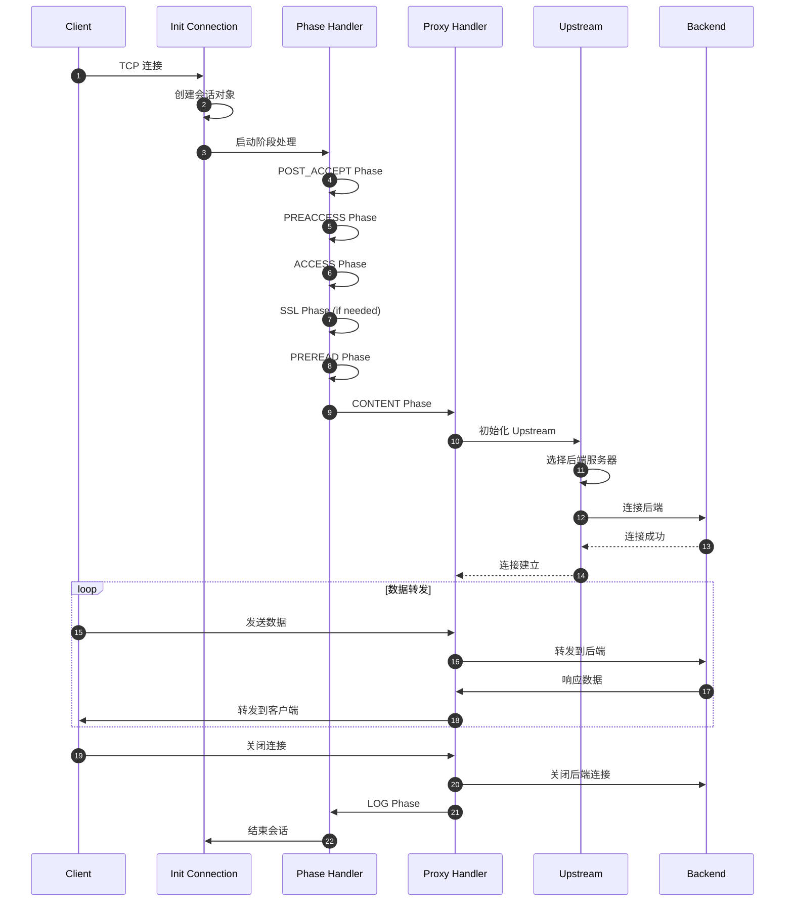
```mermaid
sequenceDiagram
    autonumber
    participant C as Client
    participant IC as Init Connection
    participant PH as Phase Handler
    participant PROXY as Proxy Handler
    participant UP as Upstream
    participant B as Backend
    
    C->>IC: TCP 连接
    IC->>IC: 创建会话对象
    IC->>PH: 启动阶段处理
    PH->>PH: POST_ACCEPT Phase
    PH->>PH: PREACCESS Phase
    PH->>PH: ACCESS Phase
    PH->>PH: SSL Phase (if needed)
    PH->>PH: PREREAD Phase
    PH->>PROXY: CONTENT Phase
    PROXY->>UP: 初始化 Upstream
    UP->>UP: 选择后端服务器
    UP->>B: 连接后端
    B-->>UP: 连接成功
    UP-->>PROXY: 连接建立
    
    loop 数据转发
        C->>PROXY: 发送数据
        PROXY->>B: 转发到后端
        B->>PROXY: 响应数据
        PROXY->>C: 转发到客户端
    end
    
    C->>PROXY: 关闭连接
    PROXY->>B: 关闭后端连接
    PROXY->>PH: LOG Phase
    PH->>IC: 结束会话
```

### 7.2 故障转移流程

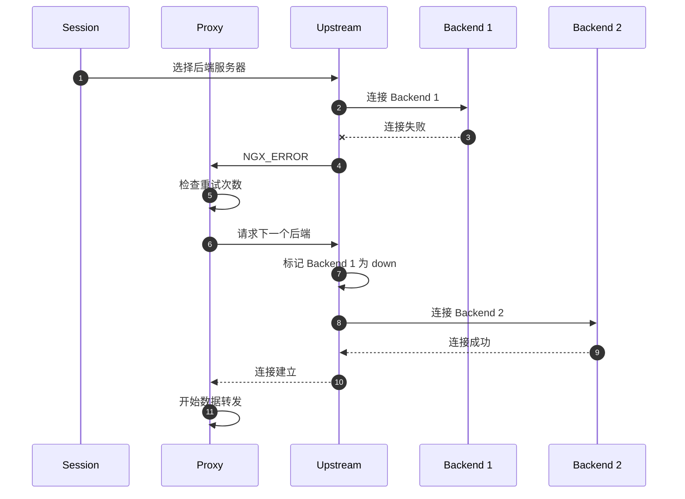
```mermaid
sequenceDiagram
    autonumber
    participant S as Session
    participant P as Proxy
    participant U as Upstream
    participant B1 as Backend 1
    participant B2 as Backend 2
    
    S->>U: 选择后端服务器
    U->>B1: 连接 Backend 1
    B1--xU: 连接失败
    U->>P: NGX_ERROR
    P->>P: 检查重试次数
    P->>U: 请求下一个后端
    U->>U: 标记 Backend 1 为 down
    U->>B2: 连接 Backend 2
    B2-->>U: 连接成功
    U-->>P: 连接建立
    P->>P: 开始数据转发
```

---

## 总结

Stream 模块的 API 设计清晰、模块化，提供了完整的 TCP/UDP 代理功能。核心 API 包括：

### 关键 API
- **连接初始化**: `ngx_stream_init_connection` - 创建会话，启动处理流程
- **阶段处理**: `ngx_stream_core_run_phases` - 7 阶段流程控制
- **代理转发**: `ngx_stream_proxy_handler`, `ngx_stream_proxy_process` - 数据转发
- **负载均衡**: `ngx_stream_upstream_get_round_robin_peer` - 后端选择
- **会话结束**: `ngx_stream_finalize_session` - 清理资源

### 设计特点
- 阶段化处理，清晰的扩展点
- 异步非阻塞 I/O
- 灵活的负载均衡算法
- 完善的错误处理和故障转移
- 高效的数据转发机制

---

## 数据结构

本文档详细说明 Stream 模块的核心数据结构，包括会话对象、阶段处理器、Upstream 对象等。

---

## 1. 核心数据结构概览

### 1.1 UML 类图

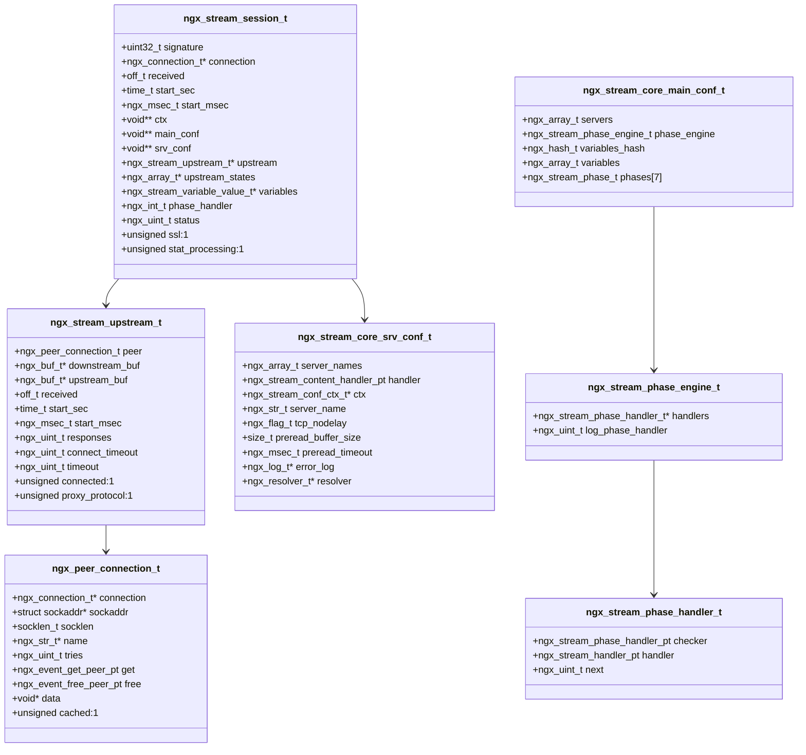
```mermaid
classDiagram
    class ngx_stream_session_t {
        +uint32_t signature
        +ngx_connection_t* connection
        +off_t received
        +time_t start_sec
        +ngx_msec_t start_msec
        +void** ctx
        +void** main_conf
        +void** srv_conf
        +ngx_stream_upstream_t* upstream
        +ngx_array_t* upstream_states
        +ngx_stream_variable_value_t* variables
        +ngx_int_t phase_handler
        +ngx_uint_t status
        +unsigned ssl:1
        +unsigned stat_processing:1
    }
    
    class ngx_stream_upstream_t {
        +ngx_peer_connection_t peer
        +ngx_buf_t* downstream_buf
        +ngx_buf_t* upstream_buf
        +off_t received
        +time_t start_sec
        +ngx_msec_t start_msec
        +ngx_uint_t responses
        +ngx_uint_t connect_timeout
        +ngx_uint_t timeout
        +unsigned connected:1
        +unsigned proxy_protocol:1
    }
    
    class ngx_stream_phase_handler_t {
        +ngx_stream_phase_handler_pt checker
        +ngx_stream_handler_pt handler
        +ngx_uint_t next
    }
    
    class ngx_stream_phase_engine_t {
        +ngx_stream_phase_handler_t* handlers
        +ngx_uint_t log_phase_handler
    }
    
    class ngx_stream_core_main_conf_t {
        +ngx_array_t servers
        +ngx_stream_phase_engine_t phase_engine
        +ngx_hash_t variables_hash
        +ngx_array_t variables
        +ngx_stream_phase_t phases[7]
    }
    
    class ngx_stream_core_srv_conf_t {
        +ngx_array_t server_names
        +ngx_stream_content_handler_pt handler
        +ngx_stream_conf_ctx_t* ctx
        +ngx_str_t server_name
        +ngx_flag_t tcp_nodelay
        +size_t preread_buffer_size
        +ngx_msec_t preread_timeout
        +ngx_log_t* error_log
        +ngx_resolver_t* resolver
    }
    
    class ngx_peer_connection_t {
        +ngx_connection_t* connection
        +struct sockaddr* sockaddr
        +socklen_t socklen
        +ngx_str_t* name
        +ngx_uint_t tries
        +ngx_event_get_peer_pt get
        +ngx_event_free_peer_pt free
        +void* data
        +unsigned cached:1
    }
    
    ngx_stream_session_t --> ngx_stream_upstream_t
    ngx_stream_session_t --> ngx_stream_core_srv_conf_t
    ngx_stream_upstream_t --> ngx_peer_connection_t
    ngx_stream_core_main_conf_t --> ngx_stream_phase_engine_t
    ngx_stream_phase_engine_t --> ngx_stream_phase_handler_t
```

---

## 2. 会话对象

### 2.1 ngx_stream_session_t

**定义**

```c
struct ngx_stream_session_s {
    uint32_t                       signature;         // "STRM" 魔数 (0x4d525453)
    
    ngx_connection_t              *connection;        // 客户端连接对象
    
    off_t                          received;          // 已接收字节数
    time_t                         start_sec;         // 会话开始时间（秒）
    ngx_msec_t                     start_msec;        // 会话开始时间（毫秒）
    
    ngx_log_handler_pt             log_handler;       // 日志处理器
    
    void                         **ctx;               // 模块上下文数组
    void                         **main_conf;         // main 配置指针
    void                         **srv_conf;          // srv 配置指针
    
    ngx_stream_virtual_names_t    *virtual_names;     // 虚拟服务器名
    
    ngx_stream_upstream_t         *upstream;          // Upstream 对象
    ngx_array_t                   *upstream_states;   // Upstream 状态数组
    
    ngx_stream_variable_value_t   *variables;         // 变量数组
    
#if (NGX_PCRE)
    ngx_uint_t                     ncaptures;         // 正则捕获数量
    int                           *captures;          // 捕获数组
    u_char                        *captures_data;     // 捕获数据
#endif
    
    ngx_int_t                      phase_handler;     // 当前阶段处理器索引
    ngx_uint_t                     status;            // 会话状态码
    
    unsigned                       ssl:1;             // 是否使用 SSL
    unsigned                       stat_processing:1; // 是否正在统计处理
    unsigned                       health_check:1;    // 是否健康检查
    unsigned                       limit_conn_status:2; // 连接限制状态
};
```

**字段说明**

| 字段 | 类型 | 说明 |
|------|------|------|
| signature | `uint32_t` | 魔数标识，值为 "STRM" (0x4d525453)，用于类型检查 |
| connection | `ngx_connection_t *` | 客户端连接对象，包含 socket fd、读写事件等 |
| received | `off_t` | 从客户端接收的字节总数，用于统计和日志 |
| start_sec/start_msec | `time_t/ngx_msec_t` | 会话开始时间，用于计算会话时长 |
| ctx | `void **` | 模块上下文数组，大小为 `ngx_stream_max_module` |
| main_conf | `void **` | 指向 main 级别配置数组 |
| srv_conf | `void **` | 指向 srv 级别配置数组 |
| upstream | `ngx_stream_upstream_t *` | Upstream 对象，代理模块使用 |
| upstream_states | `ngx_array_t *` | Upstream 状态数组，记录每次重试的状态 |
| variables | `ngx_stream_variable_value_t *` | 变量数组，存储所有变量的值 |
| phase_handler | `ngx_int_t` | 当前阶段处理器索引，用于阶段流程控制 |
| status | `ngx_uint_t` | 会话状态码（如 NGX_STREAM_OK, NGX_STREAM_BAD_GATEWAY） |
| ssl | `unsigned:1` | 是否使用 SSL/TLS 加密 |
| stat_processing | `unsigned:1` | 是否正在执行 LOG 阶段（统计处理） |
| health_check | `unsigned:1` | 是否为健康检查连接 |
| limit_conn_status | `unsigned:2` | 连接限制状态（0=未检查, 1=通过, 2=拒绝） |

**内存布局**

```
ngx_stream_session_t (约 200 字节)
├─ signature (4 字节)
├─ connection (8 字节，指针)
├─ received (8 字节)
├─ start_sec (8 字节)
├─ start_msec (8 字节)
├─ ctx (8 字节，指向数组)
│   └─> [ctx0, ctx1, ..., ctxN]  (N = ngx_stream_max_module)
├─ main_conf (8 字节，指针)
├─ srv_conf (8 字节，指针)
├─ upstream (8 字节，指针)
├─ variables (8 字节，指向数组)
│   └─> [var0, var1, ..., varM]  (M = variables.nelts)
├─ phase_handler (4 字节)
├─ status (4 字节)
└─ 位字段 (1 字节)
```

---

## 3. Upstream 对象

### 3.1 ngx_stream_upstream_t

**定义**

```c
typedef struct {
    ngx_peer_connection_t          peer;              // Peer 连接对象
    
    ngx_buf_t                     *downstream_buf;    // 下行缓冲区（客户端→后端）
    ngx_buf_t                     *upstream_buf;      // 上行缓冲区（后端→客户端）
    
    off_t                          received;          // 从后端接收的字节数
    time_t                         start_sec;         // Upstream 开始时间（秒）
    ngx_msec_t                     start_msec;        // Upstream 开始时间（毫秒）
    
    ngx_uint_t                     responses;         // 响应次数（UDP）
    ngx_uint_t                     connect_timeout;   // 连接超时
    ngx_uint_t                     timeout;           // 读写超时
    
    ngx_stream_upstream_srv_conf_t  *upstream;       // Upstream 配置
    ngx_stream_upstream_resolved_t   *resolved;      // 解析的后端地址
    
    ngx_stream_upstream_state_t    *state;           // 当前状态
    
    unsigned                       connected:1;       // 是否已连接
    unsigned                       proxy_protocol:1;  // 是否使用 PROXY Protocol
} ngx_stream_upstream_t;
```

**字段说明**

| 字段 | 类型 | 说明 |
|------|------|------|
| peer | `ngx_peer_connection_t` | Peer 连接对象，包含后端连接、地址、选择函数等 |
| downstream_buf | `ngx_buf_t *` | 下行缓冲区，存储客户端发送到后端的数据 |
| upstream_buf | `ngx_buf_t *` | 上行缓冲区，存储后端发送到客户端的数据 |
| received | `off_t` | 从后端接收的字节总数 |
| start_sec/start_msec | `time_t/ngx_msec_t` | Upstream 连接开始时间 |
| responses | `ngx_uint_t` | UDP 模式下的响应次数 |
| connect_timeout | `ngx_uint_t` | 连接超时时间（毫秒） |
| timeout | `ngx_uint_t` | 读写超时时间（毫秒） |
| upstream | `ngx_stream_upstream_srv_conf_t *` | Upstream 配置对象 |
| state | `ngx_stream_upstream_state_t *` | 当前 Upstream 状态 |
| connected | `unsigned:1` | 是否已连接到后端 |
| proxy_protocol | `unsigned:1` | 是否向后端发送 PROXY Protocol 头 |

### 3.2 ngx_peer_connection_t

**定义**

```c
typedef struct ngx_peer_connection_s {
    ngx_connection_t              *connection;        // 后端连接
    
    struct sockaddr               *sockaddr;          // 后端地址
    socklen_t                      socklen;           // 地址长度
    ngx_str_t                     *name;              // 后端名称
    
    ngx_uint_t                     tries;             // 剩余重试次数
    ngx_msec_t                     start_time;        // 连接开始时间
    
    ngx_event_get_peer_pt          get;               // 获取后端函数
    ngx_event_free_peer_pt         free;              // 释放后端函数
    ngx_event_notify_peer_pt       notify;            // 通知后端函数
    void                          *data;              // 负载均衡器数据
    
#if (NGX_SSL || NGX_COMPAT)
    ngx_event_set_peer_session_pt  set_session;      // 设置 SSL 会话
    ngx_event_save_peer_session_pt save_session;     // 保存 SSL 会话
#endif
    
    ngx_addr_t                    *local;             // 本地地址
    
    ngx_log_t                     *log;               // 日志对象
    
    unsigned                       cached:1;          // 是否使用缓存连接
    unsigned                       transparent:1;     // 是否透明代理
    unsigned                       so_keepalive:1;    // 是否启用 SO_KEEPALIVE
    unsigned                       down:1;            // 后端是否标记为 down
    
    ngx_log_handler_pt             log_error;         // 日志错误处理器
    
    NGX_COMPAT_BEGIN(2)
    NGX_COMPAT_END
} ngx_peer_connection_t;
```

---

## 4. 阶段处理器

### 4.1 ngx_stream_phase_handler_t

**定义**

```c
struct ngx_stream_phase_handler_s {
    ngx_stream_phase_handler_pt    checker;     // 阶段检查器函数
    ngx_stream_handler_pt          handler;     // 具体处理器函数
    ngx_uint_t                     next;        // 下一阶段索引
};
```

**字段说明**

| 字段 | 类型 | 说明 |
|------|------|------|
| checker | `ngx_stream_phase_handler_pt` | 阶段检查器函数指针，控制阶段流程 |
| handler | `ngx_stream_handler_pt` | 具体处理器函数指针，执行实际逻辑 |
| next | `ngx_uint_t` | 下一阶段处理器索引，用于跳转 |

**checker 函数原型**

```c
typedef ngx_int_t (*ngx_stream_phase_handler_pt)(ngx_stream_session_t *s,
    ngx_stream_phase_handler_t *ph);
```

**handler 函数原型**

```c
typedef ngx_int_t (*ngx_stream_handler_pt)(ngx_stream_session_t *s);
```

### 4.2 ngx_stream_phase_engine_t

**定义**

```c
typedef struct {
    ngx_stream_phase_handler_t    *handlers;           // 阶段处理器数组
    ngx_uint_t                     log_phase_handler;  // LOG 阶段索引
} ngx_stream_phase_engine_t;
```

**字段说明**

| 字段 | 类型 | 说明 |
|------|------|------|
| handlers | `ngx_stream_phase_handler_t *` | 阶段处理器数组，包含所有阶段的处理器 |
| log_phase_handler | `ngx_uint_t` | LOG 阶段处理器的索引，用于快速跳转到日志阶段 |

**handlers 数组示例**

```
handlers[0] = {checker: ngx_stream_core_generic_phase, handler: realip_handler, next: 1}
handlers[1] = {checker: ngx_stream_core_generic_phase, handler: set_handler, next: 2}
handlers[2] = {checker: ngx_stream_core_generic_phase, handler: limit_conn_handler, next: 3}
handlers[3] = {checker: ngx_stream_core_generic_phase, handler: access_handler, next: 4}
handlers[4] = {checker: ngx_stream_core_ssl_phase, handler: NULL, next: 5}
handlers[5] = {checker: ngx_stream_core_preread_phase, handler: ssl_preread_handler, next: 6}
handlers[6] = {checker: ngx_stream_core_content_phase, handler: NULL, next: 7}
handlers[7] = {checker: ngx_stream_log_phase, handler: log_handler, next: 0}
log_phase_handler = 7
```

### 4.3 ngx_stream_phase_t

**定义**

```c
typedef struct {
    ngx_array_t                    handlers;     // 该阶段的处理器数组
} ngx_stream_phase_t;
```

**说明**

`ngx_stream_phase_t` 用于在配置阶段收集各阶段的处理器。配置完成后，所有阶段的处理器会被扁平化到 `ngx_stream_phase_engine_t.handlers` 数组中。

---

## 5. 配置结构

### 5.1 ngx_stream_core_main_conf_t

**定义**

```c
typedef struct {
    ngx_array_t                    servers;     // 服务器配置数组 (ngx_stream_core_srv_conf_t)
    
    ngx_stream_phase_engine_t      phase_engine;  // 阶段引擎
    
    ngx_hash_t                     variables_hash;     // 变量哈希表
    
    ngx_array_t                    variables;          // 变量数组 (ngx_stream_variable_t)
    ngx_array_t                    prefix_variables;   // 前缀变量数组
    ngx_uint_t                     ncaptures;          // 正则捕获数量
    
    ngx_uint_t                     server_names_hash_max_size;
    ngx_uint_t                     server_names_hash_bucket_size;
    
    ngx_uint_t                     variables_hash_max_size;
    ngx_uint_t                     variables_hash_bucket_size;
    
    ngx_hash_keys_arrays_t        *variables_keys;     // 变量键数组
    
    ngx_array_t                   *ports;              // 监听端口数组
    
    ngx_stream_phase_t             phases[NGX_STREAM_LOG_PHASE + 1];  // 阶段数组
} ngx_stream_core_main_conf_t;
```

**字段说明**

| 字段 | 类型 | 说明 |
|------|------|------|
| servers | `ngx_array_t` | 所有 server{} 块的配置数组 |
| phase_engine | `ngx_stream_phase_engine_t` | 阶段处理引擎 |
| variables_hash | `ngx_hash_t` | 变量哈希表，用于快速查找变量 |
| variables | `ngx_array_t` | 变量定义数组 |
| ports | `ngx_array_t *` | 监听端口配置数组 |
| phases | `ngx_stream_phase_t[7]` | 7 个阶段的处理器收集数组 |

### 5.2 ngx_stream_core_srv_conf_t

**定义**

```c
typedef struct {
    ngx_array_t                    server_names;   // 服务器名数组
    
    ngx_stream_content_handler_pt  handler;       // 内容处理器（如 proxy_pass）
    
    ngx_stream_conf_ctx_t         *ctx;           // 配置上下文
    
    u_char                        *file_name;     // 配置文件名
    ngx_uint_t                     line;          // 配置行号
    
    ngx_str_t                      server_name;   // 服务器名
    
    ngx_flag_t                     tcp_nodelay;   // TCP_NODELAY 选项
    size_t                         preread_buffer_size;  // 预读缓冲区大小
    ngx_msec_t                     preread_timeout;      // 预读超时
    
    ngx_log_t                     *error_log;     // 错误日志
    
    ngx_msec_t                     resolver_timeout;  // 域名解析超时
    ngx_resolver_t                *resolver;          // 域名解析器
    
    ngx_msec_t                     proxy_protocol_timeout;  // PROXY Protocol 超时
    
    unsigned                       listen:1;      // 是否有 listen 指令
} ngx_stream_core_srv_conf_t;
```

---

## 6. 变量结构

### 6.1 ngx_stream_variable_t

**定义**

```c
typedef struct ngx_stream_variable_s {
    ngx_str_t                      name;          // 变量名
    ngx_stream_set_variable_pt     set_handler;  // 设置变量的处理器
    ngx_stream_get_variable_pt     get_handler;  // 获取变量的处理器
    uintptr_t                      data;          // 处理器数据
    ngx_uint_t                     flags;         // 变量标志
    ngx_uint_t                     index;         // 变量索引
} ngx_stream_variable_t;
```

### 6.2 ngx_stream_variable_value_t

**定义**

```c
typedef struct {
    unsigned                       len:28;        // 值长度
    
    unsigned                       valid:1;       // 值是否有效
    unsigned                       no_cacheable:1;  // 是否可缓存
    unsigned                       not_found:1;   // 是否未找到
    unsigned                       escape:1;      // 是否需要转义
    
    u_char                        *data;          // 值数据
} ngx_stream_variable_value_t;
```

---

## 7. Upstream 状态

### 7.1 ngx_stream_upstream_state_t

**定义**

```c
typedef struct {
    time_t                         response_sec;   // 响应时间（秒）
    ngx_msec_t                     response_msec;  // 响应时间（毫秒）
    time_t                         connect_sec;    // 连接时间（秒）
    ngx_msec_t                     connect_msec;   // 连接时间（毫秒）
    time_t                         first_byte_sec; // 首字节时间（秒）
    ngx_msec_t                     first_byte_msec;// 首字节时间（毫秒）
    
    off_t                          bytes_sent;     // 发送字节数
    off_t                          bytes_received; // 接收字节数
    
    ngx_uint_t                     status;         // 状态码
    
    ngx_str_t                     *peer;           // 后端地址
} ngx_stream_upstream_state_t;
```

**用途**

该结构体用于记录每次 Upstream 尝试的详细信息，包括连接时间、响应时间、字节数等。多次重试时，会有多个 `ngx_stream_upstream_state_t` 对象存储在 `ngx_stream_session_t.upstream_states` 数组中。

---

## 8. 负载均衡数据结构

### 8.1 ngx_stream_upstream_rr_peer_data_t

**定义**

```c
typedef struct {
    ngx_stream_upstream_rr_peers_t  *peers;      // Peer 列表
    ngx_uint_t                       current;    // 当前索引
    uintptr_t                       *tried;      // 已尝试的 Peer 位图
    uintptr_t                        data;       // 额外数据
    ngx_uint_t                       tries;      // 剩余尝试次数
} ngx_stream_upstream_rr_peer_data_t;
```

### 8.2 ngx_stream_upstream_rr_peer_t

**定义**

```c
typedef struct ngx_stream_upstream_rr_peer_s {
    struct sockaddr                *sockaddr;       // 后端地址
    socklen_t                       socklen;        // 地址长度
    ngx_str_t                       name;           // 后端名称
    ngx_str_t                       server;         // 服务器名
    
    ngx_int_t                       current_weight; // 当前权重
    ngx_int_t                       effective_weight; // 有效权重
    ngx_int_t                       weight;         // 配置权重
    
    ngx_uint_t                      conns;          // 当前连接数
    ngx_uint_t                      max_conns;      // 最大连接数
    
    ngx_uint_t                      fails;          // 失败次数
    time_t                          accessed;       // 最后访问时间
    time_t                          checked;        // 最后检查时间
    
    ngx_uint_t                      max_fails;      // 最大失败次数
    time_t                          fail_timeout;   // 失败超时
    ngx_msec_t                      slow_start;     // 慢启动时间
    ngx_msec_t                      start_time;     // 启动时间
    
    unsigned                        down:1;         // 是否标记为 down
    unsigned                        backup:1;       // 是否备份服务器
    
    ngx_stream_upstream_rr_peer_t  *next;          // 下一个 Peer
    
    NGX_COMPAT_BEGIN(6)
    NGX_COMPAT_END
} ngx_stream_upstream_rr_peer_t;
```

---

## 9. 内存布局示例

### 9.1 会话对象完整内存布局

```
┌─ ngx_stream_session_t (约 200 字节) ─────────────────────┐
│ signature: 0x4d525453 ("STRM")                            │
│ connection: 0x7f8e1c000a00 ──> ngx_connection_t          │
│ received: 1024                                             │
│ start_sec: 1696435200                                      │
│ start_msec: 123                                            │
│ log_handler: 0x7f8e1c001234                               │
│ ctx: 0x7f8e1c002000 ──────────────────────────────────┐  │
│ main_conf: 0x7f8e1c003000                              │  │
│ srv_conf: 0x7f8e1c004000                               │  │
│ virtual_names: NULL                                     │  │
│ upstream: 0x7f8e1c005000 ──────────────────────────┐  │  │
│ upstream_states: NULL                               │  │  │
│ variables: 0x7f8e1c006000 ───────────────────────┐ │  │  │
│ ncaptures: 0                                      │ │  │  │
│ captures: NULL                                    │ │  │  │
│ captures_data: NULL                               │ │  │  │
│ phase_handler: 0                                  │ │  │  │
│ status: 200                                       │ │  │  │
│ ssl: 0, stat_processing: 0, health_check: 0      │ │  │  │
│ limit_conn_status: 0                              │ │  │  │
└───────────────────────────────────────────────────┘ │  │  │
                                                      │  │  │
    ┌─ variables (变量数组) ──────────────────────────┘  │  │
    │  [0]: {len:7, valid:1, data:"1.2.3.4"}            │  │
    │  [1]: {len:4, valid:1, data:"1234"}                │  │
    │  [2]: {len:0, valid:0, data:NULL}                  │  │
    │  ...                                                │  │
    └─────────────────────────────────────────────────────┘  │
                                                              │
    ┌─ ctx (模块上下文数组) ────────────────────────────────┘
    │  [0]: 0x7f8e1c007000 (core_module ctx)
    │  [1]: 0x7f8e1c008000 (proxy_module ctx)
    │  [2]: NULL
    │  ...
    └───────────────────────────────────────────────────────

    ┌─ upstream (Upstream 对象) ──────────────────────────────┐
    │  peer.connection: 0x7f8e1c009000                        │
    │  peer.sockaddr: 0x7f8e1c00a000 ──> struct sockaddr_in  │
    │  peer.socklen: 16                                       │
    │  peer.name: "192.168.1.10:3306"                         │
    │  downstream_buf: 0x7f8e1c00b000 ──> ngx_buf_t (4KB)    │
    │  upstream_buf: 0x7f8e1c00c000 ──> ngx_buf_t (4KB)      │
    │  received: 512                                          │
    │  connected: 1                                           │
    └─────────────────────────────────────────────────────────┘
```

---

## 总结

Stream 模块的数据结构设计清晰、层次分明，充分体现了 Nginx 的模块化设计思想。

### 关键数据结构
- **`ngx_stream_session_t`**: 会话对象，贯穿整个请求生命周期
- **`ngx_stream_upstream_t`**: Upstream 对象，管理后端连接和数据转发
- **`ngx_stream_phase_handler_t`**: 阶段处理器，实现阶段化处理流程
- **`ngx_peer_connection_t`**: Peer 连接，封装后端连接和负载均衡接口
- **`ngx_stream_variable_t/value_t`**: 变量系统，提供灵活的配置能力

### 设计特点
- **内存池管理**: 所有对象使用连接的内存池分配，统一释放
- **模块化扩展**: 通过 ctx 数组支持模块上下文，各模块互不干扰
- **阶段化处理**: 阶段处理器数组提供清晰的执行流程
- **灵活的负载均衡**: Peer 接口抽象，支持多种负载均衡算法
- **高效的数据转发**: 双缓冲区设计，优化数据转发性能

---

## 时序图

本文档通过时序图详细展示 Stream 模块各个典型场景的执行流程。

---

## 1. TCP 连接完整流程

### 1.1 基本 TCP 代理流程

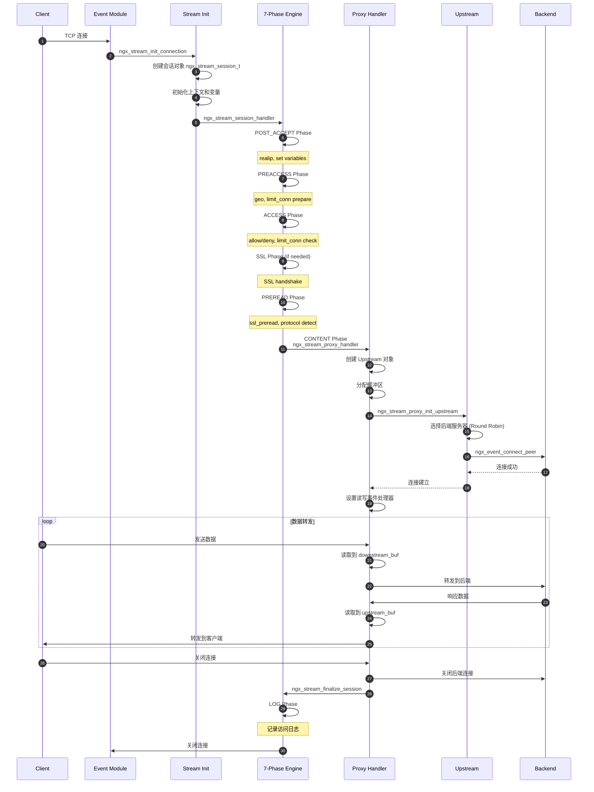
```mermaid
sequenceDiagram
    autonumber
    participant C as Client
    participant E as Event Module
    participant SI as Stream Init
    participant P7 as 7-Phase Engine
    participant PX as Proxy Handler
    participant UP as Upstream
    participant B as Backend
    
    C->>E: TCP 连接
    E->>SI: ngx_stream_init_connection
    SI->>SI: 创建会话对象 ngx_stream_session_t
    SI->>SI: 初始化上下文和变量
    SI->>P7: ngx_stream_session_handler
    
    P7->>P7: POST_ACCEPT Phase
    Note over P7: realip, set variables
    
    P7->>P7: PREACCESS Phase
    Note over P7: geo, limit_conn prepare
    
    P7->>P7: ACCESS Phase
    Note over P7: allow/deny, limit_conn check
    
    P7->>P7: SSL Phase (if needed)
    Note over P7: SSL handshake
    
    P7->>P7: PREREAD Phase
    Note over P7: ssl_preread, protocol detect
    
    P7->>PX: CONTENT Phase<br/>ngx_stream_proxy_handler
    PX->>PX: 创建 Upstream 对象
    PX->>PX: 分配缓冲区
    PX->>UP: ngx_stream_proxy_init_upstream
    UP->>UP: 选择后端服务器 (Round Robin)
    UP->>B: ngx_event_connect_peer
    B-->>UP: 连接成功
    UP-->>PX: 连接建立
    PX->>PX: 设置读写事件处理器
    
    loop 数据转发
        C->>PX: 发送数据
        PX->>PX: 读取到 downstream_buf
        PX->>B: 转发到后端
        B->>PX: 响应数据
        PX->>PX: 读取到 upstream_buf
        PX->>C: 转发到客户端
    end
    
    C->>PX: 关闭连接
    PX->>B: 关闭后端连接
    PX->>P7: ngx_stream_finalize_session
    P7->>P7: LOG Phase
    Note over P7: 记录访问日志
    P7->>E: 关闭连接
```

### 1.2 流程说明

#### 1. 图意概述
该时序图展示了 Nginx Stream 模块处理 TCP 连接的完整流程，从客户端连接建立、7 阶段处理、后端连接、双向数据转发到最终连接关闭的全过程。

#### 2. 关键步骤
1. **连接建立** (步骤 1-3): Event 模块接受连接，调用 `ngx_stream_init_connection` 创建会话对象
2. **7 阶段处理** (步骤 5-10): 依次执行 POST_ACCEPT → PREACCESS → ACCESS → SSL → PREREAD → CONTENT 阶段
3. **Upstream 初始化** (步骤 11-16): 创建 Upstream 对象，选择后端服务器，发起连接
4. **数据转发** (步骤 18-25): 双向异步数据转发，客户端 ↔ Nginx ↔ 后端
5. **连接关闭** (步骤 26-29): 客户端关闭连接，触发后端连接关闭和日志记录

#### 3. 边界与约束
- **阶段超时**: 每个阶段可能有自己的超时设置（如 SSL 握手超时、PREREAD 超时）
- **连接超时**: 后端连接超时 (`proxy_connect_timeout`)
- **数据转发超时**: 读写超时 (`proxy_timeout`)
- **缓冲区大小**: 受 `proxy_buffer_size` 限制，影响单次转发的数据量

#### 4. 异常处理
- **阶段失败**: ACCESS 阶段拒绝访问，直接结束会话
- **后端连接失败**: 尝试下一个后端服务器 (Next Upstream)
- **数据转发错误**: 关闭双向连接，记录错误日志
- **超时**: 任何阶段超时都会触发会话结束

#### 5. 性能优化点
- **异步非阻塞**: 所有 I/O 操作异步处理，不阻塞其他连接
- **零拷贝**: 使用 `sendfile`/`splice` 减少内存拷贝
- **批量读写**: 单次系统调用处理尽可能多的数据
- **事件驱动**: epoll/kqueue 高效管理大量连接

#### 6. 兼容性说明
- 支持所有 TCP 协议，无需理解应用层协议
- 支持 IPv4 和 IPv6
- 支持 PROXY Protocol v1/v2
- 支持 Unix 域套接字

---

## 2. UDP 代理流程

### 2.1 UDP 数据报处理

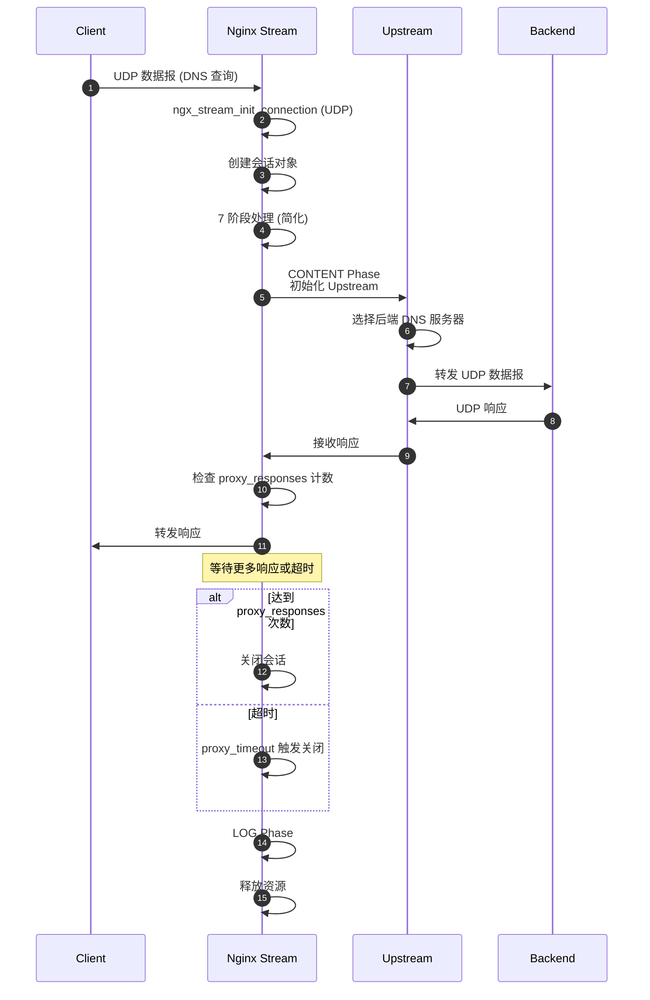
```mermaid
sequenceDiagram
    autonumber
    participant C as Client
    participant N as Nginx Stream
    participant UP as Upstream
    participant B as Backend
    
    C->>N: UDP 数据报 (DNS 查询)
    N->>N: ngx_stream_init_connection (UDP)
    N->>N: 创建会话对象
    N->>N: 7 阶段处理 (简化)
    N->>UP: CONTENT Phase<br/>初始化 Upstream
    UP->>UP: 选择后端 DNS 服务器
    UP->>B: 转发 UDP 数据报
    
    B->>UP: UDP 响应
    UP->>N: 接收响应
    N->>N: 检查 proxy_responses 计数
    N->>C: 转发响应
    
    Note over N: 等待更多响应或超时
    
    alt 达到 proxy_responses 次数
        N->>N: 关闭会话
    else 超时
        N->>N: proxy_timeout 触发关闭
    end
    
    N->>N: LOG Phase
    N->>N: 释放资源
```

### 2.2 UDP 特点说明

#### 与 TCP 的区别
- **无连接**: 每个 UDP 数据报独立处理
- **响应次数**: 通过 `proxy_responses` 控制期望的响应数量
- **超时机制**: 使用 `proxy_timeout` 控制等待响应的时间
- **会话关闭**: 达到响应次数或超时后自动关闭会话

#### 配置示例

```nginx
stream {
    server {
        listen 53 udp;
        proxy_pass dns_backend;
        proxy_responses 1;     # 期望1个响应（DNS查询）
        proxy_timeout 1s;      # 1秒超时
    }
}
```

---

## 3. 负载均衡与故障转移

### 3.1 Round Robin 负载均衡

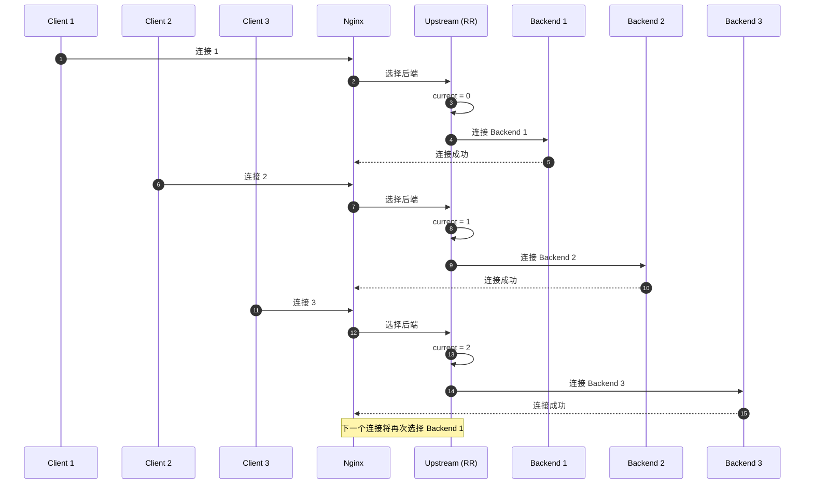
```mermaid
sequenceDiagram
    autonumber
    participant C1 as Client 1
    participant C2 as Client 2
    participant C3 as Client 3
    participant N as Nginx
    participant UP as Upstream (RR)
    participant B1 as Backend 1
    participant B2 as Backend 2
    participant B3 as Backend 3
    
    C1->>N: 连接 1
    N->>UP: 选择后端
    UP->>UP: current = 0
    UP->>B1: 连接 Backend 1
    B1-->>N: 连接成功
    
    C2->>N: 连接 2
    N->>UP: 选择后端
    UP->>UP: current = 1
    UP->>B2: 连接 Backend 2
    B2-->>N: 连接成功
    
    C3->>N: 连接 3
    N->>UP: 选择后端
    UP->>UP: current = 2
    UP->>B3: 连接 Backend 3
    B3-->>N: 连接成功
    
    Note over N,UP: 下一个连接将再次选择 Backend 1
```

### 3.2 故障转移流程

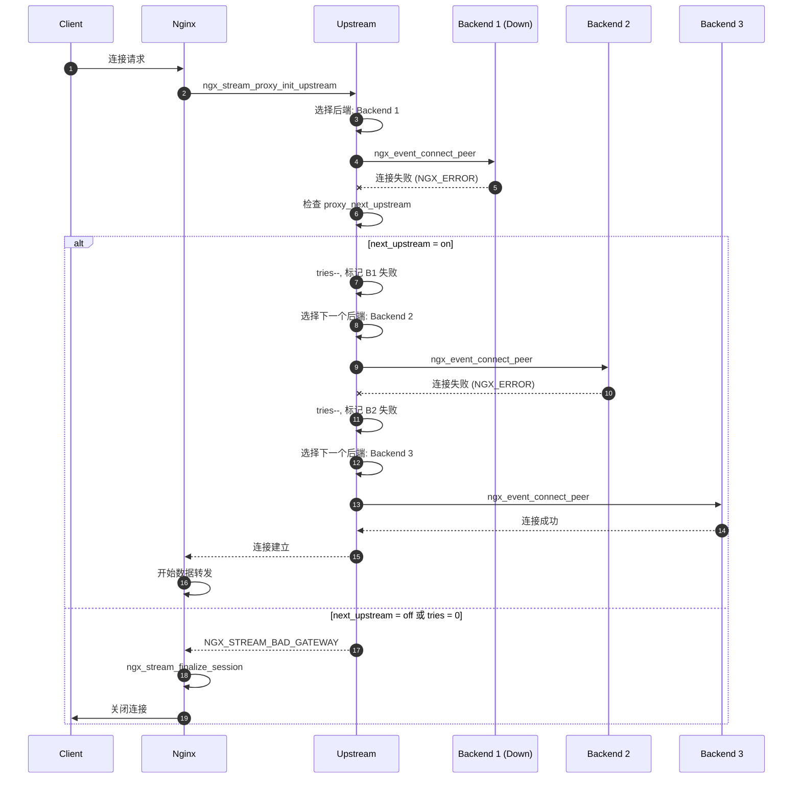
```mermaid
sequenceDiagram
    autonumber
    participant C as Client
    participant N as Nginx
    participant UP as Upstream
    participant B1 as Backend 1 (Down)
    participant B2 as Backend 2
    participant B3 as Backend 3
    
    C->>N: 连接请求
    N->>UP: ngx_stream_proxy_init_upstream
    UP->>UP: 选择后端: Backend 1
    UP->>B1: ngx_event_connect_peer
    B1--xUP: 连接失败 (NGX_ERROR)
    
    UP->>UP: 检查 proxy_next_upstream
    alt next_upstream = on
        UP->>UP: tries--, 标记 B1 失败
        UP->>UP: 选择下一个后端: Backend 2
        UP->>B2: ngx_event_connect_peer
        B2--xUP: 连接失败 (NGX_ERROR)
        
        UP->>UP: tries--, 标记 B2 失败
        UP->>UP: 选择下一个后端: Backend 3
        UP->>B3: ngx_event_connect_peer
        B3-->>UP: 连接成功
        UP-->>N: 连接建立
        N->>N: 开始数据转发
    else next_upstream = off 或 tries = 0
        UP-->>N: NGX_STREAM_BAD_GATEWAY
        N->>N: ngx_stream_finalize_session
        N->>C: 关闭连接
    end
```

### 3.3 故障转移说明

#### 1. 图意概述
该时序图展示了 Nginx Stream 模块的故障转移机制。当连接首选后端失败时，自动尝试下一个可用后端，实现高可用性。

#### 2. 关键配置

```nginx
upstream backend {
    server 192.168.1.10:3306 max_fails=2 fail_timeout=30s;
    server 192.168.1.11:3306 max_fails=2 fail_timeout=30s;
    server 192.168.1.12:3306 max_fails=2 fail_timeout=30s;
}

server {
    listen 3306;
    proxy_pass backend;
    proxy_next_upstream on;              # 启用故障转移
    proxy_next_upstream_tries 3;         # 最多尝试3次
    proxy_next_upstream_timeout 10s;     # 总超时10秒
}
```

#### 3. 失败标记机制
- **max_fails**: 最大失败次数（默认 1）
- **fail_timeout**: 失败超时时间（默认 10s）
- **行为**: 当失败次数达到 `max_fails` 时，标记后端为 down，在 `fail_timeout` 时间内不再尝试

#### 4. 重试策略
- **proxy_next_upstream**: 是否启用故障转移
- **proxy_next_upstream_tries**: 最大重试次数
- **proxy_next_upstream_timeout**: 总重试超时时间
- **优先级**: 达到任一限制都会停止重试

---

## 4. SSL/TLS 握手流程

### 4.1 SSL Termination (SSL 卸载)

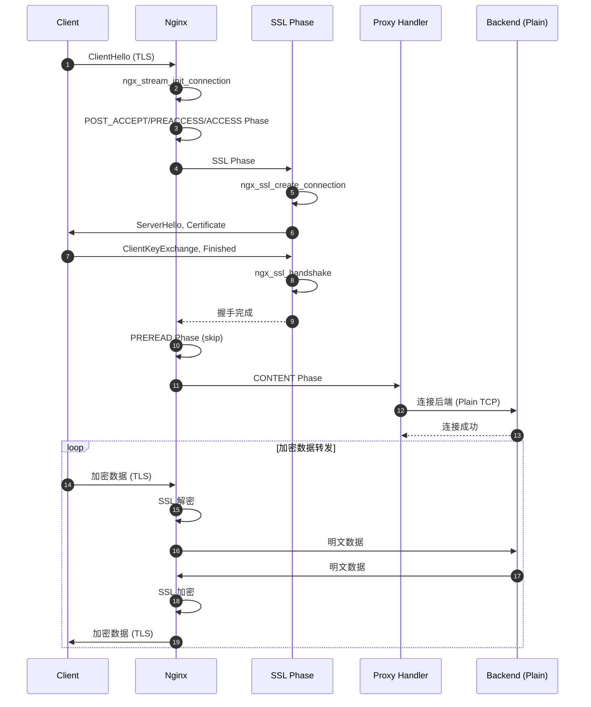
```mermaid
sequenceDiagram
    autonumber
    participant C as Client
    participant N as Nginx
    participant SSL as SSL Phase
    participant PROXY as Proxy Handler
    participant B as Backend (Plain)
    
    C->>N: ClientHello (TLS)
    N->>N: ngx_stream_init_connection
    N->>N: POST_ACCEPT/PREACCESS/ACCESS Phase
    N->>SSL: SSL Phase
    SSL->>SSL: ngx_ssl_create_connection
    SSL->>C: ServerHello, Certificate
    C->>SSL: ClientKeyExchange, Finished
    SSL->>SSL: ngx_ssl_handshake
    SSL-->>N: 握手完成
    
    N->>N: PREREAD Phase (skip)
    N->>PROXY: CONTENT Phase
    PROXY->>B: 连接后端 (Plain TCP)
    B-->>PROXY: 连接成功
    
    loop 加密数据转发
        C->>N: 加密数据 (TLS)
        N->>N: SSL 解密
        N->>B: 明文数据
        B->>N: 明文数据
        N->>N: SSL 加密
        N->>C: 加密数据 (TLS)
    end
```

### 4.2 SSL Preread (SNI 路由)

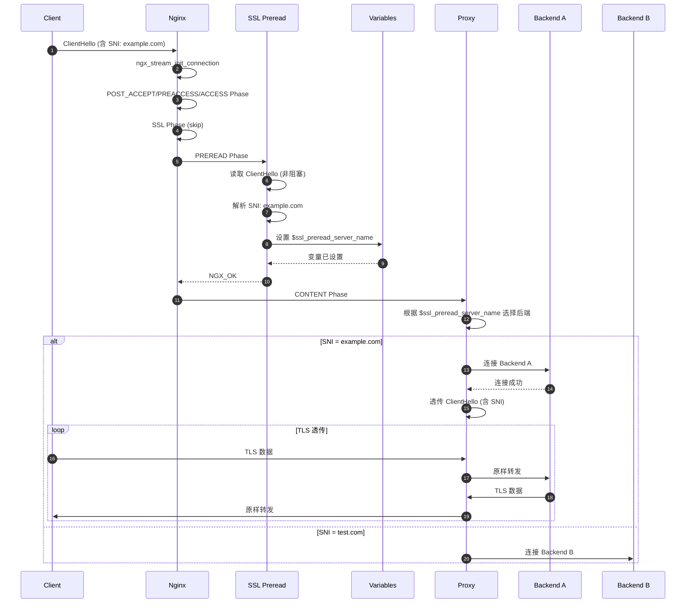
```mermaid
sequenceDiagram
    autonumber
    participant C as Client
    participant N as Nginx
    participant PR as SSL Preread
    participant VAR as Variables
    participant PX as Proxy
    participant B1 as Backend A
    participant B2 as Backend B
    
    C->>N: ClientHello (含 SNI: example.com)
    N->>N: ngx_stream_init_connection
    N->>N: POST_ACCEPT/PREACCESS/ACCESS Phase
    N->>N: SSL Phase (skip)
    N->>PR: PREREAD Phase
    PR->>PR: 读取 ClientHello (非阻塞)
    PR->>PR: 解析 SNI: example.com
    PR->>VAR: 设置 $ssl_preread_server_name
    VAR-->>PR: 变量已设置
    PR-->>N: NGX_OK
    
    N->>PX: CONTENT Phase
    PX->>PX: 根据 $ssl_preread_server_name 选择后端
    
    alt SNI = example.com
        PX->>B1: 连接 Backend A
        B1-->>PX: 连接成功
        PX->>PX: 透传 ClientHello (含 SNI)
        loop TLS 透传
            C->>PX: TLS 数据
            PX->>B1: 原样转发
            B1->>PX: TLS 数据
            PX->>C: 原样转发
        end
    else SNI = test.com
        PX->>B2: 连接 Backend B
    end
```

### 4.3 SSL Preread 说明

#### 1. 图意概述
SSL Preread 允许 Nginx 在不解密 TLS 流量的情况下，读取 ClientHello 中的 SNI (Server Name Indication) 信息，并根据 SNI 将连接路由到不同的后端。

#### 2. 配置示例

```nginx
stream {
    map $ssl_preread_server_name $backend {
        example.com      backend_example;
        test.com         backend_test;
        default          backend_default;
    }
    
    upstream backend_example {
        server 192.168.1.10:443;
    }
    
    upstream backend_test {
        server 192.168.1.20:443;
    }
    
    upstream backend_default {
        server 192.168.1.30:443;
    }
    
    server {
        listen 443;
        ssl_preread on;
        proxy_pass $backend;
    }
}
```

#### 3. 关键特性
- **透明代理**: Nginx 不解密流量，只读取 ClientHello
- **SNI 路由**: 根据 SNI 动态选择后端
- **性能优化**: 避免 SSL 解密/加密的 CPU 开销
- **证书管理**: 证书由后端服务器管理，Nginx 无需配置证书

#### 4. 限制
- 只能路由 TLS 流量（需要 SNI）
- 无法修改或检查加密数据
- 不支持 TLS 1.2 以下的协议（需要 SNI）

---

## 5. Least Connections 负载均衡

### 5.1 最少连接算法流程

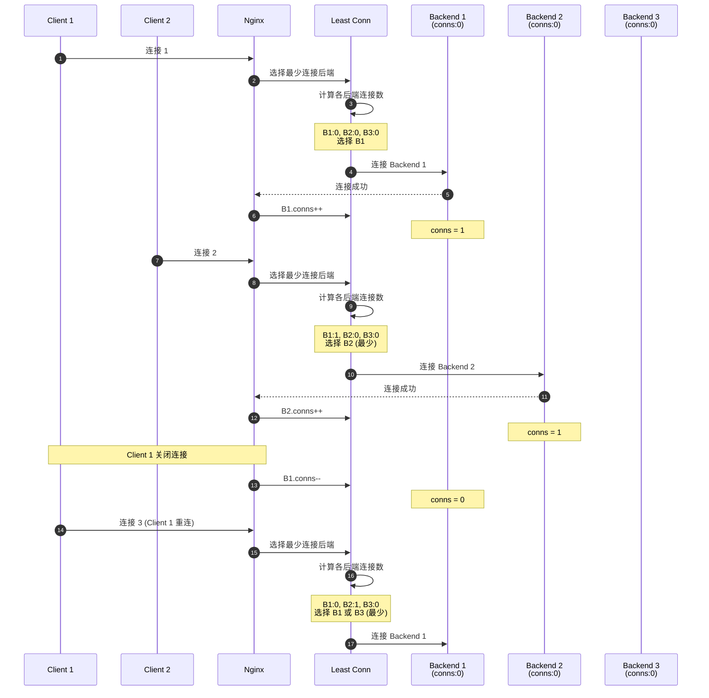
```mermaid
sequenceDiagram
    autonumber
    participant C1 as Client 1
    participant C2 as Client 2
    participant N as Nginx
    participant LC as Least Conn
    participant B1 as Backend 1<br/>(conns:0)
    participant B2 as Backend 2<br/>(conns:0)
    participant B3 as Backend 3<br/>(conns:0)
    
    C1->>N: 连接 1
    N->>LC: 选择最少连接后端
    LC->>LC: 计算各后端连接数
    Note over LC: B1:0, B2:0, B3:0<br/>选择 B1
    LC->>B1: 连接 Backend 1
    B1-->>N: 连接成功
    N->>LC: B1.conns++
    Note over B1: conns = 1
    
    C2->>N: 连接 2
    N->>LC: 选择最少连接后端
    LC->>LC: 计算各后端连接数
    Note over LC: B1:1, B2:0, B3:0<br/>选择 B2 (最少)
    LC->>B2: 连接 Backend 2
    B2-->>N: 连接成功
    N->>LC: B2.conns++
    Note over B2: conns = 1
    
    Note over C1,N: Client 1 关闭连接
    N->>LC: B1.conns--
    Note over B1: conns = 0
    
    C1->>N: 连接 3 (Client 1 重连)
    N->>LC: 选择最少连接后端
    LC->>LC: 计算各后端连接数
    Note over LC: B1:0, B2:1, B3:0<br/>选择 B1 或 B3 (最少)
    LC->>B1: 连接 Backend 1
```

### 5.2 权重支持

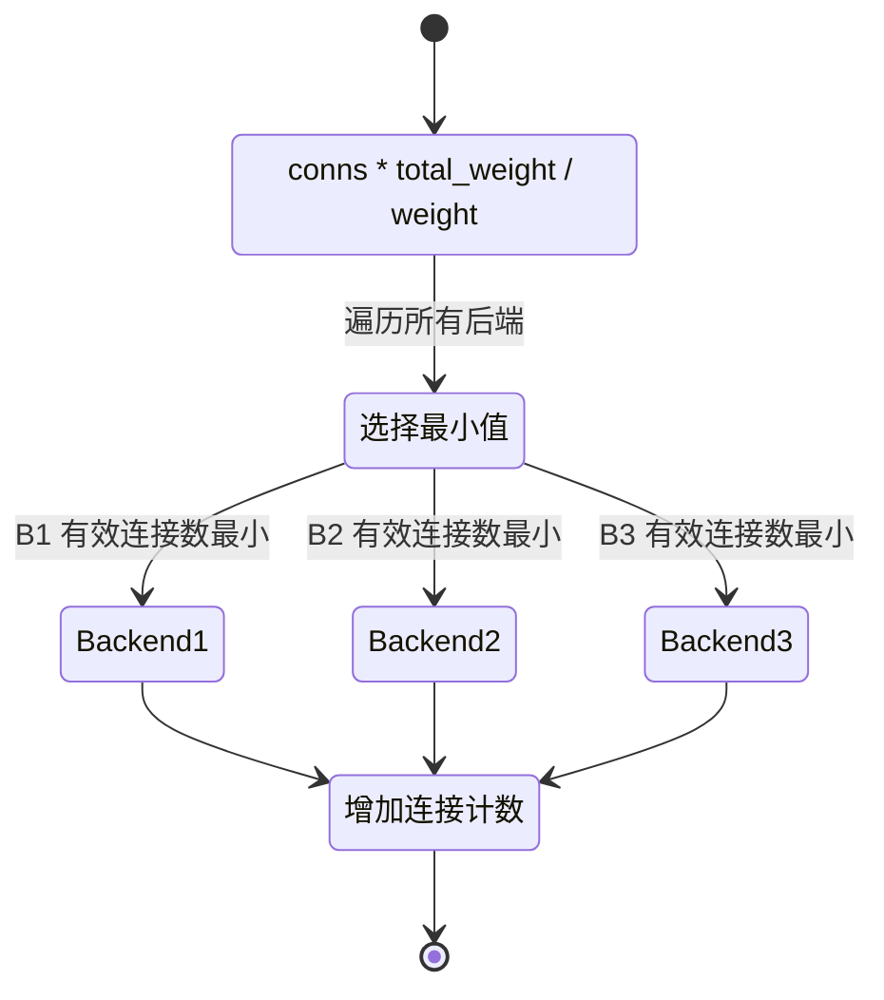
```mermaid
stateDiagram-v2
    [*] --> 计算有效连接数
    计算有效连接数: conns * total_weight / weight
    
    计算有效连接数 --> 选择最小值: 遍历所有后端
    
    选择最小值 --> Backend1: B1 有效连接数最小
    选择最小值 --> Backend2: B2 有效连接数最小
    选择最小值 --> Backend3: B3 有效连接数最小
    
    Backend1 --> 增加连接计数
    Backend2 --> 增加连接计数
    Backend3 --> 增加连接计数
    
    增加连接计数 --> [*]
```

### 5.3 配置示例

```nginx
upstream backend {
    least_conn;
    
    server 192.168.1.10:3306 weight=3;  # 权重3，承载更多连接
    server 192.168.1.11:3306 weight=2;  # 权重2
    server 192.168.1.12:3306 weight=1;  # 权重1，承载最少连接
}
```

**有效连接数计算**:

- Backend 1: `actual_conns = conns * 6 / 3 = conns * 2`
- Backend 2: `actual_conns = conns * 6 / 2 = conns * 3`
- Backend 3: `actual_conns = conns * 6 / 1 = conns * 6`

权重越高，承载的实际连接数越多。

---

## 6. 连接限制流程

### 6.1 连接数限制

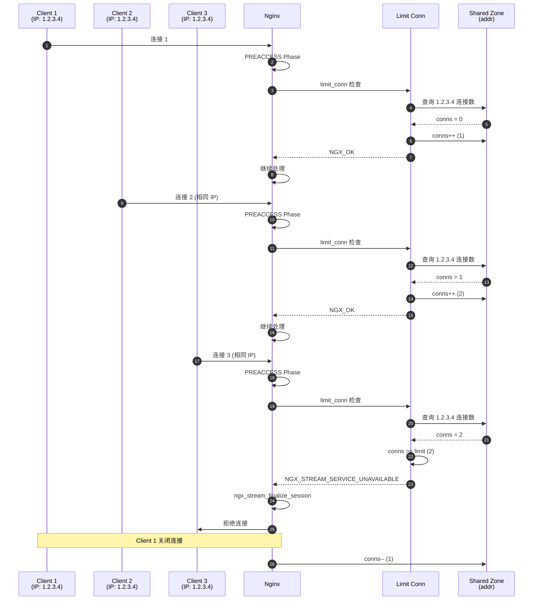
```mermaid
sequenceDiagram
    autonumber
    participant C1 as Client 1<br/>(IP: 1.2.3.4)
    participant C2 as Client 2<br/>(IP: 1.2.3.4)
    participant C3 as Client 3<br/>(IP: 1.2.3.4)
    participant N as Nginx
    participant LIMIT as Limit Conn
    participant ZONE as Shared Zone<br/>(addr)
    
    C1->>N: 连接 1
    N->>N: PREACCESS Phase
    N->>LIMIT: limit_conn 检查
    LIMIT->>ZONE: 查询 1.2.3.4 连接数
    ZONE-->>LIMIT: conns = 0
    LIMIT->>ZONE: conns++ (1)
    LIMIT-->>N: NGX_OK
    N->>N: 继续处理
    
    C2->>N: 连接 2 (相同 IP)
    N->>N: PREACCESS Phase
    N->>LIMIT: limit_conn 检查
    LIMIT->>ZONE: 查询 1.2.3.4 连接数
    ZONE-->>LIMIT: conns = 1
    LIMIT->>ZONE: conns++ (2)
    LIMIT-->>N: NGX_OK
    N->>N: 继续处理
    
    C3->>N: 连接 3 (相同 IP)
    N->>N: PREACCESS Phase
    N->>LIMIT: limit_conn 检查
    LIMIT->>ZONE: 查询 1.2.3.4 连接数
    ZONE-->>LIMIT: conns = 2
    LIMIT->>LIMIT: conns >= limit (2)
    LIMIT-->>N: NGX_STREAM_SERVICE_UNAVAILABLE
    N->>N: ngx_stream_finalize_session
    N->>C3: 拒绝连接
    
    Note over C1,N: Client 1 关闭连接
    N->>ZONE: conns-- (1)
```

### 6.2 配置示例

```nginx
stream {
    limit_conn_zone $binary_remote_addr zone=addr:10m;
    
    server {
        listen 3306;
        limit_conn addr 10;  # 每个 IP 最多 10 个连接
        proxy_pass backend;
    }
}
```

---

## 7. 完整场景综合时序图

### 7.1 包含所有特性的完整流程

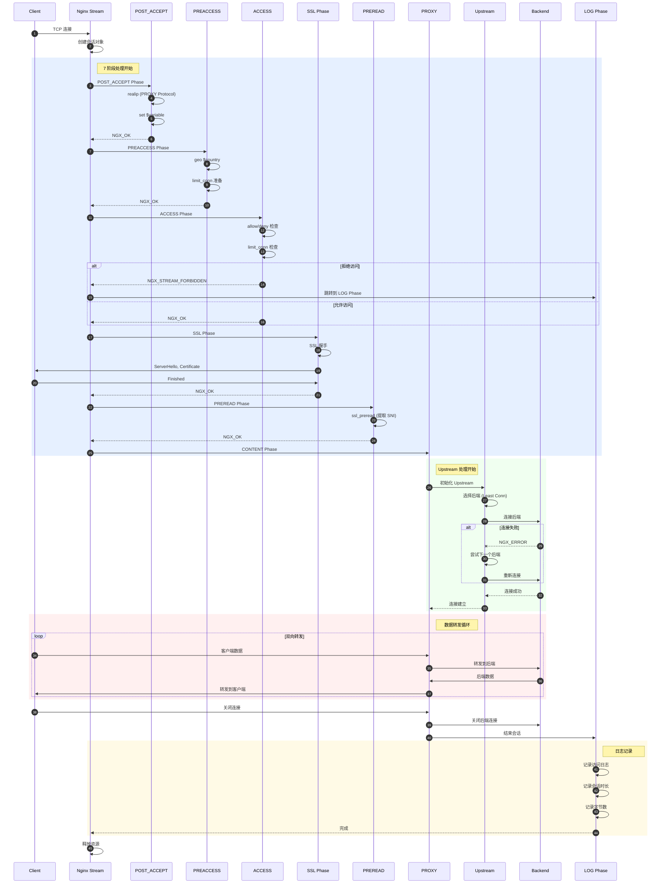
```mermaid
sequenceDiagram
    autonumber
    participant C as Client
    participant N as Nginx Stream
    participant POST as POST_ACCEPT
    participant PRE as PREACCESS
    participant ACC as ACCESS
    participant SSL_P as SSL Phase
    participant PREREAD as PREREAD
    participant PROXY as PROXY
    participant UP as Upstream
    participant B as Backend
    participant LOG as LOG Phase
    
    C->>N: TCP 连接
    N->>N: 创建会话对象
    
    rect rgb(230, 240, 255)
        Note right of N: 7 阶段处理开始
        N->>POST: POST_ACCEPT Phase
        POST->>POST: realip (PROXY Protocol)
        POST->>POST: set $variable
        POST-->>N: NGX_OK
        
        N->>PRE: PREACCESS Phase
        PRE->>PRE: geo $country
        PRE->>PRE: limit_conn 准备
        PRE-->>N: NGX_OK
        
        N->>ACC: ACCESS Phase
        ACC->>ACC: allow/deny 检查
        ACC->>ACC: limit_conn 检查
        alt 拒绝访问
            ACC-->>N: NGX_STREAM_FORBIDDEN
            N->>LOG: 跳转到 LOG Phase
        else 允许访问
            ACC-->>N: NGX_OK
        end
        
        N->>SSL_P: SSL Phase
        SSL_P->>SSL_P: SSL 握手
        SSL_P->>C: ServerHello, Certificate
        C->>SSL_P: Finished
        SSL_P-->>N: NGX_OK
        
        N->>PREREAD: PREREAD Phase
        PREREAD->>PREREAD: ssl_preread (提取 SNI)
        PREREAD-->>N: NGX_OK
        
        N->>PROXY: CONTENT Phase
    end
    
    rect rgb(240, 255, 240)
        Note right of PROXY: Upstream 处理开始
        PROXY->>UP: 初始化 Upstream
        UP->>UP: 选择后端 (Least Conn)
        UP->>B: 连接后端
        
        alt 连接失败
            B--xUP: NGX_ERROR
            UP->>UP: 尝试下一个后端
            UP->>B: 重新连接
        end
        
        B-->>UP: 连接成功
        UP-->>PROXY: 连接建立
    end
    
    rect rgb(255, 240, 240)
        Note right of PROXY: 数据转发循环
        loop 双向转发
            C->>PROXY: 客户端数据
            PROXY->>B: 转发到后端
            B->>PROXY: 后端数据
            PROXY->>C: 转发到客户端
        end
    end
    
    C->>PROXY: 关闭连接
    PROXY->>B: 关闭后端连接
    PROXY->>LOG: 结束会话
    
    rect rgb(255, 250, 230)
        Note right of LOG: 日志记录
        LOG->>LOG: 记录访问日志
        LOG->>LOG: 记录会话时长
        LOG->>LOG: 记录字节数
        LOG-->>N: 完成
    end
    
    N->>N: 释放资源
```

---

## 总结

Stream 模块的时序图展示了清晰的处理流程和灵活的扩展能力。

### 关键流程
- **7 阶段处理**: POST_ACCEPT → PREACCESS → ACCESS → SSL → PREREAD → CONTENT → LOG
- **负载均衡**: Round Robin, Least Connections, Hash 等多种算法
- **故障转移**: 自动重试机制，保证高可用性
- **SSL 支持**: SSL Termination 和 SSL Preread 两种模式
- **连接限制**: 基于 IP 的连接数限制

### 设计特点
- **阶段化处理**: 清晰的执行流程，易于扩展
- **异步非阻塞**: 高并发、高性能
- **灵活的路由**: 支持变量、map、正则等多种路由方式
- **透明代理**: 支持 TCP/UDP 透明代理，无需理解应用层协议
- **完善的监控**: 记录详细的连接信息和统计数据

---
