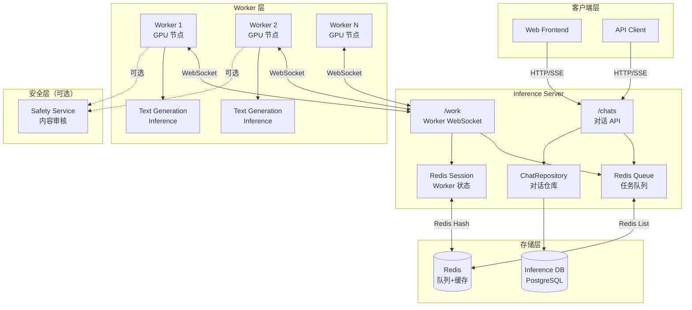
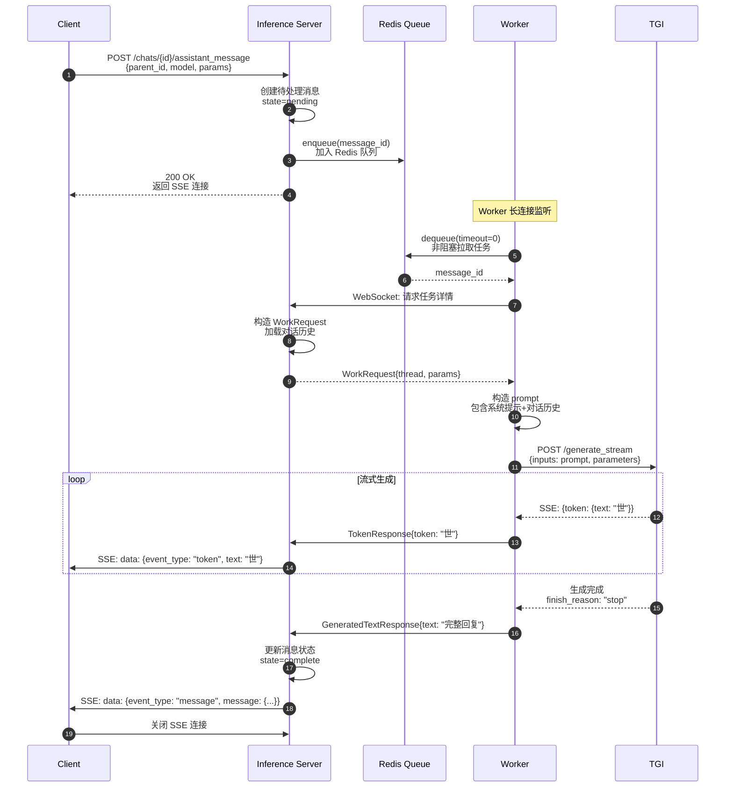
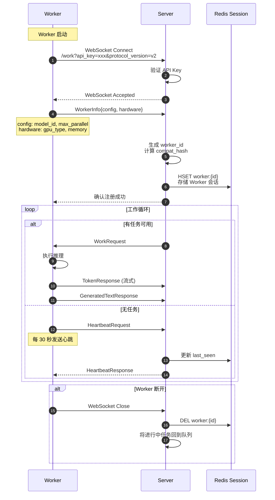
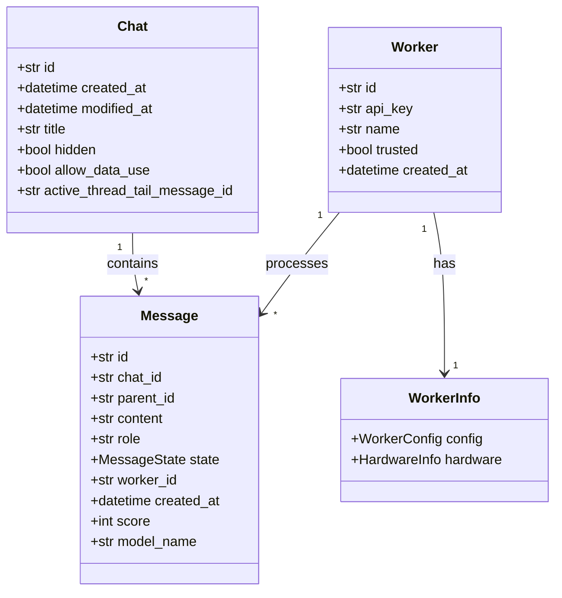

# Open-Assistant-02-Inference-概览

## 1. 模块职责

Inference 模块是 Open-Assistant 的推理服务层，负责模型推理和对话生成。

**主要职责：**
- **服务调度**：接收客户端对话请求，调度工作节点执行推理
- **Worker 管理**：管理多个推理 Worker 的注册、心跳、负载均衡
- **流式响应**：通过 WebSocket 实时推送生成的 Token
- **会话管理**：持久化对话历史，支持多轮对话
- **安全审核**：可选的内容安全检查（Safety Service）
- **插件系统**：支持工具调用和外部 API 集成

**输入：**
- 用户对话请求（提示词、对话历史、模型配置）
- Worker 注册信息（模型配置、硬件信息）

**输出：**
- 流式生成的 Token（Server-Sent Events）
- 完整的助手回复消息
- 对话历史记录

## 2. 架构设计

### 2.1 整体架构图



### 2.2 通信流程

**Client → Server → Worker 通信：**

1. **用户请求**：Client 通过 HTTP POST 创建助手消息
2. **入队**：Server 将消息 ID 加入 Redis 队列
3. **分发**：空闲 Worker 通过 WebSocket 从队列拉取任务
4. **推理**：Worker 调用 TGI 进行模型推理
5. **流式返回**：Worker 通过 WebSocket 发送 Token 给 Server
6. **转发**：Server 通过 SSE 转发 Token 给 Client

## 3. 核心组件

### 3.1 Inference Server

**主要模块：**

| 模块 | 文件路径 | 职责 |
|---|---|---|
| ChatAPI | `routes/chats.py` | 对话管理、消息创建、流式响应 |
| WorkerAPI | `routes/workers.py` | Worker 注册、任务分发、响应处理 |
| ChatRepository | `chat_repository.py` | 对话持久化、消息 CRUD |
| Queueing | `queueing.py` | Redis 队列封装、任务调度 |
| Auth | `auth.py` | API Key 验证、用户认证 |

**核心 API：**

```python
# 创建对话
POST /chats → {id, created_at}

# 添加用户消息
POST /chats/{chat_id}/prompter_message
{
    "parent_id": "msg_id",
    "content": "用户提示词"
}
→ MessageRead

# 请求助手回复（流式）
POST /chats/{chat_id}/assistant_message
{
    "parent_id": "msg_id",
    "model_config_name": "llama-30b",
    "sampling_parameters": {...}
}
→ SSE Stream (Token 流)

# Worker WebSocket
WS /work
- Worker 连接后保持长连接
- 双向通信：Server 发送 WorkRequest，Worker 返回 TokenResponse
```

### 3.2 Inference Worker

**主要模块：**

| 模块 | 文件路径 | 职责 |
|---|---|---|
| Work Handler | `work.py` | 处理 WorkRequest、调用 TGI |
| Chat Chain | `chat_chain.py` | 插件链式调用、工具执行 |
| Interface | `interface.py` | TGI HTTP 接口封装 |
| Utils | `utils.py` | Token 缓冲、特殊 Token 处理 |

**工作流程：**

```python
def handle_work_request(ws, tokenizer, work_request, worker_config):
    # 1. 构造提示词（包含对话历史、系统提示）
    prompt, parameters = make_prompt_and_parameters(tokenizer, work_request)
    
    # 2. 可选：安全检查
    if settings.enable_safety:
        safety_response = get_safety_server_response(prompt)
        if is_safety_triggered(safety_response):
            prompt = prepare_safe_prompt(prompt, ...)
    
    # 3. 调用 TGI 生成
    stream_response = interface.generate_stream(prompt, parameters)
    
    # 4. 流式发送 Token
    for event in stream_response:
        token = event["token"]["text"]
        send_response(ws, TokenResponse(token=token))
    
    # 5. 发送完成标志
    send_response(ws, GeneratedTextResponse(text=full_text))
```

### 3.3 Text Generation Inference (TGI)

**外部依赖：**
- HuggingFace 官方推理引擎
- 支持多种模型（LLaMA、GPT-NeoX、BLOOM 等）
- 高性能特性：
  - Flash Attention
  - Paged Attention
  - Tensor Parallelism（多卡并行）
  - Continuous Batching

**配置示例：**

```yaml
model_config:
  name: "llama-30b-sft-6"
  model_id: "OpenAssistant/oasst-sft-6-llama-30b"
  max_input_length: 1024
  max_total_tokens: 2048
  quantize: "bitsandbytes"  # 量化以节省显存
```

## 4. 关键流程

### 4.1 对话生成流程



**关键点：**

1. **异步解耦**：消息创建立即返回，推理在后台进行
2. **流式推送**：使用 SSE 实时推送 Token，用户体验流畅
3. **任务队列**：Redis List 实现 FIFO 队列，自动负载均衡
4. **状态管理**：消息状态（pending → in_progress → complete）
5. **错误处理**：Worker 失败时消息回到队列，其他 Worker 可重试

### 4.2 Worker 注册与心跳



**Worker 会话数据：**

```python
class WorkerSession:
    worker_id: str
    worker_info: WorkerInfo
    requests_in_flight: int  # 当前处理的请求数
    metrics: WorkerMetricsInfo  # 性能指标
    last_seen: datetime  # 最后心跳时间
```

### 4.3 插件系统（Chat Chain）

**支持的插件类型：**

| 插件名 | 功能 | 示例 |
|---|---|---|
| web_retriever | 网页搜索与抓取 | "搜索最新的 Python 3.12 新特性" |
| gale_pleaser | 情感分析与回复优化 | 根据用户情绪调整回复风格 |
| gale_roaster | 幽默讽刺回复 | 生成幽默的吐槽内容 |

**插件调用流程：**

```python
def handle_conversation(work_request, worker_config, parameters, tokenizer, ws):
    # 1. 分析用户意图，决定是否需要工具调用
    thought_prompt = construct_thought_prompt(work_request.thread)
    thought_response = generate(thought_prompt)
    
    # 2. 解析工具调用
    if "Action:" in thought_response:
        action, action_input = parse_action(thought_response)
        
        # 3. 执行工具（如 web_retriever）
        tool_result = execute_tool(action, action_input)
        
        # 4. 构造包含工具结果的最终提示词
        final_prompt = construct_final_prompt(
            original_prompt=work_request.thread,
            thought=thought_response,
            observation=tool_result
        )
        
        # 5. 生成最终回复
        return final_prompt, used_plugin
    else:
        # 不需要工具，直接生成
        return original_prompt, None
```

## 5. 数据模型

### 5.1 核心实体



**消息状态枚举：**

```python
class MessageState(str, Enum):
    manual = "manual"        # 手动输入（用户消息）
    pending = "pending"      # 等待处理
    in_progress = "in_progress"  # 推理中
    complete = "complete"    # 完成
    aborted_by_worker = "aborted_by_worker"  # Worker 中止
    cancelled = "cancelled"  # 用户取消
    timeout = "timeout"      # 超时
```

### 5.2 请求/响应协议

**WorkRequest（Server → Worker）：**

```python
class WorkRequest:
    id: str  # 请求 ID
    thread: Thread  # 对话历史
    parameters: WorkParameters  # 生成参数
    safety_parameters: SafetyParameters  # 安全参数
    
class Thread:
    messages: list[MessageRead]  # 消息列表
    
class WorkParameters:
    model_config_name: str
    sampling_parameters: SamplingParameters
    system_prompt: str | None
    plugins: list[PluginEntry]
```

**TokenResponse（Worker → Server）：**

```python
class TokenResponse:
    request_id: str
    token: str  # 单个 Token
    is_end: bool = False
    error: str | None = None
```

## 6. 性能优化

### 6.1 并发处理

**Worker 侧：**
- 支持 `max_parallel_requests` 并发请求（默认 1-4）
- 使用 `asyncio` 异步处理多个请求
- Token 缓冲：累积多个 Token 后批量发送，减少网络开销

**Server 侧：**
- 使用 Redis 队列解耦，水平扩展
- 多个 Worker 实例并行处理
- 基于 `compat_hash` 的亲和性调度（相同模型配置的任务分配给同一批 Worker）

### 6.2 显存优化

**模型量化：**
```python
# 8-bit 量化（节省 50% 显存）
quantize: "bitsandbytes"

# 4-bit 量化（节省 75% 显存）
quantize: "gptq"
```

**KV Cache 管理：**
- Paged Attention：将 KV Cache 分页存储，减少内存碎片
- 动态批处理：自动合并多个请求，提高 GPU 利用率

### 6.3 缓存策略

**对话历史缓存：**
- 热门对话的消息列表缓存在 Redis（TTL 30 分钟）
- 减少数据库查询，提升响应速度

**模型预加载：**
- Worker 启动时预加载模型到 GPU
- 避免首次请求的冷启动延迟

## 7. 安全与限流

### 7.1 Safety Service

**内容安全检查：**

```python
# 发送给 Safety Service
safety_request = SafetyRequest(
    inputs=prompt,
    parameters=SafetyParameters(level=2)  # 0-3，数字越大越严格
)

# 返回安全标签和建议
safety_response = SafetyResponse(
    outputs="<sep>caution<sep>avoid harmful content"
)

# 如果触发安全警告，修改提示词
if is_safety_triggered(safety_label, level):
    prompt = prepare_safe_prompt(prompt, safety_label, rots)
```

**安全级别：**

| Level | 描述 | 触发条件 |
|---|---|---|
| 0 | 无检查 | 不触发 |
| 1 | 低 | intervention（严重违规） |
| 2 | 中 | caution（警告）+ intervention |
| 3 | 高 | 所有警告 |

### 7.2 限流

**用户级限流：**
```python
@router.post("/{chat_id}/assistant_message", dependencies=[
    Depends(UserRateLimiter(
        times=settings.rate_limit_messages_user_times,  # 60
        seconds=settings.rate_limit_messages_user_seconds  # 60
    ))
])
# 限制：60 次 / 60 秒
```

**并发控制：**
- 每个用户最多 3 个并发推理请求
- 超过限制返回 429 Too Many Requests

## 8. 监控与可观测

### 8.1 Metrics

**Worker Metrics：**
```python
class WorkerMetricsInfo:
    requests_processed: int  # 已处理请求数
    average_latency: float  # 平均延迟（秒）
    tokens_per_second: float  # 生成速度
    gpu_utilization: float  # GPU 利用率
    memory_used: int  # 显存使用（MB）
```

**Server Metrics（Prometheus）：**
- `inference_requests_total{model, status}` - 请求总数
- `inference_latency_seconds{model}` - 延迟分布
- `inference_queue_depth{model}` - 队列深度
- `inference_active_workers{model}` - 活跃 Worker 数

### 8.2 日志

**关键日志点：**
- Worker 注册/断开：`logger.info(f"Worker {worker_id} registered")`
- 任务分发：`logger.info(f"Dispatched work to {worker_id}")`
- 推理完成：`logger.info(f"Generated {len(tokens)} tokens in {elapsed}s")`
- 错误：`logger.error(f"Worker {worker_id} failed: {error}")`

---

## 9. 部署配置

### 9.1 Server 配置

```yaml
# inference/server/.env
PORT: 8000
POSTGRES_HOST: inference-db
POSTGRES_DB: oasst_inference
REDIS_HOST: inference-redis

# API Keys
DEBUG_API_KEYS: "0000,1111"  # 开发用
TRUSTED_CLIENT_KEYS: "6969"  # 受信任客户端

# 限流
RATE_LIMIT_MESSAGES_USER_TIMES: 60
RATE_LIMIT_MESSAGES_USER_SECONDS: 60

# Worker 设置
WORKER_INACTIVITY_TIMEOUT: 300  # 5 分钟无心跳则视为离线
```

### 9.2 Worker 配置

```yaml
# inference/worker/.env
API_KEY: "0000"  # 与 Server 的 DEBUG_API_KEYS 匹配
BACKEND_URL: "ws://inference-server:8000"
MODEL_CONFIG_NAME: "llama-30b-sft-6"

# 并发设置
MAX_PARALLEL_REQUESTS: 2

# 安全设置
ENABLE_SAFETY: false  # 生产环境建议启用
SAFETY_SERVICE_URL: "http://safety-service:8002"
```

### 9.3 TGI 配置

```bash
# 启动 Text Generation Inference
docker run -p 8080:80 \
  --gpus all \
  --shm-size 1g \
  -v $PWD/models:/data \
  ghcr.io/huggingface/text-generation-inference:latest \
  --model-id OpenAssistant/oasst-sft-6-llama-30b \
  --max-input-length 1024 \
  --max-total-tokens 2048 \
  --quantize bitsandbytes
```

---

## 10. 常见问题

### Q1: Worker 如何选择任务？

**答：** 基于 `compat_hash` 的亲和性调度。

- 每个 Worker 有 `compat_hash = hash(model_id, model_revision)`
- 任务入队时使用对应的队列：`work_queue:{compat_hash}`
- Worker 只从自己的 `compat_hash` 队列拉取任务
- 确保相同模型配置的任务分配给正确的 Worker

### Q2: 如何处理 Worker 故障？

**答：** 自动重试机制。

- Worker 断开时，Server 检测到 WebSocket 关闭
- 将该 Worker 处理中的任务（`in_progress`）状态重置为 `pending`
- 任务重新入队，其他 Worker 可继续处理
- 客户端通过 SSE 连接感知到错误事件，可选择重试

### Q3: 如何扩展推理能力？

**答：** 水平扩展 Worker。

```bash
# 启动多个 Worker 实例（Docker Compose）
docker compose up --scale inference-worker=5

# 每个 Worker 独立连接 Server
# Server 自动负载均衡
```

### Q4: 流式响应如何保证顺序？

**答：** Token 携带序号。

- Worker 生成的每个 Token 都有隐式顺序（生成顺序）
- Server 按接收顺序转发给 Client
- 使用 SSE 的有序流特性，保证 Client 按序接收

---

**下一步：**
- 阅读 `Open-Assistant-00-总览.md` 了解 Inference 在整体架构中的位置
- 查看 `inference/server/README.md` 了解部署细节
- 参考 `inference/worker/work.py` 了解 Worker 实现

