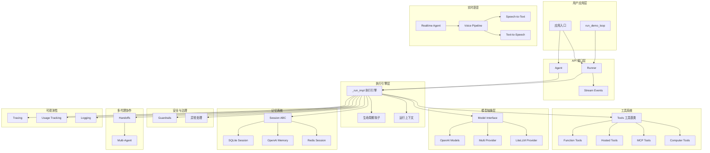
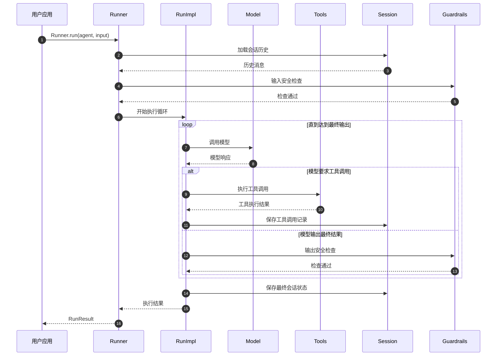

# OpenAI Agents Python SDK 源码剖析 - 总览

## 0. 摘要

OpenAI Agents Python SDK 是一个用于构建和运行基于大语言模型的智能代理系统的 Python 框架。项目旨在提供统一的接口来构建可对话、可执行任务、具备工具调用能力和多代理协作能力的 AI 代理系统。

### 核心能力边界

**目标功能：**

- 代理创建与配置（指令、工具、安全防护等）
- 多种模型提供商支持（OpenAI、LiteLLM 等）
- 丰富的工具生态（函数调用、文件搜索、代码执行、计算机控制等）
- 多代理间的切换与协作（Handoff 机制）
- 会话记忆管理（SQLite、Redis、OpenAI Conversations 等）
- 实时语音交互（STT/TTS）
- 流式事件处理与响应
- 可观测性与追踪（Tracing）

**非目标：**

- 模型训练与微调
- 大规模分布式调度
- 模型权重管理

### 运行环境

- **语言：** Python 3.8+
- **运行时：** 异步 IO 为主，支持同步包装
- **核心依赖：** OpenAI Python Client、Pydantic、asyncio
- **部署形态：** 单进程库，支持嵌入式集成到用户应用

## 1. 整体架构图



**图解与要点：**

### 组件职责与耦合关系

1. **API 接口层**：`Agent` 负责代理配置，`Runner` 负责执行调度，`Stream Events` 处理实时事件流
2. **执行引擎层**：`_run_impl` 是核心执行引擎，协调所有子系统的交互
3. **工具系统**：提供统一的工具调用接口，支持函数调用、托管工具、MCP 协议和计算机控制
4. **模型抽象层**：支持多种模型提供商，通过统一接口屏蔽底层差异
5. **记忆系统**：提供会话状态持久化，支持多种存储后端

### 数据流与控制流

- **控制流**：用户请求 → Runner → _run_impl → 模型调用 → 工具执行 → 结果返回
- **数据流**：会话历史从 Session 加载 → 与用户输入合并 → 发送到模型 → 解析响应 → 更新会话状态
- **事件流**：执行过程中通过 Stream Events 实时推送状态变化

### 高可用与扩展性

- **无状态设计**：核心组件无全局状态，支持多实例并发
- **异步优先**：基于 asyncio 实现高并发
- **模块化扩展**：工具、模型、会话存储均可插拔替换

## 2. 全局时序图（主要业务闭环）



**图解与要点：**

### 入口与鉴权机制
- 用户通过 `Runner.run()` 统一入口启动代理执行
- 输入输出均经过 Guardrails 安全检查，支持自定义安全策略

### 幂等性与状态管理
- 每次执行前从 Session 加载历史状态，确保上下文连续性
- 工具调用结果和最终输出都会持久化到 Session
- 支持执行中断后的状态恢复

### 回退策略与重试机制
- 模型调用失败时支持自动重试
- 工具执行异常时可选择跳过或终止
- Guardrails 触发时提供明确的错误信息和建议

### 超时与资源控制
- 支持整体执行超时设置
- 单次模型调用和工具执行的独立超时控制
- 最大轮次限制防止无限循环

## 3. 模块边界与交互图

### 核心模块列表

| 模块名 | 职责 | 对外API | 调用关系 |
|--------|------|---------|----------|
| Agent | 代理配置与定义 | Agent, AgentBase | 被 Runner 调用 |
| Runner | 执行调度器 | Runner.run() | 调用所有子系统 |
| Models | 模型抽象层 | Model, ModelProvider | 被 RunImpl 调用 |
| Tools | 工具系统 | Tool, function_tool | 被 RunImpl 调用 |
| Memory | 会话记忆 | Session, SQLiteSession | 被 RunImpl 调用 |
| Guardrails | 安全防护 | input_guardrail, output_guardrail | 被 RunImpl 调用 |
| Handoffs | 多代理协作 | handoff, Handoff | 被 RunImpl 调用 |
| Voice | 语音交互 | VoicePipeline, STT, TTS | 独立使用或与 Realtime 集成 |
| Realtime | 实时代理 | RealtimeAgent | 独立的代理类型 |
| Tracing | 可观测性 | trace, Span | 全局横切关注点 |

### 交互矩阵

| 调用方\被调方 | Agent | Models | Tools | Memory | Guardrails | Handoffs | Voice | Tracing |
|---------------|-------|--------|-------|--------|------------|----------|-------|---------|
| Runner | 同步 | - | - | 同步 | 同步 | - | - | 异步 |
| RunImpl | 异步 | 异步 | 异步 | 异步 | 异步 | 异步 | - | 异步 |
| Agent | - | - | 配置 | - | 配置 | 配置 | - | - |
| Handoffs | 异步 | - | - | - | - | - | - | 异步 |
| Voice | - | 异步 | - | - | - | - | - | 异步 |

## 4. 关键设计与权衡

### 数据一致性策略

**会话状态一致性：**

- 采用最终一致性模型，每次执行结束后持久化完整状态
- 支持乐观锁机制，通过版本号避免并发冲突
- 分布式场景下通过 Session ID 实现状态隔离

**工具调用一致性：**

- 工具调用采用幂等设计，相同输入产生相同输出
- 支持工具调用结果缓存，避免重复执行
- 失败重试时保持调用顺序

### 性能关键路径

**P95 响应时间优化：**

- 模型调用采用连接池复用，减少建连开销
- 工具执行支持并发调用，缩短总体耗时
- 会话加载采用增量同步，仅加载必要历史

**内存占用控制：**

- 大文件处理采用流式传输，避免内存堆积
- 长会话自动截断历史，保持固定内存占用
- 工具执行结果支持压缩存储

**I/O 热点优化：**

- 数据库连接池管理，避免频繁建连
- 批量持久化操作，减少磁盘 I/O
- 异步 I/O 模式，提升并发处理能力

### 可观测性指标

**核心指标：**

- 请求成功率、响应时间分布（P50/P95/P99）
- 模型调用次数、工具执行次数与成功率
- 会话活跃度、平均对话轮次
- 错误分类统计（模型错误、工具错误、系统错误）

**追踪能力：**

- 分布式追踪支持，完整链路可视化
- 结构化日志记录，支持复杂查询分析
- 性能指标实时监控与告警

### 配置参数说明

**执行控制参数：**

- `max_turns`: 最大执行轮次，默认 10，防止无限循环
- `timeout`: 整体执行超时，默认无限制
- `model_settings`: 模型参数（温度、最大令牌数等）

**安全控制参数：**

- `input_guardrails`: 输入内容安全检查规则
- `output_guardrails`: 输出内容安全检查规则
- `tool_guardrails`: 工具调用安全检查规则

**性能优化参数：**

- `session_max_items`: 会话历史最大条目数
- `tool_timeout`: 工具执行超时时间
- `model_request_timeout`: 模型请求超时时间

## 5. 典型使用示例与最佳实践

### 示例 1：最小可运行代理

```python
import asyncio
from agents import Agent, Runner

async def main():
    # 创建最简单的代理
    agent = Agent(
        name="Assistant",
        instructions="你是一个有用的AI助手，请简洁回答用户问题。"
    )
    
    # 执行单次对话
    result = await Runner.run(agent, "今天天气怎么样？")
    print(result.final_output)

if __name__ == "__main__":
    asyncio.run(main())
```

**使用场景：** 快速验证SDK基本功能，适用于简单问答场景。

**关键配置说明：**

- `name`: 代理名称，用于日志和调试识别
- `instructions`: 系统提示词，定义代理行为和回答风格
- `Runner.run()`: 异步执行接口，返回包含最终输出的结果对象

### 示例 2：带工具的增强代理

```python
import asyncio
from agents import Agent, Runner, function_tool

@function_tool
def get_weather(city: str) -> str:
    """获取指定城市的天气信息"""
    # 模拟天气API调用
    return f"{city}今天天气晴朗，温度25°C"

@function_tool
def calculate(expression: str) -> str:
    """计算数学表达式"""
    try:
        result = eval(expression)
        return f"计算结果：{result}"
    except Exception as e:
        return f"计算错误：{e}"

async def main():
    agent = Agent(
        name="WeatherBot",
        instructions="你是一个能够查询天气和进行计算的助手。",
        tools=[get_weather, calculate]
    )
    
    result = await Runner.run(
        agent,
        "北京天气如何？顺便帮我算一下 15 * 24 是多少。"
    )
    print(f"最终回答：{result.final_output}")
    
    # 查看工具调用历史
    for item in result.all_items:
        if hasattr(item, 'tool_name'):
            print(f"工具调用：{item.tool_name}({item.input}) -> {item.output}")

if __name__ == "__main__":
    asyncio.run(main())
```

**使用场景：** 需要外部数据查询或计算能力的代理系统。

**最佳实践：**

- 工具函数使用 `@function_tool` 装饰器自动生成 JSON Schema
- 工具函数应包含详细的 docstring，帮助模型理解使用场景
- 异常处理在工具内部完成，返回用户友好的错误信息
- 通过 `result.all_items` 可追踪完整的执行过程

### 示例 3：多代理协作系统

```python
import asyncio
from agents import Agent, Runner, handoff

# 创建专门的代理
research_agent = Agent(
    name="ResearchAgent",
    instructions="你是一个专业的研究助手，专门收集和分析信息。",
    handoff_description="负责信息搜集和研究分析"
)

summary_agent = Agent(
    name="SummaryAgent",
    instructions="你是一个专业的总结助手，将复杂信息简化为易懂的摘要。",
    handoff_description="负责信息总结和简化"
)

# 创建主代理，可以切换到其他代理
main_agent = Agent(
    name="MainAgent",
    instructions="你是一个协调助手，根据用户需求选择合适的专业助手处理任务。",
    handoffs=[research_agent, summary_agent]
)

async def main():
    result = await Runner.run(
        main_agent,
        "请研究一下人工智能的发展历程，并给我一个简洁的总结"
    )
    print(result.final_output)

if __name__ == "__main__":
    asyncio.run(main())
```

**使用场景：** 复杂任务分解，需要不同专业能力协作的场景。

**关键设计模式：**

- 单一职责原则：每个代理专注特定领域
- 任务路由：主代理根据请求类型选择合适的子代理
- 上下文传递：代理切换时保持对话上下文连续性

**扩展建议：**

- 可以添加更多专业代理（如翻译、编程、设计等）
- 支持代理间的复杂交互模式（如辩论、协作等）
- 通过配置文件管理大量代理的组织结构

这套源码剖析文档为开发者提供了从整体到细节的完整视角，帮助快速理解和使用 OpenAI Agents Python SDK 构建智能代理系统。
