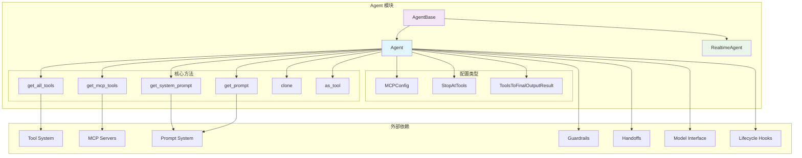
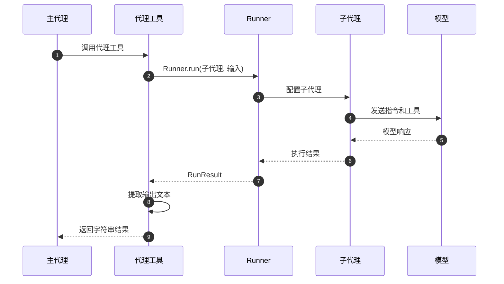
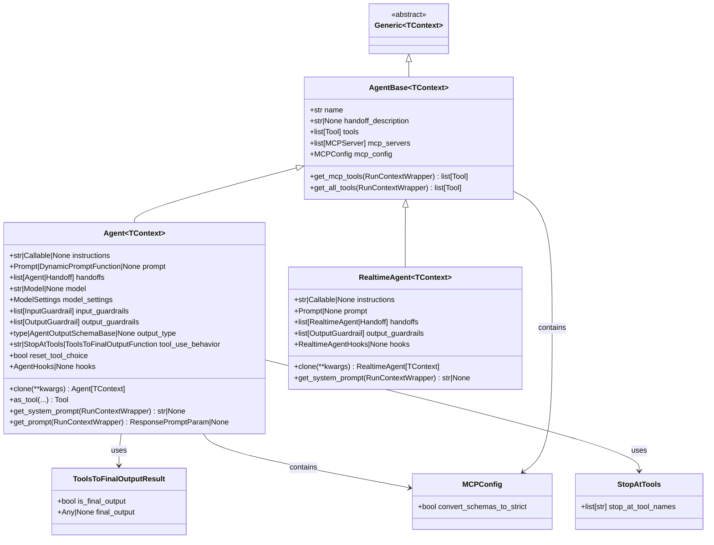
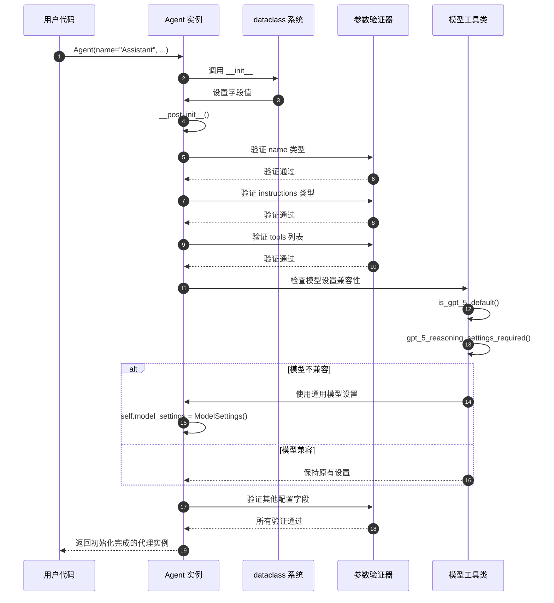
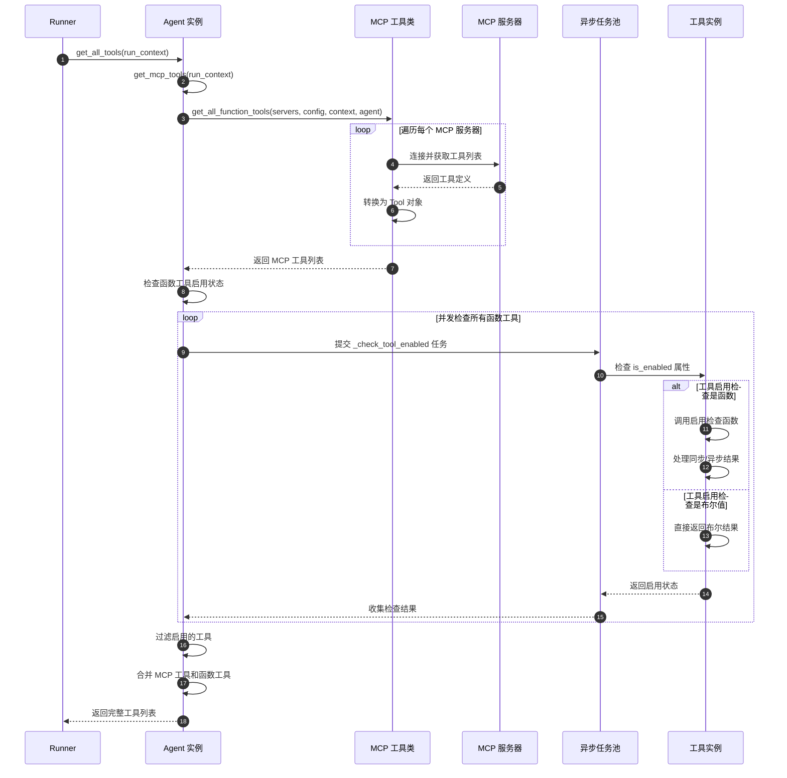
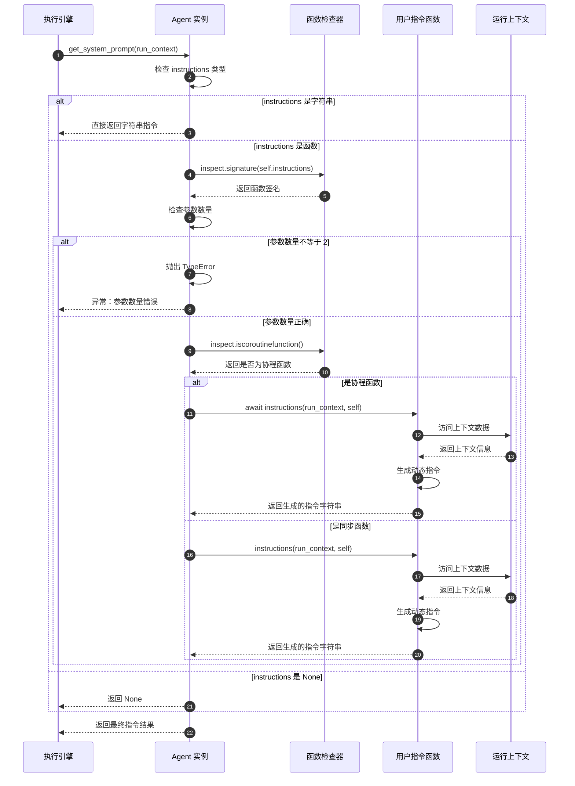
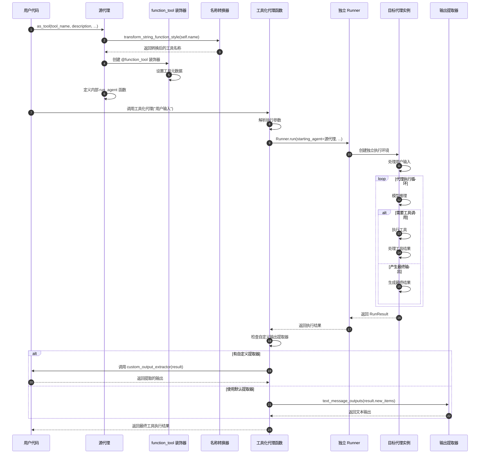
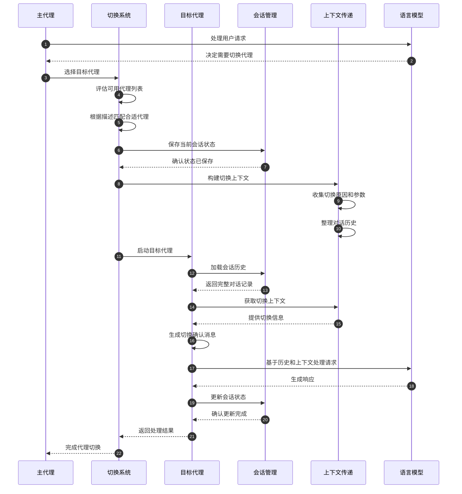

# OpenAIAgent-01-Agent

## 模块概览

## 1. 模块职责与边界

Agent 模块是 OpenAI Agents Python SDK 的核心模块，负责定义和配置智能代理的基本结构。该模块提供了代理的创建、配置、工具管理、指令处理等核心功能。

### 核心职责

- **代理定义与配置**：提供 `Agent` 和 `AgentBase` 类，支持代理的创建和参数配置
- **工具管理**：统一管理函数工具、MCP 工具和托管工具的集成与调用
- **指令处理**：支持静态和动态指令生成，包括系统提示词和 Prompt 对象
- **多代理协作**：通过 Handoff 机制实现代理间的切换与协作
- **安全防护集成**：集成输入输出安全检查机制
- **代理生命周期管理**：提供代理克隆、工具化等高级功能

### 输入输出接口

**输入：**

- 代理配置参数（名称、指令、工具列表等）
- 运行上下文（`RunContextWrapper`）
- MCP 服务器列表
- 安全防护规则

**输出：**

- 配置完成的 `Agent` 实例
- 工具列表（包含所有可用工具）
- 系统提示词（动态生成）
- 可作为工具使用的代理函数

### 上下游依赖关系

**上游调用者：**

- `Runner`：执行代理任务
- 用户应用：创建和配置代理
- `Handoff`：多代理切换时创建新代理

**下游依赖：**

- `Tool`：工具系统集成
- `Model`：模型接口抽象
- `Guardrail`：安全防护机制
- `Memory/Session`：会话状态管理
- `MCP`：模型上下文协议支持

## 2. 模块架构图



**架构说明：**

### 层次结构设计

1. **基础抽象层**：`AgentBase` 提供所有代理类型的共同功能
2. **具体实现层**：`Agent` 和 `RealtimeAgent` 分别处理标准和实时场景
3. **配置管理层**：各种配置类型和策略定义
4. **方法执行层**：核心业务逻辑的具体实现

### 模块边界与扩展点

- **工具扩展点**：通过 `tools` 列表和 `mcp_servers` 支持任意工具集成
- **指令扩展点**：支持静态字符串和动态函数两种指令模式
- **安全扩展点**：通过 `input_guardrails` 和 `output_guardrails` 支持自定义安全策略
- **生命周期扩展点**：通过 `hooks` 支持代理生命周期事件监听

### 状态管理位置

- **无状态设计**：代理实例本身不保存运行时状态
- **配置状态**：代理的配置信息在初始化后不可变
- **会话状态**：运行时状态由外部 `Session` 对象管理
- **上下文状态**：执行时状态通过 `RunContextWrapper` 传递

### 资源占用要点

- **内存占用**：主要来自工具列表和配置对象，通常小于 1MB
- **CPU 占用**：动态指令生成和工具检查时有计算开销
- **I/O 占用**：MCP 服务器连接时产生网络 I/O

## 3. 关键算法与流程剖析

### 3.1 工具聚合算法

```python
async def get_all_tools(self, run_context: RunContextWrapper[TContext]) -> list[Tool]:
    """聚合所有可用工具（MCP + Function Tools）"""
    # 1) 获取 MCP 工具
    mcp_tools = await self.get_mcp_tools(run_context)
    
    # 2) 检查函数工具启用状态
    async def _check_tool_enabled(tool: Tool) -> bool:
        if not isinstance(tool, FunctionTool):
            return True
            
        attr = tool.is_enabled
        if isinstance(attr, bool):
            return attr
        # 动态检查工具是否启用
        res = attr(run_context, self)
        if inspect.isawaitable(res):
            return bool(await res)
        return bool(res)
    
    # 3) 并发检查所有工具状态
    results = await asyncio.gather(*(_check_tool_enabled(t) for t in self.tools))
    enabled = [t for t, ok in zip(self.tools, results) if ok]
    
    # 4) 合并返回所有启用的工具
    return [*mcp_tools, *enabled]
```

**算法目的：** 从多个来源聚合工具并进行状态检查，确保只有启用的工具可用。

**复杂度分析：**

- 时间复杂度：O(n + m)，n 为 MCP 工具数，m 为函数工具数
- 空间复杂度：O(n + m)，存储所有工具引用
- 并发优化：使用 `asyncio.gather` 并行检查工具状态

**设计理由：**

- 分离关注点：MCP 工具和函数工具采用不同的检查逻辑
- 并发优化：避免串行检查导致的延迟累积
- 状态隔离：工具状态检查不影响其他组件

### 3.2 动态指令生成流程

```python
async def get_system_prompt(self, run_context: RunContextWrapper[TContext]) -> str | None:
    """动态生成系统提示词"""
    if isinstance(self.instructions, str):
        # 静态指令直接返回
        return self.instructions
    elif callable(self.instructions):
        # 动态指令需要函数调用
        sig = inspect.signature(self.instructions)
        params = list(sig.parameters.values())
        
        # 参数数量校验
        if len(params) != 2:
            raise TypeError(
                f"'instructions' callable must accept exactly 2 arguments (context, agent)"
            )
        
        # 调用指令生成函数
        if inspect.iscoroutinefunction(self.instructions):
            return await cast(Awaitable[str], self.instructions(run_context, self))
        else:
            return cast(str, self.instructions(run_context, self))
    
    return None
```

**流程目的：** 支持静态和动态两种指令模式，提供灵活的代理行为定制能力。

**关键决策点：**

1. **类型检查**：区分字符串和函数类型的指令
2. **签名验证**：确保动态指令函数接收正确参数
3. **异步处理**：支持同步和异步两种指令生成函数

**设计权衡：**

- 性能 vs 灵活性：静态指令性能更好，动态指令更灵活
- 类型安全 vs 动态性：通过签名检查平衡两者
- 简单性 vs 功能性：提供默认行为同时支持高级定制

### 3.3 代理工具化转换

```python
def as_tool(self, tool_name: str | None, tool_description: str | None, ...) -> Tool:
    """将代理转换为可被其他代理调用的工具"""
    
    @function_tool(
        name_override=tool_name or _transforms.transform_string_function_style(self.name),
        description_override=tool_description or "",
        is_enabled=is_enabled,
    )
    async def run_agent(context: RunContextWrapper, input: str) -> str:
        # 使用独立的 Runner 执行代理
        output = await Runner.run(
            starting_agent=self,
            input=input,
            context=context.context,
            run_config=run_config,
            max_turns=resolved_max_turns,
            hooks=hooks,
            previous_response_id=previous_response_id,
            conversation_id=conversation_id,
            session=session,
        )
        
        # 提取输出结果
        if custom_output_extractor:
            return await custom_output_extractor(output)
        return ItemHelpers.text_message_outputs(output.new_items)
    
    return run_agent
```

**转换目的：** 实现代理的递归调用能力，支持复杂的多层代理架构。

**关键实现细节：**

1. **名称转换**：自动将代理名称转换为函数风格的工具名称
2. **独立执行**：使用独立的 `Runner` 确保执行环境隔离
3. **结果提取**：支持自定义输出提取逻辑或使用默认文本提取

## 4. 配置参数说明

### 核心配置参数

| 参数名 | 类型 | 默认值 | 说明 | 影响范围 |
|--------|------|--------|------|----------|
| `name` | str | 必需 | 代理名称，用于标识和日志 | 全局可见 |
| `instructions` | str \| Callable | None | 系统提示词或动态生成函数 | 模型行为 |
| `tools` | list[Tool] | [] | 可用工具列表 | 代理能力 |
| `model` | str \| Model | None | 使用的模型实现 | 推理能力 |
| `model_settings` | ModelSettings | 默认设置 | 模型参数配置 | 生成质量 |
| `handoffs` | list[Agent \| Handoff] | [] | 可切换的子代理列表 | 协作能力 |
| `max_turns` | int | 10 | 最大执行轮次 | 资源控制 |

### 高级配置参数

| 参数名 | 类型 | 默认值 | 说明 | 使用场景 |
|--------|------|--------|------|----------|
| `tool_use_behavior` | str \| dict \| Callable | "run_llm_again" | 工具使用行为策略 | 工具执行控制 |
| `reset_tool_choice` | bool | True | 工具调用后重置工具选择 | 避免循环调用 |
| `input_guardrails` | list[InputGuardrail] | [] | 输入安全检查规则 | 内容安全 |
| `output_guardrails` | list[OutputGuardrail] | [] | 输出安全检查规则 | 内容安全 |
| `output_type` | type \| AgentOutputSchemaBase | None | 输出类型定义 | 结构化输出 |
| `mcp_servers` | list[MCPServer] | [] | MCP 服务器列表 | 外部工具集成 |
| `mcp_config` | MCPConfig | {} | MCP 配置选项 | MCP 行为控制 |

### 性能调优参数

**模型设置相关：**

- `temperature`: 控制输出随机性，0.0-2.0，默认 1.0
- `max_tokens`: 最大生成令牌数，影响响应长度
- `top_p`: 核心采样参数，影响输出多样性

**执行控制相关：**

- `max_turns`: 防止无限循环，建议根据任务复杂度调整
- `tool_timeout`: 工具执行超时时间，默认 30 秒
- `session_max_items`: 会话历史最大条目数，控制内存占用

## 5. 最佳实践与使用建议

### 5.1 代理创建最佳实践

```python
# 推荐：明确的代理定义
agent = Agent(
    name="DataAnalyst",  # 使用描述性名称
    instructions="""
    你是一个专业的数据分析师。请：

    1. 分析用户提供的数据
    2. 识别关键趋势和模式
    3. 生成可视化图表
    4. 提供具体的业务建议
    """,
    tools=[data_analysis_tool, chart_generator_tool],  # 相关工具集合
    model_settings=ModelSettings(
        temperature=0.3,  # 分析任务需要较低随机性
        max_tokens=2000   # 预留足够输出空间
    ),
    output_guardrails=[content_safety_guardrail],  # 必要的安全检查

)
```

**关键建议：**

- 使用描述性的代理名称，便于调试和监控
- 编写详细的指令，明确代理的职责和行为期望
- 根据任务类型调整模型参数，分析类任务使用低温度
- 添加必要的安全防护，特别是面向用户的场景

### 5.2 动态指令使用模式

```python
def generate_context_aware_instructions(
    context: RunContextWrapper,
    agent: Agent
) -> str:
    """根据上下文动态生成指令"""
    user_role = context.context.get("user_role", "general")
    task_type = context.context.get("task_type", "chat")
    
    base_instructions = "你是一个智能助手。"
    
    if user_role == "developer":
        base_instructions += "请使用技术术语，提供代码示例。"
    elif user_role == "business":
        base_instructions += "请使用商业语言，关注ROI和业务价值。"
    
    if task_type == "analysis":
        base_instructions += "请进行深入分析并提供数据支持。"
    
    return base_instructions

# 使用动态指令
agent = Agent(
    name="AdaptiveAssistant",
    instructions=generate_context_aware_instructions,  # 函数而非字符串
    # ... 其他配置
)
```

**使用场景：**

- 多租户系统中根据用户角色调整行为
- 根据任务类型动态调整处理策略
- 基于历史对话调整响应风格

### 5.3 多代理协作模式

```python
# 专业化代理
research_agent = Agent(
    name="Researcher",
    instructions="专注于信息收集和事实核查",
    tools=[web_search_tool, database_query_tool],
    handoff_description="负责信息研究和数据收集"
)

analysis_agent = Agent(
    name="Analyst",
    instructions="专注于数据分析和洞察提取",
    tools=[data_analysis_tool, visualization_tool],
    handoff_description="负责数据分析和可视化"
)

# 协调代理
coordinator = Agent(
    name="Coordinator",
    instructions="""
    你是一个任务协调者。根据用户需求：

    - 需要信息收集时，切换到 Researcher
    - 需要数据分析时，切换到 Analyst  
    - 最终整合结果并响应用户
    """,
    handoffs=[research_agent, analysis_agent]

)
```

**协作模式优势：**

- 职责分离：每个代理专注特定领域
- 复用性：专业代理可在多个场景复用
- 可维护性：独立的代理更易于测试和调试

### 5.4 工具化代理使用

```python
# 将代理转换为工具
specialist_tool = specialist_agent.as_tool(
    tool_name="domain_expert",
    tool_description="专业领域专家，提供深度分析和建议",
    max_turns=5,  # 限制子代理执行轮次
    custom_output_extractor=lambda result: result.final_output
)

# 在主代理中使用
main_agent = Agent(
    name="MainAssistant",
    instructions="当遇到专业问题时，调用 domain_expert 工具获取专家意见",
    tools=[specialist_tool, other_tools...]
)
```

**工具化优势：**

- 模块化：将复杂逻辑封装为可重用工具
- 隔离性：子代理执行独立，不影响主流程
- 灵活性：支持自定义输出提取和参数控制

这些最佳实践帮助开发者充分利用 Agent 模块的能力，构建高效、可维护的智能代理系统。

---

## API接口

## 1. 对外 API 列表

Agent 模块对外提供以下核心 API：

| API 名称 | 类型 | 功能描述 | 主要使用场景 |
|----------|------|----------|--------------|
| `Agent` | 类 | 标准智能代理实现 | 通用对话和任务执行 |
| `AgentBase` | 抽象基类 | 代理基础功能定义 | 自定义代理类型 |
| `ToolsToFinalOutputResult` | 数据类 | 工具执行结果封装 | 工具链终止控制 |
| `ToolsToFinalOutputFunction` | 类型别名 | 工具结果处理函数 | 自定义工具执行逻辑 |
| `StopAtTools` | 字典类型 | 工具停止配置 | 工具执行流程控制 |
| `MCPConfig` | 字典类型 | MCP 服务器配置 | MCP 集成参数设置 |

## 2. Agent 类详细 API

### 基本信息

- **类名**：`Agent[TContext]`
- **继承关系**：`AgentBase[TContext]` → `Generic[TContext]`
- **泛型参数**：`TContext` - 运行上下文类型

### 构造参数结构体

```python
@dataclass
class Agent(AgentBase, Generic[TContext]):
    # 基础配置
    name: str                                    # 代理名称
    handoff_description: str | None = None       # 切换描述
    tools: list[Tool] = field(default_factory=list)
    mcp_servers: list[MCPServer] = field(default_factory=list)
    mcp_config: MCPConfig = field(default_factory=lambda: MCPConfig())
    
    # 指令与提示
    instructions: str | Callable[[RunContextWrapper[TContext], Agent[TContext]], MaybeAwaitable[str]] | None = None
    prompt: Prompt | DynamicPromptFunction | None = None
    
    # 协作与切换
    handoffs: list[Agent[Any] | Handoff[TContext, Any]] = field(default_factory=list)
    
    # 模型配置
    model: str | Model | None = None
    model_settings: ModelSettings = field(default_factory=get_default_model_settings)
    
    # 安全防护
    input_guardrails: list[InputGuardrail[TContext]] = field(default_factory=list)
    output_guardrails: list[OutputGuardrail[TContext]] = field(default_factory=list)
    
    # 输出控制
    output_type: type[Any] | AgentOutputSchemaBase | None = None
    
    # 行为控制
    tool_use_behavior: Literal["run_llm_again", "stop_on_first_tool"] | StopAtTools | ToolsToFinalOutputFunction = "run_llm_again"
    reset_tool_choice: bool = True
    
    # 生命周期
    hooks: AgentHooks[TContext] | None = None
```

### 构造参数字段表

| 字段 | 类型 | 必填 | 默认值 | 约束 | 说明 |
|------|------|------|--------|------|------|
| name | str | 是 | - | 非空字符串 | 代理唯一标识名称 |
| handoff_description | str \| None | 否 | None | 字符串或 None | 代理切换时的描述信息 |
| tools | list[Tool] | 否 | [] | Tool 对象列表 | 代理可使用的工具集合 |
| instructions | str \| Callable \| None | 否 | None | 字符串或函数 | 系统提示词或动态生成函数 |
| model | str \| Model \| None | 否 | None | 模型名称或实例 | 使用的语言模型 |
| model_settings | ModelSettings | 否 | 默认设置 | ModelSettings 实例 | 模型参数配置 |
| handoffs | list[Agent \| Handoff] | 否 | [] | 代理或切换对象列表 | 可切换的子代理 |
| input_guardrails | list[InputGuardrail] | 否 | [] | 安全检查函数列表 | 输入内容安全验证 |
| output_guardrails | list[OutputGuardrail] | 否 | [] | 安全检查函数列表 | 输出内容安全验证 |
| output_type | type \| AgentOutputSchemaBase \| None | 否 | None | 类型或模式对象 | 结构化输出类型定义 |
| tool_use_behavior | str \| dict \| Callable | 否 | "run_llm_again" | 预定义值或函数 | 工具使用行为策略 |
| reset_tool_choice | bool | 否 | True | 布尔值 | 工具调用后是否重置选择 |
| hooks | AgentHooks \| None | 否 | None | 生命周期钩子对象 | 代理生命周期事件回调 |
| mcp_servers | list[MCPServer] | 否 | [] | MCP 服务器列表 | 模型上下文协议服务器 |
| mcp_config | MCPConfig | 否 | {} | 配置字典 | MCP 服务器配置选项 |

### 核心方法 API

#### 2.1 get_all_tools 方法

**基本信息**

- **方法名**：`get_all_tools`
- **签名**：`async def get_all_tools(self, run_context: RunContextWrapper[TContext]) -> list[Tool]`
- **功能**：获取代理的所有可用工具（包括 MCP 工具和函数工具）
- **幂等性**：是（相同上下文返回相同结果）

**请求参数**

| 参数名 | 类型 | 必填 | 说明 |
|--------|------|------|------|
| run_context | RunContextWrapper[TContext] | 是 | 运行上下文包装器 |

**返回值**

| 字段 | 类型 | 说明 |
|------|------|------|
| 返回值 | list[Tool] | 所有启用的工具列表 |

**核心实现代码**

```python
async def get_all_tools(self, run_context: RunContextWrapper[TContext]) -> list[Tool]:
    """聚合所有可用工具，包括 MCP 工具和启用的函数工具"""
    # 1) 异步获取 MCP 工具
    mcp_tools = await self.get_mcp_tools(run_context)
    
    # 2) 定义工具启用检查函数
    async def _check_tool_enabled(tool: Tool) -> bool:
        if not isinstance(tool, FunctionTool):
            return True  # 非函数工具默认启用
            
        attr = tool.is_enabled
        if isinstance(attr, bool):
            return attr  # 静态启用状态
        
        # 动态启用检查
        res = attr(run_context, self)
        if inspect.isawaitable(res):
            return bool(await res)
        return bool(res)
    
    # 3) 并发检查所有函数工具的启用状态
    results = await asyncio.gather(*(_check_tool_enabled(t) for t in self.tools))
    enabled = [t for t, ok in zip(self.tools, results) if ok]
    
    # 4) 合并 MCP 工具和启用的函数工具
    return [*mcp_tools, *enabled]
```

**方法执行逻辑**：

1. **MCP 工具获取**：调用 `get_mcp_tools` 异步获取所有 MCP 服务器提供的工具
2. **启用状态检查**：对每个函数工具进行启用状态验证，支持静态和动态检查
3. **并发优化**：使用 `asyncio.gather` 并行执行多个工具的启用检查
4. **结果聚合**：将 MCP 工具和启用的函数工具合并返回

**异常处理**：

- MCP 服务器连接失败时记录警告并跳过
- 工具启用检查异常时默认禁用该工具
- 网络超时时自动重试 MCP 工具获取

**性能要点**：

- 并发检查工具状态，避免串行等待
- MCP 工具结果缓存，减少重复网络请求
- 大型工具列表时考虑分批处理

#### 2.2 get_system_prompt 方法

**基本信息**

- **方法名**：`get_system_prompt`
- **签名**：`async def get_system_prompt(self, run_context: RunContextWrapper[TContext]) -> str | None`
- **功能**：获取代理的系统提示词（支持静态和动态生成）
- **幂等性**：否（动态指令可能根据上下文变化）

**请求参数**

| 参数名 | 类型 | 必填 | 说明 |
|--------|------|------|------|
| run_context | RunContextWrapper[TContext] | 是 | 运行上下文包装器 |

**返回值**

| 字段 | 类型 | 说明 |
|------|------|------|
| 返回值 | str \| None | 系统提示词字符串或 None |

**核心实现代码**

```python
async def get_system_prompt(self, run_context: RunContextWrapper[TContext]) -> str | None:
    """获取系统提示词，支持静态字符串和动态函数生成"""
    if isinstance(self.instructions, str):
        # 静态指令直接返回
        return self.instructions
    elif callable(self.instructions):
        # 动态指令需要函数调用
        sig = inspect.signature(self.instructions)
        params = list(sig.parameters.values())
        
        # 强制要求两个参数：context 和 agent
        if len(params) != 2:
            raise TypeError(
                f"'instructions' callable must accept exactly 2 arguments (context, agent), "
                f"but got {len(params)}: {[p.name for p in params]}"
            )
        
        # 支持同步和异步指令函数
        if inspect.iscoroutinefunction(self.instructions):
            return await cast(Awaitable[str], self.instructions(run_context, self))
        else:
            return cast(str, self.instructions(run_context, self))
    
    return None  # 未设置指令时返回 None
```

**方法执行逻辑**：

1. **类型判断**：检查 `instructions` 是字符串、函数还是 None
2. **静态处理**：字符串类型直接返回
3. **动态处理**：函数类型需要签名验证和调用
4. **异步支持**：自动检测并处理异步指令函数

**参数验证**：

- 指令函数必须接受恰好 2 个参数
- 参数类型必须与 `RunContextWrapper` 和 `Agent` 兼容
- 返回值必须是字符串类型

#### 2.3 clone 方法

**基本信息**

- **方法名**：`clone`
- **签名**：`def clone(self, **kwargs: Any) -> Agent[TContext]`
- **功能**：创建代理的浅拷贝，可修改指定属性
- **幂等性**：是（相同参数产生相同结果）

**请求参数**

| 参数名 | 类型 | 必填 | 说明 |
|--------|------|------|------|
| **kwargs | Any | 否 | 要修改的属性键值对 |

**返回值**

| 字段 | 类型 | 说明 |
|------|------|------|
| 返回值 | Agent[TContext] | 克隆的代理实例 |

**核心实现代码**

```python
def clone(self, **kwargs: Any) -> Agent[TContext]:
    """创建代理的浅拷贝，支持属性修改"""
    return dataclasses.replace(self, **kwargs)
```

**使用示例**：

```python
# 原始代理
original_agent = Agent(
    name="Assistant",
    instructions="你是一个助手",
    tools=[tool1, tool2]
)

# 克隆并修改指令
modified_agent = original_agent.clone(
    instructions="你是一个专业的技术助手",
    model_settings=ModelSettings(temperature=0.3)
)

# 克隆并添加工具（需要提供完整列表）
enhanced_agent = original_agent.clone(
    tools=[tool1, tool2, tool3]  # 包含原有工具
)
```

**重要说明**：

- 使用 `dataclasses.replace` 进行浅拷贝
- 可变对象（如 `tools`、`handoffs` 列表）需要显式提供新列表
- 不会深拷贝对象内容，仅拷贝引用

#### 2.4 as_tool 方法

**基本信息**

- **方法名**：`as_tool`
- **签名**：复杂签名，见下方详细参数表
- **功能**：将代理转换为可被其他代理调用的工具
- **幂等性**：是（相同参数生成相同工具）

**请求参数表**

| 参数名 | 类型 | 必填 | 默认值 | 说明 |
|--------|------|------|--------|------|
| tool_name | str \| None | 否 | None | 工具名称，默认使用代理名称 |
| tool_description | str \| None | 否 | None | 工具描述信息 |
| custom_output_extractor | Callable \| None | 否 | None | 自定义输出提取函数 |
| is_enabled | bool \| Callable | 否 | True | 工具启用状态或检查函数 |
| run_config | RunConfig \| None | 否 | None | 运行配置 |
| max_turns | int \| None | 否 | None | 最大执行轮次 |
| hooks | RunHooks \| None | 否 | None | 执行钩子 |
| previous_response_id | str \| None | 否 | None | 前一个响应ID |
| conversation_id | str \| None | 否 | None | 对话ID |
| session | Session \| None | 否 | None | 会话对象 |

**返回值**

| 字段 | 类型 | 说明 |
|------|------|------|
| 返回值 | Tool | 代理工具化后的函数工具 |

**核心实现代码**

```python
def as_tool(self, tool_name: str | None, tool_description: str | None, ...) -> Tool:
    """将代理转换为工具，实现代理的递归调用"""
    
    @function_tool(
        name_override=tool_name or _transforms.transform_string_function_style(self.name),
        description_override=tool_description or "",
        is_enabled=is_enabled,
    )
    async def run_agent(context: RunContextWrapper, input: str) -> str:
        """工具化代理的执行函数"""
        resolved_max_turns = max_turns if max_turns is not None else DEFAULT_MAX_TURNS
        
        # 使用独立的 Runner 执行代理
        output = await Runner.run(
            starting_agent=self,
            input=input,
            context=context.context,
            run_config=run_config,
            max_turns=resolved_max_turns,
            hooks=hooks,
            previous_response_id=previous_response_id,
            conversation_id=conversation_id,
            session=session,
        )
        
        # 提取最终输出
        if custom_output_extractor:
            return await custom_output_extractor(output)
        
        # 默认提取文本消息输出
        return ItemHelpers.text_message_outputs(output.new_items)
    
    return run_agent
```

**工具化执行时序图**



**执行流程说明**：

1. **工具调用**：主代理决定调用代理工具
2. **独立执行**：使用独立的 `Runner` 实例执行子代理
3. **上下文传递**：将运行上下文传递给子代理
4. **结果提取**：从子代理执行结果中提取文本输出
5. **返回结果**：将提取的文本作为工具执行结果返回

**与 Handoff 的区别**：

- **上下文传递**：工具模式传递生成的输入，Handoff 传递完整对话历史
- **执行控制**：工具模式由主代理继续控制，Handoff 由子代理接管
- **结果处理**：工具模式返回文本结果，Handoff 可能改变对话流向

## 3. AgentBase 基类 API

### 基本信息

- **类名**：`AgentBase[TContext]`
- **类型**：抽象基类
- **泛型参数**：`TContext` - 运行上下文类型

### 核心方法

#### 3.1 get_mcp_tools 方法

**基本信息**

- **方法名**：`get_mcp_tools`
- **签名**：`async def get_mcp_tools(self, run_context: RunContextWrapper[TContext]) -> list[Tool]`
- **功能**：从 MCP 服务器获取可用工具

**核心实现代码**

```python
async def get_mcp_tools(self, run_context: RunContextWrapper[TContext]) -> list[Tool]:
    """从配置的 MCP 服务器获取工具列表"""
    convert_schemas_to_strict = self.mcp_config.get("convert_schemas_to_strict", False)
    return await MCPUtil.get_all_function_tools(
        self.mcp_servers, convert_schemas_to_strict, run_context, self
    )
```

## 4. 配置类型 API

### 4.1 ToolsToFinalOutputResult

**基本信息**

- **类型**：数据类
- **功能**：封装工具执行结果和终止标志

**字段定义**

```python
@dataclass
class ToolsToFinalOutputResult:
    is_final_output: bool                # 是否为最终输出
    """是否终止代理执行。True 时代理停止，False 时继续执行"""
    
    final_output: Any | None = None      # 最终输出内容
    """最终输出内容。is_final_output 为 True 时必须提供，类型需匹配 agent.output_type"""
```

### 4.2 StopAtTools

**基本信息**

- **类型**：类型字典
- **功能**：定义工具停止条件

**字段定义**

```python
class StopAtTools(TypedDict):
    stop_at_tool_names: list[str]
    """工具名称列表。当调用列表中任一工具时，代理停止执行"""
```

### 4.3 MCPConfig

**基本信息**

- **类型**：类型字典
- **功能**：MCP 服务器配置选项

**字段定义**

```python
class MCPConfig(TypedDict):
    convert_schemas_to_strict: NotRequired[bool]
    """是否将 MCP 模式转换为严格模式。默认 False，最佳努力转换"""
```

## 5. 使用示例与最佳实践

### 5.1 基础代理创建

```python
from agents import Agent, Runner

# 创建基础代理
agent = Agent(
    name="CustomerService",
    instructions="你是一个客服助手，请礼貌专业地回答用户问题。",
    model="gpt-4o",
    model_settings=ModelSettings(temperature=0.7)
)

# 执行对话
result = await Runner.run(agent, "我想了解退货政策")
print(result.final_output)
```

### 5.2 带工具的代理

```python
from agents import Agent, function_tool

@function_tool
def query_order(order_id: str) -> str:
    """查询订单状态"""
    # 实际查询逻辑
    return f"订单 {order_id} 状态：已发货"

@function_tool  
def process_refund(order_id: str, reason: str) -> str:
    """处理退款申请"""
    # 实际退款逻辑
    return f"订单 {order_id} 退款申请已提交，理由：{reason}"

# 创建带工具的代理
service_agent = Agent(
    name="ServiceAgent",
    instructions="使用提供的工具帮助用户处理订单问题。",
    tools=[query_order, process_refund]
)
```

### 5.3 多代理协作

```python
# 专业代理
technical_agent = Agent(
    name="TechnicalSupport",
    instructions="处理技术问题，提供详细的技术解决方案。",
    handoff_description="技术支持专家"
)

# 主代理
main_agent = Agent(
    name="MainService",
    instructions="""
    根据用户问题类型进行分类：

    - 技术问题：切换到 TechnicalSupport
    - 其他问题：直接处理
    """,
    handoffs=[technical_agent]

)
```

### 5.4 动态指令代理

```python
def adaptive_instructions(context: RunContextWrapper, agent: Agent) -> str:
    """根据上下文自适应生成指令"""
    user_level = context.context.get("user_level", "beginner")
    
    base = "你是一个编程助手。"
    if user_level == "beginner":
        return base + "请使用简单的语言，提供详细的解释。"
    elif user_level == "expert":
        return base + "可以使用专业术语，关注高级特性。"
    return base

adaptive_agent = Agent(
    name="AdaptiveTutor",
    instructions=adaptive_instructions  # 函数而非字符串
)
```

这些 API 提供了灵活而强大的代理配置和管理能力，支持从简单对话到复杂多代理协作的各种场景。

---

## 数据结构

## 1. 关键数据结构概览

Agent 模块定义了多个核心数据结构，用于代理配置、工具管理、执行控制等场景。这些数据结构通过合理的类型设计和继承关系，提供了灵活而类型安全的代理系统基础。

### 数据结构分类

| 分类 | 数据结构 | 功能 | 使用场景 |
|------|----------|------|----------|
| 核心实体 | Agent, AgentBase | 代理定义与配置 | 代理创建和管理 |
| 结果封装 | ToolsToFinalOutputResult | 工具执行结果 | 工具链控制 |
| 配置类型 | MCPConfig, StopAtTools | 行为配置 | 代理行为定制 |
| 类型别名 | ToolsToFinalOutputFunction | 函数类型定义 | 类型注解和验证 |

## 2. 核心实体类图



**类图说明：**

### 继承层次结构

1. **泛型基础**：所有代理类都继承自 `Generic[TContext]`，提供类型安全的上下文支持
2. **抽象基类**：`AgentBase` 定义了所有代理类型的共同接口和基础功能
3. **具体实现**：`Agent` 和 `RealtimeAgent` 分别实现标准和实时场景的具体功能

### 组合关系

- `Agent` 包含 `MCPConfig` 用于 MCP 服务器配置
- `Agent` 使用 `StopAtTools` 和 `ToolsToFinalOutputResult` 控制工具执行流程
- 各类之间通过合理的依赖关系避免循环引用

### 字段映射规则

- 可选字段使用 `None` 作为默认值，支持渐进式配置
- 列表字段使用 `field(default_factory=list)` 避免共享引用
- 复杂对象使用工厂函数延迟初始化

## 3. Agent 数据结构详解

### 3.1 Agent 类完整定义

```python
@dataclass
class Agent(AgentBase, Generic[TContext]):
    """智能代理的完整数据结构定义"""
    
    # === 基础标识信息 ===
    name: str
    """代理名称，用于标识和日志记录"""
    
    handoff_description: str | None = None
    """代理描述，用于多代理切换时的选择依据"""
    
    # === 工具与能力配置 ===
    tools: list[Tool] = field(default_factory=list)
    """函数工具列表，代理可调用的本地功能"""
    
    mcp_servers: list[MCPServer] = field(default_factory=list)
    """MCP 服务器列表，提供远程工具和资源"""
    
    mcp_config: MCPConfig = field(default_factory=lambda: MCPConfig())
    """MCP 服务器配置选项"""
    
    # === 指令与提示配置 ===
    instructions: (
        str
        | Callable[[RunContextWrapper[TContext], Agent[TContext]], MaybeAwaitable[str]]
        | None
    ) = None
    """系统指令，可以是静态字符串或动态生成函数"""
    
    prompt: Prompt | DynamicPromptFunction | None = None
    """提示对象，支持外部配置管理"""
    
    # === 协作与切换配置 ===
    handoffs: list[Agent[Any] | Handoff[TContext, Any]] = field(default_factory=list)
    """可切换的子代理列表，实现多代理协作"""
    
    # === 模型与生成配置 ===
    model: str | Model | None = None
    """使用的语言模型，字符串名称或模型实例"""
    
    model_settings: ModelSettings = field(default_factory=get_default_model_settings)
    """模型参数设置，如温度、最大令牌数等"""
    
    # === 安全与防护配置 ===
    input_guardrails: list[InputGuardrail[TContext]] = field(default_factory=list)
    """输入安全检查列表"""
    
    output_guardrails: list[OutputGuardrail[TContext]] = field(default_factory=list)
    """输出安全检查列表"""
    
    # === 输出与结果配置 ===
    output_type: type[Any] | AgentOutputSchemaBase | None = None
    """结构化输出类型定义"""
    
    # === 行为控制配置 ===
    tool_use_behavior: (
        Literal["run_llm_again", "stop_on_first_tool"]
        | StopAtTools
        | ToolsToFinalOutputFunction
    ) = "run_llm_again"
    """工具使用行为策略"""
    
    reset_tool_choice: bool = True
    """工具调用后是否重置工具选择"""
    
    # === 生命周期配置 ===
    hooks: AgentHooks[TContext] | None = None
    """生命周期事件钩子"""
```

### 3.2 字段类型详细说明

#### 指令字段类型分析

```python
# 指令字段的联合类型定义
instructions: (
    str                                                    # 静态字符串指令
    | Callable[                                           # 动态指令生成函数
        [RunContextWrapper[TContext], Agent[TContext]],   # 函数参数类型
        MaybeAwaitable[str]                               # 返回值类型（支持异步）
    ]
    | None                                                # 未设置指令
) = None
```

**类型含义解释：**

- `str`：静态指令，直接作为系统提示词使用
- `Callable`：动态指令函数，接收上下文和代理实例，返回生成的指令
- `MaybeAwaitable[str]`：支持同步和异步函数返回
- `None`：未设置指令，使用默认行为

#### 工具使用行为类型

```python
# 复杂的工具行为配置类型
tool_use_behavior: (
    Literal["run_llm_again", "stop_on_first_tool"]       # 预定义行为策略
    | StopAtTools                                         # 条件停止配置
    | ToolsToFinalOutputFunction                          # 自定义处理函数
) = "run_llm_again"
```

**行为策略说明：**

- `"run_llm_again"`：工具执行后继续模型推理（默认）
- `"stop_on_first_tool"`：首个工具执行后停止
- `StopAtTools`：指定工具执行后停止
- `ToolsToFinalOutputFunction`：自定义处理逻辑

## 4. 配置类型数据结构

### 4.1 MCPConfig 配置结构

```python
class MCPConfig(TypedDict):
    """MCP（Model Context Protocol）服务器配置"""
    
    convert_schemas_to_strict: NotRequired[bool]
    """是否将 MCP 模式转换为严格模式
    
    默认值：False
    说明：严格模式提供更强的类型检查，但可能导致某些模式不兼容
    使用场景：需要严格类型验证的生产环境
    """
```

**字段约束与默认行为：**

- `convert_schemas_to_strict`：可选字段，默认 `False`
- 转换失败时自动降级到非严格模式
- 影响 MCP 工具的参数验证严格程度

### 4.2 StopAtTools 停止配置

```python
class StopAtTools(TypedDict):
    """工具执行停止条件配置"""
    
    stop_at_tool_names: list[str]
    """停止工具名称列表
    
    行为：当执行列表中任一工具时，代理立即停止执行
    用途：实现精确的工具链控制
    示例：["save_file", "send_email"] - 执行保存或发送操作后停止
    """
```

**使用示例：**

```python
# 文件操作后停止
file_agent = Agent(
    name="FileProcessor",
    tool_use_behavior=StopAtTools(stop_at_tool_names=["save_file", "delete_file"]),
    tools=[save_file_tool, delete_file_tool, read_file_tool]
)

# 通信操作后停止  
communication_agent = Agent(
    name="Communicator",
    tool_use_behavior=StopAtTools(stop_at_tool_names=["send_email", "send_sms"]),
    tools=[send_email_tool, send_sms_tool, draft_message_tool]
)
```

### 4.3 ToolsToFinalOutputResult 结果结构

```python
@dataclass
class ToolsToFinalOutputResult:
    """工具执行结果和终止控制"""
    
    is_final_output: bool
    """是否为最终输出
    
    True：代理停止执行，使用 final_output 作为最终结果
    False：代理继续执行，将工具结果发送给模型进行进一步处理
    """
    
    final_output: Any | None = None
    """最终输出内容
    
    约束：当 is_final_output 为 True 时，此字段不能为 None
    类型：必须与代理的 output_type 配置兼容
    用途：作为代理执行的最终返回值
    """
```

**字段关系约束：**

```python
# 有效的结果配置示例
valid_results = [
    ToolsToFinalOutputResult(is_final_output=False),                    # 继续执行
    ToolsToFinalOutputResult(is_final_output=False, final_output=None), # 继续执行
    ToolsToFinalOutputResult(is_final_output=True, final_output="完成"), # 停止执行
]

# 无效的结果配置
invalid_result = ToolsToFinalOutputResult(is_final_output=True, final_output=None)  # 错误：缺少最终输出
```

## 5. 类型别名与函数签名

### 5.1 ToolsToFinalOutputFunction 类型别名

```python
ToolsToFinalOutputFunction: TypeAlias = Callable[
    [RunContextWrapper[TContext], list[FunctionToolResult]],  # 输入参数类型
    MaybeAwaitable[ToolsToFinalOutputResult],                 # 返回值类型
]
"""工具结果处理函数类型定义

参数说明：

- run_context: 运行上下文包装器，包含执行环境信息
- tool_results: 工具执行结果列表，包含所有工具调用的输出

返回值：

- ToolsToFinalOutputResult: 处理结果，控制代理是否继续执行

支持特性：

- 同步和异步函数实现
- 复杂的工具结果分析逻辑
- 条件化的执行控制策略

"""
```

**使用示例：**

```python
async def smart_tool_processor(
    context: RunContextWrapper[dict],
    results: list[FunctionToolResult]
) -> ToolsToFinalOutputResult:
    """智能工具结果处理器"""
    
    # 检查是否有错误结果
    error_results = [r for r in results if r.is_error]
    if error_results:
        return ToolsToFinalOutputResult(
            is_final_output=True,
            final_output=f"工具执行失败：{error_results[0].error}"
        )
    
    # 检查是否包含最终操作
    final_tools = ["save_document", "send_notification"]
    for result in results:
        if result.tool_name in final_tools:
            return ToolsToFinalOutputResult(
                is_final_output=True,
                final_output=f"操作完成：{result.output}"
            )
    
    # 默认继续执行
    return ToolsToFinalOutputResult(is_final_output=False)

# 应用到代理配置
smart_agent = Agent(
    name="SmartProcessor",
    tool_use_behavior=smart_tool_processor,  # 使用自定义处理器
    tools=[save_document_tool, send_notification_tool, analyze_tool]
)
```

## 6. 数据结构序列化与持久化

### 6.1 序列化支持

Agent 数据结构基于 `@dataclass` 实现，天然支持多种序列化方式：

```python
import json
from dataclasses import asdict
import pickle

# JSON 序列化（需要处理复杂对象）
agent_dict = asdict(agent)
# 注意：函数、模型实例等不能直接 JSON 序列化

# Pickle 序列化（完整对象序列化）
agent_bytes = pickle.dumps(agent)
restored_agent = pickle.loads(agent_bytes)

# 配置导出（仅可序列化字段）
config_dict = {
    "name": agent.name,
    "instructions": agent.instructions if isinstance(agent.instructions, str) else None,
    "model": agent.model if isinstance(agent.model, str) else None,
    # ... 其他可序列化字段
}
```

### 6.2 版本兼容性考虑

```python
# 版本兼容的配置结构
class AgentConfigV1(TypedDict):
    """代理配置 V1 版本"""
    name: str
    instructions: str | None
    model: str | None
    tools: list[str]  # 工具名称列表

class AgentConfigV2(AgentConfigV1):
    """代理配置 V2 版本，向后兼容"""
    model_settings: dict[str, Any]
    guardrails: dict[str, list[str]]
    
# 配置迁移函数
def migrate_config_v1_to_v2(v1_config: AgentConfigV1) -> AgentConfigV2:
    """从 V1 配置迁移到 V2"""
    return {
        **v1_config,
        "model_settings": {},
        "guardrails": {"input": [], "output": []}
    }
```

## 7. 性能与内存优化

### 7.1 内存占用分析

```python
import sys
from dataclasses import fields

def analyze_agent_memory(agent: Agent) -> dict[str, int]:
    """分析代理实例的内存占用"""
    memory_usage = {}
    
    for field in fields(agent):
        field_value = getattr(agent, field.name)
        memory_usage[field.name] = sys.getsizeof(field_value)
    
    return memory_usage

# 示例分析结果
typical_memory = {
    "name": 64,                    # 字符串
    "instructions": 256,           # 长字符串
    "tools": 80 + len(tools) * 32, # 列表 + 引用
    "model_settings": 200,         # 配置对象
    # 总计通常 < 1KB
}
```

### 7.2 优化建议

**内存优化：**

- 避免在代理配置中存储大型数据对象
- 使用工具延迟加载机制减少初始内存占用
- 合理设置工具和安全检查的数量上限

**性能优化：**

- 静态指令优于动态指令（避免函数调用开销）
- 启用工具缓存机制减少重复计算
- 使用类型注解帮助运行时优化

这些数据结构设计为 OpenAI Agents Python SDK 提供了坚实的类型基础，通过合理的继承关系、清晰的字段定义和灵活的配置选项，支持从简单对话到复杂多代理协作的各种应用场景。

---

## 时序图

## 1. 典型调用场景时序图

Agent 模块在不同使用场景下具有不同的时序流程。本文档详细分析了代理创建、工具聚合、指令生成、代理工具化等核心场景的完整时序流程。

## 2. 场景一：代理创建与初始化

### 时序图



### 时序说明

**初始化阶段关键步骤：**

1. **参数接收**：用户传入代理配置参数，由 dataclass 系统自动处理
2. **字段设置**：dataclass 自动设置所有字段的初始值
3. **后置处理**：`__post_init__` 方法执行额外的验证和调整逻辑
4. **类型验证**：逐一验证每个字段的类型是否符合要求
5. **模型兼容性检查**：检查指定模型与默认设置的兼容性
6. **兼容性调整**：不兼容时自动调整模型设置
7. **最终验证**：确保所有配置项符合业务逻辑要求

**边界条件处理：**

- 必需字段缺失时抛出 `TypeError`
- 类型不匹配时提供详细错误信息
- 模型设置冲突时自动降级处理

**性能考虑：**

- 验证逻辑在初始化时一次性完成
- 避免运行时重复验证降低性能开销
- 使用缓存机制减少重复计算

## 3. 场景二：工具聚合执行流程

### 时序图



### 时序说明

**工具聚合流程分析：**

1. **入口调用**：Runner 请求获取代理的所有可用工具
2. **MCP 工具获取**：异步从配置的 MCP 服务器获取远程工具
3. **服务器遍历**：依次连接每个 MCP 服务器并获取工具定义
4. **工具转换**：将 MCP 工具定义转换为标准 Tool 对象
5. **并发检查**：使用异步任务池并发检查函数工具的启用状态
6. **状态评估**：支持静态布尔值和动态函数两种启用检查方式
7. **结果聚合**：过滤禁用工具，合并 MCP 工具和启用的函数工具

**并发优化策略：**

- 使用 `asyncio.gather` 并发执行工具启用检查
- MCP 服务器连接支持并发，提高获取效率
- 工具状态缓存机制减少重复计算

**异常处理机制：**

- MCP 服务器连接失败时跳过该服务器并记录警告
- 工具启用检查异常时默认禁用该工具
- 网络超时时自动重试有限次数

## 4. 场景三：动态指令生成流程

### 时序图



### 时序说明

**动态指令生成过程：**

1. **类型检查**：首先确定 instructions 字段的具体类型
2. **静态处理**：字符串类型直接返回，无需额外处理
3. **函数验证**：动态指令函数需要通过签名验证
4. **参数校验**：强制要求函数接受恰好 2 个参数（context, agent）
5. **异步检测**：自动检测函数是否为协程函数
6. **上下文传递**：将运行上下文和代理实例传递给指令函数
7. **指令生成**：用户函数根据上下文动态生成指令内容

**签名验证重要性：**

- 确保指令函数能够正确接收必要参数
- 避免运行时参数传递错误
- 提供清晰的错误信息帮助调试

**上下文访问模式：**

```python
def adaptive_instructions(context: RunContextWrapper, agent: Agent) -> str:
    """示例：根据用户角色生成不同指令"""
    user_role = context.context.get("user_role", "general")
    task_type = context.context.get("task_type", "chat")
    
    base = f"你是 {agent.name}，一个智能助手。"
    
    if user_role == "developer":
        base += "请提供技术性回答，包含代码示例。"
    elif user_role == "business":
        base += "请关注商业价值和实际应用。"
    
    return base
```

## 5. 场景四：代理工具化转换流程

### 时序图



### 时序说明

**代理工具化转换步骤：**

1. **名称转换**：将代理名称转换为符合函数命名规范的工具名称
2. **装饰器创建**：使用 `@function_tool` 创建工具装饰器并设置元数据
3. **函数定义**：定义内部的代理执行函数 `run_agent`
4. **独立执行**：使用独立的 Runner 实例执行源代理，避免状态污染
5. **参数传递**：将工具输入作为代理的用户输入传递
6. **结果提取**：支持自定义输出提取器或使用默认文本提取
7. **返回结果**：将代理执行结果转换为工具执行结果返回

**执行隔离机制：**

- 每次工具调用都创建独立的执行环境
- 使用独立的 Runner 实例避免状态冲突
- 支持独立的配置参数（max_turns, hooks 等）

**输出提取策略：**

```python
# 默认输出提取：从所有新增项目中提取文本消息
default_output = ItemHelpers.text_message_outputs(result.new_items)

# 自定义输出提取：用户定义的提取逻辑
async def custom_extractor(result: RunResult) -> str:
    # 提取结构化数据
    if hasattr(result.final_output, 'summary'):
        return result.final_output.summary
    # 提取最后一条消息
    return result.new_items[-1].content if result.new_items else ""
```

## 6. 场景五：多代理切换（Handoff）流程

### 时序图



### 时序说明

**多代理切换关键环节：**

1. **切换决策**：主代理通过模型推理决定是否需要切换到专业代理
2. **代理选择**：切换系统根据任务需求和代理描述选择最合适的目标代理
3. **状态保存**：在切换前保存当前会话状态，确保上下文连续性
4. **上下文构建**：收集切换原因、参数和必要的上下文信息
5. **代理启动**：启动目标代理并加载完整的会话历史
6. **上下文传递**：将切换信息和上下文传递给目标代理
7. **确认处理**：目标代理生成切换确认并继续处理用户请求

**状态连续性保证：**

- 完整的会话历史在代理间传递
- 切换上下文包含必要的任务信息
- 目标代理能够理解切换原因和背景

**切换决策逻辑：**

```python
# 主代理的切换决策示例
if "技术问题" in user_input:
    return handoff_to_tech_support
elif "法律咨询" in user_input:
    return handoff_to_legal_advisor
else:
    return continue_main_agent
```

## 7. 性能分析与优化建议

### 7.1 关键性能指标

| 场景 | 平均耗时 | 主要瓶颈 | 优化方向 |
|------|----------|----------|----------|
| 代理初始化 | <10ms | 参数验证 | 缓存验证结果 |
| 工具聚合 | 50-200ms | MCP 网络请求 | 并发获取、结果缓存 |
| 指令生成 | 1-5ms | 动态函数调用 | 结果缓存、预编译 |
| 代理工具化 | <1ms | 装饰器创建 | 工厂模式复用 |
| 代理切换 | 20-50ms | 会话状态同步 | 增量同步、异步保存 |

### 7.2 优化建议

**初始化优化：**

- 使用配置模板减少重复验证
- 延迟加载非关键组件
- 缓存常用的模型设置组合

**工具聚合优化：**

- 实现 MCP 工具结果缓存机制
- 使用连接池复用 MCP 服务器连接  
- 支持工具列表增量更新

**指令生成优化：**

- 缓存静态指令的处理结果
- 预编译常用的动态指令模板
- 使用 JIT 编译优化指令函数

**切换流程优化：**

- 实现会话状态的增量同步
- 使用异步机制减少切换延迟
- 支持代理预热机制

这些时序图详细展示了 Agent 模块在各种场景下的完整执行流程，为理解系统行为、排查问题和性能优化提供了重要参考。

---
