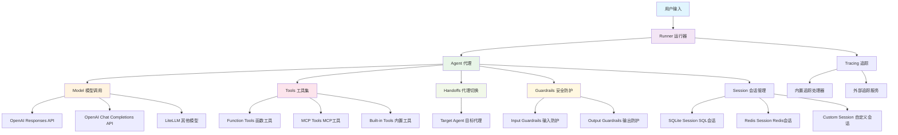
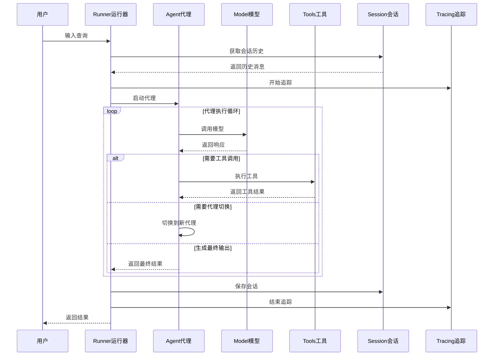

# OpenAI Agents Python SDK 源码剖析报告

## 1. 项目整体架构分析

### 1.1 项目概述

OpenAI Agents SDK 是一个轻量级但功能强大的Python框架，用于构建多代理工作流。它具有以下核心特点：

- **提供商无关性**: 支持OpenAI Responses和Chat Completions APIs，以及超过100种其他LLM模型
- **多代理协作**: 支持代理间的任务委托和切换（Handoffs）
- **工具集成**: 内置多种工具支持，包括函数调用、文件搜索、代码解释器等
- **安全防护**: 可配置的安全检查，用于输入输出验证（Guardrails）
- **会话管理**: 自动对话历史管理（Sessions）
- **追踪监控**: 内置代理运行追踪，支持调试和优化（Tracing）

### 1.2 核心概念架构图



### 1.3 模块结构分析

项目采用清晰的模块化设计，核心模块如下：

#### 1.3.1 核心执行层
- **`run.py`**: 主运行器，包含`Runner`类和`AgentRunner`类，负责代理执行循环
- **`agent.py`**: 代理定义，包含`Agent`类和`AgentBase`类，定义代理属性和行为
- **`_run_impl.py`**: 运行实现细节，包含单步执行逻辑和工具使用追踪

#### 1.3.2 模型抽象层
- **`models/`**: 模型抽象和实现
  - `interface.py`: 模型接口定义
  - `openai_responses.py`: OpenAI Responses API实现
  - `openai_chatcompletions.py`: OpenAI Chat Completions API实现
  - `multi_provider.py`: 多提供商支持
  - `litellm_model.py`: LiteLLM集成（可选）

#### 1.3.3 工具系统层
- **`tool.py`**: 工具定义和函数工具装饰器
- **`mcp/`**: Model Context Protocol支持
- **`computer.py`**: 计算机操作工具

#### 1.3.4 代理协作层
- **`handoffs.py`**: 代理间切换机制
- **`guardrail.py`**: 安全防护机制
- **`items.py`**: 运行项目和消息处理

#### 1.3.5 会话管理层
- **`memory/`**: 会话内存管理
  - `session.py`: 会话接口
  - `sqlite_session.py`: SQLite会话实现
  - `redis_session.py`: Redis会话实现

#### 1.3.6 追踪监控层
- **`tracing/`**: 追踪系统
  - `traces.py`: 追踪数据结构
  - `processor_interface.py`: 追踪处理器接口
  - `processors.py`: 内置追踪处理器

#### 1.3.7 扩展功能层
- **`voice/`**: 语音处理功能
- **`realtime/`**: 实时交互功能
- **`extensions/`**: 扩展模块

### 1.4 数据流架构图



### 1.5 关键设计模式

#### 1.5.1 策略模式（Strategy Pattern）
- **模型提供商**: 不同的模型实现（OpenAI Responses、Chat Completions、LiteLLM）都实现统一的`Model`接口
- **会话存储**: 不同的会话实现（SQLite、Redis、自定义）都实现统一的`Session`接口

#### 1.5.2 装饰器模式（Decorator Pattern）
- **函数工具**: 使用`@function_tool`装饰器将普通Python函数转换为代理工具
- **防护措施**: 使用`@input_guardrail`和`@output_guardrail`装饰器定义安全检查

#### 1.5.3 观察者模式（Observer Pattern）
- **生命周期钩子**: `RunHooks`和`AgentHooks`允许监听代理执行的各个阶段
- **追踪系统**: 支持多个追踪处理器同时监听执行过程

#### 1.5.4 构建者模式（Builder Pattern）
- **代理配置**: `Agent`类使用数据类和字段默认值，支持灵活的配置组合

### 1.6 核心API入口

#### 1.6.1 主要入口类

**Runner类** - 主要的执行入口：
```python
class Runner:
    @classmethod
    async def run(
        cls,
        starting_agent: Agent[TContext],
        input: str | list[TResponseInputItem],
        *,
        context: TContext | None = None,
        max_turns: int = DEFAULT_MAX_TURNS,
        hooks: RunHooks[TContext] | None = None,
        run_config: RunConfig | None = None,
        # ... 其他参数
    ) -> RunResult:
        """执行代理工作流的异步方法"""
        
    @classmethod
    def run_sync(cls, ...) -> RunResult:
        """执行代理工作流的同步方法"""
        
    @classmethod 
    def run_streamed(cls, ...) -> RunResultStreaming:
        """执行代理工作流的流式方法"""
```

**Agent类** - 代理定义：
```python
@dataclass
class Agent(AgentBase, Generic[TContext]):
    """AI代理配置类，包含指令、工具、防护措施、代理切换等配置"""
    
    name: str                                    # 代理名称
    instructions: str | Callable | None = None  # 代理指令（系统提示）
    tools: list[Tool] = field(default_factory=list)        # 可用工具列表
    handoffs: list[Agent | Handoff] = field(default_factory=list)  # 可切换的代理
    model: str | Model | None = None             # 使用的模型
    model_settings: ModelSettings                # 模型设置
    input_guardrails: list[InputGuardrail]      # 输入防护
    output_guardrails: list[OutputGuardrail]    # 输出防护
    output_type: type[Any] | None = None        # 输出类型
```

### 1.7 项目特点总结

1. **高度模块化**: 每个功能模块职责清晰，便于扩展和维护
2. **接口抽象**: 核心组件都有清晰的接口定义，支持多种实现
3. **异步优先**: 核心API都采用异步设计，提升性能
4. **类型安全**: 大量使用类型提示和泛型，提供更好的开发体验
5. **可观测性**: 内置完整的追踪和监控体系
6. **生产就绪**: 支持会话管理、错误处理、安全防护等生产环境需求

这种架构设计使得OpenAI Agents SDK能够支持从简单的单代理场景到复杂的多代理协作工作流，同时保持API的简洁性和框架的扩展性。
