# OpenAIAgent-02-Runner

## 模块概览

## 1. 模块职责与边界

Runner 模块是 OpenAI Agents Python SDK 的核心执行引擎，负责代理的运行调度、生命周期管理、以及复杂的多轮对话控制。该模块将代理配置转化为实际的执行流程，协调各个子系统完成智能代理任务。

### 核心职责

- **执行调度**：管理代理的完整执行生命周期，从启动到终止
- **轮次控制**：实现多轮对话机制，处理工具调用和代理切换
- **状态管理**：维护执行过程中的上下文状态和会话历史
- **流程编排**：协调模型调用、工具执行、安全检查等各个环节
- **异常处理**：统一处理执行过程中的各种异常情况
- **流式支持**：提供流式执行能力，支持实时事件推送

### 输入输出接口

**输入：**

- 起始代理实例（`Agent[TContext]`）
- 用户输入（字符串或结构化输入项列表）
- 运行配置（最大轮次、钩子函数、全局设置等）
- 会话管理（Session 对象、对话 ID 等）

**输出：**

- 执行结果（`RunResult` 或 `RunResultStreaming`）
- 包含最终输出、执行历史、使用统计等完整信息

### 上下游依赖关系

**上游调用者：**

- 用户应用：直接调用 `Runner.run()` 执行代理任务
- 代理工具化：`Agent.as_tool()` 内部使用 Runner 执行子代理
- 测试框架：自动化测试中使用 Runner 验证代理行为

**下游依赖：**

- `_run_impl.RunImpl`：核心执行逻辑实现
- `Agent`：代理配置和能力定义
- `Model`：语言模型接口抽象
- `Tool`：工具系统执行
- `Session`：会话状态持久化
- `Tracing`：可观测性追踪

## 2. 模块架构图

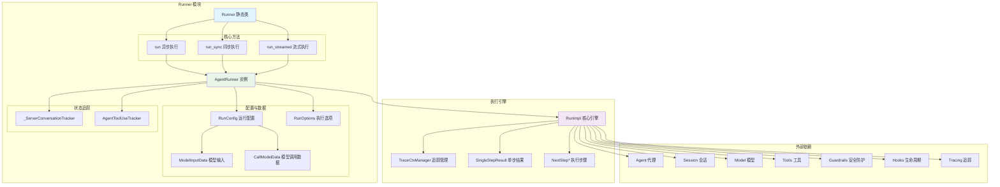

**架构说明：**

### 层次结构设计

1. **接口层**：`Runner` 静态类提供统一的调用接口
2. **执行器层**：`AgentRunner` 处理参数准备和资源管理
3. **引擎层**：`RunImpl` 实现核心的执行逻辑和状态控制
4. **配置层**：各种配置类和数据结构支持灵活配置

### 模块边界与扩展点

- **模型扩展点**：通过 `RunConfig.model_provider` 支持不同模型提供商
- **输入过滤扩展点**：`RunConfig.call_model_input_filter` 支持输入预处理
- **输出过滤扩展点**：`RunConfig.call_model_output_filter` 支持输出后处理
- **生命周期扩展点**：`RunHooks` 和 `AgentHooks` 支持事件监听
- **会话扩展点**：`Session` 接口支持不同存储后端

### 状态管理策略

- **执行状态**：由 `RunImpl` 维护，包括当前代理、轮次计数、执行历史
- **会话状态**：由 `Session` 对象管理，支持持久化和跨执行连续性
- **服务器状态**：`_ServerConversationTracker` 处理 OpenAI 对话 API 的状态同步
- **工具使用状态**：`AgentToolUseTracker` 追踪工具使用历史

### 资源占用控制

- **内存控制**：通过 `max_turns` 限制执行轮次，避免无限循环
- **时间控制**：支持全局和单步超时设置
- **并发控制**：工具执行支持并发限制和资源池管理

## 3. 关键算法与流程剖析

### 3.1 主执行循环算法

```python
async def run(self, starting_agent: Agent[TContext], input: str | list[TResponseInputItem], **kwargs) -> RunResult:
    """主执行循环的简化逻辑"""
    # 1) 初始化执行环境
    context = kwargs.get("context")
    max_turns = kwargs.get("max_turns", DEFAULT_MAX_TURNS)
    run_config = kwargs.get("run_config") or RunConfig()
    session = kwargs.get("session")
    
    # 2) 准备输入数据
    prepared_input = await self._prepare_input_with_session(input, session, run_config.session_input_callback)
    
    # 3) 创建执行追踪器
    tool_use_tracker = AgentToolUseTracker()
    server_conversation_tracker = _ServerConversationTracker(...)
    
    # 4) 启动追踪上下文
    with TraceCtxManager(workflow_name=run_config.workflow_name) as trace_ctx:
        # 5) 创建执行引擎实例
        run_impl = RunImpl(
            run_config=run_config,
            hooks=hooks,
            tool_use_tracker=tool_use_tracker,
            server_conversation_tracker=server_conversation_tracker,
            trace_ctx=trace_ctx
        )
        
        # 6) 执行主循环
        return await run_impl.run(
            starting_agent=starting_agent,
            original_input=input,
            prepared_input=prepared_input,
            context=context,
            max_turns=max_turns
        )
```

**算法目的：** 提供统一的代理执行入口，处理各种配置和状态管理需求。

**复杂度分析：**

- 时间复杂度：O(n*m)，n 为最大轮次，m 为每轮平均操作数
- 空间复杂度：O(h)，h 为会话历史长度
- 并发度：支持工具并发执行，I/O 密集型操作优化

**设计理由：**

- 分层设计：接口层处理参数验证，引擎层专注执行逻辑
- 状态隔离：不同类型的状态由专门的组件管理
- 资源控制：通过多层次的限制机制避免资源耗尽

### 3.2 输入准备与会话集成

```python
async def _prepare_input_with_session(
    self,
    input: str | list[TResponseInputItem],
    session: Session | None,
    session_input_callback: SessionInputCallback | None
) -> list[TResponseInputItem]:
    """集成会话历史的输入准备算法"""
    
    # 1) 转换用户输入为标准格式
    user_input_items = ItemHelpers.input_to_new_input_list(input)
    
    if session is None:
        return user_input_items
    
    # 2) 从会话加载历史消息
    try:
        session_items = await session.get_messages()
    except Exception as e:
        logger.warning(f"Failed to load session messages: {e}")
        session_items = []
    
    # 3) 应用会话输入回调（如果配置）
    if session_input_callback:
        try:
            if inspect.iscoroutinefunction(session_input_callback):
                session_items = await session_input_callback(session_items, user_input_items)
            else:
                session_items = session_input_callback(session_items, user_input_items)
        except Exception as e:
            logger.error(f"Session input callback failed: {e}")
    
    # 4) 合并历史消息和当前输入
    combined_input = []
    combined_input.extend(session_items)
    combined_input.extend(user_input_items)
    
    return combined_input
```

**流程目的：** 将用户输入与会话历史有机结合，提供完整的对话上下文。

**关键决策点：**

1. **会话加载失败处理**：优雅降级，记录警告但不阻断执行
2. **回调函数支持**：允许用户自定义会话历史的处理逻辑
3. **输入合并策略**：历史消息在前，当前输入在后，保持时间顺序

**异常处理策略：**

- 会话加载失败：记录警告，使用空历史继续执行
- 回调函数异常：记录错误，跳过回调处理
- 输入格式错误：提前验证，抛出明确的类型错误

### 3.3 服务器对话状态同步

```python
class _ServerConversationTracker:
    """OpenAI 服务器对话状态同步算法"""
    
    def prepare_input(
        self,
        original_input: str | list[TResponseInputItem],
        generated_items: list[RunItem],
    ) -> list[TResponseInputItem]:
        """准备发送到服务器的输入，避免重复发送"""
        input_items: list[TResponseInputItem] = []
        
        # 首次调用时包含原始输入
        if not generated_items:
            input_items.extend(ItemHelpers.input_to_new_input_list(original_input))
        
        # 处理生成的项目，跳过已发送或来自服务器的项目
        for item in generated_items:
            raw_item_id = id(item.raw_item)
            
            # 跳过已发送或服务器生成的项目
            if raw_item_id in self.sent_items or raw_item_id in self.server_items:
                continue
                
            input_items.append(item.to_input_item())
            self.sent_items.add(raw_item_id)  # 标记为已发送
        
        return input_items
    
    def track_server_items(self, model_response: ModelResponse) -> None:
        """追踪服务器返回的项目，避免重复发送"""
        for output_item in model_response.output:
            self.server_items.add(id(output_item))
        
        # 更新 previous_response_id（仅在使用该模式时）
        if (self.conversation_id is None
            and self.previous_response_id is not None
            and model_response.response_id is not None):
            self.previous_response_id = model_response.response_id
```

**同步目的：** 在使用 OpenAI 对话 API 时，避免重复发送已处理的消息，提高效率并减少成本。

**核心算法特点：**

1. **去重机制**：使用对象 ID 追踪已发送和服务器生成的项目
2. **状态维护**：动态更新 `previous_response_id` 支持增量对话
3. **内存优化**：使用集合结构快速查找，避免列表遍历

## 4. 配置参数详解

### 核心执行参数

| 参数名 | 类型 | 默认值 | 说明 | 影响范围 |
|--------|------|--------|------|----------|
| `starting_agent` | Agent[TContext] | 必需 | 起始执行代理 | 整个执行流程 |
| `input` | str \| list[TResponseInputItem] | 必需 | 用户输入 | 首次模型调用 |
| `context` | TContext \| None | None | 运行上下文 | 工具和钩子函数 |
| `max_turns` | int | 10 | 最大执行轮次 | 防止无限循环 |
| `session` | Session \| None | None | 会话管理对象 | 历史加载和保存 |

### 高级配置参数

| 参数名 | 类型 | 默认值 | 说明 | 使用场景 |
|--------|------|--------|------|----------|
| `hooks` | RunHooks[TContext] \| None | None | 执行生命周期钩子 | 监控和调试 |
| `run_config` | RunConfig \| None | None | 全局运行配置 | 模型和行为定制 |
| `conversation_id` | str \| None | None | OpenAI 对话 ID | 服务器端状态管理 |
| `previous_response_id` | str \| None | None | 前一个响应 ID | 增量对话模式 |

### RunConfig 全局配置

```python
@dataclass
class RunConfig:
    """全局运行配置，影响整个执行过程"""
    
    # 模型配置
    model: str | Model | None = None                    # 覆盖代理模型设置
    model_provider: ModelProvider = field(default_factory=MultiProvider)  # 模型提供商
    model_settings: ModelSettings | None = None        # 全局模型参数
    
    # 输入输出过滤
    call_model_input_filter: CallModelInputFilter | None = None   # 模型输入预处理
    call_model_output_filter: CallModelOutputFilter | None = None # 模型输出后处理
    
    # 安全防护
    input_guardrails: list[InputGuardrail[Any]] | None = None     # 全局输入安全检查
    output_guardrails: list[OutputGuardrail[Any]] | None = None   # 全局输出安全检查
    
    # 会话管理
    session_input_callback: SessionInputCallback | None = None    # 会话输入处理回调
    
    # 切换配置
    handoff_input_filter: HandoffInputFilter | None = None       # 全局切换输入过滤
    
    # 追踪配置
    workflow_name: str | None = None                             # 工作流名称
    disable_tracing: bool = False                                # 禁用追踪
    trace_include_sensitive_data: bool = True                    # 包含敏感数据
```

**配置优先级：**

1. RunConfig 全局配置（最高优先级）
2. Agent 代理级别配置
3. 系统默认配置（最低优先级）

**常用配置组合：**

```python
# 生产环境配置
production_config = RunConfig(
    model_settings=ModelSettings(temperature=0.3),  # 降低随机性
    disable_tracing=False,                          # 启用追踪
    trace_include_sensitive_data=False,             # 不包含敏感数据
    input_guardrails=[content_safety_guardrail],    # 启用安全检查
    output_guardrails=[output_safety_guardrail]
)

# 开发调试配置
debug_config = RunConfig(
    disable_tracing=False,                          # 启用详细追踪
    trace_include_sensitive_data=True,              # 包含完整数据
    workflow_name="debug_session"                   # 便于追踪识别
)

# 高性能配置
performance_config = RunConfig(
    disable_tracing=True,                           # 禁用追踪减少开销
    model_settings=ModelSettings(max_tokens=1000), # 限制输出长度
    call_model_input_filter=input_compression_filter # 压缩输入
)
```

## 5. 最佳实践与使用模式

### 5.1 基础使用模式

```python
import asyncio
from agents import Agent, Runner

async def basic_usage():
    """基础使用：简单对话"""
    agent = Agent(
        name="Assistant",
        instructions="你是一个有用的助手"
    )
    
    result = await Runner.run(agent, "你好！")
    print(result.final_output)
    
    # 查看执行统计
    print(f"使用令牌: {result.usage.total_tokens}")
    print(f"执行轮次: {len(result.all_items)}")

asyncio.run(basic_usage())
```

### 5.2 会话管理模式

```python
from agents import Agent, Runner, SQLiteSession

async def session_management():
    """会话管理：维护对话历史"""
    agent = Agent(
        name="ChatBot",
        instructions="维持连贯的对话，记住之前的交流内容"
    )
    
    # 创建持久化会话
    session = SQLiteSession("chat_history.db")
    
    # 多轮对话
    questions = [
        "我叫张三，今年30岁",
        "我的年龄是多少？",
        "我的名字是什么？"
    ]
    
    for question in questions:
        result = await Runner.run(
            agent,
            question,
            session=session  # 自动加载和保存历史
        )
        print(f"Q: {question}")
        print(f"A: {result.final_output}\n")
    
    await session.close()

asyncio.run(session_management())
```

### 5.3 流式执行模式

```python
from agents import Agent, Runner

def streaming_execution():
    """流式执行：实时获取执行事件"""
    agent = Agent(
        name="StreamingAgent",
        instructions="详细解释你的思考过程"
    )
    
    # 启动流式执行
    result = Runner.run_streamed(
        agent,
        "解释量子计算的基本原理"
    )
    
    print("开始流式执行...")
    
    # 实时处理事件
    for event in result.stream_events():
        if event.type == "agent_updated":
            print(f"代理切换: {event.data.agent.name}")
        elif event.type == "run_item":
            if event.data.item.type == "message_output":
                print(f"输出: {event.data.item.content}")
        elif event.type == "raw_responses":
            print(f"模型响应: {len(event.data.responses)} 个响应")
    
    print(f"最终结果: {result.final_output}")

streaming_execution()
```

### 5.4 错误处理与监控模式

```python
from agents import Agent, Runner, RunConfig
from agents.exceptions import MaxTurnsExceeded, InputGuardrailTripwireTriggered

async def error_handling():
    """错误处理：优雅处理各种异常情况"""
    agent = Agent(
        name="ReliableAgent",
        instructions="尽力完成任务，但要注意安全边界"
    )
    
    config = RunConfig(
        max_turns=5,  # 限制最大轮次
        disable_tracing=False  # 启用追踪便于调试
    )
    
    try:
        result = await Runner.run(
            agent,
            "帮我写一个复杂的程序",
            run_config=config,
            max_turns=3
        )
        return result
        
    except MaxTurnsExceeded as e:
        print(f"达到最大轮次限制: {e.details.max_turns}")
        print(f"当前执行历史: {len(e.details.items)} 项")
        # 可以返回部分结果
        return e.details.partial_result
        
    except InputGuardrailTripwireTriggered as e:
        print(f"输入安全检查失败: {e.guardrail_name}")
        print(f"失败原因: {e.failure_reason}")
        # 记录安全事件
        return None
        
    except Exception as e:
        print(f"未预期错误: {e}")
        # 记录错误日志
        return None

result = await error_handling()
```

### 5.5 高级定制模式

```python
from agents import Agent, Runner, RunConfig, RunHooks

class CustomRunHooks(RunHooks):
    """自定义执行钩子"""
    
    async def on_agent_start(self, context, agent):
        print(f"开始执行代理: {agent.name}")
    
    async def on_model_call_start(self, context, agent, input_data):
        print(f"模型调用开始，输入长度: {len(input_data.input)}")
    
    async def on_tool_execution_start(self, context, agent, tool_name, tool_input):
        print(f"工具执行开始: {tool_name}")
    
    async def on_agent_end(self, context, agent, result):
        print(f"代理执行完成: {agent.name}, 令牌使用: {result.usage.total_tokens}")

async def advanced_customization():
    """高级定制：完全控制执行流程"""
    
    def custom_input_filter(call_data):
        """自定义输入过滤"""
        # 添加系统提示
        system_prompt = "请在回答前先思考问题的关键点。"
        call_data.model_data.instructions = system_prompt
        return call_data.model_data
    
    def custom_output_filter(response):
        """自定义输出过滤"""
        # 添加输出格式化
        if hasattr(response, 'final_output'):
            response.final_output = f"[AI回答] {response.final_output}"
        return response
    
    agent = Agent(
        name="CustomAgent",
        instructions="你是一个定制化的AI助手"
    )
    
    config = RunConfig(
        call_model_input_filter=custom_input_filter,
        call_model_output_filter=custom_output_filter,
        workflow_name="custom_workflow"
    )
    
    result = await Runner.run(
        agent,
        "解释机器学习的基本概念",
        hooks=CustomRunHooks(),
        run_config=config
    )
    
    return result

result = await advanced_customization()
```

这些最佳实践展示了 Runner 模块在不同场景下的灵活应用，从简单的单次对话到复杂的流式处理和高级定制，为开发者提供了完整的解决方案。

---

## API接口

## 1. API 总览

Runner 模块是 OpenAI Agents SDK 的执行引擎核心，提供统一的代理执行接口。所有代理的运行都通过 Runner 类的静态方法进行，支持同步、异步、流式等多种执行模式。

### API 层次结构

```
Runner (执行调度器)
    ├── run() - 标准异步执行
    ├── run_streamed() - 流式异步执行
    └── run_sync() - 同步阻塞执行

RunConfig (执行配置)
    ├── 模型配置
    ├── 安全防护配置
    ├── 生命周期钩子
    └── 服务器对话管理

RunResult (执行结果)
    ├── final_output - 最终输出
    ├── new_items - 生成的历史项
    ├── raw_responses - 原始模型响应
    └── guardrail_results - 防护检查结果

RunResultStreaming (流式结果)
    ├── stream_events() - 流式事件生成器
    ├── current_agent - 当前执行代理
    └── is_complete - 完成状态
```

### API 分类

| API 类别 | 核心 API | 功能描述 |
|---------|---------|---------|
| **执行入口** | `Runner.run()` | 标准异步执行代理 |
| | `Runner.run_streamed()` | 流式异步执行，实时事件推送 |
| | `Runner.run_sync()` | 同步阻塞执行（便捷方法） |
| **配置管理** | `RunConfig.__init__()` | 创建执行配置实例 |
| | `RunConfig.model` | 全局模型配置 |
| | `RunConfig.model_settings` | 模型参数配置 |
| | `RunConfig.input_guardrails` | 输入安全防护 |
| | `RunConfig.output_guardrails` | 输出安全防护 |
| | `RunConfig.max_turns` | 最大执行轮次 |
| **结果处理** | `RunResult.final_output` | 获取最终输出 |
| | `RunResult.to_input_list()` | 转换为新输入列表 |
| | `RunResult.final_output_as()` | 类型安全的输出转换 |
| | `RunResultStreaming.stream_events()` | 流式事件迭代器 |
| | `RunResultStreaming.cancel()` | 取消流式执行 |
| **上下文管理** | `RunContextWrapper.context` | 用户自定义上下文 |
| | `RunContextWrapper.usage` | Token 使用统计 |

## 2. Runner 执行入口 API

### 2.1 Runner.run - 标准异步执行

**API 签名：**

```python
@staticmethod
async def run(
    agent: Agent[TContext],
    input: str | list[TResponseInputItem],
    session: Session | None = None,
    run_config: RunConfig | None = None,
    context: TContext | None = None,
) -> RunResult
```

**功能描述：**
执行代理的核心方法，处理完整的执行循环直到产生最终输出。支持会话历史管理、防护检查、工具调用、代理切换等完整功能。

**请求参数：**

| 参数名 | 类型 | 必需 | 默认值 | 说明 |
|--------|------|------|--------|------|
| `agent` | `Agent[TContext]` | 是 | - | 要执行的代理实例 |
| `input` | `str \| list[TResponseInputItem]` | 是 | - | 用户输入，可以是字符串或结构化输入列表 |
| `session` | `Session \| None` | 否 | `None` | 会话对象，用于管理对话历史 |
| `run_config` | `RunConfig \| None` | 否 | `None` | 执行配置，控制模型、防护、钩子等 |
| `context` | `TContext \| None` | 否 | `None` | 用户自定义上下文，传递给工具和钩子 |

**返回结构：**

```python
@dataclass
class RunResult:
    input: str | list[TResponseInputItem]  # 原始输入
    new_items: list[RunItem]               # 新生成的运行项
    raw_responses: list[ModelResponse]     # 原始模型响应列表
    final_output: Any                      # 最终输出（通常是字符串）
    last_agent: Agent[Any]                 # 最后执行的代理
    
    # 防护检查结果
    input_guardrail_results: list[InputGuardrailResult]
    output_guardrail_results: list[OutputGuardrailResult]
    tool_input_guardrail_results: list[ToolInputGuardrailResult]
    tool_output_guardrail_results: list[ToolOutputGuardrailResult]
    
    # 上下文包装器
    context_wrapper: RunContextWrapper[Any]
    
    # 便捷方法
    def final_output_as(cls: type[T]) -> T
    def to_input_list() -> list[TResponseInputItem]
    
    # 属性
    @property
    def last_response_id() -> str | None
```

**使用示例：**

```python
from agents import Agent, Runner
from agents.memory import SQLiteSession

async def basic_run_example():
    """基础执行示例"""
    
    # 创建代理
    agent = Agent(
        name="Assistant",
        instructions="你是一个友好的AI助手。"
    )
    
    # 执行代理
    result = await Runner.run(
        agent=agent,
        input="你好，请介绍一下自己。"
    )
    
    # 访问结果
    print(f"最终输出: {result.final_output}")
    print(f"生成了 {len(result.new_items)} 个新项目")
    print(f"调用模型 {len(result.raw_responses)} 次")
    print(f"最后代理: {result.last_agent.name}")

async def run_with_session_example():
    """带会话历史的执行示例"""
    
    agent = Agent(
        name="ChatBot",
        instructions="你是一个记忆良好的聊天机器人。"
    )
    
    # 创建会话
    session = SQLiteSession("user_123", db_path="chat.db")
    
    # 第一轮对话
    result1 = await Runner.run(
        agent=agent,
        input="我叫张三，我喜欢编程。",
        session=session
    )
    print(f"助手: {result1.final_output}")
    
    # 第二轮对话（有历史上下文）
    result2 = await Runner.run(
        agent=agent,
        input="你还记得我的名字吗？",
        session=session
    )
    print(f"助手: {result2.final_output}")
    # 预期输出: "当然记得，你叫张三..."

async def run_with_tools_example():
    """带工具的执行示例"""
    
    from agents import function_tool
    
    @function_tool
    def calculate(expression: str) -> str:
        """计算数学表达式"""
        return str(eval(expression))
    
    agent = Agent(
        name="MathBot",
        instructions="你是一个数学助手，使用calculate工具进行计算。",
        tools=[calculate]
    )
    
    result = await Runner.run(
        agent=agent,
        input="请计算 123 * 456 的结果"
    )
    
    print(f"最终输出: {result.final_output}")
    
    # 查看生成的项目
    for item in result.new_items:
        if hasattr(item, 'tool_name'):
            print(f"调用工具: {item.tool_name}")
        elif hasattr(item, 'content'):
            print(f"消息: {item.content}")

async def run_with_config_example():
    """带配置的执行示例"""
    
    from agents import RunConfig
    
    agent = Agent(
        name="ConfiguredAgent",
        instructions="遵循配置运行的代理。"
    )
    
    # 创建配置
    config = RunConfig(
        model="gpt-4o",  # 指定模型
        max_turns=5,     # 最多5轮对话
        trace_include_sensitive_data=False  # 不包含敏感数据
    )
    
    result = await Runner.run(
        agent=agent,
        input="请帮我完成一个复杂任务。",
        run_config=config
    )
    
    print(f"使用的模型: {config.model}")
    print(f"实际轮次: {len(result.raw_responses)}")

async def run_with_context_example():
    """带自定义上下文的执行示例"""
    
    from dataclasses import dataclass
    
    @dataclass
    class UserContext:
        user_id: str
        database_connection: Any
        preferences: dict
    
    @function_tool
    def get_user_preference(key: str, context: UserContext) -> str:
        """获取用户偏好设置"""
        return context.preferences.get(key, "未设置")
    
    agent = Agent(
        name="PersonalAssistant",
        instructions="根据用户偏好提供个性化服务。",
        tools=[get_user_preference]
    )
    
    # 创建用户上下文
    user_context = UserContext(
        user_id="user_123",
        database_connection=None,  # 实际应用中是数据库连接
        preferences={"language": "中文", "theme": "dark"}
    )
    
    result = await Runner.run(
        agent=agent,
        input="我的语言偏好是什么？",
        context=user_context
    )
    
    print(f"输出: {result.final_output}")
    print(f"Token使用: {result.context_wrapper.usage}")
```

**执行流程：**

1. **初始化阶段**：加载会话历史、初始化上下文
2. **输入防护**：运行输入防护检查
3. **执行循环**：
   - 调用模型生成响应
   - 执行工具调用（如果有）
   - 处理代理切换（如果有）
   - 检查是否达到最终输出
4. **输出防护**：运行输出防护检查
5. **结果封装**：保存历史、返回结果

**异常情况：**

- `MaxTurnsExceeded`: 超过最大执行轮次（默认10轮）
- `InputGuardrailTripwireTriggered`: 输入防护触发
- `OutputGuardrailTripwireTriggered`: 输出防护触发
- `ModelBehaviorError`: 模型行为异常
- `UserError`: 用户工具函数抛出的异常

### 2.2 Runner.run_streamed - 流式异步执行

**API 签名：**

```python
@staticmethod
async def run_streamed(
    agent: Agent[TContext],
    input: str | list[TResponseInputItem],
    session: Session | None = None,
    run_config: RunConfig | None = None,
    context: TContext | None = None,
) -> RunResultStreaming
```

**功能描述：**
流式执行代理，实时推送执行过程中的事件。适用于需要实时反馈的场景，如聊天界面的打字效果。

**请求参数：**
与 `Runner.run()` 完全相同。

**返回结构：**

```python
@dataclass
class RunResultStreaming(RunResultBase):
    current_agent: Agent[Any]      # 当前执行的代理
    current_turn: int              # 当前执行轮次
    max_turns: int                 # 最大允许轮次
    final_output: Any              # 最终输出（完成前为None）
    is_complete: bool              # 是否完成执行
    
    # 继承自 RunResultBase
    input: str | list[TResponseInputItem]
    new_items: list[RunItem]
    raw_responses: list[ModelResponse]
    input_guardrail_results: list[InputGuardrailResult]
    output_guardrail_results: list[OutputGuardrailResult]
    tool_input_guardrail_results: list[ToolInputGuardrailResult]
    tool_output_guardrail_results: list[ToolOutputGuardrailResult]
    context_wrapper: RunContextWrapper[Any]
    
    # 流式方法
    async def stream_events() -> AsyncIterator[StreamEvent]
    def cancel() -> None
```

**StreamEvent 类型：**

```python
# StreamEvent 是联合类型
StreamEvent = (
    RawResponsesStreamEvent |      # 原始模型响应事件
    RunItemStreamEvent |           # 运行项事件
    AgentUpdatedStreamEvent        # 代理更新事件
)

# RunItemStreamEvent 的事件名称
event_names = [
    "message_output_created",      # 消息输出创建
    "tool_called",                 # 工具被调用
    "tool_output",                 # 工具输出
    "handoff_requested",           # 代理切换请求
    "handoff_occured",             # 代理切换发生
    "reasoning_item_created",      # 推理项创建
    "mcp_approval_requested",      # MCP批准请求
    "mcp_list_tools"               # MCP工具列表
]
```

**使用示例：**

```python
async def streamed_basic_example():
    """基础流式执行示例"""
    
    agent = Agent(
        name="StreamingAssistant",
        instructions="你是一个流式响应助手。"
    )
    
    # 启动流式执行
    result = await Runner.run_streamed(
        agent=agent,
        input="请详细介绍一下人工智能的发展历史。"
    )
    
    # 处理流式事件
    accumulated_text = ""
    
    async for event in result.stream_events():
        if event.type == "run_item_stream_event":
            if event.name == "message_output_created":
                # 消息输出事件
                content = event.item.content
                
                # 计算增量内容
                if content != accumulated_text:
                    delta = content[len(accumulated_text):]
                    print(delta, end="", flush=True)
                    accumulated_text = content
            
            elif event.name == "tool_called":
                # 工具调用事件
                print(f"\n[调用工具: {event.item.tool_name}]")
            
            elif event.name == "tool_output":
                # 工具输出事件
                print(f"[工具结果: {event.item.output[:50]}...]")
        
        elif event.type == "agent_updated_stream_event":
            # 代理更新事件
            print(f"\n[切换到代理: {event.new_agent.name}]")
    
    print(f"\n\n最终输出: {result.final_output}")

async def streamed_with_ui_example():
    """流式执行与UI集成示例"""
    
    from typing import Callable
    
    class ChatUI:
        """模拟的聊天UI类"""
        
        def __init__(self):
            self.messages = []
            self.current_message = ""
        
        def append_to_current_message(self, text: str):
            """追加文本到当前消息"""
            self.current_message += text
            # 实际应用中这里会更新UI
            print(text, end="", flush=True)
        
        def finish_current_message(self):
            """完成当前消息"""
            self.messages.append(self.current_message)
            self.current_message = ""
            print()  # 换行
        
        def show_tool_call(self, tool_name: str, args: dict):
            """显示工具调用"""
            print(f"\n🔧 正在使用工具: {tool_name}")
            print(f"   参数: {args}")
        
        def show_tool_result(self, result: str):
            """显示工具结果"""
            print(f"✅ 工具结果: {result[:100]}...")
    
    async def run_with_ui(agent: Agent, user_input: str):
        """带UI的流式执行"""
        
        ui = ChatUI()
        
        result = await Runner.run_streamed(
            agent=agent,
            input=user_input
        )
        
        accumulated_content = ""
        
        async for event in result.stream_events():
            if event.type == "run_item_stream_event":
                if event.name == "message_output_created":
                    # 增量文本输出
                    content = event.item.content
                    if content != accumulated_content:
                        delta = content[len(accumulated_content):]
                        ui.append_to_current_message(delta)
                        accumulated_content = content
                
                elif event.name == "tool_called":
                    # 显示工具调用
                    ui.show_tool_call(
                        event.item.tool_name,
                        event.item.arguments
                    )
                
                elif event.name == "tool_output":
                    # 显示工具结果
                    ui.show_tool_result(event.item.output)
        
        ui.finish_current_message()
        return result
    
    # 使用示例
    agent = Agent(
        name="UIAssistant",
        instructions="你是一个用户界面助手。"
    )
    
    result = await run_with_ui(agent, "请帮我查询今天的天气")

async def streamed_with_cancellation_example():
    """带取消功能的流式执行示例"""
    
    import asyncio
    
    agent = Agent(
        name="LongRunningAgent",
        instructions="你会进行长时间的处理。"
    )
    
    result = await Runner.run_streamed(
        agent=agent,
        input="请进行一个非常详细的分析。"
    )
    
    # 设置超时取消
    async def cancel_after_timeout(seconds: float):
        """N秒后取消执行"""
        await asyncio.sleep(seconds)
        if not result.is_complete:
            print(f"\n[超时 {seconds}秒，取消执行]")
            result.cancel()
    
    # 启动超时任务
    timeout_task = asyncio.create_task(cancel_after_timeout(5.0))
    
    try:
        async for event in result.stream_events():
            # 处理事件
            if event.type == "run_item_stream_event":
                if event.name == "message_output_created":
                    print(".", end="", flush=True)
    except asyncio.CancelledError:
        print("\n执行已取消")
    finally:
        timeout_task.cancel()

async def streamed_error_handling_example():
    """流式执行的错误处理示例"""
    
    agent = Agent(
        name="ErrorProneAgent",
        instructions="可能会遇到错误的代理。"
    )
    
    result = await Runner.run_streamed(
        agent=agent,
        input="执行可能失败的任务"
    )
    
    try:
        async for event in result.stream_events():
            # 处理事件
            if event.type == "run_item_stream_event":
                print(f"事件: {event.name}")
    
    except MaxTurnsExceeded as e:
        print(f"超过最大轮次: {e}")
        print(f"已生成 {len(e.run_data.new_items)} 个项目")
    
    except InputGuardrailTripwireTriggered as e:
        print(f"输入防护触发: {e.guardrail_result.output.message}")
    
    except OutputGuardrailTripwireTriggered as e:
        print(f"输出防护触发: {e.guardrail_result.output.message}")
    
    except Exception as e:
        print(f"执行错误: {e}")
```

**流式执行特点：**

1. **实时反馈**：事件实时推送，无需等待完成
2. **增量更新**：文本内容增量生成
3. **可取消**：支持中途取消执行
4. **异常传播**：异常通过流式接口传播

### 2.3 Runner.run_sync - 同步阻塞执行

**API 签名：**

```python
@staticmethod
def run_sync(
    agent: Agent[TContext],
    input: str | list[TResponseInputItem],
    session: Session | None = None,
    run_config: RunConfig | None = None,
    context: TContext | None = None,
) -> RunResult
```

**功能描述：**
同步阻塞版本的执行方法，便于在非异步环境中使用。内部使用 `asyncio.run()` 包装异步执行。

**请求参数：**
与 `Runner.run()` 完全相同。

**返回结构：**
与 `Runner.run()` 返回的 `RunResult` 完全相同。

**使用示例：**

```python
def sync_basic_example():
    """同步执行基础示例"""
    
    from agents import Agent, Runner
    
    agent = Agent(
        name="SyncAssistant",
        instructions="同步执行的助手。"
    )
    
    # 同步执行（阻塞）
    result = Runner.run_sync(
        agent=agent,
        input="你好，世界！"
    )
    
    print(f"输出: {result.final_output}")

def sync_in_script_example():
    """在脚本中使用同步执行"""
    
    # 不需要 async/await 语法
    if __name__ == "__main__":
        agent = Agent(name="ScriptAgent", instructions="脚本助手")
        result = Runner.run_sync(agent, "执行任务")
        print(result.final_output)

def sync_with_traditional_code_example():
    """与传统同步代码集成"""
    
    def legacy_function():
        """传统的同步函数"""
        agent = Agent(name="LegacyAgent", instructions="传统代码助手")
        
        # 可以直接调用，无需异步上下文
        result = Runner.run_sync(agent, "处理请求")
        
        return result.final_output
    
    # 调用
    output = legacy_function()
    print(output)
```

**使用场景：**

- 快速脚本和原型开发
- 与传统同步代码集成
- Jupyter Notebook 非异步单元格
- 命令行工具

**注意事项：**

- 阻塞执行，不适合高并发场景
- 不能在已有的事件循环中调用
- 推荐在生产环境使用异步版本 `Runner.run()`

## 3. RunConfig 配置 API

### 3.1 RunConfig 构造函数

**API 签名：**

```python
@dataclass
class RunConfig:
    def __init__(
        self,
        model: str | Model | None = None,
        model_provider: ModelProvider = MultiProvider(),
        model_settings: ModelSettings | None = None,
        handoff_input_filter: HandoffInputFilter | None = None,
        input_guardrails: list[InputGuardrail[Any]] | None = None,
        output_guardrails: list[OutputGuardrail[Any]] | None = None,
        max_turns: int = DEFAULT_MAX_TURNS,  # 默认10
        trace_include_sensitive_data: bool = True,
        call_model_input_filter: CallModelInputFilter | None = None,
        session_input_callback: SessionInputCallback | None = None,
        hooks: RunHooksBase | None = None,
        conversation_id: str | None = None,
        previous_response_id: str | None = None,
    )
```

**配置参数详解：**

| 参数名 | 类型 | 默认值 | 说明 |
|--------|------|--------|------|
| `model` | `str \| Model \| None` | `None` | 全局模型配置，覆盖代理的模型设置 |
| `model_provider` | `ModelProvider` | `MultiProvider()` | 模型提供商，用于解析模型名称 |
| `model_settings` | `ModelSettings \| None` | `None` | 全局模型参数（温度、最大token等） |
| `handoff_input_filter` | `HandoffInputFilter \| None` | `None` | 全局代理切换输入过滤器 |
| `input_guardrails` | `list[InputGuardrail] \| None` | `None` | 输入防护检查列表 |
| `output_guardrails` | `list[OutputGuardrail] \| None` | `None` | 输出防护检查列表 |
| `max_turns` | `int` | `10` | 最大执行轮次，防止无限循环 |
| `trace_include_sensitive_data` | `bool` | `True` | 追踪是否包含敏感数据 |
| `call_model_input_filter` | `CallModelInputFilter \| None` | `None` | 模型调用前的输入过滤器 |
| `session_input_callback` | `SessionInputCallback \| None` | `None` | 会话输入回调，用于修改保存的历史 |
| `hooks` | `RunHooksBase \| None` | `None` | 生命周期钩子函数 |
| `conversation_id` | `str \| None` | `None` | 服务器端对话ID（OpenAI Conversations API） |
| `previous_response_id` | `str \| None` | `None` | 上一个响应ID（服务器端对话状态） |

**配置示例：**

```python
from agents import RunConfig, ModelSettings
from agents.guardrail import InputGuardrail, OutputGuardrail

# 基础配置
basic_config = RunConfig(
    model="gpt-4o",
    max_turns=15
)

# 完整配置
advanced_config = RunConfig(
    # 模型配置
    model="gpt-4o",
    model_settings=ModelSettings(
        temperature=0.7,
        max_tokens=2000,
        top_p=0.9
    ),
    
    # 安全防护
    input_guardrails=[ContentModerationGuardrail()],
    output_guardrails=[SensitiveInfoGuardrail()],
    
    # 执行控制
    max_turns=20,
    trace_include_sensitive_data=False,
    
    # 生命周期钩子
    hooks=MyCustomHooks()
)

# 服务器对话配置
server_conversation_config = RunConfig(
    conversation_id="conv_abc123",  # 使用现有对话
    model="gpt-4o"
)
```

### 3.2 配置项详解

**model - 模型配置：**

```python
# 字符串模型名称
config = RunConfig(model="gpt-4o")
config = RunConfig(model="gpt-4o-mini")
config = RunConfig(model="gpt-3.5-turbo")

# 自定义模型实例
from agents.models import CustomModel
custom_model = CustomModel(...)
config = RunConfig(model=custom_model)

# 覆盖代理的模型设置
agent = Agent(name="A", model="gpt-3.5-turbo")
config = RunConfig(model="gpt-4o")
result = await Runner.run(agent, "test", run_config=config)
# 实际使用 gpt-4o（配置优先）
```

**model_settings - 模型参数：**

```python
from agents import ModelSettings

# 创建性思维配置
creative_settings = ModelSettings(
    temperature=1.2,      # 高随机性
    top_p=0.95,           # 多样性
    max_tokens=3000       # 较长输出
)

# 精确性配置
precise_settings = ModelSettings(
    temperature=0.1,      # 低随机性
    top_p=0.5,            # 集中采样
    max_tokens=1000       # 简洁输出
)

# 应用配置
config = RunConfig(model_settings=creative_settings)
result = await Runner.run(agent, input, run_config=config)
```

**input_guardrails / output_guardrails - 安全防护：**

```python
from agents.guardrail import InputGuardrail, OutputGuardrail

class ContentModerationGuardrail(InputGuardrail):
    """内容审核防护"""
    async def run(self, input_text: str, context: Any):
        # 检查不当内容
        if contains_inappropriate_content(input_text):
            return InputGuardrailResult(
                output=GuardrailFunctionOutput(
                    tripwire_triggered=True,
                    message="输入包含不当内容"
                )
            )
        return InputGuardrailResult(
            output=GuardrailFunctionOutput(tripwire_triggered=False)
        )

class PIIDetectionGuardrail(OutputGuardrail):
    """个人信息检测防护"""
    async def run(self, output_text: str, context: Any):
        # 检测个人身份信息
        if contains_pii(output_text):
            return OutputGuardrailResult(
                output=GuardrailFunctionOutput(
                    tripwire_triggered=True,
                    message="输出包含个人隐私信息"
                )
            )
        return OutputGuardrailResult(
            output=GuardrailFunctionOutput(tripwire_triggered=False)
        )

# 配置防护
config = RunConfig(
    input_guardrails=[ContentModerationGuardrail()],
    output_guardrails=[PIIDetectionGuardrail()]
)
```

**max_turns - 最大轮次：**

```python
# 简单任务：较少轮次
simple_config = RunConfig(max_turns=5)

# 复杂任务：较多轮次
complex_config = RunConfig(max_turns=20)

# 无限制（不推荐）
unlimited_config = RunConfig(max_turns=9999)

# 超过轮次会抛出异常
try:
    result = await Runner.run(agent, input, run_config=simple_config)
except MaxTurnsExceeded as e:
    print(f"超过最大轮次 {e.run_data.new_items}")
```

**hooks - 生命周期钩子：**

```python
from agents.lifecycle import RunHooksBase

class CustomHooks(RunHooksBase):
    """自定义生命周期钩子"""
    
    async def on_run_start(self, agent, input, context):
        """执行开始时调用"""
        print(f"开始执行代理: {agent.name}")
    
    async def on_run_end(self, result, context):
        """执行结束时调用"""
        print(f"执行完成，输出: {result.final_output}")
    
    async def on_tool_call(self, tool_name, arguments, context):
        """工具调用前调用"""
        print(f"调用工具: {tool_name}")
    
    async def on_tool_result(self, tool_name, result, context):
        """工具执行后调用"""
        print(f"工具结果: {result}")
    
    async def on_agent_switch(self, from_agent, to_agent, context):
        """代理切换时调用"""
        print(f"切换代理: {from_agent.name} -> {to_agent.name}")

# 使用钩子
config = RunConfig(hooks=CustomHooks())
result = await Runner.run(agent, input, run_config=config)
```

## 4. RunResult 结果 API

### 4.1 RunResult 属性访问

**核心属性：**

```python
result = await Runner.run(agent, input)

# 最终输出
print(result.final_output)  # "这是助手的回复"

# 原始输入
print(result.input)  # "用户的问题"

# 生成的新项目
for item in result.new_items:
    print(type(item).__name__)  # MessageOutputItem, ToolCallItem等

# 原始模型响应
for response in result.raw_responses:
    print(response.response_id)  # "resp_abc123"

# 最后执行的代理
print(result.last_agent.name)  # "FinalAgent"

# 防护检查结果
print(len(result.input_guardrail_results))   # 输入防护数量
print(len(result.output_guardrail_results))  # 输出防护数量
print(len(result.tool_input_guardrail_results))   # 工具输入防护
print(len(result.tool_output_guardrail_results))  # 工具输出防护

# 上下文包装器
print(result.context_wrapper.usage)  # Token使用统计
print(result.context_wrapper.context)  # 用户自定义上下文
```

### 4.2 RunResult 方法

**final_output_as - 类型安全的输出转换：**

```python
from dataclasses import dataclass

@dataclass
class WeatherData:
    temperature: float
    condition: str
    humidity: int

# 配置代理返回结构化输出
agent = Agent(
    name="WeatherAgent",
    output_schema=WeatherData
)

result = await Runner.run(agent, "查询天气")

# 类型安全的转换
weather: WeatherData = result.final_output_as(WeatherData)
print(f"温度: {weather.temperature}°C")
print(f"状况: {weather.condition}")

# 带类型检查的转换
try:
    weather = result.final_output_as(WeatherData, raise_if_incorrect_type=True)
except TypeError as e:
    print(f"类型不匹配: {e}")
```

**to_input_list - 转换为输入列表：**

```python
# 第一轮对话
result1 = await Runner.run(agent, "第一个问题")

# 将结果转换为新的输入列表
input_list = result1.to_input_list()

# 第二轮对话，使用转换后的输入（包含历史）
result2 = await Runner.run(agent, "第二个问题")

# 等价于使用会话
session = SQLiteSession("user_123")
result1 = await Runner.run(agent, "第一个问题", session=session)
result2 = await Runner.run(agent, "第二个问题", session=session)
```

**last_response_id - 获取最后响应ID：**

```python
result = await Runner.run(agent, input)

response_id = result.last_response_id
if response_id:
    print(f"最后响应ID: {response_id}")
    
    # 可用于服务器端对话状态
    next_config = RunConfig(previous_response_id=response_id)
    next_result = await Runner.run(agent, "下一个问题", run_config=next_config)
```

## 5. RunResultStreaming 流式结果 API

### 5.1 stream_events - 流式事件迭代器

**API 签名：**

```python
async def stream_events(self) -> AsyncIterator[StreamEvent]
```

**功能描述：**
异步生成器，产生执行过程中的实时事件。

**事件处理示例：**

```python
result = await Runner.run_streamed(agent, input)

async for event in result.stream_events():
    # 类型检查和处理
    if event.type == "run_item_stream_event":
        # 运行项事件
        if event.name == "message_output_created":
            print(f"消息: {event.item.content}")
        
        elif event.name == "tool_called":
            print(f"工具: {event.item.tool_name}")
        
        elif event.name == "tool_output":
            print(f"结果: {event.item.output}")
        
        elif event.name == "handoff_requested":
            print(f"切换到: {event.item.target_agent}")
        
        elif event.name == "reasoning_item_created":
            print(f"推理: {event.item.content}")
    
    elif event.type == "raw_response_event":
        # 原始响应事件
        print(f"原始事件: {event.data.type}")
    
    elif event.type == "agent_updated_stream_event":
        # 代理更新事件
        print(f"新代理: {event.new_agent.name}")
```

### 5.2 cancel - 取消执行

**API 签名：**

```python
def cancel(self) -> None
```

**功能描述：**
取消正在进行的流式执行，停止所有后台任务。

**使用示例：**

```python
import asyncio

async def cancellable_execution():
    """可取消的执行"""
    
    result = await Runner.run_streamed(agent, input)
    
    # 在另一个任务中取消
    async def cancel_after(seconds: float):
        await asyncio.sleep(seconds)
        result.cancel()
        print("执行已取消")
    
    cancel_task = asyncio.create_task(cancel_after(10.0))
    
    try:
        async for event in result.stream_events():
            # 处理事件
            pass
    except asyncio.CancelledError:
        print("流式处理被取消")
    finally:
        cancel_task.cancel()
```

Runner 模块通过统一的 API 接口和灵活的配置选项，为 OpenAI Agents 提供了强大的执行调度能力，支持同步、异步、流式等多种执行模式，满足从简单脚本到复杂生产系统的各种需求。

---

## 数据结构

## 1. 核心数据结构总览

Runner 模块的数据结构设计围绕执行流程和结果管理，从配置输入到执行结果，提供完整的类型安全和数据封装。

### 数据结构层次

```
执行配置层
    └── RunConfig (执行配置)
        ├── ModelSettings (模型参数)
        ├── Guardrails (安全防护)
        └── Hooks (生命周期钩子)

执行结果层
    ├── RunResult (标准结果)
    └── RunResultStreaming (流式结果)
        └── StreamEvent (流式事件)

上下文层
    └── RunContextWrapper (上下文包装器)
        └── Usage (Token使用统计)

内部数据层
    ├── ModelInputData (模型输入数据)
    ├── CallModelData (模型调用数据)
    └── _ServerConversationTracker (服务器对话追踪)
```

## 2. 执行配置数据结构

### 2.1 RunConfig UML

```mermaid
classDiagram
    class RunConfig {
        +str | Model | None model
        +ModelProvider model_provider
        +ModelSettings | None model_settings
        +HandoffInputFilter | None handoff_input_filter
        +list[InputGuardrail] | None input_guardrails
        +list[OutputGuardrail] | None output_guardrails
        +int max_turns
        +bool trace_include_sensitive_data
        +CallModelInputFilter | None call_model_input_filter
        +SessionInputCallback | None session_input_callback
        +RunHooksBase | None hooks
        +str | None conversation_id
        +str | None previous_response_id
        
        +__init__(...)
    }
    
    class ModelSettings {
        +float | None temperature
        +int | None max_tokens
        +float | None top_p
        +float | None frequency_penalty
        +float | None presence_penalty
        +dict | None response_format
        +list[str] | None stop
        
        +merge(other: ModelSettings) ModelSettings
    }
    
    class InputGuardrail {
        <<Abstract>>
        +run(input: Any, context: Any)* InputGuardrailResult
    }
    
    class OutputGuardrail {
        <<Abstract>>
        +run(output: Any, context: Any)* OutputGuardrailResult
    }
    
    class RunHooksBase {
        <<Abstract>>
        +on_run_start(...)* None
        +on_run_end(...)* None
        +on_tool_call(...)* None
        +on_tool_result(...)* None
        +on_agent_switch(...)* None
    }
    
    class HandoffInputFilter {
        <<Callable>>
        (handoff_data) -> list[TResponseInputItem]
    }
    
    class CallModelInputFilter {
        <<Callable>>
        (call_model_data) -> ModelInputData
    }
    
    class SessionInputCallback {
        <<Callable>>
        (items) -> list[TResponseInputItem]
    }
    
    RunConfig --> ModelSettings : uses
    RunConfig --> InputGuardrail : contains
    RunConfig --> OutputGuardrail : contains
    RunConfig --> RunHooksBase : uses
    RunConfig --> HandoffInputFilter : uses
    RunConfig --> CallModelInputFilter : uses
    RunConfig --> SessionInputCallback : uses
    
    note for RunConfig "执行配置核心类<br/>控制模型、防护、钩子等<br/>所有参数都是可选的"
    note for ModelSettings "模型参数配置<br/>温度、token限制等<br/>支持配置合并"
    note for InputGuardrail "输入安全防护<br/>在执行前检查输入<br/>可触发tripwire中断执行"
    note for OutputGuardrail "输出安全防护<br/>在执行后检查输出<br/>可触发tripwire中断执行"
```

**RunConfig 字段详解：**

| 字段名 | 类型 | 默认值 | 说明 |
|--------|------|--------|------|
| `model` | `str \| Model \| None` | `None` | 全局模型，覆盖代理的模型设置 |
| `model_provider` | `ModelProvider` | `MultiProvider()` | 模型提供商，用于解析模型名称 |
| `model_settings` | `ModelSettings \| None` | `None` | 全局模型参数，覆盖代理的设置 |
| `handoff_input_filter` | `HandoffInputFilter \| None` | `None` | 代理切换时的输入过滤器 |
| `input_guardrails` | `list[InputGuardrail] \| None` | `None` | 输入防护检查列表 |
| `output_guardrails` | `list[OutputGuardrail] \| None` | `None` | 输出防护检查列表 |
| `max_turns` | `int` | `10` | 最大执行轮次（防止无限循环） |
| `trace_include_sensitive_data` | `bool` | `True` | 追踪是否包含敏感数据 |
| `call_model_input_filter` | `CallModelInputFilter \| None` | `None` | 模型调用前的输入过滤 |
| `session_input_callback` | `SessionInputCallback \| None` | `None` | 会话保存前的回调 |
| `hooks` | `RunHooksBase \| None` | `None` | 生命周期钩子函数 |
| `conversation_id` | `str \| None` | `None` | 服务器端对话ID |
| `previous_response_id` | `str \| None` | `None` | 上一个响应ID |

**ModelSettings 字段详解：**

| 字段名 | 类型 | 默认值 | 说明 |
|--------|------|--------|------|
| `temperature` | `float \| None` | `None` | 随机性控制（0.0-2.0），越高越随机 |
| `max_tokens` | `int \| None` | `None` | 最大生成token数 |
| `top_p` | `float \| None` | `None` | 核采样概率阈值（0.0-1.0） |
| `frequency_penalty` | `float \| None` | `None` | 频率惩罚（-2.0-2.0） |
| `presence_penalty` | `float \| None` | `None` | 存在惩罚（-2.0-2.0） |
| `response_format` | `dict \| None` | `None` | 响应格式（如JSON模式） |
| `stop` | `list[str] \| None` | `None` | 停止序列列表 |

### 2.2 配置数据示例

**基础配置：**

```python
config = RunConfig(
    model="gpt-4o",
    max_turns=15
)
```

**完整配置：**

```python
config = RunConfig(
    model="gpt-4o",
    model_settings=ModelSettings(
        temperature=0.7,
        max_tokens=2000,
        top_p=0.9,
        frequency_penalty=0.0,
        presence_penalty=0.0
    ),
    input_guardrails=[
        ContentModerationGuardrail(),
        PIIDetectionGuardrail()
    ],
    output_guardrails=[
        SensitiveInfoGuardrail(),
        FactCheckGuardrail()
    ],
    max_turns=20,
    trace_include_sensitive_data=False,
    hooks=CustomLifecycleHooks()
)
```

## 3. 执行结果数据结构

### 3.1 RunResult 和 RunResultStreaming UML

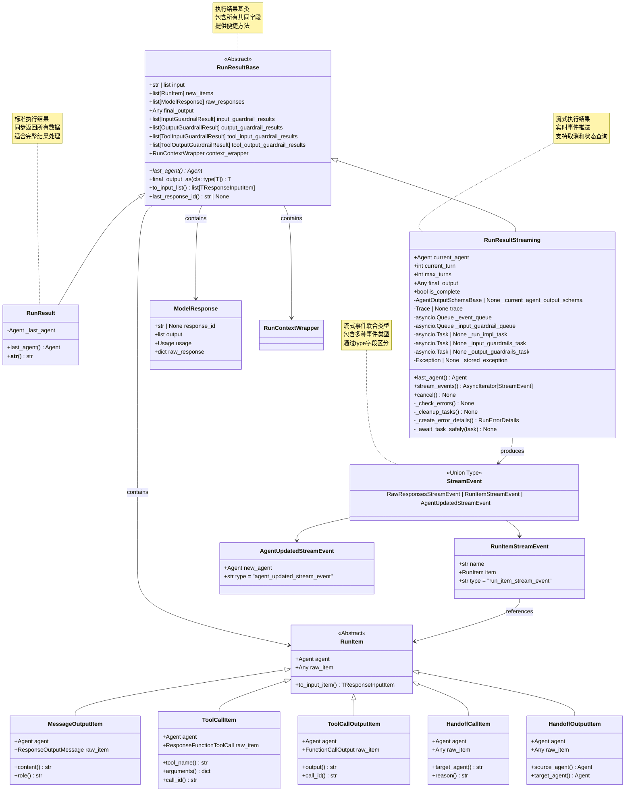

**RunResult 字段详解：**

| 字段名 | 类型 | 说明 |
|--------|------|------|
| `input` | `str \| list[TResponseInputItem]` | 原始输入（可能被过滤器修改） |
| `new_items` | `list[RunItem]` | 本次执行生成的所有运行项 |
| `raw_responses` | `list[ModelResponse]` | 所有模型的原始响应 |
| `final_output` | `Any` | 最终输出（通常是字符串） |
| `_last_agent` | `Agent` | 最后执行的代理 |
| `input_guardrail_results` | `list[InputGuardrailResult]` | 输入防护检查结果 |
| `output_guardrail_results` | `list[OutputGuardrailResult]` | 输出防护检查结果 |
| `tool_input_guardrail_results` | `list[ToolInputGuardrailResult]` | 工具输入防护结果 |
| `tool_output_guardrail_results` | `list[ToolOutputGuardrailResult]` | 工具输出防护结果 |
| `context_wrapper` | `RunContextWrapper` | 上下文包装器 |

**RunResultStreaming 额外字段：**

| 字段名 | 类型 | 说明 |
|--------|------|------|
| `current_agent` | `Agent` | 当前正在执行的代理 |
| `current_turn` | `int` | 当前执行的轮次 |
| `max_turns` | `int` | 允许的最大轮次 |
| `is_complete` | `bool` | 执行是否完成 |
| `_event_queue` | `asyncio.Queue[StreamEvent]` | 事件队列（内部） |
| `_input_guardrail_queue` | `asyncio.Queue` | 输入防护结果队列（内部） |
| `_run_impl_task` | `asyncio.Task \| None` | 执行任务（内部） |
| `_stored_exception` | `Exception \| None` | 存储的异常（内部） |

### 3.2 RunItem 类型系统

**RunItem 层次结构：**

```mermaid
classDiagram
    class RunItem {
        <<Abstract>>
        +Agent agent
        +T raw_item
        
        +to_input_item()* TResponseInputItem
    }
    
    class MessageOutputItem {
        +ResponseOutputMessage raw_item
        
        +content() str
        +role() str
        +to_input_item() TResponseInputItem
    }
    
    class ToolCallItem {
        +ResponseFunctionToolCall raw_item
        
        +tool_name() str
        +arguments() dict
        +call_id() str
        +to_input_item() TResponseInputItem
    }
    
    class ToolCallOutputItem {
        +FunctionCallOutput raw_item
        
        +output() str
        +call_id() str
        +success() bool
        +to_input_item() TResponseInputItem
    }
    
    class HandoffCallItem {
        +HandoffCall raw_item
        
        +target_agent() str
        +reason() str
        +handoff_data() dict
        +to_input_item() TResponseInputItem
    }
    
    class HandoffOutputItem {
        +HandoffOutput raw_item
        
        +source_agent() Agent
        +target_agent() Agent
        +to_input_item() TResponseInputItem
    }
    
    class ReasoningItem {
        +Reasoning raw_item
        
        +content() str
        +to_input_item() TResponseInputItem
    }
    
    class MCPApprovalRequestItem {
        +MCPApprovalRequest raw_item
        
        +server_name() str
        +approval_message() str
        +to_input_item() TResponseInputItem
    }
    
    RunItem <|-- MessageOutputItem
    RunItem <|-- ToolCallItem
    RunItem <|-- ToolCallOutputItem
    RunItem <|-- HandoffCallItem
    RunItem <|-- HandoffOutputItem
    RunItem <|-- ReasoningItem
    RunItem <|-- MCPApprovalRequestItem
```

**RunItem 类型映射：**

| RunItem 类型 | 原始类型 | 事件名称 | 用途 |
|-------------|---------|---------|------|
| `MessageOutputItem` | `ResponseOutputMessage` | `message_output_created` | LLM生成的消息 |
| `ToolCallItem` | `ResponseFunctionToolCall` | `tool_called` | 工具调用请求 |
| `ToolCallOutputItem` | `FunctionCallOutput` | `tool_output` | 工具执行结果 |
| `HandoffCallItem` | `HandoffCall` | `handoff_requested` | 代理切换请求 |
| `HandoffOutputItem` | `HandoffOutput` | `handoff_occured` | 代理切换完成 |
| `ReasoningItem` | `Reasoning` | `reasoning_item_created` | 推理过程 |
| `MCPApprovalRequestItem` | `MCPApprovalRequest` | `mcp_approval_requested` | MCP批准请求 |

## 4. 上下文与使用统计

### 4.1 RunContextWrapper UML

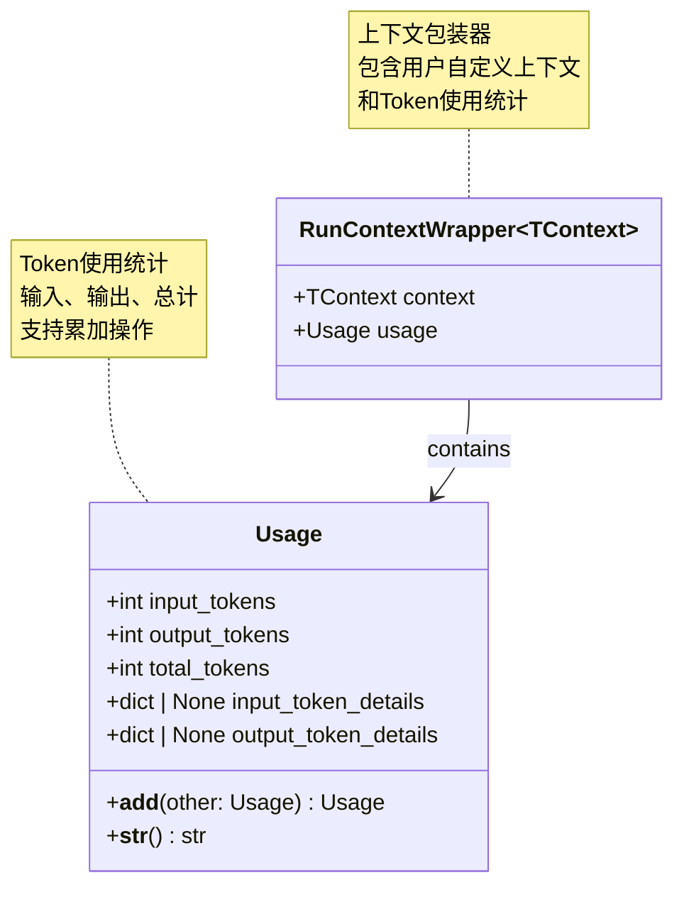

**RunContextWrapper 字段详解：**

| 字段名 | 类型 | 说明 |
|--------|------|------|
| `context` | `TContext` | 用户自定义上下文对象 |
| `usage` | `Usage` | 累计的Token使用统计 |

**Usage 字段详解：**

| 字段名 | 类型 | 说明 |
|--------|------|------|
| `input_tokens` | `int` | 输入Token数量 |
| `output_tokens` | `int` | 输出Token数量 |
| `total_tokens` | `int` | 总Token数量 |
| `input_token_details` | `dict \| None` | 输入Token详细信息 |
| `output_token_details` | `dict \| None` | 输出Token详细信息 |

**Usage 示例：**

```python
# 访问使用统计
result = await Runner.run(agent, input)
usage = result.context_wrapper.usage

print(f"输入: {usage.input_tokens} tokens")
print(f"输出: {usage.output_tokens} tokens")
print(f"总计: {usage.total_tokens} tokens")

# Usage 支持加法
usage1 = Usage(input_tokens=100, output_tokens=50, total_tokens=150)
usage2 = Usage(input_tokens=80, output_tokens=40, total_tokens=120)
total_usage = usage1 + usage2
# total_usage.total_tokens == 270
```

## 5. 内部数据结构

### 5.1 ModelInputData 和 CallModelData

```mermaid
classDiagram
    class ModelInputData {
        +list[TResponseInputItem] input
        +str | None instructions
    }
    
    class CallModelData~TContext~ {
        +ModelInputData model_data
        +Agent[TContext] agent
        +TContext | None context
    }
    
    class CallModelInputFilter {
        <<Callable>>
        (CallModelData) -> ModelInputData
    }
    
    CallModelData --> ModelInputData : contains
    CallModelInputFilter --> CallModelData : processes
    CallModelInputFilter --> ModelInputData : returns
    
    note for ModelInputData "模型输入数据容器<br/>包含输入项和指令"
    note for CallModelData "模型调用数据<br/>传递给过滤器的完整上下文"
    note for CallModelInputFilter "模型调用前的过滤器<br/>可修改输入数据"
```

**ModelInputData 字段：**

| 字段名 | 类型 | 说明 |
|--------|------|------|
| `input` | `list[TResponseInputItem]` | 要发送给模型的输入项列表 |
| `instructions` | `str \| None` | 系统指令（代理的instructions） |

**CallModelData 字段：**

| 字段名 | 类型 | 说明 |
|--------|------|------|
| `model_data` | `ModelInputData` | 模型输入数据 |
| `agent` | `Agent[TContext]` | 当前代理 |
| `context` | `TContext \| None` | 用户上下文 |

**使用示例：**

```python
from agents import RunConfig, CallModelData, ModelInputData

def custom_input_filter(call_data: CallModelData) -> ModelInputData:
    """自定义输入过滤器"""
    
    # 访问原始数据
    original_input = call_data.model_data.input
    agent = call_data.agent
    context = call_data.context
    
    # 修改输入（例如：添加额外的系统消息）
    modified_input = [
        {"type": "message", "role": "system", "content": "额外的上下文信息"},
        *original_input
    ]
    
    # 返回修改后的数据
    return ModelInputData(
        input=modified_input,
        instructions=call_data.model_data.instructions
    )

# 使用过滤器
config = RunConfig(call_model_input_filter=custom_input_filter)
result = await Runner.run(agent, input, run_config=config)
```

### 5.2 _ServerConversationTracker

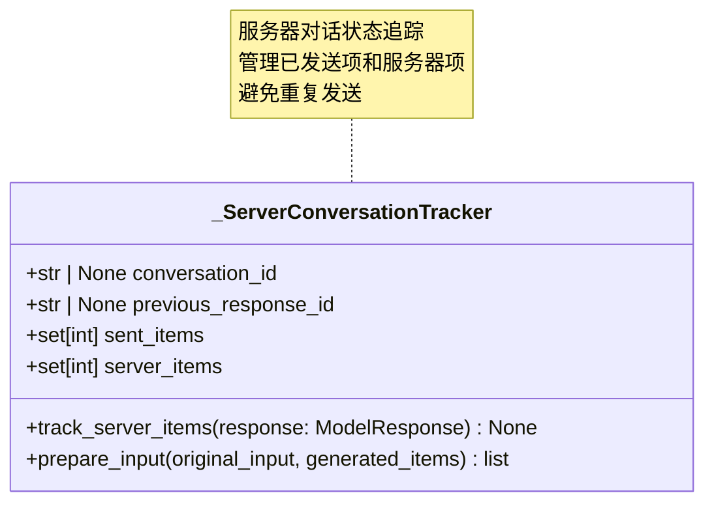

**字段详解：**

| 字段名 | 类型 | 说明 |
|--------|------|------|
| `conversation_id` | `str \| None` | 服务器端对话ID（OpenAI Conversations API） |
| `previous_response_id` | `str \| None` | 上一个响应ID（服务器端状态追踪） |
| `sent_items` | `set[int]` | 已发送项的ID集合 |
| `server_items` | `set[int]` | 服务器生成项的ID集合 |

**功能说明：**

1. **track_server_items**：追踪模型响应中的服务器项
2. **prepare_input**：准备发送给模型的输入，过滤已发送和服务器项

**使用场景：**

- 使用 OpenAI Conversations API 时管理服务器端状态
- 避免重复发送相同的历史项
- 追踪 `previous_response_id` 进行状态管理

## 6. 流式事件数据结构

### 6.1 StreamEvent 类型系统

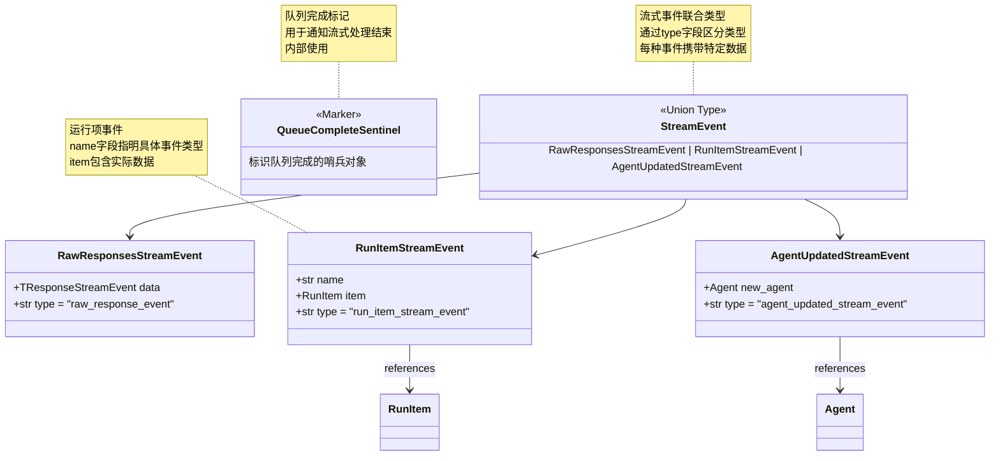

**StreamEvent 类型判断：**

```python
async for event in result.stream_events():
    if event.type == "raw_response_event":
        # 原始响应事件
        raw_data = event.data
        
    elif event.type == "run_item_stream_event":
        # 运行项事件
        event_name = event.name
        run_item = event.item
        
        if event_name == "message_output_created":
            # 消息输出
            content = event.item.content
        
        elif event_name == "tool_called":
            # 工具调用
            tool_name = event.item.tool_name
        
        elif event_name == "tool_output":
            # 工具输出
            output = event.item.output
        
        elif event_name == "handoff_requested":
            # 代理切换请求
            target = event.item.target_agent
        
        elif event_name == "handoff_occured":
            # 代理切换完成
            from_agent = event.item.source_agent
            to_agent = event.item.target_agent
    
    elif event.type == "agent_updated_stream_event":
        # 代理更新事件
        new_agent = event.new_agent
```

**RunItemStreamEvent 事件名称：**

| 事件名称 | RunItem 类型 | 触发时机 |
|---------|-------------|---------|
| `message_output_created` | `MessageOutputItem` | LLM生成消息 |
| `tool_called` | `ToolCallItem` | 工具被调用 |
| `tool_output` | `ToolCallOutputItem` | 工具执行完成 |
| `handoff_requested` | `HandoffCallItem` | 请求切换代理 |
| `handoff_occured` | `HandoffOutputItem` | 代理切换完成 |
| `reasoning_item_created` | `ReasoningItem` | 生成推理项 |
| `mcp_approval_requested` | `MCPApprovalRequestItem` | MCP批准请求 |
| `mcp_list_tools` | `MCPListToolsItem` | MCP工具列表 |

## 7. 数据流转图

### 7.1 执行数据流

```mermaid
flowchart TB
    subgraph "输入阶段"
        INPUT[用户输入<br/>str or list]
        SESSION[Session 历史]
        CONTEXT[用户上下文<br/>TContext]
        CONFIG[RunConfig 配置]
    end
    
    subgraph "配置合并"
        MERGE[配置合并逻辑]
        AGENT_CONFIG[Agent 配置]
        RUN_CONFIG[Run 配置]
        FINAL_CONFIG[最终配置]
    end
    
    subgraph "执行循环"
        PREP_INPUT[准备模型输入<br/>ModelInputData]
        CALL_MODEL[调用模型]
        MODEL_RESPONSE[ModelResponse]
        PROCESS[处理响应]
        CREATE_ITEMS[创建 RunItems]
    end
    
    subgraph "输出阶段"
        NEW_ITEMS[new_items: list[RunItem]]
        RAW_RESP[raw_responses: list[ModelResponse]]
        FINAL_OUT[final_output: Any]
        GUARD_RESULTS[guardrail_results]
        USAGE[usage: Usage]
    end
    
    subgraph "结果封装"
        RUN_RESULT[RunResult]
        CONTEXT_WRAP[RunContextWrapper]
    end
    
    INPUT --> MERGE
    SESSION --> MERGE
    CONTEXT --> MERGE
    CONFIG --> RUN_CONFIG
    AGENT_CONFIG --> MERGE
    RUN_CONFIG --> MERGE
    
    MERGE --> FINAL_CONFIG
    FINAL_CONFIG --> PREP_INPUT
    
    PREP_INPUT --> CALL_MODEL
    CALL_MODEL --> MODEL_RESPONSE
    MODEL_RESPONSE --> PROCESS
    PROCESS --> CREATE_ITEMS
    
    CREATE_ITEMS --> NEW_ITEMS
    MODEL_RESPONSE --> RAW_RESP
    PROCESS --> FINAL_OUT
    PROCESS --> GUARD_RESULTS
    MODEL_RESPONSE --> USAGE
    
    NEW_ITEMS --> RUN_RESULT
    RAW_RESP --> RUN_RESULT
    FINAL_OUT --> RUN_RESULT
    GUARD_RESULTS --> RUN_RESULT
    USAGE --> CONTEXT_WRAP
    CONTEXT --> CONTEXT_WRAP
    CONTEXT_WRAP --> RUN_RESULT
    
    style INPUT fill:#e1f5fe
    style CONFIG fill:#f3e5f5
    style FINAL_CONFIG fill:#fff3e0
    style RUN_RESULT fill:#e8f5e9
```

### 7.2 流式数据流

```mermaid
flowchart LR
    subgraph "执行引擎"
        RUN_IMPL[RunImpl 执行]
        GEN_ITEMS[生成 RunItems]
    end
    
    subgraph "事件转换"
        CONVERT[转换为 StreamEvent]
        RAW_EVENT[RawResponsesStreamEvent]
        ITEM_EVENT[RunItemStreamEvent]
        AGENT_EVENT[AgentUpdatedStreamEvent]
    end
    
    subgraph "事件队列"
        QUEUE[asyncio.Queue]
        SENTINEL[QueueCompleteSentinel]
    end
    
    subgraph "流式输出"
        STREAM[stream_events()]
        CONSUMER[事件消费者]
    end
    
    RUN_IMPL --> GEN_ITEMS
    GEN_ITEMS --> CONVERT
    
    CONVERT --> RAW_EVENT
    CONVERT --> ITEM_EVENT
    CONVERT --> AGENT_EVENT
    
    RAW_EVENT --> QUEUE
    ITEM_EVENT --> QUEUE
    AGENT_EVENT --> QUEUE
    
    RUN_IMPL -->|完成| SENTINEL
    SENTINEL --> QUEUE
    
    QUEUE --> STREAM
    STREAM --> CONSUMER
    
    style RUN_IMPL fill:#e1f5fe
    style QUEUE fill:#f3e5f5
    style STREAM fill:#e8f5e9
```

## 8. 数据结构使用最佳实践

### 8.1 自定义上下文类型

```python
from dataclasses import dataclass
from typing import Any

@dataclass
class AppContext:
    """应用自定义上下文"""
    user_id: str
    database: Any
    cache: Any
    config: dict
    request_id: str

# 类型安全的使用
agent: Agent[AppContext] = Agent(
    name="TypedAgent",
    instructions="使用类型化上下文的代理"
)

context = AppContext(
    user_id="user_123",
    database=db_connection,
    cache=redis_client,
    config=app_config,
    request_id="req_abc"
)

result: RunResult = await Runner.run(
    agent=agent,
    input="处理请求",
    context=context
)

# 访问上下文
app_context: AppContext = result.context_wrapper.context
print(f"用户ID: {app_context.user_id}")
```

### 8.2 结果数据转换

```python
def extract_tool_calls(result: RunResult) -> list[dict]:
    """提取所有工具调用信息"""
    tool_calls = []
    
    for item in result.new_items:
        if isinstance(item, ToolCallItem):
            tool_calls.append({
                "tool_name": item.tool_name,
                "arguments": item.arguments,
                "call_id": item.call_id
            })
    
    return tool_calls

def extract_agent_switches(result: RunResult) -> list[dict]:
    """提取所有代理切换信息"""
    switches = []
    
    for item in result.new_items:
        if isinstance(item, HandoffOutputItem):
            switches.append({
                "from": item.source_agent.name,
                "to": item.target_agent.name
            })
    
    return switches

# 使用
result = await Runner.run(agent, input)
tools = extract_tool_calls(result)
switches = extract_agent_switches(result)
```

### 8.3 流式事件聚合

```python
from collections import defaultdict

class StreamEventAggregator:
    """流式事件聚合器"""
    
    def __init__(self):
        self.events_by_type = defaultdict(list)
        self.message_content = ""
        self.tool_calls = []
        self.agent_switches = []
    
    def process_event(self, event: StreamEvent):
        """处理单个事件"""
        self.events_by_type[event.type].append(event)
        
        if event.type == "run_item_stream_event":
            if event.name == "message_output_created":
                self.message_content = event.item.content
            
            elif event.name == "tool_called":
                self.tool_calls.append({
                    "name": event.item.tool_name,
                    "args": event.item.arguments
                })
            
        elif event.type == "agent_updated_stream_event":
            self.agent_switches.append(event.new_agent.name)
    
    def get_summary(self) -> dict:
        """获取聚合摘要"""
        return {
            "total_events": sum(len(events) for events in self.events_by_type.values()),
            "event_counts": {k: len(v) for k, v in self.events_by_type.items()},
            "final_message": self.message_content,
            "tools_used": len(self.tool_calls),
            "agent_switches": len(self.agent_switches)
        }

# 使用
async def run_with_aggregation(agent, input):
    aggregator = StreamEventAggregator()
    result = await Runner.run_streamed(agent, input)
    
    async for event in result.stream_events():
        aggregator.process_event(event)
    
    summary = aggregator.get_summary()
    print(summary)
```

Runner 模块通过清晰的数据结构设计和完善的类型系统，为 OpenAI Agents 提供了强大的执行管理能力，支持从简单脚本到复杂生产系统的各种数据处理需求。

---

## 时序图

## 1. 时序图总览

Runner 模块的时序图展示了代理执行的完整生命周期，从初始化、执行循环到结果返回的各个阶段，以及与其他模块的交互流程。

### 核心时序场景

| 场景类别 | 时序图 | 关键流程 |
|---------|--------|---------|
| **标准执行** | Runner.run() 完整流程 | 初始化、执行循环、结果封装 |
| **流式执行** | Runner.run_streamed() 流程 | 后台任务、事件队列、实时推送 |
| **工具调用** | 工具执行时序 | 工具参数解析、执行、结果处理 |
| **代理切换** | Handoff 切换流程 | 切换请求、输入过滤、新代理执行 |
| **防护检查** | Guardrail 执行时序 | 输入检查、输出检查、tripwire触发 |
| **会话管理** | Session 集成流程 | 历史加载、执行、历史保存 |

## 2. Runner.run() 标准执行时序图

### 场景：完整的代理执行流程

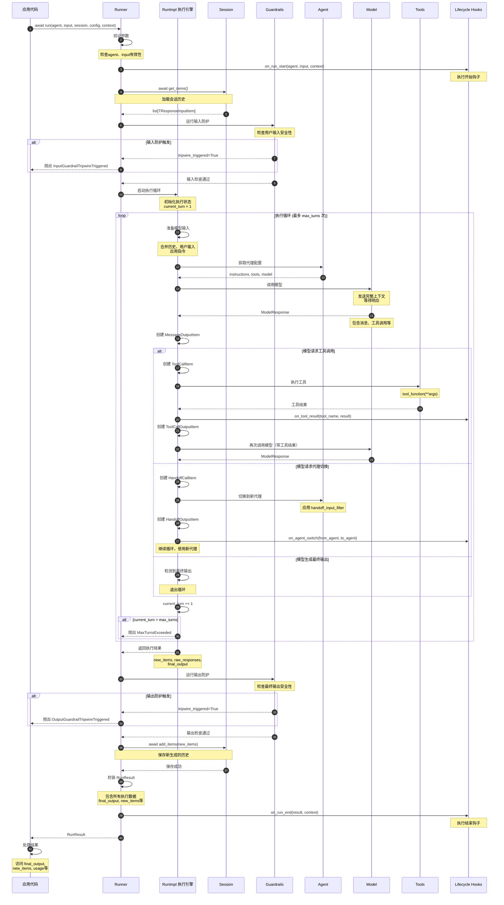

**时序图说明：**

### 执行阶段划分

1. **初始化阶段（步骤 1-8）**：
   - 参数验证
   - 触发开始钩子
   - 加载会话历史
   - 执行输入防护检查

2. **执行循环阶段（步骤 9-40）**：
   - 准备模型输入（历史+新输入）
   - 调用模型生成响应
   - 处理工具调用
   - 处理代理切换
   - 检测最终输出

3. **结果处理阶段（步骤 41-52）**：
   - 执行输出防护检查
   - 保存新历史到会话
   - 封装执行结果
   - 触发结束钩子

### 关键决策点

**工具调用决策：**

- 模型返回包含 `tool_calls` → 执行工具 → 再次调用模型
- 模型返回纯文本 → 可能是最终输出

**代理切换决策：**

- 模型请求 handoff → 切换代理 → 继续执行循环
- 新代理接收过滤后的输入

**循环终止条件：**

- 模型生成最终输出 → 正常退出
- 超过 `max_turns` → 抛出异常
- 防护触发 → 抛出异常

## 3. Runner.run_streamed() 流式执行时序图

### 场景：实时事件推送的流式执行

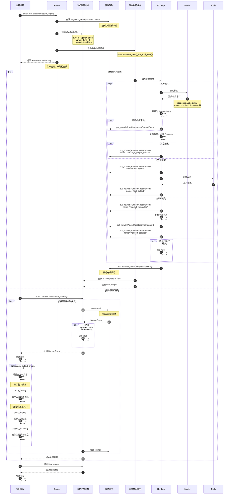

**时序图说明：**

### 并发执行模型

**后台任务：**

- 独立的异步任务执行代理逻辑
- 生成流式事件放入队列
- 完成后发送完成信号

**前台消费：**

- 从队列异步获取事件
- 立即处理和展示
- 收到完成信号后退出

### 事件流转机制

**事件生成：**

1. RunImpl 处理模型响应
2. 创建相应的 RunItem
3. 转换为 StreamEvent
4. 放入异步队列

**事件消费：**

1. 应用调用 `stream_events()`
2. 从队列异步获取事件
3. 通过 `yield` 返回给应用
4. 应用实时处理事件

### 流式执行优势

1. **低延迟**：事件立即推送，无需等待完成
2. **实时反馈**：用户看到增量生成的内容
3. **可中断**：支持通过 `cancel()` 中途取消
4. **资源高效**：使用异步队列，内存占用小

## 4. 工具调用时序图

### 场景：模型请求工具调用并处理结果

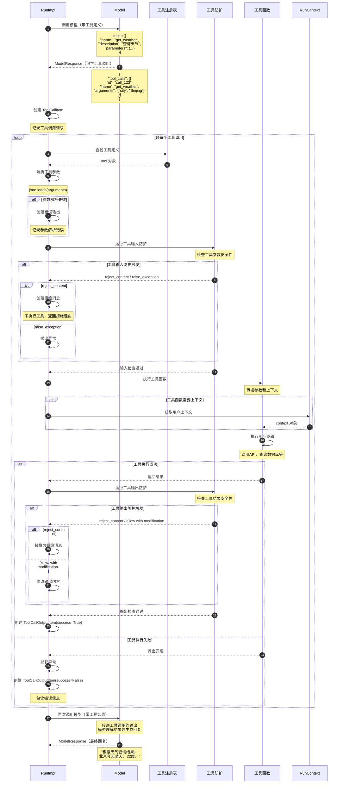

**时序图说明：**

### 工具调用流程

1. **工具定义传递**：模型调用时包含可用工具定义
2. **工具调用请求**：模型返回需要调用的工具和参数
3. **参数验证**：解析和验证工具参数
4. **输入防护**：检查工具参数的安全性
5. **工具执行**：调用实际的工具函数
6. **输出防护**：检查工具结果的安全性
7. **结果传递**：将工具结果返回给模型
8. **生成回复**：模型基于工具结果生成用户可见的回复

### 错误处理机制

**参数解析错误：**

- JSON 解析失败 → 创建错误输出，传递给模型
- 模型可以请求重新调用或放弃

**防护拒绝：**

- `reject_content`：不执行工具，返回拒绝理由
- `raise_exception`：中断整个执行
- `allow with modification`：修改后允许

**执行异常：**

- 工具函数抛出异常 → 捕获并记录
- 创建失败的输出项
- 传递错误信息给模型

## 5. 代理切换时序图

### 场景：主代理切换到专业代理

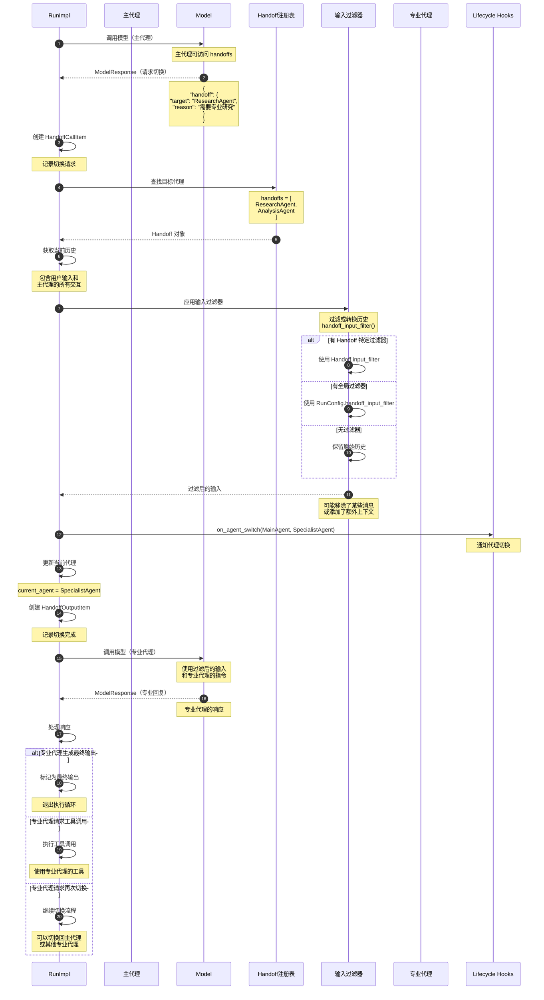

**时序图说明：**

### 代理切换机制

**切换触发：**

- 模型返回包含 `handoff` 字段
- 指定目标代理名称和切换原因

**输入过滤：**

1. 收集当前所有历史
2. 应用输入过滤器（如果有）
3. 传递过滤后的历史给新代理

**过滤器优先级：**

1. `Handoff.input_filter`（最高）
2. `RunConfig.handoff_input_filter`
3. 无过滤（保留原始历史）

### 输入过滤示例

```python
def handoff_input_filter(handoff_data: HandoffInputData) -> list[TResponseInputItem]:
    """只保留用户消息，移除中间交互"""
    filtered = []
    for item in handoff_data.input:
        if item.get("role") == "user":
            filtered.append(item)
    return filtered

# 效果：
# 原始历史: [user_msg, assistant_msg, tool_call, tool_output, user_msg]
# 过滤后: [user_msg, user_msg]
```

### 切换场景

**专业化分工：**

- 主代理 → 研究代理：需要深度研究
- 主代理 → 分析代理：需要数据分析
- 主代理 → 客服代理：处理客户问题

**任务路由：**

- 根据任务类型自动选择合适的代理
- 每个代理专注特定领域

**权限隔离：**

- 高权限代理 → 低权限代理：执行敏感操作前
- 低权限代理 → 高权限代理：需要提升权限时

## 6. 防护检查时序图

### 场景：输入和输出防护检查

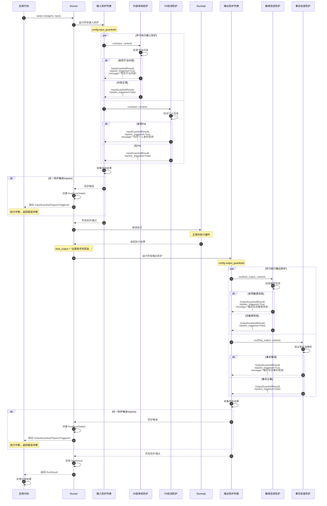

**时序图说明：**

### 防护检查机制

**输入防护（执行前）：**

- 在代理执行前检查用户输入
- 可以阻止不安全或不当的输入
- tripwire触发时中断执行

**输出防护（执行后）：**

- 在返回结果前检查最终输出
- 可以阻止不安全或不当的输出
- tripwire触发时中断返回

### 并行执行

**性能优化：**

- 多个防护并行执行
- 使用 `asyncio.gather()` 并发运行
- 减少总体检查时间

**结果聚合：**

- 收集所有防护的结果
- 任一触发tripwire则中断
- 所有结果存储在 `RunResult` 中

### 防护结果处理

**tripwire触发：**

```python
InputGuardrailResult(
    output=GuardrailFunctionOutput(
        tripwire_triggered=True,
        message="输入违反了内容政策"
    )
)
# 抛出 InputGuardrailTripwireTriggered 异常
```

**防护通过：**

```python
InputGuardrailResult(
    output=GuardrailFunctionOutput(
        tripwire_triggered=False
    )
)
# 继续执行
```

**非阻塞警告：**

```python
InputGuardrailResult(
    output=GuardrailFunctionOutput(
        tripwire_triggered=False,
        message="检测到潜在问题，但允许继续"
    )
)
# 记录警告但不中断执行
```

## 7. 完整执行流程总览

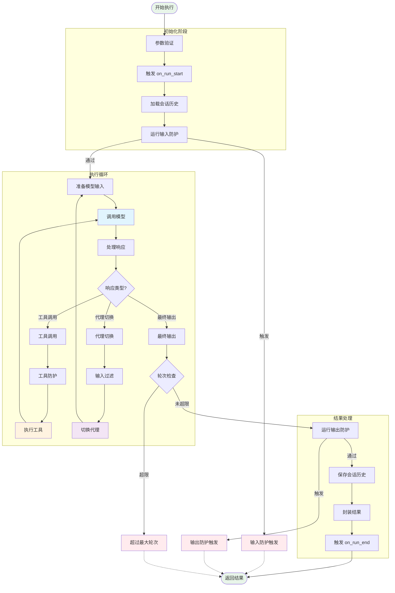

Runner 模块通过精心设计的时序流程和清晰的执行阶段，为 OpenAI Agents 提供了强大的执行调度能力，支持从简单对话到复杂多代理协作的各种应用场景。

---
