# OpenAIAgent-03-Tools

## 模块概览

## 1. 模块职责与边界

Tools 模块是 OpenAI Agents Python SDK 的工具系统核心，提供了统一的工具抽象和多种工具实现。该模块使得智能代理能够执行各种外部操作，从函数调用到复杂的计算机控制任务，极大扩展了代理的能力边界。

### 核心职责

- **工具抽象**：定义统一的工具接口和类型系统
- **函数工具**：将 Python 函数包装为可被 LLM 调用的工具
- **托管工具**：集成 OpenAI 提供的云端工具服务
- **MCP 工具**：支持模型上下文协议的工具集成
- **专用工具**：提供计算机控制、代码执行、文件搜索等专业能力
- **工具安全**：实现工具级的输入输出安全检查
- **动态管理**：支持工具的动态启用/禁用和条件调用

### 工具分类体系

| 工具类型 | 实现类 | 执行位置 | 主要用途 |
|----------|--------|----------|----------|
| 函数工具 | `FunctionTool` | 本地 | Python 函数调用 |
| 文件搜索 | `FileSearchTool` | 云端 | 向量存储检索 |
| 网络搜索 | `WebSearchTool` | 云端 | 实时网络搜索 |
| 计算机控制 | `ComputerTool` | 云端 | 桌面自动化 |
| 代码执行 | `CodeInterpreterTool` | 云端 | 沙箱代码运行 |
| 图像生成 | `ImageGenerationTool` | 云端 | DALL-E 图像创建 |
| 本地 Shell | `LocalShellTool` | 本地 | 系统命令执行 |
| MCP 托管 | `HostedMCPTool` | 云端 | 远程 MCP 服务器 |

### 输入输出接口

**输入：**

- 工具配置参数（名称、描述、参数模式等）
- 执行上下文（`ToolContext` 或 `RunContextWrapper`）
- 工具调用参数（JSON 格式）
- 安全检查规则（输入输出防护）

**输出：**

- 工具执行结果（`FunctionToolResult` 或直接输出）
- 执行项目（`RunItem` 封装）
- 错误信息（异常或错误字符串）

### 上下游依赖关系

**上游调用者：**

- `Agent`：通过 `tools` 配置集成工具
- `RunImpl`：执行引擎调用工具执行逻辑
- `MCPUtil`：MCP 工具集成和管理

**下游依赖：**

- `function_schema`：自动生成 JSON Schema
- `tool_context`：提供执行上下文环境
- `tool_guardrails`：工具级安全检查
- `computer`：计算机控制底层接口
- `tracing`：工具执行追踪和监控

## 2. 模块架构图

```mermaid
flowchart TB
    subgraph "Tools 模块"
        TOOL[Tool 联合类型]
        
        subgraph "函数工具"
            FUNCTIONTOOL[FunctionTool]
            FUNCTOOLRESULT[FunctionToolResult]
            FUNCTOOLDECORATOR[@function_tool 装饰器]
        end
        
        subgraph "托管工具"
            FILESEARCH[FileSearchTool]
            WEBSEARCH[WebSearchTool]
            COMPUTER[ComputerTool]
            CODEINTERPRETER[CodeInterpreterTool]
            IMAGEGEN[ImageGenerationTool]
        end
        
        subgraph "本地工具"
            LOCALSHELL[LocalShellTool]
            LOCALSHELCMD[LocalShellCommandRequest]
        end
        
        subgraph "MCP 工具"
            HOSTEDMCP[HostedMCPTool]
            MCPAPPROVAL[MCPToolApprovalFunction]
            MCPREQUEST[MCPToolApprovalRequest]
        end
        
        subgraph "工具安全"
            TOOLINPUTGUARD[ToolInputGuardrail]
            TOOLOUTPUTGUARD[ToolOutputGuardrail]
            SAFETYCHECKDATA[ComputerToolSafetyCheckData]
        end
        
        subgraph "工具上下文"
            TOOLCONTEXT[ToolContext]
            RUNCONTEXT[RunContextWrapper]
        end
    end
    
    subgraph "支撑系统"
        FUNCTIONSCHEMA[function_schema 模式生成]
        STRICTSCHEMA[strict_schema 严格模式]
        COMPUTER_IMPL[computer 实现层]
        TRACING[tracing 追踪系统]
        GUARDRAILS[guardrails 安全框架]
    end
    
    TOOL --> FUNCTIONTOOL
    TOOL --> FILESEARCH
    TOOL --> WEBSEARCH
    TOOL --> COMPUTER
    TOOL --> CODEINTERPRETER
    TOOL --> IMAGEGEN
    TOOL --> LOCALSHELL
    TOOL --> HOSTEDMCP
    
    FUNCTIONTOOL --> FUNCTOOLRESULT
    FUNCTIONTOOL --> FUNCTOOLDECORATOR
    FUNCTIONTOOL --> TOOLINPUTGUARD
    FUNCTIONTOOL --> TOOLOUTPUTGUARD
    
    HOSTEDMCP --> MCPAPPROVAL
    HOSTEDMCP --> MCPREQUEST
    
    COMPUTER --> SAFETYCHECKDATA
    LOCALSHELL --> LOCALSHELCMD
    
    FUNCTIONTOOL --> TOOLCONTEXT
    FUNCTIONTOOL --> RUNCONTEXT
    
    FUNCTIONTOOL --> FUNCTIONSCHEMA
    FUNCTIONTOOL --> STRICTSCHEMA
    COMPUTER --> COMPUTER_IMPL
    FUNCTIONTOOL --> TRACING
    FUNCTIONTOOL --> GUARDRAILS
    
    style TOOL fill:#e1f5fe
    style FUNCTIONTOOL fill:#f3e5f5
    style HOSTEDMCP fill:#e8f5e8
    style TOOLCONTEXT fill:#fff3e0
```

**架构说明：**

### 工具类型层次

1. **抽象层**：`Tool` 联合类型定义了所有工具的统一接口
2. **实现层**：各种具体工具类实现特定的功能领域
3. **支撑层**：模式生成、安全检查、上下文管理等基础设施
4. **集成层**：与代理系统和执行引擎的集成接口

### 工具执行模式

- **同步执行**：简单工具直接返回结果
- **异步执行**：支持异步 I/O 操作的工具
- **流式执行**：支持渐进式结果返回
- **批量执行**：支持多个工具并发执行

### 安全边界控制

- **输入验证**：JSON Schema 严格模式验证
- **输出过滤**：工具输出安全检查和过滤
- **权限控制**：动态启用/禁用机制
- **执行隔离**：工具执行环境隔离

### 扩展机制

- **函数装饰器**：`@function_tool` 简化函数工具创建
- **MCP 协议**：支持标准化的工具服务集成
- **自定义工具**：通过接口扩展新的工具类型
- **插件化架构**：支持动态工具注册和发现

## 3. 关键算法与流程剖析

### 3.1 函数工具创建算法

```python
def function_tool(
    func: ToolFunction | None = None,
    *,
    name_override: str | None = None,
    description_override: str | None = None,
    strict_json_schema: bool = True,
    is_enabled: bool | Callable = True,
    **kwargs
) -> Callable:
    """函数工具装饰器的核心实现"""
    
    def decorator(target_func: ToolFunction) -> FunctionTool:
        # 1) 分析函数签名，确定参数类型
        sig = inspect.signature(target_func)
        params = list(sig.parameters.values())
        
        # 2) 检测上下文参数类型
        context_param = None
        func_params = []
        
        for param in params:
            if param.annotation in [RunContextWrapper, ToolContext]:
                context_param = param
            else:
                func_params.append(param)
        
        # 3) 生成 JSON Schema
        schema = function_schema(
            target_func,
            name_override=name_override,
            description_override=description_override,
            docstring_style=DocstringStyle.GOOGLE,
            strict_json_schema=strict_json_schema
        )
        
        # 4) 创建工具调用包装器
        async def tool_invoker(tool_context: ToolContext, args_json: str) -> Any:
            try:
                # 解析 JSON 参数
                args = json.loads(args_json)
                
                # 构建函数调用参数
                call_args = []
                if context_param:
                    if context_param.annotation == ToolContext:
                        call_args.append(tool_context)
                    else:  # RunContextWrapper
                        call_args.append(tool_context.run_context)
                
                # 添加业务参数
                for param in func_params:
                    if param.name in args:
                        call_args.append(args[param.name])
                    elif param.default is not param.empty:
                        call_args.append(param.default)
                    else:
                        raise ValueError(f"Missing required parameter: {param.name}")
                
                # 执行原函数
                if inspect.iscoroutinefunction(target_func):
                    result = await target_func(*call_args)
                else:
                    result = target_func(*call_args)
                
                return result
                
            except Exception as e:
                # 错误处理和日志记录
                logger.error(f"Tool execution failed: {e}")
                return f"Tool execution error: {str(e)}"
        
        # 5) 创建 FunctionTool 实例
        return FunctionTool(
            name=schema["name"],
            description=schema["description"],
            params_json_schema=schema["parameters"],
            on_invoke_tool=tool_invoker,
            strict_json_schema=strict_json_schema,
            is_enabled=is_enabled
        )
    
    # 支持直接调用和装饰器两种用法
    if func is not None:
        return decorator(func)
    return decorator
```

**算法目的：** 自动将 Python 函数转换为可被 LLM 调用的工具，处理参数映射、类型转换和错误处理。

**复杂度分析：**

- 时间复杂度：O(n)，n 为函数参数数量
- 空间复杂度：O(m)，m 为 JSON Schema 大小
- 创建开销：一次性创建，运行时开销极小

**关键设计决策：**

1. **签名分析**：自动识别上下文参数和业务参数
2. **Schema 生成**：基于类型注解自动生成严格的 JSON Schema
3. **错误隔离**：工具执行错误不影响代理主流程
4. **灵活调用**：支持同步和异步函数

### 3.2 工具执行安全检查

```python
async def execute_tool_with_guardrails(
    tool: FunctionTool,
    context: ToolContext,
    args_json: str
) -> FunctionToolResult:
    """带安全检查的工具执行流程"""
    
    # 1) 输入安全检查
    if tool.tool_input_guardrails:
        input_data = ToolInputGuardrailData(
            tool_name=tool.name,
            tool_input=args_json,
            context=context.run_context.context
        )
        
        for guardrail in tool.tool_input_guardrails:
            try:
                with guardrail_span(guardrail.__class__.__name__):
                    result = await _coro.ensure_awaitable(
                        guardrail(input_data, context.run_context, context.agent)
                    )
                    
                    if not result.passed:
                        raise ToolInputGuardrailTripwireTriggered(
                            guardrail_name=guardrail.__class__.__name__,
                            failure_reason=result.failure_reason,
                            tool_name=tool.name
                        )
            except Exception as e:
                logger.error(f"Input guardrail {guardrail.__class__.__name__} failed: {e}")
                raise
    
    # 2) 执行工具
    try:
        with function_span(tool.name) as span:
            raw_output = await tool.on_invoke_tool(context, args_json)
            span.add_input(args_json)
            span.add_output(str(raw_output))
    except Exception as e:
        logger.error(f"Tool {tool.name} execution failed: {e}")
        raise
    
    # 3) 输出安全检查
    if tool.tool_output_guardrails:
        output_data = ToolOutputGuardrailData(
            tool_name=tool.name,
            tool_input=args_json,
            tool_output=str(raw_output),
            context=context.run_context.context
        )
        
        for guardrail in tool.tool_output_guardrails:
            try:
                with guardrail_span(guardrail.__class__.__name__):
                    result = await _coro.ensure_awaitable(
                        guardrail(output_data, context.run_context, context.agent)
                    )
                    
                    if not result.passed:
                        raise ToolOutputGuardrailTripwireTriggered(
                            guardrail_name=guardrail.__class__.__name__,
                            failure_reason=result.failure_reason,
                            tool_name=tool.name
                        )
            except Exception as e:
                logger.error(f"Output guardrail {guardrail.__class__.__name__} failed: {e}")
                raise
    
    # 4) 创建结果对象
    run_item = ToolCallOutputItem(
        tool_name=tool.name,
        input=args_json,
        output=str(raw_output)
    )
    
    return FunctionToolResult(
        tool=tool,
        output=raw_output,
        run_item=run_item
    )
```

**流程目的：** 在工具执行前后进行安全检查，确保工具使用的安全性和合规性。

**安全检查层次：**

1. **输入验证**：参数格式、内容安全、权限检查
2. **执行监控**：执行时间、资源使用、异常处理
3. **输出过滤**：敏感信息过滤、内容审查、格式验证
4. **追踪记录**：完整的执行链路追踪和审计日志

### 3.3 MCP 工具集成算法

```python
class MCPUtil:
    """MCP 工具集成工具类"""
    
    @staticmethod
    async def get_all_function_tools(
        servers: list[MCPServer],
        convert_schemas_to_strict: bool,
        run_context: RunContextWrapper,
        agent: AgentBase
    ) -> list[Tool]:
        """从 MCP 服务器获取所有工具"""
        all_tools = []
        
        for server in servers:
            try:
                # 1) 连接服务器并获取工具列表
                await server.connect()
                mcp_tools = await server.list_tools(run_context, agent)
                
                for mcp_tool in mcp_tools:
                    # 2) 转换 MCP 工具为 FunctionTool
                    function_tool = await MCPUtil._convert_mcp_tool_to_function_tool(
                        server, mcp_tool, convert_schemas_to_strict
                    )
                    all_tools.append(function_tool)
                    
            except Exception as e:
                logger.warning(f"Failed to get tools from MCP server {server.name}: {e}")
                continue  # 跳过失败的服务器，不影响其他服务器
        
        return all_tools
    
    @staticmethod
    async def _convert_mcp_tool_to_function_tool(
        server: MCPServer,
        mcp_tool: MCPTool,
        convert_to_strict: bool
    ) -> FunctionTool:
        """将 MCP 工具转换为 FunctionTool"""
        
        # 1) 处理 JSON Schema
        schema = mcp_tool.inputSchema
        if convert_to_strict and schema:
            try:
                schema = ensure_strict_json_schema(schema)
            except Exception as e:
                logger.warning(f"Failed to convert MCP tool {mcp_tool.name} to strict schema: {e}")
                # 降级使用原始 schema
        
        # 2) 创建工具调用包装器
        async def mcp_tool_invoker(context: ToolContext, args_json: str) -> str:
            try:
                # 解析参数
                args = json.loads(args_json) if args_json else {}
                
                # 调用 MCP 服务器
                with mcp_tools_span(server.name, mcp_tool.name) as span:
                    result = await server.call_tool(mcp_tool.name, args)
                    span.add_input(args_json)
                    span.add_output(result.content)
                
                # 处理结构化内容
                if server.use_structured_content and result.structured_content:
                    # 使用结构化内容
                    return json.dumps(result.structured_content)
                else:
                    # 使用文本内容
                    return str(result.content)
                
            except Exception as e:
                logger.error(f"MCP tool {mcp_tool.name} execution failed: {e}")
                return f"MCP tool execution error: {str(e)}"
        
        # 3) 创建 FunctionTool 实例
        return FunctionTool(
            name=mcp_tool.name,
            description=mcp_tool.description or f"MCP tool: {mcp_tool.name}",
            params_json_schema=schema or {},
            on_invoke_tool=mcp_tool_invoker,
            strict_json_schema=convert_to_strict
        )
```

**集成目的：** 将外部 MCP 服务器的工具无缝集成到代理工具系统中，提供统一的调用接口。

**关键特性：**

1. **协议适配**：MCP 协议到 FunctionTool 的无缝转换
2. **Schema 兼容**：支持严格模式和标准模式的 JSON Schema
3. **错误恢复**：单个服务器失败不影响整体工具集成
4. **结果处理**：支持结构化内容和文本内容两种返回格式

## 4. 工具类型详细说明

### 4.1 函数工具（FunctionTool）

**特点：**

- 最灵活的工具类型，可以包装任意 Python 函数
- 支持自动 JSON Schema 生成
- 提供完整的类型检查和参数验证
- 支持同步和异步函数

**使用场景：**

- 数据库查询和操作
- API 调用和数据获取
- 文件处理和分析
- 业务逻辑计算

**典型实现：**

```python
@function_tool
def calculate_fibonacci(n: int) -> int:
    """计算斐波那契数列的第 n 项
    
    Args:
        n: 要计算的项数，必须是正整数
        
    Returns:
        斐波那契数列的第 n 项
    """
    if n <= 0:
        return 0
    elif n == 1:
        return 1
    else:
        a, b = 0, 1
        for _ in range(2, n + 1):
            a, b = b, a + b
        return b
```

### 4.2 托管工具（Hosted Tools）

**特点：**

- 由 OpenAI 云端提供的服务
- 无需本地部署和维护
- 具备强大的云端计算能力
- 与 OpenAI 生态深度集成

**主要类型：**

#### FileSearchTool - 文件搜索工具

```python
FileSearchTool(
    vector_store_ids=["vs_123", "vs_456"],
    max_num_results=5,
    ranking_options=RankingOptions(score_threshold=0.8),
    filters=Filters(filename_contains="report")
)
```

#### WebSearchTool - 网络搜索工具

```python
WebSearchTool(
    user_location=UserLocation(country="US", city="San Francisco"),
    search_context_size="high",
    filters=WebSearchToolFilters(domain_includes=["wikipedia.org"])
)
```

#### ComputerTool - 计算机控制工具

```python
ComputerTool(
    display_width_px=1920,
    display_height_px=1080,
    computer_impl=AsyncComputer()  # 或自定义实现
)
```

### 4.3 本地工具（Local Tools）

**特点：**

- 在本地环境执行
- 可以访问本地资源和系统
- 需要考虑安全性和权限控制
- 执行效率高，延迟低

#### LocalShellTool - 本地 Shell 工具

```python
LocalShellTool(
    # 默认配置，支持基本的 shell 命令执行
)

# 使用示例
shell_tool = LocalShellTool()
# 代理可以调用："执行命令 'ls -la' 查看当前目录文件"
```

### 4.4 MCP 工具（MCP Tools）

**特点：**

- 基于模型上下文协议标准
- 支持远程和本地 MCP 服务器
- 提供标准化的工具接口
- 易于扩展和集成第三方服务

#### HostedMCPTool - 托管 MCP 工具

```python
HostedMCPTool(
    tool_config=Mcp(
        server_url="https://mcp-server.example.com",
        api_key="your-api-key"
    ),
    on_approval_request=approval_handler  # 可选的审批处理函数
)
```

## 5. 最佳实践与使用模式

### 5.1 函数工具创建最佳实践

```python
from agents import function_tool
from typing import Optional, List

@function_tool
async def search_products(
    query: str,
    category: Optional[str] = None,
    max_results: int = 10,
    sort_by: str = "relevance"
) -> List[dict]:
    """搜索产品信息
    
    Args:
        query: 搜索关键词，必填
        category: 产品分类，可选
        max_results: 最大结果数量，默认10条
        sort_by: 排序方式，可选值：relevance, price, rating
        
    Returns:
        包含产品信息的字典列表，每个字典包含 id, name, price, rating 字段
    """
    # 实际搜索逻辑
    results = await product_search_api(
        query=query,
        category=category,
        limit=max_results,
        sort=sort_by
    )
    
    return [
        {
            "id": item.id,
            "name": item.name,
            "price": item.price,
            "rating": item.rating
        }
        for item in results
    ]

# 最佳实践要点：
# 1. 详细的文档字符串，说明参数和返回值
# 2. 合理的默认参数，提高易用性
# 3. 类型注解完整，支持自动 Schema 生成
# 4. 返回结构化数据，便于 LLM 理解和处理
```

### 5.2 工具安全防护模式

```python
from agents import function_tool, tool_input_guardrail, tool_output_guardrail

@tool_input_guardrail
def validate_file_path(data, context, agent):
    """验证文件路径的安全性"""
    import os
    args = json.loads(data.tool_input)
    file_path = args.get("file_path", "")
    
    # 检查路径遍历攻击
    if ".." in file_path or file_path.startswith("/"):
        return ToolInputGuardrailResult(
            passed=False,
            failure_reason="不允许访问上级目录或根目录"
        )
    
    # 检查文件扩展名
    allowed_extensions = [".txt", ".json", ".csv", ".md"]
    if not any(file_path.endswith(ext) for ext in allowed_extensions):
        return ToolInputGuardrailResult(
            passed=False,
            failure_reason="只允许访问文本文件"
        )
    
    return ToolInputGuardrailResult(passed=True)

@tool_output_guardrail
def filter_sensitive_content(data, context, agent):
    """过滤输出中的敏感信息"""
    import re
    
    sensitive_patterns = [
        r'\b\d{4}[-\s]?\d{4}[-\s]?\d{4}[-\s]?\d{4}\b',  # 信用卡号
        r'\b\d{3}-\d{2}-\d{4}\b',  # 社会安全号
    ]
    
    filtered_output = data.tool_output
    for pattern in sensitive_patterns:
        filtered_output = re.sub(pattern, "[REDACTED]", filtered_output)
    
    if filtered_output != data.tool_output:
        logger.info("Sensitive content filtered from tool output")
    
    return ToolOutputGuardrailResult(
        passed=True,
        modified_output=filtered_output
    )

@function_tool(
    tool_input_guardrails=[validate_file_path],
    tool_output_guardrails=[filter_sensitive_content]
)
def read_file_safe(file_path: str) -> str:
    """安全地读取文件内容"""
    try:
        with open(file_path, 'r', encoding='utf-8') as f:
            return f.read()
    except Exception as e:
        return f"读取文件失败：{str(e)}"
```

### 5.3 动态工具管理模式

```python
from agents import Agent, function_tool

class DynamicToolManager:
    """动态工具管理器"""
    
    def __init__(self):
        self.user_permissions = {}
        self.tool_registry = {}
    
    def register_tool(self, tool_name: str, tool_func):
        """注册工具"""
        self.tool_registry[tool_name] = tool_func
    
    def get_enabled_tools(self, user_id: str) -> List[Tool]:
        """获取用户可用的工具列表"""
        user_perms = self.user_permissions.get(user_id, set())
        enabled_tools = []
        
        for tool_name, tool_func in self.tool_registry.items():
            if tool_name in user_perms:
                enabled_tools.append(tool_func)
        
        return enabled_tools

# 使用示例
tool_manager = DynamicToolManager()

@function_tool(
    is_enabled=lambda context, agent: (
        context.context.get("user_role") == "admin"
    )
)
def delete_user(user_id: str) -> str:
    """删除用户（仅管理员可用）"""
    # 删除逻辑
    return f"用户 {user_id} 已删除"

@function_tool(
    is_enabled=lambda context, agent: (
        context.context.get("subscription_level", "free") in ["premium", "enterprise"]
    )
)
def advanced_analytics(query: str) -> str:
    """高级分析功能（仅付费用户可用）"""
    # 分析逻辑
    return f"分析结果：{query}"

# 创建具有条件工具的代理
agent = Agent(
    name="ConditionalAgent",
    tools=[delete_user, advanced_analytics],
    instructions="根据用户权限提供相应的功能"
)
```

### 5.4 工具组合使用模式

```python
@function_tool
async def comprehensive_research(topic: str) -> str:
    """综合研究：结合多个工具进行深度分析"""
    
    # 1. 网络搜索获取基础信息
    web_results = await web_search(f"{topic} overview recent developments")
    
    # 2. 文档检索获取相关资料
    doc_results = await document_search(topic, max_results=5)
    
    # 3. 数据分析
    analysis_data = await analyze_trends(topic)
    
    # 4. 生成综合报告
    report = f"""
    # {topic} 综合研究报告
    
    ## 网络搜索结果摘要
    {web_results[:500]}...
    
    ## 相关文档发现

    - 找到 {len(doc_results)} 篇相关文档
    - 关键主题：{extract_key_themes(doc_results)}
    
    ## 趋势分析
    {analysis_data}
    
    ## 结论与建议
    {generate_recommendations(web_results, doc_results, analysis_data)}
    """
    
    return report

# 工具组合的优势：
# 1. 多数据源整合，提供全面视角
# 2. 自动化工作流，提高效率
# 3. 结构化输出，便于后续处理
```

Tools 模块通过统一的接口和丰富的实现，为智能代理提供了强大的能力扩展机制，支持从简单函数调用到复杂工作流的各种应用场景。

---

## API接口

## 1. API 总览

Tools 模块是 OpenAI Agents SDK 的能力扩展核心，提供多种工具类型让代理能够执行实际操作。从简单的Python函数到复杂的托管服务，Tools 模块支持灵活的工具定义和集成。

### API 层次结构

```
Tool (联合类型)
    ├── FunctionTool (函数工具)
    │   └── function_tool() 装饰器/工厂函数
    ├── FileSearchTool (文件搜索工具)
    ├── WebSearchTool (网页搜索工具)
    ├── ComputerTool (计算机控制工具)
    ├── HostedMCPTool (托管MCP工具)
    ├── LocalShellTool (本地Shell工具)
    ├── CodeInterpreterTool (代码解释器工具)
    └── ImageGenerationTool (图像生成工具)
```

### API 分类

| API 类别 | 核心 API | 功能描述 |
|---------|---------|---------|
| **函数工具** | `function_tool()` | Python函数转工具的装饰器/工厂 |
| | `FunctionTool.__init__()` | 手动创建函数工具 |
| **托管工具** | `FileSearchTool()` | 向量存储文件搜索 |
| | `WebSearchTool()` | 网页搜索 |
| | `CodeInterpreterTool()` | 代码执行 |
| | `ImageGenerationTool()` | 图像生成 |
| **高级工具** | `ComputerTool()` | 计算机控制（鼠标、键盘等） |
| | `HostedMCPTool()` | 托管MCP服务器 |
| | `LocalShellTool()` | 本地Shell命令执行 |
| **工具管理** | `Tool` 联合类型 | 统一的工具类型定义 |

## 2. FunctionTool - 函数工具 API

### 2.1 function_tool 装饰器/工厂函数

**API 签名：**

```python
# 装饰器用法（无参数）
@function_tool
def my_tool(param1: str, param2: int) -> str:
    ...

# 装饰器用法（带参数）
@function_tool(
    name_override="custom_name",
    description_override="Custom description",
    strict_mode=True,
    is_enabled=True
)
def my_tool(param1: str, param2: int) -> str:
    ...

# 工厂函数用法
tool = function_tool(my_function, name_override="custom_name")
```

**功能描述：**
将Python函数转换为代理可用的工具。自动从函数签名和文档字符串提取工具元数据。

**请求参数：**

| 参数名 | 类型 | 默认值 | 说明 |
|--------|------|--------|------|
| `func` | `Callable \| None` | `None` | 要包装的函数（装饰器自动传递） |
| `name_override` | `str \| None` | `None` | 覆盖工具名称（默认使用函数名） |
| `description_override` | `str \| None` | `None` | 覆盖工具描述（默认使用docstring） |
| `docstring_style` | `DocstringStyle \| None` | `None` | 文档字符串格式（google/numpy/sphinx） |
| `use_docstring_info` | `bool` | `True` | 是否从docstring提取参数描述 |
| `failure_error_function` | `ToolErrorFunction \| None` | `None` | 错误处理函数 |
| `strict_mode` | `bool` | `True` | 使用严格JSON Schema模式 |
| `is_enabled` | `bool \| Callable` | `True` | 工具是否启用（可动态控制） |

**返回结构：**

```python
FunctionTool  # 可直接传递给 Agent(tools=[...])
```

**使用示例：**

```python
from agents import Agent, function_tool, RunContextWrapper

# 基础用法：简单函数
@function_tool
def get_current_time() -> str:
    """获取当前时间"""
    from datetime import datetime
    return datetime.now().strftime("%Y-%m-%d %H:%M:%S")

# 带参数的函数
@function_tool
def calculate(expression: str) -> str:
    """
    计算数学表达式的结果
    
    Args:
        expression: 要计算的数学表达式，例如 "2 + 2"
    
    Returns:
        计算结果的字符串表示
    """
    try:
        result = eval(expression)
        return str(result)
    except Exception as e:
        return f"计算错误: {e}"

# 带上下文的函数
@function_tool
def query_database(
    sql: str,
    context: RunContextWrapper
) -> str:
    """
    执行数据库查询
    
    Args:
        sql: SQL查询语句
        context: 运行上下文，包含数据库连接
    
    Returns:
        查询结果
    """
    db = context.context.database  # 访问用户提供的数据库连接
    results = db.execute(sql)
    return str(results)

# 自定义配置
@function_tool(
    name_override="search_product",
    description_override="在产品数据库中搜索商品",
    strict_mode=True
)
def product_search(keyword: str, limit: int = 10) -> str:
    """搜索商品"""
    # 实际搜索逻辑
    return f"找到 {limit} 个包含'{keyword}'的商品"

# 动态启用/禁用
def is_premium_user(context: RunContextWrapper, agent) -> bool:
    """只有高级用户可以使用此工具"""
    return context.context.get("subscription") == "premium"

@function_tool(is_enabled=is_premium_user)
def premium_feature(param: str) -> str:
    """高级功能，仅限高级用户"""
    return f"执行高级功能: {param}"

# 自定义错误处理
def custom_error_handler(context: RunContextWrapper, error: Exception) -> str:
    """自定义错误消息"""
    return f"操作失败，请稍后重试。技术详情已记录（错误ID: {id(error)}）"

@function_tool(failure_error_function=custom_error_handler)
def risky_operation(data: str) -> str:
    """可能失败的操作"""
    # 可能抛出异常的操作
    return process_data(data)

# 创建代理并使用工具
agent = Agent(
    name="ToolUser",
    instructions="你可以使用多种工具来完成任务。",
    tools=[
        get_current_time,
        calculate,
        query_database,
        product_search,
        premium_feature
    ]
)
```

**函数签名要求：**

**支持的参数类型：**

```python
# 基本类型
def tool(
    text: str,           # 字符串
    number: int,         # 整数
    decimal: float,      # 浮点数
    flag: bool,          # 布尔值
) -> str:
    ...

# 复杂类型
def tool(
    items: list[str],    # 列表
    config: dict,        # 字典
    optional: str | None # 可选参数
) -> str:
    ...

# 带默认值
def tool(
    required: str,
    optional: int = 10,
    flag: bool = False
) -> str:
    ...

# 带上下文（自动注入，不传递给LLM）
def tool(
    param: str,
    context: RunContextWrapper  # 自动注入
) -> str:
    ...

def tool(
    param: str,
    context: ToolContext  # 包含更多信息的上下文
) -> str:
    ...
```

**返回值要求：**

- 必须返回字符串或可转换为字符串的类型
- 返回值会传递回模型作为工具输出

**异常处理：**

```python
@function_tool
def may_fail(param: str) -> str:
    """可能失败的工具"""
    try:
        # 执行操作
        result = risky_operation(param)
        return str(result)
    except ValueError as e:
        # 返回错误消息（模型可以看到）
        return f"参数错误: {e}"
    except Exception as e:
        # 抛出异常会中断执行
        raise RuntimeError(f"严重错误: {e}")
```

### 2.2 FunctionTool 数据类

**数据结构：**

```python
@dataclass
class FunctionTool:
    name: str                    # 工具名称
    description: str             # 工具描述
    params_json_schema: dict     # 参数JSON Schema
    on_invoke_tool: Callable     # 调用函数
    strict_json_schema: bool = True  # 严格模式
    is_enabled: bool | Callable = True  # 是否启用
    tool_input_guardrails: list | None = None  # 输入防护
    tool_output_guardrails: list | None = None  # 输出防护
```

**字段说明：**

| 字段名 | 类型 | 说明 |
|--------|------|------|
| `name` | `str` | 工具名称，展示给LLM |
| `description` | `str` | 工具功能描述，帮助LLM理解用途 |
| `params_json_schema` | `dict` | 参数的JSON Schema定义 |
| `on_invoke_tool` | `Callable` | 实际执行函数 |
| `strict_json_schema` | `bool` | 是否使用严格JSON Schema |
| `is_enabled` | `bool \| Callable` | 工具启用状态或判断函数 |
| `tool_input_guardrails` | `list \| None` | 工具输入防护检查列表 |
| `tool_output_guardrails` | `list \| None` | 工具输出防护检查列表 |

**手动创建示例：**

```python
from agents.tool import FunctionTool
from agents.function_schema import function_schema

def my_function(param1: str, param2: int) -> str:
    return f"{param1}: {param2}"

# 手动创建FunctionTool
tool = FunctionTool(
    name="my_tool",
    description="这是一个示例工具",
    params_json_schema=function_schema(my_function),
    on_invoke_tool=lambda ctx, args_json: my_function(**json.loads(args_json)),
    strict_json_schema=True,
    is_enabled=True
)
```

## 3. 托管工具 API

### 3.1 FileSearchTool - 文件搜索工具

**API 签名：**

```python
@dataclass
class FileSearchTool:
    def __init__(
        self,
        vector_store_ids: list[str],
        max_num_results: int | None = None,
        include_search_results: bool = False,
        ranking_options: RankingOptions | None = None,
        filters: Filters | None = None
    )
```

**功能描述：**
让代理能够搜索向量存储中的文件内容。基于OpenAI的文件搜索服务，支持语义搜索和相关性排序。

**请求参数：**

| 参数名 | 类型 | 必需 | 默认值 | 说明 |
|--------|------|------|--------|------|
| `vector_store_ids` | `list[str]` | 是 | - | 向量存储ID列表 |
| `max_num_results` | `int \| None` | 否 | `None` | 返回的最大结果数 |
| `include_search_results` | `bool` | 否 | `False` | 是否在LLM输出中包含搜索结果 |
| `ranking_options` | `RankingOptions \| None` | 否 | `None` | 排序选项配置 |
| `filters` | `Filters \| None` | 否 | `None` | 文件属性过滤器 |

**使用示例：**

```python
from agents import Agent, FileSearchTool

# 创建文件搜索工具
file_search = FileSearchTool(
    vector_store_ids=["vs_abc123", "vs_def456"],
    max_num_results=10,
    include_search_results=True
)

# 创建带文件搜索的代理
agent = Agent(
    name="DocumentAssistant",
    instructions="你可以搜索文档库来回答问题。",
    tools=[file_search]
)

# 代理会自动使用file_search工具查找相关文档
result = await Runner.run(
    agent,
    "请查找关于产品定价的文档"
)
```

**工作原理：**

1. LLM决定需要搜索文档
2. 自动调用文件搜索服务
3. 返回相关文档片段
4. LLM基于搜索结果生成回答

### 3.2 WebSearchTool - 网页搜索工具

**API 签名：**

```python
@dataclass
class WebSearchTool:
    def __init__(
        self,
        user_location: UserLocation | None = None,
        filters: WebSearchToolFilters | None = None,
        search_context_size: Literal["low", "medium", "high"] = "medium"
    )
```

**功能描述：**
让代理能够搜索互联网获取实时信息。支持位置定制和搜索结果过滤。

**请求参数：**

| 参数名 | 类型 | 默认值 | 说明 |
|--------|------|--------|------|
| `user_location` | `UserLocation \| None` | `None` | 用户位置（影响搜索结果相关性） |
| `filters` | `WebSearchToolFilters \| None` | `None` | 搜索结果过滤器 |
| `search_context_size` | `"low" \| "medium" \| "high"` | `"medium"` | 搜索上下文大小 |

**使用示例：**

```python
from agents import Agent, WebSearchTool
from openai.types.responses.web_search_tool_param import UserLocation

# 创建网页搜索工具
web_search = WebSearchTool(
    user_location=UserLocation(
        city="Beijing",
        country="CN"
    ),
    search_context_size="high"
)

# 创建搜索代理
agent = Agent(
    name="ResearchAssistant",
    instructions="你可以搜索网页获取最新信息。",
    tools=[web_search]
)

# 代理会自动搜索网页
result = await Runner.run(
    agent,
    "最新的AI技术发展趋势是什么？"
)
```

**search_context_size 说明：**

- `"low"`：快速搜索，较少上下文
- `"medium"`：平衡速度和信息量
- `"high"`：深度搜索，更多上下文

### 3.3 CodeInterpreterTool - 代码解释器工具

**API 签名：**

```python
@dataclass
class CodeInterpreterTool:
    def __init__(
        self,
        tool_config: CodeInterpreter
    )
```

**功能描述：**
让代理能够在沙箱环境中执行Python代码。支持数据分析、计算、可视化等任务。

**使用示例：**

```python
from agents import Agent, CodeInterpreterTool
from openai.types.responses.tool_param import CodeInterpreter

# 创建代码解释器工具
code_interpreter = CodeInterpreterTool(
    tool_config=CodeInterpreter(
        container="default"  # 沙箱容器配置
    )
)

# 创建数据分析代理
agent = Agent(
    name="DataAnalyst",
    instructions="你可以编写和执行Python代码进行数据分析。",
    tools=[code_interpreter]
)

# 代理会自动编写和执行代码
result = await Runner.run(
    agent,
    "请分析这组数据的统计特征：[1, 2, 3, 4, 5, 10, 20, 30]"
)
```

**支持的操作：**

- 数学计算
- 数据处理和分析
- 图表生成
- 文件读写（沙箱内）

### 3.4 ImageGenerationTool - 图像生成工具

**API 签名：**

```python
@dataclass
class ImageGenerationTool:
    def __init__(
        self,
        tool_config: ImageGeneration
    )
```

**功能描述：**
让代理能够生成图像。基于文本描述创建图像。

**使用示例：**

```python
from agents import Agent, ImageGenerationTool
from openai.types.responses.tool_param import ImageGeneration

# 创建图像生成工具
image_gen = ImageGenerationTool(
    tool_config=ImageGeneration()
)

# 创建创意代理
agent = Agent(
    name="CreativeAssistant",
    instructions="你可以根据描述生成图像。",
    tools=[image_gen]
)

# 代理会自动生成图像
result = await Runner.run(
    agent,
    "请创建一张未来城市的概念图"
)
```

## 4. 高级工具 API

### 4.1 ComputerTool - 计算机控制工具

**API 签名：**

```python
@dataclass
class ComputerTool:
    def __init__(
        self,
        computer: Computer | AsyncComputer,
        on_safety_check: Callable[[ComputerToolSafetyCheckData], bool] | None = None
    )
```

**功能描述：**
让代理能够控制计算机，包括鼠标移动、点击、键盘输入、截图等操作。需要实现 `Computer` 或 `AsyncComputer` 接口。

**请求参数：**

| 参数名 | 类型 | 必需 | 说明 |
|--------|------|------|------|
| `computer` | `Computer \| AsyncComputer` | 是 | 计算机实现，定义环境和操作 |
| `on_safety_check` | `Callable \| None` | 否 | 安全检查回调函数 |

**使用示例：**

```python
from agents import Agent, ComputerTool
from agents.computer import Computer

class MyComputer(Computer):
    """自定义计算机实现"""
    
    @property
    def display_width_px(self) -> int:
        return 1920
    
    @property
    def display_height_px(self) -> int:
        return 1080
    
    async def screenshot(self) -> bytes:
        """截取屏幕"""
        # 实现截图逻辑
        return screenshot_bytes
    
    async def mouse_move(self, x: int, y: int):
        """移动鼠标"""
        # 实现鼠标移动
        pass
    
    async def mouse_click(self, button: str):
        """点击鼠标"""
        # 实现鼠标点击
        pass
    
    async def keyboard_type(self, text: str):
        """输入文本"""
        # 实现键盘输入
        pass

# 安全检查回调
def safety_check(data: ComputerToolSafetyCheckData) -> bool:
    """检查计算机操作是否安全"""
    action = data.tool_call.action
    
    # 阻止危险操作
    if action == "delete_file":
        return False
    
    # 允许其他操作
    return True

# 创建计算机工具
computer_tool = ComputerTool(
    computer=MyComputer(),
    on_safety_check=safety_check
)

# 创建自动化代理
agent = Agent(
    name="AutomationAgent",
    instructions="你可以控制计算机完成任务。",
    tools=[computer_tool]
)
```

**支持的操作：**

- 鼠标移动和点击
- 键盘输入
- 截图
- 窗口控制

### 4.2 HostedMCPTool - 托管MCP工具

**API 签名：**

```python
@dataclass
class HostedMCPTool:
    def __init__(
        self,
        tool_config: Mcp,
        on_approval_request: MCPToolApprovalFunction | None = None
    )
```

**功能描述：**
让代理能够使用远程MCP（Model Context Protocol）服务器提供的工具。LLM自动列出和调用工具，无需代码往返。

**请求参数：**

| 参数名 | 类型 | 必需 | 说明 |
|--------|------|------|------|
| `tool_config` | `Mcp` | 是 | MCP工具配置，包含服务器URL等 |
| `on_approval_request` | `MCPToolApprovalFunction \| None` | 否 | 工具调用批准函数 |

**使用示例：**

```python
from agents import Agent, HostedMCPTool
from openai.types.responses.tool_param import Mcp

# 批准函数
async def approve_mcp_tool(
    request: MCPToolApprovalRequest
) -> MCPToolApprovalFunctionResult:
    """审批MCP工具调用"""
    
    tool_name = request.data.tool_name
    
    # 自动批准某些工具
    if tool_name in ["read_file", "list_directory"]:
        return {"approve": True}
    
    # 拒绝敏感工具
    if tool_name == "delete_file":
        return {
            "approve": False,
            "reason": "删除文件需要人工批准"
        }
    
    # 默认批准
    return {"approve": True}

# 创建托管MCP工具
mcp_tool = HostedMCPTool(
    tool_config=Mcp(
        server_url="https://mcp.example.com",
        api_key="your-api-key"
    ),
    on_approval_request=approve_mcp_tool
)

# 创建集成代理
agent = Agent(
    name="MCPAgent",
    instructions="你可以使用MCP服务器的工具。",
    tools=[mcp_tool]
)
```

### 4.3 LocalShellTool - 本地Shell工具

**API 签名：**

```python
@dataclass
class LocalShellTool:
    def __init__(
        self,
        executor: LocalShellExecutor
    )
```

**功能描述：**
让代理能够执行本地Shell命令。需要提供命令执行器函数。

**请求参数：**

| 参数名 | 类型 | 必需 | 说明 |
|--------|------|------|------|
| `executor` | `LocalShellExecutor` | 是 | Shell命令执行函数 |

**使用示例：**

```python
from agents import Agent, LocalShellTool
import subprocess

# 命令执行器
async def shell_executor(
    request: LocalShellCommandRequest
) -> str:
    """执行Shell命令"""
    
    command = request.data.command
    
    # 安全检查
    if any(danger in command for danger in ["rm -rf", "format", "del"]):
        return "错误：命令包含危险操作"
    
    try:
        # 执行命令
        result = subprocess.run(
            command,
            shell=True,
            capture_output=True,
            text=True,
            timeout=30
        )
        
        return result.stdout or result.stderr
    
    except subprocess.TimeoutExpired:
        return "错误：命令执行超时"
    except Exception as e:
        return f"错误：{e}"

# 创建本地Shell工具
shell_tool = LocalShellTool(executor=shell_executor)

# 创建系统管理代理
agent = Agent(
    name="SysAdminAgent",
    instructions="你可以执行系统命令完成任务。",
    tools=[shell_tool]
)
```

## 5. 工具防护 API

### 5.1 工具级防护配置

**ToolInputGuardrail：**

```python
from agents.tool_guardrails import ToolInputGuardrail, ToolInputGuardrailResult

class ParameterValidationGuardrail(ToolInputGuardrail):
    """参数验证防护"""
    
    async def run(
        self,
        tool_name: str,
        arguments: dict,
        context: Any
    ) -> ToolInputGuardrailResult:
        """检查工具参数"""
        
        # 检查参数范围
        if "amount" in arguments:
            amount = arguments["amount"]
            if amount > 1000:
                return ToolInputGuardrailResult(
                    output=ToolGuardrailFunctionOutput(
                        behavior=RejectContentBehavior(
                            reject_message="金额超过限制"
                        )
                    )
                )
        
        # 参数合法
        return ToolInputGuardrailResult(
            output=ToolGuardrailFunctionOutput(
                behavior=AllowBehavior()
            )
        )

# 应用到工具
@function_tool
def transfer_money(amount: float, to_account: str) -> str:
    """转账"""
    return f"转账 {amount} 到 {to_account}"

# 手动添加防护
transfer_money.tool_input_guardrails = [ParameterValidationGuardrail()]
```

**ToolOutputGuardrail：**

```python
from agents.tool_guardrails import ToolOutputGuardrail, ToolOutputGuardrailResult

class SensitiveDataGuardrail(ToolOutputGuardrail):
    """敏感数据防护"""
    
    async def run(
        self,
        tool_name: str,
        output: str,
        context: Any
    ) -> ToolOutputGuardrailResult:
        """检查工具输出"""
        
        # 检查敏感信息
        if contains_credit_card(output):
            return ToolOutputGuardrailResult(
                output=ToolGuardrailFunctionOutput(
                    behavior=RejectContentBehavior(
                        reject_message="输出包含信用卡信息"
                    )
                )
            )
        
        # 输出安全
        return ToolOutputGuardrailResult(
            output=ToolGuardrailFunctionOutput(
                behavior=AllowBehavior()
            )
        )
```

## 6. 工具组合与管理

### 6.1 工具集合

```python
# 定义工具集
basic_tools = [
    get_current_time,
    calculate
]

advanced_tools = [
    query_database,
    send_email
]

# 创建不同能力的代理
basic_agent = Agent(
    name="BasicAgent",
    tools=basic_tools
)

advanced_agent = Agent(
    name="AdvancedAgent",
    tools=basic_tools + advanced_tools
)
```

### 6.2 动态工具启用

```python
def tool_availability(context: RunContextWrapper, agent) -> bool:
    """根据上下文动态控制工具可用性"""
    
    # 根据用户权限
    user_role = context.context.get("role")
    if user_role == "admin":
        return True
    
    # 根据时间
    hour = datetime.now().hour
    if 9 <= hour <= 17:  # 工作时间
        return True
    
    return False

@function_tool(is_enabled=tool_availability)
def admin_operation(action: str) -> str:
    """管理员操作"""
    return f"执行管理操作: {action}"
```

Tools 模块通过灵活的工具定义和丰富的工具类型，为 OpenAI Agents 提供了强大的能力扩展机制，支持从简单函数调用到复杂系统集成的各种应用场景。

---

## 数据结构

## 1. 核心数据结构总览

Tools 模块的数据结构设计围绕工具定义、参数模式和执行结果，提供完整的类型安全和灵活的扩展能力。

### 数据结构层次

```
Tool (联合类型)
    ├── FunctionTool (函数工具)
    │   ├── 参数 JSON Schema
    │   ├── 执行函数
    │   └── 防护配置
    ├── 托管工具
    │   ├── FileSearchTool
    │   ├── WebSearchTool
    │   ├── CodeInterpreterTool
    │   └── ImageGenerationTool
    └── 高级工具
        ├── ComputerTool
        ├── HostedMCPTool
        └── LocalShellTool

工具执行上下文
    ├── ToolContext
    └── RunContextWrapper

工具结果
    └── FunctionToolResult
```

## 2. 工具类型 UML

### 2.1 Tool 类型层次结构

```mermaid
classDiagram
    class Tool {
        <<Union Type>>
        FunctionTool | FileSearchTool | WebSearchTool | ComputerTool | HostedMCPTool | LocalShellTool | CodeInterpreterTool | ImageGenerationTool
    }
    
    class FunctionTool {
        +str name
        +str description
        +dict params_json_schema
        +Callable on_invoke_tool
        +bool strict_json_schema
        +bool | Callable is_enabled
        +list | None tool_input_guardrails
        +list | None tool_output_guardrails
        
        +__post_init__()
    }
    
    class FileSearchTool {
        +list[str] vector_store_ids
        +int | None max_num_results
        +bool include_search_results
        +RankingOptions | None ranking_options
        +Filters | None filters
        
        +name() str
    }
    
    class WebSearchTool {
        +UserLocation | None user_location
        +WebSearchToolFilters | None filters
        +Literal["low","medium","high"] search_context_size
        
        +name() str
    }
    
    class ComputerTool {
        +Computer | AsyncComputer computer
        +Callable | None on_safety_check
        
        +name() str
    }
    
    class HostedMCPTool {
        +Mcp tool_config
        +MCPToolApprovalFunction | None on_approval_request
        
        +name() str
    }
    
    class LocalShellTool {
        +LocalShellExecutor executor
        
        +name() str
    }
    
    class CodeInterpreterTool {
        +CodeInterpreter tool_config
        
        +name() str
    }
    
    class ImageGenerationTool {
        +ImageGeneration tool_config
        
        +name() str
    }
    
    Tool --> FunctionTool
    Tool --> FileSearchTool
    Tool --> WebSearchTool
    Tool --> ComputerTool
    Tool --> HostedMCPTool
    Tool --> LocalShellTool
    Tool --> CodeInterpreterTool
    Tool --> ImageGenerationTool
    
    note for Tool "工具联合类型<br/>支持多种工具实现<br/>统一的工具接口"
    note for FunctionTool "Python函数包装<br/>最灵活的工具类型<br/>支持防护和动态启用"
    note for FileSearchTool "向量存储搜索<br/>OpenAI托管服务<br/>语义搜索文档"
    note for ComputerTool "计算机控制<br/>鼠标键盘操作<br/>自动化任务"
```

**Tool 联合类型说明：**

Tool 是一个联合类型，包含所有支持的工具类型。这种设计允许：

- 统一的工具接口
- 类型安全的工具传递
- 灵活的工具扩展

### 2.2 FunctionTool 详细结构

```mermaid
classDiagram
    class FunctionTool {
        +str name
        +str description
        +dict params_json_schema
        +Callable on_invoke_tool
        +bool strict_json_schema
        +bool | Callable is_enabled
        +list~ToolInputGuardrail~ | None tool_input_guardrails
        +list~ToolOutputGuardrail~ | None tool_output_guardrails
    }
    
    class ToolFunction {
        <<Union Type>>
        ToolFunctionWithoutContext | ToolFunctionWithContext | ToolFunctionWithToolContext
    }
    
    class ToolFunctionWithoutContext {
        <<Callable>>
        (ToolParams) -> Any
    }
    
    class ToolFunctionWithContext {
        <<Callable>>
        (RunContextWrapper, ToolParams) -> Any
    }
    
    class ToolFunctionWithToolContext {
        <<Callable>>
        (ToolContext, ToolParams) -> Any
    }
    
    class ToolInputGuardrail {
        <<Abstract>>
        +run(tool_name, arguments, context)* ToolInputGuardrailResult
    }
    
    class ToolOutputGuardrail {
        <<Abstract>>
        +run(tool_name, output, context)* ToolOutputGuardrailResult
    }
    
    class FunctionToolResult {
        +FunctionTool tool
        +Any output
        +RunItem run_item
    }
    
    FunctionTool --> ToolFunction : wraps
    ToolFunction --> ToolFunctionWithoutContext
    ToolFunction --> ToolFunctionWithContext
    ToolFunction --> ToolFunctionWithToolContext
    
    FunctionTool --> ToolInputGuardrail : may have
    FunctionTool --> ToolOutputGuardrail : may have
    FunctionTool --> FunctionToolResult : produces
    
    note for ToolFunction "三种函数签名<br/>根据是否需要上下文<br/>自动选择合适的调用方式"
    note for FunctionToolResult "工具执行结果<br/>包含工具、输出和运行项<br/>用于追踪和调试"
```

**FunctionTool 字段详解：**

| 字段名 | 类型 | 说明 |
|--------|------|------|
| `name` | `str` | 工具名称，展示给LLM，通常为函数名 |
| `description` | `str` | 工具描述，帮助LLM理解工具用途 |
| `params_json_schema` | `dict` | 参数的JSON Schema，定义参数类型和约束 |
| `on_invoke_tool` | `Callable` | 工具调用函数，接收上下文和参数JSON |
| `strict_json_schema` | `bool` | 是否使用严格JSON Schema（推荐True） |
| `is_enabled` | `bool \| Callable` | 工具启用状态或动态判断函数 |
| `tool_input_guardrails` | `list \| None` | 工具输入防护检查列表 |
| `tool_output_guardrails` | `list \| None` | 工具输出防护检查列表 |

**params_json_schema 示例：**

```python
# 简单参数
{
    "type": "object",
    "properties": {
        "city": {
            "type": "string",
            "description": "城市名称"
        },
        "units": {
            "type": "string",
            "enum": ["celsius", "fahrenheit"],
            "description": "温度单位"
        }
    },
    "required": ["city"],
    "additionalProperties": False
}

# 复杂嵌套参数
{
    "type": "object",
    "properties": {
        "query": {
            "type": "string",
            "description": "搜索查询"
        },
        "filters": {
            "type": "object",
            "properties": {
                "category": {"type": "string"},
                "price_range": {
                    "type": "object",
                    "properties": {
                        "min": {"type": "number"},
                        "max": {"type": "number"}
                    }
                }
            }
        },
        "limit": {
            "type": "integer",
            "minimum": 1,
            "maximum": 100
        }
    },
    "required": ["query"]
}
```

## 3. 工具上下文数据结构

### 3.1 ToolContext UML

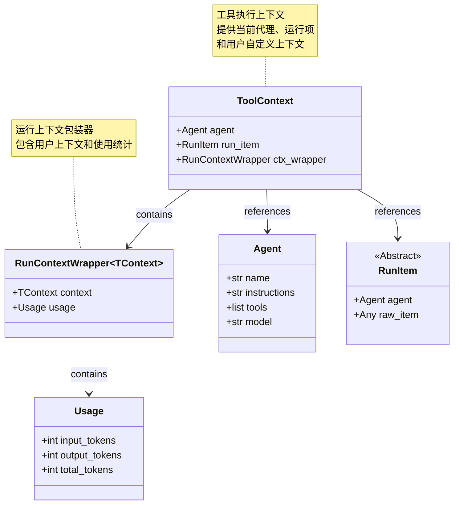

**ToolContext 字段详解：**

| 字段名 | 类型 | 说明 |
|--------|------|------|
| `agent` | `Agent` | 当前执行的代理实例 |
| `run_item` | `RunItem` | 当前的运行项（工具调用项） |
| `ctx_wrapper` | `RunContextWrapper` | 运行上下文包装器，包含用户上下文和使用统计 |

**ToolContext 使用示例：**

```python
@function_tool
def context_aware_tool(
    param: str,
    context: ToolContext  # 接收完整的工具上下文
) -> str:
    """使用完整上下文的工具"""
    
    # 访问当前代理
    agent_name = context.agent.name
    
    # 访问用户上下文
    user_data = context.ctx_wrapper.context
    
    # 访问使用统计
    tokens_used = context.ctx_wrapper.usage.total_tokens
    
    # 访问运行项信息
    tool_call_id = context.run_item.raw_item.id
    
    return f"处理完成：{param}，代理：{agent_name}，已用token：{tokens_used}"
```

### 3.2 工具函数签名类型

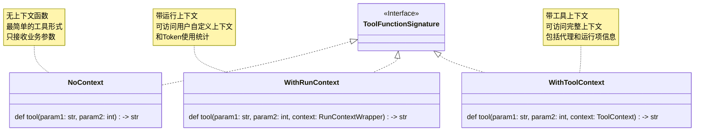

**函数签名对比：**

```python
# 1. 无上下文（最简单）
@function_tool
def simple_tool(city: str) -> str:
    """查询天气"""
    return get_weather_from_api(city)

# 2. 带运行上下文（访问用户数据）
@function_tool
def user_aware_tool(
    city: str,
    context: RunContextWrapper
) -> str:
    """根据用户偏好查询天气"""
    user_prefs = context.context.preferences
    units = user_prefs.get("temperature_units", "celsius")
    return get_weather_from_api(city, units)

# 3. 带工具上下文（访问完整信息）
@function_tool
def full_context_tool(
    city: str,
    context: ToolContext
) -> str:
    """使用完整上下文查询天气"""
    agent_name = context.agent.name
    user_id = context.ctx_wrapper.context.user_id
    
    # 记录日志
    log_tool_call(agent_name, user_id, "get_weather", city)
    
    return get_weather_from_api(city)
```

## 4. 托管工具数据结构

### 4.1 FileSearchTool 数据结构

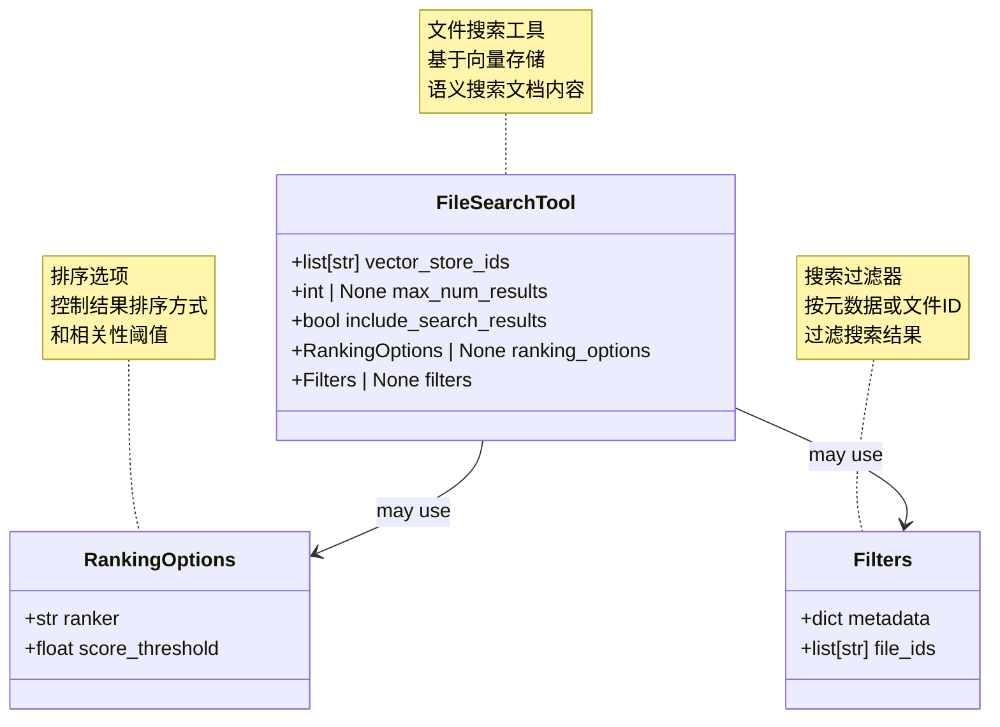

**FileSearchTool 字段详解：**

| 字段名 | 类型 | 默认值 | 说明 |
|--------|------|--------|------|
| `vector_store_ids` | `list[str]` | - | 要搜索的向量存储ID列表 |
| `max_num_results` | `int \| None` | `None` | 返回的最大结果数 |
| `include_search_results` | `bool` | `False` | 是否在LLM输出中包含搜索结果 |
| `ranking_options` | `RankingOptions \| None` | `None` | 结果排序选项 |
| `filters` | `Filters \| None` | `None` | 结果过滤器 |

**配置示例：**

```python
from agents import FileSearchTool
from openai.types.responses.file_search_tool_param import (
    RankingOptions,
    Filters
)

# 基础配置
basic_search = FileSearchTool(
    vector_store_ids=["vs_abc123"]
)

# 完整配置
advanced_search = FileSearchTool(
    vector_store_ids=["vs_abc123", "vs_def456"],
    max_num_results=5,
    include_search_results=True,
    ranking_options=RankingOptions(
        ranker="auto",
        score_threshold=0.7
    ),
    filters=Filters(
        metadata={"department": "engineering"},
        file_ids=["file_123", "file_456"]
    )
)
```

### 4.2 ComputerTool 数据结构

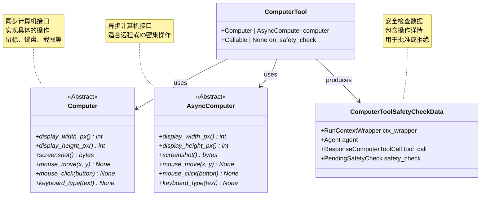

**Computer 接口方法：**

| 方法名 | 返回类型 | 说明 |
|--------|---------|------|
| `display_width_px` | `int` | 显示器宽度（像素） |
| `display_height_px` | `int` | 显示器高度（像素） |
| `screenshot()` | `bytes` | 截取当前屏幕 |
| `mouse_move(x, y)` | `None` | 移动鼠标到指定位置 |
| `mouse_click(button)` | `None` | 点击鼠标按钮 |
| `keyboard_type(text)` | `None` | 输入文本 |

**实现示例：**

```python
from agents.computer import Computer
import pyautogui

class MyComputer(Computer):
    """基于pyautogui的计算机实现"""
    
    @property
    def display_width_px(self) -> int:
        return 1920
    
    @property
    def display_height_px(self) -> int:
        return 1080
    
    async def screenshot(self) -> bytes:
        """截图"""
        screenshot = pyautogui.screenshot()
        # 转换为bytes
        return screenshot_to_bytes(screenshot)
    
    async def mouse_move(self, x: int, y: int):
        """移动鼠标"""
        pyautogui.moveTo(x, y)
    
    async def mouse_click(self, button: str):
        """点击鼠标"""
        pyautogui.click(button=button)
    
    async def keyboard_type(self, text: str):
        """输入文本"""
        pyautogui.typewrite(text)
```

## 5. 工具防护数据结构

### 5.1 工具防护结果 UML

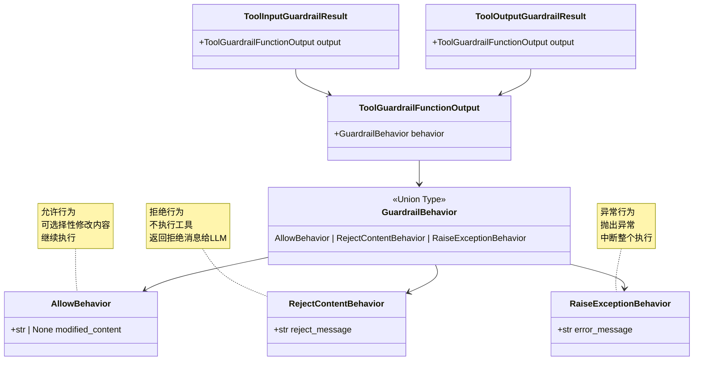

**防护行为详解：**

| 行为类型 | 效果 | 使用场景 |
|---------|------|---------|
| `AllowBehavior` | 允许继续执行 | 检查通过，可选修改内容 |
| `RejectContentBehavior` | 拒绝执行，返回消息 | 参数不合法但不致命 |
| `RaiseExceptionBehavior` | 抛出异常，中断执行 | 严重违规，需要中断 |

**防护实现示例：**

```python
from agents.tool_guardrails import (
    ToolInputGuardrail,
    ToolInputGuardrailResult,
    ToolGuardrailFunctionOutput,
    AllowBehavior,
    RejectContentBehavior,
    RaiseExceptionBehavior
)

class AmountLimitGuardrail(ToolInputGuardrail):
    """金额限制防护"""
    
    def __init__(self, max_amount: float):
        self.max_amount = max_amount
    
    async def run(
        self,
        tool_name: str,
        arguments: dict,
        context: Any
    ) -> ToolInputGuardrailResult:
        
        amount = arguments.get("amount", 0)
        
        if amount > self.max_amount:
            # 超过限制：拒绝
            return ToolInputGuardrailResult(
                output=ToolGuardrailFunctionOutput(
                    behavior=RejectContentBehavior(
                        reject_message=f"金额 {amount} 超过限制 {self.max_amount}"
                    )
                )
            )
        
        if amount < 0:
            # 负数：抛出异常
            return ToolInputGuardrailResult(
                output=ToolGuardrailFunctionOutput(
                    behavior=RaiseExceptionBehavior(
                        error_message="金额不能为负数"
                    )
                )
            )
        
        # 允许执行
        return ToolInputGuardrailResult(
            output=ToolGuardrailFunctionOutput(
                behavior=AllowBehavior()
            )
        )

class OutputSanitizationGuardrail(ToolOutputGuardrail):
    """输出清理防护"""
    
    async def run(
        self,
        tool_name: str,
        output: str,
        context: Any
    ) -> ToolOutputGuardrailResult:
        
        # 检查并移除敏感信息
        if contains_credit_card(output):
            # 修改内容
            sanitized = remove_credit_card_numbers(output)
            return ToolOutputGuardrailResult(
                output=ToolGuardrailFunctionOutput(
                    behavior=AllowBehavior(
                        modified_content=sanitized
                    )
                )
            )
        
        # 原样通过
        return ToolOutputGuardrailResult(
            output=ToolGuardrailFunctionOutput(
                behavior=AllowBehavior()
            )
        )
```

## 6. 工具执行结果数据结构

### 6.1 FunctionToolResult UML

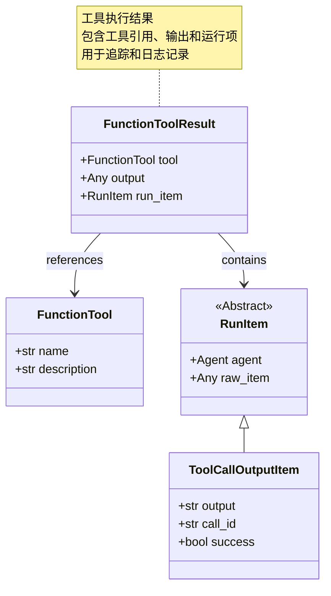

**FunctionToolResult 字段详解：**

| 字段名 | 类型 | 说明 |
|--------|------|------|
| `tool` | `FunctionTool` | 执行的工具实例 |
| `output` | `Any` | 工具的输出结果 |
| `run_item` | `RunItem` | 生成的运行项（ToolCallOutputItem） |

**使用示例：**

```python
# 工具执行后获取结果
async def execute_and_log_tool(tool: FunctionTool, args: dict):
    """执行工具并记录结果"""
    
    # 执行工具（内部实现）
    result: FunctionToolResult = await execute_tool(tool, args)
    
    # 访问结果信息
    tool_name = result.tool.name
    output = result.output
    success = result.run_item.success if hasattr(result.run_item, 'success') else True
    
    # 记录日志
    logger.info(f"工具 {tool_name} 执行{'成功' if success else '失败'}")
    logger.debug(f"输出: {output}")
    
    return result
```

## 7. MCP 工具数据结构

### 7.1 HostedMCPTool 和批准流程

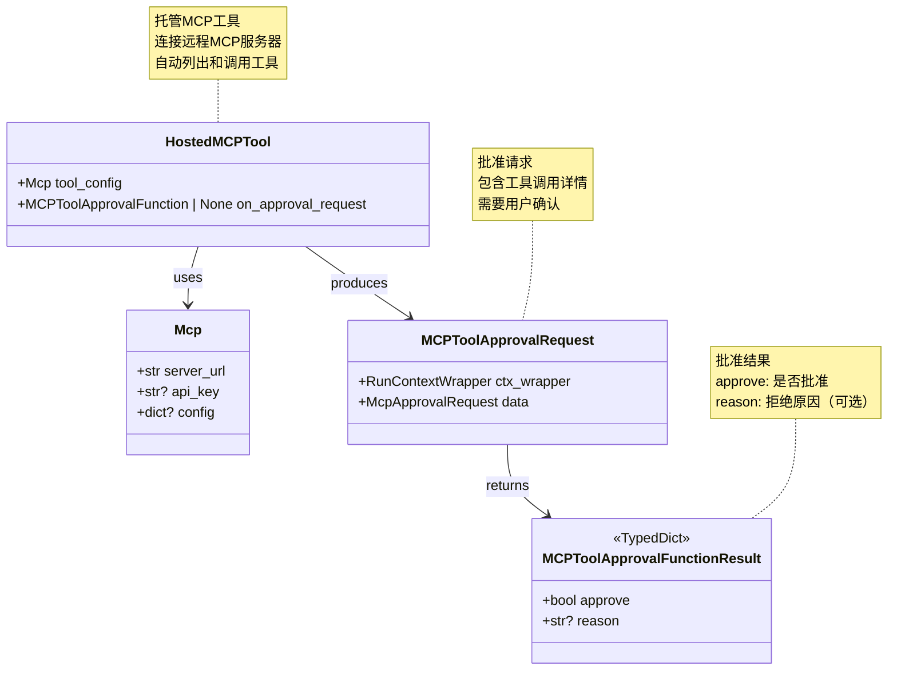

**批准流程示例：**

```python
from agents import HostedMCPTool
from agents.tool import MCPToolApprovalRequest, MCPToolApprovalFunctionResult

async def mcp_approval_handler(
    request: MCPToolApprovalRequest
) -> MCPToolApprovalFunctionResult:
    """MCP工具批准处理器"""
    
    # 访问请求信息
    tool_name = request.data.tool_name
    tool_arguments = request.data.arguments
    server_name = request.data.server_name
    
    # 访问运行上下文
    user_id = request.ctx_wrapper.context.user_id
    
    # 自动批准白名单工具
    whitelist = ["read_file", "list_directory", "get_info"]
    if tool_name in whitelist:
        return {"approve": True}
    
    # 需要管理员权限的工具
    admin_tools = ["delete_file", "modify_system"]
    if tool_name in admin_tools:
        if not is_admin(user_id):
            return {
                "approve": False,
                "reason": f"工具 {tool_name} 需要管理员权限"
            }
    
    # 检查参数
    if "path" in tool_arguments:
        path = tool_arguments["path"]
        if "/system" in path:
            return {
                "approve": False,
                "reason": "不允许访问系统目录"
            }
    
    # 默认批准
    return {"approve": True}

# 创建MCP工具
mcp_tool = HostedMCPTool(
    tool_config=Mcp(
        server_url="https://mcp.example.com",
        api_key="your-api-key"
    ),
    on_approval_request=mcp_approval_handler
)
```

## 8. 工具数据流转图

### 8.1 工具调用数据流

```mermaid
flowchart TB
    subgraph "工具定义阶段"
        FUNC[Python函数]
        DECORATOR[@function_tool装饰器]
        SCHEMA[提取函数签名和文档]
        TOOL[FunctionTool对象]
    end
    
    subgraph "工具注册阶段"
        AGENT[Agent]
        TOOLLIST[工具列表]
        AGGREGATE[工具聚合]
    end
    
    subgraph "工具调用阶段"
        LLM[模型决策]
        TOOLCALL[ToolCall请求]
        PARSE[解析参数JSON]
        INPUTGUARD[输入防护]
        ENABLED[检查启用状态]
        EXECUTE[执行工具函数]
        OUTPUTGUARD[输出防护]
        RESULT[FunctionToolResult]
    end
    
    subgraph "结果处理阶段"
        RUNITEM[创建RunItem]
        TOMODEL[返回给模型]
    end
    
    FUNC --> DECORATOR
    DECORATOR --> SCHEMA
    SCHEMA --> TOOL
    
    TOOL --> TOOLLIST
    TOOLLIST --> AGENT
    AGENT --> AGGREGATE
    
    AGGREGATE --> LLM
    LLM --> TOOLCALL
    
    TOOLCALL --> PARSE
    PARSE --> INPUTGUARD
    
    INPUTGUARD -->|通过| ENABLED
    INPUTGUARD -->|拒绝| RESULT
    
    ENABLED -->|启用| EXECUTE
    ENABLED -->|禁用| RESULT
    
    EXECUTE --> OUTPUTGUARD
    
    OUTPUTGUARD -->|通过| RESULT
    OUTPUTGUARD -->|修改| RESULT
    OUTPUTGUARD -->|拒绝| RESULT
    
    RESULT --> RUNITEM
    RUNITEM --> TOMODEL
    
    style FUNC fill:#e1f5fe
    style TOOL fill:#f3e5f5
    style EXECUTE fill:#e8f5e9
    style RESULT fill:#fff3e0
```

### 8.2 不同工具类型的数据流

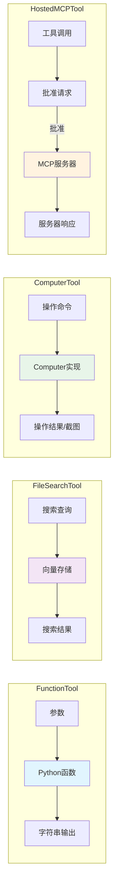

## 9. 数据结构最佳实践

### 9.1 自定义工具类型

```python
from dataclasses import dataclass
from agents.tool import Tool

@dataclass
class DatabaseTool:
    """自定义数据库工具"""
    
    connection_string: str
    allowed_operations: list[str]
    
    @property
    def name(self) -> str:
        return "database_tool"
    
    def execute_query(self, query: str) -> str:
        """执行数据库查询"""
        # 实现查询逻辑
        return query_result

# 注意：自定义工具类型需要添加到Tool联合类型
# 或者转换为FunctionTool
def create_database_function_tool(db_tool: DatabaseTool) -> FunctionTool:
    """将自定义工具转换为FunctionTool"""
    
    @function_tool
    def query_database(sql: str) -> str:
        """执行SQL查询"""
        return db_tool.execute_query(sql)
    
    return query_database
```

### 9.2 工具组合模式

```python
from typing import Protocol

class ToolProvider(Protocol):
    """工具提供者协议"""
    def get_tools(self) -> list[Tool]:
        ...

class BasicToolProvider:
    """基础工具提供者"""
    def get_tools(self) -> list[Tool]:
        return [
            get_time,
            calculate,
            search_web
        ]

class AdminToolProvider:
    """管理员工具提供者"""
    def __init__(self, basic_provider: ToolProvider):
        self.basic_provider = basic_provider
    
    def get_tools(self) -> list[Tool]:
        return self.basic_provider.get_tools() + [
            manage_users,
            system_config,
            database_admin
        ]

# 使用
basic = BasicToolProvider()
admin = AdminToolProvider(basic)

basic_agent = Agent(tools=basic.get_tools())
admin_agent = Agent(tools=admin.get_tools())
```

Tools 模块通过清晰的数据结构设计和灵活的类型系统，为 OpenAI Agents 提供了强大的工具集成能力，支持从简单函数到复杂系统集成的各种扩展需求。

---

## 时序图

## 1. 时序图总览

Tools 模块的时序图展示了工具从定义、注册到执行的完整生命周期，以及不同类型工具的执行流程和防护机制。

### 核心时序场景

| 场景类别 | 时序图 | 关键流程 |
|---------|--------|---------|
| **工具定义** | function_tool 装饰器流程 | 函数分析、Schema生成、工具创建 |
| **工具注册** | Agent 工具聚合流程 | 工具收集、去重、传递给模型 |
| **函数工具执行** | FunctionTool 调用流程 | 参数解析、防护检查、函数执行 |
| **托管工具执行** | FileSearchTool 调用流程 | 搜索请求、向量检索、结果返回 |
| **计算机工具执行** | ComputerTool 调用流程 | 操作请求、安全检查、执行操作 |
| **MCP工具执行** | HostedMCPTool 调用流程 | 工具列表、批准请求、远程执行 |

## 2. 工具定义时序图

### 场景：使用 function_tool 装饰器定义工具

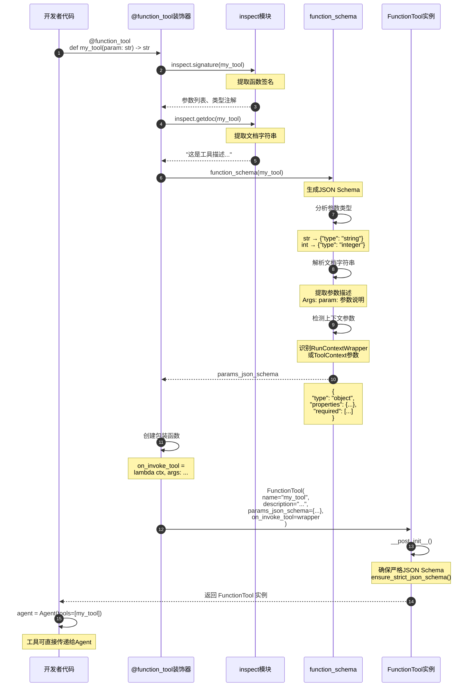

**时序图说明：**

### 工具定义阶段

1. **函数签名分析（步骤 1-4）**：
   - 使用 `inspect` 模块提取函数签名
   - 获取参数名称、类型注解、默认值

2. **文档提取（步骤 5-7）**：
   - 提取函数的文档字符串
   - 用作工具描述

3. **Schema 生成（步骤 8-15）**：
   - 根据类型注解生成 JSON Schema
   - 解析文档字符串获取参数描述
   - 识别并过滤上下文参数

4. **包装函数创建（步骤 16-17）**：
   - 创建调用包装器
   - 处理参数解析和上下文注入

5. **工具实例化（步骤 18-21）**：
   - 创建 `FunctionTool` 实例
   - 应用严格 JSON Schema
   - 返回可用的工具

### 类型映射规则

**Python类型 → JSON Schema：**

```python
str        → {"type": "string"}
int        → {"type": "integer"}
float      → {"type": "number"}
bool       → {"type": "boolean"}
list[str]  → {"type": "array", "items": {"type": "string"}}
dict       → {"type": "object"}
str | None → {"type": ["string", "null"]}  # 可选参数
```

## 3. 工具注册时序图

### 场景：Agent 聚合和准备工具

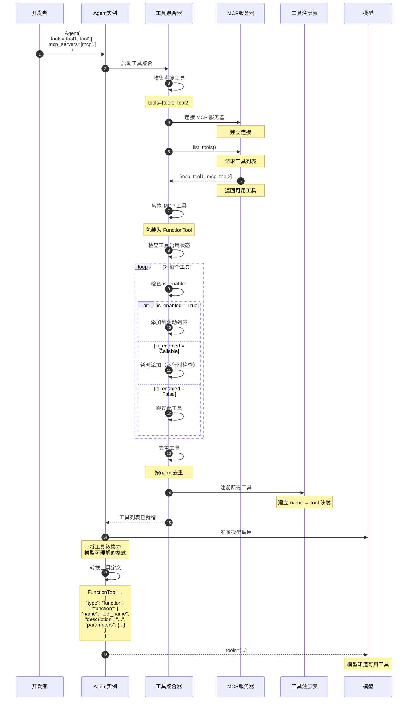

**时序图说明：**

### 工具聚合流程

1. **直接工具收集（步骤 1-4）**：
   - 收集 `Agent(tools=[...])` 中的工具
   - 验证工具类型

2. **MCP 工具集成（步骤 5-11）**：
   - 连接 MCP 服务器
   - 列出远程工具
   - 转换为本地工具格式

3. **启用状态检查（步骤 12-20）**：
   - 检查每个工具的 `is_enabled`
   - 过滤禁用的工具
   - 保留动态启用的工具

4. **去重和注册（步骤 21-24）**：
   - 按工具名称去重
   - 注册到工具注册表

5. **模型格式转换（步骤 25-31）**：
   - 转换为模型 API 格式
   - 传递给模型

### 工具定义格式

**发送给模型的格式：**

```json
{
  "type": "function",
  "function": {
    "name": "get_weather",
    "description": "获取指定城市的天气信息",
    "parameters": {
      "type": "object",
      "properties": {
        "city": {
          "type": "string",
          "description": "城市名称"
        },
        "units": {
          "type": "string",
          "enum": ["celsius", "fahrenheit"],
          "description": "温度单位"
        }
      },
      "required": ["city"],
      "additionalProperties": false
    }
  }
}
```

## 4. FunctionTool 执行时序图

### 场景：完整的函数工具调用流程

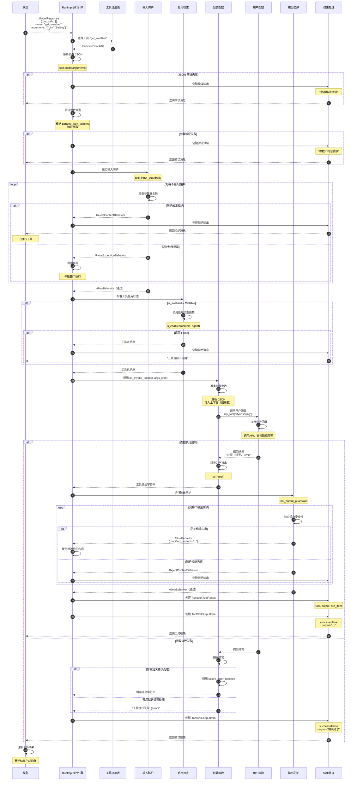

**时序图说明：**

### 工具执行阶段

1. **参数处理（步骤 1-11）**：
   - 解析参数 JSON
   - 验证参数类型和格式
   - 处理解析或验证错误

2. **输入防护（步骤 12-23）**：
   - 运行所有输入防护
   - 处理拒绝或异常行为
   - 通过后继续执行

3. **启用检查（步骤 24-32）**：
   - 检查工具启用状态
   - 动态启用检查
   - 处理禁用情况

4. **函数执行（步骤 33-43）**：
   - 准备函数参数
   - 注入上下文（如需要）
   - 调用实际函数
   - 执行业务逻辑

5. **输出防护（步骤 44-56）**：
   - 运行所有输出防护
   - 处理内容修改或拒绝
   - 通过后返回结果

6. **结果封装（步骤 57-66）**：
   - 创建工具结果对象
   - 创建运行项
   - 返回给模型

### 错误处理路径

**参数错误：**

```
JSON 解析失败 → 错误消息 → 返回模型
参数验证失败 → 错误消息 → 返回模型
```

**防护拒绝：**

```
输入防护拒绝 → 拒绝消息 → 返回模型（不执行）
输出防护拒绝 → 拒绝消息 → 返回模型
```

**执行异常：**

```
函数抛出异常 → 捕获并转换 → 错误结果 → 返回模型
防护抛出异常 → 传播异常 → 中断整个执行
```

## 5. FileSearchTool 执行时序图

### 场景：托管文件搜索工具调用

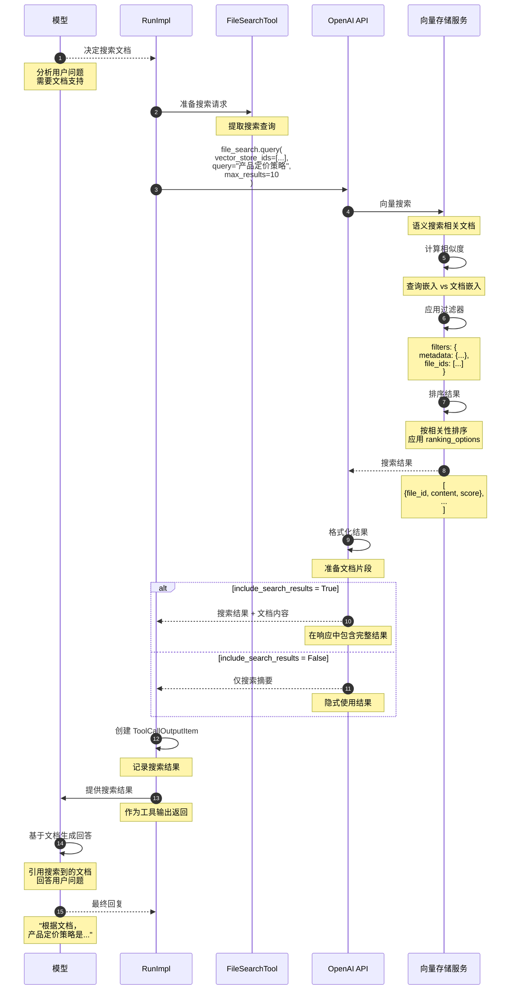

**时序图说明：**

### 文件搜索流程

1. **搜索决策（步骤 1-3）**：
   - 模型判断需要搜索文档
   - 准备搜索查询

2. **向量搜索（步骤 4-11）**：
   - 调用 OpenAI API
   - 向量存储进行语义搜索
   - 计算查询与文档的相似度

3. **结果过滤和排序（步骤 12-15）**：
   - 应用元数据过滤器
   - 按相关性排序
   - 限制结果数量

4. **结果返回（步骤 16-24）**：
   - 格式化搜索结果
   - 根据配置返回内容
   - 模型基于结果生成回答

### 搜索配置影响

**max_num_results：**

- 控制返回结果数量
- 影响上下文大小和精确度

**include_search_results：**

- `True`：在输出中包含完整结果
- `False`：隐式使用，不显示给用户

**ranking_options：**

- 自定义排序算法
- 设置相关性阈值

## 6. ComputerTool 执行时序图

### 场景：计算机控制工具执行操作

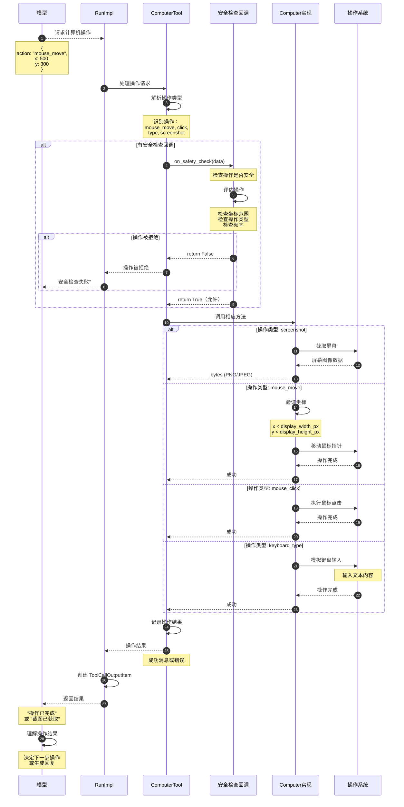

**时序图说明：**

### 计算机操作流程

1. **操作解析（步骤 1-4）**：
   - 模型请求计算机操作
   - 解析操作类型和参数

2. **安全检查（步骤 5-14）**：
   - 调用安全检查回调
   - 评估操作的安全性
   - 拒绝危险操作

3. **操作执行（步骤 15-34）**：
   - 根据操作类型调用相应方法
   - 与操作系统交互
   - 返回操作结果

4. **结果处理（步骤 35-40）**：
   - 记录操作日志
   - 创建运行项
   - 返回给模型

### 支持的操作类型

**鼠标操作：**

- `mouse_move(x, y)`: 移动鼠标
- `mouse_click(button)`: 点击鼠标
- `mouse_drag(from_x, from_y, to_x, to_y)`: 拖动

**键盘操作：**

- `keyboard_type(text)`: 输入文本
- `keyboard_press(key)`: 按键

**屏幕操作：**

- `screenshot()`: 截取屏幕
- `screenshot_region(x, y, width, height)`: 区域截图

## 7. HostedMCPTool 执行时序图

### 场景：托管 MCP 工具调用和批准流程

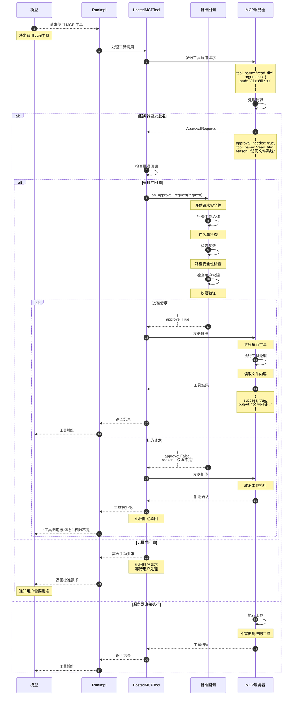

**时序图说明：**

### MCP 工具调用流程

1. **请求发送（步骤 1-4）**：
   - 模型请求 MCP 工具
   - 发送到远程服务器

2. **批准检查（步骤 5-13）**：
   - 服务器判断是否需要批准
   - 返回批准请求

3. **批准决策（步骤 14-30）**：
   - 调用批准回调
   - 评估请求安全性
   - 做出批准或拒绝决定

4. **工具执行（步骤 31-42）**：
   - 批准后执行工具
   - 拒绝则取消执行
   - 返回结果或错误

### 批准决策逻辑

**自动批准：**

```python
# 白名单工具
whitelist = ["read_file", "list_directory"]
if tool_name in whitelist:
    return {"approve": True}
```

**条件批准：**

```python
# 检查路径安全性
if "path" in arguments:
    if is_safe_path(arguments["path"]):
        return {"approve": True}
    else:
        return {"approve": False, "reason": "路径不安全"}
```

**需要人工批准：**

```python
# 敏感操作
sensitive_tools = ["delete_file", "modify_config"]
if tool_name in sensitive_tools:
    # 不提供批准回调，需要用户手动批准
    return None
```

## 8. 工具执行流程总览

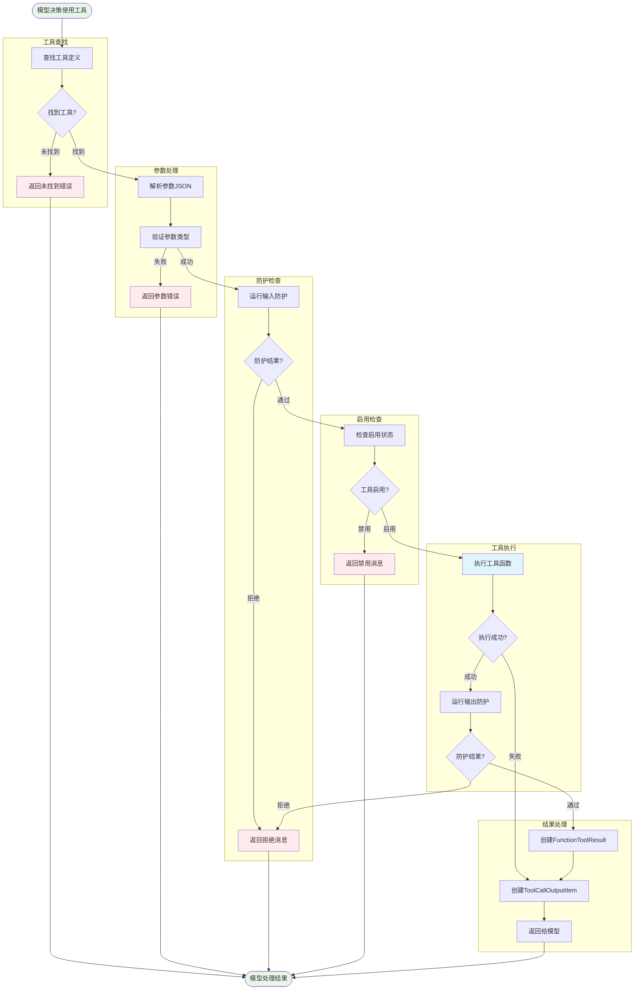

Tools 模块通过精心设计的时序流程和完善的防护机制，为 OpenAI Agents 提供了安全、可靠的工具执行能力，支持从简单函数调用到复杂系统集成的各种应用场景。

---
