# OpenAIAgent-04-Memory

## 模块概览

## 1. 模块职责与边界

Memory 模块是 OpenAI Agents Python SDK 的会话管理核心，负责对话历史的持久化存储、检索和管理。该模块提供了统一的会话接口和多种存储实现，确保智能代理能够维持长期的对话上下文和记忆能力。

### 核心职责

- **会话抽象**：定义统一的会话接口和协议
- **历史管理**：存储、检索和管理对话历史记录
- **多存储支持**：提供多种存储后端实现（SQLite、OpenAI Conversations等）
- **并发安全**：确保多线程环境下的数据安全
- **性能优化**：提供高效的历史检索和限制机制
- **生命周期管理**：处理会话的创建、更新、清理

### 会话存储架构

| 存储类型 | 实现类 | 存储位置 | 主要特点 |
|----------|--------|----------|----------|
| 本地SQLite | `SQLiteSession` | 本地文件/内存 | 高性能、完全控制、支持复杂查询 |
| OpenAI云端 | `OpenAIConversationsSession` | OpenAI服务器 | 与OpenAI生态集成、自动同步 |
| 自定义实现 | `Session` 协议 | 用户定义 | 灵活扩展、适配各种存储系统 |

### 输入输出接口

**输入：**

- 会话标识符（`session_id`）
- 对话项目列表（`list[TResponseInputItem]`）
- 查询参数（限制数量、排序等）

**输出：**

- 历史对话项目（按时间排序）
- 会话状态信息
- 操作结果确认

### 上下游依赖关系

**上游调用者：**

- `Runner`：执行引擎集成会话历史
- `Agent`：代理配置中指定会话对象
- 用户应用：直接管理会话生命周期

**下游依赖：**

- `items`：对话项目类型定义
- `sqlite3`：SQLite数据库访问
- `openai`：OpenAI API客户端
- `asyncio`：异步I/O处理

## 2. 模块架构图

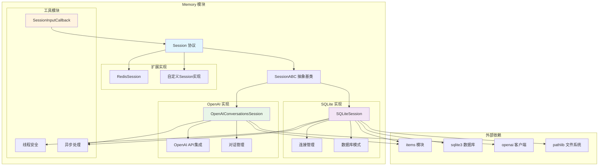

**架构说明：**

### 接口层次设计

1. **协议层**：`Session` 协议定义统一的会话接口
2. **抽象层**：`SessionABC` 抽象基类提供默认实现框架  
3. **实现层**：具体的存储后端实现
4. **工具层**：会话处理的辅助工具和回调

### 存储模式对比

#### SQLite 存储模式
- **优势**：高性能、完全控制、复杂查询支持、离线工作
- **适用场景**：本地应用、高频访问、复杂历史分析
- **连接策略**：内存数据库使用共享连接，文件数据库使用线程本地连接

#### OpenAI 云端存储模式  
- **优势**：与OpenAI生态无缝集成、自动同步、服务器端管理
- **适用场景**：纯OpenAI模型使用、跨设备同步、云端应用
- **限制**：依赖网络连接、仅支持OpenAI模型

### 并发安全策略

- **SQLite模式**：使用线程锁保护共享连接，WAL模式提高并发性能
- **OpenAI模式**：基于异步API，天然支持并发
- **通用策略**：所有操作通过异步接口统一处理

### 性能优化机制

- **连接复用**：合理的连接池管理减少建连开销
- **索引优化**：关键字段建立索引提高查询性能
- **批量操作**：支持批量添加项目减少I/O次数
- **限制查询**：支持限制数量避免大数据集内存溢出

## 3. 关键算法与流程剖析

### 3.1 SQLite会话存储算法

```python
class SQLiteSession(SessionABC):
    """SQLite会话存储的核心实现"""
    
    def __init__(self, session_id: str, db_path: str | Path = ":memory:", ...):
        """初始化SQLite会话存储"""
        self.session_id = session_id
        self.db_path = db_path
        self._local = threading.local()
        self._lock = threading.Lock()
        
        # 区分内存数据库和文件数据库的连接策略
        self._is_memory_db = str(db_path) == ":memory:"
        if self._is_memory_db:
            # 内存数据库：使用共享连接避免线程隔离
            self._shared_connection = sqlite3.connect(":memory:", check_same_thread=False)
            self._shared_connection.execute("PRAGMA journal_mode=WAL")
            self._init_db_for_connection(self._shared_connection)
        else:
            # 文件数据库：使用独立连接提高并发性
            init_conn = sqlite3.connect(str(self.db_path), check_same_thread=False)
            init_conn.execute("PRAGMA journal_mode=WAL")
            self._init_db_for_connection(init_conn)
            init_conn.close()
    
    def _get_connection(self) -> sqlite3.Connection:
        """获取数据库连接的智能策略"""
        if self._is_memory_db:
            # 内存数据库使用共享连接
            return self._shared_connection
        else:
            # 文件数据库使用线程本地连接
            if not hasattr(self._local, "connection"):
                self._local.connection = sqlite3.connect(
                    str(self.db_path), check_same_thread=False
                )
                self._local.connection.execute("PRAGMA journal_mode=WAL")
            return self._local.connection
```

**算法目的：** 根据存储类型选择最优的连接策略，平衡性能和线程安全。

**关键设计决策：**

1. **连接策略分化**：内存数据库和文件数据库采用不同连接管理策略
2. **WAL模式启用**：提高并发读写性能，减少锁冲突
3. **线程安全保证**：通过锁机制确保并发操作的数据一致性

### 3.2 历史检索优化算法

```python
async def get_items(self, limit: int | None = None) -> list[TResponseInputItem]:
    """优化的历史检索算法"""
    
    def _get_items_sync():
        conn = self._get_connection()
        with self._lock if self._is_memory_db else threading.Lock():
            if limit is None:
                # 获取全部历史：按时间正序
                cursor = conn.execute(
                    f"""
                    SELECT message_data FROM {self.messages_table}
                    WHERE session_id = ?
                    ORDER BY created_at ASC
                    """,
                    (self.session_id,)
                )
            else:
                # 获取最近N条：先倒序取限制数量，再反转为正序
                cursor = conn.execute(
                    f"""
                    SELECT message_data FROM {self.messages_table}
                    WHERE session_id = ?
                    ORDER BY created_at DESC
                    LIMIT ?
                    """,
                    (self.session_id, limit)
                )
            
            rows = cursor.fetchall()
            
            # 限制查询时需要反转顺序
            if limit is not None:
                rows = list(reversed(rows))
            
            # JSON反序列化处理
            items = []
            for (message_data,) in rows:
                try:
                    item = json.loads(message_data)
                    items.append(item)
                except json.JSONDecodeError:
                    # 跳过损坏的JSON条目
                    continue
            
            return items
    
    return await asyncio.to_thread(_get_items_sync)
```

**算法目的：** 提供高效的历史检索，支持全量和限制查询，保证时间顺序正确性。

**优化策略：**

1. **查询策略优化**：限制查询使用DESC+LIMIT+反转，避免OFFSET性能问题
2. **异步处理**：使用`asyncio.to_thread`将同步数据库操作转为异步
3. **错误恢复**：优雅处理JSON解析错误，不中断整体查询流程
4. **内存控制**：支持限制查询避免大数据集内存溢出

### 3.3 批量操作事务算法

```python
async def add_items(self, items: list[TResponseInputItem]) -> None:
    """批量添加项目的事务处理算法"""
    if not items:
        return
    
    def _add_items_sync():
        conn = self._get_connection()
        with self._lock if self._is_memory_db else threading.Lock():
            # 确保会话记录存在
            conn.execute(
                f"INSERT OR IGNORE INTO {self.sessions_table} (session_id) VALUES (?)",
                (self.session_id,)
            )
            
            # 批量插入消息数据
            message_data = [
                (self.session_id, json.dumps(item))
                for item in items
            ]
            conn.executemany(
                f"INSERT INTO {self.messages_table} (session_id, message_data) VALUES (?, ?)",
                message_data
            )
            
            # 更新会话时间戳
            conn.execute(
                f"""UPDATE {self.sessions_table}
                   SET updated_at = CURRENT_TIMESTAMP
                   WHERE session_id = ?""",
                (self.session_id,)
            )
            
            # 提交事务
            conn.commit()
    
    await asyncio.to_thread(_add_items_sync)
```

**算法目的：** 通过批量操作和事务机制提高写入性能，确保数据一致性。

**事务设计特点：**

1. **原子性保证**：所有操作在同一事务中，全成功或全失败
2. **批量优化**：使用`executemany`减少SQL执行次数
3. **状态同步**：同步更新会话元数据和消息数据
4. **并发控制**：通过锁机制防止并发写入冲突

### 3.4 数据库模式设计

```python
def _init_db_for_connection(self, conn: sqlite3.Connection) -> None:
    """数据库模式初始化"""
    # 会话元数据表
    conn.execute(f"""
        CREATE TABLE IF NOT EXISTS {self.sessions_table} (
            session_id TEXT PRIMARY KEY,
            created_at TIMESTAMP DEFAULT CURRENT_TIMESTAMP,
            updated_at TIMESTAMP DEFAULT CURRENT_TIMESTAMP
        )
    """)
    
    # 消息数据表
    conn.execute(f"""
        CREATE TABLE IF NOT EXISTS {self.messages_table} (
            id INTEGER PRIMARY KEY AUTOINCREMENT,
            session_id TEXT NOT NULL,
            message_data TEXT NOT NULL,
            created_at TIMESTAMP DEFAULT CURRENT_TIMESTAMP,
            FOREIGN KEY (session_id) REFERENCES {self.sessions_table} (session_id)
                ON DELETE CASCADE
        )
    """)
    
    # 性能优化索引
    conn.execute(f"""
        CREATE INDEX IF NOT EXISTS idx_{self.messages_table}_session_id
        ON {self.messages_table} (session_id, created_at)
    """)
    
    conn.commit()
```

**模式设计原则：**

1. **规范化设计**：分离会话元数据和消息数据，避免冗余
2. **外键约束**：确保引用完整性，支持级联删除
3. **索引优化**：复合索引支持高效的会话查询
4. **时间戳跟踪**：自动记录创建和更新时间

## 4. 数据结构与UML图

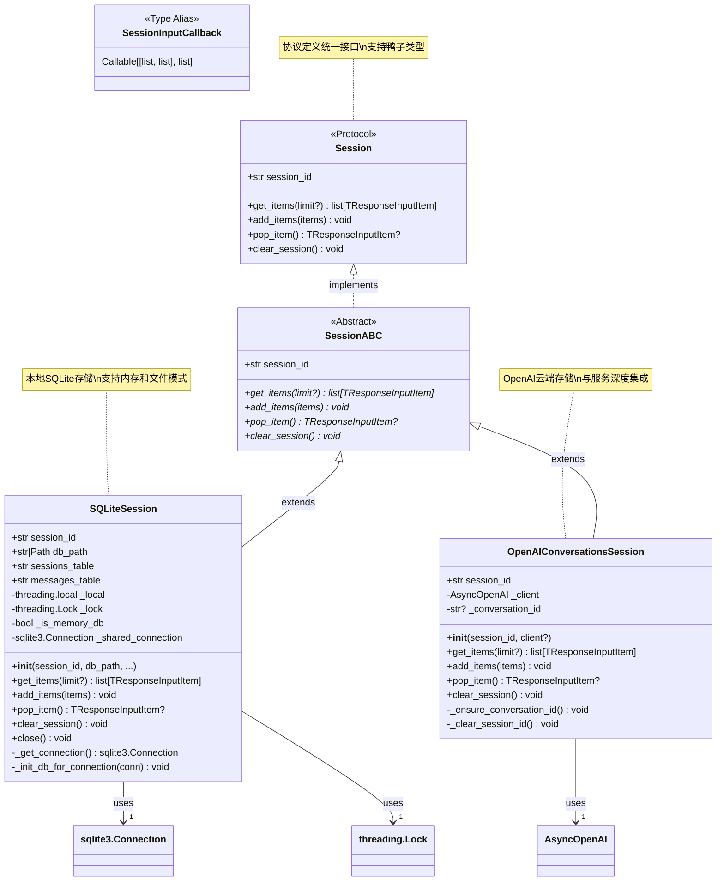

**类图说明：**

### 接口设计层次

1. **Session协议**：定义统一的会话操作接口，支持鸭子类型
2. **SessionABC抽象类**：为具体实现提供通用框架
3. **具体实现类**：SQLiteSession和OpenAIConversationsSession各有特色

### 组合关系说明

- **SQLiteSession**：组合sqlite3.Connection和threading.Lock实现并发安全
- **OpenAIConversationsSession**：组合AsyncOpenAI客户端实现云端集成
- **SessionInputCallback**：函数类型别名，支持会话输入处理定制

### 方法一致性

所有实现类都提供相同的方法签名，确保可替换性：

- `get_items()`: 检索历史记录
- `add_items()`: 添加新记录  
- `pop_item()`: 移除最新记录
- `clear_session()`: 清空会话

## 5. 典型使用场景时序图

### 场景一：会话初始化与首次对话

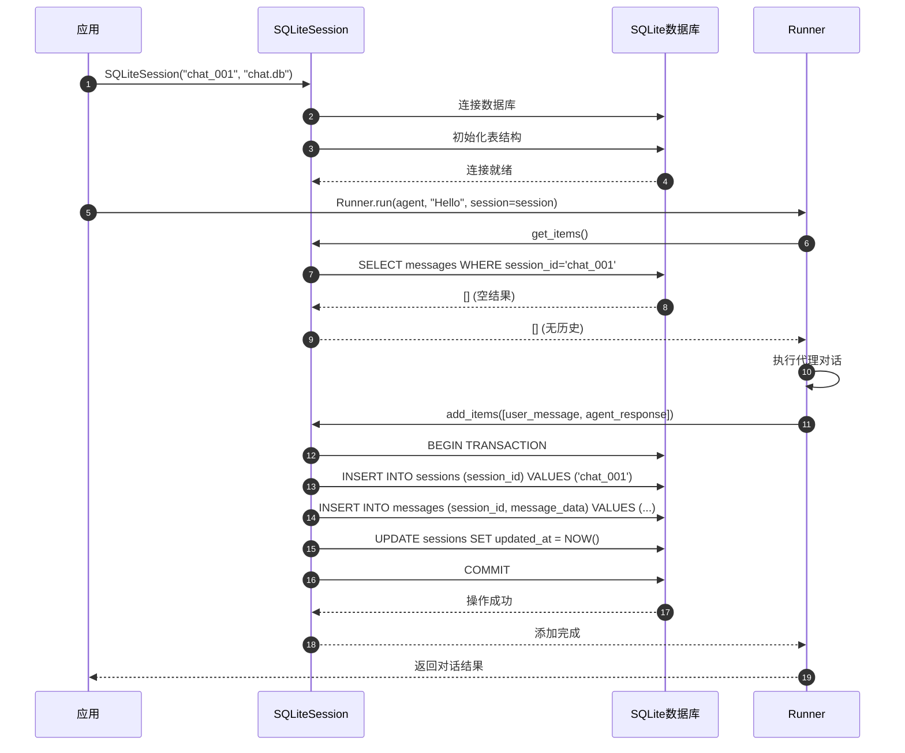

### 场景二：长对话历史管理

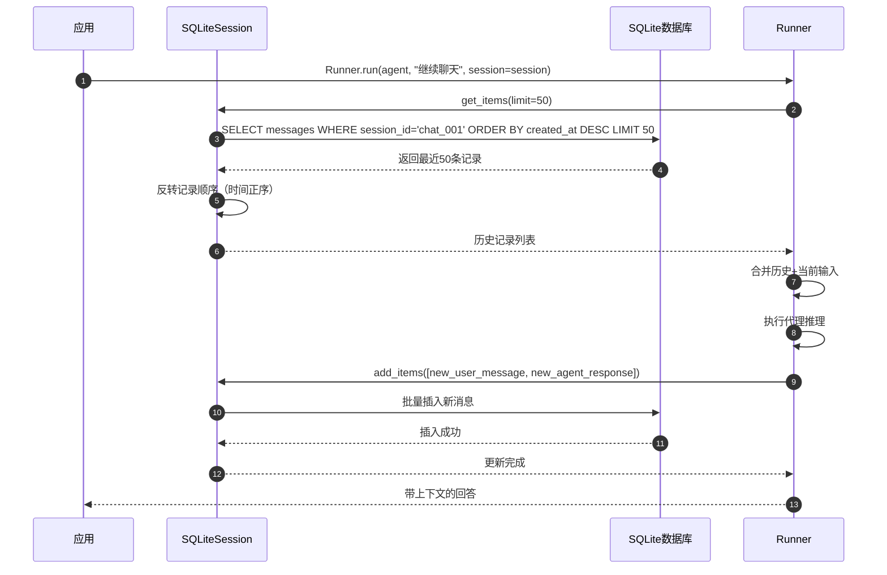

### 场景三：会话清理与维护

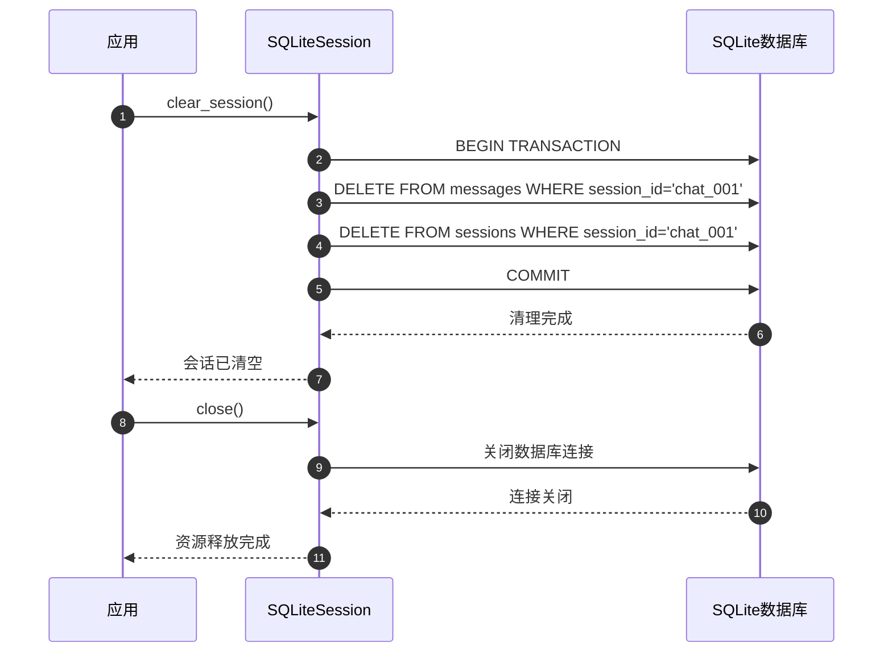

## 6. 最佳实践与使用模式

### 6.1 SQLite会话的最佳实践

```python
import asyncio
from pathlib import Path
from agents import Agent, Runner, SQLiteSession

async def sqlite_session_best_practices():
    """SQLite会话使用最佳实践"""
    
    # 1. 使用持久化文件存储
    db_path = Path("conversations") / "agent_sessions.db"
    db_path.parent.mkdir(exist_ok=True)
    
    session = SQLiteSession(
        session_id="user_123_chat",
        db_path=db_path,
        sessions_table="agent_sessions",     # 可自定义表名
        messages_table="agent_messages"
    )
    
    # 2. 创建长期对话代理
    agent = Agent(
        name="PersistentAssistant",
        instructions="你是一个能记住历史对话的助手，请保持对话的连贯性。"
    )
    
    try:
        # 3. 进行多轮对话
        conversations = [
            "我叫张三，今年30岁",
            "我上次说的年龄是多少？",
            "我有什么爱好吗？",
            "我喜欢编程，特别是Python"
        ]
        
        for user_input in conversations:
            result = await Runner.run(
                agent,
                user_input,
                session=session
            )
            print(f"用户: {user_input}")
            print(f"助手: {result.final_output}\n")
            
            # 4. 检查会话状态
            history = await session.get_items(limit=5)  # 获取最近5条
            print(f"当前会话有 {len(history)} 条最近记录")
    
    finally:
        # 5. 正确关闭会话
        session.close()

# 运行示例
asyncio.run(sqlite_session_best_practices())
```

### 6.2 OpenAI云端会话使用

```python
from agents import Agent, Runner, OpenAIConversationsSession
from openai import AsyncOpenAI

async def openai_session_usage():
    """OpenAI云端会话使用模式"""
    
    # 1. 创建OpenAI客户端
    client = AsyncOpenAI(api_key="your-api-key")
    
    # 2. 创建云端会话
    session = OpenAIConversationsSession(
        session_id="cloud_chat_001",
        client=client
    )
    
    # 3. 创建与OpenAI生态集成的代理
    agent = Agent(
        name="CloudAssistant",
        instructions="你是一个云端助手，对话历史会自动同步。",
        model="gpt-4o"  # 确保使用OpenAI模型
    )
    
    # 4. 多设备间的对话连续性
    conversations = [
        "开始一个关于机器学习的讨论",
        "我们刚才讨论到哪里了？",  # 云端会话可跨设备恢复
        "继续深入探讨神经网络"
    ]
    
    for user_input in conversations:
        result = await Runner.run(
            agent,
            user_input,
            session=session,
            conversation_id=session._conversation_id  # 使用云端对话ID
        )
        print(f"用户: {user_input}")
        print(f"助手: {result.final_output}\n")

asyncio.run(openai_session_usage())
```

### 6.3 自定义会话输入处理

```python
from agents import Agent, Runner, SQLiteSession

def custom_session_input_processor(
    session_items: list,
    user_items: list
) -> list:
    """自定义会话输入处理器"""
    
    # 1. 限制历史长度，避免上下文过长
    MAX_HISTORY = 20
    if len(session_items) > MAX_HISTORY:
        # 保留最近的对话，但保持对话完整性
        session_items = session_items[-MAX_HISTORY:]
    
    # 2. 过滤敏感信息
    filtered_items = []
    for item in session_items:
        # 假设我们有一个内容过滤函数
        if not contains_sensitive_info(item):
            filtered_items.append(item)
    
    # 3. 添加上下文摘要（当历史很长时）
    if len(filtered_items) > 10:
        summary_item = create_conversation_summary(filtered_items[:5])
        filtered_items = [summary_item] + filtered_items[5:]
    
    # 4. 合并历史和当前输入
    return filtered_items + user_items

def contains_sensitive_info(item) -> bool:
    """检查是否包含敏感信息"""
    sensitive_keywords = ["密码", "身份证", "银行卡"]
    content = str(item.get("content", ""))
    return any(keyword in content for keyword in sensitive_keywords)

def create_conversation_summary(items) -> dict:
    """创建对话摘要"""
    return {
        "type": "message",
        "content": f"[对话摘要：基于前{len(items)}条对话的要点总结]",
        "role": "system"
    }

async def custom_processing_example():
    """使用自定义处理器的示例"""
    
    session = SQLiteSession("processed_chat", "processed.db")
    
    agent = Agent(
        name="SmartAssistant",
        instructions="你是一个智能助手，会基于处理过的对话历史回答问题。"
    )
    
    # 使用自定义会话输入处理器
    from agents.run import RunConfig
    config = RunConfig(
        session_input_callback=custom_session_input_processor
    )
    
    result = await Runner.run(
        agent,
        "根据我们之前的对话，我需要什么帮助？",
        session=session,
        run_config=config
    )
    
    print(result.final_output)
    session.close()

asyncio.run(custom_processing_example())
```

### 6.4 多会话管理模式

```python
from typing import Dict
from agents import SQLiteSession

class SessionManager:
    """会话管理器：统一管理多个用户会话"""
    
    def __init__(self, db_path: str):
        self.db_path = db_path
        self.active_sessions: Dict[str, SQLiteSession] = {}
    
    def get_session(self, user_id: str, session_type: str = "default") -> SQLiteSession:
        """获取或创建用户会话"""
        session_id = f"{user_id}_{session_type}"
        
        if session_id not in self.active_sessions:
            self.active_sessions[session_id] = SQLiteSession(
                session_id=session_id,
                db_path=self.db_path
            )
        
        return self.active_sessions[session_id]
    
    def close_session(self, user_id: str, session_type: str = "default"):
        """关闭指定会话"""
        session_id = f"{user_id}_{session_type}"
        if session_id in self.active_sessions:
            self.active_sessions[session_id].close()
            del self.active_sessions[session_id]
    
    def close_all_sessions(self):
        """关闭所有活跃会话"""
        for session in self.active_sessions.values():
            session.close()
        self.active_sessions.clear()
    
    async def cleanup_old_sessions(self, days: int = 30):
        """清理超过指定天数的旧会话"""
        # 这里可以实现基于时间的会话清理逻辑
        pass

# 使用示例
async def multi_session_example():
    """多会话管理示例"""
    
    manager = SessionManager("multi_user.db")
    
    # 不同用户的独立会话
    user1_session = manager.get_session("user_001")
    user2_session = manager.get_session("user_002")
    
    # 同一用户的不同类型会话
    user1_work_session = manager.get_session("user_001", "work")
    user1_personal_session = manager.get_session("user_001", "personal")
    
    # 使用会话进行对话...
    
    # 清理资源
    manager.close_all_sessions()
```

Memory模块通过灵活的接口设计和高效的实现，为OpenAI Agents提供了强大的会话管理能力，支持从简单的内存存储到复杂的多用户、多会话场景。

---

## API接口

## 1. API 总览

Memory 模块通过 `Session` 协议提供会话历史管理的标准接口，支持多种存储后端实现。所有 API 均为异步接口，确保在代理执行过程中不会阻塞主流程。

### API 层次结构

```
Session Protocol (接口定义)
    ├── SessionABC (抽象基类)
    │   ├── SQLiteSession (SQLite实现)
    │   └── OpenAIConversationsSession (OpenAI云端实现)
    └── 自定义实现（用户可扩展）
```

### API 分类

| API 类别 | 核心 API | 功能描述 |
|---------|---------|---------|
| **会话初始化** | `SQLiteSession.__init__()` | 创建SQLite会话实例 |
| | `OpenAIConversationsSession.__init__()` | 创建OpenAI云端会话实例 |
| | `start_openai_conversations_session()` | 启动OpenAI会话并获取ID |
| **历史查询** | `get_items()` | 检索会话历史记录 |
| **历史添加** | `add_items()` | 添加新的历史项目 |
| **历史删除** | `pop_item()` | 删除并返回最新项目 |
| | `clear_session()` | 清空会话所有历史 |
| **资源管理** | `close()` | 关闭数据库连接（仅SQLite） |

## 2. Session 协议 API

### 2.1 Session 协议定义

```python
@runtime_checkable
class Session(Protocol):
    """会话存储协议定义"""
    
    session_id: str
    
    async def get_items(self, limit: int | None = None) -> list[TResponseInputItem]:
        """检索会话历史"""
        ...
    
    async def add_items(self, items: list[TResponseInputItem]) -> None:
        """添加历史项目"""
        ...
    
    async def pop_item(self) -> TResponseInputItem | None:
        """删除最新项目"""
        ...
    
    async def clear_session(self) -> None:
        """清空会话历史"""
        ...
```

**协议特性：**

- **运行时检查**：使用 `@runtime_checkable` 装饰器，支持运行时类型检查
- **协议解耦**：第三方库可实现此协议而无需继承特定基类
- **类型安全**：通过 Protocol 提供静态类型检查支持
- **异步设计**：所有方法均为异步，适配现代异步框架

### 2.2 get_items - 检索会话历史

**API 签名：**

```python
async def get_items(self, limit: int | None = None) -> list[TResponseInputItem]
```

**功能描述：**
检索指定会话的历史记录，支持限制返回数量。始终按时间顺序（从旧到新）返回历史项目。

**请求参数：**

| 参数名 | 类型 | 必需 | 默认值 | 说明 |
|--------|------|------|--------|------|
| `limit` | `int \| None` | 否 | `None` | 返回的最大项目数。`None` 表示返回所有历史；指定数值时返回最新的 N 条记录 |

**返回结构：**

```python
list[TResponseInputItem]  # 响应输入项目列表
```

**TResponseInputItem 类型定义：**

```python
# TResponseInputItem 是联合类型，包含以下可能的结构：

# 1. 用户消息
{
    "type": "message",
    "role": "user",
    "content": [
        {
            "type": "input_text",
            "text": "用户输入的文本内容"
        }
    ]
}

# 2. 助手消息
{
    "type": "message",
    "role": "assistant",
    "content": [
        {
            "type": "text",
            "text": "助手回复的文本内容"
        }
    ]
}

# 3. 工具调用
{
    "type": "function_call",
    "call_id": "call_abc123",
    "name": "get_weather",
    "arguments": "{\"location\": \"Beijing\"}"
}

# 4. 工具结果
{
    "type": "function_call_output",
    "call_id": "call_abc123",
    "output": "{\"temperature\": 25, \"condition\": \"sunny\"}"
}
```

**行为规范：**

1. **时间顺序**：始终返回按创建时间升序排列的历史
2. **限制行为**：当 `limit` 指定时，返回最新的 N 条记录（仍按时间升序）
3. **空会话**：会话无历史时返回空列表 `[]`
4. **数据完整性**：跳过损坏或无法解析的历史项目

**使用示例：**

```python
# 获取所有历史
all_history = await session.get_items()

# 获取最新10条历史
recent_history = await session.get_items(limit=10)

# 遍历历史项目
for item in all_history:
    if item["type"] == "message":
        role = item["role"]
        content = item["content"][0]["text"]
        print(f"{role}: {content}")
```

**异常情况：**

- 数据库连接失败：抛出底层数据库异常
- JSON 解析失败：跳过该项，不中断整个查询
- 会话不存在：返回空列表（不抛出异常）

### 2.3 add_items - 添加历史项目

**API 签名：**

```python
async def add_items(self, items: list[TResponseInputItem]) -> None
```

**功能描述：**
将新的对话项目批量添加到会话历史中。支持原子性添加多个项目，确保历史的一致性。

**请求参数：**

| 参数名 | 类型 | 必需 | 默认值 | 说明 |
|--------|------|------|--------|------|
| `items` | `list[TResponseInputItem]` | 是 | - | 要添加的历史项目列表，可包含消息、工具调用、工具结果等 |

**返回值：**
`None` - 无返回值，通过异常传递错误

**请求项目结构示例：**

```python
items = [
    # 用户消息
    {
        "type": "message",
        "role": "user",
        "content": [
            {
                "type": "input_text",
                "text": "今天天气怎么样？"
            }
        ]
    },
    
    # 助手消息（带工具调用）
    {
        "type": "message",
        "role": "assistant",
        "content": [
            {
                "type": "text",
                "text": "让我查询一下天气信息。"
            }
        ]
    },
    
    # 工具调用
    {
        "type": "function_call",
        "call_id": "call_weather_001",
        "name": "get_weather",
        "arguments": "{\"location\": \"current\"}"
    },
    
    # 工具结果
    {
        "type": "function_call_output",
        "call_id": "call_weather_001",
        "output": "{\"temperature\": 22, \"condition\": \"cloudy\", \"humidity\": 65}"
    },
    
    # 最终助手回复
    {
        "type": "message",
        "role": "assistant",
        "content": [
            {
                "type": "text",
                "text": "今天天气多云，温度22度，湿度65%。"
            }
        ]
    }
]

await session.add_items(items)
```

**行为规范：**

1. **原子性**：所有项目作为一个事务添加，要么全部成功，要么全部失败
2. **时间戳**：每个项目添加时自动记录时间戳
3. **会话创建**：如果会话不存在，自动创建会话
4. **空列表处理**：传入空列表时，操作立即返回，不执行任何操作
5. **顺序保证**：项目按列表顺序添加，保持时间顺序

**使用示例：**

```python
# 添加单个用户消息
user_message = {
    "type": "message",
    "role": "user",
    "content": [{"type": "input_text", "text": "Hello"}]
}
await session.add_items([user_message])

# 添加完整的对话轮次
conversation_turn = [
    user_message,
    assistant_message,
    tool_call,
    tool_output,
    final_assistant_message
]
await session.add_items(conversation_turn)
```

**异常情况：**

- 数据库写入失败：抛出数据库异常，事务回滚
- JSON 序列化失败：抛出 `TypeError` 或 `ValueError`
- 无效的项目结构：可能导致后续查询失败

### 2.4 pop_item - 删除最新项目

**API 签名：**

```python
async def pop_item(self) -> TResponseInputItem | None
```

**功能描述：**
原子性地删除并返回会话中最新的历史项目。常用于撤销操作或错误恢复场景。

**请求参数：**
无参数

**返回结构：**

```python
TResponseInputItem | None

# 成功情况：返回被删除的项目
{
    "type": "message",
    "role": "assistant",
    "content": [{"type": "text", "text": "这是最新的消息"}]
}

# 空会话情况：返回 None
None
```

**行为规范：**

1. **原子操作**：删除和返回在同一事务中完成，保证一致性
2. **最新优先**：始终删除时间戳最新的项目
3. **空会话处理**：会话为空时返回 `None`，不抛出异常
4. **数据损坏**：如果最新项目数据损坏，删除该项目但返回 `None`

**使用示例：**

```python
# 撤销最后一条消息
last_item = await session.pop_item()
if last_item:
    print(f"已删除: {last_item}")
else:
    print("会话为空，无法删除")

# 批量撤销
async def undo_last_n_items(session, n: int):
    """撤销最后 n 个项目"""
    deleted = []
    for _ in range(n):
        item = await session.pop_item()
        if item is None:
            break
        deleted.append(item)
    return deleted

# 撤销最后3个项目
deleted_items = await undo_last_n_items(session, 3)
print(f"共删除 {len(deleted_items)} 个项目")
```

**典型应用场景：**

1. **用户撤销**：用户请求撤销上一轮对话
2. **错误恢复**：工具调用失败后清理历史
3. **重新生成**：删除助手回复，重新生成响应
4. **历史修剪**：删除不需要的历史项目

**异常情况：**

- 数据库连接失败：抛出数据库异常
- 并发删除冲突：可能返回 `None`（项目已被其他操作删除）

### 2.5 clear_session - 清空会话历史

**API 签名：**

```python
async def clear_session(self) -> None
```

**功能描述：**
完全清空指定会话的所有历史记录，包括会话元数据。此操作不可逆。

**请求参数：**
无参数

**返回值：**
`None` - 无返回值

**行为规范：**

1. **完全清除**：删除所有历史项目和会话元数据
2. **级联删除**：相关的所有数据（消息、工具调用等）一并删除
3. **会话删除**：会话本身也会被删除，需要重新创建
4. **空会话处理**：对不存在或已空的会话调用，操作成功但无实际效果
5. **原子操作**：在单个事务中完成，保证一致性

**使用示例：**

```python
# 清空会话历史
await session.clear_session()
print("会话历史已清空")

# 带确认的清空操作
async def clear_with_confirmation(session: Session):
    """带用户确认的清空操作"""
    items = await session.get_items()
    if not items:
        print("会话已为空")
        return
    
    print(f"即将删除 {len(items)} 条历史记录")
    confirm = input("确认清空? (yes/no): ")
    
    if confirm.lower() == "yes":
        await session.clear_session()
        print("会话已清空")
    else:
        print("操作已取消")

# 清空并重新初始化
async def reset_session(session: Session, initial_context: str):
    """重置会话并添加初始上下文"""
    await session.clear_session()
    
    system_message = {
        "type": "message",
        "role": "system",
        "content": [{"type": "text", "text": initial_context}]
    }
    await session.add_items([system_message])
    print("会话已重置")
```

**典型应用场景：**

1. **重新开始**：用户请求开始新对话
2. **隐私保护**：清除敏感对话内容
3. **测试重置**：测试环境重置会话状态
4. **存储优化**：定期清理不需要的历史会话

**异常情况：**

- 数据库连接失败：抛出数据库异常
- 事务失败：抛出异常，部分数据可能仍存在（取决于数据库实现）

## 3. SQLiteSession API

### 3.1 SQLiteSession.__init__ - 初始化 SQLite 会话

**API 签名：**

```python
def __init__(
    self,
    session_id: str,
    db_path: str | Path = ":memory:",
    sessions_table: str = "agent_sessions",
    messages_table: str = "agent_messages",
)
```

**功能描述：**
创建基于 SQLite 的会话存储实例，支持内存数据库和文件数据库两种模式。

**请求参数：**

| 参数名 | 类型 | 必需 | 默认值 | 说明 |
|--------|------|------|--------|------|
| `session_id` | `str` | 是 | - | 会话唯一标识符，用于区分不同会话 |
| `db_path` | `str \| Path` | 否 | `":memory:"` | 数据库路径。`:memory:` 表示内存数据库；文件路径表示持久化存储 |
| `sessions_table` | `str` | 否 | `"agent_sessions"` | 会话元数据表名，可自定义避免表名冲突 |
| `messages_table` | `str` | 否 | `"agent_messages"` | 消息数据表名，可自定义避免表名冲突 |

**数据库模式：**

**内存模式 (`db_path=":memory:"`)**：

- 数据存储在内存中，进程结束后丢失
- 使用共享连接避免线程隔离问题
- 适用于临时会话、测试场景
- 性能最优，无磁盘 I/O

**文件模式 (`db_path="/path/to/db.sqlite"`)**：

- 数据持久化到磁盘文件
- 使用线程本地连接提高并发性能
- 适用于生产环境、需要保留历史的场景
- 自动启用 WAL (Write-Ahead Logging) 模式提升性能

**数据库表结构：**

**会话表 (agent_sessions)：**

```sql
CREATE TABLE agent_sessions (
    session_id TEXT PRIMARY KEY,           -- 会话唯一标识
    created_at TIMESTAMP DEFAULT CURRENT_TIMESTAMP,  -- 创建时间
    updated_at TIMESTAMP DEFAULT CURRENT_TIMESTAMP   -- 最后更新时间
)
```

**消息表 (agent_messages)：**

```sql
CREATE TABLE agent_messages (
    id INTEGER PRIMARY KEY AUTOINCREMENT,  -- 消息自增ID
    session_id TEXT NOT NULL,              -- 所属会话ID
    message_data TEXT NOT NULL,            -- JSON格式的消息数据
    created_at TIMESTAMP DEFAULT CURRENT_TIMESTAMP,  -- 创建时间
    FOREIGN KEY (session_id) REFERENCES agent_sessions (session_id)
        ON DELETE CASCADE                  -- 级联删除
)

-- 索引
CREATE INDEX idx_agent_messages_session_id
    ON agent_messages (session_id, created_at)
```

**使用示例：**

```python
from agents.memory import SQLiteSession

# 1. 内存数据库（临时会话）
memory_session = SQLiteSession(session_id="temp_session_001")

# 2. 文件数据库（持久化）
file_session = SQLiteSession(
    session_id="user_123_session",
    db_path="./data/conversations.db"
)

# 3. 自定义表名（避免冲突）
custom_session = SQLiteSession(
    session_id="custom_session",
    db_path="shared.db",
    sessions_table="my_sessions",
    messages_table="my_messages"
)

# 4. 使用 Path 对象
from pathlib import Path
path_session = SQLiteSession(
    session_id="path_session",
    db_path=Path.home() / "agent_data" / "conversations.db"
)
```

**线程安全特性：**

1. **内存模式**：使用共享连接 + 全局锁保证线程安全
2. **文件模式**：使用线程本地连接，每个线程独立连接
3. **WAL 模式**：提高并发读写性能，减少锁竞争
4. **事务保护**：所有写操作在事务中执行，保证原子性

**初始化流程：**

```python
# 内部初始化流程（简化版）
def __init__(self, session_id, db_path=":memory:", ...):
    self.session_id = session_id
    self.db_path = db_path
    self._is_memory_db = (str(db_path) == ":memory:")
    
    if self._is_memory_db:
        # 内存模式：创建共享连接
        self._shared_connection = sqlite3.connect(
            ":memory:",
            check_same_thread=False
        )
        self._shared_connection.execute("PRAGMA journal_mode=WAL")
        self._init_db_for_connection(self._shared_connection)
    else:
        # 文件模式：初始化数据库模式
        init_conn = sqlite3.connect(str(db_path))
        init_conn.execute("PRAGMA journal_mode=WAL")
        self._init_db_for_connection(init_conn)
        init_conn.close()
```

**异常情况：**

- 文件路径无效：抛出 `sqlite3.OperationalError`
- 权限不足：抛出文件系统相关异常
- 表结构冲突：如果表已存在但结构不同，可能导致后续操作失败

### 3.2 SQLiteSession.close - 关闭数据库连接

**API 签名：**

```python
def close(self) -> None
```

**功能描述：**
显式关闭数据库连接，释放资源。对于文件数据库，这是可选的（连接会在对象销毁时自动关闭），但显式关闭是最佳实践。

**请求参数：**
无参数

**返回值：**
`None` - 无返回值

**行为规范：**

1. **内存模式**：关闭共享连接，数据丢失
2. **文件模式**：关闭当前线程的连接，其他线程不受影响
3. **多次调用**：重复调用不会抛出异常
4. **资源清理**：确保数据库文件句柄被释放

**使用示例：**

```python
# 手动管理生命周期
session = SQLiteSession("my_session", db_path="data.db")
try:
    await session.add_items([...])
    items = await session.get_items()
finally:
    session.close()  # 确保连接关闭

# 使用上下文管理器（推荐）
from contextlib import asynccontextmanager

@asynccontextmanager
async def managed_session(session_id: str, db_path: str):
    """会话的上下文管理器"""
    session = SQLiteSession(session_id, db_path)
    try:
        yield session
    finally:
        session.close()

# 使用方式
async with managed_session("my_session", "data.db") as session:
    await session.add_items([...])
    items = await session.get_items()
# 自动关闭
```

## 4. OpenAIConversationsSession API

### 4.1 start_openai_conversations_session - 启动云端会话

**API 签名：**

```python
async def start_openai_conversations_session(
    openai_client: AsyncOpenAI | None = None
) -> str
```

**功能描述：**
在 OpenAI 云端创建新的对话会话，返回会话 ID。这是使用 OpenAI Conversations API 的前置步骤。

**请求参数：**

| 参数名 | 类型 | 必需 | 默认值 | 说明 |
|--------|------|------|--------|------|
| `openai_client` | `AsyncOpenAI \| None` | 否 | `None` | OpenAI 异步客户端实例。`None` 时使用默认客户端 |

**返回结构：**

```python
str  # OpenAI 会话 ID，格式如 "conv_abc123xyz"
```

**使用示例：**

```python
from openai import AsyncOpenAI
from agents.memory import start_openai_conversations_session

# 使用默认客户端
conversation_id = await start_openai_conversations_session()
print(f"创建的会话ID: {conversation_id}")

# 使用自定义客户端
custom_client = AsyncOpenAI(api_key="your-api-key")
conversation_id = await start_openai_conversations_session(custom_client)
```

**异常情况：**

- API 密钥无效：抛出 `AuthenticationError`
- 网络连接失败：抛出 `APIConnectionError`
- API 限流：抛出 `RateLimitError`

### 4.2 OpenAIConversationsSession.__init__ - 初始化云端会话

**API 签名：**

```python
def __init__(
    self,
    *,
    conversation_id: str | None = None,
    openai_client: AsyncOpenAI | None = None,
)
```

**功能描述：**
创建基于 OpenAI Conversations API 的会话实例，历史数据存储在 OpenAI 云端。

**请求参数：**

| 参数名 | 类型 | 必需 | 默认值 | 说明 |
|--------|------|------|--------|------|
| `conversation_id` | `str \| None` | 否 | `None` | 已存在的会话 ID。`None` 时首次调用 API 会自动创建 |
| `openai_client` | `AsyncOpenAI \| None` | 否 | `None` | OpenAI 异步客户端。`None` 时使用默认客户端 |

**使用示例：**

```python
from agents.memory import OpenAIConversationsSession
from openai import AsyncOpenAI

# 1. 创建新会话（自动分配 ID）
session = OpenAIConversationsSession()

# 2. 使用已存在的会话 ID
existing_session = OpenAIConversationsSession(
    conversation_id="conv_abc123xyz"
)

# 3. 使用自定义客户端
custom_client = AsyncOpenAI(api_key="your-api-key")
custom_session = OpenAIConversationsSession(
    openai_client=custom_client
)

# 4. 完整配置
full_session = OpenAIConversationsSession(
    conversation_id="conv_existing",
    openai_client=custom_client
)
```

**内部实现特性：**

1. **延迟初始化**：会话 ID 在首次使用时才创建（如果未提供）
2. **自动客户端**：未提供客户端时自动使用默认配置
3. **云端存储**：所有数据存储在 OpenAI 服务器，不占用本地存储
4. **跨设备同步**：同一 conversation_id 可在不同设备/进程中访问

**适用场景：**

- 需要跨设备/进程共享会话历史
- 不想管理本地数据库
- 使用 OpenAI 的高级对话管理功能
- 云端备份和持久化需求

## 5. API 调用链路分析

### 5.1 get_items 调用链路

```
应用代码
    ↓
Runner.run() / RealtimeSession
    ↓
session.get_items(limit)
    ↓
┌─────────────────────────────────────┐
│ SQLiteSession.get_items()           │
│   ↓                                 │
│ asyncio.to_thread(_get_items_sync)  │
│   ↓                                 │
│ _get_connection()                   │
│   ↓                                 │
│ SQL SELECT with ORDER BY and LIMIT  │
│   ↓                                 │
│ json.loads() for each row           │
│   ↓                                 │
│ return list[TResponseInputItem]     │
└─────────────────────────────────────┘
    ↓
返回历史数据给调用者
```

**核心代码片段：**

```python
async def get_items(self, limit: int | None = None) -> list[TResponseInputItem]:
    """SQLiteSession.get_items 核心实现"""
    
    def _get_items_sync():
        conn = self._get_connection()  # 获取数据库连接
        
        with self._lock if self._is_memory_db else threading.Lock():
            if limit is None:
                # 查询所有历史
                cursor = conn.execute(
                    f"""
                    SELECT message_data FROM {self.messages_table}
                    WHERE session_id = ?
                    ORDER BY created_at ASC
                    """,
                    (self.session_id,),
                )
            else:
                # 查询最新N条
                cursor = conn.execute(
                    f"""
                    SELECT message_data FROM {self.messages_table}
                    WHERE session_id = ?
                    ORDER BY created_at DESC
                    LIMIT ?
                    """,
                    (self.session_id, limit),
                )
            
            rows = cursor.fetchall()
            
            # 反转结果以保持时间顺序
            if limit is not None:
                rows = list(reversed(rows))
            
            # JSON 解析
            items = []
            for (message_data,) in rows:
                try:
                    item = json.loads(message_data)
                    items.append(item)
                except json.JSONDecodeError:
                    continue  # 跳过损坏的数据
            
            return items
    
    # 在线程池中执行同步数据库操作
    return await asyncio.to_thread(_get_items_sync)
```

**关键设计点：**

1. **异步转同步**：使用 `asyncio.to_thread()` 包装同步数据库操作
2. **线程安全**：内存模式使用全局锁，文件模式使用线程本地连接
3. **查询优化**：使用索引 `(session_id, created_at)` 加速查询
4. **错误容忍**：JSON 解析失败时跳过该项，不中断查询

### 5.2 add_items 调用链路

```
应用代码
    ↓
Runner.run() 执行后
    ↓
session.add_items(new_items)
    ↓
┌────────────────────────────────────────┐
│ SQLiteSession.add_items()              │
│   ↓                                    │
│ asyncio.to_thread(_add_items_sync)     │
│   ↓                                    │
│ _get_connection()                      │
│   ↓                                    │
│ BEGIN TRANSACTION                      │
│   ↓                                    │
│ INSERT OR IGNORE INTO sessions         │
│   ↓                                    │
│ json.dumps() for each item             │
│   ↓                                    │
│ INSERT INTO messages (batch)           │
│   ↓                                    │
│ UPDATE sessions SET updated_at         │
│   ↓                                    │
│ COMMIT                                 │
└────────────────────────────────────────┘
    ↓
返回成功（无返回值）
```

**核心代码片段：**

```python
async def add_items(self, items: list[TResponseInputItem]) -> None:
    """SQLiteSession.add_items 核心实现"""
    
    if not items:
        return  # 空列表快速返回
    
    def _add_items_sync():
        conn = self._get_connection()
        
        with self._lock if self._is_memory_db else threading.Lock():
            # 1. 确保会话存在
            conn.execute(
                f"""
                INSERT OR IGNORE INTO {self.sessions_table} (session_id)
                VALUES (?)
                """,
                (self.session_id,),
            )
            
            # 2. 批量插入消息
            message_data = [
                (self.session_id, json.dumps(item))
                for item in items
            ]
            conn.executemany(
                f"""
                INSERT INTO {self.messages_table} (session_id, message_data)
                VALUES (?, ?)
                """,
                message_data,
            )
            
            # 3. 更新会话时间戳
            conn.execute(
                f"""
                UPDATE {self.sessions_table}
                SET updated_at = CURRENT_TIMESTAMP
                WHERE session_id = ?
                """,
                (self.session_id,),
            )
            
            # 4. 提交事务
            conn.commit()
    
    await asyncio.to_thread(_add_items_sync)
```

**关键设计点：**

1. **原子性**：所有操作在单个事务中完成
2. **批量插入**：使用 `executemany()` 批量插入提升性能
3. **自动创建会话**：使用 `INSERT OR IGNORE` 自动创建会话
4. **时间戳更新**：自动更新会话的最后更新时间

### 5.3 OpenAI Conversations API 调用链路

```
应用代码
    ↓
session.add_items(items)
    ↓
┌─────────────────────────────────────────────┐
│ OpenAIConversationsSession.add_items()      │
│   ↓                                         │
│ _get_session_id()                           │
│   ├── session_id 已存在？返回               │
│   └── 未存在？调用 API 创建                 │
│       ↓                                     │
│       openai_client.conversations.create()  │
│   ↓                                         │
│ openai_client.conversations.items.create()  │
│   ↓                                         │
│   [HTTP POST to OpenAI API]                 │
│   ↓                                         │
│   OpenAI 服务器存储数据                     │
└─────────────────────────────────────────────┘
    ↓
返回成功
```

**核心代码片段：**

```python
async def add_items(self, items: list[TResponseInputItem]) -> None:
    """OpenAIConversationsSession.add_items 核心实现"""
    
    # 1. 获取或创建会话 ID
    session_id = await self._get_session_id()
    
    # 2. 调用 OpenAI API 添加项目
    await self._openai_client.conversations.items.create(
        conversation_id=session_id,
        items=items,
    )

async def _get_session_id(self) -> str:
    """延迟初始化会话 ID"""
    if self._session_id is None:
        # 调用 API 创建新会话
        self._session_id = await start_openai_conversations_session(
            self._openai_client
        )
    return self._session_id
```

**关键设计点：**

1. **延迟初始化**：首次使用时才创建云端会话
2. **API 封装**：完全封装 OpenAI API 细节
3. **无本地存储**：所有数据存储在云端
4. **网络依赖**：所有操作需要网络连接

## 6. API 使用最佳实践

### 6.1 会话生命周期管理

```python
from agents.memory import SQLiteSession
from contextlib import asynccontextmanager

@asynccontextmanager
async def create_persistent_session(user_id: str, db_path: str):
    """创建持久化会话的上下文管理器"""
    session_id = f"user_{user_id}_session"
    session = SQLiteSession(session_id, db_path=db_path)
    
    try:
        # 初始化时加载历史
        history = await session.get_items(limit=100)
        print(f"加载了 {len(history)} 条历史记录")
        
        yield session
        
    finally:
        # 清理资源
        session.close()
        print("会话已关闭")

# 使用方式
async def chat_with_memory(user_id: str):
    async with create_persistent_session(
        user_id,
        "data/conversations.db"
    ) as session:
        # 进行对话
        result = await Runner.run(agent, "Hello", session=session)
        print(result.final_output)
```

### 6.2 历史管理策略

```python
async def manage_conversation_history(session: Session, max_items: int = 50):
    """管理会话历史，防止历史过长"""
    
    # 获取当前历史数量
    all_items = await session.get_items()
    
    if len(all_items) > max_items:
        # 保留最新的 max_items 条
        items_to_remove = len(all_items) - max_items
        
        print(f"历史过长，移除最旧的 {items_to_remove} 条记录")
        
        # 创建新会话ID（重新开始）
        await session.clear_session()
        
        # 保留最新的历史
        recent_items = all_items[-max_items:]
        await session.add_items(recent_items)
        
        print(f"历史已修剪，保留 {max_items} 条记录")
```

### 6.3 错误处理和重试

```python
import asyncio
from typing import TypeVar

T = TypeVar('T')

async def retry_session_operation(
    operation,
    max_retries: int = 3,
    delay: float = 1.0
) -> T:
    """会话操作的重试包装器"""
    
    last_error = None
    
    for attempt in range(max_retries):
        try:
            return await operation()
        except Exception as e:
            last_error = e
            if attempt < max_retries - 1:
                print(f"操作失败，{delay}秒后重试: {e}")
                await asyncio.sleep(delay)
                delay *= 2  # 指数退避
            else:
                print(f"操作失败，已达最大重试次数: {e}")
    
    raise last_error

# 使用方式
async def robust_add_items(session: Session, items: list):
    """带重试的添加项目操作"""
    await retry_session_operation(
        lambda: session.add_items(items),
        max_retries=3,
        delay=1.0
    )
```

### 6.4 多会话管理

```python
from typing import Dict
from agents.memory import Session, SQLiteSession

class SessionManager:
    """多会话管理器"""
    
    def __init__(self, db_path: str):
        self.db_path = db_path
        self.active_sessions: Dict[str, Session] = {}
    
    def get_session(self, user_id: str) -> Session:
        """获取或创建用户会话"""
        if user_id not in self.active_sessions:
            session_id = f"user_{user_id}"
            self.active_sessions[user_id] = SQLiteSession(
                session_id,
                db_path=self.db_path
            )
        return self.active_sessions[user_id]
    
    def close_session(self, user_id: str):
        """关闭指定用户的会话"""
        if user_id in self.active_sessions:
            session = self.active_sessions[user_id]
            if isinstance(session, SQLiteSession):
                session.close()
            del self.active_sessions[user_id]
    
    def close_all(self):
        """关闭所有会话"""
        for user_id in list(self.active_sessions.keys()):
            self.close_session(user_id)

# 使用方式
manager = SessionManager("data/multi_user.db")

async def handle_user_request(user_id: str, message: str):
    """处理用户请求"""
    session = manager.get_session(user_id)
    result = await Runner.run(agent, message, session=session)
    return result.final_output
```

Memory 模块通过简洁的 API 设计和灵活的实现选择，为 OpenAI Agents 提供了强大的会话历史管理能力，支持从临时内存存储到云端持久化的多种应用场景。

---

## 数据结构

## 1. 核心数据结构总览

Memory 模块的数据结构设计遵循分层原则，从协议定义到具体实现，从抽象接口到数据存储格式，确保灵活性和可扩展性。

### 数据结构层次

```
Session Protocol (协议层)
    ├── SessionABC (抽象基类)
    │   ├── SQLiteSession (SQLite实现)
    │   └── OpenAIConversationsSession (云端实现)
    └── TResponseInputItem (历史数据格式)
        ├── ResponseInputMessage (消息类型)
        ├── ResponseFunctionToolCall (工具调用)
        ├── ResponseFunctionCallOutput (工具输出)
        └── 其他运行项类型
```

## 2. 协议与抽象类

### 2.1 Session 协议 UML

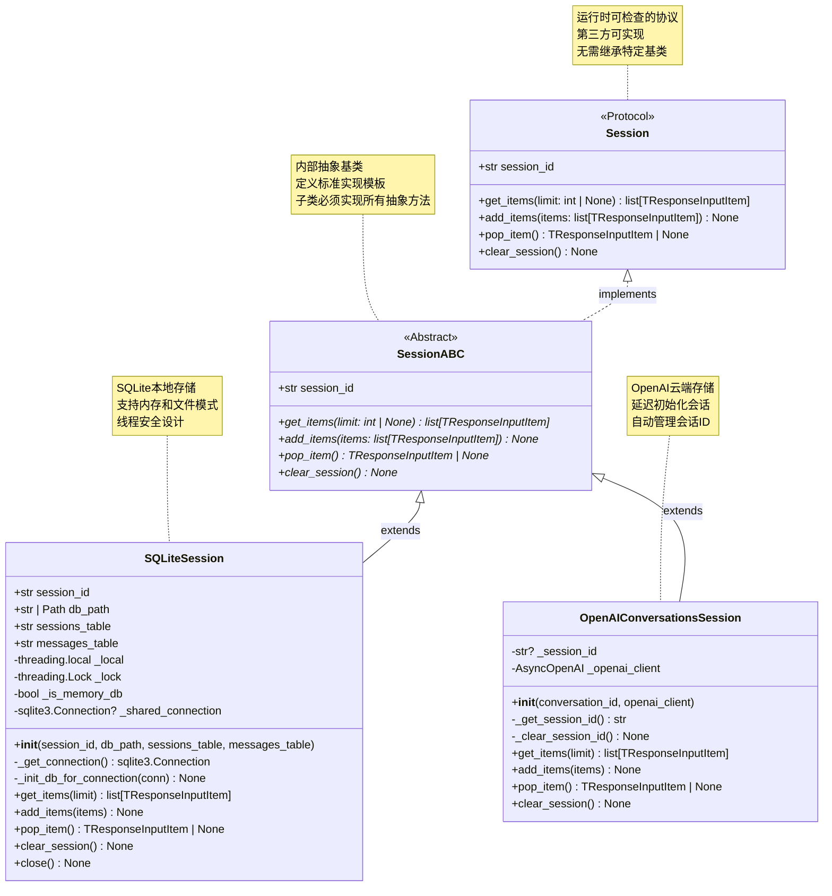

**类图说明：**

### Session 协议特性

1. **协议定义**：使用 `@runtime_checkable` 装饰器，支持运行时的鸭子类型检查
2. **灵活扩展**：第三方可实现协议而无需继承 `SessionABC`
3. **类型检查**：通过 `Protocol` 提供静态类型检查
4. **最小接口**：只定义必需的4个方法和1个属性

### SessionABC 抽象基类

1. **模板方法**：为内部实现提供标准模板
2. **强制实现**：子类必须实现所有抽象方法
3. **内部使用**：主要用于 SDK 内部的实现
4. **文档化**：提供详细的文档字符串

### SQLiteSession 实现特性

1. **双模式支持**：内存数据库（临时）和文件数据库（持久化）
2. **线程安全**：内存模式使用共享连接+锁，文件模式使用线程本地连接
3. **资源管理**：显式的 `close()` 方法管理数据库连接
4. **性能优化**：WAL 模式、批量插入、索引优化

### OpenAIConversationsSession 实现特性

1. **云端存储**：数据存储在 OpenAI 服务器
2. **延迟初始化**：会话 ID 在首次使用时创建
3. **无本地资源**：不需要本地数据库或文件系统
4. **跨设备同步**：同一会话 ID 可在多个设备访问

## 3. 历史数据结构

### 3.1 TResponseInputItem 联合类型

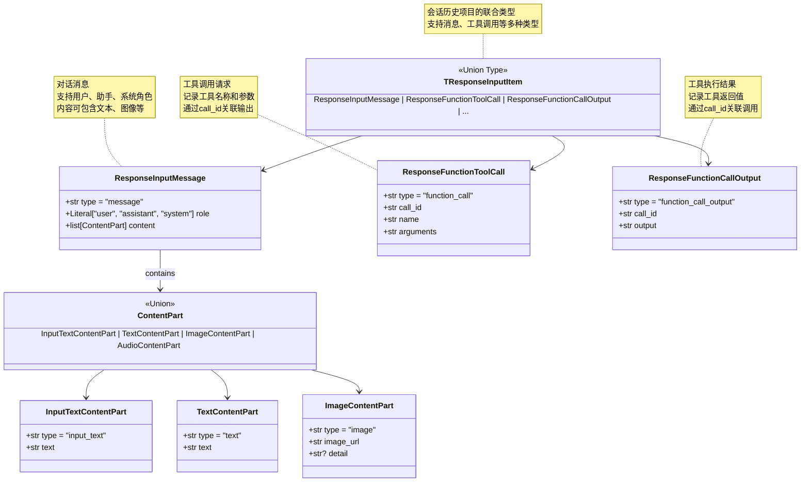

**数据结构说明：**

### ResponseInputMessage 结构

**字段详解：**

- `type`: 固定值 `"message"`，标识这是一条消息
- `role`: 消息角色，可选值：
  - `"user"`: 用户消息
  - `"assistant"`: 助手消息
  - `"system"`: 系统消息（指令）
- `content`: 内容列表，支持多种内容类型

**JSON 示例：**

```json
{
    "type": "message",
    "role": "user",
    "content": [
        {
            "type": "input_text",
            "text": "请帮我总结这篇文章的要点。"
        }
    ]
}
```

### ContentPart 内容类型

**InputTextContentPart（用户输入文本）：**

```json
{
    "type": "input_text",
    "text": "这是用户输入的文本内容"
}
```

**TextContentPart（助手输出文本）：**

```json
{
    "type": "text",
    "text": "这是助手回复的文本内容"
}
```

**ImageContentPart（图像内容）：**

```json
{
    "type": "image",
    "image_url": "https://example.com/image.jpg",
    "detail": "high"  // 可选：high, low, auto
}
```

**AudioContentPart（音频内容）：**

```json
{
    "type": "audio",
    "audio_url": "https://example.com/audio.mp3",
    "transcript": "音频的转录文本"  // 可选
}
```

### ResponseFunctionToolCall 结构

**字段详解：**

- `type`: 固定值 `"function_call"`，标识这是一个工具调用
- `call_id`: 唯一的调用标识符，用于关联工具输出
- `name`: 工具函数名称
- `arguments`: JSON 字符串格式的参数

**JSON 示例：**

```json
{
    "type": "function_call",
    "call_id": "call_abc123xyz",
    "name": "get_weather",
    "arguments": "{\"location\": \"Beijing\", \"unit\": \"celsius\"}"
}
```

### ResponseFunctionCallOutput 结构

**字段详解：**

- `type`: 固定值 `"function_call_output"`，标识这是工具输出
- `call_id`: 对应的工具调用 ID，必须与 `ResponseFunctionToolCall` 的 `call_id` 匹配
- `output`: JSON 字符串格式的输出结果

**JSON 示例：**

```json
{
    "type": "function_call_output",
    "call_id": "call_abc123xyz",
    "output": "{\"temperature\": 22, \"condition\": \"cloudy\", \"humidity\": 65}"
}
```

## 4. SQLite 数据库结构

### 4.1 数据库表 UML

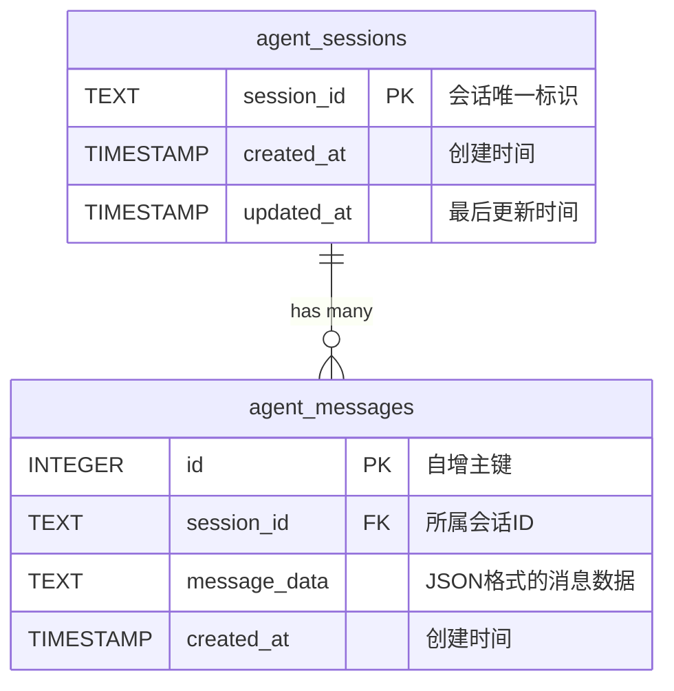

**表结构说明：**

### agent_sessions 表

**表定义：**

```sql
CREATE TABLE agent_sessions (
    session_id TEXT PRIMARY KEY,
    created_at TIMESTAMP DEFAULT CURRENT_TIMESTAMP,
    updated_at TIMESTAMP DEFAULT CURRENT_TIMESTAMP
);
```

**字段详解：**

| 字段名 | 类型 | 约束 | 说明 |
|--------|------|------|------|
| `session_id` | TEXT | PRIMARY KEY | 会话唯一标识符，由应用层生成 |
| `created_at` | TIMESTAMP | DEFAULT CURRENT_TIMESTAMP | 会话创建时间，自动设置 |
| `updated_at` | TIMESTAMP | DEFAULT CURRENT_TIMESTAMP | 最后更新时间，每次添加消息时更新 |

**数据示例：**

```
session_id                  | created_at           | updated_at
----------------------------|----------------------|----------------------
user_123_session            | 2024-10-04 10:00:00 | 2024-10-04 10:15:30
temp_session_001            | 2024-10-04 10:05:00 | 2024-10-04 10:05:00
customer_support_abc123     | 2024-10-04 09:30:00 | 2024-10-04 10:20:00
```

### agent_messages 表

**表定义：**

```sql
CREATE TABLE agent_messages (
    id INTEGER PRIMARY KEY AUTOINCREMENT,
    session_id TEXT NOT NULL,
    message_data TEXT NOT NULL,
    created_at TIMESTAMP DEFAULT CURRENT_TIMESTAMP,
    FOREIGN KEY (session_id) REFERENCES agent_sessions (session_id)
        ON DELETE CASCADE
);

CREATE INDEX idx_agent_messages_session_id
    ON agent_messages (session_id, created_at);
```

**字段详解：**

| 字段名 | 类型 | 约束 | 说明 |
|--------|------|------|------|
| `id` | INTEGER | PRIMARY KEY AUTOINCREMENT | 消息唯一ID，自增 |
| `session_id` | TEXT | NOT NULL, FOREIGN KEY | 所属会话ID，级联删除 |
| `message_data` | TEXT | NOT NULL | JSON 格式的消息完整数据 |
| `created_at` | TIMESTAMP | DEFAULT CURRENT_TIMESTAMP | 消息创建时间 |

**索引设计：**

- **复合索引** `(session_id, created_at)`：加速按会话查询和时间排序

**数据示例：**

```
id | session_id           | message_data                                      | created_at
---|----------------------|--------------------------------------------------|----------------------
1  | user_123_session     | {"type":"message","role":"user",...}             | 2024-10-04 10:00:00
2  | user_123_session     | {"type":"message","role":"assistant",...}        | 2024-10-04 10:00:05
3  | user_123_session     | {"type":"function_call","call_id":"call_1",...}  | 2024-10-04 10:00:10
4  | user_123_session     | {"type":"function_call_output","call_id":...}    | 2024-10-04 10:00:15
```

**message_data JSON 示例：**

```json
{
    "type": "message",
    "role": "user",
    "content": [
        {
            "type": "input_text",
            "text": "今天天气怎么样？"
        }
    ]
}
```

### 4.2 数据库操作数据流

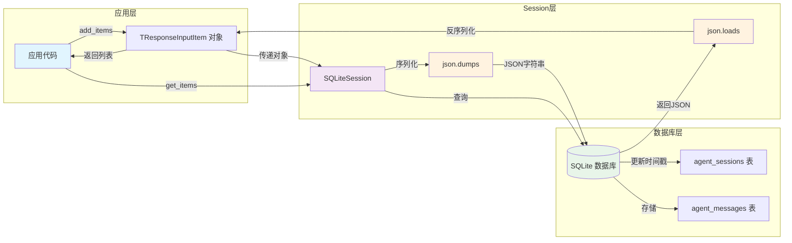

## 5. 内部数据结构

### 5.1 SQLiteSession 内部属性

```python
class SQLiteSession(SessionABC):
    """SQLiteSession 完整的内部结构"""
    
    # === 公共属性 ===
    session_id: str              # 会话唯一标识符
    db_path: str | Path          # 数据库路径（":memory:" 或文件路径）
    sessions_table: str          # 会话表名（默认 "agent_sessions"）
    messages_table: str          # 消息表名（默认 "agent_messages"）
    
    # === 私有属性 ===
    _local: threading.local      # 线程本地存储（文件模式）
    _lock: threading.Lock        # 全局锁（内存模式）
    _is_memory_db: bool         # 是否为内存数据库
    _shared_connection: sqlite3.Connection | None  # 共享连接（内存模式）
```

**属性说明：**

**session_id**：

- 类型：`str`
- 用途：唯一标识一个会话
- 命名建议：`"user_{user_id}_session"` 或 `"session_{uuid}"`
- 示例：`"user_123_session"`, `"temp_session_001"`

**db_path**：

- 类型：`str | Path`
- 用途：指定 SQLite 数据库位置
- 特殊值：`":memory:"` 表示内存数据库
- 文件路径示例：`"./data/conversations.db"`, `"/var/app/sessions.db"`

**sessions_table / messages_table**：

- 类型：`str`
- 用途：自定义表名，避免与现有表冲突
- 默认值：`"agent_sessions"`, `"agent_messages"`
- 使用场景：共享数据库时区分不同应用的数据

**_local**：

- 类型：`threading.local`
- 用途：为每个线程维护独立的数据库连接（文件模式）
- 属性：`_local.connection` 存储当前线程的连接对象
- 线程安全：每个线程有独立连接，避免并发冲突

**_lock**：

- 类型：`threading.Lock`
- 用途：保护共享连接的并发访问（内存模式）
- 使用场景：内存数据库使用单一共享连接，需要锁保护

**_is_memory_db**：

- 类型：`bool`
- 用途：标识当前使用的数据库模式
- `True`：内存模式，使用共享连接+锁
- `False`：文件模式，使用线程本地连接

**_shared_connection**：

- 类型：`sqlite3.Connection | None`
- 用途：内存数据库的共享连接对象
- 生命周期：在 `__init__` 中创建，在 `close()` 中关闭
- 线程安全：通过 `_lock` 保护并发访问

### 5.2 OpenAIConversationsSession 内部属性

```python
class OpenAIConversationsSession(SessionABC):
    """OpenAIConversationsSession 完整的内部结构"""
    
    # === 私有属性 ===
    _session_id: str | None           # 会话ID（延迟初始化）
    _openai_client: AsyncOpenAI       # OpenAI 异步客户端
```

**属性说明：**

**_session_id**：

- 类型：`str | None`
- 初始值：`None`（延迟初始化）
- 初始化时机：首次调用 `_get_session_id()` 时
- 值来源：调用 OpenAI API 创建会话获得
- 格式示例：`"conv_abc123xyz456"`

**_openai_client**：

- 类型：`AsyncOpenAI`
- 用途：与 OpenAI API 交互的客户端
- 初始化：构造函数中传入或使用默认客户端
- API 调用：
  - `conversations.create()`: 创建新会话
  - `conversations.items.list()`: 列出历史
  - `conversations.items.create()`: 添加项目
  - `conversations.items.delete()`: 删除项目
  - `conversations.delete()`: 删除会话

## 6. 数据序列化与反序列化

### 6.1 序列化流程

```python
# 应用层数据结构
user_message = {
    "type": "message",
    "role": "user",
    "content": [
        {
            "type": "input_text",
            "text": "Hello, world!"
        }
    ]
}

# 序列化为 JSON 字符串
import json
json_string = json.dumps(user_message)
# 结果: '{"type":"message","role":"user","content":[{"type":"input_text","text":"Hello, world!"}]}'

# 存储到数据库
conn.execute(
    "INSERT INTO agent_messages (session_id, message_data) VALUES (?, ?)",
    (session_id, json_string)
)
```

**序列化特点：**

1. **完整保留**：保留所有字段和嵌套结构
2. **类型安全**：通过 JSON 确保数据类型一致性
3. **可读性**：JSON 格式易于调试和查看
4. **兼容性**：跨语言和跨平台兼容

### 6.2 反序列化流程

```python
# 从数据库查询
cursor = conn.execute(
    "SELECT message_data FROM agent_messages WHERE session_id = ? ORDER BY created_at",
    (session_id,)
)

# 反序列化每一行
items = []
for (message_data,) in cursor.fetchall():
    try:
        item = json.loads(message_data)
        items.append(item)
    except json.JSONDecodeError:
        # 跳过损坏的数据
        continue

# items 现在是 list[TResponseInputItem]
```

**反序列化特点：**

1. **错误容忍**：单条数据损坏不影响其他数据
2. **类型恢复**：JSON 反序列化自动恢复 Python 数据类型
3. **顺序保证**：通过 `ORDER BY created_at` 保证时间顺序
4. **性能优化**：批量查询+批量反序列化

### 6.3 数据完整性保证

**写入完整性：**

```python
# 使用事务确保原子性
with conn:
    conn.execute("INSERT INTO agent_sessions ...")
    conn.executemany("INSERT INTO agent_messages ...", message_data)
    conn.execute("UPDATE agent_sessions SET updated_at = ...")
# 事务自动提交或回滚
```

**读取完整性：**

```python
# 使用外键约束确保数据一致性
FOREIGN KEY (session_id) REFERENCES agent_sessions (session_id)
    ON DELETE CASCADE

# 查询时自动过滤不存在的会话
SELECT m.* FROM agent_messages m
JOIN agent_sessions s ON m.session_id = s.session_id
WHERE s.session_id = ?
```

## 7. 数据结构最佳实践

### 7.1 自定义会话实现

```python
from agents.memory import Session, TResponseInputItem
from typing import List
import redis.asyncio as aioredis
import json

class RedisSession(Session):
    """基于 Redis 的会话实现示例"""
    
    def __init__(self, session_id: str, redis_url: str = "redis://localhost"):
        self.session_id = session_id
        self._redis_url = redis_url
        self._redis: aioredis.Redis | None = None
        self._history_key = f"agent:session:{session_id}:history"
    
    async def _get_redis(self) -> aioredis.Redis:
        """获取 Redis 连接"""
        if self._redis is None:
            self._redis = await aioredis.from_url(self._redis_url)
        return self._redis
    
    async def get_items(self, limit: int | None = None) -> List[TResponseInputItem]:
        """从 Redis 列表中获取历史"""
        redis = await self._get_redis()
        
        if limit is None:
            # 获取所有历史
            items_json = await redis.lrange(self._history_key, 0, -1)
        else:
            # 获取最新的 N 条
            items_json = await redis.lrange(self._history_key, -limit, -1)
        
        items = []
        for item_json in items_json:
            try:
                item = json.loads(item_json)
                items.append(item)
            except json.JSONDecodeError:
                continue
        
        return items
    
    async def add_items(self, items: List[TResponseInputItem]) -> None:
        """添加项目到 Redis 列表"""
        if not items:
            return
        
        redis = await self._get_redis()
        
        # 使用 pipeline 批量添加
        pipe = redis.pipeline()
        for item in items:
            item_json = json.dumps(item)
            pipe.rpush(self._history_key, item_json)
        
        await pipe.execute()
    
    async def pop_item(self) -> TResponseInputItem | None:
        """从 Redis 列表删除最新项"""
        redis = await self._get_redis()
        
        item_json = await redis.rpop(self._history_key)
        if item_json is None:
            return None
        
        try:
            return json.loads(item_json)
        except json.JSONDecodeError:
            return None
    
    async def clear_session(self) -> None:
        """删除 Redis 键"""
        redis = await self._get_redis()
        await redis.delete(self._history_key)
    
    async def close(self):
        """关闭 Redis 连接"""
        if self._redis:
            await self._redis.close()
```

### 7.2 历史数据结构转换

```python
from agents.memory import Session
from typing import List, Dict, Any

class HistoryConverter:
    """历史数据结构转换工具"""
    
    @staticmethod
    def items_to_messages(items: List[TResponseInputItem]) -> List[Dict[str, Any]]:
        """将历史项转换为消息列表（用于展示）"""
        messages = []
        
        for item in items:
            if item["type"] == "message":
                # 提取消息内容
                role = item["role"]
                text = ""
                for content_part in item["content"]:
                    if content_part["type"] in ["text", "input_text"]:
                        text += content_part["text"]
                
                messages.append({
                    "role": role,
                    "content": text
                })
            
            elif item["type"] == "function_call":
                # 工具调用显示
                messages.append({
                    "role": "system",
                    "content": f"[工具调用: {item['name']}]"
                })
            
            elif item["type"] == "function_call_output":
                # 工具输出显示
                messages.append({
                    "role": "system",
                    "content": f"[工具结果: {item['output'][:100]}...]"
                })
        
        return messages
    
    @staticmethod
    async def export_session_to_json(session: Session, output_file: str):
        """导出会话历史到 JSON 文件"""
        items = await session.get_items()
        
        export_data = {
            "session_id": session.session_id,
            "item_count": len(items),
            "items": items
        }
        
        with open(output_file, "w", encoding="utf-8") as f:
            json.dump(export_data, f, indent=2, ensure_ascii=False)
    
    @staticmethod
    async def import_session_from_json(session: Session, input_file: str):
        """从 JSON 文件导入会话历史"""
        with open(input_file, "r", encoding="utf-8") as f:
            data = json.load(f)
        
        items = data["items"]
        await session.clear_session()
        await session.add_items(items)
```

### 7.3 历史数据压缩

```python
from agents.memory import Session
from typing import List

class HistoryCompressor:
    """历史数据压缩工具"""
    
    @staticmethod
    async def compress_history(
        session: Session,
        target_count: int = 20,
        preserve_system: bool = True
    ):
        """压缩历史，保留最重要的项目"""
        items = await session.get_items()
        
        if len(items) <= target_count:
            return  # 无需压缩
        
        # 1. 分离系统消息
        system_messages = []
        other_items = []
        
        for item in items:
            if preserve_system and item.get("role") == "system":
                system_messages.append(item)
            else:
                other_items.append(item)
        
        # 2. 保留最新的项目
        keep_count = target_count - len(system_messages)
        recent_items = other_items[-keep_count:] if keep_count > 0 else []
        
        # 3. 重建历史
        compressed_items = system_messages + recent_items
        
        await session.clear_session()
        await session.add_items(compressed_items)
        
        print(f"历史已压缩: {len(items)} -> {len(compressed_items)}")
```

Memory 模块通过清晰的数据结构设计和灵活的存储方案，为 OpenAI Agents 提供了强大的会话历史管理能力，支持从本地到云端的多种应用场景。

---

## 时序图

## 1. 时序图总览

Memory 模块的时序图展示了会话历史管理的完整生命周期，从初始化、数据读写到资源清理的各个阶段，以及与 Agent 执行引擎的交互流程。

### 核心时序场景

| 场景类别 | 时序图 | 关键流程 |
|---------|--------|---------|
| **会话初始化** | SQLiteSession 初始化 | 数据库连接、表结构创建 |
| **历史加载** | get_items 查询流程 | SQL 查询、JSON 反序列化、数据返回 |
| **历史保存** | add_items 写入流程 | JSON 序列化、事务提交、时间戳更新 |
| **历史删除** | pop_item 删除流程 | 原子删除、数据返回 |
| **会话清空** | clear_session 清理流程 | 级联删除、资源释放 |
| **与 Agent 集成** | Runner + Session 交互 | 历史加载、执行、结果保存 |
| **云端会话** | OpenAI Conversations 流程 | API 调用、云端存储 |

## 2. SQLiteSession 初始化时序图

### 场景：创建持久化 SQLite 会话

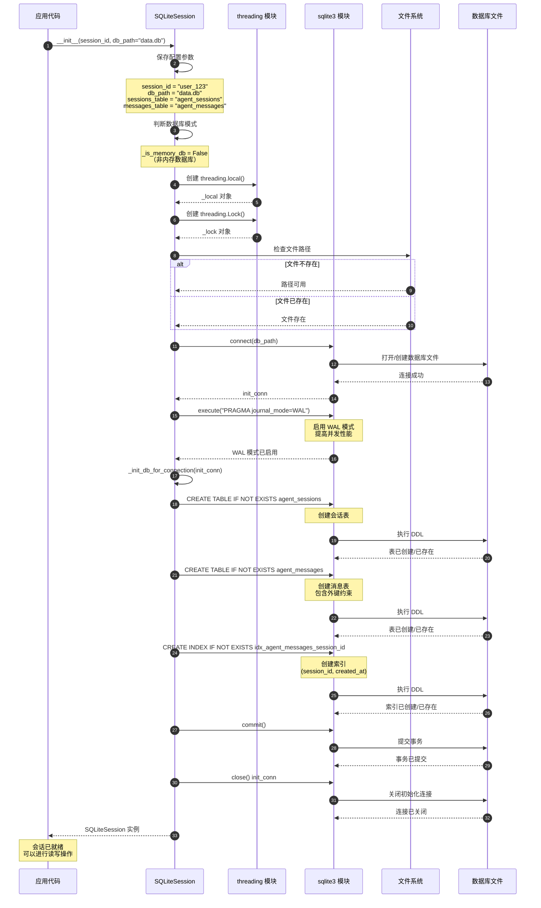

**时序图说明：**

### 初始化阶段划分

1. **参数配置阶段（步骤 1-5）**：
   - 接收初始化参数
   - 判断数据库模式（内存/文件）
   - 创建线程安全机制（锁和本地存储）

2. **数据库连接阶段（步骤 6-11）**：
   - 检查文件路径可用性
   - 打开或创建数据库文件
   - 启用 WAL 模式提升并发性能

3. **表结构初始化阶段（步骤 12-20）**：
   - 创建会话元数据表
   - 创建消息数据表（带外键）
   - 创建查询索引
   - 提交数据库结构

4. **清理阶段（步骤 21-23）**：
   - 关闭初始化连接
   - 返回可用的会话实例

### 关键设计点

1. **延迟连接**：初始化时不保留连接，实际操作时创建线程本地连接
2. **幂等性**：使用 `IF NOT EXISTS` 确保重复初始化不会出错
3. **WAL 模式**：提高并发读写性能，允许读写同时进行
4. **索引优化**：复合索引 `(session_id, created_at)` 加速查询

### 内存模式差异

**内存模式初始化（db_path=":memory:"）：**

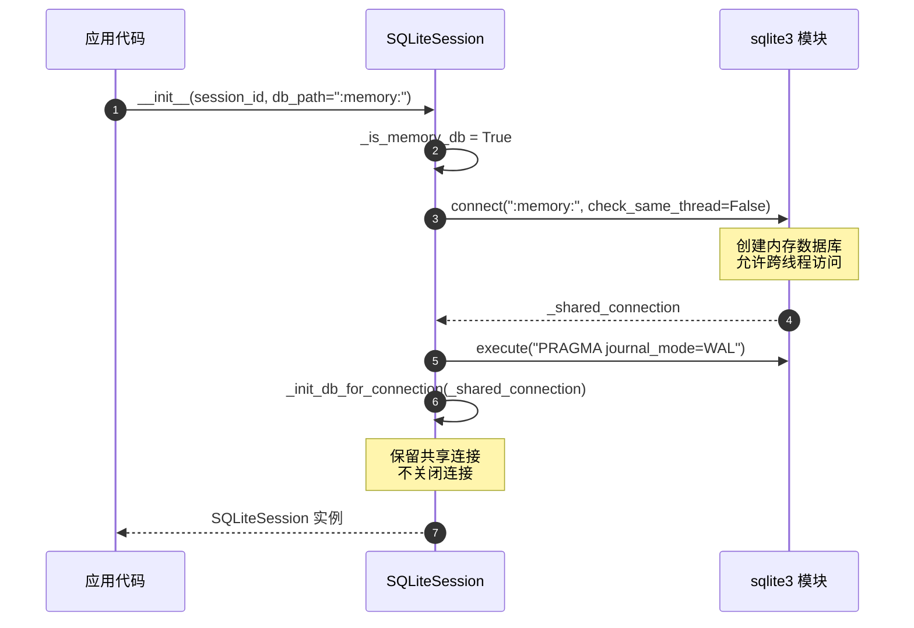

**内存模式关键差异：**

- 使用共享连接（`_shared_connection`）而非线程本地连接
- 连接在初始化时创建并保留，直到调用 `close()`
- 需要使用全局锁（`_lock`）保护并发访问

## 3. get_items - 历史查询时序图

### 场景：加载会话历史用于 Agent 执行

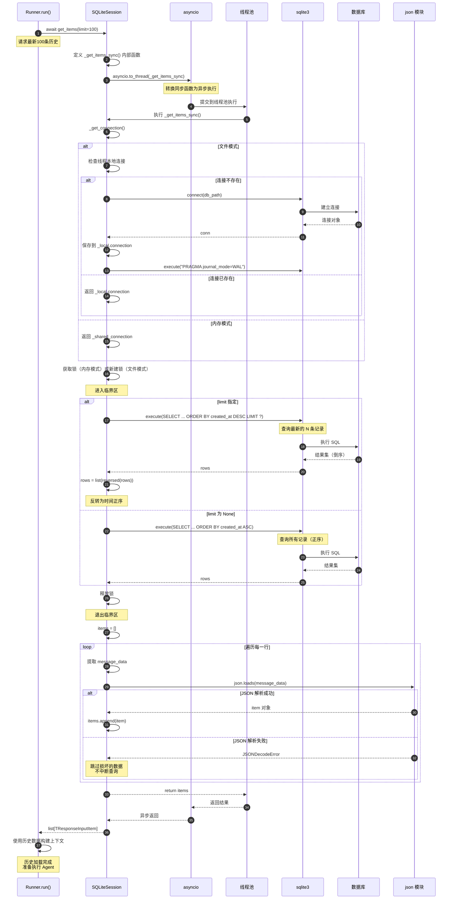

**时序图说明：**

### 查询流程阶段

1. **异步转换阶段（步骤 1-5）**：
   - Runner 调用异步 `get_items()`
   - 使用 `asyncio.to_thread()` 包装同步操作
   - 提交到线程池执行，避免阻塞事件循环

2. **连接获取阶段（步骤 6-14）**：
   - 获取适当的数据库连接
   - 文件模式：获取或创建线程本地连接
   - 内存模式：使用共享连接

3. **SQL 查询阶段（步骤 15-27）**：
   - 根据 `limit` 参数选择查询策略
   - 执行 SQL 查询
   - 处理查询结果的顺序

4. **数据反序列化阶段（步骤 28-38）**：
   - 遍历查询结果
   - JSON 反序列化每一行
   - 错误容忍：跳过损坏的数据

5. **结果返回阶段（步骤 39-42）**：
   - 从线程池返回结果
   - 通过 asyncio 转换为异步返回
   - Runner 接收历史数据

### 查询性能优化

**索引利用：**

```sql
-- 索引定义
CREATE INDEX idx_agent_messages_session_id
    ON agent_messages (session_id, created_at);

-- 查询计划（limit 指定时）
EXPLAIN QUERY PLAN
SELECT message_data FROM agent_messages
WHERE session_id = ?
ORDER BY created_at DESC
LIMIT 100;

-- 结果：使用索引扫描
SEARCH agent_messages USING INDEX idx_agent_messages_session_id (session_id=?)
```

**批量反序列化：**

- 一次性获取所有行，减少数据库交互
- 在内存中批量反序列化，提升效率
- 错误跳过机制保证健壮性

## 4. add_items - 历史保存时序图

### 场景：执行完成后保存对话历史

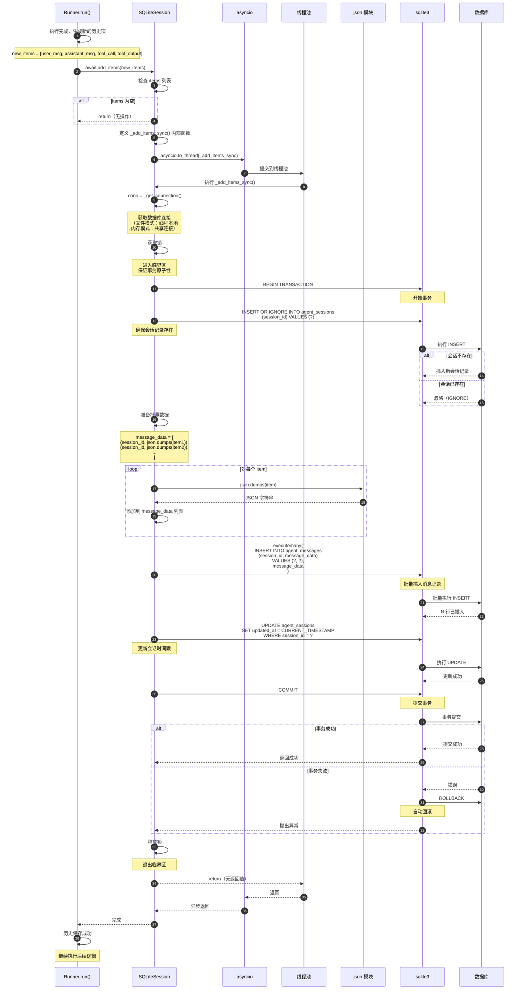

**时序图说明：**

### 写入流程阶段

1. **预处理阶段（步骤 1-7）**：
   - Runner 准备要保存的历史项
   - 检查列表是否为空（快速路径）
   - 异步转换并提交到线程池

2. **连接与锁获取阶段（步骤 8-10）**：
   - 获取数据库连接
   - 获取锁保证事务原子性
   - 开始数据库事务

3. **会话确保阶段（步骤 11-16）**：
   - 使用 `INSERT OR IGNORE` 确保会话存在
   - 避免外键约束错误

4. **数据序列化阶段（步骤 17-22）**：
   - 批量序列化所有历史项为 JSON
   - 准备批量插入的数据

5. **批量插入阶段（步骤 23-26）**：
   - 使用 `executemany()` 批量插入
   - 提升插入性能

6. **时间戳更新阶段（步骤 27-29）**：
   - 更新会话的最后更新时间
   - 用于会话管理和查询

7. **事务提交阶段（步骤 30-39）**：
   - 提交事务
   - 失败时自动回滚
   - 释放锁并返回结果

### 事务原子性保证

**成功场景：**

```
BEGIN TRANSACTION
  → INSERT OR IGNORE sessions
  → INSERT messages (批量)
  → UPDATE sessions timestamp
COMMIT
  → 所有操作生效
```

**失败场景：**

```
BEGIN TRANSACTION
  → INSERT OR IGNORE sessions (成功)
  → INSERT messages (失败，如磁盘满)
ROLLBACK
  → 所有操作回滚，数据保持一致
```

### 批量插入性能

**单条插入（低效）：**

```python
for item in items:
    conn.execute("INSERT INTO messages VALUES (?, ?)",
                 (session_id, json.dumps(item)))
    conn.commit()  # 每次都提交
# 时间复杂度：O(n * (序列化 + SQL + 磁盘I/O + 提交))
```

**批量插入（高效）：**

```python
message_data = [(session_id, json.dumps(item)) for item in items]
conn.executemany("INSERT INTO messages VALUES (?, ?)", message_data)
conn.commit()  # 一次提交
# 时间复杂度：O(n * 序列化 + SQL批处理 + 一次磁盘I/O + 一次提交)
```

## 5. Runner 与 Session 集成时序图

### 场景：完整的对话执行流程（带历史管理）

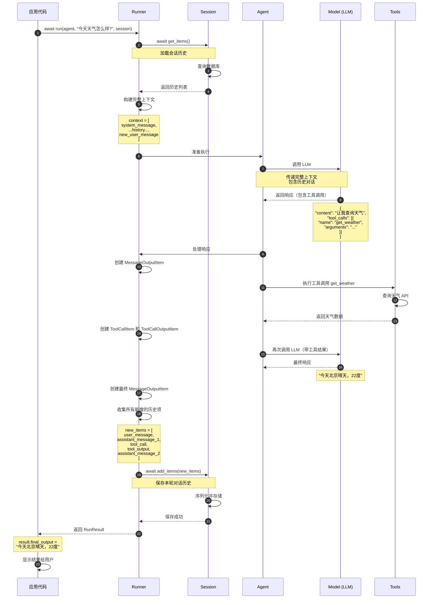

**时序图说明：**

### 完整执行流程

1. **历史加载阶段（步骤 1-4）**：
   - Runner 启动时从 Session 加载历史
   - 历史用于构建 LLM 的上下文
   - 确保对话连贯性

2. **上下文构建阶段（步骤 5）**：
   - 系统消息（Agent 指令）
   - 历史对话记录
   - 新的用户消息
   - 按时间顺序组织

3. **LLM 交互阶段（步骤 6-10）**：
   - 调用 LLM 生成响应
   - LLM 基于完整历史生成回复
   - 可能包含工具调用请求

4. **工具执行阶段（步骤 11-15）**：
   - 执行工具调用
   - 获取工具结果
   - 创建工具相关的历史项

5. **最终响应阶段（步骤 16-18）**：
   - 带工具结果再次调用 LLM
   - 生成最终用户可见的回复
   - 创建最终响应历史项

6. **历史保存阶段（步骤 19-22）**：
   - 收集本轮所有新增历史
   - 批量保存到 Session
   - 确保数据持久化

7. **结果返回阶段（步骤 23-25）**：
   - 返回执行结果给应用
   - 应用展示给用户
   - 准备下一轮对话

### 历史在对话中的作用

**第一轮对话（无历史）：**

```
Context = [
  {role: "system", content: "你是一个天气助手"},
  {role: "user", content: "今天天气怎么样?"}
]
```

**第二轮对话（有历史）：**

```
Context = [
  {role: "system", content: "你是一个天气助手"},
  {role: "user", content: "今天天气怎么样?"},
  {role: "assistant", content: "今天北京晴天，22度"},
  {role: "user", content: "那明天呢?"}  // 新消息
]

LLM 理解 "明天" 是基于上一轮的 "今天北京" 的上下文
```

## 6. OpenAI Conversations 云端会话时序图

### 场景：使用 OpenAI 云端存储的会话管理

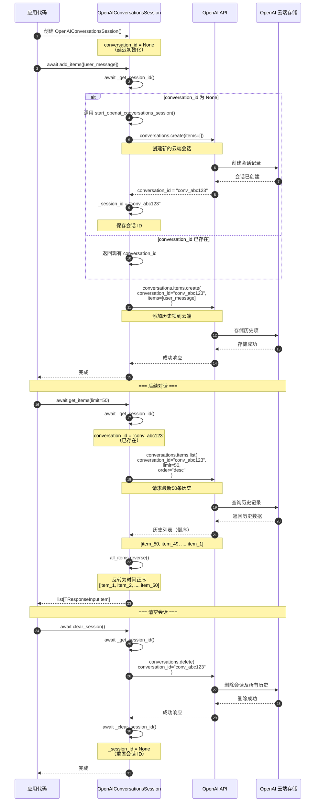

**时序图说明：**

### 云端会话特点

1. **延迟初始化（步骤 1-12）**：
   - 创建实例时不立即创建云端会话
   - 首次使用时才调用 API 创建会话
   - 节省不必要的 API 调用

2. **云端存储（步骤 13-18）**：
   - 所有数据存储在 OpenAI 服务器
   - 无本地数据库或文件
   - 自动处理数据持久化和备份

3. **数据查询（步骤 20-29）**：
   - 通过 API 查询历史数据
   - API 返回倒序数据，需要客户端反转
   - 支持分页和限制查询

4. **会话清理（步骤 31-40）**：
   - 删除云端会话及所有关联数据
   - 重置本地会话 ID
   - 下次使用时会创建新会话

### 云端 vs 本地存储对比

| 特性 | SQLiteSession | OpenAIConversationsSession |
|------|---------------|---------------------------|
| **数据位置** | 本地文件/内存 | OpenAI 云端 |
| **持久化** | 文件模式持久化 | 自动持久化 |
| **网络依赖** | 无 | 需要网络连接 |
| **跨设备** | 不支持 | 支持（同一 conversation_id） |
| **性能** | 本地访问快 | 受网络延迟影响 |
| **存储限制** | 磁盘空间 | OpenAI 配额 |
| **隐私** | 数据完全本地 | 数据存储在 OpenAI |

## 7. 并发场景时序图

### 场景：多线程并发访问 SQLite 会话

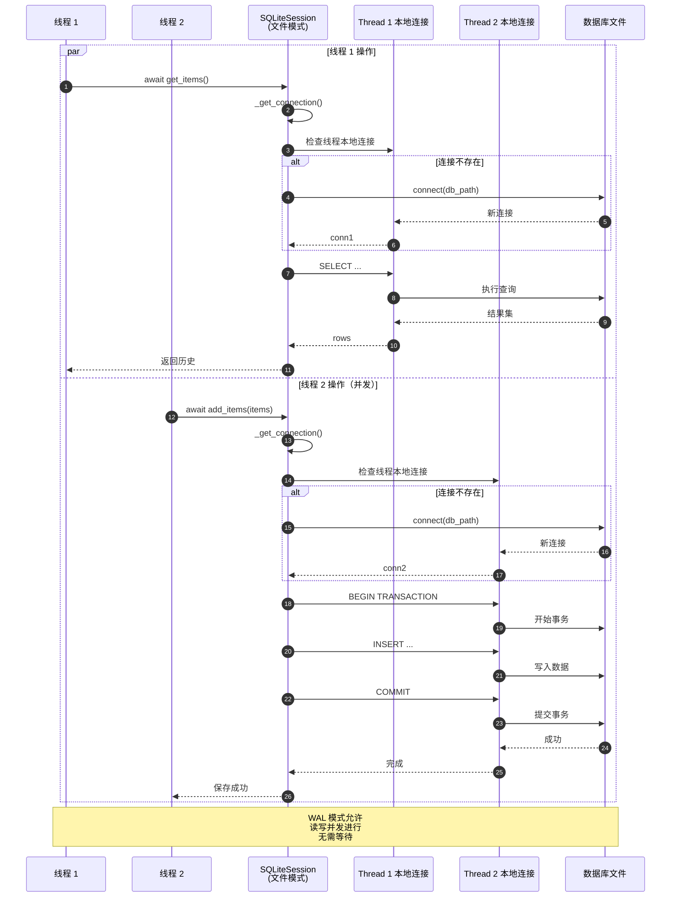

**并发安全机制：**

1. **线程本地连接**：每个线程有独立的数据库连接，避免连接竞争
2. **WAL 模式**：支持读写并发，读不阻塞写，写不阻塞读
3. **事务隔离**：每个线程的事务独立，互不干扰
4. **自动重试**：SQLite 在锁冲突时自动重试

Memory 模块通过精心设计的时序流程和并发机制，为 OpenAI Agents 提供了高效、可靠的会话历史管理能力，支持从单线程到多线程、从本地到云端的各种应用场景。

---
