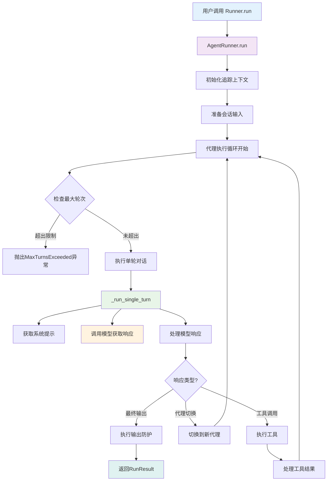

## 4.1 执行模块架构概览

核心执行模块是OpenAI Agents SDK的心脏，负责代理的实际运行和执行流程控制。主要包含以下关键组件：

- **`run.py`**: 主运行器接口和执行逻辑
- **`_run_impl.py`**: 底层执行实现细节
- **`agent.py`**: 代理定义和配置
- **`run_context.py`**: 运行上下文管理

## 4.2 执行流程架构图



## 4.3 RunImpl类 - 执行实现核心

### 4.3.1 RunImpl类架构

```python
# 位于 src/agents/_run_impl.py
class RunImpl:
    """
    代理执行的底层实现类
    
    包含所有执行逻辑的静态方法，负责：
    - 模型响应处理
    - 工具执行和副作用处理
    - 防护措施执行
    - 流式输出处理
    """
    
    @staticmethod
    async def process_model_response(
        agent: Agent[Any],
        all_tools: list[Tool],
        response: ModelResponse,
        output_schema: AgentOutputSchemaBase | None,
        handoffs: list[Handoff],
    ) -> ProcessedModelResponse:
        """处理模型响应，提取工具调用、代理切换、最终输出"""
        
    @staticmethod  
    async def execute_tools_and_side_effects(
        agent: Agent[TContext],
        original_input: str | list[TResponseInputItem],
        pre_step_items: list[RunItem], 
        new_response: ModelResponse,
        processed_response: ProcessedModelResponse,
        output_schema: AgentOutputSchemaBase | None,
        hooks: RunHooks[TContext],
        context_wrapper: RunContextWrapper[TContext],
        run_config: RunConfig,
    ) -> SingleStepResult:
        """执行工具调用和处理副作用"""
```

### 4.3.2 模型响应处理详解

**`process_model_response()`** 是处理模型输出的关键方法：

```python
# 位于 src/agents/_run_impl.py
@staticmethod
async def process_model_response(
    agent: Agent[Any],
    all_tools: list[Tool],
    response: ModelResponse,
    output_schema: AgentOutputSchemaBase | None,
    handoffs: list[Handoff],
) -> ProcessedModelResponse:
    """
    处理模型响应，识别和分类不同类型的输出项
    
    处理流程:
    1. 遍历模型响应中的所有输出项
    2. 识别消息、工具调用、代理切换
    3. 验证输出格式和合法性
    4. 返回处理后的响应对象
    """
    
    new_items: list[RunItem] = []  # 新生成的运行项目
    tools_used: list[str] = []     # 使用的工具名称列表
    handoff_call_item: HandoffCallItem | None = None  # 代理切换调用
    final_output: Any = None       # 最终输出
    
    # 遍历模型响应中的所有输出项
    for output_item in response.output:
        
        # 处理消息输出项
        if isinstance(output_item, ResponseOutputMessage):
            message_item = MessageOutputItem(raw_item=output_item, agent=agent)
            new_items.append(message_item)
            
            # 检查是否为结构化输出（最终输出）
            if output_schema and _is_structured_output(output_item, output_schema):
                try:
                    final_output = output_schema.parse(output_item)
                except Exception as e:
                    logger.error(f"Failed to parse structured output: {e}")
                    raise ModelBehaviorError(f"Invalid structured output format: {e}")
        
        # 处理工具调用输出项        
        elif isinstance(output_item, (ResponseOutputFunctionCall, ResponseOutputMCPCall)):
            tool_call_item = ToolCallItem(raw_item=output_item, agent=agent)
            new_items.append(tool_call_item)
            
            # 记录使用的工具
            tool_name = _extract_tool_name(output_item)
            if tool_name:
                tools_used.append(tool_name)
        
        # 处理代理切换调用
        elif isinstance(output_item, ResponseOutputHandoffCall):
            if handoff_call_item is not None:
                raise ModelBehaviorError("Multiple handoff calls in single response")
                
            handoff_call_item = HandoffCallItem(raw_item=output_item, agent=agent)
            new_items.append(handoff_call_item)
            
        # 处理推理内容
        elif isinstance(output_item, ResponseReasoningItem):
            reasoning_item = ReasoningItem(raw_item=output_item, agent=agent)
            new_items.append(reasoning_item)
        
        else:
            # 未知的输出项类型
            logger.warning(f"Unknown output item type: {type(output_item)}")
    
    # 如果没有结构化输出但有输出模式，检查是否有文本输出
    if not final_output and output_schema is None:
        # 查找最后的文本消息作为最终输出
        for item in reversed(new_items):
            if isinstance(item, MessageOutputItem):
                text_content = ItemHelpers.extract_last_text(item.raw_item)
                if text_content:
                    final_output = text_content
                    break
    
    return ProcessedModelResponse(
        new_items=new_items,
        tools_used=tools_used,
        handoff_call_item=handoff_call_item,
        final_output=final_output,
    )
```

### 4.3.3 工具执行和副作用处理

**`execute_tools_and_side_effects()`** 负责执行工具调用：

```python
# 位于 src/agents/_run_impl.py  
@staticmethod
async def execute_tools_and_side_effects(
    agent: Agent[TContext],
    original_input: str | list[TResponseInputItem],
    pre_step_items: list[RunItem],
    new_response: ModelResponse, 
    processed_response: ProcessedModelResponse,
    output_schema: AgentOutputSchemaBase | None,
    hooks: RunHooks[TContext],
    context_wrapper: RunContextWrapper[TContext],
    run_config: RunConfig,
) -> SingleStepResult:
    """
    执行工具调用和处理所有副作用
    
    处理逻辑:
    1. 确定下一步行动（工具调用/代理切换/最终输出）
    2. 执行相应的操作
    3. 更新运行项目和状态
    4. 返回单步执行结果
    """
    
    # 合并所有运行项目
    all_items = pre_step_items + processed_response.new_items
    
    # 1. 检查是否有代理切换
    if processed_response.handoff_call_item:
        next_step = await cls._handle_handoff(
            processed_response.handoff_call_item,
            context_wrapper,
            hooks,
            run_config.handoff_input_filter,
        )
        return SingleStepResult(
            original_input=original_input,
            generated_items=all_items,
            model_response=new_response,
            next_step=next_step,
            new_step_items=processed_response.new_items,
        )
    
    # 2. 检查是否有最终输出
    if processed_response.final_output is not None:
        next_step = NextStepFinalOutput(output=processed_response.final_output)
        return SingleStepResult(
            original_input=original_input,
            generated_items=all_items,
            model_response=new_response, 
            next_step=next_step,
            new_step_items=processed_response.new_items,
        )
    
    # 3. 执行工具调用
    tool_call_items = [
        item for item in processed_response.new_items 
        if isinstance(item, ToolCallItem)
    ]
    
    if tool_call_items:
        # 并行执行所有工具调用
        tool_execution_tasks = [
            cls._execute_single_tool_call(
                tool_call_item=item,
                agent=agent,
                all_tools=all_tools,
                hooks=hooks,
                context_wrapper=context_wrapper,
                run_config=run_config,
            )
            for item in tool_call_items
        ]
        
        tool_results = await asyncio.gather(*tool_execution_tasks)
        
        # 添加工具输出项目
        tool_output_items = [
            ToolCallOutputItem(
                call_id=result.call_id,
                output=result.output,
                agent=agent,
            )
            for result in tool_results
        ]
        
        all_items.extend(tool_output_items)
        
        # 检查工具使用行为配置
        next_step = cls._determine_next_step_after_tools(
            agent=agent,
            tool_results=tool_results,
            context_wrapper=context_wrapper,
        )
        
        return SingleStepResult(
            original_input=original_input,
            generated_items=all_items,
            model_response=new_response,
            next_step=next_step,
            new_step_items=processed_response.new_items + tool_output_items,
        )
    
    # 4. 无工具调用，继续运行LLM
    next_step = NextStepRunAgain()
    return SingleStepResult(
        original_input=original_input,
        generated_items=all_items,
        model_response=new_response,
        next_step=next_step,
        new_step_items=processed_response.new_items,
    )
```

## 4.4 单工具执行流程

### 4.4.1 工具执行详细实现

```python
# 位于 src/agents/_run_impl.py
@classmethod
async def _execute_single_tool_call(
    cls,
    tool_call_item: ToolCallItem,
    agent: Agent[Any],
    all_tools: list[Tool], 
    hooks: RunHooks[Any],
    context_wrapper: RunContextWrapper[Any],
    run_config: RunConfig,
) -> ToolExecutionResult:
    """
    执行单个工具调用
    
    执行流程:
    1. 查找对应的工具实例
    2. 创建工具上下文
    3. 执行工具开始钩子  
    4. 调用工具实现
    5. 执行工具结束钩子
    6. 处理异常和错误
    """
    
    # 1. 根据工具名称查找工具实例
    tool_name = tool_call_item.name
    matching_tool = None
    
    for tool in all_tools:
        if tool.name == tool_name:
            matching_tool = tool
            break
    
    if not matching_tool:
        error_msg = f"Tool '{tool_name}' not found in available tools"
        logger.error(error_msg)
        return ToolExecutionResult(
            call_id=tool_call_item.call_id,
            output=error_msg,
            error=error_msg,
        )
    
    # 2. 创建工具执行上下文
    tool_context = ToolContext(
        run_context=context_wrapper,
        agent=agent,
        tool_name=tool_name,
        tool_call_id=tool_call_item.call_id,
        tool_arguments=tool_call_item.arguments,
        model_provider=run_config.model_provider,
    )
    
    # 3. 执行工具开始钩子
    await asyncio.gather(
        hooks.on_tool_start(context_wrapper, agent, matching_tool),
        (agent.hooks.on_tool_start(context_wrapper, agent, matching_tool)
         if agent.hooks else _coro.noop_coroutine()),
    )
    
    try:
        # 4. 根据工具类型执行相应逻辑
        if isinstance(matching_tool, FunctionTool):
            result = await cls._execute_function_tool(
                tool=matching_tool,
                tool_context=tool_context,
                arguments_json=tool_call_item.arguments,
            )
        elif isinstance(matching_tool, MCPTool):
            result = await cls._execute_mcp_tool(
                tool=matching_tool, 
                tool_context=tool_context,
                arguments_json=tool_call_item.arguments,
            )
        else:
            # 处理其他工具类型（内置工具等）
            result = await cls._execute_builtin_tool(
                tool=matching_tool,
                tool_context=tool_context,
                arguments_json=tool_call_item.arguments,
            )
        
        # 5. 执行工具结束钩子
        await asyncio.gather(
            hooks.on_tool_end(context_wrapper, agent, matching_tool, str(result)),
            (agent.hooks.on_tool_end(context_wrapper, agent, matching_tool, str(result))
             if agent.hooks else _coro.noop_coroutine()),
        )
        
        return ToolExecutionResult(
            call_id=tool_call_item.call_id,
            output=str(result),
            error=None,
        )
        
    except Exception as e:
        # 6. 工具执行异常处理
        error_msg = f"Error executing tool '{tool_name}': {str(e)}"
        logger.error(error_msg, exc_info=True)
        
        # 执行工具错误钩子
        if hasattr(hooks, 'on_tool_error'):
            await hooks.on_tool_error(context_wrapper, agent, matching_tool, e)
        
        # 记录追踪错误
        _error_tracing.attach_error_to_current_span(
            SpanError(message=error_msg, data={"tool_name": tool_name, "error": str(e)})
        )
        
        return ToolExecutionResult(
            call_id=tool_call_item.call_id,
            output=error_msg,
            error=error_msg,
        )
```

### 4.4.2 函数工具执行实现

```python
# 位于 src/agents/_run_impl.py
@classmethod
async def _execute_function_tool(
    cls,
    tool: FunctionTool,
    tool_context: ToolContext[Any],
    arguments_json: str,
) -> Any:
    """
    执行函数工具
    
    调用流程:
    1. 调用工具的on_invoke_tool方法
    2. 处理异步结果
    3. 返回工具输出
    """
    
    # 调用工具的处理函数
    result = await tool.on_invoke_tool(tool_context, arguments_json)
    
    # 函数工具已经在on_invoke_tool中处理了JSON解析和函数调用
    return result
```

## 4.5 代理切换（Handoff）执行机制

### 4.5.1 代理切换处理流程

```python
# 位于 src/agents/_run_impl.py
@classmethod
async def _handle_handoff(
    cls,
    handoff_call_item: HandoffCallItem,
    context_wrapper: RunContextWrapper[Any],
    hooks: RunHooks[Any],
    global_handoff_filter: HandoffInputFilter | None,
) -> NextStepHandoff:
    """
    处理代理切换
    
    执行流程:
    1. 解析切换参数
    2. 调用切换处理函数获取新代理  
    3. 应用输入过滤器
    4. 执行切换钩子
    5. 返回新代理
    """
    
    handoff_name = handoff_call_item.handoff_name
    handoff_arguments = handoff_call_item.arguments
    
    # 1. 查找对应的切换配置
    matching_handoff = None
    for handoff in agent.handoffs:
        if handoff.tool_name == handoff_name:
            matching_handoff = handoff
            break
    
    if not matching_handoff:
        raise ModelBehaviorError(f"Handoff '{handoff_name}' not found")
    
    # 2. 调用切换处理函数获取新代理
    new_agent = await matching_handoff.on_invoke_handoff(
        context_wrapper, 
        handoff_arguments
    )
    
    # 3. 准备切换输入数据
    handoff_input_data = HandoffInputData(
        input_history=context_wrapper.original_input,
        pre_handoff_items=tuple(context_wrapper.pre_handoff_items),
        new_items=tuple(context_wrapper.new_items),
        run_context=context_wrapper,
    )
    
    # 4. 应用输入过滤器
    effective_filter = matching_handoff.input_filter or global_handoff_filter
    if effective_filter:
        handoff_input_data = await cls._apply_handoff_filter(
            effective_filter, 
            handoff_input_data
        )
    
    # 5. 执行切换钩子
    await hooks.on_handoff(context_wrapper, agent, new_agent)
    
    # 6. 更新上下文
    context_wrapper.update_for_handoff(handoff_input_data)
    
    return NextStepHandoff(new_agent=new_agent)
```

## 4.6 工具使用行为配置

### 4.6.1 工具行为类型分析

OpenAI Agents SDK 支持多种工具使用行为模式：

```python
# 位于 src/agents/_run_impl.py
@classmethod
def _determine_next_step_after_tools(
    cls,
    agent: Agent[Any],
    tool_results: list[ToolExecutionResult],
    context_wrapper: RunContextWrapper[Any],
) -> NextStepAction:
    """
    根据代理的tool_use_behavior配置确定工具调用后的下一步行动
    """
    
    behavior = agent.tool_use_behavior
    
    # 1. "run_llm_again" - 默认行为，继续运行LLM
    if behavior == "run_llm_again":
        return NextStepRunAgain()
    
    # 2. "stop_on_first_tool" - 第一个工具输出作为最终结果
    elif behavior == "stop_on_first_tool":
        if tool_results:
            return NextStepFinalOutput(output=tool_results[0].output)
        else:
            return NextStepRunAgain()
    
    # 3. StopAtTools字典 - 指定工具名称停止
    elif isinstance(behavior, dict) and "stop_at_tool_names" in behavior:
        stop_tools = behavior["stop_at_tool_names"]
        for result in tool_results:
            if result.tool_name in stop_tools:
                return NextStepFinalOutput(output=result.output)
        return NextStepRunAgain()
    
    # 4. 自定义函数 - 用户定义的逻辑
    elif callable(behavior):
        function_results = [
            FunctionToolResult(
                tool=result.tool,
                output=result.output, 
                run_item=result.run_item
            )
            for result in tool_results
        ]
        
        # 调用用户定义的函数
        custom_result = behavior(context_wrapper, function_results)
        if inspect.isawaitable(custom_result):
            custom_result = await custom_result
        
        if custom_result.is_final_output:
            return NextStepFinalOutput(output=custom_result.final_output)
        else:
            return NextStepRunAgain()
    
    else:
        # 未知的行为配置
        logger.warning(f"Unknown tool_use_behavior: {behavior}")
        return NextStepRunAgain()
```

## 4.7 错误处理和异常管理

### 4.7.1 异常类型层次结构

```python
# 位于 src/agents/exceptions.py
class AgentsException(Exception):
    """所有代理相关异常的基类"""
    run_data: RunErrorDetails | None = None
    
class MaxTurnsExceeded(AgentsException):
    """超过最大轮次限制的异常"""
    pass

class ModelBehaviorError(AgentsException):  
    """模型行为异常（例如格式错误）"""
    pass

class InputGuardrailTripwireTriggered(AgentsException):
    """输入防护触发的异常"""
    result: InputGuardrailResult
    
class OutputGuardrailTripwireTriggered(AgentsException):
    """输出防护触发的异常"""
    result: OutputGuardrailResult

class UserError(AgentsException):
    """用户配置或使用错误"""
    pass
```

### 4.7.2 全局异常处理机制

```python
# 位于 src/agents/run.py - AgentRunner.run()方法中
try:
    while True:  # 主执行循环
        # ... 执行逻辑
        
except AgentsException as exc:
    # 捕获所有代理异常，附加运行数据
    exc.run_data = RunErrorDetails(
        input=original_input,
        new_items=generated_items,
        raw_responses=model_responses,
        last_agent=current_agent,
        context_wrapper=context_wrapper,
        input_guardrail_results=input_guardrail_results,
        output_guardrail_results=output_guardrail_results,
    )
    raise

except Exception as e:
    # 捕获其他未预期的异常
    logger.error(f"Unexpected error in agent run: {e}", exc_info=True)
    
    # 记录到追踪系统
    if current_span:
        _error_tracing.attach_error_to_span(
            current_span,
            SpanError(message="Unexpected error", data={"error": str(e)})
        )
    
    # 包装为代理异常
    wrapped_exception = AgentsException(f"Unexpected error: {e}")
    wrapped_exception.run_data = RunErrorDetails(...)
    raise wrapped_exception from e

finally:
    # 清理资源
    if current_span:
        current_span.finish(reset_current=True)
    if trace:
        trace.finish(reset_current=True)
```

这个核心执行模块为OpenAI Agents SDK提供了稳定、可扩展的代理执行能力，支持复杂的多代理工作流、工具集成、错误处理和可观测性。
