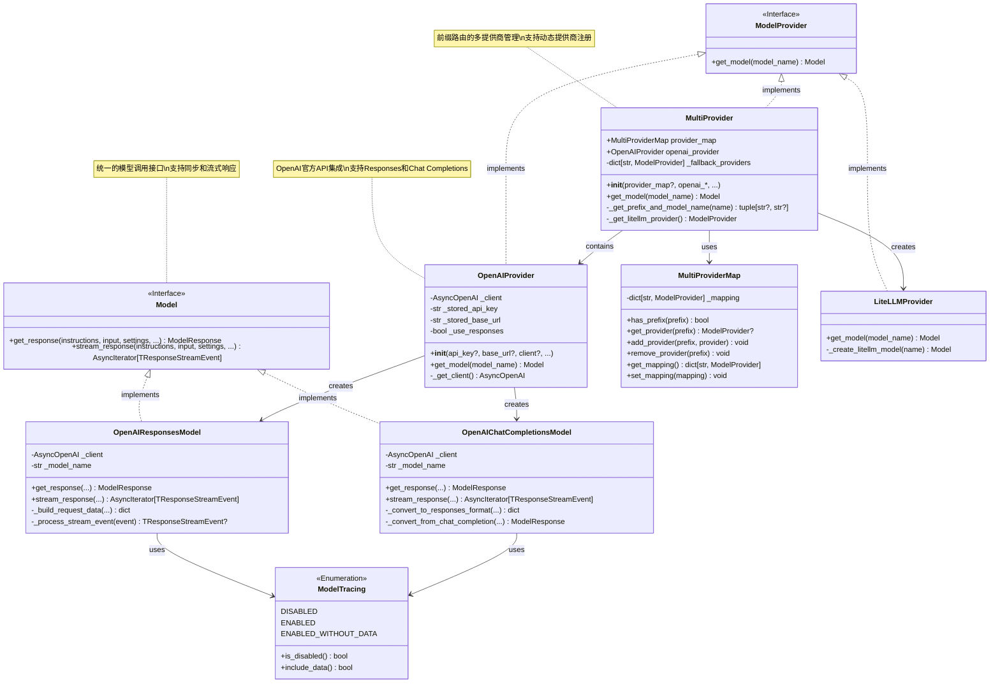

# OpenAIAgent-05-Models

## 模块概览

## 1. 模块职责与边界

Models 模块是 OpenAI Agents Python SDK 的模型抽象层，负责统一不同语言模型提供商的接口，实现模型调用的标准化管理。该模块通过抽象设计隐藏了不同模型服务的差异，为上层应用提供一致的模型调用体验。

### 核心职责

- **模型抽象**：定义统一的模型调用接口，屏蔽底层差异
- **提供商管理**：支持多种模型提供商的集成和切换
- **协议适配**：适配不同的API协议（Responses API、Chat Completions API等）
- **连接管理**：高效的HTTP连接池和资源管理
- **流式支持**：提供流式响应处理能力
- **追踪集成**：与可观测性系统深度集成
- **设置管理**：统一的模型参数配置和优化

### 模型架构体系

| 层次 | 组件 | 职责 | 主要类型 |
|------|------|------|----------|
| 接口层 | Model Interface | 统一模型调用接口 | `Model`、`ModelProvider` |
| 提供商层 | Provider Implementation | 具体提供商实现 | `OpenAIProvider`、`MultiProvider` |
| 协议层 | Protocol Adaptation | API协议适配 | `OpenAIResponsesModel`、`OpenAIChatCompletionsModel` |
| 传输层 | HTTP Client | 网络通信管理 | `AsyncOpenAI`、`httpx.AsyncClient` |

### 支持的模型提供商

| 提供商 | 前缀标识 | 主要模型 | 特殊功能 |
|--------|----------|----------|----------|
| OpenAI | `openai/` 或无前缀 | GPT-4o, GPT-4, GPT-3.5 | Responses API、托管工具 |
| LiteLLM | `litellm/` | 多提供商代理 | 统一接口访问各种模型 |
| 自定义 | 用户定义 | 用户扩展 | 完全自定义实现 |

### 输入输出接口

**输入：**

- 系统指令（`system_instructions`）
- 用户输入项目（`list[TResponseInputItem]`）
- 模型设置（`ModelSettings`）
- 工具列表（`list[Tool]`）
- 输出模式（`AgentOutputSchemaBase`）

**输出：**

- 模型响应（`ModelResponse`）
- 流式事件（`AsyncIterator[TResponseStreamEvent]`）
- 使用统计（令牌数、成本等）

### 上下游依赖关系

**上游调用者：**

- `RunImpl`：执行引擎的核心模型调用
- `Agent`：代理配置中的模型指定
- `RealtimeAgent`：实时代理的模型集成

**下游依赖：**

- `openai`：OpenAI官方Python客户端
- `httpx`：高性能HTTP客户端
- `litellm`：多提供商模型代理
- `model_settings`：模型参数配置
- `tracing`：调用链追踪

## 2. 模块架构图


**架构说明：**

### 分层设计原理

1. **接口抽象层**：`Model` 和 `ModelProvider` 定义统一接口
2. **提供商实现层**：具体的模型提供商实现，如 OpenAI、LiteLLM
3. **协议适配层**：不同API协议的具体实现和转换
4. **传输管理层**：HTTP连接池和网络通信优化

### 模型选择策略

- **前缀路由**：根据模型名称前缀选择合适的提供商
- **默认模型**：自动选择当前推荐的默认模型
- **回退机制**：主提供商失败时的备选方案

### 性能优化设计

- **连接复用**：全局共享HTTP客户端减少连接开销
- **异步优先**：所有I/O操作都基于异步模式
- **流式处理**：支持增量响应减少延迟
- **智能缓存**：合理的客户端实例缓存策略

### 扩展能力

- **插件化架构**：通过 `ModelProvider` 接口轻松添加新提供商
- **协议适配**：支持不同的API协议和数据格式
- **自定义配置**：灵活的模型参数和行为定制

## 3. 关键算法与流程剖析

### 3.1 多提供商路由算法

```python
class MultiProvider(ModelProvider):
    """多提供商路由的核心实现"""
    
    def _get_prefix_and_model_name(self, model_name: str | None) -> tuple[str | None, str | None]:
        """解析模型名称，提取提供商前缀和模型名"""
        if model_name is None:
            return None, None
        
        # 检查是否包含提供商前缀
        if "/" in model_name:
            prefix, name = model_name.split("/", 1)
            return prefix, name
        else:
            # 无前缀时默认使用 OpenAI
            return None, model_name
    
    def get_model(self, model_name: str | None) -> Model:
        """根据模型名称路由到合适的提供商"""
        prefix, actual_model_name = self._get_prefix_and_model_name(model_name)
        
        if prefix is None:
            # 默认使用 OpenAI 提供商
            return self.openai_provider.get_model(actual_model_name)
        
        # 检查自定义提供商映射
        if self.provider_map and self.provider_map.has_prefix(prefix):
            provider = self.provider_map.get_provider(prefix)
            return provider.get_model(actual_model_name)
        
        # 检查回退提供商
        if prefix in self._fallback_providers:
            provider = self._fallback_providers[prefix]
            return provider.get_model(actual_model_name)
        
        # 处理内置前缀
        if prefix == "openai":
            return self.openai_provider.get_model(actual_model_name)
        elif prefix == "litellm":
            return self._get_litellm_provider().get_model(actual_model_name)
        
        raise UserError(f"Unknown model provider: {prefix}")
```

**算法目的：** 实现智能的模型路由，支持多提供商无缝切换和扩展。

**路由策略分析：**

1. **前缀解析**：从模型名称中提取提供商标识和实际模型名
2. **优先级匹配**：自定义提供商 > 回退提供商 > 内置提供商
3. **默认行为**：无前缀时默认路由到 OpenAI 提供商
4. **错误处理**：未知提供商时抛出明确的用户错误

### 3.2 HTTP连接池优化算法

```python
_http_client: httpx.AsyncClient | None = None

def shared_http_client() -> httpx.AsyncClient:
    """全局共享HTTP客户端的单例实现"""
    global _http_client
    if _http_client is None:
        _http_client = DefaultAsyncHttpxClient(
            # 优化配置
            limits=httpx.Limits(
                max_keepalive_connections=100,  # 保持连接数
                max_connections=200,            # 最大连接数
                keepalive_expiry=30.0          # 连接保持时间
            ),
            timeout=httpx.Timeout(
                connect=10.0,    # 连接超时
                read=60.0,       # 读取超时
                write=10.0,      # 写入超时
                pool=5.0         # 连接池超时
            )
        )
    return _http_client

class OpenAIProvider(ModelProvider):
    """OpenAI提供商的连接管理"""
    
    def _get_client(self) -> AsyncOpenAI:
        """延迟加载和复用客户端实例"""
        if self._client is None:
            self._client = AsyncOpenAI(
                api_key=self._get_api_key(),
                base_url=self._stored_base_url,
                organization=self._stored_organization,
                project=self._stored_project,
                http_client=shared_http_client(),  # 使用共享客户端
            )
        return self._client
```

**算法目的：** 通过连接池优化减少网络延迟，提高并发性能。

**优化策略特点：**

1. **单例模式**：全局共享HTTP客户端实例，避免重复创建
2. **连接复用**：保持长连接减少握手开销
3. **延迟初始化**：避免不必要的客户端创建
4. **参数调优**：根据实际负载调整连接数和超时参数

### 3.3 流式响应处理算法

```python
class OpenAIResponsesModel(Model):
    """OpenAI Responses API的流式处理"""
    
    def stream_response(
        self,
        system_instructions: str | None,
        input: str | list[TResponseInputItem],
        model_settings: ModelSettings,
        tools: list[Tool],
        output_schema: AgentOutputSchemaBase | None,
        handoffs: list[Handoff],
        tracing: ModelTracing,
        **kwargs
    ) -> AsyncIterator[TResponseStreamEvent]:
        """流式响应处理的核心实现"""
        
        async def _stream_generator():
            # 1) 构建请求参数
            request_data = self._build_request_data(
                system_instructions, input, model_settings,
                tools, output_schema, handoffs, **kwargs
            )
            
            # 2) 创建流式请求
            stream = await self._client.responses.create(
                **request_data,
                stream=True
            )
            
            # 3) 处理流式事件
            try:
                async for event in stream:
                    # 追踪记录
                    if tracing.include_data():
                        self._record_stream_event(event)
                    
                    # 事件转换和过滤
                    processed_event = self._process_stream_event(event)
                    if processed_event:
                        yield processed_event
                        
            except Exception as e:
                # 流式处理异常恢复
                logger.error(f"Stream processing error: {e}")
                yield self._create_error_event(e)
            finally:
                # 清理资源
                await stream.aclose()
        
        return _stream_generator()
    
    def _process_stream_event(self, raw_event) -> TResponseStreamEvent | None:
        """流式事件的处理和转换"""
        if raw_event.type == "response.output_item.added":
            # 输出项添加事件
            return self._convert_output_item_event(raw_event)
        elif raw_event.type == "response.content_part.added":
            # 内容片段添加事件  
            return self._convert_content_part_event(raw_event)
        elif raw_event.type == "response.done":
            # 响应完成事件
            return self._convert_completion_event(raw_event)
        else:
            # 跳过未知事件类型
            return None
```

**算法目的：** 提供高效的流式响应处理，支持实时输出和增量更新。

**流式处理特点：**

1. **异步生成器**：使用 `AsyncIterator` 提供非阻塞的流式接口
2. **事件过滤**：只处理和转发有意义的事件类型
3. **错误恢复**：流式处理中的异常不中断整体流程
4. **资源管理**：确保流式连接的正确关闭和清理

### 3.4 模型响应转换算法

```python
class ChatCompletionsConverter:
    """Chat Completions API到统一格式的转换器"""
    
    @staticmethod
    def convert_to_model_response(
        chat_completion: ChatCompletion,
        tools: list[Tool],
        handoffs: list[Handoff]
    ) -> ModelResponse:
        """将ChatCompletion转换为统一的ModelResponse格式"""
        
        # 1) 提取基础信息
        choice = chat_completion.choices[0]
        message = choice.message
        
        # 2) 处理工具调用
        output_items = []
        if message.tool_calls:
            for tool_call in message.tool_calls:
                if tool_call.type == "function":
                    # 函数工具调用
                    output_item = ToolCallOutputItem(
                        tool_name=tool_call.function.name,
                        tool_call_id=tool_call.id,
                        input=tool_call.function.arguments
                    )
                    output_items.append(output_item)
        
        # 3) 处理文本输出
        if message.content:
            text_item = MessageOutputItem(
                content=message.content,
                role="assistant"
            )
            output_items.append(text_item)
        
        # 4) 处理使用统计
        usage_stats = None
        if chat_completion.usage:
            usage_stats = Usage(
                input_tokens=chat_completion.usage.prompt_tokens,
                output_tokens=chat_completion.usage.completion_tokens,
                total_tokens=chat_completion.usage.total_tokens
            )
        
        # 5) 构建统一响应
        return ModelResponse(
            output=output_items,
            usage=usage_stats,
            response_id=chat_completion.id,
            model=chat_completion.model,
            created_at=chat_completion.created
        )
```

**算法目的：** 将不同API协议的响应转换为统一格式，实现协议透明化。

**转换策略要点：**

1. **结构映射**：建立不同响应格式之间的字段映射关系
2. **类型转换**：处理不同API的数据类型差异
3. **信息保留**：确保转换过程中不丢失重要信息
4. **统计合并**：统一不同API的使用统计格式

## 4. 数据结构与UML图



**类图说明：**

### 接口设计层次

1. **Model接口**：定义统一的模型调用标准，支持同步和流式两种模式
2. **ModelProvider接口**：定义模型提供商的标准，负责模型实例创建
3. **具体实现类**：各种模型和提供商的具体实现

### 组合与聚合关系

- **MultiProvider聚合**：包含多个提供商实例，实现路由分发
- **OpenAIProvider组合**：创建和管理OpenAI模型实例
- **模型依赖关系**：所有模型都依赖底层的API客户端

### 扩展性设计

- **开放封闭原则**：通过接口扩展新的模型和提供商
- **策略模式**：不同的模型实现可以灵活切换
- **工厂模式**：提供商负责创建合适的模型实例

## 5. 典型使用场景时序图

### 场景一：多提供商模型路由


### 场景二：流式响应处理


### 场景三：协议转换处理


## 6. 最佳实践与使用模式

### 6.1 多提供商配置最佳实践

```python
from agents import Agent, Runner
from agents.models import MultiProvider, MultiProviderMap
from agents.extensions.models import LiteLLMProvider

async def multi_provider_setup():
    """多提供商配置的最佳实践"""
    
    # 1. 创建自定义提供商映射
    provider_map = MultiProviderMap()
    
    # 2. 添加LiteLLM提供商支持更多模型
    litellm_provider = LiteLLMProvider()
    provider_map.add_provider("litellm", litellm_provider)
    
    # 3. 添加自定义模型提供商
    custom_provider = CustomModelProvider(api_endpoint="https://api.custom.com")
    provider_map.add_provider("custom", custom_provider)
    
    # 4. 创建多提供商实例
    multi_provider = MultiProvider(
        provider_map=provider_map,
        openai_api_key="your-openai-key",
        openai_use_responses=True  # 优先使用Responses API
    )
    
    # 5. 创建使用不同模型的代理
    agents = {
        "openai": Agent(
            name="OpenAIAgent",
            model="gpt-4o",  # 默认使用OpenAI
            instructions="使用OpenAI GPT-4o模型"
        ),
        "claude": Agent(
            name="ClaudeAgent",
            model="litellm/anthropic/claude-3-sonnet",
            instructions="使用Anthropic Claude模型"
        ),
        "custom": Agent(
            name="CustomAgent",
            model="custom/my-model-v1",
            instructions="使用自定义模型"
        )
    }
    
    # 6. 使用全局配置
    from agents.run import RunConfig
    run_config = RunConfig(model_provider=multi_provider)
    
    # 7. 执行不同模型的对话
    for name, agent in agents.items():
        try:
            result = await Runner.run(
                agent,
                f"介绍一下你使用的模型特点",
                run_config=run_config
            )
            print(f"{name}: {result.final_output}\n")
        except Exception as e:
            print(f"{name} 调用失败: {e}")

asyncio.run(multi_provider_setup())
```

### 6.2 性能优化配置

```python
import httpx
from openai import AsyncOpenAI
from agents.models import OpenAIProvider

def create_optimized_provider():
    """创建性能优化的模型提供商"""
    
    # 1. 自定义HTTP客户端配置
    http_client = httpx.AsyncClient(
        limits=httpx.Limits(
            max_keepalive_connections=50,   # 保持连接数
            max_connections=100,            # 最大连接数
            keepalive_expiry=60.0          # 连接保持时间
        ),
        timeout=httpx.Timeout(
            connect=5.0,     # 连接超时
            read=30.0,       # 读取超时
            write=5.0,       # 写入超时
            pool=2.0         # 连接池超时
        ),
        http2=True,         # 启用HTTP/2
        retries=3           # 自动重试
    )
    
    # 2. 创建优化的OpenAI客户端
    openai_client = AsyncOpenAI(
        api_key="your-api-key",
        http_client=http_client,
        max_retries=3,
        timeout=30.0
    )
    
    # 3. 创建提供商实例
    provider = OpenAIProvider(
        openai_client=openai_client,
        use_responses=True  # 使用更高效的Responses API
    )
    
    return provider

# 使用优化后的提供商
optimized_provider = create_optimized_provider()
```

### 6.3 流式响应处理模式

```python
from agents import Agent, Runner

async def streaming_response_example():
    """流式响应处理的最佳实践"""
    
    agent = Agent(
        name="StreamingAgent",
        instructions="详细解释复杂概念，分步骤回答",
        model="gpt-4o"
    )
    
    # 1. 启动流式执行
    result = Runner.run_streamed(
        agent,
        "详细解释机器学习的工作原理，包括训练和推理过程"
    )
    
    # 2. 实时处理流式事件
    accumulated_content = ""
    
    try:
        async for event in result.stream_events():
            if event.type == "run_item":
                item = event.data.item
                
                if item.type == "message_output":
                    # 处理消息输出事件
                    new_content = item.content
                    if new_content not in accumulated_content:
                        delta = new_content[len(accumulated_content):]
                        print(delta, end="", flush=True)
                        accumulated_content = new_content
                
                elif item.type == "tool_call":
                    # 处理工具调用事件
                    print(f"\n[工具调用: {item.tool_name}]")
                
                elif item.type == "tool_call_output":
                    # 处理工具输出事件
                    print(f"[工具结果: {item.output[:100]}...]")
            
            elif event.type == "raw_responses":
                # 处理原始响应事件（用于调试）
                response_count = len(event.data.responses)
                print(f"[收到 {response_count} 个原始响应]")
        
        print(f"\n\n最终结果: {result.final_output}")
        
    except Exception as e:
        print(f"流式处理错误: {e}")
        # 仍然可以获取部分结果
        if hasattr(result, 'final_output'):
            print(f"部分结果: {result.final_output}")

asyncio.run(streaming_response_example())
```

### 6.4 自定义模型提供商实现

```python
from agents.models import Model, ModelProvider
from agents.items import ModelResponse, TResponseInputItem

class CustomModel(Model):
    """自定义模型实现示例"""
    
    def __init__(self, model_name: str, api_endpoint: str, api_key: str):
        self.model_name = model_name
        self.api_endpoint = api_endpoint
        self.api_key = api_key
        self._client = httpx.AsyncClient()
    
    async def get_response(
        self,
        system_instructions: str | None,
        input: str | list[TResponseInputItem],
        model_settings,
        tools,
        output_schema,
        handoffs,
        tracing,
        **kwargs
    ) -> ModelResponse:
        """自定义模型调用实现"""
        
        # 1. 构建请求
        request_data = {
            "model": self.model_name,
            "messages": self._convert_input_to_messages(system_instructions, input),
            "temperature": model_settings.temperature,
            "max_tokens": model_settings.max_tokens,
        }
        
        # 2. 调用自定义API
        response = await self._client.post(
            f"{self.api_endpoint}/chat/completions",
            json=request_data,
            headers={"Authorization": f"Bearer {self.api_key}"}
        )
        response.raise_for_status()
        
        # 3. 转换响应格式
        api_response = response.json()
        return self._convert_to_model_response(api_response)
    
    def stream_response(self, **kwargs):
        """流式响应实现（可选）"""
        # 实现流式处理逻辑
        raise NotImplementedError("流式响应暂未实现")
    
    def _convert_input_to_messages(self, system_instructions, input):
        """输入格式转换"""
        messages = []
        if system_instructions:
            messages.append({"role": "system", "content": system_instructions})
        
        if isinstance(input, str):
            messages.append({"role": "user", "content": input})
        else:
            # 处理复杂输入格式
            for item in input:
                messages.append({
                    "role": item.get("role", "user"),
                    "content": item.get("content", "")
                })
        
        return messages
    
    def _convert_to_model_response(self, api_response) -> ModelResponse:
        """响应格式转换"""
        choice = api_response["choices"][0]
        message = choice["message"]
        
        return ModelResponse(
            output=[{
                "type": "message_output",
                "content": message["content"],
                "role": "assistant"
            }],
            usage={
                "input_tokens": api_response.get("usage", {}).get("prompt_tokens", 0),
                "output_tokens": api_response.get("usage", {}).get("completion_tokens", 0),
                "total_tokens": api_response.get("usage", {}).get("total_tokens", 0)
            },
            response_id=api_response.get("id"),
            model=api_response.get("model")
        )

class CustomModelProvider(ModelProvider):
    """自定义模型提供商"""
    
    def __init__(self, api_endpoint: str, api_key: str):
        self.api_endpoint = api_endpoint
        self.api_key = api_key
    
    def get_model(self, model_name: str | None) -> Model:
        """创建自定义模型实例"""
        if model_name is None:
            model_name = "default-model"
        
        return CustomModel(
            model_name=model_name,
            api_endpoint=self.api_endpoint,
            api_key=self.api_key
        )

# 使用自定义提供商
custom_provider = CustomModelProvider(
    api_endpoint="https://api.mycompany.com",
    api_key="your-custom-api-key"
)

agent = Agent(
    name="CustomAgent",
    model="my-custom-model-v1",
    instructions="使用自定义模型提供服务"
)

# 配置自定义提供商
from agents.run import RunConfig
config = RunConfig(model_provider=custom_provider)

result = await Runner.run(agent, "测试自定义模型", run_config=config)
```

Models模块通过清晰的接口设计和灵活的实现架构，为OpenAI Agents提供了强大的模型抽象能力，支持从单一模型到复杂多提供商场景的各种需求。

---

## API接口

## 1. API 总览

Models 模块提供了模型抽象层，支持多种LLM提供商的统一接口。通过 `Model` 和 `ModelProvider` 接口，开发者可以灵活地切换和扩展不同的语言模型。

### API 层次结构

```
ModelProvider (提供商接口)
    ├── MultiProvider (多提供商路由)
    ├── OpenAIProvider (OpenAI实现)
    └── 自定义Provider (可扩展)

Model (模型接口)
    ├── get_response() (标准响应)
    └── stream_response() (流式响应)

ModelSettings (模型配置)
    └── 温度、token限制等参数
```

### API 分类

| API 类别 | 核心 API | 功能描述 |
|---------|---------|---------|
| **模型接口** | `Model.get_response()` | 获取模型标准响应 |
| | `Model.stream_response()` | 获取模型流式响应 |
| **提供商接口** | `ModelProvider.get_model()` | 根据名称获取模型实例 |
| **多提供商** | `MultiProvider.__init__()` | 创建多提供商路由 |
| | `MultiProvider.get_model()` | 路由到对应提供商 |
| **提供商映射** | `MultiProviderMap.add_provider()` | 添加自定义提供商 |
| | `MultiProviderMap.get_provider()` | 查找提供商 |

## 2. Model 接口 API

### 2.1 Model.get_response - 获取标准响应

**API 签名：**

```python
@abc.abstractmethod
async def get_response(
    self,
    system_instructions: str | None,
    input: str | list[TResponseInputItem],
    model_settings: ModelSettings,
    tools: list[Tool],
    output_schema: AgentOutputSchemaBase | None,
    handoffs: list[Handoff],
    tracing: ModelTracing,
    *,
    previous_response_id: str | None,
    conversation_id: str | None,
    prompt: ResponsePromptParam | None,
) -> ModelResponse
```

**功能描述：**
从语言模型获取完整响应。这是模型交互的核心方法，所有模型实现必须提供此方法。

**请求参数：**

| 参数名 | 类型 | 说明 |
|--------|------|------|
| `system_instructions` | `str \| None` | 系统指令（Agent的instructions） |
| `input` | `str \| list[TResponseInputItem]` | 输入内容（用户消息、历史等） |
| `model_settings` | `ModelSettings` | 模型参数配置 |
| `tools` | `list[Tool]` | 可用工具列表 |
| `output_schema` | `AgentOutputSchemaBase \| None` | 输出结构化Schema |
| `handoffs` | `list[Handoff]` | 可用的代理切换列表 |
| `tracing` | `ModelTracing` | 追踪配置 |
| `previous_response_id` | `str \| None` | 上一个响应ID（OpenAI Responses API） |
| `conversation_id` | `str \| None` | 对话ID（服务器端状态） |
| `prompt` | `ResponsePromptParam \| None` | 提示词配置 |

**返回结构：**

```python
@dataclass
class ModelResponse:
    response_id: str | None  # 响应ID
    output: list  # 输出项列表（消息、工具调用等）
    usage: Usage  # Token使用统计
    raw_response: dict  # 原始响应数据
```

**实现示例：**

```python
from agents.models import Model, ModelResponse
from agents import Usage

class CustomModel(Model):
    """自定义模型实现"""
    
    async def get_response(
        self,
        system_instructions: str | None,
        input: str | list[TResponseInputItem],
        model_settings: ModelSettings,
        tools: list[Tool],
        output_schema: AgentOutputSchemaBase | None,
        handoffs: list[Handoff],
        tracing: ModelTracing,
        *,
        previous_response_id: str | None = None,
        conversation_id: str | None = None,
        prompt: ResponsePromptParam | None = None,
    ) -> ModelResponse:
        """实现模型调用逻辑"""
        
        # 1. 准备请求数据
        request_data = {
            "messages": self._prepare_messages(system_instructions, input),
            "temperature": model_settings.temperature,
            "max_tokens": model_settings.max_tokens,
            "tools": self._convert_tools(tools),
        }
        
        # 2. 调用实际的LLM API
        response = await self._call_llm_api(request_data)
        
        # 3. 解析响应
        output_items = self._parse_output(response)
        
        # 4. 统计Token使用
        usage = Usage(
            input_tokens=response.get("usage", {}).get("prompt_tokens", 0),
            output_tokens=response.get("usage", {}).get("completion_tokens", 0),
            total_tokens=response.get("usage", {}).get("total_tokens", 0)
        )
        
        # 5. 返回标准化响应
        return ModelResponse(
            response_id=response.get("id"),
            output=output_items,
            usage=usage,
            raw_response=response
        )
```

### 2.2 Model.stream_response - 获取流式响应

**API 签名：**

```python
@abc.abstractmethod
def stream_response(
    self,
    system_instructions: str | None,
    input: str | list[TResponseInputItem],
    model_settings: ModelSettings,
    tools: list[Tool],
    output_schema: AgentOutputSchemaBase | None,
    handoffs: list[Handoff],
    tracing: ModelTracing,
    *,
    previous_response_id: str | None,
    conversation_id: str | None,
    prompt: ResponsePromptParam | None,
) -> AsyncIterator[TResponseStreamEvent]
```

**功能描述：**
从语言模型获取流式响应。适用于需要实时反馈的场景。

**参数说明：**
与 `get_response()` 完全相同。

**返回结构：**

```python
AsyncIterator[TResponseStreamEvent]  # 异步生成器，产生流式事件
```

**流式事件类型：**

- `response.output_item.done`: 输出项完成
- `response.audio.delta`: 音频增量数据
- `response.function_call_arguments.delta`: 工具调用参数增量
- 其他OpenAI Responses API事件

**实现示例：**

```python
class CustomModel(Model):
    """支持流式响应的模型"""
    
    async def stream_response(
        self,
        system_instructions: str | None,
        input: str | list[TResponseInputItem],
        model_settings: ModelSettings,
        tools: list[Tool],
        output_schema: AgentOutputSchemaBase | None,
        handoffs: list[Handoff],
        tracing: ModelTracing,
        *,
        previous_response_id: str | None = None,
        conversation_id: str | None = None,
        prompt: ResponsePromptParam | None = None,
    ) -> AsyncIterator[TResponseStreamEvent]:
        """实现流式响应"""
        
        # 准备请求
        request_data = self._prepare_request(
            system_instructions, input, model_settings, tools
        )
        request_data["stream"] = True
        
        # 调用流式API
        async for chunk in self._call_llm_stream_api(request_data):
            # 转换为标准事件格式
            event = self._convert_to_response_event(chunk)
            yield event
```

## 3. ModelProvider 接口 API

### 3.1 ModelProvider.get_model - 获取模型实例

**API 签名：**

```python
@abc.abstractmethod
def get_model(self, model_name: str | None) -> Model
```

**功能描述：**
根据模型名称获取对应的模型实例。这是提供商的核心方法。

**请求参数：**

| 参数名 | 类型 | 说明 |
|--------|------|------|
| `model_name` | `str \| None` | 模型名称（如"gpt-4o"） |

**返回结构：**

```python
Model  # 实现了Model接口的实例
```

**实现示例：**

```python
from agents.models import ModelProvider, Model

class CustomProvider(ModelProvider):
    """自定义模型提供商"""
    
    def __init__(self, api_key: str, base_url: str):
        self.api_key = api_key
        self.base_url = base_url
        self._model_cache = {}
    
    def get_model(self, model_name: str | None) -> Model:
        """根据名称返回模型实例"""
        
        # 默认模型
        if model_name is None:
            model_name = "default-model"
        
        # 缓存模型实例
        if model_name not in self._model_cache:
            self._model_cache[model_name] = CustomModel(
                name=model_name,
                api_key=self.api_key,
                base_url=self.base_url
            )
        
        return self._model_cache[model_name]
```

## 4. MultiProvider API

### 4.1 MultiProvider.__init__ - 创建多提供商路由

**API 签名：**

```python
def __init__(
    self,
    *,
    provider_map: MultiProviderMap | None = None,
    openai_api_key: str | None = None,
    openai_base_url: str | None = None,
    openai_client: AsyncOpenAI | None = None,
    openai_organization: str | None = None,
    openai_project: str | None = None,
    openai_use_responses: bool | None = None,
)
```

**功能描述：**
创建支持多个模型提供商的路由器。根据模型名称前缀自动选择对应的提供商。

**请求参数：**

| 参数名 | 类型 | 默认值 | 说明 |
|--------|------|--------|------|
| `provider_map` | `MultiProviderMap \| None` | `None` | 自定义提供商映射 |
| `openai_api_key` | `str \| None` | `None` | OpenAI API密钥 |
| `openai_base_url` | `str \| None` | `None` | OpenAI API基础URL |
| `openai_client` | `AsyncOpenAI \| None` | `None` | 自定义OpenAI客户端 |
| `openai_organization` | `str \| None` | `None` | OpenAI组织ID |
| `openai_project` | `str \| None` | `None` | OpenAI项目ID |
| `openai_use_responses` | `bool \| None` | `None` | 是否使用Responses API |

**默认路由规则：**

```python
# 无前缀或"openai/"前缀 -> OpenAIProvider
"gpt-4o" -> OpenAIProvider
"openai/gpt-4o" -> OpenAIProvider

# "litellm/"前缀 -> LitellmProvider
"litellm/claude-3-opus" -> LitellmProvider

# 自定义前缀 -> 自定义Provider
"custom/my-model" -> CustomProvider (需要在provider_map中配置)
```

**使用示例：**

```python
from agents.models import MultiProvider
from openai import AsyncOpenAI

# 基础用法（默认OpenAI）
provider = MultiProvider()

# 自定义OpenAI配置
provider = MultiProvider(
    openai_api_key="your-api-key",
    openai_base_url="https://api.openai.com/v1"
)

# 使用自定义客户端
custom_client = AsyncOpenAI(
    api_key="your-key",
    base_url="https://custom.api.com"
)
provider = MultiProvider(openai_client=custom_client)

# 获取模型
model = provider.get_model("gpt-4o")
model_litellm = provider.get_model("litellm/claude-3-opus")
```

### 4.2 MultiProvider.get_model - 路由到提供商

**API 签名：**

```python
def get_model(self, model_name: str | None) -> Model
```

**功能描述：**
根据模型名称的前缀路由到对应的提供商，然后获取模型实例。

**路由逻辑：**

```python
# 解析前缀
"openai/gpt-4o" -> prefix="openai", name="gpt-4o"
"litellm/claude" -> prefix="litellm", name="claude"
"gpt-4o" -> prefix=None, name="gpt-4o"

# 查找提供商
if prefix in provider_map:
    return provider_map[prefix].get_model(name)
else:
    return fallback_provider.get_model(name)
```

**使用示例：**

```python
provider = MultiProvider()

# OpenAI模型
gpt4 = provider.get_model("gpt-4o")
gpt4_explicit = provider.get_model("openai/gpt-4o")

# LiteLLM模型
claude = provider.get_model("litellm/claude-3-opus")
gemini = provider.get_model("litellm/gemini-pro")

# 使用模型
response = await gpt4.get_response(
    system_instructions="你是一个助手",
    input="Hello",
    model_settings=ModelSettings(),
    tools=[],
    output_schema=None,
    handoffs=[],
    tracing=ModelTracing.ENABLED
)
```

## 5. MultiProviderMap API

### 5.1 添加自定义提供商

**API 方法：**

```python
def add_provider(self, prefix: str, provider: ModelProvider)
def get_provider(self, prefix: str) -> ModelProvider | None
def has_prefix(self, prefix: str) -> bool
def remove_provider(self, prefix: str)
```

**使用示例：**

```python
from agents.models import MultiProvider, MultiProviderMap, ModelProvider

# 创建自定义提供商
class MyCustomProvider(ModelProvider):
    def get_model(self, model_name: str | None) -> Model:
        return MyCustomModel(model_name)

# 创建提供商映射
provider_map = MultiProviderMap()
provider_map.add_provider("custom", MyCustomProvider())
provider_map.add_provider("azure", AzureProvider())

# 使用自定义映射创建MultiProvider
provider = MultiProvider(provider_map=provider_map)

# 现在可以使用自定义前缀
custom_model = provider.get_model("custom/my-model")
azure_model = provider.get_model("azure/gpt-4")
```

### 5.2 完整的自定义提供商示例

```python
from agents.models import ModelProvider, Model, MultiProvider, MultiProviderMap
from agents import ModelResponse, Usage, ModelSettings
import httpx

class HuggingFaceModel(Model):
    """Hugging Face模型实现"""
    
    def __init__(self, model_name: str, api_key: str):
        self.model_name = model_name
        self.api_key = api_key
        self.base_url = "https://api-inference.huggingface.co/models"
    
    async def get_response(
        self,
        system_instructions: str | None,
        input: str | list,
        model_settings: ModelSettings,
        tools: list,
        output_schema,
        handoffs: list,
        tracing,
        **kwargs
    ) -> ModelResponse:
        """调用Hugging Face API"""
        
        # 准备请求
        async with httpx.AsyncClient() as client:
            response = await client.post(
                f"{self.base_url}/{self.model_name}",
                headers={"Authorization": f"Bearer {self.api_key}"},
                json={
                    "inputs": self._format_input(system_instructions, input),
                    "parameters": {
                        "temperature": model_settings.temperature,
                        "max_new_tokens": model_settings.max_tokens,
                    }
                }
            )
        
        # 解析响应
        data = response.json()
        output_text = data[0]["generated_text"]
        
        return ModelResponse(
            response_id=None,
            output=[{"type": "message", "content": output_text}],
            usage=Usage(input_tokens=0, output_tokens=0, total_tokens=0),
            raw_response=data
        )
    
    async def stream_response(self, **kwargs):
        """流式响应（简化版）"""
        response = await self.get_response(**kwargs)
        yield response.output[0]

class HuggingFaceProvider(ModelProvider):
    """Hugging Face提供商"""
    
    def __init__(self, api_key: str):
        self.api_key = api_key
    
    def get_model(self, model_name: str | None) -> Model:
        """返回Hugging Face模型"""
        if model_name is None:
            model_name = "gpt2"
        return HuggingFaceModel(model_name, self.api_key)

# 注册到MultiProvider
provider_map = MultiProviderMap()
provider_map.add_provider("hf", HuggingFaceProvider(api_key="your-key"))

provider = MultiProvider(provider_map=provider_map)

# 使用Hugging Face模型
agent = Agent(
    name="HFAgent",
    model="hf/gpt2",  # 使用自定义前缀
    instructions="你是一个助手"
)
```

## 6. ModelTracing 枚举

### 6.1 追踪级别

**枚举定义：**

```python
class ModelTracing(enum.Enum):
    DISABLED = 0              # 完全禁用追踪
    ENABLED = 1               # 启用追踪，包含所有数据
    ENABLED_WITHOUT_DATA = 2  # 启用追踪，但不包含输入输出数据
```

**方法：**

```python
def is_disabled(self) -> bool:
    """是否禁用追踪"""
    return self == ModelTracing.DISABLED

def include_data(self) -> bool:
    """是否包含数据"""
    return self == ModelTracing.ENABLED
```

**使用示例：**

```python
from agents.models import ModelTracing

# 完全启用追踪
tracing = ModelTracing.ENABLED

# 启用追踪但不记录敏感数据
tracing = ModelTracing.ENABLED_WITHOUT_DATA

# 禁用追踪
tracing = ModelTracing.DISABLED

# 在模型调用中使用
response = await model.get_response(
    ...,
    tracing=tracing
)
```

## 7. 最佳实践

### 7.1 多模型支持

```python
from agents import Agent, RunConfig
from agents.models import MultiProvider

# 创建支持多模型的提供商
provider = MultiProvider()

# 为不同任务使用不同模型
fast_agent = Agent(
    name="FastAgent",
    model="gpt-4o-mini",
    instructions="快速响应"
)

smart_agent = Agent(
    name="SmartAgent",
    model="gpt-4o",
    instructions="深度思考"
)

# 在运行时切换模型
config = RunConfig(
    model="gpt-4o",  # 覆盖代理的模型
    model_provider=provider
)
```

### 7.2 模型回退策略

```python
class FallbackModel(Model):
    """支持回退的模型"""
    
    def __init__(self, primary: Model, fallback: Model):
        self.primary = primary
        self.fallback = fallback
    
    async def get_response(self, **kwargs) -> ModelResponse:
        """尝试主模型，失败时使用备用模型"""
        try:
            return await self.primary.get_response(**kwargs)
        except Exception as e:
            logger.warning(f"Primary model failed: {e}, using fallback")
            return await self.fallback.get_response(**kwargs)
```

Models 模块通过清晰的接口抽象和灵活的提供商机制，为 OpenAI Agents 提供了强大的模型集成能力，支持多种LLM的无缝切换和扩展。

---

## 数据结构

## 1. 数据结构总览

Models 模块的数据结构定义了模型接口、提供商机制和响应格式。核心数据结构包括模型接口、提供商接口、响应对象和配置类。

### 数据结构层次

```
Model Interface (模型接口)
    ├── get_response() -> ModelResponse
    └── stream_response() -> AsyncIterator[StreamEvent]

ModelProvider (提供商接口)
    ├── MultiProvider (多提供商)
    └── OpenAIProvider (OpenAI实现)

ModelResponse (响应对象)
    ├── response_id
    ├── output
    ├── usage
    └── raw_response

ModelTracing (追踪配置)
```

## 2. 核心接口 UML 图

### 2.1 Model 和 ModelProvider 接口


**接口说明：**

- **Model**: 所有模型实现的基础接口，定义了标准和流式两种响应方法
- **ModelProvider**: 提供商接口，负责根据模型名称创建模型实例
- **MultiProvider**: 支持多提供商路由的实现
- **OpenAIProvider**: OpenAI专用提供商实现

### 2.2 MultiProviderMap 结构


**字段说明：**

| 字段 | 类型 | 说明 |
|------|------|------|
| `_mapping` | `dict[str, ModelProvider]` | 前缀到提供商的映射字典 |

**方法说明：**

| 方法 | 功能 |
|------|------|
| `has_prefix()` | 检查前缀是否存在 |
| `get_provider()` | 获取指定前缀的提供商 |
| `add_provider()` | 添加自定义提供商 |
| `remove_provider()` | 移除提供商映射 |

## 3. 模型响应数据结构

### 3.1 ModelResponse 结构


**ModelResponse 字段详解：**

| 字段 | 类型 | 说明 | 示例 |
|------|------|------|------|
| `response_id` | `str \| None` | 响应唯一标识符 | `"resp_abc123"` |
| `output` | `list[ResponseOutputItem]` | 输出项列表 | `[{type: "message", ...}]` |
| `usage` | `Usage` | Token使用统计 | `Usage(input_tokens=50, ...)` |
| `raw_response` | `dict` | 原始API响应 | 完整的API响应字典 |

### 3.2 Usage 数据结构

```python
@dataclass
class Usage:
    """Token使用统计"""
    
    input_tokens: int
    """输入Token数量"""
    
    output_tokens: int
    """输出Token数量"""
    
    total_tokens: int
    """总Token数量"""
    
    input_token_details: dict | None = None
    """输入Token详细信息（如缓存命中等）"""
    
    output_token_details: dict | None = None
    """输出Token详细信息（如推理Token等）"""
```

**字段说明：**

| 字段 | 类型 | 说明 | 计算方式 |
|------|------|------|---------|
| `input_tokens` | `int` | 输入消耗的Token | 系统指令 + 用户输入 + 历史 |
| `output_tokens` | `int` | 输出消耗的Token | 模型生成的内容 |
| `total_tokens` | `int` | 总Token消耗 | `input_tokens + output_tokens` |

**示例：**

```python
usage = Usage(
    input_tokens=150,
    output_tokens=50,
    total_tokens=200,
    input_token_details={
        "cached_tokens": 100,  # 缓存命中的Token
        "text_tokens": 50
    },
    output_token_details={
        "reasoning_tokens": 20,  # 推理Token（o1模型）
        "text_tokens": 30
    }
)
```

## 4. 模型配置数据结构

### 4.1 ModelSettings 结构


**字段详解：**

| 字段 | 类型 | 默认值 | 说明 | 取值范围 |
|------|------|--------|------|---------|
| `temperature` | `float \| None` | `None` | 采样温度 | 0.0 - 2.0 |
| `max_tokens` | `int \| None` | `None` | 最大生成Token数 | > 0 |
| `top_p` | `float \| None` | `None` | 核采样概率 | 0.0 - 1.0 |
| `frequency_penalty` | `float \| None` | `None` | 频率惩罚 | -2.0 - 2.0 |
| `presence_penalty` | `float \| None` | `None` | 存在惩罚 | -2.0 - 2.0 |
| `response_format` | `dict \| None` | `None` | 响应格式（JSON模式） | `{"type": "json_object"}` |
| `seed` | `int \| None` | `None` | 随机种子 | 任意整数 |
| `stop` | `list[str] \| None` | `None` | 停止序列 | 字符串列表 |
| `logprobs` | `bool \| None` | `None` | 是否返回对数概率 | `True/False` |
| `top_logprobs` | `int \| None` | `None` | 返回Top-K对数概率 | 0 - 20 |
| `parallel_tool_calls` | `bool \| None` | `None` | 是否并行调用工具 | `True/False` |

**使用示例：**

```python
from agents import ModelSettings

# 创造性任务配置
creative_settings = ModelSettings(
    temperature=0.9,
    top_p=0.95,
    max_tokens=2000,
    presence_penalty=0.6
)

# 精确任务配置
precise_settings = ModelSettings(
    temperature=0.1,
    max_tokens=500,
    seed=42,  # 可重复的结果
    stop=["\n\n"]
)

# JSON模式配置
json_settings = ModelSettings(
    temperature=0.5,
    response_format={"type": "json_object"}
)
```

## 5. 模型追踪数据结构

### 5.1 ModelTracing 枚举


**枚举值说明：**

| 值 | 整数 | 含义 | 使用场景 |
|----|------|------|---------|
| `DISABLED` | 0 | 完全禁用追踪 | 生产环境，不需要调试 |
| `ENABLED` | 1 | 启用追踪，包含数据 | 开发/测试环境 |
| `ENABLED_WITHOUT_DATA` | 2 | 启用追踪，不含敏感数据 | 生产环境监控 |

**方法说明：**

```python
class ModelTracing(enum.Enum):
    def is_disabled(self) -> bool:
        """检查是否禁用追踪"""
        return self == ModelTracing.DISABLED
    
    def include_data(self) -> bool:
        """检查是否包含输入输出数据"""
        return self == ModelTracing.ENABLED
```

**使用示例：**

```python
from agents.models import ModelTracing

# 根据环境选择追踪级别
import os

if os.getenv("ENV") == "production":
    tracing = ModelTracing.ENABLED_WITHOUT_DATA
else:
    tracing = ModelTracing.ENABLED

# 条件判断
if not tracing.is_disabled():
    # 记录追踪信息
    if tracing.include_data():
        # 记录完整数据
        pass
    else:
        # 只记录元数据
        pass
```

## 6. 流式响应数据结构

### 6.1 ResponseStreamEvent 类型


**事件类型详解：**

| 事件类型 | 字段 | 说明 |
|---------|------|------|
| `response.output_item.done` | `item` | 输出项完成 |
| `response.audio.delta` | `delta`, `content_index` | 音频数据增量 |
| `response.function_call_arguments.delta` | `delta`, `call_id` | 工具调用参数增量 |
| `response.text.delta` | `delta`, `content_index` | 文本内容增量 |
| `response.done` | `response` | 响应完成 |

**流式事件处理示例：**

```python
async for event in model.stream_response(...):
    event_type = event.get("type")
    
    if event_type == "response.text.delta":
        # 处理文本增量
        text_delta = event["delta"]
        print(text_delta, end="", flush=True)
    
    elif event_type == "response.function_call_arguments.delta":
        # 处理工具调用参数增量
        args_delta = event["delta"]
        call_id = event["call_id"]
        
    elif event_type == "response.output_item.done":
        # 输出项完成
        item = event["item"]
        
    elif event_type == "response.done":
        # 整个响应完成
        final_response = event["response"]
```

## 7. 提供商特定数据结构

### 7.1 OpenAI 提供商配置


**OpenAIProvider 构造参数：**

| 参数 | 类型 | 说明 |
|------|------|------|
| `api_key` | `str \| None` | OpenAI API密钥 |
| `base_url` | `str \| None` | API基础URL |
| `openai_client` | `AsyncOpenAI \| None` | 自定义客户端 |
| `organization` | `str \| None` | 组织ID |
| `project` | `str \| None` | 项目ID |
| `use_responses` | `bool \| None` | 是否使用Responses API |

### 7.2 模型名称解析结构

```python
# MultiProvider 内部的名称解析
def _get_prefix_and_model_name(
    self, model_name: str | None
) -> tuple[str | None, str | None]:
    """
    解析模型名称，提取前缀和实际名称
    
    输入示例：

    - "gpt-4o" -> (None, "gpt-4o")
    - "openai/gpt-4o" -> ("openai", "gpt-4o")
    - "litellm/claude-3-opus" -> ("litellm", "claude-3-opus")
    - "custom/my-model" -> ("custom", "my-model")
    - None -> (None, None)
    """
    if model_name is None:
        return None, None
    elif "/" in model_name:
        prefix, name = model_name.split("/", 1)
        return prefix, name
    else:
        return None, model_name

```

## 8. 数据流转图

### 8.1 模型调用数据流


**数据流说明：**

1. **模型选择阶段**：Agent配置 → MultiProvider → 具体Provider → Model实例
2. **请求构建阶段**：ModelSettings + 输入数据 → API请求参数
3. **API调用阶段**：发送请求 → 接收原始响应
4. **响应解析阶段**：原始响应 → ModelResponse（标准化格式）
5. **结果返回阶段**：ModelResponse → Agent/Runner

### 8.2 流式响应数据流


## 9. 数据结构关系总览


Models 模块的数据结构设计通过清晰的接口抽象和灵活的配置机制，实现了对多种LLM的统一管理和调用，为 OpenAI Agents 提供了强大的模型适配能力。

---

## 时序图

## 1. 时序图总览

Models 模块的时序图展示了模型选择、调用、响应处理的完整流程。核心流程包括：模型提供商初始化、模型实例获取、标准调用、流式调用。

### 主要时序流程

| 时序流程 | 参与者 | 核心操作 |
|---------|--------|---------|
| **模型提供商初始化** | MultiProvider, OpenAIProvider | 配置提供商映射 |
| **模型实例获取** | MultiProvider, ModelProvider, Model | 路由并创建模型 |
| **标准模型调用** | Agent, Model, LLM API | 完整请求响应 |
| **流式模型调用** | Agent, Model, LLM API | 流式数据处理 |
| **多提供商路由** | MultiProvider, ProviderMap | 前缀匹配与查找 |

## 2. 模型提供商初始化时序图

### 2.1 MultiProvider 初始化流程


**流程说明：**

1. **创建MultiProvider**：用户传入配置参数
2. **保存自定义映射**：存储provider_map用于前缀路由
3. **初始化OpenAI Provider**：
   - 如果提供了自定义客户端，直接使用
   - 否则创建新的AsyncOpenAI客户端
4. **初始化缓存**：准备fallback providers字典
5. **返回实例**：MultiProvider准备就绪

### 2.2 自定义提供商注册流程


**流程说明：**

1. **创建映射对象**：初始化空的提供商映射
2. **创建自定义提供商**：实现ModelProvider接口
3. **注册提供商**：添加前缀到映射
4. **创建MultiProvider**：使用自定义映射

## 3. 模型实例获取时序图

### 3.1 标准模型获取流程


**流程说明：**

1. **接收请求**：Agent请求模型实例
2. **解析名称**：提取前缀和实际名称
3. **查找提供商**：
   - 先检查自定义映射
   - 再使用fallback提供商
4. **获取模型**：
   - 检查缓存
   - 创建新实例（根据use_responses选择）
5. **返回模型**：准备好的模型实例

### 3.2 带前缀的模型获取流程


**流程说明：**

1. **解析前缀**：识别"litellm"前缀
2. **查找提供商**：
   - 先查自定义映射
   - 再查fallback缓存
   - 最后动态创建
3. **获取模型**：从对应提供商获取
4. **返回实例**：返回实际模型

## 4. 标准模型调用时序图

### 4.1 完整的get_response流程


**流程说明：**

1. **准备请求**：
   - 格式化系统指令
   - 转换输入项为API格式
   - 转换工具定义
   - 应用模型设置
2. **调用API**：发送HTTP请求到LLM服务
3. **解析响应**：
   - 提取响应ID
   - 解析输出项（文本、工具调用等）
   - 统计Token使用
4. **返回结果**：标准化的ModelResponse

### 4.2 带追踪的模型调用流程

```mermaid
sequenceDiagram
    participant R as Runner
    participant T as TracingProcessor
    participant M as Model
    participant API as LLM API
    
    R->>R: 检查tracing配置
    
    alt tracing.is_disabled() = False
        R->>T: on_span_start(generation_span)
        activate T
        T->>T: 记录span开始
        T-->>R: None
        deactivate T
    end
    
    R->>M: get_response(..., tracing=tracing)
    activate M
    
    alt tracing.include_data() = True
        M->>M: 记录完整输入数据
    else
        M->>M: 只记录元数据
    end
    
    M->>API: 调用API
    API-->>M: 响应
    
    alt tracing.include_data() = True
        M->>M: 记录完整输出数据
    else
        M->>M: 只记录元数据
    end
    
    M-->>R: ModelResponse
    deactivate M
    
    alt tracing.is_disabled() = False
        R->>T: on_span_end(generation_span, response)
        activate T
        T->>T: 记录span结束
        T->>T: 计算耗时
        T->>T: 记录usage
        T-->>R: None
        deactivate T
    end
```

**追踪流程说明：**

1. **检查追踪配置**：确定追踪级别
2. **记录开始**：创建generation span
3. **条件记录**：根据include_data决定记录详细程度
4. **记录结束**：完成span，记录统计信息

## 5. 流式模型调用时序图

### 5.1 stream_response流程

```mermaid
sequenceDiagram
    participant R as Runner
    participant M as Model
    participant API as LLM API Stream
    participant H as EventHandler
    participant A as Agent
    
    R->>M: stream_response(instructions, input, settings, ...)
    activate M
    
    Note over M: 准备流式请求
    M->>M: request_data["stream"] = True
    
    M->>API: POST /chat/completions (stream)
    activate API
    
    Note over API: 开始流式生成
    
    loop 流式chunk
        API-->>M: SSE chunk
        
        M->>M: 解析chunk
        
        alt text.delta事件
            M->>M: 创建ResponseTextDelta
            M->>H: yield event
            H->>A: 更新UI（增量文本）
            
        else function_call_arguments.delta
            M->>M: 创建FunctionCallArgsDelta
            M->>H: yield event
            H->>H: 累积参数字符串
            
        else output_item.done
            M->>M: 创建OutputItemDone
            M->>H: yield event
            H->>H: 完成输出项
            
        else audio.delta
            M->>M: 创建AudioDelta
            M->>H: yield event
            H->>A: 播放音频片段
            
        else response.done
            M->>M: 创建ResponseDone
            M->>H: yield event
            H->>H: 生成最终ModelResponse
        end
    end
    
    API-->>M: Stream结束
    deactivate API
    
    M-->>R: AsyncIterator完成
    deactivate M
```

**流式处理说明：**

1. **启用流式**：设置stream=True
2. **接收chunks**：持续接收SSE事件
3. **分类处理**：
   - 文本增量：实时显示
   - 工具参数：累积解析
   - 输出完成：标记结束
   - 音频数据：实时播放
4. **完成流式**：发送done事件

### 5.2 流式事件聚合流程

```mermaid
sequenceDiagram
    participant S as StreamHandler
    participant B as Buffer
    participant P as Parser
    
    Note over S: 初始化
    S->>B: 创建文本缓冲区
    S->>B: 创建参数缓冲区
    
    loop 处理流式事件
        S->>S: 接收event
        
        alt response.text.delta
            S->>B: append_text(delta, content_index)
            B->>B: text_buffers[index] += delta
            
        else response.function_call_arguments.delta
            S->>B: append_args(delta, call_id)
            B->>B: args_buffers[call_id] += delta
            
        else response.output_item.done
            S->>B: get_complete_text(content_index)
            B-->>S: 完整文本
            
            alt 是function_call
                S->>B: get_complete_args(call_id)
                B-->>S: 完整参数字符串
                
                S->>P: parse_json(args_string)
                P-->>S: 参数对象
            end
            
            S->>S: 创建完整OutputItem
            
        else response.done
            S->>S: 生成最终ModelResponse
            S->>S: 清空所有缓冲区
        end
    end
```

**聚合流程说明：**

1. **初始化缓冲区**：为文本和参数创建缓冲
2. **累积增量**：将delta添加到对应缓冲区
3. **完成输出项**：
   - 获取完整内容
   - 解析JSON参数
   - 创建完整对象
4. **清理缓冲**：响应完成后清空

## 6. 多提供商路由时序图

### 6.1 完整路由流程

```mermaid
sequenceDiagram
    participant A as Agent
    participant MP as MultiProvider
    participant PM as ProviderMap
    participant Cache as FallbackCache
    participant P1 as OpenAIProvider
    participant P2 as CustomProvider
    participant M as Model
    
    A->>MP: get_model("custom/my-model")
    activate MP
    
    Note over MP: Step 1: 解析模型名称
    MP->>MP: _get_prefix_and_model_name()
    MP->>MP: prefix="custom", name="my-model"
    
    Note over MP: Step 2: 检查自定义映射
    alt provider_map存在
        MP->>PM: get_provider("custom")
        activate PM
        
        alt 前缀已注册
            PM->>PM: return _mapping["custom"]
            PM-->>MP: CustomProvider
            deactivate PM
            
            Note over MP: 使用自定义提供商
            MP->>P2: get_model("my-model")
            activate P2
            P2->>M: 创建CustomModel
            M-->>P2: model实例
            P2-->>MP: Model
            deactivate P2
            
        else 前缀未注册
            PM-->>MP: None
            deactivate PM
            
            Note over MP: Step 3: 使用fallback
            MP->>Cache: 查找_fallback_providers["custom"]
            
            alt 缓存存在
                Cache-->>MP: CustomProvider
            else 需要创建
                MP->>MP: _create_fallback_provider("custom")
                MP->>P2: CustomProvider()
                P2-->>MP: provider
                MP->>Cache: _fallback_providers["custom"] = provider
            end
            
            MP->>P2: get_model("my-model")
            P2->>M: 创建Model
            M-->>P2: model实例
            P2-->>MP: Model
        end
        
    else provider_map为None
        Note over MP: 直接使用fallback
        MP->>MP: _get_fallback_provider("custom")
        
        alt prefix=None或"openai"
            MP->>P1: get_model(name)
            P1-->>MP: OpenAIModel
        else 其他prefix
            MP->>Cache: 查找或创建provider
            Cache-->>MP: Provider
            MP->>P2: get_model(name)
            P2-->>MP: Model
        end
    end
    
    MP-->>A: Model实例
    deactivate MP
```

**路由决策流程：**

1. **解析阶段**：
   - 分离前缀和模型名
   - 无前缀视为"openai"
2. **查找阶段**：
   - 优先查自定义映射
   - 再查fallback缓存
   - 最后动态创建
3. **获取模型**：调用提供商的get_model
4. **返回实例**：返回准备好的Model

## 7. 错误处理时序图

### 7.1 模型调用失败处理

```mermaid
sequenceDiagram
    participant R as Runner
    participant M as Model
    participant API as LLM API
    participant E as ErrorHandler
    
    R->>M: get_response(...)
    activate M
    
    M->>API: 调用API
    activate API
    
    alt API调用失败
        API-->>M: HTTPError/APIError
        deactivate API
        
        M->>E: 处理异常
        activate E
        
        alt RateLimitError
            E->>E: 记录限流错误
            E->>E: 返回重试建议
            E-->>M: RateLimitException
            
        else AuthenticationError
            E->>E: 记录认证错误
            E-->>M: AuthException
            
        else TimeoutError
            E->>E: 记录超时
            E-->>M: TimeoutException
            
        else 其他错误
            E->>E: 记录通用错误
            E-->>M: ModelException
        end
        
        deactivate E
        
        M-->>R: raise Exception
        deactivate M
        
        R->>R: 捕获异常
        R->>R: 记录到trace
        R-->>R: 返回错误结果或重试
        
    else API调用成功
        API-->>M: 响应数据
        deactivate API
        M-->>R: ModelResponse
        deactivate M
    end
```

**错误处理说明：**

1. **捕获异常**：识别API错误类型
2. **分类处理**：
   - 限流：建议重试
   - 认证：检查密钥
   - 超时：调整timeout
   - 其他：记录详情
3. **传播异常**：向上层返回
4. **记录追踪**：在trace中记录错误

## 8. 模型切换时序图

### 8.1 运行时模型切换

```mermaid
sequenceDiagram
    participant U as 用户
    participant R as Runner
    participant RC as RunConfig
    participant MP as MultiProvider
    participant M1 as GPT-4o
    participant M2 as GPT-4o-mini
    
    Note over U: 首次运行
    U->>R: run(agent, input)
    activate R
    
    R->>R: 使用agent.model
    R->>MP: get_model("gpt-4o")
    MP-->>R: M1实例
    
    R->>M1: get_response(...)
    M1-->>R: 响应
    R-->>U: 结果
    deactivate R
    
    Note over U: 切换到更快的模型
    U->>RC: RunConfig(model="gpt-4o-mini")
    U->>R: run(agent, input, config=config)
    activate R
    
    R->>RC: 检查config.model
    R->>R: 覆盖agent.model
    
    R->>MP: get_model("gpt-4o-mini")
    MP-->>R: M2实例
    
    R->>M2: get_response(...)
    M2-->>R: 响应
    R-->>U: 结果
    deactivate R
```

**切换流程说明：**

1. **默认模型**：使用Agent配置的模型
2. **配置覆盖**：RunConfig.model覆盖默认值
3. **获取新模型**：从Provider获取
4. **使用新模型**：本次运行使用新模型

## 9. 模型调用完整时序图（端到端）

```mermaid
sequenceDiagram
    participant U as 用户
    participant A as Agent
    participant R as Runner
    participant MP as MultiProvider
    participant OP as OpenAIProvider
    participant M as OpenAIResponsesModel
    participant API as OpenAI API
    participant T as TracingProcessor
    
    Note over U: 1. 创建Agent
    U->>A: Agent(name, model="gpt-4o", ...)
    A->>A: 保存配置
    
    Note over U: 2. 运行Agent
    U->>R: run(agent, "user input")
    activate R
    
    Note over R: 3. 获取模型实例
    R->>MP: get_model("gpt-4o")
    activate MP
    MP->>MP: 解析名称(None, "gpt-4o")
    MP->>OP: get_model("gpt-4o")
    activate OP
    OP->>M: 创建或获取缓存
    M-->>OP: model实例
    OP-->>MP: model实例
    deactivate OP
    MP-->>R: model实例
    deactivate MP
    
    Note over R: 4. 开始追踪
    R->>T: on_span_start(generation_span)
    T-->>R: None
    
    Note over R: 5. 调用模型
    R->>M: get_response(instructions, input, settings, ...)
    activate M
    
    M->>M: 准备请求数据
    M->>API: POST /v1/responses
    activate API
    API->>API: LLM处理
    API-->>M: 原始响应
    deactivate API
    
    M->>M: 解析响应
    M-->>R: ModelResponse(output, usage, ...)
    deactivate M
    
    Note over R: 6. 结束追踪
    R->>T: on_span_end(generation_span, response)
    T-->>R: None
    
    Note over R: 7. 处理响应
    alt 包含tool_calls
        R->>R: 执行工具
        R->>M: get_response(结果, ...)
        Note over R: 继续turn循环
    else 纯文本响应
        R->>R: 完成执行
    end
    
    R-->>U: RunResult
    deactivate R
```

**端到端流程总结：**

1. **Agent创建**：配置模型名称
2. **Runner启动**：初始化执行环境
3. **模型获取**：通过Provider获取Model实例
4. **追踪开始**：记录generation span
5. **模型调用**：发送请求并解析响应
6. **追踪结束**：记录统计信息
7. **响应处理**：执行工具或返回结果
8. **返回用户**：完整的RunResult

Models 模块通过清晰的时序流程实现了模型的灵活选择、统一调用和标准化响应，为 OpenAI Agents 提供了强大的LLM集成基础。

---
