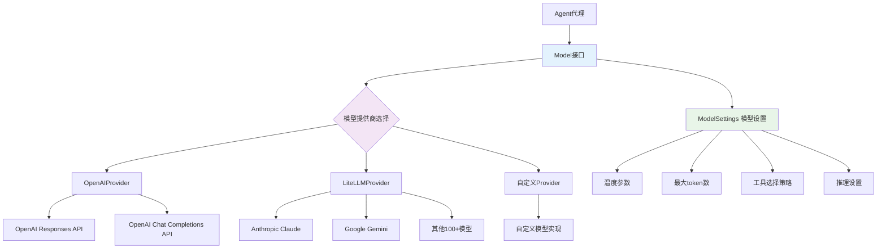

# OpenAI Agents SDK 模型抽象层分析

## 5.1 模型抽象层架构概览

模型抽象层是OpenAI Agents SDK的核心组件，负责统一不同模型提供商的API接口，实现"提供商无关性"的设计目标。该层主要包含：

- **接口定义层**: 定义统一的模型接口
- **提供商实现层**: 实现具体的模型调用逻辑
- **多提供商管理层**: 管理和选择不同的模型提供商
- **模型设置层**: 统一的模型参数配置

## 5.2 模型抽象架构图



## 5.3 Model接口定义详解

### 5.3.1 核心Model接口

```python
# 位于 src/agents/models/interface.py
from abc import ABC, abstractmethod
from typing import Any, AsyncIterator, Generic, TypeVar
from openai.types.responses import ResponsePromptParam

class Model(ABC):
    """
    模型的抽象基类，定义了所有模型实现必须遵循的接口
    
    这个接口使得框架可以支持不同的模型提供商，
    而代理层不需要关心具体的实现细节
    """
    
    @abstractmethod
    async def get_response(
        self,
        system_instructions: str | None,                    # 系统指令（系统提示）
        input: list[TResponseInputItem],                    # 输入消息列表
        model_settings: ModelSettings,                      # 模型设置参数
        tools: list[Tool],                                 # 可用工具列表
        output_schema: AgentOutputSchemaBase | None,        # 输出schema定义
        handoffs: list[Handoff],                           # 可切换的代理列表
        tracing: ModelTracing,                             # 追踪配置
        previous_response_id: str | None = None,           # 前一个响应ID (OpenAI专用)
        conversation_id: str | None = None,                # 对话ID (OpenAI专用)
        prompt: ResponsePromptParam | None = None,         # 提示参数 (OpenAI专用)
    ) -> ModelResponse:
        """
        获取模型响应的主要方法
        
        这是同步获取完整响应的方法，用于非流式场景
        """
        pass
    
    @abstractmethod
    async def stream_response(
        self,
        system_instructions: str | None,
        input: list[TResponseInputItem],
        model_settings: ModelSettings,
        tools: list[Tool],
        output_schema: AgentOutputSchemaBase | None,
        handoffs: list[Handoff],
        tracing: ModelTracing,
        previous_response_id: str | None = None,
        conversation_id: str | None = None, 
        prompt: ResponsePromptParam | None = None,
    ) -> AsyncIterator[ResponseEvent]:
        """
        流式获取模型响应的方法
        
        返回异步迭代器，可以实时获取模型输出事件
        """
        pass
    
    @property
    @abstractmethod
    def name(self) -> str:
        """模型名称标识符"""
        pass
```

### 5.3.2 ModelProvider接口

```python
# 位于 src/agents/models/interface.py
class ModelProvider(ABC):
    """
    模型提供商的抽象基类
    
    负责根据模型名称创建相应的Model实例
    支持模型名称的解析和路由
    """
    
    @abstractmethod
    def get_model(self, model_name: str | None) -> Model:
        """
        根据模型名称获取Model实例
        
        Args:
            model_name: 模型名称，如 "gpt-4", "claude-3.5-sonnet" 等
                       如果为None，应该返回默认模型
        
        Returns:
            Model: 对应的模型实现实例
            
        Raises:
            ValueError: 当模型名称不支持时
        """
        pass
    
    @abstractmethod
    def supports_model(self, model_name: str) -> bool:
        """
        检查是否支持指定的模型名称
        
        Args:
            model_name: 要检查的模型名称
            
        Returns:
            bool: 是否支持该模型
        """
        pass
```

### 5.3.3 ModelTracing追踪接口

```python
# 位于 src/agents/models/interface.py  
@dataclass
class ModelTracing:
    """
    模型调用追踪配置
    
    控制是否记录敏感数据和追踪状态
    """
    disabled: bool = False              # 是否禁用追踪
    include_sensitive_data: bool = True # 是否包含敏感数据
    
    def include_data(self) -> bool:
        """是否应该记录追踪数据"""
        return not self.disabled and self.include_sensitive_data
```

## 5.4 OpenAI模型实现分析

### 5.4.1 OpenAI Responses API实现

```python
# 位于 src/agents/models/openai_responses.py
class OpenAIResponsesModel(Model):
    """
    OpenAI Responses API的模型实现
    
    支持OpenAI最新的Responses API，提供更好的结构化输出
    和对话状态管理能力
    """
    
    def __init__(
        self,
        model_name: str,                           # 模型名称，如 "gpt-4"
        client: AsyncOpenAI | None = None,         # OpenAI客户端实例
    ):
        self._model_name = model_name
        self._client = client or _get_default_openai_client()
    
    async def get_response(
        self,
        system_instructions: str | None,
        input: list[TResponseInputItem], 
        model_settings: ModelSettings,
        tools: list[Tool],
        output_schema: AgentOutputSchemaBase | None,
        handoffs: list[Handoff],
        tracing: ModelTracing,
        previous_response_id: str | None = None,
        conversation_id: str | None = None,
        prompt: ResponsePromptParam | None = None,
    ) -> ModelResponse:
        """
        调用OpenAI Responses API获取完整响应
        
        实现流程:
        1. 准备API调用参数
        2. 转换工具和handoff为API格式
        3. 设置结构化输出schema
        4. 调用OpenAI API
        5. 解析和转换响应
        6. 记录追踪信息
        """
        
        # 1. 准备基本参数
        request_params = {
            "model": self._model_name,
            "messages": self._prepare_messages(system_instructions, input),
            **self._prepare_model_settings(model_settings),
        }
        
        # 2. 添加工具定义
        if tools:
            request_params["tools"] = [self._convert_tool(tool) for tool in tools]
        
        # 3. 添加handoff选项
        if handoffs:
            request_params["handoffs"] = [self._convert_handoff(h) for h in handoffs]
        
        # 4. 设置结构化输出
        if output_schema:
            request_params["response_format"] = output_schema.to_response_format()
        
        # 5. 设置对话状态参数
        if previous_response_id:
            request_params["previous_response_id"] = previous_response_id
        if conversation_id:
            request_params["conversation_id"] = conversation_id
        if prompt:
            request_params["prompt"] = prompt
            
        # 6. 开始追踪span
        with generation_span(
            model=self._model_name,
            provider="openai",
            input=request_params if tracing.include_data() else None,
        ) as span:
            try:
                # 7. 调用OpenAI API
                response = await self._client.responses.create(**request_params)
                
                # 8. 记录追踪信息
                if tracing.include_data():
                    span.span_data.output = response.model_dump()
                
                # 9. 转换响应格式
                return self._convert_response(response)
                
            except Exception as e:
                # 10. 错误处理和追踪
                error_data = {"error": str(e), "model": self._model_name}
                _error_tracing.attach_error_to_span(
                    span, 
                    SpanError(message="OpenAI API call failed", data=error_data)
                )
                raise
    
    def _prepare_messages(
        self, 
        system_instructions: str | None, 
        input: list[TResponseInputItem]
    ) -> list[dict]:
        """
        准备发送给OpenAI API的消息格式
        
        将框架内部的消息格式转换为OpenAI API要求的格式
        """
        messages = []
        
        # 添加系统消息
        if system_instructions:
            messages.append({
                "role": "system",
                "content": system_instructions
            })
        
        # 转换输入消息
        for item in input:
            if isinstance(item, dict):
                # 简单字典格式消息
                messages.append(item)
            else:
                # 复杂消息对象，需要转换
                messages.append(self._convert_input_item(item))
        
        return messages
    
    def _convert_response(self, response) -> ModelResponse:
        """
        将OpenAI API响应转换为框架内部格式
        
        提取使用情况、输出内容等信息
        """
        # 提取使用情况统计
        usage = Usage()
        if response.usage:
            usage = Usage(
                requests=1,
                input_tokens=response.usage.input_tokens,
                output_tokens=response.usage.output_tokens,
                total_tokens=response.usage.total_tokens,
                input_tokens_details=response.usage.input_tokens_details,
                output_tokens_details=response.usage.output_tokens_details,
            )
        
        # 构建ModelResponse对象
        return ModelResponse(
            output=response.output,        # 输出项目列表
            usage=usage,                   # 使用统计
            response_id=response.id,       # 响应ID
        )
```

### 5.4.2 OpenAI Chat Completions API实现

```python
# 位于 src/agents/models/openai_chatcompletions.py
class OpenAIChatCompletionsModel(Model):
    """
    OpenAI Chat Completions API的模型实现
    
    这是更传统的API，但兼容性更好，支持更多的模型
    """
    
    def __init__(
        self,
        model_name: str,
        client: AsyncOpenAI | None = None,
    ):
        self._model_name = model_name
        self._client = client or _get_default_openai_client()
    
    async def get_response(self, **kwargs) -> ModelResponse:
        """Chat Completions API调用实现"""
        
        # 1. 准备Chat Completions API参数
        chat_params = {
            "model": self._model_name,
            "messages": self._prepare_chat_messages(kwargs["system_instructions"], kwargs["input"]),
            "temperature": kwargs["model_settings"].temperature,
            "max_tokens": kwargs["model_settings"].max_tokens,
        }
        
        # 2. 处理工具调用（转换为functions格式）
        if kwargs["tools"]:
            chat_params["tools"] = [
                {
                    "type": "function", 
                    "function": self._convert_tool_to_function(tool)
                }
                for tool in kwargs["tools"]
            ]
            
            # 设置工具选择策略
            tool_choice = kwargs["model_settings"].tool_choice
            if tool_choice:
                chat_params["tool_choice"] = self._convert_tool_choice(tool_choice)
        
        # 3. 处理结构化输出（使用response_format）
        if kwargs["output_schema"]:
            chat_params["response_format"] = {
                "type": "json_schema",
                "json_schema": {
                    "name": kwargs["output_schema"].name(),
                    "schema": kwargs["output_schema"].json_schema(),
                    "strict": kwargs["output_schema"].strict_json_schema,
                }
            }
        
        # 4. 调用API
        with generation_span(model=self._model_name, provider="openai_chat") as span:
            try:
                response = await self._client.chat.completions.create(**chat_params)
                
                # 5. 转换响应格式
                return self._convert_chat_response(response)
                
            except Exception as e:
                _error_tracing.attach_error_to_span(span, SpanError(message=str(e)))
                raise
    
    def _convert_chat_response(self, response) -> ModelResponse:
        """
        将Chat Completions响应转换为框架格式
        
        需要处理message、tool_calls等不同类型的响应内容
        """
        choice = response.choices[0]
        message = choice.message
        
        # 转换为ResponseOutputItem列表
        output_items = []
        
        # 处理文本消息
        if message.content:
            output_items.append(
                ResponseOutputMessage(
                    id=f"msg_{response.id}",
                    content=[
                        ResponseOutputText(text=message.content, type="output_text")
                    ],
                    role="assistant",
                    status="completed",
                    type="message"
                )
            )
        
        # 处理工具调用
        if message.tool_calls:
            for tool_call in message.tool_calls:
                output_items.append(
                    ResponseOutputFunctionCall(
                        id=tool_call.id,
                        name=tool_call.function.name,
                        arguments=tool_call.function.arguments,
                        type="function_call"
                    )
                )
        
        # 构建使用统计
        usage = Usage()
        if response.usage:
            usage = Usage(
                requests=1,
                input_tokens=response.usage.prompt_tokens,
                output_tokens=response.usage.completion_tokens,
                total_tokens=response.usage.total_tokens,
            )
        
        return ModelResponse(
            output=output_items,
            usage=usage,
            response_id=response.id,
        )
```

## 5.5 LiteLLM集成实现

### 5.5.1 LiteLLM模型实现

```python
# 位于 src/agents/extensions/models/litellm_model.py
import litellm
from litellm.types.utils import ModelResponse as LiteLLMResponse

class LitellmModel(Model):
    """
    LiteLLM模型实现，支持100+种不同的LLM模型
    
    通过LiteLLM库，可以统一访问：
    - Anthropic Claude系列  
    - Google Gemini系列
    - Mistral系列
    - Cohere系列
    - 本地模型（Ollama等）
    - 以及更多提供商
    """
    
    def __init__(
        self,
        model_name: str,                    # LiteLLM模型名称，如 "claude-3.5-sonnet"
        api_key: str | None = None,         # API密钥
        base_url: str | None = None,        # 自定义API端点
        **litellm_kwargs,                   # 传递给LiteLLM的其他参数
    ):
        self._model_name = model_name
        self._api_key = api_key
        self._base_url = base_url
        self._litellm_kwargs = litellm_kwargs
    
    async def get_response(self, **kwargs) -> ModelResponse:
        """使用LiteLLM调用模型获取响应"""
        
        # 1. 准备LiteLLM调用参数
        litellm_params = {
            "model": self._model_name,
            "messages": self._prepare_litellm_messages(
                kwargs["system_instructions"], 
                kwargs["input"]
            ),
            **self._convert_model_settings(kwargs["model_settings"]),
            **self._litellm_kwargs,
        }
        
        # 2. 设置认证信息
        if self._api_key:
            litellm_params["api_key"] = self._api_key
        if self._base_url:
            litellm_params["base_url"] = self._base_url
        
        # 3. 处理工具调用（转换为LiteLLM格式）
        if kwargs["tools"]:
            litellm_params["tools"] = [
                self._convert_tool_for_litellm(tool) 
                for tool in kwargs["tools"]
            ]
            
            tool_choice = kwargs["model_settings"].tool_choice
            if tool_choice:
                litellm_params["tool_choice"] = tool_choice
        
        # 4. 处理结构化输出
        if kwargs["output_schema"]:
            # 不同的模型对结构化输出的支持方式不同
            if self._supports_native_json_schema():
                litellm_params["response_format"] = {
                    "type": "json_schema",
                    "json_schema": kwargs["output_schema"].json_schema()
                }
            else:
                # 对于不支持原生JSON schema的模型，使用提示工程
                schema_prompt = self._generate_schema_prompt(kwargs["output_schema"])
                litellm_params["messages"][-1]["content"] += f"\n\n{schema_prompt}"
        
        # 5. 调用LiteLLM
        with generation_span(model=self._model_name, provider="litellm") as span:
            try:
                response: LiteLLMResponse = await litellm.acompletion(**litellm_params)
                
                # 6. 转换响应格式
                return self._convert_litellm_response(response)
                
            except Exception as e:
                error_msg = f"LiteLLM call failed for model {self._model_name}: {str(e)}"
                _error_tracing.attach_error_to_span(
                    span, 
                    SpanError(message=error_msg, data={"model": self._model_name})
                )
                raise ModelBehaviorError(error_msg) from e
    
    def _supports_native_json_schema(self) -> bool:
        """检查模型是否支持原生JSON schema"""
        # OpenAI模型支持
        if self._model_name.startswith(("gpt-", "o1-")):
            return True
        # 其他模型通常不支持
        return False
    
    def _convert_litellm_response(self, response: LiteLLMResponse) -> ModelResponse:
        """将LiteLLM响应转换为框架内部格式"""
        choice = response.choices[0]
        message = choice.message
        
        output_items = []
        
        # 处理消息内容
        if message.content:
            output_items.append(
                ResponseOutputMessage(
                    id=f"litellm_{response.id}",
                    content=[ResponseOutputText(text=message.content, type="output_text")],
                    role="assistant", 
                    status="completed",
                    type="message"
                )
            )
        
        # 处理工具调用
        if hasattr(message, 'tool_calls') and message.tool_calls:
            for tool_call in message.tool_calls:
                output_items.append(
                    ResponseOutputFunctionCall(
                        id=tool_call.id,
                        name=tool_call.function.name,
                        arguments=tool_call.function.arguments,
                        type="function_call"
                    )
                )
        
        # 处理使用统计
        usage = Usage()
        if response.usage:
            usage = Usage(
                requests=1,
                input_tokens=getattr(response.usage, 'prompt_tokens', 0),
                output_tokens=getattr(response.usage, 'completion_tokens', 0),
                total_tokens=getattr(response.usage, 'total_tokens', 0),
            )
        
        return ModelResponse(
            output=output_items,
            usage=usage,
            response_id=response.id,
        )
```

## 5.6 多提供商管理器

### 5.6.1 MultiProvider实现

```python
# 位于 src/agents/models/multi_provider.py
class MultiProvider(ModelProvider):
    """
    多提供商管理器，根据模型名称自动选择合适的提供商
    
    支持的提供商优先级：
    1. OpenAI模型（gpt-*, o1-*, etc.）
    2. LiteLLM支持的模型
    3. 自定义注册的提供商
    """
    
    def __init__(self):
        self._custom_providers: dict[str, ModelProvider] = {}
        self._openai_provider = OpenAIProvider()
        self._litellm_provider: LiteLLMProvider | None = None
        
        # 尝试初始化LiteLLM提供商（如果可用）
        try:
            from .litellm_provider import LiteLLMProvider
            self._litellm_provider = LiteLLMProvider()
        except ImportError:
            logger.debug("LiteLLM not available, skipping LiteLLM provider")
    
    def register_provider(self, pattern: str, provider: ModelProvider) -> None:
        """
        注册自定义模型提供商
        
        Args:
            pattern: 模型名称匹配模式（支持glob语法）
            provider: 提供商实例
        """
        self._custom_providers[pattern] = provider
    
    def get_model(self, model_name: str | None) -> Model:
        """
        根据模型名称获取相应的Model实例
        
        查找顺序:
        1. 检查自定义提供商
        2. 检查OpenAI提供商  
        3. 检查LiteLLM提供商
        4. 抛出异常
        """
        if model_name is None:
            # 使用默认模型
            return self._openai_provider.get_model(None)
        
        # 1. 检查自定义提供商
        for pattern, provider in self._custom_providers.items():
            if fnmatch.fnmatch(model_name, pattern):
                return provider.get_model(model_name)
        
        # 2. 检查OpenAI提供商
        if self._openai_provider.supports_model(model_name):
            return self._openai_provider.get_model(model_name)
        
        # 3. 检查LiteLLM提供商
        if self._litellm_provider and self._litellm_provider.supports_model(model_name):
            return self._litellm_provider.get_model(model_name)
        
        # 4. 未找到支持的提供商
        raise ValueError(
            f"Unsupported model: {model_name}. "
            f"Supported providers: OpenAI, LiteLLM (if installed), custom providers"
        )
    
    def supports_model(self, model_name: str) -> bool:
        """检查是否支持指定的模型"""
        # 检查自定义提供商
        for pattern, provider in self._custom_providers.items():
            if fnmatch.fnmatch(model_name, pattern):
                return provider.supports_model(model_name)
        
        # 检查内置提供商
        if self._openai_provider.supports_model(model_name):
            return True
            
        if self._litellm_provider and self._litellm_provider.supports_model(model_name):
            return True
            
        return False
```

## 5.7 模型设置统一管理

### 5.7.1 ModelSettings类

```python
# 位于 src/agents/model_settings.py
@dataclass
class ModelSettings:
    """
    模型调用的统一设置类
    
    提供跨不同模型提供商的一致参数接口
    """
    
    # 基本生成参数
    temperature: float | None = None              # 温度参数 (0.0-2.0)
    max_tokens: int | None = None                # 最大生成token数
    top_p: float | None = None                   # 核采样参数
    frequency_penalty: float | None = None       # 频率惩罚
    presence_penalty: float | None = None        # 存在惩罚
    
    # 工具使用控制  
    tool_choice: Literal["auto", "required", "none"] | str | None = None  # 工具选择策略
    parallel_tool_calls: bool | None = None      # 是否允许并行工具调用
    
    # 高级功能
    reasoning: ReasoningSettings | None = None   # 推理设置（GPT-5等）
    logprobs: bool | None = None                # 是否返回对数概率
    top_logprobs: int | None = None             # 返回top-k对数概率
    
    # 安全和过滤
    user: str | None = None                     # 用户标识符
    
    def resolve(self, override_settings: ModelSettings | None) -> ModelSettings:
        """
        合并设置，override_settings中的非None值会覆盖当前设置
        
        Args:
            override_settings: 要覆盖的设置
            
        Returns:
            ModelSettings: 合并后的设置
        """
        if override_settings is None:
            return self
        
        # 使用dataclass的replace方法进行合并
        resolved_values = {}
        for field in fields(self):
            override_value = getattr(override_settings, field.name)
            if override_value is not None:
                resolved_values[field.name] = override_value
            else:
                resolved_values[field.name] = getattr(self, field.name)
        
        return ModelSettings(**resolved_values)

@dataclass
class ReasoningSettings:
    """
    推理模型的特殊设置（如GPT-5系列）
    """
    effort: Literal["low", "medium", "high"] | None = None  # 推理努力程度
```

## 5.8 模型选择和配置策略

### 5.8.1 默认模型管理

```python
# 位于 src/agents/models/default_models.py
def get_default_model_settings() -> ModelSettings:
    """
    获取默认的模型设置
    
    根据当前默认模型类型返回相应的设置
    """
    if is_gpt_5_default():
        # GPT-5系列的特殊设置
        return ModelSettings(
            temperature=1.0,
            reasoning=ReasoningSettings(effort="medium"),
            tool_choice="auto",
        )
    else:
        # 标准模型的默认设置
        return ModelSettings(
            temperature=0.7,
            max_tokens=4096,
            tool_choice="auto",
            parallel_tool_calls=True,
        )

def is_gpt_5_default() -> bool:
    """检查是否默认使用GPT-5系列模型"""
    default_model = os.getenv("OPENAI_DEFAULT_MODEL", "gpt-4.1")
    return gpt_5_reasoning_settings_required(default_model)

def gpt_5_reasoning_settings_required(model_name: str) -> bool:
    """检查模型是否需要推理设置"""
    gpt_5_patterns = ["gpt-5", "o1-", "o3-"]
    return any(model_name.startswith(pattern) for pattern in gpt_5_patterns)
```

这个模型抽象层为OpenAI Agents SDK提供了强大的"提供商无关性"能力，使得开发者可以轻松切换不同的模型提供商，同时保持一致的API体验。通过这种设计，框架能够支持从OpenAI的最新模型到各种开源模型的广泛选择。
