# OpenAIAgent-06-Guardrails

## 模块概览

## 1. 模块职责与边界

Guardrails 模块是 OpenAI Agents Python SDK 的安全防护核心，负责在智能代理执行过程中实施多层次的安全检查和内容过滤。该模块通过灵活的防护机制确保代理行为符合安全规范，保护系统和用户免受潜在风险。

### 核心职责

- **多层次防护**：提供输入、输出、工具等多个层面的安全检查
- **内容过滤**：检测和过滤不当内容、敏感信息、恶意输入
- **行为控制**：根据安全检查结果控制代理执行流程
- **异常处理**：处理安全违规情况，提供明确的错误信息
- **灵活配置**：支持自定义安全规则和检查逻辑
- **追踪集成**：与可观测性系统集成，记录安全事件

### 安全防护体系

| 防护层级 | 防护类型 | 触发时机 | 主要功能 |
|----------|----------|----------|----------|
| 代理级别 | `InputGuardrail` | 代理接收输入前 | 检查用户输入的安全性和合规性 |
| 代理级别 | `OutputGuardrail` | 代理生成输出后 | 验证最终输出的安全性 |
| 工具级别 | `ToolInputGuardrail` | 工具执行前 | 检查工具调用参数的安全性 |
| 工具级别 | `ToolOutputGuardrail` | 工具执行后 | 验证工具输出结果的安全性 |

### 安全行为策略

| 行为类型 | 行为标识 | 执行动作 | 使用场景 |
|----------|----------|----------|----------|
| 允许执行 | `allow` | 正常继续执行 | 内容通过安全检查 |
| 拒绝内容 | `reject_content` | 替换内容但继续执行 | 内容需要过滤但不严重 |
| 异常终止 | `raise_exception` | 抛出异常停止执行 | 严重安全违规 |

### 输入输出接口

**输入：**

- 检查内容（用户输入、代理输出、工具参数等）
- 执行上下文（`RunContextWrapper`、`ToolContext`）
- 代理实例（`Agent`）
- 配置参数

**输出：**

- 检查结果（`GuardrailResult`）
- 行为指令（`allow`、`reject_content`、`raise_exception`）
- 详细信息（检查过程、违规原因等）

### 上下游依赖关系

**上游调用者：**

- `RunImpl`：代理执行引擎集成安全检查
- `Agent`：代理配置中的安全防护规则
- `FunctionTool`：工具级别的安全检查

**下游依赖：**

- `exceptions`：安全违规异常定义
- `tracing`：安全事件追踪记录
- `run_context`：执行上下文信息
- `tool_context`：工具执行上下文

## 2. 模块架构图

```mermaid
flowchart TB
    subgraph "Guardrails 安全防护模块"
        subgraph "代理级防护"
            INPUTGUARD[InputGuardrail]
            OUTPUTGUARD[OutputGuardrail]
            INPUTRESULT[InputGuardrailResult]
            OUTPUTRESULT[OutputGuardrailResult]
        end
        
        subgraph "工具级防护"
            TOOLINPUTGUARD[ToolInputGuardrail]
            TOOLOUTPUTGUARD[ToolOutputGuardrail]
            TOOLINPUTRESULT[ToolInputGuardrailResult]
            TOOLOUTPUTRESULT[ToolOutputGuardrailResult]
        end
        
        subgraph "防护输出"
            GUARDRAILOUTPUT[GuardrailFunctionOutput]
            TOOLGUARDRAILOUTPUT[ToolGuardrailFunctionOutput]
        end
        
        subgraph "行为策略"
            ALLOWBEHAVIOR[AllowBehavior]
            REJECTBEHAVIOR[RejectContentBehavior]
            EXCEPTIONBEHAVIOR[RaiseExceptionBehavior]
        end
        
        subgraph "装饰器接口"
            INPUTDECORATOR[@input_guardrail]
            OUTPUTDECORATOR[@output_guardrail]
            TOOLINPUTDECORATOR[@tool_input_guardrail]
            TOOLOUTPUTDECORATOR[@tool_output_guardrail]
        end
        
        subgraph "数据容器"
            TOOLINPUTDATA[ToolInputGuardrailData]
            TOOLOUTPUTDATA[ToolOutputGuardrailData]
        end
    end
    
    subgraph "执行集成"
        RUNIMPL[执行引擎]
        AGENT[Agent 代理]
        FUNCTIONTOOL[FunctionTool 工具]
    end
    
    subgraph "支撑系统"
        EXCEPTIONS[exceptions 异常系统]
        TRACING[tracing 追踪系统]
        RUNCONTEXT[run_context 执行上下文]
        TOOLCONTEXT[tool_context 工具上下文]
    end
    
    INPUTGUARD --> INPUTRESULT
    OUTPUTGUARD --> OUTPUTRESULT
    TOOLINPUTGUARD --> TOOLINPUTRESULT
    TOOLOUTPUTGUARD --> TOOLOUTPUTRESULT
    
    INPUTRESULT --> GUARDRAILOUTPUT
    OUTPUTRESULT --> GUARDRAILOUTPUT
    TOOLINPUTRESULT --> TOOLGUARDRAILOUTPUT
    TOOLOUTPUTRESULT --> TOOLGUARDRAILOUTPUT
    
    TOOLGUARDRAILOUTPUT --> ALLOWBEHAVIOR
    TOOLGUARDRAILOUTPUT --> REJECTBEHAVIOR
    TOOLGUARDRAILOUTPUT --> EXCEPTIONBEHAVIOR
    
    INPUTDECORATOR --> INPUTGUARD
    OUTPUTDECORATOR --> OUTPUTGUARD
    TOOLINPUTDECORATOR --> TOOLINPUTGUARD
    TOOLOUTPUTDECORATOR --> TOOLOUTPUTGUARD
    
    TOOLINPUTGUARD --> TOOLINPUTDATA
    TOOLOUTPUTGUARD --> TOOLOUTPUTDATA
    
    RUNIMPL --> INPUTGUARD
    RUNIMPL --> OUTPUTGUARD
    AGENT --> INPUTGUARD
    AGENT --> OUTPUTGUARD
    FUNCTIONTOOL --> TOOLINPUTGUARD
    FUNCTIONTOOL --> TOOLOUTPUTGUARD
    
    INPUTGUARD --> EXCEPTIONS
    OUTPUTGUARD --> EXCEPTIONS
    TOOLINPUTGUARD --> EXCEPTIONS
    TOOLOUTPUTGUARD --> EXCEPTIONS
    
    INPUTGUARD --> TRACING
    OUTPUTGUARD --> TRACING
    TOOLINPUTGUARD --> TRACING
    TOOLOUTPUTGUARD --> TRACING
    
    INPUTGUARD --> RUNCONTEXT
    OUTPUTGUARD --> RUNCONTEXT
    TOOLINPUTGUARD --> TOOLCONTEXT
    TOOLOUTPUTGUARD --> TOOLCONTEXT
    
    style INPUTGUARD fill:#e1f5fe
    style TOOLINPUTGUARD fill:#f3e5f5
    style ALLOWBEHAVIOR fill:#e8f5e8
    style REJECTBEHAVIOR fill:#fff3e0
    style EXCEPTIONBEHAVIOR fill:#ffebee
```

**架构说明：**

### 分层防护设计

1. **代理级防护**：在代理输入输出层面进行安全检查
2. **工具级防护**：在具体工具执行层面进行精细化控制
3. **行为策略层**：定义安全检查后的执行策略
4. **装饰器接口**：提供简洁的函数装饰器接口

### 防护时机控制

- **输入防护**：在代理接收用户输入时触发
- **输出防护**：在代理生成最终输出时触发
- **工具输入防护**：在工具函数执行前触发
- **工具输出防护**：在工具函数执行后触发

### 集成点设计

- **执行引擎集成**：`RunImpl` 在关键节点调用防护检查
- **代理配置集成**：`Agent` 支持配置多个防护规则
- **工具集成**：`FunctionTool` 支持工具级的安全防护

### 扩展能力

- **自定义防护**：通过装饰器或直接实例化添加自定义规则
- **行为定制**：支持灵活的防护后行为策略
- **数据丰富**：防护结果可包含详细的检查信息

## 3. 关键算法与流程剖析

### 3.1 输入防护执行算法

```python
class InputGuardrail(Generic[TContext]):
    """输入防护的核心实现"""
    
    async def run(
        self,
        agent: Agent[Any],
        input: str | list[TResponseInputItem],
        context: RunContextWrapper[TContext],
    ) -> InputGuardrailResult:
        """执行输入安全检查"""
        
        # 1) 验证防护函数可调用
        if not callable(self.guardrail_function):
            raise UserError(f"Guardrail function must be callable, got {self.guardrail_function}")
        
        # 2) 调用防护函数，传递上下文、代理和输入
        output = self.guardrail_function(context, agent, input)
        
        # 3) 处理异步防护函数
        if inspect.isawaitable(output):
            return InputGuardrailResult(
                guardrail=self,
                output=await output,
            )
        
        # 4) 处理同步防护函数
        return InputGuardrailResult(
            guardrail=self,
            output=output,
        )
```

**算法目的：** 在代理处理用户输入前进行安全检查，确保输入内容符合安全规范。

**执行特点：**

1. **函数验证**：确保防护函数是可调用的
2. **上下文传递**：将完整的执行上下文传递给防护函数
3. **异步支持**：同时支持同步和异步防护函数
4. **结果封装**：将防护结果封装为结构化对象

### 3.2 工具防护执行算法

```python
async def _execute_input_guardrails(
    cls,
    *,
    func_tool: FunctionTool,
    tool_context: ToolContext[TContext],
    agent: Agent[TContext],
    tool_input_guardrail_results: list[ToolInputGuardrailResult],
) -> str | None:
    """工具输入防护执行算法"""
    
    if not func_tool.tool_input_guardrails:
        return None  # 无防护规则时直接通过
    
    # 遍历所有防护规则
    for guardrail in func_tool.tool_input_guardrails:
        # 1) 执行防护检查
        gr_out = await guardrail.run(
            ToolInputGuardrailData(
                context=tool_context,
                agent=agent,
            )
        )
        
        # 2) 记录防护结果
        tool_input_guardrail_results.append(
            ToolInputGuardrailResult(
                guardrail=guardrail,
                output=gr_out,
            )
        )
        
        # 3) 根据行为类型处理结果
        if gr_out.behavior["type"] == "raise_exception":
            # 抛出异常终止执行
            raise ToolInputGuardrailTripwireTriggered(guardrail=guardrail, output=gr_out)
        elif gr_out.behavior["type"] == "reject_content":
            # 拒绝内容但返回替代消息
            return gr_out.behavior["message"]
        elif gr_out.behavior["type"] == "allow":
            # 允许执行，继续下一个防护检查
            continue
    
    return None  # 所有检查通过
```

**算法目的：** 在工具执行前进行安全检查，根据检查结果决定是否允许工具执行。

**防护策略分析：**

1. **顺序检查**：按配置顺序执行每个防护规则
2. **结果记录**：记录所有防护检查的结果用于追踪
3. **行为分发**：根据防护结果选择相应的执行策略
4. **短路机制**：遇到异常或拒绝时立即返回

### 3.3 防护行为处理算法

```python
@dataclass
class ToolGuardrailFunctionOutput:
    """工具防护输出的行为处理"""
    
    @classmethod
    def allow(cls, output_info: Any = None) -> ToolGuardrailFunctionOutput:
        """创建允许执行的防护输出"""
        return cls(output_info=output_info, behavior=AllowBehavior(type="allow"))
    
    @classmethod
    def reject_content(cls, message: str, output_info: Any = None) -> ToolGuardrailFunctionOutput:
        """创建拒绝内容的防护输出"""
        return cls(
            output_info=output_info,
            behavior=RejectContentBehavior(type="reject_content", message=message),
        )
    
    @classmethod
    def raise_exception(cls, output_info: Any = None) -> ToolGuardrailFunctionOutput:
        """创建异常终止的防护输出"""
        return cls(
            output_info=output_info,
            behavior=RaiseExceptionBehavior(type="raise_exception"),
        )

# 使用示例
def content_safety_guardrail(data: ToolInputGuardrailData) -> ToolGuardrailFunctionOutput:
    """内容安全防护示例"""
    tool_input = data.tool_input
    
    # 检查敏感词汇
    sensitive_words = ["password", "secret", "token"]
    if any(word in str(tool_input).lower() for word in sensitive_words):
        return ToolGuardrailFunctionOutput.reject_content(
            message="输入包含敏感信息，已被过滤",
            output_info={"filtered_words": sensitive_words}
        )
    
    # 检查恶意代码
    malicious_patterns = ["rm -rf", "del /", "__import__"]
    if any(pattern in str(tool_input) for pattern in malicious_patterns):
        return ToolGuardrailFunctionOutput.raise_exception(
            output_info={"reason": "检测到潜在恶意代码"}
        )
    
    # 通过检查
    return ToolGuardrailFunctionOutput.allow(
        output_info={"check_status": "passed"}
    )
```

**算法目的：** 提供灵活的防护行为策略，支持不同严重程度的安全违规处理。

**行为策略特点：**

1. **分级处理**：根据违规严重程度选择不同处理方式
2. **信息保留**：记录详细的检查过程和结果信息
3. **用户友好**：拒绝内容时提供替代消息而非直接失败
4. **安全优先**：严重违规时立即终止执行保护系统

### 3.4 防护集成执行流程

```python
async def run_with_guardrails(
    agent: Agent[TContext],
    input: str | list[TResponseInputItem],
    context: RunContextWrapper[TContext]
) -> Any:
    """带防护的代理执行流程"""
    
    # 1) 执行输入防护
    if agent.input_guardrails:
        for guardrail in agent.input_guardrails:
            result = await guardrail.run(agent, input, context)
            
            if result.output.tripwire_triggered:
                raise InputGuardrailTripwireTriggered(
                    guardrail_name=guardrail.get_name(),
                    failure_reason="输入安全检查失败",
                    agent=agent
                )
    
    # 2) 执行代理主逻辑
    agent_output = await execute_agent_logic(agent, input, context)
    
    # 3) 执行输出防护
    if agent.output_guardrails:
        for guardrail in agent.output_guardrails:
            result = await guardrail.run(context, agent, agent_output)
            
            if result.output.tripwire_triggered:
                raise OutputGuardrailTripwireTriggered(
                    guardrail_name=guardrail.get_name(),
                    failure_reason="输出安全检查失败",
                    agent=agent
                )
    
    return agent_output
```

**流程目的：** 在代理执行的关键节点集成安全防护，确保全流程的安全性。

**集成策略要点：**

1. **前置检查**：在代理处理前检查输入安全性
2. **后置验证**：在输出生成后验证结果安全性
3. **异常处理**：安全违规时抛出明确的异常信息
4. **追踪集成**：记录所有防护检查过程用于审计

## 4. 数据结构与UML图

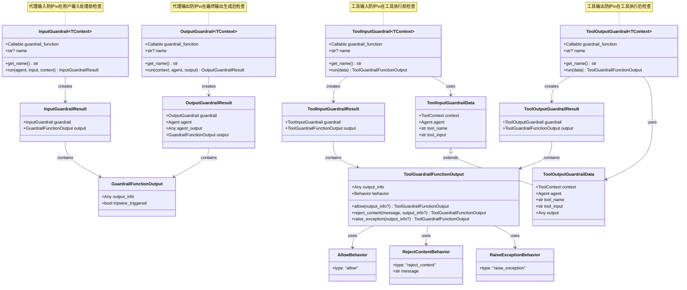
```mermaid
classDiagram
    class InputGuardrail~TContext~ {
        +Callable guardrail_function
        +str? name
        +get_name() str
        +run(agent, input, context) InputGuardrailResult
    }
    
    class OutputGuardrail~TContext~ {
        +Callable guardrail_function
        +str? name
        +get_name() str
        +run(context, agent, output) OutputGuardrailResult
    }
    
    class ToolInputGuardrail~TContext~ {
        +Callable guardrail_function
        +str? name
        +get_name() str
        +run(data) ToolGuardrailFunctionOutput
    }
    
    class ToolOutputGuardrail~TContext~ {
        +Callable guardrail_function
        +str? name
        +get_name() str
        +run(data) ToolGuardrailFunctionOutput
    }
    
    class GuardrailFunctionOutput {
        +Any output_info
        +bool tripwire_triggered
    }
    
    class ToolGuardrailFunctionOutput {
        +Any output_info
        +Behavior behavior
        +allow(output_info?) ToolGuardrailFunctionOutput
        +reject_content(message, output_info?) ToolGuardrailFunctionOutput
        +raise_exception(output_info?) ToolGuardrailFunctionOutput
    }
    
    class InputGuardrailResult {
        +InputGuardrail guardrail
        +GuardrailFunctionOutput output
    }
    
    class OutputGuardrailResult {
        +OutputGuardrail guardrail
        +Agent agent
        +Any agent_output
        +GuardrailFunctionOutput output
    }
    
    class ToolInputGuardrailResult {
        +ToolInputGuardrail guardrail
        +ToolGuardrailFunctionOutput output
    }
    
    class ToolOutputGuardrailResult {
        +ToolOutputGuardrail guardrail
        +ToolGuardrailFunctionOutput output
    }
    
    class AllowBehavior {
        +type: "allow"
    }
    
    class RejectContentBehavior {
        +type: "reject_content"
        +str message
    }
    
    class RaiseExceptionBehavior {
        +type: "raise_exception"
    }
    
    class ToolInputGuardrailData {
        +ToolContext context
        +Agent agent
        +str tool_name
        +str tool_input
    }
    
    class ToolOutputGuardrailData {
        +ToolContext context
        +Agent agent
        +str tool_name
        +str tool_input
        +Any output
    }
    
    InputGuardrail --> InputGuardrailResult : creates
    OutputGuardrail --> OutputGuardrailResult : creates
    ToolInputGuardrail --> ToolInputGuardrailResult : creates
    ToolOutputGuardrail --> ToolOutputGuardrailResult : creates
    
    InputGuardrailResult --> GuardrailFunctionOutput : contains
    OutputGuardrailResult --> GuardrailFunctionOutput : contains
    ToolInputGuardrailResult --> ToolGuardrailFunctionOutput : contains
    ToolOutputGuardrailResult --> ToolGuardrailFunctionOutput : contains
    
    ToolGuardrailFunctionOutput --> AllowBehavior : uses
    ToolGuardrailFunctionOutput --> RejectContentBehavior : uses
    ToolGuardrailFunctionOutput --> RaiseExceptionBehavior : uses
    
    ToolInputGuardrail --> ToolInputGuardrailData : uses
    ToolOutputGuardrail --> ToolOutputGuardrailData : uses
    
    ToolInputGuardrailData <|-- ToolOutputGuardrailData : extends
    
    note for InputGuardrail "代理输入防护\n在用户输入处理前检查"
    note for OutputGuardrail "代理输出防护\n在最终输出生成后检查"
    note for ToolInputGuardrail "工具输入防护\n在工具执行前检查"
    note for ToolOutputGuardrail "工具输出防护\n在工具执行后检查"
```

**类图说明：**

### 防护类型层次

1. **代理级防护**：`InputGuardrail` 和 `OutputGuardrail` 处理代理层面的安全检查
2. **工具级防护**：`ToolInputGuardrail` 和 `ToolOutputGuardrail` 处理工具层面的安全检查
3. **结果封装**：各种 `Result` 类封装防护检查的完整结果
4. **行为策略**：三种行为类型定义防护后的执行策略

### 数据流转关系

- **防护执行**：防护类调用防护函数，生成防护输出
- **结果包装**：防护输出被包装为结果对象，包含上下文信息
- **行为决策**：根据防护输出中的行为策略决定后续执行
- **数据传递**：工具防护使用专门的数据容器传递执行信息

### 扩展性设计

- **泛型支持**：所有防护类都支持泛型上下文类型
- **函数接口**：防护逻辑通过函数接口实现，便于自定义
- **装饰器包装**：提供装饰器接口简化防护规则的定义

## 5. 典型使用场景时序图

### 场景一：代理输入防护检查

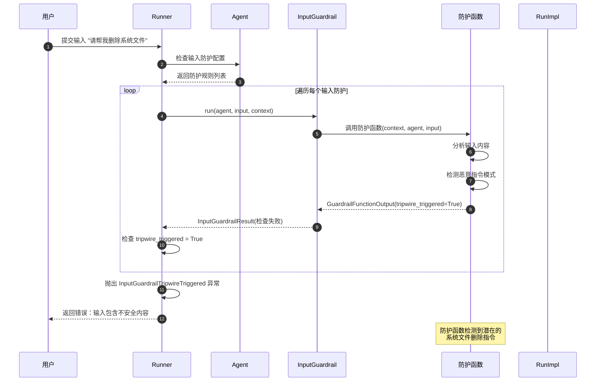
```mermaid
sequenceDiagram
    autonumber
    participant User as 用户
    participant Runner as Runner
    participant Agent as Agent
    participant InputGuard as InputGuardrail
    participant GuardFunc as 防护函数
    participant RunImpl as RunImpl
    
    User->>Runner: 提交输入 "请帮我删除系统文件"
    Runner->>Agent: 检查输入防护配置
    Agent-->>Runner: 返回防护规则列表
    
    loop 遍历每个输入防护
        Runner->>InputGuard: run(agent, input, context)
        InputGuard->>GuardFunc: 调用防护函数(context, agent, input)
        
        GuardFunc->>GuardFunc: 分析输入内容
        GuardFunc->>GuardFunc: 检测恶意指令模式
        GuardFunc-->>InputGuard: GuardrailFunctionOutput(tripwire_triggered=True)
        
        InputGuard-->>Runner: InputGuardrailResult(检查失败)
        Runner->>Runner: 检查 tripwire_triggered = True
    end
    
    Runner->>Runner: 抛出 InputGuardrailTripwireTriggered 异常
    Runner-->>User: 返回错误：输入包含不安全内容
    
    note over GuardFunc: 防护函数检测到潜在的<br/>系统文件删除指令
```

### 场景二：工具执行防护流程

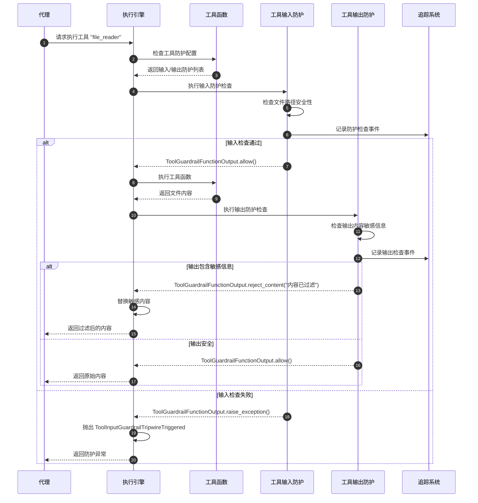
```mermaid
sequenceDiagram
    autonumber
    participant Agent as 代理
    participant RunImpl as 执行引擎
    participant Tool as 工具函数
    participant InputGuard as 工具输入防护
    participant OutputGuard as 工具输出防护
    participant Tracing as 追踪系统
    
    Agent->>RunImpl: 请求执行工具 "file_reader"
    RunImpl->>Tool: 检查工具防护配置
    Tool-->>RunImpl: 返回输入/输出防护列表
    
    RunImpl->>InputGuard: 执行输入防护检查
    InputGuard->>InputGuard: 检查文件路径安全性
    InputGuard->>Tracing: 记录防护检查事件
    
    alt 输入检查通过
        InputGuard-->>RunImpl: ToolGuardrailFunctionOutput.allow()
        RunImpl->>Tool: 执行工具函数
        Tool-->>RunImpl: 返回文件内容
        
        RunImpl->>OutputGuard: 执行输出防护检查
        OutputGuard->>OutputGuard: 检查输出内容敏感信息
        OutputGuard->>Tracing: 记录输出检查事件
        
        alt 输出包含敏感信息
            OutputGuard-->>RunImpl: ToolGuardrailFunctionOutput.reject_content("内容已过滤")
            RunImpl->>RunImpl: 替换敏感内容
            RunImpl-->>Agent: 返回过滤后的内容
        else 输出安全
            OutputGuard-->>RunImpl: ToolGuardrailFunctionOutput.allow()
            RunImpl-->>Agent: 返回原始内容
        end
        
    else 输入检查失败
        InputGuard-->>RunImpl: ToolGuardrailFunctionOutput.raise_exception()
        RunImpl->>RunImpl: 抛出 ToolInputGuardrailTripwireTriggered
        RunImpl-->>Agent: 返回防护异常
    end
```

### 场景三：多层防护协同工作

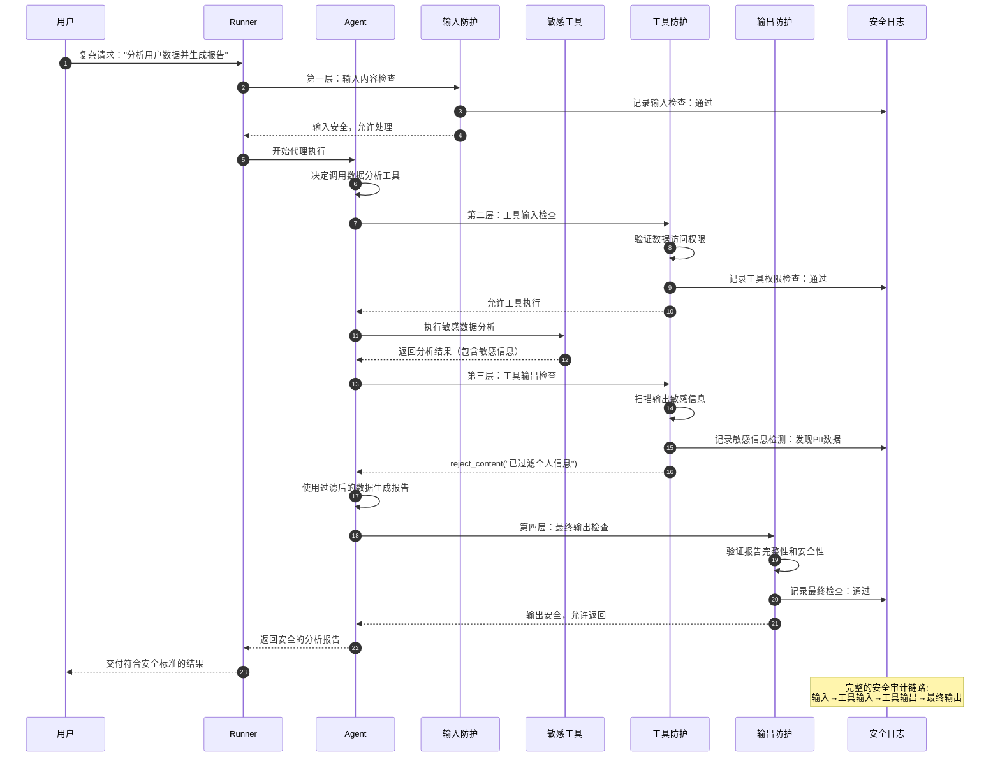
```mermaid
sequenceDiagram
    autonumber
    participant User as 用户
    participant Runner as Runner
    participant Agent as Agent
    participant InputGuard as 输入防护
    participant Tool as 敏感工具
    participant ToolGuard as 工具防护
    participant OutputGuard as 输出防护
    participant Logger as 安全日志
    
    User->>Runner: 复杂请求："分析用户数据并生成报告"
    
    Runner->>InputGuard: 第一层：输入内容检查
    InputGuard->>Logger: 记录输入检查：通过
    InputGuard-->>Runner: 输入安全，允许处理
    
    Runner->>Agent: 开始代理执行
    Agent->>Agent: 决定调用数据分析工具
    
    Agent->>ToolGuard: 第二层：工具输入检查
    ToolGuard->>ToolGuard: 验证数据访问权限
    ToolGuard->>Logger: 记录工具权限检查：通过
    ToolGuard-->>Agent: 允许工具执行
    
    Agent->>Tool: 执行敏感数据分析
    Tool-->>Agent: 返回分析结果（包含敏感信息）
    
    Agent->>ToolGuard: 第三层：工具输出检查
    ToolGuard->>ToolGuard: 扫描输出敏感信息
    ToolGuard->>Logger: 记录敏感信息检测：发现PII数据
    ToolGuard-->>Agent: reject_content("已过滤个人信息")
    
    Agent->>Agent: 使用过滤后的数据生成报告
    Agent->>OutputGuard: 第四层：最终输出检查
    OutputGuard->>OutputGuard: 验证报告完整性和安全性
    OutputGuard->>Logger: 记录最终检查：通过
    OutputGuard-->>Agent: 输出安全，允许返回
    
    Agent-->>Runner: 返回安全的分析报告
    Runner-->>User: 交付符合安全标准的结果
    
    note over Logger: 完整的安全审计链路:<br/>输入→工具输入→工具输出→最终输出
```

## 6. 最佳实践与使用模式

### 6.1 输入内容安全防护

```python
from agents import Agent, input_guardrail
import re

@input_guardrail
def content_safety_check(context, agent, user_input):
    """综合内容安全检查"""
    input_text = str(user_input).lower()
    
    # 1. 检查恶意指令
    malicious_patterns = [
        r'rm\s+-rf',           # 删除命令
        r'del\s+/[sq]',        # Windows删除
        r'format\s+c:',        # 格式化硬盘
        r'shutdown\s+',        # 关机命令
        r'__import__\s*\(',    # Python导入
    ]
    
    for pattern in malicious_patterns:
        if re.search(pattern, input_text):
            return GuardrailFunctionOutput(
                output_info={"detected_pattern": pattern, "risk_level": "high"},
                tripwire_triggered=True
            )
    
    # 2. 检查敏感信息
    sensitive_patterns = [
        r'\b\d{4}[\s-]?\d{4}[\s-]?\d{4}[\s-]?\d{4}\b',  # 信用卡号
        r'\b\d{3}-\d{2}-\d{4}\b',                        # 社会安全号
        r'[a-zA-Z0-9._%+-]+@[a-zA-Z0-9.-]+\.[a-zA-Z]{2,}',  # 邮箱地址
    ]
    
    detected_sensitive = []
    for pattern in sensitive_patterns:
        matches = re.findall(pattern, input_text)
        if matches:
            detected_sensitive.extend(matches)
    
    if detected_sensitive:
        return GuardrailFunctionOutput(
            output_info={
                "sensitive_data": detected_sensitive,
                "warning": "输入包含敏感信息"
            },
            tripwire_triggered=True
        )
    
    # 3. 检查内容长度
    if len(input_text) > 10000:
        return GuardrailFunctionOutput(
            output_info={"input_length": len(input_text), "max_allowed": 10000},
            tripwire_triggered=True
        )
    
    # 通过所有检查
    return GuardrailFunctionOutput(
        output_info={"status": "safe", "checks_passed": ["malicious", "sensitive", "length"]},
        tripwire_triggered=False
    )

# 使用安全防护的代理
secure_agent = Agent(
    name="SecureAssistant",
    instructions="你是一个安全的AI助手，严格遵守安全规范。",
    input_guardrails=[content_safety_check]
)
```

### 6.2 输出内容过滤防护

```python
from agents import output_guardrail
import json

@output_guardrail
def output_content_filter(context, agent, agent_output):
    """输出内容过滤和净化"""
    output_text = str(agent_output)
    
    # 1. 敏感信息过滤
    import re
    
    # 过滤信用卡号
    output_text = re.sub(
        r'\b\d{4}[\s-]?\d{4}[\s-]?\d{4}[\s-]?\d{4}\b',
        '[CREDIT_CARD_REDACTED]',
        output_text
    )
    
    # 过滤电话号码
    output_text = re.sub(
        r'\b\d{3}[-.]?\d{3}[-.]?\d{4}\b',
        '[PHONE_REDACTED]',
        output_text
    )
    
    # 过滤IP地址
    output_text = re.sub(
        r'\b(?:\d{1,3}\.){3}\d{1,3}\b',
        '[IP_REDACTED]',
        output_text
    )
    
    # 2. 检查是否包含不当内容
    inappropriate_keywords = [
        "violence", "hate", "discrimination",
        "illegal", "harmful", "dangerous"
    ]
    
    found_inappropriate = [
        word for word in inappropriate_keywords
        if word in output_text.lower()
    ]
    
    if found_inappropriate:
        return GuardrailFunctionOutput(
            output_info={
                "inappropriate_content": found_inappropriate,
                "action": "content_blocked"
            },
            tripwire_triggered=True
        )
    
    # 3. 检查输出质量
    if len(output_text.strip()) < 10:
        return GuardrailFunctionOutput(
            output_info={"issue": "output_too_short", "length": len(output_text)},
            tripwire_triggered=True
        )
    
    # 输出安全且经过过滤
    return GuardrailFunctionOutput(
        output_info={
            "filtered": output_text != str(agent_output),
            "quality_check": "passed"
        },
        tripwire_triggered=False
    )

# 应用输出过滤
filtered_agent = Agent(
    name="FilteredAssistant",
    instructions="提供有用信息，确保输出安全。",
    output_guardrails=[output_content_filter]
)
```

### 6.3 工具级精细化防护

```python
from agents import function_tool, tool_input_guardrail, tool_output_guardrail

@tool_input_guardrail
def file_access_guardrail(data):
    """文件访问工具的输入防护"""
    tool_input = json.loads(data.tool_input) if data.tool_input else {}
    file_path = tool_input.get("file_path", "")
    
    # 1. 路径安全检查
    if ".." in file_path or file_path.startswith("/"):
        return ToolGuardrailFunctionOutput.raise_exception(
            output_info={"reason": "路径遍历攻击检测", "path": file_path}
        )
    
    # 2. 文件类型白名单
    allowed_extensions = [".txt", ".json", ".csv", ".md", ".log"]
    if not any(file_path.endswith(ext) for ext in allowed_extensions):
        return ToolGuardrailFunctionOutput.reject_content(
            message=f"不允许访问该类型文件：{file_path}",
            output_info={"allowed_extensions": allowed_extensions}
        )
    
    # 3. 文件大小预检查
    import os
    if os.path.exists(file_path) and os.path.getsize(file_path) > 10 * 1024 * 1024:  # 10MB
        return ToolGuardrailFunctionOutput.reject_content(
            message="文件过大，拒绝访问",
            output_info={"file_size": os.path.getsize(file_path), "max_size": 10*1024*1024}
        )
    
    return ToolGuardrailFunctionOutput.allow(
        output_info={"security_check": "passed", "file_path": file_path}
    )

@tool_output_guardrail
def file_content_filter(data):
    """文件内容输出防护"""
    output_content = str(data.output)
    
    # 1. 敏感信息检测
    sensitive_patterns = {
        "api_key": r'api[_-]?key\s*[:=]\s*["\']?([a-zA-Z0-9_-]+)["\']?',
        "password": r'password\s*[:=]\s*["\']?([^"\'\s]+)["\']?',
        "token": r'token\s*[:=]\s*["\']?([a-zA-Z0-9_.-]+)["\']?',
    }
    
    detected_secrets = {}
    filtered_content = output_content
    
    for secret_type, pattern in sensitive_patterns.items():
        matches = re.findall(pattern, output_content, re.IGNORECASE)
        if matches:
            detected_secrets[secret_type] = len(matches)
            filtered_content = re.sub(pattern, f'{secret_type.upper()}_REDACTED', filtered_content, flags=re.IGNORECASE)
    
    # 2. 如果检测到敏感信息，返回过滤后的内容
    if detected_secrets:
        return ToolGuardrailFunctionOutput.reject_content(
            message=filtered_content,
            output_info={
                "secrets_detected": detected_secrets,
                "action": "content_filtered"
            }
        )
    
    # 3. 内容长度控制
    if len(output_content) > 50000:  # 50KB
        truncated_content = output_content[:50000] + "\n[内容已截断...]"
        return ToolGuardrailFunctionOutput.reject_content(
            message=truncated_content,
            output_info={"reason": "content_truncated", "original_length": len(output_content)}
        )
    
    return ToolGuardrailFunctionOutput.allow(
        output_info={"content_check": "passed", "length": len(output_content)}
    )

@function_tool(
    tool_input_guardrails=[file_access_guardrail],
    tool_output_guardrails=[file_content_filter]
)
def secure_file_reader(file_path: str) -> str:
    """安全的文件读取工具"""
    try:
        with open(file_path, 'r', encoding='utf-8') as f:
            return f.read()
    except Exception as e:
        return f"文件读取失败：{str(e)}"
```

### 6.4 多层次防护策略配置

```python
from agents import Agent, Runner, RunConfig

class SecurityConfig:
    """安全配置管理类"""
    
    @staticmethod
    def create_high_security_agent(name: str, instructions: str) -> Agent:
        """创建高安全级别的代理"""
        
        # 严格的输入防护
        @input_guardrail
        def strict_input_check(context, agent, user_input):
            # 实现严格的输入检查逻辑
            return content_safety_check(context, agent, user_input)
        
        # 严格的输出防护  
        @output_guardrail
        def strict_output_check(context, agent, agent_output):
            # 实现严格的输出检查逻辑
            return output_content_filter(context, agent, agent_output)
        
        return Agent(
            name=name,
            instructions=instructions,
            input_guardrails=[strict_input_check],
            output_guardrails=[strict_output_check],
            tools=[secure_file_reader]  # 只使用安全工具
        )
    
    @staticmethod
    def create_medium_security_agent(name: str, instructions: str) -> Agent:
        """创建中等安全级别的代理"""
        
        @input_guardrail
        def basic_input_check(context, agent, user_input):
            # 基础输入检查
            input_text = str(user_input)
            if len(input_text) > 5000:
                return GuardrailFunctionOutput(
                    output_info={"reason": "input_too_long"},
                    tripwire_triggered=True
                )
            return GuardrailFunctionOutput(
                output_info={"status": "ok"},
                tripwire_triggered=False
            )
        
        return Agent(
            name=name,
            instructions=instructions,
            input_guardrails=[basic_input_check]
        )

# 使用示例
security_config = SecurityConfig()

# 高安全级别代理（用于敏感场景）
high_security_agent = security_config.create_high_security_agent(
    name="SecureAssistant",
    instructions="你是一个高安全级别的助手，严格遵守所有安全规范。"
)

# 中等安全级别代理（用于一般场景）
medium_security_agent = security_config.create_medium_security_agent(
    name="RegularAssistant",
    instructions="你是一个常规助手，提供有用的信息。"
)

# 全局安全配置
secure_run_config = RunConfig(
    input_guardrails=[content_safety_check],
    output_guardrails=[output_content_filter]
)

# 执行时应用安全配置
async def secure_execution_example():
    """安全执行示例"""
    try:
        result = await Runner.run(
            high_security_agent,
            "帮我分析这个文件的内容",
            run_config=secure_run_config
        )
        print(f"安全执行结果：{result.final_output}")
        
    except InputGuardrailTripwireTriggered as e:
        print(f"输入安全检查失败：{e.failure_reason}")
    except OutputGuardrailTripwireTriggered as e:
        print(f"输出安全检查失败：{e.failure_reason}")
    except Exception as e:
        print(f"其他错误：{e}")

asyncio.run(secure_execution_example())
```

Guardrails模块通过多层次、多策略的安全防护机制，为OpenAI Agents提供了全面的安全保障，确保智能代理系统在各种场景下都能安全可控地运行。

---

## API接口

## 1. API 总览

Guardrails 模块提供了输入输出验证和工具级安全控制机制。通过防护栏，开发者可以在Agent执行前后进行检查，确保系统安全和合规。

### API 分类

| API 类别 | 核心 API | 功能描述 |
|---------|---------|---------|
| **Agent级防护** | `@input_guardrail` | 装饰器，创建输入防护 |
| | `@output_guardrail` | 装饰器，创建输出防护 |
| | `InputGuardrail.run()` | 执行输入检查 |
| | `OutputGuardrail.run()` | 执行输出检查 |
| **Tool级防护** | `@tool_input_guardrail` | 装饰器，创建工具输入防护 |
| | `@tool_output_guardrail` | 装饰器，创建工具输出防护 |
| | `ToolInputGuardrail.run()` | 执行工具输入检查 |
| | `ToolOutputGuardrail.run()` | 执行工具输出检查 |
| **行为控制** | `ToolGuardrailFunctionOutput.allow()` | 允许继续执行 |
| | `ToolGuardrailFunctionOutput.reject_content()` | 拒绝但继续 |
| | `ToolGuardrailFunctionOutput.raise_exception()` | 抛出异常终止 |

## 2. Agent级防护 API

### 2.1 @input_guardrail - 输入防护装饰器

**API 签名：**

```python
@input_guardrail
def my_guardrail(
    context: RunContextWrapper[TContext],
    agent: Agent,
    input: str | list[TResponseInputItem]
) -> GuardrailFunctionOutput:
    ...

# 或带参数
@input_guardrail(name="custom_name")
async def my_async_guardrail(...) -> GuardrailFunctionOutput:
    ...
```

**功能描述：**
将函数转换为输入防护栏，在Agent执行时并行运行，用于检查输入是否符合要求。

**参数说明：**

| 参数 | 类型 | 说明 |
|------|------|------|
| `context` | `RunContextWrapper[TContext]` | 运行上下文，包含自定义数据 |
| `agent` | `Agent` | 当前执行的Agent |
| `input` | `str \| list[TResponseInputItem]` | 用户输入内容 |

**返回结构：**

```python
@dataclass
class GuardrailFunctionOutput:
    output_info: Any  # 检查结果信息
    tripwire_triggered: bool  # 是否触发熔断
```

**使用示例：**

```python
from agents import input_guardrail, GuardrailFunctionOutput, Agent

# 1. 基础用法 - 主题检查
@input_guardrail
def check_on_topic(context, agent, input):
    """检查输入是否偏离主题"""
    user_text = input if isinstance(input, str) else input[-1].get("content", "")
    
    off_topic_keywords = ["politics", "religion", "adult"]
    is_off_topic = any(kw in user_text.lower() for kw in off_topic_keywords)
    
    if is_off_topic:
        return GuardrailFunctionOutput(
            output_info={"reason": "Off-topic detected"},
            tripwire_triggered=True  # 终止执行
        )
    
    return GuardrailFunctionOutput(
        output_info={"status": "ok"},
        tripwire_triggered=False
    )

# 2. 异步防护 - API调用检查
@input_guardrail(name="content_moderation")
async def moderate_content(context, agent, input):
    """使用外部API进行内容审核"""
    import httpx
    
    text = input if isinstance(input, str) else str(input)
    
    async with httpx.AsyncClient() as client:
        response = await client.post(
            "https://moderation-api.com/check",
            json={"text": text}
        )
        result = response.json()
    
    if result["flagged"]:
        return GuardrailFunctionOutput(
            output_info=result,
            tripwire_triggered=True
        )
    
    return GuardrailFunctionOutput(
        output_info={"safe": True},
        tripwire_triggered=False
    )

# 3. 上下文相关检查
@input_guardrail
def check_user_quota(context, agent, input):
    """检查用户配额"""
    user_id = context.get("user_id")
    quota = context.get("quota_service").get_remaining_quota(user_id)
    
    if quota <= 0:
        return GuardrailFunctionOutput(
            output_info={"quota": 0, "user_id": user_id},
            tripwire_triggered=True
        )
    
    return GuardrailFunctionOutput(
        output_info={"quota": quota},
        tripwire_triggered=False
    )

# 在Agent中使用
agent = Agent(
    name="SafeAgent",
    instructions="你是一个安全的助手",
    input_guardrails=[
        check_on_topic,
        moderate_content,
        check_user_quota
    ]
)
```

### 2.2 @output_guardrail - 输出防护装饰器

**API 签名：**

```python
@output_guardrail
def my_guardrail(
    context: RunContextWrapper[TContext],
    agent: Agent,
    agent_output: Any
) -> GuardrailFunctionOutput:
    ...
```

**功能描述：**
在Agent执行完成后检查输出是否符合要求，用于验证响应质量和合规性。

**参数说明：**

| 参数 | 类型 | 说明 |
|------|------|------|
| `context` | `RunContextWrapper[TContext]` | 运行上下文 |
| `agent` | `Agent` | 执行的Agent |
| `agent_output` | `Any` | Agent的输出结果 |

**使用示例：**

```python
from agents import output_guardrail, GuardrailFunctionOutput

# 1. 输出长度检查
@output_guardrail
def check_output_length(context, agent, agent_output):
    """确保输出不超过限制"""
    max_length = context.get("max_output_length", 1000)
    output_text = str(agent_output)
    
    if len(output_text) > max_length:
        return GuardrailFunctionOutput(
            output_info={"length": len(output_text), "max": max_length},
            tripwire_triggered=True
        )
    
    return GuardrailFunctionOutput(
        output_info={"length": len(output_text)},
        tripwire_triggered=False
    )

# 2. 敏感信息检测
@output_guardrail
def check_pii_leakage(context, agent, agent_output):
    """检测是否泄露个人信息"""
    import re
    
    output_text = str(agent_output)
    
    # 检测邮箱、手机号等
    email_pattern = r'\b[A-Za-z0-9._%+-]+@[A-Za-z0-9.-]+\.[A-Z|a-z]{2,}\b'
    phone_pattern = r'\b\d{3}-\d{3}-\d{4}\b'
    
    if re.search(email_pattern, output_text) or re.search(phone_pattern, output_text):
        return GuardrailFunctionOutput(
            output_info={"pii_detected": True},
            tripwire_triggered=True
        )
    
    return GuardrailFunctionOutput(
        output_info={"pii_detected": False},
        tripwire_triggered=False
    )

# 3. 结构化输出验证
@output_guardrail
def validate_json_schema(context, agent, agent_output):
    """验证JSON输出格式"""
    import json
    from jsonschema import validate, ValidationError
    
    expected_schema = context.get("output_schema")
    if not expected_schema:
        return GuardrailFunctionOutput(output_info={}, tripwire_triggered=False)
    
    try:
        if isinstance(agent_output, str):
            output_data = json.loads(agent_output)
        else:
            output_data = agent_output
        
        validate(instance=output_data, schema=expected_schema)
        
        return GuardrailFunctionOutput(
            output_info={"valid": True},
            tripwire_triggered=False
        )
    except (json.JSONDecodeError, ValidationError) as e:
        return GuardrailFunctionOutput(
            output_info={"error": str(e)},
            tripwire_triggered=True
        )

# 在Agent中使用
agent = Agent(
    name="ValidatedAgent",
    instructions="输出JSON格式的结果",
    output_guardrails=[
        check_output_length,
        check_pii_leakage,
        validate_json_schema
    ]
)
```

## 3. Tool级防护 API

### 3.1 @tool_input_guardrail - 工具输入防护

**API 签名：**

```python
@tool_input_guardrail
def my_tool_guardrail(data: ToolInputGuardrailData) -> ToolGuardrailFunctionOutput:
    ...
```

**功能描述：**
在工具函数执行前检查参数是否合法，支持更细粒度的安全控制。

**参数说明：**

```python
@dataclass
class ToolInputGuardrailData:
    context: ToolContext  # 工具上下文（包含args, call_id等）
    agent: Agent  # 当前Agent
```

**返回结构：**

```python
@dataclass
class ToolGuardrailFunctionOutput:
    output_info: Any  # 检查信息
    behavior: AllowBehavior | RejectContentBehavior | RaiseExceptionBehavior
```

**使用示例：**

```python
from agents import tool_input_guardrail, ToolGuardrailFunctionOutput, function_tool

# 1. 参数范围检查
@tool_input_guardrail
def validate_file_path(data):
    """验证文件路径安全性"""
    args = data.context.args
    file_path = args.get("path", "")
    
    # 不允许访问系统目录
    forbidden_paths = ["/etc", "/sys", "/proc", "C:\\Windows"]
    if any(file_path.startswith(fp) for fp in forbidden_paths):
        return ToolGuardrailFunctionOutput.reject_content(
            message="Access to system directories is not allowed",
            output_info={"blocked_path": file_path}
        )
    
    # 不允许路径遍历
    if ".." in file_path:
        return ToolGuardrailFunctionOutput.raise_exception(
            output_info={"reason": "Path traversal detected"}
        )
    
    return ToolGuardrailFunctionOutput.allow(
        output_info={"path": file_path, "safe": True}
    )

# 2. 权限检查
@tool_input_guardrail
async def check_user_permission(data):
    """检查用户是否有权限执行此工具"""
    tool_name = data.context.tool_name
    user_id = data.agent.context.get("user_id")
    
    # 异步查询权限数据库
    has_permission = await permission_service.check(user_id, tool_name)
    
    if not has_permission:
        return ToolGuardrailFunctionOutput.reject_content(
            message=f"User {user_id} does not have permission to use {tool_name}",
            output_info={"user_id": user_id, "tool": tool_name}
        )
    
    return ToolGuardrailFunctionOutput.allow()

# 3. 参数值验证
@tool_input_guardrail
def validate_amount(data):
    """验证金额参数"""
    args = data.context.args
    amount = args.get("amount", 0)
    
    if amount <= 0:
        return ToolGuardrailFunctionOutput.reject_content(
            message="Amount must be positive",
            output_info={"amount": amount}
        )
    
    if amount > 10000:
        return ToolGuardrailFunctionOutput.reject_content(
            message="Amount exceeds maximum limit of 10000",
            output_info={"amount": amount, "max": 10000}
        )
    
    return ToolGuardrailFunctionOutput.allow()

# 在工具中使用
@function_tool(
    input_guardrails=[validate_file_path]
)
def read_file(path: str) -> str:
    """读取文件内容"""
    with open(path, 'r') as f:
        return f.read()

@function_tool(
    input_guardrails=[check_user_permission, validate_amount]
)
async def transfer_money(amount: float, to_account: str) -> dict:
    """转账操作"""
    # 实际转账逻辑
    return {"status": "success", "amount": amount}
```

### 3.2 @tool_output_guardrail - 工具输出防护

**API 签名：**

```python
@tool_output_guardrail
def my_tool_output_guardrail(data: ToolOutputGuardrailData) -> ToolGuardrailFunctionOutput:
    ...
```

**参数说明：**

```python
@dataclass
class ToolOutputGuardrailData:
    context: ToolContext  # 工具上下文
    agent: Agent  # 当前Agent
    output: Any  # 工具的输出结果
```

**使用示例：**

```python
from agents import tool_output_guardrail, ToolGuardrailFunctionOutput

# 1. 输出大小限制
@tool_output_guardrail
def limit_output_size(data):
    """限制工具输出大小"""
    output = data.output
    output_str = str(output)
    
    max_size = 10000  # 10KB
    if len(output_str) > max_size:
        return ToolGuardrailFunctionOutput.reject_content(
            message=f"Tool output too large ({len(output_str)} bytes), truncated",
            output_info={"size": len(output_str), "max": max_size}
        )
    
    return ToolGuardrailFunctionOutput.allow()

# 2. 敏感数据过滤
@tool_output_guardrail
def filter_sensitive_data(data):
    """过滤输出中的敏感信息"""
    import re
    
    output = str(data.output)
    
    # 替换信用卡号
    output = re.sub(r'\d{4}-\d{4}-\d{4}-\d{4}', '[CARD_NUMBER]', output)
    # 替换API密钥
    output = re.sub(r'sk-[a-zA-Z0-9]{32,}', '[API_KEY]', output)
    
    return ToolGuardrailFunctionOutput.allow(
        output_info={"filtered": True, "output": output}
    )

# 3. 结果验证
@tool_output_guardrail
def validate_api_response(data):
    """验证API响应格式"""
    output = data.output
    
    if not isinstance(output, dict):
        return ToolGuardrailFunctionOutput.reject_content(
            message="Invalid API response format",
            output_info={"type": type(output).__name__}
        )
    
    required_fields = ["status", "data"]
    missing_fields = [f for f in required_fields if f not in output]
    
    if missing_fields:
        return ToolGuardrailFunctionOutput.reject_content(
            message=f"Missing required fields: {missing_fields}",
            output_info={"missing": missing_fields}
        )
    
    return ToolGuardrailFunctionOutput.allow()

# 在工具中使用
@function_tool(
    output_guardrails=[limit_output_size, filter_sensitive_data]
)
async def fetch_user_data(user_id: str) -> dict:
    """获取用户数据"""
    # API调用
    return {"user_id": user_id, "credit_card": "1234-5678-9012-3456"}
```

## 4. 行为控制 API

### 4.1 ToolGuardrailFunctionOutput 工厂方法

**allow() - 允许继续**

```python
@classmethod
def allow(cls, output_info: Any = None) -> ToolGuardrailFunctionOutput:
    """允许工具正常执行"""
```

**reject_content() - 拒绝但继续**

```python
@classmethod
def reject_content(
    cls,
    message: str,
    output_info: Any = None
) -> ToolGuardrailFunctionOutput:
    """拒绝工具调用/输出，但继续执行，向模型返回message"""
```

**raise_exception() - 抛出异常**

```python
@classmethod
def raise_exception(cls, output_info: Any = None) -> ToolGuardrailFunctionOutput:
    """抛出异常，终止整个执行流程"""
```

**使用示例：**

```python
@tool_input_guardrail
def security_check(data):
    """三种行为模式示例"""
    args = data.context.args
    action = args.get("action")
    
    # 1. 允许：安全操作
    if action in ["read", "list"]:
        return ToolGuardrailFunctionOutput.allow(
            output_info={"action": action, "safe": True}
        )
    
    # 2. 拒绝但继续：可疑操作，让模型重新思考
    if action in ["write", "update"]:
        return ToolGuardrailFunctionOutput.reject_content(
            message=f"Action '{action}' requires additional confirmation",
            output_info={"action": action, "requires_confirmation": True}
        )
    
    # 3. 抛出异常：危险操作，立即终止
    if action in ["delete", "drop"]:
        return ToolGuardrailFunctionOutput.raise_exception(
            output_info={"action": action, "reason": "Dangerous operation blocked"}
        )
    
    return ToolGuardrailFunctionOutput.allow()
```

## 5. 异常处理

### 5.1 防护异常类型

```python
# Agent级防护异常
class InputGuardrailTripwireTriggered(Exception):
    """输入防护熔断触发"""
    pass

class OutputGuardrailTripwireTriggered(Exception):
    """输出防护熔断触发"""
    pass

# Tool级防护异常
class ToolGuardrailTripwireTriggered(Exception):
    """工具防护熔断触发"""
    pass
```

**处理示例：**

```python
from agents import run, InputGuardrailTripwireTriggered

try:
    result = await run(agent, "危险输入内容")
except InputGuardrailTripwireTriggered as e:
    print(f"输入防护触发: {e}")
    # 记录日志、通知管理员等
```

## 6. 最佳实践

### 6.1 分层防护策略

```python
# Layer 1: Agent级输入防护（粗粒度）
@input_guardrail
def basic_content_filter(context, agent, input):
    """基础内容过滤"""
    # 检查明显的违规内容
    pass

# Layer 2: Agent级输出防护（结果验证）
@output_guardrail
def validate_output_quality(context, agent, output):
    """验证输出质量"""
    # 检查输出是否符合标准
    pass

# Layer 3: Tool级输入防护（细粒度）
@tool_input_guardrail
def validate_tool_params(data):
    """验证工具参数"""
    # 针对特定工具的参数检查
    pass

# Layer 4: Tool级输出防护（数据清洗）
@tool_output_guardrail
def sanitize_tool_output(data):
    """清洗工具输出"""
    # 过滤敏感信息
    pass
```

### 6.2 性能优化

```python
# 使用缓存避免重复检查
from functools import lru_cache

@input_guardrail
def cached_moderation(context, agent, input):
    """使用缓存的内容审核"""
    
    @lru_cache(maxsize=1000)
    def check_content(text_hash):
        # 实际的审核逻辑
        return moderate_api_call(text_hash)
    
    import hashlib
    text = str(input)
    text_hash = hashlib.md5(text.encode()).hexdigest()
    
    result = check_content(text_hash)
    return GuardrailFunctionOutput(
        output_info=result,
        tripwire_triggered=result.get("flagged", False)
    )
```

### 6.3 监控和日志

```python
import logging

@tool_input_guardrail
def monitored_guardrail(data):
    """带监控的防护栏"""
    start_time = time.time()
    
    try:
        # 执行检查逻辑
        result = perform_check(data)
        
        # 记录成功
        logging.info(f"Guardrail passed for tool {data.context.tool_name}")
        
        return result
    except Exception as e:
        # 记录失败
        logging.error(f"Guardrail failed: {e}")
        raise
    finally:
        # 记录执行时间
        duration = time.time() - start_time
        logging.debug(f"Guardrail execution time: {duration:.3f}s")
```

Guardrails 模块通过灵活的防护机制和多层次的安全控制，为 OpenAI Agents 提供了强大的安全保障能力。

---

## 数据结构

## 1. 数据结构总览

Guardrails 模块的数据结构定义了防护栏的输入输出格式、检查结果和行为控制。核心数据结构包括防护栏定义、执行结果和行为策略。

### 数据结构层次

```
Agent级防护
├── InputGuardrail (输入防护)
│   ├── guardrail_function
│   └── name
├── OutputGuardrail (输出防护)
│   ├── guardrail_function
│   └── name
└── GuardrailFunctionOutput (结果)
    ├── output_info
    └── tripwire_triggered

Tool级防护
├── ToolInputGuardrail (工具输入防护)
├── ToolOutputGuardrail (工具输出防护)
└── ToolGuardrailFunctionOutput (结果)
    ├── output_info
    └── behavior (allow/reject/raise)
```

## 2. Agent级防护数据结构

### 2.1 InputGuardrail 类

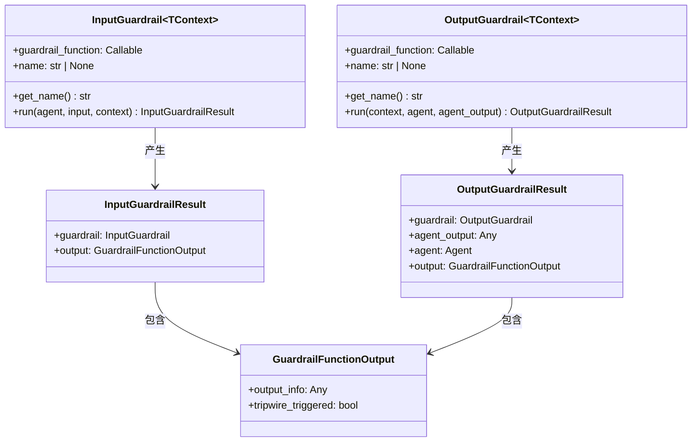
```mermaid
classDiagram
    class InputGuardrail~TContext~ {
        +guardrail_function: Callable
        +name: str | None
        +get_name() str
        +run(agent, input, context) InputGuardrailResult
    }
    
    class OutputGuardrail~TContext~ {
        +guardrail_function: Callable
        +name: str | None
        +get_name() str
        +run(context, agent, agent_output) OutputGuardrailResult
    }
    
    class GuardrailFunctionOutput {
        +output_info: Any
        +tripwire_triggered: bool
    }
    
    class InputGuardrailResult {
        +guardrail: InputGuardrail
        +output: GuardrailFunctionOutput
    }
    
    class OutputGuardrailResult {
        +guardrail: OutputGuardrail
        +agent_output: Any
        +agent: Agent
        +output: GuardrailFunctionOutput
    }
    
    InputGuardrail --> InputGuardrailResult : 产生
    OutputGuardrail --> OutputGuardrailResult : 产生
    InputGuardrailResult --> GuardrailFunctionOutput : 包含
    OutputGuardrailResult --> GuardrailFunctionOutput : 包含
```

**InputGuardrail 字段详解：**

| 字段 | 类型 | 说明 | 示例 |
|------|------|------|------|
| `guardrail_function` | `Callable` | 防护函数，接收上下文、Agent和输入 | `func(ctx, agent, input)` |
| `name` | `str \| None` | 防护栏名称，用于追踪 | `"content_moderation"` |

**方法说明：**

```python
def get_name(self) -> str:
    """获取防护栏名称，优先使用name字段，否则使用函数名"""
    if self.name:
        return self.name
    return self.guardrail_function.__name__

async def run(
    self,
    agent: Agent,
    input: str | list[TResponseInputItem],
    context: RunContextWrapper[TContext]
) -> InputGuardrailResult:
    """执行防护检查"""
    output = self.guardrail_function(context, agent, input)
    if inspect.isawaitable(output):
        output = await output
    
    return InputGuardrailResult(
        guardrail=self,
        output=output
    )
```

### 2.2 GuardrailFunctionOutput 结构

```python
@dataclass
class GuardrailFunctionOutput:
    """防护函数的输出"""
    
    output_info: Any
    """检查结果的详细信息，可以是任意类型的数据"""
    
    tripwire_triggered: bool
    """是否触发熔断，True时终止Agent执行"""
```

**字段说明：**

| 字段 | 类型 | 用途 | 示例值 |
|------|------|------|--------|
| `output_info` | `Any` | 存储检查的详细结果 | `{"reason": "off-topic", "score": 0.95}` |
| `tripwire_triggered` | `bool` | 决定是否终止执行 | `True` = 终止, `False` = 继续 |

**使用模式：**

```python
# 模式1: 通过检查
GuardrailFunctionOutput(
    output_info={"status": "ok", "checks_passed": 5},
    tripwire_triggered=False
)

# 模式2: 触发熔断
GuardrailFunctionOutput(
    output_info={"reason": "inappropriate_content", "severity": "high"},
    tripwire_triggered=True
)

# 模式3: 带详细分析
GuardrailFunctionOutput(
    output_info={
        "moderation_scores": {
            "toxicity": 0.1,
            "profanity": 0.05,
            "threat": 0.02
        },
        "flagged_categories": []
    },
    tripwire_triggered=False
)
```

### 2.3 InputGuardrailResult 和 OutputGuardrailResult

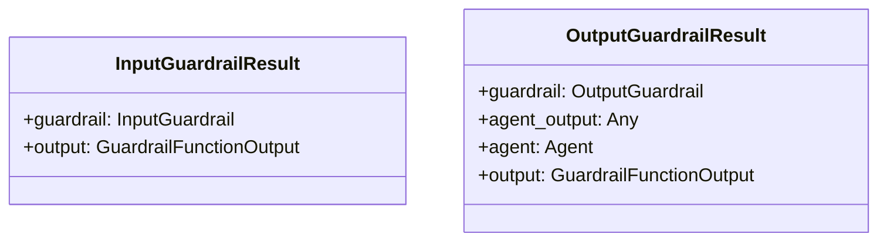
```mermaid
classDiagram
    class InputGuardrailResult {
        +guardrail: InputGuardrail
        +output: GuardrailFunctionOutput
    }
    
    class OutputGuardrailResult {
        +guardrail: OutputGuardrail
        +agent_output: Any
        +agent: Agent
        +output: GuardrailFunctionOutput
    }
```

**InputGuardrailResult 字段：**

| 字段 | 类型 | 说明 |
|------|------|------|
| `guardrail` | `InputGuardrail` | 执行的防护栏对象 |
| `output` | `GuardrailFunctionOutput` | 防护函数的输出 |

**OutputGuardrailResult 字段：**

| 字段 | 类型 | 说明 |
|------|------|------|
| `guardrail` | `OutputGuardrail` | 执行的防护栏对象 |
| `agent_output` | `Any` | 被检查的Agent输出 |
| `agent` | `Agent` | 执行的Agent |
| `output` | `GuardrailFunctionOutput` | 防护函数的输出 |

## 3. Tool级防护数据结构

### 3.1 ToolInputGuardrail 和 ToolOutputGuardrail

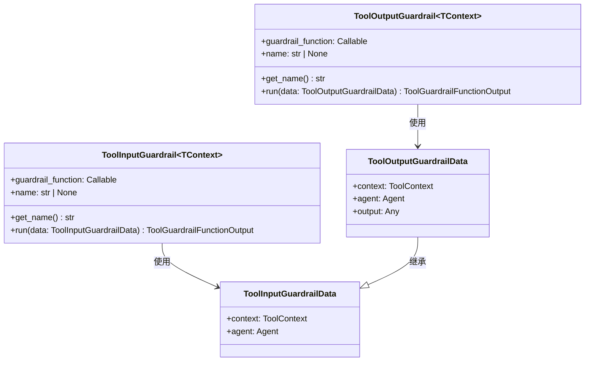
```mermaid
classDiagram
    class ToolInputGuardrail~TContext~ {
        +guardrail_function: Callable
        +name: str | None
        +get_name() str
        +run(data: ToolInputGuardrailData) ToolGuardrailFunctionOutput
    }
    
    class ToolOutputGuardrail~TContext~ {
        +guardrail_function: Callable
        +name: str | None
        +get_name() str
        +run(data: ToolOutputGuardrailData) ToolGuardrailFunctionOutput
    }
    
    class ToolInputGuardrailData {
        +context: ToolContext
        +agent: Agent
    }
    
    class ToolOutputGuardrailData {
        +context: ToolContext
        +agent: Agent
        +output: Any
    }
    
    ToolInputGuardrail --> ToolInputGuardrailData : 使用
    ToolOutputGuardrail --> ToolOutputGuardrailData : 使用
    ToolOutputGuardrailData --|> ToolInputGuardrailData : 继承
```

**字段说明：**

| 字段 | 类型 | 说明 |
|------|------|------|
| `guardrail_function` | `Callable` | 防护逻辑函数 |
| `name` | `str \| None` | 防护栏名称 |

### 3.2 ToolInputGuardrailData 和 ToolOutputGuardrailData

```python
@dataclass
class ToolInputGuardrailData:
    """工具输入防护数据"""
    
    context: ToolContext[Any]
    """工具上下文，包含工具名称、参数、调用ID等"""
    
    agent: Agent[Any]
    """执行工具的Agent"""

@dataclass
class ToolOutputGuardrailData(ToolInputGuardrailData):
    """工具输出防护数据（扩展输入数据）"""
    
    output: Any
    """工具函数的输出结果"""
```

**ToolContext 结构：**

```python
class ToolContext:
    tool_name: str  # 工具名称
    call_id: str  # 工具调用ID
    args: dict  # 工具参数
    # 其他上下文信息
```

**使用示例：**

```python
# 在防护函数中访问数据
@tool_input_guardrail
def check_file_access(data: ToolInputGuardrailData):
    tool_name = data.context.tool_name
    file_path = data.context.args.get("path")
    user_id = data.agent.context.get("user_id")
    
    # 执行检查逻辑
    ...

@tool_output_guardrail
def filter_output(data: ToolOutputGuardrailData):
    original_output = data.output
    tool_name = data.context.tool_name
    
    # 过滤输出
    ...
```

### 3.3 ToolGuardrailFunctionOutput 结构

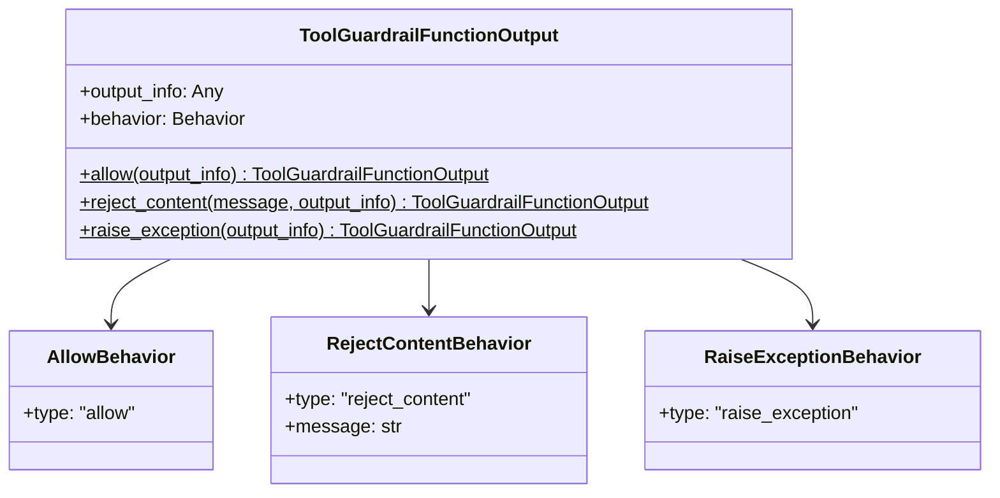
```mermaid
classDiagram
    class ToolGuardrailFunctionOutput {
        +output_info: Any
        +behavior: Behavior
        +allow(output_info) ToolGuardrailFunctionOutput$
        +reject_content(message, output_info) ToolGuardrailFunctionOutput$
        +raise_exception(output_info) ToolGuardrailFunctionOutput$
    }
    
    class AllowBehavior {
        +type: "allow"
    }
    
    class RejectContentBehavior {
        +type: "reject_content"
        +message: str
    }
    
    class RaiseExceptionBehavior {
        +type: "raise_exception"
    }
    
    ToolGuardrailFunctionOutput --> AllowBehavior
    ToolGuardrailFunctionOutput --> RejectContentBehavior
    ToolGuardrailFunctionOutput --> RaiseExceptionBehavior
```

**字段详解：**

| 字段 | 类型 | 说明 |
|------|------|------|
| `output_info` | `Any` | 检查结果详情 |
| `behavior` | `Behavior` | 行为策略（allow/reject/raise） |

### 3.4 行为策略类型

```python
class AllowBehavior(TypedDict):
    """允许工具正常执行"""
    type: Literal["allow"]

class RejectContentBehavior(TypedDict):
    """拒绝工具调用，但继续执行"""
    type: Literal["reject_content"]
    message: str  # 返回给模型的消息

class RaiseExceptionBehavior(TypedDict):
    """抛出异常，终止执行"""
    type: Literal["raise_exception"]
```

**行为策略对比：**

| 策略 | 行为 | 使用场景 | 对执行的影响 |
|------|------|---------|------------|
| `allow` | 允许继续 | 检查通过 | 无影响，正常执行 |
| `reject_content` | 拒绝但继续 | 参数不合法，但可恢复 | 向模型返回错误消息，继续对话 |
| `raise_exception` | 抛出异常 | 严重安全问题 | 终止整个运行流程 |

**工厂方法使用：**

```python
# 方法1: 允许
ToolGuardrailFunctionOutput.allow(
    output_info={"status": "ok"}
)

# 方法2: 拒绝但继续
ToolGuardrailFunctionOutput.reject_content(
    message="Parameter 'amount' must be positive",
    output_info={"amount": -100, "valid": False}
)

# 方法3: 抛出异常
ToolGuardrailFunctionOutput.raise_exception(
    output_info={"reason": "Unauthorized file access"}
)
```

## 4. 防护结果数据结构

### 4.1 ToolInputGuardrailResult 和 ToolOutputGuardrailResult

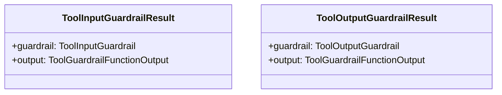
```mermaid
classDiagram
    class ToolInputGuardrailResult {
        +guardrail: ToolInputGuardrail
        +output: ToolGuardrailFunctionOutput
    }
    
    class ToolOutputGuardrailResult {
        +guardrail: ToolOutputGuardrail
        +output: ToolGuardrailFunctionOutput
    }
```

**字段说明：**

| 结果类型 | 字段 | 类型 | 说明 |
|---------|------|------|------|
| **Input** | `guardrail` | `ToolInputGuardrail` | 执行的防护栏 |
| | `output` | `ToolGuardrailFunctionOutput` | 检查结果 |
| **Output** | `guardrail` | `ToolOutputGuardrail` | 执行的防护栏 |
| | `output` | `ToolGuardrailFunctionOutput` | 检查结果 |

## 5. 数据流转图

### 5.1 Agent级防护数据流

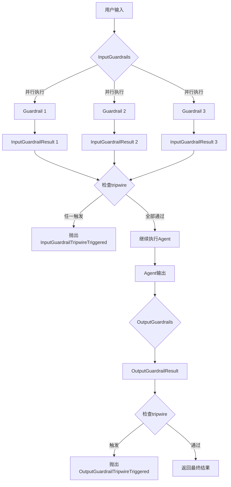
```mermaid
graph TD
    A[用户输入] --> B{InputGuardrails}
    B -->|并行执行| C1[Guardrail 1]
    B -->|并行执行| C2[Guardrail 2]
    B -->|并行执行| C3[Guardrail 3]
    
    C1 --> D1[InputGuardrailResult 1]
    C2 --> D2[InputGuardrailResult 2]
    C3 --> D3[InputGuardrailResult 3]
    
    D1 --> E{检查tripwire}
    D2 --> E
    D3 --> E
    
    E -->|任一触发| F[抛出InputGuardrailTripwireTriggered]
    E -->|全部通过| G[继续执行Agent]
    
    G --> H[Agent输出]
    H --> I{OutputGuardrails}
    
    I --> J[OutputGuardrailResult]
    J --> K{检查tripwire}
    
    K -->|触发| L[抛出OutputGuardrailTripwireTriggered]
    K -->|通过| M[返回最终结果]
```

### 5.2 Tool级防护数据流

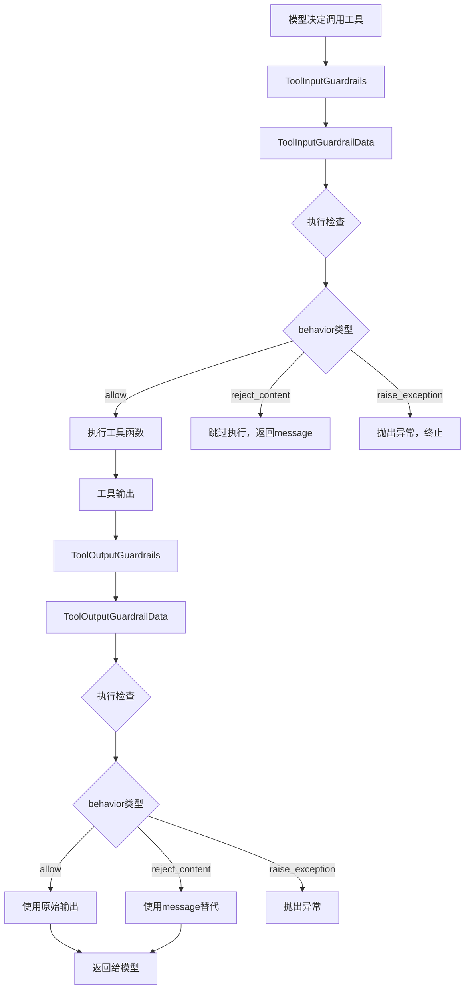
```mermaid
graph TD
    A[模型决定调用工具] --> B[ToolInputGuardrails]
    B --> C[ToolInputGuardrailData]
    C --> D{执行检查}
    
    D --> E{behavior类型}
    
    E -->|allow| F[执行工具函数]
    E -->|reject_content| G[跳过执行，返回message]
    E -->|raise_exception| H[抛出异常，终止]
    
    F --> I[工具输出]
    I --> J[ToolOutputGuardrails]
    J --> K[ToolOutputGuardrailData]
    K --> L{执行检查}
    
    L --> M{behavior类型}
    M -->|allow| N[使用原始输出]
    M -->|reject_content| O[使用message替代]
    M -->|raise_exception| P[抛出异常]
    
    N --> Q[返回给模型]
    O --> Q
```

## 6. 完整的数据结构关系图

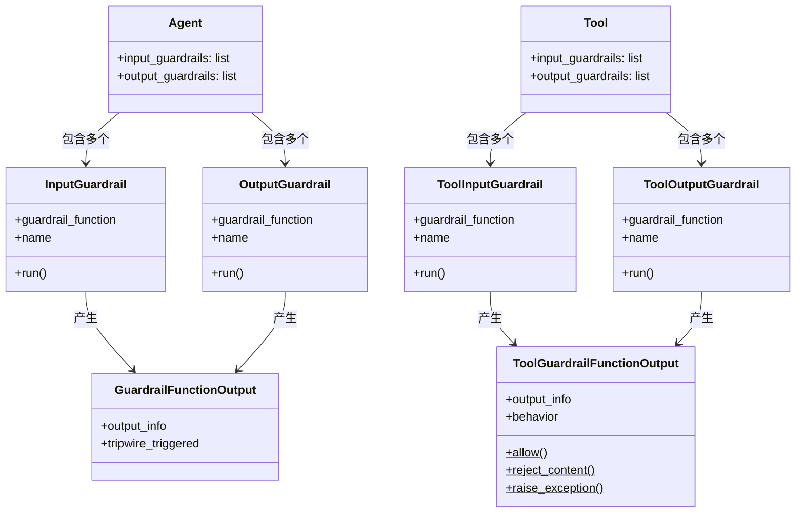
```mermaid
classDiagram
    class Agent {
        +input_guardrails: list
        +output_guardrails: list
    }
    
    class Tool {
        +input_guardrails: list
        +output_guardrails: list
    }
    
    class InputGuardrail {
        +guardrail_function
        +name
        +run()
    }
    
    class OutputGuardrail {
        +guardrail_function
        +name
        +run()
    }
    
    class ToolInputGuardrail {
        +guardrail_function
        +name
        +run()
    }
    
    class ToolOutputGuardrail {
        +guardrail_function
        +name
        +run()
    }
    
    class GuardrailFunctionOutput {
        +output_info
        +tripwire_triggered
    }
    
    class ToolGuardrailFunctionOutput {
        +output_info
        +behavior
        +allow()$
        +reject_content()$
        +raise_exception()$
    }
    
    Agent --> InputGuardrail : 包含多个
    Agent --> OutputGuardrail : 包含多个
    Tool --> ToolInputGuardrail : 包含多个
    Tool --> ToolOutputGuardrail : 包含多个
    
    InputGuardrail --> GuardrailFunctionOutput : 产生
    OutputGuardrail --> GuardrailFunctionOutput : 产生
    ToolInputGuardrail --> ToolGuardrailFunctionOutput : 产生
    ToolOutputGuardrail --> ToolGuardrailFunctionOutput : 产生
```

## 7. 最佳实践的数据结构模式

### 7.1 结构化检查结果

```python
# 模式1: 简单布尔结果
GuardrailFunctionOutput(
    output_info=None,
    tripwire_triggered=False
)

# 模式2: 带评分的结果
GuardrailFunctionOutput(
    output_info={
        "score": 0.85,
        "threshold": 0.9,
        "passed": True
    },
    tripwire_triggered=False
)

# 模式3: 详细的多维度检查
GuardrailFunctionOutput(
    output_info={
        "checks": {
            "length": {"passed": True, "value": 150, "max": 200},
            "toxicity": {"passed": True, "score": 0.1, "threshold": 0.5},
            "pii": {"passed": False, "detected": ["email"]}
        },
        "overall_passed": False
    },
    tripwire_triggered=True
)
```

### 7.2 行为策略组合

```python
# 场景1: 分级响应
@tool_input_guardrail
def tiered_security_check(data):
    risk_level = assess_risk(data)
    
    if risk_level == "low":
        return ToolGuardrailFunctionOutput.allow()
    elif risk_level == "medium":
        return ToolGuardrailFunctionOutput.reject_content(
            message="请提供额外验证",
            output_info={"risk": "medium"}
        )
    else:  # high
        return ToolGuardrailFunctionOutput.raise_exception(
            output_info={"risk": "high", "blocked": True}
        )
```

Guardrails 模块的数据结构通过清晰的层次设计和灵活的行为控制，为 OpenAI Agents 提供了完善的安全防护机制。

---

## 时序图

## 1. 时序图总览

Guardrails 模块的时序图展示了防护栏在Agent和Tool执行过程中的介入时机和处理流程。核心流程包括：输入防护、输出防护、工具防护和异常处理。

### 主要时序流程

| 时序流程 | 参与者 | 触发时机 | 核心操作 |
|---------|--------|---------|---------|
| **输入防护执行** | Runner, InputGuardrails | Agent执行前 | 并行检查输入 |
| **输出防护执行** | Runner, OutputGuardrails | Agent执行后 | 验证输出质量 |
| **工具输入防护** | Runner, ToolInputGuardrails | 工具调用前 | 验证工具参数 |
| **工具输出防护** | Runner, ToolOutputGuardrails | 工具执行后 | 过滤工具输出 |

## 2. Agent级输入防护时序图

### 2.1 输入防护并行执行流程

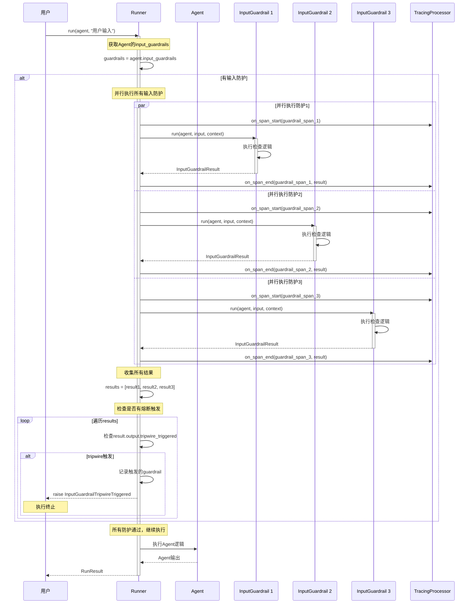
```mermaid
sequenceDiagram
    participant U as 用户
    participant R as Runner
    participant A as Agent
    participant IG1 as InputGuardrail 1
    participant IG2 as InputGuardrail 2
    participant IG3 as InputGuardrail 3
    participant T as TracingProcessor
    
    U->>R: run(agent, "用户输入")
    activate R
    
    Note over R: 获取Agent的input_guardrails
    R->>R: guardrails = agent.input_guardrails
    
    alt 有输入防护
        Note over R: 并行执行所有输入防护
        
        par 并行执行防护1
            R->>T: on_span_start(guardrail_span_1)
            R->>IG1: run(agent, input, context)
            activate IG1
            IG1->>IG1: 执行检查逻辑
            IG1-->>R: InputGuardrailResult
            deactivate IG1
            R->>T: on_span_end(guardrail_span_1, result)
        and 并行执行防护2
            R->>T: on_span_start(guardrail_span_2)
            R->>IG2: run(agent, input, context)
            activate IG2
            IG2->>IG2: 执行检查逻辑
            IG2-->>R: InputGuardrailResult
            deactivate IG2
            R->>T: on_span_end(guardrail_span_2, result)
        and 并行执行防护3
            R->>T: on_span_start(guardrail_span_3)
            R->>IG3: run(agent, input, context)
            activate IG3
            IG3->>IG3: 执行检查逻辑
            IG3-->>R: InputGuardrailResult
            deactivate IG3
            R->>T: on_span_end(guardrail_span_3, result)
        end
        
        Note over R: 收集所有结果
        R->>R: results = [result1, result2, result3]
        
        Note over R: 检查是否有熔断触发
        loop 遍历results
            R->>R: 检查result.output.tripwire_triggered
            
            alt tripwire触发
                R->>R: 记录触发的guardrail
                R-->>U: raise InputGuardrailTripwireTriggered
                Note over U: 执行终止
            end
        end
    end
    
    Note over R: 所有防护通过，继续执行
    R->>A: 执行Agent逻辑
    A-->>R: Agent输出
    
    R-->>U: RunResult
    deactivate R
```

**流程说明：**

1. **并行启动**：所有输入防护同时开始执行
2. **独立检查**：每个防护独立进行检查逻辑
3. **结果收集**：等待所有防护完成
4. **熔断检查**：任一防护触发熔断则终止
5. **继续执行**：全部通过则继续Agent执行

### 2.2 输入防护详细执行流程

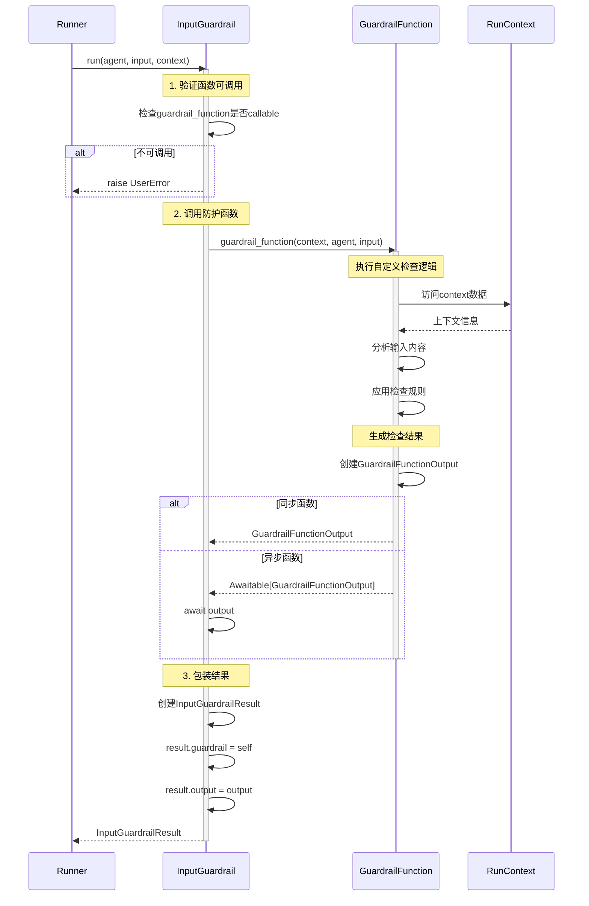
```mermaid
sequenceDiagram
    participant R as Runner
    participant IG as InputGuardrail
    participant Func as GuardrailFunction
    participant Ctx as RunContext
    
    R->>IG: run(agent, input, context)
    activate IG
    
    Note over IG: 1. 验证函数可调用
    IG->>IG: 检查guardrail_function是否callable
    
    alt 不可调用
        IG-->>R: raise UserError
    end
    
    Note over IG: 2. 调用防护函数
    IG->>Func: guardrail_function(context, agent, input)
    activate Func
    
    Note over Func: 执行自定义检查逻辑
    Func->>Ctx: 访问context数据
    Ctx-->>Func: 上下文信息
    
    Func->>Func: 分析输入内容
    Func->>Func: 应用检查规则
    
    Note over Func: 生成检查结果
    Func->>Func: 创建GuardrailFunctionOutput
    
    alt 同步函数
        Func-->>IG: GuardrailFunctionOutput
    else 异步函数
        Func-->>IG: Awaitable[GuardrailFunctionOutput]
        IG->>IG: await output
    end
    deactivate Func
    
    Note over IG: 3. 包装结果
    IG->>IG: 创建InputGuardrailResult
    IG->>IG: result.guardrail = self
    IG->>IG: result.output = output
    
    IG-->>R: InputGuardrailResult
    deactivate IG
```

**执行细节：**

1. **函数验证**：确保防护函数可调用
2. **函数调用**：支持同步和异步函数
3. **上下文访问**：防护函数可访问运行上下文
4. **结果包装**：标准化返回结果

## 3. Agent级输出防护时序图

### 3.1 输出防护执行流程

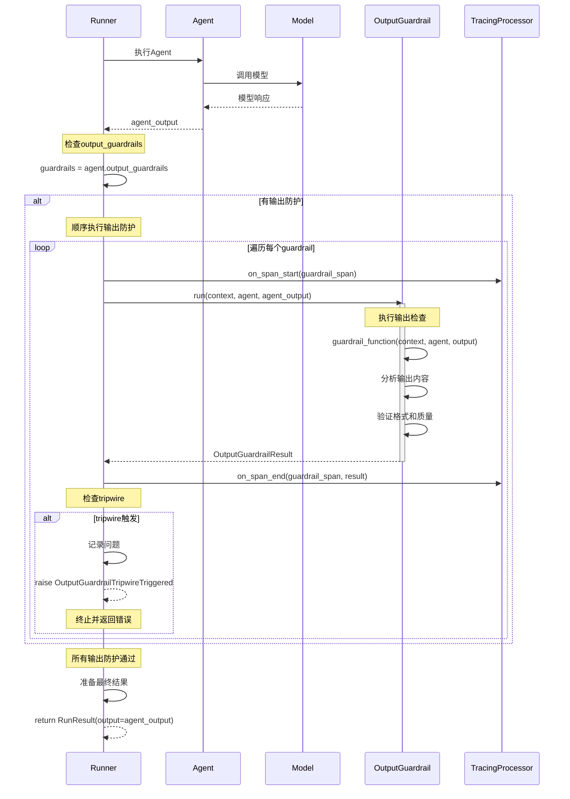
```mermaid
sequenceDiagram
    participant R as Runner
    participant A as Agent
    participant M as Model
    participant OG as OutputGuardrail
    participant T as TracingProcessor
    
    R->>A: 执行Agent
    A->>M: 调用模型
    M-->>A: 模型响应
    A-->>R: agent_output
    
    Note over R: 检查output_guardrails
    R->>R: guardrails = agent.output_guardrails
    
    alt 有输出防护
        Note over R: 顺序执行输出防护
        
        loop 遍历每个guardrail
            R->>T: on_span_start(guardrail_span)
            
            R->>OG: run(context, agent, agent_output)
            activate OG
            
            Note over OG: 执行输出检查
            OG->>OG: guardrail_function(context, agent, output)
            OG->>OG: 分析输出内容
            OG->>OG: 验证格式和质量
            
            OG-->>R: OutputGuardrailResult
            deactivate OG
            
            R->>T: on_span_end(guardrail_span, result)
            
            Note over R: 检查tripwire
            alt tripwire触发
                R->>R: 记录问题
                R-->>R: raise OutputGuardrailTripwireTriggered
                Note over R: 终止并返回错误
            end
        end
    end
    
    Note over R: 所有输出防护通过
    R->>R: 准备最终结果
    R-->>R: return RunResult(output=agent_output)
```

**流程特点：**

1. **执行时机**：Agent生成输出后
2. **顺序执行**：按防护栏顺序依次检查
3. **快速失败**：任一防护触发即终止
4. **结果返回**：全部通过则返回输出

## 4. Tool级输入防护时序图

### 4.1 工具输入防护完整流程

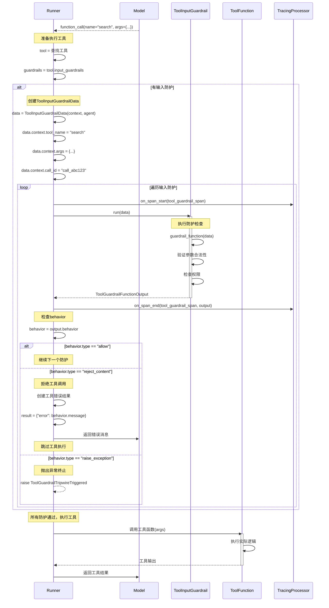
```mermaid
sequenceDiagram
    participant R as Runner
    participant M as Model
    participant TIG as ToolInputGuardrail
    participant TF as ToolFunction
    participant T as TracingProcessor
    
    M-->>R: function_call(name="search", args={...})
    
    Note over R: 准备执行工具
    R->>R: tool = 查找工具
    R->>R: guardrails = tool.input_guardrails
    
    alt 有输入防护
        Note over R: 创建ToolInputGuardrailData
        R->>R: data = ToolInputGuardrailData(context, agent)
        R->>R: data.context.tool_name = "search"
        R->>R: data.context.args = {...}
        R->>R: data.context.call_id = "call_abc123"
        
        loop 遍历输入防护
            R->>T: on_span_start(tool_guardrail_span)
            
            R->>TIG: run(data)
            activate TIG
            
            Note over TIG: 执行防护检查
            TIG->>TIG: guardrail_function(data)
            TIG->>TIG: 验证参数合法性
            TIG->>TIG: 检查权限
            
            TIG-->>R: ToolGuardrailFunctionOutput
            deactivate TIG
            
            R->>T: on_span_end(tool_guardrail_span, output)
            
            Note over R: 检查behavior
            R->>R: behavior = output.behavior
            
            alt behavior.type == "allow"
                Note over R: 继续下一个防护
                
            else behavior.type == "reject_content"
                Note over R: 拒绝工具调用
                R->>R: 创建工具错误结果
                R->>R: result = {"error": behavior.message}
                R->>M: 返回错误消息
                Note over R: 跳过工具执行
                
            else behavior.type == "raise_exception"
                Note over R: 抛出异常终止
                R-->>R: raise ToolGuardrailTripwireTriggered
            end
        end
    end
    
    Note over R: 所有防护通过，执行工具
    R->>TF: 调用工具函数(args)
    activate TF
    TF->>TF: 执行实际逻辑
    TF-->>R: 工具输出
    deactivate TF
    
    R->>M: 返回工具结果
```

**关键决策点：**

1. **allow行为**：继续检查和执行
2. **reject_content行为**：跳过执行，返回消息
3. **raise_exception行为**：终止整个流程

### 4.2 工具输入防护行为处理

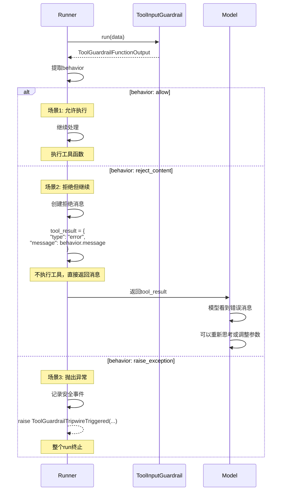
```mermaid
sequenceDiagram
    participant R as Runner
    participant TIG as ToolInputGuardrail
    participant M as Model
    
    R->>TIG: run(data)
    TIG-->>R: ToolGuardrailFunctionOutput
    
    R->>R: 提取behavior
    
    alt behavior: allow
        Note over R: 场景1: 允许执行
        R->>R: 继续处理
        Note over R: 执行工具函数
        
    else behavior: reject_content
        Note over R: 场景2: 拒绝但继续
        R->>R: 创建拒绝消息
        R->>R: tool_result = {<br/>"type": "error",<br/>"message": behavior.message<br/>}
        
        Note over R: 不执行工具，直接返回消息
        R->>M: 返回tool_result
        M->>M: 模型看到错误消息
        M->>M: 可以重新思考或调整参数
        
    else behavior: raise_exception
        Note over R: 场景3: 抛出异常
        R->>R: 记录安全事件
        R-->>R: raise ToolGuardrailTripwireTriggered(...)
        Note over R: 整个run终止
    end
```

## 5. Tool级输出防护时序图

### 5.1 工具输出防护流程

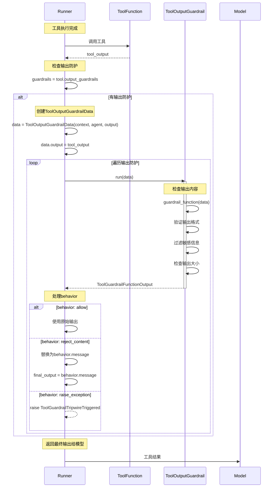
```mermaid
sequenceDiagram
    participant R as Runner
    participant TF as ToolFunction
    participant TOG as ToolOutputGuardrail
    participant M as Model
    
    Note over R: 工具执行完成
    R->>TF: 调用工具
    TF-->>R: tool_output
    
    Note over R: 检查输出防护
    R->>R: guardrails = tool.output_guardrails
    
    alt 有输出防护
        Note over R: 创建ToolOutputGuardrailData
        R->>R: data = ToolOutputGuardrailData(context, agent, output)
        R->>R: data.output = tool_output
        
        loop 遍历输出防护
            R->>TOG: run(data)
            activate TOG
            
            Note over TOG: 检查输出内容
            TOG->>TOG: guardrail_function(data)
            TOG->>TOG: 验证输出格式
            TOG->>TOG: 过滤敏感信息
            TOG->>TOG: 检查输出大小
            
            TOG-->>R: ToolGuardrailFunctionOutput
            deactivate TOG
            
            Note over R: 处理behavior
            alt behavior: allow
                R->>R: 使用原始输出
                
            else behavior: reject_content
                R->>R: 替换为behavior.message
                R->>R: final_output = behavior.message
                
            else behavior: raise_exception
                R-->>R: raise ToolGuardrailTripwireTriggered
            end
        end
    end
    
    Note over R: 返回最终输出给模型
    R->>M: 工具结果
```

**输出处理逻辑：**

1. **allow**：使用工具的原始输出
2. **reject_content**：用消息替换输出
3. **raise_exception**：终止执行

## 6. 防护栏异常处理时序图

### 6.1 熔断触发和异常传播

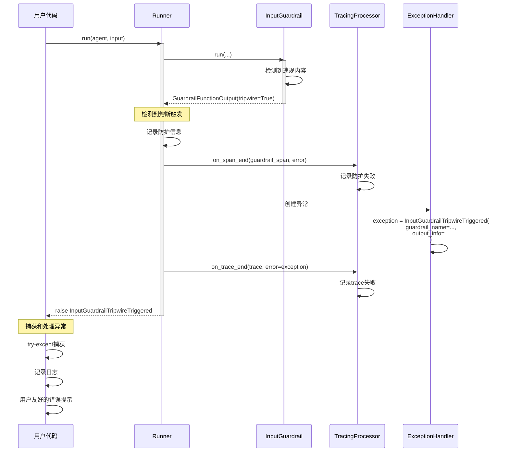
```mermaid
sequenceDiagram
    participant U as 用户代码
    participant R as Runner
    participant IG as InputGuardrail
    participant T as TracingProcessor
    participant H as ExceptionHandler
    
    U->>R: run(agent, input)
    activate R
    
    R->>IG: run(...)
    activate IG
    IG->>IG: 检测到违规内容
    IG-->>R: GuardrailFunctionOutput(tripwire=True)
    deactivate IG
    
    Note over R: 检测到熔断触发
    R->>R: 记录防护信息
    
    R->>T: on_span_end(guardrail_span, error)
    T->>T: 记录防护失败
    
    R->>H: 创建异常
    H->>H: exception = InputGuardrailTripwireTriggered(<br/>guardrail_name=...,<br/>output_info=...<br/>)
    
    R->>T: on_trace_end(trace, error=exception)
    T->>T: 记录trace失败
    
    R-->>U: raise InputGuardrailTripwireTriggered
    deactivate R
    
    Note over U: 捕获和处理异常
    U->>U: try-except捕获
    U->>U: 记录日志
    U->>U: 用户友好的错误提示
```

**异常处理流程：**

1. **检测触发**：发现tripwire=True
2. **记录追踪**：在trace中记录失败
3. **创建异常**：包含详细信息
4. **传播异常**：向上层抛出
5. **用户处理**：在应用层捕获处理

## 7. 完整的防护执行时序图（端到端）

### 7.1 包含所有防护层的完整流程

```mermaid
sequenceDiagram
    participant U as 用户
    participant R as Runner
    participant IG as InputGuardrails
    participant A as Agent
    participant M as Model
    participant TIG as ToolInputGuardrails
    participant T as Tool
    participant TOG as ToolOutputGuardrails
    participant OG as OutputGuardrails
    
    U->>R: run(agent, "用户输入")
    activate R
    
    Note over R: 阶段1: 输入防护
    R->>IG: 并行执行所有输入防护
    IG-->>R: 所有结果
    
    alt 输入防护触发
        R-->>U: raise InputGuardrailTripwireTriggered
    end
    
    Note over R: 阶段2: Agent执行
    R->>A: 执行Agent
    A->>M: 调用模型
    
    alt 模型决定调用工具
        M-->>A: function_call
        A->>R: 需要执行工具
        
        Note over R: 阶段3: 工具输入防护
        R->>TIG: 检查工具参数
        TIG-->>R: ToolGuardrailFunctionOutput
        
        alt behavior: reject_content
            R->>M: 返回错误消息
            Note over M: 模型重新思考
        else behavior: raise_exception
            R-->>U: raise ToolGuardrailTripwireTriggered
        else behavior: allow
            Note over R: 阶段4: 执行工具
            R->>T: 调用工具函数
            T-->>R: 工具输出
            
            Note over R: 阶段5: 工具输出防护
            R->>TOG: 检查工具输出
            TOG-->>R: ToolGuardrailFunctionOutput
            
            alt behavior: reject_content
                R->>R: 替换输出为message
            else behavior: raise_exception
                R-->>U: raise ToolGuardrailTripwireTriggered
            end
            
            R->>M: 返回工具结果
        end
        
        M->>M: 继续推理
    end
    
    M-->>A: 最终响应
    A-->>R: agent_output
    
    Note over R: 阶段6: 输出防护
    R->>OG: 检查Agent输出
    OG-->>R: OutputGuardrailResult
    
    alt 输出防护触发
        R-->>U: raise OutputGuardrailTripwireTriggered
    end
    
    Note over R: 所有防护通过
    R-->>U: RunResult(output=agent_output)
    deactivate R
```

**完整流程总结：**

1. **输入防护**：Agent执行前的第一道防线
2. **Agent执行**：核心逻辑执行
3. **工具输入防护**：每个工具调用前检查
4. **工具执行**：实际工具功能
5. **工具输出防护**：工具结果后处理
6. **输出防护**：最终结果验证

## 8. 防护栏性能优化时序图

### 8.1 并行执行优化

```mermaid
sequenceDiagram
    participant R as Runner
    participant IG1 as 快速检查
    participant IG2 as 中速检查
    participant IG3 as 慢速API检查
    
    Note over R: 使用asyncio.gather并行执行
    
    par 并行任务1
        R->>IG1: run() - 本地正则检查
        IG1->>IG1: 5ms
        IG1-->>R: 结果1
    and 并行任务2
        R->>IG2: run() - 本地模型推理
        IG2->>IG2: 50ms
        IG2-->>R: 结果2
    and 并行任务3
        R->>IG3: run() - 外部API调用
        IG3->>IG3: 200ms
        IG3-->>R: 结果3
    end
    
    Note over R: 总耗时 = max(5, 50, 200) = 200ms<br/>而非 5 + 50 + 200 = 255ms
```

**优化策略：**

1. **并行执行**：所有输入防护同时开始
2. **快速失败**：任一触发立即终止
3. **缓存结果**：重复检查使用缓存
4. **异步I/O**：API调用不阻塞

Guardrails 模块通过精心设计的时序流程和多层防护机制，为 OpenAI Agents 提供了全面的安全保护能力，确保系统的可靠性和合规性。

---
