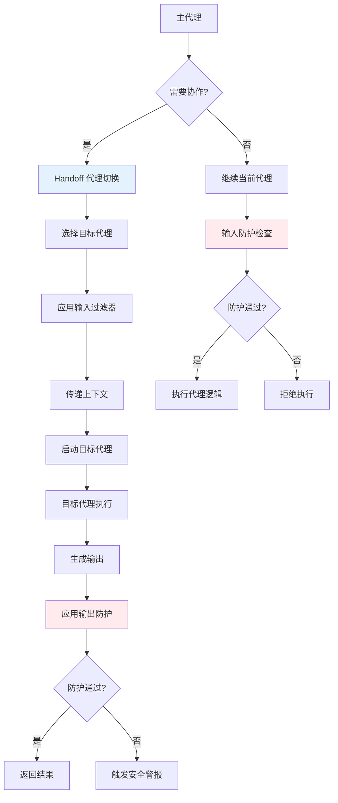

# OpenAI Agents SDK 代理协作层分析

## 7.1 代理协作层架构概览

代理协作层是OpenAI Agents SDK的核心创新之一，实现了多个AI代理之间的协作和任务委托。该层包含两个主要组件：

- **Handoffs (代理切换)**: 实现代理间的任务转移和上下文传递
- **Guardrails (安全防护)**: 提供输入输出的安全检查和过滤机制

## 7.2 代理协作架构图



## 7.3 Handoffs (代理切换) 深度分析

### 7.3.1 Handoff核心数据结构

```python
# 位于 src/agents/handoffs.py
@dataclass
class Handoff(Generic[TContext, TAgent]):
    """
    代理切换的核心配置类
    
    定义了如何从一个代理切换到另一个代理，包括：
    - 工具接口定义
    - 输入处理逻辑  
    - 上下文传递规则
    """
    
    tool_name: str                                  # 切换工具的名称
    tool_description: str                           # 切换工具的描述
    input_json_schema: dict[str, Any]              # 输入参数的JSON Schema
    on_invoke_handoff: Callable[[RunContextWrapper[Any], str], Awaitable[TAgent]]  # 切换处理函数
    agent_name: str                                # 目标代理名称
    strict_json_schema: bool = True                # 是否使用严格JSON Schema
    input_filter: HandoffInputFilter | None = None  # 输入过滤器
    is_enabled: bool | Callable[[RunContextWrapper[Any], AgentBase], MaybeAwaitable[bool]] = True  # 启用状态
    
    def __post_init__(self):
        """初始化后处理"""
        if self.strict_json_schema:
            self.input_json_schema = ensure_strict_json_schema(self.input_json_schema)
    
    def to_openai_format(self) -> dict[str, Any]:
        """转换为OpenAI API切换格式"""
        return {
            "type": "handoff",
            "handoff": {
                "name": self.tool_name,
                "description": self.tool_description,
                "parameters": self.input_json_schema,
                "agent_name": self.agent_name,
            }
        }

@dataclass(frozen=True)
class HandoffInputData:
    """
    代理切换时传递的输入数据
    
    包含切换发生时的完整上下文信息
    """
    
    input_history: str | tuple[TResponseInputItem, ...]  # 输入历史
    pre_handoff_items: tuple[RunItem, ...]              # 切换前的运行项目
    new_items: tuple[RunItem, ...]                      # 新生成的项目
    run_context: RunContextWrapper[Any] | None = None   # 运行上下文
    
    def clone(self, **kwargs: Any) -> HandoffInputData:
        """创建修改后的副本"""
        return dataclasses_replace(self, **kwargs)

# 输入过滤器类型定义
HandoffInputFilter: TypeAlias = Callable[[HandoffInputData], MaybeAwaitable[HandoffInputData]]
```

### 7.3.2 handoff装饰器实现

```python
# 位于 src/agents/handoffs.py
def handoff(
    agent: Agent[TContext] | Callable[[], Agent[TContext]],
    *,
    name: str | None = None,
    description: str | None = None,
    input_filter: HandoffInputFilter | None = None,
    is_enabled: bool | Callable[[RunContextWrapper[Any], AgentBase], MaybeAwaitable[bool]] = True,
) -> Handoff[TContext, Agent[TContext]]:
    """
    创建代理切换配置的便捷函数
    
    将Agent实例转换为可切换的Handoff配置
    
    Args:
        agent: 目标代理实例或创建代理的函数
        name: 切换工具名称（可选）
        description: 切换工具描述（可选）
        input_filter: 输入过滤器（可选）
        is_enabled: 启用状态（可选）
    
    Returns:
        Handoff: 配置好的代理切换对象
    """
    
    # 1. 解析代理实例
    if callable(agent) and not isinstance(agent, Agent):
        # 代理工厂函数
        agent_factory = agent
        target_agent = agent()  # 调用工厂函数获取代理实例
    else:
        # 直接的代理实例
        target_agent = cast(Agent[TContext], agent)
        agent_factory = lambda: target_agent
    
    # 2. 生成工具名称和描述
    tool_name = name or f"handoff_to_{_transforms.transform_string_function_style(target_agent.name)}"
    tool_description = description or (
        target_agent.handoff_description or 
        f"Hand off the conversation to {target_agent.name}"
    )
    
    # 3. 生成输入Schema（如果代理需要特定输入）
    input_schema = _generate_handoff_input_schema(target_agent)
    
    # 4. 创建切换处理函数
    async def on_invoke_handoff(
        context: RunContextWrapper[Any], 
        arguments_json: str
    ) -> Agent[TContext]:
        """处理代理切换的内部函数"""
        
        # 解析参数（如果有）
        if arguments_json.strip():
            try:
                arguments = json.loads(arguments_json)
            except json.JSONDecodeError as e:
                raise ModelBehaviorError(f"Invalid handoff arguments JSON: {e}")
        else:
            arguments = {}
        
        # 获取目标代理实例
        if callable(agent) and not isinstance(agent, Agent):
            # 使用工厂函数创建新实例
            resolved_agent = agent_factory()
        else:
            # 使用现有实例
            resolved_agent = target_agent
        
        # 如果有参数，可能需要基于参数定制代理
        if arguments:
            resolved_agent = _customize_agent_with_arguments(resolved_agent, arguments)
        
        return resolved_agent
    
    # 5. 创建Handoff实例
    return Handoff(
        tool_name=tool_name,
        tool_description=tool_description,
        input_json_schema=input_schema,
        on_invoke_handoff=on_invoke_handoff,
        agent_name=target_agent.name,
        input_filter=input_filter,
        is_enabled=is_enabled,
    )

def _generate_handoff_input_schema(agent: Agent) -> dict[str, Any]:
    """
    为代理切换生成输入Schema
    
    分析目标代理是否需要特殊的初始化参数
    """
    
    # 检查代理的instructions是否为函数
    if callable(agent.instructions):
        # 如果instructions是函数，可能需要特定参数
        sig = inspect.signature(agent.instructions)
        params = [p for name, p in sig.parameters.items() 
                 if name not in ['context', 'agent']]
        
        if params:
            # 为函数参数生成schema
            return function_schema(agent.instructions, exclude_first_param=True)
    
    # 检查是否有动态配置需求
    if hasattr(agent, '_handoff_input_schema'):
        return agent._handoff_input_schema
    
    # 默认的空schema
    return {
        "type": "object",
        "properties": {},
        "additionalProperties": False,
    }

def _customize_agent_with_arguments(agent: Agent, arguments: dict[str, Any]) -> Agent:
    """
    基于切换参数定制代理
    
    允许在切换时动态配置目标代理
    """
    
    # 如果代理有定制化方法，调用它
    if hasattr(agent, 'customize_for_handoff'):
        return agent.customize_for_handoff(arguments)
    
    # 检查是否需要修改instructions
    if callable(agent.instructions) and arguments:
        # 创建包装函数，将arguments传递给instructions函数
        original_instructions = agent.instructions
        
        def wrapped_instructions(context, agent_instance):
            # 将handoff参数添加到context中
            context.handoff_arguments = arguments
            return original_instructions(context, agent_instance)
        
        return agent.clone(instructions=wrapped_instructions)
    
    return agent
```

### 7.3.3 代理切换执行流程

```python
# 位于 src/agents/_run_impl.py
@classmethod
async def _handle_handoff(
    cls,
    handoff_call_item: HandoffCallItem,
    context_wrapper: RunContextWrapper[Any],
    hooks: RunHooks[Any],
    global_handoff_filter: HandoffInputFilter | None,
) -> NextStepHandoff:
    """
    处理代理切换的完整流程
    
    执行步骤：
    1. 查找匹配的切换配置
    2. 调用切换处理函数
    3. 应用输入过滤器
    4. 执行切换钩子
    5. 返回新代理
    """
    
    handoff_name = handoff_call_item.handoff_name
    handoff_arguments = handoff_call_item.arguments
    
    # 1. 查找匹配的切换配置
    matching_handoff: Handoff | None = None
    current_agent = context_wrapper.current_agent
    
    for handoff in current_agent.handoffs:
        if isinstance(handoff, Handoff) and handoff.tool_name == handoff_name:
            matching_handoff = handoff
            break
        elif isinstance(handoff, Agent) and handoff.name == handoff_name:
            # 直接的Agent实例，创建临时Handoff
            matching_handoff = create_temporary_handoff(handoff)
            break
    
    if not matching_handoff:
        raise ModelBehaviorError(f"Handoff '{handoff_name}' not found in agent handoffs")
    
    # 2. 检查切换是否启用
    if not await _check_handoff_enabled(matching_handoff, context_wrapper, current_agent):
        raise ModelBehaviorError(f"Handoff '{handoff_name}' is currently disabled")
    
    # 3. 调用切换处理函数获取新代理
    try:
        new_agent = await matching_handoff.on_invoke_handoff(
            context_wrapper,
            handoff_arguments
        )
    except Exception as e:
        error_msg = f"Failed to execute handoff '{handoff_name}': {str(e)}"
        logger.error(error_msg, exc_info=True)
        raise ModelBehaviorError(error_msg) from e
    
    # 4. 准备切换输入数据
    handoff_input_data = HandoffInputData(
        input_history=context_wrapper.original_input,
        pre_handoff_items=tuple(context_wrapper.pre_handoff_items),
        new_items=tuple(context_wrapper.new_items),
        run_context=context_wrapper,
    )
    
    # 5. 应用输入过滤器
    effective_filter = matching_handoff.input_filter or global_handoff_filter
    if effective_filter:
        try:
            filtered_data = await _apply_handoff_input_filter(
                effective_filter,
                handoff_input_data
            )
            
            # 更新上下文以反映过滤后的数据
            context_wrapper.update_for_handoff(filtered_data)
            
        except Exception as e:
            error_msg = f"Handoff input filter failed for '{handoff_name}': {str(e)}"
            logger.error(error_msg, exc_info=True)
            raise ModelBehaviorError(error_msg) from e
    
    # 6. 执行切换钩子
    await asyncio.gather(
        hooks.on_handoff(context_wrapper, current_agent, new_agent),
        (current_agent.hooks.on_handoff(context_wrapper, current_agent, new_agent)
         if current_agent.hooks else _coro.noop_coroutine()),
    )
    
    # 7. 记录切换追踪信息
    with handoff_span(
        from_agent=current_agent.name,
        to_agent=new_agent.name,
        handoff_name=handoff_name,
    ) as span:
        span.span_data.arguments = handoff_arguments
        span.span_data.filter_applied = effective_filter is not None
    
    return NextStepHandoff(new_agent=new_agent)

async def _apply_handoff_input_filter(
    filter_func: HandoffInputFilter,
    input_data: HandoffInputData,
) -> HandoffInputData:
    """应用切换输入过滤器"""
    
    # 调用过滤器函数
    result = filter_func(input_data)
    
    # 处理异步结果
    if inspect.isawaitable(result):
        result = await result
    
    # 验证过滤器结果
    if not isinstance(result, HandoffInputData):
        raise TypeError(f"Handoff input filter must return HandoffInputData, got {type(result)}")
    
    return result

async def _check_handoff_enabled(
    handoff: Handoff,
    context: RunContextWrapper[Any],
    agent: Agent[Any],
) -> bool:
    """检查切换是否启用"""
    
    is_enabled = handoff.is_enabled
    
    if isinstance(is_enabled, bool):
        return is_enabled
    
    # 调用启用检查函数
    result = is_enabled(context, agent)
    if inspect.isawaitable(result):
        result = await result
    
    return bool(result)
```

### 7.3.4 切换输入过滤器系统

```python
# 位于 src/agents/extensions/handoff_filters.py
def remove_all_tools(handoff_data: HandoffInputData) -> HandoffInputData:
    """
    移除所有工具相关的项目
    
    用于在切换时清理工具调用历史，避免上下文污染
    """
    
    def is_tool_related(item: TResponseInputItem) -> bool:
        """判断项目是否与工具相关"""
        if isinstance(item, dict):
            return item.get("type") in ["tool", "tool_result", "function_call"]
        
        # 检查其他工具相关的属性
        return hasattr(item, "tool_calls") or hasattr(item, "tool_call_id")
    
    # 过滤输入历史
    if isinstance(handoff_data.input_history, tuple):
        filtered_history = tuple(
            item for item in handoff_data.input_history
            if not is_tool_related(item)
        )
    else:
        # 字符串类型的历史不需要过滤
        filtered_history = handoff_data.input_history
    
    # 过滤运行项目
    filtered_pre_handoff = tuple(
        item for item in handoff_data.pre_handoff_items
        if not isinstance(item, (ToolCallItem, ToolCallOutputItem))
    )
    
    filtered_new_items = tuple(
        item for item in handoff_data.new_items
        if not isinstance(item, (ToolCallItem, ToolCallOutputItem))
    )
    
    return handoff_data.clone(
        input_history=filtered_history,
        pre_handoff_items=filtered_pre_handoff,
        new_items=filtered_new_items,
    )

def keep_last_n_messages(n: int) -> HandoffInputFilter:
    """
    保留最后N条消息的过滤器工厂
    
    Args:
        n: 要保留的消息数量
    
    Returns:
        HandoffInputFilter: 过滤器函数
    """
    
    def filter_func(handoff_data: HandoffInputData) -> HandoffInputData:
        if isinstance(handoff_data.input_history, tuple) and len(handoff_data.input_history) > n:
            filtered_history = handoff_data.input_history[-n:]
            return handoff_data.clone(input_history=filtered_history)
        
        return handoff_data
    
    return filter_func

def remove_system_messages(handoff_data: HandoffInputData) -> HandoffInputData:
    """移除系统消息的过滤器"""
    
    if isinstance(handoff_data.input_history, tuple):
        filtered_history = tuple(
            item for item in handoff_data.input_history
            if not (isinstance(item, dict) and item.get("role") == "system")
        )
        return handoff_data.clone(input_history=filtered_history)
    
    return handoff_data

def add_context_summary(summary: str) -> HandoffInputFilter:
    """
    添加上下文摘要的过滤器工厂
    
    在切换时为新代理提供前序上下文的摘要
    """
    
    def filter_func(handoff_data: HandoffInputData) -> HandoffInputData:
        # 创建摘要消息
        summary_message = {
            "role": "system",
            "content": f"Context summary: {summary}",
        }
        
        if isinstance(handoff_data.input_history, tuple):
            # 在历史消息前添加摘要
            new_history = (summary_message,) + handoff_data.input_history
            return handoff_data.clone(input_history=new_history)
        else:
            # 字符串历史，转换为消息列表
            original_message = {
                "role": "user",
                "content": handoff_data.input_history,
            }
            new_history = (summary_message, original_message)
            return handoff_data.clone(input_history=new_history)
    
    return filter_func
```

## 7.4 Guardrails (安全防护) 深度分析

### 7.4.1 防护基础接口

```python
# 位于 src/agents/guardrail.py
from abc import ABC, abstractmethod
from typing import Any, Generic, TypeVar

TContext = TypeVar("TContext")

@dataclass
class GuardrailFunctionOutput:
    """防护函数的输出结果"""
    
    tripwire_triggered: bool                        # 是否触发警报
    message: str                                   # 说明消息
    severity: Literal["low", "medium", "high"] = "medium"  # 严重程度
    metadata: dict[str, Any] = field(default_factory=dict)  # 额外元数据

class InputGuardrail(ABC, Generic[TContext]):
    """输入防护的抽象基类"""
    
    @abstractmethod
    async def check(
        self,
        context: RunContextWrapper[TContext],
        agent: Agent[TContext],
        input_data: str | list[TResponseInputItem],
    ) -> GuardrailFunctionOutput:
        """检查输入是否安全"""
        pass
    
    @property
    @abstractmethod
    def name(self) -> str:
        """防护名称"""
        pass
    
    def get_name(self) -> str:
        """获取防护名称"""
        return self.name

class OutputGuardrail(ABC, Generic[TContext]):
    """输出防护的抽象基类"""
    
    @abstractmethod
    async def check(
        self,
        context: RunContextWrapper[TContext],
        agent: Agent[TContext],
        output: Any,
    ) -> GuardrailFunctionOutput:
        """检查输出是否安全"""
        pass
    
    @property
    @abstractmethod 
    def name(self) -> str:
        """防护名称"""
        pass
    
    def get_name(self) -> str:
        """获取防护名称"""
        return self.name

@dataclass
class InputGuardrailResult:
    """输入防护检查结果"""
    guardrail: InputGuardrail[Any]                 # 执行的防护
    output: GuardrailFunctionOutput                # 防护输出
    execution_time: float                          # 执行时间

@dataclass
class OutputGuardrailResult:
    """输出防护检查结果"""
    guardrail: OutputGuardrail[Any]                # 执行的防护
    output: GuardrailFunctionOutput                # 防护输出
    execution_time: float                          # 执行时间
```

### 7.4.2 防护装饰器实现

```python
# 位于 src/agents/guardrail.py
def input_guardrail(
    func: Callable[..., MaybeAwaitable[GuardrailFunctionOutput]] | None = None,
    *,
    name: str | None = None,
) -> InputGuardrail[Any] | Callable[..., InputGuardrail[Any]]:
    """
    输入防护装饰器
    
    将函数转换为输入防护检查器
    
    支持的函数签名：
    1. func(context: RunContextWrapper, agent: Agent, input_data) -> GuardrailFunctionOutput
    2. func(input_data: str) -> GuardrailFunctionOutput
    """
    
    def decorator(f: Callable[..., MaybeAwaitable[GuardrailFunctionOutput]]) -> InputGuardrail[Any]:
        
        # 分析函数签名
        sig = inspect.signature(f)
        params = list(sig.parameters.values())
        
        # 确定函数调用模式
        if len(params) >= 3:
            # 完整参数模式: (context, agent, input_data)
            call_mode = "full"
        elif len(params) == 1:
            # 简单模式: (input_data)
            call_mode = "simple"
        else:
            raise ValueError(
                f"Invalid input guardrail function signature. Expected (context, agent, input_data) "
                f"or (input_data), got {len(params)} parameters"
            )
        
        class FunctionInputGuardrail(InputGuardrail[Any]):
            @property
            def name(self) -> str:
                return name or f.__name__
            
            async def check(
                self,
                context: RunContextWrapper[Any],
                agent: Agent[Any],
                input_data: str | list[TResponseInputItem],
            ) -> GuardrailFunctionOutput:
                """执行防护检查"""
                
                try:
                    # 根据调用模式调用函数
                    if call_mode == "full":
                        result = f(context, agent, input_data)
                    else:  # simple
                        # 简单模式，将输入转换为字符串
                        if isinstance(input_data, list):
                            input_str = _convert_input_list_to_string(input_data)
                        else:
                            input_str = input_data
                        result = f(input_str)
                    
                    # 处理异步结果
                    if inspect.isawaitable(result):
                        result = await result
                    
                    # 验证结果类型
                    if not isinstance(result, GuardrailFunctionOutput):
                        raise TypeError(
                            f"Input guardrail function must return GuardrailFunctionOutput, "
                            f"got {type(result)}"
                        )
                    
                    return result
                    
                except Exception as e:
                    # 防护检查出错，记录错误并返回安全结果
                    logger.error(f"Input guardrail '{self.name}' failed: {e}", exc_info=True)
                    return GuardrailFunctionOutput(
                        tripwire_triggered=True,
                        message=f"Guardrail check failed: {str(e)}",
                        severity="high",
                        metadata={"error": str(e), "error_type": type(e).__name__}
                    )
        
        return FunctionInputGuardrail()
    
    if func is not None:
        return decorator(func)
    else:
        return decorator

def output_guardrail(
    func: Callable[..., MaybeAwaitable[GuardrailFunctionOutput]] | None = None,
    *,
    name: str | None = None,
) -> OutputGuardrail[Any] | Callable[..., OutputGuardrail[Any]]:
    """
    输出防护装饰器
    
    将函数转换为输出防护检查器
    """
    
    def decorator(f: Callable[..., MaybeAwaitable[GuardrailFunctionOutput]]) -> OutputGuardrail[Any]:
        
        # 分析函数签名
        sig = inspect.signature(f)
        params = list(sig.parameters.values())
        
        if len(params) >= 3:
            call_mode = "full"  # (context, agent, output)
        elif len(params) == 1:
            call_mode = "simple"  # (output)
        else:
            raise ValueError(
                f"Invalid output guardrail function signature. Expected (context, agent, output) "
                f"or (output), got {len(params)} parameters"
            )
        
        class FunctionOutputGuardrail(OutputGuardrail[Any]):
            @property
            def name(self) -> str:
                return name or f.__name__
            
            async def check(
                self,
                context: RunContextWrapper[Any],
                agent: Agent[Any],
                output: Any,
            ) -> GuardrailFunctionOutput:
                """执行输出防护检查"""
                
                try:
                    # 根据调用模式调用函数
                    if call_mode == "full":
                        result = f(context, agent, output)
                    else:  # simple
                        result = f(output)
                    
                    # 处理异步结果
                    if inspect.isawaitable(result):
                        result = await result
                    
                    # 验证结果类型
                    if not isinstance(result, GuardrailFunctionOutput):
                        raise TypeError(
                            f"Output guardrail function must return GuardrailFunctionOutput, "
                            f"got {type(result)}"
                        )
                    
                    return result
                    
                except Exception as e:
                    logger.error(f"Output guardrail '{self.name}' failed: {e}", exc_info=True)
                    return GuardrailFunctionOutput(
                        tripwire_triggered=True,
                        message=f"Output guardrail check failed: {str(e)}",
                        severity="high",
                        metadata={"error": str(e), "error_type": type(e).__name__}
                    )
        
        return FunctionOutputGuardrail()
    
    if func is not None:
        return decorator(func)
    else:
        return decorator

def _convert_input_list_to_string(input_list: list[TResponseInputItem]) -> str:
    """将输入项目列表转换为字符串"""
    
    text_parts = []
    for item in input_list:
        if isinstance(item, dict):
            content = item.get("content", "")
            if isinstance(content, str):
                text_parts.append(content)
            elif isinstance(content, list):
                # 处理复杂内容
                for content_item in content:
                    if isinstance(content_item, dict) and content_item.get("type") == "text":
                        text_parts.append(content_item.get("text", ""))
        
    return "\n".join(text_parts)
```

### 7.4.3 防护执行系统

```python
# 位于 src/agents/_run_impl.py
@classmethod
async def run_single_input_guardrail(
    cls,
    agent: Agent[Any],
    guardrail: InputGuardrail[TContext],
    input_data: str | list[TResponseInputItem],
    context: RunContextWrapper[TContext],
) -> InputGuardrailResult:
    """
    运行单个输入防护检查
    
    包含完整的执行、计时和错误处理逻辑
    """
    
    start_time = time.time()
    
    # 开始防护追踪span
    with guardrail_span(
        guardrail_name=guardrail.get_name(),
        guardrail_type="input",
    ) as span:
        try:
            # 执行防护检查
            output = await guardrail.check(context, agent, input_data)
            
            # 记录追踪信息
            span.span_data.result = output.tripwire_triggered
            span.span_data.message = output.message
            span.span_data.severity = output.severity
            
            execution_time = time.time() - start_time
            
            return InputGuardrailResult(
                guardrail=guardrail,
                output=output,
                execution_time=execution_time,
            )
            
        except Exception as e:
            # 防护执行异常
            execution_time = time.time() - start_time
            
            error_output = GuardrailFunctionOutput(
                tripwire_triggered=True,
                message=f"Guardrail execution failed: {str(e)}",
                severity="high",
                metadata={"error": str(e), "error_type": type(e).__name__}
            )
            
            # 记录错误到追踪
            _error_tracing.attach_error_to_span(
                span,
                SpanError(
                    message=f"Input guardrail '{guardrail.get_name()}' execution failed",
                    data={"error": str(e)}
                )
            )
            
            return InputGuardrailResult(
                guardrail=guardrail,
                output=error_output,
                execution_time=execution_time,
            )

@classmethod
async def run_single_output_guardrail(
    cls,
    guardrail: OutputGuardrail[TContext],
    agent: Agent[TContext],
    output: Any,
    context: RunContextWrapper[TContext],
) -> OutputGuardrailResult:
    """运行单个输出防护检查"""
    
    start_time = time.time()
    
    with guardrail_span(
        guardrail_name=guardrail.get_name(),
        guardrail_type="output",
    ) as span:
        try:
            result = await guardrail.check(context, agent, output)
            
            span.span_data.result = result.tripwire_triggered
            span.span_data.message = result.message
            span.span_data.severity = result.severity
            
            execution_time = time.time() - start_time
            
            return OutputGuardrailResult(
                guardrail=guardrail,
                output=result,
                execution_time=execution_time,
            )
            
        except Exception as e:
            execution_time = time.time() - start_time
            
            error_output = GuardrailFunctionOutput(
                tripwire_triggered=True,
                message=f"Output guardrail execution failed: {str(e)}",
                severity="high",
                metadata={"error": str(e)}
            )
            
            _error_tracing.attach_error_to_span(
                span,
                SpanError(
                    message=f"Output guardrail '{guardrail.get_name()}' execution failed",
                    data={"error": str(e)}
                )
            )
            
            return OutputGuardrailResult(
                guardrail=guardrail,
                output=error_output,
                execution_time=execution_time,
            )
```

### 7.4.4 常用防护示例实现

```python
# 示例：内容安全防护
@input_guardrail
def content_safety_check(input_data: str) -> GuardrailFunctionOutput:
    """检查输入内容是否安全"""
    
    # 定义禁止的关键词
    prohibited_keywords = [
        "暴力", "仇恨", "歧视", "色情", "非法",
        "violence", "hate", "discrimination", "illegal"
    ]
    
    input_lower = input_data.lower()
    
    for keyword in prohibited_keywords:
        if keyword in input_lower:
            return GuardrailFunctionOutput(
                tripwire_triggered=True,
                message=f"Input contains prohibited content: {keyword}",
                severity="high",
                metadata={"matched_keyword": keyword}
            )
    
    return GuardrailFunctionOutput(
        tripwire_triggered=False,
        message="Content safety check passed"
    )

# 示例：输出长度限制防护
@output_guardrail 
def output_length_limit(output: Any) -> GuardrailFunctionOutput:
    """限制输出长度"""
    
    MAX_LENGTH = 1000
    
    output_str = str(output)
    
    if len(output_str) > MAX_LENGTH:
        return GuardrailFunctionOutput(
            tripwire_triggered=True,
            message=f"Output exceeds maximum length of {MAX_LENGTH} characters",
            severity="medium",
            metadata={"actual_length": len(output_str), "max_length": MAX_LENGTH}
        )
    
    return GuardrailFunctionOutput(
        tripwire_triggered=False,
        message="Output length check passed"
    )

# 示例：敏感信息检测防护
@output_guardrail
def sensitive_info_detection(
    context: RunContextWrapper,
    agent: Agent,
    output: Any
) -> GuardrailFunctionOutput:
    """检测输出中的敏感信息"""
    
    import re
    
    output_str = str(output)
    
    # 检测常见敏感信息模式
    patterns = {
        "email": r'\b[A-Za-z0-9._%+-]+@[A-Za-z0-9.-]+\.[A-Z|a-z]{2,}\b',
        "phone": r'\b\d{3}-\d{3}-\d{4}\b',
        "ssn": r'\b\d{3}-\d{2}-\d{4}\b',
        "credit_card": r'\b\d{4}[\s-]?\d{4}[\s-]?\d{4}[\s-]?\d{4}\b',
    }
    
    detected_info = []
    
    for info_type, pattern in patterns.items():
        matches = re.findall(pattern, output_str)
        if matches:
            detected_info.append({
                "type": info_type,
                "count": len(matches),
                "examples": matches[:2]  # 只记录前两个例子
            })
    
    if detected_info:
        return GuardrailFunctionOutput(
            tripwire_triggered=True,
            message="Output contains potentially sensitive information",
            severity="high",
            metadata={"detected_info": detected_info}
        )
    
    return GuardrailFunctionOutput(
        tripwire_triggered=False,
        message="No sensitive information detected"
    )
```

这个代理协作层为OpenAI Agents SDK提供了强大的多代理协作能力和安全防护机制，使得复杂的多代理工作流能够安全可靠地运行。
