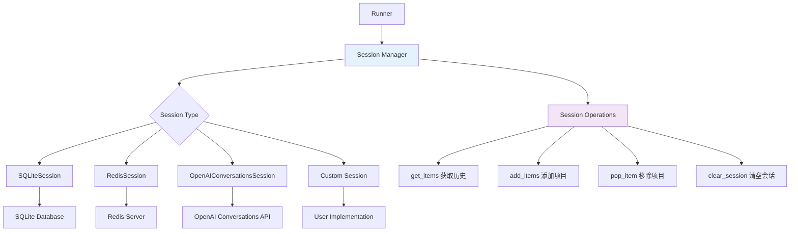
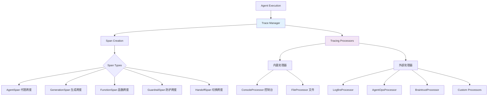

## 8.1 会话管理模块 (Memory/Session)

### 8.1.1 会话系统架构

会话管理系统负责自动维护对话历史，使代理能够在多轮对话中保持上下文连续性。



### 8.1.2 Session接口定义

```python
# 位于 src/agents/memory/session.py
from abc import ABC, abstractmethod
from typing import Any, Dict, List, Optional

class SessionABC(ABC):
    """会话管理的抽象基类"""
    
    @abstractmethod
    async def get_items(self, limit: int | None = None) -> list[dict]:
        """
        获取会话历史项目
        
        Args:
            limit: 限制返回的项目数量，None表示返回全部
            
        Returns:
            list[dict]: 历史消息项目列表
        """
        pass
    
    @abstractmethod
    async def add_items(self, items: list[dict]) -> None:
        """
        添加新的项目到会话
        
        Args:
            items: 要添加的项目列表
        """
        pass
    
    @abstractmethod
    async def pop_item(self) -> dict | None:
        """
        移除并返回最近的一个项目
        
        Returns:
            dict | None: 被移除的项目，如果会话为空则返回None
        """
        pass
    
    @abstractmethod
    async def clear_session(self) -> None:
        """清空会话中的所有项目"""
        pass

# 类型别名，用于更好的API体验
Session = SessionABC

# 会话输入回调类型
SessionInputCallback = Callable[[list[dict], list[dict]], MaybeAwaitable[list[dict]]]
```

### 8.1.3 SQLite会话实现

```python
# 位于 src/agents/memory/sqlite_session.py
import sqlite3
import json
import asyncio
from typing import Any, Dict, List, Optional
from contextlib import asynccontextmanager

class SQLiteSession(SessionABC):
    """
    基于SQLite的会话实现
    
    使用SQLite数据库持久化存储对话历史
    支持多个独立的会话ID
    """
    
    def __init__(
        self,
        session_id: str,
        db_path: str = "sessions.db",
        table_name: str = "session_items",
    ):
        self.session_id = session_id
        self.db_path = db_path
        self.table_name = table_name
        self._lock = asyncio.Lock()
        
        # 初始化数据库表
        asyncio.create_task(self._ensure_table_exists())
    
    async def _ensure_table_exists(self) -> None:
        """确保数据库表存在"""
        async with self._get_connection() as conn:
            await conn.execute(f"""
                CREATE TABLE IF NOT EXISTS {self.table_name} (
                    session_id TEXT NOT NULL,
                    item_id INTEGER PRIMARY KEY AUTOINCREMENT,
                    timestamp DATETIME DEFAULT CURRENT_TIMESTAMP,
                    content TEXT NOT NULL,
                    metadata TEXT
                )
            """)
            
            # 创建索引以提升查询性能
            await conn.execute(f"""
                CREATE INDEX IF NOT EXISTS idx_{self.table_name}_session_id 
                ON {self.table_name} (session_id)
            """)
            
            await conn.commit()
    
    @asynccontextmanager
    async def _get_connection(self):
        """获取异步SQLite连接"""
        import aiosqlite
        
        async with aiosqlite.connect(self.db_path) as conn:
            # 启用WAL模式以提升并发性能
            await conn.execute("PRAGMA journal_mode=WAL")
            yield conn
    
    async def get_items(self, limit: int | None = None) -> list[dict]:
        """获取会话历史项目"""
        async with self._lock:
            async with self._get_connection() as conn:
                query = f"""
                    SELECT content, metadata FROM {self.table_name}
                    WHERE session_id = ?
                    ORDER BY item_id ASC
                """
                
                params = [self.session_id]
                if limit is not None:
                    query += " LIMIT ?"
                    params.append(limit)
                
                async with conn.execute(query, params) as cursor:
                    rows = await cursor.fetchall()
                
                items = []
                for content_json, metadata_json in rows:
                    try:
                        item = json.loads(content_json)
                        if metadata_json:
                            item["_metadata"] = json.loads(metadata_json)
                        items.append(item)
                    except json.JSONDecodeError as e:
                        logger.error(f"Failed to parse session item: {e}")
                        continue
                
                return items
    
    async def add_items(self, items: list[dict]) -> None:
        """添加新项目到会话"""
        if not items:
            return
        
        async with self._lock:
            async with self._get_connection() as conn:
                insert_data = []
                
                for item in items:
                    # 分离元数据
                    item_copy = item.copy()
                    metadata = item_copy.pop("_metadata", None)
                    
                    content_json = json.dumps(item_copy, ensure_ascii=False)
                    metadata_json = json.dumps(metadata) if metadata else None
                    
                    insert_data.append((self.session_id, content_json, metadata_json))
                
                await conn.executemany(f"""
                    INSERT INTO {self.table_name} (session_id, content, metadata)
                    VALUES (?, ?, ?)
                """, insert_data)
                
                await conn.commit()
    
    async def pop_item(self) -> dict | None:
        """移除并返回最近的项目"""
        async with self._lock:
            async with self._get_connection() as conn:
                # 获取最新的项目
                async with conn.execute(f"""
                    SELECT item_id, content, metadata FROM {self.table_name}
                    WHERE session_id = ?
                    ORDER BY item_id DESC
                    LIMIT 1
                """, [self.session_id]) as cursor:
                    row = await cursor.fetchone()
                
                if not row:
                    return None
                
                item_id, content_json, metadata_json = row
                
                try:
                    item = json.loads(content_json)
                    if metadata_json:
                        item["_metadata"] = json.loads(metadata_json)
                    
                    # 删除该项目
                    await conn.execute(f"""
                        DELETE FROM {self.table_name}
                        WHERE item_id = ?
                    """, [item_id])
                    
                    await conn.commit()
                    
                    return item
                    
                except json.JSONDecodeError as e:
                    logger.error(f"Failed to parse popped session item: {e}")
                    return None
    
    async def clear_session(self) -> None:
        """清空当前会话"""
        async with self._lock:
            async with self._get_connection() as conn:
                await conn.execute(f"""
                    DELETE FROM {self.table_name}
                    WHERE session_id = ?
                """, [self.session_id])
                
                await conn.commit()
    
    async def get_session_stats(self) -> dict[str, Any]:
        """获取会话统计信息"""
        async with self._get_connection() as conn:
            async with conn.execute(f"""
                SELECT 
                    COUNT(*) as item_count,
                    MIN(timestamp) as first_item_time,
                    MAX(timestamp) as last_item_time
                FROM {self.table_name}
                WHERE session_id = ?
            """, [self.session_id]) as cursor:
                row = await cursor.fetchone()
                
                if row and row[0] > 0:
                    return {
                        "item_count": row[0],
                        "first_item_time": row[1],
                        "last_item_time": row[2],
                    }
                else:
                    return {"item_count": 0}
```

### 8.1.4 Redis会话实现

```python
# 位于 src/agents/extensions/memory/redis_session.py
import json
import redis.asyncio as redis
from typing import Any, Dict, List, Optional

class RedisSession(SessionABC):
    """
    基于Redis的会话实现
    
    适用于分布式部署和高并发场景
    支持TTL和压缩存储
    """
    
    def __init__(
        self,
        session_id: str,
        redis_client: redis.Redis | None = None,
        key_prefix: str = "agents:session:",
        ttl: int | None = 86400 * 7,  # 默认7天过期
    ):
        self.session_id = session_id
        self.redis_client = redis_client or self._create_default_client()
        self.key = f"{key_prefix}{session_id}"
        self.ttl = ttl
    
    @classmethod
    def from_url(
        cls,
        session_id: str,
        url: str = "redis://localhost:6379/0",
        **kwargs
    ) -> "RedisSession":
        """从Redis URL创建会话实例"""
        redis_client = redis.from_url(url, decode_responses=True)
        return cls(session_id, redis_client, **kwargs)
    
    def _create_default_client(self) -> redis.Redis:
        """创建默认的Redis客户端"""
        return redis.from_url("redis://localhost:6379/0", decode_responses=True)
    
    async def get_items(self, limit: int | None = None) -> list[dict]:
        """获取会话历史项目"""
        try:
            # 使用Redis列表存储项目
            if limit is not None:
                items_json = await self.redis_client.lrange(self.key, 0, limit - 1)
            else:
                items_json = await self.redis_client.lrange(self.key, 0, -1)
            
            items = []
            for item_json in items_json:
                try:
                    item = json.loads(item_json)
                    items.append(item)
                except json.JSONDecodeError as e:
                    logger.error(f"Failed to parse Redis session item: {e}")
                    continue
            
            return items
            
        except redis.RedisError as e:
            logger.error(f"Redis error in get_items: {e}")
            return []
    
    async def add_items(self, items: list[dict]) -> None:
        """添加新项目到会话"""
        if not items:
            return
        
        try:
            # 使用管道批量操作
            pipe = self.redis_client.pipeline()
            
            for item in items:
                item_json = json.dumps(item, ensure_ascii=False)
                pipe.rpush(self.key, item_json)
            
            # 设置TTL
            if self.ttl:
                pipe.expire(self.key, self.ttl)
            
            await pipe.execute()
            
        except redis.RedisError as e:
            logger.error(f"Redis error in add_items: {e}")
            raise
    
    async def pop_item(self) -> dict | None:
        """移除并返回最近的项目"""
        try:
            item_json = await self.redis_client.rpop(self.key)
            
            if item_json:
                try:
                    return json.loads(item_json)
                except json.JSONDecodeError as e:
                    logger.error(f"Failed to parse popped Redis item: {e}")
                    return None
            
            return None
            
        except redis.RedisError as e:
            logger.error(f"Redis error in pop_item: {e}")
            return None
    
    async def clear_session(self) -> None:
        """清空当前会话"""
        try:
            await self.redis_client.delete(self.key)
        except redis.RedisError as e:
            logger.error(f"Redis error in clear_session: {e}")
            raise
    
    async def get_session_info(self) -> dict[str, Any]:
        """获取会话信息"""
        try:
            pipe = self.redis_client.pipeline()
            pipe.llen(self.key)
            pipe.ttl(self.key)
            
            results = await pipe.execute()
            item_count, ttl_remaining = results
            
            return {
                "item_count": item_count,
                "ttl_remaining": ttl_remaining if ttl_remaining > 0 else None,
            }
            
        except redis.RedisError as e:
            logger.error(f"Redis error in get_session_info: {e}")
            return {"item_count": 0}
```

## 8.2 追踪监控模块 (Tracing)

### 8.2.1 追踪系统架构



### 8.2.2 追踪核心接口

```python
# 位于 src/agents/tracing/__init__.py
from abc import ABC, abstractmethod
from typing import Any, Dict, List, Optional, TypeVar, Generic
from dataclasses import dataclass, field
from datetime import datetime
import uuid

TSpanData = TypeVar("TSpanData", bound="SpanData")

@dataclass
class SpanData:
    """追踪跨度的基础数据"""
    span_id: str = field(default_factory=lambda: str(uuid.uuid4()))
    name: str = ""
    start_time: datetime = field(default_factory=datetime.utcnow)
    end_time: datetime | None = None
    parent_span_id: str | None = None
    trace_id: str = ""
    metadata: Dict[str, Any] = field(default_factory=dict)
    tags: Dict[str, str] = field(default_factory=dict)

@dataclass 
class AgentSpanData(SpanData):
    """代理跨度的专用数据"""
    agent_name: str = ""
    handoffs: List[str] = field(default_factory=list)
    output_type: str = ""
    tools: List[str] = field(default_factory=list)
    error: Optional[str] = None

@dataclass
class GenerationSpanData(SpanData):
    """模型生成跨度的专用数据"""
    model: str = ""
    provider: str = ""
    input: Any = None
    output: Any = None
    usage: Optional[Dict[str, int]] = None
    settings: Dict[str, Any] = field(default_factory=dict)

@dataclass
class FunctionSpanData(SpanData):
    """函数调用跨度的专用数据"""
    function_name: str = ""
    arguments: Dict[str, Any] = field(default_factory=dict)
    result: Any = None
    execution_time: float = 0.0

class Span(Generic[TSpanData]):
    """追踪跨度的核心类"""
    
    def __init__(self, span_data: TSpanData):
        self.span_data = span_data
        self._is_current = False
        self._children: List[Span] = []
        self._parent: Optional[Span] = None
    
    def start(self, mark_as_current: bool = False) -> "Span[TSpanData]":
        """开始跨度"""
        self.span_data.start_time = datetime.utcnow()
        
        if mark_as_current:
            _set_current_span(self)
            self._is_current = True
        
        # 通知处理器
        _notify_span_start(self)
        
        return self
    
    def finish(self, reset_current: bool = False) -> None:
        """结束跨度"""
        self.span_data.end_time = datetime.utcnow()
        
        if reset_current and self._is_current:
            _reset_current_span()
            self._is_current = False
        
        # 通知处理器
        _notify_span_end(self)
    
    def add_child(self, child_span: "Span") -> None:
        """添加子跨度"""
        child_span._parent = self
        child_span.span_data.parent_span_id = self.span_data.span_id
        self._children.append(child_span)
    
    def set_error(self, error: Exception | str) -> None:
        """设置错误信息"""
        if isinstance(error, Exception):
            error_msg = f"{type(error).__name__}: {str(error)}"
        else:
            error_msg = str(error)
        
        self.span_data.metadata["error"] = error_msg
        self.span_data.tags["error"] = "true"

class TracingProcessor(ABC):
    """追踪处理器的抽象基类"""
    
    @abstractmethod
    async def process_span_start(self, span: Span[Any]) -> None:
        """处理跨度开始事件"""
        pass
    
    @abstractmethod
    async def process_span_end(self, span: Span[Any]) -> None:
        """处理跨度结束事件"""
        pass
    
    @abstractmethod
    async def process_trace_complete(self, trace: "Trace") -> None:
        """处理追踪完成事件"""
        pass

class Trace:
    """追踪的顶级容器"""
    
    def __init__(
        self,
        workflow_name: str = "Agent Workflow",
        trace_id: str | None = None,
        group_id: str | None = None,
        metadata: Dict[str, Any] | None = None,
    ):
        self.trace_id = trace_id or str(uuid.uuid4())
        self.workflow_name = workflow_name
        self.group_id = group_id
        self.metadata = metadata or {}
        self.start_time = datetime.utcnow()
        self.end_time: datetime | None = None
        self.root_spans: List[Span] = []
        self._is_current = False
    
    def start(self, mark_as_current: bool = False) -> "Trace":
        """开始追踪"""
        self.start_time = datetime.utcnow()
        
        if mark_as_current:
            _set_current_trace(self)
            self._is_current = True
        
        return self
    
    def finish(self, reset_current: bool = False) -> None:
        """完成追踪"""
        self.end_time = datetime.utcnow()
        
        if reset_current and self._is_current:
            _reset_current_trace()
            self._is_current = False
        
        # 通知处理器
        _notify_trace_complete(self)

# 全局状态管理
_current_trace: Optional[Trace] = None
_current_span: Optional[Span] = None
_trace_processors: List[TracingProcessor] = []

def get_current_trace() -> Optional[Trace]:
    """获取当前追踪"""
    return _current_trace

def get_current_span() -> Optional[Span]:
    """获取当前跨度"""
    return _current_span

def _set_current_trace(trace: Trace) -> None:
    """设置当前追踪"""
    global _current_trace
    _current_trace = trace

def _set_current_span(span: Span) -> None:
    """设置当前跨度"""
    global _current_span
    _current_span = span
```

### 8.2.3 内置追踪处理器

```python
# 位于 src/agents/tracing/processors.py
import json
import logging
from pathlib import Path
from typing import Any, Dict, TextIO

class ConsoleTracingProcessor(TracingProcessor):
    """控制台追踪处理器"""
    
    def __init__(self, level: str = "INFO", include_data: bool = False):
        self.logger = logging.getLogger("agents.tracing.console")
        self.logger.setLevel(getattr(logging, level.upper()))
        self.include_data = include_data
        
        # 配置控制台输出格式
        if not self.logger.handlers:
            handler = logging.StreamHandler()
            formatter = logging.Formatter(
                '%(asctime)s - %(name)s - %(levelname)s - %(message)s'
            )
            handler.setFormatter(formatter)
            self.logger.addHandler(handler)
    
    async def process_span_start(self, span: Span[Any]) -> None:
        """处理跨度开始"""
        self.logger.info(f"[SPAN START] {span.span_data.name} (ID: {span.span_data.span_id})")
        
        if self.include_data and span.span_data.metadata:
            self.logger.debug(f"  Metadata: {span.span_data.metadata}")
    
    async def process_span_end(self, span: Span[Any]) -> None:
        """处理跨度结束"""
        duration = 0.0
        if span.span_data.end_time and span.span_data.start_time:
            duration = (span.span_data.end_time - span.span_data.start_time).total_seconds()
        
        self.logger.info(f"[SPAN END] {span.span_data.name} (Duration: {duration:.3f}s)")
        
        # 记录错误
        if "error" in span.span_data.metadata:
            self.logger.error(f"  Error: {span.span_data.metadata['error']}")
    
    async def process_trace_complete(self, trace: Trace) -> None:
        """处理追踪完成"""
        duration = 0.0
        if trace.end_time and trace.start_time:
            duration = (trace.end_time - trace.start_time).total_seconds()
        
        self.logger.info(f"[TRACE COMPLETE] {trace.workflow_name} (Duration: {duration:.3f}s)")

class FileTracingProcessor(TracingProcessor):
    """文件追踪处理器"""
    
    def __init__(
        self,
        file_path: str | Path,
        format: str = "jsonl",
        include_sensitive_data: bool = True,
    ):
        self.file_path = Path(file_path)
        self.format = format
        self.include_sensitive_data = include_sensitive_data
        
        # 确保目录存在
        self.file_path.parent.mkdir(parents=True, exist_ok=True)
    
    async def process_span_start(self, span: Span[Any]) -> None:
        """处理跨度开始"""
        await self._write_event("span_start", span.span_data)
    
    async def process_span_end(self, span: Span[Any]) -> None:
        """处理跨度结束"""
        await self._write_event("span_end", span.span_data)
    
    async def process_trace_complete(self, trace: Trace) -> None:
        """处理追踪完成"""
        trace_data = {
            "trace_id": trace.trace_id,
            "workflow_name": trace.workflow_name,
            "group_id": trace.group_id,
            "start_time": trace.start_time.isoformat(),
            "end_time": trace.end_time.isoformat() if trace.end_time else None,
            "metadata": trace.metadata,
        }
        
        await self._write_event("trace_complete", trace_data)
    
    async def _write_event(self, event_type: str, data: Any) -> None:
        """写入事件到文件"""
        event = {
            "timestamp": datetime.utcnow().isoformat(),
            "event_type": event_type,
            "data": self._serialize_data(data),
        }
        
        try:
            with open(self.file_path, "a", encoding="utf-8") as f:
                if self.format == "jsonl":
                    json.dump(event, f, ensure_ascii=False, default=str)
                    f.write("\n")
                else:
                    # 其他格式支持
                    pass
        except IOError as e:
            logger.error(f"Failed to write tracing event to file: {e}")
    
    def _serialize_data(self, data: Any) -> Any:
        """序列化数据"""
        if hasattr(data, '__dict__'):
            result = {}
            for key, value in data.__dict__.items():
                if key.startswith('_'):
                    continue
                
                if not self.include_sensitive_data and key in ['input', 'output', 'arguments']:
                    result[key] = "<redacted>"
                else:
                    result[key] = self._serialize_data(value)
            
            return result
        elif isinstance(data, (list, tuple)):
            return [self._serialize_data(item) for item in data]
        elif isinstance(data, dict):
            return {k: self._serialize_data(v) for k, v in data.items()}
        else:
            return data
```

## 8.3 扩展功能模块

### 8.3.1 语音处理模块

```python
# 位于 src/agents/voice/__init__.py
from typing import Any, AsyncIterator, Optional
from dataclasses import dataclass

@dataclass
class VoicePipelineConfig:
    """语音处理管道配置"""
    
    # 输入配置
    input_audio_format: str = "pcm16"           # 输入音频格式
    input_sample_rate: int = 16000              # 采样率
    
    # TTS配置
    tts_model: str = "tts-1"                   # TTS模型
    tts_voice: str = "alloy"                   # 语音角色
    
    # STT配置  
    stt_model: str = "whisper-1"               # STT模型
    stt_language: str | None = None            # 语音识别语言
    
    # 处理配置
    silence_threshold: float = 0.01            # 静音阈值
    silence_duration_ms: int = 500             # 静音持续时间

class VoicePipeline:
    """语音处理管道"""
    
    def __init__(
        self,
        agent: Agent,
        config: VoicePipelineConfig,
        tts_model: TTSModel | None = None,
        stt_model: STTModel | None = None,
    ):
        self.agent = agent
        self.config = config
        self.tts_model = tts_model or self._create_default_tts_model()
        self.stt_model = stt_model or self._create_default_stt_model()
    
    async def process_audio_stream(
        self,
        audio_stream: AsyncIterator[bytes],
        context: Any = None,
    ) -> AsyncIterator[VoiceStreamEvent]:
        """
        处理音频流
        
        执行流程：
        1. 音频流 -> STT -> 文本
        2. 文本 -> Agent -> 响应
        3. 响应 -> TTS -> 音频流
        """
        
        # 1. 语音转文字
        text_buffer = ""
        async for audio_chunk in audio_stream:
            stt_result = await self.stt_model.transcribe_chunk(audio_chunk)
            
            if stt_result.is_final:
                text_buffer += stt_result.text
                
                # 发送转录事件
                yield VoiceStreamEventTranscription(
                    text=stt_result.text,
                    is_final=True
                )
                
                if self._is_complete_utterance(text_buffer):
                    # 2. 处理完整的用户输入
                    async for agent_event in self._process_text_with_agent(
                        text_buffer, context
                    ):
                        yield agent_event
                    
                    text_buffer = ""
    
    async def _process_text_with_agent(
        self, 
        text: str, 
        context: Any
    ) -> AsyncIterator[VoiceStreamEvent]:
        """使用代理处理文本"""
        
        # 运行代理
        result = await Runner.run(
            self.agent,
            input=text,
            context=context,
        )
        
        response_text = result.final_output
        
        # 发送代理响应事件
        yield VoiceStreamEventAgentResponse(
            text=response_text,
            agent_name=self.agent.name,
        )
        
        # 转换为语音
        async for audio_chunk in self.tts_model.synthesize_streaming(response_text):
            yield VoiceStreamEventAudio(
                audio_data=audio_chunk,
                format=self.config.tts_output_format,
            )
```

### 8.3.2 实时交互模块

```python
# 位于 src/agents/realtime/__init__.py
from typing import Any, AsyncIterator, Dict, List
from dataclasses import dataclass

@dataclass
class RealtimeConfig:
    """实时交互配置"""
    
    model: str = "gpt-4-realtime"              # 实时模型
    voice: str = "alloy"                       # 语音角色
    input_audio_format: str = "pcm16"          # 输入音频格式
    output_audio_format: str = "pcm16"         # 输出音频格式
    turn_detection: Dict[str, Any] | None = None  # 轮换检测配置
    
class RealtimeAgent:
    """实时交互代理"""
    
    def __init__(
        self,
        name: str,
        instructions: str,
        config: RealtimeConfig,
        tools: List[Tool] | None = None,
    ):
        self.name = name
        self.instructions = instructions
        self.config = config
        self.tools = tools or []
    
    async def start_realtime_session(
        self,
        context: Any = None,
    ) -> AsyncIterator[RealtimeEvent]:
        """启动实时会话"""
        
        # 连接到实时模型API
        async with self._create_realtime_connection() as connection:
            
            # 发送会话配置
            await connection.send_config({
                "model": self.config.model,
                "voice": self.config.voice,
                "instructions": self.instructions,
                "tools": [tool.to_openai_format() for tool in self.tools],
                "input_audio_format": self.config.input_audio_format,
                "output_audio_format": self.config.output_audio_format,
                "turn_detection": self.config.turn_detection,
            })
            
            # 处理实时事件流
            async for event in connection.receive_events():
                yield self._convert_realtime_event(event)
    
    async def _create_realtime_connection(self):
        """创建实时连接"""
        # 实现WebSocket连接到OpenAI实时API
        pass
    
    def _convert_realtime_event(self, raw_event: Dict[str, Any]) -> RealtimeEvent:
        """转换原始事件为框架事件"""
        event_type = raw_event.get("type")
        
        if event_type == "response.audio.delta":
            return RealtimeAudioEvent(
                audio_data=raw_event["delta"],
                format=self.config.output_audio_format,
            )
        elif event_type == "response.text.delta":
            return RealtimeTextEvent(
                text_delta=raw_event["delta"],
            )
        elif event_type == "response.function_call":
            return RealtimeFunctionCallEvent(
                function_name=raw_event["name"],
                arguments=raw_event["arguments"],
                call_id=raw_event["call_id"],
            )
        else:
            return RealtimeRawEvent(raw_event)
```

## 8.4 最佳实践和性能优化

### 8.4.1 性能优化技巧

```python
# 1. 工具并行执行
async def execute_tools_parallel(tools_and_args: List[Tuple[Tool, str]]) -> List[Any]:
    """并行执行多个工具"""
    
    tasks = [
        tool.execute(context, args)
        for tool, args in tools_and_args
    ]
    
    results = await asyncio.gather(*tasks, return_exceptions=True)
    
    # 处理异常结果
    processed_results = []
    for result in results:
        if isinstance(result, Exception):
            processed_results.append(f"Tool execution failed: {result}")
        else:
            processed_results.append(result)
    
    return processed_results

# 2. 会话数据压缩
class CompressedSession(SessionABC):
    """压缩存储的会话实现"""
    
    def __init__(self, base_session: SessionABC, compression_level: int = 6):
        self.base_session = base_session
        self.compression_level = compression_level
    
    async def add_items(self, items: List[dict]) -> None:
        # 压缩数据后存储
        compressed_items = [
            {
                **item,
                "_compressed": self._compress_large_fields(item)
            }
            for item in items
        ]
        await self.base_session.add_items(compressed_items)
    
    def _compress_large_fields(self, item: dict) -> dict:
        """压缩大字段"""
        import zlib
        import base64
        
        compressed_fields = {}
        
        for key, value in item.items():
            if isinstance(value, str) and len(value) > 1000:
                compressed = zlib.compress(value.encode('utf-8'), self.compression_level)
                compressed_fields[key] = base64.b64encode(compressed).decode('ascii')
        
        return compressed_fields

# 3. 智能缓存
class CachedAgent(Agent):
    """带缓存的代理实现"""
    
    def __init__(self, *args, cache_size: int = 100, **kwargs):
        super().__init__(*args, **kwargs)
        self._cache = {}
        self._cache_size = cache_size
        self._cache_hits = 0
        self._cache_misses = 0
    
    async def get_cached_response(
        self, 
        input_hash: str, 
        context: Any
    ) -> Any | None:
        """获取缓存的响应"""
        
        if input_hash in self._cache:
            self._cache_hits += 1
            return self._cache[input_hash]
        
        self._cache_misses += 1
        return None
    
    def cache_response(self, input_hash: str, response: Any) -> None:
        """缓存响应"""
        
        if len(self._cache) >= self._cache_size:
            # LRU淘汰策略
            oldest_key = next(iter(self._cache))
            del self._cache[oldest_key]
        
        self._cache[input_hash] = response
```

这个综合模块分析涵盖了OpenAI Agents SDK的重要支持模块，包括会话管理、追踪监控、语音处理、实时交互等功能，为构建完整的AI代理应用提供了全面的基础设施支持。
