# OpenAIAgent-09-Streaming

## 模块概览

## 1. 模块职责与边界

Streaming 模块是 OpenAI Agents Python SDK 的实时数据流核心，负责管理代理执行过程中的流式数据传输和事件处理。该模块通过事件驱动的架构提供低延迟的实时响应能力，支持流式输出、增量更新和实时交互等场景。

### 核心职责

- **流式事件管理**：处理代理执行过程中的各种流式事件
- **实时数据传输**：提供低延迟的数据流传输机制
- **事件类型分发**：区分和路由不同类型的流式事件
- **增量内容处理**：支持增量式的内容生成和传输
- **状态同步**：维护流式处理过程中的状态一致性
- **错误处理**：处理流式传输中的异常和中断情况

### 流式事件体系

| 事件类型 | 事件类 | 触发时机 | 主要用途 |
|----------|--------|----------|----------|
| 原始响应事件 | `RawResponsesStreamEvent` | LLM返回原始流式数据 | 底层数据流传输 |
| 运行项事件 | `RunItemStreamEvent` | 代理处理生成RunItem | 结构化内容更新 |
| 代理更新事件 | `AgentUpdatedStreamEvent` | 代理切换或更新 | 代理状态变更通知 |
| 实时会话事件 | `RealtimeSessionEvent` | 实时会话状态变化 | 实时交互管理 |
| 语音流事件 | `VoiceStreamEvent` | 语音处理流程 | 语音交互处理 |

### 流式数据类型

| 数据类型 | 对应场景 | 关键信息 | 处理方式 |
|----------|----------|----------|----------|
| `message_output_created` | 消息输出生成 | 文本内容、角色信息 | 增量文本渲染 |
| `tool_called` | 工具调用请求 | 工具名称、参数 | 工具执行状态更新 |
| `tool_output` | 工具执行结果 | 返回值、状态 | 结果展示和处理 |
| `handoff_requested` | 代理交接请求 | 目标代理、原因 | 交接流程管理 |
| `handoff_occured` | 代理交接完成 | 交接结果 | 状态同步更新 |

### 输入输出接口

**输入：**

- 模型流式响应（`TResponseStreamEvent`）
- 代理运行项目（`RunItem`）
- 代理实例更新（`Agent`）
- 配置参数（队列大小、超时等）

**输出：**

- 统一流式事件（`StreamEvent`）
- 实时状态更新
- 错误和异常通知
- 完成状态信号

### 上下游依赖关系

**上游调用者：**

- `Runner.run_streamed()`：流式执行的主入口
- `RunImpl`：执行引擎的流式事件生成
- `RealtimeSession`：实时会话的事件管理
- `VoicePipeline`：语音处理的流式输出

**下游依赖：**

- `asyncio.Queue`：异步队列用于事件传输
- `items`：运行项目的数据结构
- `agent`：代理实例和状态
- `exceptions`：异常处理和错误传播

## 2. 模块架构图

```mermaid
flowchart TB
    subgraph "Streaming 流式处理模块"
        subgraph "核心事件类型"
            RAWRESPONSE[RawResponsesStreamEvent]
            RUNITEM[RunItemStreamEvent]
            AGENTUPDATE[AgentUpdatedStreamEvent]
            STREAMEVENT[StreamEvent 联合类型]
        end
        
        subgraph "运行项事件"
            MESSAGEOUTPUT[message_output_created]
            TOOLCALLED[tool_called]
            TOOLOUTPUT[tool_output]
            HANDOFFREQ[handoff_requested]
            HANDOFFOCCUR[handoff_occured]
            REASONING[reasoning_item_created]
            MCPAPPROVAL[mcp_approval_requested]
            MCPTOOLS[mcp_list_tools]
        end
        
        subgraph "实时会话事件"
            REALTIMESESSION[RealtimeSessionEvent]
            AGENTSTART[RealtimeAgentStartEvent]
            AGENTEND[RealtimeAgentEndEvent]
            HANDOFFEVENT[RealtimeHandoffEvent]
            TOOLSTART[RealtimeToolStart]
            TOOLEND[RealtimeToolEnd]
            AUDIOEVENTS[RealtimeAudio*]
            ERROREVENTS[RealtimeError]
        end
        
        subgraph "语音流事件"
            VOICESTREAM[VoiceStreamEvent]
            VOICEAUDIO[VoiceStreamEventAudio]
            VOICELIFECYCLE[VoiceStreamEventLifecycle]
            VOICEERROR[VoiceStreamEventError]
        end
        
        subgraph "流式处理核心"
            QUEUE[asyncio.Queue]
            STREAMPROCESSOR[流式事件处理器]
            EVENTDISPATCHER[事件分发器]
            STATEMANAGER[状态管理器]
        end
        
        subgraph "数据转换"
            ITEMTOEVENT[RunItem到Event转换]
            RESPONSEFILER[响应过滤器]
            EVENTSERIALIZER[事件序列化]
        end
        
        subgraph "生命周期管理"
            QUEUESENTINEL[QueueCompleteSentinel]
            STREAMCOMPLETE[流式完成信号]
            ERRORHANDLING[错误处理]
            CLEANUP[资源清理]
        end
    end
    
    subgraph "执行集成"
        RUNNER[Runner.run_streamed()]
        RUNIMPL[RunImpl 执行引擎]
        REALTIMESESS[RealtimeSession 实时会话]
        VOICEPIPELINE[VoicePipeline 语音处理]
    end
    
    subgraph "数据源"
        MODEL[Model 模型响应]
        LLMSTREAM[LLM 流式输出]
        AGENT[Agent 代理状态]
        TOOLS[Tools 工具执行]
        HANDOFFS[Handoffs 代理交接]
    end
    
    subgraph "消费者"
        WEBAPP[Web 应用前端]
        CHATUI[聊天界面]
        VOICEUI[语音界面]
        MONITORING[监控系统]
        LOGGING[日志系统]
    end
    
    STREAMEVENT --> RAWRESPONSE
    STREAMEVENT --> RUNITEM
    STREAMEVENT --> AGENTUPDATE
    
    RUNITEM --> MESSAGEOUTPUT
    RUNITEM --> TOOLCALLED
    RUNITEM --> TOOLOUTPUT
    RUNITEM --> HANDOFFREQ
    RUNITEM --> HANDOFFOCCUR
    RUNITEM --> REASONING
    RUNITEM --> MCPAPPROVAL
    RUNITEM --> MCPTOOLS
    
    REALTIMESESSION --> AGENTSTART
    REALTIMESESSION --> AGENTEND
    REALTIMESESSION --> HANDOFFEVENT
    REALTIMESESSION --> TOOLSTART
    REALTIMESESSION --> TOOLEND
    REALTIMESESSION --> AUDIOEVENTS
    REALTIMESESSION --> ERROREVENTS
    
    VOICESTREAM --> VOICEAUDIO
    VOICESTREAM --> VOICELIFECYCLE
    VOICESTREAM --> VOICEERROR
    
    STREAMPROCESSOR --> QUEUE
    STREAMPROCESSOR --> EVENTDISPATCHER
    STREAMPROCESSOR --> STATEMANAGER
    
    ITEMTOEVENT --> RESPONSEFILER
    ITEMTOEVENT --> EVENTSERIALIZER
    
    STREAMPROCESSOR --> QUEUESENTINEL
    STREAMPROCESSOR --> STREAMCOMPLETE
    STREAMPROCESSOR --> ERRORHANDLING
    STREAMPROCESSOR --> CLEANUP
    
    RUNNER --> STREAMPROCESSOR
    RUNIMPL --> ITEMTOEVENT
    REALTIMESESS --> REALTIMESESSION
    VOICEPIPELINE --> VOICESTREAM
    
    MODEL --> RAWRESPONSE
    LLMSTREAM --> RAWRESPONSE
    AGENT --> AGENTUPDATE
    TOOLS --> TOOLCALLED
    TOOLS --> TOOLOUTPUT
    HANDOFFS --> HANDOFFREQ
    HANDOFFS --> HANDOFFOCCUR
    
    EVENTDISPATCHER --> WEBAPP
    EVENTDISPATCHER --> CHATUI
    EVENTDISPATCHER --> VOICEUI
    STREAMPROCESSOR --> MONITORING
    STREAMPROCESSOR --> LOGGING
    
    style STREAMEVENT fill:#e1f5fe
    style STREAMPROCESSOR fill:#f3e5f5
    style QUEUE fill:#e8f5e8
    style ITEMTOEVENT fill:#fff3e0
    style REALTIMESESSION fill:#ffebee
```

**架构说明：**

### 分层事件处理设计

1. **事件类型层**：定义不同类型的流式事件和其数据结构
2. **事件处理层**：负责事件的生成、转换和分发
3. **队列传输层**：基于异步队列的高效数据传输
4. **状态管理层**：维护流式处理过程中的状态一致性

### 事件分类体系

- **原始事件**：直接来自LLM的原始流式数据
- **结构化事件**：经过处理的结构化运行项事件
- **状态事件**：代理状态变更和生命周期事件
- **实时事件**：实时会话和语音交互的专用事件

### 异步队列机制

- **生产者模式**：执行引擎产生流式事件放入队列
- **消费者模式**：应用层从队列消费事件进行处理
- **背压控制**：通过队列大小限制控制内存使用
- **完成信号**：通过哨兵对象标识流式处理完成

### 实时性保障

- **低延迟传输**：异步队列确保事件的快速传递
- **增量更新**：支持增量式内容生成和展示
- **状态同步**：实时同步代理和工具的执行状态
- **错误恢复**：流式处理中的错误处理和恢复机制

## 3. 关键算法与流程剖析

### 3.1 流式事件生成算法

```python
class RunImpl:
    """执行引擎中的流式事件生成逻辑"""
    
    @classmethod
    def stream_step_items_to_queue(
        cls,
        new_step_items: list[RunItem],
        queue: asyncio.Queue[StreamEvent | QueueCompleteSentinel],
    ):
        """将运行步骤项目转换为流式事件并放入队列"""
        
        for item in new_step_items:
            # 1) 根据运行项类型创建相应的流式事件
            event = None
            
            if isinstance(item, MessageOutputItem):
                # 消息输出事件：文本生成完成
                event = RunItemStreamEvent(
                    item=item,
                    name="message_output_created"
                )
                
            elif isinstance(item, ToolCallItem):
                # 工具调用事件：工具被调用
                event = RunItemStreamEvent(
                    item=item,
                    name="tool_called"
                )
                
            elif isinstance(item, ToolCallOutputItem):
                # 工具输出事件：工具执行完成
                event = RunItemStreamEvent(
                    item=item,
                    name="tool_output"
                )
                
            elif isinstance(item, HandoffCallItem):
                # 交接请求事件：代理交接被请求
                event = RunItemStreamEvent(
                    item=item,
                    name="handoff_requested"
                )
                
            elif isinstance(item, HandoffOutputItem):
                # 交接完成事件：代理交接已完成
                event = RunItemStreamEvent(
                    item=item,
                    name="handoff_occured"  # 注意：拼写错误但为兼容性保留
                )
                
            elif isinstance(item, ReasoningItem):
                # 推理项事件：推理过程生成
                event = RunItemStreamEvent(
                    item=item,
                    name="reasoning_item_created"
                )
                
            elif isinstance(item, MCPApprovalRequestItem):
                # MCP审批请求事件
                event = RunItemStreamEvent(
                    item=item,
                    name="mcp_approval_requested"
                )
                
            elif isinstance(item, MCPListToolsItem):
                # MCP工具列表事件
                event = RunItemStreamEvent(
                    item=item,
                    name="mcp_list_tools"
                )
                
            else:
                # 2) 处理未知类型的运行项
                logger.warning(f"Unexpected item type: {type(item)}")
                continue
            
            # 3) 将事件放入异步队列（非阻塞）
            if event:
                try:
                    queue.put_nowait(event)
                except asyncio.QueueFull:
                    logger.error("Stream event queue is full, dropping event")
```

**算法目的：** 将执行引擎产生的运行项目转换为标准化的流式事件，实现数据流的结构化传输。

**转换策略特点：**

1. **类型映射**：根据运行项类型映射到相应的事件名称
2. **数据封装**：将运行项数据封装为统一的事件结构
3. **非阻塞处理**：使用非阻塞队列操作避免阻塞执行流程
4. **错误容忍**：未知类型的运行项不会中断整个流程

### 3.2 流式响应处理算法

```python
async def run_streamed(
    agent: Agent[TContext],
    input: str | list[TResponseInputItem],
    session: Session | None = None,
    run_config: RunConfig | None = None,
    context: TContext | None = None,
    stream_queue_size: int = 1000,
) -> RunResultStreaming[TContext]:
    """流式执行的核心算法"""
    
    # 1) 创建异步队列用于流式事件传输
    event_queue: asyncio.Queue[StreamEvent | QueueCompleteSentinel] = asyncio.Queue(
        maxsize=stream_queue_size
    )
    
    # 2) 启动异步任务执行代理逻辑
    async def _execute_agent():
        """后台执行代理逻辑并生成流式事件"""
        try:
            # 执行标准的代理运行逻辑
            result = await run(agent, input, session, run_config, context)
            
            # 生成最终完成事件
            if result.new_agent != agent:
                # 代理发生了更新
                agent_update_event = AgentUpdatedStreamEvent(
                    new_agent=result.new_agent
                )
                event_queue.put_nowait(agent_update_event)
            
            return result
            
        except Exception as e:
            # 3) 异常处理：将异常转换为错误事件
            error_event = create_error_stream_event(e)
            event_queue.put_nowait(error_event)
            raise
            
        finally:
            # 4) 发送完成信号
            event_queue.put_nowait(QueueCompleteSentinel())
    
    # 5) 启动后台执行任务
    execution_task = asyncio.create_task(_execute_agent())
    
    # 6) 创建流式结果对象
    streaming_result = RunResultStreaming(
        final_output_task=execution_task,
        event_queue=event_queue,
        agent=agent,
        context=context
    )
    
    return streaming_result

class RunResultStreaming:
    """流式结果的处理类"""
    
    def __init__(
        self,
        final_output_task: asyncio.Task,
        event_queue: asyncio.Queue[StreamEvent | QueueCompleteSentinel],
        agent: Agent,
        context: Any
    ):
        self.final_output_task = final_output_task
        self.event_queue = event_queue
        self.agent = agent
        self.context = context
        self._final_result = None
        
    async def stream_events(self) -> AsyncIterator[StreamEvent]:
        """异步生成器：流式产生事件"""
        
        while True:
            try:
                # 1) 从队列获取事件（阻塞直到有事件或超时）
                event = await asyncio.wait_for(
                    self.event_queue.get(),
                    timeout=30.0  # 30秒超时
                )
                
                # 2) 检查是否为完成信号
                if isinstance(event, QueueCompleteSentinel):
                    break
                
                # 3) 产生流式事件
                yield event
                
                # 4) 标记队列任务完成
                self.event_queue.task_done()
                
            except asyncio.TimeoutError:
                # 超时处理：检查后台任务状态
                if self.final_output_task.done():
                    break
                else:
                    # 继续等待
                    continue
                    
            except Exception as e:
                logger.error(f"Error in stream_events: {e}")
                break
    
    @property
    async def final_output(self) -> str:
        """获取最终输出结果"""
        if self._final_result is None:
            self._final_result = await self.final_output_task
        return self._final_result.final_output
```

**算法目的：** 提供高效的流式执行机制，支持实时事件流和最终结果的异步获取。

**流式处理特点：**

1. **并发执行**：后台任务执行代理逻辑，主线程处理流式事件
2. **队列缓冲**：异步队列提供缓冲和背压控制
3. **超时机制**：合理的超时处理避免无限等待
4. **异常传播**：执行异常通过事件机制传播到消费者

### 3.3 实时会话流式处理算法

```python
class RealtimeSession(RealtimeModelListener):
    """实时会话的流式事件处理"""
    
    def __init__(self, agent: RealtimeAgent, **kwargs):
        self._agent = agent
        self._event_queue: asyncio.Queue[RealtimeSessionEvent] = asyncio.Queue()
        self._session_active = False
        
    async def start_session(self) -> AsyncIterator[RealtimeSessionEvent]:
        """启动实时会话并产生流式事件"""
        
        try:
            # 1) 启动会话
            self._session_active = True
            
            # 发送会话开始事件
            start_event = RealtimeAgentStartEvent(
                agent=self._agent,
                info=self._create_event_info()
            )
            yield start_event
            
            # 2) 持续处理模型事件并转换为会话事件
            while self._session_active:
                try:
                    # 从模型获取原始事件
                    model_event = await asyncio.wait_for(
                        self._model.receive_event(),
                        timeout=5.0
                    )
                    
                    # 转换为会话事件
                    session_events = await self._process_model_event(model_event)
                    
                    # 产生所有转换后的事件
                    for event in session_events:
                        yield event
                        
                except asyncio.TimeoutError:
                    # 超时检查会话状态
                    if not self._session_active:
                        break
                    continue
                    
                except Exception as e:
                    # 产生错误事件
                    error_event = RealtimeError(
                        error=str(e),
                        info=self._create_event_info()
                    )
                    yield error_event
                    break
            
        finally:
            # 3) 会话结束处理
            self._session_active = False
            
            end_event = RealtimeAgentEndEvent(
                agent=self._agent,
                info=self._create_event_info()
            )
            yield end_event
    
    async def _process_model_event(
        self,
        model_event: RealtimeModelEvent
    ) -> list[RealtimeSessionEvent]:
        """处理模型事件并转换为会话事件"""
        
        events = []
        
        if model_event.type == "response.audio.delta":
            # 音频增量事件
            audio_event = RealtimeAudio(
                audio_data=model_event.delta,
                info=self._create_event_info()
            )
            events.append(audio_event)
            
        elif model_event.type == "response.audio.done":
            # 音频完成事件
            audio_end_event = RealtimeAudioEnd(
                final_audio=model_event.data,
                info=self._create_event_info()
            )
            events.append(audio_end_event)
            
        elif model_event.type == "response.function_call_arguments.delta":
            # 工具调用参数增量
            if not hasattr(self, '_current_tool_call'):
                # 开始新的工具调用
                tool_start_event = RealtimeToolStart(
                    tool_name=model_event.name,
                    call_id=model_event.call_id,
                    info=self._create_event_info()
                )
                events.append(tool_start_event)
                self._current_tool_call = model_event.call_id
            
        elif model_event.type == "response.function_call_arguments.done":
            # 工具调用完成
            if hasattr(self, '_current_tool_call'):
                tool_end_event = RealtimeToolEnd(
                    tool_name=model_event.name,
                    call_id=model_event.call_id,
                    arguments=model_event.arguments,
                    info=self._create_event_info()
                )
                events.append(tool_end_event)
                delattr(self, '_current_tool_call')
        
        elif model_event.type == "conversation.item.created":
            # 对话项创建
            history_event = RealtimeHistoryAdded(
                item=model_event.item,
                info=self._create_event_info()
            )
            events.append(history_event)
        
        else:
            # 其他原始事件直接转发
            raw_event = RealtimeRawModelEvent(
                event=model_event,
                info=self._create_event_info()
            )
            events.append(raw_event)
        
        return events
    
    def _create_event_info(self) -> EventInfo:
        """创建事件信息上下文"""
        return EventInfo(
            session_id=self._session_id,
            agent_name=self._agent.name,
            timestamp=time.time()
        )
```

**算法目的：** 处理实时会话中的复杂事件流，提供低延迟的实时交互体验。

**实时处理特点：**

1. **事件转换**：将模型原始事件转换为语义化的会话事件
2. **状态跟踪**：跟踪工具调用、音频处理等状态变化
3. **并发安全**：在异步环境中安全处理多种类型的事件
4. **错误隔离**：单个事件的处理错误不影响整个会话流

### 3.4 语音流式处理算法

```python
class VoicePipeline:
    """语音处理流水线的流式事件生成"""
    
    def __init__(self, config: VoiceConfig):
        self.config = config
        self._audio_queue: asyncio.Queue[bytes] = asyncio.Queue()
        self._event_queue: asyncio.Queue[VoiceStreamEvent] = asyncio.Queue()
        
    async def process_voice_stream(
        self,
        audio_input: AsyncIterator[bytes]
    ) -> AsyncIterator[VoiceStreamEvent]:
        """处理语音输入流并产生语音事件流"""
        
        try:
            # 1) 发送会话开始事件
            start_event = VoiceStreamEventLifecycle(
                event="turn_started"
            )
            yield start_event
            
            # 2) 启动音频处理任务
            processing_task = asyncio.create_task(
                self._process_audio_stream(audio_input)
            )
            
            # 3) 产生流式事件
            while not processing_task.done():
                try:
                    # 从事件队列获取语音事件
                    voice_event = await asyncio.wait_for(
                        self._event_queue.get(),
                        timeout=1.0
                    )
                    yield voice_event
                    
                except asyncio.TimeoutError:
                    # 超时检查处理任务状态
                    continue
                    
                except Exception as e:
                    # 产生错误事件
                    error_event = VoiceStreamEventError(
                        error=str(e)
                    )
                    yield error_event
                    break
            
            # 4) 等待处理任务完成
            await processing_task
            
        except Exception as e:
            # 全局错误处理
            error_event = VoiceStreamEventError(
                error=f"Voice pipeline error: {e}"
            )
            yield error_event
            
        finally:
            # 5) 发送会话结束事件
            end_event = VoiceStreamEventLifecycle(
                event="turn_ended"
            )
            yield end_event
    
    async def _process_audio_stream(self, audio_input: AsyncIterator[bytes]):
        """处理音频流的后台任务"""
        
        audio_buffer = bytearray()
        
        async for audio_chunk in audio_input:
            # 1) 累积音频数据
            audio_buffer.extend(audio_chunk)
            
            # 2) 检查是否有足够数据进行处理
            if len(audio_buffer) >= self.config.min_chunk_size:
                # 处理音频数据
                processed_audio = await self._process_audio_chunk(
                    bytes(audio_buffer[:self.config.min_chunk_size])
                )
                
                # 创建音频事件
                audio_event = VoiceStreamEventAudio(
                    audio_data=processed_audio,
                    sample_rate=self.config.sample_rate,
                    channels=self.config.channels
                )
                
                # 将事件放入队列
                await self._event_queue.put(audio_event)
                
                # 清理已处理的数据
                audio_buffer = audio_buffer[self.config.min_chunk_size:]
        
        # 处理剩余的音频数据
        if audio_buffer:
            final_audio = await self._process_audio_chunk(bytes(audio_buffer))
            final_event = VoiceStreamEventAudio(
                audio_data=final_audio,
                sample_rate=self.config.sample_rate,
                channels=self.config.channels
            )
            await self._event_queue.put(final_event)
    
    async def _process_audio_chunk(self, audio_data: bytes) -> bytes:
        """处理单个音频块"""
        # 1) 音频预处理（降噪、规范化等）
        preprocessed_audio = self._preprocess_audio(audio_data)
        
        # 2) 语音识别（如果需要）
        if self.config.enable_speech_recognition:
            transcription = await self._transcribe_audio(preprocessed_audio)
            # 可以产生转录事件
            
        # 3) 音频后处理
        processed_audio = self._postprocess_audio(preprocessed_audio)
        
        return processed_audio
    
    def _preprocess_audio(self, audio_data: bytes) -> bytes:
        """音频预处理"""
        # 实现降噪、音量调节等预处理逻辑
        return audio_data
    
    def _postprocess_audio(self, audio_data: bytes) -> bytes:
        """音频后处理"""
        # 实现音频格式转换、压缩等后处理逻辑
        return audio_data
    
    async def _transcribe_audio(self, audio_data: bytes) -> str:
        """语音转文本"""
        # 调用语音识别服务
        # 这里是示例实现
        return "transcribed_text"
```

**算法目的：** 处理语音输入的流式数据，提供实时的语音处理和事件生成能力。

**语音流式处理特点：**

1. **音频缓冲**：合理的音频缓冲区管理平衡延迟和质量
2. **并行处理**：音频处理和事件生成并行进行
3. **实时约束**：满足语音交互的实时性要求
4. **错误恢复**：音频处理错误的优雅恢复机制

## 4. 数据结构与UML图

```mermaid
classDiagram
    class StreamEvent {
        <<Union Type>>
        RawResponsesStreamEvent | RunItemStreamEvent | AgentUpdatedStreamEvent
    }
    
    class RawResponsesStreamEvent {
        +TResponseStreamEvent data
        +type: "raw_response_event"
    }
    
    class RunItemStreamEvent {
        +str name
        +RunItem item
        +type: "run_item_stream_event"
    }
    
    class AgentUpdatedStreamEvent {
        +Agent[Any] new_agent
        +type: "agent_updated_stream_event"
    }
    
    class RunResultStreaming {
        +asyncio.Task final_output_task
        +asyncio.Queue event_queue
        +Agent agent
        +Any context
        -Any _final_result
        
        +stream_events() AsyncIterator[StreamEvent]
        +final_output() str
        +wait_for_completion() RunResult
    }
    
    class RealtimeSessionEvent {
        <<Union Type>>
        RealtimeAgentStartEvent | RealtimeAgentEndEvent | RealtimeHandoffEvent | ...
    }
    
    class RealtimeAgentStartEvent {
        +RealtimeAgent agent
        +EventInfo info
        +type: "agent_start"
    }
    
    class RealtimeAgentEndEvent {
        +RealtimeAgent agent
        +EventInfo info
        +type: "agent_end"
    }
    
    class RealtimeHandoffEvent {
        +RealtimeAgent from_agent
        +RealtimeAgent to_agent
        +EventInfo info
        +type: "handoff"
    }
    
    class RealtimeToolStart {
        +str tool_name
        +str call_id
        +EventInfo info
        +type: "tool_start"
    }
    
    class RealtimeToolEnd {
        +str tool_name
        +str call_id
        +str arguments
        +EventInfo info
        +type: "tool_end"
    }
    
    class RealtimeAudio {
        +bytes audio_data
        +EventInfo info
        +type: "audio"
    }
    
    class RealtimeAudioEnd {
        +bytes final_audio
        +EventInfo info
        +type: "audio_end"
    }
    
    class RealtimeError {
        +str error
        +EventInfo info
        +type: "error"
    }
    
    class VoiceStreamEvent {
        <<Union Type>>
        VoiceStreamEventAudio | VoiceStreamEventLifecycle | VoiceStreamEventError
    }
    
    class VoiceStreamEventAudio {
        +bytes audio_data
        +int sample_rate
        +int channels
        +type: "voice_stream_event_audio"
    }
    
    class VoiceStreamEventLifecycle {
        +str event
        +type: "voice_stream_event_lifecycle"
    }
    
    class VoiceStreamEventError {
        +str error
        +Any? details
        +type: "voice_stream_event_error"
    }
    
    class QueueCompleteSentinel {
        <<Marker Class>>
        用于标识队列完成的哨兵对象
    }
    
    class EventInfo {
        +str session_id
        +str agent_name
        +float timestamp
        +dict? metadata
    }
    
    class RunItem {
        <<Abstract>>
        +Agent agent
        +T raw_item
        +to_input_item() TResponseInputItem
    }
    
    class MessageOutputItem {
        +Agent agent
        +ResponseOutputMessage raw_item
        +content() str
        +role() str
    }
    
    class ToolCallItem {
        +Agent agent
        +ResponseFunctionToolCall raw_item
        +tool_name() str
        +arguments() dict
    }
    
    class ToolCallOutputItem {
        +Agent agent
        +FunctionCallOutput raw_item
        +output() Any
        +success() bool
    }
    
    class HandoffCallItem {
        +Agent agent
        +Any raw_item
        +target_agent() str
        +reason() str
    }
    
    class HandoffOutputItem {
        +Agent agent
        +Any raw_item
        +source_agent() Agent
        +target_agent() Agent
    }
    
    StreamEvent --> RawResponsesStreamEvent
    StreamEvent --> RunItemStreamEvent
    StreamEvent --> AgentUpdatedStreamEvent
    
    RunItemStreamEvent --> RunItem : contains
    
    RealtimeSessionEvent --> RealtimeAgentStartEvent
    RealtimeSessionEvent --> RealtimeAgentEndEvent
    RealtimeSessionEvent --> RealtimeHandoffEvent
    RealtimeSessionEvent --> RealtimeToolStart
    RealtimeSessionEvent --> RealtimeToolEnd
    RealtimeSessionEvent --> RealtimeAudio
    RealtimeSessionEvent --> RealtimeAudioEnd
    RealtimeSessionEvent --> RealtimeError
    
    VoiceStreamEvent --> VoiceStreamEventAudio
    VoiceStreamEvent --> VoiceStreamEventLifecycle
    VoiceStreamEvent --> VoiceStreamEventError
    
    RealtimeAgentStartEvent --> EventInfo : uses
    RealtimeAgentEndEvent --> EventInfo : uses
    RealtimeHandoffEvent --> EventInfo : uses
    RealtimeToolStart --> EventInfo : uses
    RealtimeToolEnd --> EventInfo : uses
    RealtimeAudio --> EventInfo : uses
    RealtimeAudioEnd --> EventInfo : uses
    RealtimeError --> EventInfo : uses
    
    RunResultStreaming --> StreamEvent : produces
    RunResultStreaming --> QueueCompleteSentinel : uses
    
    RunItem <|-- MessageOutputItem
    RunItem <|-- ToolCallItem
    RunItem <|-- ToolCallOutputItem
    RunItem <|-- HandoffCallItem
    RunItem <|-- HandoffOutputItem
    
    note for StreamEvent "统一的流式事件接口<br/>支持多种事件类型"
    note for RunResultStreaming "流式结果管理<br/>异步事件生成和最终结果获取"
    note for RealtimeSessionEvent "实时会话专用事件<br/>支持语音和实时交互"
    note for VoiceStreamEvent "语音流处理事件<br/>音频数据和生命周期管理"
```

**类图说明：**

### 事件类型层次结构

1. **StreamEvent**：通用流式事件的联合类型，包含所有基础事件类型
2. **RealtimeSessionEvent**：实时会话专用事件，支持语音和实时交互场景
3. **VoiceStreamEvent**：语音处理专用事件，处理音频数据和生命周期
4. **RunItem**：运行项目的基础类型，被包装为流式事件

### 数据封装设计

- **事件封装**：所有事件都包含类型标识和相关数据
- **上下文信息**：`EventInfo` 提供事件的上下文元数据
- **数据载荷**：每个事件类型携带特定的数据载荷
- **类型安全**：通过联合类型和字面量类型确保类型安全

### 生命周期管理

- **队列哨兵**：`QueueCompleteSentinel` 标识流式处理的完成
- **任务管理**：`RunResultStreaming` 管理异步任务和事件流
- **状态跟踪**：实时事件包含详细的状态和上下文信息
- **错误处理**：专门的错误事件类型处理异常情况

## 5. 典型使用场景时序图

### 场景一：基础流式代理执行

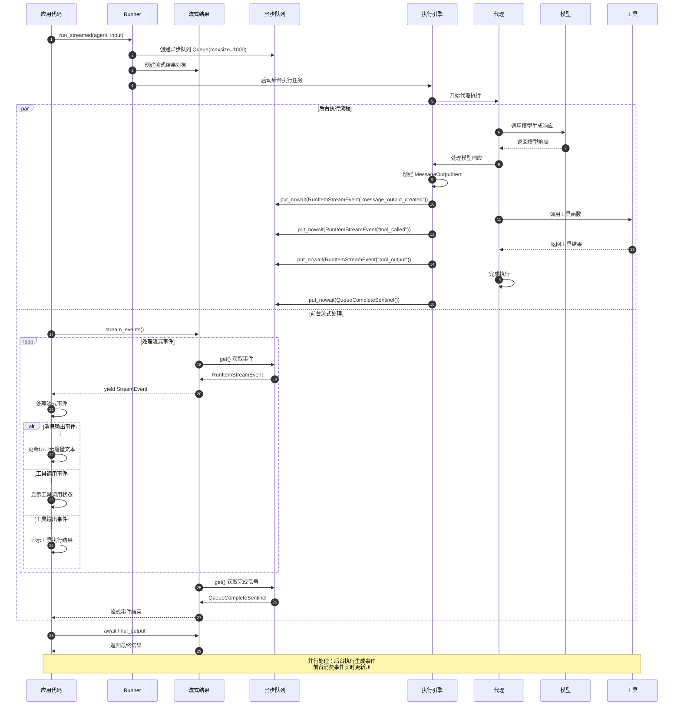

### 场景二：实时会话流式处理

```mermaid
sequenceDiagram
    autonumber
    participant Client as 客户端
    participant RealtimeSession as 实时会话
    participant Model as 实时模型
    participant EventProcessor as 事件处理器
    participant AudioProcessor as 音频处理器
    participant ToolManager as 工具管理
    
    Client->>RealtimeSession: start_session()
    RealtimeSession->>Model: 连接实时模型
    Model-->>RealtimeSession: 连接建立
    
    RealtimeSession->>Client: yield RealtimeAgentStartEvent
    
    loop 实时交互循环
        par 音频输入处理
            Client->>RealtimeSession: 发送音频输入
            RealtimeSession->>Model: 转发音频数据
            
            Model->>Model: 实时语音识别
            Model-->>RealtimeSession: response.audio.delta 事件
            
            RealtimeSession->>EventProcessor: 处理音频增量事件
            EventProcessor->>AudioProcessor: 处理音频数据
            AudioProcessor-->>EventProcessor: 处理后的音频
            
            EventProcessor->>RealtimeSession: RealtimeAudio 事件
            RealtimeSession->>Client: yield RealtimeAudio(音频数据)
            Client->>Client: 实时播放音频响应
            
        and 工具调用处理
            Model-->>RealtimeSession: response.function_call_arguments.delta
            RealtimeSession->>EventProcessor: 处理工具调用增量
            
            alt 工具调用开始
                EventProcessor->>RealtimeSession: RealtimeToolStart 事件
                RealtimeSession->>Client: yield RealtimeToolStart
                Client->>Client: 显示工具调用状态
            end
            
            Model-->>RealtimeSession: response.function_call_arguments.done
            RealtimeSession->>ToolManager: 执行工具调用
            ToolManager->>ToolManager: 执行具体工具
            ToolManager-->>RealtimeSession: 工具执行结果
            
            RealtimeSession->>EventProcessor: 创建工具完成事件
            EventProcessor->>RealtimeSession: RealtimeToolEnd 事件
            RealtimeSession->>Client: yield RealtimeToolEnd
            Client->>Client: 显示工具执行结果
            
        and 会话状态管理
            Model-->>RealtimeSession: conversation.item.created
            RealtimeSession->>EventProcessor: 处理对话历史更新
            EventProcessor->>RealtimeSession: RealtimeHistoryAdded 事件
            RealtimeSession->>Client: yield RealtimeHistoryAdded
            Client->>Client: 更新对话历史UI
        end
        
        alt 会话中断或错误
            Model-->>RealtimeSession: error 事件
            RealtimeSession->>EventProcessor: 处理错误事件
            EventProcessor->>RealtimeSession: RealtimeError 事件
            RealtimeSession->>Client: yield RealtimeError
            Client->>Client: 处理错误并显示
            break 退出循环
        end
    end
    
    RealtimeSession->>Model: 断开连接
    RealtimeSession->>Client: yield RealtimeAgentEndEvent
    Client->>Client: 清理会话资源
    
    note over Client, ToolManager: 实时处理：多种事件类型并行处理<br/>音频、工具调用、状态更新同时进行
```

### 场景三：语音流式处理管道

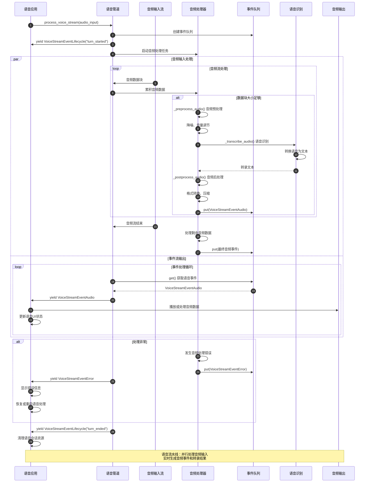

## 6. 最佳实践与使用模式

### 6.1 基础流式代理使用

```python
from agents import Agent, Runner
import asyncio

async def basic_streaming_example():
    """基础流式代理使用示例"""
    
    # 创建代理
    agent = Agent(
        name="StreamingAssistant",
        instructions="你是一个支持流式响应的助手，请详细回答用户问题。",
        model="gpt-4o"
    )
    
    # 执行流式运行
    result = Runner.run_streamed(
        agent,
        "请详细解释机器学习的工作原理，包括训练和推理过程。",
        stream_queue_size=500  # 设置事件队列大小
    )
    
    # 处理流式事件
    accumulated_content = ""
    
    try:
        async for event in result.stream_events():
            
            if event.type == "run_item_stream_event":
                if event.name == "message_output_created":
                    # 处理消息输出事件
                    message_item = event.item
                    content = message_item.content
                    
                    # 计算增量内容
                    if content != accumulated_content:
                        delta = content[len(accumulated_content):]
                        print(delta, end="", flush=True)
                        accumulated_content = content
                
                elif event.name == "tool_called":
                    # 处理工具调用事件
                    tool_item = event.item
                    print(f"\n[工具调用: {tool_item.tool_name}]")
                    print(f"参数: {tool_item.arguments}")
                
                elif event.name == "tool_output":
                    # 处理工具输出事件
                    output_item = event.item
                    print(f"[工具结果: {output_item.output}]")
                
                elif event.name == "handoff_requested":
                    # 处理交接请求事件
                    handoff_item = event.item
                    print(f"\n[代理交接: {handoff_item.target_agent}]")
                
                elif event.name == "reasoning_item_created":
                    # 处理推理过程事件
                    reasoning_item = event.item
                    print(f"\n[推理过程: {reasoning_item.content}]")
            
            elif event.type == "agent_updated_stream_event":
                # 处理代理更新事件
                print(f"\n[代理切换: {event.new_agent.name}]")
            
            elif event.type == "raw_response_event":
                # 处理原始响应事件（通常用于调试）
                raw_data = event.data
                print(f"[原始事件: {raw_data.type if hasattr(raw_data, 'type') else 'unknown'}]")
    
    except Exception as e:
        print(f"\n流式处理错误: {e}")
    
    # 获取最终结果
    try:
        final_output = await result.final_output
        print(f"\n\n=== 最终输出 ===\n{final_output}")
    except Exception as e:
        print(f"获取最终结果错误: {e}")

# 运行示例
asyncio.run(basic_streaming_example())
```

### 6.2 实时会话流式处理

```python
from agents.realtime import RealtimeAgent, RealtimeSession
import asyncio

class RealtimeStreamingHandler:
    """实时流式处理器"""
    
    def __init__(self):
        self.session_active = False
        self.current_audio_buffer = bytearray()
        
    async def handle_realtime_session(self, agent: RealtimeAgent):
        """处理实时会话流式事件"""
        
        session = RealtimeSession(agent)
        
        try:
            self.session_active = True
            print("🎙️ 实时会话开始...")
            
            async for event in session.start_session():
                
                if event.type == "agent_start":
                    print(f"✅ 代理启动: {event.agent.name}")
                    await self._setup_audio_input(session)
                
                elif event.type == "agent_end":
                    print(f"⏹️ 代理结束: {event.agent.name}")
                    self.session_active = False
                
                elif event.type == "audio":
                    # 处理实时音频数据
                    await self._handle_audio_data(event.audio_data)
                
                elif event.type == "audio_end":
                    # 处理音频完成
                    await self._handle_audio_complete(event.final_audio)
                
                elif event.type == "tool_start":
                    print(f"🔧 工具调用开始: {event.tool_name}")
                    print(f"   调用ID: {event.call_id}")
                
                elif event.type == "tool_end":
                    print(f"✅ 工具调用完成: {event.tool_name}")
                    print(f"   参数: {event.arguments}")
                
                elif event.type == "handoff":
                    print(f"🔄 代理交接: {event.from_agent.name} → {event.to_agent.name}")
                    # 可以在这里处理代理切换的UI更新
                
                elif event.type == "error":
                    print(f"❌ 会话错误: {event.error}")
                    await self._handle_session_error(event)
                
                elif event.type == "history_added":
                    print(f"📝 对话历史更新")
                    await self._update_conversation_ui(event.item)
                
                elif event.type == "raw_model_event":
                    # 处理原始模型事件（调试用）
                    print(f"🔍 原始事件: {event.event.type}")
                
                # 检查会话是否应该继续
                if not self.session_active:
                    break
        
        except Exception as e:
            print(f"实时会话处理错误: {e}")
        
        finally:
            await self._cleanup_session()
    
    async def _setup_audio_input(self, session: RealtimeSession):
        """设置音频输入"""
        print("🎵 配置音频输入...")
        # 这里可以配置麦克风、音频格式等
        
    async def _handle_audio_data(self, audio_data: bytes):
        """处理实时音频数据"""
        self.current_audio_buffer.extend(audio_data)
        
        # 实时播放音频（示例）
        print(f"🔊 接收音频数据: {len(audio_data)} 字节")
        
        # 可以在这里实现实时音频播放
        # await self._play_audio_chunk(audio_data)
    
    async def _handle_audio_complete(self, final_audio: bytes):
        """处理音频完成"""
        print(f"🎵 音频完成，总长度: {len(final_audio)} 字节")
        
        # 保存或进一步处理完整音频
        # await self._save_audio(final_audio)
        
        # 清空缓冲区
        self.current_audio_buffer.clear()
    
    async def _handle_session_error(self, error_event):
        """处理会话错误"""
        print(f"处理会话错误: {error_event.error}")
        
        # 可以实现错误恢复逻辑
        # 例如：重连、重启会话等
        
    async def _update_conversation_ui(self, conversation_item):
        """更新对话界面"""
        print(f"更新对话UI: {conversation_item}")
        # 实现UI更新逻辑
        
    async def _cleanup_session(self):
        """清理会话资源"""
        print("🧹 清理会话资源...")
        self.current_audio_buffer.clear()

# 使用示例
async def realtime_streaming_example():
    """实时流式处理示例"""
    
    # 创建实时代理
    realtime_agent = RealtimeAgent(
        name="RealtimeVoiceAssistant",
        instructions="你是一个语音助手，请用自然的语调回答用户问题。",
        voice="nova",  # 设置语音
        model="gpt-4o-realtime-preview"
    )
    
    # 创建处理器
    handler = RealtimeStreamingHandler()
    
    # 启动实时会话
    await handler.handle_realtime_session(realtime_agent)

# 运行实时流式示例
# asyncio.run(realtime_streaming_example())
```

### 6.3 自定义流式事件处理器

```python
from agents import StreamEvent
from typing import Dict, List, Callable, Any
import asyncio
import json
from datetime import datetime

class StreamEventProcessor:
    """自定义流式事件处理器"""
    
    def __init__(self):
        self.event_handlers: Dict[str, List[Callable]] = {}
        self.event_history: List[Dict] = []
        self.metrics: Dict[str, Any] = {
            "total_events": 0,
            "events_by_type": {},
            "processing_errors": 0,
            "start_time": datetime.now()
        }
    
    def register_handler(self, event_type: str, handler: Callable):
        """注册事件处理器"""
        if event_type not in self.event_handlers:
            self.event_handlers[event_type] = []
        self.event_handlers[event_type].append(handler)
    
    def register_pattern_handler(self, pattern: str, handler: Callable):
        """注册模式匹配处理器"""
        def pattern_wrapper(event):
            if hasattr(event, 'name') and pattern in event.name:
                return handler(event)
            elif hasattr(event, 'type') and pattern in event.type:
                return handler(event)
        
        self.register_handler("*", pattern_wrapper)
    
    async def process_stream(self, event_stream) -> None:
        """处理事件流"""
        
        try:
            async for event in event_stream:
                await self._process_single_event(event)
        
        except Exception as e:
            print(f"流式处理错误: {e}")
            self.metrics["processing_errors"] += 1
        
        finally:
            await self._finalize_processing()
    
    async def _process_single_event(self, event: StreamEvent):
        """处理单个事件"""
        
        try:
            # 更新指标
            self.metrics["total_events"] += 1
            event_type = getattr(event, 'type', 'unknown')
            self.metrics["events_by_type"][event_type] = (
                self.metrics["events_by_type"].get(event_type, 0) + 1
            )
            
            # 记录事件历史
            event_record = {
                "timestamp": datetime.now().isoformat(),
                "type": event_type,
                "data": self._serialize_event(event)
            }
            self.event_history.append(event_record)
            
            # 调用注册的处理器
            handlers = self.event_handlers.get(event_type, [])
            handlers.extend(self.event_handlers.get("*", []))  # 通用处理器
            
            for handler in handlers:
                try:
                    result = handler(event)
                    if asyncio.iscoroutine(result):
                        await result
                except Exception as e:
                    print(f"事件处理器错误: {e}")
                    self.metrics["processing_errors"] += 1
        
        except Exception as e:
            print(f"事件处理错误: {e}")
            self.metrics["processing_errors"] += 1
    
    def _serialize_event(self, event: StreamEvent) -> Dict:
        """序列化事件数据"""
        try:
            if hasattr(event, '__dict__'):
                return {k: str(v) for k, v in event.__dict__.items()}
            else:
                return {"raw": str(event)}
        except Exception:
            return {"error": "serialization_failed"}
    
    async def _finalize_processing(self):
        """完成处理后的清理工作"""
        duration = datetime.now() - self.metrics["start_time"]
        self.metrics["total_duration_seconds"] = duration.total_seconds()
        
        print("\n=== 流式处理统计 ===")
        print(f"总事件数: {self.metrics['total_events']}")
        print(f"处理时长: {self.metrics['total_duration_seconds']:.2f}秒")
        print(f"平均事件率: {self.metrics['total_events']/self.metrics['total_duration_seconds']:.2f} 事件/秒")
        print(f"处理错误: {self.metrics['processing_errors']}")
        
        print("\n事件类型统计:")
        for event_type, count in self.metrics["events_by_type"].items():
            print(f"  {event_type}: {count}")
    
    def get_metrics(self) -> Dict:
        """获取处理指标"""
        return self.metrics.copy()
    
    def get_event_history(self, limit: int = None) -> List[Dict]:
        """获取事件历史"""
        if limit:
            return self.event_history[-limit:]
        return self.event_history.copy()

# 使用自定义处理器的示例
async def custom_processor_example():
    """自定义处理器使用示例"""
    
    # 创建处理器
    processor = StreamEventProcessor()
    
    # 注册消息输出处理器
    def handle_message_output(event):
        if hasattr(event, 'item') and hasattr(event.item, 'content'):
            content = event.item.content
            print(f"📝 消息: {content[:100]}{'...' if len(content) > 100 else ''}")
    
    processor.register_handler("run_item_stream_event", handle_message_output)
    
    # 注册工具调用处理器
    async def handle_tool_events(event):
        if hasattr(event, 'name'):
            if event.name == "tool_called":
                print(f"🔧 工具调用: {event.item.tool_name}")
                # 可以记录到数据库、发送通知等
                await asyncio.sleep(0.01)  # 模拟异步处理
            elif event.name == "tool_output":
                print(f"✅ 工具完成: {event.item.tool_name}")
    
    processor.register_pattern_handler("tool", handle_tool_events)
    
    # 注册代理更新处理器
    def handle_agent_update(event):
        print(f"🔄 代理更新: {event.new_agent.name}")
    
    processor.register_handler("agent_updated_stream_event", handle_agent_update)
    
    # 创建测试代理
    agent = Agent(
        name="TestAgent",
        instructions="你是一个测试代理，请简单回答问题。"
    )
    
    # 执行流式运行
    result = Runner.run_streamed(agent, "请简单介绍一下Python。")
    
    # 使用自定义处理器处理事件流
    await processor.process_stream(result.stream_events())
    
    # 获取最终结果
    final_output = await result.final_output
    print(f"\n最终输出: {final_output}")
    
    # 查看处理指标
    metrics = processor.get_metrics()
    print(f"\n处理指标: {json.dumps(metrics, indent=2, default=str)}")

# 运行自定义处理器示例
# asyncio.run(custom_processor_example())
```

### 6.4 流式事件的错误处理和重试

```python
from agents import StreamEvent
import asyncio
import logging
from typing import Optional, Dict, List
from dataclasses import dataclass
from enum import Enum

class EventProcessingStrategy(Enum):
    FAIL_FAST = "fail_fast"          # 遇到错误立即失败
    SKIP_ERROR = "skip_error"        # 跳过错误事件继续处理
    RETRY_ON_ERROR = "retry_on_error" # 重试错误事件

@dataclass
class RetryConfig:
    max_retries: int = 3
    initial_delay: float = 1.0
    max_delay: float = 10.0
    backoff_factor: float = 2.0

class RobustStreamProcessor:
    """健壮的流式事件处理器"""
    
    def __init__(
        self,
        strategy: EventProcessingStrategy = EventProcessingStrategy.SKIP_ERROR,
        retry_config: Optional[RetryConfig] = None
    ):
        self.strategy = strategy
        self.retry_config = retry_config or RetryConfig()
        self.logger = logging.getLogger(__name__)
        
        # 错误统计
        self.error_stats: Dict[str, int] = {}
        self.failed_events: List[Dict] = []
        self.retry_attempts: Dict[str, int] = {}
    
    async def process_stream_with_resilience(
        self,
        event_stream,
        event_handler
    ) -> Dict[str, Any]:
        """带弹性的流式事件处理"""
        
        processed_count = 0
        error_count = 0
        skipped_count = 0
        
        try:
            async for event in event_stream:
                try:
                    await self._process_event_with_strategy(event, event_handler)
                    processed_count += 1
                    
                except Exception as e:
                    error_count += 1
                    await self._handle_processing_error(event, e)
                    
                    if self.strategy == EventProcessingStrategy.FAIL_FAST:
                        raise
                    elif self.strategy == EventProcessingStrategy.SKIP_ERROR:
                        skipped_count += 1
                        continue
        
        except Exception as e:
            self.logger.error(f"流式处理致命错误: {e}")
            raise
        
        return {
            "processed": processed_count,
            "errors": error_count,
            "skipped": skipped_count,
            "error_stats": self.error_stats,
            "failed_events_count": len(self.failed_events)
        }
    
    async def _process_event_with_strategy(self, event: StreamEvent, handler):
        """根据策略处理事件"""
        
        if self.strategy == EventProcessingStrategy.RETRY_ON_ERROR:
            await self._process_with_retry(event, handler)
        else:
            await self._process_once(event, handler)
    
    async def _process_once(self, event: StreamEvent, handler):
        """单次处理事件"""
        try:
            result = handler(event)
            if asyncio.iscoroutine(result):
                await result
        except Exception as e:
            self._record_error(event, e)
            raise
    
    async def _process_with_retry(self, event: StreamEvent, handler):
        """带重试的事件处理"""
        
        event_id = self._get_event_id(event)
        retry_count = 0
        last_error = None
        
        while retry_count <= self.retry_config.max_retries:
            try:
                result = handler(event)
                if asyncio.iscoroutine(result):
                    await result
                
                # 成功处理，清除重试记录
                if event_id in self.retry_attempts:
                    del self.retry_attempts[event_id]
                return
                
            except Exception as e:
                last_error = e
                retry_count += 1
                self.retry_attempts[event_id] = retry_count
                
                if retry_count <= self.retry_config.max_retries:
                    # 计算退避延迟
                    delay = min(
                        self.retry_config.initial_delay * (
                            self.retry_config.backoff_factor ** (retry_count - 1)
                        ),
                        self.retry_config.max_delay
                    )
                    
                    self.logger.warning(
                        f"事件处理失败，{delay:.2f}秒后重试 "
                        f"({retry_count}/{self.retry_config.max_retries}): {e}"
                    )
                    
                    await asyncio.sleep(delay)
                else:
                    # 重试次数用完，记录错误
                    self._record_error(event, last_error)
                    raise last_error
    
    async def _handle_processing_error(self, event: StreamEvent, error: Exception):
        """处理事件处理错误"""
        
        error_type = type(error).__name__
        self.error_stats[error_type] = self.error_stats.get(error_type, 0) + 1
        
        # 记录失败的事件详情
        failed_event = {
            "event_type": getattr(event, 'type', 'unknown'),
            "error_type": error_type,
            "error_message": str(error),
            "timestamp": datetime.now().isoformat(),
            "retry_attempts": self.retry_attempts.get(self._get_event_id(event), 0)
        }
        self.failed_events.append(failed_event)
        
        self.logger.error(f"事件处理失败: {error}")
    
    def _record_error(self, event: StreamEvent, error: Exception):
        """记录错误"""
        error_type = type(error).__name__
        self.error_stats[error_type] = self.error_stats.get(error_type, 0) + 1
    
    def _get_event_id(self, event: StreamEvent) -> str:
        """获取事件唯一标识"""
        event_type = getattr(event, 'type', 'unknown')
        timestamp = getattr(event, 'timestamp', id(event))
        return f"{event_type}_{timestamp}"
    
    def get_error_report(self) -> Dict[str, Any]:
        """获取错误报告"""
        return {
            "error_statistics": self.error_stats,
            "failed_events": self.failed_events,
            "active_retries": self.retry_attempts
        }

# 使用示例
async def resilient_streaming_example():
    """弹性流式处理示例"""
    
    # 创建可能出错的事件处理函数
    processed_events = 0
    
    async def potentially_failing_handler(event):
        nonlocal processed_events
        processed_events += 1
        
        # 模拟不同类型的错误
        import random
        
        if random.random() < 0.1:  # 10% 概率网络错误
            raise ConnectionError("模拟网络连接错误")
        
        if random.random() < 0.05:  # 5% 概率数据错误
            raise ValueError("模拟数据格式错误")
        
        if random.random() < 0.02:  # 2% 概率系统错误
            raise RuntimeError("模拟系统内部错误")
        
        # 正常处理
        if hasattr(event, 'type'):
            print(f"✅ 处理事件: {event.type}")
        
        # 模拟处理时间
        await asyncio.sleep(0.01)
    
    # 测试不同的处理策略
    strategies = [
        EventProcessingStrategy.SKIP_ERROR,
        EventProcessingStrategy.RETRY_ON_ERROR
    ]
    
    for strategy in strategies:
        print(f"\n=== 测试策略: {strategy.value} ===")
        
        processor = RobustStreamProcessor(
            strategy=strategy,
            retry_config=RetryConfig(
                max_retries=2,
                initial_delay=0.1,
                backoff_factor=2.0
            )
        )
        
        # 创建测试代理和流式结果
        agent = Agent(
            name="TestAgent",
            instructions="简单回答问题，用于测试流式处理。"
        )
        
        result = Runner.run_streamed(agent, "请说一个笑话。")
        
        try:
            stats = await processor.process_stream_with_resilience(
                result.stream_events(),
                potentially_failing_handler
            )
            
            print(f"处理统计: {stats}")
            
            # 获取错误报告
            error_report = processor.get_error_report()
            if error_report["error_statistics"]:
                print(f"错误报告: {error_report}")
            
        except Exception as e:
            print(f"处理失败: {e}")
        
        # 获取最终结果
        try:
            final_output = await result.final_output
            print(f"最终输出: {final_output[:100]}...")
        except Exception as e:
            print(f"获取最终结果失败: {e}")

# 运行弹性处理示例
# asyncio.run(resilient_streaming_example())
```

Streaming模块通过事件驱动的架构和异步队列机制，为OpenAI Agents提供了高效的流式数据处理能力，支持从基础文本流到复杂实时交互的各种场景需求。

---

## API接口

## 1. API 总览

Streaming 模块提供了流式事件系统，支持实时获取Agent执行过程中的各种事件。

### API 分类

| API类别 | 核心API | 功能描述 |
|---------|---------|---------|
| **流式执行** | `run_streamed(agent, input)` | 流式运行Agent |
| **事件迭代** | `async for event in stream` | 异步迭代事件 |
| **事件类型** | `RunStartEvent` | 运行开始事件 |
| | `RunStepDoneEvent` | 步骤完成事件 |
| | `RunDoneEvent` | 运行完成事件 |

## 2. run_streamed() API

**API签名：**

```python
async def run_streamed(
    agent: Agent,
    input: str | list,
    *,
    config: RunConfig | None = None,
    **kwargs
) -> AsyncIterator[StreamEvent]
```

**使用示例：**

```python
from agents import Agent, run_streamed

agent = Agent(name="assistant", instructions="你是助手")

# 流式执行
async for event in run_streamed(agent, "你好"):
    if event["type"] == "response.text.delta":
        print(event["delta"], end="", flush=True)
    elif event["type"] == "response.done":
        print("\n完成!")
```

## 3. 流式事件类型

### 3.1 RunStartEvent

```python
{
    "type": "run.start",
    "run_id": "run_abc123"
}
```

### 3.2 TextDeltaEvent

```python
{
    "type": "response.text.delta",
    "delta": "你好",
    "content_index": 0
}
```

### 3.3 FunctionCallEvent

```python
{
    "type": "response.function_call_arguments.delta",
    "delta": '{"query": "天气"}',
    "call_id": "call_123"
}
```

### 3.4 RunDoneEvent

```python
{
    "type": "run.done",
    "run_result": RunResult(...)
}
```

## 4. 高级用法

### 4.1 事件过滤

```python
async for event in run_streamed(agent, "查询"):
    # 只处理文本增量
    if event["type"] == "response.text.delta":
        handle_text(event["delta"])
```

### 4.2 进度追踪

```python
async for event in run_streamed(agent, input):
    if event["type"] == "run.step.done":
        step_num = event.get("step_number")
        print(f"完成步骤 {step_num}")
```

### 4.3 实时UI更新

```python
async for event in run_streamed(agent, query):
    if event["type"] == "response.text.delta":
        await websocket.send_text(event["delta"])
    elif event["type"] == "response.function_call":
        await websocket.send_json({
            "tool": event["name"],
            "status": "calling"
        })
```

Streaming模块通过丰富的事件类型，支持构建实时响应的AI应用。

---

## 数据结构

## 1. 流式事件结构

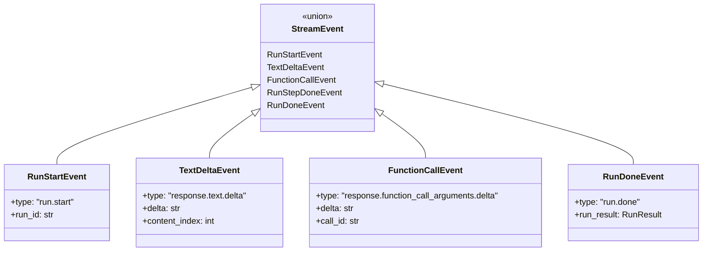

## 2. 事件类型详解

### 2.1 文本事件

```python
# 文本增量事件
class TextDeltaEvent(TypedDict):
    type: Literal["response.text.delta"]
    delta: str               # 文本片段
    content_index: int       # 内容索引
    
# 文本完成事件
class TextDoneEvent(TypedDict):
    type: Literal["response.output_item.done"]
    item: ResponseTextItem   # 完整文本项
```

### 2.2 工具调用事件

```python
# 工具参数增量
class FunctionCallArgumentsDelta(TypedDict):
    type: Literal["response.function_call_arguments.delta"]
    delta: str               # 参数JSON片段
    call_id: str             # 调用ID
    
# 工具调用完成
class FunctionCallDone(TypedDict):
    type: Literal["response.function_call.done"]
    call_id: str
    name: str
    arguments: str           # 完整参数JSON
```

### 2.3 运行事件

```python
# 运行开始
class RunStartEvent(TypedDict):
    type: Literal["run.start"]
    run_id: str
    
# 步骤完成
class RunStepDoneEvent(TypedDict):
    type: Literal["run.step.done"]
    step_number: int
    
# 运行完成
class RunDoneEvent(TypedDict):
    type: Literal["run.done"]
    run_result: RunResult
```

## 3. 事件流结构

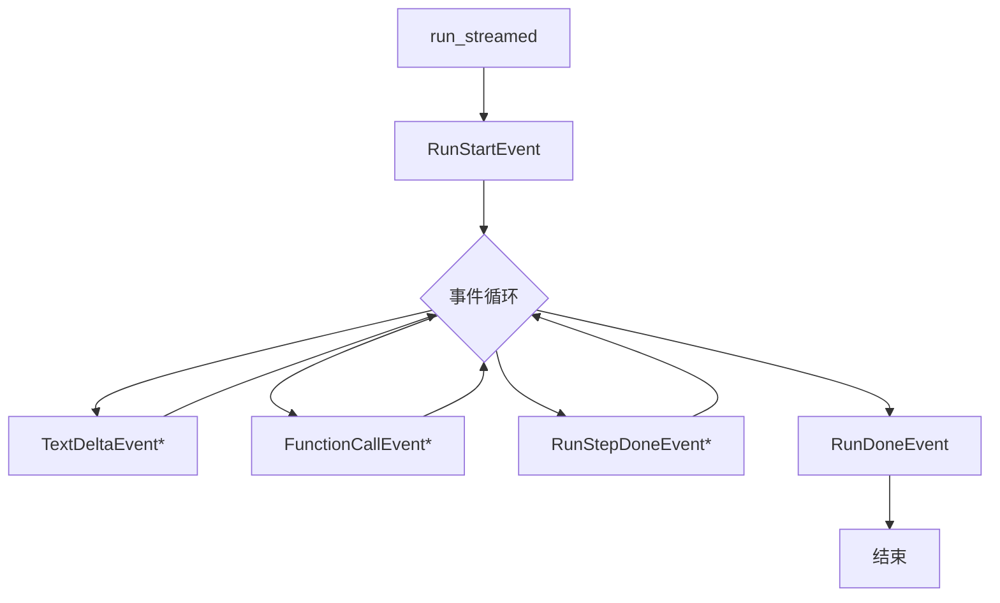

## 4. 事件聚合器

```python
class EventAggregator:
    """聚合流式事件为完整对象"""
    
    text_buffers: dict[int, str]      # 文本缓冲
    args_buffers: dict[str, str]      # 参数缓冲
    
    def add_text_delta(self, index: int, delta: str):
        """累积文本增量"""
        self.text_buffers[index] = self.text_buffers.get(index, "") + delta
    
    def add_args_delta(self, call_id: str, delta: str):
        """累积参数增量"""
        self.args_buffers[call_id] = self.args_buffers.get(call_id, "") + delta
    
    def get_complete_text(self, index: int) -> str:
        """获取完整文本"""
        return self.text_buffers.get(index, "")
```

## 5. 数据流转

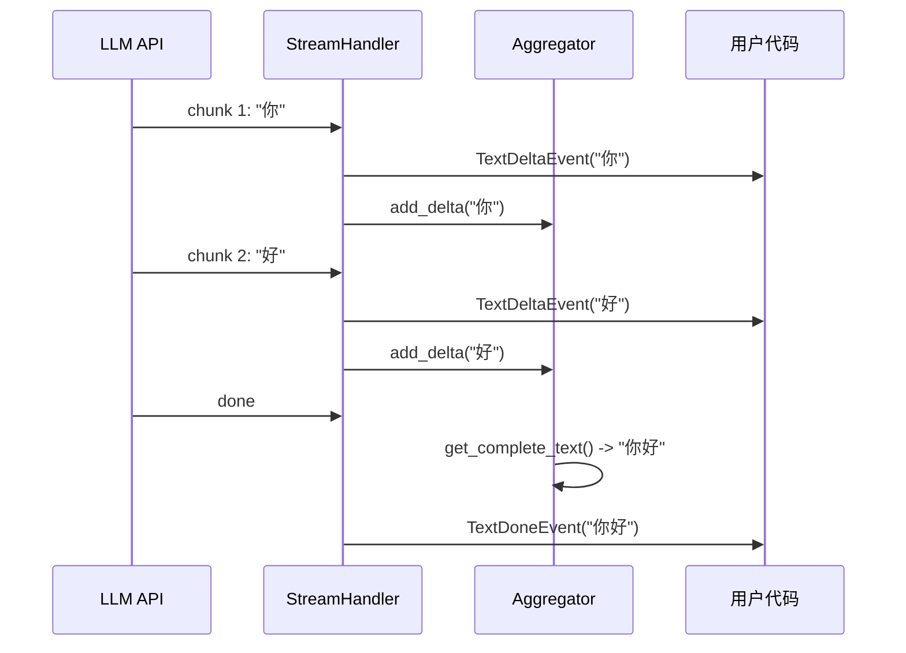

Streaming模块通过结构化的事件系统，实现了细粒度的实时数据传输。

---

## 时序图

## 1. 流式执行完整时序图

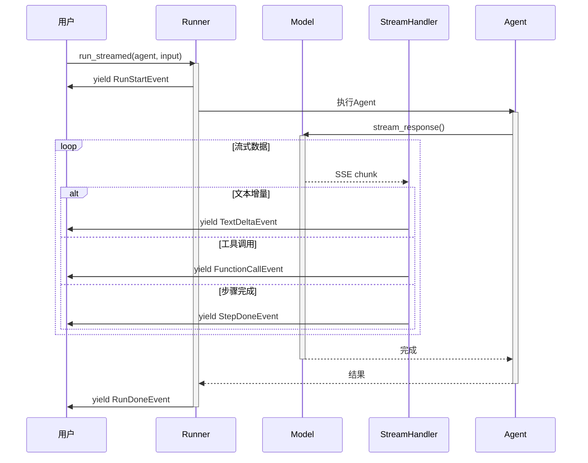

## 2. 文本流式处理

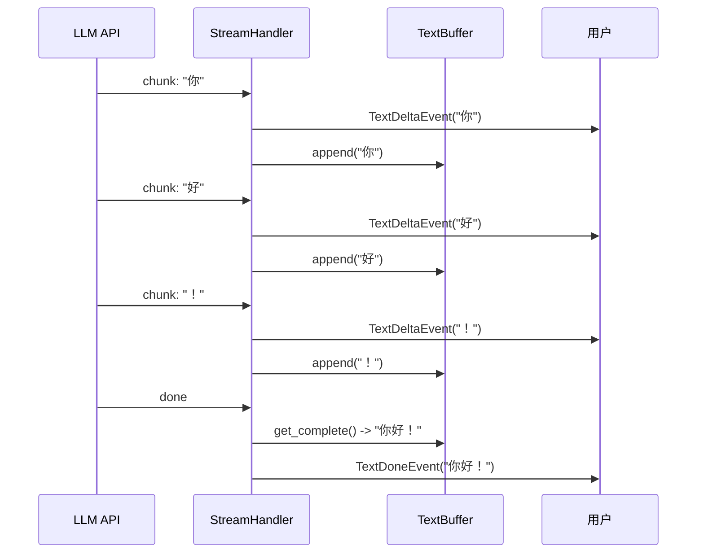

## 3. 工具调用流式处理

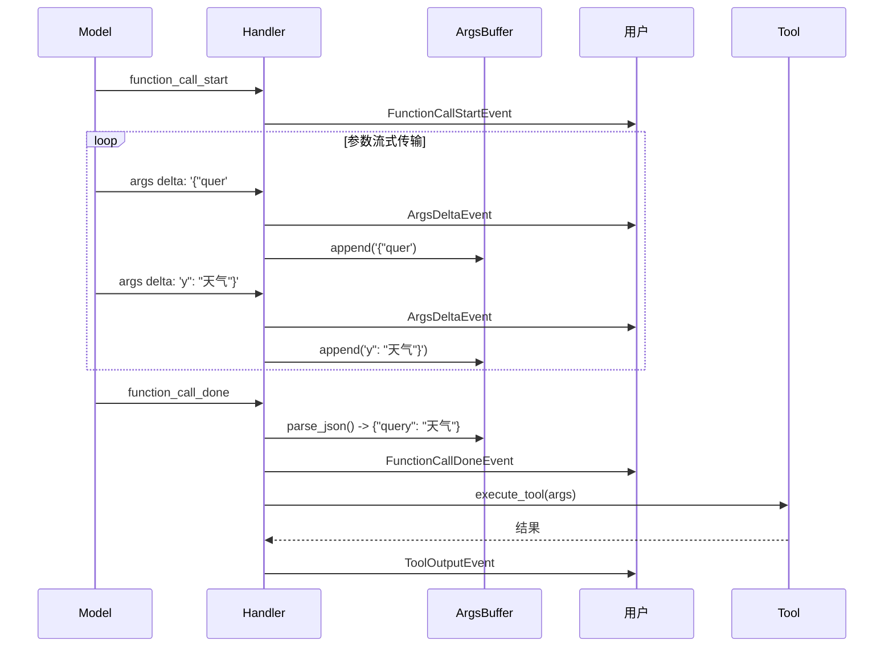

## 4. 多步骤流式执行

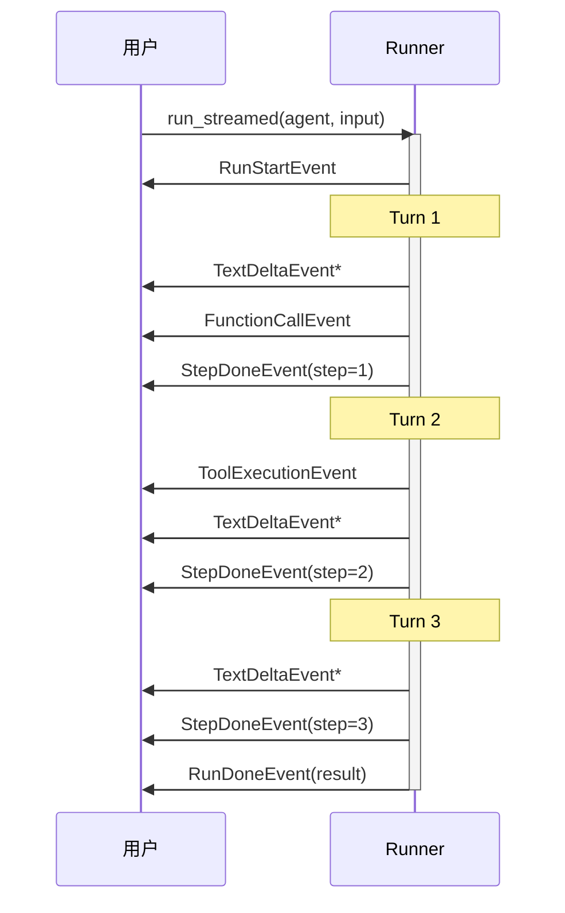

## 5. 错误处理流

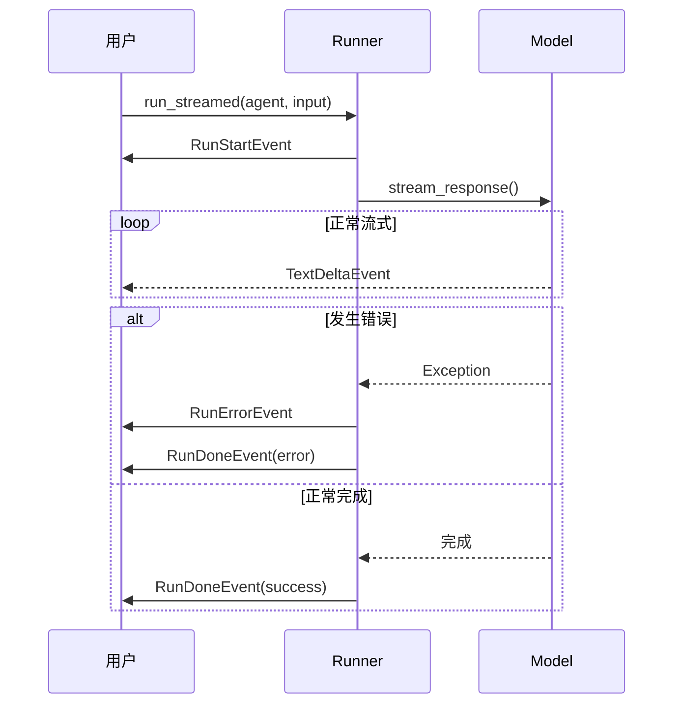

## 6. 实时UI更新流程

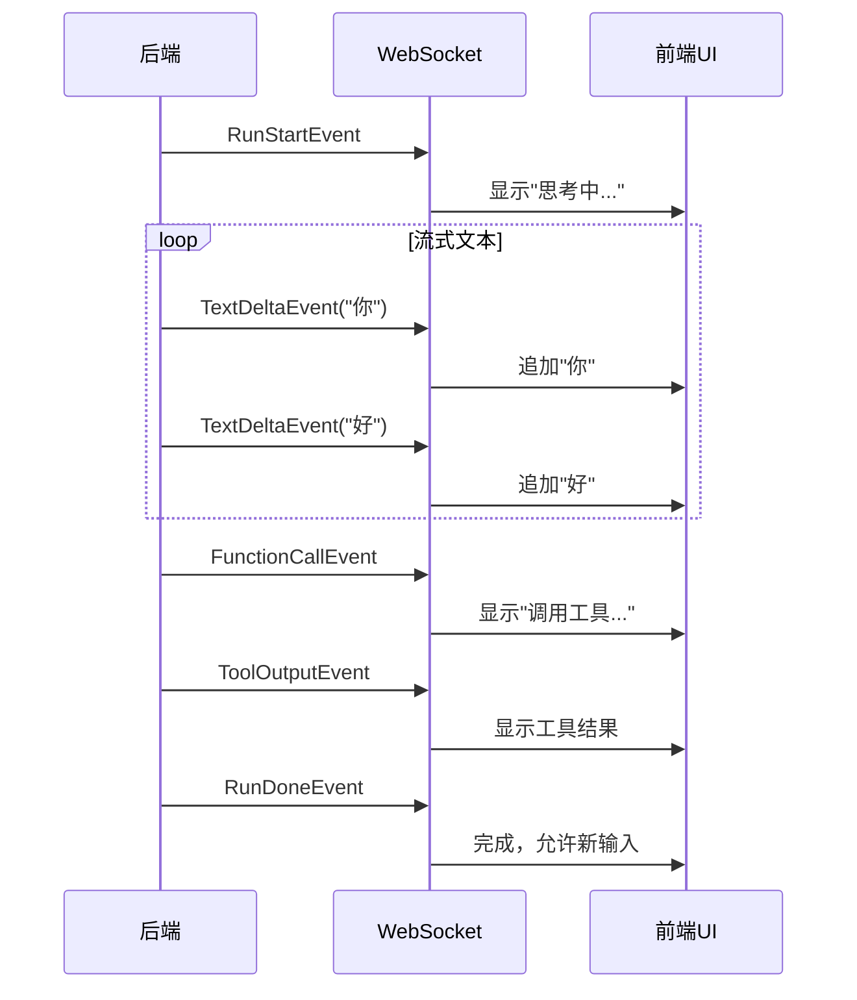

Streaming模块通过精心设计的时序流程，实现了流畅的实时交互体验。

---
