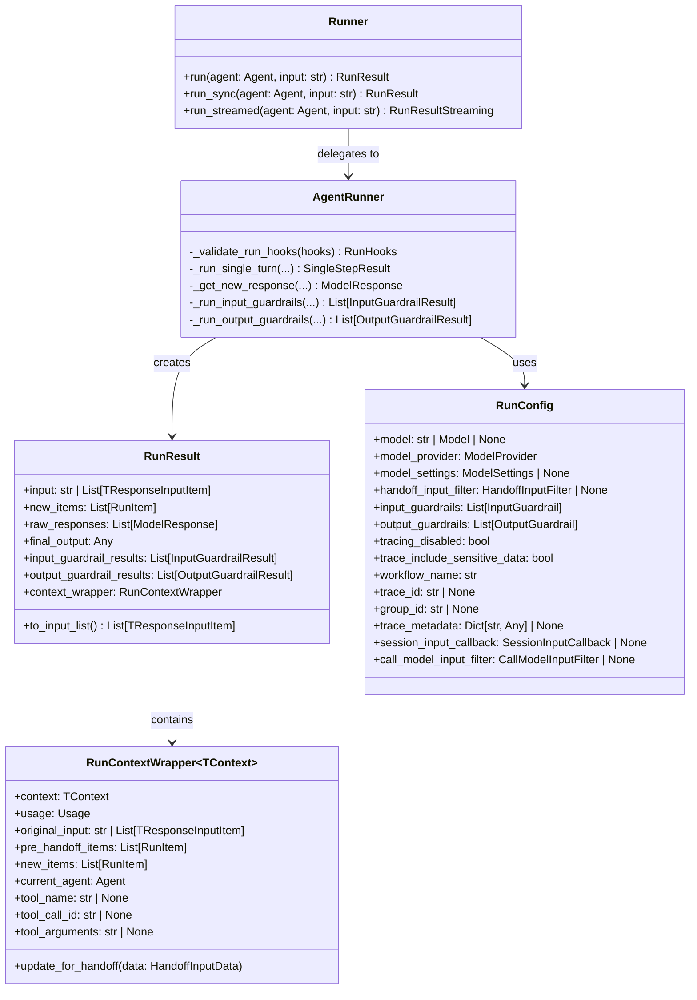
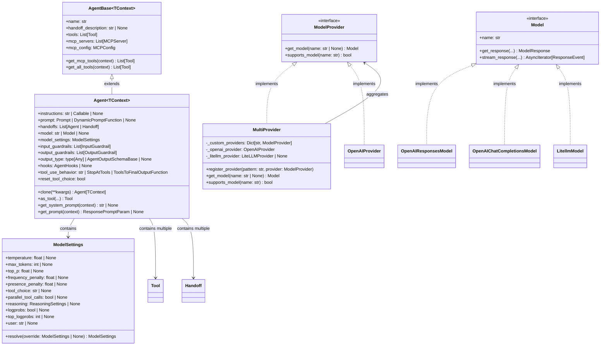
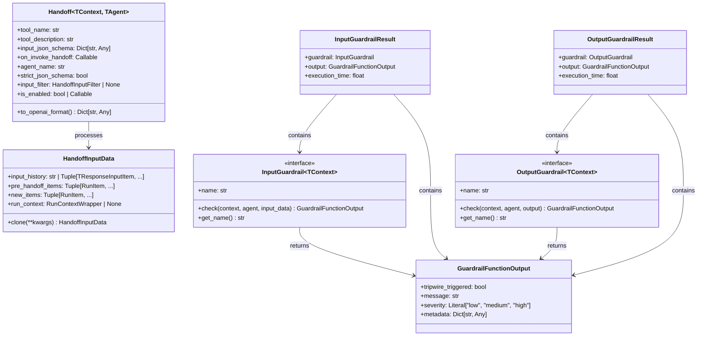
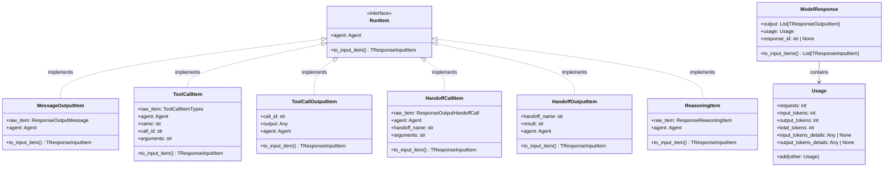
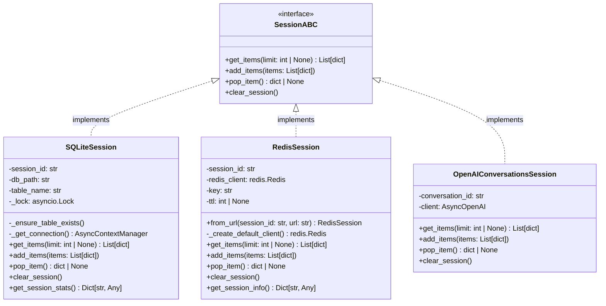
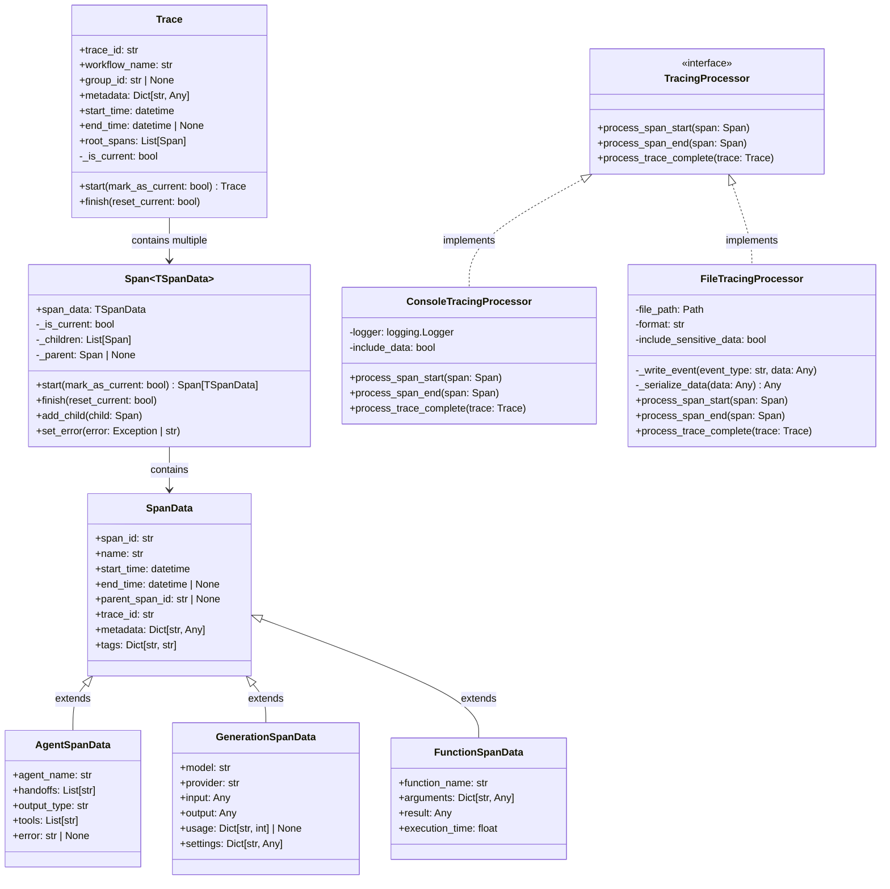
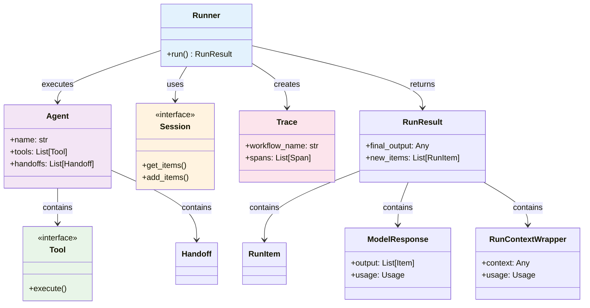
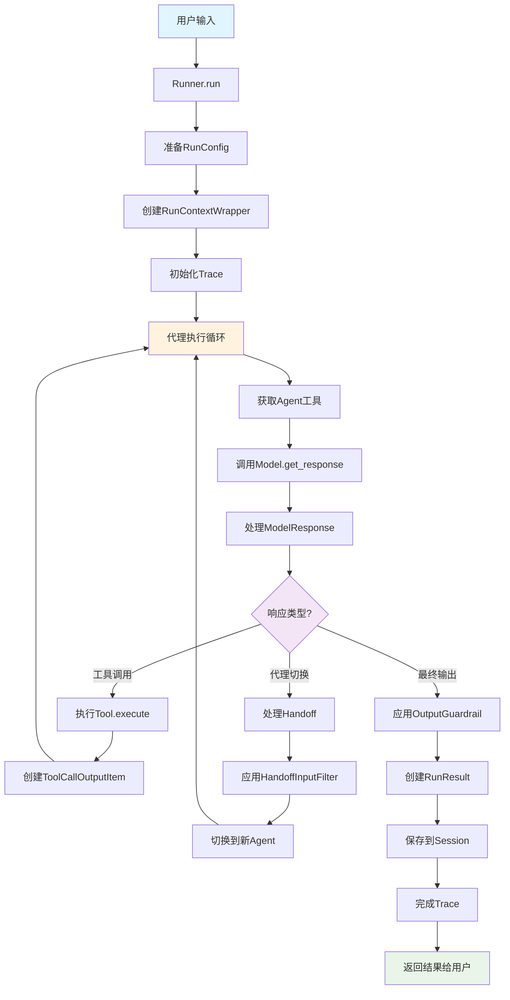

# OpenAI Agents SDK 关键数据结构UML图

## 9.1 核心数据结构概览

OpenAI Agents SDK的数据结构设计遵循清晰的分层架构，主要包含以下几个层次：

- **执行层数据结构**: RunResult, RunConfig, RunContextWrapper等
- **代理层数据结构**: Agent, AgentBase, ModelSettings等  
- **工具层数据结构**: FunctionTool, ToolContext, Handoff等
- **消息层数据结构**: RunItem, ModelResponse, TResponseInputItem等
- **会话层数据结构**: Session, HandoffInputData等
- **追踪层数据结构**: Trace, Span, SpanData等

## 9.2 核心执行层UML类图

## 9.3 Agent和模型层UML类图

## 9.4 工具系统UML类图

```mermaid
classDiagram
    class Tool {
        <<interface>>
        +name: str
        +description: str
        +execute(context: ToolContext, arguments: str) Any
        +is_enabled: bool | Callable
    }
    
    class FunctionTool {
        +name: str
        +description: str
        +params_json_schema: Dict[str, Any]
        +on_invoke_tool: Callable
        +strict_json_schema: bool
        +is_enabled: bool | Callable
        +execute(context: ToolContext, arguments: str) Any
        +to_openai_format() Dict[str, Any]
    }
    
    class ToolContext~TContext~ {
        +run_context: RunContextWrapper[TContext]
        +agent: AgentBase
        +tool_name: str
        +tool_call_id: str
        +tool_arguments: str
        +model_provider: ModelProvider
        +context: TContext
        +usage: Usage
        +create_sub_agent(name, instructions, **kwargs) Agent[TContext]
    }
    
    class MCPTool {
        +server: MCPServer
        +tool_name: str
        +tool_schema: Dict[str, Any]
        +description: str
        +execute(context: ToolContext, arguments: str) Any
        +to_openai_format() Dict[str, Any]
    }
    
    class FileSearchTool {
        +file_ids: List[str]
        +filters: Filters | None
        +ranking_options: RankingOptions | None
        +description: str
        +execute(context: ToolContext, arguments: str) str
        +to_openai_format() Dict[str, Any]
    }
    
    class CodeInterpreterTool {
        +description: str
        +execute(context: ToolContext, arguments: str) str
        +to_openai_format() Dict[str, Any]
    }
    
    class ComputerTool {
        +computer: Computer | AsyncComputer
        +description: str
        +execute(context: ToolContext, arguments: str) str
        +to_openai_format() Dict[str, Any]
    }
    
    class LocalShellTool {
        +executor: LocalShellExecutor
        +description: str
        +execute(context: ToolContext, arguments: str) str
        +to_openai_format() Dict[str, Any]
    }
    
    Tool <|.. FunctionTool : implements
    Tool <|.. MCPTool : implements
    Tool <|.. FileSearchTool : implements
    Tool <|.. CodeInterpreterTool : implements
    Tool <|.. ComputerTool : implements
    Tool <|.. LocalShellTool : implements
    Tool --> ToolContext : uses
```

## 9.5 代理协作层UML类图

## 9.6 消息和项目层UML类图

## 9.7 会话管理UML类图

## 9.8 追踪系统UML类图

## 9.9 数据结构关系总览图

## 9.10 数据流向图

这些UML图和数据结构分析展示了OpenAI Agents SDK的完整架构设计，体现了其高度模块化、类型安全和扩展性强的特点。通过这些图表，开发者可以更好地理解框架的内部工作原理和各组件间的关系。
