# OpenAI Agents Python SDK 源码剖析

## 目录
1. [框架使用手册](#框架使用手册)
2. [整体架构分析](#整体架构分析)
3. [核心API深入分析](#核心api深入分析)
4. [模块化架构分析](#模块化架构分析)
5. [关键函数和继承关系](#关键函数和继承关系)
6. [实战经验总结](#实战经验总结)

---

## 框架使用手册

### 1. 快速开始

OpenAI Agents SDK 是一个用于构建AI智能体的Python框架，支持工具调用、多智能体协作、实时语音交互等功能。

#### 安装
```bash
pip install openai-agents
```

#### 基本使用
```python
import agents

# 创建一个简单的智能体
agent = agents.Agent(
    name="assistant",
    instructions="You are a helpful assistant.",
    model="gpt-4.1"
)

# 运行智能体
result = await agents.Runner.run(
    starting_agent=agent,
    input="Hello, how can you help me?"
)

print(result.output)
```

### 2. 核心概念

#### 2.1 Agent（智能体）
智能体是框架的核心概念，封装了AI模型、指令、工具和行为逻辑。

```python
@dataclass
class Agent(AgentBase, Generic[TContext]):
    """智能体类，配置了指令、工具、护栏、移交等功能"""
    
    instructions: str | Callable = None  # 系统提示词
    prompt: Prompt | DynamicPromptFunction = None  # 动态提示
    handoffs: list[Agent | Handoff] = field(default_factory=list)  # 移交列表
    model: str | Model = None  # 模型实现
    tools: list[Tool] = field(default_factory=list)  # 工具列表
    input_guardrails: list[InputGuardrail] = field(default_factory=list)  # 输入护栏
    output_guardrails: list[OutputGuardrail] = field(default_factory=list)  # 输出护栏
```

#### 2.2 Runner（执行器）
Runner负责执行智能体的工作流程。

```python
class Runner:
    @classmethod
    async def run(
        cls,
        starting_agent: Agent[TContext],
        input: str | list[TResponseInputItem],
        *,
        context: TContext | None = None,
        max_turns: int = DEFAULT_MAX_TURNS,
        hooks: RunHooks[TContext] | None = None,
        run_config: RunConfig | None = None,
        session: Session | None = None,
    ) -> RunResult:
        """执行智能体工作流程"""
```

#### 2.3 Tools（工具）
工具系统允许智能体执行外部操作。

```python
@function_tool
def search_web(query: str) -> str:
    """搜索网络内容"""
    # 实现搜索逻辑
    return search_results

agent = agents.Agent(
    name="researcher",
    instructions="You can search the web for information.",
    tools=[search_web]
)
```

### 3. 高级功能

#### 3.1 多智能体协作（Handoffs）
```python
# 创建专门的智能体
billing_agent = agents.Agent(
    name="billing_specialist",
    instructions="Handle billing inquiries and payment issues.",
    handoff_description="Handles billing and payment related questions"
)

# 创建主智能体，配置移交
main_agent = agents.Agent(
    name="customer_service",
    instructions="Route customer inquiries to appropriate specialists.",
    handoffs=[billing_agent]
)
```

#### 3.2 护栏系统（Guardrails）
```python
@agents.input_guardrail
def check_inappropriate_content(
    context: agents.RunContextWrapper,
    agent: agents.Agent,
    input: str
) -> agents.GuardrailFunctionOutput:
    """检查不当内容"""
    if contains_inappropriate_content(input):
        return agents.GuardrailFunctionOutput(
            output_info="Inappropriate content detected",
            tripwire_triggered=True
        )
    return agents.GuardrailFunctionOutput(
        output_info="Content is appropriate",
        tripwire_triggered=False
    )

agent = agents.Agent(
    name="safe_assistant",
    instructions="You are a helpful and safe assistant.",
    input_guardrails=[check_inappropriate_content]
)
```

#### 3.3 会话管理
```python
# 使用SQLite会话存储
session = agents.SQLiteSession(
    session_id="user_123",
    db_path="conversations.db"
)

result = await agents.Runner.run(
    starting_agent=agent,
    input="Continue our previous conversation",
    session=session
)
```

---

## 整体架构分析

### 1. 架构概览

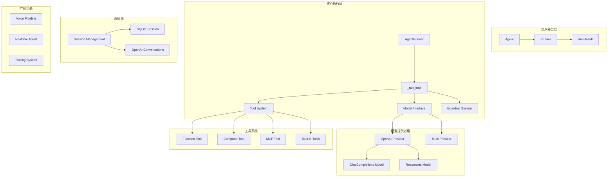

### 2. 核心执行流程时序图

```mermaid
sequenceDiagram
    participant User
    participant Runner
    participant AgentRunner
    participant Agent
    participant Model
    participant Tools
    participant Guardrails
    
    User->>Runner: run(agent, input)
    Runner->>AgentRunner: run()
    
    loop 执行循环 (max_turns)
        AgentRunner->>Guardrails: 运行输入护栏
        Guardrails-->>AgentRunner: 护栏结果
        
        AgentRunner->>Agent: 获取系统提示
        Agent-->>AgentRunner: 系统提示
        
        AgentRunner->>Agent: 获取工具列表
        Agent-->>AgentRunner: 可用工具
        
        AgentRunner->>Model: 调用模型
        Model-->>AgentRunner: 模型响应
        
        alt 有工具调用
            AgentRunner->>Tools: 执行工具
            Tools-->>AgentRunner: 工具结果
        else 有移交
            AgentRunner->>Agent: 切换到新智能体
        else 有最终输出
            AgentRunner->>Guardrails: 运行输出护栏
            Guardrails-->>AgentRunner: 护栏结果
            break 结束循环
        end
    end
    
    AgentRunner-->>Runner: RunResult
    Runner-->>User: 最终结果
```

### 3. 模块依赖关系图

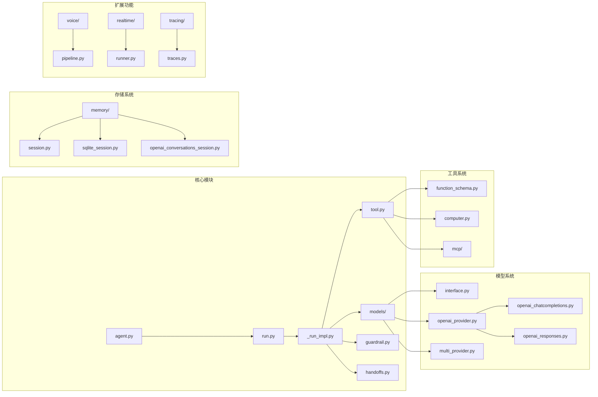

---

## 核心API深入分析

### 1. Runner.run() - 主要入口函数

#### 函数签名和功能
```python
@classmethod
async def run(
    cls,
    starting_agent: Agent[TContext],
    input: str | list[TResponseInputItem],
    *,
    context: TContext | None = None,
    max_turns: int = DEFAULT_MAX_TURNS,
    hooks: RunHooks[TContext] | None = None,
    run_config: RunConfig | None = None,
    previous_response_id: str | None = None,
    conversation_id: str | None = None,
    session: Session | None = None,
) -> RunResult:
    """
    运行智能体工作流程的主入口函数
    
    执行循环：
    1. 调用智能体处理输入
    2. 如果有最终输出，循环终止
    3. 如果有移交，切换到新智能体继续
    4. 否则执行工具调用，重新循环
    """
```

#### 调用链路分析
```python
# src/agents/run.py:233-294
async def run(...) -> RunResult:
    runner = DEFAULT_AGENT_RUNNER  # 获取默认执行器
    return await runner.run(
        starting_agent,
        input,
        context=context,
        max_turns=max_turns,
        hooks=hooks,
        run_config=run_config,
        previous_response_id=previous_response_id,
        conversation_id=conversation_id,
        session=session,
    )
```

#### 关键实现细节
```python
# src/agents/run.py:456-632 (AgentRunner.run)
async def run(self, starting_agent: Agent[TContext], input: str | list[TResponseInputItem], **kwargs) -> RunResult:
    # 1. 参数准备和验证
    max_turns = kwargs.get("max_turns", DEFAULT_MAX_TURNS)
    hooks = self._validate_run_hooks(kwargs.get("hooks"))
    run_config = kwargs.get("run_config") or RunConfig()
    
    # 2. 会话输入准备
    prepared_input = await self._prepare_input_with_session(
        input, session, run_config.session_input_callback
    )
    
    # 3. 执行主循环
    with TraceCtxManager(workflow_name=run_config.workflow_name):
        current_agent = starting_agent
        current_input = prepared_input
        
        for turn_number in range(max_turns):
            # 运行单次迭代
            result = await self._run_single_turn(
                current_agent, current_input, context_wrapper, hooks
            )
            
            # 处理结果
            if result.is_final_output:
                break
            elif result.handoff_agent:
                current_agent = result.handoff_agent
                current_input = result.handoff_input
            else:
                current_input = result.tool_outputs
    
    return RunResult(...)
```

### 2. Agent类 - 智能体核心

#### 类定义和关键属性
```python
# src/agents/agent.py:133-179
@dataclass
class Agent(AgentBase, Generic[TContext]):
    """智能体是配置了指令、工具、护栏、移交等功能的AI模型"""
    
    instructions: str | Callable = None
    """指令，用作系统提示词。可以是字符串或动态生成函数"""
    
    prompt: Prompt | DynamicPromptFunction = None
    """提示对象，允许动态配置指令、工具等（仅OpenAI Responses API）"""
    
    handoffs: list[Agent[Any] | Handoff[TContext, Any]] = field(default_factory=list)
    """移交列表，智能体可以委托给的子智能体"""
    
    model: str | Model = None
    """模型实现，默认使用gpt-4.1"""
```

#### 关键方法实现

##### get_all_tools() - 获取所有可用工具
```python
# src/agents/agent.py:111-129
async def get_all_tools(self, run_context: RunContextWrapper[TContext]) -> list[Tool]:
    """获取智能体的所有可用工具，包括MCP工具"""
    
    # 1. 获取MCP工具
    mcp_tools = await self.get_mcp_tools(run_context)
    
    # 2. 检查工具是否启用
    async def _check_tool_enabled(tool: Tool) -> bool:
        if not isinstance(tool, FunctionTool):
            return True
        
        attr = tool.is_enabled
        if isinstance(attr, bool):
            return attr
        
        # 调用动态启用函数
        res = attr(run_context, self)
        if inspect.isawaitable(res):
            return bool(await res)
        return bool(res)
    
    # 3. 并发检查所有工具
    results = await asyncio.gather(*(_check_tool_enabled(t) for t in self.tools))
    enabled = [tool for tool, enabled in zip(self.tools, results) if enabled]
    
    return [*mcp_tools, *enabled]
```

##### as_tool() - 将智能体转换为工具
```python
# src/agents/agent.py:382-441
def as_tool(self, tool_name: str | None, tool_description: str | None, ...) -> Tool:
    """将智能体转换为可被其他智能体调用的工具"""
    
    @function_tool(
        name_override=tool_name or _transforms.transform_string_function_style(self.name),
        description_override=tool_description or "",
        is_enabled=is_enabled,
    )
    async def run_agent(context: RunContextWrapper, input: str) -> str:
        # 运行智能体
        output = await Runner.run(
            starting_agent=self,
            input=input,
            context=context.context,
            run_config=run_config,
            max_turns=resolved_max_turns,
            hooks=hooks,
            previous_response_id=previous_response_id,
            conversation_id=conversation_id,
            session=session,
        )
        
        # 提取输出
        if custom_output_extractor:
            return await custom_output_extractor(output)
        return ItemHelpers.text_message_outputs(output.new_items)
    
    return run_agent
```

### 3. 模型系统 - Model接口和提供者

#### Model接口定义
```python
# src/agents/models/interface.py:36-108
class Model(abc.ABC):
    """模型接口的抽象基类"""
    
    @abc.abstractmethod
    async def response(
        self,
        system_instructions: str | None,
        input: str | list[TResponseInputItem],
        model_settings: ModelSettings,
        tools: list[Tool],
        output_schema: AgentOutputSchemaBase | None,
        handoffs: list[Handoff],
        tracing: ModelTracing,
        *,
        previous_response_id: str | None,
        conversation_id: str | None,
        prompt: ResponsePromptParam | None,
    ) -> ModelResponse:
        """生成单次响应"""
        pass
    
    @abc.abstractmethod
    def stream_response(
        self, ...
    ) -> AsyncIterator[TResponseStreamEvent]:
        """流式生成响应"""
        pass
```

#### OpenAI Provider实现
```python
# src/agents/models/openai_provider.py:28-93
class OpenAIProvider(ModelProvider):
    """OpenAI模型提供者"""
    
    def __init__(
        self,
        *,
        api_key: str | None = None,
        base_url: str | None = None,
        openai_client: AsyncOpenAI | None = None,
        organization: str | None = None,
        project: str | None = None,
        use_responses: bool | None = None,
    ):
        """初始化OpenAI提供者"""
        self._stored_api_key = api_key
        self._stored_base_url = base_url
        self._stored_organization = organization
        self._stored_project = project
        self._client = openai_client
        
        if use_responses is not None:
            self._use_responses = use_responses
        else:
            self._use_responses = _openai_shared.get_use_responses_by_default()
    
    def get_model(self, model_name: str | None) -> Model:
        """根据模型名称获取模型实例"""
        if model_name is None:
            model_name = get_default_model()
        
        client = self._get_client()
        
        # 根据配置返回不同的模型实现
        return (
            OpenAIResponsesModel(model=model_name, openai_client=client)
            if self._use_responses
            else OpenAIChatCompletionsModel(model=model_name, openai_client=client)
        )
```

#### MultiProvider - 多提供者支持
```python
# src/agents/models/multi_provider.py:54-144
class MultiProvider(ModelProvider):
    """支持多个模型提供者的路由器"""
    
    def get_model(self, model_name: str | None) -> Model:
        """根据模型名称前缀路由到对应的提供者"""
        prefix, model_name = self._get_prefix_and_model_name(model_name)
        
        # 检查自定义映射
        if prefix and self.provider_map and (provider := self.provider_map.get_provider(prefix)):
            return provider.get_model(model_name)
        else:
            # 使用默认提供者
            return self._get_fallback_provider(prefix).get_model(model_name)
    
    def _get_prefix_and_model_name(self, model_name: str | None) -> tuple[str | None, str | None]:
        """解析模型名称前缀"""
        if model_name is None:
            return None, None
        elif "/" in model_name:
            prefix, model_name = model_name.split("/", 1)
            return prefix, model_name
        else:
            return None, model_name
```

### 4. 工具系统深入分析

#### FunctionTool - 函数工具核心
```python
# src/agents/tool.py:63-100
@dataclass
class FunctionTool:
    """包装Python函数的工具"""
    
    name: str
    """工具名称，显示给LLM"""
    
    description: str
    """工具描述，显示给LLM"""
    
    params_json_schema: dict[str, Any]
    """参数的JSON Schema"""
    
    on_invoke_tool: Callable[[ToolContext[Any], str], Awaitable[Any]]
    """工具调用函数，接收上下文和JSON参数字符串"""
    
    strict_json_schema: bool = True
    """是否使用严格JSON Schema模式"""
    
    is_enabled: bool | Callable = True
    """工具是否启用，可以是布尔值或动态函数"""
```

#### function_tool装饰器实现
```python
# src/agents/tool.py:337-474
def function_tool(
    func: ToolFunction[...] | None = None,
    *,
    name_override: str | None = None,
    description_override: str | None = None,
    docstring_style: DocstringStyle | None = None,
    use_docstring_info: bool = True,
    failure_error_function: ToolErrorFunction | None = default_tool_error_function,
    strict_mode: bool = True,
    is_enabled: bool | Callable = True,
) -> FunctionTool | Callable:
    """将Python函数转换为FunctionTool的装饰器"""
    
    def _create_function_tool(the_func: ToolFunction[...]) -> FunctionTool:
        # 1. 解析函数签名生成JSON Schema
        schema = function_schema(
            the_func,
            name_override=name_override,
            description_override=description_override,
            docstring_style=docstring_style,
            use_docstring_info=use_docstring_info,
        )
        
        # 2. 创建工具调用包装器
        async def _on_invoke_tool_impl(ctx: ToolContext[Any], input: str) -> Any:
            # 解析JSON参数
            try:
                args_dict = json.loads(input) if input.strip() else {}
            except json.JSONDecodeError as e:
                raise ModelBehaviorError(f"Invalid JSON in tool call arguments: {e}")
            
            # 准备函数参数
            args, kwargs_dict = [], {}
            for param_name, param_value in args_dict.items():
                if param_name in schema.param_names:
                    kwargs_dict[param_name] = param_value
            
            # 调用原函数
            if inspect.iscoroutinefunction(the_func):
                if schema.takes_context:
                    result = await the_func(ctx, *args, **kwargs_dict)
                else:
                    result = await the_func(*args, **kwargs_dict)
            else:
                if schema.takes_context:
                    result = the_func(ctx, *args, **kwargs_dict)
                else:
                    result = the_func(*args, **kwargs_dict)
            
            return result
        
        # 3. 错误处理包装器
        async def _on_invoke_tool(ctx: ToolContext[Any], input: str) -> Any:
            try:
                return await _on_invoke_tool_impl(ctx, input)
            except Exception as e:
                if failure_error_function is None:
                    raise
                
                result = failure_error_function(ctx, e)
                if inspect.isawaitable(result):
                    return await result
                return result
        
        return FunctionTool(
            name=schema.name,
            description=schema.description or "",
            params_json_schema=schema.params_json_schema,
            on_invoke_tool=_on_invoke_tool,
            strict_json_schema=strict_mode,
            is_enabled=is_enabled,
        )
    
    # 处理装饰器语法
    if callable(func):
        return _create_function_tool(func)
    return _create_function_tool
```

---

## 模块化架构分析

### 1. Agent模块 (src/agents/agent.py)

#### 模块架构图
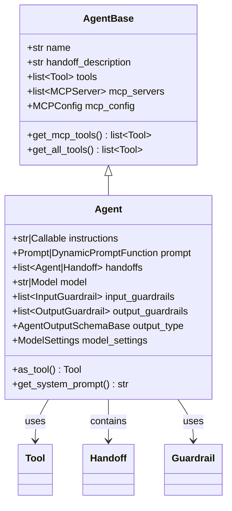

#### 核心API分析

##### Agent.__init__() 构造函数
```python
def __init__(
    self,
    name: str,
    *,
    instructions: str | Callable = None,
    handoff_description: str | None = None,
    tools: list[Tool] = None,
    handoffs: list[Agent | Handoff] = None,
    model: str | Model = None,
    input_guardrails: list[InputGuardrail] = None,
    output_guardrails: list[OutputGuardrail] = None,
    output_type: AgentOutputSchemaBase = None,
    model_settings: ModelSettings = None,
    mcp_servers: list[MCPServer] = None,
    mcp_config: MCPConfig = None,
):
    """
    创建智能体实例
    
    功能说明：
    1. 初始化智能体的基本属性
    2. 设置默认值（工具列表、移交列表等）
    3. 验证参数有效性
    4. 配置模型设置
    """
```

##### get_system_prompt() 系统提示生成
```python
async def get_system_prompt(self, run_context: RunContextWrapper[TContext]) -> str | None:
    """
    生成系统提示词
    
    调用链路：
    1. 检查instructions是否为函数
    2. 如果是函数，调用并传入上下文和智能体实例
    3. 如果是字符串，直接返回
    4. 处理异步函数调用
    
    功能说明：
    - 支持静态和动态指令
    - 动态指令可以根据上下文生成个性化提示
    - 支持同步和异步指令函数
    """
    if self.instructions is None:
        return None
    
    if callable(self.instructions):
        result = self.instructions(run_context, self)
        if inspect.isawaitable(result):
            return await result
        return result
    
    return self.instructions
```

### 2. Runner模块 (src/agents/run.py)

#### 模块架构图
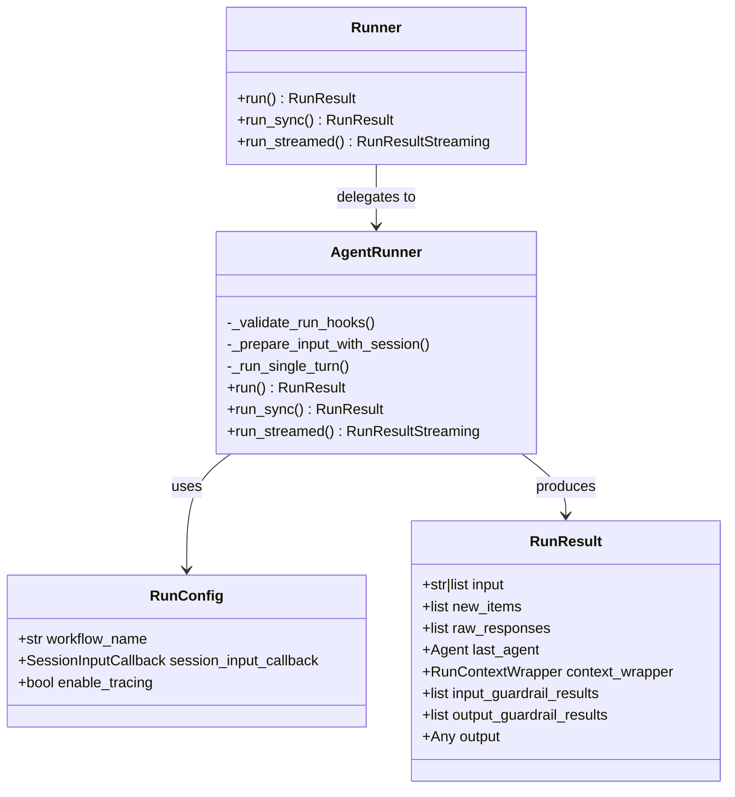

#### 执行流程时序图
```mermaid
sequenceDiagram
    participant Client
    participant Runner
    participant AgentRunner
    participant Agent
    participant Model
    participant Tools
    
    Client->>Runner: run(agent, input)
    Runner->>AgentRunner: run()
    
    loop 执行循环
        AgentRunner->>Agent: get_system_prompt()
        Agent-->>AgentRunner: system_prompt
        
        AgentRunner->>Agent: get_all_tools()
        Agent-->>AgentRunner: tools_list
        
        AgentRunner->>Model: response()
        Model-->>AgentRunner: model_response
        
        alt 有工具调用
            loop 每个工具调用
                AgentRunner->>Tools: invoke_tool()
                Tools-->>AgentRunner: tool_result
            end
        else 有移交
            AgentRunner->>Agent: 切换智能体
        else 有最终输出
            break 结束循环
        end
    end
    
    AgentRunner-->>Runner: RunResult
    Runner-->>Client: result
```

#### 关键函数深入分析

##### _run_single_turn() 单轮执行
```python
async def _run_single_turn(
    self,
    agent: Agent[TContext],
    input: str | list[TResponseInputItem],
    context_wrapper: RunContextWrapper[TContext],
    hooks: RunHooks[TContext],
) -> SingleTurnResult:
    """
    执行单轮智能体交互
    
    调用链路：
    1. 运行输入护栏检查
    2. 获取系统提示和工具列表
    3. 调用模型生成响应
    4. 处理工具调用或移交
    5. 运行输出护栏检查
    
    功能说明：
    - 封装了完整的单轮交互逻辑
    - 处理护栏检查和异常
    - 支持工具调用和智能体移交
    - 提供详细的执行跟踪
    """
    
    # 1. 输入护栏检查
    input_guardrail_results = await self._run_input_guardrails(
        agent, input, context_wrapper
    )
    
    # 2. 获取系统提示
    system_prompt = await agent.get_system_prompt(context_wrapper)
    
    # 3. 获取可用工具
    tools = await agent.get_all_tools(context_wrapper)
    
    # 4. 调用模型
    model_response = await self._call_model(
        agent, system_prompt, input, tools, context_wrapper
    )
    
    # 5. 处理响应
    if model_response.has_tool_calls:
        return await self._handle_tool_calls(model_response, context_wrapper)
    elif model_response.has_handoff:
        return await self._handle_handoff(model_response, context_wrapper)
    else:
        return await self._handle_final_output(model_response, agent, context_wrapper)
```

### 3. 工具系统模块 (src/agents/tool.py)

#### 工具类型架构
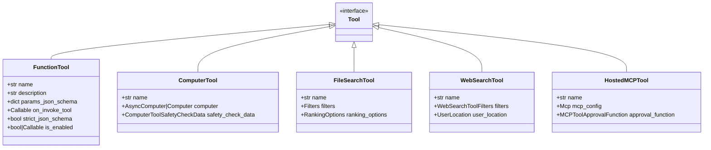

#### 工具执行流程
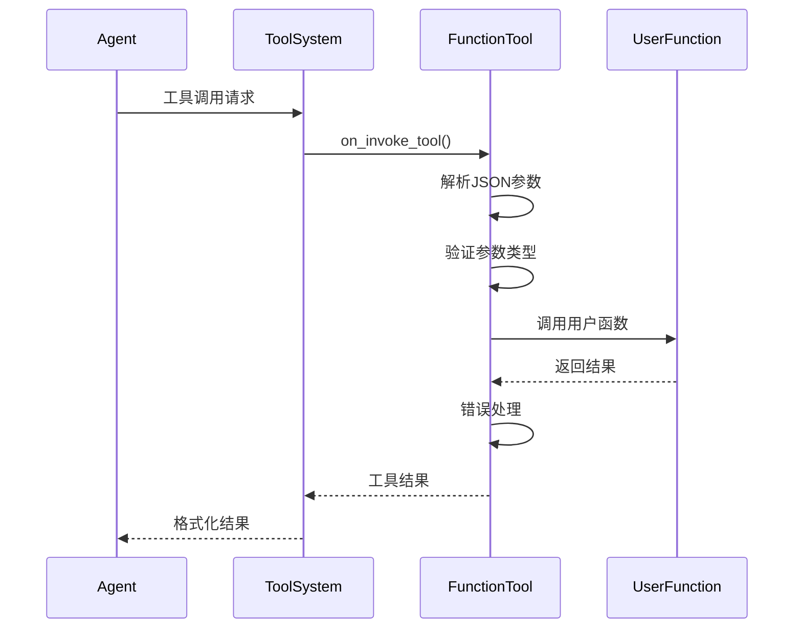

### 4. 模型系统模块 (src/agents/models/)

#### 模型提供者架构
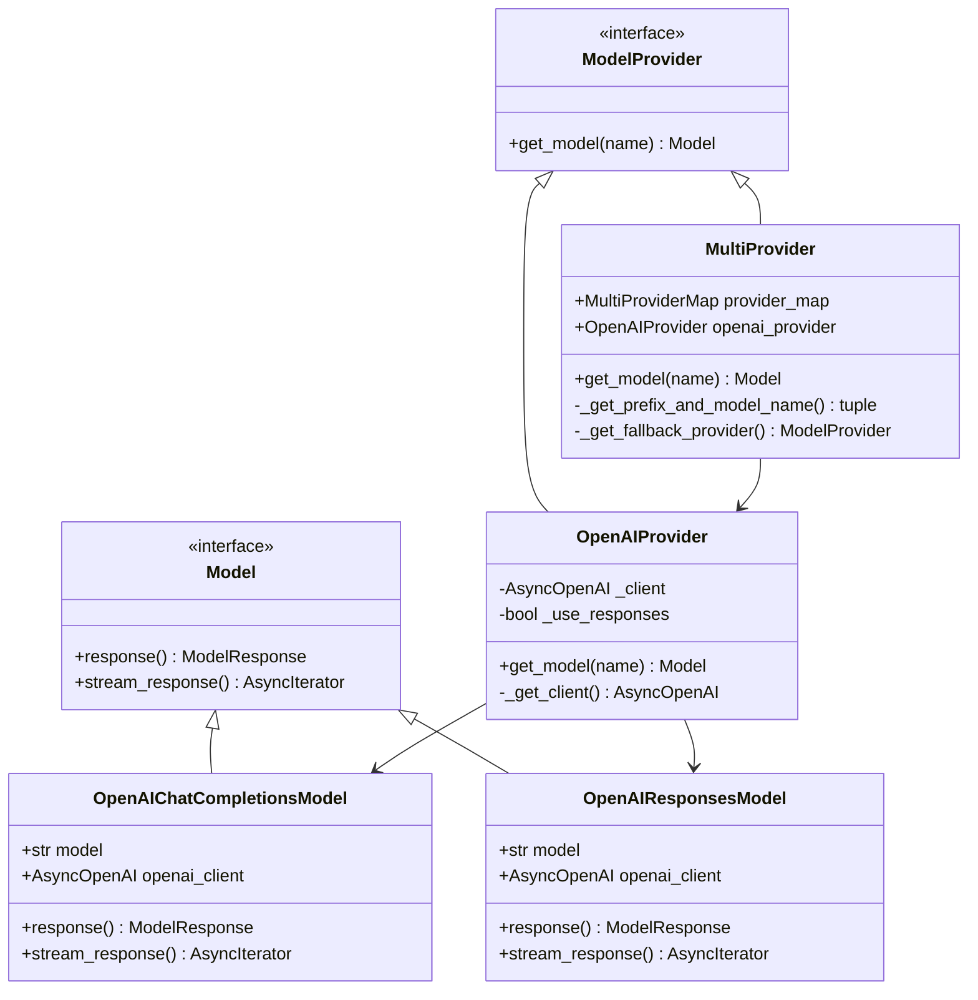

### 5. 护栏系统模块 (src/agents/guardrail.py)

#### 护栏架构图
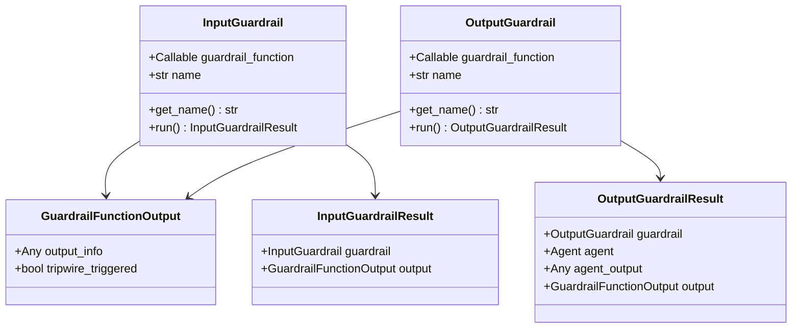

#### 护栏执行流程
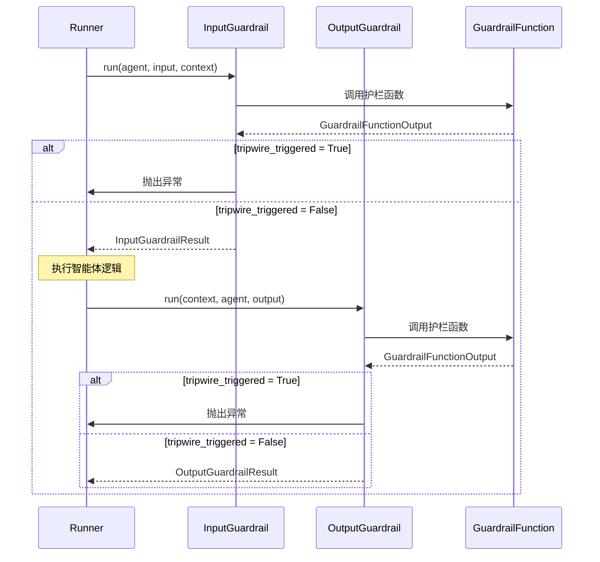

### 6. 移交系统模块 (src/agents/handoffs.py)

#### 移交机制架构
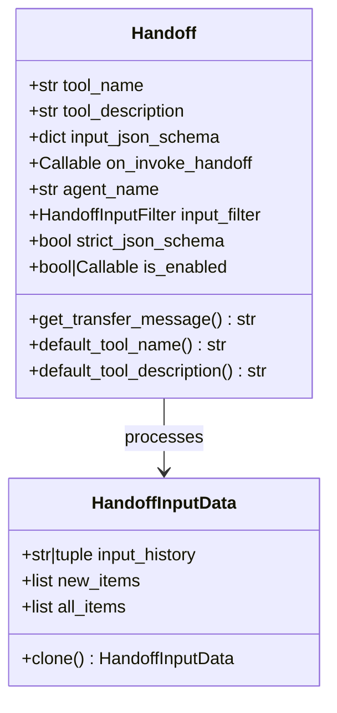

#### 移交执行流程
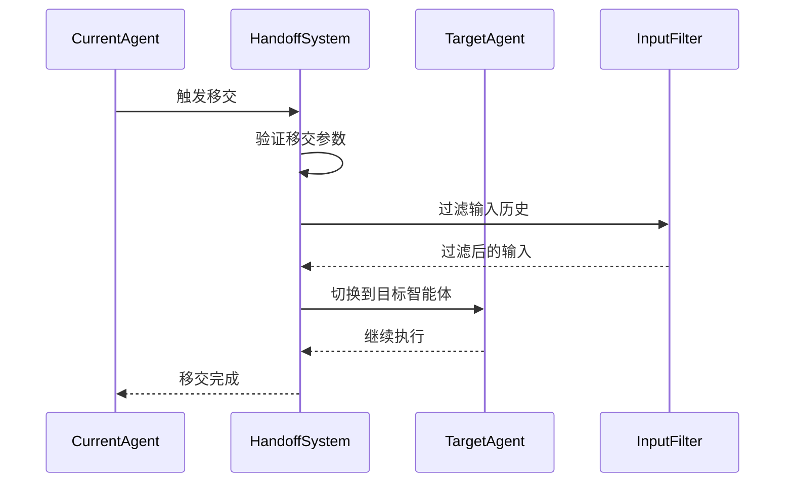

---

## 关键函数和继承关系

### 1. 核心类继承关系图

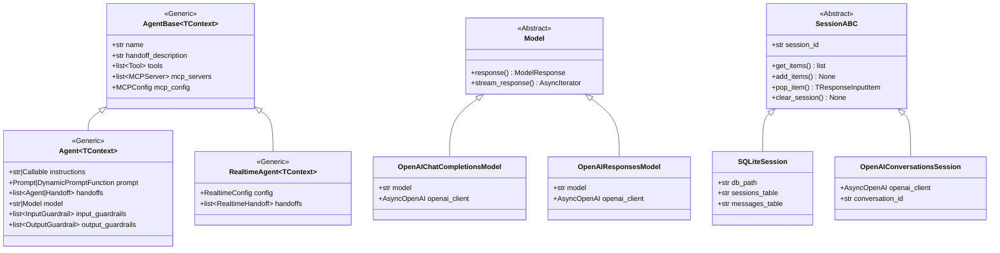

### 2. 关键函数详细分析

#### 2.1 核心执行函数

##### _run_impl.py 中的核心执行逻辑
```python
# src/agents/_run_impl.py:主要执行实现
class AgentRunnerImpl:
    """智能体运行器的核心实现"""
    
    async def run_agent_turn(
        self,
        agent: Agent[TContext],
        input_items: list[TResponseInputItem],
        context_wrapper: RunContextWrapper[TContext],
        hooks: RunHooks[TContext],
        run_config: RunConfig,
    ) -> AgentTurnResult:
        """
        执行单轮智能体交互的核心函数
        
        功能说明：
        1. 输入预处理和护栏检查
        2. 模型调用和响应处理
        3. 工具执行和结果收集
        4. 移交处理和状态管理
        5. 输出护栏检查和结果返回
        
        调用链路：
        Runner.run() -> AgentRunner.run() -> AgentRunnerImpl.run_agent_turn()
        """
        
        # 1. 运行输入护栏
        input_guardrail_results = []
        for guardrail in agent.input_guardrails:
            result = await guardrail.run(agent, input_items, context_wrapper)
            input_guardrail_results.append(result)
            
            if result.output.tripwire_triggered:
                raise InputGuardrailTripwireTriggered(
                    f"Input guardrail '{guardrail.get_name()}' tripwire triggered",
                    guardrail_results=input_guardrail_results
                )
        
        # 2. 准备模型调用参数
        system_instructions = await agent.get_system_prompt(context_wrapper)
        tools = await agent.get_all_tools(context_wrapper)
        handoffs = await self._prepare_handoffs(agent, context_wrapper)
        
        # 3. 调用模型
        model = self._get_model_for_agent(agent)
        model_response = await model.response(
            system_instructions=system_instructions,
            input=input_items,
            model_settings=agent.model_settings or ModelSettings(),
            tools=tools,
            output_schema=agent.output_type,
            handoffs=handoffs,
            tracing=ModelTracing.ENABLED,
            previous_response_id=previous_response_id,
            conversation_id=conversation_id,
            prompt=prompt_param,
        )
        
        # 4. 处理模型响应
        generated_items = []
        
        # 处理工具调用
        if model_response.tool_calls:
            tool_results = await self._execute_tools(
                model_response.tool_calls, context_wrapper, agent
            )
            generated_items.extend(tool_results)
        
        # 处理移交
        if model_response.handoff_call:
            handoff_result = await self._execute_handoff(
                model_response.handoff_call, context_wrapper
            )
            return AgentTurnResult(
                new_agent=handoff_result.target_agent,
                new_input=handoff_result.filtered_input,
                generated_items=generated_items
            )
        
        # 5. 检查最终输出
        if model_response.final_output:
            # 运行输出护栏
            output_guardrail_results = []
            for guardrail in agent.output_guardrails:
                result = await guardrail.run(
                    context_wrapper, agent, model_response.final_output
                )
                output_guardrail_results.append(result)
                
                if result.output.tripwire_triggered:
                    raise OutputGuardrailTripwireTriggered(
                        f"Output guardrail '{guardrail.get_name()}' tripwire triggered",
                        guardrail_results=output_guardrail_results
                    )
            
            return AgentTurnResult(
                final_output=model_response.final_output,
                generated_items=generated_items,
                output_guardrail_results=output_guardrail_results
            )
        
        # 6. 继续下一轮
        return AgentTurnResult(
            continue_execution=True,
            generated_items=generated_items
        )
```

##### 工具执行核心函数
```python
async def _execute_tools(
    self,
    tool_calls: list[ToolCallItem],
    context_wrapper: RunContextWrapper[TContext],
    agent: Agent[TContext],
) -> list[ToolCallOutputItem]:
    """
    并发执行多个工具调用
    
    功能说明：
    1. 并发执行所有工具调用以提高性能
    2. 处理工具执行异常和错误恢复
    3. 收集和格式化工具执行结果
    4. 支持工具执行的追踪和监控
    """
    
    async def _execute_single_tool(tool_call: ToolCallItem) -> ToolCallOutputItem:
        """执行单个工具调用"""
        try:
            # 1. 查找工具实现
            tool = self._find_tool_by_name(tool_call.name, agent)
            if not tool:
                return ToolCallOutputItem(
                    tool_call_id=tool_call.id,
                    output=f"Tool '{tool_call.name}' not found",
                    error=True
                )
            
            # 2. 创建工具上下文
            tool_context = ToolContext(
                run_context=context_wrapper,
                agent=agent,
                tool_call=tool_call
            )
            
            # 3. 执行工具
            with function_span(f"tool_{tool_call.name}"):
                if isinstance(tool, FunctionTool):
                    result = await tool.on_invoke_tool(
                        tool_context, tool_call.arguments
                    )
                else:
                    result = await self._execute_builtin_tool(
                        tool, tool_call, tool_context
                    )
            
            # 4. 格式化结果
            return ToolCallOutputItem(
                tool_call_id=tool_call.id,
                output=str(result),
                error=False
            )
            
        except Exception as e:
            logger.exception(f"Tool execution failed: {tool_call.name}")
            return ToolCallOutputItem(
                tool_call_id=tool_call.id,
                output=f"Tool execution failed: {str(e)}",
                error=True
            )
    
    # 并发执行所有工具调用
    results = await asyncio.gather(
        *[_execute_single_tool(call) for call in tool_calls],
        return_exceptions=True
    )
    
    # 处理异常结果
    tool_outputs = []
    for i, result in enumerate(results):
        if isinstance(result, Exception):
            tool_outputs.append(ToolCallOutputItem(
                tool_call_id=tool_calls[i].id,
                output=f"Tool execution error: {str(result)}",
                error=True
            ))
        else:
            tool_outputs.append(result)
    
    return tool_outputs
```

#### 2.2 模型调用关键函数

##### OpenAI模型响应生成
```python
# src/agents/models/openai_responses.py
class OpenAIResponsesModel(Model):
    """OpenAI Responses API模型实现"""
    
    async def response(
        self,
        system_instructions: str | None,
        input: str | list[TResponseInputItem],
        model_settings: ModelSettings,
        tools: list[Tool],
        output_schema: AgentOutputSchemaBase | None,
        handoffs: list[Handoff],
        tracing: ModelTracing,
        *,
        previous_response_id: str | None,
        conversation_id: str | None,
        prompt: ResponsePromptParam | None,
    ) -> ModelResponse:
        """
        生成模型响应的核心函数
        
        功能说明：
        1. 构建OpenAI API请求参数
        2. 处理工具和移交的转换
        3. 调用OpenAI API并处理响应
        4. 解析响应并构建ModelResponse对象
        
        调用链路：
        AgentRunnerImpl.run_agent_turn() -> Model.response() -> OpenAI API
        """
        
        # 1. 构建请求参数
        request_params = {
            "model": self.model,
            "max_completion_tokens": model_settings.max_tokens,
            "temperature": model_settings.temperature,
            "top_p": model_settings.top_p,
        }
        
        # 2. 处理输入
        if isinstance(input, str):
            input_items = [{"type": "message", "role": "user", "content": input}]
        else:
            input_items = self._convert_input_items(input)
        
        # 3. 添加系统指令
        if system_instructions:
            request_params["instructions"] = system_instructions
        
        # 4. 处理工具
        if tools:
            request_params["tools"] = self._convert_tools_to_api_format(tools)
        
        # 5. 处理移交
        if handoffs:
            handoff_tools = self._convert_handoffs_to_tools(handoffs)
            request_params["tools"] = request_params.get("tools", []) + handoff_tools
        
        # 6. 处理输出模式
        if output_schema:
            request_params["response_format"] = self._convert_output_schema(output_schema)
        
        # 7. 调用OpenAI API
        try:
            response = await self.openai_client.responses.create(
                input=input_items,
                **request_params
            )
        except Exception as e:
            logger.error(f"OpenAI API call failed: {e}")
            raise ModelBehaviorError(f"Model API call failed: {e}")
        
        # 8. 解析响应
        return self._parse_openai_response(response)
    
    def _parse_openai_response(self, response) -> ModelResponse:
        """解析OpenAI API响应"""
        
        # 提取消息内容
        messages = []
        tool_calls = []
        handoff_call = None
        final_output = None
        
        for output_item in response.output:
            if output_item.type == "message":
                messages.append(MessageOutputItem(
                    role=output_item.role,
                    content=output_item.content
                ))
            
            elif output_item.type == "function_call":
                tool_calls.append(ToolCallItem(
                    id=output_item.id,
                    name=output_item.function.name,
                    arguments=output_item.function.arguments
                ))
            
            elif output_item.type == "handoff_call":
                handoff_call = HandoffCallItem(
                    target_agent=output_item.target_agent,
                    arguments=output_item.arguments
                )
        
        # 检查最终输出
        if response.status == "completed" and not tool_calls and not handoff_call:
            final_output = self._extract_final_output(messages)
        
        return ModelResponse(
            messages=messages,
            tool_calls=tool_calls,
            handoff_call=handoff_call,
            final_output=final_output,
            usage=self._extract_usage(response),
            raw_response=response
        )
```

#### 2.3 会话管理关键函数

##### SQLite会话实现
```python
# src/agents/memory/sqlite_session.py
class SQLiteSession(SessionABC):
    """SQLite会话存储实现"""
    
    async def get_items(self, limit: int | None = None) -> list[TResponseInputItem]:
        """
        获取会话历史记录
        
        功能说明：
        1. 从SQLite数据库查询会话消息
        2. 按时间顺序排序并限制数量
        3. 反序列化消息数据
        4. 处理数据库连接和异常
        """
        
        def _get_items_sync() -> list[TResponseInputItem]:
            conn = self._get_connection()
            
            # 构建查询SQL
            query = f"""
                SELECT message_data 
                FROM {self.messages_table} 
                WHERE session_id = ? 
                ORDER BY created_at ASC
            """
            params = [self.session_id]
            
            # 添加限制条件
            if limit is not None:
                query += " LIMIT ?"
                params.append(limit)
            
            # 执行查询
            cursor = conn.execute(query, params)
            rows = cursor.fetchall()
            
            # 反序列化消息数据
            items = []
            for row in rows:
                try:
                    message_data = json.loads(row[0])
                    items.append(message_data)
                except json.JSONDecodeError as e:
                    logger.warning(f"Failed to decode message data: {e}")
                    continue
            
            return items
        
        # 在线程池中执行同步数据库操作
        loop = asyncio.get_event_loop()
        return await loop.run_in_executor(None, _get_items_sync)
    
    async def add_items(self, items: list[TResponseInputItem]) -> None:
        """
        添加消息到会话历史
        
        功能说明：
        1. 序列化消息数据为JSON
        2. 批量插入数据库
        3. 更新会话元数据
        4. 处理并发访问和事务
        """
        
        def _add_items_sync() -> None:
            conn = self._get_connection()
            
            try:
                # 开始事务
                conn.execute("BEGIN TRANSACTION")
                
                # 确保会话记录存在
                conn.execute(
                    f"""
                    INSERT OR IGNORE INTO {self.sessions_table} (session_id) 
                    VALUES (?)
                    """,
                    [self.session_id]
                )
                
                # 批量插入消息
                message_records = []
                for item in items:
                    message_data = json.dumps(item, ensure_ascii=False)
                    message_records.append((self.session_id, message_data))
                
                conn.executemany(
                    f"""
                    INSERT INTO {self.messages_table} (session_id, message_data) 
                    VALUES (?, ?)
                    """,
                    message_records
                )
                
                # 更新会话时间戳
                conn.execute(
                    f"""
                    UPDATE {self.sessions_table} 
                    SET updated_at = CURRENT_TIMESTAMP 
                    WHERE session_id = ?
                    """,
                    [self.session_id]
                )
                
                # 提交事务
                conn.commit()
                
            except Exception as e:
                # 回滚事务
                conn.rollback()
                raise e
        
        # 在线程池中执行同步数据库操作
        loop = asyncio.get_event_loop()
        await loop.run_in_executor(None, _add_items_sync)
```

### 3. 设计模式应用

#### 3.1 策略模式 - 模型提供者
```python
# 模型提供者使用策略模式，支持不同的模型实现
class ModelProvider(abc.ABC):
    """模型提供者抽象接口"""
    
    @abc.abstractmethod
    def get_model(self, model_name: str | None) -> Model:
        """获取模型实例的策略方法"""
        pass

# 具体策略实现
class OpenAIProvider(ModelProvider):
    def get_model(self, model_name: str | None) -> Model:
        return OpenAIChatCompletionsModel(model=model_name, ...)

class LiteLLMProvider(ModelProvider):
    def get_model(self, model_name: str | None) -> Model:
        return LiteLLMModel(model=model_name, ...)
```

#### 3.2 装饰器模式 - 工具和护栏
```python
# 使用装饰器模式简化工具和护栏的创建
@function_tool
def search_web(query: str) -> str:
    """搜索网络内容"""
    return perform_search(query)

@input_guardrail
def check_safety(context, agent, input) -> GuardrailFunctionOutput:
    """安全检查护栏"""
    return GuardrailFunctionOutput(...)
```

#### 3.3 观察者模式 - 钩子系统
```python
# 钩子系统使用观察者模式，允许在执行过程中插入自定义逻辑
class RunHooks(Generic[TContext]):
    """运行钩子，在执行过程中的关键点被调用"""
    
    async def on_run_start(self, context: RunContextWrapper[TContext]) -> None:
        """运行开始时调用"""
        pass
    
    async def on_agent_turn_start(self, agent: Agent[TContext], input: Any) -> None:
        """智能体轮次开始时调用"""
        pass
    
    async def on_tool_call_start(self, tool_name: str, arguments: str) -> None:
        """工具调用开始时调用"""
        pass
```

---

## 实战经验总结

### 1. 最佳实践

#### 1.1 智能体设计原则
```python
# ✅ 好的实践：清晰的职责分工
billing_agent = agents.Agent(
    name="billing_specialist",
    instructions="""
    You are a billing specialist. Your responsibilities:
    1. Handle payment processing inquiries
    2. Explain billing cycles and charges
    3. Process refund requests
    4. Escalate complex billing disputes to human agents
    
    Always be empathetic and provide clear explanations.
    """,
    handoff_description="Handles billing, payments, and refund requests",
    tools=[process_payment, check_billing_history, issue_refund]
)

# ❌ 避免：职责不清的通用智能体
generic_agent = agents.Agent(
    name="helper",
    instructions="Help with anything",  # 太模糊
    tools=[all_possible_tools]  # 工具太多
)
```

#### 1.2 工具设计最佳实践
```python
# ✅ 好的工具设计：清晰的参数和错误处理
@agents.function_tool
def search_customer_orders(
    customer_id: str,
    date_from: str | None = None,
    date_to: str | None = None,
    status: Literal["pending", "completed", "cancelled"] | None = None
) -> str:
    """
    搜索客户订单记录
    
    Args:
        customer_id: 客户ID（必需）
        date_from: 开始日期，格式：YYYY-MM-DD
        date_to: 结束日期，格式：YYYY-MM-DD  
        status: 订单状态筛选
    
    Returns:
        订单列表的JSON字符串
    """
    try:
        # 参数验证
        if not customer_id:
            return "错误：客户ID不能为空"
        
        # 日期格式验证
        if date_from:
            datetime.strptime(date_from, "%Y-%m-%d")
        if date_to:
            datetime.strptime(date_to, "%Y-%m-%d")
        
        # 执行搜索
        orders = database.search_orders(
            customer_id=customer_id,
            date_from=date_from,
            date_to=date_to,
            status=status
        )
        
        return json.dumps({
            "success": True,
            "orders": orders,
            "count": len(orders)
        }, ensure_ascii=False)
        
    except ValueError as e:
        return f"参数错误：{str(e)}"
    except Exception as e:
        logger.exception("订单搜索失败")
        return f"搜索失败，请稍后重试。错误：{str(e)}"

# ❌ 避免：参数不明确，错误处理不当
@agents.function_tool  
def search_orders(query: str) -> str:  # 参数太模糊
    orders = database.search(query)  # 没有错误处理
    return str(orders)  # 返回格式不清晰
```

#### 1.3 护栏系统实践
```python
# ✅ 输入护栏：内容安全检查
@agents.input_guardrail
def content_safety_check(
    context: agents.RunContextWrapper,
    agent: agents.Agent,
    input: str | list[agents.TResponseInputItem]
) -> agents.GuardrailFunctionOutput:
    """检查输入内容的安全性"""
    
    # 提取文本内容
    text_content = ""
    if isinstance(input, str):
        text_content = input
    else:
        for item in input:
            if item.get("type") == "message" and item.get("content"):
                text_content += item["content"] + " "
    
    # 安全检查
    safety_issues = []
    
    # 检查敏感词
    if contains_sensitive_words(text_content):
        safety_issues.append("包含敏感词汇")
    
    # 检查恶意内容
    if detect_malicious_content(text_content):
        safety_issues.append("检测到恶意内容")
    
    # 检查个人信息泄露
    if contains_pii(text_content):
        safety_issues.append("包含个人敏感信息")
    
    if safety_issues:
        return agents.GuardrailFunctionOutput(
            output_info={
                "issues": safety_issues,
                "input_length": len(text_content),
                "timestamp": datetime.now().isoformat()
            },
            tripwire_triggered=True
        )
    
    return agents.GuardrailFunctionOutput(
        output_info={"status": "safe", "checks_passed": 3},
        tripwire_triggered=False
    )

# ✅ 输出护栏：响应质量检查
@agents.output_guardrail
def response_quality_check(
    context: agents.RunContextWrapper,
    agent: agents.Agent,
    output: Any
) -> agents.GuardrailFunctionOutput:
    """检查输出响应的质量"""
    
    issues = []
    
    # 检查响应长度
    if isinstance(output, str):
        if len(output) < 10:
            issues.append("响应过短")
        elif len(output) > 2000:
            issues.append("响应过长")
    
    # 检查是否包含必要信息
    if not contains_helpful_information(output):
        issues.append("响应缺乏有用信息")
    
    # 检查语言质量
    if has_grammar_issues(output):
        issues.append("语法或表达问题")
    
    return agents.GuardrailFunctionOutput(
        output_info={
            "issues": issues,
            "output_length": len(str(output)),
            "quality_score": calculate_quality_score(output)
        },
        tripwire_triggered=len(issues) > 2  # 问题太多时触发
    )
```

### 2. 性能优化技巧

#### 2.1 并发工具执行
```python
# ✅ 利用框架的并发工具执行能力
class CustomerServiceAgent:
    def __init__(self):
        self.agent = agents.Agent(
            name="customer_service",
            instructions="Handle customer inquiries efficiently",
            tools=[
                self.check_order_status,
                self.verify_customer_identity,
                self.search_knowledge_base,
                self.create_support_ticket
            ]
        )
    
    @agents.function_tool
    async def check_order_status(self, order_id: str) -> str:
        """异步检查订单状态 - 可以并发执行"""
        async with aiohttp.ClientSession() as session:
            async with session.get(f"/api/orders/{order_id}") as response:
                data = await response.json()
                return json.dumps(data)
    
    @agents.function_tool
    async def verify_customer_identity(self, customer_id: str) -> str:
        """异步验证客户身份 - 可以并发执行"""
        # 异步数据库查询
        customer = await database.get_customer(customer_id)
        return json.dumps({"verified": customer is not None})
```

#### 2.2 会话管理优化
```python
# ✅ 使用会话限制和清理策略
class OptimizedSession(agents.SQLiteSession):
    def __init__(self, session_id: str, max_history: int = 50):
        super().__init__(session_id)
        self.max_history = max_history
    
    async def add_items(self, items: list[agents.TResponseInputItem]) -> None:
        """添加项目时自动清理旧历史"""
        await super().add_items(items)
        
        # 清理过多的历史记录
        current_count = len(await self.get_items())
        if current_count > self.max_history:
            # 保留最新的记录
            await self._cleanup_old_items(current_count - self.max_history)
    
    async def _cleanup_old_items(self, delete_count: int) -> None:
        """清理旧的历史记录"""
        def _cleanup_sync():
            conn = self._get_connection()
            conn.execute(f"""
                DELETE FROM {self.messages_table} 
                WHERE session_id = ? AND id IN (
                    SELECT id FROM {self.messages_table} 
                    WHERE session_id = ? 
                    ORDER BY created_at ASC 
                    LIMIT ?
                )
            """, [self.session_id, self.session_id, delete_count])
            conn.commit()
        
        loop = asyncio.get_event_loop()
        await loop.run_in_executor(None, _cleanup_sync)
```

### 3. 错误处理和调试

#### 3.1 全面的错误处理
```python
# ✅ 完善的错误处理和用户友好的错误消息
@agents.function_tool
async def process_payment(
    context: agents.RunContextWrapper,
    amount: float,
    payment_method: str,
    customer_id: str
) -> str:
    """处理支付请求"""
    
    try:
        # 参数验证
        if amount <= 0:
            return json.dumps({
                "success": False,
                "error": "支付金额必须大于0",
                "error_code": "INVALID_AMOUNT"
            })
        
        if payment_method not in ["credit_card", "debit_card", "paypal"]:
            return json.dumps({
                "success": False,
                "error": "不支持的支付方式",
                "error_code": "INVALID_PAYMENT_METHOD"
            })
        
        # 执行支付
        payment_result = await payment_service.process_payment(
            amount=amount,
            method=payment_method,
            customer_id=customer_id
        )
        
        return json.dumps({
            "success": True,
            "transaction_id": payment_result.transaction_id,
            "status": payment_result.status
        })
        
    except PaymentServiceError as e:
        # 支付服务特定错误
        logger.error(f"Payment service error: {e}")
        return json.dumps({
            "success": False,
            "error": "支付处理失败，请检查支付信息或稍后重试",
            "error_code": "PAYMENT_SERVICE_ERROR"
        })
    
    except NetworkError as e:
        # 网络错误
        logger.error(f"Network error during payment: {e}")
        return json.dumps({
            "success": False,
            "error": "网络连接问题，请稍后重试",
            "error_code": "NETWORK_ERROR"
        })
    
    except Exception as e:
        # 未预期的错误
        logger.exception("Unexpected error in payment processing")
        return json.dumps({
            "success": False,
            "error": "系统暂时不可用，请稍后重试",
            "error_code": "SYSTEM_ERROR"
        })
```

#### 3.2 调试和监控
```python
# ✅ 使用钩子进行调试和监控
class DebuggingHooks(agents.RunHooks):
    """调试和监控钩子"""
    
    def __init__(self):
        self.start_time = None
        self.tool_calls = []
        self.errors = []
    
    async def on_run_start(self, context: agents.RunContextWrapper) -> None:
        """运行开始"""
        self.start_time = time.time()
        logger.info(f"开始运行智能体，会话ID: {context.session_id}")
    
    async def on_agent_turn_start(
        self, 
        agent: agents.Agent, 
        input: Any
    ) -> None:
        """智能体轮次开始"""
        logger.info(f"智能体 '{agent.name}' 开始处理输入")
        
        # 记录输入长度和类型
        if isinstance(input, str):
            logger.debug(f"输入类型: 字符串, 长度: {len(input)}")
        else:
            logger.debug(f"输入类型: 列表, 项目数: {len(input)}")
    
    async def on_tool_call_start(self, tool_name: str, arguments: str) -> None:
        """工具调用开始"""
        call_info = {
            "tool_name": tool_name,
            "start_time": time.time(),
            "arguments_length": len(arguments)
        }
        self.tool_calls.append(call_info)
        logger.info(f"开始调用工具: {tool_name}")
    
    async def on_tool_call_end(
        self, 
        tool_name: str, 
        result: Any, 
        error: Exception | None = None
    ) -> None:
        """工具调用结束"""
        # 更新工具调用信息
        for call in reversed(self.tool_calls):
            if call["tool_name"] == tool_name and "end_time" not in call:
                call["end_time"] = time.time()
                call["duration"] = call["end_time"] - call["start_time"]
                call["success"] = error is None
                break
        
        if error:
            self.errors.append({
                "type": "tool_error",
                "tool_name": tool_name,
                "error": str(error),
                "timestamp": time.time()
            })
            logger.error(f"工具调用失败: {tool_name}, 错误: {error}")
        else:
            logger.info(f"工具调用成功: {tool_name}")
    
    async def on_run_end(self, result: agents.RunResult) -> None:
        """运行结束"""
        total_time = time.time() - self.start_time
        
        # 生成执行报告
        report = {
            "total_duration": total_time,
            "tool_calls_count": len(self.tool_calls),
            "errors_count": len(self.errors),
            "success": len(self.errors) == 0,
            "tool_performance": [
                {
                    "name": call["tool_name"],
                    "duration": call.get("duration", 0),
                    "success": call.get("success", False)
                }
                for call in self.tool_calls
            ]
        }
        
        logger.info(f"智能体运行完成: {json.dumps(report, indent=2)}")

# 使用调试钩子
async def run_with_debugging():
    hooks = DebuggingHooks()
    
    result = await agents.Runner.run(
        starting_agent=my_agent,
        input="用户输入",
        hooks=hooks
    )
    
    return result
```

### 4. 生产环境部署建议

#### 4.1 配置管理
```python
# ✅ 环境配置管理
import os
from dataclasses import dataclass

@dataclass
class AgentConfig:
    """智能体配置"""
    openai_api_key: str
    openai_base_url: str | None = None
    max_turns: int = 10
    enable_tracing: bool = True
    session_db_path: str = "sessions.db"
    log_level: str = "INFO"
    
    @classmethod
    def from_env(cls) -> "AgentConfig":
        """从环境变量加载配置"""
        return cls(
            openai_api_key=os.getenv("OPENAI_API_KEY", ""),
            openai_base_url=os.getenv("OPENAI_BASE_URL"),
            max_turns=int(os.getenv("AGENT_MAX_TURNS", "10")),
            enable_tracing=os.getenv("AGENT_ENABLE_TRACING", "true").lower() == "true",
            session_db_path=os.getenv("AGENT_SESSION_DB_PATH", "sessions.db"),
            log_level=os.getenv("AGENT_LOG_LEVEL", "INFO")
        )

# 初始化配置
config = AgentConfig.from_env()

# 设置OpenAI客户端
agents.set_default_openai_key(config.openai_api_key)
if config.openai_base_url:
    agents.set_default_openai_client(
        AsyncOpenAI(
            api_key=config.openai_api_key,
            base_url=config.openai_base_url
        )
    )
```

#### 4.2 监控和日志
```python
# ✅ 生产环境监控
import structlog
from prometheus_client import Counter, Histogram, start_http_server

# Prometheus指标
agent_requests = Counter('agent_requests_total', 'Total agent requests', ['agent_name', 'status'])
agent_duration = Histogram('agent_duration_seconds', 'Agent execution duration', ['agent_name'])
tool_calls = Counter('tool_calls_total', 'Total tool calls', ['tool_name', 'status'])

class ProductionHooks(agents.RunHooks):
    """生产环境监控钩子"""
    
    def __init__(self):
        self.logger = structlog.get_logger()
        self.start_time = None
        self.agent_name = None
    
    async def on_run_start(self, context: agents.RunContextWrapper) -> None:
        self.start_time = time.time()
        self.agent_name = context.current_agent.name
        
        self.logger.info(
            "agent_run_started",
            agent_name=self.agent_name,
            session_id=getattr(context, 'session_id', None)
        )
    
    async def on_tool_call_start(self, tool_name: str, arguments: str) -> None:
        self.logger.info(
            "tool_call_started",
            tool_name=tool_name,
            agent_name=self.agent_name
        )
    
    async def on_tool_call_end(
        self, 
        tool_name: str, 
        result: Any, 
        error: Exception | None = None
    ) -> None:
        status = "success" if error is None else "error"
        tool_calls.labels(tool_name=tool_name, status=status).inc()
        
        if error:
            self.logger.error(
                "tool_call_failed",
                tool_name=tool_name,
                agent_name=self.agent_name,
                error=str(error)
            )
        else:
            self.logger.info(
                "tool_call_completed",
                tool_name=tool_name,
                agent_name=self.agent_name
            )
    
    async def on_run_end(self, result: agents.RunResult) -> None:
        duration = time.time() - self.start_time
        status = "success" if not hasattr(result, 'error') else "error"
        
        agent_requests.labels(agent_name=self.agent_name, status=status).inc()
        agent_duration.labels(agent_name=self.agent_name).observe(duration)
        
        self.logger.info(
            "agent_run_completed",
            agent_name=self.agent_name,
            duration=duration,
            status=status
        )

# 启动Prometheus指标服务器
start_http_server(8000)
```

这个全面的源码剖析文档涵盖了OpenAI Agents Python SDK的所有核心方面，从基础使用到高级架构，再到生产环境的最佳实践。文档结构清晰，代码示例丰富，能够帮助开发者深入理解和掌握这个强大的AI智能体框架。
