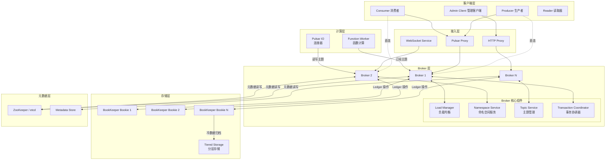
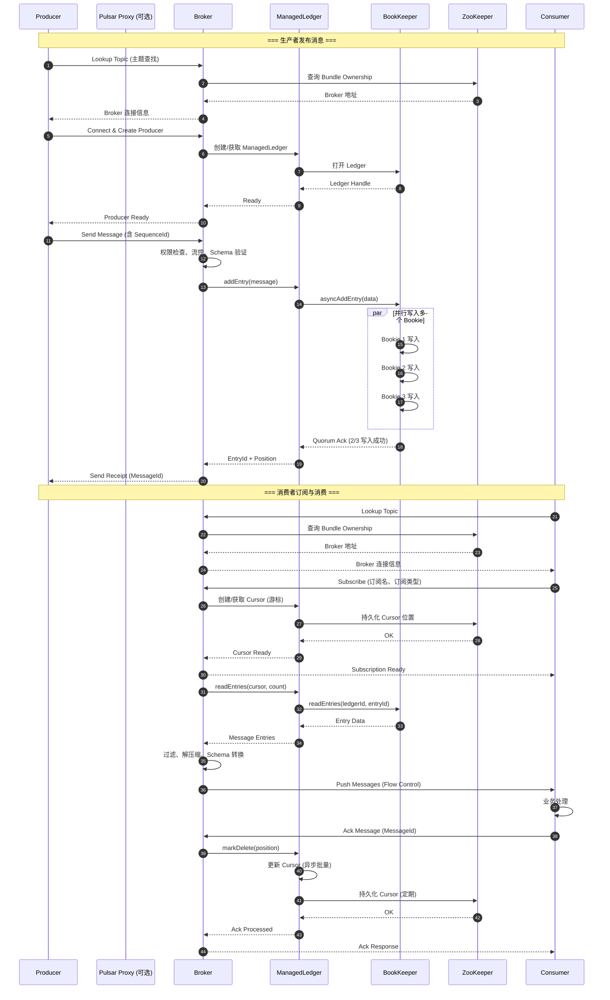

# Pulsar-00-总览

## 0. 摘要

### 项目目标与问题域

Apache Pulsar 是一个云原生、分布式消息流平台，设计用于支持多租户环境下的实时消息传递和流数据处理。核心能力包括：

- **多租户消息系统**：通过命名空间隔离实现多租户资源管理
- **统一消息模型**：同时支持队列语义和流语义
- **分层存储架构**：计算与存储分离，数据持久化基于 Apache BookKeeper
- **地理复制**：支持跨区域的数据复制和灾备
- **函数计算**：内置轻量级计算框架 Pulsar Functions
- **Connector 生态**：与外部系统集成的 Pulsar IO 框架

### 核心能力边界

**提供能力**：
- 消息发布订阅、队列和主题模式
- 消息持久化与多副本保证
- 消息确认、重试、死信队列机制
- Schema 注册与演进管理
- 事务支持（跨分区、跨主题）
- 消息过滤、延迟投递
- 高可用集群与水平扩展

**非目标**：
- 不提供内置存储引擎实现（依赖 BookKeeper）
- 不提供复杂事件处理（CEP）能力
- 不替代 OLAP 分析系统
- 不提供图形化管理界面（需第三方工具）

### 运行环境

**语言与运行时**：
- Java 17+（Broker、Functions Runtime）
- C++（Native Client）
- Go（Functions Runtime）
- Python（Client、Functions）

**部署形态**：
- 独立集群模式（Broker + BookKeeper + ZooKeeper/etcd）
- Kubernetes 云原生部署（Pulsar Operator）
- 单机开发模式（Standalone）

**核心依赖**：
- Apache BookKeeper（持久化存储层）
- ZooKeeper/etcd（元数据存储）
- Netty（网络通信）
- Jetty（HTTP 服务）

---

## 1. 整体架构图



### 图解与要点

#### 组件职责与耦合关系

**客户端层**：
- Producer：负责消息生产、分区路由、批量发送、重试机制
- Consumer：负责消息消费、确认机制、死信处理、负载均衡
- Reader：提供位置控制的顺序读取接口
- Admin Client：管理租户、命名空间、主题、订阅等资源

**接入层**（可选）：
- Pulsar Proxy：协议代理，隐藏 Broker 拓扑，支持 SNI 路由
- WebSocket Service：提供 WebSocket 协议接入
- HTTP Proxy：提供 RESTful API 接入

**Broker 层**（核心）：
- 无状态服务，负责消息路由、订阅管理、流控、鉴权
- Load Manager：动态分配主题到 Broker，基于负载均衡策略
- Namespace Service：管理 Bundle（命名空间分片）到 Broker 映射
- Topic Service：管理主题生命周期、订阅状态、游标管理
- Transaction Coordinator：管理事务状态、两阶段提交协调

**存储层**：
- BookKeeper Bookie：分布式日志存储，提供 Ledger（日志段）抽象
- Tiered Storage：支持 S3/GCS/HDFS 等对象存储作为冷数据归档

**元数据层**：
- ZooKeeper/etcd：存储集群配置、租户/命名空间元数据、Broker 注册信息
- Metadata Store：抽象层，支持多种元数据后端实现

**计算层**：
- Function Worker：运行 Pulsar Functions（轻量级流处理）
- Pulsar IO：Source/Sink 连接器框架，与外部系统集成

#### 数据流与控制流

**控制流**（虚线）：
- 客户端通过 Lookup 服务发现主题所属 Broker
- Broker 向 ZooKeeper 注册、从 ZooKeeper 读取配置和元数据
- Load Manager 通过 ZooKeeper 协调负载均衡决策

**数据流**（实线）：
- Producer → Broker → BookKeeper：消息写入路径
- BookKeeper → Broker → Consumer：消息读取路径
- Broker 之间不直接传递消息数据

#### 高可用与扩展性

**Broker 层**：
- 无状态设计，可水平扩展，Broker 故障时由其他 Broker 接管主题
- 通过 ZooKeeper 的 Watch 机制感知集群拓扑变化

**存储层**：
- Ledger 多副本写入（Quorum Write），默认 3 副本
- Bookie 故障时，Broker 切换到其他 Bookie 继续写入
- 数据分布在多个 Bookie，避免单点瓶颈

**元数据层**：
- ZooKeeper 集群提供强一致性保证
- 支持切换到 etcd 作为元数据存储后端

---

## 2. 全局时序图（消息生产与消费主流程）



### 图解与要点

#### 入口与鉴权

1. **主题发现（Lookup）**：
   - 客户端首先连接任意 Broker 或 Proxy 执行 Lookup 请求
   - Broker 查询 ZooKeeper 确定主题所属 Bundle 的 Owner Broker
   - 返回目标 Broker 地址，客户端建立直连或通过 Proxy 转发

2. **鉴权**：
   - Broker 在连接建立和每个操作时执行权限检查
   - 支持 TLS 双向认证、Token、OAuth2.0、Kerberos 等机制

#### 幂等性保证

- **生产者端幂等**：
  - Producer 为每条消息分配递增 SequenceId
  - Broker 检测重复 SequenceId，去重后返回原 MessageId
  - 故障恢复时，Producer 重发未确认消息，Broker 自动去重

- **消费者端幂等**：
  - Consumer 显式调用 Ack 确认消息
  - 未确认消息在重连后重新投递
  - 支持 Negative Ack（标记消息处理失败，立即重试）

#### 回退策略

- **生产失败**：
  - Broker 不可达：Producer 自动重试 Lookup，切换到新 Broker
  - BookKeeper 写入失败：Broker 关闭当前 Ledger，创建新 Ledger 继续写入
  - 超时重试：Producer 配置超时时间和重试次数

- **消费失败**：
  - 重试队列：未 Ack 消息在 Ack Timeout 后重新投递
  - 死信队列：超过最大重试次数的消息路由到 DLQ
  - 订阅恢复：Consumer 重连后从 Cursor 位置继续消费

#### 重试点与超时

- **Producer**：
  - Send Timeout：默认 30 秒
  - Connection Timeout：默认 10 秒
  - Operation Timeout：默认 30 秒

- **Consumer**：
  - Ack Timeout：默认 0（不启用），可配置为 1 分钟
  - Negative Ack Delay：默认 1 分钟
  - Batch Receive Timeout：批量接收超时

- **Broker**：
  - BookKeeper Add Entry Timeout：默认 60 秒
  - Metadata Operation Timeout：默认 30 秒

#### 资源上界

- **连接数**：单 Broker 支持数万并发连接
- **主题数**：单 Broker 可管理数千主题（受内存和 CPU 限制）
- **分区数**：主题可分区扩展，单主题理论无上限
- **消息大小**：默认最大 5 MB，可配置
- **积压消息**：受 BookKeeper 存储容量限制，支持分层存储扩展

---

## 3. 模块边界与交互矩阵

### 模块清单

| 序号 | 模块名 | 目录 | 职责 |
|---:|---|---|---|
| 01 | ManagedLedger | `managed-ledger/` | 提供主题日志抽象，封装 BookKeeper 操作 |
| 02 | Common | `pulsar-common/` | 协议定义、工具类、配置管理 |
| 03 | Broker | `pulsar-broker/` | 消息路由、订阅管理、流控、鉴权 |
| 04 | Client | `pulsar-client/` | 生产者、消费者、读取器客户端实现 |
| 05 | Client Admin | `pulsar-client-admin/` | 管理 API 客户端（租户、命名空间、主题等） |
| 06 | Client API | `pulsar-client-api/` | 客户端接口定义 |
| 07 | Broker Common | `pulsar-broker-common/` | Broker 公共组件（配置、策略、拦截器） |
| 08 | Proxy | `pulsar-proxy/` | 协议代理，隐藏集群拓扑 |
| 09 | WebSocket | `pulsar-websocket/` | WebSocket 协议网关 |
| 10 | Functions | `pulsar-functions/` | 函数计算运行时、Worker 管理 |
| 11 | IO | `pulsar-io/` | Source/Sink 连接器框架 |
| 12 | Transaction | `pulsar-transaction/` | 事务协调器、事务日志管理 |
| 13 | Metadata | `pulsar-metadata/` | 元数据存储抽象层（ZooKeeper/etcd） |
| 14 | Tiered Storage | `tiered-storage/` | 分层存储实现（S3/GCS/HDFS） |
| 15 | Auth Athenz | `pulsar-broker-auth-athenz/` | Athenz 认证插件 |
| 16 | Auth OIDC | `pulsar-broker-auth-oidc/` | OpenID Connect 认证插件 |
| 17 | Auth SASL | `pulsar-broker-auth-sasl/` | SASL/Kerberos 认证插件 |
| 18 | CLI Utils | `pulsar-cli-utils/` | 命令行工具库 |
| 19 | Config Validation | `pulsar-config-validation/` | 配置验证框架 |
| 20 | OpenTelemetry | `pulsar-opentelemetry/` | 可观测性集成（Tracing、Metrics） |

### 模块交互矩阵

| 调用方 | 被调方 | 接口类型 | 同步/异步 | 数据一致性 | 错误语义 |
|---|---|---|---|---|---|
| Broker | ManagedLedger | Java API | 异步 | 最终一致 | 异常抛出、回调失败 |
| Broker | Metadata | Java API | 异步 | 强一致（ZK）| CompletableFuture 异常 |
| Broker | Client (Admin) | HTTP REST | 同步 | 强一致 | HTTP 状态码 |
| Client | Broker | Binary Protocol | 异步 | At-Least-Once | 超时重试、错误码 |
| ManagedLedger | BookKeeper | Ledger API | 异步 | Quorum 一致性 | BKException |
| Functions | Broker | Pulsar Client | 异步 | At-Least-Once | 客户端异常 |
| IO | Broker | Pulsar Client | 异步 | Exactly-Once (Txn) | 客户端异常 |
| Transaction Coordinator | Broker | 内部 RPC | 异步 | 两阶段提交 | 超时回滚 |
| Proxy | Broker | Binary Protocol | 透传 | 透传 | 透传 |
| WebSocket | Broker | Pulsar Client | 异步 | At-Least-Once | WebSocket 错误帧 |

### 交互说明

#### 同步调用
- Admin Client → Broker：HTTP RESTful API，阻塞等待响应
- 客户端 Lookup 操作：请求-响应模式

#### 异步消息
- Producer → Broker：发送消息后通过回调获取确认
- Broker → Consumer：Push 模式异步推送消息
- ManagedLedger → BookKeeper：所有写入/读取操作均异步

#### 共享存储
- Broker 通过 ZooKeeper 共享集群配置、租户/命名空间元数据
- Cursor（消费位置）持久化到 ZooKeeper 和 Ledger

#### 订阅/发布
- 标准消息流：Producer → Topic → Subscription → Consumer
- 内部事件：Broker 通过 ZooKeeper Watch 机制监听集群变化

---

## 4. 关键设计与权衡

### 数据一致性

#### 消息持久化
- **Quorum Write**：默认写入 3 个 Bookie，等待 2 个确认（Ack Quorum = 2）
- **保证**：消息写入成功后，至少存在于 2 个 Bookie，能容忍 1 个 Bookie 故障
- **权衡**：延迟增加（网络往返），换取数据安全性

#### 元数据一致性
- **强一致性**：ZooKeeper 提供线性一致性保证
- **最终一致性**：Cursor 位置异步批量更新到 ZooKeeper，故障恢复时可能重复消费少量消息

#### 事务一致性
- **两阶段提交**：Transaction Coordinator 协调跨分区、跨主题的事务
- **保证**：Exactly-Once 语义（需配合幂等 Producer 和事务性 Consumer）
- **限制**：事务超时时间有上限（默认 3 小时），长事务可能影响性能

### 事务边界
- **单主题分区内**：天然有序、原子性
- **跨分区事务**：通过 Transaction ID 关联多个分区的消息，Commit/Abort 操作原子生效
- **不支持**：跨 Pulsar 集群的分布式事务

### 锁与并发策略

#### Broker 侧
- **主题锁**：同一主题的操作串行化（读写锁）
- **订阅锁**：同一订阅的多个 Consumer 并发消费不同消息
- **无锁设计**：通过 Bundle Ownership 确保单主题单 Broker 处理，避免分布式锁

#### ManagedLedger 侧
- **Cursor 锁**：防止并发修改消费位置
- **Ledger 滚动锁**：Ledger 关闭和新建过程加锁

#### 客户端侧
- **连接池**：复用 TCP 连接，减少握手开销
- **批量发送**：Producer 批量打包消息，减少网络 IO

### 性能关键路径

#### 消息写入路径（P95 延迟目标：< 10 ms）
1. Producer 批量打包消息（客户端内存）
2. 网络传输到 Broker（通常 < 1 ms）
3. Broker 权限检查、Schema 验证（< 1 ms）
4. ManagedLedger 写入 BookKeeper（5-8 ms，取决于 Bookie 磁盘）
5. Broker 返回确认给 Producer（< 1 ms）

**优化点**：
- Producer 批量发送（默认 10 ms 批量窗口）
- BookKeeper Journal 和 EntryLog 分离写入
- Bookie 使用 SSD 作为 Journal 盘

#### 消息读取路径（P95 延迟目标：< 5 ms）
1. Consumer 发起 Read 请求（Flow Control）
2. ManagedLedger 从 BookKeeper 读取（2-4 ms）
3. Broker 过滤、解压缩（< 1 ms）
4. 推送到 Consumer（< 1 ms）

**优化点**：
- ManagedLedger 读缓存（减少 BookKeeper 访问）
- Consumer 预取消息（Receiver Queue）

#### 内存峰值
- **Broker**：每个主题约 1 MB（Cache、Cursor），10 万主题需 100 GB 内存
- **Producer**：待发送队列（默认 1000 条消息）
- **Consumer**：Receiver Queue（默认 1000 条消息）

#### I/O 热点
- **BookKeeper Journal**：顺序写，SSD 推荐
- **BookKeeper EntryLog**：追加写，HDD 可用
- **ZooKeeper**：读多写少，SSD 推荐

### 可观测性指标

#### Broker 指标
- `pulsar_topics_count`：主题数量
- `pulsar_subscriptions_count`：订阅数量
- `pulsar_producers_count`：生产者数量
- `pulsar_consumers_count`：消费者数量
- `pulsar_in_bytes_total`：入站流量
- `pulsar_out_bytes_total`：出站流量
- `pulsar_storage_backlog_size`：积压消息大小

#### ManagedLedger 指标
- `pulsar_ml_AddEntryLatency`：写入延迟
- `pulsar_ml_ReadEntriesLatency`：读取延迟
- `pulsar_ml_cache_hits_rate`：缓存命中率

#### BookKeeper 指标
- `bookie_write_latency`：Bookie 写入延迟
- `bookie_read_latency`：Bookie 读取延迟
- `bookie_ledger_dir_usage`：磁盘使用率

### 配置项

#### Broker 核心配置
- `brokerServicePort`：Broker 服务端口（默认 6650）
- `webServicePort`：HTTP 服务端口（默认 8080）
- `managedLedgerDefaultEnsembleSize`：Ledger 副本数（默认 3）
- `managedLedgerDefaultAckQuorum`：确认 Quorum（默认 2）
- `managedLedgerCacheSizeMB`：读缓存大小（默认 1024 MB）
- `backlogQuotaDefaultLimitGB`：积压消息限制（默认 10 GB）

#### 客户端核心配置
- `operationTimeoutMs`：操作超时（默认 30000 ms）
- `connectionTimeoutMs`：连接超时（默认 10000 ms）
- `numIoThreads`：IO 线程数（默认 1）
- `maxConcurrentLookupRequests`：并发 Lookup 数（默认 5000）

---

## 5. 典型使用示例与最佳实践

### 示例 1：最小可运行生产者与消费者

#### 生产者示例（Java）

```java
public class MinimalProducerExample {
    public static void main(String[] args) throws Exception {
        // 创建 Pulsar Client
        PulsarClient client = PulsarClient.builder()
                .serviceUrl("pulsar://localhost:6650")
                .build();
        
        // 创建 Producer
        Producer<String> producer = client.newProducer(Schema.STRING)
                .topic("persistent://public/default/my-topic")
                .create();
        
        // 发送消息
        for (int i = 0; i < 10; i++) {
            MessageId msgId = producer.send("Hello Pulsar " + i);
            System.out.println("Published message: " + msgId);
        }
        
        // （此处省略资源关闭）
        producer.close();
        client.close();
    }
}
```

**说明**：
- `serviceUrl`：指向 Broker 地址，支持 `pulsar://` 和 `pulsar+ssl://` 协议
- `topic`：完整主题名，格式为 `{persistent|non-persistent}://{tenant}/{namespace}/{topic}`
- `Schema.STRING`：消息 Schema，自动序列化/反序列化
- `send()`：同步发送，阻塞等待确认；也可使用 `sendAsync()` 异步发送

#### 消费者示例（Java）

```java
public class MinimalConsumerExample {
    public static void main(String[] args) throws Exception {
        PulsarClient client = PulsarClient.builder()
                .serviceUrl("pulsar://localhost:6650")
                .build();
        
        // 创建 Consumer
        Consumer<String> consumer = client.newConsumer(Schema.STRING)
                .topic("persistent://public/default/my-topic")
                .subscriptionName("my-subscription")
                .subscriptionType(SubscriptionType.Shared)
                .subscribe();
        
        // 接收消息
        while (true) {
            Message<String> msg = consumer.receive();
            try {
                System.out.println("Received: " + msg.getValue());
                // （此处省略业务处理）
                consumer.acknowledge(msg);
            } catch (Exception e) {
                // （此处省略错误处理）
                consumer.negativeAcknowledge(msg);
            }
        }
    }
}
```

**说明**：
- `subscriptionName`：订阅名，标识消费者组
- `subscriptionType`：订阅类型
  - `Exclusive`：独占，单消费者
  - `Shared`：共享，多消费者负载均衡
  - `Failover`：故障转移，主备模式
  - `Key_Shared`：按 Key 分区共享
- `receive()`：阻塞接收；也可使用 `receiveAsync()` 或 `batchReceive()`
- `acknowledge()`：确认消息；`negativeAcknowledge()` 标记失败，立即重试

### 示例 2：使用 Schema 和事务

#### 定义 Schema（Avro）

```java
@Data
@AllArgsConstructor
@NoArgsConstructor
public class User {
    private String name;
    private int age;
}

// 使用 Avro Schema
Schema<User> userSchema = Schema.AVRO(User.class);
```

#### 事务性生产与消费

```java
public class TransactionExample {
    public static void main(String[] args) throws Exception {
        PulsarClient client = PulsarClient.builder()
                .serviceUrl("pulsar://localhost:6650")
                .enableTransaction(true)
                .build();
        
        Producer<User> producer = client.newProducer(Schema.AVRO(User.class))
                .topic("persistent://public/default/user-topic")
                .sendTimeout(0, TimeUnit.SECONDS) // 禁用超时
                .create();
        
        Consumer<User> consumer = client.newConsumer(Schema.AVRO(User.class))
                .topic("persistent://public/default/user-topic")
                .subscriptionName("txn-sub")
                .subscribe();
        
        // 开启事务
        Transaction txn = client.newTransaction()
                .withTransactionTimeout(5, TimeUnit.MINUTES)
                .build()
                .get();
        
        try {
            // 事务性发送
            producer.newMessage(txn)
                    .value(new User("Alice", 30))
                    .send();
            
            // 事务性消费
            Message<User> msg = consumer.receive();
            consumer.acknowledgeAsync(msg.getMessageId(), txn).get();
            
            // 提交事务
            txn.commit().get();
        } catch (Exception e) {
            // （此处省略错误处理）
            txn.abort().get();
        }
        
        // （此处省略资源关闭）
    }
}
```

**说明**：
- `enableTransaction(true)`：启用事务支持
- `Transaction`：事务上下文，关联多个生产和消费操作
- `commit()`：提交事务，所有操作原子生效
- `abort()`：回滚事务，消息不可见

### 示例 3：扩展点与插件接入

#### 自定义认证插件

```java
public class CustomAuthenticationProvider implements AuthenticationProvider {
    
    @Override
    public void initialize(ServiceConfiguration config) throws IOException {
        // 初始化逻辑（读取配置、连接外部认证服务）
    }
    
    @Override
    public String getAuthMethodName() {
        return "custom-auth";
    }
    
    @Override
    public CompletableFuture<String> authenticateAsync(AuthenticationDataSource authData) {
        // 异步认证逻辑（验证 Token、查询用户权限）
        String token = authData.getHttpHeader("Authorization");
        return CompletableFuture.supplyAsync(() -> {
            // （此处省略 Token 验证逻辑）
            return "user-principal"; // 返回用户标识
        });
    }
}
```

**配置**（broker.conf）：
```properties
authenticationEnabled=true
authenticationProviders=com.example.CustomAuthenticationProvider
```

#### 自定义消息拦截器

```java
public class CustomProducerInterceptor implements ProducerInterceptor {
    
    @Override
    public Message beforeSend(Producer producer, Message message) {
        // 消息发送前拦截（添加 Header、加密、审计）
        return message;
    }
    
    @Override
    public void onSendAcknowledgement(Producer producer, Message message, 
                                      MessageId msgId, Throwable exception) {
        // 发送确认后回调（记录日志、更新监控）
    }
}
```

**使用**：
```java
Producer<String> producer = client.newProducer(Schema.STRING)
        .topic("my-topic")
        .intercept(new CustomProducerInterceptor())
        .create();
```

### 最佳实践清单

#### 生产环境部署
1. **硬件配置**：
   - Broker：16 核 CPU + 64 GB 内存 + 万兆网卡
   - Bookie：8 核 CPU + 32 GB 内存 + SSD（Journal）+ HDD（EntryLog）
   - ZooKeeper：4 核 CPU + 16 GB 内存 + SSD

2. **集群规划**：
   - Broker 至少 3 个节点（奇数台便于负载均衡）
   - Bookie 至少 3 个节点（满足 Quorum 写入）
   - ZooKeeper 3 或 5 个节点（奇数台保证选主）

3. **网络规划**：
   - Broker、Bookie、ZooKeeper 部署在同一数据中心（延迟 < 1 ms）
   - 跨区域复制使用专线或 VPN（延迟 < 50 ms）

4. **监控告警**：
   - Prometheus + Grafana 监控 Pulsar 指标
   - 告警规则：Broker 宕机、磁盘使用率 > 80%、积压消息 > 阈值

#### 客户端优化
1. **批量发送**：
   - `batchingMaxPublishDelay(10, TimeUnit.MILLISECONDS)`：10 ms 批量窗口
   - `batchingMaxMessages(1000)`：每批最多 1000 条消息

2. **异步发送**：
   - 使用 `sendAsync()` 提高吞吐量
   - 控制待发送队列大小：`maxPendingMessages(1000)`

3. **连接复用**：
   - 单进程共享 `PulsarClient` 实例
   - 避免频繁创建和销毁 Producer/Consumer

4. **消费者优化**：
   - 增大 Receiver Queue：`receiverQueueSize(1000)`（减少 Broker 交互）
   - 批量接收：`batchReceive()` 一次获取多条消息

#### 容量规划
1. **主题数量**：
   - 单 Broker 建议不超过 1 万主题（每主题 1 MB 内存）
   - 使用分区主题提升单主题吞吐量

2. **消息大小**：
   - 单条消息建议 < 1 MB（大消息影响延迟）
   - 大文件通过对象存储传递，消息仅传递引用

3. **积压管理**：
   - 设置 `backlogQuotaDefaultLimitGB`：限制积压消息大小
   - 启用分层存储：历史数据归档到 S3/GCS

4. **流控策略**：
   - Producer Rate Limit：`producerRateLimit(1000)` 限制每秒发送条数
   - Subscription Rate Limit：限制订阅消费速率

---

## 6. 全局术语表

| 术语 | 英文 | 解释 |
|---|---|---|
| 租户 | Tenant | 多租户隔离的顶层概念，映射到组织或项目 |
| 命名空间 | Namespace | 租户下的资源分组，配置策略的作用域 |
| 主题 | Topic | 消息发布订阅的逻辑通道 |
| 分区 | Partition | 主题的物理分片，提升并行度 |
| 订阅 | Subscription | 消费者组的逻辑标识，维护消费位置 |
| 游标 | Cursor | 订阅在主题中的消费位置指针 |
| 消息 ID | MessageId | 消息的唯一标识，包含 LedgerId + EntryId + PartitionIndex |
| 序列 ID | SequenceId | Producer 为消息分配的递增序号，用于幂等 |
| Ledger | Ledger | BookKeeper 中的日志段，不可变 |
| Bookie | Bookie | BookKeeper 的存储节点 |
| Ensemble | Ensemble | Ledger 数据分布的 Bookie 集合 |
| Quorum | Quorum | 写入/确认的副本数量 |
| Bundle | Bundle | 命名空间的分片，负载均衡的调度单位 |
| Ownership | Ownership | Bundle 到 Broker 的分配关系 |
| Schema | Schema | 消息序列化/反序列化的格式定义 |
| 分层存储 | Tiered Storage | 冷数据归档到对象存储（S3/GCS） |
| 地理复制 | Geo-Replication | 跨集群的消息复制 |
| 函数 | Function | 轻量级流处理单元 |
| 连接器 | Connector | 与外部系统集成的 Source/Sink |

---

## 7. 模块导读

后续文档将按以下顺序深入剖析各模块：

1. **Pulsar-01-ManagedLedger**：主题日志抽象、Cursor 管理、BookKeeper 封装
2. **Pulsar-02-Common**：协议定义、配置管理、工具类
3. **Pulsar-03-Broker**：消息路由、订阅管理、流控、鉴权、负载均衡
4. **Pulsar-04-Client**：生产者、消费者、读取器实现、连接管理
5. **Pulsar-05-ClientAdmin**：管理 API（租户、命名空间、主题、订阅）
6. **Pulsar-06-Proxy**：协议代理、SNI 路由
7. **Pulsar-07-WebSocket**：WebSocket 网关
8. **Pulsar-08-Functions**：函数运行时、Worker 管理
9. **Pulsar-09-IO**：Connector 框架、内置 Source/Sink
10. **Pulsar-10-Transaction**：事务协调器、事务日志
11. **Pulsar-11-Metadata**：元数据抽象层、ZooKeeper/etcd 实现
12. **Pulsar-12-使用示例与最佳实践**：典型场景、性能调优、故障排查

每个模块文档包含：
- 模块概览与架构图
- 对外 API 规格与调用链
- 关键数据结构与 UML 图
- 典型场景时序图
- 核心代码剖析与最佳实践

---

**文档版本**：v1.0  
**对应 Pulsar 版本**：4.2.0-SNAPSHOT  
**最后更新**：2025-10-05

