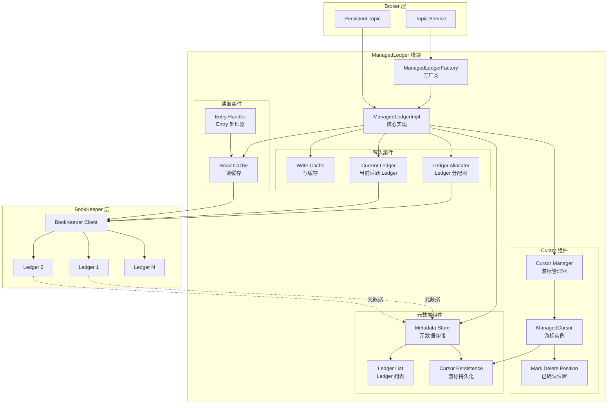
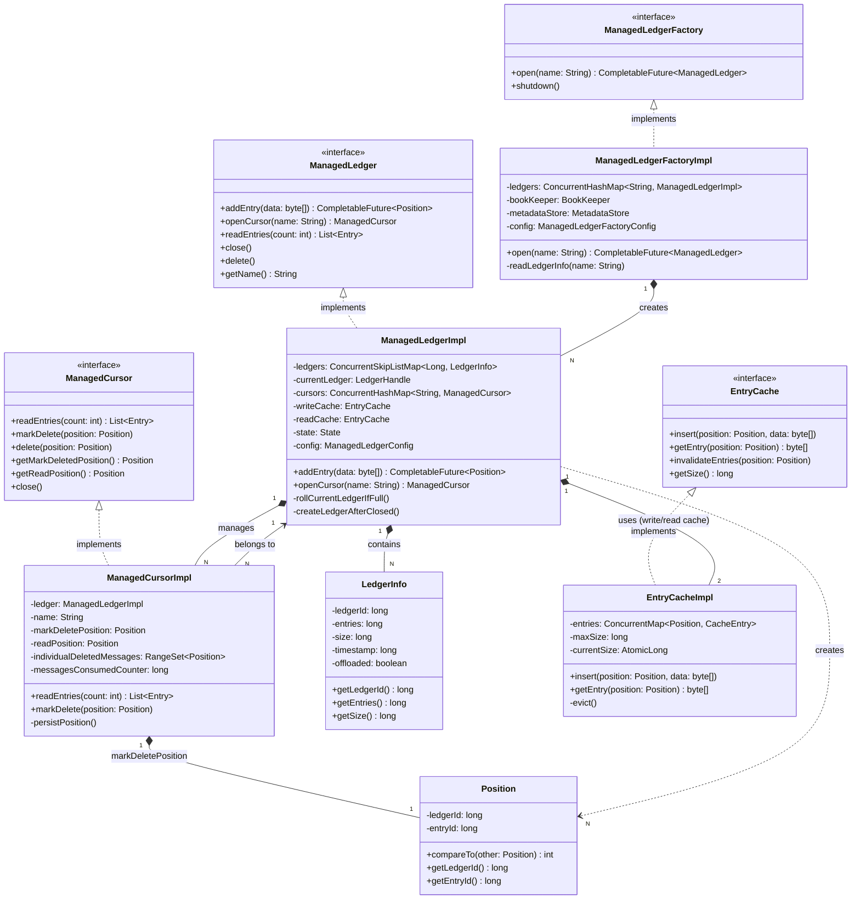
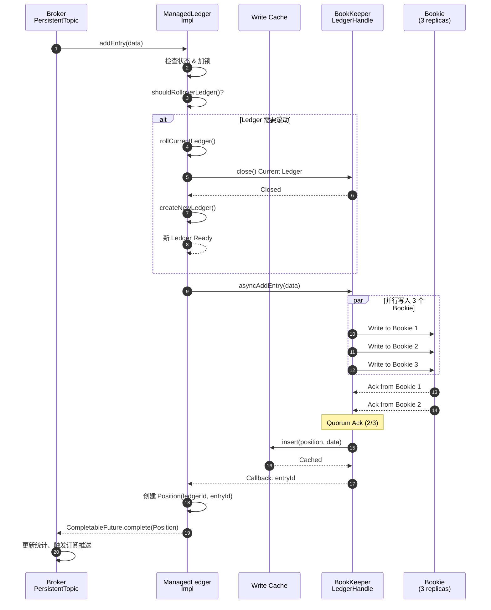
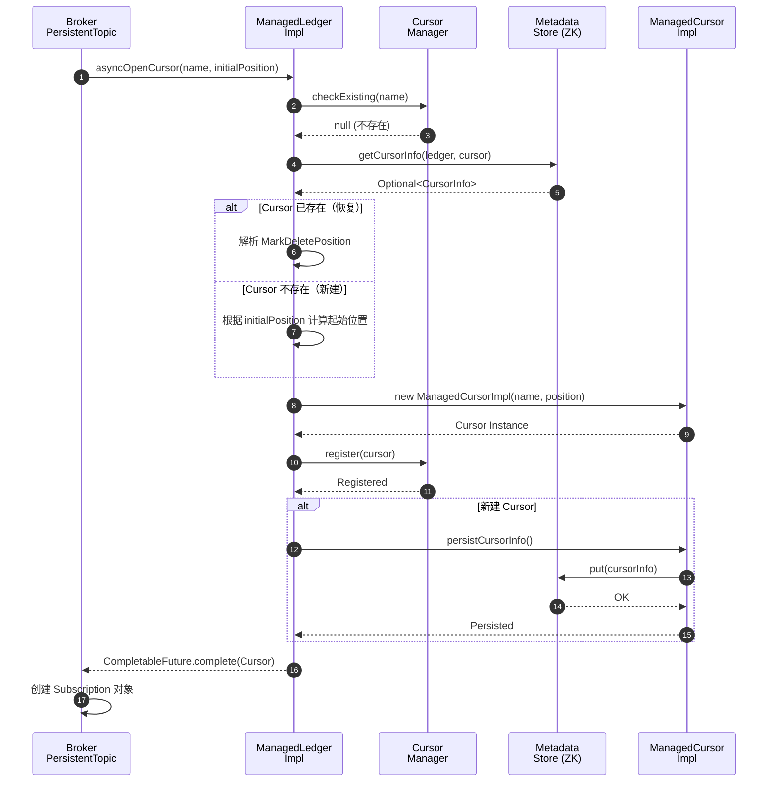
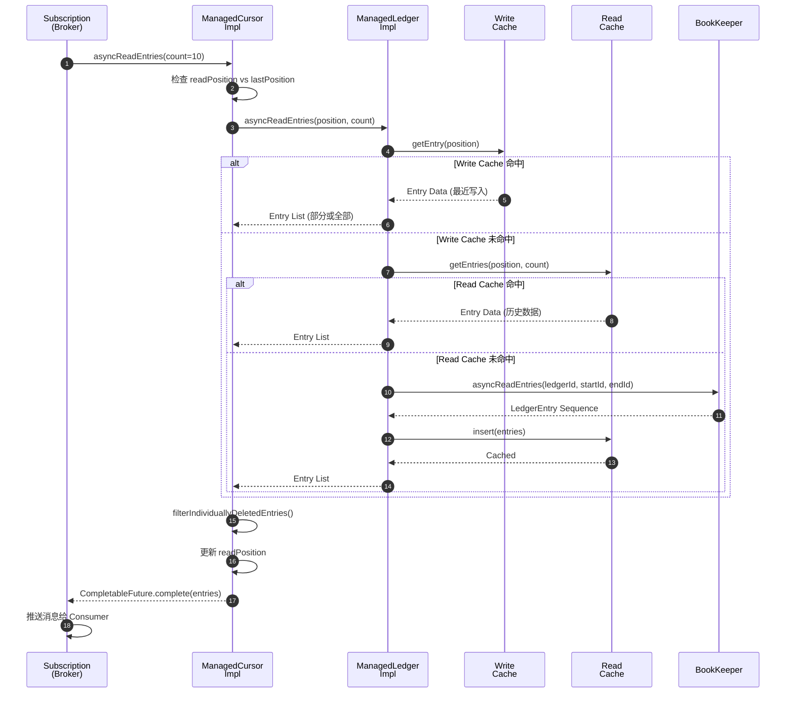
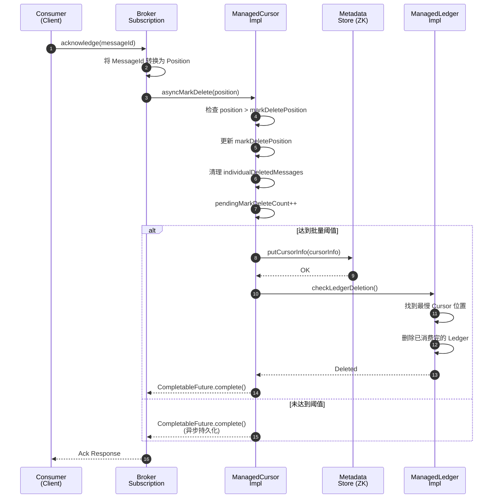
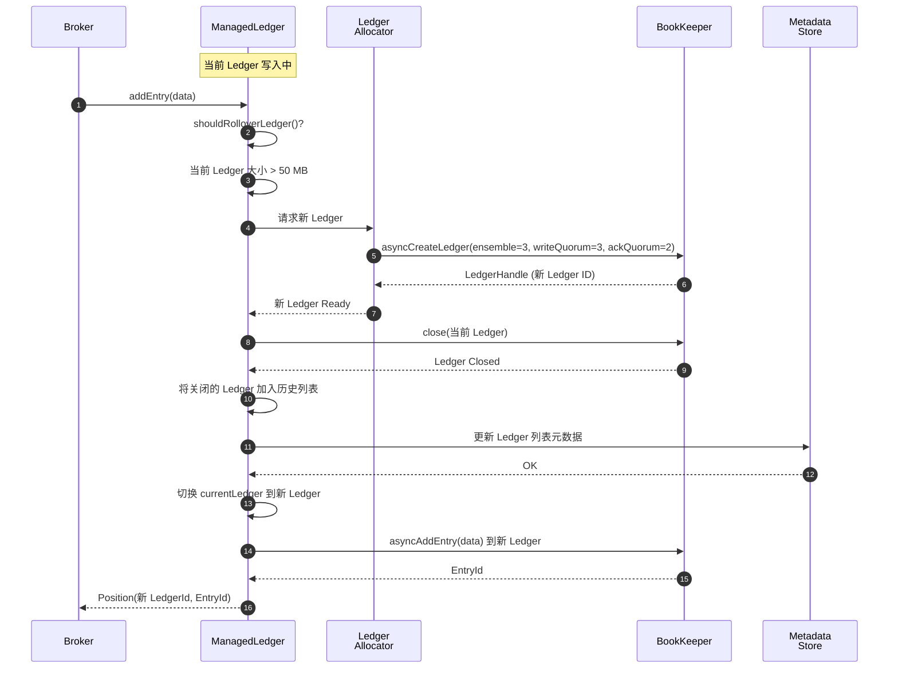
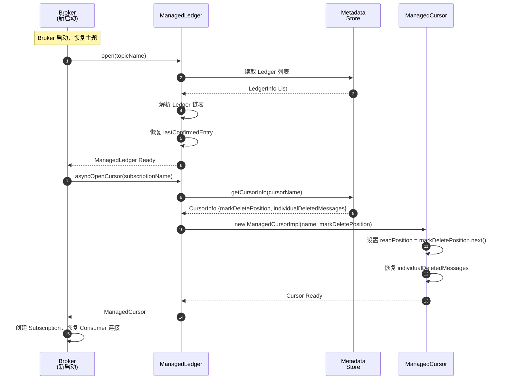
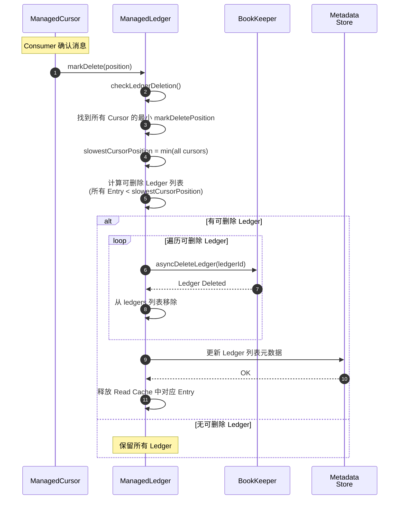

# Pulsar-01-ManagedLedger

## 模块概览

### 职责与定位

ManagedLedger 是 Pulsar 对 Apache BookKeeper 的高层抽象，为 Broker 提供主题日志的管理能力。核心职责包括：

- **日志追加**：提供高效的消息写入接口，封装 BookKeeper Ledger 操作
- **日志读取**：支持按位置读取、游标管理、并发读取
- **Cursor 管理**：维护订阅的消费位置，支持持久化和恢复
- **Ledger 生命周期**：自动创建、滚动、删除 Ledger
- **缓存管理**：内存缓存最近写入的数据，加速读取
- **元数据管理**：持久化 Ledger 列表、Cursor 位置到 ZooKeeper

### 输入与输出

**输入**：
- Broker 调用 `addEntry()`：写入消息字节数组
- Broker 调用 `openCursor()`：创建或恢复订阅游标
- Broker 调用 `readEntries()`：按游标读取消息

**输出**：
- `addEntry()` 返回 `Position`：消息在日志中的位置（LedgerId + EntryId）
- `readEntries()` 返回 `Entry` 列表：消息字节数组及位置信息
- Cursor 操作返回确认或异常

### 上下游依赖

**上游**：
- **Broker**：ManagedLedger 的唯一调用者，通过 `ManagedLedgerFactory` 创建实例

**下游**：
- **BookKeeper Client**：执行底层 Ledger 的创建、写入、读取操作
- **Metadata Store**：存储 ManagedLedger 元数据（Ledger 列表、Cursor 位置）
- **OpenTelemetry**：上报性能指标（延迟、吞吐量、缓存命中率）

### 生命周期

1. **创建**：Broker 调用 `ManagedLedgerFactory.open()` 创建或打开 ManagedLedger
2. **活跃**：持续接受写入和读取请求，自动滚动 Ledger
3. **关闭**：Broker 调用 `close()` 关闭 ManagedLedger，释放资源
4. **删除**：Broker 调用 `delete()` 删除 ManagedLedger 及所有 Ledger

---

## 模块架构图



### 架构图说明

#### 核心组件职责

**ManagedLedgerFactory**：
- 单例工厂，管理所有 ManagedLedger 实例
- 维护 ManagedLedger 缓存，避免重复创建
- 初始化 BookKeeper Client 和 Metadata Store

**ManagedLedgerImpl**：
- ManagedLedger 接口的核心实现
- 协调写入、读取、Cursor 管理、Ledger 滚动
- 维护 Ledger 链表（历史 Ledger + 当前 Ledger）

**Write Cache**：
- 暂存最近写入的 Entry，加速读取（消费通常发生在写入后不久）
- 基于内存大小和时间策略淘汰旧数据
- 写入成功后立即可读，无需等待 BookKeeper Flush

**Ledger Allocator**：
- 预创建 Ledger，减少写入延迟
- 监控当前 Ledger 大小，触发滚动
- 配置 Ensemble、Write Quorum、Ack Quorum 参数

**Current Ledger**：
- 当前活跃的 Ledger，接受新写入
- 达到大小或时间阈值后关闭，创建新 Ledger
- 关闭的 Ledger 变为只读，支持历史数据读取

**Read Cache**：
- 缓存从 BookKeeper 读取的 Entry
- LRU 策略淘汰，配置最大缓存大小
- 命中缓存时避免 BookKeeper 网络 IO

**Cursor Manager**：
- 管理订阅对应的 Cursor 实例
- 持久化 Cursor 元数据到 Metadata Store
- 跟踪最慢 Cursor，决定 Ledger 删除时机

**ManagedCursor**：
- 表示一个订阅的消费位置
- 维护 `markDeletePosition`（已确认的最大连续位置）
- 维护 `readPosition`（下次读取位置）
- 支持个性化 Ack（单条确认）和批量 Ack

**Metadata Store**：
- 抽象元数据存储接口（ZooKeeper/etcd）
- 存储 Ledger 列表（LedgerId、状态、大小）
- 存储 Cursor 位置（MarkDeletePosition、个性化 Ack）

#### 数据流

**写入流程**：
1. Broker 调用 `ML.addEntry(data)`
2. ManagedLedger 获取 Current Ledger
3. 写入 Write Cache（立即可读）
4. 异步调用 `BookKeeper.asyncAddEntry()`
5. BookKeeper 返回 EntryId
6. ManagedLedger 返回 `Position(LedgerId, EntryId)`

**读取流程**：
1. Broker 调用 `Cursor.readEntries(count)`
2. ManagedLedger 检查 Read Cache
3. 缓存未命中，调用 `BookKeeper.asyncReadEntries()`
4. BookKeeper 返回 Entry 数据
5. 存入 Read Cache
6. 返回 Entry 列表给 Broker

**Ledger 滚动流程**：
1. Ledger Allocator 预创建新 Ledger
2. Current Ledger 达到大小阈值（默认 50 MB）
3. ManagedLedger 关闭 Current Ledger
4. 切换到预创建的 Ledger
5. 更新 Ledger 列表元数据到 Metadata Store

#### 边界条件

**并发写入**：
- ManagedLedger 保证单线程写入 Current Ledger（通过锁）
- 多线程写入请求排队执行

**并发读取**：
- 支持多个 Cursor 并发读取不同位置
- Read Cache 线程安全

**Ledger 删除**：
- 仅删除所有 Cursor 均已消费的 Ledger
- 保留至少一个 Ledger（即使已消费完）

**元数据一致性**：
- Ledger 列表更新：强一致性（ZooKeeper）
- Cursor 位置更新：批量异步，故障恢复时可能重复消费

#### 异常与回退

**BookKeeper 写入失败**：
- 关闭当前 Ledger，创建新 Ledger 继续写入
- 返回错误给 Broker，由 Producer 重试

**Metadata Store 故障**：
- 元数据操作失败，ManagedLedger 进入只读模式
- 已缓存数据可读，新写入失败

**Ledger 读取失败**：
- 尝试从其他副本读取（BookKeeper 自动处理）
- 多次重试失败后返回错误

#### 性能要点

**写入延迟**：P95 < 10 ms
- 主要取决于 BookKeeper Journal 写入延迟（5-8 ms）
- Write Cache 优化：写入后立即可读

**读取延迟**：P95 < 5 ms
- Read Cache 命中率 > 80%（尾部消费场景）
- 缓存未命中时，BookKeeper 读取延迟 2-4 ms

**内存占用**：
- Write Cache：默认 256 MB
- Read Cache：默认 1024 MB
- Cursor 元数据：每订阅约 10 KB

**磁盘 IO**：
- BookKeeper Journal：顺序写，IOPS 峰值 1 万（SSD）
- BookKeeper EntryLog：批量写，吞吐量 500 MB/s

---

## 关键数据结构与 UML 图

### 核心类图



### 数据结构说明

#### ManagedLedger 接口

```java
public interface ManagedLedger {
    // 写入消息，返回消息位置
    CompletableFuture<Position> addEntry(byte[] data);
    CompletableFuture<Position> addEntry(byte[] data, int offset, int length);
    
    // 打开或创建游标（订阅）
    ManagedCursor openCursor(String cursorName) throws ManagedLedgerException;
    ManagedCursor openCursor(String cursorName, InitialPosition initialPosition);
    
    // 获取游标列表
    Iterable<ManagedCursor> getCursors();
    
    // 删除游标
    void deleteCursor(String name);
    
    // 获取统计信息
    long getNumberOfEntries();
    long getTotalSize();
    Position getLastConfirmedEntry();
    
    // 关闭与删除
    void close() throws ManagedLedgerException;
    CompletableFuture<Void> asyncClose();
    void delete() throws ManagedLedgerException;
}
```

**字段说明**：

| 方法 | 参数 | 返回值 | 说明 |
|---|---|---|---|
| `addEntry` | data: 消息字节数组 | Position | 异步写入消息，返回位置 |
| `openCursor` | cursorName: 游标名<br/>initialPosition: 初始位置 | ManagedCursor | 创建或恢复游标，Earliest/Latest |
| `getCursors` | - | Iterable | 获取所有游标实例 |
| `deleteCursor` | name: 游标名 | void | 删除游标及其元数据 |
| `getNumberOfEntries` | - | long | 获取总消息数 |
| `getTotalSize` | - | long | 获取总字节数 |
| `getLastConfirmedEntry` | - | Position | 获取最后写入位置 |
| `close` | - | void | 同步关闭 |
| `asyncClose` | - | CompletableFuture | 异步关闭 |
| `delete` | - | void | 删除 ManagedLedger 及所有 Ledger |

#### ManagedCursor 接口

```java
public interface ManagedCursor {
    // 读取消息
    List<Entry> readEntries(int numberOfEntriesToRead);
    CompletableFuture<List<Entry>> asyncReadEntries(int numberOfEntriesToRead);
    
    // 确认消息
    void markDelete(Position position);
    CompletableFuture<Void> asyncMarkDelete(Position position);
    
    // 单条消息删除（个性化 Ack）
    void delete(Position position);
    void delete(List<Position> positions);
    
    // 获取位置信息
    Position getMarkDeletedPosition();
    Position getReadPosition();
    
    // 查找位置
    Position findNewestMatching(Predicate<Entry> condition);
    
    // 重置位置（Seek）
    void seek(Position newReadPosition);
    
    // 关闭
    void close();
    CompletableFuture<Void> asyncClose();
}
```

**字段说明**：

| 方法 | 参数 | 返回值 | 说明 |
|---|---|---|---|
| `readEntries` | numberOfEntriesToRead: 读取数量 | List\<Entry\> | 同步读取消息 |
| `asyncReadEntries` | numberOfEntriesToRead: 读取数量 | CompletableFuture | 异步读取消息 |
| `markDelete` | position: 确认位置 | void | 确认到指定位置（包含） |
| `delete` | position: 消息位置 | void | 单条消息确认（跳跃确认） |
| `getMarkDeletedPosition` | - | Position | 获取已确认的最大连续位置 |
| `getReadPosition` | - | Position | 获取下次读取位置 |
| `findNewestMatching` | condition: 过滤条件 | Position | 从最新位置向前查找 |
| `seek` | newReadPosition: 新位置 | void | 重置读取位置 |

#### Position 类

```java
public class Position implements Comparable<Position> {
    private final long ledgerId;    // Ledger ID
    private final long entryId;     // Entry ID in Ledger
    
    public Position(long ledgerId, long entryId) {
        this.ledgerId = ledgerId;
        this.entryId = entryId;
    }
    
    public long getLedgerId() {
        return ledgerId;
    }
    
    public long getEntryId() {
        return entryId;
    }
    
    @Override
    public int compareTo(Position other) {
        // 1. 先比较 LedgerId
        if (this.ledgerId != other.ledgerId) {
            return Long.compare(this.ledgerId, other.ledgerId);
        }
        // 2. 再比较 EntryId
        return Long.compare(this.entryId, other.entryId);
    }
}
```

**字段说明**：

| 字段 | 类型 | 说明 |
|---|---|---|
| `ledgerId` | long | Ledger ID，唯一标识一个 Ledger |
| `entryId` | long | Entry ID，Ledger 内递增的序号 |

**约束**：
- Position 不可变（Immutable）
- LedgerId 随时间递增
- 同一 Ledger 内 EntryId 从 0 开始递增

#### LedgerInfo 类

```java
public class LedgerInfo {
    private final long ledgerId;            // Ledger ID
    private final long entries;             // Entry 数量
    private final long size;                // 字节大小
    private final long timestamp;           // 创建时间戳
    private final boolean offloaded;        // 是否已卸载到分层存储
    private final String offloadContext;    // 卸载上下文（S3 路径等）
    
    public LedgerInfo(long ledgerId, long entries, long size, long timestamp) {
        this.ledgerId = ledgerId;
        this.entries = entries;
        this.size = size;
        this.timestamp = timestamp;
        this.offloaded = false;
        this.offloadContext = null;
    }
}
```

**字段说明**：

| 字段 | 类型 | 说明 |
|---|---|---|
| `ledgerId` | long | Ledger ID |
| `entries` | long | Entry 总数 |
| `size` | long | 总字节数 |
| `timestamp` | long | Ledger 创建时间（Unix 时间戳） |
| `offloaded` | boolean | 是否已卸载到分层存储 |
| `offloadContext` | String | 卸载元数据（JSON 格式） |

#### EntryCache 实现

```java
public class EntryCacheImpl implements EntryCache {
    private final ConcurrentMap<Position, CacheEntry> entries = new ConcurrentHashMap<>();
    private final long maxSize;                  // 最大缓存字节数
    private final AtomicLong currentSize = new AtomicLong(0);
    private final RateLimiter evictionTrigger;   // 淘汰触发器
    
    @Override
    public void insert(Position position, byte[] data) {
        CacheEntry entry = new CacheEntry(data);
        entries.put(position, entry);
        long newSize = currentSize.addAndGet(data.length);
        
        // 超过最大大小，触发淘汰
        if (newSize > maxSize) {
            evict();
        }
    }
    
    @Override
    public byte[] getEntry(Position position) {
        CacheEntry entry = entries.get(position);
        if (entry != null) {
            entry.touch(); // 更新访问时间（LRU）
            return entry.getData();
        }
        return null;
    }
    
    private void evict() {
        // LRU 淘汰：按访问时间排序，删除最旧的 Entry
        // （此处省略具体淘汰逻辑）
    }
}
```

---

## 核心 API 与调用链

### API-1：addEntry（写入消息）

#### 基本信息

- **接口名**：`ManagedLedger.addEntry(byte[] data)`
- **协议**：Java 异步 API
- **幂等性**：非幂等（Broker 层通过 SequenceId 保证幂等）

#### 请求参数

```java
CompletableFuture<Position> addEntry(byte[] data);
CompletableFuture<Position> addEntry(byte[] data, int offset, int length);
```

**参数说明**：

| 参数 | 类型 | 必填 | 说明 |
|---|---|---:|---|
| data | byte[] | 是 | 消息字节数组 |
| offset | int | 否 | 数组起始偏移 |
| length | int | 否 | 数据长度 |

#### 响应结果

```java
CompletableFuture<Position>
```

**返回值**：

| 字段 | 类型 | 说明 |
|---|---|---|
| Position | Position | 消息在日志中的位置（LedgerId + EntryId） |

**异常**：
- `ManagedLedgerException`：ManagedLedger 已关闭或故障
- `ManagedLedgerFencedException`：被其他实例接管（Split-Brain 保护）

#### 入口函数与核心代码

```java
public class ManagedLedgerImpl implements ManagedLedger {
    
    @Override
    public CompletableFuture<Position> addEntry(byte[] data, int offset, int length) {
        // 1. 状态检查
        if (state != State.OPEN) {
            return CompletableFuture.failedFuture(
                new ManagedLedgerException("ManagedLedger is not open"));
        }
        
        CompletableFuture<Position> future = new CompletableFuture<>();
        
        // 2. 加锁保证单线程写入
        synchronized (this) {
            // 3. 检查当前 Ledger 是否需要滚动
            if (shouldRolloverLedger()) {
                // 创建新 Ledger 后继续写入
                rollCurrentLedger().thenCompose(v -> doAddEntry(data, offset, length))
                                   .whenComplete((pos, ex) -> {
                                       if (ex != null) future.completeExceptionally(ex);
                                       else future.complete(pos);
                                   });
                return future;
            }
            
            // 4. 写入当前 Ledger
            return doAddEntry(data, offset, length);
        }
    }
    
    private CompletableFuture<Position> doAddEntry(byte[] data, int offset, int length) {
        LedgerHandle ledger = currentLedger;
        long ledgerId = ledger.getId();
        
        // 5. 写入 Write Cache（立即可读）
        OpAddEntry op = OpAddEntry.create(this, data, offset, length);
        
        // 6. 异步写入 BookKeeper
        ledger.asyncAddEntry(data, offset, length, (rc, lh, entryId, ctx) -> {
            if (rc == BKException.Code.OK) {
                // 写入成功
                Position position = new Position(ledgerId, entryId);
                writeCache.insert(position, data, offset, length);
                op.setPosition(position);
                op.getFuture().complete(position);
                
                // （此处省略：更新统计指标、触发回调）
            } else {
                // 写入失败，关闭 Ledger 重试
                // （此处省略：错误处理逻辑）
                ledgerClosed(ledger);
                op.getFuture().completeExceptionally(new ManagedLedgerException(rc));
            }
        }, null);
        
        return op.getFuture();
    }
    
    private boolean shouldRolloverLedger() {
        // 判断是否需要滚动 Ledger
        // 1. Ledger 大小超过阈值（默认 50 MB）
        // 2. Ledger Entry 数量超过阈值（默认无限制）
        // 3. Ledger 时间超过阈值（默认无限制）
        LedgerInfo info = ledgers.get(currentLedger.getId());
        return info.getSize() >= config.getMaxLedgerSize();
    }
}
```

#### 调用链（Broker → ManagedLedger → BookKeeper）

```java
// Broker 层：PersistentTopic.publishMessage()
public class PersistentTopic {
    public CompletableFuture<Position> publishMessage(ByteBuf headersAndPayload) {
        // 1. 权限检查
        if (!hasPermission()) {
            return CompletableFuture.failedFuture(new AuthorizationException());
        }
        
        // 2. Schema 验证
        // （此处省略：Schema 验证逻辑）
        
        // 3. 调用 ManagedLedger.addEntry()
        byte[] data = new byte[headersAndPayload.readableBytes()];
        headersAndPayload.readBytes(data);
        
        return ledger.addEntry(data).thenApply(position -> {
            // 4. 更新统计信息
            msgInCounter.inc();
            bytesInCounter.add(data.length);
            
            // 5. 触发订阅推送
            notifySubscriptions(position);
            
            return position;
        });
    }
}
```

#### 时序图（写入完整路径）



#### 边界与异常

**正常情况**：
- 写入延迟：P95 < 10 ms（主要取决于 BookKeeper）
- 吞吐量：单 ManagedLedger 可达 100 MB/s

**异常情况**：

1. **BookKeeper 写入超时**：
   - Ledger 写入超时（默认 60 秒）
   - ManagedLedger 关闭当前 Ledger，创建新 Ledger
   - 返回错误给 Broker，由 Producer 重试

2. **Ledger 滚动过程中写入**：
   - 新写入请求等待滚动完成
   - 滚动失败，返回错误

3. **ManagedLedger Fenced**：
   - 被其他 Broker 接管（ZooKeeper Session 超时）
   - 拒绝新写入，返回 `ManagedLedgerFencedException`

#### 性能要点

**批量写入**：
- Broker 层批量打包消息（Producer 批量发送）
- ManagedLedger 不额外批量，逐条写入 BookKeeper
- BookKeeper 内部批量刷盘（Journal Buffer）

**Write Cache 优化**：
- 写入成功立即插入缓存
- 消费者尾部读取命中 Write Cache，延迟 < 1 ms

**Ledger 预创建**：
- Ledger Allocator 后台预创建 Ledger
- 滚动时直接使用，减少延迟

---

### API-2：openCursor（打开游标）

#### 基本信息

- **接口名**：`ManagedLedger.openCursor(String name)`
- **协议**：Java 同步/异步 API
- **幂等性**：是（重复调用返回同一 Cursor 实例）

#### 请求参数

```java
ManagedCursor openCursor(String cursorName) throws ManagedLedgerException;
ManagedCursor openCursor(String cursorName, InitialPosition initialPosition);
CompletableFuture<ManagedCursor> asyncOpenCursor(String cursorName, InitialPosition initialPosition);
```

**参数说明**：

| 参数 | 类型 | 必填 | 默认值 | 说明 |
|---|---|---:|---|---|
| cursorName | String | 是 | - | 游标名（对应订阅名） |
| initialPosition | InitialPosition | 否 | Latest | 初始位置（Earliest/Latest） |

**InitialPosition 枚举**：
- `Earliest`：从最早消息开始消费
- `Latest`：从最新消息开始消费

#### 响应结果

```java
ManagedCursor
```

**返回值**：

| 类型 | 说明 |
|---|---|
| ManagedCursor | 游标实例，用于读取和确认消息 |

**异常**：
- `ManagedLedgerException`：打开失败（元数据损坏、权限不足）

#### 入口函数与核心代码

```java
public class ManagedLedgerImpl implements ManagedLedger {
    
    private final ConcurrentHashMap<String, ManagedCursor> cursors = new ConcurrentHashMap<>();
    
    @Override
    public CompletableFuture<ManagedCursor> asyncOpenCursor(String cursorName, 
                                                             InitialPosition initialPosition) {
        // 1. 检查 Cursor 是否已存在
        ManagedCursor existingCursor = cursors.get(cursorName);
        if (existingCursor != null && !existingCursor.isClosed()) {
            return CompletableFuture.completedFuture(existingCursor);
        }
        
        // 2. 从 Metadata Store 读取 Cursor 位置
        return metadataStore.getCursorInfo(name, cursorName).thenCompose(cursorInfo -> {
            Position markDeletePosition;
            
            if (cursorInfo.isPresent()) {
                // Cursor 已存在，恢复位置
                markDeletePosition = cursorInfo.get().getMarkDeletePosition();
            } else {
                // 新 Cursor，根据 initialPosition 确定起始位置
                if (initialPosition == InitialPosition.Earliest) {
                    markDeletePosition = getFirstPosition();
                } else {
                    markDeletePosition = getLastPosition();
                }
            }
            
            // 3. 创建 ManagedCursor 实例
            ManagedCursorImpl cursor = new ManagedCursorImpl(
                this, cursorName, markDeletePosition);
            
            // 4. 缓存 Cursor 实例
            cursors.put(cursorName, cursor);
            
            // 5. 持久化 Cursor 元数据（如果是新建）
            if (!cursorInfo.isPresent()) {
                return cursor.persistCursorInfo().thenApply(v -> cursor);
            }
            
            return CompletableFuture.completedFuture(cursor);
        });
    }
    
    private Position getFirstPosition() {
        // 返回第一个 Ledger 的第一个 Entry
        Long firstLedgerId = ledgers.firstKey();
        return new Position(firstLedgerId, 0);
    }
    
    private Position getLastPosition() {
        // 返回当前 Ledger 的最后一个 Entry
        return lastConfirmedEntry;
    }
}
```

#### 调用链（Broker → ManagedLedger → Metadata Store）

```java
// Broker 层：PersistentTopic.subscribe()
public class PersistentTopic {
    public CompletableFuture<Subscription> subscribe(String subscriptionName, 
                                                      SubscriptionType subType) {
        // 1. 检查订阅是否已存在
        PersistentSubscription sub = subscriptions.get(subscriptionName);
        if (sub != null) {
            return CompletableFuture.completedFuture(sub);
        }
        
        // 2. 打开 ManagedCursor
        return ledger.asyncOpenCursor(subscriptionName, InitialPosition.Latest)
                     .thenApply(cursor -> {
                         // 3. 创建 Subscription 对象
                         PersistentSubscription subscription = new PersistentSubscription(
                             this, subscriptionName, cursor, subType);
                         
                         // 4. 缓存 Subscription
                         subscriptions.put(subscriptionName, subscription);
                         
                         return subscription;
                     });
    }
}
```

#### 时序图（打开 Cursor 路径）



#### 边界与异常

**正常情况**：
- Cursor 打开延迟：P95 < 100 ms（主要取决于元数据读取）
- 单 ManagedLedger 支持数千 Cursor

**异常情况**：

1. **Cursor 元数据损坏**：
   - 无法解析 MarkDeletePosition
   - 回退到 initialPosition

2. **Metadata Store 故障**：
   - 无法读取 Cursor 位置
   - 返回错误，Broker 重试

3. **Cursor 名称冲突**：
   - 已存在同名 Cursor
   - 返回现有实例（幂等）

---

### API-3：readEntries（读取消息）

#### 基本信息

- **接口名**：`ManagedCursor.readEntries(int count)`
- **协议**：Java 同步/异步 API
- **幂等性**：是（读取不改变状态，除非调用 markDelete）

#### 请求参数

```java
List<Entry> readEntries(int numberOfEntriesToRead) throws ManagedLedgerException;
CompletableFuture<List<Entry>> asyncReadEntries(int numberOfEntriesToRead);
```

**参数说明**：

| 参数 | 类型 | 必填 | 说明 |
|---|---|---:|---|
| numberOfEntriesToRead | int | 是 | 读取消息数量 |

#### 响应结果

```java
List<Entry>
```

**Entry 接口**：

```java
public interface Entry {
    byte[] getData();              // 消息字节数组
    Position getPosition();        // 消息位置
    long getLedgerId();
    long getEntryId();
    void release();                // 释放内存（引用计数）
}
```

**字段说明**：

| 方法 | 返回值 | 说明 |
|---|---|---|
| getData() | byte[] | 消息字节数组 |
| getPosition() | Position | 消息位置（LedgerId + EntryId） |
| release() | void | 释放内存（必须调用） |

#### 入口函数与核心代码

```java
public class ManagedCursorImpl implements ManagedCursor {
    
    private volatile Position readPosition;          // 下次读取位置
    private volatile Position markDeletePosition;    // 已确认位置
    
    @Override
    public CompletableFuture<List<Entry>> asyncReadEntries(int numberOfEntriesToRead) {
        // 1. 检查 Cursor 状态
        if (state != State.OPEN) {
            return CompletableFuture.failedFuture(new CursorClosedException());
        }
        
        // 2. 检查是否有消息可读
        Position lastPosition = ledger.getLastConfirmedEntry();
        if (readPosition.compareTo(lastPosition) > 0) {
            // 已读到末尾
            return CompletableFuture.completedFuture(Collections.emptyList());
        }
        
        // 3. 计算实际读取数量（不超过可用消息）
        long availableEntries = getNumberOfEntries(readPosition, lastPosition);
        int entriesToRead = (int) Math.min(numberOfEntriesToRead, availableEntries);
        
        // 4. 从 ManagedLedger 读取
        return ledger.asyncReadEntries(readPosition, entriesToRead)
                     .thenApply(entries -> {
                         // 5. 更新 readPosition
                         if (!entries.isEmpty()) {
                             Entry lastEntry = entries.get(entries.size() - 1);
                             readPosition = lastEntry.getPosition().getNext();
                         }
                         
                         // 6. 过滤已删除消息（个性化 Ack）
                         return filterIndividuallyDeletedEntries(entries);
                     });
    }
    
    private List<Entry> filterIndividuallyDeletedEntries(List<Entry> entries) {
        if (individualDeletedMessages.isEmpty()) {
            return entries;
        }
        
        // 过滤掉已单条删除的消息
        return entries.stream()
                      .filter(entry -> !individualDeletedMessages.contains(entry.getPosition()))
                      .collect(Collectors.toList());
    }
}
```

#### 调用链（Cursor → ManagedLedger → Cache → BookKeeper）

```java
public class ManagedLedgerImpl implements ManagedLedger {
    
    public CompletableFuture<List<Entry>> asyncReadEntries(Position position, int count) {
        List<Entry> entries = new ArrayList<>();
        
        // 1. 尝试从 Write Cache 读取
        for (int i = 0; i < count; i++) {
            Position pos = position.getNext(i);
            byte[] data = writeCache.getEntry(pos);
            if (data != null) {
                entries.add(new EntryImpl(pos, data));
            } else {
                break; // Cache Miss，从 BookKeeper 读取
            }
        }
        
        // 2. 如果 Cache 完全命中，直接返回
        if (entries.size() == count) {
            return CompletableFuture.completedFuture(entries);
        }
        
        // 3. 从 Read Cache 读取
        Position readStart = position.getNext(entries.size());
        List<Entry> cachedEntries = readCache.getEntries(readStart, count - entries.size());
        entries.addAll(cachedEntries);
        
        if (entries.size() == count) {
            return CompletableFuture.completedFuture(entries);
        }
        
        // 4. 从 BookKeeper 读取
        return readFromBookKeeper(readStart, count - entries.size())
                   .thenApply(bkEntries -> {
                       // 5. 插入 Read Cache
                       bkEntries.forEach(entry -> 
                           readCache.insert(entry.getPosition(), entry.getData()));
                       
                       entries.addAll(bkEntries);
                       return entries;
                   });
    }
    
    private CompletableFuture<List<Entry>> readFromBookKeeper(Position start, int count) {
        long ledgerId = start.getLedgerId();
        long startEntryId = start.getEntryId();
        long endEntryId = startEntryId + count - 1;
        
        // 查找 Ledger Handle
        LedgerHandle ledger = getLedgerHandle(ledgerId);
        
        // 异步读取
        CompletableFuture<List<Entry>> future = new CompletableFuture<>();
        
        ledger.asyncReadEntries(startEntryId, endEntryId, (rc, lh, seq, ctx) -> {
            if (rc == BKException.Code.OK) {
                List<Entry> entries = new ArrayList<>();
                while (seq.hasMoreElements()) {
                    LedgerEntry bkEntry = seq.nextElement();
                    Position pos = new Position(ledgerId, bkEntry.getEntryId());
                    entries.add(new EntryImpl(pos, bkEntry.getEntryBytes()));
                }
                future.complete(entries);
            } else {
                // （此处省略：错误处理）
                future.completeExceptionally(new ManagedLedgerException(rc));
            }
        }, null);
        
        return future;
    }
}
```

#### 时序图（读取消息路径）



#### 边界与异常

**正常情况**：
- 读取延迟（Cache 命中）：P95 < 1 ms
- 读取延迟（Cache 未命中）：P95 < 5 ms
- 吞吐量：单 Cursor 可达 100 MB/s

**异常情况**：

1. **读取位置超过末尾**：
   - 返回空列表，等待新消息写入

2. **Ledger 读取失败**：
   - BookKeeper 自动从其他副本读取
   - 多次重试失败，返回错误

3. **跨 Ledger 读取**：
   - ManagedLedger 自动拆分为多次 BookKeeper 读取
   - 拼接结果返回

---

### API-4：markDelete（确认消息）

#### 基本信息

- **接口名**：`ManagedCursor.markDelete(Position position)`
- **协议**：Java 同步/异步 API
- **幂等性**：是（重复确认相同位置无副作用）

#### 请求参数

```java
void markDelete(Position position) throws ManagedLedgerException;
CompletableFuture<Void> asyncMarkDelete(Position position);
```

**参数说明**：

| 参数 | 类型 | 必填 | 说明 |
|---|---|---:|---|
| position | Position | 是 | 确认到该位置（包含） |

**语义**：
- 确认 `position` 及之前的所有消息
- 更新 `markDeletePosition`
- 异步批量持久化到 Metadata Store

#### 响应结果

```java
CompletableFuture<Void>
```

**异常**：
- `ManagedLedgerException`：Cursor 已关闭或故障

#### 入口函数与核心代码

```java
public class ManagedCursorImpl implements ManagedCursor {
    
    private volatile Position markDeletePosition;
    private final RangeSet<Position> individualDeletedMessages = TreeRangeSet.create();
    private final AtomicLong pendingMarkDeleteCount = new AtomicLong(0);
    
    @Override
    public CompletableFuture<Void> asyncMarkDelete(Position position) {
        // 1. 检查位置是否合法
        if (position.compareTo(markDeletePosition) <= 0) {
            // 已经确认过，直接返回
            return CompletableFuture.completedFuture(null);
        }
        
        // 2. 更新 markDeletePosition
        markDeletePosition = position;
        
        // 3. 清理个性化删除集合（已被 markDelete 覆盖）
        individualDeletedMessages.remove(Range.atMost(position));
        
        // 4. 增加待持久化计数
        long count = pendingMarkDeleteCount.incrementAndGet();
        
        // 5. 批量持久化（达到阈值或定时触发）
        if (count >= config.getMarkDeleteBatchSize()) {
            return persistMarkDeletePosition();
        } else {
            // 异步持久化（定时任务触发）
            return CompletableFuture.completedFuture(null);
        }
    }
    
    private CompletableFuture<Void> persistMarkDeletePosition() {
        // 重置计数
        pendingMarkDeleteCount.set(0);
        
        // 构造 CursorInfo
        CursorInfo cursorInfo = CursorInfo.builder()
            .markDeletePosition(markDeletePosition)
            .individualDeletedMessages(individualDeletedMessages)
            .messagesConsumedCounter(messagesConsumedCounter.get())
            .build();
        
        // 持久化到 Metadata Store
        return metadataStore.putCursorInfo(ledger.getName(), name, cursorInfo)
                            .thenRun(() -> {
                                // （此处省略：更新统计、触发 Ledger 清理）
                                ledger.checkLedgerDeletion();
                            });
    }
    
    @Override
    public void delete(Position position) {
        // 单条消息删除（个性化 Ack）
        if (position.compareTo(markDeletePosition) > 0) {
            individualDeletedMessages.add(Range.singleton(position));
            
            // 检查是否可以推进 markDeletePosition
            advanceMarkDeletePosition();
        }
    }
    
    private void advanceMarkDeletePosition() {
        // 如果个性化删除消息连续，推进 markDeletePosition
        Position nextPos = markDeletePosition.getNext();
        while (individualDeletedMessages.contains(nextPos)) {
            markDeletePosition = nextPos;
            individualDeletedMessages.remove(Range.singleton(nextPos));
            nextPos = nextPos.getNext();
        }
    }
}
```

#### 调用链（Consumer → Broker → Cursor）

```java
// Consumer 层：确认消息
consumer.acknowledge(messageId);

// Broker 层：PersistentSubscription.acknowledgeMessage()
public class PersistentSubscription {
    public CompletableFuture<Void> acknowledgeMessage(List<Position> positions) {
        // 1. 更新统计
        msgOutCounter.add(positions.size());
        
        // 2. 调用 Cursor.markDelete()
        if (positions.size() == 1) {
            Position pos = positions.get(0);
            if (isSequential(pos)) {
                // 连续确认
                return cursor.asyncMarkDelete(pos);
            } else {
                // 跳跃确认
                cursor.delete(pos);
                return CompletableFuture.completedFuture(null);
            }
        } else {
            // 批量确认
            positions.forEach(cursor::delete);
            return cursor.asyncMarkDelete(positions.get(positions.size() - 1));
        }
    }
}
```

#### 时序图（确认消息路径）



#### 边界与异常

**正常情况**：
- 确认延迟（内存更新）：< 1 ms
- 持久化延迟（批量）：P95 < 100 ms
- 批量大小：默认 100 条消息或 1 秒间隔

**异常情况**：

1. **Metadata Store 故障**：
   - 确认成功（内存已更新）
   - 持久化失败，下次重试
   - 故障恢复时可能重复消费少量消息

2. **位置回退**：
   - 确认位置小于 markDeletePosition
   - 忽略，返回成功

3. **个性化 Ack 过多**：
   - individualDeletedMessages 集合过大（> 10 万条）
   - 触发强制 markDelete，释放内存

---

## 典型场景时序图

### 场景 1：Ledger 滚动（Rollover）



**说明**：
- Ledger 滚动触发条件：大小超过 50 MB（可配置）
- Ledger Allocator 预创建 Ledger，减少滚动延迟
- 旧 Ledger 关闭后变为只读，支持历史数据读取
- 元数据更新失败时，ManagedLedger 进入 Fenced 状态

### 场景 2：Cursor 恢复（故障重启）



**说明**：
- Broker 重启后，从 Metadata Store 恢复 ManagedLedger 和 Cursor 状态
- Cursor 从 `markDeletePosition` 的下一个位置开始读取
- 故障前未持久化的确认丢失，可能重复消费少量消息（At-Least-Once）

### 场景 3：Ledger 删除（Trim）



**说明**：
- Ledger 删除基于最慢 Cursor 位置
- 至少保留一个 Ledger（即使已完全消费）
- 删除失败不影响读写，后续重试
- Ledger 删除释放 BookKeeper 存储空间

---

## 配置与性能调优

### 核心配置项

#### ManagedLedger 配置

| 配置项 | 类型 | 默认值 | 说明 |
|---|---|---|---|
| `managedLedgerMaxEntriesPerLedger` | int | 50000 | 单 Ledger 最大 Entry 数 |
| `managedLedgerMaxLedgerRolloverTimeMinutes` | int | 240 | Ledger 最大存活时间（分钟） |
| `managedLedgerMinLedgerRolloverTimeMinutes` | int | 10 | Ledger 最小存活时间（分钟） |
| `managedLedgerDefaultEnsembleSize` | int | 3 | Ensemble 大小（副本数） |
| `managedLedgerDefaultWriteQuorum` | int | 3 | Write Quorum |
| `managedLedgerDefaultAckQuorum` | int | 2 | Ack Quorum |
| `managedLedgerCacheSizeMB` | int | 1024 | Read Cache 大小（MB） |
| `managedLedgerCacheEvictionWatermark` | double | 0.9 | Cache 淘汰水位 |
| `managedLedgerCacheEvictionTimeThresholdMillis` | long | 1000 | Cache 淘汰时间阈值 |
| `managedLedgerOffloadAutoTriggerSizeThresholdBytes` | long | -1 | 自动卸载到分层存储的阈值 |

#### Cursor 配置

| 配置项 | 类型 | 默认值 | 说明 |
|---|---|---|---|
| `managedLedgerCursorMaxEntriesPerLedger` | int | 50000 | Cursor Ledger 最大 Entry 数 |
| `managedLedgerCursorRolloverTimeInSeconds` | int | 14400 | Cursor Ledger 滚动时间（秒） |
| `managedLedgerMarkDeleteRateLimit` | double | 10.0 | markDelete 持久化速率限制 |

### 性能优化建议

#### 写入性能优化

1. **增大 Ledger 大小**：
   - 减少滚动频率，降低元数据开销
   - 配置 `managedLedgerMaxEntriesPerLedger=100000`

2. **调整 Quorum 参数**：
   - 降低 Ack Quorum 减少延迟（牺牲可靠性）
   - 例如：`ackQuorum=1`（单副本确认）

3. **BookKeeper 优化**：
   - Journal 使用 SSD
   - 增大 Journal Buffer：`journalMaxGroupWaitMSec=1`

#### 读取性能优化

1. **增大 Read Cache**：
   - 提高缓存命中率
   - 配置 `managedLedgerCacheSizeMB=4096`

2. **预取优化**：
   - Consumer 增大 Receiver Queue
   - Broker 批量读取：`dispatcherMaxReadBatchSize=100`

3. **减少跨 Ledger 读取**：
   - 增大 Ledger 大小
   - 避免频繁 Seek 操作

#### 内存优化

1. **限制 Cursor 数量**：
   - 单主题 Cursor 数建议 < 100
   - 使用 Shared 订阅减少 Cursor

2. **限制 Cache 大小**：
   - 根据可用内存调整
   - 监控 Cache 淘汰率

3. **分层存储卸载**：
   - 历史数据卸载到 S3/GCS
   - 配置 `managedLedgerOffloadAutoTriggerSizeThresholdBytes=10737418240`（10 GB）

---

## 最佳实践

### 监控指标

| 指标 | 类型 | 说明 | 告警阈值 |
|---|---|---|---|
| `pulsar_ml_AddEntryLatency_count` | Counter | 写入次数 | - |
| `pulsar_ml_AddEntryLatency_sum` | Summary | 写入总延迟 | P95 > 50 ms |
| `pulsar_ml_ReadEntriesLatency_sum` | Summary | 读取总延迟 | P95 > 20 ms |
| `pulsar_ml_cache_hits_rate` | Gauge | 缓存命中率 | < 70% |
| `pulsar_ml_cache_misses_rate` | Gauge | 缓存未命中率 | > 30% |
| `pulsar_ml_count` | Gauge | ManagedLedger 数量 | > 10000 |
| `pulsar_ml_ledgers_count` | Gauge | Ledger 总数 | > 100000 |
| `pulsar_ml_cursors_count` | Gauge | Cursor 总数 | > 10000 |

### 故障排查

#### 问题 1：写入延迟突增

**可能原因**：
- BookKeeper Bookie 磁盘慢
- Ledger 滚动频繁
- Metadata Store 响应慢

**排查步骤**：
1. 检查 BookKeeper `bookie_write_latency` 指标
2. 检查 Ledger 滚动频率：`pulsar_ml_LedgerSwitchLatency`
3. 检查 ZooKeeper 延迟

**解决方案**：
- 升级 Bookie 磁盘到 SSD
- 增大 Ledger 大小
- 扩容 ZooKeeper 集群

#### 问题 2：读取延迟高

**可能原因**：
- Read Cache 命中率低
- 跨多个 Ledger 读取
- BookKeeper 读取慢

**排查步骤**：
1. 检查 `pulsar_ml_cache_hits_rate` 指标
2. 检查 Consumer 消费模式（是否频繁 Seek）
3. 检查 BookKeeper `bookie_read_latency`

**解决方案**：
- 增大 Read Cache
- 优化消费模式，避免随机读
- 增加 Bookie 副本数，分散读压力

#### 问题 3：Cursor 恢复慢

**可能原因**：
- Cursor 元数据过大（个性化 Ack 过多）
- Metadata Store 响应慢

**排查步骤**：
1. 检查 Cursor 元数据大小
2. 检查 ZooKeeper 节点大小

**解决方案**：
- 减少个性化 Ack，使用连续确认
- 配置 `managedLedgerMarkDeleteRateLimit` 加快持久化
- 清理长时间未活跃的 Cursor

---

**文档版本**：v1.0  
**对应模块版本**：Pulsar 4.2.0-SNAPSHOT  
**最后更新**：2025-10-05

