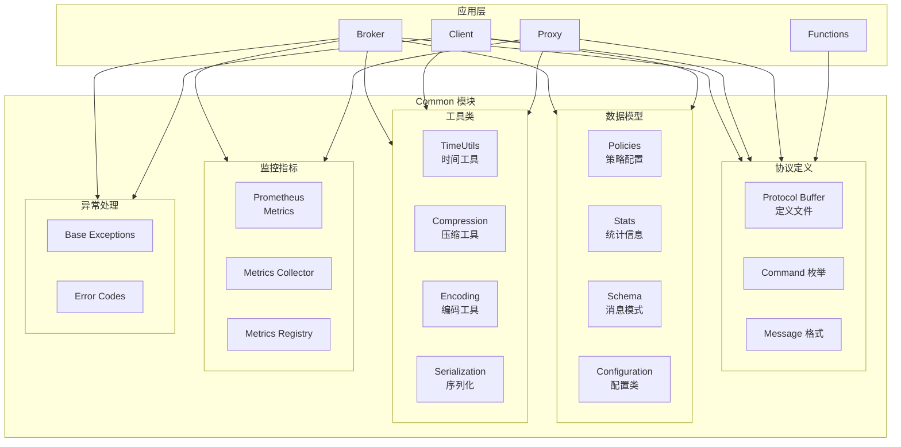

# Pulsar-02-Common

## 模块概览

### 职责与定位

Pulsar Common 是 Pulsar 的基础公共模块，提供协议定义、工具类、配置管理、监控指标等核心基础设施。所有其他模块都依赖 Common 模块。

核心职责包括：

- **协议定义**：Pulsar 二进制协议的 Protocol Buffer 定义
- **数据模型**：策略、配置、统计信息等数据结构
- **工具类**：通用工具类（时间、编码、压缩、序列化）
- **配置管理**：配置加载、验证、默认值处理
- **监控指标**：Metrics 定义和收集框架
- **异常处理**：统一的异常类型和错误码
- **Schema 支持**：消息 Schema 定义和序列化

### 核心概念

**Protocol Buffer 协议**：
- 定义客户端与 Broker 之间的通信协议
- 包含 50+ 种命令类型
- 支持版本兼容

**Policies（策略）**：
- 租户、命名空间、主题级别的配置
- 包含持久化、复制、保留等策略
- 动态可更新

**Stats（统计）**：
- 主题、订阅、生产者、消费者的统计信息
- 实时监控数据
- 性能分析依据

---

## 模块架构图



### 架构图说明

#### 分层结构

1. **协议层**：定义通信格式和命令
2. **数据模型层**：定义配置和统计数据结构
3. **工具层**：提供通用功能
4. **监控层**：提供指标收集和上报
5. **异常层**：统一异常处理

---

## 协议定义

### 1. Protocol Buffer 核心命令

Pulsar 使用 Protocol Buffer 定义二进制协议。以下是核心命令类型：

```protobuf
// PulsarApi.proto

enum BaseCommand.Type {
    CONNECT = 2;           // 客户端连接
    CONNECTED = 3;         // 连接成功响应
    
    SUBSCRIBE = 4;         // 订阅主题
    SUBSCRIPTION = 5;      // 订阅成功响应
    
    PRODUCER = 6;          // 创建生产者
    PRODUCER_SUCCESS = 7;  // 生产者创建成功
    
    SEND = 8;              // 发送消息
    SEND_RECEIPT = 9;      // 发送回执
    SEND_ERROR = 10;       // 发送错误
    
    MESSAGE = 11;          // 推送消息给消费者
    ACK = 12;              // 消息确认
    
    FLOW = 13;             // 流控
    
    UNSUBSCRIBE = 14;      // 取消订阅
    SUCCESS = 15;          // 通用成功响应
    ERROR = 16;            // 通用错误响应
    
    CLOSE_PRODUCER = 17;   // 关闭生产者
    CLOSE_CONSUMER = 18;   // 关闭消费者
    
    LOOKUP = 19;           // 查询主题所在 Broker
    LOOKUP_RESPONSE = 20;  // Lookup 响应
    
    SEEK = 21;             // 消费位置定位
    
    GET_LAST_MESSAGE_ID = 22;  // 获取最后消息 ID
    GET_LAST_MESSAGE_ID_RESPONSE = 23;
    
    // 更多命令类型省略
}
```

### 2. CONNECT 命令详解

```protobuf
message CommandConnect {
    required string client_version = 1;  // 客户端版本
    optional AuthData auth_data = 2;     // 认证数据
    optional string auth_method_name = 3; // 认证方法
    optional int32 protocol_version = 4 [default = 0];  // 协议版本
    optional string proxy_to_broker_url = 5;  // 代理地址
    optional string original_principal = 6;   // 原始身份
    optional string original_auth_data = 7;
    optional string original_auth_method = 8;
    optional FeatureFlags feature_flags = 9;  // 特性标志
}

message AuthData {
    optional string auth_method_name = 1;
    optional bytes auth_data = 2;
}
```

**Java 对应实现**：

```java
package org.apache.pulsar.common.api;

public class Commands {
    
    /**
     * 创建 CONNECT 命令
     */
    public static ByteBuf newConnect(String clientVersion,
                                     String authMethodName,
                                     AuthData authData,
                                     int protocolVersion) {
        CommandConnect.Builder connectBuilder = CommandConnect.newBuilder()
            .setClientVersion(clientVersion)
            .setProtocolVersion(protocolVersion);
        
        if (authMethodName != null) {
            connectBuilder.setAuthMethodName(authMethodName);
        }
        
        if (authData != null) {
            connectBuilder.setAuthData(
                org.apache.pulsar.common.api.proto.AuthData.newBuilder()
                    .setAuthData(ByteString.copyFrom(authData.getBytes()))
                    .setAuthMethodName(authMethodName)
            );
        }
        
        BaseCommand cmd = BaseCommand.newBuilder()
            .setType(BaseCommand.Type.CONNECT)
            .setConnect(connectBuilder)
            .build();
        
        return serializeWithSize(cmd);
    }
    
    /**
     * 序列化命令（带长度前缀）
     */
    private static ByteBuf serializeWithSize(BaseCommand cmd) {
        int cmdSize = cmd.getSerializedSize();
        int totalSize = 4 + cmdSize;  // 4 字节长度 + 命令内容
        
        ByteBuf buf = Unpooled.buffer(totalSize);
        buf.writeInt(cmdSize);
        
        // 序列化 Protocol Buffer 消息
        ByteArrayOutputStream stream = new ByteArrayOutputStream(cmdSize);
        cmd.writeTo(stream);
        buf.writeBytes(stream.toByteArray());
        
        return buf;
    }
}
```

### 3. SEND 命令详解

```protobuf
message CommandSend {
    required uint64 producer_id = 1;    // 生产者 ID
    required uint64 sequence_id = 2;    // 序列号
    optional int32 num_messages = 3 [default = 1];  // 批量消息数
    optional bool highest_sequence_id = 4 [default = false];
    optional bool is_chunk = 5 [default = false];  // 是否为分块消息
    optional MessageMetadata marker = 6;  // 消息元数据标记
}

message MessageMetadata {
    required string producer_name = 1;
    required uint64 sequence_id = 2;
    required uint64 publish_time = 3;
    repeated KeyValue properties = 4;     // 消息属性
    optional string partition_key = 5;    // 分区键
    optional int32 replicated_from = 6;
    optional CompressionType compression = 7 [default = NONE];
    optional uint32 uncompressed_size = 8;
    optional int32 num_messages_in_batch = 9;  // 批量消息数
    
    // Schema 相关
    optional bytes schema_version = 10;
    optional bool replicate_to = 11;
    optional bytes ordering_key = 12;
    
    // 事务相关
    optional uint64 txnid_least_bits = 13;
    optional uint64 txnid_most_bits = 14;
}
```

**发送消息示例**：

```java
public class SendMessageExample {
    
    /**
     * 构建并发送消息
     */
    public void sendMessage(Producer producer, byte[] payload) {
        // 1. 构建消息元数据
        MessageMetadata metadata = MessageMetadata.newBuilder()
            .setProducerName(producer.getProducerName())
            .setSequenceId(producer.getNextSequenceId())
            .setPublishTime(System.currentTimeMillis())
            .addProperties(KeyValue.newBuilder()
                .setKey("key1")
                .setValue("value1"))
            .setCompressionType(CompressionType.LZ4)
            .build();
        
        // 2. 压缩消息
        byte[] compressedPayload = compressPayload(payload);
        metadata = metadata.toBuilder()
            .setUncompressedSize(payload.length)
            .build();
        
        // 3. 构建 SEND 命令
        CommandSend sendCmd = CommandSend.newBuilder()
            .setProducerId(producer.getProducerId())
            .setSequenceId(metadata.getSequenceId())
            .build();
        
        BaseCommand cmd = BaseCommand.newBuilder()
            .setType(BaseCommand.Type.SEND)
            .setSend(sendCmd)
            .build();
        
        // 4. 发送到 Broker
        ByteBuf buffer = serializeCommandAndPayload(cmd, metadata, compressedPayload);
        channel.writeAndFlush(buffer);
    }
    
    private byte[] compressPayload(byte[] payload) {
        // LZ4 压缩实现
        return payload;  // 简化示例
    }
}
```

---

## 数据模型

### 1. Policies - 策略配置

```java
package org.apache.pulsar.common.policies.data;

/**
 * Policies - 命名空间级别的策略配置
 */
public class Policies {
    
    // 认证和授权
    public AuthPolicies auth_policies = new AuthPolicies();
    
    // 复制集群
    public Set<String> replication_clusters;
    
    // 消息 TTL（秒）
    public Integer message_ttl_in_seconds;
    
    // 保留策略
    public RetentionPolicies retention_policies;
    
    // 延迟投递
    public boolean deduplicationEnabled = false;
    
    // 自动主题创建
    public AutoTopicCreationOverride autoTopicCreationOverride;
    
    // 订阅认证模式
    public SubscriptionAuthMode subscription_auth_mode = SubscriptionAuthMode.None;
    
    // 最大生产者数
    public int max_producers_per_topic = 0;  // 0 表示无限制
    
    // 最大消费者数
    public int max_consumers_per_topic = 0;
    
    // 最大消费者数（每订阅）
    public int max_consumers_per_subscription = 0;
    
    // 压缩阈值
    public Long compaction_threshold;
    
    // 卸载策略
    public Long offload_threshold;
    public OffloadPoliciesImpl offload_policies;
    
    // 持久化策略
    public PersistencePolicies persistence;
    
    // 分发速率限制
    public DispatchRate dispatchRate;
    public DispatchRate subscriptionDispatchRate;
    public DispatchRate replicatorDispatchRate;
    
    // 发布速率限制
    public PublishRate publishMaxMessageRate;
    
    // 延迟投递
    public boolean delayed_delivery_enabled = true;
    public Long delayed_delivery_tick_time_millis;
    
    // 非持久化主题
    public InactiveTopicPolicies inactive_topic_policies;
}
```

**RetentionPolicies**：

```java
public class RetentionPolicies {
    private int retentionTimeInMinutes;  // 保留时间
    private int retentionSizeInMB;       // 保留大小
    
    public RetentionPolicies(int retentionTimeInMinutes, int retentionSizeInMB) {
        this.retentionTimeInMinutes = retentionTimeInMinutes;
        this.retentionSizeInMB = retentionSizeInMB;
    }
    
    // Getter/Setter 省略
}
```

**使用示例**：

```java
public class PoliciesExample {
    public static void main(String[] args) {
        // 创建命名空间策略
        Policies policies = new Policies();
        
        // 设置复制集群
        policies.replication_clusters = Set.of("cluster1", "cluster2");
        
        // 设置消息 TTL（1 天）
        policies.message_ttl_in_seconds = 86400;
        
        // 设置保留策略（保留 7 天或 100GB）
        policies.retention_policies = new RetentionPolicies(
            7 * 24 * 60,  // 7 天
            100 * 1024    // 100 GB
        );
        
        // 启用去重
        policies.deduplicationEnabled = true;
        
        // 设置最大生产者数
        policies.max_producers_per_topic = 10;
        
        // 设置发布速率限制（1000 msg/s）
        policies.publishMaxMessageRate = new PublishRate(1000, 10 * 1024 * 1024);
        
        System.out.println("Policies configured");
    }
}
```

### 2. TopicStats - 主题统计信息

```java
package org.apache.pulsar.common.policies.data.stats;

/**
 * TopicStats - 主题统计信息
 */
public class TopicStats {
    
    // 消息速率
    public double msgRateIn;           // 消息入速率（msg/s）
    public double msgThroughputIn;     // 流量入速率（byte/s）
    public double msgRateOut;          // 消息出速率（msg/s）
    public double msgThroughputOut;    // 流量出速率（byte/s）
    
    // 平均消息大小
    public double averageMsgSize;
    
    // 存储大小
    public long storageSize;           // 存储大小（byte）
    public long backlogSize;           // 积压大小（byte）
    
    // 卸载状态
    public String offloadedStorageSize;
    
    // 生产者统计
    public int publishers;
    public List<PublisherStats> publisherStats = new ArrayList<>();
    
    // 订阅统计
    public Map<String, SubscriptionStats> subscriptions = new HashMap<>();
    
    // 复制器统计
    public Map<String, ReplicatorStats> replication = new HashMap<>();
    
    // 去重状态
    public String deduplicationStatus;
}
```

**PublisherStats**：

```java
public class PublisherStats {
    public String producerName;
    public long producerId;
    
    // 消息速率
    public double msgRateIn;
    public double msgThroughputIn;
    public double averageMsgSize;
    
    // 地址信息
    public String address;
    public String connectedSince;
    public String clientVersion;
    
    // 元数据
    public Map<String, String> metadata;
}
```

**SubscriptionStats**：

```java
public class SubscriptionStats {
    public String type;  // 订阅类型
    
    // 消息速率
    public double msgRateOut;
    public double msgThroughputOut;
    public double msgRateRedeliver;
    
    // 积压
    public long msgBacklog;
    public boolean blockedSubscriptionOnUnackedMsgs;
    public long unackedMessages;
    
    // 消费者
    public List<ConsumerStats> consumers = new ArrayList<>();
}
```

---

## 工具类

### 1. TimeUtils - 时间工具

```java
package org.apache.pulsar.common.util;

import java.time.Clock;
import java.util.concurrent.TimeUnit;

/**
 * TimeUtils - 时间相关工具类
 */
public class TimeUtils {
    
    private static volatile Clock clock = Clock.systemUTC();
    
    /**
     * 获取当前时间戳（毫秒）
     */
    public static long currentTimeMillis() {
        return clock.millis();
    }
    
    /**
     * 获取当前时间戳（纳秒）
     */
    public static long currentTimeNanos() {
        return System.nanoTime();
    }
    
    /**
     * 格式化时间间隔
     */
    public static String formatDuration(long durationMs) {
        if (durationMs < 1000) {
            return durationMs + "ms";
        } else if (durationMs < 60000) {
            return String.format("%.2fs", durationMs / 1000.0);
        } else if (durationMs < 3600000) {
            return String.format("%.2fm", durationMs / 60000.0);
        } else {
            return String.format("%.2fh", durationMs / 3600000.0);
        }
    }
    
    /**
     * 转换时间单位
     */
    public static long toMillis(long duration, TimeUnit unit) {
        return unit.toMillis(duration);
    }
    
    /**
     * 设置时钟（用于测试）
     */
    public static void setClock(Clock newClock) {
        clock = newClock;
    }
    
    /**
     * 重置为系统时钟
     */
    public static void resetClock() {
        clock = Clock.systemUTC();
    }
}
```

### 2. CompressionCodec - 压缩工具

```java
package org.apache.pulsar.common.compression;

import io.netty.buffer.ByteBuf;

/**
 * CompressionCodec - 压缩解压缩接口
 */
public interface CompressionCodec {
    
    /**
     * 压缩数据
     */
    ByteBuf encode(ByteBuf source);
    
    /**
     * 解压缩数据
     */
    ByteBuf decode(ByteBuf encoded, int uncompressedSize);
    
    /**
     * 压缩类型
     */
    CompressionType getCompressionType();
}
```

**LZ4 压缩实现**：

```java
package org.apache.pulsar.common.compression;

import net.jpountz.lz4.LZ4Factory;
import net.jpountz.lz4.LZ4Compressor;
import net.jpountz.lz4.LZ4FastDecompressor;

public class CompressionCodecLZ4 implements CompressionCodec {
    
    private static final LZ4Factory lz4Factory = LZ4Factory.fastestInstance();
    private static final LZ4Compressor compressor = lz4Factory.fastCompressor();
    private static final LZ4FastDecompressor decompressor = lz4Factory.fastDecompressor();
    
    @Override
    public ByteBuf encode(ByteBuf source) {
        int uncompressedLength = source.readableBytes();
        int maxLength = compressor.maxCompressedLength(uncompressedLength);
        
        ByteBuf target = Unpooled.buffer(maxLength);
        
        byte[] sourceArray = new byte[uncompressedLength];
        source.readBytes(sourceArray);
        
        byte[] compressedArray = new byte[maxLength];
        int compressedLength = compressor.compress(
            sourceArray, 0, uncompressedLength,
            compressedArray, 0, maxLength
        );
        
        target.writeBytes(compressedArray, 0, compressedLength);
        return target;
    }
    
    @Override
    public ByteBuf decode(ByteBuf encoded, int uncompressedSize) {
        ByteBuf uncompressed = Unpooled.buffer(uncompressedSize);
        
        byte[] encodedArray = new byte[encoded.readableBytes()];
        encoded.readBytes(encodedArray);
        
        byte[] uncompressedArray = new byte[uncompressedSize];
        decompressor.decompress(encodedArray, 0, uncompressedArray, 0, uncompressedSize);
        
        uncompressed.writeBytes(uncompressedArray);
        return uncompressed;
    }
    
    @Override
    public CompressionType getCompressionType() {
        return CompressionType.LZ4;
    }
}
```

### 3. ObjectMapperFactory - JSON 序列化

```java
package org.apache.pulsar.common.util;

import com.fasterxml.jackson.databind.ObjectMapper;
import com.fasterxml.jackson.databind.SerializationFeature;

/**
 * ObjectMapperFactory - Jackson ObjectMapper 工厂
 */
public class ObjectMapperFactory {
    
    private static final ThreadLocal<ObjectMapper> MAPPER = 
        ThreadLocal.withInitial(() -> createObjectMapper());
    
    /**
     * 获取线程本地的 ObjectMapper
     */
    public static ObjectMapper getThreadLocal() {
        return MAPPER.get();
    }
    
    /**
     * 创建 ObjectMapper
     */
    public static ObjectMapper createObjectMapper() {
        ObjectMapper mapper = new ObjectMapper();
        
        // 配置
        mapper.configure(SerializationFeature.FAIL_ON_EMPTY_BEANS, false);
        mapper.configure(SerializationFeature.INDENT_OUTPUT, true);
        
        return mapper;
    }
    
    /**
     * 序列化为 JSON 字符串
     */
    public static String serialize(Object obj) throws Exception {
        return getThreadLocal().writeValueAsString(obj);
    }
    
    /**
     * 从 JSON 字符串反序列化
     */
    public static <T> T deserialize(String json, Class<T> clazz) throws Exception {
        return getThreadLocal().readValue(json, clazz);
    }
}
```

---

## Schema 支持

### 1. Schema 接口

```java
package org.apache.pulsar.client.api;

/**
 * Schema - 消息模式接口
 * 
 * 定义消息的序列化和反序列化
 */
public interface Schema<T> {
    
    /**
     * 序列化对象为字节数组
     */
    byte[] encode(T message);
    
    /**
     * 从字节数组反序列化对象
     */
    T decode(byte[] bytes);
    
    /**
     * Schema 信息
     */
    SchemaInfo getSchemaInfo();
}
```

### 2. 内置 Schema 实现

**StringSchema**：

```java
public class StringSchema implements Schema<String> {
    
    private static final Charset DEFAULT_CHARSET = StandardCharsets.UTF_8;
    
    @Override
    public byte[] encode(String message) {
        if (message == null) {
            return null;
        }
        return message.getBytes(DEFAULT_CHARSET);
    }
    
    @Override
    public String decode(byte[] bytes) {
        if (bytes == null) {
            return null;
        }
        return new String(bytes, DEFAULT_CHARSET);
    }
    
    @Override
    public SchemaInfo getSchemaInfo() {
        return SchemaInfo.builder()
            .name("String")
            .type(SchemaType.STRING)
            .schema(new byte[0])
            .build();
    }
}
```

**JSONSchema**：

```java
public class JSONSchema<T> implements Schema<T> {
    
    private final Class<T> pojo;
    private final ObjectMapper objectMapper;
    
    public JSONSchema(Class<T> pojo) {
        this.pojo = pojo;
        this.objectMapper = ObjectMapperFactory.createObjectMapper();
    }
    
    @Override
    public byte[] encode(T message) {
        try {
            return objectMapper.writeValueAsBytes(message);
        } catch (JsonProcessingException e) {
            throw new RuntimeException("Failed to serialize", e);
        }
    }
    
    @Override
    public T decode(byte[] bytes) {
        try {
            return objectMapper.readValue(bytes, pojo);
        } catch (IOException e) {
            throw new RuntimeException("Failed to deserialize", e);
        }
    }
    
    @Override
    public SchemaInfo getSchemaInfo() {
        return SchemaInfo.builder()
            .name(pojo.getName())
            .type(SchemaType.JSON)
            .schema(generateJSONSchema())
            .build();
    }
    
    private byte[] generateJSONSchema() {
        // 生成 JSON Schema
        // 实现省略
        return new byte[0];
    }
}
```

**使用示例**：

```java
public class SchemaExample {
    
    static class User {
        public String name;
        public int age;
        public String email;
    }
    
    public static void main(String[] args) throws Exception {
        PulsarClient client = PulsarClient.builder()
            .serviceUrl("pulsar://localhost:6650")
            .build();
        
        // 使用 JSON Schema
        Producer<User> producer = client.newProducer(JSONSchema.of(User.class))
            .topic("persistent://public/default/users")
            .create();
        
        // 发送消息
        User user = new User();
        user.name = "Alice";
        user.age = 30;
        user.email = "alice@example.com";
        
        producer.send(user);  // 自动序列化为 JSON
        
        // 消费消息
        Consumer<User> consumer = client.newConsumer(JSONSchema.of(User.class))
            .topic("persistent://public/default/users")
            .subscriptionName("my-subscription")
            .subscribe();
        
        Message<User> msg = consumer.receive();
        User receivedUser = msg.getValue();  // 自动反序列化
        
        System.out.println("Received user: " + receivedUser.name);
        
        consumer.acknowledge(msg);
        
        producer.close();
        consumer.close();
        client.close();
    }
}
```

---

## 配置管理

### 1. ServiceConfiguration

```java
package org.apache.pulsar.broker;

/**
 * ServiceConfiguration - Broker 配置
 */
public class ServiceConfiguration implements PulsarConfiguration {
    
    // ZooKeeper
    @FieldContext(category = CATEGORY_SERVER)
    private String zookeeperServers = "localhost:2181";
    private String configurationStoreServers;
    
    // 服务端口
    @FieldContext(category = CATEGORY_SERVER)
    private int brokerServicePort = 6650;
    private int brokerServicePortTls = 6651;
    private int webServicePort = 8080;
    private int webServicePortTls = 8443;
    
    // BookKeeper
    @FieldContext(category = CATEGORY_STORAGE_BK)
    private String bookKeeperClientAuthenticationPlugin;
    private String bookKeeperClientAuthenticationParametersName;
    private int managedLedgerMaxEntriesPerLedger = 50000;
    private int managedLedgerMinLedgerRolloverTimeMinutes = 10;
    
    // 消息保留
    @FieldContext(category = CATEGORY_POLICIES)
    private int defaultRetentionTimeInMinutes = 0;
    private int defaultRetentionSizeInMB = 0;
    
    // 限流
    @FieldContext(category = CATEGORY_POLICIES)
    private int dispatchThrottlingRatePerTopicInMsg = 0;
    private long dispatchThrottlingRatePerTopicInByte = 0;
    
    // 副本
    @FieldContext(category = CATEGORY_REPLICATION)
    private String clusterName;
    private boolean enableReplicatedSubscriptions = true;
    
    // 认证授权
    @FieldContext(category = CATEGORY_AUTHENTICATION)
    private boolean authenticationEnabled = false;
    private String authenticationProviders;
    private boolean authorizationEnabled = false;
    
    // 事务
    @FieldContext(category = CATEGORY_TRANSACTION)
    private boolean transactionCoordinatorEnabled = false;
    
    // Getter/Setter 省略
}
```

### 2. ClientConfigurationData

```java
package org.apache.pulsar.client.impl.conf;

/**
 * ClientConfigurationData - 客户端配置
 */
public class ClientConfigurationData {
    
    private String serviceUrl;
    
    // 连接超时
    private int connectionTimeoutMs = 10000;
    private int operationTimeoutMs = 30000;
    
    // 并发连接数
    private int connectionsPerBroker = 1;
    
    // I/O 线程数
    private int numIoThreads = Runtime.getRuntime().availableProcessors();
    private int numListenerThreads = 1;
    
    // 认证
    private String authPluginClassName;
    private Map<String, String> authParams;
    
    // TLS
    private boolean tlsAllowInsecureConnection = false;
    private String tlsTrustCertsFilePath;
    
    // 代理
    private ProxyProtocol proxyProtocol;
    private String proxyServiceUrl;
    
    // 统计
    private long statsIntervalSeconds = 60;
    
    // 内存限制
    private long memoryLimitBytes = 64 * 1024 * 1024;  // 64 MB
    
    // Getter/Setter 省略
}
```

---

## 监控指标

### 1. Metrics 定义

```java
package org.apache.pulsar.common.stats;

/**
 * Metrics - 指标收集
 */
public class Metrics {
    
    private final Map<String, Object> dimensions = new HashMap<>();
    private final Map<String, Number> metrics = new HashMap<>();
    
    /**
     * 添加维度
     */
    public Metrics put(String key, String value) {
        dimensions.put(key, value);
        return this;
    }
    
    /**
     * 添加指标
     */
    public Metrics put(String key, Number value) {
        metrics.put(key, value);
        return this;
    }
    
    /**
     * 获取所有维度
     */
    public Map<String, Object> getDimensions() {
        return dimensions;
    }
    
    /**
     * 获取所有指标
     */
    public Map<String, Number> getMetrics() {
        return metrics;
    }
}
```

### 2. Prometheus 集成

```java
package org.apache.pulsar.common.stats;

import io.prometheus.client.Counter;
import io.prometheus.client.Gauge;
import io.prometheus.client.Histogram;

/**
 * Prometheus Metrics 示例
 */
public class PrometheusMetrics {
    
    // Counter - 只增不减的计数器
    private static final Counter MESSAGE_IN = Counter.build()
        .name("pulsar_in_messages_total")
        .help("Total number of messages received")
        .labelNames("topic", "subscription")
        .register();
    
    // Gauge - 可增可减的测量值
    private static final Gauge ACTIVE_CONNECTIONS = Gauge.build()
        .name("pulsar_active_connections")
        .help("Number of active connections")
        .register();
    
    // Histogram - 分布统计
    private static final Histogram MESSAGE_SIZE = Histogram.build()
        .name("pulsar_message_size_bytes")
        .help("Message size distribution")
        .buckets(100, 1000, 10000, 100000, 1000000)
        .register();
    
    /**
     * 记录消息接收
     */
    public static void recordMessageIn(String topic, String subscription) {
        MESSAGE_IN.labels(topic, subscription).inc();
    }
    
    /**
     * 设置活跃连接数
     */
    public static void setActiveConnections(int count) {
        ACTIVE_CONNECTIONS.set(count);
    }
    
    /**
     * 记录消息大小
     */
    public static void recordMessageSize(int size) {
        MESSAGE_SIZE.observe(size);
    }
}
```

---

## 异常处理

### 1. 异常类型层次

```java
package org.apache.pulsar.client.api;

/**
 * PulsarClientException - 客户端异常基类
 */
public class PulsarClientException extends Exception {
    
    public PulsarClientException(String msg) {
        super(msg);
    }
    
    public PulsarClientException(Throwable t) {
        super(t);
    }
    
    /**
     * 超时异常
     */
    public static class TimeoutException extends PulsarClientException {
        public TimeoutException(String msg) {
            super(msg);
        }
    }
    
    /**
     * 主题不存在
     */
    public static class TopicDoesNotExistException extends PulsarClientException {
        public TopicDoesNotExistException(String msg) {
            super(msg);
        }
    }
    
    /**
     * 认证异常
     */
    public static class AuthenticationException extends PulsarClientException {
        public AuthenticationException(String msg) {
            super(msg);
        }
    }
    
    /**
     * 授权异常
     */
    public static class AuthorizationException extends PulsarClientException {
        public AuthorizationException(String msg) {
            super(msg);
        }
    }
    
    /**
     * 生产者繁忙
     */
    public static class ProducerBusyException extends PulsarClientException {
        public ProducerBusyException(String msg) {
            super(msg);
        }
    }
    
    /**
     * 消费者繁忙
     */
    public static class ConsumerBusyException extends PulsarClientException {
        public ConsumerBusyException(String msg) {
            super(msg);
        }
    }
}
```

### 2. 错误码定义

```java
package org.apache.pulsar.common.api;

/**
 * ServerError - 服务端错误码
 */
public enum ServerError {
    UnknownError,              // 未知错误
    MetadataError,             // 元数据错误
    PersistenceError,          // 持久化错误
    AuthenticationError,       // 认证错误
    AuthorizationError,        // 授权错误
    ConsumerBusy,              // 消费者繁忙
    ServiceNotReady,           // 服务未就绪
    ProducerBlockedQuotaExceeded,  // 生产者配额超限
    TopicNotFound,             // 主题不存在
    SubscriptionNotFound,      // 订阅不存在
    ConsumerNotFound,          // 消费者不存在
    TooManyRequests,           // 请求过多
    TopicTerminatedError,      // 主题已终止
    ProducerBusy,              // 生产者繁忙
    InvalidTopicName,          // 主题名称无效
    IncompatibleSchema,        // Schema 不兼容
    ConsumerAssignError,       // 消费者分配错误
    TransactionCoordinatorNotFound,  // 事务协调器未找到
    InvalidTxnStatus,          // 事务状态无效
}
```

---

## 最佳实践

### 1. 使用 Schema

```java
// 推荐：使用 Schema，类型安全
Producer<User> producer = client.newProducer(JSONSchema.of(User.class))
    .topic("users")
    .create();

// 不推荐：使用 byte[]，需要手动序列化
Producer<byte[]> producer = client.newProducer()
    .topic("users")
    .create();
```

### 2. 合理设置配置

```java
ClientBuilder builder = PulsarClient.builder()
    .serviceUrl("pulsar://localhost:6650")
    .connectionTimeout(10, TimeUnit.SECONDS)
    .operationTimeout(30, TimeUnit.SECONDS)
    .ioThreads(Runtime.getRuntime().availableProcessors())
    .listenerThreads(1)
    .memoryLimit(64, SizeUnit.MEGA_BYTES);
```

### 3. 压缩配置

```java
Producer<byte[]> producer = client.newProducer()
    .topic("my-topic")
    .compressionType(CompressionType.LZ4)  // 推荐 LZ4
    .create();
```

---

**文档版本**：v1.0  
**对应模块版本**：Pulsar 4.2.0-SNAPSHOT  
**最后更新**：2025-10-05

