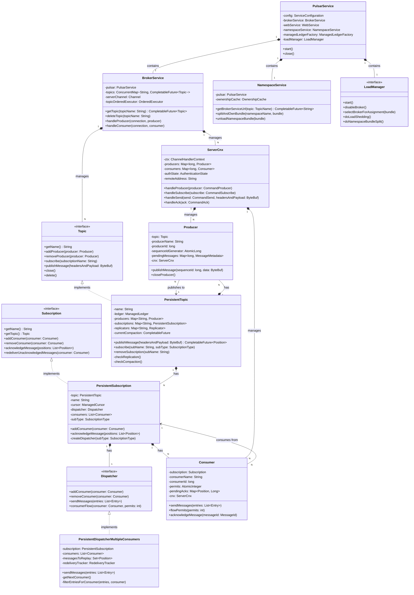
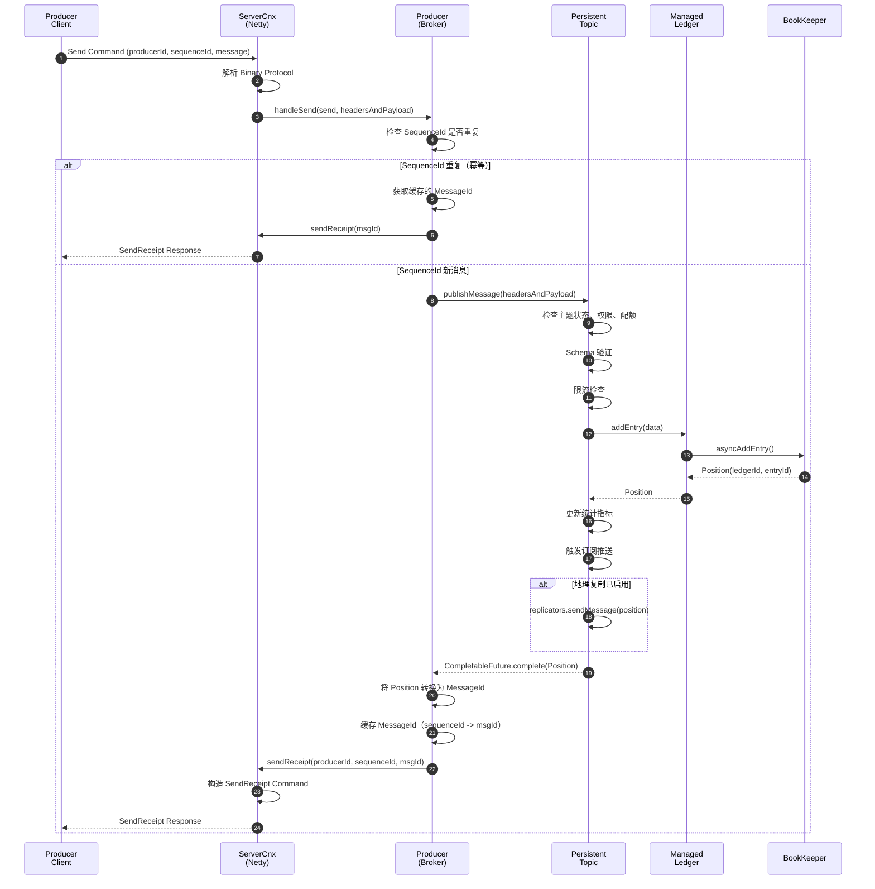
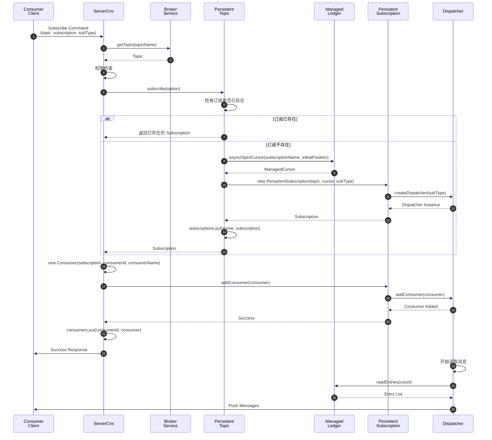
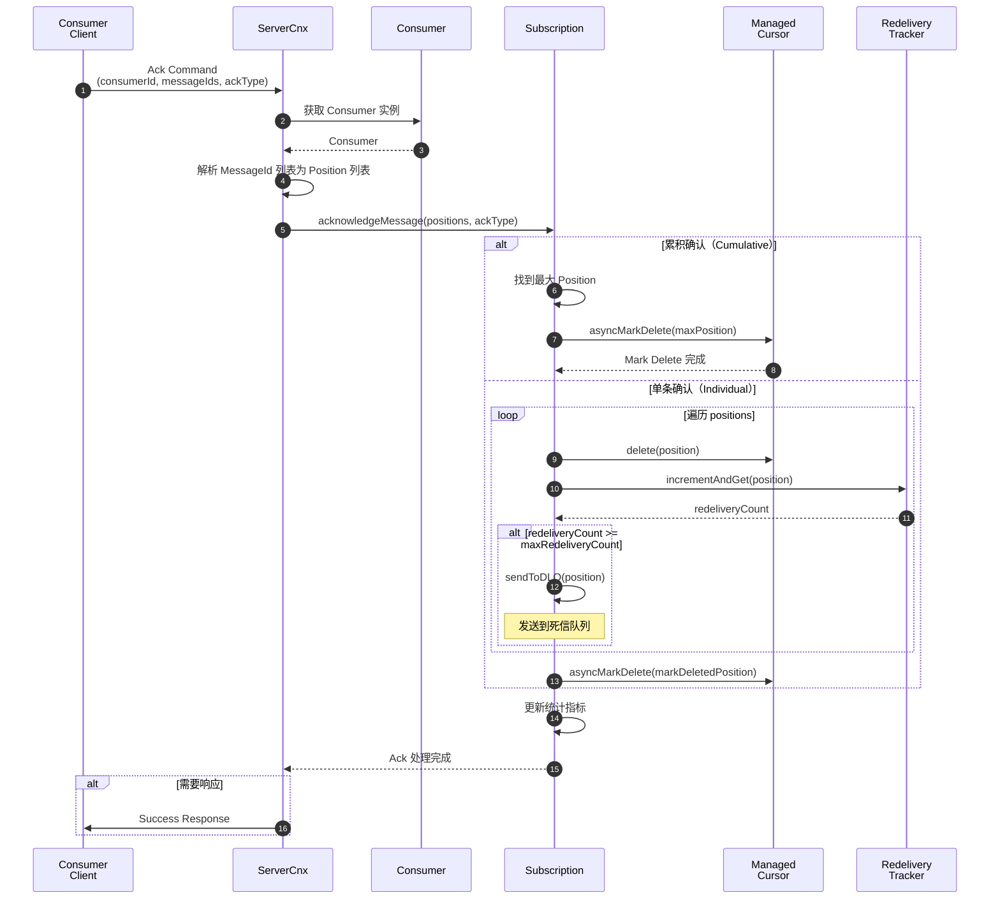

# Pulsar-03-Broker

## 模块概览

### 职责与定位

Pulsar Broker 是消息系统的核心组件，负责消息的路由、订阅管理、流量控制和权限管理。Broker 采用无状态设计，所有持久化数据存储在 BookKeeper，元数据存储在 ZooKeeper/etcd。

核心职责包括：

- **消息路由**：接收 Producer 消息，路由到对应主题的 ManagedLedger
- **订阅管理**：管理 Consumer 订阅，维护消费位置，支持多种订阅模式
- **流量控制**：生产者限流、消费者背压、全局配额管理
- **权限管理**：认证、授权、加密、审计
- **负载均衡**：动态分配主题到 Broker，基于负载指标
- **协议处理**：Binary Protocol（TCP）、HTTP/HTTPS（Admin API）
- **地理复制**：跨集群消息复制
- **Schema 管理**：Schema 注册、验证、演进

### 输入与输出

**输入**：
- Producer 连接请求、消息发送请求
- Consumer 连接请求、订阅请求、消息确认
- Admin Client HTTP 请求（租户/命名空间/主题管理）
- 内部：ZooKeeper Watch 事件、负载均衡决策

**输出**：
- Producer：消息确认（MessageId）、错误响应
- Consumer：消息推送、订阅确认
- Admin Client：HTTP 响应（JSON）
- ManagedLedger：addEntry() 调用
- ZooKeeper：元数据写入

### 上下游依赖

**上游**：
- **Client（Producer/Consumer）**：通过 Binary Protocol 连接
- **Proxy**：代理客户端请求到 Broker
- **Admin Client**：通过 HTTP API 管理资源

**下游**：
- **ManagedLedger**：消息持久化和读取
- **Metadata Store（ZooKeeper/etcd）**：元数据管理
- **BookKeeper**：通过 ManagedLedger 间接依赖
- **Auth Providers**：认证和授权插件

### 生命周期

1. **启动**：
   - 加载配置（broker.conf）
   - 连接 ZooKeeper 和 BookKeeper
   - 启动 Netty 服务器（Binary Protocol 端口 6650）
   - 启动 Jetty 服务器（HTTP 端口 8080）
   - 注册到 ZooKeeper（/loadbalance/brokers/{broker-id}）
   - 启动 Load Manager

2. **运行**：
   - 处理客户端请求
   - 管理主题和订阅
   - 执行负载均衡
   - 定期心跳到 ZooKeeper

3. **关闭**：
   - 停止接受新连接
   - 关闭所有主题和订阅
   - 断开 ManagedLedger 连接
   - 从 ZooKeeper 注销
   - 关闭网络服务器

---

## 模块架构图

```mermaid
flowchart TB
    subgraph External["外部组件"]
        P[Producer Client]
        C[Consumer Client]
        ADM[Admin Client]
    end
    
    subgraph NetworkLayer["网络层"]
        BPS[Binary Protocol<br/>Server (Netty)<br/>Port 6650]
        WEB[HTTP Server<br/>(Jetty)<br/>Port 8080]
    end
    
    subgraph CoreServices["核心服务"]
        PS[Pulsar Service<br/>核心服务容器]
        
        subgraph TopicManagement["主题管理"]
            NS[Namespace Service<br/>命名空间服务]
            TS[Topic Service<br/>主题服务]
            PT[Persistent Topic<br/>持久化主题]
            NPT[Non-Persistent Topic<br/>非持久化主题]
        end
        
        subgraph SubscriptionManagement["订阅管理"]
            SM[Subscription Manager<br/>订阅管理器]
            PS1[Persistent Subscription<br/>持久化订阅]
            DISP[Dispatcher<br/>消息分发器]
        end
        
        subgraph LoadBalance["负载均衡"]
            LM[Load Manager<br/>负载管理器]
            LS[Load Shedder<br/>负载卸载]
            BDL[Bundle Data<br/>Bundle 负载数据]
        end
        
        subgraph AuthSecurity["认证与安全"]
            AUTH[Authentication Service<br/>认证服务]
            AUTHZ[Authorization Service<br/>授权服务]
            TLS[TLS Handler]
        end
        
        subgraph RateLimiting["流控与配额"]
            RL[Rate Limiter<br/>限流器]
            BQ[Backlog Quota<br/>积压配额]
            RC[Resource Quota<br/>资源配额]
        end
        
        subgraph SchemaManagement["Schema 管理"]
            SR[Schema Registry<br/>Schema 注册中心]
            SV[Schema Validator<br/>Schema 验证器]
        end
    end
    
    subgraph Storage["存储层"]
        ML[ManagedLedger]
        MS[Metadata Store<br/>ZooKeeper/etcd]
    end
    
    P --> BPS
    C --> BPS
    ADM --> WEB
    
    BPS --> PS
    WEB --> PS
    
    PS --> NS
    PS --> TS
    PS --> LM
    PS --> AUTH
    PS --> SR
    
    NS --> PT
    NS --> NPT
    TS --> PT
    
    PT --> SM
    PT --> DISP
    PT --> ML
    
    SM --> PS1
    PS1 --> DISP
    
    LM --> LS
    LM --> BDL
    LM --> MS
    
    AUTH --> AUTHZ
    AUTH --> TLS
    
    PT --> RL
    PT --> BQ
    
    SR --> SV
    SR --> MS
    
    DISP --> BPS
    DISP --> C
```

### 架构图说明

#### 网络层

**Binary Protocol Server (Netty)**：
- 基于 Netty 实现的高性能 TCP 服务器
- 处理 Producer/Consumer 连接和消息传输
- 支持 TLS 加密
- 端口：6650（默认）

**HTTP Server (Jetty)**：
- 提供 Admin API 和 Lookup 服务
- RESTful 接口，JSON 格式
- 支持 HTTPS
- 端口：8080（默认）

#### 核心服务

**Pulsar Service**：
- Broker 的主容器，初始化和管理所有子服务
- 维护全局配置
- 协调各组件交互

**Namespace Service**：
- 管理命名空间到 Broker 的映射（Bundle Ownership）
- 处理 Lookup 请求，返回主题所属 Broker
- 监听 ZooKeeper Bundle 分配变化

**Topic Service**：
- 管理主题生命周期（创建、加载、卸载、删除）
- 维护 Topic 实例缓存
- 协调主题的 Producer 和 Consumer 连接

**Persistent Topic**：
- 表示一个持久化主题实例
- 管理该主题的所有 Producer、Subscription、Consumer
- 封装 ManagedLedger 操作
- 处理消息发布、订阅创建、消息分发

**Subscription Manager**：
- 管理主题下的所有订阅
- 维护订阅元数据（类型、游标、消费者列表）
- 处理订阅的创建、删除、更新

**Dispatcher**：
- 负责消息分发逻辑
- 支持多种分发模式（Exclusive/Shared/Failover/Key_Shared）
- 实现流控和背压
- 管理消息重发和死信队列

#### 负载均衡

**Load Manager**：
- 监控 Broker 和 Bundle 负载
- 执行负载均衡决策（Bundle 分配和迁移）
- 支持多种策略（ThresholdShedder/UniformLoadShedder）

**Load Shedder**：
- 检测过载 Broker
- 卸载负载较高的 Bundle
- 触发 Bundle 重新分配

**Bundle Data**：
- 收集和聚合 Bundle 负载指标
- 上报到 ZooKeeper 供其他 Broker 读取

#### 认证与安全

**Authentication Service**：
- 插件化认证框架
- 支持 TLS、Token、OAuth2.0、Kerberos、Athenz 等
- 在连接建立和操作执行时验证身份

**Authorization Service**：
- 基于角色的权限控制（RBAC）
- 检查 Producer/Consumer 对主题的权限
- 支持命名空间级和主题级权限

**TLS Handler**：
- 处理 TLS 握手
- 验证客户端证书
- 加密传输数据

#### 流控与配额

**Rate Limiter**：
- 生产者速率限制（消息数/字节数）
- 消费者速率限制
- 支持命名空间级和主题级配置

**Backlog Quota**：
- 限制积压消息大小
- 超过配额后拒绝新消息或删除旧消息
- 防止存储耗尽

**Resource Quota**：
- 租户和命名空间资源配额
- 限制带宽、消息速率、存储

#### Schema 管理

**Schema Registry**：
- 存储 Schema 定义（Avro/JSON/Protobuf）
- 管理 Schema 版本
- 提供 Schema 查询接口

**Schema Validator**：
- 验证消息是否符合 Schema
- 检查 Schema 兼容性（向前/向后/完全）
- 拒绝不兼容的消息

---

## 关键数据结构与 UML 图

### 核心类图



### 数据结构说明

#### Topic 接口

```java
public interface Topic {
    // 获取主题名
    String getName();
    
    // Producer 管理
    CompletableFuture<Producer> addProducer(Producer producer);
    void removeProducer(Producer producer);
    
    // 消息发布
    CompletableFuture<Position> publishMessage(ByteBuf headersAndPayload);
    
    // 订阅管理
    CompletableFuture<Subscription> subscribe(SubscriptionOption option);
    void removeSubscription(String subscriptionName);
    
    // 统计信息
    TopicStats getStats();
    
    // 生命周期
    CompletableFuture<Void> close();
    CompletableFuture<Void> delete();
}
```

**字段说明**：

| 方法 | 参数 | 返回值 | 说明 |
|---|---|---|---|
| `publishMessage` | headersAndPayload: 消息数据（含 Header 和 Payload） | Position | 发布消息，返回存储位置 |
| `subscribe` | SubscriptionOption: 订阅选项（名称、类型、位置） | Subscription | 创建或获取订阅 |
| `removeSubscription` | subscriptionName: 订阅名 | void | 删除订阅及其 Cursor |
| `getStats` | - | TopicStats | 获取统计信息（消息数、字节数、速率） |

#### PersistentTopic 核心字段

```java
public class PersistentTopic implements Topic {
    private final String topic;                                          // 主题名
    private final ManagedLedger ledger;                                  // 持久化账本
    private final ConcurrentMap<String, Producer> producers;             // 生产者列表
    private final ConcurrentMap<String, PersistentSubscription> subscriptions;  // 订阅列表
    private final ConcurrentMap<String, Replicator> replicators;         // 复制器（地理复制）
    private final CompactedTopicContext compactedTopicContext;           // 压缩主题上下文
    
    private final OrderedExecutor executor;                              // 有序执行器
    private final AtomicBoolean isFenced = new AtomicBoolean(false);    // 是否被 Fence
    private final Position lastPosition;                                 // 最后写入位置
    
    @Override
    public CompletableFuture<Position> publishMessage(ByteBuf headersAndPayload) {
        // 1. 权限检查
        // 2. Schema 验证
        // 3. 复制消息数据
        // 4. 写入 ManagedLedger
        // 5. 触发订阅推送
        // （详见 API 章节）
    }
}
```

**字段说明**：

| 字段 | 类型 | 说明 |
|---|---|---|
| `topic` | String | 完整主题名（persistent://tenant/namespace/topic） |
| `ledger` | ManagedLedger | 底层存储抽象 |
| `producers` | Map | Producer 名称到实例的映射 |
| `subscriptions` | Map | 订阅名称到实例的映射 |
| `replicators` | Map | 复制目标集群到 Replicator 的映射 |
| `executor` | OrderedExecutor | 保证操作顺序性的执行器 |
| `isFenced` | AtomicBoolean | 标记主题是否被其他 Broker 接管 |

#### Subscription 接口

```java
public interface Subscription {
    // 获取订阅信息
    String getName();
    Topic getTopic();
    SubscriptionType getType();
    
    // Consumer 管理
    CompletableFuture<Void> addConsumer(Consumer consumer);
    void removeConsumer(Consumer consumer);
    List<Consumer> getConsumers();
    
    // 消息确认
    void acknowledgeMessage(List<Position> positions, AckType ackType);
    
    // 消息重投递
    void redeliverUnacknowledgedMessages(Consumer consumer);
    void redeliverUnacknowledgedMessages(Consumer consumer, List<Position> positions);
    
    // Seek 操作
    CompletableFuture<Void> resetCursor(long timestamp);
    CompletableFuture<Void> resetCursor(Position position);
    
    // 统计信息
    SubscriptionStats getStats();
    
    // 关闭与删除
    CompletableFuture<Void> close();
    CompletableFuture<Void> delete();
}
```

#### PersistentSubscription 核心字段

```java
public class PersistentSubscription implements Subscription {
    private final PersistentTopic topic;                  // 所属主题
    private final String subscriptionName;                // 订阅名
    private final ManagedCursor cursor;                   // 消费位置游标
    private final Dispatcher dispatcher;                  // 消息分发器
    private final SubscriptionType subType;               // 订阅类型
    
    private final CopyOnWriteArrayList<Consumer> consumers = new CopyOnWriteArrayList<>();
    private final RedeliveryTracker redeliveryTracker;    // 重投递跟踪
    
    @Override
    public void acknowledgeMessage(List<Position> positions, AckType ackType) {
        // 1. 更新统计
        // 2. 调用 Cursor.markDelete() 或 delete()
        // 3. 触发死信队列检查
        // （详见 API 章节）
    }
}
```

**字段说明**：

| 字段 | 类型 | 说明 |
|---|---|---|
| `cursor` | ManagedCursor | 维护消费位置和已确认位置 |
| `dispatcher` | Dispatcher | 根据订阅类型选择不同的分发器实现 |
| `subType` | SubscriptionType | Exclusive/Shared/Failover/Key_Shared |
| `consumers` | List | 当前连接的消费者列表 |
| `redeliveryTracker` | RedeliveryTracker | 跟踪消息重投递次数，超过阈值路由到 DLQ |

#### Dispatcher 实现类型

| 订阅类型 | Dispatcher 实现 | 说明 |
|---|---|---|
| Exclusive | PersistentDispatcherSingleActiveConsumer | 单个活跃消费者，独占消费 |
| Failover | PersistentDispatcherSingleActiveConsumer | 主备模式，主消费者故障时切换 |
| Shared | PersistentDispatcherMultipleConsumers | 多消费者负载均衡，轮询分发 |
| Key_Shared | PersistentStickyKeyDispatcherMultipleConsumers | 按 Key 哈希分发，同 Key 消息发给同一消费者 |

---

## 核心 API 与调用链

### API-1：publishMessage（发布消息）

#### 基本信息

- **接口名**：`Topic.publishMessage(ByteBuf headersAndPayload)`
- **协议**：内部 Java API（由 ServerCnx 调用）
- **幂等性**：非幂等（Broker 层通过 SequenceId 去重保证幂等）

#### 请求参数

```java
CompletableFuture<Position> publishMessage(ByteBuf headersAndPayload);
```

**参数说明**：

| 参数 | 类型 | 必填 | 说明 |
|---|---|---:|---|
| headersAndPayload | ByteBuf | 是 | 消息数据（包含 Metadata + Payload） |

**ByteBuf 结构**：
```
[TotalSize: 4 bytes] [CommandSize: 4 bytes] [Metadata] [Payload]
```

#### 响应结果

```java
CompletableFuture<Position>
```

**返回值**：

| 类型 | 说明 |
|---|---|---|
| Position | 消息在 ManagedLedger 中的位置 |

**异常**：
- `TopicFencedException`：主题被其他 Broker 接管
- `TopicClosedException`：主题已关闭
- `NotAllowedException`：权限不足
- `BrokerServiceException`：其他 Broker 错误

#### 入口函数与核心代码

```java
public class PersistentTopic implements Topic {
    
    @Override
    public CompletableFuture<Position> publishMessage(ByteBuf headersAndPayload) {
        return publishMessage(headersAndPayload, null);
    }
    
    public CompletableFuture<Position> publishMessage(ByteBuf headersAndPayload,
                                                        PublishContext publishContext) {
        // 1. 检查主题状态
        if (isFenced.get()) {
            return FutureUtil.failedFuture(new TopicFencedException("Topic is fenced"));
        }
        
        // 2. 增加引用计数（防止 ByteBuf 被释放）
        headersAndPayload.retain();
        
        // 3. 解析消息元数据
        MessageMetadata msgMetadata = Commands.parseMessageMetadata(headersAndPayload);
        
        // 4. Schema 验证（如果启用）
        if (schemaValidationEnforced) {
            CompletableFuture<Void> schemaValidation = 
                validateSchema(msgMetadata.getSchemaVersion());
            if (!schemaValidation.isDone() || schemaValidation.isCompletedExceptionally()) {
                return schemaValidation.thenCompose(__ -> doPublishMessage(headersAndPayload, publishContext));
            }
        }
        
        // 5. 执行发布
        return doPublishMessage(headersAndPayload, publishContext);
    }
    
    private CompletableFuture<Position> doPublishMessage(ByteBuf headersAndPayload,
                                                           PublishContext publishContext) {
        // 6. 检查积压配额
        if (isBacklogQuotaExceeded()) {
            // （此处省略：积压配额检查逻辑）
            return FutureUtil.failedFuture(new BrokerServiceException("Backlog quota exceeded"));
        }
        
        // 7. 限流检查
        if (isPublishRateExceeded()) {
            // （此处省略：限流逻辑）
            return FutureUtil.failedFuture(new BrokerServiceException("Publish rate exceeded"));
        }
        
        // 8. 写入 ManagedLedger
        byte[] data = new byte[headersAndPayload.readableBytes()];
        headersAndPayload.readBytes(data);
        
        return ledger.addEntry(data).thenApply(position -> {
            // 9. 更新统计
            msgInCounter.increment();
            bytesInCounter.add(data.length);
            
            // 10. 触发订阅推送（通知 Dispatcher）
            subscriptions.values().forEach(sub -> 
                sub.notifyNewMessage());
            
            // 11. 检查地理复制
            if (replicators.size() > 0) {
                replicators.values().forEach(replicator ->
                    replicator.sendMessage(position));
            }
            
            // 12. 释放资源
            headersAndPayload.release();
            
            // 13. 回调 PublishContext
            if (publishContext != null) {
                publishContext.completed(null, position.getLedgerId(), position.getEntryId());
            }
            
            return position;
        }).exceptionally(ex -> {
            // （此处省略：错误处理、释放资源）
            headersAndPayload.release();
            if (publishContext != null) {
                publishContext.completed(ex, -1, -1);
            }
            throw new CompletionException(ex);
        });
    }
}
```

#### 调用链（ServerCnx → Producer → Topic → ManagedLedger）

```java
// ServerCnx：处理客户端发送请求
public class ServerCnx extends PulsarHandler {
    
    @Override
    protected void handleSend(CommandSend send, ByteBuf headersAndPayload) {
        // 1. 获取 Producer 实例
        long producerId = send.getProducerId();
        Producer producer = producers.get(producerId);
        
        if (producer == null) {
            // （此处省略：错误处理）
            return;
        }
        
        // 2. 检查 Producer 权限
        if (!producer.isAuthorized()) {
            // （此处省略：权限错误）
            return;
        }
        
        // 3. 调用 Producer.publishMessage()
        long sequenceId = send.getSequenceId();
        producer.publishMessage(producerId, sequenceId, headersAndPayload);
    }
}

// Producer：处理发布逻辑
public class Producer {
    
    public void publishMessage(long producerId, long sequenceId, ByteBuf headersAndPayload) {
        // 1. 幂等性检查（SequenceId 去重）
        if (isMessageDuplicated(sequenceId)) {
            // 返回缓存的 MessageId
            MessageId cachedMsgId = pendingMessages.get(sequenceId);
            sendReceiptToClient(producerId, sequenceId, cachedMsgId);
            return;
        }
        
        // 2. 记录待确认消息
        pendingMessages.put(sequenceId, null);
        
        // 3. 调用 Topic.publishMessage()
        Topic topic = getTopic();
        topic.publishMessage(headersAndPayload).thenAccept(position -> {
            // 4. 写入成功，返回确认
            MessageId msgId = new MessageIdImpl(
                position.getLedgerId(),
                position.getEntryId(),
                getPartitionIndex()
            );
            
            // 5. 缓存 MessageId（用于去重）
            pendingMessages.put(sequenceId, msgId);
            
            // 6. 发送确认给客户端
            sendReceiptToClient(producerId, sequenceId, msgId);
            
        }).exceptionally(ex -> {
            // （此处省略：错误处理、发送错误响应）
            return null;
        });
    }
    
    private void sendReceiptToClient(long producerId, long sequenceId, MessageId msgId) {
        // 构造 SendReceipt 命令
        ByteBuf buffer = Commands.newSendReceipt(producerId, sequenceId,
            msgId.getLedgerId(), msgId.getEntryId());
        
        // 发送到客户端
        cnx.ctx().writeAndFlush(buffer);
    }
}
```

#### 时序图（发布消息完整路径）



#### 边界与异常

**正常情况**：
- 发布延迟：P95 < 10 ms（主要取决于 ManagedLedger 写入）
- 吞吐量：单主题可达 100 MB/s（无分区）、1 GB/s（分区）

**异常情况**：

1. **Topic Fenced**：
   - 主题被其他 Broker 接管（Bundle 迁移）
   - 返回 `TopicFencedException`
   - 客户端触发 Lookup，重新连接新 Broker

2. **积压配额超限**：
   - 积压消息大小超过配置限制
   - 根据策略拒绝新消息或删除旧消息
   - 返回 `BrokerServiceException`

3. **限流触发**：
   - 发布速率超过配置限制
   - 延迟发布或拒绝
   - 返回 `PublishRateLimitedException`

4. **Schema 验证失败**：
   - 消息不符合 Schema 定义
   - 返回 `IncompatibleSchemaException`

---

### API-2：subscribe（创建订阅）

#### 基本信息

- **接口名**：`Topic.subscribe(SubscriptionOption option)`
- **协议**：内部 Java API
- **幂等性**：是（重复订阅返回同一 Subscription 实例）

#### 请求参数

```java
CompletableFuture<Subscription> subscribe(SubscriptionOption option);
```

**SubscriptionOption 结构**：

```java
public class SubscriptionOption {
    private String subscriptionName;           // 订阅名
    private SubscriptionType subscriptionType; // 订阅类型
    private InitialPosition initialPosition;   // 初始位置（Earliest/Latest）
    private boolean replicateSubscriptionState; // 是否复制订阅状态
    private Map<String, String> properties;    // 订阅属性
}
```

**参数说明**：

| 字段 | 类型 | 必填 | 默认值 | 说明 |
|---|---|---:|---|---|
| subscriptionName | String | 是 | - | 订阅名，唯一标识 |
| subscriptionType | SubscriptionType | 是 | - | Exclusive/Shared/Failover/Key_Shared |
| initialPosition | InitialPosition | 否 | Latest | 新订阅的起始位置 |
| replicateSubscriptionState | boolean | 否 | false | 是否跨集群复制订阅状态 |

#### 响应结果

```java
CompletableFuture<Subscription>
```

**返回值**：

| 类型 | 说明 |
|---|---|
| Subscription | 订阅实例，用于添加 Consumer 和确认消息 |

#### 入口函数与核心代码

```java
public class PersistentTopic implements Topic {
    
    @Override
    public CompletableFuture<Subscription> subscribe(SubscriptionOption option) {
        String subscriptionName = option.getSubscriptionName();
        
        // 1. 检查订阅是否已存在
        PersistentSubscription existingSub = subscriptions.get(subscriptionName);
        if (existingSub != null) {
            // 验证订阅类型是否匹配
            if (existingSub.getType() != option.getSubscriptionType()) {
                return FutureUtil.failedFuture(new SubscriptionBusyException(
                    "Subscription type mismatch"));
            }
            return CompletableFuture.completedFuture(existingSub);
        }
        
        // 2. 打开 ManagedCursor
        return ledger.asyncOpenCursor(subscriptionName, option.getInitialPosition())
                     .thenCompose(cursor -> {
                         // 3. 创建 Subscription 实例
                         PersistentSubscription subscription = new PersistentSubscription(
                             this, subscriptionName, cursor, option.getSubscriptionType());
                         
                         // 4. 缓存 Subscription
                         PersistentSubscription existingValue = subscriptions.putIfAbsent(
                             subscriptionName, subscription);
                         
                         if (existingValue != null) {
                             // 并发创建，关闭新 Cursor，返回已存在的
                             cursor.close();
                             return CompletableFuture.completedFuture(existingValue);
                         }
                         
                         // 5. 持久化订阅元数据
                         return subscription.persistSubscriptionInfo()
                                            .thenApply(__ -> subscription);
                     });
    }
}

public class PersistentSubscription implements Subscription {
    
    public PersistentSubscription(PersistentTopic topic, String subscriptionName,
                                   ManagedCursor cursor, SubscriptionType subType) {
        this.topic = topic;
        this.subscriptionName = subscriptionName;
        this.cursor = cursor;
        this.subType = subType;
        
        // 根据订阅类型创建 Dispatcher
        this.dispatcher = createDispatcher(subType);
    }
    
    private Dispatcher createDispatcher(SubscriptionType subType) {
        switch (subType) {
            case Exclusive:
            case Failover:
                return new PersistentDispatcherSingleActiveConsumer(cursor, subType, this);
            case Shared:
                return new PersistentDispatcherMultipleConsumers(topic, cursor, this);
            case Key_Shared:
                return new PersistentStickyKeyDispatcherMultipleConsumers(topic, cursor, this);
            default:
                throw new IllegalArgumentException("Unsupported subscription type: " + subType);
        }
    }
}
```

#### 调用链（ServerCnx → Consumer → Topic → Subscription）

```java
// ServerCnx：处理订阅请求
public class ServerCnx extends PulsarHandler {
    
    @Override
    protected void handleSubscribe(CommandSubscribe subscribe) {
        long consumerId = subscribe.getConsumerId();
        long requestId = subscribe.getRequestId();
        String topicName = subscribe.getTopic();
        String subscriptionName = subscribe.getSubscription();
        SubscriptionType subType = subscribe.getSubType();
        
        // 1. 获取 Topic 实例
        brokerService.getTopic(topicName).thenCompose(topic -> {
            // 2. 权限检查
            if (!canSubscribe(topicName, subscriptionName)) {
                // （此处省略：权限错误）
                return FutureUtil.failedFuture(new AuthorizationException());
            }
            
            // 3. 创建订阅
            SubscriptionOption option = SubscriptionOption.builder()
                .subscriptionName(subscriptionName)
                .subscriptionType(subType)
                .initialPosition(subscribe.getInitialPosition())
                .build();
            
            return topic.subscribe(option);
            
        }).thenCompose(subscription -> {
            // 4. 创建 Consumer 实例
            Consumer consumer = new Consumer(subscription, subType, consumerId, 
                                              subscribe.getConsumerName(), this);
            
            // 5. 添加 Consumer 到 Subscription
            return subscription.addConsumer(consumer)
                               .thenApply(__ -> consumer);
            
        }).thenAccept(consumer -> {
            // 6. 缓存 Consumer
            consumers.put(consumerId, consumer);
            
            // 7. 发送成功响应
            ByteBuf buffer = Commands.newSuccess(requestId);
            ctx.writeAndFlush(buffer);
            
        }).exceptionally(ex -> {
            // （此处省略：错误处理、发送错误响应）
            return null;
        });
    }
}
```

#### 时序图（订阅创建路径）



---

### API-3：acknowledgeMessage（确认消息）

#### 基本信息

- **接口名**：`Subscription.acknowledgeMessage(List<Position> positions, AckType ackType)`
- **协议**：内部 Java API
- **幂等性**：是（重复确认无副作用）

#### 请求参数

```java
void acknowledgeMessage(List<Position> positions, AckType ackType);
```

**参数说明**：

| 参数 | 类型 | 必填 | 说明 |
|---|---|---:|---|
| positions | List\<Position\> | 是 | 确认的消息位置列表 |
| ackType | AckType | 是 | 确认类型（Individual/Cumulative） |

**AckType 枚举**：
- `Individual`：单条确认，允许跳跃确认
- `Cumulative`：累积确认，确认到指定位置（包含之前所有消息）

#### 响应结果

```java
void
```

**无返回值**，异步执行。

#### 入口函数与核心代码

```java
public class PersistentSubscription implements Subscription {
    
    @Override
    public void acknowledgeMessage(List<Position> positions, AckType ackType) {
        // 1. 更新统计
        msgAckCounter.add(positions.size());
        
        // 2. 根据确认类型处理
        if (ackType == AckType.Cumulative) {
            // 累积确认：取最大位置
            Position maxPosition = positions.stream()
                .max(Position::compareTo)
                .orElse(null);
            
            if (maxPosition != null) {
                // 调用 Cursor.markDelete()
                cursor.asyncMarkDelete(maxPosition).thenRun(() -> {
                    // （此处省略：触发 Ledger 清理）
                });
            }
        } else {
            // 单条确认：逐个删除
            positions.forEach(position -> {
                cursor.delete(position);
                
                // 检查重投递次数
                checkRedeliveryCount(position);
            });
            
            // 批量持久化
            cursor.asyncMarkDelete(cursor.getMarkDeletedPosition());
        }
        
        // 3. 移除待确认跟踪（如果启用）
        if (unackedMsgTracker != null) {
            positions.forEach(unackedMsgTracker::remove);
        }
    }
    
    private void checkRedeliveryCount(Position position) {
        int redeliveryCount = redeliveryTracker.incrementAndGet(position);
        
        // 超过最大重试次数，路由到死信队列
        if (redeliveryCount >= maxRedeliveryCount) {
            sendToDLQ(position);
            redeliveryTracker.remove(position);
        }
    }
    
    private void sendToDLQ(Position position) {
        // 读取消息
        cursor.asyncReadEntries(position, 1).thenAccept(entries -> {
            if (entries.isEmpty()) {
                return;
            }
            
            Entry entry = entries.get(0);
            
            // 发布到死信队列主题
            String dlqTopicName = subscriptionName + "-DLQ";
            Topic dlqTopic = brokerService.getTopic(dlqTopicName).join();
            
            dlqTopic.publishMessage(entry.getDataBuffer()).thenRun(() -> {
                // 确认原消息
                cursor.delete(position);
                entry.release();
            });
        });
    }
}
```

#### 调用链（Client → ServerCnx → Subscription → Cursor）

```java
// ServerCnx：处理确认请求
public class ServerCnx extends PulsarHandler {
    
    @Override
    protected void handleAck(CommandAck ack) {
        long consumerId = ack.getConsumerId();
        Consumer consumer = consumers.get(consumerId);
        
        if (consumer == null) {
            // （此处省略：错误处理）
            return;
        }
        
        // 解析 MessageId 列表
        List<Position> positions = new ArrayList<>();
        for (MessageIdData msgId : ack.getMessageIdsList()) {
            Position pos = new Position(msgId.getLedgerId(), msgId.getEntryId());
            positions.add(pos);
        }
        
        // 调用 Subscription.acknowledgeMessage()
        Subscription subscription = consumer.getSubscription();
        subscription.acknowledgeMessage(positions, ack.getAckType());
        
        // 发送确认响应（可选）
        if (ack.hasRequestId()) {
            ByteBuf buffer = Commands.newSuccess(ack.getRequestId());
            ctx.writeAndFlush(buffer);
        }
    }
}
```

#### 时序图（消息确认路径）



---

## 负载均衡机制

### Load Manager 架构

```mermaid
flowchart TB
    subgraph Brokers["Broker 集群"]
        B1[Broker 1]
        B2[Broker 2]
        B3[Broker 3]
    end
    
    subgraph LoadManager["Load Manager"]
        LC[Load Collector<br/>负载收集器]
        LR[Load Reporter<br/>负载上报器]
        LS[Load Shedder<br/>负载卸载器]
        BA[Bundle Allocator<br/>Bundle 分配器]
    end
    
    subgraph ZooKeeper["ZooKeeper"]
        BL[/loadbalance/brokers<br/>Broker 负载数据]
        BO[/loadbalance/bundle-ownership<br/>Bundle 所有权]
    end
    
    B1 --> LC
    B2 --> LC
    B3 --> LC
    
    LC --> LR
    LR --> BL
    
    BL --> LS
    LS --> BA
    
    BA --> BO
    BO --> B1
    BO --> B2
    BO --> B3
```

### Load Manager 工作流程

#### 1. 负载数据收集

```java
public class LoadManagerImpl implements LoadManager {
    
    private final LoadData localLoadData = new LoadData();
    private final Map<String, BrokerLoadData> brokerLoadDataCache = new ConcurrentHashMap<>();
    
    // 定期收集本地负载
    private void collectLocalLoadData() {
        // CPU 使用率
        localLoadData.setCpu(SystemResourceMonitor.getCpuUsage());
        
        // 内存使用率
        localLoadData.setMemory(SystemResourceMonitor.getMemoryUsage());
        
        // 网络带宽
        localLoadData.setBandwidthIn(getBandwidthIn());
        localLoadData.setBandwidthOut(getBandwidthOut());
        
        // Bundle 数量
        localLoadData.setBundleCount(getOwnedBundleCount());
        
        // 主题数量
        localLoadData.setTopicCount(getLoadedTopicCount());
        
        // 消息速率
        localLoadData.setMsgRateIn(getMsgRateIn());
        localLoadData.setMsgRateOut(getMsgRateOut());
    }
}
```

**负载指标**：

| 指标 | 说明 | 权重 |
|---|---|---|
| CPU 使用率 | 0-100% | 高 |
| 内存使用率 | 0-100% | 高 |
| 入站带宽 | MB/s | 中 |
| 出站带宽 | MB/s | 中 |
| Bundle 数量 | 整数 | 中 |
| 主题数量 | 整数 | 低 |
| 消息速率 | msg/s | 中 |

#### 2. 负载上报

```java
private void reportLoadData() {
    // 上报到 ZooKeeper
    String path = String.format("/loadbalance/brokers/%s", brokerServiceUrl);
    
    byte[] data = ObjectMapperFactory.getThreadLocal().writeValueAsBytes(localLoadData);
    
    metadataStore.put(path, data, Optional.of(-1L)).thenRun(() -> {
        // （此处省略：上报成功日志）
    });
}
```

**上报频率**：默认每 60 秒上报一次

#### 3. 负载卸载（Load Shedding）

```java
public class ThresholdShedder implements LoadShedder {
    
    @Override
    public void doLoadShedding() {
        // 1. 查找过载 Broker
        List<String> overloadedBrokers = findOverloadedBrokers();
        
        if (overloadedBrokers.isEmpty()) {
            return;
        }
        
        // 2. 为每个过载 Broker 选择要卸载的 Bundle
        for (String broker : overloadedBrokers) {
            BrokerLoadData loadData = brokerLoadDataCache.get(broker);
            
            // 选择负载最高的 Bundle
            Optional<String> bundleToUnload = selectBundleForUnloading(broker, loadData);
            
            if (bundleToUnload.isPresent()) {
                // 3. 卸载 Bundle
                unloadBundle(bundleToUnload.get());
            }
        }
    }
    
    private List<String> findOverloadedBrokers() {
        List<String> overloaded = new ArrayList<>();
        
        brokerLoadDataCache.forEach((broker, loadData) -> {
            // 检查是否超过阈值
            if (loadData.getCpu() > config.getLoadBalancerCPUResourceWeight() * 100
                || loadData.getMemory() > config.getLoadBalancerMemoryResourceWeight() * 100) {
                overloaded.add(broker);
            }
        });
        
        return overloaded;
    }
    
    private void unloadBundle(String bundleName) {
        // 发送 Bundle 卸载请求
        pulsar.getNamespaceService().unloadNamespaceBundle(bundleName)
              .thenRun(() -> {
                  // （此处省略：卸载成功日志）
              });
    }
}
```

**卸载触发条件**：
- CPU 使用率 > 85%
- 内存使用率 > 85%
- 带宽使用率 > 90%

#### 4. Bundle 分配

```java
public class LeastLongTermMessageRate implements ModularLoadManagerStrategy {
    
    @Override
    public Optional<String> selectBroker(Set<String> candidates, 
                                          ServiceUnitId serviceUnit,
                                          Map<String, BrokerLoadData> loadData) {
        // 1. 过滤不可用 Broker
        Set<String> availableBrokers = candidates.stream()
            .filter(broker -> isAvailable(broker, loadData))
            .collect(Collectors.toSet());
        
        if (availableBrokers.isEmpty()) {
            return Optional.empty();
        }
        
        // 2. 计算每个 Broker 的负载分数
        Map<String, Double> scores = new HashMap<>();
        for (String broker : availableBrokers) {
            BrokerLoadData data = loadData.get(broker);
            double score = calculateScore(data);
            scores.put(broker, score);
        }
        
        // 3. 选择负载分数最低的 Broker
        String selectedBroker = scores.entrySet().stream()
            .min(Map.Entry.comparingByValue())
            .map(Map.Entry::getKey)
            .orElse(null);
        
        return Optional.ofNullable(selectedBroker);
    }
    
    private double calculateScore(BrokerLoadData data) {
        // 综合多个指标计算负载分数
        double cpuWeight = config.getLoadBalancerCPUResourceWeight();
        double memoryWeight = config.getLoadBalancerMemoryResourceWeight();
        double bandwidthWeight = config.getLoadBalancerBandwidthResourceWeight();
        
        return cpuWeight * data.getCpu()
             + memoryWeight * data.getMemory()
             + bandwidthWeight * (data.getBandwidthIn() + data.getBandwidthOut());
    }
}
```

---

## 配置与性能调优

### Broker 核心配置

| 配置项 | 类型 | 默认值 | 说明 |
|---|---|---|---|
| `brokerServicePort` | int | 6650 | Binary Protocol 端口 |
| `brokerServicePortTls` | int | 6651 | Binary Protocol TLS 端口 |
| `webServicePort` | int | 8080 | HTTP 服务端口 |
| `webServicePortTls` | int | 8443 | HTTPS 服务端口 |
| `numIOThreads` | int | 8 | Netty IO 线程数 |
| `numWorkerThreads` | int | 16 | 业务处理线程数 |
| `maxConcurrentLookupRequest` | int | 50000 | 最大并发 Lookup 请求数 |
| `maxConcurrentTopicLoadRequest` | int | 5000 | 最大并发主题加载请求数 |

### 流控配置

| 配置项 | 类型 | 默认值 | 说明 |
|---|---|---|---|
| `dispatchThrottlingRatePerTopicInMsg` | int | 0 | 单主题分发速率限制（0=不限制） |
| `dispatchThrottlingRatePerTopicInByte` | long | 0 | 单主题分发字节限制 |
| `maxMessageSize` | int | 5242880 | 最大消息大小（5 MB） |
| `maxPublishRatePerTopicInMessages` | int | 0 | 单主题发布速率限制 |
| `maxPublishRatePerTopicInBytes` | long | 0 | 单主题发布字节限制 |

### 负载均衡配置

| 配置项 | 类型 | 默认值 | 说明 |
|---|---|---|---|
| `loadBalancerEnabled` | boolean | true | 是否启用负载均衡 |
| `loadBalancerSheddingEnabled` | boolean | true | 是否启用负载卸载 |
| `loadBalancerReportUpdateThresholdPercentage` | int | 10 | 负载变化超过 10% 才上报 |
| `loadBalancerCPUResourceWeight` | double | 1.0 | CPU 权重 |
| `loadBalancerMemoryResourceWeight` | double | 1.0 | 内存权重 |
| `loadBalancerBandwidthResourceWeight` | double | 1.0 | 带宽权重 |

---

## 最佳实践

### 生产环境部署建议

1. **硬件配置**：
   - CPU：16 核以上
   - 内存：64 GB 以上
   - 网卡：万兆网卡
   - 磁盘：SSD（用于本地缓存）

2. **JVM 参数**：
```bash
-Xms16g -Xmx16g
-XX:+UseG1GC
-XX:MaxGCPauseMillis=10
-XX:+ParallelRefProcEnabled
-XX:+UnlockExperimentalVMOptions
-XX:+DoEscapeAnalysis
-XX:ParallelGCThreads=8
-XX:ConcGCThreads=8
-XX:G1NewSizePercent=50
-XX:+DisableExplicitGC
```

3. **OS 参数**：
```bash
# 增大文件描述符限制
ulimit -n 65536

# TCP 参数优化
net.core.somaxconn = 65535
net.ipv4.tcp_max_syn_backlog = 65535
net.core.netdev_max_backlog = 65535
```

### 监控指标

| 指标 | 说明 | 告警阈值 |
|---|---|---|
| `pulsar_topics_count` | 主题数量 | > 10000 |
| `pulsar_subscriptions_count` | 订阅数量 | > 50000 |
| `pulsar_rate_in` | 入站消息速率 | 根据容量规划 |
| `pulsar_rate_out` | 出站消息速率 | 根据容量规划 |
| `pulsar_storage_size` | 存储大小 | > 80% 容量 |
| `pulsar_consumer_msg_ack_rate` | 消息确认速率 | 下降 > 50% |
| `jvm_memory_used_bytes` | JVM 内存使用 | > 85% |
| `jvm_gc_pause_seconds` | GC 暂停时间 | P99 > 100 ms |

---

**文档版本**：v1.0  
**对应模块版本**：Pulsar 4.2.0-SNAPSHOT  
**最后更新**：2025-10-05

