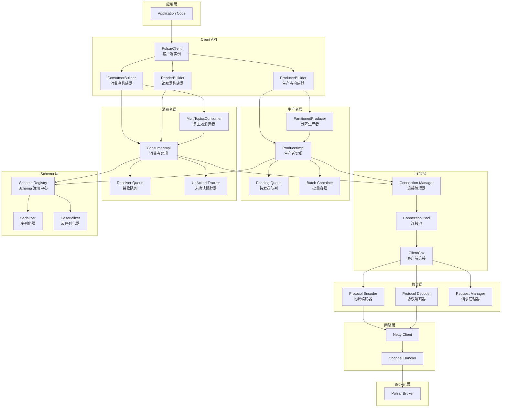
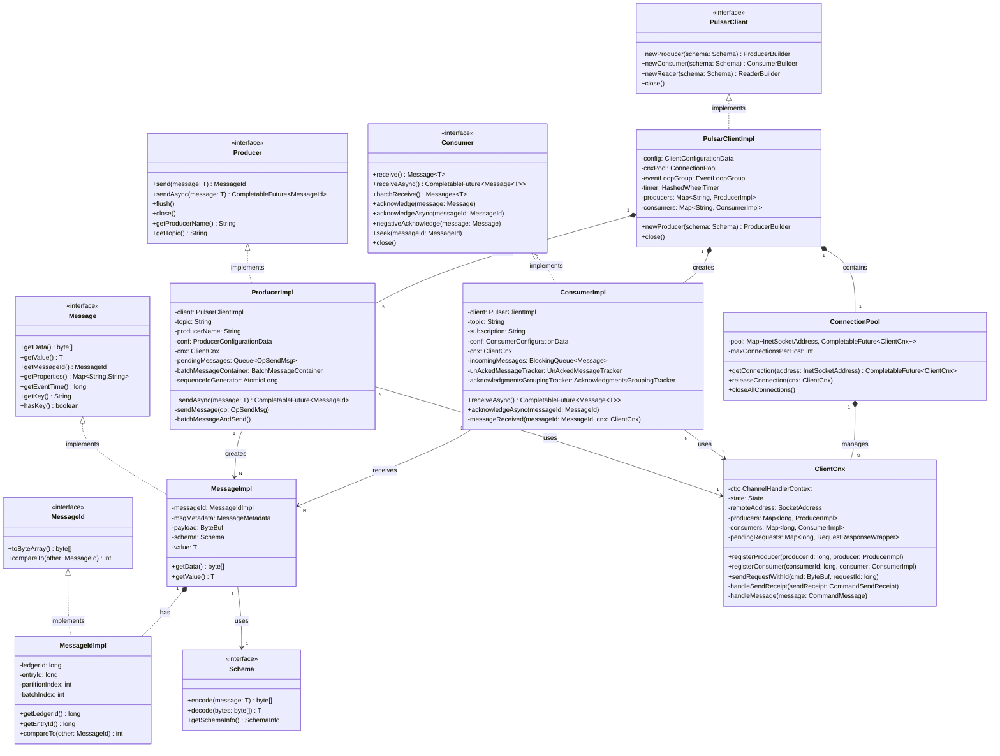
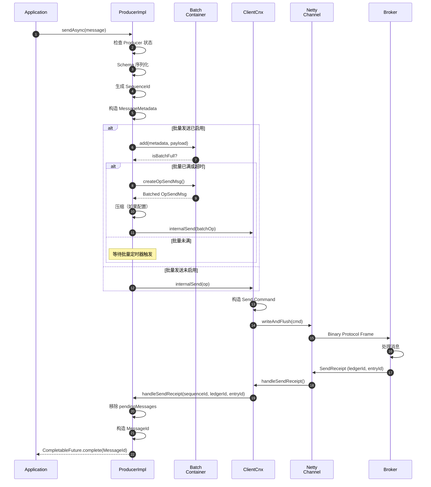
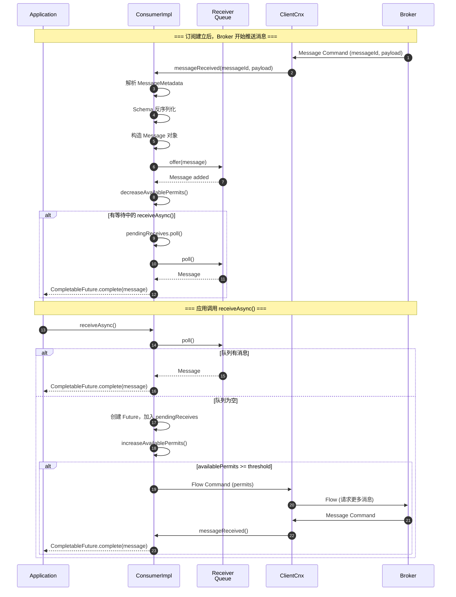
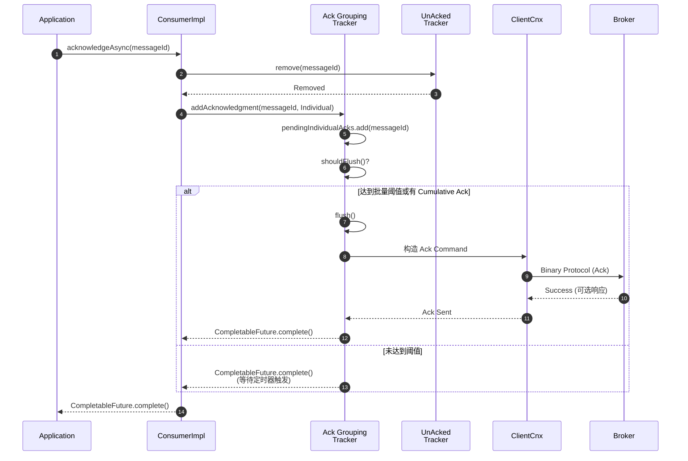

# Pulsar-04-Client

## 模块概览

### 职责与定位

Pulsar Client 是客户端 SDK 的核心实现，为应用程序提供消息生产和消费能力。Client 封装了与 Broker 的网络通信、协议处理、连接管理、重试逻辑等复杂细节，提供简洁的 API 接口。

核心职责包括：

- **生产者（Producer）**：消息发送、批量发送、压缩、分区路由、幂等保证
- **消费者（Consumer）**：消息接收、确认、重试、死信队列、流控
- **读取器（Reader）**：位置控制的顺序读取，不需要订阅
- **连接管理**：TCP 连接池、心跳保活、故障重连
- **协议处理**：Binary Protocol 编解码、请求-响应关联
- **Schema 管理**：消息序列化/反序列化、Schema 注册与查询
- **负载均衡**：分区消费者的负载均衡

### 输入与输出

**输入**：
- 应用程序调用：`send()`、`receive()`、`acknowledge()` 等 API
- Broker 推送：消息、确认、错误通知

**输出**：
- 向 Broker 发送：连接请求、消息、确认、Lookup 请求
- 向应用返回：消息、确认回执、异常

### 上下游依赖

**上游**：
- **应用程序**：直接调用 Client API

**下游**：
- **Broker**：通过 Binary Protocol（TCP）连接
- **Schema Registry**：注册和查询 Schema
- **Netty**：网络通信框架

### 生命周期

1. **创建**：
   - 应用调用 `PulsarClient.builder()` 创建 Client 实例
   - 初始化连接池、线程池、定时任务

2. **运行**：
   - 创建 Producer/Consumer/Reader
   - 维护与 Broker 的连接
   - 处理消息发送和接收

3. **关闭**：
   - 关闭所有 Producer/Consumer/Reader
   - 关闭网络连接
   - 释放资源

---

## 模块架构图



### 架构图说明

#### Client API 层

**PulsarClient**：
- Client 实例的入口，管理全局资源
- 提供 Builder 模式创建 Producer/Consumer/Reader
- 维护连接池和线程池
- 单实例可创建多个 Producer/Consumer

**ProducerBuilder/ConsumerBuilder/ReaderBuilder**：
- 流式 API 构建配置
- 支持链式调用设置参数
- `create()` 方法创建实际实例

#### 生产者层

**ProducerImpl**：
- Producer 接口的核心实现
- 处理消息发送、批量、压缩、重试逻辑
- 管理 SequenceId 生成和幂等

**PartitionedProducer**：
- 管理多个分区的 Producer 实例
- 根据路由策略分发消息到不同分区
- 聚合统计信息

**Pending Queue**：
- 暂存待发送消息
- 限制队列大小防止内存溢出
- 支持异步发送

**Batch Container**：
- 批量打包消息
- 按时间窗口或消息数量触发发送
- 压缩批量消息

#### 消费者层

**ConsumerImpl**：
- Consumer 接口的核心实现
- 处理消息接收、确认、重试逻辑
- 管理消费位置

**MultiTopicsConsumer**：
- 同时消费多个主题
- 轮询从各主题读取消息
- 聚合统计信息

**Receiver Queue**：
- 预取消息队列
- 减少与 Broker 交互次数
- 支持批量接收

**UnAcked Tracker**：
- 跟踪未确认消息
- 超时自动重新投递
- 防止消息丢失

#### 连接层

**Connection Manager**：
- 管理与 Broker 的 TCP 连接
- 连接复用和负载均衡
- 故障检测和重连

**Connection Pool**：
- 缓存连接实例
- 按 Broker 地址索引
- 自动清理空闲连接

**ClientCnx**：
- 单个 TCP 连接的抽象
- 处理心跳、Ping/Pong
- 关联请求和响应

#### 协议层

**Protocol Encoder**：
- 将 Java 对象编码为 Binary Protocol
- Protobuf 序列化
- 添加 Frame Header

**Protocol Decoder**：
- 解析 Binary Protocol 为 Java 对象
- Protobuf 反序列化
- 处理分帧

**Request Manager**：
- 管理请求 ID 生成
- 关联请求和响应
- 超时处理

#### Schema 层

**Schema Registry**：
- 注册 Schema 到 Broker
- 缓存 Schema 定义
- 查询 Schema 版本

**Serializer/Deserializer**：
- 消息序列化（发送前）
- 消息反序列化（接收后）
- 支持多种格式（Avro、JSON、Protobuf）

---

## 关键数据结构与 UML 图

### 核心类图



### 数据结构说明

#### PulsarClient 接口

```java
public interface PulsarClient extends Closeable {
    // 创建生产者
    <T> ProducerBuilder<T> newProducer(Schema<T> schema);
    ProducerBuilder<byte[]> newProducer();
    
    // 创建消费者
    <T> ConsumerBuilder<T> newConsumer(Schema<T> schema);
    ConsumerBuilder<byte[]> newConsumer();
    
    // 创建读取器
    <T> ReaderBuilder<T> newReader(Schema<T> schema);
    ReaderBuilder<byte[]> newReader();
    
    // 获取主题分区信息
    CompletableFuture<List<String>> getPartitionsForTopic(String topic);
    
    // 关闭客户端
    void close() throws PulsarClientException;
    CompletableFuture<Void> closeAsync();
}
```

**创建示例**：

```java
PulsarClient client = PulsarClient.builder()
    .serviceUrl("pulsar://localhost:6650")
    .ioThreads(4)
    .listenerThreads(4)
    .build();
```

**配置参数**：

| 参数 | 类型 | 默认值 | 说明 |
|---|---|---|---|
| serviceUrl | String | - | Broker 地址（pulsar://或 pulsar+ssl://） |
| ioThreads | int | 1 | Netty IO 线程数 |
| listenerThreads | int | 1 | 消息监听器线程数 |
| connectionsPerBroker | int | 1 | 每个 Broker 的连接数 |
| operationTimeoutMs | int | 30000 | 操作超时（毫秒） |
| connectionTimeoutMs | int | 10000 | 连接超时（毫秒） |
| keepAliveIntervalSeconds | int | 30 | 心跳间隔（秒） |

#### Producer 接口

```java
public interface Producer<T> extends Closeable {
    // 同步发送
    MessageId send(T message) throws PulsarClientException;
    
    // 异步发送
    CompletableFuture<MessageId> sendAsync(T message);
    
    // 发送带属性的消息
    MessageId send(T message, Map<String, String> properties);
    
    // 构建消息
    TypedMessageBuilder<T> newMessage();
    
    // 刷盘（确保所有待发送消息发送完成）
    void flush() throws PulsarClientException;
    
    // 获取统计信息
    ProducerStats getStats();
    
    // 关闭生产者
    void close() throws PulsarClientException;
    CompletableFuture<Void> closeAsync();
}
```

**创建示例**：

```java
Producer<String> producer = client.newProducer(Schema.STRING)
    .topic("persistent://public/default/my-topic")
    .producerName("my-producer")
    .sendTimeout(10, TimeUnit.SECONDS)
    .create();
```

**配置参数**：

| 参数 | 类型 | 默认值 | 说明 |
|---|---|---|---|
| topic | String | - | 主题名 |
| producerName | String | - | 生产者名（可选） |
| sendTimeout | Duration | 30s | 发送超时 |
| maxPendingMessages | int | 1000 | 最大待发送消息数 |
| enableBatching | boolean | true | 是否启用批量 |
| batchingMaxPublishDelay | Duration | 10ms | 批量延迟 |
| batchingMaxMessages | int | 1000 | 批量最大消息数 |
| compressionType | CompressionType | NONE | 压缩类型（NONE/LZ4/ZLIB/ZSTD/SNAPPY） |

#### Consumer 接口

```java
public interface Consumer<T> extends Closeable {
    // 同步接收
    Message<T> receive() throws PulsarClientException;
    
    // 异步接收
    CompletableFuture<Message<T>> receiveAsync();
    
    // 批量接收
    Messages<T> batchReceive() throws PulsarClientException;
    
    // 确认消息
    void acknowledge(Message<?> message) throws PulsarClientException;
    void acknowledge(MessageId messageId) throws PulsarClientException;
    CompletableFuture<Void> acknowledgeAsync(MessageId messageId);
    
    // 累积确认
    void acknowledgeCumulative(Message<?> message);
    CompletableFuture<Void> acknowledgeCumulativeAsync(MessageId messageId);
    
    // 否定确认（立即重新投递）
    void negativeAcknowledge(Message<?> message);
    void negativeAcknowledge(MessageId messageId);
    
    // Seek 操作
    void seek(MessageId messageId);
    void seek(long timestamp);
    
    // 暂停/恢复
    void pause();
    void resume();
    
    // 关闭消费者
    void close() throws PulsarClientException;
    CompletableFuture<Void> closeAsync();
}
```

**创建示例**：

```java
Consumer<String> consumer = client.newConsumer(Schema.STRING)
    .topic("persistent://public/default/my-topic")
    .subscriptionName("my-subscription")
    .subscriptionType(SubscriptionType.Shared)
    .subscribe();
```

**配置参数**：

| 参数 | 类型 | 默认值 | 说明 |
|---|---|---|---|
| topic | String/List | - | 主题名（可多个） |
| subscriptionName | String | - | 订阅名 |
| subscriptionType | SubscriptionType | Exclusive | 订阅类型 |
| receiverQueueSize | int | 1000 | 接收队列大小 |
| ackTimeoutMillis | long | 0 | 确认超时（0=禁用） |
| negativeAckRedeliveryDelay | Duration | 1min | 否定确认重投递延迟 |
| deadLetterPolicy | DeadLetterPolicy | null | 死信队列策略 |
| autoUpdatePartitions | boolean | true | 自动更新分区 |

#### Message 接口

```java
public interface Message<T> {
    // 获取消息值（反序列化后）
    T getValue();
    
    // 获取原始字节
    byte[] getData();
    
    // 获取消息 ID
    MessageId getMessageId();
    
    // 获取属性
    Map<String, String> getProperties();
    String getProperty(String key);
    boolean hasProperty(String key);
    
    // 获取消息元数据
    String getKey();
    boolean hasKey();
    byte[] getKeyBytes();
    byte[] getOrderingKey();
    long getPublishTime();
    long getEventTime();
    long getSequenceId();
    String getProducerName();
    
    // 获取 Schema 信息
    Optional<EncryptionContext> getEncryptionCtx();
    int getRedeliveryCount();
    
    // 释放资源
    void release();
}
```

#### MessageId 接口

```java
public interface MessageId extends Comparable<MessageId>, Serializable {
    // 序列化
    byte[] toByteArray();
    
    // 比较
    int compareTo(MessageId other);
    
    // 特殊值
    static MessageId earliest = ...;
    static MessageId latest = ...;
}
```

**MessageIdImpl 实现**：

```java
public class MessageIdImpl implements MessageId {
    private final long ledgerId;         // Ledger ID
    private final long entryId;          // Entry ID
    private final int partitionIndex;    // 分区索引（-1 表示非分区主题）
    private final int batchIndex;        // 批量消息索引（-1 表示非批量）
    
    @Override
    public int compareTo(MessageId other) {
        // 1. 比较 Ledger ID
        // 2. 比较 Entry ID
        // 3. 比较 Partition Index
        // 4. 比较 Batch Index
    }
}
```

---

## 核心 API 与调用链

### API-1：Producer.sendAsync（发送消息）

#### 基本信息

- **接口名**：`Producer.sendAsync(T message)`
- **协议**：Java 异步 API
- **幂等性**：是（通过 SequenceId 去重）

#### 请求参数

```java
CompletableFuture<MessageId> sendAsync(T message);

// 或使用 MessageBuilder
TypedMessageBuilder<T> newMessage()
    .value(T message)
    .key(String key)
    .property(String key, String value)
    .eventTime(long timestamp)
    .sequenceId(long sequenceId)
    .sendAsync();
```

**参数说明**：

| 参数 | 类型 | 必填 | 说明 |
|---|---|---:|---|
| message | T | 是 | 消息值（将被 Schema 序列化） |
| key | String | 否 | 消息 Key（用于分区路由和 Key_Shared 订阅） |
| properties | Map | 否 | 自定义属性 |
| eventTime | long | 否 | 事件时间戳（毫秒） |
| sequenceId | long | 否 | 序列 ID（用于幂等，默认自动生成） |

#### 响应结果

```java
CompletableFuture<MessageId>
```

**返回值**：

| 类型 | 说明 |
|---|---|
| MessageId | 消息唯一标识（LedgerId + EntryId + PartitionIndex + BatchIndex） |

**异常**：
- `TimeoutException`：发送超时
- `NotConnectedException`：未连接到 Broker
- `ProducerFencedException`：Producer 被 Fence
- `IncompatibleSchemaException`：Schema 不兼容

#### 入口函数与核心代码

```java
public class ProducerImpl<T> extends ProducerBase<T> implements TimerTask {
    
    private final Queue<OpSendMsg> pendingMessages = new ConcurrentLinkedQueue<>();
    private final AtomicLong sequenceIdGenerator = new AtomicLong(0);
    private final BatchMessageContainer batchMessageContainer;
    
    @Override
    public CompletableFuture<MessageId> sendAsync(T message) {
        return internalSendAsync(message, null);
    }
    
    private CompletableFuture<MessageId> internalSendAsync(T message, Message<?> interceptorMessage) {
        // 1. 检查 Producer 状态
        if (getState() != State.Ready) {
            return FutureUtil.failedFuture(new PulsarClientException("Producer not ready"));
        }
        
        // 2. Schema 序列化
        byte[] payload;
        try {
            payload = schema.encode(message);
        } catch (Exception e) {
            return FutureUtil.failedFuture(new PulsarClientException.InvalidMessageException(e));
        }
        
        // 3. 构造 MessageMetadata
        MessageMetadata msgMetadata = new MessageMetadata()
            .setProducerName(producerName)
            .setPublishTime(System.currentTimeMillis())
            .setSequenceId(sequenceIdGenerator.getAndIncrement());
        
        // 设置可选字段
        if (interceptorMessage != null && interceptorMessage.hasKey()) {
            msgMetadata.setPartitionKey(interceptorMessage.getKey());
        }
        
        // 4. 创建 OpSendMsg（发送操作）
        OpSendMsg op = OpSendMsg.create(msgMetadata, payload, callback);
        
        // 5. 检查待发送队列是否已满
        if (pendingMessages.size() >= conf.getMaxPendingMessages()) {
            if (conf.getBlockIfQueueFull()) {
                // 阻塞等待队列有空间
                // （此处省略：阻塞逻辑）
            } else {
                return FutureUtil.failedFuture(new ProducerQueueIsFullError());
            }
        }
        
        // 6. 加入待发送队列
        pendingMessages.add(op);
        
        // 7. 判断是否启用批量
        if (conf.isBatchingEnabled()) {
            return internalSendWithBatching(op);
        } else {
            return internalSend(op);
        }
    }
    
    private CompletableFuture<MessageId> internalSendWithBatching(OpSendMsg op) {
        // 添加到批量容器
        boolean isBatchFull = batchMessageContainer.add(op.getMetadata(), op.getPayload());
        
        if (isBatchFull) {
            // 批量已满，立即发送
            batchMessageAndSend();
        } else {
            // 等待批量定时器触发
            // （由 HashedWheelTimer 定时任务调用 batchMessageAndSend()）
        }
        
        return op.getFuture();
    }
    
    private void batchMessageAndSend() {
        // 从批量容器取出所有消息
        OpSendMsg batchOp = batchMessageContainer.createOpSendMsg();
        
        // 压缩（如果配置）
        if (conf.getCompressionType() != CompressionType.NONE) {
            batchOp.compress(conf.getCompressionType());
        }
        
        // 发送批量消息
        internalSend(batchOp);
        
        // 清空批量容器
        batchMessageContainer.clear();
    }
    
    private CompletableFuture<MessageId> internalSend(OpSendMsg op) {
        // 1. 获取连接
        ClientCnx cnx = getCnx();
        if (cnx == null) {
            // （此处省略：连接未就绪，等待重试）
            return op.getFuture();
        }
        
        // 2. 构造 Send 命令
        long sequenceId = op.getMetadata().getSequenceId();
        ByteBuf cmd = Commands.newSend(producerId, sequenceId, op.getMetadata(), op.getPayload());
        
        // 3. 发送到 Broker
        cnx.ctx().writeAndFlush(cmd).addListener(f -> {
            if (!f.isSuccess()) {
                // 发送失败，触发重试
                op.getFuture().completeExceptionally(f.cause());
                reconnectLater();
            }
        });
        
        // 4. 记录待确认消息（用于幂等去重）
        pendingMessages.put(sequenceId, op);
        
        return op.getFuture();
    }
    
    // Broker 返回确认
    public void handleSendReceipt(long sequenceId, long ledgerId, long entryId) {
        // 1. 查找待确认消息
        OpSendMsg op = pendingMessages.remove(sequenceId);
        if (op == null) {
            // （此处省略：重复确认）
            return;
        }
        
        // 2. 构造 MessageId
        MessageId messageId = new MessageIdImpl(ledgerId, entryId, partitionIndex);
        
        // 3. 完成 Future
        op.getFuture().complete(messageId);
        
        // 4. 更新统计
        stats.incrementNumMsgsAcked();
    }
}
```

#### 调用链（Application → Producer → ClientCnx → Broker）

```java
// 应用层调用
producer.sendAsync("Hello Pulsar").thenAccept(msgId -> {
    System.out.println("Message published: " + msgId);
});

// ProducerImpl 内部处理
// 1. Schema 序列化
byte[] payload = schema.encode("Hello Pulsar");

// 2. 构造 MessageMetadata
MessageMetadata metadata = new MessageMetadata()
    .setSequenceId(sequenceIdGenerator.getAndIncrement())
    .setPublishTime(System.currentTimeMillis());

// 3. 批量或直接发送
if (batchingEnabled) {
    batchMessageContainer.add(metadata, payload);
    if (batchMessageContainer.isFull() || batchTimeoutElapsed()) {
        batchMessageAndSend();
    }
} else {
    internalSend(OpSendMsg.create(metadata, payload));
}

// 4. ClientCnx 发送
ByteBuf cmd = Commands.newSend(producerId, sequenceId, metadata, payload);
cnx.ctx().writeAndFlush(cmd);
```

#### 时序图（发送消息完整路径）



#### 边界与异常

**正常情况**：
- 发送延迟：P95 < 10 ms（批量）、< 5 ms（非批量）
- 吞吐量：单 Producer 可达 100 MB/s

**异常情况**：

1. **发送超时**：
   - 超过 `sendTimeout` 未收到确认
   - 触发重试或返回 `TimeoutException`

2. **队列已满**：
   - 待发送队列达到 `maxPendingMessages`
   - 根据 `blockIfQueueFull` 配置阻塞或拒绝

3. **连接断开**：
   - Producer 自动重连
   - 重新发送 pendingMessages 中的消息
   - 通过 SequenceId 去重

4. **Producer Fenced**：
   - 相同 ProducerName 被其他实例创建
   - 返回 `ProducerFencedException`，Producer 关闭

---

### API-2：Consumer.receiveAsync（接收消息）

#### 基本信息

- **接口名**：`Consumer.receiveAsync()`
- **协议**：Java 异步 API
- **幂等性**：是（重复调用返回不同消息）

#### 请求参数

```java
CompletableFuture<Message<T>> receiveAsync();

// 或批量接收
Messages<T> batchReceive() throws PulsarClientException;
```

**无参数**

#### 响应结果

```java
CompletableFuture<Message<T>>
```

**返回值**：

| 类型 | 说明 |
|---|---|
| Message\<T\> | 消息对象（包含值、元数据、MessageId） |

**异常**：
- `TimeoutException`：接收超时（如果配置）
- `AlreadyClosedException`：Consumer 已关闭

#### 入口函数与核心代码

```java
public class ConsumerImpl<T> extends ConsumerBase<T> implements ConnectionHandler.Connection {
    
    private final BlockingQueue<Message<T>> incomingMessages;
    private final UnAckedMessageTracker unAckedMessageTracker;
    private final AcknowledgmentsGroupingTracker acknowledgmentsGroupingTracker;
    
    @Override
    public CompletableFuture<Message<T>> receiveAsync() {
        // 1. 检查 Consumer 状态
        if (getState() != State.Ready) {
            return FutureUtil.failedFuture(new PulsarClientException("Consumer not ready"));
        }
        
        // 2. 尝试从接收队列获取消息
        Message<T> message = incomingMessages.poll();
        if (message != null) {
            // 队列有消息，直接返回
            return CompletableFuture.completedFuture(message);
        }
        
        // 3. 队列为空，创建 Future 等待新消息
        CompletableFuture<Message<T>> future = new CompletableFuture<>();
        pendingReceives.add(future);
        
        // 4. 检查是否需要向 Broker 请求更多消息
        increaseAvailablePermits();
        
        return future;
    }
    
    // Broker 推送消息到客户端
    public void messageReceived(MessageIdData messageId, ByteBuf headersAndPayload, ClientCnx cnx) {
        // 1. 解析消息元数据
        MessageMetadata msgMetadata = Commands.parseMessageMetadata(headersAndPayload);
        
        // 2. 检查是否为批量消息
        if (msgMetadata.getNumMessagesInBatch() > 1) {
            // 批量消息，需要解包
            receivedBatchMessage(messageId, msgMetadata, headersAndPayload, cnx);
            return;
        }
        
        // 3. 单条消息处理
        MessageIdImpl msgId = new MessageIdImpl(
            messageId.getLedgerId(),
            messageId.getEntryId(),
            getPartitionIndex()
        );
        
        // 4. Schema 反序列化
        T value;
        try {
            byte[] payload = new byte[headersAndPayload.readableBytes()];
            headersAndPayload.readBytes(payload);
            value = schema.decode(payload);
        } catch (Exception e) {
            // （此处省略：反序列化失败处理）
            discardCorruptedMessage(msgId, cnx, ValidationError.DecodingException);
            return;
        }
        
        // 5. 构造 Message 对象
        Message<T> message = new MessageImpl<>(msgId, msgMetadata, value, schema);
        
        // 6. 加入接收队列
        if (!incomingMessages.offer(message)) {
            // 队列已满（不应该发生，因为有流控）
            // （此处省略：错误处理）
        }
        
        // 7. 完成等待中的 receiveAsync() Future
        CompletableFuture<Message<T>> pendingReceive = pendingReceives.poll();
        if (pendingReceive != null) {
            Message<T> msg = incomingMessages.poll();
            if (msg != null) {
                pendingReceive.complete(msg);
            }
        }
        
        // 8. 跟踪未确认消息
        if (conf.getAckTimeoutMillis() > 0) {
            unAckedMessageTracker.add(msgId);
        }
        
        // 9. 减少可用 Permit
        decreaseAvailablePermits();
    }
    
    private void receivedBatchMessage(MessageIdData messageId, MessageMetadata msgMetadata,
                                       ByteBuf headersAndPayload, ClientCnx cnx) {
        // 解析批量消息
        int numMessages = msgMetadata.getNumMessagesInBatch();
        
        for (int i = 0; i < numMessages; i++) {
            // 读取单条消息元数据
            SingleMessageMetadata singleMsgMetadata = new SingleMessageMetadata();
            ByteBuf singleMessagePayload = Commands.deSerializeSingleMessageInBatch(
                headersAndPayload, singleMsgMetadata, i, numMessages);
            
            // 构造 MessageId（包含 batchIndex）
            MessageIdImpl msgId = new MessageIdImpl(
                messageId.getLedgerId(),
                messageId.getEntryId(),
                getPartitionIndex(),
                i // batchIndex
            );
            
            // Schema 反序列化
            T value = schema.decode(singleMessagePayload.array());
            
            // 构造 Message 对象
            Message<T> message = new MessageImpl<>(msgId, msgMetadata, singleMsgMetadata, value, schema);
            
            // 加入接收队列
            incomingMessages.offer(message);
        }
        
        // 完成等待中的 receiveAsync() Future
        while (!pendingReceives.isEmpty()) {
            CompletableFuture<Message<T>> future = pendingReceives.poll();
            Message<T> msg = incomingMessages.poll();
            if (msg != null) {
                future.complete(msg);
            } else {
                break;
            }
        }
    }
    
    // 流控：向 Broker 发送 Flow 命令
    private void increaseAvailablePermits() {
        int available = AVAILABLE_PERMITS_UPDATER.incrementAndGet(this);
        
        // 当可用 Permit 数达到阈值时，发送 Flow 命令
        if (available >= receiverQueueSize / 2) {
            ClientCnx cnx = getCnx();
            if (cnx != null) {
                ByteBuf cmd = Commands.newFlow(consumerId, available);
                cnx.ctx().writeAndFlush(cmd);
                
                // 重置可用 Permit
                AVAILABLE_PERMITS_UPDATER.set(this, 0);
            }
        }
    }
}
```

#### 调用链（Application → Consumer → ClientCnx → Broker）

```java
// 应用层调用
consumer.receiveAsync().thenAccept(message -> {
    System.out.println("Received: " + message.getValue());
    consumer.acknowledgeAsync(message);
});

// ConsumerImpl 内部处理
// 1. 检查接收队列
Message<T> msg = incomingMessages.poll();
if (msg != null) {
    return CompletableFuture.completedFuture(msg);
}

// 2. 队列为空，创建 Future 等待
CompletableFuture<Message<T>> future = new CompletableFuture<>();
pendingReceives.add(future);

// 3. 发送 Flow 命令请求更多消息
increaseAvailablePermits();

// 4. Broker 推送消息
// ClientCnx.handleMessage() -> ConsumerImpl.messageReceived()

// 5. 解析消息，加入队列
Message<T> message = parseMessage(messageId, payload);
incomingMessages.offer(message);

// 6. 完成等待的 Future
CompletableFuture<Message<T>> pendingReceive = pendingReceives.poll();
if (pendingReceive != null) {
    pendingReceive.complete(incomingMessages.poll());
}
```

#### 时序图（接收消息完整路径）



---

### API-3：Consumer.acknowledgeAsync（确认消息）

#### 基本信息

- **接口名**：`Consumer.acknowledgeAsync(MessageId messageId)`
- **协议**：Java 异步 API
- **幂等性**：是（重复确认无副作用）

#### 请求参数

```java
CompletableFuture<Void> acknowledgeAsync(MessageId messageId);
CompletableFuture<Void> acknowledgeCumulativeAsync(MessageId messageId);
```

**参数说明**：

| 参数 | 类型 | 必填 | 说明 |
|---|---|---:|---|
| messageId | MessageId | 是 | 要确认的消息 ID |

**确认类型**：
- `acknowledge()`：单条确认（Individual Ack）
- `acknowledgeCumulative()`：累积确认（Cumulative Ack）

#### 响应结果

```java
CompletableFuture<Void>
```

**无返回值**

#### 入口函数与核心代码

```java
public class ConsumerImpl<T> extends ConsumerBase<T> {
    
    private final AcknowledgmentsGroupingTracker acknowledgmentsGroupingTracker;
    private final UnAckedMessageTracker unAckedMessageTracker;
    
    @Override
    public CompletableFuture<Void> acknowledgeAsync(MessageId messageId) {
        return doAcknowledge(messageId, AckType.Individual, Collections.emptyMap());
    }
    
    @Override
    public CompletableFuture<Void> acknowledgeCumulativeAsync(MessageId messageId) {
        return doAcknowledge(messageId, AckType.Cumulative, Collections.emptyMap());
    }
    
    private CompletableFuture<Void> doAcknowledge(MessageId messageId, AckType ackType,
                                                    Map<String, Long> properties) {
        // 1. 检查 Consumer 状态
        if (getState() != State.Ready && getState() != State.Connecting) {
            return FutureUtil.failedFuture(new PulsarClientException("Consumer not ready"));
        }
        
        // 2. 转换为内部 MessageId 类型
        MessageIdImpl msgId = (MessageIdImpl) messageId;
        
        // 3. 移除未确认消息跟踪
        if (unAckedMessageTracker != null) {
            unAckedMessageTracker.remove(msgId);
        }
        
        // 4. 批量消息特殊处理
        if (msgId.getBatchIndex() >= 0) {
            return doAcknowledgeBatch(msgId, ackType);
        }
        
        // 5. 添加到确认分组器（批量确认）
        return acknowledgmentsGroupingTracker.addAcknowledgment(msgId, ackType, properties);
    }
    
    private CompletableFuture<Void> doAcknowledgeBatch(MessageIdImpl messageId, AckType ackType) {
        // 获取批量消息的所有 MessageId
        MessageIdImpl batchMessageId = new MessageIdImpl(
            messageId.getLedgerId(),
            messageId.getEntryId(),
            messageId.getPartitionIndex()
        );
        
        // 记录批量内的单条确认
        BitSet ackSet = batchMessageAckTracker.get(batchMessageId);
        if (ackSet == null) {
            ackSet = new BitSet();
            batchMessageAckTracker.put(batchMessageId, ackSet);
        }
        
        ackSet.set(messageId.getBatchIndex());
        
        // 检查批量消息是否全部确认
        if (ackSet.cardinality() == getBatchSize(batchMessageId)) {
            // 全部确认，发送 Ack 给 Broker
            batchMessageAckTracker.remove(batchMessageId);
            return acknowledgmentsGroupingTracker.addAcknowledgment(batchMessageId, ackType, Collections.emptyMap());
        }
        
        return CompletableFuture.completedFuture(null);
    }
}

// 确认分组器：批量发送 Ack 到 Broker
public class AcknowledgmentsGroupingTracker {
    
    private final Set<MessageIdImpl> pendingIndividualAcks = new TreeSet<>();
    private MessageIdImpl pendingCumulativeAck = null;
    
    public CompletableFuture<Void> addAcknowledgment(MessageIdImpl messageId, AckType ackType,
                                                       Map<String, Long> properties) {
        if (ackType == AckType.Individual) {
            pendingIndividualAcks.add(messageId);
        } else {
            // 累积确认：只保留最大的 MessageId
            if (pendingCumulativeAck == null || messageId.compareTo(pendingCumulativeAck) > 0) {
                pendingCumulativeAck = messageId;
            }
        }
        
        // 检查是否需要立即发送
        if (shouldFlush()) {
            return flush();
        }
        
        return CompletableFuture.completedFuture(null);
    }
    
    private boolean shouldFlush() {
        // 1. Individual Ack 累积数量达到阈值
        if (pendingIndividualAcks.size() >= MAX_ACK_GROUP_SIZE) {
            return true;
        }
        
        // 2. 存在 Cumulative Ack
        if (pendingCumulativeAck != null) {
            return true;
        }
        
        // 3. 定时器触发（默认 100 ms）
        return false;
    }
    
    public CompletableFuture<Void> flush() {
        ClientCnx cnx = consumer.getCnx();
        if (cnx == null) {
            return FutureUtil.failedFuture(new PulsarClientException("Not connected"));
        }
        
        CompletableFuture<Void> future = new CompletableFuture<>();
        
        // 发送 Cumulative Ack
        if (pendingCumulativeAck != null) {
            ByteBuf cmd = Commands.newAck(consumer.consumerId, pendingCumulativeAck.getLedgerId(),
                pendingCumulativeAck.getEntryId(), AckType.Cumulative);
            cnx.ctx().writeAndFlush(cmd);
            pendingCumulativeAck = null;
        }
        
        // 发送 Individual Ack
        if (!pendingIndividualAcks.isEmpty()) {
            List<MessageIdData> messageIds = new ArrayList<>();
            for (MessageIdImpl msgId : pendingIndividualAcks) {
                messageIds.add(new MessageIdData()
                    .setLedgerId(msgId.getLedgerId())
                    .setEntryId(msgId.getEntryId()));
            }
            
            ByteBuf cmd = Commands.newAck(consumer.consumerId, messageIds, AckType.Individual);
            cnx.ctx().writeAndFlush(cmd);
            pendingIndividualAcks.clear();
        }
        
        future.complete(null);
        return future;
    }
}
```

#### 时序图（确认消息路径）



---

## 配置与性能调优

### 生产者性能优化

#### 批量发送

```java
Producer<String> producer = client.newProducer(Schema.STRING)
    .topic("my-topic")
    .enableBatching(true)
    .batchingMaxPublishDelay(10, TimeUnit.MILLISECONDS)  // 批量延迟
    .batchingMaxMessages(1000)                           // 批量最大消息数
    .batchingMaxBytes(128 * 1024)                        // 批量最大字节数（128 KB）
    .create();
```

**效果**：
- 减少网络往返次数
- 提升吞吐量 10-100 倍
- 增加延迟 0-10 ms

#### 压缩

```java
Producer<String> producer = client.newProducer(Schema.STRING)
    .topic("my-topic")
    .compressionType(CompressionType.LZ4)  // LZ4/ZLIB/ZSTD/SNAPPY
    .create();
```

**压缩率**：
- LZ4：2-3 倍（快速）
- ZLIB：3-5 倍（平衡）
- ZSTD：4-6 倍（高压缩率）

#### 异步发送

```java
// 不要使用同步发送（会阻塞）
MessageId msgId = producer.send(message);  // BAD

// 使用异步发送
producer.sendAsync(message).thenAccept(msgId -> {
    // 处理发送成功
});  // GOOD

// 批量异步发送
List<CompletableFuture<MessageId>> futures = new ArrayList<>();
for (String msg : messages) {
    futures.add(producer.sendAsync(msg));
}
CompletableFuture.allOf(futures.toArray(new CompletableFuture[0])).join();
```

### 消费者性能优化

#### 增大接收队列

```java
Consumer<String> consumer = client.newConsumer(Schema.STRING)
    .topic("my-topic")
    .subscriptionName("my-sub")
    .receiverQueueSize(5000)  // 默认 1000
    .subscribe();
```

**效果**：
- 减少 Broker 交互次数
- 提升吞吐量 2-3 倍
- 增加内存占用

#### 批量接收

```java
Consumer<String> consumer = client.newConsumer(Schema.STRING)
    .topic("my-topic")
    .subscriptionName("my-sub")
    .batchReceivePolicy(BatchReceivePolicy.builder()
        .maxNumMessages(100)
        .maxNumBytes(10 * 1024)
        .timeout(100, TimeUnit.MILLISECONDS)
        .build())
    .subscribe();

// 批量接收
Messages<String> messages = consumer.batchReceive();
for (Message<String> msg : messages) {
    // 处理消息
}

// 批量确认
consumer.acknowledge(messages);
```

**效果**：
- 减少 `receive()` 调用次数
- 提升吞吐量 5-10 倍

#### 异步确认

```java
consumer.receiveAsync().thenCompose(message -> {
    // 处理消息
    processMessage(message);
    
    // 异步确认
    return consumer.acknowledgeAsync(message);
}).exceptionally(ex -> {
    // 错误处理
    return null;
});
```

---

## 最佳实践

### 生产环境配置建议

#### 高吞吐量场景

```java
PulsarClient client = PulsarClient.builder()
    .serviceUrl("pulsar://localhost:6650")
    .ioThreads(Runtime.getRuntime().availableProcessors())
    .listenerThreads(Runtime.getRuntime().availableProcessors())
    .connectionsPerBroker(5)
    .build();

Producer<byte[]> producer = client.newProducer()
    .topic("high-throughput-topic")
    .enableBatching(true)
    .batchingMaxPublishDelay(10, TimeUnit.MILLISECONDS)
    .batchingMaxMessages(1000)
    .compressionType(CompressionType.LZ4)
    .sendTimeout(30, TimeUnit.SECONDS)
    .maxPendingMessages(10000)
    .blockIfQueueFull(true)
    .create();
```

#### 低延迟场景

```java
Producer<byte[]> producer = client.newProducer()
    .topic("low-latency-topic")
    .enableBatching(false)                    // 禁用批量
    .sendTimeout(10, TimeUnit.SECONDS)
    .create();
```

#### 可靠消费场景

```java
Consumer<String> consumer = client.newConsumer(Schema.STRING)
    .topic("reliable-topic")
    .subscriptionName("reliable-sub")
    .subscriptionType(SubscriptionType.Shared)
    .ackTimeoutMillis(60_000)                 // 60 秒确认超时
    .negativeAckRedeliveryDelay(1, TimeUnit.MINUTES)
    .deadLetterPolicy(DeadLetterPolicy.builder()
        .maxRedeliverCount(3)
        .deadLetterTopic("my-topic-DLQ")
        .build())
    .subscribe();
```

### 监控指标

| 指标 | 说明 | 告警阈值 |
|---|---|---|
| `pulsar_producer_num_msg_send` | 发送消息数 | - |
| `pulsar_producer_num_bytes_sent` | 发送字节数 | - |
| `pulsar_producer_send_latency_ms_p99` | 发送延迟 P99 | > 100 ms |
| `pulsar_producer_pending_queue_size` | 待发送队列大小 | 接近 maxPendingMessages |
| `pulsar_consumer_num_msgs_received` | 接收消息数 | - |
| `pulsar_consumer_num_bytes_received` | 接收字节数 | - |
| `pulsar_consumer_receive_queue_size` | 接收队列大小 | 持续为 0（消费跟不上） |
| `pulsar_consumer_num_acks_sent` | 确认消息数 | 明显低于接收数 |

---

**文档版本**：v1.0  
**对应模块版本**：Pulsar 4.2.0-SNAPSHOT  
**最后更新**：2025-10-05

