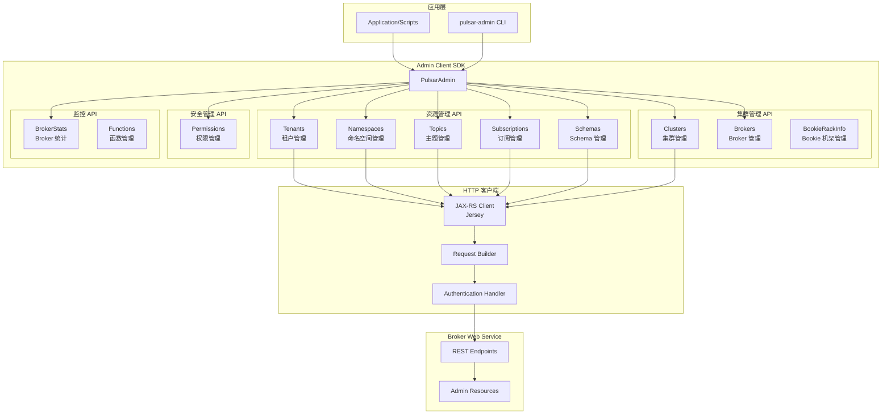

# Pulsar-05-ClientAdmin

## 模块概览

### 职责与定位

Pulsar Admin Client 是管理 Pulsar 集群的 HTTP 客户端，提供租户、命名空间、主题、订阅等资源的管理能力。Admin Client 通过 RESTful API 与 Broker 的 Web 服务通信，实现集群配置、监控和运维功能。

核心职责包括：

- **租户管理**：创建、删除、列举租户，配置租户权限和配额
- **命名空间管理**：创建、删除、配置命名空间策略（保留、TTL、积压配额等）
- **主题管理**：创建、删除主题，查询主题统计信息，配置主题策略
- **订阅管理**：创建、删除订阅，查询订阅状态，重置游标位置
- **分区管理**：创建分区主题，增加分区数量
- **Schema 管理**：注册、查询、删除 Schema
- **集群管理**：配置集群间复制，查询集群状态
- **权限管理**：授予、撤销用户权限

### 输入与输出

**输入**：
- 应用程序或运维脚本调用 Admin API
- 管理命令（创建、删除、查询、配置）

**输出**：
- HTTP 响应（JSON 格式）
- 操作结果、资源信息、统计数据

### 上下游依赖

**上游**：
- **应用程序**：通过 Admin Client SDK 调用
- **CLI 工具**：`pulsar-admin` 命令行工具
- **Web UI**：第三方管理界面

**下游**：
- **Broker Web Service**：HTTP 端口 8080（默认）
- **元数据存储**：通过 Broker 间接访问 ZooKeeper/etcd

---

## 模块架构图



### 架构图说明

#### Admin Client SDK

**PulsarAdmin**：
- Admin Client 的入口，管理所有资源 API
- 维护 HTTP 连接和认证状态
- 提供构建器模式创建实例

**资源管理 API**：
- **Tenants**：租户 CRUD 操作，配置租户管理员和资源配额
- **Namespaces**：命名空间 CRUD 操作，配置策略（保留、TTL、积压配额、复制等）
- **Topics**：主题 CRUD 操作，查询统计信息，配置主题级策略
- **Subscriptions**：订阅管理，重置游标，跳过消息，清空积压
- **Schemas**：Schema 注册、查询、删除，版本管理

**集群管理 API**：
- **Clusters**：集群注册、配置、删除
- **Brokers**：查询 Broker 列表、健康状态、动态配置
- **BookieRackInfo**：Bookie 机架感知配置

**安全管理 API**：
- **Permissions**：授予/撤销租户、命名空间、主题级权限

**监控 API**：
- **BrokerStats**：查询 Broker 统计指标
- **Functions**：Pulsar Functions 管理（创建、更新、删除、查询）

#### HTTP 客户端

**JAX-RS Client**：
- 基于 Jersey 的 HTTP 客户端
- 支持异步请求
- 自动 JSON 序列化/反序列化

**Request Builder**：
- 构建 HTTP 请求（URL、Headers、Body）
- 处理查询参数和路径参数

**Authentication Handler**：
- 添加认证信息到请求（Token、TLS 证书）
- 处理认证失败和重试

---

## 关键数据结构与 UML 图

### 核心类图

```mermaid
classDiagram
    class PulsarAdmin {
        <<interface>>
        +tenants() Tenants
        +namespaces() Namespaces
        +topics() Topics
        +subscriptions(topic) Subscriptions
        +schemas() Schemas
        +clusters() Clusters
        +brokers() Brokers
        +close()
    }
    
    class PulsarAdminImpl {
        -client: WebTarget
        -auth: Authentication
        -serviceUrl: String
        -tenants: TenantsImpl
        -namespaces: NamespacesImpl
        -topics: TopicsImpl
        +tenants() Tenants
        +namespaces() Namespaces
        +close()
    }
    
    class Tenants {
        <<interface>>
        +getTenants() List~String~
        +getTenantInfo(tenant: String) TenantInfo
        +createTenant(tenant: String, config: TenantInfo)
        +updateTenant(tenant: String, config: TenantInfo)
        +deleteTenant(tenant: String)
    }
    
    class Namespaces {
        <<interface>>
        +getNamespaces(tenant: String) List~String~
        +getPolicies(namespace: String) Policies
        +createNamespace(namespace: String)
        +deleteNamespace(namespace: String)
        +setRetention(namespace: String, retention: RetentionPolicies)
        +setBacklogQuota(namespace: String, quota: BacklogQuota)
        +setReplication(namespace: String, clusters: Set~String~)
    }
    
    class Topics {
        <<interface>>
        +getList(namespace: String) List~String~
        +getPartitionedTopicList(namespace: String) List~String~
        +createPartitionedTopic(topic: String, numPartitions: int)
        +updatePartitionedTopic(topic: String, numPartitions: int)
        +deletePartitionedTopic(topic: String)
        +getStats(topic: String) TopicStats
        +getInternalStats(topic: String) PersistentTopicInternalStats
    }
    
    class Subscriptions {
        <<interface>>
        +getSubscriptions(topic: String) List~String~
        +getStats(topic: String, subName: String) SubscriptionStats
        +resetCursor(topic: String, subName: String, timestamp: long)
        +skipMessages(topic: String, subName: String, numMessages: long)
        +clearBacklog(topic: String, subName: String)
        +deleteSubscription(topic: String, subName: String)
    }
    
    class Schemas {
        <<interface>>
        +getSchemaInfo(topic: String) SchemaInfo
        +getSchemaInfo(topic: String, version: long) SchemaInfo
        +createSchema(topic: String, schema: PostSchemaPayload)
        +deleteSchema(topic: String)
        +getAllVersions(topic: String) List~SchemaInfo~
    }
    
    class TenantInfo {
        -adminRoles: Set~String~
        -allowedClusters: Set~String~
        +getAdminRoles() Set~String~
        +getAllowedClusters() Set~String~
    }
    
    class Policies {
        -replication_clusters: Set~String~
        -bundles: BundlesData
        -backlog_quota_map: Map~BacklogQuotaType, BacklogQuota~
        -retention_policies: RetentionPolicies
        -message_ttl_in_seconds: Integer
    }
    
    class TopicStats {
        -msgRateIn: double
        -msgRateOut: double
        -msgThroughputIn: double
        -msgThroughputOut: double
        -storageSize: long
        -subscriptions: Map~String, SubscriptionStats~
        -publishers: List~PublisherStats~
    }
    
    PulsarAdmin <|.. PulsarAdminImpl : implements
    Tenants <|.. TenantsImpl : implements
    Namespaces <|.. NamespacesImpl : implements
    Topics <|.. TopicsImpl : implements
    Subscriptions <|.. SubscriptionsImpl : implements
    Schemas <|.. SchemasImpl : implements
    
    PulsarAdminImpl "1" *-- "1" TenantsImpl : contains
    PulsarAdminImpl "1" *-- "1" NamespacesImpl : contains
    PulsarAdminImpl "1" *-- "1" TopicsImpl : contains
    
    Tenants ..> TenantInfo : uses
    Namespaces ..> Policies : uses
    Topics ..> TopicStats : uses
```



### 数据结构说明

#### PulsarAdmin 接口

```java
public interface PulsarAdmin extends AutoCloseable {
    // 资源管理
    Tenants tenants();
    Namespaces namespaces();
    Topics topics();
    
    // 获取主题的订阅管理器
    Subscriptions subscriptions(String topic);
    
    // Schema 管理
    Schemas schemas();
    
    // 集群管理
    Clusters clusters();
    Brokers brokers();
    
    // 关闭客户端
    @Override
    void close();
}
```

**创建示例**：

```java
PulsarAdmin admin = PulsarAdmin.builder()
    .serviceHttpUrl("http://localhost:8080")
    .authentication(AuthenticationFactory.token("eyJhbGciOiJIUzI1NiJ9..."))
    .build();
```

---

## 核心 API 详解

### API-1：创建命名空间

#### 基本信息

- **接口名**：`Namespaces.createNamespace(String namespace)`
- **协议**：HTTP POST
- **路径**：`/admin/v2/namespaces/{tenant}/{namespace}`

#### 请求参数

```java
void createNamespace(String namespace) throws PulsarAdminException;
void createNamespace(String namespace, Policies policies) throws PulsarAdminException;
```

**参数说明**：

| 参数 | 类型 | 必填 | 说明 |
|---|---|---:|---|
| namespace | String | 是 | 命名空间名（格式：tenant/namespace） |
| policies | Policies | 否 | 命名空间策略配置 |

#### 响应结果

**无返回值**（成功返回 204 No Content）

**异常**：
- `ConflictException`：命名空间已存在
- `PreconditionFailedException`：租户不存在
- `PulsarAdminException`：其他错误

#### 使用示例

```java
public class CreateNamespaceExample {
    public static void main(String[] args) throws Exception {
        PulsarAdmin admin = PulsarAdmin.builder()
            .serviceHttpUrl("http://localhost:8080")
            .build();
        
        String namespace = "my-tenant/my-namespace";
        
        // 创建命名空间（使用默认策略）
        admin.namespaces().createNamespace(namespace);
        
        // 或创建并设置策略
        Policies policies = new Policies();
        policies.replication_clusters = Sets.newHashSet("cluster-1", "cluster-2");
        policies.retention_policies = new RetentionPolicies(60, 1024);  // 60 分钟，1 GB
        policies.message_ttl_in_seconds = 3600;  // 1 小时
        
        admin.namespaces().createNamespace(namespace, policies);
        
        System.out.println("Namespace created: " + namespace);
        
        admin.close();
    }
}
```

#### 配置命名空间策略

```java
public class ConfigureNamespaceExample {
    public static void main(String[] args) throws Exception {
        PulsarAdmin admin = PulsarAdmin.builder()
            .serviceHttpUrl("http://localhost:8080")
            .build();
        
        String namespace = "my-tenant/my-namespace";
        
        // 设置保留策略（防止数据过早删除）
        RetentionPolicies retention = new RetentionPolicies(
            60,      // 保留时间：60 分钟
            1024     // 保留大小：1 GB
        );
        admin.namespaces().setRetention(namespace, retention);
        
        // 设置积压配额（防止存储耗尽）
        BacklogQuota quota = new BacklogQuota(
            10L * 1024 * 1024 * 1024,  // 10 GB
            BacklogQuota.RetentionPolicy.producer_exception  // 超过配额后拒绝生产
        );
        admin.namespaces().setBacklogQuota(namespace, quota);
        
        // 设置消息 TTL
        admin.namespaces().setNamespaceMessageTTL(namespace, 3600);  // 1 小时
        
        // 设置地理复制
        admin.namespaces().setNamespaceReplicationClusters(namespace, 
            Sets.newHashSet("cluster-1", "cluster-2"));
        
        // 设置去重
        admin.namespaces().setDeduplicationStatus(namespace, true);
        
        // 查询策略
        Policies policies = admin.namespaces().getPolicies(namespace);
        System.out.println("Retention: " + policies.retention_policies);
        System.out.println("Backlog quota: " + policies.backlog_quota_map);
        
        admin.close();
    }
}
```

---

### API-2：创建分区主题

#### 基本信息

- **接口名**：`Topics.createPartitionedTopic(String topic, int numPartitions)`
- **协议**：HTTP PUT
- **路径**：`/admin/v2/persistent/{tenant}/{namespace}/{topic}/partitions`

#### 请求参数

```java
void createPartitionedTopic(String topic, int numPartitions) throws PulsarAdminException;
CompletableFuture<Void> createPartitionedTopicAsync(String topic, int numPartitions);
```

**参数说明**：

| 参数 | 类型 | 必填 | 说明 |
|---|---|---:|---|
| topic | String | 是 | 主题名（完整路径或短名称） |
| numPartitions | int | 是 | 分区数量（> 0） |

#### 响应结果

**无返回值**

**异常**：
- `ConflictException`：主题已存在
- `PreconditionFailedException`：命名空间不存在

#### 使用示例

```java
public class CreatePartitionedTopicExample {
    public static void main(String[] args) throws Exception {
        PulsarAdmin admin = PulsarAdmin.builder()
            .serviceHttpUrl("http://localhost:8080")
            .build();
        
        String topic = "persistent://my-tenant/my-namespace/my-partitioned-topic";
        
        // 创建分区主题（4 个分区）
        admin.topics().createPartitionedTopic(topic, 4);
        
        System.out.println("Partitioned topic created: " + topic);
        
        // 查询分区信息
        PartitionedTopicMetadata metadata = admin.topics().getPartitionedTopicMetadata(topic);
        System.out.println("Number of partitions: " + metadata.partitions);
        
        // 增加分区数量（从 4 增加到 8）
        admin.topics().updatePartitionedTopic(topic, 8);
        System.out.println("Partitions updated to 8");
        
        admin.close();
    }
}
```

---

### API-3：查询主题统计信息

#### 基本信息

- **接口名**：`Topics.getStats(String topic)`
- **协议**：HTTP GET
- **路径**：`/admin/v2/persistent/{tenant}/{namespace}/{topic}/stats`

#### 请求参数

```java
TopicStats getStats(String topic) throws PulsarAdminException;
CompletableFuture<TopicStats> getStatsAsync(String topic);
```

**参数说明**：

| 参数 | 类型 | 必填 | 说明 |
|---|---|---:|---|
| topic | String | 是 | 主题名 |

#### 响应结果

```java
public class TopicStats {
    public double msgRateIn;               // 入站消息速率（msg/s）
    public double msgThroughputIn;         // 入站吞吐量（bytes/s）
    public double msgRateOut;              // 出站消息速率（msg/s）
    public double msgThroughputOut;        // 出站吞吐量（bytes/s）
    
    public double averageMsgSize;          // 平均消息大小（bytes）
    public long storageSize;               // 存储大小（bytes）
    public long backlogSize;               // 积压大小（bytes）
    
    public Map<String, SubscriptionStats> subscriptions;  // 订阅统计
    public List<PublisherStats> publishers;               // 生产者统计
    
    public int waitingPublishers;          // 等待中的生产者数
}
```

**字段说明**：

| 字段 | 类型 | 说明 |
|---|---|---|
| msgRateIn | double | 入站消息速率（msg/s） |
| msgThroughputIn | double | 入站吞吐量（bytes/s） |
| msgRateOut | double | 出站消息速率（msg/s） |
| msgThroughputOut | double | 出站吞吐量（bytes/s） |
| storageSize | long | 存储大小（bytes） |
| backlogSize | long | 积压消息大小（bytes） |
| subscriptions | Map | 订阅统计信息 |
| publishers | List | 生产者统计信息 |

#### 使用示例

```java
public class GetTopicStatsExample {
    public static void main(String[] args) throws Exception {
        PulsarAdmin admin = PulsarAdmin.builder()
            .serviceHttpUrl("http://localhost:8080")
            .build();
        
        String topic = "persistent://my-tenant/my-namespace/my-topic";
        
        // 查询主题统计
        TopicStats stats = admin.topics().getStats(topic);
        
        System.out.println("=== Topic Statistics ===");
        System.out.println("Message rate in: " + stats.msgRateIn + " msg/s");
        System.out.println("Message rate out: " + stats.msgRateOut + " msg/s");
        System.out.println("Throughput in: " + stats.msgThroughputIn + " bytes/s");
        System.out.println("Throughput out: " + stats.msgThroughputOut + " bytes/s");
        System.out.println("Storage size: " + stats.storageSize + " bytes");
        System.out.println("Backlog size: " + stats.backlogSize + " bytes");
        System.out.println("Subscriptions: " + stats.subscriptions.size());
        System.out.println("Publishers: " + stats.publishers.size());
        
        // 遍历订阅统计
        for (Map.Entry<String, SubscriptionStats> entry : stats.subscriptions.entrySet()) {
            String subName = entry.getKey();
            SubscriptionStats subStats = entry.getValue();
            
            System.out.println("\n=== Subscription: " + subName + " ===");
            System.out.println("Message rate out: " + subStats.msgRateOut + " msg/s");
            System.out.println("Message backlog: " + subStats.msgBacklog);
            System.out.println("Consumers: " + subStats.consumers.size());
        }
        
        admin.close();
    }
}
```

---

### API-4：重置订阅游标

#### 基本信息

- **接口名**：`Subscriptions.resetCursor(String topic, String subName, long timestamp)`
- **协议**：HTTP POST
- **路径**：`/admin/v2/persistent/{tenant}/{namespace}/{topic}/subscription/{subName}/resetcursor`

#### 请求参数

```java
void resetCursor(String topic, String subName, long timestamp) throws PulsarAdminException;
void resetCursor(String topic, String subName, MessageId messageId) throws PulsarAdminException;
```

**参数说明**：

| 参数 | 类型 | 必填 | 说明 |
|---|---|---:|---|
| topic | String | 是 | 主题名 |
| subName | String | 是 | 订阅名 |
| timestamp | long | 是 | 时间戳（Unix 毫秒） |
| messageId | MessageId | 是 | 消息 ID |

#### 使用示例

```java
public class ResetCursorExample {
    public static void main(String[] args) throws Exception {
        PulsarAdmin admin = PulsarAdmin.builder()
            .serviceHttpUrl("http://localhost:8080")
            .build();
        
        String topic = "persistent://my-tenant/my-namespace/my-topic";
        String subscription = "my-subscription";
        
        // 重置到 1 小时前
        long oneHourAgo = System.currentTimeMillis() - TimeUnit.HOURS.toMillis(1);
        admin.topics().resetCursor(topic, subscription, oneHourAgo);
        
        System.out.println("Cursor reset to 1 hour ago");
        
        // 重置到最早位置
        admin.topics().resetCursor(topic, subscription, MessageId.earliest);
        
        // 重置到最新位置
        admin.topics().resetCursor(topic, subscription, MessageId.latest);
        
        admin.close();
    }
}
```

---

### API-5：清空订阅积压

#### 基本信息

- **接口名**：`Subscriptions.clearBacklog(String topic, String subName)`
- **协议**：HTTP POST
- **路径**：`/admin/v2/persistent/{tenant}/{namespace}/{topic}/subscription/{subName}/skip_all`

#### 使用示例

```java
public class ClearBacklogExample {
    public static void main(String[] args) throws Exception {
        PulsarAdmin admin = PulsarAdmin.builder()
            .serviceHttpUrl("http://localhost:8080")
            .build();
        
        String topic = "persistent://my-tenant/my-namespace/my-topic";
        String subscription = "my-subscription";
        
        // 查询当前积压
        SubscriptionStats stats = admin.topics().getStats(topic)
            .subscriptions.get(subscription);
        System.out.println("Current backlog: " + stats.msgBacklog + " messages");
        
        // 清空积压
        admin.topics().skipAllMessages(topic, subscription);
        System.out.println("Backlog cleared");
        
        // 或跳过指定数量的消息
        admin.topics().skipMessages(topic, subscription, 1000);
        System.out.println("Skipped 1000 messages");
        
        admin.close();
    }
}
```

---

### API-6：Schema 管理

#### 注册 Schema

```java
public class SchemaManagementExample {
    public static void main(String[] args) throws Exception {
        PulsarAdmin admin = PulsarAdmin.builder()
            .serviceHttpUrl("http://localhost:8080")
            .build();
        
        String topic = "persistent://my-tenant/my-namespace/user-topic";
        
        // 定义 Avro Schema
        String avroSchema = "{\n" +
            "  \"type\": \"record\",\n" +
            "  \"name\": \"User\",\n" +
            "  \"fields\": [\n" +
            "    {\"name\": \"name\", \"type\": \"string\"},\n" +
            "    {\"name\": \"age\", \"type\": \"int\"},\n" +
            "    {\"name\": \"email\", \"type\": \"string\"}\n" +
            "  ]\n" +
            "}";
        
        // 注册 Schema
        PostSchemaPayload payload = PostSchemaPayload.builder()
            .type("AVRO")
            .schema(avroSchema)
            .build();
        
        admin.schemas().createSchema(topic, payload);
        System.out.println("Schema registered for topic: " + topic);
        
        // 查询 Schema 信息
        SchemaInfo schemaInfo = admin.schemas().getSchemaInfo(topic);
        System.out.println("Schema type: " + schemaInfo.getType());
        System.out.println("Schema: " + new String(schemaInfo.getSchema()));
        
        // 查询所有版本
        List<SchemaInfo> versions = admin.schemas().getAllSchemas(topic);
        System.out.println("Total versions: " + versions.size());
        
        // 查询指定版本
        SchemaInfo version1 = admin.schemas().getSchemaInfo(topic, 1L);
        System.out.println("Version 1 schema: " + new String(version1.getSchema()));
        
        // 删除 Schema
        admin.schemas().deleteSchema(topic);
        System.out.println("Schema deleted");
        
        admin.close();
    }
}
```

---

## 批量操作示例

### 批量管理主题

```java
public class BatchTopicOperations {
    public static void main(String[] args) throws Exception {
        PulsarAdmin admin = PulsarAdmin.builder()
            .serviceHttpUrl("http://localhost:8080")
            .build();
        
        String namespace = "my-tenant/my-namespace";
        
        // 列出命名空间下所有主题
        List<String> topics = admin.topics().getList(namespace);
        System.out.println("Total topics: " + topics.size());
        
        for (String topic : topics) {
            System.out.println("Topic: " + topic);
            
            // 查询每个主题的统计信息
            TopicStats stats = admin.topics().getStats(topic);
            System.out.println("  Message rate in: " + stats.msgRateIn);
            System.out.println("  Storage size: " + stats.storageSize);
            
            // 查询订阅
            List<String> subscriptions = admin.topics().getSubscriptions(topic);
            System.out.println("  Subscriptions: " + subscriptions.size());
        }
        
        // 批量删除无订阅的主题
        for (String topic : topics) {
            List<String> subs = admin.topics().getSubscriptions(topic);
            if (subs.isEmpty()) {
                admin.topics().delete(topic);
                System.out.println("Deleted unused topic: " + topic);
            }
        }
        
        admin.close();
    }
}
```

### 监控与告警

```java
public class MonitoringExample {
    public static void main(String[] args) throws Exception {
        PulsarAdmin admin = PulsarAdmin.builder()
            .serviceHttpUrl("http://localhost:8080")
            .build();
        
        String namespace = "my-tenant/my-namespace";
        
        // 监控所有主题的积压
        List<String> topics = admin.topics().getList(namespace);
        
        for (String topic : topics) {
            TopicStats stats = admin.topics().getStats(topic);
            
            // 检查积压是否超过阈值
            long totalBacklog = 0;
            for (SubscriptionStats subStats : stats.subscriptions.values()) {
                totalBacklog += subStats.msgBacklog;
            }
            
            if (totalBacklog > 100000) {
                System.err.println("ALERT: Topic " + topic + " has high backlog: " + totalBacklog);
            }
            
            // 检查是否有慢消费者
            for (Map.Entry<String, SubscriptionStats> entry : stats.subscriptions.entrySet()) {
                SubscriptionStats subStats = entry.getValue();
                if (subStats.msgRateOut < 10 && subStats.msgBacklog > 1000) {
                    System.err.println("ALERT: Slow consumer on " + topic + 
                        ", subscription: " + entry.getKey());
                }
            }
            
            // 检查存储大小
            if (stats.storageSize > 10L * 1024 * 1024 * 1024) {  // 10 GB
                System.err.println("ALERT: Topic " + topic + 
                    " storage size exceeds 10 GB: " + stats.storageSize);
            }
        }
        
        admin.close();
    }
}
```

---

## 最佳实践

### 1. 连接管理

```java
// 使用连接池
public class AdminClientPool {
    private static final PulsarAdmin instance;
    
    static {
        try {
            instance = PulsarAdmin.builder()
                .serviceHttpUrl("http://localhost:8080")
                .requestTimeout(30, TimeUnit.SECONDS)
                .connectTimeout(10, TimeUnit.SECONDS)
                .build();
        } catch (PulsarClientException e) {
            throw new RuntimeException("Failed to create PulsarAdmin", e);
        }
    }
    
    public static PulsarAdmin getInstance() {
        return instance;
    }
    
    public static void shutdown() throws Exception {
        instance.close();
    }
}
```

### 2. 错误处理

```java
public class ErrorHandlingExample {
    public static void createNamespaceWithRetry(PulsarAdmin admin, String namespace) {
        int maxRetries = 3;
        int attempt = 0;
        
        while (attempt < maxRetries) {
            try {
                admin.namespaces().createNamespace(namespace);
                System.out.println("Namespace created: " + namespace);
                return;
            } catch (ConflictException e) {
                System.out.println("Namespace already exists: " + namespace);
                return;
            } catch (PulsarAdminException e) {
                attempt++;
                if (attempt >= maxRetries) {
                    throw new RuntimeException("Failed after " + maxRetries + " attempts", e);
                }
                try {
                    Thread.sleep(1000 * attempt);  // 指数退避
                } catch (InterruptedException ie) {
                    Thread.currentThread().interrupt();
                    throw new RuntimeException(ie);
                }
            }
        }
    }
}
```

### 3. 自动化运维脚本

```java
public class AutomationScript {
    public static void main(String[] args) throws Exception {
        PulsarAdmin admin = PulsarAdmin.builder()
            .serviceHttpUrl("http://localhost:8080")
            .build();
        
        // 自动清理过期主题
        String namespace = "my-tenant/my-namespace";
        List<String> topics = admin.topics().getList(namespace);
        
        long cutoffTime = System.currentTimeMillis() - TimeUnit.DAYS.toMillis(30);
        
        for (String topic : topics) {
            TopicStats stats = admin.topics().getStats(topic);
            
            // 检查主题是否 30 天无活动
            boolean hasActivity = stats.msgRateIn > 0 || stats.msgRateOut > 0;
            
            if (!hasActivity && stats.subscriptions.isEmpty()) {
                System.out.println("Deleting inactive topic: " + topic);
                admin.topics().delete(topic);
            }
        }
        
        admin.close();
    }
}
```

---

## 配置参数

### Admin Client 配置

| 参数 | 类型 | 默认值 | 说明 |
|---|---|---|---|
| serviceHttpUrl | String | - | Broker HTTP 服务地址 |
| authentication | Authentication | - | 认证配置 |
| tlsTrustCertsFilePath | String | - | TLS 证书路径 |
| allowTlsInsecureConnection | boolean | false | 是否允许不安全的 TLS 连接 |
| requestTimeout | Duration | 300s | 请求超时 |
| connectTimeout | Duration | 60s | 连接超时 |
| readTimeout | Duration | 300s | 读取超时 |

---

## 常见问题

### 问题 1：命名空间创建失败

**现象**：`PreconditionFailedException: Tenant does not exist`

**原因**：租户不存在

**解决方案**：
```java
// 先创建租户
TenantInfo tenantInfo = TenantInfo.builder()
    .allowedClusters(Sets.newHashSet("standalone"))
    .build();
admin.tenants().createTenant("my-tenant", tenantInfo);

// 再创建命名空间
admin.namespaces().createNamespace("my-tenant/my-namespace");
```

### 问题 2：主题删除失败

**现象**：`PreconditionFailedException: Topic has active subscriptions`

**原因**：主题有活跃订阅

**解决方案**：
```java
// 先删除所有订阅
List<String> subscriptions = admin.topics().getSubscriptions(topic);
for (String sub : subscriptions) {
    admin.topics().deleteSubscription(topic, sub);
}

// 再删除主题
admin.topics().delete(topic);
```

---

**文档版本**：v1.0  
**对应模块版本**：Pulsar 4.2.0-SNAPSHOT  
**最后更新**：2025-10-05

