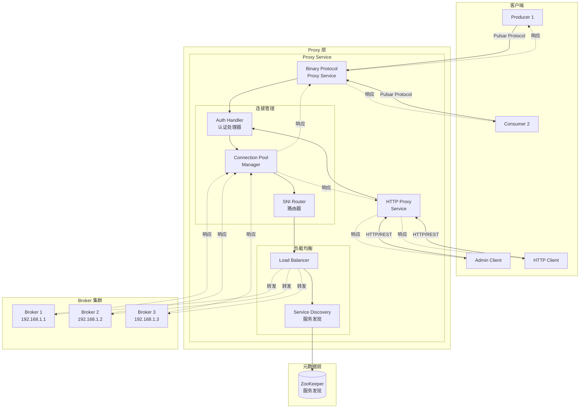

# Pulsar-06-Proxy

## 模块概览

### 职责与定位

Pulsar Proxy 是 Pulsar 的协议代理层，作为客户端和 Broker 之间的中间层，提供连接管理、负载均衡、协议转换和访问控制等功能。

核心职责包括：

- **协议代理**：转发 Pulsar 二进制协议和 HTTP 请求
- **服务发现**：自动发现和连接到目标 Broker
- **负载均衡**：将客户端连接分散到多个 Broker
- **SNI 路由**：基于 SNI（Server Name Indication）的多租户路由
- **认证授权**：集中式的安全认证和授权
- **连接池**：维护到后端 Broker 的连接池
- **TLS 终端**：TLS 连接的卸载和重新加密

### 核心概念

**Proxy Service**：
- 代理服务的主入口
- 管理客户端连接和 Broker 连接
- 处理协议转发

**Connection Pool**：
- 到后端 Broker 的连接池
- 复用连接，减少握手开销
- 自动健康检查

**SNI Routing**：
- 基于 TLS SNI 的路由
- 支持多租户隔离
- 域名到集群的映射

---

## 模块架构图



### 架构图说明

#### 请求流程

1. **客户端连接**：客户端连接到 Proxy（而非直接连接 Broker）
2. **认证**：Proxy 执行认证（可选）
3. **服务发现**：Proxy 查询元数据，找到目标 Broker
4. **负载均衡**：选择合适的 Broker（基于负载、地理位置等）
5. **协议转发**：Proxy 将请求转发到目标 Broker
6. **响应返回**：Broker 响应通过 Proxy 返回给客户端

#### 优势

- **简化客户端配置**：客户端只需知道 Proxy 地址
- **集中式安全**：在 Proxy 层统一认证和授权
- **灵活扩展**：可独立扩展 Proxy 层
- **多集群支持**：通过 SNI 路由到不同集群

---

## 核心组件

### 1. ProxyService 主服务

```java
package org.apache.pulsar.proxy.server;

import java.io.Closeable;
import io.netty.bootstrap.ServerBootstrap;

/**
 * ProxyService - Proxy 主服务
 * 
 * 管理 Proxy 的生命周期
 * 启动 Binary Protocol 和 HTTP 服务
 */
public class ProxyService implements Closeable {
    
    private final ProxyConfiguration config;
    private final BrokerDiscoveryProvider discoveryProvider;
    private final AuthenticationService authenticationService;
    
    private ServerBootstrap binaryProtocolServerBootstrap;
    private ServerBootstrap httpServerBootstrap;
    
    public ProxyService(ProxyConfiguration config) {
        this.config = config;
        
        // 初始化服务发现
        this.discoveryProvider = new ZKBrokerDiscoveryProvider(
            config.getZookeeperServers()
        );
        
        // 初始化认证服务
        this.authenticationService = new AuthenticationService(
            config.getAuthenticationProviders()
        );
    }
    
    /**
     * 启动 Proxy 服务
     */
    public void start() throws Exception {
        // 1. 启动服务发现
        discoveryProvider.start();
        
        // 2. 启动二进制协议服务（端口 6650）
        startBinaryProtocolService();
        
        // 3. 启动 HTTP 服务（端口 8080）
        startHttpService();
        
        System.out.println("Proxy service started");
    }
    
    private void startBinaryProtocolService() throws Exception {
        // 创建 Netty ServerBootstrap
        binaryProtocolServerBootstrap = new ServerBootstrap();
        
        EventLoopGroup bossGroup = new NioEventLoopGroup(1);
        EventLoopGroup workerGroup = new NioEventLoopGroup(
            config.getNumIOThreads()
        );
        
        binaryProtocolServerBootstrap
            .group(bossGroup, workerGroup)
            .channel(NioServerSocketChannel.class)
            .childHandler(new ProxyChannelInitializer(
                this, 
                config, 
                false  // 非 TLS
            ));
        
        // 绑定端口
        int port = config.getServicePort();
        binaryProtocolServerBootstrap.bind(port).sync();
        
        System.out.println("Binary protocol service started on port " + port);
    }
    
    private void startHttpService() throws Exception {
        // HTTP 服务实现（此处省略）
    }
    
    @Override
    public void close() throws Exception {
        // 关闭所有连接和服务
        discoveryProvider.close();
    }
    
    public BrokerDiscoveryProvider getDiscoveryProvider() {
        return discoveryProvider;
    }
    
    public AuthenticationService getAuthenticationService() {
        return authenticationService;
    }
}
```

### 2. ProxyConnection 连接处理

```java
package org.apache.pulsar.proxy.server;

import io.netty.channel.ChannelHandlerContext;
import io.netty.channel.ChannelInboundHandlerAdapter;

/**
 * ProxyConnection - 处理单个客户端连接
 * 
 * 负责：
 * 1. 接收客户端请求
 * 2. 转发到目标 Broker
 * 3. 返回响应给客户端
 */
public class ProxyConnection extends ChannelInboundHandlerAdapter {
    
    private final ProxyService service;
    private final ChannelHandlerContext clientCtx;
    
    private Channel brokerChannel;  // 到 Broker 的连接
    private String clientAuthRole;
    private State state = State.Init;
    
    enum State {
        Init,
        Connected,
        Authenticated,
        Closed
    }
    
    public ProxyConnection(ProxyService service, ChannelHandlerContext clientCtx) {
        this.service = service;
        this.clientCtx = clientCtx;
    }
    
    @Override
    public void channelRead(ChannelHandlerContext ctx, Object msg) throws Exception {
        if (msg instanceof CommandConnect) {
            handleConnect((CommandConnect) msg);
            
        } else if (msg instanceof CommandProducer) {
            handleProducer((CommandProducer) msg);
            
        } else if (msg instanceof CommandSubscribe) {
            handleSubscribe((CommandSubscribe) msg);
            
        } else if (msg instanceof CommandSend) {
            handleSend((CommandSend) msg);
            
        } else {
            // 其他命令直接转发到 Broker
            forwardToBroker(msg);
        }
    }
    
    /**
     * 处理 CONNECT 命令
     */
    private void handleConnect(CommandConnect connect) throws Exception {
        // 1. 认证
        if (service.getAuthenticationService().isEnabled()) {
            String authMethodName = connect.getAuthMethodName();
            String authData = connect.getAuthData();
            
            clientAuthRole = service.getAuthenticationService()
                .authenticate(authMethodName, authData);
        }
        
        // 2. 连接到 Broker
        String brokerAddress = selectBroker();
        connectToBroker(brokerAddress);
        
        // 3. 转发 CONNECT 命令到 Broker
        forwardToBroker(connect);
        
        state = State.Connected;
    }
    
    /**
     * 选择目标 Broker
     */
    private String selectBroker() throws Exception {
        BrokerDiscoveryProvider discovery = service.getDiscoveryProvider();
        
        // 简单的负载均衡：随机选择
        List<String> brokers = discovery.getAvailableBrokers();
        
        if (brokers.isEmpty()) {
            throw new Exception("No available brokers");
        }
        
        int index = ThreadLocalRandom.current().nextInt(brokers.size());
        return brokers.get(index);
    }
    
    /**
     * 连接到 Broker
     */
    private void connectToBroker(String brokerAddress) throws Exception {
        String[] parts = brokerAddress.split(":");
        String host = parts[0];
        int port = Integer.parseInt(parts[1]);
        
        Bootstrap bootstrap = new Bootstrap();
        bootstrap.group(clientCtx.channel().eventLoop())
            .channel(NioSocketChannel.class)
            .handler(new ChannelInitializer<SocketChannel>() {
                @Override
                protected void initChannel(SocketChannel ch) {
                    ch.pipeline().addLast(
                        new ProxyBackendHandler(ProxyConnection.this)
                    );
                }
            });
        
        ChannelFuture future = bootstrap.connect(host, port).sync();
        brokerChannel = future.channel();
    }
    
    /**
     * 转发消息到 Broker
     */
    private void forwardToBroker(Object msg) {
        if (brokerChannel != null && brokerChannel.isActive()) {
            brokerChannel.writeAndFlush(msg);
        }
    }
    
    /**
     * 从 Broker 收到响应，转发给客户端
     */
    public void forwardToClient(Object msg) {
        if (clientCtx.channel().isActive()) {
            clientCtx.writeAndFlush(msg);
        }
    }
    
    @Override
    public void channelInactive(ChannelHandlerContext ctx) {
        // 客户端断开连接
        if (brokerChannel != null) {
            brokerChannel.close();
        }
        state = State.Closed;
    }
}
```

### 3. BrokerDiscoveryProvider 服务发现

```java
package org.apache.pulsar.proxy.server;

import java.util.List;
import java.util.concurrent.CopyOnWriteArrayList;

/**
 * BrokerDiscoveryProvider - Broker 服务发现
 * 
 * 从 ZooKeeper 获取可用的 Broker 列表
 * 监听 Broker 上下线事件
 */
public class ZKBrokerDiscoveryProvider implements BrokerDiscoveryProvider {
    
    private final String zkServers;
    private final List<String> availableBrokers = new CopyOnWriteArrayList<>();
    
    private ZooKeeper zk;
    
    public ZKBrokerDiscoveryProvider(String zkServers) {
        this.zkServers = zkServers;
    }
    
    @Override
    public void start() throws Exception {
        // 1. 连接 ZooKeeper
        zk = new ZooKeeper(zkServers, 30000, event -> {
            if (event.getType() == EventType.NodeChildrenChanged) {
                // Broker 列表变化，重新加载
                refreshBrokers();
            }
        });
        
        // 2. 初始加载 Broker 列表
        refreshBrokers();
        
        // 3. 监听 /loadbalance/brokers 路径
        watchBrokers();
    }
    
    private void refreshBrokers() {
        try {
            String path = "/loadbalance/brokers";
            List<String> children = zk.getChildren(path, true);
            
            availableBrokers.clear();
            
            for (String brokerName : children) {
                // 读取 Broker 信息
                String brokerPath = path + "/" + brokerName;
                byte[] data = zk.getData(brokerPath, false, null);
                
                // 解析 Broker 地址
                String brokerAddress = parseBrokerAddress(data);
                availableBrokers.add(brokerAddress);
            }
            
            System.out.println("Discovered " + availableBrokers.size() + " brokers");
            
        } catch (Exception e) {
            // 此处省略错误处理
        }
    }
    
    private void watchBrokers() throws Exception {
        String path = "/loadbalance/brokers";
        zk.getChildren(path, true);
    }
    
    private String parseBrokerAddress(byte[] data) {
        // 解析 JSON 数据，提取 Broker 地址
        // 实现省略
        return "broker-host:6650";
    }
    
    @Override
    public List<String> getAvailableBrokers() {
        return new ArrayList<>(availableBrokers);
    }
    
    @Override
    public void close() throws Exception {
        if (zk != null) {
            zk.close();
        }
    }
}
```

---

## SNI 路由

### SNI Routing 配置

SNI（Server Name Indication）路由允许基于 TLS 握手中的域名将请求路由到不同的 Broker 集群。

```java
package org.apache.pulsar.proxy.server;

import io.netty.handler.ssl.SniHandler;
import io.netty.util.DomainNameMapping;

/**
 * SNI 路由器
 * 
 * 根据客户端连接的域名，路由到不同的 Broker 集群
 */
public class ProxySniRouter {
    
    private final Map<String, String> domainToCluster;
    
    public ProxySniRouter(Map<String, String> domainToCluster) {
        this.domainToCluster = domainToCluster;
    }
    
    /**
     * 创建 SNI Handler
     */
    public SniHandler createSniHandler() {
        DomainNameMappingBuilder<SslContext> mapping = 
            new DomainNameMappingBuilder<>(getDefaultSslContext());
        
        for (Map.Entry<String, String> entry : domainToCluster.entrySet()) {
            String domain = entry.getKey();
            String cluster = entry.getValue();
            
            SslContext sslContext = createSslContextForCluster(cluster);
            mapping.add(domain, sslContext);
        }
        
        return new SniHandler(mapping.build()) {
            @Override
            protected void onLookupComplete(ChannelHandlerContext ctx,
                                           String hostname,
                                           Future<SslContext> future) {
                // SNI 查询完成，记录目标集群
                String cluster = domainToCluster.get(hostname);
                ctx.channel().attr(CLUSTER_KEY).set(cluster);
                
                super.onLookupComplete(ctx, hostname, future);
            }
        };
    }
    
    /**
     * 为指定集群创建 SSL 上下文
     */
    private SslContext createSslContextForCluster(String cluster) {
        // 加载集群特定的证书和密钥
        // 实现省略
        return null;
    }
    
    private SslContext getDefaultSslContext() {
        // 默认 SSL 上下文
        return null;
    }
}
```

### SNI 路由配置示例

```properties
# proxy.conf

# 启用 TLS
tlsEnabledWithBroker=true
tlsCertificateFilePath=/path/to/proxy-cert.pem
tlsKeyFilePath=/path/to/proxy-key.pem

# SNI 路由映射
# 格式: domain=cluster
proxyDomainToClusterMap=\
  tenant1.pulsar.example.com=cluster-1,\
  tenant2.pulsar.example.com=cluster-2,\
  tenant3.pulsar.example.com=cluster-3
```

---

## 连接池管理

### ConnectionPool 实现

```java
package org.apache.pulsar.proxy.server;

import java.util.concurrent.ConcurrentHashMap;
import io.netty.channel.Channel;

/**
 * ConnectionPool - 到 Broker 的连接池
 * 
 * 复用连接，减少握手开销
 * 自动健康检查和连接重建
 */
public class BrokerConnectionPool {
    
    private final ProxyService proxyService;
    private final ConcurrentHashMap<String, ChannelPool> pools = 
        new ConcurrentHashMap<>();
    
    public BrokerConnectionPool(ProxyService proxyService) {
        this.proxyService = proxyService;
    }
    
    /**
     * 获取到指定 Broker 的连接
     */
    public CompletableFuture<Channel> getConnection(String brokerAddress) {
        ChannelPool pool = pools.computeIfAbsent(
            brokerAddress, 
            addr -> createPool(addr)
        );
        
        CompletableFuture<Channel> future = new CompletableFuture<>();
        
        pool.acquire().addListener((Future<Channel> f) -> {
            if (f.isSuccess()) {
                future.complete(f.getNow());
            } else {
                future.completeExceptionally(f.cause());
            }
        });
        
        return future;
    }
    
    /**
     * 为指定 Broker 创建连接池
     */
    private ChannelPool createPool(String brokerAddress) {
        String[] parts = brokerAddress.split(":");
        String host = parts[0];
        int port = Integer.parseInt(parts[1]);
        
        Bootstrap bootstrap = new Bootstrap();
        bootstrap.group(new NioEventLoopGroup())
            .channel(NioSocketChannel.class)
            .option(ChannelOption.CONNECT_TIMEOUT_MILLIS, 10000)
            .handler(new ChannelInitializer<SocketChannel>() {
                @Override
                protected void initChannel(SocketChannel ch) {
                    // 配置 Pipeline
                    ch.pipeline().addLast(new PulsarDecoder());
                    ch.pipeline().addLast(new PulsarEncoder());
                }
            });
        
        // 创建固定大小的连接池
        return new FixedChannelPool(
            bootstrap,
            new AbstractChannelPoolHandler() {
                @Override
                public void channelCreated(Channel ch) {
                    System.out.println("New connection to " + brokerAddress);
                }
            },
            10  // 最大连接数
        );
    }
    
    /**
     * 释放连接回连接池
     */
    public void releaseConnection(String brokerAddress, Channel channel) {
        ChannelPool pool = pools.get(brokerAddress);
        if (pool != null) {
            pool.release(channel);
        }
    }
    
    /**
     * 关闭所有连接池
     */
    public void close() {
        for (ChannelPool pool : pools.values()) {
            pool.close();
        }
        pools.clear();
    }
}
```

---

## 使用示例

### 1. 启动 Proxy 服务

```bash
# 启动 Proxy（使用默认配置）
bin/pulsar proxy

# 使用自定义配置
bin/pulsar proxy --config-file /path/to/proxy.conf

# 指定 ZooKeeper 地址
bin/pulsar proxy --zookeeper-servers zk1:2181,zk2:2181,zk3:2181
```

### 2. 客户端连接到 Proxy

```java
import org.apache.pulsar.client.api.PulsarClient;

public class ConnectThroughProxyExample {
    public static void main(String[] args) throws Exception {
        // 客户端连接到 Proxy，而非直接连接 Broker
        PulsarClient client = PulsarClient.builder()
            .serviceUrl("pulsar://proxy-host:6650")  // Proxy 地址
            .build();
        
        // 正常使用 Producer 和 Consumer
        Producer<String> producer = client.newProducer(Schema.STRING)
            .topic("persistent://public/default/my-topic")
            .create();
        
        producer.send("Hello through Proxy!");
        
        producer.close();
        client.close();
    }
}
```

### 3. 使用 SNI 路由

```java
public class ConnectWithSNIExample {
    public static void main(String[] args) throws Exception {
        // 使用不同的域名连接到不同的集群
        PulsarClient client1 = PulsarClient.builder()
            .serviceUrl("pulsar+ssl://tenant1.pulsar.example.com:6651")
            .tlsTrustCertsFilePath("/path/to/ca-cert.pem")
            .build();
        
        PulsarClient client2 = PulsarClient.builder()
            .serviceUrl("pulsar+ssl://tenant2.pulsar.example.com:6651")
            .tlsTrustCertsFilePath("/path/to/ca-cert.pem")
            .build();
        
        // client1 将路由到 cluster-1
        // client2 将路由到 cluster-2
        
        client1.close();
        client2.close();
    }
}
```

---

## 配置说明

### proxy.conf 关键配置

| 配置项 | 默认值 | 说明 |
|---|---|---|
| `zookeeperServers` | localhost:2181 | ZooKeeper 地址 |
| `servicePort` | 6650 | 二进制协议端口 |
| `servicePortTls` | 6651 | TLS 端口 |
| `webServicePort` | 8080 | HTTP 端口 |
| `webServicePortTls` | 8443 | HTTPS 端口 |
| `numIOThreads` | 2 * CPU 核数 | I/O 线程数 |
| `brokerProxyAllowedTargetPorts` | * | 允许代理的 Broker 端口 |
| `maxConcurrentInboundConnections` | 10000 | 最大客户端连接数 |
| `authenticationEnabled` | false | 是否启用认证 |
| `authenticationProviders` | - | 认证提供者列表 |
| `tlsEnabledWithBroker` | false | 与 Broker 通信是否使用 TLS |

---

## 性能调优

### 1. 线程池配置

```properties
# proxy.conf

# I/O 线程数（处理网络 I/O）
numIOThreads=16

# HTTP 线程数
numHttpServerThreads=8

# 最大并发连接数
maxConcurrentInboundConnections=20000
maxConcurrentLookupRequests=50000
```

### 2. 连接池优化

```java
// 连接池配置
BrokerConnectionPoolConfig config = BrokerConnectionPoolConfig.builder()
    .maxConnectionsPerBroker(100)    // 每个 Broker 最大连接数
    .minIdleConnections(10)          // 最小空闲连接数
    .maxIdleTime(60000)              // 最大空闲时间（毫秒）
    .connectionTimeout(10000)        // 连接超时
    .build();
```

### 3. 缓存优化

```properties
# 启用 DNS 缓存
proxyDnsCacheTtlSeconds=60

# 启用 Broker 地址缓存
brokerServiceUrlCacheTtlSeconds=30
```

---

## 监控指标

| 指标 | 类型 | 说明 |
|---|---|---|
| `pulsar_proxy_active_connections` | Gauge | 当前活跃连接数 |
| `pulsar_proxy_new_connections` | Counter | 新建连接总数 |
| `pulsar_proxy_closed_connections` | Counter | 关闭连接总数 |
| `pulsar_proxy_binary_bytes_in` | Counter | 接收字节数 |
| `pulsar_proxy_binary_bytes_out` | Counter | 发送字节数 |
| `pulsar_proxy_binary_ops` | Counter | 二进制协议操作数 |
| `pulsar_proxy_lookup_requests` | Counter | Lookup 请求数 |
| `pulsar_proxy_partition_metadata_requests` | Counter | 分区元数据请求数 |

---

## 常见问题

### 问题 1：Proxy 连接不上 Broker

**原因**：网络隔离、防火墙规则

**解决方案**：
```bash
# 检查网络连通性
telnet broker-host 6650

# 检查 Proxy 配置
grep brokerServiceURL /path/to/proxy.conf
```

### 问题 2：SNI 路由不生效

**原因**：TLS 配置错误、域名映射缺失

**解决方案**：
```bash
# 检查 SNI 映射配置
grep proxyDomainToClusterMap /path/to/proxy.conf

# 测试 TLS 连接
openssl s_client -connect proxy-host:6651 -servername tenant1.pulsar.example.com
```

### 问题 3：连接池耗尽

**原因**：高并发、连接泄漏

**解决方案**：
- 增大连接池大小
- 确保正确释放连接
- 监控 `pulsar_proxy_active_connections` 指标

---

**文档版本**：v1.0  
**对应模块版本**：Pulsar 4.2.0-SNAPSHOT  
**最后更新**：2025-10-05

