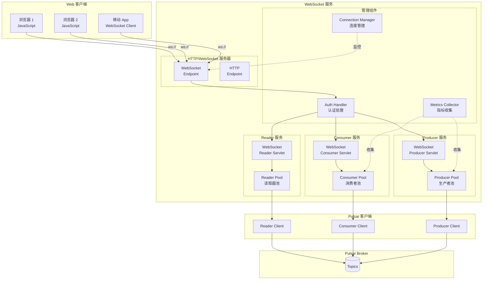

# Pulsar-07-WebSocket

## 模块概览

### 职责与定位

Pulsar WebSocket 模块提供基于 WebSocket 协议的消息生产和消费能力，使得浏览器、移动应用等无法直接使用 Pulsar 二进制协议的客户端也能访问 Pulsar。

核心职责包括：

- **WebSocket 协议支持**：实现标准 WebSocket 协议（RFC 6455）
- **消息生产**：通过 WebSocket 发送消息到 Pulsar 主题
- **消息消费**：通过 WebSocket 接收 Pulsar 主题的消息
- **Reader 模式**：支持从指定位置读取消息
- **认证授权**：支持 Token、TLS 等认证方式
- **协议转换**：WebSocket 消息与 Pulsar 二进制协议的转换

### 核心概念

**WebSocket Producer**：
- 通过 WebSocket 连接发送消息
- 支持同步和异步发送
- 支持消息属性和分区键

**WebSocket Consumer**：
- 通过 WebSocket 连接接收消息
- 支持多种订阅模式（Exclusive、Shared、Failover）
- 支持消息确认

**WebSocket Reader**：
- 从指定位置读取消息
- 不需要订阅名称
- 适合批量处理场景

---

## 模块架构图



### 架构图说明

#### Producer 流程

1. **WebSocket 连接**：浏览器通过 WebSocket 连接到 `/ws/v2/producer/persistent/{tenant}/{namespace}/{topic}`
2. **认证**：WebSocket 握手阶段进行认证
3. **Producer 创建**：服务端创建 Pulsar Producer
4. **消息发送**：客户端通过 WebSocket 发送 JSON 消息
5. **协议转换**：服务端将 JSON 转换为 Pulsar 二进制消息
6. **响应返回**：发送结果通过 WebSocket 返回给客户端

#### Consumer 流程

1. **WebSocket 连接**：浏览器连接到 `/ws/v2/consumer/persistent/{tenant}/{namespace}/{topic}/{subscription}`
2. **Consumer 创建**：服务端创建 Pulsar Consumer
3. **消息推送**：服务端持续推送消息到客户端
4. **消息确认**：客户端发送 ACK 消息确认

---

## 核心 API

### 1. WebSocket Producer API

#### 连接 Endpoint

```
ws://{host}:{port}/ws/v2/producer/persistent/{tenant}/{namespace}/{topic}
```

#### 发送消息格式

```json
{
  "payload": "SGVsbG8gV29ybGQ=",  // Base64 编码的消息内容
  "properties": {                  // 可选：消息属性
    "key1": "value1",
    "key2": "value2"
  },
  "key": "partition-key",          // 可选：分区键
  "replicationClusters": ["cluster1", "cluster2"]  // 可选：复制集群
}
```

#### 响应格式

```json
{
  "result": "ok",
  "messageId": "CAEQAiAD",      // 消息 ID
  "context": "request-1"        // 可选：请求上下文
}
```

#### 错误响应

```json
{
  "result": "error",
  "errorMsg": "Topic not found",
  "context": "request-1"
}
```

---

### 2. WebSocket Consumer API

#### 连接 Endpoint

```
ws://{host}:{port}/ws/v2/consumer/persistent/{tenant}/{namespace}/{topic}/{subscription}
```

#### 查询参数

| 参数 | 类型 | 默认值 | 说明 |
|---|---|---|---|
| `subscriptionType` | String | Exclusive | 订阅类型（Exclusive/Shared/Failover） |
| `receiverQueueSize` | int | 1000 | 接收队列大小 |
| `pullMode` | boolean | false | 是否使用拉取模式 |

#### 接收消息格式

```json
{
  "messageId": "CAEQAiAD",
  "payload": "SGVsbG8gV29ybGQ=",
  "properties": {
    "key1": "value1"
  },
  "publishTime": 1633046400000,
  "key": "partition-key"
}
```

#### 发送确认

```json
{
  "messageId": "CAEQAiAD"
}
```

---

### 3. WebSocket Reader API

#### 连接 Endpoint

```
ws://{host}:{port}/ws/v2/reader/persistent/{tenant}/{namespace}/{topic}
```

#### 查询参数

| 参数 | 类型 | 默认值 | 说明 |
|---|---|---|---|
| `readerName` | String | - | Reader 名称 |
| `receiverQueueSize` | int | 1000 | 接收队列大小 |
| `messageId` | String | earliest | 起始位置（earliest/latest/MessageId） |

---

## 服务端实现

### 1. WebSocketProducerServlet

```java
package org.apache.pulsar.websocket;

import javax.servlet.http.HttpServlet;
import org.eclipse.jetty.websocket.servlet.WebSocketServlet;
import org.eclipse.jetty.websocket.servlet.WebSocketServletFactory;

/**
 * WebSocketProducerServlet - Producer WebSocket 服务
 * 
 * 处理 WebSocket 连接请求
 * 创建 ProducerHandler 处理消息发送
 */
@WebSocketServlet(name = "WebSocketProducerServlet")
public class WebSocketProducerServlet extends WebSocketServlet {
    
    private final WebSocketService service;
    
    public WebSocketProducerServlet(WebSocketService service) {
        this.service = service;
    }
    
    @Override
    public void configure(WebSocketServletFactory factory) {
        // 配置 WebSocket 工厂
        factory.getPolicy().setMaxTextMessageSize(1024 * 1024);  // 1 MB
        factory.getPolicy().setIdleTimeout(300000);  // 5 分钟
        
        // 创建 WebSocket 连接时的回调
        factory.setCreator((request, response) -> {
            // 解析主题路径
            String topicName = extractTopicName(request.getRequestURI());
            
            // 认证
            String authRole = authenticateRequest(request);
            
            // 创建 Producer Handler
            return new ProducerHandler(service, topicName, authRole);
        });
    }
    
    private String extractTopicName(URI uri) {
        // 从 URI 提取主题名称
        // /ws/v2/producer/persistent/public/default/my-topic
        String path = uri.getPath();
        String[] parts = path.split("/");
        
        if (parts.length >= 8) {
            String persistence = parts[4];  // persistent/non-persistent
            String tenant = parts[5];
            String namespace = parts[6];
            String topic = parts[7];
            
            return String.format("%s://%s/%s/%s", 
                persistence, tenant, namespace, topic);
        }
        
        throw new IllegalArgumentException("Invalid topic path");
    }
    
    private String authenticateRequest(ServletUpgradeRequest request) {
        // 认证逻辑
        // 1. 从 Header 或 Query 获取 Token
        String token = request.getHeader("Authorization");
        if (token == null) {
            token = request.getParameterMap().get("token");
        }
        
        // 2. 验证 Token
        if (token != null) {
            return service.getAuthenticationService().authenticate(token);
        }
        
        return null;  // 匿名访问
    }
}
```

### 2. ProducerHandler

```java
package org.apache.pulsar.websocket;

import org.eclipse.jetty.websocket.api.Session;
import org.eclipse.jetty.websocket.api.WebSocketAdapter;
import org.apache.pulsar.client.api.Producer;
import org.apache.pulsar.client.api.PulsarClient;

/**
 * ProducerHandler - 处理 WebSocket Producer 消息
 */
public class ProducerHandler extends WebSocketAdapter {
    
    private final WebSocketService service;
    private final String topicName;
    private final String authRole;
    
    private Producer<byte[]> producer;
    private Session session;
    
    public ProducerHandler(WebSocketService service, 
                          String topicName, 
                          String authRole) {
        this.service = service;
        this.topicName = topicName;
        this.authRole = authRole;
    }
    
    @Override
    public void onWebSocketConnect(Session session) {
        super.onWebSocketConnect(session);
        this.session = session;
        
        try {
            // 创建 Pulsar Producer
            PulsarClient client = service.getPulsarClient();
            
            producer = client.newProducer()
                .topic(topicName)
                .create();
            
            System.out.println("Producer connected: " + topicName);
            
        } catch (Exception e) {
            sendError("Failed to create producer: " + e.getMessage());
            session.close();
        }
    }
    
    @Override
    public void onWebSocketText(String message) {
        try {
            // 解析 JSON 消息
            ProduceRequest request = parseProduceRequest(message);
            
            // 发送到 Pulsar
            byte[] payload = Base64.getDecoder().decode(request.payload);
            
            TypedMessageBuilder<byte[]> builder = producer.newMessage()
                .value(payload);
            
            // 设置属性
            if (request.properties != null) {
                for (Map.Entry<String, String> entry : request.properties.entrySet()) {
                    builder.property(entry.getKey(), entry.getValue());
                }
            }
            
            // 设置分区键
            if (request.key != null) {
                builder.key(request.key);
            }
            
            // 异步发送
            builder.sendAsync()
                .thenAccept(msgId -> {
                    // 发送成功响应
                    ProduceResponse response = new ProduceResponse();
                    response.result = "ok";
                    response.messageId = msgId.toString();
                    response.context = request.context;
                    
                    sendResponse(response);
                })
                .exceptionally(ex -> {
                    // 发送错误响应
                    sendError(ex.getMessage(), request.context);
                    return null;
                });
            
        } catch (Exception e) {
            sendError("Invalid message format: " + e.getMessage());
        }
    }
    
    @Override
    public void onWebSocketClose(int statusCode, String reason) {
        super.onWebSocketClose(statusCode, reason);
        
        // 关闭 Producer
        if (producer != null) {
            try {
                producer.close();
            } catch (Exception e) {
                // 此处省略错误处理
            }
        }
        
        System.out.println("Producer disconnected: " + topicName);
    }
    
    private ProduceRequest parseProduceRequest(String json) {
        // 使用 Jackson 解析 JSON
        return ObjectMapperFactory.getThreadLocal()
            .readValue(json, ProduceRequest.class);
    }
    
    private void sendResponse(ProduceResponse response) {
        try {
            String json = ObjectMapperFactory.getThreadLocal()
                .writeValueAsString(response);
            session.getRemote().sendString(json);
        } catch (Exception e) {
            // 此处省略错误处理
        }
    }
    
    private void sendError(String errorMsg) {
        sendError(errorMsg, null);
    }
    
    private void sendError(String errorMsg, String context) {
        ProduceResponse response = new ProduceResponse();
        response.result = "error";
        response.errorMsg = errorMsg;
        response.context = context;
        sendResponse(response);
    }
    
    static class ProduceRequest {
        public String payload;
        public Map<String, String> properties;
        public String key;
        public String context;
        public List<String> replicationClusters;
    }
    
    static class ProduceResponse {
        public String result;
        public String messageId;
        public String errorMsg;
        public String context;
    }
}
```

### 3. ConsumerHandler

```java
package org.apache.pulsar.websocket;

import org.apache.pulsar.client.api.Consumer;
import org.apache.pulsar.client.api.Message;

/**
 * ConsumerHandler - 处理 WebSocket Consumer 消息
 */
public class ConsumerHandler extends WebSocketAdapter {
    
    private final WebSocketService service;
    private final String topicName;
    private final String subscription;
    private final String authRole;
    
    private Consumer<byte[]> consumer;
    private Session session;
    private volatile boolean running = false;
    
    public ConsumerHandler(WebSocketService service,
                          String topicName,
                          String subscription,
                          String authRole) {
        this.service = service;
        this.topicName = topicName;
        this.subscription = subscription;
        this.authRole = authRole;
    }
    
    @Override
    public void onWebSocketConnect(Session session) {
        super.onWebSocketConnect(session);
        this.session = session;
        
        try {
            // 创建 Pulsar Consumer
            PulsarClient client = service.getPulsarClient();
            
            // 从查询参数获取订阅类型
            SubscriptionType subType = parseSubscriptionType(session);
            
            consumer = client.newConsumer()
                .topic(topicName)
                .subscriptionName(subscription)
                .subscriptionType(subType)
                .messageListener((c, msg) -> {
                    // 收到消息时的回调
                    handleMessage(msg);
                })
                .subscribe();
            
            running = true;
            System.out.println("Consumer connected: " + topicName + "/" + subscription);
            
        } catch (Exception e) {
            sendError("Failed to create consumer: " + e.getMessage());
            session.close();
        }
    }
    
    private void handleMessage(Message<byte[]> msg) {
        try {
            // 构建响应
            ConsumeResponse response = new ConsumeResponse();
            response.messageId = msg.getMessageId().toString();
            response.payload = Base64.getEncoder().encodeToString(msg.getData());
            response.properties = msg.getProperties();
            response.publishTime = msg.getPublishTime();
            
            if (msg.hasKey()) {
                response.key = msg.getKey();
            }
            
            // 发送给客户端
            String json = ObjectMapperFactory.getThreadLocal()
                .writeValueAsString(response);
            session.getRemote().sendString(json);
            
        } catch (Exception e) {
            // 此处省略错误处理
        }
    }
    
    @Override
    public void onWebSocketText(String message) {
        try {
            // 解析 ACK 消息
            AckRequest ack = ObjectMapperFactory.getThreadLocal()
                .readValue(message, AckRequest.class);
            
            // 确认消息
            MessageId msgId = MessageId.fromString(ack.messageId);
            consumer.acknowledge(msgId);
            
        } catch (Exception e) {
            sendError("Failed to acknowledge message: " + e.getMessage());
        }
    }
    
    @Override
    public void onWebSocketClose(int statusCode, String reason) {
        super.onWebSocketClose(statusCode, reason);
        running = false;
        
        // 关闭 Consumer
        if (consumer != null) {
            try {
                consumer.close();
            } catch (Exception e) {
                // 此处省略错误处理
            }
        }
        
        System.out.println("Consumer disconnected: " + topicName + "/" + subscription);
    }
    
    private SubscriptionType parseSubscriptionType(Session session) {
        String typeStr = session.getUpgradeRequest()
            .getParameterMap()
            .get("subscriptionType");
        
        if (typeStr != null) {
            return SubscriptionType.valueOf(typeStr);
        }
        
        return SubscriptionType.Exclusive;
    }
    
    private void sendError(String errorMsg) {
        ConsumeResponse response = new ConsumeResponse();
        response.result = "error";
        response.errorMsg = errorMsg;
        
        try {
            String json = ObjectMapperFactory.getThreadLocal()
                .writeValueAsString(response);
            session.getRemote().sendString(json);
        } catch (Exception e) {
            // 此处省略错误处理
        }
    }
    
    static class ConsumeResponse {
        public String result = "ok";
        public String messageId;
        public String payload;
        public Map<String, String> properties;
        public long publishTime;
        public String key;
        public String errorMsg;
    }
    
    static class AckRequest {
        public String messageId;
    }
}
```

---

## 客户端使用示例

### 1. JavaScript Producer

```html
<!DOCTYPE html>
<html>
<head>
    <title>Pulsar WebSocket Producer</title>
</head>
<body>
    <h1>Pulsar WebSocket Producer</h1>
    <textarea id="message" rows="4" cols="50">Hello Pulsar!</textarea>
    <br/>
    <button onclick="sendMessage()">Send Message</button>
    <div id="status"></div>

    <script>
        // 连接到 WebSocket
        const ws = new WebSocket(
            'ws://localhost:8080/ws/v2/producer/persistent/public/default/my-topic'
        );

        ws.onopen = function() {
            document.getElementById('status').innerHTML = 'Connected';
            console.log('WebSocket connected');
        };

        ws.onmessage = function(event) {
            const response = JSON.parse(event.data);
            console.log('Response:', response);
            
            if (response.result === 'ok') {
                document.getElementById('status').innerHTML = 
                    'Message sent, ID: ' + response.messageId;
            } else {
                document.getElementById('status').innerHTML = 
                    'Error: ' + response.errorMsg;
            }
        };

        ws.onerror = function(error) {
            console.error('WebSocket error:', error);
            document.getElementById('status').innerHTML = 'Error: ' + error;
        };

        ws.onclose = function() {
            console.log('WebSocket closed');
            document.getElementById('status').innerHTML = 'Disconnected';
        };

        function sendMessage() {
            const messageText = document.getElementById('message').value;
            
            // 构建消息对象
            const message = {
                payload: btoa(messageText),  // Base64 编码
                properties: {
                    "source": "web-client",
                    "timestamp": Date.now().toString()
                },
                key: "key-" + Date.now()
            };

            // 发送 JSON 消息
            ws.send(JSON.stringify(message));
        }
    </script>
</body>
</html>
```

### 2. JavaScript Consumer

```html
<!DOCTYPE html>
<html>
<head>
    <title>Pulsar WebSocket Consumer</title>
</head>
<body>
    <h1>Pulsar WebSocket Consumer</h1>
    <div id="messages" style="border: 1px solid black; height: 400px; overflow-y: scroll;">
    </div>

    <script>
        // 连接到 WebSocket Consumer
        const ws = new WebSocket(
            'ws://localhost:8080/ws/v2/consumer/persistent/public/default/my-topic/my-subscription' +
            '?subscriptionType=Shared'
        );

        ws.onopen = function() {
            console.log('WebSocket Consumer connected');
        };

        ws.onmessage = function(event) {
            const message = JSON.parse(event.data);
            
            if (message.result === 'error') {
                console.error('Error:', message.errorMsg);
                return;
            }
            
            // 解码消息
            const payload = atob(message.payload);
            
            // 显示消息
            const messagesDiv = document.getElementById('messages');
            const messageElement = document.createElement('div');
            messageElement.innerHTML = `
                <strong>MessageID:</strong> ${message.messageId}<br/>
                <strong>Payload:</strong> ${payload}<br/>
                <strong>Properties:</strong> ${JSON.stringify(message.properties)}<br/>
                <strong>Publish Time:</strong> ${new Date(message.publishTime).toLocaleString()}<br/>
                <hr/>
            `;
            messagesDiv.appendChild(messageElement);
            messagesDiv.scrollTop = messagesDiv.scrollHeight;
            
            // 确认消息
            const ackMessage = {
                messageId: message.messageId
            };
            ws.send(JSON.stringify(ackMessage));
        };

        ws.onerror = function(error) {
            console.error('WebSocket error:', error);
        };

        ws.onclose = function() {
            console.log('WebSocket Consumer closed');
        };
    </script>
</body>
</html>
```

### 3. Python WebSocket Client

```python
import asyncio
import websockets
import json
import base64

async def producer_example():
    uri = "ws://localhost:8080/ws/v2/producer/persistent/public/default/my-topic"
    
    async with websockets.connect(uri) as websocket:
        print("Connected to Pulsar WebSocket")
        
        # 发送消息
        for i in range(10):
            message = {
                "payload": base64.b64encode(f"Message {i}".encode()).decode(),
                "properties": {
                    "index": str(i)
                },
                "key": f"key-{i}"
            }
            
            await websocket.send(json.dumps(message))
            print(f"Sent message {i}")
            
            # 接收响应
            response = await websocket.recv()
            response_obj = json.loads(response)
            print(f"Response: {response_obj}")
            
            await asyncio.sleep(1)

async def consumer_example():
    uri = "ws://localhost:8080/ws/v2/consumer/persistent/public/default/my-topic/my-subscription"
    
    async with websockets.connect(uri) as websocket:
        print("Consumer connected")
        
        # 持续接收消息
        while True:
            message = await websocket.recv()
            message_obj = json.loads(message)
            
            if message_obj.get("result") == "error":
                print(f"Error: {message_obj['errorMsg']}")
                break
            
            # 解码消息
            payload = base64.b64decode(message_obj["payload"]).decode()
            print(f"Received: {payload}")
            print(f"  MessageID: {message_obj['messageId']}")
            print(f"  Properties: {message_obj.get('properties', {})}")
            
            # 确认消息
            ack = {
                "messageId": message_obj["messageId"]
            }
            await websocket.send(json.dumps(ack))

# 运行示例
asyncio.run(producer_example())
# 或
# asyncio.run(consumer_example())
```

---

## 配置说明

### websocket.conf 关键配置

| 配置项 | 默认值 | 说明 |
|---|---|---|
| `webServicePort` | 8080 | HTTP/WebSocket 端口 |
| `webServicePortTls` | 8443 | HTTPS/WSS 端口 |
| `brokerServiceUrl` | pulsar://localhost:6650 | Broker 地址 |
| `configurationStoreServers` | localhost:2181 | 配置存储（ZooKeeper） |
| `numHttpServerThreads` | 8 | HTTP 线程数 |
| `httpMaxRequestSize` | 10485760 | 最大请求大小（10 MB） |
| `connectionTimeoutInSeconds` | 300 | 连接超时（秒） |
| `maxTextMessageSize` | 1048576 | 最大文本消息大小（1 MB） |

---

## 性能调优

### 1. 连接数优化

```properties
# websocket.conf

# 增加线程数
numHttpServerThreads=16

# 增加最大连接数
maxConcurrentHttpRequests=10000
```

### 2. 消息大小优化

```properties
# 增大消息大小限制
maxTextMessageSize=10485760  # 10 MB
httpMaxRequestSize=10485760
```

---

## 监控指标

| 指标 | 类型 | 说明 |
|---|---|---|
| `pulsar_websocket_num_producer_sessions` | Gauge | Producer 会话数 |
| `pulsar_websocket_num_consumer_sessions` | Gauge | Consumer 会话数 |
| `pulsar_websocket_num_reader_sessions` | Gauge | Reader 会话数 |
| `pulsar_websocket_bytes_received` | Counter | 接收字节数 |
| `pulsar_websocket_bytes_sent` | Counter | 发送字节数 |

---

**文档版本**：v1.0  
**对应模块版本**：Pulsar 4.2.0-SNAPSHOT  
**最后更新**：2025-10-05

