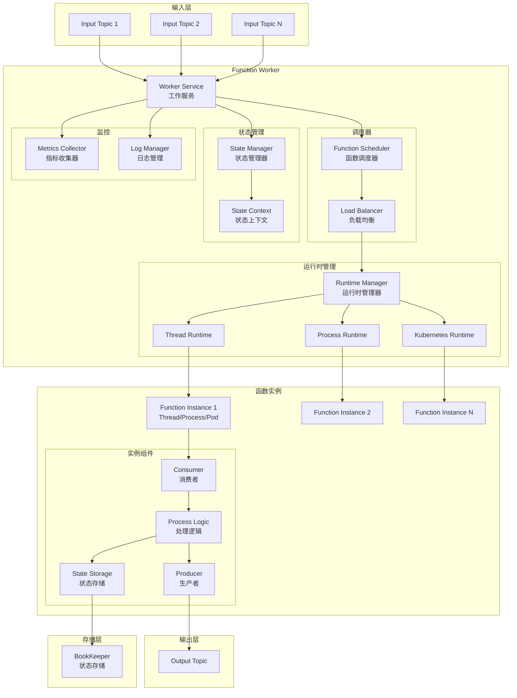

# Pulsar-08-Functions

## 模块概览

### 职责与定位

Pulsar Functions 是 Pulsar 内置的轻量级计算框架，提供无服务器（Serverless）的流处理能力。Functions 允许用户编写简单的处理逻辑，由 Pulsar 自动管理生命周期、扩缩容和故障恢复。

核心职责包括：

- **流处理**：消费消息、处理、发布结果，支持有状态和无状态处理
- **函数管理**：函数的部署、更新、删除、扩缩容
- **运行时管理**：支持 Java、Python、Go 函数运行时
- **执行模式**：Thread、Process、Kubernetes 三种模式
- **状态管理**：基于 BookKeeper 的分布式状态存储
- **指标收集**：函数执行指标、错误统计、性能监控
- **故障恢复**：自动重启失败的函数实例

### 核心概念

**Function**：
- 输入主题（Input Topics）：消费消息的来源
- 输出主题（Output Topic）：发布处理结果
- 处理逻辑（Process Logic）：用户自定义的业务逻辑
- 配置（Config）：并行度、资源限制、序列化格式

**Function Worker**：
- 负责函数的调度和执行
- 管理函数实例的生命周期
- 收集指标和日志

**执行模式**：
- **Thread 模式**：函数实例在 Worker JVM 线程中运行（轻量、共享资源）
- **Process 模式**：每个函数实例独立进程（隔离、独立资源）
- **Kubernetes 模式**：函数实例运行在 K8s Pod 中（云原生、弹性扩缩容）

---

## 模块架构图



### 架构图说明

#### Function Worker

**Worker Service**：
- 接收函数管理请求（部署、更新、删除）
- 协调多个 Worker 之间的任务分配
- 维护函数元数据

**Function Scheduler**：
- 根据负载均衡策略分配函数实例到 Worker
- 监控函数实例健康状态
- 处理故障转移

**Runtime Manager**：
- 管理不同运行时模式的函数实例
- 启动、停止、重启函数实例
- 资源隔离和限制

#### 函数实例

**Consumer**：
- 订阅输入主题
- 接收消息并传递给处理逻辑
- 管理消费位置

**Process Logic**：
- 用户自定义的处理函数
- 接收输入消息，执行业务逻辑
- 返回处理结果

**Producer**：
- 发布处理结果到输出主题
- 支持异步发送
- 错误重试机制

**State Storage**：
- 读写函数状态
- 基于 BookKeeper 的分布式存储
- 支持键值对存储

---

## 函数开发示例

### 1. 简单的 Java 函数

```java
import org.apache.pulsar.functions.api.Context;
import org.apache.pulsar.functions.api.Function;

/**
 * 简单的字符串转大写函数
 */
public class UpperCaseFunction implements Function<String, String> {
    
    @Override
    public String process(String input, Context context) {
        // 业务逻辑
        return input.toUpperCase();
    }
}
```

**部署函数**：

```bash
# 使用 pulsar-admin 部署
pulsar-admin functions create \
  --tenant public \
  --namespace default \
  --name uppercase-function \
  --inputs persistent://public/default/input-topic \
  --output persistent://public/default/output-topic \
  --classname com.example.UpperCaseFunction \
  --jar /path/to/function.jar
```

**使用 Java Admin Client 部署**：

```java
import org.apache.pulsar.client.admin.PulsarAdmin;
import org.apache.pulsar.common.functions.FunctionConfig;

public class DeployFunctionExample {
    public static void main(String[] args) throws Exception {
        PulsarAdmin admin = PulsarAdmin.builder()
            .serviceHttpUrl("http://localhost:8080")
            .build();
        
        FunctionConfig functionConfig = new FunctionConfig();
        functionConfig.setTenant("public");
        functionConfig.setNamespace("default");
        functionConfig.setName("uppercase-function");
        functionConfig.setClassName("com.example.UpperCaseFunction");
        functionConfig.setInputs(Collections.singleton("persistent://public/default/input-topic"));
        functionConfig.setOutput("persistent://public/default/output-topic");
        functionConfig.setParallelism(1);
        
        admin.functions().createFunctionWithUrl(functionConfig, "file:///path/to/function.jar");
        
        System.out.println("Function deployed successfully");
        
        admin.close();
    }
}
```

---

### 2. 使用 Context 的函数

```java
import org.apache.pulsar.functions.api.Context;
import org.apache.pulsar.functions.api.Function;
import org.slf4j.Logger;

public class AdvancedFunction implements Function<String, String> {
    
    @Override
    public String process(String input, Context context) throws Exception {
        // 获取 Logger
        Logger logger = context.getLogger();
        logger.info("Processing message: {}", input);
        
        // 获取消息属性
        String userId = context.getCurrentRecord().getProperties().get("userId");
        logger.info("User ID: {}", userId);
        
        // 获取函数配置
        String functionName = context.getFunctionName();
        String tenant = context.getTenant();
        String namespace = context.getNamespace();
        
        logger.info("Function: {}/{}/{}", tenant, namespace, functionName);
        
        // 记录指标
        context.recordMetric("processed_messages", 1);
        
        // 处理逻辑
        String result = processBusinessLogic(input, userId);
        
        // 返回结果
        return result;
    }
    
    private String processBusinessLogic(String input, String userId) {
        // 业务处理逻辑
        return String.format("Processed by user %s: %s", userId, input.toUpperCase());
    }
}
```

---

### 3. 有状态函数

```java
import org.apache.pulsar.functions.api.Context;
import org.apache.pulsar.functions.api.Function;

/**
 * 统计每个用户的消息数量
 */
public class UserCounterFunction implements Function<String, String> {
    
    @Override
    public String process(String input, Context context) throws Exception {
        // 从消息属性获取用户 ID
        String userId = context.getCurrentRecord().getProperties().get("userId");
        
        // 从状态存储读取计数
        long count = context.getState(userId) != null ? 
            Long.parseLong(new String((byte[]) context.getState(userId))) : 0L;
        
        // 增加计数
        count++;
        
        // 更新状态
        context.putState(userId, String.valueOf(count).getBytes());
        
        // 返回结果
        String result = String.format("User %s has sent %d messages", userId, count);
        context.getLogger().info(result);
        
        return result;
    }
}
```

**部署有状态函数**：

```bash
pulsar-admin functions create \
  --tenant public \
  --namespace default \
  --name user-counter \
  --inputs persistent://public/default/user-messages \
  --output persistent://public/default/user-stats \
  --classname com.example.UserCounterFunction \
  --jar /path/to/function.jar \
  --processing-guarantees EFFECTIVELY_ONCE
```

---

### 4. 多输入函数

```java
import org.apache.pulsar.functions.api.Context;
import org.apache.pulsar.functions.api.Function;

/**
 * 从多个主题接收消息并合并处理
 */
public class MultiInputFunction implements Function<String, String> {
    
    @Override
    public String process(String input, Context context) throws Exception {
        // 获取消息来源主题
        String sourceTopic = context.getCurrentRecord().getTopicName().orElse("unknown");
        
        context.getLogger().info("Received message from topic: {}", sourceTopic);
        
        // 根据来源主题执行不同逻辑
        if (sourceTopic.contains("orders")) {
            return processOrder(input);
        } else if (sourceTopic.contains("payments")) {
            return processPayment(input);
        } else {
            return "Unknown source: " + input;
        }
    }
    
    private String processOrder(String input) {
        return "ORDER: " + input;
    }
    
    private String processPayment(String input) {
        return "PAYMENT: " + input;
    }
}
```

**部署多输入函数**：

```bash
pulsar-admin functions create \
  --tenant public \
  --namespace default \
  --name multi-input-function \
  --inputs "persistent://public/default/orders,persistent://public/default/payments" \
  --output persistent://public/default/processed \
  --classname com.example.MultiInputFunction \
  --jar /path/to/function.jar
```

---

### 5. Python 函数

```python
from pulsar import Function

class WordCountFunction(Function):
    def process(self, input, context):
        # 分词
        words = input.split()
        
        # 统计每个词
        for word in words:
            # 从状态读取计数
            count = context.get_state(word)
            if count is None:
                count = 0
            
            # 增加计数
            count += 1
            
            # 更新状态
            context.put_state(word, count)
            
            # 记录日志
            context.get_logger().info(f"Word '{word}' count: {count}")
        
        return f"Processed {len(words)} words"
```

**部署 Python 函数**：

```bash
pulsar-admin functions create \
  --tenant public \
  --namespace default \
  --name word-count \
  --inputs persistent://public/default/text-input \
  --output persistent://public/default/word-stats \
  --py /path/to/function.py \
  --classname function.WordCountFunction \
  --processing-guarantees EFFECTIVELY_ONCE
```

---

### 6. Go 函数

```go
package main

import (
    "context"
    "fmt"
    "strings"
    
    "github.com/apache/pulsar/pulsar-function-go/pf"
)

func HandleRequest(ctx context.Context, input []byte) (output []byte, err error) {
    // 获取函数 Context
    fc, ok := pf.FromContext(ctx)
    if !ok {
        return nil, fmt.Errorf("failed to get function context")
    }
    
    // 记录日志
    fc.GetLogger().Info("Processing message")
    
    // 处理逻辑
    result := strings.ToUpper(string(input))
    
    // 记录指标
    fc.RecordMetric("processed_messages", 1)
    
    return []byte(result), nil
}

func main() {
    pf.Start(HandleRequest)
}
```

**部署 Go 函数**：

```bash
pulsar-admin functions create \
  --tenant public \
  --namespace default \
  --name go-function \
  --inputs persistent://public/default/input \
  --output persistent://public/default/output \
  --go /path/to/function.go
```

---

## 函数配置详解

### 函数配置参数

```java
FunctionConfig config = new FunctionConfig();

// 基本信息
config.setTenant("public");
config.setNamespace("default");
config.setName("my-function");
config.setClassName("com.example.MyFunction");

// 输入输出
config.setInputs(Arrays.asList("input-topic-1", "input-topic-2"));
config.setOutput("output-topic");

// 处理保证
config.setProcessingGuarantees(FunctionConfig.ProcessingGuarantees.EFFECTIVELY_ONCE);

// 并行度
config.setParallelism(3);  // 3 个并行实例

// 资源限制
Resources resources = new Resources();
resources.setCpu(0.5);         // 0.5 核 CPU
resources.setRam(512L);        // 512 MB 内存
resources.setDisk(1024L);      // 1 GB 磁盘
config.setResources(resources);

// 自动 ACK
config.setAutoAck(true);  // 自动确认消息

// 超时配置
config.setTimeout(60000);  // 60 秒超时

// 重试配置
config.setMaxMessageRetries(3);  // 最多重试 3 次
config.setDeadLetterTopic("my-function-dlq");  // 死信队列

// 自定义配置
Map<String, Object> userConfig = new HashMap<>();
userConfig.put("max_batch_size", 100);
userConfig.put("api_key", "secret");
config.setUserConfig(userConfig);

// Schema
config.setInputSpecs(Map.of(
    "input-topic-1", ConsumerConfig.builder()
        .schemaType("avro")
        .build()
));
config.setOutputSchemaType("json");

// 运行时
config.setRuntime(FunctionConfig.Runtime.JAVA);

// 日志主题
config.setLogTopic("my-function-logs");
```

---

## 函数管理 API

### 查询函数列表

```java
import org.apache.pulsar.client.admin.PulsarAdmin;
import java.util.Collection;

public class ListFunctionsExample {
    public static void main(String[] args) throws Exception {
        PulsarAdmin admin = PulsarAdmin.builder()
            .serviceHttpUrl("http://localhost:8080")
            .build();
        
        String tenant = "public";
        String namespace = "default";
        
        // 列出所有函数
        Collection<String> functions = admin.functions().getFunctions(tenant, namespace);
        
        System.out.println("Functions in " + tenant + "/" + namespace + ":");
        for (String functionName : functions) {
            System.out.println("  - " + functionName);
            
            // 查询函数详情
            FunctionConfig config = admin.functions().getFunction(tenant, namespace, functionName);
            System.out.println("    Inputs: " + config.getInputs());
            System.out.println("    Output: " + config.getOutput());
            System.out.println("    Parallelism: " + config.getParallelism());
        }
        
        admin.close();
    }
}
```

### 查询函数状态

```java
public class FunctionStatusExample {
    public static void main(String[] args) throws Exception {
        PulsarAdmin admin = PulsarAdmin.builder()
            .serviceHttpUrl("http://localhost:8080")
            .build();
        
        String tenant = "public";
        String namespace = "default";
        String functionName = "my-function";
        
        // 查询函数状态
        FunctionStatus status = admin.functions().getFunctionStatus(tenant, namespace, functionName);
        
        System.out.println("Function Status: " + status.getNumRunning() + "/" + status.getNumInstances());
        
        // 查询每个实例的状态
        for (FunctionStatus.FunctionInstanceStatus.FunctionInstanceStatusData instance : status.getInstances()) {
            System.out.println("\nInstance " + instance.getInstanceId() + ":");
            System.out.println("  Status: " + instance.getStatus().getRunning());
            System.out.println("  Received: " + instance.getStatus().getNumReceived());
            System.out.println("  Successfully processed: " + instance.getStatus().getNumSuccessfullyProcessed());
            System.out.println("  User exceptions: " + instance.getStatus().getNumUserExceptions());
            System.out.println("  System exceptions: " + instance.getStatus().getNumSystemExceptions());
            System.out.println("  Average latency: " + instance.getStatus().getAvgProcessLatency() + " ms");
        }
        
        admin.close();
    }
}
```

### 查询函数统计

```java
public class FunctionStatsExample {
    public static void main(String[] args) throws Exception {
        PulsarAdmin admin = PulsarAdmin.builder()
            .serviceHttpUrl("http://localhost:8080")
            .build();
        
        String tenant = "public";
        String namespace = "default";
        String functionName = "my-function";
        
        // 查询函数统计信息
        FunctionStats stats = admin.functions().getFunctionStats(tenant, namespace, functionName);
        
        System.out.println("=== Function Statistics ===");
        System.out.println("Received: " + stats.getReceivedTotal());
        System.out.println("Processed successfully: " + stats.getProcessedSuccessfullyTotal());
        System.out.println("User exceptions: " + stats.getUserExceptionsTotal());
        System.out.println("System exceptions: " + stats.getSystemExceptionsTotal());
        System.out.println("Average latency: " + stats.getAvgProcessLatency() + " ms");
        System.out.println("Last invocation: " + stats.getLastInvocation());
        
        // 查询每个实例的统计
        FunctionStats.FunctionInstanceStats instanceStats = stats.getInstances().get(0);
        System.out.println("\nInstance 0 metrics:");
        System.out.println("  1min rate: " + instanceStats.getMetrics().getOneMin().getRate());
        
        admin.close();
    }
}
```

### 更新函数

```java
public class UpdateFunctionExample {
    public static void main(String[] args) throws Exception {
        PulsarAdmin admin = PulsarAdmin.builder()
            .serviceHttpUrl("http://localhost:8080")
            .build();
        
        String tenant = "public";
        String namespace = "default";
        String functionName = "my-function";
        
        // 获取现有配置
        FunctionConfig config = admin.functions().getFunction(tenant, namespace, functionName);
        
        // 修改配置
        config.setParallelism(5);  // 扩容到 5 个实例
        config.setAutoAck(false);  // 禁用自动确认
        
        // 更新函数
        admin.functions().updateFunction(config, null);  // null 表示不更新代码
        
        System.out.println("Function updated successfully");
        
        // 或者更新代码和配置
        admin.functions().updateFunctionWithUrl(config, "file:///path/to/new-function.jar");
        
        admin.close();
    }
}
```

### 删除函数

```java
public class DeleteFunctionExample {
    public static void main(String[] args) throws Exception {
        PulsarAdmin admin = PulsarAdmin.builder()
            .serviceHttpUrl("http://localhost:8080")
            .build();
        
        String tenant = "public";
        String namespace = "default";
        String functionName = "my-function";
        
        // 删除函数
        admin.functions().deleteFunction(tenant, namespace, functionName);
        
        System.out.println("Function deleted successfully");
        
        admin.close();
    }
}
```

### 触发函数

```java
public class TriggerFunctionExample {
    public static void main(String[] args) throws Exception {
        PulsarAdmin admin = PulsarAdmin.builder()
            .serviceHttpUrl("http://localhost:8080")
            .build();
        
        String tenant = "public";
        String namespace = "default";
        String functionName = "my-function";
        
        // 手动触发函数（用于测试）
        String input = "test message";
        String result = admin.functions().triggerFunction(
            tenant, namespace, functionName, 
            null,  // topic (optional)
            input,
            null   // file (optional)
        );
        
        System.out.println("Function result: " + result);
        
        admin.close();
    }
}
```

---

## 最佳实践

### 1. 错误处理

```java
import org.apache.pulsar.functions.api.Context;
import org.apache.pulsar.functions.api.Function;

public class ErrorHandlingFunction implements Function<String, String> {
    
    @Override
    public String process(String input, Context context) {
        try {
            // 业务逻辑
            String result = processBusinessLogic(input);
            
            // 记录成功指标
            context.recordMetric("success_count", 1);
            
            return result;
            
        } catch (BusinessException e) {
            // 业务异常：记录日志，返回 null（不发送到输出主题）
            context.getLogger().error("Business error: {}", e.getMessage());
            context.recordMetric("business_error_count", 1);
            return null;
            
        } catch (Exception e) {
            // 系统异常：抛出异常，触发重试
            context.getLogger().error("System error", e);
            context.recordMetric("system_error_count", 1);
            throw new RuntimeException("Processing failed", e);
        }
    }
    
    private String processBusinessLogic(String input) throws BusinessException {
        // 业务处理逻辑
        if (input == null || input.isEmpty()) {
            throw new BusinessException("Invalid input");
        }
        return input.toUpperCase();
    }
    
    static class BusinessException extends Exception {
        public BusinessException(String message) {
            super(message);
        }
    }
}
```

### 2. 批量处理

```java
public class BatchProcessingFunction implements Function<String, Void> {
    
    private List<String> batch = new ArrayList<>();
    private static final int BATCH_SIZE = 100;
    
    @Override
    public Void process(String input, Context context) throws Exception {
        // 添加到批次
        batch.add(input);
        
        // 批次已满，执行批量处理
        if (batch.size() >= BATCH_SIZE) {
            processBatch(batch, context);
            batch.clear();
        }
        
        return null;
    }
    
    private void processBatch(List<String> messages, Context context) {
        context.getLogger().info("Processing batch of {} messages", messages.size());
        
        // 批量处理逻辑（例如批量写入数据库）
        // ...
        
        context.recordMetric("batches_processed", 1);
        context.recordMetric("messages_in_batch", messages.size());
    }
}
```

### 3. 监控与告警

```java
public class MonitoredFunction implements Function<String, String> {
    
    private long startTime = System.currentTimeMillis();
    private long messageCount = 0;
    
    @Override
    public String process(String input, Context context) throws Exception {
        long processingStart = System.nanoTime();
        
        try {
            // 业务处理
            String result = processBusinessLogic(input);
            
            // 记录处理延迟
            long processingTime = System.nanoTime() - processingStart;
            context.recordMetric("processing_latency_ms", processingTime / 1_000_000);
            
            // 记录吞吐量
            messageCount++;
            long elapsed = System.currentTimeMillis() - startTime;
            if (elapsed >= 60_000) {  // 每分钟
                double throughput = (double) messageCount / (elapsed / 1000.0);
                context.recordMetric("throughput_msg_per_sec", throughput);
                startTime = System.currentTimeMillis();
                messageCount = 0;
            }
            
            return result;
            
        } catch (Exception e) {
            // 记录错误
            context.recordMetric("error_count", 1);
            throw e;
        }
    }
    
    private String processBusinessLogic(String input) {
        return input.toUpperCase();
    }
}
```

---

## 性能调优

### 1. 并行度配置

```bash
# 增加并行度以提升吞吐量
pulsar-admin functions update \
  --tenant public \
  --namespace default \
  --name my-function \
  --parallelism 10  # 10 个并行实例
```

### 2. 资源限制

```bash
# 配置资源限制
pulsar-admin functions update \
  --tenant public \
  --namespace default \
  --name my-function \
  --cpu 1.0 \           # 1 核 CPU
  --ram 1073741824 \    # 1 GB 内存
  --disk 2147483648     # 2 GB 磁盘
```

### 3. 批量处理配置

```java
// 配置批量接收
ConsumerConfig consumerConfig = ConsumerConfig.builder()
    .receiverQueueSize(5000)  // 增大接收队列
    .build();

config.setInputSpecs(Map.of(
    "input-topic", consumerConfig
));
```

---

## 常见问题

### 问题 1：函数处理延迟高

**原因**：并行度不足、资源限制、批量大小不当

**解决方案**：
1. 增加并行度
2. 增加资源配置（CPU、内存）
3. 优化处理逻辑
4. 增大接收队列大小

### 问题 2：函数频繁重启

**原因**：内存溢出、处理超时、未捕获异常

**解决方案**：
1. 增加内存限制
2. 增加超时配置
3. 添加异常处理
4. 检查函数日志定位问题

---

**文档版本**：v1.0  
**对应模块版本**：Pulsar 4.2.0-SNAPSHOT  
**最后更新**：2025-10-05

