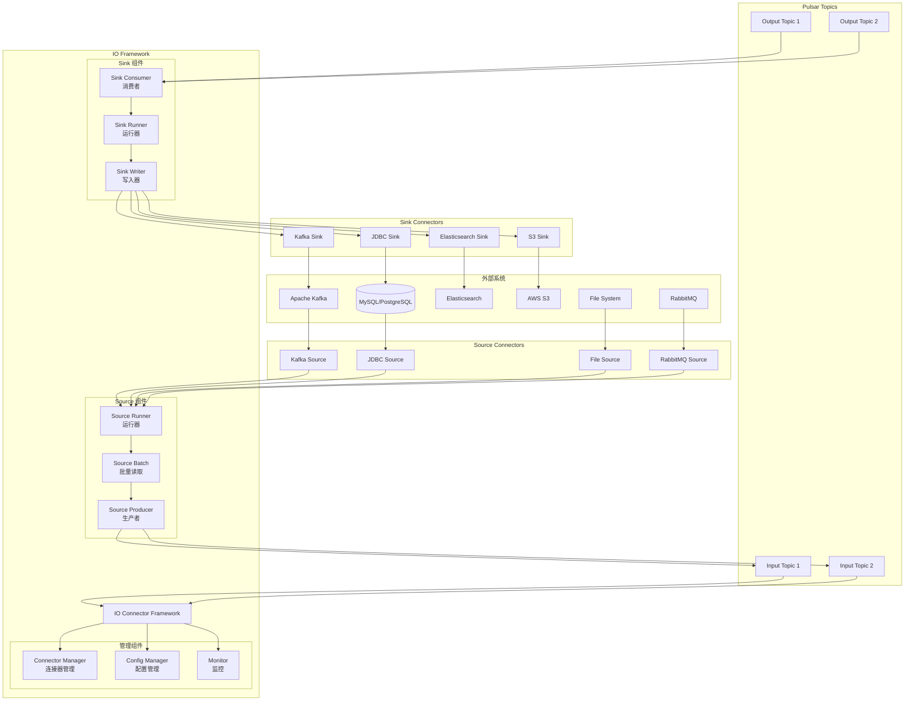

# Pulsar-09-IO

## 模块概览

### 职责与定位

Pulsar IO 是 Pulsar 的连接器框架，提供与外部系统集成的能力。通过 Source 和 Sink 连接器，Pulsar 可以从外部系统导入数据或将数据导出到外部系统，实现数据的双向流动。

核心职责包括：

- **Source Connector**：从外部系统读取数据并发布到 Pulsar 主题
- **Sink Connector**：从 Pulsar 主题消费数据并写入外部系统
- **连接器管理**：部署、配置、监控、更新、删除连接器
- **数据转换**：支持简单的数据格式转换
- **容错处理**：自动重试、死信队列、状态恢复
- **可扩展性**：支持自定义连接器开发

### 核心概念

**Source**：
- 从外部系统读取数据（如 Kafka、MySQL、文件）
- 将数据发布到 Pulsar 主题
- 支持批量和流式读取

**Sink**：
- 从 Pulsar 主题消费数据
- 将数据写入外部系统（如 Elasticsearch、JDBC、S3）
- 支持批量写入和事务

**Connector**：
- Source 或 Sink 的实现
- 可运行在 Function Worker 上
- 支持并行实例

---

## 模块架构图



### 架构图说明

#### Source Connector 流程

1. **Source Runner**：启动和管理 Source 实例
2. **批量读取**：从外部系统批量读取数据
3. **数据转换**：转换为 Pulsar 消息格式
4. **发布消息**：使用 Producer 发布到 Pulsar 主题
5. **状态管理**：记录读取进度，支持断点续传

#### Sink Connector 流程

1. **Sink Consumer**：订阅 Pulsar 主题
2. **消息接收**：批量接收消息
3. **数据转换**：转换为目标系统格式
4. **Sink Writer**：批量写入目标系统
5. **确认消息**：写入成功后确认 Pulsar 消息

---

## 内置 Connector 列表

### Source Connectors

| Connector | 说明 | 配置要点 |
|---|---|---|
| **Kafka Source** | 从 Kafka 导入数据 | bootstrap.servers、topic、group.id |
| **JDBC Source** | 从数据库读取（CDC） | jdbcUrl、query、poll.interval |
| **File Source** | 读取文件系统 | inputDirectory、fileFilter、pollInterval |
| **RabbitMQ Source** | 从 RabbitMQ 读取 | host、port、queue |
| **Debezium Source** | CDC（MySQL/PostgreSQL） | database.hostname、database.port |
| **Canal Source** | MySQL Binlog | canal.destination、canal.host |
| **Kinesis Source** | AWS Kinesis | awsRegion、streamName |

### Sink Connectors

| Connector | 说明 | 配置要点 |
|---|---|---|
| **Elasticsearch Sink** | 写入 Elasticsearch | elasticSearchUrl、indexName |
| **JDBC Sink** | 写入数据库 | jdbcUrl、tableName、batchSize |
| **Kafka Sink** | 导出到 Kafka | bootstrapServers、topic |
| **S3 Sink** | 写入 AWS S3 | bucket、region、partitioner |
| **MongoDB Sink** | 写入 MongoDB | mongoUri、database、collection |
| **Redis Sink** | 写入 Redis | redisHosts、keyPrefix |
| **HDFS3 Sink** | 写入 HDFS | hdfsConfigResources、directory |

---

## Source Connector 开发

### 1. 简单的 Source 实现

```java
import org.apache.pulsar.io.core.Source;
import org.apache.pulsar.io.core.SourceContext;
import org.apache.pulsar.functions.api.Record;

import java.util.Map;
import java.util.concurrent.BlockingQueue;
import java.util.concurrent.LinkedBlockingQueue;

/**
 * 简单的文件 Source
 * 从文件读取数据并发布到 Pulsar
 */
public class SimpleFileSource implements Source<String> {
    
    private BlockingQueue<Record<String>> queue;
    private BufferedReader reader;
    
    @Override
    public void open(Map<String, Object> config, SourceContext sourceContext) throws Exception {
        // 1. 初始化队列
        queue = new LinkedBlockingQueue<>(1000);
        
        // 2. 读取配置
        String filePath = (String) config.get("filePath");
        
        // 3. 打开文件
        reader = new BufferedReader(new FileReader(filePath));
        
        // 4. 启动读取线程
        new Thread(() -> {
            try {
                String line;
                while ((line = reader.readLine()) != null) {
                    // 创建 Record
                    Record<String> record = new SimpleRecord(line);
                    queue.put(record);
                }
            } catch (Exception e) {
                sourceContext.getLogger().error("Error reading file", e);
            }
        }).start();
    }
    
    @Override
    public Record<String> read() throws Exception {
        // 从队列获取数据
        return queue.take();
    }
    
    @Override
    public void close() throws Exception {
        if (reader != null) {
            reader.close();
        }
    }
    
    /**
     * 简单的 Record 实现
     */
    private static class SimpleRecord implements Record<String> {
        private final String value;
        
        public SimpleRecord(String value) {
            this.value = value;
        }
        
        @Override
        public String getValue() {
            return value;
        }
        
        @Override
        public void ack() {
            // 确认消息已处理
        }
        
        @Override
        public void fail() {
            // 标记消息处理失败
        }
    }
}
```

### 2. 批量读取的 Source

```java
import org.apache.pulsar.io.core.BatchSource;
import org.apache.pulsar.io.core.SourceContext;
import org.apache.pulsar.functions.api.Record;

import java.sql.*;
import java.util.ArrayList;
import java.util.List;
import java.util.Map;

/**
 * JDBC Source - 从数据库批量读取
 */
public class JDBCBatchSource implements BatchSource<String> {
    
    private Connection connection;
    private String query;
    private long lastId = 0;
    
    @Override
    public void open(Map<String, Object> config, SourceContext sourceContext) throws Exception {
        // 1. 读取配置
        String jdbcUrl = (String) config.get("jdbcUrl");
        String username = (String) config.get("username");
        String password = (String) config.get("password");
        query = (String) config.get("query");
        
        // 2. 建立数据库连接
        connection = DriverManager.getConnection(jdbcUrl, username, password);
    }
    
    @Override
    public void discover(Consumer<Record<String>> taskConsumer) throws Exception {
        // 发现需要处理的任务
        // 每个任务代表一个数据分片
        taskConsumer.accept(new TaskRecord("task-1"));
    }
    
    @Override
    public void prepare(byte[] instanceSplit) throws Exception {
        // 准备处理特定的数据分片
    }
    
    @Override
    public List<Record<String>> readNext() throws Exception {
        List<Record<String>> records = new ArrayList<>();
        
        // 增量查询（基于 ID）
        String sql = query + " WHERE id > ? LIMIT 100";
        PreparedStatement stmt = connection.prepareStatement(sql);
        stmt.setLong(1, lastId);
        
        ResultSet rs = stmt.executeQuery();
        while (rs.next()) {
            long id = rs.getLong("id");
            String data = rs.getString("data");
            
            records.add(new JDBCRecord(id, data));
            lastId = Math.max(lastId, id);
        }
        
        rs.close();
        stmt.close();
        
        return records;
    }
    
    @Override
    public void close() throws Exception {
        if (connection != null) {
            connection.close();
        }
    }
    
    private static class JDBCRecord implements Record<String> {
        private final long id;
        private final String data;
        
        public JDBCRecord(long id, String data) {
            this.id = id;
            this.data = data;
        }
        
        @Override
        public String getValue() {
            return data;
        }
        
        @Override
        public Map<String, String> getProperties() {
            return Map.of("id", String.valueOf(id));
        }
    }
}
```

---

## Sink Connector 开发

### 1. 简单的 Sink 实现

```java
import org.apache.pulsar.io.core.Sink;
import org.apache.pulsar.io.core.SinkContext;
import org.apache.pulsar.functions.api.Record;

import java.io.FileWriter;
import java.io.PrintWriter;
import java.util.Map;

/**
 * 简单的文件 Sink
 * 将 Pulsar 消息写入文件
 */
public class SimpleFileSink implements Sink<String> {
    
    private PrintWriter writer;
    
    @Override
    public void open(Map<String, Object> config, SinkContext sinkContext) throws Exception {
        // 1. 读取配置
        String outputFile = (String) config.get("outputFile");
        
        // 2. 打开文件
        writer = new PrintWriter(new FileWriter(outputFile, true));
    }
    
    @Override
    public void write(Record<String> record) throws Exception {
        // 写入数据
        String value = record.getValue();
        writer.println(value);
        writer.flush();
        
        // 确认消息
        record.ack();
    }
    
    @Override
    public void close() throws Exception {
        if (writer != null) {
            writer.close();
        }
    }
}
```

### 2. 批量写入的 Sink

```java
import org.apache.pulsar.io.core.Sink;
import org.apache.pulsar.io.core.SinkContext;
import org.apache.pulsar.functions.api.Record;

import java.sql.*;
import java.util.ArrayList;
import java.util.List;
import java.util.Map;

/**
 * JDBC Sink - 批量写入数据库
 */
public class JDBCBatchSink implements Sink<String> {
    
    private Connection connection;
    private String tableName;
    private List<Record<String>> batchRecords = new ArrayList<>();
    private int batchSize = 100;
    
    @Override
    public void open(Map<String, Object> config, SinkContext sinkContext) throws Exception {
        // 1. 读取配置
        String jdbcUrl = (String) config.get("jdbcUrl");
        String username = (String) config.get("username");
        String password = (String) config.get("password");
        tableName = (String) config.get("tableName");
        batchSize = (int) config.getOrDefault("batchSize", 100);
        
        // 2. 建立数据库连接
        connection = DriverManager.getConnection(jdbcUrl, username, password);
        connection.setAutoCommit(false);
    }
    
    @Override
    public void write(Record<String> record) throws Exception {
        // 添加到批次
        batchRecords.add(record);
        
        // 批次已满，执行批量写入
        if (batchRecords.size() >= batchSize) {
            flush();
        }
    }
    
    private void flush() throws Exception {
        if (batchRecords.isEmpty()) {
            return;
        }
        
        // 批量插入
        String sql = "INSERT INTO " + tableName + " (data) VALUES (?)";
        PreparedStatement stmt = connection.prepareStatement(sql);
        
        try {
            for (Record<String> record : batchRecords) {
                stmt.setString(1, record.getValue());
                stmt.addBatch();
            }
            
            // 执行批量操作
            stmt.executeBatch();
            connection.commit();
            
            // 确认所有消息
            for (Record<String> record : batchRecords) {
                record.ack();
            }
            
            batchRecords.clear();
            
        } catch (SQLException e) {
            connection.rollback();
            
            // 标记所有消息失败
            for (Record<String> record : batchRecords) {
                record.fail();
            }
            
            throw e;
        } finally {
            stmt.close();
        }
    }
    
    @Override
    public void close() throws Exception {
        // 关闭前刷新剩余数据
        flush();
        
        if (connection != null) {
            connection.close();
        }
    }
}
```

---

## Connector 部署与管理

### 1. 部署 Source Connector

```bash
# 使用 pulsar-admin 部署
pulsar-admin sources create \
  --tenant public \
  --namespace default \
  --name kafka-source \
  --source-type kafka \
  --destinationTopicName persistent://public/default/kafka-data \
  --source-config '{
    "bootstrapServers": "kafka-broker:9092",
    "topic": "source-topic",
    "groupId": "pulsar-source-group",
    "fetchMinBytes": 1024,
    "autoCommitEnabled": true,
    "autoCommitIntervalMs": 1000
  }' \
  --parallelism 3
```

**使用 Java Admin Client**：

```java
import org.apache.pulsar.client.admin.PulsarAdmin;
import org.apache.pulsar.common.io.SourceConfig;

public class DeploySourceExample {
    public static void main(String[] args) throws Exception {
        PulsarAdmin admin = PulsarAdmin.builder()
            .serviceHttpUrl("http://localhost:8080")
            .build();
        
        SourceConfig sourceConfig = SourceConfig.builder()
            .tenant("public")
            .namespace("default")
            .name("kafka-source")
            .archive("builtin://kafka")
            .topicName("persistent://public/default/kafka-data")
            .parallelism(3)
            .configs(Map.of(
                "bootstrapServers", "kafka-broker:9092",
                "topic", "source-topic",
                "groupId", "pulsar-source-group"
            ))
            .build();
        
        admin.sources().createSource(sourceConfig, "builtin://kafka");
        
        System.out.println("Source deployed successfully");
        
        admin.close();
    }
}
```

### 2. 部署 Sink Connector

```bash
# 部署 Elasticsearch Sink
pulsar-admin sinks create \
  --tenant public \
  --namespace default \
  --name elasticsearch-sink \
  --sink-type elasticsearch \
  --inputs persistent://public/default/logs \
  --sink-config '{
    "elasticSearchUrl": "http://elasticsearch:9200",
    "indexName": "pulsar-logs",
    "typeName": "_doc",
    "username": "elastic",
    "password": "password"
  }' \
  --parallelism 2
```

**使用 Java Admin Client**：

```java
import org.apache.pulsar.common.io.SinkConfig;

public class DeploySinkExample {
    public static void main(String[] args) throws Exception {
        PulsarAdmin admin = PulsarAdmin.builder()
            .serviceHttpUrl("http://localhost:8080")
            .build();
        
        SinkConfig sinkConfig = SinkConfig.builder()
            .tenant("public")
            .namespace("default")
            .name("elasticsearch-sink")
            .archive("builtin://elasticsearch")
            .inputs(List.of("persistent://public/default/logs"))
            .parallelism(2)
            .configs(Map.of(
                "elasticSearchUrl", "http://elasticsearch:9200",
                "indexName", "pulsar-logs",
                "typeName", "_doc"
            ))
            .build();
        
        admin.sinks().createSink(sinkConfig, "builtin://elasticsearch");
        
        System.out.println("Sink deployed successfully");
        
        admin.close();
    }
}
```

### 3. 查询 Connector 状态

```java
import org.apache.pulsar.common.io.ConnectorDefinition;

public class ConnectorStatusExample {
    public static void main(String[] args) throws Exception {
        PulsarAdmin admin = PulsarAdmin.builder()
            .serviceHttpUrl("http://localhost:8080")
            .build();
        
        String tenant = "public";
        String namespace = "default";
        
        // 查询所有 Source
        List<String> sources = admin.sources().listSources(tenant, namespace);
        System.out.println("Sources: " + sources);
        
        for (String sourceName : sources) {
            // 查询 Source 状态
            SourceStatus status = admin.sources().getSourceStatus(tenant, namespace, sourceName);
            
            System.out.println("\nSource: " + sourceName);
            System.out.println("  Instances: " + status.getNumInstances());
            System.out.println("  Running: " + status.getNumRunning());
            
            // 查询每个实例的状态
            for (SourceStatus.SourceInstanceStatus.SourceInstanceStatusData instance : status.getInstances()) {
                System.out.println("\n  Instance " + instance.getInstanceId() + ":");
                System.out.println("    Status: " + instance.getStatus().isRunning());
                System.out.println("    Records received: " + instance.getStatus().getNumReceivedFromSource());
                System.out.println("    Written to Pulsar: " + instance.getStatus().getNumWritten());
                System.out.println("    Errors: " + instance.getStatus().getNumSourceExceptions());
            }
        }
        
        // 查询所有 Sink
        List<String> sinks = admin.sinks().listSinks(tenant, namespace);
        System.out.println("\nSinks: " + sinks);
        
        for (String sinkName : sinks) {
            // 查询 Sink 状态
            SinkStatus status = admin.sinks().getSinkStatus(tenant, namespace, sinkName);
            
            System.out.println("\nSink: " + sinkName);
            System.out.println("  Instances: " + status.getNumInstances());
            System.out.println("  Running: " + status.getNumRunning());
        }
        
        admin.close();
    }
}
```

### 4. 更新 Connector

```java
public class UpdateConnectorExample {
    public static void main(String[] args) throws Exception {
        PulsarAdmin admin = PulsarAdmin.builder()
            .serviceHttpUrl("http://localhost:8080")
            .build();
        
        String tenant = "public";
        String namespace = "default";
        String sinkName = "elasticsearch-sink";
        
        // 获取现有配置
        SinkConfig config = admin.sinks().getSink(tenant, namespace, sinkName);
        
        // 修改配置
        config.setParallelism(5);  // 扩容到 5 个实例
        config.getConfigs().put("batchSize", "200");  // 增大批量大小
        
        // 更新 Sink
        admin.sinks().updateSink(config, null);
        
        System.out.println("Sink updated successfully");
        
        admin.close();
    }
}
```

### 5. 删除 Connector

```java
public class DeleteConnectorExample {
    public static void main(String[] args) throws Exception {
        PulsarAdmin admin = PulsarAdmin.builder()
            .serviceHttpUrl("http://localhost:8080")
            .build();
        
        String tenant = "public";
        String namespace = "default";
        
        // 删除 Source
        admin.sources().deleteSource(tenant, namespace, "kafka-source");
        System.out.println("Source deleted");
        
        // 删除 Sink
        admin.sinks().deleteSink(tenant, namespace, "elasticsearch-sink");
        System.out.println("Sink deleted");
        
        admin.close();
    }
}
```

---

## 实战案例

### 案例 1：MySQL CDC 到 Elasticsearch

**场景**：实时同步 MySQL 数据变更到 Elasticsearch

```bash
# 1. 部署 Debezium MySQL Source
pulsar-admin sources create \
  --tenant public \
  --namespace default \
  --name mysql-cdc-source \
  --source-type debezium-mysql \
  --destinationTopicName persistent://public/default/mysql-cdc \
  --source-config '{
    "database.hostname": "mysql-host",
    "database.port": "3306",
    "database.user": "debezium",
    "database.password": "password",
    "database.server.id": "184054",
    "database.server.name": "mydb",
    "database.whitelist": "inventory",
    "database.history.pulsar.topic": "persistent://public/default/dbhistory",
    "database.history.pulsar.service.url": "pulsar://localhost:6650"
  }' \
  --parallelism 1

# 2. 部署 Elasticsearch Sink
pulsar-admin sinks create \
  --tenant public \
  --namespace default \
  --name es-sink \
  --sink-type elasticsearch \
  --inputs persistent://public/default/mysql-cdc \
  --sink-config '{
    "elasticSearchUrl": "http://elasticsearch:9200",
    "indexName": "mysql_inventory",
    "schemaEnable": true,
    "bulkEnabled": true,
    "bulkActions": 100,
    "bulkFlushIntervalMs": 1000
  }' \
  --parallelism 2
```

### 案例 2：Kafka 到 Pulsar 再到 JDBC

**场景**：从 Kafka 导入数据，经过处理后写入数据库

```java
public class KafkaToPulsarToJDBCPipeline {
    public static void main(String[] args) throws Exception {
        PulsarAdmin admin = PulsarAdmin.builder()
            .serviceHttpUrl("http://localhost:8080")
            .build();
        
        // 1. 部署 Kafka Source
        SourceConfig kafkaSource = SourceConfig.builder()
            .tenant("public")
            .namespace("default")
            .name("kafka-import")
            .archive("builtin://kafka")
            .topicName("persistent://public/default/kafka-raw")
            .parallelism(3)
            .configs(Map.of(
                "bootstrapServers", "kafka-broker:9092",
                "topic", "orders",
                "groupId", "pulsar-kafka-import"
            ))
            .build();
        
        admin.sources().createSource(kafkaSource, "builtin://kafka");
        System.out.println("Kafka Source deployed");
        
        // 2. 部署 Function 进行数据转换
        FunctionConfig transformFunction = new FunctionConfig();
        transformFunction.setTenant("public");
        transformFunction.setNamespace("default");
        transformFunction.setName("transform-orders");
        transformFunction.setInputs(List.of("persistent://public/default/kafka-raw"));
        transformFunction.setOutput("persistent://public/default/transformed-orders");
        transformFunction.setClassName("com.example.TransformFunction");
        
        admin.functions().createFunctionWithUrl(transformFunction, "file:///path/to/function.jar");
        System.out.println("Transform Function deployed");
        
        // 3. 部署 JDBC Sink
        SinkConfig jdbcSink = SinkConfig.builder()
            .tenant("public")
            .namespace("default")
            .name("jdbc-export")
            .archive("builtin://jdbc-postgres")
            .inputs(List.of("persistent://public/default/transformed-orders"))
            .parallelism(2)
            .configs(Map.of(
                "jdbcUrl", "jdbc:postgresql://postgres:5432/orders_db",
                "tableName", "orders",
                "batchSize", "100"
            ))
            .build();
        
        admin.sinks().createSink(jdbcSink, "builtin://jdbc-postgres");
        System.out.println("JDBC Sink deployed");
        
        System.out.println("Pipeline deployed successfully");
        
        admin.close();
    }
}
```

---

## 最佳实践

### 1. 批量处理优化

```bash
# Sink 批量配置
pulsar-admin sinks update \
  --tenant public \
  --namespace default \
  --name my-sink \
  --sink-config '{
    "batchSize": 200,
    "batchTimeMs": 1000,
    "maxRetries": 3
  }'
```

### 2. 错误处理

```java
public class ResilientSink implements Sink<String> {
    
    private int maxRetries = 3;
    
    @Override
    public void write(Record<String> record) throws Exception {
        int attempt = 0;
        Exception lastException = null;
        
        while (attempt < maxRetries) {
            try {
                // 尝试写入
                doWrite(record);
                record.ack();
                return;
                
            } catch (Exception e) {
                lastException = e;
                attempt++;
                
                // 指数退避
                Thread.sleep(1000 * attempt);
            }
        }
        
        // 超过最大重试次数，标记失败
        record.fail();
        throw lastException;
    }
    
    private void doWrite(Record<String> record) throws Exception {
        // 实际写入逻辑
    }
}
```

### 3. 监控与告警

```java
public class MonitorConnectorsExample {
    public static void main(String[] args) throws Exception {
        PulsarAdmin admin = PulsarAdmin.builder()
            .serviceHttpUrl("http://localhost:8080")
            .build();
        
        String tenant = "public";
        String namespace = "default";
        
        // 监控所有 Sink
        List<String> sinks = admin.sinks().listSinks(tenant, namespace);
        
        for (String sinkName : sinks) {
            SinkStatus status = admin.sinks().getSinkStatus(tenant, namespace, sinkName);
            
            // 检查是否有实例失败
            long failedInstances = status.getInstances().stream()
                .filter(inst -> !inst.getStatus().isRunning())
                .count();
            
            if (failedInstances > 0) {
                System.err.println("ALERT: Sink " + sinkName + " has " + failedInstances + " failed instances");
            }
            
            // 检查错误率
            for (SinkStatus.SinkInstanceStatus.SinkInstanceStatusData inst : status.getInstances()) {
                long errors = inst.getStatus().getNumSinkExceptions();
                long written = inst.getStatus().getNumWrittenToSink();
                
                if (written > 0) {
                    double errorRate = (double) errors / written;
                    if (errorRate > 0.01) {  // 错误率 > 1%
                        System.err.println("ALERT: Sink " + sinkName + 
                            " instance " + inst.getInstanceId() + 
                            " has high error rate: " + errorRate);
                    }
                }
            }
        }
        
        admin.close();
    }
}
```

---

## 性能调优

### 1. 并行度配置

```bash
# 增加并行度以提升吞吐量
pulsar-admin sinks update \
  --tenant public \
  --namespace default \
  --name my-sink \
  --parallelism 10  # 10 个并行实例
```

### 2. 资源限制

```bash
# 配置资源限制
pulsar-admin sinks update \
  --tenant public \
  --namespace default \
  --name my-sink \
  --cpu 1.0 \
  --ram 2147483648  # 2 GB
```

### 3. 批量优化

```java
// Sink 配置优化
Map<String, Object> sinkConfig = Map.of(
    "batchSize", 500,           // 批量大小
    "batchTimeMs", 500,         // 批量超时
    "maxInFlightRequests", 10   // 并发请求数
);
```

---

## 常见问题

### 问题 1：Connector 启动失败

**原因**：配置错误、依赖缺失、权限不足

**解决方案**：
1. 检查配置参数
2. 查看 Connector 日志
3. 验证外部系统连接

### 问题 2：数据延迟高

**原因**：批量大小不当、并行度不足

**解决方案**：
1. 减小批量超时时间
2. 增加并行度
3. 优化网络配置

### 问题 3：数据丢失

**原因**：未正确确认消息、外部系统故障

**解决方案**：
1. 确保调用 `record.ack()`
2. 实现重试机制
3. 配置死信队列

---

**文档版本**：v1.0  
**对应模块版本**：Pulsar 4.2.0-SNAPSHOT  
**最后更新**：2025-10-05

