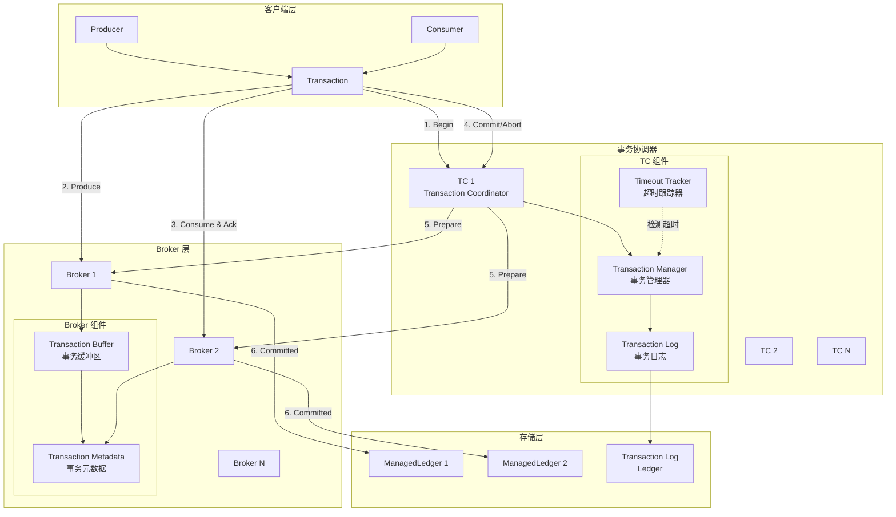

# Pulsar-10-Transaction

## 模块概览

### 职责与定位

Pulsar Transaction 提供分布式事务支持，实现跨分区、跨主题的 Exactly-Once 语义。事务模块确保消息的生产和消费操作的原子性，要么全部成功，要么全部失败。

核心职责包括：

- **事务协调**：管理事务的生命周期（Begin、Commit、Abort）
- **两阶段提交**：协调多个 Broker 参与的分布式事务
- **事务日志**：持久化事务状态到 BookKeeper
- **超时管理**：检测和中止超时事务
- **故障恢复**：恢复未完成的事务
- **Exactly-Once 语义**：保证消息恰好处理一次

### 核心概念

**Transaction**：
- 事务 ID（TxnID）：全局唯一标识符
- 事务状态：OPEN、COMMITTING、ABORTING、COMMITTED、ABORTED
- 事务超时：默认 3 小时

**Transaction Coordinator**：
- 管理事务元数据
- 协调两阶段提交
- 持久化事务日志

**Transaction Buffer**：
- 缓存事务性消息
- Commit 时释放消息
- Abort 时丢弃消息

---

## 模块架构图



### 架构图说明

#### Transaction Coordinator

**Transaction Manager**：
- 分配事务 ID
- 维护事务状态
- 协调两阶段提交

**Transaction Log**：
- 持久化事务元数据到 BookKeeper
- 记录参与事务的主题和分区
- 故障恢复时读取日志

**Timeout Tracker**：
- 定期检查超时事务
- 自动中止超时事务
- 清理事务资源

#### Broker Transaction Buffer

**缓存事务消息**：
- 事务性消息暂存在内存
- Commit 时写入 ManagedLedger
- Abort 时直接丢弃

**元数据管理**：
- 记录参与的事务 ID
- 跟踪事务状态
- 响应 TC 的 Prepare 请求

---

## 事务使用示例

### 1. 基础事务示例

```java
import org.apache.pulsar.client.api.*;

public class BasicTransactionExample {
    public static void main(String[] args) throws Exception {
        // 启用事务
        PulsarClient client = PulsarClient.builder()
            .serviceUrl("pulsar://localhost:6650")
            .enableTransaction(true)
            .build();
        
        Producer<String> producer = client.newProducer(Schema.STRING)
            .topic("persistent://public/default/output-topic")
            .sendTimeout(0, TimeUnit.SECONDS)  // 必须禁用超时
            .create();
        
        Consumer<String> consumer = client.newConsumer(Schema.STRING)
            .topic("persistent://public/default/input-topic")
            .subscriptionName("txn-sub")
            .subscribe();
        
        // 开启事务
        Transaction txn = client.newTransaction()
            .withTransactionTimeout(5, TimeUnit.MINUTES)
            .build()
            .get();
        
        try {
            // 1. 消费消息（事务性）
            Message<String> inputMsg = consumer.receive();
            consumer.acknowledgeAsync(inputMsg.getMessageId(), txn).get();
            
            System.out.println("Consumed: " + inputMsg.getValue());
            
            // 2. 处理业务逻辑
            String result = processMessage(inputMsg.getValue());
            
            // 3. 生产消息（事务性）
            producer.newMessage(txn)
                .value(result)
                .sendAsync()
                .get();
            
            System.out.println("Produced: " + result);
            
            // 4. 提交事务
            txn.commit().get();
            System.out.println("Transaction committed");
            
        } catch (Exception e) {
            // 5. 回滚事务
            txn.abort().get();
            System.err.println("Transaction aborted: " + e.getMessage());
        }
        
        producer.close();
        consumer.close();
        client.close();
    }
    
    private static String processMessage(String input) {
        return "Processed: " + input.toUpperCase();
    }
}
```

---

### 2. 跨分区事务

```java
public class CrossPartitionTransactionExample {
    public static void main(String[] args) throws Exception {
        PulsarClient client = PulsarClient.builder()
            .serviceUrl("pulsar://localhost:6650")
            .enableTransaction(true)
            .build();
        
        // 创建分区 Producer
        Producer<String> producer1 = client.newProducer(Schema.STRING)
            .topic("persistent://public/default/output-topic-1")
            .sendTimeout(0, TimeUnit.SECONDS)
            .create();
        
        Producer<String> producer2 = client.newProducer(Schema.STRING)
            .topic("persistent://public/default/output-topic-2")
            .sendTimeout(0, TimeUnit.SECONDS)
            .create();
        
        Consumer<String> consumer = client.newConsumer(Schema.STRING)
            .topic("persistent://public/default/input-topic")
            .subscriptionName("cross-partition-txn")
            .subscribe();
        
        Transaction txn = client.newTransaction()
            .withTransactionTimeout(10, TimeUnit.MINUTES)
            .build()
            .get();
        
        try {
            // 消费输入
            Message<String> inputMsg = consumer.receive();
            consumer.acknowledgeAsync(inputMsg.getMessageId(), txn).get();
            
            // 处理业务逻辑
            String data = inputMsg.getValue();
            String result1 = processForTopic1(data);
            String result2 = processForTopic2(data);
            
            // 跨分区生产
            producer1.newMessage(txn).value(result1).sendAsync().get();
            producer2.newMessage(txn).value(result2).sendAsync().get();
            
            System.out.println("Produced to multiple topics");
            
            // 提交事务
            txn.commit().get();
            System.out.println("Cross-partition transaction committed");
            
        } catch (Exception e) {
            txn.abort().get();
            System.err.println("Transaction aborted: " + e.getMessage());
        }
        
        producer1.close();
        producer2.close();
        consumer.close();
        client.close();
    }
    
    private static String processForTopic1(String data) {
        return "Topic1: " + data;
    }
    
    private static String processForTopic2(String data) {
        return "Topic2: " + data;
    }
}
```

---

### 3. 批量事务处理

```java
public class BatchTransactionExample {
    public static void main(String[] args) throws Exception {
        PulsarClient client = PulsarClient.builder()
            .serviceUrl("pulsar://localhost:6650")
            .enableTransaction(true)
            .build();
        
        Producer<String> producer = client.newProducer(Schema.STRING)
            .topic("persistent://public/default/output-topic")
            .sendTimeout(0, TimeUnit.SECONDS)
            .create();
        
        Consumer<String> consumer = client.newConsumer(Schema.STRING)
            .topic("persistent://public/default/input-topic")
            .subscriptionName("batch-txn-sub")
            .subscribe();
        
        // 批量处理大小
        int batchSize = 100;
        
        while (true) {
            Transaction txn = client.newTransaction()
                .withTransactionTimeout(10, TimeUnit.MINUTES)
                .build()
                .get();
            
            try {
                List<Message<String>> messages = new ArrayList<>();
                
                // 批量接收消息
                for (int i = 0; i < batchSize; i++) {
                    Message<String> msg = consumer.receive(1, TimeUnit.SECONDS);
                    if (msg == null) {
                        break;
                    }
                    messages.add(msg);
                }
                
                if (messages.isEmpty()) {
                    txn.abort().get();
                    continue;
                }
                
                System.out.println("Processing batch of " + messages.size() + " messages");
                
                // 批量处理
                List<String> results = processBatch(messages);
                
                // 批量确认输入消息
                for (Message<String> msg : messages) {
                    consumer.acknowledgeAsync(msg.getMessageId(), txn).get();
                }
                
                // 批量发送输出消息
                for (String result : results) {
                    producer.newMessage(txn).value(result).sendAsync().get();
                }
                
                // 提交事务
                txn.commit().get();
                System.out.println("Batch transaction committed");
                
            } catch (Exception e) {
                txn.abort().get();
                System.err.println("Batch transaction aborted: " + e.getMessage());
            }
        }
    }
    
    private static List<String> processBatch(List<Message<String>> messages) {
        List<String> results = new ArrayList<>();
        for (Message<String> msg : messages) {
            results.add("Processed: " + msg.getValue());
        }
        return results;
    }
}
```

---

### 4. 事务重试机制

```java
public class TransactionRetryExample {
    private static final int MAX_RETRIES = 3;
    
    public static void main(String[] args) throws Exception {
        PulsarClient client = PulsarClient.builder()
            .serviceUrl("pulsar://localhost:6650")
            .enableTransaction(true)
            .build();
        
        Producer<String> producer = client.newProducer(Schema.STRING)
            .topic("persistent://public/default/output-topic")
            .sendTimeout(0, TimeUnit.SECONDS)
            .create();
        
        Consumer<String> consumer = client.newConsumer(Schema.STRING)
            .topic("persistent://public/default/input-topic")
            .subscriptionName("retry-txn-sub")
            .subscribe();
        
        while (true) {
            Message<String> inputMsg = consumer.receive();
            
            boolean success = false;
            int attempt = 0;
            
            while (!success && attempt < MAX_RETRIES) {
                attempt++;
                Transaction txn = null;
                
                try {
                    txn = client.newTransaction()
                        .withTransactionTimeout(5, TimeUnit.MINUTES)
                        .build()
                        .get();
                    
                    // 确认输入消息
                    consumer.acknowledgeAsync(inputMsg.getMessageId(), txn).get();
                    
                    // 处理逻辑（可能失败）
                    String result = processWithPossibleFailure(inputMsg.getValue());
                    
                    // 发送输出消息
                    producer.newMessage(txn).value(result).sendAsync().get();
                    
                    // 提交事务
                    txn.commit().get();
                    success = true;
                    System.out.println("Transaction succeeded on attempt " + attempt);
                    
                } catch (Exception e) {
                    System.err.println("Transaction failed on attempt " + attempt + ": " + e.getMessage());
                    
                    if (txn != null) {
                        try {
                            txn.abort().get();
                        } catch (Exception abortEx) {
                            System.err.println("Failed to abort transaction: " + abortEx.getMessage());
                        }
                    }
                    
                    if (attempt >= MAX_RETRIES) {
                        // 超过最大重试次数，发送到死信队列
                        System.err.println("Max retries exceeded, sending to DLQ");
                        sendToDLQ(inputMsg, producer);
                        consumer.acknowledge(inputMsg);
                    } else {
                        // 指数退避
                        Thread.sleep(1000 * attempt);
                    }
                }
            }
        }
    }
    
    private static String processWithPossibleFailure(String input) throws Exception {
        // 模拟可能失败的处理逻辑
        if (Math.random() < 0.3) {
            throw new Exception("Random processing failure");
        }
        return "Processed: " + input;
    }
    
    private static void sendToDLQ(Message<String> msg, Producer<String> producer) throws Exception {
        producer.newMessage()
            .value(msg.getValue())
            .property("original-topic", msg.getTopicName())
            .property("failure-reason", "max-retries-exceeded")
            .send();
    }
}
```

---

## 事务状态管理

### 查询事务状态

```java
import org.apache.pulsar.client.api.transaction.Transaction;
import org.apache.pulsar.client.api.transaction.TxnID;

public class TransactionStatusExample {
    public static void main(String[] args) throws Exception {
        PulsarClient client = PulsarClient.builder()
            .serviceUrl("pulsar://localhost:6650")
            .enableTransaction(true)
            .build();
        
        Transaction txn = client.newTransaction()
            .withTransactionTimeout(5, TimeUnit.MINUTES)
            .build()
            .get();
        
        // 获取事务 ID
        TxnID txnId = txn.getTxnID();
        System.out.println("Transaction ID: " + txnId);
        System.out.println("  Most Significant Bits: " + txnId.getMostSigBits());
        System.out.println("  Least Significant Bits: " + txnId.getLeastSigBits());
        
        // 执行事务操作
        // ...
        
        // 提交或中止
        txn.commit().get();
        
        client.close();
    }
}
```

---

## 事务配置

### Client 配置

```java
PulsarClient client = PulsarClient.builder()
    .serviceUrl("pulsar://localhost:6650")
    .enableTransaction(true)  // 启用事务
    .build();
```

### Transaction 配置

```java
Transaction txn = client.newTransaction()
    .withTransactionTimeout(10, TimeUnit.MINUTES)  // 事务超时
    .build()
    .get();
```

**事务超时说明**：
- 默认超时：3 小时
- 超时后自动中止
- 建议根据业务需求设置合理超时时间

### Producer 配置（事务）

```java
Producer<String> producer = client.newProducer(Schema.STRING)
    .topic("my-topic")
    .sendTimeout(0, TimeUnit.SECONDS)  // 必须禁用超时（设为 0）
    .create();
```

**重要**：事务性 Producer 必须禁用 `sendTimeout`，否则会导致事务失败。

---

## 事务性能优化

### 1. 批量操作

```java
// 批量发送消息
List<CompletableFuture<MessageId>> futures = new ArrayList<>();
for (String message : messages) {
    futures.add(producer.newMessage(txn).value(message).sendAsync());
}

// 等待所有发送完成
CompletableFuture.allOf(futures.toArray(new CompletableFuture[0])).get();
```

### 2. 并发事务

```java
// 使用线程池并发处理多个事务
ExecutorService executor = Executors.newFixedThreadPool(10);

for (int i = 0; i < 100; i++) {
    executor.submit(() -> {
        Transaction txn = client.newTransaction().build().get();
        try {
            // 事务操作
            performTransactionOperations(txn);
            txn.commit().get();
        } catch (Exception e) {
            txn.abort().get();
        }
    });
}

executor.shutdown();
executor.awaitTermination(1, TimeUnit.HOURS);
```

### 3. 减少事务范围

```java
// BAD: 事务范围过大
Transaction txn = client.newTransaction().build().get();
for (int i = 0; i < 10000; i++) {
    producer.newMessage(txn).value("msg-" + i).sendAsync().get();
}
txn.commit().get();

// GOOD: 分批事务
for (int batch = 0; batch < 100; batch++) {
    Transaction txn = client.newTransaction().build().get();
    for (int i = 0; i < 100; i++) {
        producer.newMessage(txn).value("msg-" + i).sendAsync().get();
    }
    txn.commit().get();
}
```

---

## 事务最佳实践

### 1. 错误处理

```java
Transaction txn = null;
try {
    txn = client.newTransaction().build().get();
    
    // 事务操作
    performTransactionOperations(txn);
    
    // 提交
    txn.commit().get();
    
} catch (Exception e) {
    // 记录日志
    logger.error("Transaction failed", e);
    
    // 回滚
    if (txn != null) {
        try {
            txn.abort().get();
        } catch (Exception abortEx) {
            logger.error("Failed to abort transaction", abortEx);
        }
    }
    
    // 根据错误类型决定是否重试
    if (isRetryable(e)) {
        // 重试逻辑
    } else {
        // 发送到死信队列或告警
    }
}
```

### 2. 超时处理

```java
// 设置合理的超时时间
Transaction txn = client.newTransaction()
    .withTransactionTimeout(5, TimeUnit.MINUTES)  // 根据业务需求设置
    .build()
    .get();

// 在超时前完成事务
long startTime = System.currentTimeMillis();
long timeoutMillis = TimeUnit.MINUTES.toMillis(5);

try {
    performTransactionOperations(txn);
    
    // 检查是否接近超时
    long elapsed = System.currentTimeMillis() - startTime;
    if (elapsed > timeoutMillis * 0.9) {  // 90% 超时时间
        logger.warn("Transaction close to timeout, aborting");
        txn.abort().get();
    } else {
        txn.commit().get();
    }
    
} catch (Exception e) {
    txn.abort().get();
}
```

### 3. 资源管理

```java
// 使用 try-with-resources（Java 7+）
try (Transaction txn = client.newTransaction().build().get()) {
    // 事务操作
    performTransactionOperations(txn);
    
    // 提交
    txn.commit().get();
} catch (Exception e) {
    // 异常处理（txn 会自动关闭）
}
```

---

## 监控与调试

### 查询事务统计

```java
import org.apache.pulsar.client.admin.PulsarAdmin;
import org.apache.pulsar.common.policies.data.TransactionCoordinatorStats;

public class TransactionMonitoring {
    public static void main(String[] args) throws Exception {
        PulsarAdmin admin = PulsarAdmin.builder()
            .serviceHttpUrl("http://localhost:8080")
            .build();
        
        // 查询事务协调器统计
        for (int i = 0; i < 16; i++) {  // 默认 16 个 TC
            TransactionCoordinatorStats stats = admin.transactions()
                .getCoordinatorStatsByIdAsync(i).get();
            
            System.out.println("TC " + i + " Statistics:");
            System.out.println("  Active transactions: " + stats.state);
            // 更多统计信息
        }
        
        admin.close();
    }
}
```

---

## 常见问题

### 问题 1：事务提交失败

**现象**：`TransactionConflictException` 或 `TransactionCoordinatorNotFound`

**原因**：
- Transaction Coordinator 不可用
- 事务超时
- 网络问题

**解决方案**：
1. 检查 TC 健康状态
2. 增加事务超时时间
3. 实现重试机制

### 问题 2：事务性能差

**原因**：
- 事务范围过大
- 顺序执行太多事务
- Transaction Coordinator 负载过高

**解决方案**：
1. 减小事务范围，分批处理
2. 并发执行多个事务
3. 增加 TC 数量（需配置）

### 问题 3：消息重复消费

**现象**：Exactly-Once 语义未生效

**原因**：
- 未使用事务性确认
- Consumer 不支持事务
- 事务回滚后消息重新投递

**解决方案**：
1. 确保使用 `consumer.acknowledgeAsync(msgId, txn)`
2. 实现业务侧幂等处理
3. 检查事务提交是否成功

---

## 事务限制

1. **事务超时**：默认最大 3 小时，可配置
2. **事务大小**：建议单个事务操作 < 10000 条消息
3. **并发事务数**：受 Transaction Coordinator 容量限制
4. **Producer 配置**：必须禁用 `sendTimeout`
5. **不支持**：非持久化主题、Reader 模式

---

**文档版本**：v1.0  
**对应模块版本**：Pulsar 4.2.0-SNAPSHOT  
**最后更新**：2025-10-05

