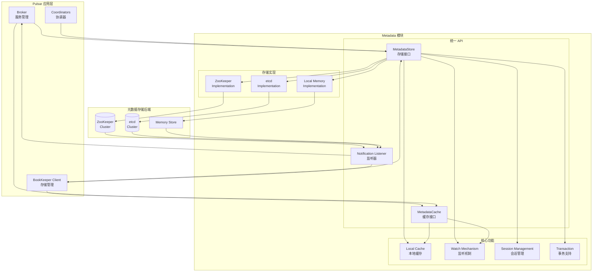
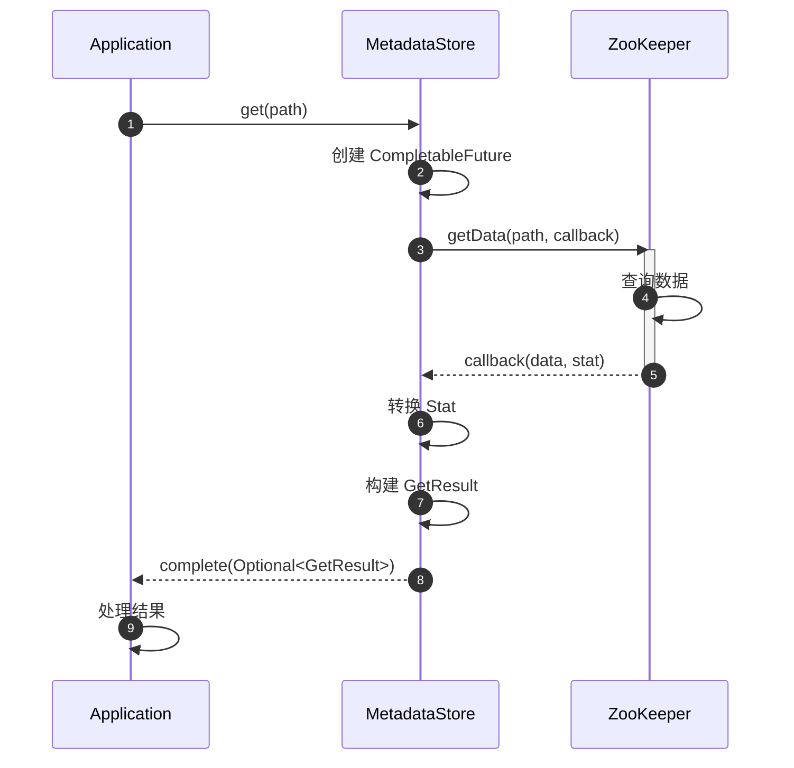

# Pulsar-11-Metadata

## 模块概览

### 职责与定位

Pulsar Metadata 模块是 Pulsar 的元数据存储抽象层，提供统一的 API 来操作元数据存储后端（ZooKeeper 或 etcd）。该模块屏蔽了底层存储的差异，使 Pulsar 可以灵活切换元数据存储实现。

核心职责包括：

- **统一抽象**：为不同元数据存储提供统一的 API 接口
- **键值操作**：支持 get、put、delete、exists 等基本操作
- **监听机制**：支持对键或路径的变更监听（Watch）
- **事务支持**：提供批量操作的事务语义
- **会话管理**：管理与元数据存储的连接和会话
- **缓存优化**：内置缓存机制，减少对后端存储的访问

### 核心概念

**MetadataStore**：
- 元数据存储的抽象接口
- 支持 ZooKeeper 和 etcd 两种实现
- 提供同步和异步操作 API

**MetadataCache**：
- 元数据缓存接口
- 自动监听后端变更
- 本地缓存热点数据

**Notification**：
- 元数据变更通知
- 支持 Created、Modified、Deleted 事件
- 触发回调函数

---

## 模块架构图



### 架构图说明

#### 层次划分

1. **应用层**：Broker、BookKeeper Client、各种协调器
2. **抽象层**：统一的 MetadataStore 和 MetadataCache API
3. **实现层**：ZooKeeper、etcd、Local Memory 三种实现
4. **后端层**：实际的存储集群

#### 核心特性

- **存储抽象**：应用层不感知底层存储类型
- **自动监听**：后端数据变更自动通知到应用
- **本地缓存**：热点数据缓存在内存，减少网络开销
- **会话管理**：自动处理连接断开和重连

---

## 核心接口与数据结构

### 1. MetadataStore 接口

```java
package org.apache.pulsar.metadata.api;

import java.util.List;
import java.util.Optional;
import java.util.concurrent.CompletableFuture;

/**
 * MetadataStore - 元数据存储抽象接口
 * 
 * 提供键值存储的基本操作
 * 支持同步和异步两种模式
 */
public interface MetadataStore extends AutoCloseable {
    
    /**
     * 获取指定路径的数据
     * 
     * @param path 数据路径（如 /admin/policies/public/default）
     * @return CompletableFuture，包含 Optional<GetResult>
     */
    CompletableFuture<Optional<GetResult>> get(String path);
    
    /**
     * 获取指定路径的子节点列表
     * 
     * @param path 父节点路径
     * @return CompletableFuture，包含子节点名称列表
     */
    CompletableFuture<List<String>> getChildren(String path);
    
    /**
     * 检查指定路径是否存在
     * 
     * @param path 数据路径
     * @return CompletableFuture<Boolean>
     */
    CompletableFuture<Boolean> exists(String path);
    
    /**
     * 存储数据到指定路径
     * 
     * @param path 数据路径
     * @param value 数据内容（字节数组）
     * @param expectedVersion 期望的版本号（用于 CAS 操作，-1 表示不检查）
     * @return CompletableFuture，包含 Stat（元数据统计信息）
     */
    CompletableFuture<Stat> put(String path, byte[] value, 
                                 Optional<Long> expectedVersion);
    
    /**
     * 删除指定路径的数据
     * 
     * @param path 数据路径
     * @param expectedVersion 期望的版本号（用于 CAS 操作）
     * @return CompletableFuture<Void>
     */
    CompletableFuture<Void> delete(String path, Optional<Long> expectedVersion);
    
    /**
     * 注册监听器，监听指定路径的变更
     * 
     * @param path 监听路径
     * @param listener 监听器实例
     */
    void registerListener(Consumer<Notification> listener);
    
    /**
     * 获取元数据存储的名称
     */
    String getMetadataStoreName();
}
```

### 2. MetadataCache 接口

```java
package org.apache.pulsar.metadata.api;

import java.util.Optional;
import java.util.concurrent.CompletableFuture;
import java.util.function.Function;

/**
 * MetadataCache - 元数据缓存接口
 * 
 * 自动监听后端存储变更
 * 本地缓存热点数据，提升读性能
 * 
 * @param <T> 缓存对象的类型
 */
public interface MetadataCache<T> {
    
    /**
     * 从缓存获取数据
     * 
     * 1. 如果本地缓存存在，直接返回
     * 2. 如果缓存不存在，从 MetadataStore 读取
     * 3. 自动反序列化为对象 T
     * 4. 缓存到本地
     * 
     * @param path 数据路径
     * @return CompletableFuture，包含 Optional<T>
     */
    CompletableFuture<Optional<T>> get(String path);
    
    /**
     * 从缓存获取数据（带刷新选项）
     * 
     * @param path 数据路径
     * @param readFromStore 是否强制从后端读取
     * @return CompletableFuture，包含 Optional<T>
     */
    CompletableFuture<Optional<T>> get(String path, boolean readFromStore);
    
    /**
     * 获取所有缓存条目
     * 
     * @param path 父路径
     * @return CompletableFuture，包含 Map<路径, T>
     */
    CompletableFuture<Map<String, T>> getChildren(String path);
    
    /**
     * 刷新缓存（重新从后端加载）
     * 
     * @param path 数据路径
     * @return CompletableFuture<Optional<T>>
     */
    CompletableFuture<Optional<T>> refresh(String path);
    
    /**
     * 清空本地缓存
     */
    void clear();
    
    /**
     * 创建 MetadataCache 实例
     * 
     * @param store MetadataStore 实例
     * @param clazz 缓存对象的 Class
     * @return MetadataCache<T> 实例
     */
    static <T> MetadataCache<T> create(MetadataStore store, Class<T> clazz) {
        // 实现省略
    }
}
```

### 3. Notification 数据结构

```java
package org.apache.pulsar.metadata.api;

/**
 * Notification - 元数据变更通知
 */
public class Notification {
    
    /**
     * 通知类型
     */
    public enum NotificationType {
        Created,    // 节点创建
        Deleted,    // 节点删除
        Modified,   // 节点修改
        ChildrenChanged  // 子节点变更
    }
    
    private final NotificationType type;
    private final String path;
    
    public Notification(NotificationType type, String path) {
        this.type = type;
        this.path = path;
    }
    
    public NotificationType getType() {
        return type;
    }
    
    public String getPath() {
        return path;
    }
}
```

### 4. Stat 数据结构

```java
package org.apache.pulsar.metadata.api;

/**
 * Stat - 元数据节点的统计信息
 */
public class Stat {
    private final String path;
    private final long version;           // 版本号（每次修改递增）
    private final long creationTimestamp; // 创建时间戳
    private final long modificationTimestamp; // 最后修改时间戳
    private final boolean ephemeral;      // 是否为临时节点
    private final boolean createdBySelf;  // 是否由当前会话创建
    
    // Getter 方法省略
}
```

---

## 核心 API 详解

### API 1：get - 获取元数据

#### 基本信息

- **方法签名**：`CompletableFuture<Optional<GetResult>> get(String path)`
- **功能**：从元数据存储读取指定路径的数据
- **幂等性**：是（读操作）

#### 请求参数

| 参数 | 类型 | 必填 | 说明 |
|---|---|:---:|---|
| path | String | ✅ | 元数据路径（如 `/admin/policies/public/default`） |

#### 响应结构

```java
public class GetResult {
    private final Stat stat;       // 节点统计信息
    private final byte[] value;    // 节点数据（字节数组）
    
    public Stat getStat() {
        return stat;
    }
    
    public byte[] getValue() {
        return value;
    }
}
```

#### 核心实现（ZooKeeper）

```java
package org.apache.pulsar.metadata.impl;

import org.apache.zookeeper.AsyncCallback;
import org.apache.zookeeper.ZooKeeper;
import org.apache.zookeeper.data.Stat;

public class ZKMetadataStore implements MetadataStore {
    
    private final ZooKeeper zk;
    
    @Override
    public CompletableFuture<Optional<GetResult>> get(String path) {
        CompletableFuture<Optional<GetResult>> future = new CompletableFuture<>();
        
        // 异步获取数据
        zk.getData(path, false, (rc, path1, ctx, data, stat) -> {
            if (rc == Code.OK.intValue()) {
                // 转换 ZooKeeper Stat 为 Pulsar Stat
                Stat pulsarStat = convertStat(stat);
                GetResult result = new GetResult(pulsarStat, data);
                future.complete(Optional.of(result));
                
            } else if (rc == Code.NONODE.intValue()) {
                // 节点不存在
                future.complete(Optional.empty());
                
            } else {
                // 其他错误
                future.completeExceptionally(
                    new MetadataStoreException("Failed to get " + path)
                );
            }
        }, null);
        
        return future;
    }
    
    private Stat convertStat(org.apache.zookeeper.data.Stat zkStat) {
        return new Stat(
            zkStat.getCzxid(),         // 创建事务 ID
            zkStat.getMzxid(),         // 修改事务 ID
            zkStat.getVersion(),       // 版本号
            zkStat.getCtime(),         // 创建时间
            zkStat.getMtime(),         // 修改时间
            zkStat.getEphemeralOwner() != 0  // 是否临时节点
        );
    }
}
```

#### 使用示例

```java
import org.apache.pulsar.metadata.api.MetadataStore;
import org.apache.pulsar.metadata.api.GetResult;

public class MetadataGetExample {
    public static void main(String[] args) throws Exception {
        // 创建 MetadataStore
        MetadataStore store = MetadataStoreFactory.create(
            "zk:localhost:2181",
            MetadataStoreConfig.builder().build()
        );
        
        String path = "/admin/policies/public/default";
        
        // 异步获取数据
        store.get(path).thenAccept(optResult -> {
            if (optResult.isPresent()) {
                GetResult result = optResult.get();
                byte[] data = result.getValue();
                long version = result.getStat().getVersion();
                
                System.out.println("Data: " + new String(data));
                System.out.println("Version: " + version);
            } else {
                System.out.println("Path not found: " + path);
            }
        }).exceptionally(ex -> {
            System.err.println("Error: " + ex.getMessage());
            return null;
        });
        
        // 等待完成
        Thread.sleep(1000);
        
        store.close();
    }
}
```

#### 时序图



---

### API 2：put - 存储元数据

#### 基本信息

- **方法签名**：`CompletableFuture<Stat> put(String path, byte[] value, Optional<Long> expectedVersion)`
- **功能**：存储数据到指定路径，支持 CAS（Compare-And-Set）
- **幂等性**：否（写操作，使用 expectedVersion 可实现幂等）

#### 请求参数

| 参数 | 类型 | 必填 | 说明 |
|---|---|:---:|---|
| path | String | ✅ | 元数据路径 |
| value | byte[] | ✅ | 数据内容 |
| expectedVersion | Optional<Long> | ❌ | 期望的版本号（-1 或空表示不检查版本） |

#### 核心实现

```java
public class ZKMetadataStore implements MetadataStore {
    
    @Override
    public CompletableFuture<Stat> put(String path, byte[] value, 
                                       Optional<Long> expectedVersion) {
        CompletableFuture<Stat> future = new CompletableFuture<>();
        
        // 1. 检查节点是否存在
        zk.exists(path, false, (rc1, path1, ctx1, stat1) -> {
            if (rc1 == Code.OK.intValue()) {
                // 节点存在，执行更新
                updateNode(path, value, expectedVersion, stat1, future);
                
            } else if (rc1 == Code.NONODE.intValue()) {
                // 节点不存在，创建节点
                createNode(path, value, future);
                
            } else {
                future.completeExceptionally(
                    new MetadataStoreException("Failed to check existence")
                );
            }
        }, null);
        
        return future;
    }
    
    private void updateNode(String path, byte[] value, 
                           Optional<Long> expectedVersion,
                           org.apache.zookeeper.data.Stat existingStat,
                           CompletableFuture<Stat> future) {
        // 版本检查
        int version = expectedVersion.map(Long::intValue)
                                    .orElse(-1);
        
        zk.setData(path, value, version, (rc, path1, ctx, stat) -> {
            if (rc == Code.OK.intValue()) {
                future.complete(convertStat(stat));
                
            } else if (rc == Code.BADVERSION.intValue()) {
                // 版本冲突
                future.completeExceptionally(
                    new BadVersionException("Version mismatch")
                );
                
            } else {
                future.completeExceptionally(
                    new MetadataStoreException("Failed to update")
                );
            }
        }, null);
    }
    
    private void createNode(String path, byte[] value, 
                           CompletableFuture<Stat> future) {
        // 创建持久节点
        zk.create(path, value, 
                 ZooDefs.Ids.OPEN_ACL_UNSAFE,
                 CreateMode.PERSISTENT,
                 (rc, path1, ctx, name) -> {
            if (rc == Code.OK.intValue()) {
                // 获取创建的节点信息
                zk.getData(path, false, (rc2, path2, ctx2, data, stat) -> {
                    if (rc2 == Code.OK.intValue()) {
                        future.complete(convertStat(stat));
                    }
                }, null);
                
            } else if (rc == Code.NODEEXISTS.intValue()) {
                // 并发创建，重试更新
                put(path, value, Optional.empty())
                    .whenComplete((stat, ex) -> {
                        if (ex != null) {
                            future.completeExceptionally(ex);
                        } else {
                            future.complete(stat);
                        }
                    });
                
            } else {
                future.completeExceptionally(
                    new MetadataStoreException("Failed to create")
                );
            }
        }, null);
    }
}
```

#### 使用示例

```java
public class MetadataPutExample {
    public static void main(String[] args) throws Exception {
        MetadataStore store = MetadataStoreFactory.create(
            "zk:localhost:2181",
            MetadataStoreConfig.builder().build()
        );
        
        String path = "/test/config";
        byte[] value = "{\"key\":\"value\"}".getBytes();
        
        // 1. 无版本检查的 put
        store.put(path, value, Optional.empty())
            .thenAccept(stat -> {
                System.out.println("Put success, version: " + stat.getVersion());
            });
        
        // 2. 带版本检查的 CAS 操作
        store.get(path).thenCompose(optResult -> {
            if (optResult.isPresent()) {
                GetResult result = optResult.get();
                long currentVersion = result.getStat().getVersion();
                
                // 修改数据
                byte[] newValue = "{\"key\":\"new_value\"}".getBytes();
                
                // CAS 更新
                return store.put(path, newValue, Optional.of(currentVersion));
            } else {
                return CompletableFuture.failedFuture(
                    new Exception("Path not found")
                );
            }
        }).thenAccept(stat -> {
            System.out.println("CAS success, new version: " + stat.getVersion());
        }).exceptionally(ex -> {
            if (ex.getCause() instanceof BadVersionException) {
                System.err.println("Version conflict, retry needed");
            }
            return null;
        });
        
        Thread.sleep(2000);
        store.close();
    }
}
```

---

### API 3：registerListener - 监听变更

#### 基本信息

- **方法签名**：`void registerListener(Consumer<Notification> listener)`
- **功能**：注册监听器，接收元数据变更通知
- **幂等性**：是

#### 核心实现

```java
public class ZKMetadataStore implements MetadataStore {
    
    private final CopyOnWriteArrayList<Consumer<Notification>> listeners 
        = new CopyOnWriteArrayList<>();
    
    @Override
    public void registerListener(Consumer<Notification> listener) {
        listeners.add(listener);
    }
    
    /**
     * 监听指定路径的变更
     */
    private void watchPath(String path) {
        // 监听节点数据变更
        zk.getData(path, event -> {
            if (event.getType() == EventType.NodeDataChanged) {
                notifyListeners(new Notification(
                    NotificationType.Modified, 
                    event.getPath()
                ));
                
                // 重新设置 watch
                watchPath(event.getPath());
                
            } else if (event.getType() == EventType.NodeDeleted) {
                notifyListeners(new Notification(
                    NotificationType.Deleted, 
                    event.getPath()
                ));
            }
        }, (rc, path1, ctx, data, stat) -> {
            // getData 回调
        }, null);
    }
    
    /**
     * 通知所有监听器
     */
    private void notifyListeners(Notification notification) {
        for (Consumer<Notification> listener : listeners) {
            try {
                listener.accept(notification);
            } catch (Exception e) {
                // 此处省略错误处理和日志记录
            }
        }
    }
}
```

#### 使用示例

```java
public class MetadataListenerExample {
    public static void main(String[] args) throws Exception {
        MetadataStore store = MetadataStoreFactory.create(
            "zk:localhost:2181",
            MetadataStoreConfig.builder().build()
        );
        
        // 注册监听器
        store.registerListener(notification -> {
            System.out.println("Notification received:");
            System.out.println("  Type: " + notification.getType());
            System.out.println("  Path: " + notification.getPath());
            
            // 根据类型处理
            switch (notification.getType()) {
                case Created:
                    System.out.println("  Node created");
                    break;
                case Modified:
                    System.out.println("  Node modified");
                    // 重新加载数据
                    store.get(notification.getPath()).thenAccept(opt -> {
                        if (opt.isPresent()) {
                            byte[] newData = opt.get().getValue();
                            System.out.println("  New data: " + new String(newData));
                        }
                    });
                    break;
                case Deleted:
                    System.out.println("  Node deleted");
                    break;
            }
        });
        
        // 模拟数据变更
        String path = "/test/watched";
        store.put(path, "initial".getBytes(), Optional.empty());
        Thread.sleep(1000);
        
        store.put(path, "updated".getBytes(), Optional.empty());
        Thread.sleep(1000);
        
        store.delete(path, Optional.empty());
        Thread.sleep(1000);
        
        store.close();
    }
}
```

---

## MetadataCache 使用

### 1. 创建缓存实例

```java
import org.apache.pulsar.metadata.api.MetadataCache;
import org.apache.pulsar.common.policies.data.Policies;

public class MetadataCacheExample {
    public static void main(String[] args) throws Exception {
        // 创建 MetadataStore
        MetadataStore store = MetadataStoreFactory.create(
            "zk:localhost:2181",
            MetadataStoreConfig.builder().build()
        );
        
        // 创建针对 Policies 的缓存
        MetadataCache<Policies> policiesCache = 
            MetadataCache.create(store, Policies.class);
        
        // 使用缓存
        String path = "/admin/policies/public/default";
        
        // 第一次访问：从 ZooKeeper 加载并缓存
        policiesCache.get(path).thenAccept(optPolicies -> {
            if (optPolicies.isPresent()) {
                Policies policies = optPolicies.get();
                System.out.println("Policies: " + policies);
            }
        });
        
        // 第二次访问：直接从本地缓存返回
        policiesCache.get(path).thenAccept(optPolicies -> {
            System.out.println("From cache: " + optPolicies.isPresent());
        });
        
        Thread.sleep(1000);
        store.close();
    }
}
```

### 2. 自动刷新机制

```java
public class AutoRefreshCacheExample {
    public static void main(String[] args) throws Exception {
        MetadataStore store = MetadataStoreFactory.create(
            "zk:localhost:2181",
            MetadataStoreConfig.builder().build()
        );
        
        MetadataCache<Policies> cache = 
            MetadataCache.create(store, Policies.class);
        
        String path = "/admin/policies/public/default";
        
        // 缓存自动监听后端变更
        // 当 ZooKeeper 中的数据更新时，缓存会自动刷新
        
        // 初始加载
        Policies policies1 = cache.get(path).get().orElse(null);
        System.out.println("Initial: " + policies1.getReplication_clusters());
        
        // 修改后端数据（模拟其他节点的修改）
        Policies updatedPolicies = new Policies();
        updatedPolicies.replication_clusters = Set.of("cluster-1", "cluster-2");
        store.put(path, ObjectMapperFactory.getThreadLocal()
                 .writeValueAsBytes(updatedPolicies), Optional.empty());
        
        // 等待变更通知
        Thread.sleep(500);
        
        // 再次读取，缓存已自动刷新
        Policies policies2 = cache.get(path).get().orElse(null);
        System.out.println("After update: " + policies2.getReplication_clusters());
        
        store.close();
    }
}
```

### 3. 批量加载

```java
public class BatchLoadCacheExample {
    public static void main(String[] args) throws Exception {
        MetadataStore store = MetadataStoreFactory.create(
            "zk:localhost:2181",
            MetadataStoreConfig.builder().build()
        );
        
        MetadataCache<Policies> cache = 
            MetadataCache.create(store, Policies.class);
        
        String basePath = "/admin/policies/public";
        
        // 批量加载所有命名空间的策略
        cache.getChildren(basePath).thenAccept(policiesMap -> {
            System.out.println("Loaded " + policiesMap.size() + " policies");
            
            for (Map.Entry<String, Policies> entry : policiesMap.entrySet()) {
                String namespace = entry.getKey();
                Policies policies = entry.getValue();
                
                System.out.println("Namespace: " + namespace);
                System.out.println("  Replication: " + policies.replication_clusters);
                System.out.println("  Retention: " + policies.retention_policies);
            }
        });
        
        Thread.sleep(2000);
        store.close();
    }
}
```

---

## 实战案例

### 案例 1：租户策略管理

```java
import org.apache.pulsar.common.policies.data.TenantInfo;

public class TenantPolicyManager {
    
    private final MetadataStore store;
    private final MetadataCache<TenantInfo> tenantCache;
    
    public TenantPolicyManager(MetadataStore store) {
        this.store = store;
        this.tenantCache = MetadataCache.create(store, TenantInfo.class);
    }
    
    /**
     * 创建租户
     */
    public CompletableFuture<Void> createTenant(String tenant, TenantInfo info) {
        String path = "/admin/tenants/" + tenant;
        
        try {
            byte[] data = ObjectMapperFactory.getThreadLocal()
                .writeValueAsBytes(info);
            
            return store.put(path, data, Optional.empty())
                .thenApply(stat -> null);
                
        } catch (Exception e) {
            return CompletableFuture.failedFuture(e);
        }
    }
    
    /**
     * 获取租户信息（带缓存）
     */
    public CompletableFuture<Optional<TenantInfo>> getTenant(String tenant) {
        String path = "/admin/tenants/" + tenant;
        return tenantCache.get(path);
    }
    
    /**
     * 更新租户信息（CAS）
     */
    public CompletableFuture<Void> updateTenant(String tenant, 
                                                 Function<TenantInfo, TenantInfo> updater) {
        String path = "/admin/tenants/" + tenant;
        
        return store.get(path).thenCompose(optResult -> {
            if (!optResult.isPresent()) {
                return CompletableFuture.failedFuture(
                    new NotFoundException("Tenant not found")
                );
            }
            
            GetResult result = optResult.get();
            long currentVersion = result.getStat().getVersion();
            
            try {
                // 反序列化
                TenantInfo currentInfo = ObjectMapperFactory.getThreadLocal()
                    .readValue(result.getValue(), TenantInfo.class);
                
                // 应用更新
                TenantInfo updatedInfo = updater.apply(currentInfo);
                
                // 序列化
                byte[] newData = ObjectMapperFactory.getThreadLocal()
                    .writeValueAsBytes(updatedInfo);
                
                // CAS 更新
                return store.put(path, newData, Optional.of(currentVersion))
                    .thenApply(stat -> null)
                    .exceptionally(ex -> {
                        if (ex.getCause() instanceof BadVersionException) {
                            // 版本冲突，重试
                            return updateTenant(tenant, updater).join();
                        }
                        throw new CompletionException(ex);
                    });
                    
            } catch (Exception e) {
                return CompletableFuture.failedFuture(e);
            }
        });
    }
    
    /**
     * 列出所有租户
     */
    public CompletableFuture<List<String>> listTenants() {
        return store.getChildren("/admin/tenants");
    }
}
```

### 案例 2：分布式锁

```java
public class DistributedLock {
    
    private final MetadataStore store;
    private final String lockPath;
    private String ephemeralNode;
    
    public DistributedLock(MetadataStore store, String lockName) {
        this.store = store;
        this.lockPath = "/locks/" + lockName;
    }
    
    /**
     * 尝试获取锁
     * 
     * @param timeout 超时时间（毫秒）
     * @return 是否成功获取锁
     */
    public CompletableFuture<Boolean> tryLock(long timeout) {
        CompletableFuture<Boolean> future = new CompletableFuture<>();
        long startTime = System.currentTimeMillis();
        
        tryAcquire(future, startTime, timeout);
        
        return future;
    }
    
    private void tryAcquire(CompletableFuture<Boolean> future, 
                           long startTime, long timeout) {
        // 创建临时顺序节点
        String nodePath = lockPath + "/lock-";
        byte[] data = InetAddress.getLocalHost().getHostName().getBytes();
        
        store.put(nodePath, data, Optional.empty())
            .thenAccept(stat -> {
                ephemeralNode = stat.getPath();
                
                // 检查是否为最小节点
                checkIfSmallest(future, startTime, timeout);
                
            }).exceptionally(ex -> {
                future.completeExceptionally(ex);
                return null;
            });
    }
    
    private void checkIfSmallest(CompletableFuture<Boolean> future, 
                                long startTime, long timeout) {
        store.getChildren(lockPath).thenAccept(children -> {
            Collections.sort(children);
            
            String myNode = ephemeralNode.substring(lockPath.length() + 1);
            
            if (children.get(0).equals(myNode)) {
                // 当前节点是最小的，获取锁成功
                future.complete(true);
                
            } else {
                // 检查超时
                if (System.currentTimeMillis() - startTime > timeout) {
                    future.complete(false);
                    return;
                }
                
                // 等待前一个节点删除
                int myIndex = children.indexOf(myNode);
                String prevNode = children.get(myIndex - 1);
                String prevPath = lockPath + "/" + prevNode;
                
                // 监听前一个节点
                watchPreviousNode(prevPath, future, startTime, timeout);
            }
        });
    }
    
    private void watchPreviousNode(String prevPath, 
                                   CompletableFuture<Boolean> future,
                                   long startTime, long timeout) {
        store.registerListener(notification -> {
            if (notification.getPath().equals(prevPath) &&
                notification.getType() == NotificationType.Deleted) {
                // 前一个节点被删除，重新检查
                checkIfSmallest(future, startTime, timeout);
            }
        });
    }
    
    /**
     * 释放锁
     */
    public CompletableFuture<Void> unlock() {
        if (ephemeralNode != null) {
            return store.delete(ephemeralNode, Optional.empty());
        }
        return CompletableFuture.completedFuture(null);
    }
}
```

---

## 性能调优

### 1. 连接池配置

```java
MetadataStoreConfig config = MetadataStoreConfig.builder()
    .sessionTimeoutMillis(30000)           // 会话超时：30 秒
    .operationTimeoutMillis(10000)         // 操作超时：10 秒
    .cacheExpirySeconds(300)               // 缓存过期：5 分钟
    .metadataStoreName("my-store")
    .build();

MetadataStore store = MetadataStoreFactory.create(
    "zk:localhost:2181",
    config
);
```

### 2. 批量操作

```java
public class BatchOperationsExample {
    public static void main(String[] args) throws Exception {
        MetadataStore store = MetadataStoreFactory.create(
            "zk:localhost:2181",
            MetadataStoreConfig.builder().build()
        );
        
        // 批量写入
        List<CompletableFuture<Stat>> futures = new ArrayList<>();
        
        for (int i = 0; i < 100; i++) {
            String path = "/test/batch/node-" + i;
            byte[] data = ("data-" + i).getBytes();
            
            futures.add(store.put(path, data, Optional.empty()));
        }
        
        // 等待所有操作完成
        CompletableFuture.allOf(futures.toArray(new CompletableFuture[0]))
            .thenRun(() -> {
                System.out.println("All operations completed");
            });
        
        Thread.sleep(5000);
        store.close();
    }
}
```

### 3. 缓存策略

```java
public class CacheStrategyExample {
    public static void main(String[] args) throws Exception {
        MetadataStore store = MetadataStoreFactory.create(
            "zk:localhost:2181",
            MetadataStoreConfig.builder()
                .cacheExpirySeconds(60)  // 缓存 1 分钟
                .build()
        );
        
        MetadataCache<Policies> cache = 
            MetadataCache.create(store, Policies.class);
        
        String path = "/admin/policies/public/default";
        
        // 热点数据：始终从缓存读取
        cache.get(path, false).thenAccept(policies -> {
            System.out.println("From cache: " + policies);
        });
        
        // 实时数据：强制从后端读取
        cache.get(path, true).thenAccept(policies -> {
            System.out.println("From store: " + policies);
        });
        
        // 主动刷新
        cache.refresh(path).thenAccept(policies -> {
            System.out.println("Refreshed: " + policies);
        });
        
        Thread.sleep(1000);
        store.close();
    }
}
```

---

## 常见问题

### 问题 1：连接断开如何处理？

**原因**：网络故障、ZooKeeper 重启

**解决方案**：
- MetadataStore 自动重连
- 应用层实现重试机制
- 使用监听器感知连接状态

### 问题 2：版本冲突（BadVersionException）

**原因**：并发修改同一节点

**解决方案**：
```java
public CompletableFuture<Void> updateWithRetry(String path, 
                                                Function<byte[], byte[]> updater,
                                                int maxRetries) {
    return updateOnce(path, updater).exceptionally(ex -> {
        if (ex.getCause() instanceof BadVersionException && maxRetries > 0) {
            // 重试
            return updateWithRetry(path, updater, maxRetries - 1).join();
        }
        throw new CompletionException(ex);
    });
}

private CompletableFuture<Void> updateOnce(String path, 
                                           Function<byte[], byte[]> updater) {
    return store.get(path).thenCompose(optResult -> {
        if (!optResult.isPresent()) {
            return CompletableFuture.failedFuture(
                new NotFoundException("Path not found")
            );
        }
        
        GetResult result = optResult.get();
        byte[] newData = updater.apply(result.getValue());
        long version = result.getStat().getVersion();
        
        return store.put(path, newData, Optional.of(version))
            .thenApply(stat -> null);
    });
}
```

### 问题 3：缓存不一致

**原因**：网络延迟导致通知丢失

**解决方案**：
- 定期刷新缓存
- 使用 `get(path, true)` 强制从后端读取
- 监控缓存命中率

---

## 监控指标

| 指标 | 类型 | 说明 |
|---|---|---|
| `pulsar_metadata_store_ops_total` | Counter | 元数据操作总数（按操作类型） |
| `pulsar_metadata_store_ops_latency` | Histogram | 操作延迟分布 |
| `pulsar_metadata_store_cache_hits` | Counter | 缓存命中次数 |
| `pulsar_metadata_store_cache_misses` | Counter | 缓存未命中次数 |
| `pulsar_metadata_store_put_bytes` | Counter | 写入字节数 |
| `pulsar_metadata_store_get_bytes` | Counter | 读取字节数 |
| `pulsar_metadata_store_failures` | Counter | 失败操作数 |
| `pulsar_metadata_store_notification_total` | Counter | 收到的变更通知数 |

---

**文档版本**：v1.0  
**对应模块版本**：Pulsar 4.2.0-SNAPSHOT  
**最后更新**：2025-10-05

