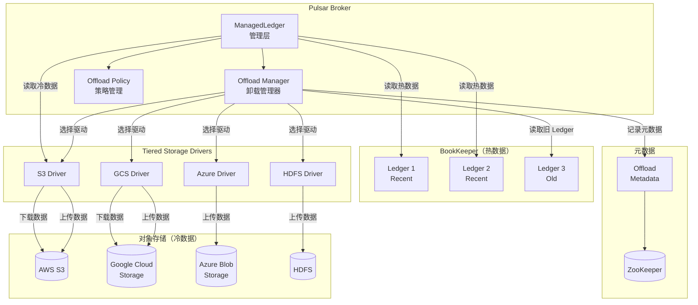

# Pulsar-13-TieredStorage

## 模块概览

### 职责与定位

Pulsar Tiered Storage（分层存储）模块实现了将历史数据从 BookKeeper 卸载（Offload）到更便宜的长期存储系统（如 AWS S3、Google Cloud Storage、Azure Blob Storage、HDFS），从而降低存储成本并保持数据的长期可访问性。

核心职责包括：

- **数据卸载**：将旧数据从 BookKeeper 迁移到对象存储
- **透明访问**：客户端无感知地访问卸载的数据
- **成本优化**：使用低成本存储保存历史数据
- **生命周期管理**：自动化的数据卸载和清理策略
- **多后端支持**：支持 S3、GCS、Azure、HDFS 等
- **元数据管理**：记录卸载数据的位置和范围

### 核心概念

**Offload（卸载）**：
- 将 Ledger 从 BookKeeper 迁移到对象存储
- 保留元数据指针
- 异步执行，不影响实时流量

**Tiered Storage（分层存储）**：
- 热数据：BookKeeper（高性能）
- 冷数据：对象存储（低成本）
- 自动切换

**Offload Threshold（卸载阈值）**：
- 基于大小（如 100GB）
- 基于时间（如 7 天）
- 触发自动卸载

---

## 模块架构图



### 架构图说明

#### 数据流程

1. **写入阶段**：新数据写入 BookKeeper（热存储）
2. **卸载触发**：达到阈值后触发卸载
3. **数据迁移**：Offload Manager 将旧 Ledger 迁移到对象存储
4. **元数据更新**：记录卸载信息到 ZooKeeper
5. **读取阶段**：
   - 热数据：直接从 BookKeeper 读取
   - 冷数据：从对象存储读取（透明）

---

## 核心接口

### 1. LedgerOffloader 接口

```java
package org.apache.bookkeeper.mledger;

/**
 * LedgerOffloader - Ledger 卸载器接口
 * 
 * 定义卸载和读取的标准方法
 */
public interface LedgerOffloader {
    
    /**
     * 卸载 Ledger 到分层存储
     * 
     * @param ledger 待卸载的 Ledger
     * @param uid 唯一标识符
     * @param extraMetadata 额外元数据
     * @return CompletableFuture<Void>
     */
    CompletableFuture<Void> offload(ReadHandle ledger,
                                     UUID uid,
                                     Map<String, String> extraMetadata);
    
    /**
     * 从分层存储读取 Ledger
     * 
     * @param ledgerId Ledger ID
     * @param uid 唯一标识符
     * @param offloadDriverMetadata 卸载元数据
     * @return CompletableFuture<ReadHandle>
     */
    CompletableFuture<ReadHandle> readOffloaded(long ledgerId,
                                                 UUID uid,
                                                 Map<String, String> offloadDriverMetadata);
    
    /**
     * 删除已卸载的 Ledger
     * 
     * @param ledgerId Ledger ID
     * @param uid 唯一标识符
     * @param offloadDriverMetadata 卸载元数据
     * @return CompletableFuture<Void>
     */
    CompletableFuture<Void> deleteOffloaded(long ledgerId,
                                             UUID uid,
                                             Map<String, String> offloadDriverMetadata);
    
    /**
     * 获取 Offloader 驱动名称
     */
    String getOffloadDriverName();
    
    /**
     * 关闭 Offloader
     */
    void close();
}
```

### 2. OffloadPolicies 配置

```java
package org.apache.pulsar.common.policies.data;

/**
 * OffloadPolicies - 卸载策略配置
 */
public class OffloadPoliciesImpl implements OffloadPolicies {
    
    // 卸载驱动
    private String offloadDriver;  // "S3", "GCS", "Azure", "HDFS"
    
    // 卸载阈值（字节）
    private Long offloadThresholdInBytes;
    
    // 卸载删除延迟（秒）
    private Long offloadDeletionLagInMillis;
    
    // S3 配置
    private String s3ManagedLedgerOffloadRegion;
    private String s3ManagedLedgerOffloadBucket;
    private String s3ManagedLedgerOffloadServiceEndpoint;
    private Integer s3ManagedLedgerOffloadMaxBlockSizeInBytes;
    private Integer s3ManagedLedgerOffloadReadBufferSizeInBytes;
    
    // GCS 配置
    private String gcsManagedLedgerOffloadRegion;
    private String gcsManagedLedgerOffloadBucket;
    private Integer gcsManagedLedgerOffloadMaxBlockSizeInBytes;
    private Integer gcsManagedLedgerOffloadReadBufferSizeInBytes;
    
    // 认证
    private String offloadCredentialsFile;
    
    // Getter/Setter 省略
}
```

---

## S3 卸载实现

### 1. S3ManagedLedgerOffloader

```java
package org.apache.bookkeeper.mledger.offload;

import software.amazon.awssdk.services.s3.S3AsyncClient;
import software.amazon.awssdk.services.s3.model.PutObjectRequest;

/**
 * S3ManagedLedgerOffloader - S3 卸载实现
 */
public class S3ManagedLedgerOffloader implements LedgerOffloader {
    
    private final S3AsyncClient s3Client;
    private final String bucket;
    private final String region;
    private final int blockSize;
    private final int readBufferSize;
    
    public S3ManagedLedgerOffloader(OffloadPolicies policies) {
        this.bucket = policies.getS3ManagedLedgerOffloadBucket();
        this.region = policies.getS3ManagedLedgerOffloadRegion();
        this.blockSize = policies.getS3ManagedLedgerOffloadMaxBlockSizeInBytes();
        this.readBufferSize = policies.getS3ManagedLedgerOffloadReadBufferSizeInBytes();
        
        // 创建 S3 客户端
        this.s3Client = S3AsyncClient.builder()
            .region(Region.of(region))
            .build();
    }
    
    @Override
    public CompletableFuture<Void> offload(ReadHandle ledger,
                                           UUID uid,
                                           Map<String, String> extraMetadata) {
        return CompletableFuture.runAsync(() -> {
            try {
                // 1. 构建 S3 对象键
                String key = buildS3Key(ledger.getId(), uid);
                
                // 2. 读取 Ledger 数据
                long numEntries = ledger.getLastAddConfirmed() + 1;
                List<ByteBuf> dataBlocks = new ArrayList<>();
                
                for (long entryId = 0; entryId < numEntries; entryId++) {
                    LedgerEntry entry = ledger.read(entryId, entryId).get().next();
                    dataBlocks.add(entry.getEntryBuffer());
                }
                
                // 3. 构建数据索引
                OffloadIndexBlock indexBlock = buildIndexBlock(ledger, dataBlocks);
                
                // 4. 分块上传到 S3
                uploadToS3(key, dataBlocks, indexBlock, extraMetadata);
                
                log.info("Offloaded ledger {} to S3: {}/{}", 
                    ledger.getId(), bucket, key);
                
            } catch (Exception e) {
                throw new RuntimeException("Failed to offload ledger", e);
            }
        });
    }
    
    /**
     * 构建 S3 对象键
     */
    private String buildS3Key(long ledgerId, UUID uid) {
        return String.format("pulsar/ledgers/%d-%s", ledgerId, uid);
    }
    
    /**
     * 构建索引块
     */
    private OffloadIndexBlock buildIndexBlock(ReadHandle ledger, 
                                              List<ByteBuf> dataBlocks) {
        OffloadIndexBlock indexBlock = new OffloadIndexBlock();
        
        // 记录每个 Entry 的位置和大小
        long currentOffset = 0;
        for (int i = 0; i < dataBlocks.size(); i++) {
            ByteBuf block = dataBlocks.get(i);
            indexBlock.addEntry(i, currentOffset, block.readableBytes());
            currentOffset += block.readableBytes();
        }
        
        // Ledger 元数据
        indexBlock.setLedgerId(ledger.getId());
        indexBlock.setDataObjectLength(currentOffset);
        
        return indexBlock;
    }
    
    /**
     * 上传到 S3
     */
    private void uploadToS3(String key, 
                           List<ByteBuf> dataBlocks,
                           OffloadIndexBlock indexBlock,
                           Map<String, String> metadata) throws Exception {
        // 1. 合并数据块
        ByteBuf combinedData = Unpooled.wrappedBuffer(
            dataBlocks.toArray(new ByteBuf[0])
        );
        
        // 2. 序列化索引
        byte[] indexBytes = indexBlock.serialize();
        
        // 3. 构建最终数据（数据 + 索引）
        ByteBuf finalData = Unpooled.buffer(
            combinedData.readableBytes() + indexBytes.length
        );
        finalData.writeBytes(combinedData);
        finalData.writeBytes(indexBytes);
        
        // 4. 上传到 S3
        PutObjectRequest putRequest = PutObjectRequest.builder()
            .bucket(bucket)
            .key(key)
            .metadata(metadata)
            .build();
        
        s3Client.putObject(putRequest, 
            AsyncRequestBody.fromByteBuffer(finalData.nioBuffer()))
            .get();
    }
    
    @Override
    public CompletableFuture<ReadHandle> readOffloaded(long ledgerId,
                                                        UUID uid,
                                                        Map<String, String> metadata) {
        return CompletableFuture.supplyAsync(() -> {
            try {
                // 1. 构建 S3 键
                String key = buildS3Key(ledgerId, uid);
                
                // 2. 从 S3 下载数据
                GetObjectRequest getRequest = GetObjectRequest.builder()
                    .bucket(bucket)
                    .key(key)
                    .build();
                
                byte[] data = s3Client.getObject(getRequest, 
                    AsyncResponseTransformer.toBytes())
                    .get()
                    .asByteArray();
                
                // 3. 解析索引
                OffloadIndexBlock indexBlock = parseIndexBlock(data);
                
                // 4. 创建 ReadHandle
                return new S3BackedReadHandle(data, indexBlock, ledgerId);
                
            } catch (Exception e) {
                throw new RuntimeException("Failed to read offloaded ledger", e);
            }
        });
    }
    
    /**
     * 解析索引块
     */
    private OffloadIndexBlock parseIndexBlock(byte[] data) {
        // 索引位于数据末尾
        // 实现省略
        return new OffloadIndexBlock();
    }
    
    @Override
    public CompletableFuture<Void> deleteOffloaded(long ledgerId,
                                                    UUID uid,
                                                    Map<String, String> metadata) {
        return CompletableFuture.runAsync(() -> {
            try {
                String key = buildS3Key(ledgerId, uid);
                
                DeleteObjectRequest deleteRequest = DeleteObjectRequest.builder()
                    .bucket(bucket)
                    .key(key)
                    .build();
                
                s3Client.deleteObject(deleteRequest).get();
                
                log.info("Deleted offloaded ledger {} from S3", ledgerId);
                
            } catch (Exception e) {
                throw new RuntimeException("Failed to delete offloaded ledger", e);
            }
        });
    }
    
    @Override
    public String getOffloadDriverName() {
        return "S3";
    }
    
    @Override
    public void close() {
        s3Client.close();
    }
}
```

### 2. S3BackedReadHandle

```java
package org.apache.bookkeeper.mledger.offload;

/**
 * S3BackedReadHandle - 从 S3 读取的 ReadHandle
 */
public class S3BackedReadHandle implements ReadHandle {
    
    private final byte[] data;
    private final OffloadIndexBlock indexBlock;
    private final long ledgerId;
    
    public S3BackedReadHandle(byte[] data, 
                             OffloadIndexBlock indexBlock,
                             long ledgerId) {
        this.data = data;
        this.indexBlock = indexBlock;
        this.ledgerId = ledgerId;
    }
    
    @Override
    public long getId() {
        return ledgerId;
    }
    
    @Override
    public LedgerEntries read(long firstEntry, long lastEntry) {
        List<LedgerEntry> entries = new ArrayList<>();
        
        for (long entryId = firstEntry; entryId <= lastEntry; entryId++) {
            // 从索引获取 Entry 位置
            OffloadIndexBlock.EntryInfo info = indexBlock.getEntry(entryId);
            
            // 提取数据
            byte[] entryData = new byte[info.size];
            System.arraycopy(data, (int)info.offset, entryData, 0, info.size);
            
            // 创建 LedgerEntry
            ByteBuf entryBuf = Unpooled.wrappedBuffer(entryData);
            entries.add(new S3LedgerEntry(ledgerId, entryId, entryBuf));
        }
        
        return new LedgerEntriesImpl(entries);
    }
    
    @Override
    public long getLastAddConfirmed() {
        return indexBlock.getLastEntryId();
    }
    
    @Override
    public long getLength() {
        return indexBlock.getDataObjectLength();
    }
    
    @Override
    public void close() {
        // S3 数据已在内存，无需关闭
    }
}
```

---

## 配置与使用

### 1. Broker 配置

```properties
# conf/broker.conf

# 启用分层存储
managedLedgerOffloadDriver=S3

# 卸载阈值（100 GB）
managedLedgerOffloadThresholdInBytes=107374182400

# 卸载删除延迟（24 小时）
managedLedgerOffloadDeletionLagMs=86400000

# S3 配置
s3ManagedLedgerOffloadRegion=us-west-2
s3ManagedLedgerOffloadBucket=pulsar-offload
s3ManagedLedgerOffloadServiceEndpoint=https://s3.us-west-2.amazonaws.com

# 分块大小（64 MB）
s3ManagedLedgerOffloadMaxBlockSizeInBytes=67108864

# 读取缓冲区（1 MB）
s3ManagedLedgerOffloadReadBufferSizeInBytes=1048576

# AWS 认证（使用 IAM 角色或凭证文件）
# 可选：s3ManagedLedgerOffloadCredentialsFile=/path/to/credentials
```

### 2. 命名空间级别配置

```bash
# 为命名空间设置卸载策略
pulsar-admin namespaces set-offload-policies \
  --driver S3 \
  --region us-west-2 \
  --bucket pulsar-offload \
  --offloadThresholdInBytes 107374182400 \
  public/default
```

### 3. 手动触发卸载

```bash
# 手动卸载主题数据
pulsar-admin topics offload \
  --size-threshold 10G \
  persistent://public/default/my-topic
```

### 4. 查询卸载状态

```bash
# 查询卸载状态
pulsar-admin topics offload-status \
  persistent://public/default/my-topic
```

---

## 编程示例

### 1. 配置 Offload Policies

```java
import org.apache.pulsar.client.admin.PulsarAdmin;
import org.apache.pulsar.common.policies.data.OffloadPoliciesImpl;

public class ConfigureOffloadExample {
    public static void main(String[] args) throws Exception {
        PulsarAdmin admin = PulsarAdmin.builder()
            .serviceHttpUrl("http://localhost:8080")
            .build();
        
        String namespace = "public/default";
        
        // 创建卸载策略
        OffloadPoliciesImpl policies = OffloadPoliciesImpl.create(
            "S3",                          // 驱动
            "us-west-2",                   // 区域
            "pulsar-offload",              // 桶名
            null,                          // Endpoint（可选）
            100L * 1024 * 1024 * 1024,    // 阈值（100 GB）
            86400000L                      // 删除延迟（24 小时）
        );
        
        // 设置 S3 块大小
        policies.setS3ManagedLedgerOffloadMaxBlockSizeInBytes(64 * 1024 * 1024);
        
        // 应用策略
        admin.namespaces().setOffloadPolicies(namespace, policies);
        
        System.out.println("Offload policies configured");
        
        admin.close();
    }
}
```

### 2. 手动触发卸载

```java
public class TriggerOffloadExample {
    public static void main(String[] args) throws Exception {
        PulsarAdmin admin = PulsarAdmin.builder()
            .serviceHttpUrl("http://localhost:8080")
            .build();
        
        String topic = "persistent://public/default/my-topic";
        
        // 手动触发卸载（卸载超过 10 GB 的数据）
        MessageId offloadedUpTo = admin.topics().offloadStatus(topic).thenCompose(status -> {
            long sizeThreshold = 10L * 1024 * 1024 * 1024;  // 10 GB
            return admin.topics().triggerOffload(topic, sizeThreshold);
        }).get();
        
        System.out.println("Offloaded up to message: " + offloadedUpTo);
        
        admin.close();
    }
}
```

### 3. 查询卸载状态

```java
import org.apache.pulsar.common.policies.data.OffloadProcessStatus;

public class CheckOffloadStatusExample {
    public static void main(String[] args) throws Exception {
        PulsarAdmin admin = PulsarAdmin.builder()
            .serviceHttpUrl("http://localhost:8080")
            .build();
        
        String topic = "persistent://public/default/my-topic";
        
        // 查询卸载状态
        OffloadProcessStatus status = admin.topics().offloadStatus(topic).get();
        
        System.out.println("Offload Status:");
        System.out.println("  Status: " + status.getStatus());
        System.out.println("  Offloaded up to: " + status.getLastOffloadedMessageId());
        
        if (status.getStatus() == OffloadProcessStatus.Status.SUCCESS) {
            System.out.println("  Offload completed successfully");
        } else if (status.getStatus() == OffloadProcessStatus.Status.RUNNING) {
            System.out.println("  Offload in progress...");
        } else if (status.getStatus() == OffloadProcessStatus.Status.ERROR) {
            System.out.println("  Error: " + status.getLastError());
        }
        
        admin.close();
    }
}
```

---

## GCS 卸载配置

### GCS 配置示例

```properties
# conf/broker.conf

# 使用 GCS
managedLedgerOffloadDriver=google-cloud-storage

# 卸载阈值
managedLedgerOffloadThresholdInBytes=107374182400

# GCS 配置
gcsManagedLedgerOffloadRegion=us-central1
gcsManagedLedgerOffloadBucket=pulsar-offload-gcs

# 认证（使用服务账号 JSON 文件）
gcsManagedLedgerOffloadServiceAccountKeyFile=/path/to/service-account-key.json

# 分块大小
gcsManagedLedgerOffloadMaxBlockSizeInBytes=67108864
```

---

## 最佳实践

### 1. 选择合适的阈值

```bash
# 根据业务需求设置阈值

# 高频主题：较大阈值（保留更多热数据）
pulsar-admin namespaces set-offload-threshold \
  --threshold 500G \
  public/high-frequency

# 低频主题：较小阈值（节省成本）
pulsar-admin namespaces set-offload-threshold \
  --threshold 10G \
  public/low-frequency
```

### 2. 监控卸载进度

```java
public class MonitorOffloadExample {
    public static void main(String[] args) throws Exception {
        PulsarAdmin admin = PulsarAdmin.builder()
            .serviceHttpUrl("http://localhost:8080")
            .build();
        
        String topic = "persistent://public/default/my-topic";
        
        // 定期检查卸载状态
        ScheduledExecutorService scheduler = Executors.newScheduledThreadPool(1);
        
        scheduler.scheduleAtFixedRate(() -> {
            try {
                OffloadProcessStatus status = admin.topics().offloadStatus(topic).get();
                
                System.out.println(String.format(
                    "[%s] Offload status: %s, Offloaded up to: %s",
                    new Date(),
                    status.getStatus(),
                    status.getLastOffloadedMessageId()
                ));
                
            } catch (Exception e) {
                e.printStackTrace();
            }
        }, 0, 60, TimeUnit.SECONDS);  // 每分钟检查一次
        
        // 运行 1 小时后停止
        scheduler.awaitTermination(1, TimeUnit.HOURS);
        
        admin.close();
    }
}
```

### 3. 成本优化

- 使用生命周期策略自动删除旧数据
- 选择合适的存储类别（S3 Glacier、GCS Nearline）
- 压缩数据减少存储成本

---

## 监控指标

| 指标 | 类型 | 说明 |
|---|---|---|
| `pulsar_ml_offload_rate` | Counter | 卸载速率（Ledger/s） |
| `pulsar_ml_offload_error` | Counter | 卸载失败次数 |
| `pulsar_ml_offloaded_ledgers_total` | Counter | 已卸载 Ledger 总数 |
| `pulsar_ml_offloaded_bytes_total` | Counter | 已卸载字节总数 |
| `pulsar_ml_offload_duration_seconds` | Histogram | 卸载耗时分布 |

---

## 常见问题

### 问题 1：卸载失败

**原因**：权限不足、网络问题、配置错误

**解决方案**：
- 检查 AWS/GCS 凭证
- 验证 Bucket 权限
- 查看 Broker 日志

### 问题 2：读取卸载数据慢

**原因**：网络延迟、对象存储性能

**解决方案**：
- 增大 `readBufferSizeInBytes`
- 使用更近的区域
- 启用缓存

### 问题 3：存储成本高

**原因**：卸载频繁、阈值过小

**解决方案**：
- 增大卸载阈值
- 使用冷存储类别
- 配置生命周期策略

---

**文档版本**：v1.0  
**对应模块版本**：Pulsar 4.2.0-SNAPSHOT  
**最后更新**：2025-10-05

