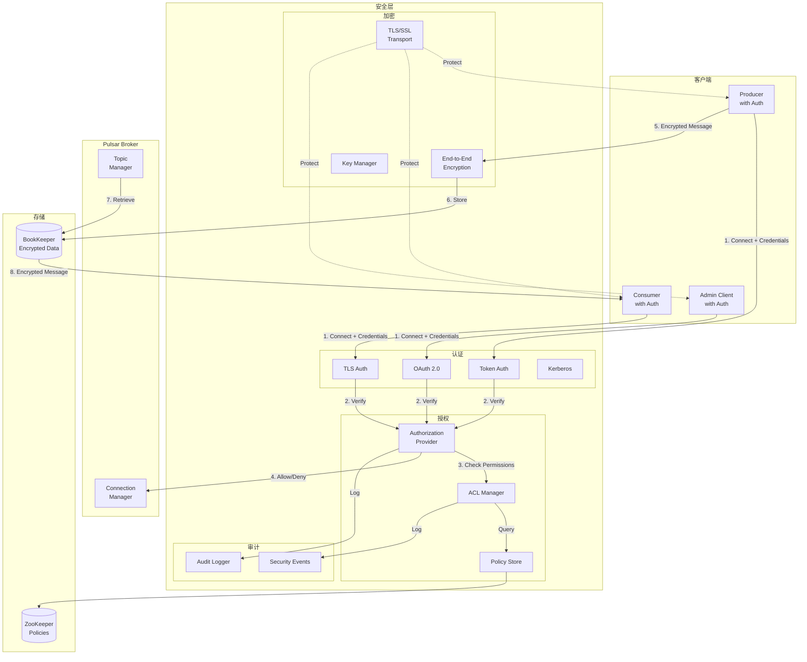

# Pulsar-14-Security

## 模块概览

### 职责与定位

Pulsar Security 模块提供全方位的安全机制，包括认证（Authentication）、授权（Authorization）、加密传输（TLS/SSL）和端到端加密（End-to-End Encryption），确保数据在传输和存储过程中的安全性。

核心职责包括：

- **认证（Authentication）**：验证客户端身份
- **授权（Authorization）**：控制资源访问权限
- **TLS/SSL 加密**：保护传输层数据
- **端到端加密**：保护消息内容
- **审计日志**：记录安全相关操作
- **多租户隔离**：租户级别的安全隔离

### 核心概念

**Authentication（认证）**：
- 支持 Token、TLS、Kerberos、OAuth 2.0
- 客户端需提供凭证
- Broker 验证身份

**Authorization（授权）**：
- 基于角色的访问控制（RBAC）
- 租户、命名空间、主题级别的权限
- 生产、消费、管理权限

**TLS/SSL**：
- 加密客户端与 Broker 之间的通信
- 支持双向认证（Mutual TLS）
- 证书管理

**End-to-End Encryption**：
- 消息级别的加密
- 生产者加密，消费者解密
- Broker 无法访问明文

---

## 模块架构图



### 架构图说明

#### 安全流程

1. **认证阶段**：客户端提供凭证，Broker 验证身份
2. **授权检查**：验证客户端是否有权限访问资源
3. **传输加密**：TLS/SSL 保护通信通道
4. **消息加密**：（可选）端到端加密保护消息内容
5. **审计记录**：记录所有安全相关操作

---

## 认证（Authentication）

### 1. Token 认证

**Broker 配置**：

```properties
# conf/broker.conf

# 启用认证
authenticationEnabled=true

# 配置 Token 认证提供者
authenticationProviders=org.apache.pulsar.broker.authentication.AuthenticationProviderToken

# Token 密钥文件（对称密钥）
tokenSecretKey=file:///path/to/secret.key

# 或使用公钥/私钥（非对称加密）
tokenPublicKey=file:///path/to/public.key
```

**生成 Token**：

```bash
# 生成密钥对
bin/pulsar tokens create-secret-key --output /path/to/secret.key

# 生成 Token（有效期 1 年）
bin/pulsar tokens create \
  --secret-key file:///path/to/secret.key \
  --subject admin-user \
  --expiry-time 1y
```

**客户端使用 Token**：

```java
import org.apache.pulsar.client.api.PulsarClient;
import org.apache.pulsar.client.api.AuthenticationFactory;

public class TokenAuthExample {
    public static void main(String[] args) throws Exception {
        String token = "eyJhbGciOiJIUzI1NiJ9...";
        
        PulsarClient client = PulsarClient.builder()
            .serviceUrl("pulsar://localhost:6650")
            .authentication(AuthenticationFactory.token(token))
            .build();
        
        Producer<String> producer = client.newProducer(Schema.STRING)
            .topic("persistent://public/default/my-topic")
            .create();
        
        producer.send("Hello with authentication!");
        
        producer.close();
        client.close();
    }
}
```

### 2. TLS 认证（Mutual TLS）

**Broker 配置**：

```properties
# conf/broker.conf

# 启用 TLS
tlsEnabled=true
tlsCertificateFilePath=/path/to/broker-cert.pem
tlsKeyFilePath=/path/to/broker-key.pem

# 启用 TLS 认证
authenticationEnabled=true
authenticationProviders=org.apache.pulsar.broker.authentication.AuthenticationProviderTls

# 信任的 CA 证书
tlsTrustCertsFilePath=/path/to/ca-cert.pem

# 要求客户端证书
tlsRequireTrustedClientCertOnConnect=true
```

**客户端配置**：

```java
import org.apache.pulsar.client.api.AuthenticationFactory;

public class TLSAuthExample {
    public static void main(String[] args) throws Exception {
        PulsarClient client = PulsarClient.builder()
            .serviceUrl("pulsar+ssl://localhost:6651")
            .tlsTrustCertsFilePath("/path/to/ca-cert.pem")
            .authentication(
                AuthenticationFactory.create(
                    "org.apache.pulsar.client.impl.auth.AuthenticationTls",
                    Map.of(
                        "tlsCertFile", "/path/to/client-cert.pem",
                        "tlsKeyFile", "/path/to/client-key.pem"
                    )
                )
            )
            .build();
        
        // 使用客户端...
        
        client.close();
    }
}
```

### 3. OAuth 2.0 认证

**Broker 配置**：

```properties
# conf/broker.conf

authenticationEnabled=true
authenticationProviders=org.apache.pulsar.broker.authentication.AuthenticationProviderOpenID

# OAuth 2.0 配置
openIDIssuerUrl=https://accounts.google.com
openIDAllowedAudiences=my-pulsar-cluster
```

**客户端配置**：

```java
import org.apache.pulsar.client.impl.auth.oauth2.AuthenticationFactoryOAuth2;

public class OAuth2Example {
    public static void main(String[] args) throws Exception {
        String issuerUrl = "https://accounts.google.com";
        String credentialsUrl = "file:///path/to/credentials.json";
        String audience = "my-pulsar-cluster";
        
        PulsarClient client = PulsarClient.builder()
            .serviceUrl("pulsar://localhost:6650")
            .authentication(
                AuthenticationFactoryOAuth2.clientCredentials(
                    new URL(issuerUrl),
                    new URL(credentialsUrl),
                    audience
                )
            )
            .build();
        
        // 使用客户端...
        
        client.close();
    }
}
```

---

## 授权（Authorization）

### 1. 授权配置

**Broker 配置**：

```properties
# conf/broker.conf

# 启用授权
authorizationEnabled=true

# 授权提供者
authorizationProvider=org.apache.pulsar.broker.authorization.PulsarAuthorizationProvider

# 超级用户（拥有所有权限）
superUserRoles=admin,superuser
```

### 2. 授权模型

Pulsar 的授权基于**角色（Role）**和**权限（Permission）**：

**权限类型**：
- `produce`：发布消息
- `consume`：订阅和消费消息
- `functions`：管理 Functions
- `sources`：管理 Sources
- `sinks`：管理 Sinks
- `packages`：管理 Packages

**资源层级**：
- **租户（Tenant）**：最高层级
- **命名空间（Namespace）**：租户下的逻辑分组
- **主题（Topic）**：具体的消息主题

### 3. 权限管理示例

```bash
# 为租户授予管理员角色
pulsar-admin tenants create my-tenant \
  --admin-roles admin-user,data-team

# 为命名空间授予权限
pulsar-admin namespaces grant-permission \
  public/default \
  --role user1 \
  --actions produce,consume

# 为主题授予权限
pulsar-admin topics grant-permission \
  persistent://public/default/my-topic \
  --role user2 \
  --actions produce
```

**Java Admin API**：

```java
import org.apache.pulsar.client.admin.PulsarAdmin;
import org.apache.pulsar.common.policies.data.AuthAction;

public class AuthorizationExample {
    public static void main(String[] args) throws Exception {
        PulsarAdmin admin = PulsarAdmin.builder()
            .serviceHttpUrl("http://localhost:8080")
            .authentication(AuthenticationFactory.token("admin-token"))
            .build();
        
        String namespace = "public/default";
        String role = "data-engineer";
        
        // 授予命名空间权限
        Set<AuthAction> actions = Set.of(
            AuthAction.produce,
            AuthAction.consume
        );
        
        admin.namespaces().grantPermissionOnNamespace(
            namespace, 
            role, 
            actions
        );
        
        System.out.println("Granted permissions to " + role);
        
        // 查询权限
        Map<String, Set<AuthAction>> permissions = 
            admin.namespaces().getPermissions(namespace);
        
        System.out.println("Namespace permissions: " + permissions);
        
        // 撤销权限
        admin.namespaces().revokePermissionsOnNamespace(namespace, role);
        
        admin.close();
    }
}
```

### 4. 细粒度权限控制

```java
public class FineGrainedAuthExample {
    public static void main(String[] args) throws Exception {
        PulsarAdmin admin = PulsarAdmin.builder()
            .serviceHttpUrl("http://localhost:8080")
            .authentication(AuthenticationFactory.token("admin-token"))
            .build();
        
        String topic = "persistent://public/default/sensitive-data";
        
        // 生产者角色：只能发布
        admin.topics().grantPermission(
            topic,
            "producer-role",
            Set.of(AuthAction.produce)
        );
        
        // 消费者角色：只能消费
        admin.topics().grantPermission(
            topic,
            "consumer-role",
            Set.of(AuthAction.consume)
        );
        
        // 管理员角色：所有权限
        admin.topics().grantPermission(
            topic,
            "admin-role",
            Set.of(
                AuthAction.produce,
                AuthAction.consume,
                AuthAction.functions
            )
        );
        
        admin.close();
    }
}
```

---

## TLS/SSL 加密

### 1. 生成证书

```bash
# 1. 生成 CA 私钥和证书
openssl req -x509 -newkey rsa:4096 \
  -keyout ca-key.pem \
  -out ca-cert.pem \
  -days 365 -nodes \
  -subj "/CN=Pulsar CA"

# 2. 生成 Broker 私钥
openssl genrsa -out broker-key.pem 2048

# 3. 生成 Broker 证书签名请求（CSR）
openssl req -new \
  -key broker-key.pem \
  -out broker.csr \
  -subj "/CN=broker.pulsar.local"

# 4. 使用 CA 签署 Broker 证书
openssl x509 -req \
  -in broker.csr \
  -CA ca-cert.pem \
  -CAkey ca-key.pem \
  -CAcreateserial \
  -out broker-cert.pem \
  -days 365

# 5. 生成客户端证书（同样流程）
openssl genrsa -out client-key.pem 2048
openssl req -new \
  -key client-key.pem \
  -out client.csr \
  -subj "/CN=client"
openssl x509 -req \
  -in client.csr \
  -CA ca-cert.pem \
  -CAkey ca-key.pem \
  -CAcreateserial \
  -out client-cert.pem \
  -days 365
```

### 2. Broker TLS 配置

```properties
# conf/broker.conf

# 启用 TLS
tlsEnabled=true
tlsCertificateFilePath=/path/to/broker-cert.pem
tlsKeyFilePath=/path/to/broker-key.pem
tlsTrustCertsFilePath=/path/to/ca-cert.pem

# TLS 端口
brokerServicePortTls=6651
webServicePortTls=8443

# TLS 协议
tlsProtocols=TLSv1.3,TLSv1.2

# 要求客户端证书（Mutual TLS）
tlsRequireTrustedClientCertOnConnect=true
```

### 3. 客户端 TLS 配置

```java
public class TLSClientExample {
    public static void main(String[] args) throws Exception {
        PulsarClient client = PulsarClient.builder()
            .serviceUrl("pulsar+ssl://broker.pulsar.local:6651")
            .tlsTrustCertsFilePath("/path/to/ca-cert.pem")
            .tlsHostnameVerificationEnable(true)
            .build();
        
        Producer<String> producer = client.newProducer(Schema.STRING)
            .topic("persistent://public/default/secure-topic")
            .create();
        
        producer.send("Secure message over TLS");
        
        producer.close();
        client.close();
    }
}
```

---

## 端到端加密

### 1. 加密原理

- **生产者**：使用公钥加密消息
- **Broker**：存储加密的消息（无法解密）
- **消费者**：使用私钥解密消息

### 2. 实现端到端加密

```java
import org.apache.pulsar.client.api.CryptoKeyReader;
import org.apache.pulsar.client.api.EncryptionKeyInfo;

/**
 * 自定义密钥读取器
 */
public class FileBasedCryptoKeyReader implements CryptoKeyReader {
    
    private final Map<String, EncryptionKeyInfo> publicKeys = new HashMap<>();
    private final Map<String, EncryptionKeyInfo> privateKeys = new HashMap<>();
    
    public void addPublicKey(String keyName, byte[] keyData) {
        EncryptionKeyInfo keyInfo = new EncryptionKeyInfo();
        keyInfo.setKey(keyData);
        publicKeys.put(keyName, keyInfo);
    }
    
    public void addPrivateKey(String keyName, byte[] keyData) {
        EncryptionKeyInfo keyInfo = new EncryptionKeyInfo();
        keyInfo.setKey(keyData);
        privateKeys.put(keyName, keyInfo);
    }
    
    @Override
    public EncryptionKeyInfo getPublicKey(String keyName, Map<String, String> metadata) {
        return publicKeys.get(keyName);
    }
    
    @Override
    public EncryptionKeyInfo getPrivateKey(String keyName, Map<String, String> metadata) {
        return privateKeys.get(keyName);
    }
}
```

**Producer 端加密**：

```java
public class EncryptedProducerExample {
    public static void main(String[] args) throws Exception {
        PulsarClient client = PulsarClient.builder()
            .serviceUrl("pulsar://localhost:6650")
            .build();
        
        // 创建密钥读取器
        FileBasedCryptoKeyReader keyReader = new FileBasedCryptoKeyReader();
        
        // 加载公钥
        byte[] publicKey = Files.readAllBytes(
            Paths.get("/path/to/public-key.pem")
        );
        keyReader.addPublicKey("my-key", publicKey);
        
        // 创建 Producer with 加密
        Producer<String> producer = client.newProducer(Schema.STRING)
            .topic("persistent://public/default/encrypted-topic")
            .cryptoKeyReader(keyReader)
            .addEncryptionKey("my-key")  // 指定加密密钥
            .create();
        
        // 发送加密消息
        producer.send("This message is encrypted!");
        
        producer.close();
        client.close();
    }
}
```

**Consumer 端解密**：

```java
public class EncryptedConsumerExample {
    public static void main(String[] args) throws Exception {
        PulsarClient client = PulsarClient.builder()
            .serviceUrl("pulsar://localhost:6650")
            .build();
        
        // 创建密钥读取器
        FileBasedCryptoKeyReader keyReader = new FileBasedCryptoKeyReader();
        
        // 加载私钥
        byte[] privateKey = Files.readAllBytes(
            Paths.get("/path/to/private-key.pem")
        );
        keyReader.addPrivateKey("my-key", privateKey);
        
        // 创建 Consumer with 解密
        Consumer<String> consumer = client.newConsumer(Schema.STRING)
            .topic("persistent://public/default/encrypted-topic")
            .subscriptionName("my-subscription")
            .cryptoKeyReader(keyReader)
            .subscribe();
        
        // 接收并自动解密消息
        Message<String> msg = consumer.receive();
        String decryptedContent = msg.getValue();
        
        System.out.println("Decrypted message: " + decryptedContent);
        
        consumer.acknowledge(msg);
        consumer.close();
        client.close();
    }
}
```

### 3. 生成加密密钥对

```bash
# 生成 RSA 密钥对
openssl genrsa -out private-key.pem 2048
openssl rsa -in private-key.pem -pubout -out public-key.pem
```

---

## 多租户隔离

### 1. 租户管理

```bash
# 创建租户
pulsar-admin tenants create tenant-a \
  --admin-roles tenant-a-admin \
  --allowed-clusters cluster-1,cluster-2

# 创建命名空间
pulsar-admin namespaces create tenant-a/namespace-1

# 设置命名空间策略
pulsar-admin namespaces set-retention \
  tenant-a/namespace-1 \
  --size 10G \
  --time 7d
```

### 2. 租户级别的资源隔离

```java
public class TenantIsolationExample {
    public static void main(String[] args) throws Exception {
        PulsarAdmin admin = PulsarAdmin.builder()
            .serviceHttpUrl("http://localhost:8080")
            .authentication(AuthenticationFactory.token("admin-token"))
            .build();
        
        // 为租户 A 创建独立的命名空间
        String tenantA = "tenant-a";
        String namespaceA = tenantA + "/prod";
        
        admin.namespaces().createNamespace(namespaceA);
        
        // 设置租户 A 的资源配额
        admin.namespaces().setMaxProducersPerTopic(namespaceA, 100);
        admin.namespaces().setMaxConsumersPerTopic(namespaceA, 100);
        admin.namespaces().setMaxConsumersPerSubscription(namespaceA, 10);
        
        // 设置租户 A 的速率限制
        admin.namespaces().setDispatchRate(
            namespaceA,
            new DispatchRate(10000, 100 * 1024 * 1024, 1)  // 10k msg/s, 100 MB/s
        );
        
        // 授权租户 A 的角色
        admin.namespaces().grantPermissionOnNamespace(
            namespaceA,
            "tenant-a-user",
            Set.of(AuthAction.produce, AuthAction.consume)
        );
        
        admin.close();
    }
}
```

---

## 审计日志

### 1. 启用审计日志

```properties
# conf/broker.conf

# 启用审计
brokerClientAuthenticationParameters=audit=true

# 审计日志文件
PULSAR_LOG_FILE=${PULSAR_HOME}/logs/pulsar-audit.log
```

### 2. 审计日志示例

```java
import org.apache.pulsar.broker.authentication.utils.AuditLog;

public class AuditLogExample {
    
    public void logAuthenticationAttempt(String clientId, boolean success) {
        if (success) {
            AuditLog.log(
                "Authentication",
                "Client {} authenticated successfully",
                clientId
            );
        } else {
            AuditLog.log(
                "Authentication",
                "Client {} authentication failed",
                clientId
            );
        }
    }
    
    public void logAuthorizationCheck(String role, String resource, boolean allowed) {
        AuditLog.log(
            "Authorization",
            "Role {} access to {} was {}",
            role,
            resource,
            allowed ? "allowed" : "denied"
        );
    }
}
```

---

## 最佳实践

### 1. 最小权限原则

```bash
# 为不同角色分配最小必要权限

# 生产者：只能发布
pulsar-admin topics grant-permission \
  persistent://public/default/orders \
  --role producer-app \
  --actions produce

# 消费者：只能消费
pulsar-admin topics grant-permission \
  persistent://public/default/orders \
  --role consumer-app \
  --actions consume

# 分析工具：只读
pulsar-admin topics grant-permission \
  persistent://public/default/orders \
  --role analytics-tool \
  --actions consume
```

### 2. 定期轮换密钥

```bash
# 定期生成新的 Token
bin/pulsar tokens create \
  --secret-key file:///path/to/secret.key \
  --subject user1 \
  --expiry-time 30d

# 定期更新证书
# 1. 生成新证书
# 2. 配置 Broker 使用新证书
# 3. 更新客户端证书
# 4. 吊销旧证书
```

### 3. 监控安全事件

```java
public class SecurityMonitoringExample {
    public static void main(String[] args) throws Exception {
        PulsarAdmin admin = PulsarAdmin.builder()
            .serviceHttpUrl("http://localhost:8080")
            .authentication(AuthenticationFactory.token("admin-token"))
            .build();
        
        // 定期检查权限变更
        ScheduledExecutorService scheduler = Executors.newScheduledThreadPool(1);
        
        scheduler.scheduleAtFixedRate(() -> {
            try {
                String namespace = "public/default";
                Map<String, Set<AuthAction>> permissions = 
                    admin.namespaces().getPermissions(namespace);
                
                System.out.println("Current permissions: " + permissions);
                
                // 检测异常权限（如超级用户过多）
                long superUserCount = permissions.values().stream()
                    .filter(actions -> actions.size() > 5)
                    .count();
                
                if (superUserCount > 3) {
                    System.err.println("ALERT: Too many super users!");
                }
                
            } catch (Exception e) {
                e.printStackTrace();
            }
        }, 0, 1, TimeUnit.HOURS);
        
        scheduler.awaitTermination(Long.MAX_VALUE, TimeUnit.DAYS);
        
        admin.close();
    }
}
```

---

## 常见问题

### 问题 1：认证失败

**原因**：Token 过期、凭证错误

**解决方案**：
```bash
# 检查 Token 是否有效
bin/pulsar tokens validate --token <token-string>

# 重新生成 Token
bin/pulsar tokens create \
  --secret-key file:///path/to/secret.key \
  --subject user1
```

### 问题 2：授权被拒绝

**原因**：权限不足

**解决方案**：
```bash
# 检查当前权限
pulsar-admin namespaces get-permissions public/default

# 授予权限
pulsar-admin namespaces grant-permission \
  public/default \
  --role user1 \
  --actions produce,consume
```

### 问题 3：TLS 握手失败

**原因**：证书不匹配、过期

**解决方案**：
```bash
# 检查证书有效期
openssl x509 -in broker-cert.pem -noout -dates

# 验证证书链
openssl verify -CAfile ca-cert.pem broker-cert.pem
```

---

## 监控指标

| 指标 | 类型 | 说明 |
|---|---|---|
| `pulsar_authentication_success_total` | Counter | 认证成功次数 |
| `pulsar_authentication_failures_total` | Counter | 认证失败次数 |
| `pulsar_authorization_success_total` | Counter | 授权成功次数 |
| `pulsar_authorization_failures_total` | Counter | 授权失败次数 |
| `pulsar_active_connections` | Gauge | 当前活跃连接数 |
| `pulsar_connection_create_success_total` | Counter | 连接创建成功次数 |
| `pulsar_connection_create_fail_total` | Counter | 连接创建失败次数 |

---

**文档版本**：v1.0  
**对应模块版本**：Pulsar 4.2.0-SNAPSHOT  
**最后更新**：2025-10-05

