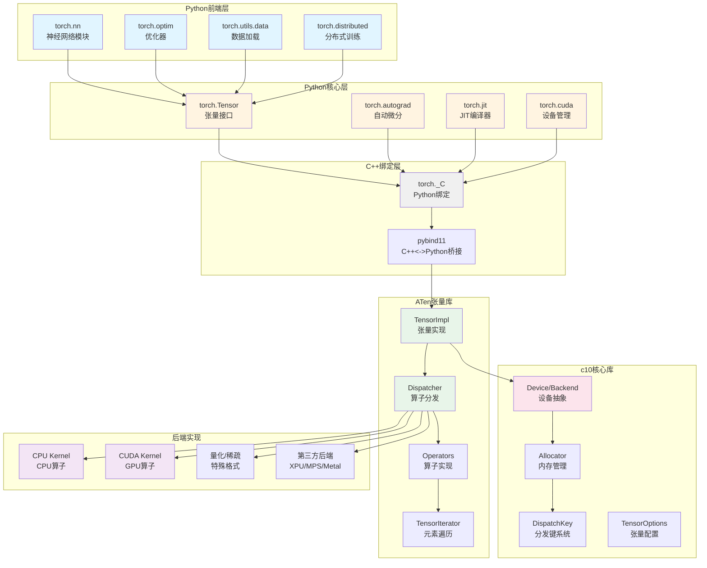
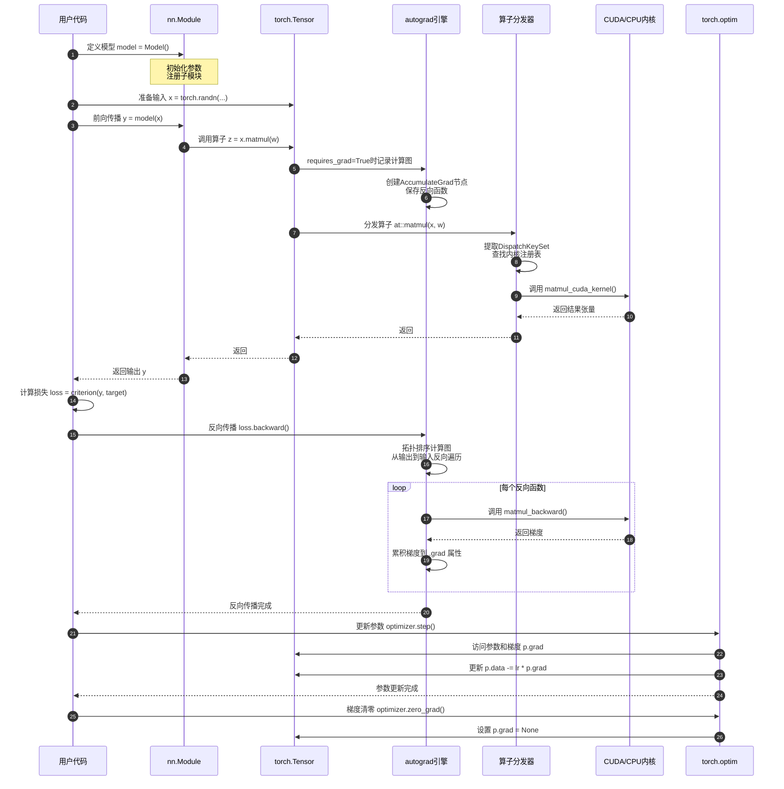
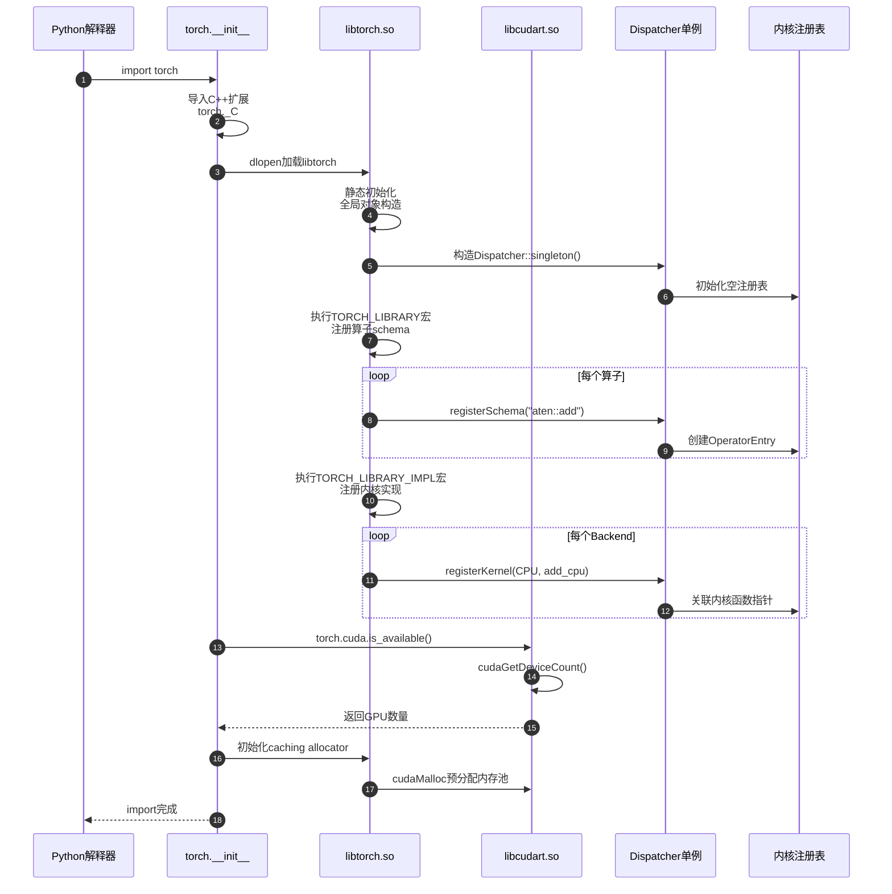
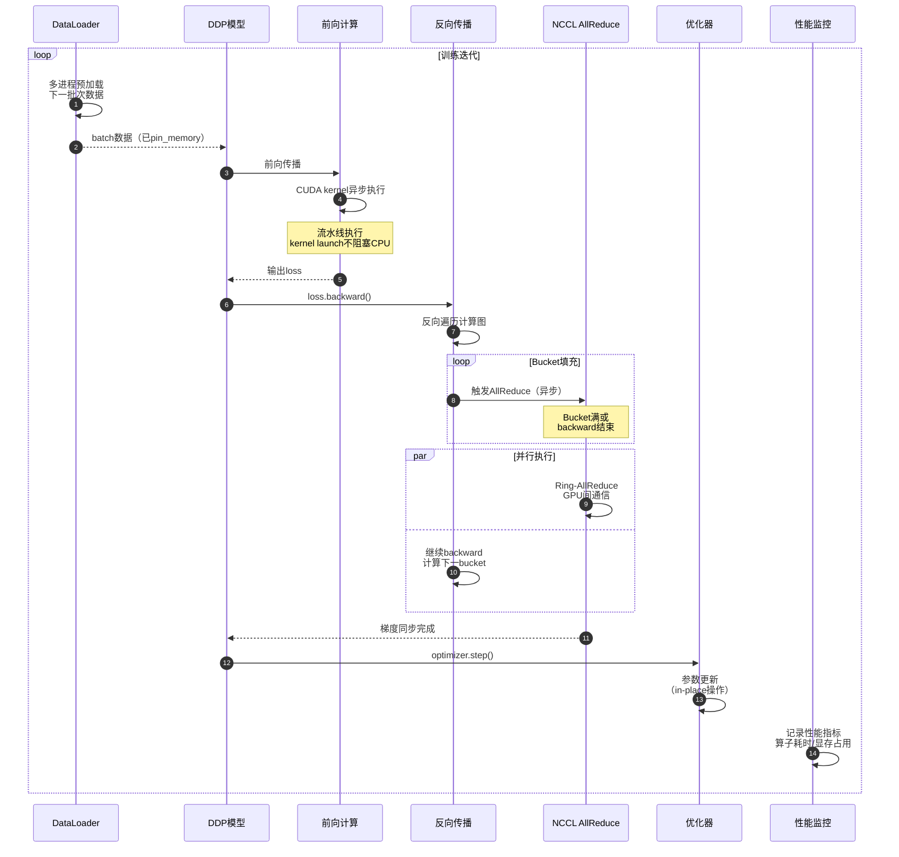
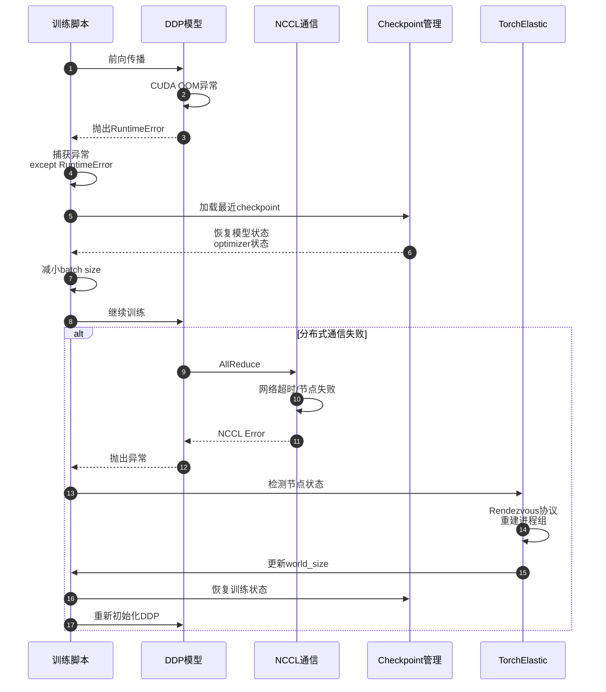

# PyTorch-00-总览

## 摘要

### 项目定位

PyTorch 是一个开源的深度学习框架，提供张量计算（类似NumPy）和GPU加速，以及基于自动微分系统的深度学习模型构建和训练能力。项目采用 C++/CUDA 作为后端核心实现，Python 作为前端API接口，实现高性能与易用性的平衡。

### 核心目标

- **动态计算图**：支持Define-by-Run范式，计算图在运行时动态构建
- **自动微分**：提供自动梯度计算系统，支持反向传播和高阶导数
- **灵活高效**：Python前端易于调试，C++后端提供高性能计算
- **GPU加速**：原生支持CUDA/ROCm/XPU等多种计算后端
- **生产部署**：通过TorchScript实现模型的静态图编译和跨语言部署

### 非目标

- 不提供完整的端到端机器学习pipeline工具链（数据标注、特征工程等）
- 不是通用科学计算库（虽然张量API类似NumPy但主要面向深度学习）
- 不保证训练框架与推理引擎完全解耦（虽有TorchScript但主要面向PyTorch生态）

### 运行环境与部署形态

**开发环境**：
- Python 3.8+ 解释器环境
- 支持Linux、macOS、Windows平台
- 可选CUDA 11.8+用于GPU训练

**生产部署**：
- TorchScript编译后的模型文件（.pt/.pth）
- LibTorch C++ API独立运行时
- 移动端：PyTorch Mobile（Android/iOS）
- 服务端：TorchServe模型服务框架

## 整体架构

### 分层架构图



### 架构说明

#### 1. 整体分层设计

**第一层：Python前端层**
- 提供高层API，面向用户的模型定义接口（torch.nn.Module）
- 实现优化器、学习率调度、数据加载等训练辅助组件
- 封装分布式训练、混合精度等高级功能
- 用户交互层，代码以Python实现为主

**第二层：Python核心层**
- 实现张量核心API（torch.Tensor），是Python侧最核心的数据结构
- 自动微分引擎（torch.autograd）实现计算图构建与反向传播
- JIT编译器（torch.jit）支持模型静态图编译和优化
- 设备管理接口抽象底层硬件（torch.cuda、torch.xpu等）

**第三层：C++绑定层**
- torch._C模块通过pybind11将C++实现暴露给Python
- 负责数据类型转换、生命周期管理、异常传播
- GIL管理确保多线程安全与性能平衡

**第四层：ATen张量库**
- TensorImpl是张量的C++实现，管理数据指针、形状、步长等元信息
- Dispatcher系统根据张量类型和设备动态分发到对应算子实现
- 提供2000+张量运算算子，支持CPU/CUDA/量化等多种后端
- TensorIterator抽象元素级遍历，简化算子实现

**第五层：c10核心库**
- Device/DeviceType定义设备抽象（CPU/CUDA/XPU等）
- Allocator管理内存分配，支持caching allocator优化
- DispatchKey定义算子分发的键值系统（Backend+Layout+功能键）
- ScalarType/Layout/TensorOptions定义张量的类型属性

**第六层：后端实现**
- CPU Kernel：基于Eigen/MKL/oneDNN的CPU算子实现
- CUDA Kernel：手写CUDA/CUB/CUTLASS优化的GPU算子
- 量化/稀疏：特殊数据格式的专用算子
- 第三方后端：支持NPU/MPS/Metal/Vulkan等扩展后端

#### 2. 关键设计原则

**Dispatcher机制**：PyTorch通过Dispatcher实现算子的多态分发。每个算子（如add、matmul）可注册多个内核实现，运行时根据输入张量的DispatchKeySet动态选择合适的内核。DispatchKey由Backend（CPU/CUDA）、Layout（Strided/Sparse）、功能性键（Autograd/Tracer/Vmap）组合而成，支持：

- Backend分发：根据设备类型路由到CPU/CUDA实现
- Autograd分发：自动插入梯度记录逻辑
- Tracer分发：支持JIT跟踪时的图记录
- Fallback机制：未注册内核时回退到默认实现

**张量生命周期**：Tensor对象在Python侧是轻量级句柄，底层通过intrusive_ptr<TensorImpl>共享C++实现。Storage管理实际内存，多个Tensor可共享同一Storage（通过不同偏移和步长实现view）。引用计数自动管理内存释放，Allocator支持内存池复用减少分配开销。

**Autograd引擎**：采用反向累积（reverse-mode accumulation）自动微分。前向计算时构建动态图（记录Function节点和依赖边），backward时从输出节点反向遍历拓扑排序图，应用链式法则计算梯度。支持高阶导数（通过create_graph=True构造导数图的图）。

#### 3. 模块间边界

**c10与ATen边界**：c10提供与框架无关的基础抽象（Device/Allocator/Tensor元信息），ATen依赖c10实现张量运算。c10不依赖ATen，可独立编译用于轻量级部署。

**ATen与torch边界**：ATen是纯C++库，torch通过pybind11绑定ATen提供Python API。Autograd构建在ATen之上，为每个算子生成自动微分版本（通过torchgen代码生成）。

**Python与C++边界**：torch._C是分界线，Python代码不应直接操作C++内存，通过pybind11转换。Tensor在Python侧是轻量级句柄，真正数据在C++ TensorImpl中。GIL在调用C++时释放，C++内核执行完毕再获取。

#### 4. 并发与线程模型

**前端并发**：torch.multiprocessing支持多进程数据并行，DataLoader通过多进程/多线程实现数据预加载。分布式训练（DDP/RPC）通过进程组通信。

**后端并发**：C++算子实现使用OpenMP/TBB多线程并行。CUDA算子通过Stream实现异步并行。Dispatcher保证线程安全（通过read-write锁保护注册表）。

**Autograd并发**：反向传播图遍历支持多线程（通过GraphTask队列调度），但需保证梯度累积的原子性。

## 全局时序图

### 模型训练完整流程



### 时序图说明

#### 阶段1：模型初始化（步骤1-2）

用户通过继承nn.Module定义模型结构，在`__init__`中创建子模块和参数。Module基类通过`__setattr__`拦截属性赋值，识别nn.Parameter类型并注册到`_parameters`字典，识别nn.Module类型并注册到`_modules`字典。参数张量自动设置`requires_grad=True`以参与梯度计算。

初始化时会递归遍历子模块，构建模块树。模块树结构在后续state_dict保存、DDP包装、JIT追踪时被使用。参数初始化通常采用kaiming_uniform_或xavier_normal_等初始化策略，确保训练起始阶段的梯度稳定性。

#### 阶段2：前向传播（步骤3-11）

用户调用`model(x)`触发`Module.__call__`，该方法会：
1. 执行pre-forward hooks（用于特征提取、调试等）
2. 调用用户定义的`forward`方法
3. 执行post-forward hooks
4. 返回输出

在`forward`中，每次张量运算（如matmul、conv2d）都会经过以下流程：

**自动微分记录**（步骤6-7）：
- 检查输入张量的`requires_grad`标志
- 如果为True，创建对应的自动微分Function节点（如MatmulBackward）
- 保存前向计算所需的中间结果（save_for_backward）
- 将Function节点加入计算图，建立与输入张量的依赖边

**算子分发**（步骤8-11）：
- Python层的tensor.matmul调用转发到C++ at::matmul
- Dispatcher提取输入张量的DispatchKeySet（包含Backend=CUDA, Layout=Strided, Autograd等键）
- 根据优先级查找注册表，匹配到AutogradCUDA键时先调用autograd内核记录反向图，再调用CUDA内核
- CUDA内核执行实际矩阵乘法，可能调用cuBLAS库
- 结果张量继承requires_grad属性，grad_fn指向Function节点

#### 阶段3：损失计算（步骤12）

损失函数（如CrossEntropyLoss）本质上也是一系列张量运算，同样经过Dispatcher和Autograd记录。最终loss是标量张量，grad_fn指向整个计算图的根。

#### 阶段4：反向传播（步骤13-18）

调用`loss.backward()`触发自动微分引擎：

**图遍历**：
- 从loss的grad_fn开始，递归查找所有祖先节点
- 进行拓扑排序，确保节点按依赖顺序执行
- 创建GraphTask管理整个反向传播任务

**梯度计算**：
- 初始化loss的梯度为1.0（标量导数）
- 反向遍历每个Function节点，调用其backward方法
- backward方法根据保存的前向中间结果和输出梯度，计算输入梯度
- 例如matmul的backward：`grad_input = grad_output.matmul(weight.t())`

**梯度累积**：
- 对于叶子节点（参数张量），将计算的梯度累加到`.grad`属性
- 使用AccumulateGrad函数处理梯度累积，支持多次backward（梯度会累加）
- 非叶子节点的梯度默认不保留（除非retain_grad=True）

**内存管理**：
- 反向传播后，默认释放计算图（retain_graph=False）
- 释放Function节点保存的中间张量，减少内存占用
- 若需多次backward（如高阶导数），需设置retain_graph=True

#### 阶段5：参数更新（步骤19-22）

优化器根据梯度更新参数：

**步骤19-20**：
- 调用`optimizer.step()`
- 遍历optimizer管理的参数组（param_groups）
- 读取每个参数的`.grad`属性

**步骤21**：
- 根据优化算法（SGD/Adam/AdamW）计算参数更新量
- SGD：`p.data -= lr * p.grad`
- Adam：维护一阶矩m和二阶矩v，计算自适应学习率
- 直接修改参数的`.data`（in-place操作），不记录到计算图

**步骤22**：
- 调用`optimizer.zero_grad()`清空梯度
- 将所有参数的`.grad`设为None（或清零）
- 为下一次迭代准备干净的梯度状态

#### 并发与异常处理

**CUDA异步执行**：CUDA内核（步骤11）是异步的，CPU立即返回继续执行Python代码。backward时会自动同步CUDA流，确保前向计算完成。

**异常处理**：前向或反向传播中的任何异常（CUDA OOM、梯度NaN等）会通过C++异常传播到Python，清理部分构建的计算图，避免内存泄漏。

**AMP混合精度**：若启用torch.cuda.amp.autocast，前向传播的步骤8-11会自动插入类型转换（FP32->FP16），GradScaler在步骤21前对梯度进行缩放防止下溢。

## 模块交互矩阵

### 核心模块依赖关系

| 调用方模块 | 被调方模块 | 调用方式 | 错误语义 | 一致性要求 |
|----------|----------|----------|---------|----------|
| torch (Python) | torch._C (C++) | 同步函数调用 | C++异常转Python异常 | 强一致（Python对象生命周期由C++管理） |
| torch.Tensor | ATen算子 | Dispatcher分发 | 运行时错误抛异常 | 强一致（Dispatcher保证原子性） |
| Autograd引擎 | ATen算子 | Dispatcher分发 | 梯度计算异常中止反向 | 最终一致（梯度累积支持异步） |
| nn.Module | Tensor算子 | 方法调用 | 前向异常中止训练 | 强一致（同步执行） |
| torch.optim | Tensor.grad | 直接内存访问 | 梯度None时跳过 | 弱一致（允许部分参数无梯度） |
| DataLoader | Dataset | 多进程/线程调用 | 子进程异常导致主进程终止 | 最终一致（批次间独立） |
| DDP(分布式) | c10d通信库 | AllReduce同步 | 通信失败导致训练挂起 | 强一致（同步屏障） |
| JIT Tracer | Dispatcher | Hook拦截 | 不支持动态控制流 | 强一致（记录确定性图） |
| CUDA | cudaMalloc | 异步API | OOM时抛runtime_error | 强一致（同步点检查错误） |
| c10::Allocator | caching allocator | 内存池管理 | 内存泄漏检测 | 最终一致（延迟释放） |

### 模块依赖说明

#### 1. Python <-> C++ 交互

**绑定机制**：通过pybind11将C++类和函数绑定为Python对象。Tensor在Python侧是轻量级包装器（THPVariable），持有intrusive_ptr指向C++ TensorImpl。引用计数跨语言同步，确保对象生命周期正确。

**数据传递**：Python调用C++函数时，pybind11将Python对象转换为C++类型（如PyObject* -> Tensor）。返回值反向转换（Tensor -> PyObject*）。大型张量数据零拷贝传递（共享内存指针）。

**异常传播**：C++抛出的std::exception通过pybind11转换为Python异常。RuntimeError -> RuntimeError，std::bad_alloc -> MemoryError。保留异常堆栈信息便于调试。

**GIL管理**：Python调用C++算子前释放GIL（py::call_guard<py::gil_scoped_release>），允许多线程并行执行C++代码。C++回调Python时需重新获取GIL。

#### 2. Tensor <-> ATen 算子

**Dispatcher路由**：每个Tensor算子（如add、mul）通过Dispatcher::call进入分发逻辑。提取输入张量的DispatchKeySet，查找注册表匹配内核函数。DispatchKey优先级：Autograd > Tracer > Backend > Default。

**内核注册**：算子内核通过TORCH_LIBRARY_IMPL宏注册到指定DispatchKey。例如：
- `TORCH_LIBRARY_IMPL(aten, CUDA, m)` 注册CUDA内核
- `TORCH_LIBRARY_IMPL(aten, Autograd, m)` 注册自动微分包装

**Fallback机制**：若未找到匹配内核，回退到CompositeExplicitAutograd（通用实现）或抛出NotImplementedError。Python可通过torch.library注册自定义算子。

#### 3. Autograd <-> Dispatcher

**Hook插入**：Autograd通过DispatchKey::Autograd拦截算子调用。在AutogradCUDA内核中，先记录反向函数（如AddBackward）到计算图，然后调用redispatch继续分发到CUDA内核。

**梯度传播**：backward时遍历计算图，对每个Function节点调用其apply方法。apply内部调用对应的backward内核（如AddBackward::apply调用sub运算）。

**双向依赖**：Autograd依赖Dispatcher执行算子，Dispatcher通过Autograd键回调梯度记录逻辑。循环依赖通过接口抽象解耦（Function基类不依赖具体算子实现）。

#### 4. nn.Module <-> Tensor

**参数管理**：Module通过`__setattr__`拦截，识别Parameter类型注册到`_parameters`字典。`model.parameters()`递归遍历子模块收集所有参数。

**前向传播**：用户定义的`forward`方法中调用Tensor算子。Module不直接依赖ATen，而是通过Tensor接口间接调用。

**状态字典**：`state_dict()`收集所有参数和buffer的Tensor，以OrderedDict返回。`load_state_dict()`反向过程，将Tensor数据复制回参数。

#### 5. Optimizer <-> Tensor.grad

**梯度访问**：Optimizer通过`param.grad`属性直接访问梯度张量。grad为None时跳过该参数（如冻结层）。

**In-place更新**：`optimizer.step()`直接修改`param.data`，不创建新Tensor。使用`with torch.no_grad()`上下文避免更新操作被记录到计算图。

**状态管理**：Adam/RMSprop等优化器维护额外状态（动量、二阶矩），存储在`optimizer.state`字典中。状态与参数一一对应，可保存到checkpoint。

#### 6. DataLoader <-> Dataset

**多进程加载**：num_workers>0时，DataLoader创建多个子进程，每个进程运行_worker_loop加载批次数据。主进程通过multiprocessing.Queue接收数据。

**迭代协议**：Dataset实现`__getitem__`和`__len__`接口。DataLoader通过Sampler生成索引序列，调用Dataset[idx]获取样本。

**错误处理**：子进程异常通过pickle序列化传回主进程重新抛出。加载失败默认中止训练，可通过自定义collate_fn处理。

#### 7. DDP <-> c10d 通信

**AllReduce同步**：DDP在backward后插入AllReduce通信，对所有GPU的梯度求平均。通过ProcessGroup抽象支持NCCL/Gloo/MPI后端。

**Bucket优化**：梯度按反向顺序分桶，边计算边通信（overlap computation and communication）。bucket_cap_mb参数控制桶大小。

**Broadcast参数**：训练开始前Broadcast rank 0的初始参数到所有进程，确保初始状态一致。

#### 8. JIT <-> Dispatcher

**Tracer Hook**：torch.jit.trace时，Dispatcher通过DispatchKey::Tracer拦截算子调用，记录到GraphModule的IR图中。

**记录限制**：只记录实际执行的算子序列，不记录控制流（if/loop）。动态形状记录为符号变量。

**优化**：JIT编译器对记录的图进行融合（fusion）、常量折叠（constant folding）、死代码消除（DCE）等优化。

## 关键设计与权衡

### 一、一致性与事务模型

#### Tensor操作的原子性

**In-place操作的版本控制**：
- 每个TensorImpl维护`_version`计数器，in-place操作（add_、mul_等）递增版本号
- Autograd检查版本号变化，in-place修改已被backward使用的张量会抛出错误
- 避免梯度计算错误：若前向中间张量被in-place修改，backward时无法恢复原始值
- 权衡：版本检查增加轻微开销，但保证自动微分正确性

**多线程梯度累积**：
- 默认情况下，梯度累积（AccumulateGrad）不是线程安全的
- 多线程backward需用户手动同步（torch.cuda.synchronize）或使用锁
- DDP通过AllReduce规约自动同步分布式梯度，保证强一致性
- 权衡：同步开销 vs 正确性，牺牲性能确保数值稳定

#### 分布式训练一致性

**DDP同步模型**：
- AllReduce在所有rank完成backward后同步梯度
- 使用NCCL的ring-allreduce算法，保证每个rank收到相同的平均梯度
- find_unused_parameters=True时扫描计算图，未使用参数梯度置零后参与AllReduce

**Elastic Training容错**：
- TorchElastic支持节点动态加入/退出，通过rendezvous协议重新初始化进程组
- Checkpoint时保存全局步数和随机种子，恢复时从最近检查点重启
- 权衡：频繁checkpoint增加IO开销，但提高容错能力

### 二、性能关键路径

#### Dispatcher优化

**内核查找缓存**：
- DispatchKeySet到KernelFunction的映射缓存在thread-local查找表
- 避免每次调用时重新查找注册表（减少锁竞争）
- 缓存失效机制：动态注册新内核时清空缓存

**Boxing/Unboxing开销**：
- Boxed API：参数通过torch::jit::Stack（vector<IValue>）传递，支持任意参数类型
- Unboxed API：参数通过模板直接传递（如`Tensor add(Tensor, Tensor)`），零开销
- JIT编译器优先使用unboxed API，解释器使用boxed API
- 权衡：灵活性 vs 性能，编译时路径牺牲灵活性换取速度

#### 内存分配优化

**Caching Allocator**：
- CUDA内存分配通过caching allocator池化管理，避免频繁cudaMalloc
- 释放的内存块不立即归还CUDA driver，而是缓存在内存池中复用
- 内存碎片：大块分配失败时尝试碎片整理（释放所有缓存块）
- empty_cache()手动清空缓存，释放显存给其他进程

**ATen内存重用**：
- out参数版本的算子（如add(a, b, out=c)）直接写入输出张量，避免分配
- inplace操作（add_）直接修改输入张量存储
- 权衡：API复杂性 vs 内存效率，提供多种API满足不同需求

#### CUDA Stream并行

**多Stream重叠**：
- 不同Stream上的CUDA内核可并发执行（计算与通信重叠）
- DDP使用专用Stream执行AllReduce，与下一次前向计算并行
- 需手动插入同步点（torch.cuda.synchronize）确保数据依赖正确

**Graph Capture**：
- torch.cuda.CUDAGraph捕获CUDA内核序列为静态图，减少kernel launch开销
- 适用于输入形状不变的推理场景，训练时因动态图较难应用
- 权衡：适用场景受限 vs 推理加速显著

### 三、可观测性

#### Profiler性能分析

**自动Profiling**：
- torch.profiler记录CPU/CUDA算子耗时、内存分配、kernel launch
- 通过RecordFunction Hook拦截Dispatcher调用，记录时间戳
- 支持导出Chrome Trace格式，可视化分析性能瓶颈

**Autograd Profiler**：
- 记录前向和反向传播中每个算子的耗时
- profile_memory=True时记录显存分配/释放事件
- 权衡：Profiling增加10-30%开销，生产环境关闭

#### Logging与调试

**操作记录**：
- torch.set_printoptions配置张量打印格式（精度、阈值）
- torch.autograd.set_detect_anomaly启用梯度异常检测，捕获NaN/Inf

**C++调试**：
- TORCH_CHECK宏在条件失败时抛出c10::Error异常，附带堆栈信息
- gdb/lldb调试C++代码，pybind11提供辅助脚本打印Python对象

### 四、配置项汇总

#### 全局配置

```python
# 设置默认数据类型
torch.set_default_dtype(torch.float32)

# 设置默认设备
torch.set_default_device('cuda')

# 控制确定性行为（影响性能）
torch.use_deterministic_algorithms(True)
torch.backends.cudnn.deterministic = True
torch.backends.cudnn.benchmark = False

# 设置线程数
torch.set_num_threads(8)  # CPU ops
torch.set_num_interop_threads(4)  # inter-op parallelism
```

#### Autograd配置

```python
# 梯度异常检测
torch.autograd.set_detect_anomaly(True)  # 性能损失20%

# 梯度裁剪
torch.nn.utils.clip_grad_norm_(model.parameters(), max_norm=1.0)

# 禁用梯度计算
with torch.no_grad():
    output = model(input)
```

#### CUDA配置

```python
# Caching Allocator
os.environ['PYTORCH_CUDA_ALLOC_CONF'] = 'max_split_size_mb:512'

# 手动清空缓存
torch.cuda.empty_cache()

# Stream设置
stream = torch.cuda.Stream()
with torch.cuda.stream(stream):
    output = model(input)
```

#### 分布式配置

```python
# DDP bucket设置
model = DDP(model, 
            bucket_cap_mb=25,  # 每个bucket大小
            find_unused_parameters=False,  # 是否查找未使用参数
            gradient_as_bucket_view=True)  # 梯度view优化

# 通信backend
torch.distributed.init_process_group(
    backend='nccl',  # 'gloo' for CPU, 'nccl' for GPU
    init_method='env://',
    world_size=4,
    rank=0
)
```

## 模块清单与导航

### 核心模块（详见后续文档）

1. **PyTorch-01-c10核心库** - 设备抽象、内存管理、类型系统
2. **PyTorch-02-ATen张量库** - 张量实现、算子分发、TensorIterator
3. **PyTorch-03-Autograd引擎** - 自动微分、反向传播、Function基类
4. **PyTorch-04-torch.nn模块** - Module基类、Layer实现、参数管理
5. **PyTorch-05-JIT编译器** - Script/Trace、IR优化、TorchScript
6. **PyTorch-06-TorchGen工具** - 算子定义解析、代码生成流程
7. **PyTorch-07-分布式训练** - DDP、RPC、c10d通信库
8. **PyTorch-08-Functorch** - vmap、grad变换、函数式API
9. **PyTorch-09-使用示例** - 实战案例、最佳实践、性能优化

### 源码目录映射

| 目录路径 | 对应文档模块 | 说明 |
|---------|------------|------|
| c10/core/ | PyTorch-01 | 设备、类型、内存抽象 |
| c10/util/ | PyTorch-01 | 工具库（ArrayRef、intrusive_ptr） |
| aten/src/ATen/core/ | PyTorch-02 | Tensor基类、Dispatcher |
| aten/src/ATen/native/ | PyTorch-02 | 算子CPU实现 |
| aten/src/ATen/cuda/ | PyTorch-02 | 算子CUDA实现 |
| torch/csrc/autograd/ | PyTorch-03 | Autograd引擎C++实现 |
| torch/autograd/ | PyTorch-03 | Autograd Python API |
| torch/nn/ | PyTorch-04 | 神经网络模块 |
| torch/optim/ | PyTorch-04 | 优化器实现 |
| torch/jit/ | PyTorch-05 | JIT编译器前端 |
| torch/csrc/jit/ | PyTorch-05 | JIT编译器后端 |
| torchgen/ | PyTorch-06 | 代码生成工具 |
| torch/distributed/ | PyTorch-07 | 分布式训练API |
| torch/csrc/distributed/c10d/ | PyTorch-07 | 通信库实现 |
| functorch/ | PyTorch-08 | 函数式转换 |

## 系统级时序图

### 冷启动流程



### 峰值负载（大批次训练）



### 异常恢复流程



---

**文档版本**: v1.0  
**适用PyTorch版本**: 2.0+  
**最后更新**: 2025-01-01

