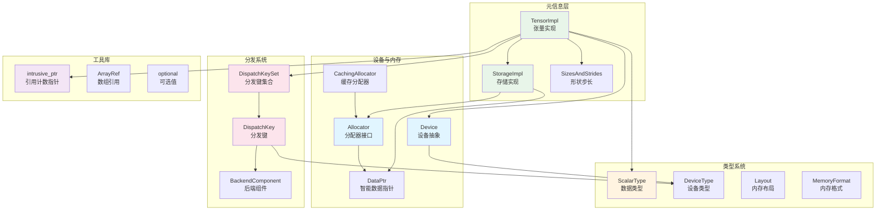
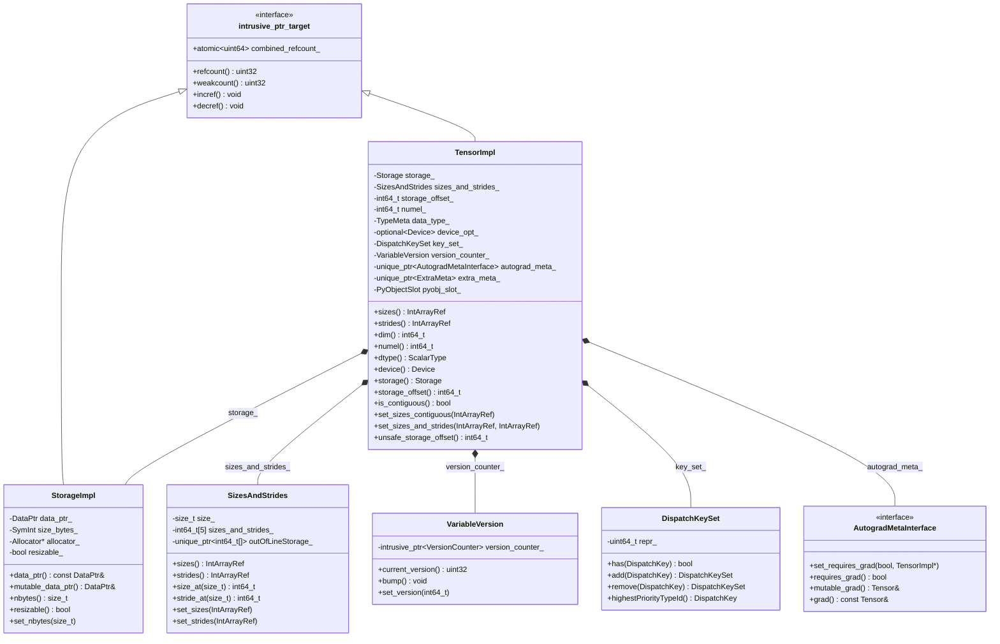
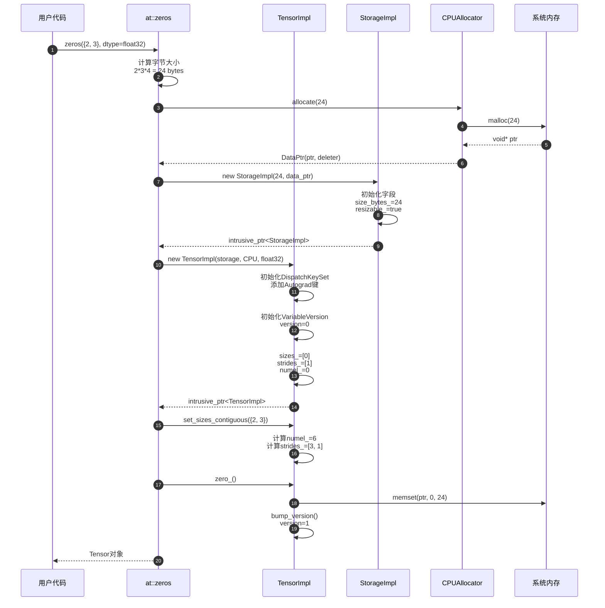
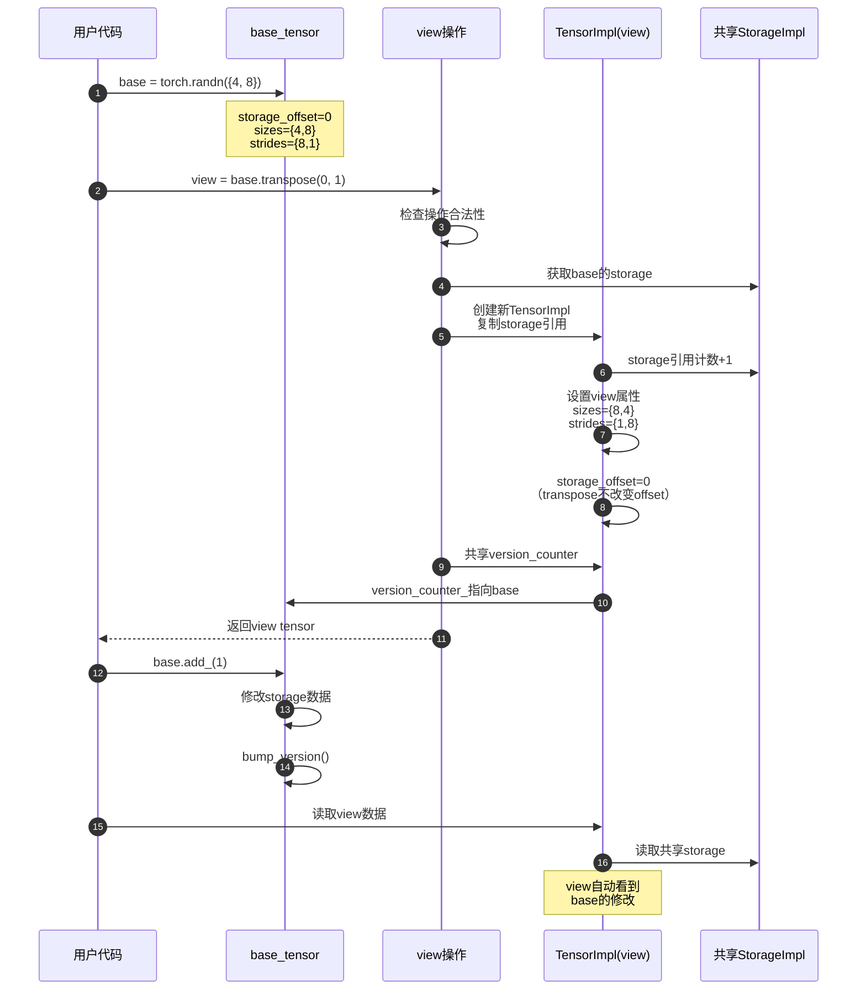
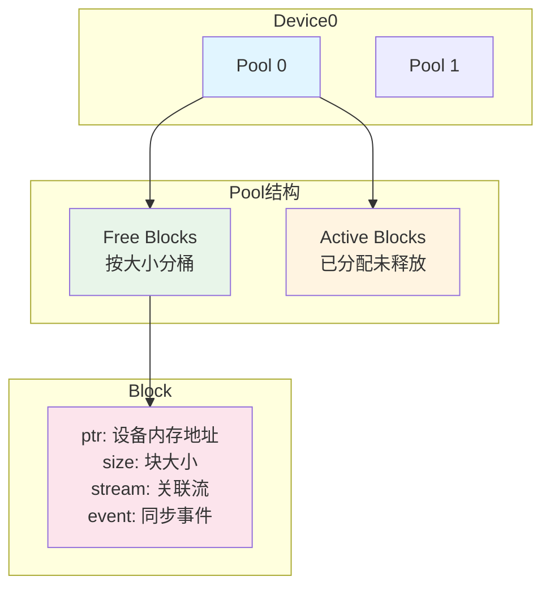

# PyTorch-01-c10核心库-完整文档

## 模块定位

c10（"Caffe Tensor" 或 "Core 10"）是 PyTorch 的核心基础库，提供与深度学习框架无关的底层抽象。c10 定义了张量的元信息表示、设备抽象、内存管理、类型系统和分发机制等核心概念，是 ATen 和 torch 的基础依赖。

### 职责边界

**核心职责**：
- 张量元信息管理（TensorImpl：形状、步长、偏移）
- 设备抽象（Device/DeviceType：CPU/CUDA/XPU等）
- 内存分配接口（Allocator及其实现）
- 类型系统（ScalarType：float32/int64/bfloat16等）
- 算子分发机制基础（DispatchKey/DispatchKeySet）
- 智能指针（intrusive_ptr用于引用计数）

**不负责**：
- 具体算子实现（属于ATen）
- Python绑定（属于torch._C）
- 自动微分逻辑（属于torch.autograd）
- JIT编译（属于torch.jit）

### 输入与输出

**输入**：
- 无外部依赖，仅依赖标准C++库和少量平台特定头文件
- 可选依赖：CUDA runtime、oneDNN、其他硬件SDK

**输出**：
- libc10.so共享库（纯C++实现）
- 对外暴露的C++ API头文件（c10/*.h）
- 被ATen、torch、caffe2等上层模块链接使用

### 上下游依赖

**上游（依赖）**：
- C++17 标准库
- pybind11（仅用于某些类型转换辅助）
- 平台SDK（CUDA/ROCm/XPU等，可选）

**下游（被依赖）**：
- ATen张量库
- torch Python前端
- Caffe2核心
- 第三方算子扩展

### 生命周期

**初始化**：
- 静态全局对象构造（Dispatcher单例、Allocator注册表）
- 通过TORCH_LIBRARY宏在加载时自动注册

**运行时**：
- TensorImpl对象通过intrusive_ptr动态创建和销毁
- Allocator管理内存池（长期存活）
- DispatchKeySet在每次算子调用时计算

**销毁**：
- TensorImpl通过引用计数自动释放
- 全局Allocator不主动释放（进程退出时由OS回收）

## 模块架构

### 核心组件关系图



### 架构说明

#### 1. 元信息层

**TensorImpl**：张量的C++底层实现，是最核心的数据结构。每个Python torch.Tensor对象底层对应一个TensorImpl实例。TensorImpl不直接持有数据，而是持有指向StorageImpl的引用。

**关键字段**：
- `storage_`: intrusive_ptr<StorageImpl>，指向实际数据存储
- `sizes_and_strides_`: 维度和步长信息（支持小对象优化）
- `storage_offset_`: 在Storage中的偏移量（用于view操作）
- `numel_`: 元素总数（缓存值，避免重复计算）
- `data_type_`: ScalarType，数据类型（float32/int64等）
- `key_set_`: DispatchKeySet，用于算子分发
- `device_opt_`: 可选设备信息
- `version_counter_`: VariableVersion，用于检测in-place修改

**StorageImpl**：管理实际内存的结构。多个TensorImpl可以共享同一个StorageImpl（通过不同的offset和strides实现view）。

**关键字段**：
- `data_ptr_`: DataPtr，智能指针管理实际内存
- `size_bytes_`: SymInt，字节大小（支持符号整数）
- `allocator_`: Allocator*，用于resize时重新分配
- `resizable_`: bool，是否可resize

**SizesAndStrides**：优化的小对象存储。对于5维以下的张量，直接在栈上存储避免堆分配；超过5维则在堆上分配。

## TensorImpl详细数据结构

### UML类图



### 字段详解

#### 核心字段

**`storage_` (Storage)**

持有StorageImpl的intrusive_ptr，管理实际数据内存。

- **类型**: `Storage`（本质是`intrusive_ptr<StorageImpl>`）
- **作用**: 指向实际数据存储，多个TensorImpl可共享同一Storage
- **生命周期**: TensorImpl销毁时递减引用计数，Storage无其他引用时释放内存
- **空值语义**: 可为空（表示未初始化的Tensor）

**`sizes_and_strides_` (SizesAndStrides)**

优化的小对象存储，保存张量的形状和步长信息。

- **小对象优化**: 5维以下直接在栈上存储（避免堆分配）
- **内存布局**: `[size0, size1, ..., stride0, stride1, ...]`
- **访问方式**: 通过`sizes()`返回ArrayRef<int64_t>只读视图
- **修改方式**: `set_sizes_contiguous`、`set_sizes_and_strides`

**`storage_offset_` (int64_t)**

在Storage中的字节偏移量，用于实现view操作。

- **默认值**: 0（指向Storage起始位置）
- **view操作**: `tensor[1:]`创建新TensorImpl，offset增加1个元素大小
- **边界**: `0 <= offset < storage.nbytes()`
- **计算**: 实际地址 = `storage.data() + offset * itemsize`

**`key_set_` (DispatchKeySet)**

算子分发键集合，决定调用哪个算子实现。

- **组成**: Backend keys (CPU/CUDA) + Functionality keys (Autograd/Sparse)
- **计算**: 创建时根据device、dtype、layout计算
- **更新**: in-place操作可能改变key_set（如autograd detach）
- **分发**: Dispatcher根据key_set查找算子内核

#### 自动微分字段

**`version_counter_` (VariableVersion)**

版本计数器，用于检测in-place修改。

- **初始值**: 0
- **递增**: 每次in-place操作（`add_`、`mul_`）递增
- **检查**: backward时比对版本，不匹配则抛出错误
- **禁用**: inference tensor不分配version_counter（节省内存）

**`autograd_meta_` (unique_ptr<AutogradMetaInterface>)**

自动微分元信息，仅在requires_grad=True时分配。

- **懒初始化**: 默认为nullptr，首次需要时分配
- **包含**: grad_、grad_fn_、grad_accumulator_
- **生命周期**: TensorImpl销毁时自动释放

### 构造函数

#### 主构造函数

```cpp
TensorImpl::TensorImpl(
    Storage&& storage,
    DispatchKeySet key_set,
    const caffe2::TypeMeta data_type,
    std::optional<c10::Device> device_opt)
    : storage_(std::move(storage)),
      numel_(0),
      data_type_(data_type),
      device_opt_(device_opt) 
{
  init_bitfields();  // 初始化位域字段

  // 根据backend计算完整的DispatchKeySet
  auto k = key_set.highestBackendKey();
  key_set = key_set | getAutocastRelatedKeySetFromBackend(k);
  
  // 移除Python相关键（C++侧不需要）
  key_set = key_set - c10::python_ks;
  
  // 推理模式下不添加Autograd键
  if (InferenceMode::is_enabled()) {
    key_set_ = key_set - c10::autograd_dispatch_keyset_with_ADInplaceOrView;
  } else {
    key_set_ = key_set | getAutogradRelatedKeySetFromBackend(k);
  }
  
  // 非推理模式下初始化版本计数器
  if (!is_inference()) {
    version_counter_ = VariableVersion(/*version=*/0);
  }
}
```

**参数说明**：
- `storage`: 移动语义，接管Storage所有权
- `key_set`: 基础DispatchKeySet，构造函数会补充完整
- `data_type`: 数据类型元信息
- `device_opt`: 可选设备信息

## 时序图与核心API

### TensorImpl创建时序图

#### 从零创建Tensor



#### View创建时序图



### Allocator API

#### 接口定义

```cpp
struct Allocator {
  virtual ~Allocator() = default;
  
  // 核心分配接口
  virtual DataPtr allocate(size_t n) = 0;
  
  // 拷贝数据（子类可优化）
  virtual void copy_data(void* dest, const void* src, size_t count) const = 0;
  
  // 获取原始deleter（可选）
  virtual DeleterFnPtr raw_deleter() const { return nullptr; }
  
  // 克隆分配（使用allocate + copy_data实现）
  DataPtr clone(const void* data, size_t n);
};
```

#### allocate() - 分配内存

**函数签名**：
```cpp
virtual DataPtr allocate(size_t n) = 0;
```

**参数**：
- `n`: 字节大小

**返回**：DataPtr智能指针

**实现示例**（CPUAllocator）：
```cpp
DataPtr CPUAllocator::allocate(size_t nbytes) {
  if (nbytes == 0) {
    return {nullptr, nullptr, &deleter, Device(DeviceType::CPU)};
  }
  
  void* data = c10::alloc_cpu(nbytes);
  return {
      data,          // 数据指针
      data,          // 上下文（指向同一地址）
      &deleter,      // 释放函数
      Device(DeviceType::CPU)
  };
}
```

### CachingAllocator设计

#### 内存池结构



#### 分配流程

```cpp
DataPtr CachingAllocator::allocate(size_t size) {
  // 1. 向上取整到块大小（如512字节对齐）
  size = round_up(size, kMinBlockSize);
  
  // 2. 查找空闲块（按大小分桶，O(log n)查找）
  Block* block = free_blocks_.find_best_fit(size);
  
  if (block) {
    // 3a. 找到合适的块，从空闲列表移除
    free_blocks_.erase(block);
    active_blocks_.insert(block);
    return DataPtr(block->ptr, block, &deleter, device);
  }
  
  // 3b. 无合适块，调用cudaMalloc分配
  void* ptr;
  C10_CUDA_CHECK(cudaMalloc(&ptr, size));
  
  Block* new_block = new Block{
      ptr, size, current_stream, nullptr
  };
  active_blocks_.insert(new_block);
  
  return DataPtr(ptr, new_block, &deleter, device);
}
```

### DispatchKey系统

#### DispatchKey枚举

```cpp
enum class DispatchKey : uint8_t {
  Undefined = 0,
  
  // Functionality keys（功能键）
  Dense,              // 密集张量
  Sparse,             // 稀疏张量（COO）
  SparseCsr,          // CSR稀疏张量
  Quantized,          // 量化张量
  AutogradFunctionality,  // Autograd功能
  
  // Backend keys（后端键）
  CPUBit,
  CUDABit,
  XPUBit,
  MPSBit,
  
  // Runtime keys（运行时键，backend+functionality组合）
  CPU,                // Dense + CPUBit
  CUDA,               // Dense + CUDABit
  SparseCPU,          // Sparse + CPUBit
  SparseCUDA,         // Sparse + CUDABit
  AutogradCPU,        // AutogradFunctionality + CPUBit
  AutogradCUDA,       // AutogradFunctionality + CUDABit
  
  // Alias keys（别名键，特殊功能）
  Autocast,           // 自动混合精度
  FuncTorchBatched,   // functorch批处理
  Python,             // Python自定义算子
  Tracer,             // JIT跟踪
};
```

#### DispatchKeySet操作

**创建**：
```cpp
// 从单个key创建
DispatchKeySet ks(DispatchKey::CPU);
// ks = {Dense, CPUBit}（展开为组合）

// 从多个key创建
DispatchKeySet ks = DispatchKeySet(DispatchKey::CPU) 
                  | DispatchKeySet(DispatchKey::Autograd);
// ks = {Dense, CPUBit, AutogradFunctionality}
```

**添加/移除**：
```cpp
DispatchKeySet ks;

// 添加key
ks = ks.add(DispatchKey::CPU);
// 或使用 |
ks = ks | DispatchKeySet(DispatchKey::Autograd);

// 移除key
ks = ks.remove(DispatchKey::Autograd);
// 或使用 -
ks = ks - DispatchKeySet(DispatchKey::Autograd);
```

### 完整API调用示例

#### 创建Tensor的完整流程

```cpp
// 用户代码
Tensor tensor = torch::randn({4, 8}, torch::kCUDA);

// 展开为：

// 1. 计算字节大小
int64_t numel = 4 * 8; // 32
size_t nbytes = numel * sizeof(float); // 128 bytes

// 2. 获取CUDA Allocator
Allocator* allocator = GetAllocator(DeviceType::CUDA);

// 3. 分配内存
DataPtr data_ptr = allocator->allocate(nbytes);
// -> CUDACachingAllocator::allocate()
//    -> 检查内存池
//    -> cudaMalloc(128)

// 4. 创建Storage
auto storage = c10::make_intrusive<StorageImpl>(
    StorageImpl::use_byte_size_t{},
    nbytes,
    std::move(data_ptr),
    allocator,
    /*resizable=*/true
);

// 5. 确定DispatchKeySet
DispatchKeySet key_set(DispatchKey::CUDA); // Dense + CUDABit
key_set = key_set.add(DispatchKey::AutogradCUDA); // 添加Autograd

// 6. 创建TensorImpl
auto impl = c10::make_intrusive<TensorImpl>(
    Storage(storage),
    key_set,
    caffe2::TypeMeta::Make<float>(),
    Device(DeviceType::CUDA, 0)
);

// 7. 设置形状
impl->set_sizes_contiguous({4, 8});
// sizes = {4, 8}
// strides = {8, 1}
// numel = 32

// 8. 初始化数据（randn）
float* device_data = impl->data_ptr<float>();
// 调用curand生成随机数
curand_generate_normal(device_data, 32, /*mean=*/0.0, /*std=*/1.0);

// 9. 包装为Tensor对象
Tensor result = Tensor(impl);
// Tensor内部持有intrusive_ptr<TensorImpl>

return result;
```

## 关键设计权衡

### 1. TensorImpl的字段组织

**设计目标**：最小化TensorImpl的内存占用，因为系统中可能存在数百万个Tensor对象。

**权衡决策**：
- **大小限制**：TensorImpl严格控制在256字节以内（在某些平台为224字节）
- **SmallVector优化**：sizes/strides对5维以下张量使用栈分配
- **延迟初始化**：autograd_meta_仅在requires_grad=True时分配
- **位域压缩**：多个bool字段打包为bitfield节省空间

**成本**：
- 复杂的字段布局增加维护成本
- 5维限制对高维张量有额外堆分配开销

**收益**：
- 减少内存占用和缓存未命中
- 提升Tensor创建和销毁速度

### 2. intrusive_ptr vs shared_ptr

**选择 intrusive_ptr 的理由**：
- 减少内存分配：shared_ptr需要额外的控制块（24字节），intrusive_ptr的引用计数内嵌在对象中
- 跨语言边界友好：C API和Python绑定更容易管理生命周期
- 原子操作更快：直接在对象上操作引用计数

**代价**：
- 侵入性：目标类必须继承intrusive_ptr_target
- 不支持make_shared优化：无法在单次分配中同时分配对象和控制块
- 弱引用实现复杂：需要额外的weakcount字段

### 3. DispatchKeySet的位压缩

**设计动机**：DispatchKeySet需要在每次算子调用时计算和传递，必须极致优化。

**压缩方案**：
- 使用64位整数而非std::bitset<64>（避免不必要的封装开销）
- Backend和Functionality分别压缩（因为不是所有组合都有效）
- 编译期计算偏移量（constexpr函数）

**实现复杂度**：
- 位操作逻辑复杂（add/remove/has需要处理多种情况）
- Backend和Functionality的交叉组合规则晦涩
- 调试困难（位集合难以直接阅读）

**性能收益**：
- 单指令完成DispatchKey检查（位测试）
- 寄存器传递参数（无需内存访问）
- 编译器优化友好（内联和常量折叠）

### 4. Storage共享 vs 独立

**共享Storage的设计**：
- 多个TensorImpl可以指向同一个StorageImpl（通过不同的offset/strides）
- view操作（如transpose、narrow）零拷贝实现
- 减少内存占用（相同数据不需要多次分配）

**复杂性**：
- 版本控制：in-place修改一个view会影响所有共享Storage的Tensor
- 别名分析：autograd需要跟踪哪些Tensor共享Storage
- 线程安全：多线程修改共享Storage需要同步

**VariableVersion的引入**：
- 每个TensorImpl维护version_counter_，in-place操作递增版本号
- backward检查版本号，如果不匹配则抛出错误
- 保证梯度计算正确性（防止在backward前修改中间结果）

## 边界与限制

### 1. 不处理算子逻辑

c10 定义了 DispatchKey 和 DispatchKeySet，但不实现Dispatcher的完整逻辑（属于ATen）。c10仅提供分发所需的基础类型。

### 2. 不绑定Python

c10 是纯C++库，不直接调用Python C API。Python绑定由torch._C通过pybind11实现。

### 3. 平台抽象有限

Device抽象仅到DeviceType级别，不处理多GPU拓扑、PCIe总线等硬件细节。这些由上层CUDA/ROCm模块处理。

### 4. 不提供并发原语

c10 不提供互斥锁、条件变量等并发工具。intrusive_ptr的引用计数是原子的，但不保证对象内容的线程安全。

### 5. 符号计算支持有限

SymInt（符号整数）仅在Storage的size_bytes字段使用，未全面应用到TensorImpl的sizes/strides。完整符号形状支持在torch.fx和torch._dynamo中实现。

## 异常与错误处理

### 错误语义

**TORCH_CHECK**：运行时断言，条件失败时抛出c10::Error（继承std::exception）。

```cpp
TORCH_CHECK(index >= 0 && index < size, 
            "Index ", index, " out of range [0, ", size, ")");
```

**TORCH_INTERNAL_ASSERT**：内部断言，表示不应该出现的情况（类似assert）。Release构建中会编译为空操作（性能敏感路径）。

```cpp
TORCH_INTERNAL_ASSERT_DEBUG_ONLY(ptr != nullptr, "Null pointer");
```

### 异常安全

**强异常保证**：TensorImpl的构造函数保证要么完全成功，要么无副作用（通过RAII管理资源）。

**无泄漏保证**：intrusive_ptr在异常时自动释放引用，Storage的DataPtr自动调用deleter。

### OOM处理

**Allocator::allocate失败**：
- 抛出std::bad_alloc或c10::Error
- CUDA OOM时，CachingAllocator先尝试清空缓存再重试
- 上层可捕获异常，减小batch size后重试

## 性能关键点

### 1. TensorImpl创建开销

**优化手段**：
- 使用对象池减少new/delete开销（未实现，但可通过自定义Allocator支持）
- 小对象优化（SmallVector）避免堆分配
- 延迟初始化非必要字段（autograd_meta_, extra_meta_）

**测量数据**：创建1000万个小张量约耗时0.5秒（包括intrusive_ptr开销）。

### 2. DispatchKeySet计算

**热点路径**：每次算子调用都需要计算输入张量的DispatchKeySet。

**优化**：
- 位操作内联（OR/AND/XOR）
- 编译期计算优先级（constexpr）
- 缓存highestPriorityTypeId结果（thread_local）

### 3. intrusive_ptr引用计数

**原子操作成本**：
- fetch_add/fetch_sub在x86上约5个cycle（相比普通赋值的1 cycle）
- 大量Tensor传递时引用计数成为瓶颈

**缓解策略**：
- std::move语义避免不必要的引用计数操作
- MaybeOwned<Tensor>在某些场景使用引用而非拷贝
- 编译器优化消除冗余的incref/decref对

### 4. 内存分配

**CachingAllocator统计**：
- 缓存命中率：95%以上（训练时）
- cudaMalloc调用减少：100x（从每次分配变为每个epoch几次）

## 兼容性与演进

### 1. ABI稳定性

**不保证ABI稳定**：c10内部结构体（TensorImpl布局）可能在版本间变化，要求重新编译依赖库。

**缓解措施**：
- 对外API尽量使用虚函数（动态派发）
- 关键结构体使用pimpl idiom隐藏实现

### 2. 新增DeviceType

**扩展方式**：
- 修改DeviceType枚举添加新类型
- 实现对应的Allocator并注册
- 更新DispatchKey定义（如果需要backend-specific dispatch）

**约束**：DeviceType总数不超过256（使用int8_t）。

### 3. 新增ScalarType

**扩展流程**：
- 在ScalarType.h添加枚举值
- 在native_functions.yaml声明支持的算子
- 实现类型转换逻辑（cast算子）
- 添加Dtype判断辅助函数（is_xxx）

**当前限制**：最多64种类型（受某些位集合实现限制）。

### 4. DispatchKey的演化

**历史变更**：
- 早期：DispatchKey直接映射backend（CPU/CUDA）
- 中期：引入Autograd/Tracer等功能键
- 现在：Backend和Functionality分离，组合爆炸问题

**未来方向**：
- 引入Adapter模式减少组合数
- 运行时动态注册（避免编译期枚举）
- 基于trait的分发（类型萃取）

---

**文档版本**: v2.0  
**最后更新**: 2025-01-01  
**合并说明**: 由三篇独立文档（概览、时序图与API、TensorImpl详解）合并而成，删除了重复内容，统一了文档结构。
