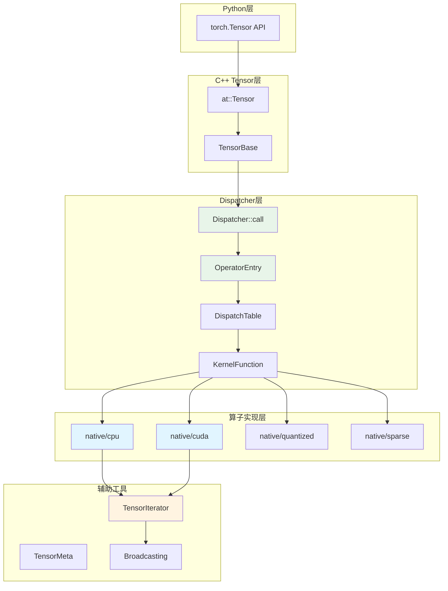
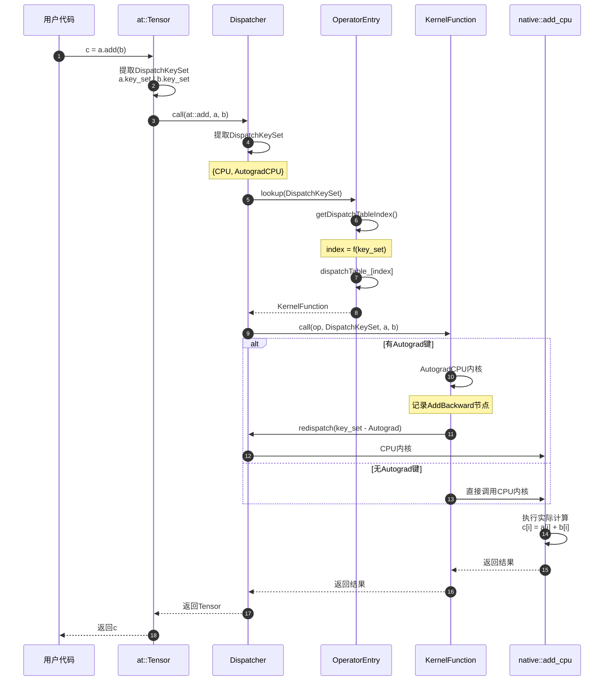

# PyTorch-02-ATen张量库

## 模块概览

ATen（"A Tensor library"）是 PyTorch 的核心张量运算库，提供2000+张量算子的实现，支持CPU、CUDA、量化等多种backend。ATen构建在c10之上，实现完整的Dispatcher调度系统和算子注册机制。

### 核心职责

- **算子分发**：Dispatcher系统根据DispatchKeySet动态路由到对应算子实现
- **算子实现**：native目录包含CPU/CUDA/量化等各backend的算子内核
- **TensorIterator**：元素级操作的高性能迭代器（处理广播、类型转换）
- **算子注册**：TORCH_LIBRARY/TORCH_LIBRARY_IMPL宏提供算子注册接口
- **Tensor类**：提供丰富的Python-style API（基于TensorImpl）

### 架构图



## Dispatcher调度系统

### Dispatcher单例

```cpp
class Dispatcher {
 public:
  // 获取全局单例
  static Dispatcher& singleton();
  
  // 调用算子（类型安全）
  template<class Return, class... Args>
  Return call(const TypedOperatorHandle<Return(Args...)>& op, Args... args) const;
  
  // 重新分发（用于递归调用）
  template<class Return, class... Args>
  Return redispatch(const TypedOperatorHandle<Return(Args...)>& op,
                    DispatchKeySet dispatchKeySet, Args... args) const;
  
  // 注册算子schema
  RegistrationHandleRAII registerDef(FunctionSchema schema);
  
  // 注册算子实现
  RegistrationHandleRAII registerImpl(
      OperatorHandle op,
      DispatchKey dispatch_key,
      KernelFunction kernel);
};
```

### 算子调用流程



### DispatchTable计算

```cpp
// OperatorEntry内部
const KernelFunction& OperatorEntry::lookup(DispatchKeySet ks) const {
  // 1. 计算dispatch table索引
  const auto idx = ks.getDispatchTableIndexForDispatchKeySet();
  if (C10_UNLIKELY(idx == -1)) {
    reportError(ks.highestPriorityTypeId());
  }
  
  // 2. 查表
  const auto& kernel = dispatchTable_[idx];
  
  // 3. 验证kernel有效性
  if (C10_UNLIKELY(!kernel.isValidUnboxed())) {
    if (!kernel.isValid()) {
      reportError(ks.highestPriorityTypeId());
    }
  }
  
  return kernel;
}
```

**DispatchTable索引计算**：
- 每个DispatchKeySet映射到一个唯一索引
- 索引预先计算并缓存（避免运行时计算）
- Table大小 ≈ 64（对应64个可能的dispatch key组合）

**Fallback机制**：
```cpp
// 如果找不到精确匹配的kernel，按优先级回退：
// 1. CompositeExplicitAutogradNonFunctional
// 2. CompositeExplicitAutograd  
// 3. CompositeImplicitAutograd
// 4. Math（通用实现）
// 5. 报错（NotImplementedError）
```

## 算子注册

### TORCH_LIBRARY宏

```cpp
// 定义新算子namespace
TORCH_LIBRARY(myops, m) {
  // 仅声明schema（无实现）
  m.def("add(Tensor self, Tensor other) -> Tensor");
  
  // 声明并提供默认实现
  m.def("mul(Tensor self, Tensor other) -> Tensor", &mul_impl);
  
  // 声明inplace算子
  m.def("add_(Tensor(a!) self, Tensor other) -> Tensor(a!)");
}
```

**Schema语法**：
- `Tensor(a!)`: inplace修改（别名分析）
- `Tensor?`: 可选参数
- `int[2]`: 固定大小数组
- `int[]`: 可变大小数组
- `*`: 剩余位置参数
- `**`: 剩余关键字参数

### TORCH_LIBRARY_IMPL宏

```cpp
// 为特定backend实现算子
TORCH_LIBRARY_IMPL(myops, CPU, m) {
  m.impl("add", &add_cpu);
  m.impl("mul", &mul_cpu);
}

TORCH_LIBRARY_IMPL(myops, CUDA, m) {
  m.impl("add", &add_cuda);
  m.impl("mul", &mul_cuda);
}

TORCH_LIBRARY_IMPL(myops, Autograd, m) {
  m.impl("add", &add_autograd);  // 包装为autograd版本
}
```

### 内核函数签名

```cpp
// CPU内核示例
Tensor add_cpu(const Tensor& self, const Tensor& other) {
  // 1. 分配输出
  Tensor result = at::empty_like(self);
  
  // 2. 使用TensorIterator
  auto iter = TensorIteratorConfig()
      .add_output(result)
      .add_input(self)
      .add_input(other)
      .build();
  
  // 3. 调用kernel实现
  add_kernel_cpu(iter);
  
  return result;
}
```

## TensorIterator

### 设计目的

TensorIterator是元素级操作的统一接口，自动处理：
- **Broadcasting**：自动扩展形状不匹配的维度
- **类型转换**：输入输出类型不同时自动转换
- **内存布局**：优化连续/非连续内存访问
- **并行化**：自动切分workload到多线程

### 配置与构建

```cpp
// 典型用法
auto iter = TensorIteratorConfig()
    .add_output(output)         // 输出tensor
    .add_input(input1)          // 输入1
    .add_input(input2)          // 输入2
    .check_all_same_dtype(false) // 允许不同dtype
    .promote_inputs_to_common_dtype(true) // 自动类型提升
    .cast_common_dtype_to_outputs(true)  // 输出时类型转换
    .enforce_safe_casting_to_output(true) // 安全类型转换
    .build();
```

### Broadcasting规则

```cpp
// 示例：add操作的broadcasting
Tensor a = torch::randn({3, 1});      // [3, 1]
Tensor b = torch::randn({1, 4});      // [1, 4]
Tensor c = a.add(b);                  // [3, 4]

// TensorIterator自动处理：
// 1. 对齐shape：
//    a: [3, 1]
//    b: [1, 4]
// 2. 扩展到相同shape：
//    a_expanded: [3, 4]（stride=[1, 0]，虚拟扩展）
//    b_expanded: [3, 4]（stride=[0, 1]，虚拟扩展）
// 3. 输出shape: [3, 4]
```

### 内核执行

```cpp
// CPU内核
void add_kernel_cpu(TensorIteratorBase& iter) {
  // Lambda定义element-wise操作
  cpu_kernel(iter, [](float a, float b) -> float {
    return a + b;
  });
}

// cpu_kernel展开为：
template<typename func_t>
void cpu_kernel(TensorIteratorBase& iter, func_t op) {
  // 1. 获取迭代器元数据
  int64_t numel = iter.numel();
  int ntensors = iter.ntensors();
  
  // 2. 并行化（如果numel > GRAIN_SIZE）
  at::parallel_for(0, numel, GRAIN_SIZE, [&](int64_t begin, int64_t end) {
    // 3. 获取数据指针
    char* data[ntensors];
    for (int i = 0; i < ntensors; ++i) {
      data[i] = iter.data_ptr(i);
    }
    
    // 4. 遍历并调用op
    for (int64_t i = begin; i < end; ++i) {
      // 计算偏移（考虑strides和broadcasting）
      int64_t offset[ntensors];
      iter.compute_strides(i, offset);
      
      // 类型转换并调用op
      float* out = reinterpret_cast<float*>(data[0] + offset[0]);
      float a = *reinterpret_cast<float*>(data[1] + offset[1]);
      float b = *reinterpret_cast<float*>(data[2] + offset[2]);
      
      *out = op(a, b);
    }
  });
}
```

### CUDA内核

```cpp
void add_kernel_cuda(TensorIteratorBase& iter) {
  gpu_kernel(iter, []GPU_LAMBDA(float a, float b) -> float {
    return a + b;
  });
}

// gpu_kernel展开为CUDA kernel launch
template<typename func_t>
void gpu_kernel(TensorIteratorBase& iter, func_t op) {
  // 1. 计算grid和block size
  int64_t numel = iter.numel();
  dim3 grid = (numel + 255) / 256;
  dim3 block = 256;
  
  // 2. 准备kernel参数
  TensorIteratorConfig config = iter.get_config();
  
  // 3. Launch kernel
  add_kernel_cuda_impl<<<grid, block, 0, iter.get_stream()>>>(
      config, op, numel
  );
}
```

## 核心算子实现示例

### at::add实现

```cpp
// aten/src/ATen/native/BinaryOps.cpp

// 算子声明（在native_functions.yaml）
// - func: add.Tensor(Tensor self, Tensor other, *, Scalar alpha=1) -> Tensor

// CPU实现
Tensor add_cpu(const Tensor& self, const Tensor& other, const Scalar& alpha) {
  // 1. 类型检查
  TORCH_CHECK(self.scalar_type() == other.scalar_type(),
              "add: expected self and other to have same dtype");
  
  // 2. 分配输出（自动推断输出shape）
  Tensor result = at::empty_like(self);
  
  // 3. 构建TensorIterator
  auto iter = TensorIteratorConfig()
      .add_output(result)
      .add_input(self)
      .add_input(other)
      .build();
  
  // 4. 分发到kernel
  add_stub(iter.device_type(), iter, alpha);
  
  return result;
}

// kernel实现（aten/src/ATen/native/cpu/BinaryOpsKernel.cpp）
void add_kernel_cpu(TensorIteratorBase& iter, const Scalar& alpha) {
  AT_DISPATCH_ALL_TYPES(iter.dtype(), "add_cpu", [&] {
    scalar_t alpha_val = alpha.to<scalar_t>();
    cpu_kernel(iter, [alpha_val](scalar_t a, scalar_t b) -> scalar_t {
      return a + alpha_val * b;
    });
  });
}

// 注册
REGISTER_DISPATCH(add_stub, &add_kernel_cpu);
```

### at::matmul实现

```cpp
// aten/src/ATen/native/LinearAlgebra.cpp

Tensor matmul(const Tensor& tensor1, const Tensor& tensor2) {
  // 1. 维度检查
  auto dim_tensor1 = tensor1.dim();
  auto dim_tensor2 = tensor2.dim();
  
  // 2. 分情况处理
  if (dim_tensor1 == 1 && dim_tensor2 == 1) {
    // 向量点积
    return tensor1.dot(tensor2);
  } else if (dim_tensor1 == 2 && dim_tensor2 == 1) {
    // 矩阵-向量乘法
    return tensor1.mv(tensor2);
  } else if (dim_tensor1 == 1 && dim_tensor2 == 2) {
    // 向量-矩阵乘法
    return tensor1.unsqueeze(0).mm(tensor2).squeeze(0);
  } else if (dim_tensor1 == 2 && dim_tensor2 == 2) {
    // 矩阵-矩阵乘法
    return tensor1.mm(tensor2);
  } else if (dim_tensor1 >= 3 && (dim_tensor2 == 1 || dim_tensor2 == 2)) {
    // 批量矩阵乘法
    return at::_unsafe_view(tensor1.mv(tensor2.t()), ...);
  } else {
    // 批量矩阵乘法（通用）
    return at::bmm(
        tensor1.reshape({-1, tensor1.size(-2), tensor1.size(-1)}),
        tensor2.reshape({-1, tensor2.size(-2), tensor2.size(-1)})
    ).reshape(...);
  }
}

// CPU矩阵乘法（调用BLAS）
Tensor mm_cpu(const Tensor& self, const Tensor& mat2) {
  Tensor result = at::empty({self.size(0), mat2.size(1)}, self.options());
  
  // 调用BLAS：result = self * mat2
  at::native::cpublas::gemm(
      'N', 'N',  // No transpose
      mat2.size(1), self.size(0), self.size(1),  // M, N, K
      1.0,  // alpha
      mat2.data_ptr<float>(), mat2.stride(1),
      self.data_ptr<float>(), self.stride(1),
      0.0,  // beta
      result.data_ptr<float>(), result.stride(1)
  );
  
  return result;
}

// CUDA矩阵乘法（调用cuBLAS）
Tensor mm_cuda(const Tensor& self, const Tensor& mat2) {
  Tensor result = at::empty({self.size(0), mat2.size(1)}, self.options());
  
  at::cuda::blas::gemm(
      'n', 'n',
      mat2.size(1), self.size(0), self.size(1),
      1.0f,
      mat2.data_ptr<float>(), mat2.stride(1),
      self.data_ptr<float>(), self.stride(1),
      0.0f,
      result.data_ptr<float>(), result.stride(1)
  );
  
  return result;
}
```

## 性能优化

### 1. Kernel Fusion

```cpp
// 未融合：3个kernel launch
Tensor x = a.add(b);
Tensor y = x.mul(c);
Tensor z = y.relu();

// 融合：1个kernel（JIT自动实现）
Tensor z = torch::jit::fuse_add_mul_relu(a, b, c);
// 等价于：z[i] = relu((a[i] + b[i]) * c[i])
```

### 2. In-place操作

```cpp
// Out-of-place（分配新tensor）
Tensor c = a.add(b);  // 分配c

// In-place（复用a的内存）
a.add_(b);  // 无额外分配
```

### 3. Vectorization

```cpp
// TensorIterator自动向量化（AVX2/AVX512）
// 标量代码：
for (int i = 0; i < n; ++i) {
  c[i] = a[i] + b[i];
}

// 向量化代码（8 floats/iteration）：
for (int i = 0; i < n; i += 8) {
  __m256 va = _mm256_loadu_ps(&a[i]);
  __m256 vb = _mm256_loadu_ps(&b[i]);
  __m256 vc = _mm256_add_ps(va, vb);
  _mm256_storeu_ps(&c[i], vc);
}
```

### 4. 内存对齐

```cpp
// TensorIterator优化内存访问模式
// 连续内存：
Tensor a = torch::randn({1000, 1000});  // row-major
a.sum(1);  // 按行求和，cache友好

// 非连续内存：
Tensor b = a.transpose(0, 1);  // column-major（逻辑上）
b.sum(1);  // 按列求和，cache不友好
// TensorIterator会重新组织循环顺序优化访问
```

---

**文档版本**: v1.0  
**最后更新**: 2025-01-01

